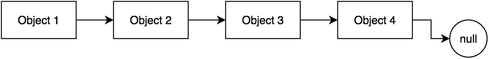
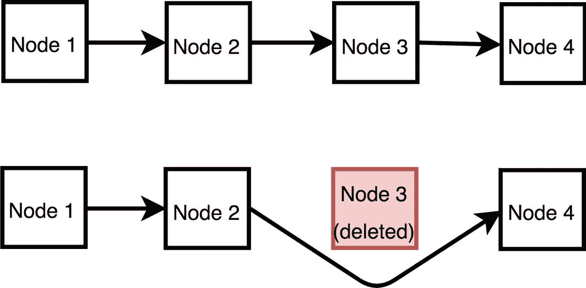
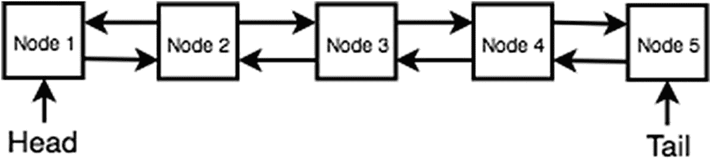

# 13.链接列表

本章将介绍链表。*链表*是一种数据结构，其中每个节点指向另一个节点。与固定大小的数组不同，链表是一种动态数据结构，可以在运行时分配和释放内存。本章结束时，你将理解如何实现和使用链表。

本章讨论了两种类型的链表:*单向*和*双向*链表。我们先来考察一下单链表。

## 单链表

链表数据结构是每个*节点*(元素)都引用下一个节点(见图 [13-1](#Fig1) )。



图 13-1

单向链表

单链表中的一个节点有以下属性:`data`和`next`。`data`是链表节点的值，`next`是指向`SinglyLinkedListNode`的另一个实例的指针。

```js
1   function SinglyLinkedListNode(data) {
2       this.data = data;
3       this.next = null;
4   }

```

以下代码是单向链表示例的基础。你可以在 GitHub 上找到代码。 <sup>[1](#Fn1)</sup> 代码块有一个 helper 函数，用来检查单链表是否为空。

```js
1   function SinglyLinkedList(){
2           this.head = null;
3           this.size = 0;
4   }
5
6   SinglyLinkedList.prototype.isEmpty = function(){
7           return this.size == 0;
8   }

```

链表的开始被称为*头*。在向链表中插入任何元素之前，该属性默认为`null`。

### 插入

下面的代码块演示如何插入到单链表中。如果链表的头为空，则将头设置为新节点。否则，旧堆保存在`temp`中，新堆头成为新添加的节点。最后，新头的`next`指向了`temp`(旧头)。

```js
 1   SinglyLinkedList.prototype.insert = function(value) {
 2       if (this.head === null) { //If first node
 3           this.head = new SinglyLinkedListNode(value);
 4       } else {
 5           var temp = this.head;
 6           this.head = new SinglyLinkedListNode(value);
 7           this.head.next = temp;
 8       }
 9       this.size++;
10   }
11   var sll1 = new SinglyLinkedList();
12   sll1.insert(1); // linked list is now: 1 -> null
13   sll1.insert(12); // linked list is now: 12 -> 1 -> null
14   sll1.insert(20); // linked list is now: 20 -> 12 -> 1 -> null

```

**时间复杂度:** O( *1*

这是一个恒定时间操作；不需要循环或遍历。

### 按值删除

单链表中节点的删除是通过移除该节点的引用来实现的。如果节点在链表的“中间”，这是通过让指向该节点的`next`指针指向该节点自己的`next`节点来实现的，如图 [13-2](#Fig2) 所示。



图 13-2

从单链表中删除内部节点

如果该节点位于链表的末尾，那么倒数第二个元素可以通过将其`next`设置为`null`来取消对该节点的引用。

```js
 1   SinglyLinkedList.prototype.remove = function(value) {
 2       var currentHead = this.head;
 3       if (currentHead.data == value) {
 4           // just shift the head over. Head is now this new value
 5           this.head = currentHead.next;
 6           this.size--;
 7       } else {
 8           var prev = currentHead;
 9           while (currentHead.next) {
10               if (currentHead.data == value) {
11                   // remove by skipping
12                   prev.next = currentHead.next;
13                   prev = currentHead;
14                   currentHead = currentHead.next;
15                   break; // break out of the loop
16               }
17               prev = currentHead;
18               currentHead = currentHead.next;
19           }
20           //if wasn't found in the middle or head, must be tail
21           if (currentHead.data == value) {
22               prev.next = null;
23           }
24           this.size--;
25       }
26   }
27   var sll1 = new SinglyLinkedList();
28   sll1.insert(1); // linked list is now:  1 -> null
29   sll1.insert(12); // linked list is now: 12 -> 1 -> null
30   sll1.insert(20); // linked list is now: 20 -> 12 -> 1 -> null
31   sll1.remove(12); // linked list is now: 20 -> 1 -> null
32   sll1.remove(20); // linked list is now: 1 -> null

```

**时间复杂度:** O( *n*

在最坏的情况下，必须遍历整个链表。

### 开头删除

在 O(1)中删除链表头部的元素是可能的。当从头部删除一个节点时，不需要遍历。下面的代码块显示了这种删除的实现。这允许链表实现堆栈。最后添加的项目(到头部)可以在 O(1)中移除。

```js
 1   DoublyLinkedList.prototype.deleteAtHead = function() {
 2       var toReturn = null;
 3
 4       if (this.head !== null) {
 5           toReturn = this.head.data;
 6
 7           if (this.tail === this.head) {
 8               this.head = null;
 9               this.tail = null;
10           } else {
11               this.head = this.head.next;
12               this.head.prev = null;
13           }
14       }
15       this.size--;
16       return toReturn;
17   }
18   var sll1 = new SinglyLinkedList();
19   sll1.insert(1); // linked list is now:  1 -> null
20   sll1.insert(12); // linked list is now: 12 -> 1 -> null
21   sll1.insert(20); // linked list is now: 20 -> 12 -> 1 -> null
22   sll1.deleteAtHead(); // linked list is now:  12 -> 1 -> null

```

### 搜索

为了找出一个值是否存在于一个单链表中，需要简单的遍历所有的`next`指针。

```js
 1   SinglyLinkedList.prototype.find = function(value) {
 2       var currentHead = this.head;
 3       while (currentHead.next) {
 4           if (currentHead.data == value) {
 5               return true;
 6           }
 7           currentHead = currentHead.next;
 8       }
 9       return false;
10   }

```

**时间复杂度:** O( *n*

像删除操作一样，在最坏的情况下，必须遍历整个链表。

## 双向链表

双向链表可以被认为是双向单向链表。双向链表中的每个节点都有一个`next`指针和一个`prev`指针。下面的代码块实现了双向链表节点:

```js
1   function DoublyLinkedListNode(data) {
2       this.data = data;
3       this.next = null;
4       this.prev = null;
5   }

```

此外，双向链表有头指针和尾指针。头是指双向链表的开头，尾是指双向链表的结尾。这在下面的代码中实现，并带有一个帮助器函数来检查双向链表是否为空:

```js
1   function DoublyLinkedList (){
2           this.head = null;
3           this.tail = null;
4           this.size = 0;
5  }
6   DoublyLinkedList.prototype.isEmpty = function(){
7           return this.size == 0;
8   }

```

双向链表中的每个节点都有`next`和`prev`属性。双向链表中的删除、插入和搜索实现类似于单向链表。然而，对于插入和删除，必须更新`next`和`prev`属性。图 [13-3](#Fig3) 显示了一个双向链表的例子。



图 13-3

具有五个节点的双向链表示例

### 在头部插入

插入双向链表的头部与插入单向链表是一样的，除了它还必须更新`prev`指针。下面的代码块显示了如何插入到双向链表中。如果链表的头为空，则头和尾被设置为新的节点。这是因为当只有一个元素时，该元素既是头部也是尾部。否则，`temp`变量用于存储新节点。新节点的`next`指向当前头，然后当前头的`prev`指向新节点。最后，头指针被更新到新节点。

```js
 1   DoublyLinkedList.prototype.addAtFront = function(value) {
 2       if (this.head === null) { //If first node
 3           this.head = new DoublyLinkedListNode(value);
 4           this.tail = this.head;
 5       } else {
 7           var temp = new DoublyLinkedListNode(value);
 8           temp.next = this.head;
 9           this.head.prev = temp;
10           this.head = temp;
11       }
12       this.size++;
13   }
14   var dll1 = new DoublyLinkedList();
15   dll1.insertAtHead(10); // ddl1's structure: tail: 10  head: 10
16   dll1.insertAtHead(12); // ddl1's structure: tail: 10  head: 12
17   dll1.insertAtHead(20); // ddl1's structure: tail: 10  head: 20

```

**时间复杂度:** O(1)

### 尾部插入

类似地，可以向双向链表的尾部添加一个新节点，如下面的代码块所示:

```js
 1   DoublyLinkedList.prototype.insertAtTail = function(value) {
 2       if (this.tail === null) { //If first node
 3           this.tail = new DoublyLinkedListNode(value);
 4           this.head = this.tail;
 5       } else {
 6           var temp = new DoublyLinkedListNode(value);
 7           temp.prev = this.tail;
 8           this.tail.next = temp;
 9           this.tail = temp;
10       }
11       this.size++;
12   }
13
14   var dll1 = new DoublyLinkedList();
15   dll1.insertAtHead(10); // ddl1's structure: tail: 10  head: 10
16   dll1.insertAtHead(12); // ddl1's structure: tail: 10  head: 12
17   dll1.insertAtHead(20); // ddl1's structure: tail: 10  head: 20
18   dll1.insertAtTail(30); // ddl1's structure: tail: 30  head: 20

```

**时间复杂度:** O(1)

### 开头删除

从双向链表中移除头部的节点可以在 O(1)时间内完成。如果头尾相同的情况下只有一项，那么头尾都设置为`null`。否则，头部被设置为头部的`next`指针。最后，将新头的`prev`设置为`null`以移除旧头的引用。这在下面的代码块中实现。这很棒，因为它可以像队列数据结构中的`dequeue`函数一样使用。

```js
 1   DoublyLinkedList.prototype.deleteAtHead = function() {
 2       var toReturn = null;
 3
 4       if (this.head !== null) {
 5           toReturn = this.head.data;
 6
 7           if (this.tail === this.head) {
 8               this.head = null;
 9               this.tail = null;
10           } else {
11               this.head = this.head.next;
12               this.head.prev = null;
13           }
14       }
15       this.size--;
16       return toReturn;
17   }

```

**时间复杂度:** O(1)

### 尾部删除

与移除头部节点类似，尾部节点可以在 O(1)时间内移除并返回，如下面的代码块所示。由于具有在尾部移除的能力，双向链表也可以被认为是一种双向队列数据结构。队列可以将第一个添加的项出队，但是双向链表可以在 O(1)时间内将尾部的项或头部的项出队。

```js
 1   DoublyLinkedList.prototype.deleteAtTail = function() {
 2       var toReturn = null;
 3
 4       if (this.tail !== null) {
 5           toReturn = this.tail.data;
 6
 7           if (this.tail === this.head) {
 8               this.head = null;
 9               this.tail = null;
10           } else {
11               this.tail = this.tail.prev;
12               this.tail.next = null;
13           }
14       }
15       this.size--;
16       return toReturn;
17   }
18   var dll1 = new DoublyLinkedList();
19   dll1.insertAtHead(10); // ddl1's structure: tail: 10  head: 10
20   dll1.insertAtHead(12); // ddl1's structure: tail: 10  head: 12
21   dll1.insertAtHead(20); // ddl1's structure: tail: 10  head: 20
22   dll1.insertAtTail(30); // ddl1's structure: tail: 30  head: 20
23   dll1.deleteAtTail();
24   // ddl1's structure: tail: 10  head: 20

```

**时间复杂度:** O(1)

### 搜索

要找出一个值是否存在于双向链表中，可以从头部开始使用`next`指针，或者从`tail`开始使用`prev`指针。以下代码块与单链表搜索实现相同，它从头部开始查找项:

```js
 1   DoublyLinkedList.prototype.findStartingHead = function(value) {
 2       var currentHead = this.head;
 3       while(currentHead.next){
 4           if(currentHead.data == value){
 5               return true;
 6           }
 7           currentHead = currentHead.next;
 8       }
 9       return false;
10   }
11   var dll1 = new DoublyLinkedList();
12   dll1.insertAtHead(10); // ddl1's structure: tail: 10  head: 10
13   dll1.insertAtHead(12); // ddl1's structure: tail: 10  head: 12
14   dll1.insertAtHead(20); // ddl1's structure: tail: 10  head: 20
15   dll1.insertAtTail(30); // ddl1's structure: tail: 30  head: 20
16   dll1.findStartingHead(10); // true
17   dll1.findStartingHead(100); // false

```

**时间复杂度:** O( *n*

以下代码使用`prev`指针从尾部开始遍历双向链表:

```js
 1   DoublyLinkedList.prototype.findStartingTail = function(value) {
 2       var currentTail = this.tail;
 3       while (currentTail.prev){
 4           if(currentTail.data == value){
 5               return true;
 6           }
 7           currentTail = currentTail.prev;
 8       }
 9       return false;
10   }
11
12   var dll1 = new DoublyLinkedList();
13   dll1.insertAtHead(10); // ddl1's structure: tail: 10  head: 10
14   dll1.insertAtHead(12); // ddl1's structure: tail: 10  head: 12
15   dll1.insertAtHead(20); // ddl1's structure: tail: 10  head: 20
16   dll1.insertAtTail(30); // ddl1's structure: tail: 30  head: 20
17   dll1.findStartingTail(10); // true
18   dll1.findStartingTail(100); // false

```

**时间复杂度:** O( *n*

虽然搜索的时间复杂度与单链表的搜索相同，但是只有双向链表可以双向搜索(使用`prev`或`next`)。这意味着如果给定一个对双向链表节点的引用，双向链表可以执行完全搜索，但是单向链表仅限于它的`next`指针。

## 摘要

链表数据结构的工作原理是，每个节点都有一个指向不同节点的下一个指针(以及前一个指针，如果是双重链接，则为`prev`指针)。单向链表和双向链表的插入都具有恒定的时间复杂度 O(1)。从单链表和双向链表的头部删除的时间复杂度也是 O(1)。然而，在单向链表和双向链表中搜索一个条目需要 O( *n* )时间。当需要双向遍历/搜索时，双向链表应该比单向链表使用得多。此外，双向链表允许您从链表的尾部或头部弹出，以实现灵活快速的 O(1)运算。

## 练习

你可以在 GitHub 上找到所有练习的代码。 <sup>[2](#Fn2)</sup>

### 反转单向链表

要反转单向链表，只需遍历每个节点，并将当前节点的`next`属性设置为前一个节点。

```js
 1   function reverseSingleLinkedList(sll){
 2           var node = sll.head;
 3           var prev = null;
 4           while(node){
 5                   var temp = node.next;
 6                   node.next = prev;
 7                   prev = node;
 8                   if(!temp)
 9                           break;
10                   node = temp;
11           }
12           return node;
13   }

```

**时间复杂度:** O( *n*

**空间复杂度:** O(1)

要完全反转一个链表，必须遍历链表的全部 *N* 个元素。

### 删除链接列表中的重复项

删除链表中的项目很简单。简单地在一个数组中迭代和存储访问过的节点。如果当前元素之前已经出现过，则删除当前元素。

```js
 1   // delete duplicates in unsorted linkedlist
 2   function deleteDuplicateInUnsortedSll(sll1) {
 3       var track = [];
 4
 5       var temp = sll1.head;
 6       var prev = null;
 7       while (temp) {
 8           if (track.indexOf(temp.data) >= 0) {
 9               prev.next = temp.next;
10              sll1.size--;
11           } else {
12               track.push(temp.data);
13               prev = temp;
14           }
15           temp = temp.next;
16       }
17       console.log(temp);
18   }

```

**时间复杂度:**O(*n*T4】2

**空间复杂度:** O( *n*

但是，这个算法必须用`.indexOf()`方法迭代数组，这是 O( *n* )以及迭代 *n* 次。因此在时间复杂度上是 O( *n* <sup>*2*</sup> )。另外，`track`数组增长到了 *N* 的大小，这导致空间复杂度为 O( *n* )。让我们把时间复杂度降低到 O( *n* )。

```js
 1   //delete duplicates in unsorted linkedlist
 2   function deleteDuplicateInUnsortedSllBest(sll1) {
 3       var track = {};
 4
 5       var temp = sll1.head;
 6       var prev = null;
 7       while (temp) {
 8           if (track[temp.data]) {
 9               prev.next = temp.next;
10              sll1.size--;
11           } else {
12               track[temp.data] = true;
13               prev = temp;
14           }
15           temp = temp.next;
16       }
17       console.log(temp);
18   }

```

**时间复杂度:** O( *n*

**空间复杂度:** O( *n*

使用 JavaScript `Object`作为哈希表来存储和检查可见的元素，将空间减少到 O( *n* )但是 O( *n* )因为哈希表需要额外的内存。

<aside class="FootnoteSection" epub:type="footnotes">Footnotes [1](#Fn1_source)

[T2`https://github.com/Apress/js-data-structures-and-algorithms`](https://github.com/Apress/js-data-structures-and-algorithms)

  [2](#Fn2_source)

[T2`https://github.com/Apress/js-data-structures-and-algorithms`](https://github.com/Apress/js-data-structures-and-algorithms)

 </aside>