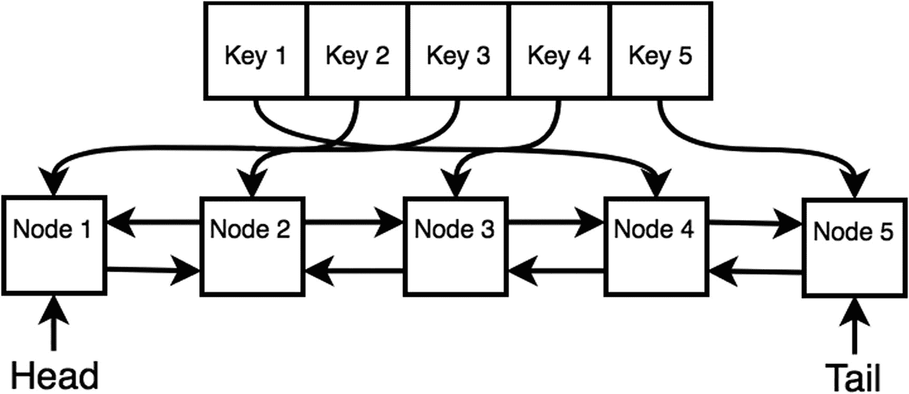

# 十四、缓存

*缓存*是将数据存储到临时存储器中的过程，以便日后再次需要时可以轻松检索。例如，数据库系统缓存数据以避免重新读取硬盘，web 浏览器缓存网页(图像和素材)以避免重新下载内容。简而言之，在缓存中，目标是最大化命中(请求时项目在缓存中)和最小化未命中(请求时项目不在缓存中)。

本章将讨论两种缓存技术:最少使用的(LFU)和最近最少使用的(LRU)缓存。

### 注意

缓存的概念来自操作系统领域。你可以在滑铁卢大学的杰夫·扎奈特的演讲中了解更多。

## 了解缓存

高速缓存设计通常考虑这两个因素:

*   *时间局部性*:最近被访问过的存储器位置很可能再次被访问。

*   *空间位置*:最近被访问过的存储器位置附近的存储器位置很可能再次被访问。

最佳缓存算法将能够用要插入的新元素来替换缓存中在将来最远处使用的部分。对于每个项目，这将需要计算该项目在未来将被访问多少次。你应该很清楚这是不可能实现的，因为它需要展望未来。

## 最不常用的缓存

*最不频繁使用的**(LFU)缓存是操作系统用来管理内存的一种缓存算法。系统跟踪内存中块被引用的次数。根据设计，当缓存超过其限制时，系统会删除引用频率最低的项目。LFU 缓存最简单的实现是为加载到缓存中的每个块分配一个计数器，并在每次引用该块时递增一个计数器。当缓存超过其限制时，系统会搜索计数器最低的块，并将其从缓存中删除。*

 *尽管 LFU 缓存看起来是一种直观的方法，但当内存中的某个项被短期重复引用且不再被访问时，这种方法并不理想。由于其重复引用，该块的频率较高，但是这迫使系统删除在短时间块之外可能更频繁使用的其他块。此外，系统中的新项目很容易被快速删除，因为它们被访问的频率较低。由于这些问题，LFU 是不常见的，但一些混合系统利用核心 LFU 概念。这种系统的例子是移动键盘应用。建议的单词出现在键盘应用程序上，使用 LFU 缓存来实现这一点是有意义的，因为用户可能经常使用相同的单词。一个单词的出现频率将是一个很好的衡量该单词是否应该存在于缓存中的标准。

LFU 缓存使用双向链表在 O(1)时间内移除元素。LFUs 中的双重链接节点也有`freqCount`属性，它表示在第一次插入后它被访问/设置的频率。

```js
 1   function LFUNode(key, value) {
 2       this.prev = null;
 3       this.next = null;
 4       this.key = key;
 5       this.data = value;
 6       this.freqCount = 1;
 7   }

```

LFU 缓存有两个散列表:`keys`和`freq` *。* `freq`有 frequency 键(1 到 *n* ，其中 *n* 是元素访问的最高频率)，每一项都是一个双向链表类的实例。`keys`存储每个双向链表节点，用于 O(1)检索。双向链表和 LFU 缓存的类定义如下:

```js
 1   function LFUDoublyLinkedList(){
 2       this.head = new LFUNode('buffer head',null);
 3       this.tail = new LFUNode('buffer tail',null);
 4       this.head.next = this.tail;
 5       this.tail.prev = this.head;
 6       this.size = 0;
 7   }
 8
 9   function LFUCache(capacity){
10       this.keys = {}; // stores LFUNode
11       this.freq = {}; // stores LFUDoublyLinkedList
12       this.capacity = capacity;
13       this.minFreq = 0;
14       this.size =0;
15   }

```

`LFUDoublyLinkedList`类也需要双向链表来实现插入和移除。然而，只需要在头部插入和在尾部移除。该实现与第 [13 章](13.html)(链表)中所示的双向链表类的实现相同。

```js
 1   LFUDoublyLinkedList.prototype.insertAtHead = function(node) {
 2       node.next = this.head.next;
 3       this.head.next.prev = node;
 4       this.head.next = node;
 5       node.prev = this.head;
 6       this.size++;
 7   }
 8
 9   LFUDoublyLinkedList.prototype.removeAtTail = function() {
10       var oldTail = this.tail.prev;
11       var prev = this.tail.prev;
12       prev.prev.next = this.tail;
13       this.tail.prev = prev.prev;
14       this.size--;
15       return oldTail;
16   }
17
18   LFUDoublyLinkedList.prototype.removeNode = function(node) {
19       node.prev.next = node.next
20       node.next.prev = node.prev
21       this.size--;
22   }

```

LFU 的实施有几个步骤。有两种情况:插入新项目和替换旧项目。插入新项目时，会创建一个新节点。如果缓存未满，可以将其插入到`freq`的频率为 1 的双向链表中。如果容量已满，则删除频率双向链表中的尾项，然后插入新节点。

如果该元素已经存在并且需要被替换，则该节点被带到其对应的频率双向链表的头部。最后，最小频率变量`minFreq`相应地递增，以计算将来应该驱逐哪个项目。

```js
 1   LFUCache.prototype.set = function(key, value) {
 2       var node = this.keys[key];
 3
 4       if (node == undefined) {
 5           node = new LFUNode(key, value);
 6
 7           this.keys[key] = node;
 8
 9           if (this.size != this.capacity) {
10               // insert without deleting
11               if (this.freq[1] === undefined){
12                   this.freq[1] = new LFUDoublyLinkedList();
13               }
14               this.freq[1].insertAtHead(node);
15               this.size++;
16           } else {
17               // delete and insert
18               var oldTail = this.freq[this.minFreq].removeAtTail();
19               delete this.keys[oldTail.key];
20
21               if (this.freq[1] === undefined){
22                   this.freq[1] = new LFUDoublyLinkedList();
23               }
24
25               this.freq[1].insertAtHead(node);
26           }
27           this.minFreq = 1;
28       } else {
29           var oldFreqCount = node.freqCount;
30           node.data = value;
31           node.freqCount++;
32
33           this.freq[oldFreqCount].removeNode(node);
34
35           if (this.freq[node.freqCount] === undefined){
36               this.freq[node.freqCount] = new LFUDoublyLinkedList();
37           }
38
39           this.freq[node.freqCount].insertAtHead(node);
40
41           if (oldFreqCount == this.minFreq && Object.keys(this.freq[oldFreqCount]).size == 0) {
42               this.minFreq++;
43           }
44
45       }
46   }

```

为了实现`get`，缓存需要在 O(1)时间内返回现有的节点，并增加访问的计数器。如果缓存中不存在该元素，则强制返回一个空元素。否则，增加元素的频率，将项目放在双向链表的头部，并相应地调整最小频率变量`minFreq`。

```js
 1   LFUCache.prototype.get = function(key) {
 2       var node = this.keys[key];
 3
 4       if (node == undefined) {
 5           return null;
 6       } else {
 7
 8           var oldFreqCount = node.freqCount;
 9           node.freqCount++;
10
11           this.freq[oldFreqCount].removeNode(node);
12
13           if (this.freq[node.freqCount] === undefined){
14               this.freq[node.freqCount] = new LFUDoublyLinkedList();
15           }
16
17           this.freq[node.freqCount].insertAtHead(node);
18
19           if (oldFreqCount == this.minFreq && Object.keys(this.freq[oldFreqCount]).length == 0) {
20               this.minFreq++;
21           }
22           return node.data;
23       }
24   }

```

定义了所有函数后，以下代码显示了 LFU 用法的一个示例:

```js
 1   var myLFU = new LFUCache(5);
 2   myLFU.set(1, 1); // state of myLFU.freq: {1: 1}
 3   myLFU.set(2, 2); // state of myLFU.freq: {1: 2<->1}
 4   myLFU.set(3, 3); // state of myLFU.freq: {1: 3<->2<->1}
 5   myLFU.set(4, 4); // state of myLFU.freq: {1: 4<->3<->2<->1}
 6   myLFU.set(5, 5); // state of myLFU.freq: {1: 5<->4<->3<->2<->1}
 7   myLFU.get(1); // returns 1, state of myLFU.freq: {1: 5<->4<->3<->2, 2: 1}
 8   myLFU.get(1); // returns 1, state of myLFU.freq: {1: 5<->4<->3<->2, 3: 1}
 9   myLFU.get(1); // returns 1, state of myLFU.freq:{1: 5<->4<->3<->2, 4: 1}
10   myLFU.set(6, 6); // state of myLFU.freq: {1: 6<->5<->4<->3, 4: 1}
11   myLFU.get(6); // state of myLFU.freq: {1: 5<->4<->3, 4: 1, 2: 6}

```

## 最近最少使用的缓存

*最近最少使用的* *使用的* (LRU)缓存是一种缓存算法，它首先删除最旧的(最近最少使用的)项，因此被替换的项是最早访问的项。当访问高速缓存中的项目时，该项目移动到列表的后面(顺序中最新的)。当访问在高速缓存中没有找到的页面时，前面的项目(或顺序中最老的)被移除，而新的项目被放在列表的后面(顺序中最新的)。

该算法的实现需要跟踪何时使用了哪个节点。为了实现这一点，LRU 缓存是使用双向链表和哈希表实现的。

需要一个双向链表来跟踪头部(最老的数据)。因为最近使用的需求，所以需要双向链表。每次插入新数据时，头部都会向上移动，直到超出大小。那么最老的数据被驱逐。

图 [14-1](#Fig1) 显示了一个大小为 5 的 LRU 缓存的示意图。



图 14-1

LRU 高速缓存

为了实现 LRU 缓存，节点的定义类似于第 [13 章](13.html)中的双向链表节点。该节点还有一个`key`属性，其实现如下面的代码块所示:

```js
 1   function DLLNode(key, data) {
 2       this.key = key;
 3       this.data = data;
 4       this.next = null;
 5       this.prev = null;
 6   }

```

可以通过传递参数`capacity`来初始化 LRU 缓存。`capacity`定义缓存中允许有多少个节点。

```js
 1   function LRUCache(capacity) {
 2       this.keys = {};
 3       this.capacity = capacity;
 4       this.head = new DLLNode(", null);
 5       this.tail = new DLLNode(", null);
 6       this.head.next = this.tail;
 7       this.tail.prev = this.head;
 8   }

```

由于 LRU 缓存使用双向链表，这里将定义两个函数，用于删除一个节点和添加一个节点到尾部:

```js
 1   LRUCache.prototype.removeNode = function(node) {
 2       var prev = node.prev,
 3           next = node.next;
 4       prev.next = next;
 5       next.prev = prev;
 6   }
 7
 8   LRUCache.prototype.addNode = function(node) {
 9       var realTail = this.tail.prev;
10       realTail.next = node;
11
12       this.tail.prev = node;
13       node.prev = realTail;
14       node.next = this.tail;
15   }

```

还需要定义两个函数:`get`和`set`。每当调用`get`时，LRU 缓存方案将该节点放在双向链表的头部，因为它是最近使用的节点。这与删除和添加节点是一样的。对于通过`set`设置节点，LRU 缓存上的`keys`属性用于存储节点，以保持在`get`的 O(1)时间内检索。但是，如果缓存达到最大容量，它会从尾部逐出最远的节点。

```js
 1   LRUCache.prototype.get = function(key) {

 2       var node = this.keys[key];
 3       if (node == undefined) {
 4           return null;
 5       } else {
 6           this.removeNode(node);
 7           this.addNode(node);
 8           return node.data;
 9       }
10   }
11
12   LRUCache.prototype.set = function(key, value) {

13       var node = this.keys[key];
14       if (node) {
15           this.removeNode(node);
16       }
17
18       var newNode = new DLLNode(key, value);
19
20       this.addNode(newNode);
21       this.keys[key] = newNode;
22
23       // evict a node
24       if (Object.keys(this.keys).length > this.capacity) {
25           var realHead = this.head.next;
26           this.removeNode(realHead);
27           delete this.keys[realHead.key];
28       }
29   }

```

最后，下面是一个大小为 5 的 LRU 缓存的示例:

```js
 1   var myLRU = new LRUCache(5);
 2
 3   myLRU.set(1, 1); // 1
 4   myLRU.set(2, 2); // 1 <-> 2
 5   myLRU.set(3, 3); // 1 <-> 2 <-> 3
 6   myLRU.set(4, 4); // 1 <-> 2 <-> 3 <-> 4
 7   myLRU.set(5, 5); // 1 <-> 2 <-> 3 <-> 4 <-> 5
 8
 9
10   myLRU.get(1);   // 2 <-> 3 <-> 4 <-> 5 <-> 1
11   myLRU.get(2);   // 3 <-> 4 <-> 5 <-> 1 <-> 2
12
13   myLRU.set(6, 6);// 4 <-> 5 <-> 1 <-> 2 <-> 6
14   myLRU.set(7, 7);// 5 <-> 1 <-> 2 <-> 6 <-> 7
15   myLRU.set(8, 8);// 1 <-> 2 <-> 6 <-> 7 <-> 8

```

## 摘要

本章介绍了两个主要的缓存概念:最少使用和最近最少使用。这一章谈到了最佳缓存算法的概念，这是不可能实现的，但提供了一个你想要近似的概念。LFU 缓存听起来很棒，因为它使用频率来确定应该驱逐哪个节点，但是 LFU 在大多数情况下不如 LRU，因为它没有考虑时间局部性。还有其他的缓存算法，但是大多数算法在一般情况下都比较差，比如最近没有使用的算法和先进先出算法。最后，需要注意的是，鉴于现实生活中系统行为工作负载的许多已知数据，LRU 在大多数情况下是最有效的算法。表 [14-1](#Tab1) 总结了缓存算法。

表 14-1

缓存摘要

<colgroup><col class="tcol1 align-left"> <col class="tcol2 align-left"></colgroup> 
| 

算法

 | 

评论

 |
| --- | --- |
| 最佳的 | 不可能实现 |
| 最不常用 | 对时间局部性不利 |
| 最近最少使用 | 使用双向链接+ hashmap |

<aside class="FootnoteSection" epub:type="footnotes">Footnotes [1](#Fn1_source)

[T2`https://github.com/jzarnett/ece254/blob/master/lectures/L21-slides-Memory_Segmentation_Paging.pdf`](https://github.com/jzarnett/ece254/blob/master/lectures/L21-slides-Memory_Segmentation_Paging.pdf)

 </aside>*