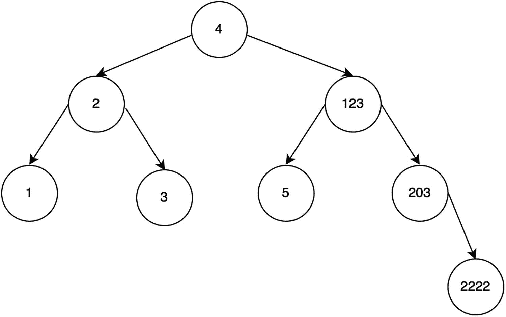

# 十五、树

一般的树数据结构由带有子节点的节点组成。第一个/顶层节点被称为根节点。本章将探讨许多不同类型的树，如二叉树、二分搜索法树和自平衡二分搜索法树。首先，本章将介绍什么是树以及它们是如何构成的。然后，它将详细介绍遍历树数据结构的方法。最后，您将学习二分搜索法树和自平衡二分搜索法树，了解如何存储易于搜索的数据。

## 一般树形结构

一个普通的树数据结构看起来如图 15-1 所示，它可以有任意数量的孩子。


图 15-1

具有任意数量子树的广义树

图 15-1 树中节点的代码块如下:

```js
1   function TreeNode(value){
2       this.value = value;
3       this.children = [];
4   }

```

## 二叉树

*二叉树*是一种只有两个子节点的树:左和右。参见下面的代码和图 15-2 :


图 15-2

*二叉树*

```js
1   function BinaryTreeNode(value) {
2       this.value = value;
3       this.left = null;
4       this.right = null;
5   }

```

二叉树总是有一个根节点(顶部的节点)，在插入任何元素之前，它被初始化为`null`。

```js
1   function BinaryTree(){
2       this._root = null;
3   }

```

## 树遍历

遍历数组很简单:使用索引访问树，并递增索引，直到索引达到大小限制。对于树，为了遍历树中的每个元素，必须跟随左右指针。当然，有各种方法可以做到这一点；最流行的遍历技术是前序遍历、后序遍历、按序遍历和层次序遍历。

GitHub 上提供了所有的树遍历代码。 <sup>1</sup>

### 前序遍历

*前序遍历*按以下顺序访问节点:根(当前节点)、左、右。在图 15-3 中，可以看到 42 是根，所以先访问它。然后向左走；此时，父根(41)的左边现在被认为是新的根。这个新的根(41)被打印；然后它又向左走到 10。因此，10 被设置为新的根，但没有子节点就无法继续。那么 40 被访问，因为这是前一个父(41)的权利。这个过程继续，整个订单由图 15-3 中的灰色方块表示。


图 15-3

前序遍历

递归地，这很容易实现。当节点为`null`时，基本情况终止。否则，它将打印节点值，然后对其左侧子节点和右侧子节点调用递归函数。

```js
 1   BinaryTree.prototype.traversePreOrder = function() {
 2       traversePreOrderHelper(this._root);
 3
 4       function traversePreOrderHelper(node) {
 5           if (!node)
 6               return;
 7           console.log(node.value);
 8           traversePreOrderHelper(node.left);
 9           traversePreOrderHelper(node.right);
10       }
11   }

```

这也可以迭代完成，但是实现起来比较困难。

```js
 1   BinaryTree.prototype.traversePreOrderIterative = function() {
 2       //create an empty stack and push root to it
 3       var nodeStack = [];
 4       nodeStack.push(this._root);
 5
 6       //  Pop all items one by one. Do following for every popped item
 7       //   a) print it
 8       //   b) push its right child
 9       //   c) push its left child
10       // Note that right child is pushed first so that left
11       // is processed first */
12       while (nodeStack.length) {
13           //# Pop the top item from stack and print it
14           var node = nodeStack.pop();
15           console.log(node.value);
16
17           //# Push right and left children of the popped node to stack
18           if (node.right)
19               nodeStack.push(node.right);
20           if (node.left)
21               nodeStack.push(node.left);
22       }
23   }

```

下面是结果:[42，41，10，40，50，45，75]。

### 有序遍历

有序遍历按以下顺序访问节点:左、根(当前节点)、右。对于图 15-4 所示的树，灰色方块表示有序遍历顺序。如您所见，首先打印 10(最左边的节点)，最后打印 7(最右边的节点)。


图 15-4

有序遍历

用递归也可以很容易地实现有序遍历。基本情况是当一个节点是`null`时。在非基本情况下，它调用左边子节点上的递归函数，打印当前节点，然后调用右边子节点上的递归函数。

```js
 1   BinaryTree.prototype.traverseInOrder = function() {
 2       traverseInOrderHelper(this._root);
 3
 4       function traverseInOrderHelper(node) {
 5           if (!node)
 6               return;
 7           traverseInOrderHelper(node.left);
 8           console.log(node.value);
 9           traverseInOrderHelper(node.right);
10       }
11   }
12
13   BinaryTree.prototype.traverseInOrderIterative = function() {
14       var current = this._root,
15           s = [],
16           done = false;
17
18       while (!done) {
19           // Reach the left most Node of the current Node
20           if (current != null) {
21               // Place pointer to a tree node on the stack
22               // before traversing the node's left subtree
23               s.push(current);
24               current = current.left;
25           } else {
26               if (s.length) {
27                   current = s.pop();
28                   console.log(current.value);
29                   current = current.right;
30               } else {
31                   done = true;
32               }
33           }
34       }
35   }

```

下面是这次遍历的结果:[10，41，40，42，45，50，75]。

### 后序遍历

*后序遍历*按以下顺序访问节点:左、右、根(当前节点)。对于图 15-5 所示的树，灰色方块表示有序遍历顺序。如您所见，首先打印 10(最左边的节点)，最后打印 42(根节点)。


图 15-5

后序遍历

代码如下:

```js
 1   BinaryTree.prototype.traversePostOrder = function() {
 2       traversePostOrderHelper(this._root);
 3
 4       function traversePostOrderHelper(node) {
 5           if (node.left)
 6               traversePostOrderHelper(node.left);
 7           if (node.right)
 8               traversePostOrderHelper(node.right);
 9           console.log(node.value);
10       }
11   }
12
13   BinaryTree.prototype.traversePostOrderIterative = function() {
14       // Create two stacks
15       var s1 = [],
16           s2 = [];
17
18       // Push root to first stack
19           s1.push(this._root);
20
21       //# Run while first stack is not empty
22       while (s1.length) {
23           // Pop an item from s1 and append it to s2
24           var node = s1.pop();
25           s2.push(node);
26
27           // Push left and right children of removed item to s1
28           if (node.left)
29               s1.push(node.left);
30           if (node.right)
31               s1.push(node.right);
32       }
33       // Print all elements of second stack
34       while (s2.length) {
35           var node = s2.pop();
36           console.log(node.value);
37       }
38   }

```

结果是这样的:[10，40，41，45，75，50，42]。

### 层次顺序遍历

*层次顺序遍历*，如图 15-6 所示，又称*广度优先搜索* (BFS)。


图 15-6

层次顺序遍历

更多内容将在第十七章中介绍，但这种方法本质上是逐层访问每个节点，而不是深入左侧或右侧。

```js
 1   BinaryTree.prototype.traverseLevelOrder = function() {
 2       // Breath first search
 3       var root = this._root,
 4           queue = [];
 5
 6       if (!root)
 7           return;
 8       queue.push(root);
 9
10       while (queue.length) {
11           var temp = queue.shift();
12           console.log(temp.value);
13           if (temp.left)
14               queue.push(temp.left);
15           if (temp.right)
16               queue.push(temp.right);
17       }
18   }

```

下面是结果:[42，41，50，10，40，45，75]。

### 树遍历摘要

如果您知道您需要在检查任何叶子之前探索根，选择前序遍历，因为您将在所有叶子之前遇到所有的根。

如果您知道您需要在任何节点之前探索所有的叶子，选择后序遍历，因为您在搜索叶子时不会浪费任何时间来检查根。

如果您知道树在节点中有一个固有的序列，并且您想要将树展平到它的原始序列，那么您应该使用有序遍历。该树将以创建时的方式展平。前序或后序遍历可能不会将树展开回创建它时的顺序。

**时间复杂度:** O( *n*

任何这些遍历的时间复杂度是相同的，因为每个遍历都需要访问所有节点。

## 二分搜索法树

二分搜索法树(BST)也有两个孩子，左和右。然而，在二叉查找树中，左边的孩子比父母小，右边的孩子比父母大。BST 具有这种结构，因为这种特性使得搜索、插入和删除特定值的时间复杂度为 O(log <sub>2</sub> ( *n* ))。

图 15-7 显示了 BST 属性。1 比 2 小，所以是 2 的左子，由于 3 比 3 大，所以是 2 的右子。


图 15-7

二叉查找树

二分搜索法树有一个根节点(最顶端的节点)，它最初被初始化`null`(在插入任何项目之前)。

```js
1   function BinarySearchTree(){
2       this._root = null;
3   }

```

图 15-7 也显示了一个平衡的二叉查找树，通过在左右两侧都有孩子来最小化高度。然而，图 15-8 显示了一个不平衡的树，其中子节点仅位于父节点的右侧。这对数据结构有很大的影响，增加了插入、删除和搜索的时间复杂度，从 O(log <sub>2</sub> ( *n* ))增加到 O( *n* )。完美平衡的树的高度是 log <sub>2</sub> ( *n* )，而不平衡的树在最坏的情况下可以是 *n* 。


图 15-8

不平衡的二叉查找树

### 插入

插入 BST 需要几个步骤。首先，如果根是空的，那么根将成为新的节点。否则，使用`while`循环遍历 BST，直到满足正确的条件。在每次循环迭代中，检查新节点是大于还是小于`currentRoot`。

```js
 1   BinarySearchTree.prototype.insert =  function(value) {
 2       var thisNode = {left: null, right: null, value: value};
 3       if(!this._root){
 4           //if there is no root value yet
 5           this._root = thisNode;
 6       }else{
 7           //loop traverse until
 8           var currentRoot = this._root;
 9           while(true){
10               if(currentRoot.value>value){
11                   //let's increment if it's not a null and insert if it is a null
12                   if(currentRoot.left!=null){
13                       currentRoot = currentRoot.left;
14                   }else{
15                       currentRoot.left = thisNode;
16                       break;
17                   }
18               } else if (currentRoot.value<value){
19                   //if bigger than current, put it on the right
20                   //let's increment if it's not a null and insert if it is a null
21                   if(currentRoot.right!=null){
22                       currentRoot = currentRoot.right;
23                   }else{
24                       currentRoot.right = thisNode;
25                       break;
26                   }
27               } else {
28                   //case that both are the same
29                   break;
30               }
31           }
32       }
33   }

```

**时间复杂度(对于平衡树):**O(*log*<sub>2</sub>(*n*))

**时间复杂度(对于不平衡树):** O( *n*

时间复杂度取决于二叉查找树的高度。

### 删除

该算法首先遍历树，专门寻找具有指定值的节点。找到节点后，有三种可能的情况:

*   **案例 1:节点没有子节点。**

    这是最简单的情况。如果节点没有子节点，则返回`null`。该节点现在已被删除。

*   **案例 2:节点有一个子节点。**

    如果节点只有一个子节点，只需返回现有的子节点。那个孩子现在已经长大并取代了父母。

*   **案例 3:节点有两个子节点。**

    如果节点有两个子节点，要么找到左子树的最大值，要么找到右子树的最小值来替换该节点。

下面的代码实现了上述三种情况。首先，它递归遍历，直到满足其中一种情况，然后删除节点。

```js
 1   BinarySearchTree.prototype.remove = function(value) {
 2
 3       return deleteRecursively(this._root, value);
 4
 5       function deleteRecursively(root, value) {
 6           if (!root) {
 7               return null;
 8           } else if (value < root.value) {
 9               root.left = deleteRecursively(root.left, value);
10           } else if (value > root.value) {
11               root.right = deleteRecursively(root.right, value);
12           } else {
13               //no child
14               if (!root.left && !root.right) {
15                   return null; // case 1
16               } else if (!root.left) { // case 2
17                   root = root.right;
18                   return root;
19               } else if (!root.right) { // case 2
20                   root = root.left;
21                   return root;
22               } else {
23                   var temp = findMin(root.right); // case 3
24                   root.value = temp.value;
25                   root.right = deleteRecursively(root.right, temp.value);
26                   return root;
27               }
28           }
29           return root;
30       }
31
32       function findMin(root) {
33           while (root.left) {
34               root = root.left;
35           }
36           return root;
37       }
38   }

```

**时间复杂度(对于平衡树):**O(*log*<sub>2</sub>(*n*))

**时间复杂度(对于不平衡树):** O( *n*

删除的时间复杂度也是 O(*log*<sub>2</sub>(*n*))，因为最多需要遍历这个高度来找到并删除想要的节点。

### 搜索

可以使用 BST 节点的左子节点总是小于其父节点并且 BST 节点的右子节点总是大于其父节点的属性来执行搜索。遍历树可以通过检查`currentRoot`是否小于或大于要搜索的值来完成。如果`currentRoot`较小，则访问正确的孩子。如果`currentRoot`更大，则访问左边的孩子。

```js
 1   BinarySearchTree.prototype.findNode = function(value) {
 2       var currentRoot = this._root,
 3           found = false;
 4       while (currentRoot) {
 5           if (currentRoot.value > value) {
 6               currentRoot = currentRoot.left;
 7           } else if (currentRoot.value < value) {
 8               currentRoot = currentRoot.right;
 9           } else {
10               //we've found the node
11               found = true;
12               break;
13           }
14       }
15       return found;
16   }
17   var bst1 = new BinarySearchTree();
18   bst1.insert(1);
19   bst1.insert(3);
20   bst1.insert(2);
21   bst1.findNode(3); // true
22   bst1.findNode(5); // false

```

**时间复杂度(对于平衡树):**O(*log*<sub>2</sub>(*n*))

**时间复杂度(对于不平衡树):** O( *n*

注意，所有操作的时间复杂度都等于二叉树搜索的高度。对于不平衡的二分搜索法树，时间复杂度很高。为了解决这个问题，有二分搜索法树家族确保高度平衡。这种自平衡树的一个例子是 AVL 树。

## AVL 树

AVL 是一个自我平衡的二叉查找树；它是以发明家乔治·阿德尔森-维尔斯基和叶夫根尼·兰迪斯的名字命名的。AVL 树将 BST 高度保持在最小，并确保 O(*log*<sub>2</sub>(*n*))的时间复杂度用于搜索、插入和删除。在前面的例子中，我们定义了`TreeNode`和`Tree`类，并将`Tree`的根设置为`TreeNode`类。然而，对于 AVL 树实现，只有代表 AVL 树节点的`AVLTree`类将被用于简化代码。

```js
 1   function AVLTree (value) {
 2       this.left = null;
 3       this.right = null;
 4       this.value = value;
 5       this.depth = 1;
 6   }

```

AVL 树的高度基于子树的高度，可以使用以下代码块来计算:

```js
 1   AVLTree.prototype.setDepthBasedOnChildren = function() {
 2       if (this.node == null) {
 3           this.depth = 0;
 4       } else {
 5           this.depth = 1;
 6       }
 7
 8       if (this.left != null) {
 9           this.depth = this.left.depth + 1;
10       }
11       if (this.right != null && this.depth <= this.right.depth) {
12           this.depth = this.right.depth + 1;
13       }
14   }

```

### 单次旋转

AVL 树旋转他们的孩子来保持插入后的平衡。

#### 左旋 90 度

这是一个节点必须向左旋转的例子。节点 40 的子节点 45 和 47 导致高度不平衡，如图 15-9 所示。45 成为图 15-10 中的父节点，以平衡 BST。


图 15-10

之后向左旋转


图 15-9

之前向左旋转

要执行向左旋转，首先获取左边的子元素并存储它。这才是“原本”的左孩子。最初的左子节点现在将成为该节点的父节点。将节点的左子节点设置为原左子节点的左子节点。最后，将原左子的右子设置为节点。

```js
 1   AVLTree.prototype.rotateLL = function() {
 2
 3       var valueBefore = this.value;
 4       var rightBefore = this.right;
 5       this.value = this.left.value;
 6
 7       this.right = this.left;
 8       this.left = this.left.left;
 9       this.right.left = this.right.right;
10       this.right.right = rightBefore;
11       this.right.value = valueBefore;
12
13       this.right.getDepthFromChildren();
14       this.getDepthFromChildren();
15   };

```

#### 右旋 90 度

这是一个节点必须向右旋转的例子。60 的孩子，55 和 52 的节点，导致高度不平衡，如图 15-11 。55 节点成为图 15-12 中的父节点，以平衡 BST。


图 15-12

右后旋转


图 15-11

之前向右旋转

要实现前面描述的算法，首先获取左边的子元素并存储它。这是最初的左孩子。最初的左子节点现在将成为该节点的父节点。将节点的左子节点设置为原左子节点的左子节点。最后，将原左子的右子设置为节点。

```js
 1   AVLTree.prototype.rotateRR = function() {
 2       // the right side is too long => rotate from the right (_not_ rightwards)
 3       var valueBefore = this.value;
 4       var leftBefore = this.left;
 5       this.value = this.right.value;
 6
 7       this.left = this.right;
 8       this.right = this.right.right;
 9       this.left.right = this.left.left;
10       this.left.left = leftBefore;
11       this.left.value = valueBefore;
12
13       this.left.updateInNewLocation();
14       this.updateInNewLocation();
15   }

```

### 双旋转

如果 AVL 树在一次旋转后仍然不平衡，它必须旋转两次以达到完全平衡。

#### 左右旋转(先右后左)

在本例中，图 15-13 显示了高度为 3 的 BST。先右后左旋转，如图 15-14 和图 15-15 所示，达到平衡。


图 15-15

之后向左旋转


图 15-14

先向右旋转


图 15-13

先向右旋转，然后向左旋转是合适的

#### 向左向右旋转(先左后右)

同样，在本例中，图 15-16 显示了高度为 3 的 BST。先左后右旋转，如图 15-17 和图 15-18 所示，达到平衡。


图 15-18

右后旋转


图 15-17

先向左旋转


图 15-16

先向左旋转，然后向右旋转是合适的

### 平衡树

要检查 AVL 树的平衡，只需简单比较左右儿童的身高。如果高度不平衡，就需要旋转。当左大于右时，左旋转完成。当右大于左时，右旋转完成。

```js
 1   AVLTree.prototype.balance = function() {
 2       var ldepth = this.left == null ? 0 : this.left.depth;
 3       var rdepth = this.right == null ? 0 : this.right.depth;
 4
 5       if (ldepth > rdepth + 1) {
 6       // LR or LL rotation
 7           var lldepth = this.left.left == null ? 0 : this.left.left.depth;
 8           var lrdepth = this.left.right == null ? 0 : this.left.right.depth;
 9
10           if (lldepth < lrdepth) {
11               // LR rotation consists of a RR rotation of the left child
12               this.left.rotateRR();
13               // plus a LL rotation of this node, which happens anyway
14           }
15           this.rotateLL();
16       } else if (ldepth + 1 < rdepth) {
17           // RR or RL rorarion
18           var rrdepth = this.right.right == null ? 0 : this.right.right.depth;
19           var rldepth = this.right.left == null ? 0 : this.right.left.depth;
20
21           if (rldepth > rrdepth) {
22               // RR rotation consists of a LL rotation of the right child
23               this.right.rotateLL();
24               // plus a RR rotation of this node, which happens anyway
25           }
26           this.rotateRR();
27       }
28   }

```

### 插入

AVL BST 中的插入与普通 BST 中的插入是一样的，除了一旦插入，父节点必须平衡其子节点并设置正确的深度。

```js
 1   AVLTree.prototype.insert = function(value) {
 2       var childInserted = false;
 3       if (value == this.value) {
 4           return false; // should be all unique
 5       } else if (value < this.value) {
 6           if (this.left == null) {
 7               this.left = new AVLTree(value);
 8               childInserted = true;
 9           } else {
10               childInserted = this.left.insert(value);
11               if (childInserted == true) this.balance();
12           }
13       } else if (value > this.value) {
14           if (this.right == null) {
15               this.right = new AVLTree(value);
16               childInserted = true;
17           } else {
18               childInserted = this.right.insert(value);
19
20               if (childInserted == true) this.balance();
21           }
22       }
23       if (childInserted == true) this.setDepthBasedOnChildren();
24       return childInserted;
25   }

```

**时间复杂度:**O(*nlog*2(*n*))

**空间复杂度:**O(*nlog*2(*n*))

空间复杂性来自内存中的递归调用栈。

#### 删除

AVL BST 是 BST 的一种，因此删除功能是相同的。通过在遍历过程中调用`setDepthBasedOnChildren()`可以调整深度。

```js
 1   AVLTree.prototype.remove = function(value) {
 2       return deleteRecursively(this, value);
 3
 4       function deleteRecursively(root, value) {
 5           if (!root) {
 6               return null;
 7           } else if (value < root.value) {
 8               root.left = deleteRecursively(root.left, value);
 9           } else if (value > root.value) {
10               root.right = deleteRecursively(root.right, value);
11           } else {
12               //no child
13               if (!root.left && !root.right) {
14                   return null; // case 1
15               } else if (!root.left) {
16                   root = root.right;
17                   return root;
18               } else if (!root.right) {
19                   root = root.left;
20                   return root;
21               } else {
22                   var temp = findMin(root.right);
23                   root.value = temp.value;
24                   root.right = deleteRecursively(root.right, temp.value);
25                   return root;
26               }
27           }
28           root.updateInNewLocation(); // ONLY DIFFERENCE from the BST one
29           return root;
30       }
31       function findMin(root) {
32           while (root.left) root = root.left;
33           return root;
34       }
35   }

```

时间复杂度和空间复杂度都是 O(*nlog*2(*n*))因为 AVL 树是平衡的。空间复杂度来自内存中的递归调用栈。

### 将所有这些放在一起:AVL 树示例

实现 AVL 树类后，图 15-19 显示了由以下代码块生成的 AVL 树示例:



图 15-19

AVL 结果

```js
 1   var avlTest = new AVLTree(1,");
 2   avlTest.insert(2);
 3   avlTest.insert(3);
 4   avlTest.insert(4);
 5   avlTest.insert(5);
 6   avlTest.insert(123);
 7   avlTest.insert(203);
 8   avlTest.insert(2222);
 9   console.log(avlTest);

```

如果使用普通二叉查找树，图 15-20 显示了相同插入顺序的情况。


图 15-20

BST 结果

显然，这是一个完全不平衡的扭曲的二叉查找树。此时，它看起来像一个链表。一旦树像这样变得完全不平衡，它的删除、插入和搜索就有了线性的时间复杂度，而不是对数时间。

## 摘要

表 15-1 显示了每次二叉查找树操作的时间复杂度。与其他数据结构相比，搜索操作比链表、数组、栈和队列更快。顾名思义，二进制*搜索*树非常适合搜索元素。但是插入和删除操作比较慢，时间复杂度为 O(*log*<sub>2</sub>(*n*))而不是像栈或者队列那样的 O(1)。此外，当树变得不平衡时，所有操作都变成 O( *n* )。为确保树保持平衡，应使用自平衡树(如红黑树或 AVL 树)来确保树操作具有对数时间复杂度。

表 15-1

树摘要

<colgroup><col class="tcol1 align-left"> <col class="tcol2 align-left"> <col class="tcol3 align-left"></colgroup> 
| 

操作

 | 

最佳(如果平衡)

 | 

最差(如果完全不平衡)

 |
| --- | --- | --- |
| 删除 | O( *日志* <sub>2</sub> ( *n* )) | O( *n* ) |
| 插入 | O( *日志* <sub>2</sub> ( *n* )) | O( *n* ) |
| 搜索 | O( *日志* <sub>2</sub> ( *n* )) | O( *n* ) |

## 练习

你可以在 GitHub 上找到所有练习的代码。 <sup>2</sup>

### 在给定的二叉树中寻找两个节点的最低共同祖先

这个的逻辑实际上相当简单，但是一开始很难注意到。

如果两个值中的最大值小于当前根，则向左。如果两个值中的最小值大于当前根，则向右。图 15-21 和 15-22 显示了这两种不同的情况。


图 15-22

最低共同祖先，示例 2


图 15-21

最低共同祖先，示例 1

```js
 1   function findLowestCommonAncestor(root, value1, value2) {
 2       function findLowestCommonAncestorHelper(root, value1, value2) {
 3           if (!root)
 4               return;
 5           if (Math.max(value1, value2) < root.value)
 6               return findLowestCommonAncestorHelper(root.left, value1, value2);
 7           if (Math.min(value1, value2) > root.value)
 8               return findLowestCommonAncestorHelper(root.right, value1, value2);
 9           return root.value
10       }
11       return findLowestCommonAncestorHelper(root, value1, value2);
12   }
13   var node1 = {
14       value: 1,
15       left: {
16           value: 0
17       },
18       right: {
19           value: 2

20       }
21   }
22
23   var node2 = {
24       value: 1,
25       left: {
26           value: 0,
27           left: {
28               value: -1
29           },
30           right: {
31               value: 0.5
32           }
33       },
34       right: {
35           value: 2
36       }
37   }
38   console.log(findLowestCommonAncestor(node1, 0, 2)); // 1
39   console.log(findLowestCommonAncestor(node2, 0, 2)); // 1
40   console.log(findLowestCommonAncestor(node1, 0.5, -1)); // 0

```

**时间复杂度:**O(*log*<sub>2</sub>(*n*))

### 打印距根第 n 个距离的节点

对于这个问题，以任何方式遍历 BST(在这个例子中使用了 level order ),并检查每个 BST 节点的高度，看是否应该打印它。

```js
 1   function printKthLevels(root, k) {
 2       var arrayKth = [];
 3           queue = [];
 4
 5       if (!root) return;
 6
 7       // Breath first search for tree
 8       queue.push([root, 0]);
 9
10       while (queue.length) {
11           var tuple = queue.shift(),
12               temp = tuple[0],
13               height= tuple[1];
14
15           if (height == k) {
16               arrayKth.push(temp.value);
17           }
18           if (temp.left) {
19               queue.push([temp.left, height+1]);
20           }
21           if (temp.right) {
22               queue.push([temp.right,height+1]);
23           }
24       }
25       console.log(arrayKth);
26   }

```

```js
 1   var node1 = {
 2       value: 1,
 3       left: {
 4           value: 0
 5       },
 6       right: {
 7           value: 2

 8       }
 9   }
10
11   var node2 = {
12       value: 1,
13       left: {
14           value: 0,
15           left: {
16               value: -1
17           },
18           right: {
19               value: 0.5
20           }
21       },
22       right: {
23           value: 2
24       }
25   }
26
27   var node3 = {
28       value: 1,
29      left: {
30           value: 0
31       },
32       right: {
33           value: 2,
34           left: {
35               value: 1.5

36           },
37           right: {
38               value: 3,
39               left: {
40                   value: 3.25
41               }
42           }
43       }
44   }
45
46   printKthLevels(node1, 1); // 1
47   printKthLevels(node1, 2); // [0,2]

```

### 检查二叉树是否是另一棵树的子树

要做到这一点，以任何方式遍历二叉树(我选择层次顺序)并检查它当前所在的树是否与子树相同。

```js
 1   function isSameTree(root1, root2) {
 2       if (root1 == null && root2 == null) {
 3           return true;
 4       }
 5       if (root1 == null || root2 == null) {
 6           return false;
 7       }
 8
 9       return root1.value == root2.value &&
10           isSameTree(root1.left, root2.left) &&
11           isSameTree(root1.right, root2.right)
12   }
13
14   function checkIfSubTree(root, subtree) {
15       // Breath first search
16       var queue = [],
17           counter = 0;
18
19       // sanity check for root
20       if (!root) {
21           return;
22       }
23
24       queue.push(root);
25
26       while (queue.length) {
27           var temp = queue.shift();
28
29           if (temp.data == subtree.data == isSameTree(temp, subtree)) {
30               return true; 

31           }
32
33           if (temp.left) {
34               queue.push(temp.left);
35           }
36           if (temp.right) {
37               queue.push(temp.right);
38           }
39       }
40       return false;
41   }
42
43   var node1 = {
44       value: 5,
45       left: {
46           value: 3,
47           left: {
48               value: 1
49           },
50           right: {
51               value: 2
52           }
53       },
54       right: {
55           value: 7
56       }
57   }
58
59   var node2 = {
60       value: 3,
61       left: {
62           value: 1
63       },
64       right: {
65           value: 2

66       }
67   }
68
69
70   var node3 = {
71       value: 3,
72       left: {
73           value: 1
74       }
75   }
76
77   console.log(checkIfSubTree(node1, node2)); // true
78   console.log(checkIfSubTree(node1, node3)); // false
79   console.log(checkIfSubTree(node2, node3)); // false

```

### 检查一棵树是否是另一棵树的镜像

图 15-23 显示了一个例子。


图 15-23

镜像树

这里有三种可能的情况:

*   它们的根节点的键必须相同。

*   *a* 的根的左子树和 *b* 的右子树根是镜像。

*   *a* 的右边子树和 *b* 的左边子树是镜像。

```js
 1   function isMirrorTrees(tree1, tree2) {
 2       // Base case, both empty
 3       if (!tree1 && !tree2) {
 4           return true;
 5       }
 6
 7       // One of them is empty, since only one is empty, not mirrored
 8       if (!tree1 || !tree2) {
 9           return false;
10       }
11
12       // Both non-empty, compare them recursively.
13       // Pass left of one and right of the other

14
15       var checkLeftwithRight = isMirrorTrees(tree1.left, tree2.right),
16           checkRightwithLeft = isMirrorTrees(tree2.right, tree1.left);
17
18       return tree1.value == tree2.value && checkLeftwithRight && checkRightwithLeft;
19   }
20
21   var node1 = {
22       value: 3,
23       left: {
24           value: 1
25       },
26       right: {
27           value: 2
28       }
29   }
30
31   var node2 = {
32       value: 3,
33       left: {
34           value: 2
35       },
36       right: {
37           value: 1
38       }
39   }
40
41   var node3 = {
42       value: 3,
43       left: {
44           value: 1

45       },
46       right: {
47           value: 2,
48           left: {
49               value: 2.5
50           }
51       }
52   }
53
54   console.log(isMirrorTrees(node1, node2)); // true
55   console.log(isMirrorTrees(node2, node3)); // false

```

<aside class="FootnoteSection" epub:type="footnotes">Footnotes 1

[`https://github.com/Apress/js-data-structures-and-algorithms`](https://github.com/Apress/js-data-structures-and-algorithms)

  2

[`https://github.com/Apress/js-data-structures-and-algorithms`](https://github.com/Apress/js-data-structures-and-algorithms)

 </aside>