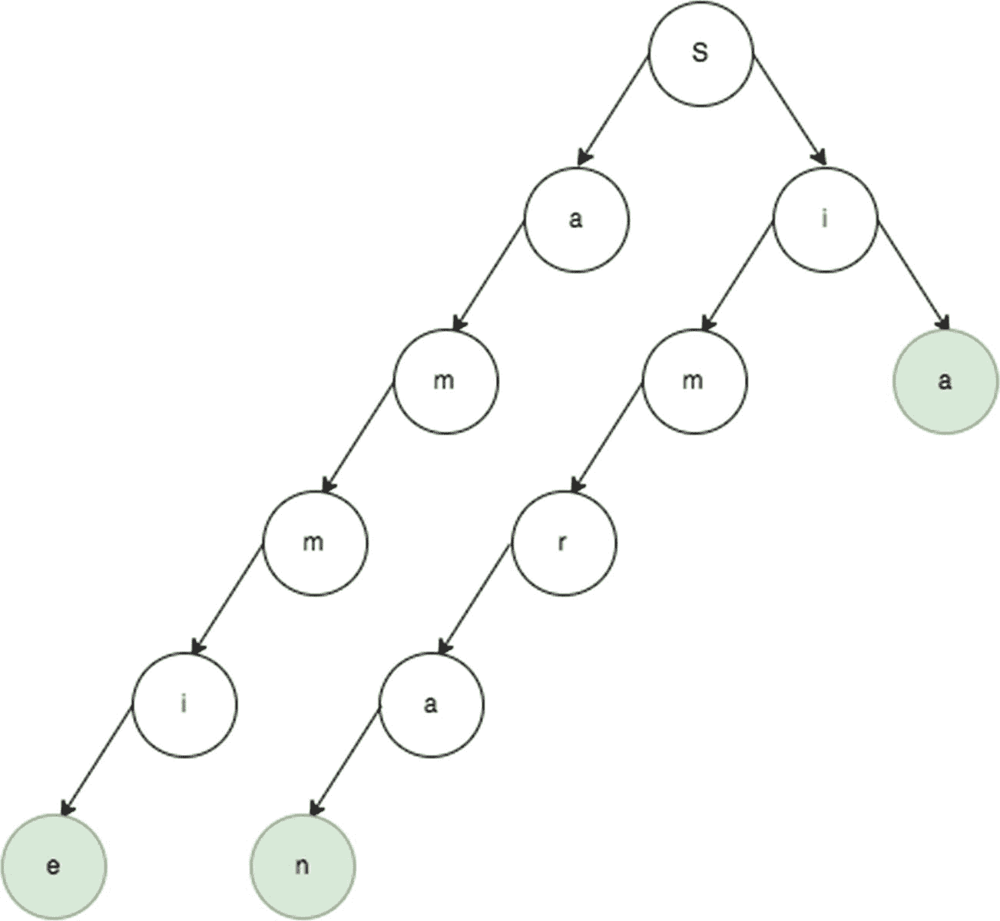
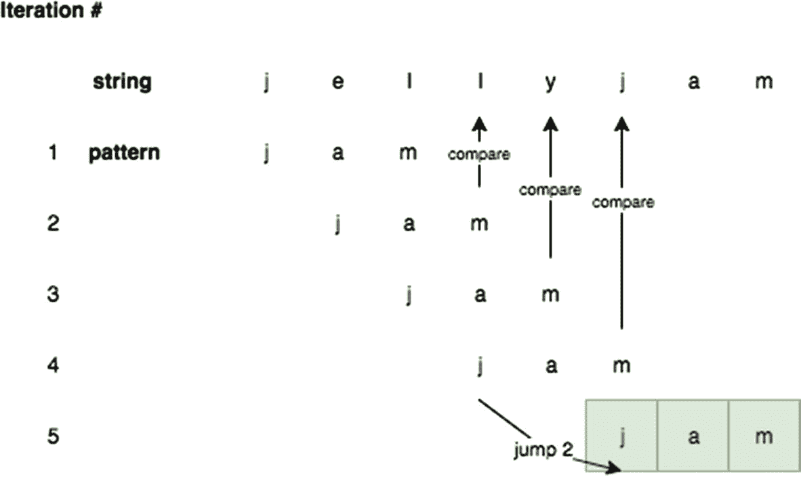
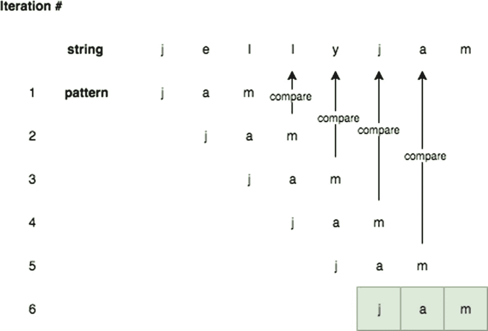

# 十八、高级字符串

本章将涵盖比前几章讨论的更高级的字符串算法。既然您已经了解了其他一些数据结构，它们应该更容易理解。具体来说，本章将集中讨论字符串搜索算法。

## 前缀树(Prefix Tree)

trie 是一种特殊类型的树，通常用于搜索字符串和匹配存储的字符串。在每一层，节点可以分支形成完整的单词。例如，图 18-1 显示了一个单词的 trie:*余思敏*，*西姆兰*，*西亚*，*萨姆*。每个结束节点都有一个布尔标志:`isCompleted`。这表示该单词以此路径结束。例如， *Sam* 中的 *m* 将`endOfWord`设置为`true`。`endOfWord`设置为`true`的节点在图 18-1 中用阴影表示。



图 18-1

余思敏、西姆兰、新加坡、萨姆

trie 是使用嵌套对象实现的，其中每一层都有它的直接子对象作为键。可以通过使用对象存储子节点来形成 trie 节点。trie 有一个根节点，它在`Trie`类的构造函数中被实例化，如下面的代码块所示:

```js
 1   function TrieNode() {
 2       this.children = {}; // table
 3       this.endOfWord = false;
 4   }
 5
 6   function Trie() {
 7       this.root = new TrieNode();
 8    }

```

为了插入到 trie 中，如果子 trie 节点不存在，则在根节点上创建它。对于要插入的单词中的每个字符，如果该字符不存在，它会创建一个子节点，如下面的代码块所示:

```js
 1   Trie.prototype.insert = function(word) {
 2       var current = this.root;
 3       for (var i = 0; i < word.length; i++) {
 4           var ch = word.charAt(i);
 5           var node = current.children[ch];
 6           if (node == null) {
 7               node = new TrieNode();
 8               current.children[ch] = node;
 9           }
10           current = node;
11       }
12       current.endOfWord = true; //mark the current nodes endOfWord as true
13   }

```

要在 trie 中搜索，必须检查单词的每个字符。这是通过在根上设置一个临时变量`current`来实现的。当单词中的每个字符被检查时，`current`变量被更新。

```js
 1   Trie.prototype.search = function(word) {
 2       var current = this.root;
 3       for (var i = 0; i < word.length; i++) {
 4           var ch = word.charAt(i);
 5           var node = current.children[ch];
 6           if (node == null) {
 7               return false; // node doesn't exist
 8           }
 9           current = node;
10       }
11       return current.endOfWord;
12   }
13   var trie = new Trie();
14   trie.insert("sammie");
15   trie.insert("simran");
16   trie.search("simran"); // true
17   trie.search("fake") // false
18   trie.search("sam") // false

```

要从 trie 中删除一个元素，算法应该遍历根节点，直到到达单词的最后一个字符。然后，对于没有任何其他子节点的每个节点，应该删除该节点。例如，在一个有 *sam* 和 *sim* 的 trie 中，当 *sim* 被删除时，根中的 *s* 节点保持不变，但是 *i* 和 *m* 被删除。以下代码块中的递归实现实现了该算法:

```js
 1   Trie.prototype.delete = function(word) {
 2       this.deleteRecursively(this.root, word, 0);
 3   }
 4
 5   Trie.prototype.deleteRecursively = function(current, word, index) {
 6       if (index == word.length) {
 7           //when end of word is reached only delete if currrent.end Of Word is true.
 8           if (!current.endOfWord) {
 9               return false;
10           }
11           current.endOfWord = false; 

12           //if current has no other mapping then return true
13           return Object.keys(current.children).length == 0;
14       }
15       var ch = word.charAt(index),
16           node = current.children[ch];
17       if (node == null) {
18           return false;
19       }
20       var shouldDeleteCurrentNode = this.deleteRecursively(node, word, index + 1);
21
22       // if true is returned then
23       // delete the mapping of character and trienode reference from map.
24       if (shouldDeleteCurrentNode) {
25           delete current.children[ch];
26           //return true if no mappings are left in the map.
27           return Object.keys(current.children).length == 0;
28       }
29       return false; 

30   }
31   var trie1 = new Trie();
32   trie1.insert("sammie");
33   trie1.insert("simran");
34   trie1.search("simran"); // true
35   trie1.delete("sammie");
36   trie1.delete("simran");
37   trie1.search("sammie"); // false
38   trie1.search("simran"); // false

```

**时间复杂度:** O( *W*

**空间复杂度:** O( *N*M*

所有操作(插入、搜索、删除)的时间复杂度都是 O( *W* )，其中 *W* 是被搜索字符串的长度，因为字符串中的每个字符都被检查。空间复杂度为 O( *N*M* ，其中 *N* 为插入 trie 的字数， *M* 为最长字符的长度。因此，当有多个具有共同前缀的字符串时，trie 是一种有效的数据结构。为了在一个特定的*字符串*中搜索一个特定的*字符串模式*，trie 并不是高效的，因为需要额外的内存来存储树状结构中的字符串。

对于单个目标字符串中的模式搜索，Boyer-Moore 算法和 Knuth-Morris-Pratt(KMP)算法很有用，将在本章后面介绍。

## boyer-Moore 字符串搜索

Boyer-Moore 字符串搜索算法用于支持文本编辑器应用程序和网络浏览器中的“查找”工具，如图 18-2 中的工具。


图 18-2

查找许多应用程序中常见的工具

Boyer–Moore 字符串搜索算法通过在字符串中搜索模式时跳过索引，允许线性时间搜索。例如图案*果酱*和串*果冻果酱*的暴力对比可视化如图 18-3 所示。应当注意，在第四次迭代中，当 *j* 与 *m* 进行比较时，由于 *j* 在模式中示出，向前跳 2 将是有效的。图 18-4 显示了一个优化的迭代周期，当模式中存在索引处的字符串时，通过向前跳跃来限制字符串比较的次数。



图 18-4

boyer-Moore 跳过指数



图 18-3

强力模式匹配迭代

要实现这个跳过规则，您可以构建一个“坏匹配表”结构。不良匹配表指示对于模式的给定字符要跳过多少。各种模式及其对应的不良匹配表的一些示例如下所示:

<colgroup><col class="tcol1 align-left"> <col class="tcol2 align-left"></colgroup> 
| 

模式

 | 

错误的匹配表

 |
| --- | --- |
| jam | `{j: 2, a: 1, m: 3}` |
| *数据* | `{d: 3, a: 2, t: 1}` |
| *结构* | `{s: 5, t: 4, r: 3, u: 2, c: 1}` |
| 国王 | `{r: 2, o: 1, i: 3}` |

对于 *roi* 的例子，`r:2`表示如果在字符串中没有找到`r`，则索引应该跳过 2。这个不良匹配表可以用下面的代码块实现:

```js
function buildBadMatchTable(str) {
    var tableObj = {},
        strLength = str.length;
    for (var i = 0; i <  strLength - 1; i++) {
        tableObj[str[i]] = strLength - 1 - i;
    }
    if (tableObj[str[strLength-1]] == undefined) {
        tableObj[str[strLength-1]] = strLength;
    }
    return tableObj;
}
buildBadMatchTable('data');     // {d: 3, a: 2, t: 1}
buildBadMatchTable('struct');   // {s: 5, t: 4, r: 3, u: 2, c: 1}
buildBadMatchTable('roi');      // {r: 2, o: 1, i: 3}
buildBadMatchTable('jam');      // {j: 2, a: 1, m: 3}

```

使用这个坏匹配表，可以实现 Boyer-Moore 字符串搜索算法。在扫描模式的输入字符串时，如果正在查看的当前字符串存在于不良匹配表中，则跳过与当前字符串相关联的不良匹配表值。否则，它将递增 1。这种情况一直持续到找到字符串或者索引大于模式和字符串长度之差。这在下面的代码块中实现:

```js
function boyerMoore(str, pattern) {
    var badMatchTable = buildBadMatchTable(pattern),
        offset = 0,
        patternLastIndex = pattern.length - 1,
        scanIndex = patternLastIndex,
        maxOffset = str.length - pattern.length;

    // if the offset is bigger than maxOffset, cannot be found
    while (offset <= maxOffset) {
        scanIndex = 0;
        while (pattern[scanIndex] == str[scanIndex + offset]) {
            if (scanIndex == patternLastIndex) {
                // found at this index
                return offset;
            }
            scanIndex++;
        }
        var badMatchString = str[offset + patternLastIndex];
        if (badMatchTable[badMatchString]) {
            // increase the offset if it exists
            offset += badMatchTable[badMatchString]
        }  else {
            offset += 1;
        }
    }
    return -1;
}
boyerMoore('jellyjam','jelly');  // 5\. indicates that the pattern starts at index 5
boyerMoore('jellyjam','jelly');  // 0\. indicates that the pattern starts at index 0
boyerMoore('jellyjam','sam');    // -1\. indicates that the pattern does not exist

```

**最佳情况:**

在最好的情况下，模式中的所有字符都是相同的，这持续地产生移位 *T* ，其中 *T* 是模式的长度。因此，O( *W/T* )是最佳时间复杂度，其中 *W* 是正在搜索模式的字符串。空间复杂度是 O( *1* )，因为只有 1 个值被存储到不良匹配表中。

**时间复杂度:** O( *T/W*

**空间复杂度:** O( *1*

**最坏情况:**

在最坏的情况下，字符串的末尾是模式，前面的部分都是唯一的字符。这样的一个例子是一串 *abcdefgxyz* 和模式 *xyz* 。在这种情况下， *T*W* 字符串比较就完成了。

**时间复杂度:** O( *T*W*

**空间复杂度:** O( *T*

模式和字符串中的所有字符都是相同的。这种情况的一个例子是字符串 *bbbbbb* 和模式 *bbb* 。在这种情况下，不能最大限度地使用跳过机制，因为索引将总是递增 1。在这种情况下，空间复杂度是 *T* ，因为模式可以包含所有独特的字符。

## knuth–Morris–Pratt 字符串搜索

第四章讨论了原生`String.prototype.indexOf`函数。一个简单的`String.prototype.indexOf`函数的实现被作为那一章的练习。一个更好的(*更快的*)实现使用 Knuth–Morris–Pratt(KMP)字符串搜索算法。KMP 算法的以下实现返回出现该模式的所有索引。

KMP 字符串搜索算法通过观察到不匹配的出现包含关于下一个匹配可以从哪里开始的足够信息，来搜索“单词” *W* 在输入“文本”中的出现，即 *T* 。这有助于跳过对先前匹配字符的重新检查。必须构建一个前缀数组来指示它必须回溯多少个索引才能得到相同的前缀。对于字符串 *ababaca* ，前缀 building 如下所示:

**在当前索引 0** 处，没有要比较的字符串，前缀数组值被初始化为 0。

*   数组索引 0 1 2 3 4 5 6

*   字符 a b a b a c a

*   前缀数组 0

**在当前索引 1** :

*   人物是`b`。

*   前一个前缀数组值`prefix[0]`为 0。

将索引 0 与当前索引进行比较: *a* (索引= 0 时)和 *b* (索引= 1 时)不匹配。

`prefix[1]`设置为 0:

*   数组索引 0 1 2 3 4 5 6

*   字符 a b a b a c a

*   前缀数组 0 0

**当前索引 2** :

*   人物是*一个*。

*   前一个前缀数组值`prefix[1]`为 0。

将索引与当前索引进行比较: *a* (索引= 0 时)和 *a* (索引= 2 时)匹配。

`prefix[2]`设置为 1(从`prefix[1]`开始递增):

*   数组索引 0 1 2 3 4 5 6

*   字符 a b a b a c a

*   前缀数组 0 0 1

**在当前索引 3** :

*   人物是 *b* 。

*   前一个前缀数组值`prefix[2]`为 1。

比较索引 1 和当前索引: *b* (索引= 1 时)和 *b* (索引= 3 时)匹配。

`prefix[3]`设置为 2(从`prefix[2]`开始递增):

*   数组索引 0 1 2 3 4 5 6

*   字符 a b a b a c a

*   前缀数组 0 0 1 2

**在当前索引 4** :

*   人物是*一个*。

*   前一个前缀数组值`prefix[3]`是 2。

比较索引 2 和当前索引: *a* (索引= 2 时)和 *a* (索引= 4 时)匹配。

`prefix[4]`设置为 3(从`prefix[3]`开始递增):

*   数组索引 0 1 2 3 4 5 6

*   字符 a b a b a c a

*   前缀数组 0 0 1 2 3

**在当前索引 5** :

*   人物是`c`。

*   前一个前缀数组值`prefix[4]`是 3。

比较索引 3 和当前索引: *b* (索引= 3 时)和 *c* (索引= 5 时)不匹配。

`prefix[5]`设置为 0:

*   数组索引 0 1 2 3 4 5 6

*   字符 a b a b a c a

*   前缀数组 0 0 1 2 3 0

**在当前索引 6** :

*   人物是 *c* 。

*   前一个前缀数组值`prefix[5]`为 0。

从索引 0 和当前索引比较: *a* (索引= 0 时)和 *a* (索引= 5 时)匹配。

`prefix[6]`设置为 1(从`prefix[5]`开始递增):

*   数组索引 0 1 2 3 4 5 6

*   字符 a b a b a c a

*   前缀数组 0 0 1 2 3 0 1

以下代码块中的函数说明了构建前缀表的算法:

```js
function longestPrefix(str) {
    // prefix array is created
    var prefix = new Array(str.length);
    var maxPrefix = 0;
    // start the prefix at 0
    prefix[0] = 0;
    for (var i = 1; i < str.length; i++) {
        // decrement the prefix value as long as there are mismatches
        while (str.charAt(i) !== str.charAt(maxPrefix) && maxPrefix > 0) {
            maxPrefix = prefix[maxPrefix - 1];
        }
        // strings match, can update it
        if (str.charAt(maxPrefix) === str.charAt(i)) {
            maxPrefix++;
        }
        // set the prefix
        prefix[i] = maxPrefix;
    }
    return prefix;
}
console.log(longestPrefix('ababaca')); // [0, 0, 1, 2, 3, 0, 1]

```

现在有了这个前缀表，KMP 就可以实现了。KMP 搜索逐个索引地遍历要搜索的字符串和模式。每当出现不匹配时，它可以使用前缀表来计算一个新的索引进行尝试。当模式的索引达到模式的长度时，就找到了字符串。这在下面的代码块中详细实现:

```js
function KMP(str, pattern) {
    // build the prefix table
    var prefixTable = longestPrefix(pattern),
        patternIndex = 0,
        strIndex = 0;

    while (strIndex < str.length) {
        if (str.charAt(strIndex) != pattern.charAt(patternIndex)) {
            // Case 1: the characters are different

            if (patternIndex != 0) {
                // use the prefix table if possible
                patternIndex = prefixTable[patternIndex - 1];
            } else {
                // increment the str index to next character
                strIndex++;
            }

        } else if (str.charAt(strIndex) == pattern.charAt(patternIndex)) {
            // Case 2: the characters are same
            strIndex++;
            patternIndex++;
        }

        // found the pattern
        if (patternIndex == pattern.length) {
            return true
        }
    }
    return false;
}
KMP('ababacaababacaababacaababaca', 'ababaca'); //  true
KMP('sammiebae', 'bae'); //  true
KMP('sammiebae', 'sammie'); //  true
KMP('sammiebae', 'sammiebaee'); // false

```

**时间复杂度:** O( *W*

**空间复杂度:** O( *W*

预处理长度为 *W* 的单词需要 O( *W* )的时间和空间复杂度。

**时间复杂度:** O( *W* + *T*

这里， *W* 是 *T* (被搜索的主字符串)中的“单词”。

## 拉宾-卡普搜索

Rabin–Karp 算法基于哈希算法来查找文本中的指定模式。虽然 KMP 被优化为在搜索过程中跳过冗余检查，但拉宾-卡普试图通过散列函数来加速子串模式的相等。为了有效地做到这一点，散列函数必须是 O(1)。特别是对于 Rabin-Karp 搜索，使用 Rabin 指纹散列技术。

### 拉宾指纹

拉宾指纹是通过下面的等式计算的:f(x)= m<sub>0</sub>+m<sub>1</sub>x+…+m<sub>n-1</sub>x<sup>n-1</sup>其中 *n* 是被散列的字符数，而 *x* 是某个质数。

这是一个简单的实现，如下面的代码块所示。在这个例子中，101 是一个任意的质数。在这种情况下，任何高素数都应该工作良好。但是，请注意，如果 *x* 太高，可能会导致整数溢出，因为 *x* <sup>n-1</sup> 增长很快。`endLength`参数指示散列应该计算到哪个字符串索引。如果参数没有通过，它应该默认为`str`的长度。

```js
 1 function RabinKarpSearch() {
 2     this.prime = 101;
 3 }
 4 RabinKarpSearch.prototype.rabinkarpFingerprintHash = function (str, endLength) {
 5     if (endLength == null) endLength = str.length;
 6     var hashInt = 0;
 7     for (var i=0; i < endLength; i++) {
 8         hashInt += str.charCodeAt(i) * Math.pow(this.prime, i);
 9     }
10    return hashInt;
11 }
12 var rks = new RabinKarpSearch();
13 rks.rabinkarpFingerprintHash("sammie"); // 1072559917336
14 rks.rabinkarpFingerprintHash("zammie"); // 1072559917343

```

如前面的代码块结果所示，来自 *sammie* 和 *zammie* 的散列是唯一的，因为它们是两个不同的字符串。哈希值允许您在固定时间内快速检查两个字符串是否相同。举个例子，让我们在*中寻找 *am* 同*。由于 *am* 只有两个字符长，当你扫描文本时， *sa* 、 *am* 和 *me* 由*同一个*组成，计算散列如下:

```js
 1   rks.rabinkarpFingerprintHash("sa"); // 9912
 2   rks.rabinkarpFingerprintHash("am"); // 11106
 3   rks.rabinkarpFingerprintHash("me"); // 10310

```

这是一个滑动哈希计算。如何高效地做到这一点？我们从数学上分析一下。回想一下，在这个例子中, *x* 是 101。另外， *s* 、 *a* 、 *m* 和 *e* 的字符代码分别为 115、97、109 和 101。

*   `sa`:f(x)= m<sub>0</sub>+m<sub>1</sub>x = 115+(97)*(101)= 9912

*   `am`:f(x)= m<sub>0</sub>+m<sub>1</sub>x = 97+(109)*(101)= 11106

*   `me`:f(x)= m<sub>0</sub>+m<sub>1</sub>x = 109+(101)*(101)= 10310

要得到从 *sa* 到 *am* 的哈希值，必须减去第一项，将余数除以质数，然后加上新项。此重新计算算法在以下代码块中实现:

```js
1 RabinKarpSearch.prototype.recalculateHash = function (str, oldIndex, newIndex, oldHash, patternLength) {
2     if (patternLength == null) patternLength = str.length;
3     var newHash = oldHash - str.charCodeAt(oldIndex);
4     newHash = Math.floor(newHash/this.prime);
5     newHash += str.charCodeAt(newIndex) * Math.pow(this.prime, patternLength - 1);
6     return newHash;
7 }
8 var oldHash = rks.rabinkarpFingerprintHash("sa"); // 9912
9 rks.recalculateHash("same", 0, 2, oldHash, "sa".length); //  11106

```

最后，两个不同的字符串仍然可以有相同的哈希值，尽管这不太可能。因此，在给定两个字符串的起始索引和结束索引的情况下，需要一个函数来检查两个字符串是否相等。这在下面的代码块中实现:

```js
 1 RabinKarpSearch.prototype.strEquals = function (str1, startIndex1, endIndex1,
 2                                                 str2, startIndex2, endIndex2) {
 3     if (endIndex1 - startIndex1 != endIndex2 - startIndex2) {
 4         return false;
 5     }
 6     while ( startIndex1 <= endIndex1
 7           && startIndex2 <= endIndex2) {
 8         if (str1[startIndex1] != str2[startIndex2]) {
 9             return false;
10         }
11         startIndex1++;
12         startIndex2++;
13     }
14     return true;
15 }

```

然后，通过计算起始散列，然后以滑动方式重新计算散列，直到找到模式或到达字符串末尾，来实现主要的 Rabin–Karp 搜索函数。

```js
 1 RabinKarpSearch.prototype.rabinkarpSearch = function (str, pattern) {
 2     var T = str.length,
 3         W = pattern.length,
 4         patternHash = this.rabinkarpFingerprintHash(pattern, W),
 5         textHash = this.rabinkarpFingerprintHash(str, W);
 6
 7     for (var i = 1; i <= T - W + 1; i++) {
 8         if (patternHash == textHash &&
 9             this.strEquals(str, i - 1, i + W - 2, pattern, 0, W - 1)) {
10             return i - 1;
11         }
12         if (i < T - W + 1) {
13             textHash = this.recalculateHash(str, i - 1, i + W - 1, textHash, W);
14         }
15     }
16
17     return -1;
18 }
19
20 var rks = new RabinKarpSearch();
21 rks.rabinkarpSearch("SammieBae", "as"); // -1
22 rks.rabinkarpSearch("SammieBae", "Bae"); // 6
23 rks.rabinkarpSearch("SammieBae", "Sam"); // 0

```

**预处理时间复杂度:** O( *W*

预处理时间复杂度 *W* 是“单词”的长度

**匹配时间复杂度:** O( *W* + *T*

这个算法最多迭代长度 *T* 和长度 *W* 之和，其中 *T* 是要搜索的字符串。

### 现实生活中的应用

Rabin–Karp 算法可用于检测剽窃。对于源材料，该算法可以在提交的论文中搜索源材料中的短语和句子的实例(并通过在预处理阶段省略标点符号来忽略标点符号等语法细节)。这个问题对于单一搜索算法来说是不切实际的，因为有大量的搜索(输入)短语和句子。Rabin–Karp 算法也用于其他字符串匹配应用，例如在大量 DNA 数据中寻找特定序列。

## 摘要

这一章回到了字符串的主题，看了更高级的例子和字符串模式的搜索。本章讨论了几种不同的类型。

*   Trie 非常适合多重搜索和前缀模式匹配。

*   boyer–Moore 假设结尾没有匹配意味着不需要匹配开头，试图匹配模式的最后一个字符，而不是第一个字符；这允许较大的“跳跃”(索引之间的空格)，当文本较大时效果更好。

*   KMP 算法通过观察当出现不匹配时，模式本身具有足够的信息来确定下一个匹配可能开始的字符串中的索引，从而在字符串中搜索模式的出现。因此，KMP 算法对小集合更好。

表 18-1 总结了不同的搜索算法。

表 18-1

单字符串搜索摘要

<colgroup><col class="tcol1 align-left"> <col class="tcol2 align-left"> <col class="tcol3 align-left"> <col class="tcol4 align-left"></colgroup> 
| 

算法

 | 

预处理时间复杂度

 | 

匹配时间复杂度

 | 

空间复杂性

 |
| --- | --- | --- | --- |
| 天真的 | 没有人 | o(*w′t〖* | 没有人 |
| 博伊尔-摩尔 | O( *W* + *T* | O( *T* / *W* )最佳情况 o(*W*∫*T*)最坏情况 | O(1) |
| KMP | O( *W* ) | O( *T* | O( *W* ) |
| 拉宾卡 rp | O( *W* ) | O( *W* + *T* | O(1) |