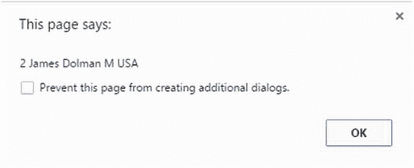
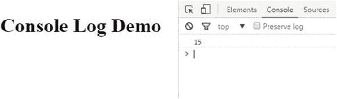
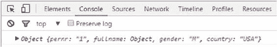
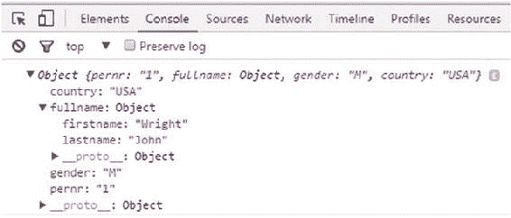
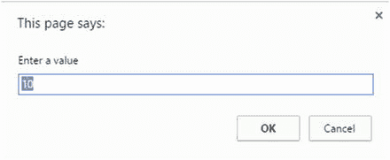

# 二、JavaScript 更进一步


在第 [1](01.html) 章中学习了 JavaScript 的基础知识和运行一个 JavaScript (JS)程序的先决条件之后，你就可以开始学习 JS 语言的细节了。本章首先给你一个窗口对象的概述。接下来，它详细描述了 JavaScript 提供的数据类型。然后，演示程序将向您展示如何在对话框中向用户显示数据，如何在 web 浏览器的控制台中调试您的 web 页面，以及如何通过对话框接受用户的输入。本章的最后一节列出了 JS 语言的保留字。

## 窗口对象

JavaScript 中的一个重要概念是窗口对象。window 对象代表浏览器中打开的窗口。本节描述该对象及其提供的属性和方法。

在 JS 程序中，在任何函数之外声明的所有变量本质上都是全局的。它们在网页的整个执行过程中保持活动状态。全局变量是这个对象的属性。该组全局变量可通过全局窗口对象来访问。窗口对象的任何组件都可以通过使用点符号(.).

为了更好地理解 Window 对象，考虑以下 JS 程序的摘录:

```js
var num1 = 10;
window.num1 = 20 ;
alert (num1);
```

该语法声明了一个变量 num1，并给它赋值 10。然后，它使用 window 对象来访问 num1，并给它赋值 20。短 JS 程序输出如图 [2-1](#Fig1) 所示的值。


###### 图 2-1。程序输出

如您所见，显示的是值 20，而不是 10。这是因为变量 num1 驻留在通过窗口对象访问的全局容器中。当您赋值 20 时，它引用同一个变量 num1。

Window 对象包含许多属性和方法，所有主流浏览器都支持它。表 [2-1](#Tab1) 中列出并简要描述了与之相关的一些重要属性。

###### 表 2-1。窗口对象的重要属性

<colgroup class="calibre23"><col class="calibre24"> <col class="calibre24"></colgroup> 
| 

财产

 | 

目的

 |
| --- | --- |
| 状态 | 设置或返回浏览器底部的状态栏文本 |
| 名字 | 设置或返回窗口的名称 |
| 全屏 | 指示窗口的全屏显示 |
| 内部高度 | 设置窗口内容区域的高度，包括水平滚动条 |
| 内宽 | 设置窗口内容区域的宽度 |
| 长度 | 设置窗口中的帧数 |

此外，Window 对象还有很多有用的方法。表 [2-2](#Tab2) 中列出并简要描述了一些重要的方法。

###### 表 2-2。窗口对象的重要方法

<colgroup class="calibre23"><col class="calibre24"> <col class="calibre24"></colgroup> 
| 

方法

 | 

目的

 |
| --- | --- |
| 警报() | 向用户显示带有消息文本和确定按钮的警告框 |
| 提示() | 生成供用户输入的对话框 |
| 打印() | 写入相关窗口的内容 |
| 打开() | 在浏览器中创建新窗口 |
| 关闭() | 关闭窗口 |
| 确认() | 显示带有“确定”和“取消”按钮的对话框以及相应的消息 |
| createPopup() | 创建弹出窗口(此方法在 Internet Explorer 中有效) |

JS 程序的所有部分都可以调用这些方法。调用这些方法时，可以使用窗口对象，也可以不使用窗口对象调用这些方法。考虑以下示例:

```js
Window.alert("Hello"); //  incorrect, as Window must be written in lowercase i.e. window
window.alert(text);    //  correct
alert("Hello");        // correct
```

前面两种说法效果相同。没有必要将调用与窗口对象一起使用。

###### 注意

当调用窗口对象时，总是使用小写字母。

## JavaScript 中的数据类型

第[章 1](01.html) 简单介绍了 JS 中可用的数据类型。本节将更深入地探讨 JavaScript 支持的各种数据类型。在 JavaScript 中，变量被赋予在给定实例中分配的类型。

总的来说，JavaScript 中存在六种数据类型，如表 [2-3](#Tab3) 中所总结的。下面的小节更详细地描述了它们，并展示了如何声明它们。

###### 表 2-3。数据类型及其用途

<colgroup class="calibre23"><col class="calibre24"> <col class="calibre24"></colgroup> 
| 

类型名称

 | 

目的

 |
| --- | --- |
| 线 | 一组字符 |
| 数字 | 整数，负数或正数，或各种小数 |
| 不明确的 | 具有此类型的变量已定义，但没有值 |
| 空 | 对没有值的变量的有意或明确的说明 |
| 目标 | 一组未排序的属性和属性值 |
| 布尔代数学体系的 | 包含真或假 |

### 线

字符串是各种长度的字符序列。典型的例子包括“约翰 123”和“约翰是个好人”。字符串必须用引号括起来。通常，使用双引号。但是，也可以使用单引号。考虑以下代码摘录:

```js
var person = "John James";       // double quotes
var areaName = 'Burj Khalifa';   // Using single quotes
```

也可以在用双引号括起来的字符串中使用单引号。考虑以下示例:

```js
var text = "It's a rainy day";  // correct
```

或者，您可以使用以下可接受的形式:

```js
var text = "My profession is 'Computer programmer'";  //correct
```

同样，您可以在单引号中的 sting 中使用双引号:

```js
var text = 'My Profession is "Computer programmer" '; // correct
```

但是，以下示例是不可接受的，并且会产生语法错误:

```js
var text = 'My profession is 'Computer programmer'';  // wrong
var text = "My profession is "Computer programmer'"'; // wrong
```

让事情变得稍微复杂一点的是，这两种不可接受的形式可能会稍微调整一下，以避免语法错误。文本中的单引号必须以反斜杠开头。现在考虑同一个例子:

```js
var text = 'My Profession is \'Computer programmer\'  ' ; // correct
```

语句执行后，变量文本包含我的职业是‘计算机程序员’。

同样，以下语句也是可以接受的:

```js
var text = "My Profession is \"Computer programmer\"  " ; // correct
```

执行后，变量文本包含我的职业是“计算机程序员”。

字符串定义和赋值可以在一行或一组行中。在多行中使用字符串定义时，可以使用转义换行符(\n)，如下所示:

```js
var text = "My Profession is \nComputer programmer" ;
alert(text);
```

执行前面几行代码后，变量文本的内容显示在如图 [2-2](#Fig2) 所示的窗口中。


###### 图 2-2。两行显示的字符串

如图所示，文本由两行组成。这是通过在字符串规范中使用\n 来实现的。

另一个可以在字符串上下文中使用的运算符是+。考虑下面一行代码:

```js
var string1 = 'ABAP' + 'er' ; // string1 contains ABAPer
```

添加+运算符会导致两组字符的连接。变量 string1 将包含“ABAPer”。现在考虑下面的例子:

```js
var string1  = 1 + '7'; //
```

在这种情况下，执行语句后，string1 变量的值为“17”。它导致数字 1(也被视为字符串)与字符串“7”的串联，并且 string1 中的结果也是一个字符串。

考虑另一个例子:

```js
var string1  = 'A' + 1 + 7;  //  string1 will contain A17
```

在这种情况下，当执行该语句时，变量 string1 将包含值“A17”而不是“A8”。

相反，考虑下面的例子:

```js
var string1  = 1 + 7 + 'A' ;  
```

执行此语句后，string1 中的结果值是“8A”而不是“17A”。原因是 JavaScript 按顺序将 1 和 7 视为数字并执行加法，直到遇到字母 A。从这一点开始，到目前为止计算出的值(8)与 A 连接并存储在变量 string1 中。变量 string1 的类型是 string。

### 数字

为了表示数值，JavaScript 只有一种数据类型:number。这些数字可能有也可能没有小数点。此外，它们可能包含也可能不包含一元运算符。为了澄清数字在 JS 中的用法，让我们考虑几个例子。

以下代码行表示一个包含值 26 的整数:

```js
var num1 = 26;
```

现在考虑另一个例子:

```js
var num2 = -26;
```

变量 num2 被赋值为负 26。

在 JavaScript 中定义变量时，不需要指定小数位数。分配变量时，必须提供相应的值。现在让我们考虑几个十进制数的例子。以下是正十进制值的一些示例:

```js
var num1 = 0.6888 ;
var num2 = 122.688;
var num3 = 10.0;
```

你也可以有一个带负号和小数位的数字:

```js
var num4 = -2.3;
```

您也可以为数字变量指定一个指数值。以下是一些例子:

```js
var num5 = 28.5e-3 ; //which is equal to .0285
var num6 = 28.5e3  ; //which is equal to 28500  
```

这将在变量 num1 中存储值 2.78900 以及必要的小数位。

可以执行添加操作:

```js
var num1   = 2.78900 + 1 ;
```

当执行加法时，结果值将是 3.789。

在 JS 内部，有两个特殊的数字:正无穷大(无穷大)和负无穷大(-无穷大)。程序中的算术溢出会导致正无穷大。另一方面，如果试图存储(在一个数字变量中)一个小于允许最小值的值，就会出现负无穷大。

###### 注意

一个数字变量可能包含两个特殊的值:无穷大和-无穷大。

请考虑下面的示例，它演示了数字类型也用于存储十六进制和八进制值。十六进制值从 0x 开始:

```js
var Hexval1 = -0xFFDD;
var Hexval2 =  0xFFDD;
```

八进制值以零开始:

```js
var Octval = 0628;
```

### 不明确的

如果已经声明了一个变量，但没有给它赋值，则该变量的类型为 undefined。考虑以下示例:

```js
var mytype ;
```

正如您所看到的，这个例子声明了变量 mytype，但是没有给它赋值。变量 mytype 的类型未定义。

```js
var mytype ;  // mytype has undefined type
```

也可以将变量显式设置为 undefined:

```js
var mytype =  10;    // mytype has type number
mytype = undefined;  // now mytype has type undefined
```

### 空

JavaScript 中使用 null 数据类型来显式指定变量没有值。您可以简单地将 null 赋给一个变量，如下例所示:

```js
var mytype = 1 ;
var mytype = null; // mytype has type null
```

###### 注意

将 null 或 undefined 赋给变量时，不要在 null 或 undefined 两边加上单引号或双引号。否则，它们将被视为字符串。

### 目标

JavaScript 中的 object 数据类型表示一组无序的属性和值。在程序中定义对象的语法如下:

```js
var  myobj = { property1 :  val1 ,  property2 :val2 ...  property : valn };
```

对象定义可以写在一行或多行上。属性和相应的值必须用冒号分隔，而属性-值对用逗号分隔。在程序中，对象也是通过 var 关键字定义的变量。然而，对象是由许多属性和值组成的。

考虑这个例子:

```js
var employee1 = { pernr :  '1', empName : "John Wright" ,  gender : 'M', country : "USA" } ;
```

此示例定义了一个名为 employee1 的对象，其属性为 empName、gender 和 country，并为各个属性赋值。

相同的定义和赋值可以在多行中完成:

```js
var employee1 = {  pernr :  '1',
                   empName : "John Wright" ,  
                   gender : 'M',
                   country : "USA" } ;
```

定义对象时，请确保仅使用大括号{ }将属性和值对括起来。用括号将它们括起来会产生语法错误，这是不允许的。

要处理各种属性，请使用点运算符:

```js
alert ( employee1.pernr) ;
```

前面的语句将显示一个值为 1 的对话框。

还可以更改给定对象的特定属性值:

```js
employee1.pernr = 2 ;
```

一旦完成，对于 employee1 对象，pernr 的值将为 2。

您可以将一个给定对象分配给另一个对象，如下所示:

```js
var employee1 = { pernr :  '1', empName : "John Wright" ,  gender : 'M', country : "USA" } ;
var employee2 = employee1;
employee2.pernr = '2';
employee2.empName = 'James Dolman' ;

alert ( employee2.pernr + " " + employee2.empName + " " + employee2.gender + " " + employee2.country ) ;
```

如您所见，该示例首先创建一个名为 employee1 的对象，并为员工 John Wright 分配适当的属性值，员工编号为 1。接下来，将对象 employee1 分配给新声明的对象 employee2。对象 employee2 的属性 pernr 和 empName 被更改，并使用 alert 函数在对话框中输出。程序的输出如图 [2-3](#Fig3) 所示。



###### 图 2-3。程序输出

指定对象的属性时，可以指定 undefined 或 null 作为属性值。指定 null 的示例如下所示:

```js
var employee1 = { pernr : null, empName : null ,  gender : 'M', country : "USA" } ;
employee1.pernr = '2' ;
employee1.empName = 'John Reed' ;
```

除了点符号之外，还有另一种方法来处理对象的属性。这显示在以下代码行中:

```js
employee1["pernr"] = '2' ;  correct
```

这将把值“2”赋给 employee1 对象的属性 pernr。如您所见，属性名用双引号和方括号括起来。也可以用单引号将属性名括起来。考虑以下具有相同效果的语句:

```js
employee1['pernr']  = '2';   //  correct
```

但是，您必须确保在单引号或双引号中只使用方括号，如示例所示。使用圆括号或花括号会产生语法错误:

```js
employee1('pernr') = '2' ;   //  Wrong
```

此外，省略引号(单引号或双引号)，即使与方括号一起使用，也是有问题的，如下所示:

```js
employee1[ pernr ] = '2' ;   //  Wrong
```

#### 对象中的对象

到目前为止，您已经看到了只包含一组属性的对象的例子。现在您将看到如何定义包含一个或多个其他对象的对象。您可以通过稍微修改前面的 employee1 示例来实现这一点。修改后的示例没有使用基于字符串的属性名，而是引入了一个新的属性 fullname，它基于一个具有属性 lastname 和 firstname 的对象。这方面的代码如下:

```js
var employee1 = {  pernr :  '1',
                fullname : { lastname : "John" , firstname : "Wright" } ,  
                gender : 'M',
                country : "USA" } ;
```

这里，与最初的示例一样，定义了一个具有许多属性的对象 employee1。但是，employee1 现在有一个名为 fullname 的属性，它本身是一个包含属性 lastname 和 firstname 的对象。请注意 employee1 和 fullname 对象的花括号用法。在子对象中，冒号和逗号的使用方式与它们在主对象规范中的使用方式相同。

考虑下面几节中描述的例子。

###### 注意

JavaScript 中存在一种称为数组的特殊对象。数组是一组有序的值，写在方括号内；如[1，2，7，10]或['我的'，'她']。数组将在第 [5](05.html) 章和后续章节中详细讨论。

### 布尔代数学体系的

顾名思义，基于布尔数据类型的变量的值可以是 true 或 false。请考虑以下几点:

```js
var  bool1 =  true;  // correct
var  bool2 = false ; // correct
```

这些示例定义了两个布尔变量 bool1 和 bool2，并分别为它们赋值 true 和 false。重要的是，赋值不能用单引号或双引号写，必须用小写字母写。

###### 注意

当您将 true 和 false 赋给布尔变量时，请确保不要将它们写在单引号或双引号中。否则，它们将被视为字符串。还要确保全部使用小写字母。

考虑这些例子:

```js
var  bool1 =  "true";  // wrongly defined as string - not boolean
var  bool2 = "false" ; // wrongly defined as string - not boolean  
```

这里，bool1 和 bool2 都是字符串，而不是布尔值。

布尔变量用于条件求值，并可用于存储条件求值的结果，如 if 和 while 语句。(这些陈述将在本书的后半部分详细讨论)。考虑下面一行:

```js
var boolean1 =  ( 10 > 1 ) ;
```

执行脚本后，变量 boolean1 包含值 true。接下来，考虑这个例子:

```js
var boolean2 =  ( 0 > 1 ) ;
```

在这种情况下，boolean2 变量包含值 false。

## 运算符的类型

JavaScript 中一个重要的操作符是 **typeof** 。typeof 运算符返回一个字符串，该字符串表示所讨论的操作数的类型。typeof 运算符的语法如下所示:

```js
typeof (variable) ;
typeof variable ;
```

变量或操作数可以属于本章讨论的任何类型。如果使用 typeof 运算符计算单个语句中的单个操作数，可以省略变量名两边的括号。您还可以在 alert 方法或 console.log 方法中使用 typeof 运算符(将在下一节中讨论)。

以下示例显示了如何使用 typeof 运算符:

```js
var text = 'My Profession is "Computer programming" '.
alert (typeof(text));     //    string  displayed in dialog box
```

在此示例中，typeof 运算符返回一个字符串，该字符串显示在对话框中。

考虑以下代码，其中运算符正确地返回了对象类型:

```js
var employee1 = {  pernr :  '1',
fullname : { lastname : "John" , firstname : "Wright" } ,  
             gender : 'M',
             country : "USA" } ;
alert (typeof(employee1) ) ; //  object displayed in dialog box
```

在下面的代码中，变量 boolean1 属于布尔数据类型。因此，typeof 运算符返回布尔值。

```js
var boolean1 =  ( 10 > 1 ) ;
alert (typeof(boolean1)) ;   //  boolean displayed in dialog box
```

如前所述，当变量被声明但没有赋值时，变量的类型是未定义的。相同的未定义类型由 typeof 运算符确定:

```js
var mytype ;  // mytype has undefined type
alert (typeof(mytype)) ;   // undefined displayed in dialog box
```

typeof 运算符也适用于数字，并给出正确的类型(即数字):

```js
mytype =  10;  // mytype has type number
alert (typeof(mytype)) ;   // number displayed in dialog box
```

最后，此示例显示了当涉及 null 时 typeof 运算符的行为:

```js
mytype = 1 ;
mytype = null; // mytype has type null
alert(typeof( mytype)) ;  // but  object displayed in dialog box ----wrongly displayed
```

在空值的情况下，typeof 运算符错误地将类型名返回为 object。开发人员需要小心谨慎，并编写适当的措施来处理这种情况。

###### 警告

typeof 运算符在所有情况下都返回正确的 JS 类型，但类型 null 除外。在这种情况下，它错误地返回“object”。

## 方法控制台. log

到目前为止，在本章中你已经看到了 JS 中各种可用的数据类型以及一些例子，包括如何使用 alert 方法在对话框中显示信息。但是，出于测试和调试的目的，您可能需要在程序执行过程中的不同时刻显示某些变量的值。

###### 注意

不建议在实际环境中使用 console.log 方法。但是，在开发 JS 程序时，必须使用它进行测试。

在执行程序时，可以使用 console.log 方法显示变量的测试值。虽然颜色和风格化选项是可能的，但这里我们将只讨论该方法的基本工作。这种方法的语法如下:

```js
console.log( obj1, obj2 ....objn );
```

console.log 方法可以接受一个或多个数字、字符串、布尔值或对象作为输入。还可以使用 console.log 方法显示对象的一个或多个属性。还可以将 console.log 与 typeof 运算符结合使用。对于包含更多对象的对象，您可以深入查看该对象的更多详细信息。

###### 注意

当传递给 console.log 方法的值涉及要执行的操作(如加法或串联)时，首先计算结果，然后输出结果。

以下示例显示了实际使用的 console.log 方法:

```js
<!DOCTYPE html>
<html>
<body>
<h1>Console Log Demo </h1>
<script>
  console.log(10 + 5);
</script>
</body>
</html>
```

Console 对象允许您访问浏览器的调试控制台。console.log 方法的输出既不与浏览器中的其余网页内容一起显示，也不在加载网页时的弹出框中显示。相反，它显示在浏览器调试器的控制台选项卡中。打开控制台显示器的步骤如下:

1.  在浏览器中打开包含 HTML 和 JavaScript 代码的网页。(在这个例子中，我使用的是谷歌浏览器。)

2.  按 Ctrl+Shift+I。这将在网页输出右侧的单独窗格中打开调试器，如图 [2-4](#Fig4) 所示。

    

    ###### 图 2-4。调试器控制台选项卡

3.  单击控制台选项卡。现在您将看到使用 console.log 方法显示的值(在图 [2-4](#Fig4) 中，15 显示为相加的结果)。

###### 注意

确保在 JavaScript 代码中使用小写字母编写 console.log。将其写入 Console.log 不会产生预期的结果。

考虑清单 [2-1](#PC52) 中的例子。

###### 清单 2-1。显示对象员工 1

```js
<script>
var employee1 = {  pernr :  '1',
                   empName : "John Wright" ,  
                   gender : 'M',
                   country : "USA" } ;

console.log(employee1);
</script>
```

这里，employee1 对象作为参数传递给 console.log 方法。控制台中的输出如图 [2-5](#Fig5) 所示。


###### 图 2-5。控制台中显示的员工 1 对象

如您所见，该对象与相关属性和值一起显示在一行中。

现在考虑一个示例，其中对象 employee1 包括属性 fullname(这是另一个对象):

```js
var employee1 = {  pernr :  '1',
                  fullname : { lastname : "John" , firstname : "Wright" } ,  
                  gender : 'M'',
                  country : "USA" } ;
console.log (employee1) ;
```

对于这样的嵌套对象，控制台输出如图 [2-6](#Fig6) 所示。



###### 图 2-6。控制台中显示的员工 1 对象

在这种情况下，不会显示 fullname 属性的值。相反，只为它显示对象。您可以展开对象节点来查看雇员 1 的全部详细信息，如图 [2-7](#Fig7) 所示。



###### 图 2-7。展开的对象员工 1

如你所见，在 Chrome 控制台的详细视图中，属性是按字母顺序排列的。

## 接受用户的输入

到目前为止，您已经看到了如何在对话框中向用户输出数据，以及如何在 web 浏览器控制台中调试您的网页。现在，您将看到如何从查看嵌入了 JavaScript 代码的网页的用户那里获取输入。

Window 对象的 prompt 方法用于此目的，如以下语法所示:

```js
window.prompt ( text , optional default text ) ;
prompt ( text , optional default text ) ;
```

prompt 方法的调用将显示给用户的文本以及可选的默认值作为输入。网页上将显示一个对话框。这是一个*模态*对话框，意味着它不允许用户在浏览器中执行任何其他活动，直到对话框关闭。该对话框显示有两个按钮:“确定”和“取消”。

您可以将用户输入的文本赋给程序中声明的变量。无论使用什么类型的变量，当用户在对话框的输入字段中输入一个值并单击 OK 按钮后，返回的变量的类型将变为 string。

为了更好地理解，请考虑以下示例:

```js
var value  = 0;
value = prompt("Enter a value", "10") ;
alert('You entered ' + value + ' which has type '  + typeof(value)  );
```

此示例指定一个数字变量值，然后调用 window 对象的 prompt 方法，并将输入的值赋给该变量。在方法调用中指定了默认文本 10。然后，该示例使用 alert 方法在另一个对话框中显示输入的值及其类型。该代码生成的输入对话框如图 [2-8](#Fig8) 所示。



###### 图 2-8。输入对话框

当用户输入一个值，如 10，点击确定，显示如图 [2-9](#Fig9) 所示的信息。


###### 图 2-9。显示的消息

如您所见，变量值被赋值为 10，输入的值的类型被解释为字符串。

另一方面，如果用户单击 Cancel 按钮，变量值将被赋值为 null。

## JavaScript 中常用的关键字

作为本章的总结，表 [2-4](#Tab4) 列出了 JavaScript 语言中的一些关键字(保留字)。请注意，不允许定义与这些关键字同名的变量，这就是它们被称为保留变量的原因。

###### 表 2-4。保留字

<colgroup class="calibre23"><col class="calibre24"> <col class="calibre24"> <col class="calibre24"></colgroup> 
| 

布尔代数学体系的

 | 

破裂

 | 

情况

 |
| --- | --- | --- |
| 捕捉 | 班级 | 继续 |
| 系统默认值 | 做 | 其他 |
| 错误的 | 最后的 | 为 |
| 功能 | 如果 | 在 |
| 实例 | （同 Internationalorganizations）国际组织 | 新的 |
| 空 | 私人的 | 保护 |
| 公众的 | 返回 | 短的 |
| 静电 | 极好的 | 转换 |
| 这 | 扔 | 真实的 |
| 尝试 | 类型 | 定义变量 |
| 正在… | 随着 |   |

## 摘要

在本章中，您已经了解了 JavaScript 提供的窗口对象和数据类型。接下来，您看到了如何在对话框中向用户显示数据，如何在浏览器的控制台中调试 web 页面，以及如何通过对话框接受用户的输入。本章末尾列出了 JS 语言的保留字。

第 3 章介绍了 JavaScript 的更多细节。您将看到 JS 语言中的各种控制结构，以及如何使用它们来满足需求。