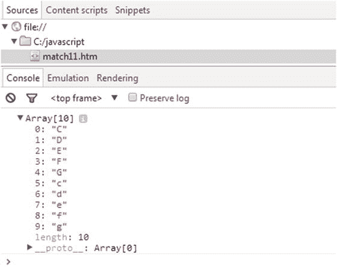
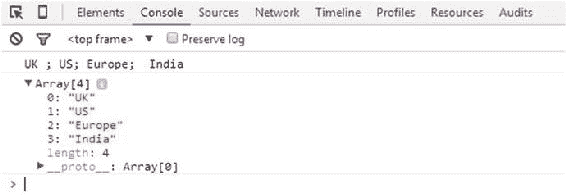

# 五、正则表达式和字符串方法


本章向您介绍 JS 的一个重要特性:正则表达式处理。您可以使用此功能在给定的文本流中查找和替换与给定模式匹配的文本。本章首先解释了 JavaScript 中定义的正则表达式。然后向您展示如何将 RegExp 与字符串方法结合使用。本章的后半部分将向您介绍 RegExp 对象的属性和方法。

## 正则表达式:概述

正则表达式由用于匹配文本字符串中的字符组合的模式(以及可选的修饰符)组成。正则表达式提供了一种执行所有类型的字符串搜索和替换的方法。在 JavaScript 中有两种方法定义正则表达式对象。第一个显示在这里:

```js
var pattern = new RegExp(pattern, attributes);
```

另一种方式如下所示:

```js
var pattern = /pattern/attributes or modifiers;
```

它由一个模式和一个或多个可选标志(即修饰符或属性)组成。模式指示要匹配的正则表达式模式，而属性或修饰符指定任何附加信息。顾名思义，修饰符用于修改相关文本中的模式搜索。可以指定为属性的值有

*   g:全局修饰符。在字符串中搜索给定模式的所有匹配项。

*   I:忽略模式搜索中区分大小写的行为。

*   m:多行修改器。正则表达式中指定的任何^或$都适用于字符串的每一行。如果没有这个修饰符，它只适用于整个字符串一次。

在正则表达式模式中，有元字符和量词。*元字符*是用于定义搜索模式的特殊含义字符。一些常用的元字符如表 [5-1](#Tab1) 所示。在要处理的文本字符串中，由元字符标识的子字符串可能会出现几次。

###### 表 5-1。元字符

<colgroup class="calibre23"><col class="calibre24"> <col class="calibre24"></colgroup> 
| 

元字符

 | 

目的

 |
| --- | --- |
| 。 | 搜索字符 |
| \s | 搜索空白字符 |
| \S | 搜索非空白字符 |
| \w | 搜索字母数字字符，如 1、2、A、A、h、d 等。(即单词字符，表示 a-z、A-Z 或 0-9 中的字符，包括下划线字符，_) |
| \W | 搜索非字母数字字符，如%、#、%(即非单词字符) |
| \d | 搜索数字，如 1、2 或 3。 |
| \D | 搜索非数字字符，如*、#、a 和 b。 |

*量词*用于指定特定字符或字符集的出现次数。表 [5-2](#Tab2) 列出了一些常用的量词。

###### 表 5-2。量词

<colgroup class="calibre23"><col class="calibre24"> <col class="calibre24"></colgroup> 
| 

数量词

 | 

目的

 |
| --- | --- |
| p+ | 匹配至少一个 p 的出现。 |
| p* | 匹配 p 的零次或多次出现。 |
| p？ | 检查一个字符串是否包含零个或一个 p。 |
| p{A} | 匹配多个 p 的序列，例如，ab{2}将匹配 abab。 |
| p{A，B} | 检查一个字符串是否有一个从 A 到 B 的 p 数序列。 |
| p{A，} | 检查一个字符串是否至少有 p 个数的序列，例如，ab{1，}将匹配 ab，abab，依此类推。 |
| p 美元 | 匹配以 p 结尾的字符串。例如，b$将匹配 ab、b 和 cab。 |
| p | 匹配以 p 开头的字符串。例如，^a 将匹配 ab、ah 和 aj。 |

您可以在 regex 模式中使用方括号来指定要搜索的字符。表达式中方括号的典型用法如表 [5-3](#Tab3) 所示。

###### 表 5-3。表达式中方括号的用法

<colgroup class="calibre23"><col class="calibre24"> <col class="calibre24"></colgroup> 
| 

表示

 | 

目的

 |
| --- | --- |
| [xyz] | 搜索方括号中显示的任何字符 |
| [^xyz] | 搜索除括号中的字符以外的任何字符 |
| [A-B] | 搜索范围在 A 到 B 之间的数字 |
| [^A-B] | 查找范围 A 到 B 之外的任何数字 |
| (甲&#124;乙) | 类似于 OR，搜索字符 a 或 b |

###### 注意

如何编写正则表达式的详细解释超出了本章的范围。然而，我们将把重点放在 JS 方法上，这些方法允许您编写正则表达式来解决典型的用户需求。

有两种方法可以使用正则表达式:

*   使用字符串对象方法

*   使用正则表达式对象(RegExp 对象)的属性和方法

下面几节将依次介绍每一种方法。以下是正则表达式的一些示例:

```js
var regex = /High/i ;
var regex = /[C-G]/gi ;
var re = /\s*;\s*/;
var text = new RegExp("Good morning", "g");
```

## 字符串方法

在 JavaScript 中，以下是与正则表达式处理相关的字符串方法:

*   搜索

*   替换

*   比赛

*   使分离

接下来将逐一介绍这些字符串方法，并附有示例。

### 搜索方法

search 方法使用表达式来搜索匹配项，并返回匹配项的位置。search()方法的语法是

```js
str.search(regexp)
```

返回值将是第一个匹配的索引。清单 [5-1](#PC5) 中显示了一个简单的例子。

###### 清单 5-1。search()方法示例

```js
<html>
   <body>
      <script>
         var text = "Visit the Google";
         console.log(text.search("Google"));
      </script>
   </body>
</html>
```

清单 [5-1](#PC5) 用一些文本声明了变量 text(“访问 Google”)。text.search()方法在可变文本中搜索“Google ”,并返回它的给定位置。console.log()方法用于显示输出。

列表 [5-1](#PC5) 的输出如图 [5-1](#Fig1) 所示。


###### 图 5-1。程序输出

### 替换方法

顾名思义，replace 方法用另一个(新的)子字符串替换文本中与给定正则表达式模式匹配的子字符串。然后返回修改后的字符串。replace()方法的语法是

```js
str.replace(regexp, newsubstr)
```

返回值将是新字符串，其中一个或多个给定模式的匹配项将被相应地替换。考虑清单 [5-2](#PC7) 中的例子。

###### 清单 5-2。replace()方法示例

```js
<html>
   <body>
      <script>
         var text = "High level language";
         console.log(text.replace(/High/i, "Low"));
      </script>
   </body>
</html>
```

在清单 [5-2](#PC7) 中，text.replace()方法用于将字符串“High”替换为“Low”。修饰语 I 用来忽略这种情况。

列表 [5-2](#PC7) 的输出如图 [5-2](#Fig2) 所示。


###### 图 5-2。输出

###### 注意

也可以在要匹配的模式中指定子组。使用 replace 方法，可以使用占位符$1 和$2 来寻址这些子组。例如:

```js
var regex = /(\d+)\s(\d+)/; 
var string1 = "123 321";   var newstring = string1.replace(regex, "$2, $1"); 
```

### 匹配方法

match 方法用于以数组的形式获取给定文本字符串中的所有子字符串(正则表达式匹配)。如果找不到匹配项，使用此方法将返回 null。match()方法的语法是

```js
str.match(regexp)
```

清单 [5-3](#PC10) 展示了匹配方法如何工作的一个例子。

###### 清单 5-3。match()方法示例

```js
<html>
   <body>
      <script>
         var text = "Advance varsion of JavaScript 7.1.4";
         var result = text.match(/va/g)
         console.log(result);
      </script>
   </body>
</html>
```

此示例用字符串值声明变量 text。然后使用 text.match()方法将字符“va”与字符串值进行匹配。列表 [5-3](#PC10) 的输出如图 [5-3](#Fig3) 所示。


###### 图 5-3。输出

列表 [5-4](#PC11) 显示了匹配方法的另一个例子。

###### 清单 5-4。另一个 match()方法示例

```js
<html>
   <body>
      <script>
        var text = "ABCDEFG12345abcdefghijklm";
         var result = text.match(/[C-G]/gi)
         console.log(result);
      </script>
   </body>
</html>
```

该示例演示了在 match()方法中使用 global (g)和 ignore (i) case 修饰符/标志。它声明了变量 text，并给它赋了一个文本值。text.match()方法用于查找从 C 到 G 和/或 C 到 G 的所有字母，然后将结果返回到数组 result 中。

列表 [5-4](#PC11) 的输出如图 [5-4](#Fig4) 所示。



###### 图 5-4。输出

### 拆分方法

在正则表达式的上下文中，split 方法用于将一个字符串拆分为一个子字符串数组，这些子字符串与给定的正则表达式模式相匹配。拆分方法的语法是

```js
str.split(regex, Limit)
```

如果不使用正则表达式，可以指定分隔符来代替正则表达式。语法将看起来像这样

```js
str.split(separator, limit)
```

如前所述，返回值将以数组的形式出现。该限制是一个数字(例如，2、10 等。)指定结果数组中包含的最大元素数。分隔符和限制(整数)都是可选的。

清单 [5-5](#PC14) 展示了一个使用 split 方法从字符串中删除空格的例子。

###### 清单 5-5。拆分方法示例

```js
<html>
<body>
      <script>
        var countries = "UK ; US; Europe;  India";
        console.log(countries);
        var re = /\s*;\s*/;
        var countriesList = countries.split(re);
        console.log(countriesList);
      </script>
   </body>
</html>
```

这个例子声明了变量 countries，并给它分配了一些国家名，用分号(；)包含在空格内。正如您所看到的，split 方法中使用的正则表达式模式查找零个或多个空格，后跟一个分号，然后又是零个或多个空格。当在变量 countries 中发现这种模式时，将执行拆分，并从结果子字符串中删除空格和分号。对于每个匹配，数组元素被填充。countriesList 是作为拆分结果返回的数组。

清单 [5-5](#PC14) 的输出如图 [5-5](#Fig5) 所示，显示了原始字符串和结果数组。



###### 图 5-5。输出

清单 [5-6](#PC15) 显示了 split 方法的另一种用法，它使用了可选的有限数量的 split。

###### 清单 5-6。另一个 split()方法示例

```js
<html>
   <body>
      <script>
        var myString = 'Hello, this is JavaScript coding';
        var splits = myString.split(' ', 1);
        console.log(splits);
      </script>
   </body>
</html>
```

在这个例子中，split 将在字符串 myString 中查找空格，并在找到第一个匹配时停止。列表 [5-6](#PC15) 的输出如图 [5-6](#Fig6) 所示。


###### 图 5-6。程序输出

## 正则表达式对象

既然您已经熟悉了正则表达式对象的基础，本节将深入研究它的各种属性和方法的细节。

### 正则表达式对象属性

表 [5-4](#Tab4) 显示了正则表达式对象的属性。

###### 表 5-4。正则表达式对象属性

<colgroup class="calibre23"><col class="calibre24"> <col class="calibre24"></colgroup> 
| 

财产

 | 

描述

 |
| --- | --- |
| 构造器 | 包含创建对象原型的函数。 |
| 全球的 | 指定是否为给定的正则表达式设置了 g 修饰符。 |
| ignoreCase | 指定是否为给定的正则表达式设置了 I 修饰符。 |
| loadIndex | 指定开始下一个匹配的索引。 |
| 多线 | 指定是否为给定的正则表达式设置了 m 修饰符。 |
| 来源 | 表示要搜索的模式的文本。 |

#### 构造函数属性

构造函数属性包含对创建对象实例的函数的引用。构造函数用法的语法是

```js
RegExp.constructor
```

对于正则表达式，构造函数属性返回函数 RegExp(){[本机代码] }。

###### 注意

constructor 属性适用于其他对象，如数字和字符串。对于数字，constructor 属性返回函数 Number(){[本机代码] }。对于字符串，它返回函数 String(){[本机代码] }。

清单 [5-7](#PC17) 提供了一个构造器属性如何工作的例子。

###### 清单 5-7。构造函数属性示例

```js
<html>
   <body>
      <script>
               var text = new RegExp("Good morning", "g");
               console.log("text.constructor is:" + text.constructor);
      </script>
   </body>
</html>
```

列表 [5-7](#PC17) 的输出如图 [5-7](#Fig7) 所示。


###### 图 5-7。程序输出

清单 [5-8](#PC18) 显示了另一个构造函数属性的例子。

###### 清单 5-8。构造函数属性示例

```js
<html>
   <body>
      <script>
               var num = new Number(6);
               console.log("num.constructor is:" + num.constructor);
      </script>
   </body>
</html>
```

列表 [5-8](#PC18) 的输出如图 [5-8](#Fig8) 所示。


###### 图 5-8。程序输出

#### 全局属性

global 属性指定正则表达式是否使用全局修饰符(即是否设置了 g 修饰符)。访问全局属性的语法是

```js
RegExp.global
```

如果设置了 g 修饰符，则该属性返回 true，否则返回 false。参见清单 [5-9](#PC20) 中的示例。

###### 清单 5-9。全局属性示例

```js
<html>
   <body>
      <script>
               var text = "Learn JavaScript";
               var pattern1 = /Java/g;
                var result = pattern1.global;
               console.log("Text is matched with Java:" + pattern1.global);
                var pattern2 = /Java/
                console.log("Text is matched with Java:" + pattern2.global);
      </script>
   </body>
</html>
```

清单 [5-9](#PC20) 的输出如图 [5-9](#Fig9) 所示。


###### 图 5-9。输出

#### ignoreCase 属性

ignoreCase 属性指定正则表达式是否执行不区分大小写的匹配(换句话说，是否设置了 I 修饰符)。访问该属性的语法是

```js
RegExp.ignoreCase
```

如果设置了 I 修饰符，ignoreCase 属性返回 true，否则返回 false。

清单 [5-10](#PC22) 给出了 ignoreCase 属性用法的一个简单例子。

###### 清单 5-10。ignoreCase 属性示例

```js
<html>
   <body>
      <script>

               var pattern1 = /Java/i;
               console.log("IgnoreCase property is set:" + pattern1.ignoreCase);
               var pattern2 = /Java/;
               console.log("IgnoreCase property is set:" + pattern2.ignoreCase);
      </script>
   </body>
</html>
```

这个例子首先声明正则表达式模式 pattern1。在这种情况下，指定 I 修饰符，使其忽略大小写。接下来，该示例声明不带 ignoreCase 修饰符的 pattern2 /Java/在这两种情况下，都会为 ignoreCase 属性生成使用 console.log 方法的输出，如图 [5-10](#Fig10) 所示。


###### 图 5-10。输出

#### lastindexof 属性

lastIndex 属性指定在 RegExp.exec()和 RegExp.test()方法找到的最后一个匹配项之后，给定文本字符串中的字符位置。例如，如果找到的匹配项是“Java ”,其中第二个“a”位于文本字符串中的第 14 个位置，则 lastIndex 值将被设置为 15。仅当设置了 g 修饰符时，此属性才适用。如果找不到匹配项(或另一个匹配项)，exec()和 test()方法会将该属性重置为 0。

lastindexof 的语法是

```js
RegExp.ignoreCase
```

清单 [5-11](#PC24) 中显示了 lastIndex 属性的一个示例。

###### 清单 5-11。lastIndex 属性示例

```js
<html>
   <body>
      <script>
                var text = "We can use JavaScript in Java coding";

                var pattern = /Java/g;

                var result = pattern.test(text);
                console.log("Current index:" + pattern.lastIndex);

                var result = pattern.test(text);
                console.log("Current index:" + pattern.lastIndex);
      </script>
   </body>
</html>
```

此示例包含一个文本字符串和一个使用全局修饰符的正则表达式。它使用 test 方法两次，每次都显示 lastIndex 属性。列表 [5-11](#PC24) 的输出如图 [5-11](#Fig11) 所示。


###### 图 5-11。输出

#### 多线属性

multiline 属性指定正则表达式是否执行多行匹配。它检查是否设置了 m 修饰符。multiline 的语法是

```js
RegExp.multiline
```

如果设置了 m 修饰符，则属性返回 true，否则返回 false。清单 [5-12](#PC26) 展示了多行属性的一个例子。

###### 清单 5-12。多行属性示例

```js
<html>
   <body>
      <script>
               var text = "Learn JavaScript";
               var pattern1 = /Java/m;
               var result = pattern1.multiline;
               console.log("Text is matched with Java:" + pattern1.multiline);
               var pattern2 = /Java/;
               console.log("Text is matched with Java:" + pattern2.multiline);
      </script>
   </body>
</html>
```

清单 [15-12](#PC26) 的输出如图 [5-12](#Fig12) 所示。


###### 图 5-12。输出

#### 源属性

source 属性包含 RegExp 模式的文本。源属性的语法是

```js
RegExp.source
```

顾名思义，source 属性返回用于模式匹配的文本。它不返回正则表达式中使用的修饰符(如果有)。清单 [5-13](#PC28) 显示了 source 属性的一个例子。

###### 清单 5-13。源属性示例

```js
<html>
   <body>
      <script>

        var pattern1 = /Java/g;
        console.log("Any text you have can be matched with the pattern:" + pattern1.source);
      </script>
   </body>
</html>
```

首先指定一个正则表达式模式 1。列表 [5-13](#PC28) 的输出如图 [5-13](#Fig13) 所示。


###### 图 5-13。输出

### 正则表达式对象方法

RegExp 对象提供了四种方法，如表 [5-5](#Tab5) 中所列和所述。

###### 表 5-5。正则表达式对象方法

<colgroup class="calibre23"><col class="calibre24"> <col class="calibre24"></colgroup> 
| 

方法

 | 

描述

 |
| --- | --- |
| 执行() | 在参数字符串中搜索给定的正则表达式模式匹配 |
| 测试() | 类似于 exec，但当找到匹配项时返回 true，否则返回 false |
| toSource（） | 返回表示指定对象的对象文字 |
| toString() | 返回表示指定对象的字符串 |

#### exec 方法

exec 方法在字符串中搜索与 RegExp 匹配的文本。exec 方法的一般语法是

```js
RegExp.exec(string)
```

string 参数表示要搜索的字符串。如果找到匹配项，该方法将返回匹配的文本(对应于给定正则表达式的子字符串)。否则，返回 null。参见清单 [5-14](#PC30) 中的示例。

###### 清单 5-14。exec()方法示例

```js
<html>
   <body>
      <script>
                var text = "Learn JavaScript its very interesting script";

                var pattern = new RegExp( "Java", "g" );
                var result = pattern.exec(text);
                console.log("Text is matched with Java:" + result);

                var pattern1 = new RegExp( "language", "g" );
                    result = pattern1.exec(text);
                console.log("Text is matched with language:" + result);
      </script>
   </body>
</html>
```

此示例首先声明一个文本变量，并分配一个要搜索的字符串。使用 new 关键字和内置的 RegExp 对象声明了两个模式，即模式 1 和模式 2。对于变量 pattern1 和 pattern2，使用相同的“文本”字符串调用方法 exec。然后在变量 result 中返回结果。

清单 [15-14](#PC30) 的输出如图 [5-14](#Fig14) 所示。


###### 图 5-14。输出

#### 检测方法

测试方法还在给定的字符串中搜索匹配正则表达式模式的文本。如果找到匹配，则返回 true。否则，它返回 false。test()的语法是

```js
RegExp.test( string )
```

测试方法将一个字符串参数作为输入，如清单 [5-15](#PC32) 所示。

###### 清单 5-15。测试方法示例

```js
<html>
   <body>
      <script>
               var text = "Learn JavaScript its very interesting script";

               var pattern = new RegExp( "Java", "g" );
               var result = pattern.test(text);
               console.log("Text is matched with Java:" + result);

               var pattern = new RegExp( "language", "g" );
               var result = pattern.test(text);
               console.log("Text is matched with language:" + result);
      </script>
   </body>
</html>
```

清单 [15-5](#PC32) 的输出如图 [5-15](#Fig15) 所示。


###### 图 5-15。输出

#### toString 方法

toString 方法以 regex 文本的形式返回正则表达式的相应字符串表示。返回的字符串包含在反斜杠中，如果适用，还包括修饰符。toString()的语法是

```js
RegExp.toString(string )
```

清单 [15-16](#PC34) 展示了 toString 方法的一个实例。

###### 清单 5-16。toString()方法示例

```js
<html>
   <body>
      <script>
                var text ;
                var pattern = new RegExp( "Java", "g" );
                var result = pattern.toString(text);
                console.log("Return value:" + result);

                var pattern = new RegExp( "/", "g" );
                var result = pattern.toString(text);
                console.log("Return value:" + result);
      </script>
   </body>
</html>
```

这个示例通过 RegExp 对象指定两种模式，然后为这两种模式调用 toString 方法。列表 [5-16](#PC34) 的输出如图 [5-16](#Fig16) 所示。


###### 图 5-16。输出

###### 注意

exec 和 test 方法在某种程度上是相似的，都将要搜索的字符串作为输入。不同之处在于，exec 返回匹配的子字符串或空值，而 test 方法返回 true 或 false。

## 摘要

本章向您介绍了正则表达式，包括如何将正则表达式与字符串方法结合使用。您还了解了 RegExp 对象的属性和方法，以及代码示例。

第 6 章讨论了 JavaScript 中的另一个重要话题:函数。