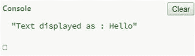

# 六、函数


本章向您介绍函数的基础知识以及它们提供的优势。首先，您将看到 JavaScript 中用于创建函数的不同类型的方法。然后，您将看到如何定义向调用程序返回值的函数，以及如何为定义的函数指定参数(自变量)。

## 函数:概述

*函数*可以简单地定义为一组语句或子程序，可以在 JS 程序中的任何地方使用或调用。一个函数通常有一个名字，但不一定要有名字，在这种情况下，它被称为一个*匿名函数*。一个函数可以有零个或多个参数。

一个函数有一个用花括号括起来的函数体，函数体可以包含几个语句。函数还可以包括 return 语句，该语句是可选的，可用于向调用方代码返回计算值。(在本章的后面，你会学到更多关于 return 语句的知识。)函数的处理在 return 语句处停止。

使用函数为开发人员提供了以下优势:

*   它节省了大量的时间和精力，因为开发人员不需要为特定的需求重写代码。

*   程序的代码比没有函数时更紧凑，更有组织，也更容易理解。

*   函数一旦被定义，就可以在整个程序或其他函数中使用。

要在 JavaScript 中定义函数，可以使用 function 关键字，后跟唯一的函数名、参数列表和花括号中的代码块。函数的语法是

```js
function name(parameter-list)
      {
         statements
      }
```

这里，name 是函数名，parameter-list 表示要传递给函数的参数列表，语句包括函数体，可能包括也可能不包括对其他函数的调用。

如果函数没有参数，您仍然需要在函数名后面加上括号:

```js
function name()
      {
         statements
      }
```

为了简单起见，本章只显示有名字的函数。

清单 [6-1](#PC3) 中的例子展示了命名函数以及如何从函数中返回值。

###### 清单 6-1。函数示例

```js
function triple(num){
    return ( 3  * num );
}
```

这个简单的例子将数字 num 增加了三倍。函数的名称是 triple，num 是要计算其三重值的参数。然后返回计算出的值。

此函数可用于 console.log 方法或如下所示的警报函数中:

```js
alert( 'Tripled figure is '+ triple(2));
```

该代码的输出如图 [6-1](#Fig1) 所示。


###### 图 6-1。输出

如前所述，要正确调用函数，需要使用 function()操作符。省略运算符()会导致返回函数(定义)的代码。考虑图 [6-2](#Fig2) 所示的例子。


###### 图 6-2。输出

###### 清单 6-2。省略函数运算符示例

```js
alert( 'Tripled figure is '+ triple);
```

列表 [6-2](#PC5) 的输出如图 [6-2](#Fig2) 所示。

## 声明函数

既然您已经熟悉了 JS 中函数的基础知识，本节将描述一些在程序中创建函数的方法。函数主要可以通过两种方式创建:

*   使用函数表达式

*   使用函数声明

以下小节详细介绍了每一种方法及其进一步的分类。

### 使用函数表达式

此选项涉及在更大的表达式中定义函数。通过函数表达式定义的函数可以是以下三种类型中的任何一种:

*   自调用函数

*   命名函数表达式

*   匿名函数表达式

#### 自调用函数

自调用函数是可以用名称或不用名称来定义但被自动调用的函数。不涉及声明和调用。表达式自动执行函数。

自调用函数的语法如下所示:

```js
(function(){
// code
})();
```

同样，函数名后跟括号()是绝对必要的。

清单 [6-3](#PC5) 展示了一个自调用函数的工作示例。

###### 清单 6-3。自调用函数示例

```js
(function () {
    console.log("See you all!");
})();
```

此示例声明了不带名称的函数。该函数是自调用的，并在浏览器控制台显示输出，如图 [6-3](#Fig3) 所示。


###### 图 6-3。输出

#### 命名函数表达式

顾名思义，命名函数是用函数表达式中的名称来声明的。

命名函数的语法是

```js
var myFunction = function namedFunction(){
    statements
}
```

这里，定义了一个变量 myFunction，函数对象被分配给它。然后，您可以使用变量 myFunction 并提供与该函数相关的任何值(如果适用)，以便执行该函数的代码。

考虑清单 [6-4](#PC9) 中的例子，它将函数名声明为 myFunction，并将它赋给声明的变量 myValue。

###### 清单 6-4。命名函数示例

```js
var myValue = function myFunction() {
         return 'Hello';
    }
console.log("Text displayed as : " +myValue());
```

清单 [6-4](#PC9) 的输出如图 [6-4](#Fig4) 所示。



###### 图 6-4。输出

#### 匿名函数

没有名字的函数(表达式)称为匿名函数。匿名函数的语法是

```js
var myFunction = function() {
    statements
}
```

清单 [6-5](#PC11) 展示了一个匿名函数的例子。

###### 清单 6-5。匿名函数示例

```js
var myFunction = function()
    {
         return 'Hello';
    }
console.log("Text displayed as : " +myFunction());
```

此示例将所讨论的函数表达式的结果赋给变量 myFunction，并使用 myFunction 调用它。

列表 [6-5](#PC11) 的输出如图 [6-5](#Fig5) 所示。


###### 图 6-5。输出

### 使用函数声明

函数声明定义一个有名字的函数，不涉及任何变量赋值。声明的函数只在被调用时执行，不会立即执行。

函数声明的语法是

```js
function funct_name(parameters) {
    Statements
}
```

清单 [6-6](#PC13) 展示了一个函数声明的例子。

###### 清单 6-6。函数声明示例

```js
function myFunction()
    {
         return 'Hello';
    }
console.log("Text displayed as : " +myFunction());
```

在示例中，myFunction()是声明的函数，在 console.log 函数中调用。每当在程序中调用它时，它都返回值“Hello”。

###### 注意

函数声明不是可执行语句。函数声明的末尾没有必要有分号。

列表 [6-6](#PC13) 的输出如图 [6-6](#Fig6) 所示。


###### 图 6-6。输出

###### 注意

除了函数表达式和函数声明之外，还有一种函数构造器创建函数的方式。在这种方法中，使用了 new 关键字。构造函数()将代码视为存储在字符串中。这方面的一个例子如下所示:

```js
var average = new Function('a', 'b', 'return ((a + b) / 2)' );
```

这里，参数用引号括起来，并用逗号分隔(在本例中是 a 和 b)。第三个字符串是代码。这种方法速度慢且难以调试，因此不推荐使用。

最好使用函数表达式或函数声明。

### 函数声明和函数表达式的概要比较

这是一个宣言:

```js
function product(a, b) {
    return a * b;
}
```

这是一个表达式:

```js
var product = function (a, b) {
    return a * b;
};
```

## 函数参数和自变量

正如本章前面提到的，函数可能包含也可能不包含参数。给定函数可能有一个或多个参数。

根据提供给函数的参数值，函数的行为会发生变化，结果也会相应地进行计算。像 a 和 b 这样的参数可以像函数代码中的任何局部变量一样进行寻址。这些参数在括号中指定，用逗号分隔。

在以下示例中，p1 和 p2 是参数:

```js
function anexample(p1, p2) {
    ...
}
```

在函数调用时，为参数提供的相应值被称为*参数*。在下面的示例中，10 和 11 是参数:

```js
anexample(10,11);
```

清单 [6-7](#PC19) 中的一个例子。

###### 清单 6-7。函数参数示例

```js
<!DOCTYPE html>
<html>
   <body>
      <script>
         function mymessage(user) {
         console.log("Good to see you " + user);
         }
         mymessage("Diego Dora")
      </script>
   </body>
</html>
```

在这段代码中，函数 mymessage 在声明时使用了一个参数 user。它接受一串文本作为参数。接下来，调用函数 mymessage 并传递文本“Diego Dora”。

清单 [6-7](#PC19) 的输出如图 [6-7](#Fig7) 所示。


###### 图 6-7。输出

### 缺少参数和未定义的值

可以调用多参数函数并省略一些参数。在函数中，任何缺少的参数的值都被设置为未定义。提供的任何额外参数都会被忽略。

考虑清单 [6-8](#PC20) 中的代码。

###### 清单 6-8。缺少参数示例

```js
function myFunction(firstparam, secondparam) {
    if (secondparam === undefined) {
        console.log(secondparam)
    }
}
myFunction(1);
```

清单 [6-8](#PC20) 是一个涉及缺失参数的例子。函数 myFunction 有两个参数，firstparam 和 secondparam。在代码中，if 语句检查是否提供了 secondparam 的值，并根据未定义的值进行检查。然后调用该函数，并且只传递一个参数。在这种情况下，因为 secondparam 的值尚未设置，所以该函数检查 if 条件并显示 undefined。

列表 [6-8](#PC20) 的输出如图 [6-8](#Fig8) 所示。


###### 图 6-8。输出

### 参数数组

函数可能包含一个名为 arguments 的特殊数组，该数组包含通过函数调用提供的所有参数。即使函数定义中没有定义参数，该数组也包含一个值。清单 [6-9](#PC21) 展示了一个演示参数数组的例子。

###### 清单 6-9。参数数组示例

```js
function myFunction() {
           console.log(arguments[0]);
           console.log(arguments[1]);
           console.log('Total Parameters passed are ' + arguments.length) }
myFunction('Diego Dora' , 'Jon Reed');
```

此示例中的函数 myFunction 在声明中没有指定任何参数。在函数中，显示了数组参数的第一个和第二个元素，以及数组的总长度。然后，该示例调用函数并提供两个参数。代码不会产生任何错误。

清单 [6-9](#PC21) 的输出如图 [6-9](#Fig9) 所示。


###### 图 6-9。输出

### 模拟可选参数传递

也可以在函数中选择参数。清单 [6-10](#PC22) 展示了它是如何工作的。

###### 清单 6-10。可选参数示例

```js
function myDivision(number, divisor) {
  if (divisor === undefined)
  {
      return('Division by zero not possible');
  }
   else

      return  number / divisor;
  }
console.log(myDivision(8));
console.log(myDivision(100, 10));
```

这个例子展示了数的除法。函数 myDivision 既可以用两个参数调用，也可以用一个参数调用。由于在第一次函数调用中没有提供除数，为了避免被零除，将检查除数的值，并显示相应的消息。当第二次调用同一个函数 myDivision 时，数字和除数分别作为 100 和 10 传递。这一次执行除法并输出值。

清单 [6-10](#PC22) 的输出如图 [6-10](#Fig10) 所示。


###### 图 6-10。输出

## 返回语句

当/如果您希望从函数返回值时，return 语句是必需的，也就是说，它将计算值返回给函数调用方。return 语句应该是函数中的最后一条语句，因为一旦遇到 return 语句，执行就会停止。

清单 [6-11](#PC23) 展示了一个返回语句如何在除法运算中工作的例子。

###### 清单 6-11。return 语句示例

```js
<html>
<body>
<script>
         var result = function(number, divisor)
         {
           return number / divisor;
         };
        console.log(result(150, 10))
</script>
</body>
</html>
```

所示函数有两个参数，数字和除数。return 语句用于将值返回给调用者。在执行时，当到达 return 语句时，会立即将控制权以及计算出的值交给调用方。

列表 [6-11](#PC23) 的输出如图 [6-11](#Fig11) 所示。


###### 图 6-11。输出

## 函数调用

如前所述，一个函数调用另一个函数也是可能的。为了更好地理解，考虑清单 [6-12](#PC24) 中的例子。

###### 清单 6-12。函数调用其他函数示例

```js
<!DOCTYPE html>
<html>
   <body>
      <script>
         function total1(a, b) {
                return a + b;
         }
         function  average(a, b) {

                 var av = total1(a, b) / 2;

                 console.log("Average = " + av);
         }
        average(8, 8);
      </script>
   </body>
</html>
```

此示例计算两个数字的平均值。它声明了两个函数 total1 和 average，这两个函数都有两个参数 a 和 b。total 1 函数返回这两个数字的总和。在 average 函数中，首先调用 total1 函数来计算这两个数字的总和，然后将这个总和除以 2 来计算平均值。console.log 函数用于显示平均值。调用 average 函数时使用了值 8 和 8。

列表 [6-12](#PC24) 的输出如图 [6-12](#Fig12) 所示。


###### 图 6-12。输出

## 参数按值传递还是按引用传递？

在 JavaScript 中，不能通过引用传递参数。当您将一个变量传递给一个函数时，JS 会复制该参数并对其进行处理。因此，在函数中，传递的参数值不能改变。

为了更好地理解为什么不能通过引用传递参数，请考虑清单 [6-13](#PC25) 中的例子。

###### 清单 6-13。通过引用传递尝试示例

```js
function decNumber(countVal) {
    countVal--;
}
var i = 10;
decNumber(i);
console.log("Value after attempt is : " + i);
```

该示例显示了使用函数 decNumber 更改变量 I 的值的尝试。它声明函数 decNumber 并传递 countVal。即使在调用函数 decNumber 之后，变量 I 的值也不会改变。

输出列表 [6-13](#PC25) 如图 [6-13](#Fig13) 所示。


###### 图 6-13。输出

JS 对传递给函数的值进行更改的一种间接方式是通过使用数组。清单 [6-14](#PC26) 中显示了修改后的相同示例。

###### 清单 6-14。按值传递函数示例

```js
function decNumber(countVal) {
    countVal[0]--;
}
var i = [10];
decNumber(i);
console.log("Value decremented to : " + i[0]);
```

该示例显示了如何使用函数 decNumber()递减数组元素的值。它声明了一个数组 I，其元素 0 被赋予了要被改变的值。该数组作为参数传递给函数。在函数代码中，数组的第 0 个元素减 1。在执行函数时，该值被改变并显示。

列表 [6-14](#PC26) 的输出如图 [6-14](#Fig14) 所示。


###### 图 6-14。输出

## 函数命名

总结这一章的 JavaScript 函数，需要注意的是:不要用函数名来命名函数。这是严格不允许的。考虑以下代码:

```js
function function(countVal) {
    countVal--;
}
```

在这种情况下，出现图 [6-15](#Fig15) 所示的错误。


###### 图 6-15。错误

## 摘要

在这一章中，你首先探索了函数的基础，并看到了它们的优点。然后，您看到了函数是如何声明的。有了这些重要的基础知识，第 7 章将讨论 JavaScript 中的高级函数。