# 一、准备您的设计环境

对于任何游戏设计师来说，工作环境都是一个非常重要的方面。你不仅会在合适的环境中获得效率，还会获得乐趣。假设您即将完成游戏，并希望立即在您的设备上测试它，但随后您意识到您还没有安装测试环境。虽然这可能只需要几分钟，但这难道不令人沮丧吗？如果这个故事引起了你的共鸣，花适当的时间遵循本章讨论的步骤。

在开始使用 GameSalad 之前，您需要准备好设计环境。本章将指导您设置所需的工具。

### GameSalad 要求

以下是使用 GameSalad 开发 iOS 游戏的最低硬件和软件要求:

> *   Intel-based Mac with 1gram
> *   Mac x 10.6 (snow leopard) or later
> *   AniOS devices (ideally one device per target platform)
> *   Xcode 4.2 or higher
> *   GameSalad Creator 0.9.91 或更高版本
> *   GameSalad Viewer 0.9.91 版拜占庭·阿列诺·阿列诺维奇·阿列诺维奇·阿列诺维奇·阿列诺维奇·阿列诺维奇·阿列诺维奇·阿列诺维奇·阿列诺维奇·阿列诺维奇·阿列诺维奇·阿列诺维奇

尽管运行 Snow Leopard 的任何基于英特尔的 Mac 电脑都足够了，但我强烈建议你买一台屏幕为 15 英寸或更大、内存为 2GB 的电脑。这将减轻你的生活，因为编译时间会变得更短。

在这一章中，我将在以下几个方面指导你:

> *   哦，天啊加米沙拉
> *   Register for the iOS Developer Program
> *   Install Xcode
> *   Install GameSalad creator
> *   Install GameSalad Viewer

### 注册到 GameSalad

要使用 GameSalad，你实际上不需要在 GameSalad.com 上注册，但我强烈建议你这么做，原因有几个。首先，这会让 GameSalad 知道你是用户。由于 GameSalad 是一家非常年轻的初创公司，了解他们的开发者社区对他们来说非常重要。用户越多，平台越有吸引力。第二，这将允许你在论坛上发布消息或问题。当你需要支持时，能够利用社区是一种无价的资源。第三，你将有资格获得 GameSalad 的标准技术支持。第四，你需要它来发布你的游戏。发布游戏和复制本书的大部分示例并不强制要求注册为 Promember，但是要访问 Promember 功能，您必须拥有一个有效的 Pro 帐户(每年 299 美元)。我将在第九章中介绍 Promember 的一些特性。当你感觉更熟练时，你可以决定注册。

要注册，请打开您最喜欢的网络浏览器并转到`[`gamesalad.com/download/getCreator`](http://gamesalad.com/download/getCreator)`。

您需要:

> *   Provide a valid email address.
> *   Select a user name.
> *   Select a password.
> *   Agree to the terms of use and privacy policy.

图 1-1 显示了极轻注册表单。

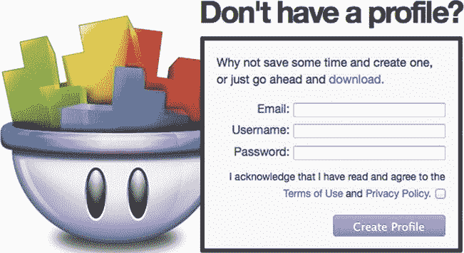

**图 1-1。**??【GameSalad】登记表

您可以在`[`gamesalad.com/terms`](http://gamesalad.com/terms)`查看条款和条件。您可以在`[`gamesalad.com/privacy`](http://gamesalad.com/privacy)`查看隐私政策。

填写所需信息后，您将被引导至 GameSalad Creator 下载和安装说明页面。

如果还不想注册，可以在`[`gamesalad.com/download/latestCreator`](http://gamesalad.com/download/latestCreator)`直接进入下载页面。

下载文件时，您可以继续阅读本章。我将在本章后面提供安装说明。

#### 关于 GameSalad Pro

成为职业玩家有几个好处，尤其是如果你打算从游戏开发中获得一个严肃的业务。

一个专业帐户将使你能够在没有 GameSaladsplashscreen 的情况下在 iOS 上发布(把你的改为！)，将外部链接放入您的应用(在精简版中实现“购买完整版”链接)，访问 GameCenter 和 iADs 功能，实现应用内购买和 Kiip 货币化，以及访问优先技术支持。

此外，虽然超出了本书的范围，专业会员资格将使您能够在 Android 平台上发布。你的潜在市场瞬间扩大了。

图 1-2 总结了成员资格的特征。

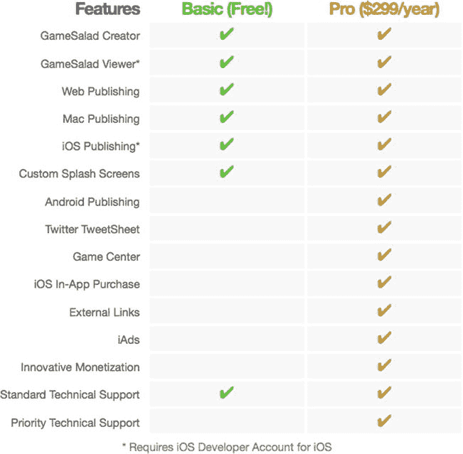

**图 1-2。** *Pro 会员功能*

在 Pro 计划中注册非常容易。使用您的免费会员帐户登录 GameSalad 网站。如果您跳过了本章的注册部分，现在返回并注册也不迟。然后你需要去`[`gamesalad.com/membership/join`](http://gamesalad.com/membership/join)`。您必须再次提供您的密码。您可以通过 PayPal 或亚马逊支付。

### 在 iOS 开发者计划中注册

如果您已经注册了 iOS 开发者计划的付费版本，您可以跳过这一部分，直接安装 Xcode。

你不需要在任何 iOS 开发者程序中注册就可以使用 GameSalad，但一旦你想在应用商店中发布应用或访问一些 GameCenter 和 iADs 功能，这将成为强制性的。为了在你的设备上安装 GameSaladiOS Viewer 和测试你的游戏的临时版本，这也是必须的。

另外，iOS 开发者计划非常实惠。个人访问每年只需 99 美元，你可以访问成千上万的教程和视频，注册访问 WWDC，预览未来的 iOS 版本，以及在 App Store 上的发布权。

此外，为了在 iOS 设备上安装任何 iOS 应用，必须在开发者计划中注册。要安装 GameSalad Viewer，您需要直接从 Xcode 安装到您的 iOS 设备。这称为临时安装。开发者计划使您可以使用多达 100 台设备来完成这项工作。

所以让我们开始吧。打开您的网络浏览器并转到`[`developer.apple.com/programs/ios/.`](http://developer.apple.com/programs/ios/.)`

然后单击“立即注册”按钮。

单击继续按钮。

根据您的情况选择一个选项，参见图 1-3 。

如果你是苹果的新开发者，

a)并且您还没有 Apple ID(或者您希望为开发创建一个特定的 ID)，那么您需要选择:

我需要为苹果开发者计划创建一个新账户和苹果 ID。

b)并且您有一个 Apple ID，那么您需要选择:

我有一个 Apple ID，我想用它来注册 Apple 开发者计划。

**注意:**Apple ID 是您的帐户，您可能已经使用它在 iTunes 上购买、注册 Apple 产品或访问 Mac 应用商店。

如果你是现有的苹果开发者，

a)但未在付费程序(iOS 或 Mac)中注册，则您需要选择:

我是苹果公司的注册开发者，我想加入苹果公司的付费开发者计划。

b)您已经注册了一个付费计划，但您想添加另一个套餐，请选择:

*我目前注册了 iOS 开发者计划或 Mac 开发者计划，我想在现有帐户中添加一个额外的计划。*

如果您注册了 Mac 开发人员计划并希望添加 iOS 开发人员计划，或者您注册了 iOS 开发人员计划并希望升级为公司注册，则属于后一种情况。

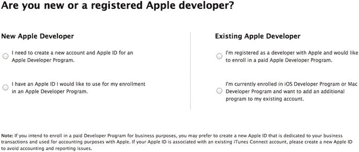

**图 1-3。** *新的或注册的苹果开发者页面*

出于本书的目的，我将向您展示为注册 iOS 开发者计划而创建新的 Apple ID 的步骤。

下一步是选择个人订阅还是公司订阅。我强烈建议您选择个人订阅。但是，如果你是一个公司，你应该注册一个。有了个人订阅，这个过程非常快速和简单。不到一天你就可以开始工作了。公司认购需要你提交许多法律文件，如公司注册，证明你有权注册公司等。苹果公司，验证过程需要几天时间。

下面就以个人为单位，如图图 1-4 所示。

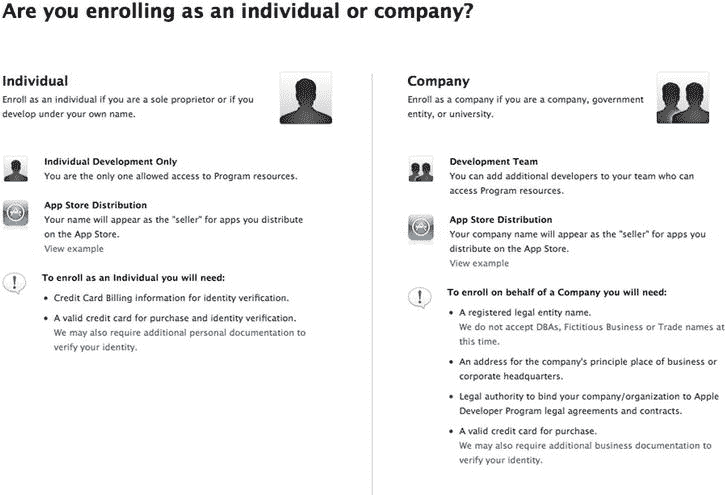

**图 1-4。** *个人或公司认购*

下一步是创建一个 Apple ID。使用表 1-1 准备您需要在苹果开发者计划登记表上提供的信息。

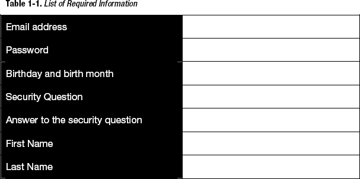

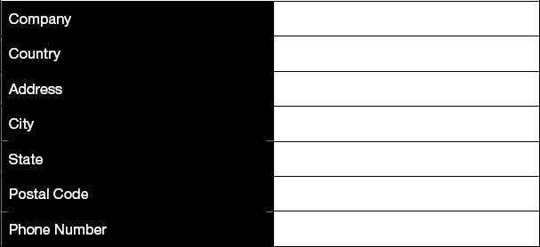

接下来，你需要提供一些关于你作为苹果开发者的活动的额外信息。苹果想知道你在哪个平台上开发:iOS、Mac OS X 还是 Safari。

这还没有结束；苹果确实很好奇你的意图。您需要根据表 1-2 中的选择选择您的主要目标市场。

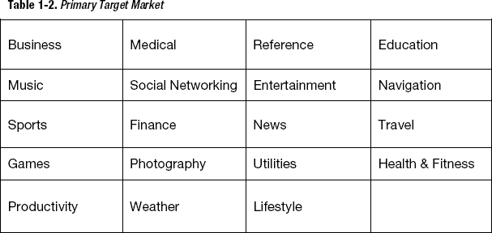

然后，Apple 会询问您打算开发的应用领域，并根据表 1-2 提供相同的选择(但您可以选择多个)。

然后，您必须指出您的应用的主要类别。

> *   Free application
> *   business application
> *   Enterprise (internal) application
> *   Web application

你还必须提供你多年的开发经验和在其他平台上的开发经验的信息(图 1-5 )。

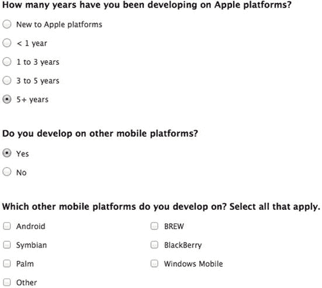

**图 1-5。** *开发者体验题*

正如你刚刚经历的，苹果喜欢了解他们的开发者社区。

下一页要求您同意注册苹果开发者协议。您可以在以下地址以 PDF 文件的形式查看该协议(在撰写本文时有效):

`[`developer.apple.com/programs/terms/registered_apple_developer_20100301.pdf`](http://developer.apple.com/programs/terms/registered_apple_developer_20100301.pdf)`

阅读协议，勾选页面底部的方框表示同意。下一步是输入刚刚发送到您之前提供的电子邮件地址的验证码，如图图 1-6 所示。

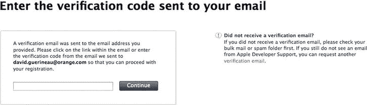

**图 1-6。** *验证码页面*

输入验证码后，您将被引导至付费信息页面。你需要在你的信用卡上输入准确的信息。

选择 iOS 开发者项目，价格为 99 美元(或者 128 新元，如果你像我一样住在新加坡的话)。

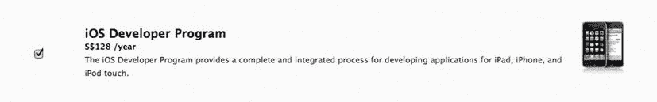

**图 1-7。** *iOS 开发者计划费用*

在提交之前，您有机会最后一次查看您的注册信息。仔细查看信息。

接下来，接受 iOS 开发者计划许可协议(这么多协议要看)。您可以通过以下地址获取该协议(截至 2011 年 10 月):

`[`developer.apple.com/programs/terms/ios/standard/ios_program_standard_agreement_20111004.pdf`](http://developer.apple.com/programs/terms/ios/standard/ios_program_standard_agreement_20111004.pdf)`

通过选中页面底部的协议框并单击“我同意”来确认您接受

你快完成了！这是最后一英里。您必须根据图 1-8 将 iOS 开发者程序添加到购物车中。

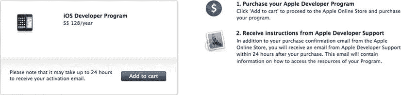

**图 1-8。** *将 iOS 开发者计划加入购物车*

商店结账并进行实际付款。这部分我会把它留给你和你的信用卡。确保信用卡上的名称与创建开发人员帐户时使用的名称相同。如果您选择了公司注册，您将需要向苹果公司传真许多法律文件。

最后一步是激活您的帐户。这可能需要几分钟到几天的时间。一旦完成，Apple 将向您发送一封电子邮件，通知您您的 iOS 开发者计划帐户已准备就绪。

这些步骤总结在图 1-9 中。

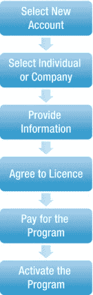

**图 1-9。** *iOS 注册流程*

### 安装 Xcode

Xcode 是来自苹果的开发环境。Xcode 的安装相当简单，只需几个步骤就可以完成。

1.安装 Xcode 需要您前往 Mac 应用商店。

2.在 App Store 应用的搜索区域键入“Xcode”。图 1-10 显示了 Xcode 页面。

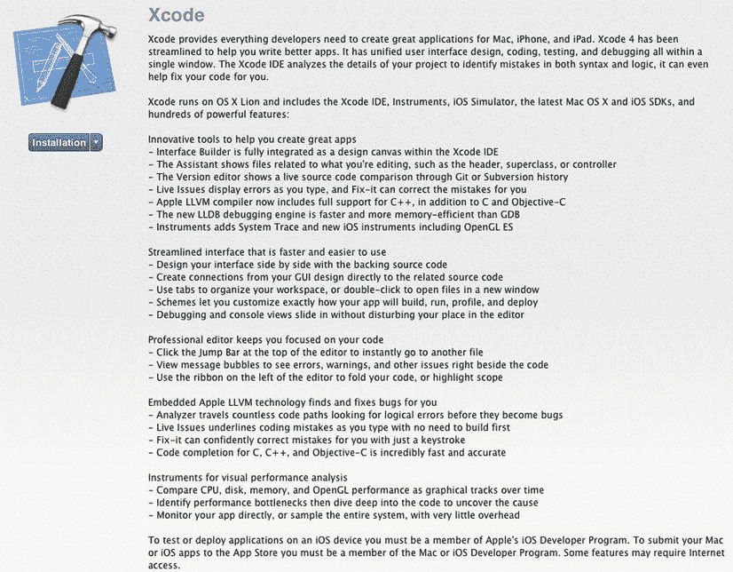

**图 1-10。***【xcode app store page】*

3.点按 Xcode 图标下方的按钮。这将开始下载 Xcode 安装文件。

这可能需要一点时间，因为文件是 1.68GB。请耐心等待。

4.下载完成后，打开`Install Xcode.app`，如图图 1-11 所示。它位于应用文件夹中。这将启动安装过程。在开始安装 Xcode 之前，您必须退出所有其他应用。

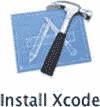

**图 1-11。** *安装 Xcode 图标*

5.根据图 1-12 ，点击安装按钮确认您要安装 Xcode。

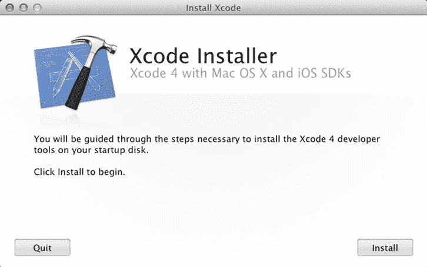

***图 1-12。** Xcode 安装程序页面*

6.根据图 1-13 阅读并接受 Xcode 许可协议。

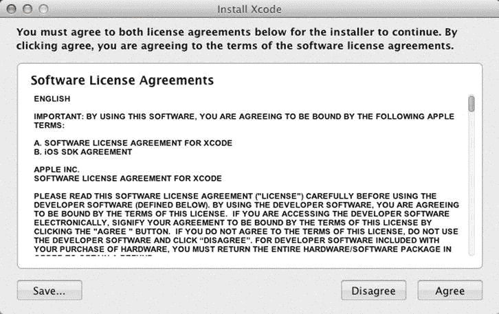

**图 1-13。**Xcode 许可协议

一旦您同意协议，Xcode 安装过程将开始，如图 1-14 所示。根据您的机器，可能需要 10 到 20 分钟。关闭其他应用将加快安装速度。

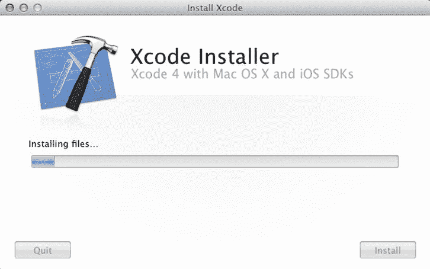

**图 1-14。** *工作中的 Xcode 安装程序*

安装完成后，将显示 Xcode 欢迎页面，如图图 1-14 所示。Xcode 图标会自动添加到 dock 中。

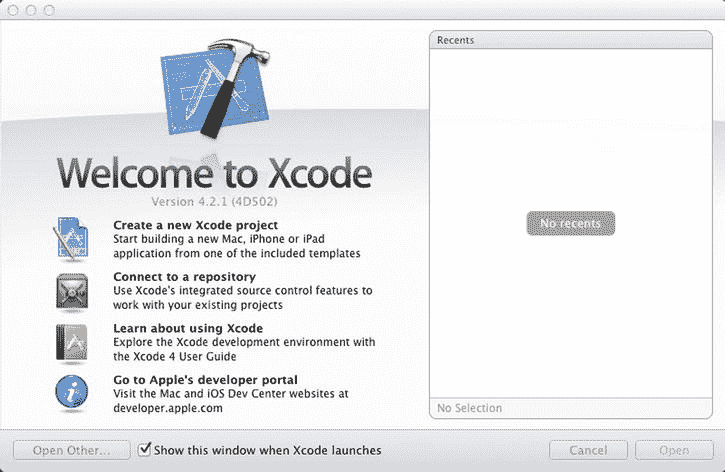

**图 1-15。** *Xcode 欢迎页*

### 安装 GameSalad Creator

安装 GameSalad Creator 非常容易。如果您尚未注册和下载安装文件，请转到`[`gamesalad.com/download/latestCreator`](http://gamesalad.com/download/latestCreator)`。

1.  双击。您下载的文件。
2.  Read and agree to the GameSalad.com Terms of Service, as per Figure 1-16. 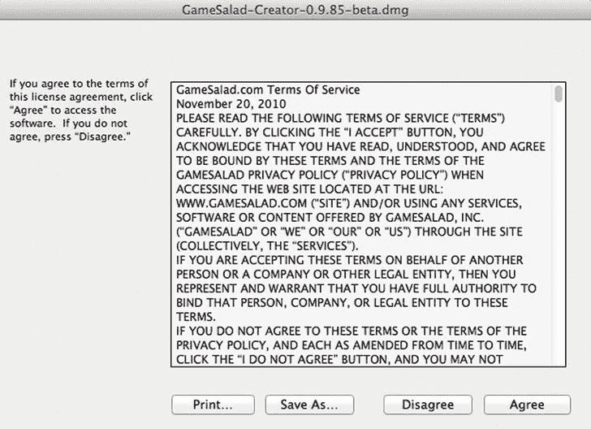

    ***图 1-16。**服务条款*

3.  Drag the GameSalad icon into the Application folder, as per Figure 1-17. 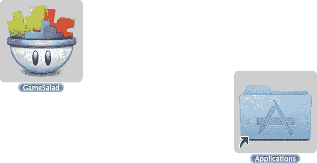

    **图 1-17。** *安装屏幕*

4.  Open `GameSalad.app` in the Application folder and you are ready (see Figure 1-18). 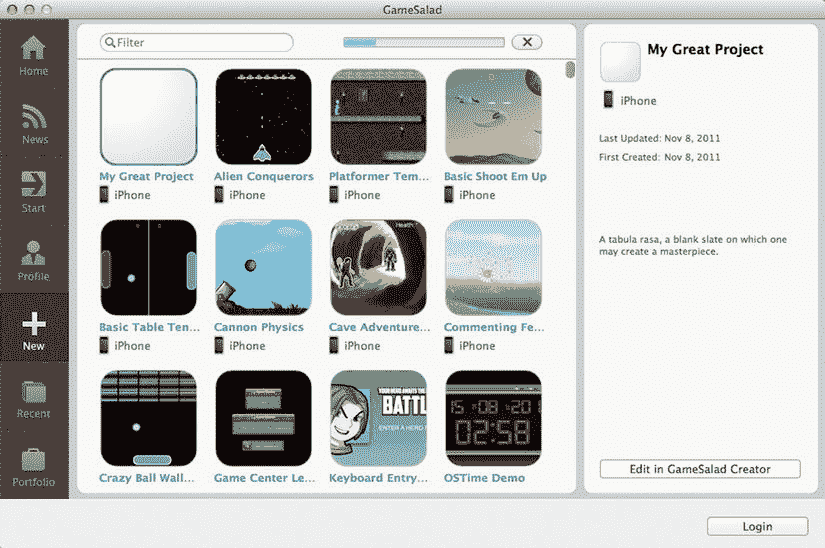

    **图 1-18。***GameSalad 起始页*

这比注册苹果开发者项目简单多了！

### 安装 GameSalad iOS 浏览器

GameSalad 查看器是一个 Xcode 项目。这意味着你下载一段代码，你将编译并安装在你的 iPhone 或任何其他 iOS 设备上。这是你之前安装 Xcode 的主要原因之一。

#### 为什么 GameSalad iOS Viewer 是一段代码？

嗯，这样 GameSalad 就可以安装一个浏览器，而不需要通过 App Store 发行版。GameSalad Creator 将通过 Wi-Fi 将您的项目发送给查看者，而不可能获得 GameSalad 生成的代码。这保护了 GameSalad 的商业模式。

#### 获取 GameSalad iOS 查看器

你可以从`[`gamesalad.com/download/getViewer`](http://gamesalad.com/download/getViewer)`下载 GameSalad iOS 浏览器。

您将使用最新版本的 iOS Viewer 下载一个.`zip`文件。但是，在匆忙解压缩文件之前，让我们来看一下在您的 iOS 设备上创建预置描述文件的过程。

#### 在您的钥匙串中安装开发者证书

开发者证书是安装 iOS 查看器或任何其他临时游戏的关键要素。它用于签署您的应用，以便您可以将它们安装在您的 iOS 设备上。

首先，你需要找到你的钥匙链。钥匙串位于“实用工具”中。

1.打开 Finder 窗口并导航到“实用工具”文件夹(在您的应用文件夹中)。

2.连按钥匙串访问应用。

在“钥匙串访问”中，您将使用“助理”向 Apple 请求开发者证书。

3.导航到钥匙串访问证书助理向证书颁发机构请求证书。

一个窗口窗体将会打开，如图 1-19 所示。

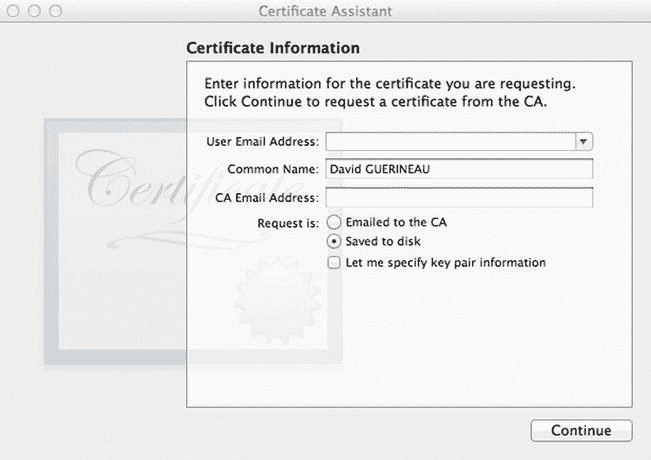

**图 1-19。** *请求证书*

使用您在 iOS 开发者计划中注册时使用的电子邮件地址填写电子邮件地址，然后选择“保存到磁盘”

单击继续按钮。

选择保存证书的位置。你可以选择把它保存在你的桌面上，这样你就可以很容易地找到它。您刚刚下载的文件是一个证书签名请求(CSR ),您将使用它来生成证书。

4.前往钥匙串访问退出钥匙串访问，关闭钥匙串访问应用。

退出“钥匙串访问”应用有助于减少安装证书时可能出现的错误。

5.打开您的网络浏览器，进入开发者会员中心(`[`developer.apple.com/membercenter/`](http://developer.apple.com/membercenter/)`)，然后点击 iOS 供应门户。

在这个阶段，你应该没有任何证书。通过单击左侧的证书菜单检查这一点，并验证没有开发或分发证书。

点击图 1-20 中所示的链接，下载 WWDR 中级证书，因为该证书需要安装在您的钥匙串中。

**图 1-20。** *链接下载 WWDR 中级证书*

6.在证书中的开发选项卡下，单击申请证书选项。

您将被引导至标题为创建 iPhone 开发证书的页面(图 1-21 )。选择您在步骤 3 中创建的证书签名请求(CSR)。

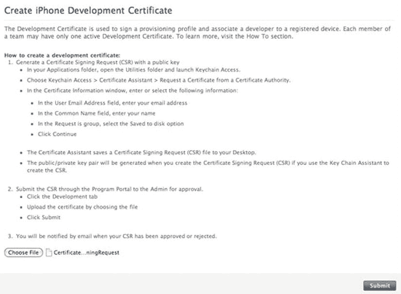

**图 1-21。** *创建 iPhone 开发证书*

选择文件后，单击提交按钮。

7.转到 Distribution 选项卡，执行完全相同的操作。

等待 1 到 2 分钟，然后刷新页面。您的开发和分发证书应该可以下载了。

8。通过单击证书旁边的下载按钮，下载分别位于开发和分发选项卡下的开发和分发证书。

现在，您的下载文件夹中应该有三个文件:

> *   【苹果园】。cer
> *   IOs _ 开发。条件性情绪反应
> *   IOs _ 发行版。条件性情绪反应

9.将证书安装在您的钥匙串中。

您需要安装这三个证书，从 AppleWWDRCA.cer 开始。要安装每个证书，只需双击每个文件。这将打开“钥匙串访问”。通过在“我的证书”窗口中检查证书，验证证书是否已正确安装。然后完全退出 KeychainAccess，然后对下一个证书重复该操作。

现在，您的计算机上已经安装了证书。

#### 为 iOS 查看器创建预置描述文件

在安装 iOS 查看器之前，您首先需要为 GameSalad iOS 查看器创建一个预置描述文件。

打开您的网络浏览器，进入开发者会员中心(`[`developer.apple.com/membercenter/`](http://developer.apple.com/membercenter/)`)，然后点击 iOS 供应门户。

1.在您的配置门户中注册您的设备。

转到设备添加设备。根据图 1-22 键入名称和设备 ID，并点击提交按钮。

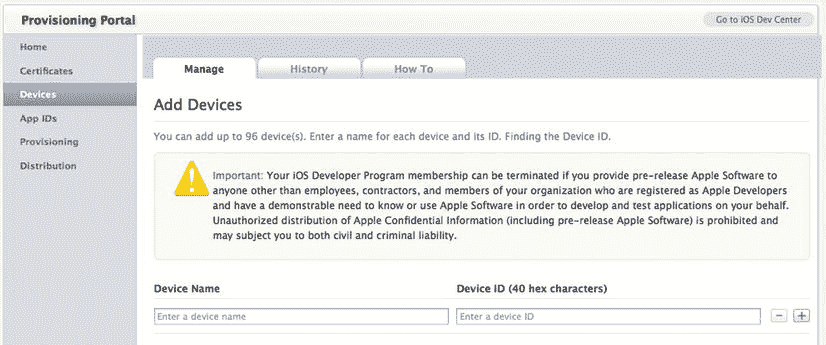

**图 1-22。** *向供应门户添加 iOS 设备*

若要获取设备 ID，请通过 USB 电缆将 iOS 设备连接到 Mac 电脑，然后打开 Xcode。在 Xcode 中，导航到窗口管理器。标识符字段中的 40 个十六进制字符串是您设备的 ID。如果这是您第一次使用您的设备进行开发，请单击本页上的“用于开发”。

2.为 iOS 查看器创建一个 AppID。

单击应用 ID 并选择新的应用 ID。对于描述，请使用全附加字符串，如 iOSViewer。不要修改团队 ID 选项。并选择唯一的包标识符。这个标识符必须是世界上唯一的。Apple 建议您反向使用 web 域名，并添加一个唯一的应用名称。点击提交按钮(图 1-23 )。

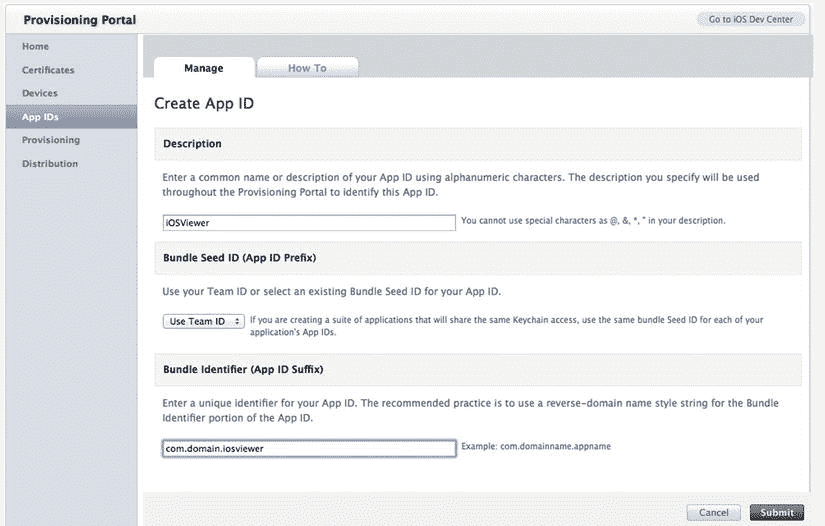

***图 1-23。**新应用 ID*

3.为 iOS 查看器创建预置描述文件。

点击供应开发新建个人资料。您将创建一个新的开发预置描述文件，允许您在 iOS 设备上安装 GameSalad Viewer。

提供类似“iOSViewer”的配置文件名称勾选您证书的复选框。根据图 1-24 ，选择您刚刚创建的应用 ID 并选择您之前注册的设备。

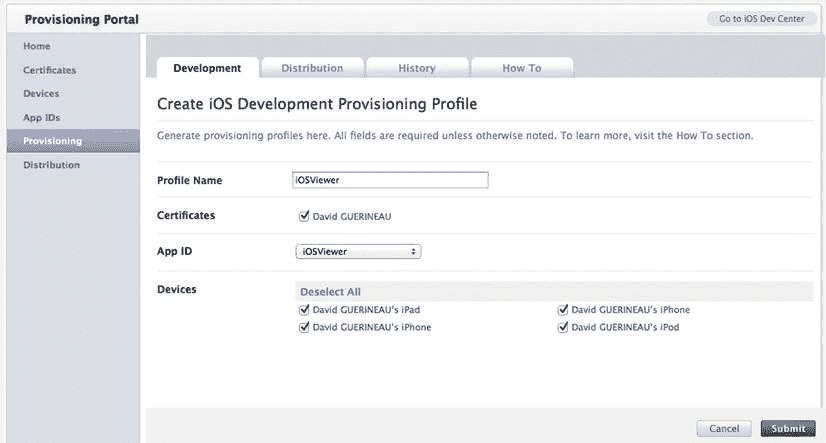

**图 1-24。** *新的配置文件*

4.下载预置描述文件。

通过点按“下载”来下载新创建的预置描述文件。如果状态仍然是挂起，点击刷新按钮，它应该在几秒钟内确定。

5.安装预置描述文件。

双击下载文件夹中的预置描述文件。这将自动在你的机器上安装它。要确认描述文件的正确安装，请打开 Xcode 并通过导航到窗口管理器来启动管理器。在管理器的左侧，选择预配配置文件，并检查您的配置文件是否出现在主窗口的列表中。如果不是这样，请通过双击您的预置描述文件来重复安装。

#### 安装 iOS 浏览器

现在是时候回到 iOS 查看器了。`zip`文件。经过这么长时间的等待，你的耐心得到了回报。你现在可以解压了。

双击`iOSViewer<version>.xcodeproj`文件(其中<版本>是你的 iOS 浏览器的版本号)。这将自动启动 Xcode。

1.更改包标识符。

点按 Xcode 左侧面板上的 GameSalad 检视器。这将显示项目摘要信息，如图 1-25 所示。

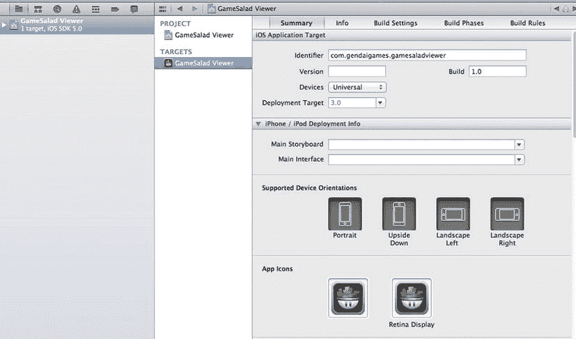

**图 1-25。** *配菜查看器信息*

将 Identifier 字段更改为您在步骤 3 中使用的值，作为您的惟一包标识符。

2.更改代码签名。

在 GameSalad viewer 项目页面中，进入构建设置，并根据新的预置描述文件“iOSViewer”更改代码签名，如图 1-26 所示。

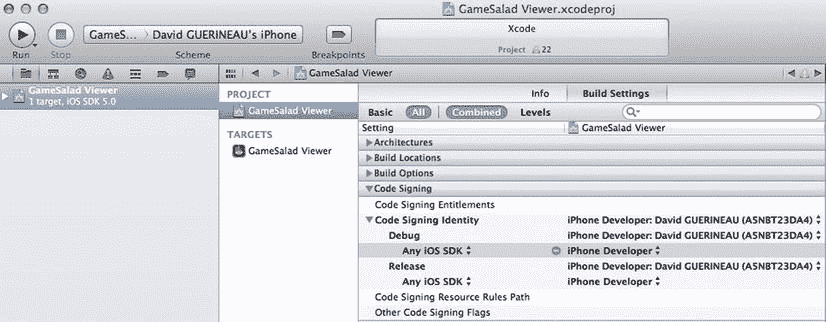

**图 1-26。** *改码签约*

你准备好运行 iOSGameviewer 了吗？

将 iOS 设备连接到 Mac，选择 iOS 的目标平台，确保从 Stop 按钮旁边的下拉栏中选择了您的设备，数到三，然后按 Run 按钮。

编译和安装可能需要 1 到 2 分钟。Xcode 会在状态面板中显示进度

然后你会在你的 iOS 设备上看到图 1-27 中的屏幕。

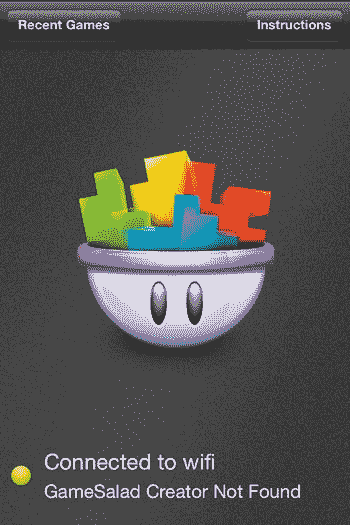

**图 1-27。** *配菜查看器*

你可以通过打开一个 GameSalad 模板来测试浏览器，比如“Basic Shoot Them Up”，然后根据你的 iOS 设备点击“在 iPhone 上预览”或“在 iPad 上预览”(参见图 1-28 )。

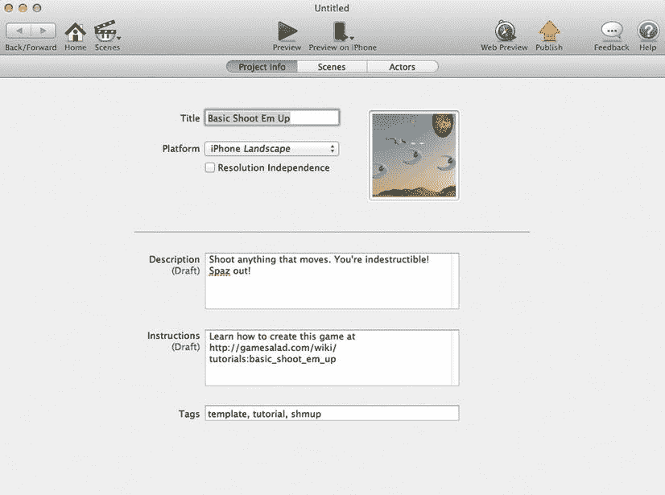

**图 1-28。** *GameSalad 浏览器启用*

恭喜你！您已经设置了您的设计环境。你现在可以继续游戏的乐趣了。让我们创造一些游戏！

### 总结

好了，最无聊的部分做完了。GameSalad 的发展需要这个小小的牺牲。从现在开始，事情会有趣得多。

本章涵盖了:

> *   Registration and installation of salad
> *   Registration on iOS developer program
> *   Xcode installation
> *   Installation of GameSalad Viewer

在接下来的章节中，当你学习 GameSalad 的基础知识时，你将会创造一些真正有趣的游戏。