# 二、你从头开始的第一个游戏：乒乓游戏

现在您已经正确地设置了您的环境，让我们使用 GameSalad 来创建一个真正的游戏。在这一章中，我将指导你创建一个完整的游戏:Pong。这一章涵盖了 GameSalad 的基础知识；下一章将介绍游戏的更多特性。

本章具体涵盖:

> *   Game project creation
> *   Create scenes, actors, attributes, behaviors
> *   Introduction to collision

为了看看你将在本章中实现什么，你可以打开文件`MyFirstPong_step6.gameproj`，它位于`[www.apress.com](http://www.apress.com)`的`Chapter_1_File`文件夹中。打开此文件将启动 GameSalad。然后你只需要点击 GameSalad 中的预览按钮。

### 关于乒乓球的一点历史

七十年代见证了电子游戏产业的诞生。Pong 为许多其他游戏开发者指明了道路。当然，当时的技术并不像今天这样先进，所以游戏非常有限。最重要的限制之一是图形。作为最早的街机游戏之一，Pong 也不例外。用户界面非常简单，正如你在图 2-1 中看到的。尽管如此，它是如此具有革命性，以至于公众大量采用了它。

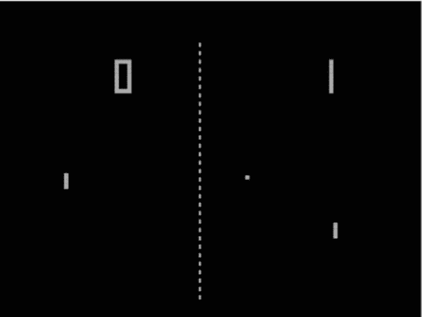

**图 2-1。** *原 Pong 游戏截图*

Allan Alcorn 于 1972 年在 Atari 工作时创建了 Pong。但是世界几乎没有了解这个游戏。作为一名实习生，Allan 被分配了创建一个游戏的练习，以发展他的技能。他带着 Pong 回来了。雅达利的管理团队被最终的结果彻底吓住了，他们决定将游戏商业化。这可能是他们最好的决定之一。Pong 作为一款街机游戏的首次发布获得了巨大的成功，并催生了视频游戏行业。图 2-2 显示的是街机版 Pong。

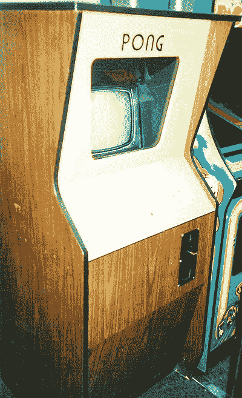

**图 2-2。** *原 Pong 街机*

Pong 后来开发了几个版本，包括一个家庭游戏。Pong 的家庭版，如图图 2-3 所示，创建于 1974 年，但由于难以找到发行渠道，直到 1975 年才发布。随着时间的推移，已经发布了几个版本(和克隆版本)。

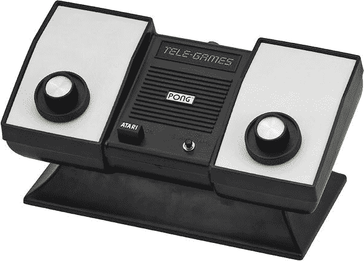

**图 2-3。** *批量生产的乒乓游戏*

我记得我在雅达利家用游戏机上玩了几个小时的乒乓球。原来父亲给自己买了一台雅达利 2600。这是 1982 年发行的“达斯·维达”特别版，全黑色，有四个开关。这是最早的视频游戏机之一。有了游戏机，你就有了一个可以运行几个游戏的设备(通过一个卡带系统)——而不像 Home Pong 那样只能运行一个游戏。那时我只有五岁，但我清楚地记得我玩得很疯，让我父亲很生气，因为几天后我就不可战胜了。

### 指定游戏概念和规则

当你开始一个新的游戏项目时，一个好的做法是从指定游戏概念和在纸上写下游戏规则开始。这为你的工作提供了结构。

#### 游戏概念

这个游戏的目的是通过第一个达到 11 分，在模拟乒乓球比赛中击败你的对手。这是一个二维游戏，玩家垂直控制球拍。

#### 游戏规则

人类玩家 1 在屏幕左侧与人类玩家 2 对战。(CPU 播放器将在下一章介绍。)球员用球拍来回击球。

### 创建新的 GameSalad 项目

你准备好玩乒乓球了吗？

首先，让我们创建一个新的 GameSalad 项目。在应用中点击 GameSalad 图标，如图 2-4 所示，打开 GameSalad Creator。

**图 2-4。***GameSalad 应用 logo*

选择加号按钮(新建)，选择“我的伟大工程”，然后点击“在 GameSalad 中编辑”这将在 GameSalad 中打开一个新项目(图 2-5 )。

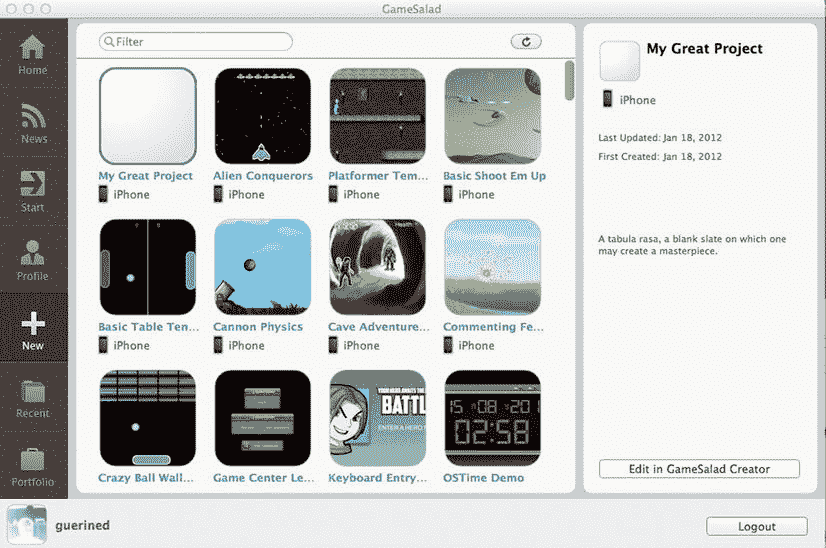

**图 2-5。***GameSalad 启动画面*

您将到达图 2-6 所示的页面。

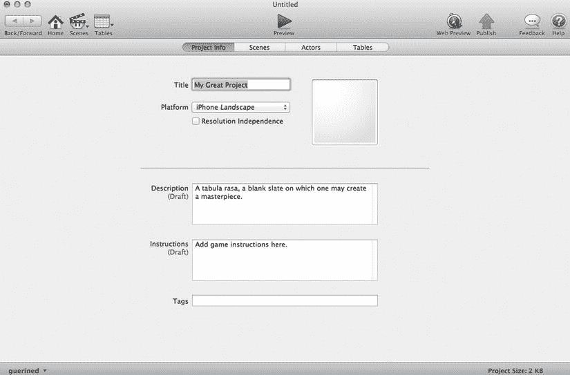

**图 2-6。** *项目信息页面*

此页面是项目信息页面。它包含项目的一般信息，如项目标题、游戏平台、描述和说明。输入表 2-1 中显示的信息。

你的屏幕应该看起来像图 2-7 。

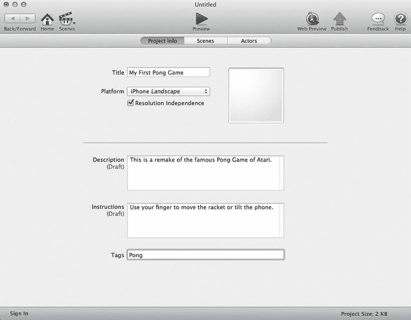

**图 2-7。** *我的第一个乒乓游戏项目信息页面*

所有这些信息都只是草稿。在您提交作品供 App Store 验证之前，您将有机会对其进行审核。

保存项目。在文档中创建一个文件夹，并将其命名为`LearnGameSalad_chap2`。

现在保存项目的副本。这样你可以经常保存你的进度。点击文件另存为，将文件命名为`MyFirstPong.gameproj`，保存到新建的文件夹中(图 2-8 )。

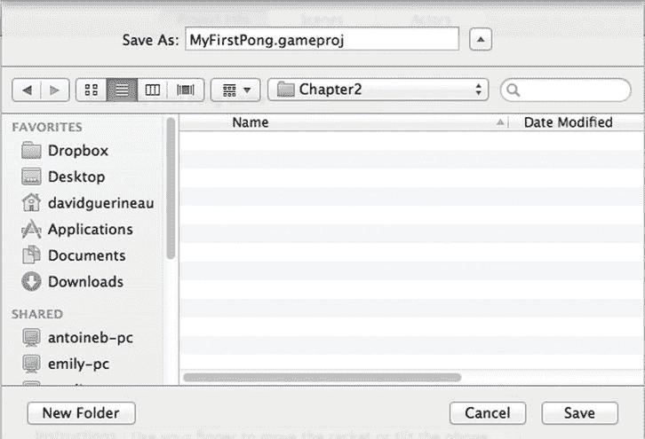

**图 2-8。** *拯救游戏*

你已经准备好开始你的项目了。

关于分辨率独立性:

分辨率独立是 GameSalad 的一大特色。简而言之，它可以让你设计一个高分辨率版本的游戏，可以适应 iOS 设备的各种分辨率。这增加了游戏中潜在目标的数量。

它是如何工作的？GameSalad 会自动调整所有作品的大小，通过创建较低分辨率的作品副本来适应 iOS 设备的分辨率。

要享受此功能，请选择分辨率独立性，并为 retina 显示屏分辨率设计您的游戏作品。

有一个小秘密让它很好地工作。你所有的作品必须有一个像素大小，你可以除以 4。为什么是 4？因为，为了更好地展示你的作品，它必须是一个偶数(比如 20×20)。GameSalad 会自动调整到较低的分辨率(即除以 2)，所以需要是偶数！因此 4！

警告:图像的大小限制为 1024×1024。

如果你正在计划一个低分辨率的游戏(480 ×320)，没有必要检查分辨率独立性。另一个取消选择此选项并计划低分辨率游戏的好理由是，旧设备(如第一代 iPod touch)将难以处理这些图形。一如既往，最好的建议是:测试，测试，再测试。

到目前为止，你阅读的页面提到了演员、场景和项目。所以你可能会很自然地问自己，“我读的书对吗？我以为我读的是游戏创作，一切看起来都像电影制作。我没钱请布鲁斯·威利斯来拍我的作品！”

是的，你正在看一本关于游戏设计的书。但是，把游戏创作想象成一部电影，有一个情节(游戏机制)、一些演员(角色或物体)和一个方向(行为和属性)，不是更容易吗？

GameSalad 允许你像设计电影一样设计你的游戏。您将使用场景(闪屏、菜单、关卡、游戏)和演员在这些场景中进行交互。

### 添加演员

准备好扮演电影导演…呃…游戏导演的角色了吗？我们来捏造一些演员吧！

#### 什么是演员？

演员是一个具有特定行为和属性的对象，您将把它放在场景中。通常，在乒乓球比赛中，球是一个演员。至于具体的行为，你会告诉球和一些球拍碰撞，和墙壁碰撞时该如何反应。球也将具有一些属性，这些属性将定义球本身；例如，它将是可移动的。

演员编辑器的视图如图 2-9 所示。

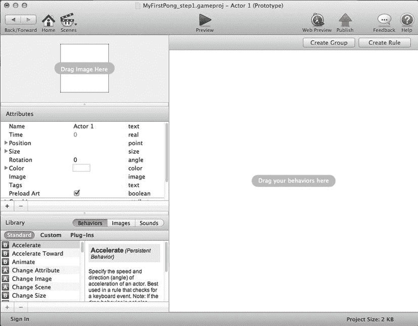

**图 2-9。**??【行动家】

#### 创造演员

创建执行元有两种方式:

> *   Through project editing
> *   Via scene editing

就我个人而言，我在创建场景时主要使用场景编辑器来创建新的演员，但是如果你是一个非常好的规划者，你可以在创建项目时使用项目编辑器来创建大多数(如果不是全部)演员。我将在这里用场景编辑器来创建一个演员。

点击图 2-10 中所示的场景图标。

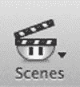

**图 2-10。** *场景图标*

选择“初始场景”将打开场景编辑器。根据图 2-11 定位左侧的演员检查窗口。点按“执行元检查器”窗口下方的+号。

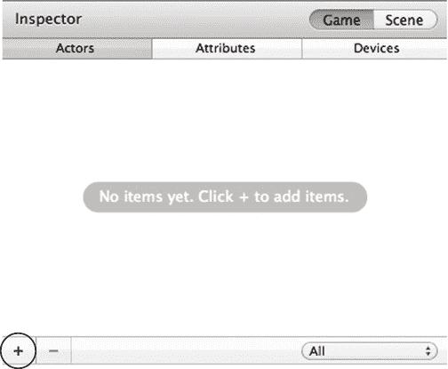

**图 2-11。** *演员督察窗口*

就这样！你刚刚创造了你的第一个演员！

### 修改演员属性

演员的属性可以通过行为来修改。但是首先你需要理解一个重要的概念。

#### 实例或原型

在您继续之前，我需要介绍一个非常重要的概念(VIC ),即 actor 原型和 actor 实例。

actor 原型是您定义主 actor 的地方。您将定义参与者、其属性及其行为。

然后，每当您将这个演员放置在游戏的一个场景中时，就会自动创建这个演员的一个实例。实例将自动继承原型的属性(特性和行为)。

关于面向对象编程:

面向对象编程(OOP)是一种以对象为中心的编程概念。对象是一种数据结构，它包含关于对象以及操作(称为方法)的描述性信息。OOP 超出了本书的范围，但是也许你已经注意到了 OOP 和 GameSalad 之间的相似之处。参与者是对象，属性是描述信息，行为是方法。事实上，这并不奇怪。GameSalad 只隐藏了 iOS 开发的编程方面！iOS 开发语言是 Objective-C，你猜怎么着？Objective-C 是一种面向对象的编程语言。

如果需要修改特定实例的某些属性或行为，必须解锁该实例才能访问其属性和行为。场景属性，如摄影机或方向属性，只能从位于场景中的演员处访问。因此，您需要编辑执行元实例。

#### 演员属性

为了更好地理解参与者属性的概念，您需要将属性视为描述参与者的项目。例如，要描述一个人类演员，你会提到头发的颜色(金发、棕色、灰色、深色或没有)、眼睛的颜色(蓝色、棕色、绿色)等。因此，属性是项目及其值的特征。

那么这在 GameSalad 中意味着什么呢？假设你有一个演员叫鲍尔。它可以是可移动的(是或否)，它有高度和宽度，颜色等。

#### 常用属性

让我们快速回顾一下一个演员最重要的属性。这些属性可从图 2-9 所示的参与者编辑器中访问。

##### 名字

该字段包含执行元的姓名。使用特定的名称；如果你的项目中有很多演员，这一点尤其重要。

##### 尺寸

你可以指定演员的大小。如果您计划使用图像，请输入图像的大小。

不要忘记关于尺寸的提示(要能被 4 整除！)

##### 颜色

如果不使用图像，可以在演员中填充颜色。

##### 标签

标签是一种将演员分组并让他们以相似的方式行为的方法。例如，您可以将一些参与者分组为可聚合的。然后，您可以定义一个规则，使一个特殊的对象(例如，一个球)与所有可碰撞标记的对象发生碰撞。

##### 物理学/密度

位于物理学之下，密度代表一个演员的重量。GameSalad 实现密度的方式非常接近现实生活。根据 GameSalad 支持，GameSalad 的单位等于标准密度(千克/立方米)。

##### 物理学/摩擦

位于“物理”下，该属性用于模拟摩擦力，摩擦力是两种材料接触产生的力。摩擦力的值越低，模拟反应就越柔和。值为 0 将模拟冰。

##### 物理/可移动

位于“物理”下，该属性让您决定对象是否可以移动。如果不可移动，物体将处于固定位置。但是，演员将能够通过更改属性和插值行为进行移动。

这个列表并不详尽。更多的属性将在接下来的章节中介绍，您将学习如何创建一些自定义属性。

#### 修改属性

要修改演员，请在场景编辑器的演员窗口中双击该演员。这将在 actor 编辑器中打开 Actor 原型。然后，您只需要访问 Actor 编辑器中的每个属性。让我们练习一下。

双击您之前创建的演员(演员 1)，如图图 2-12 所示。

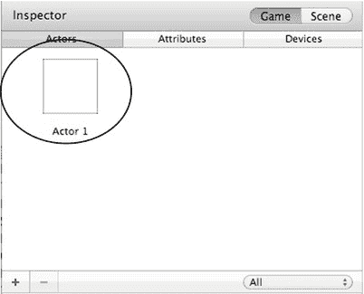

**图 2-12。** *检查员中的演员 1*

双击 Actor 1 打开 Actor 编辑器，如图图 2-13 所示。

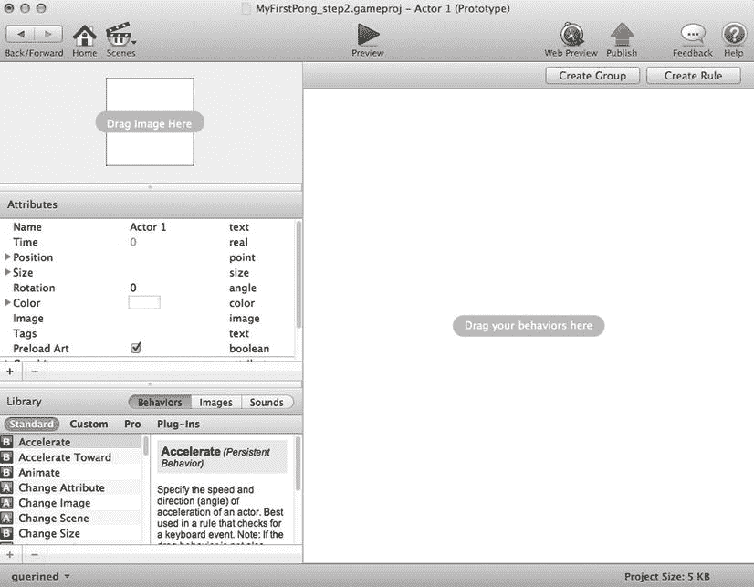

**图 2-13。** *演员编辑为演员 1*

现在让我们更改以下属性:

> *   名称:Rack Player 1
> *   Size/width: 16
> *   Size/Height: 120
> *   Color: white
> *   Physical/density: 500
> *   Physical/friction: 3
> *   Physical/Recovery: 0
> *   Physical/Fixed Rotation: checked (this will prevent the actor from rotating after colliding with the ball. )

现在保存您的项目。

关于归还属性:

恢复属性定义反弹度。零表示没有反弹！迷茫？为什么不用弹力呢？球弹不起来怎么回去？嗯，球会弹起来，不是球拍！(想象一下球拍弹到墙外。不太会玩。)恢复值为 1 意味着碰撞中没有能量损失(因此它是完全弹性的)。

### 添加行为

可以打开`MyFirstPong_step2.gameproj`从这个点开始。

为了向参与者添加动作，您需要添加行为。使用行为，您可以更改参与者的外观，为一些特定的动作设置一些条件，或者让他们根据计时器执行动作。因此，你使用行为来增加游戏的逻辑性。

#### 什么是行为？

为了理解 GameSalad 中的行为，让我们继续类比人类演员。作为一名电影导演，你指导你的演员执行某些任务(比如当警察看到坏人时，警察会向他们开枪)。

在游戏中，行为指导你的演员。你可以指示一个演员，如果一个条件被满足，它会自动销毁自己。这是一个行为的例子。

你可以有动作的行为(如碰撞时如何反应)或检查特定条件的行为(如果分数低于 11，继续玩)。

有三种类型的行为:

1.  出现一次的行为(这些行为的名称旁边有一个红色方框，里面有一个“A”字母)。
2.  持续的行为(这些行为的名字后面有一个绿色方框中的字母“B”)。
3.  使用条件来执行其他行为的规则(这些规则在其名称旁边的蓝色框中有一个“G”字母)。

#### 添加行为

从 Actor 编辑器添加行为相当容易。在左下角，您可以访问行为库。您可以通过将目标行为拖放到行为区域来选择它。

如果需要创建规则行为，可以从行为列表中拖拽规则行为，也可以点击角色编辑器右上角的创建规则按钮，如图图 2-14 所示。

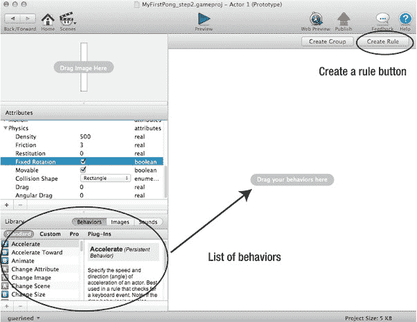

**图 2-14。** *演员编辑*

关于规则行为:

规则行为用于定义行为的条件。它可以是参与者或属性上的条件。它可以是一个条件，同时是几个条件，或者在给定时间是几个条件中的任何一个。

现在我们来练习。从上下运动开始。为此，创建一个规则，当一个键被按下时，一个行为(运动)被触发。

1.单击新建规则按钮。

2.单击“开”按钮旁边的“规则”,将规则重命名为“向下”

一条规则有三部分，如图图 2-15 所示。

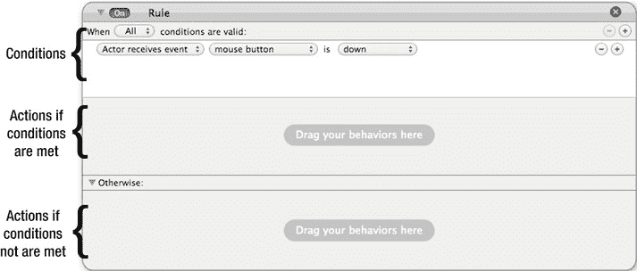

**图 2-15。** *一个规则的三个组成部分*

规则条件位于规则的顶部。由于您可能有多个条件，因此您可以选择满足所有条件以触发行为，或者满足任何条件以触发操作。

> 3.将条件修改为“执行元接收事件”同样，选择“向下”键，如图图 2-16 所示。

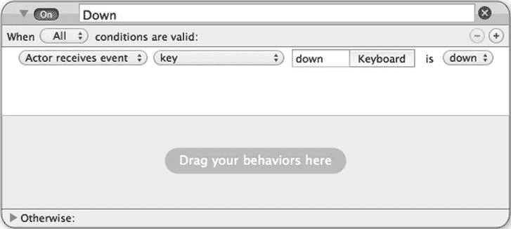

**图 2-16。**?? 降服的条件

> 4.如果满足条件，从“行为”库中，拖动移动行为(不是“移动到”行为)并将其放入规则的行为区域。修改方向为 270°的移动行为。

完整的规则如图 2-17 所示。

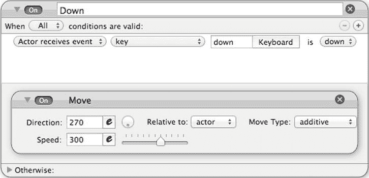

**图 2-17。** *降格的行为*

关于搬家行为:

移动行为有几个界限。

方向:您可以输入一个以度数表示的值或一个数学等式来定义演员将要采取的方向。例如，0 将使一个演员移动到他的运动参考点的东方(见下文)。

相对于:这定义了移动的参考点。你有两个选择:演员本身或者场景。相对于场景是在场景的绝对参照中的运动。如果相对于场景放置 0，演员将移动到场景的右边。如果相对于演员放置 0，演员将移动到他的右边，如果演员颠倒，这可能是场景的左边。

移动类型:您可以选择添加或堆叠。“相加”将累加其他“移动”或“移动到”行为的速度和方向，而“堆叠”将仅应用最近一次“移动”或“移动到”行为的速度和方向。

速度:你可以输入一个值或者打开公式编辑器，方法是点击数值框右边带“e”的小框，输入一个数学公式来定义运动的速度

试着自己创造向上的规则。这里有一些提示:

> *   You can copy down rules by holding down the option, dragging down rules, renaming rules, and changing settings. Or, you can choose the downward rule, copy (Command+C), and then paste (Command+V). Another way is to create a new rule, just like you did with the Down rule.
> *   The name of this rule is upward.
> *   The condition of the rule is "Actor receives event", and the key is "up"
> *   Drag and drop a movement behavior, and change the setting according to the downward rule, but the direction is set to 90.

您可以打开`MyFirstPong_step3.gameproj`文件从这一点进行跟进。

在将该演员放到场景中之前，为每个架子再添加一个行为。将其位置约束在水平轴上。这意味着球拍会上下移动，但会在一个固定的水平位置(X 轴上的恒定值)。为此，请使用约束属性行为。

在行为库(图 2-14 )中，找到“约束属性”行为，并将其放入刚刚创建的“向上”规则下的“执行元行为”窗格中。若要选择要约束的属性，请使用属性浏览器。点按值输入栏右侧带有三个点的按钮。浏览至机架玩家 1 位置 X，如图图 2-18 所示。

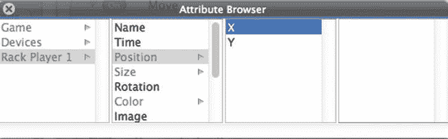

**图 2-18。** *属性浏览器*

双击 X 属性进行验证。将该约束的值指定为 20，这会将球拍约束在距离屏幕左侧 20 个像素的垂直轴上。完整的行为如图 2-19 所示。

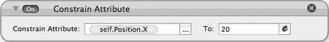

**图 2-19。** *约束属性*

现在，您已经准备好在场景中定位演员了。

### 向场景中添加演员

你已经为 1 号玩家创造了球拍。现在让我们把它放在现场。

回到场景编辑器，将演员放到场景中。位置只需要是近似的，因为你已经将球拍约束在 x 轴上，如图图 2-20 所示。

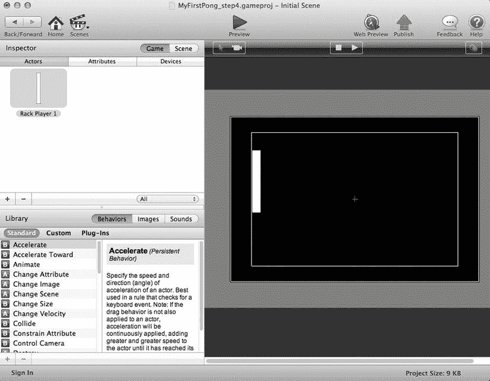

**图 2-20。** *现场摆放球拍*

点击预览！你在现场有一个球拍，可以用键盘的箭头键上下移动。

你可以通过打开`fileMyFirstPong_step3.gameproj`进入这个阶段。

### 创建其他演员

我已经带你通过一个非常详细的方法来为玩家 1 创建球拍。现在，您将创建一些剩余的演员。您将为玩家 2 定义球拍、球和墙，以获得定义的游戏区域。你还会增加一点力度，这样你就可以有快速的发挥。

我会更快地引导你，但我会突出一些新的项目，因为他们出现了。

#### 球拍手 2

要为玩家 2 创建球拍，请创建一个新演员。双击这个新演员，在演员编辑器中对其进行编辑。按照以下方式更改属性:

> *   Name: Luggage rack player 2
> *   Size/width: 16
> *   Size/Height: 120
> *   Color: white
> *   Physical/density: 500
> *   Physical/friction: 3
> *   Physical/Recovery: 0
> *   Physical/Fixed Rotation: Checked

然后创建以下两条规则:

1.  一个名为 Down 的规则。当“A”键被按下时，它将被触发(条件)。该行为将是一个方向为 270°的移动。
2.  一个名为 Up 的规则。当“Q”键被按下时，它将被触发(条件)。该行为将是一个方向为 90°的移动。

最后，添加一个名为 Constrain Attribute 的行为，actor X 被约束为 460。

现在，把你的球拍放在现场。您可以近似放置它，因为位置约束会自动正确定位它。你的 Rack Player 2 编辑器屏幕应该看起来像图 2-21 。

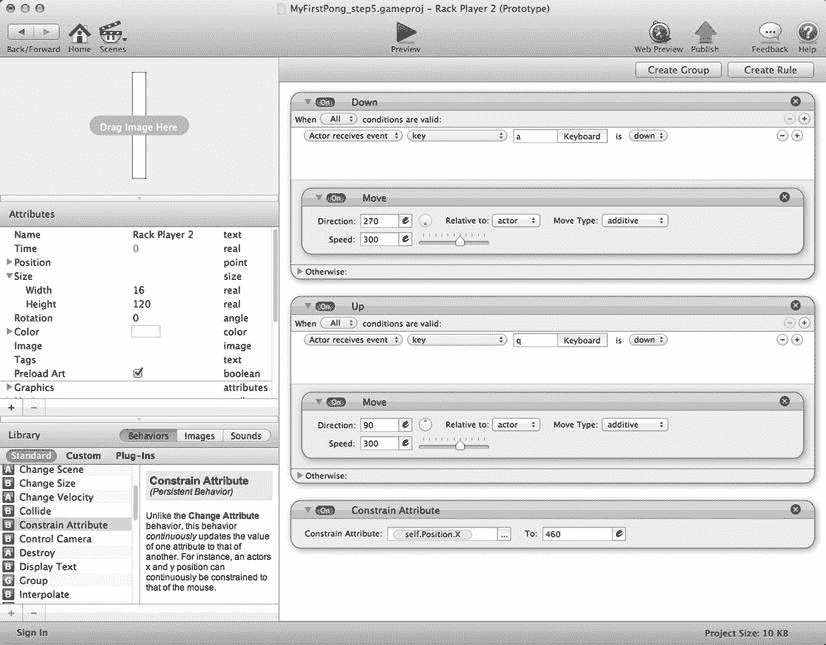

**图 2-21。** *Rack Player 2 编辑屏幕*

#### 球

现在，您将创建球。为了简单起见，您将创建一个 16 × 16 像素的方形球。这个 actor 将从另一个 actor 生成:Rack Player 1 或 Rack Player 2。在 GameSalad 词汇表中，我们说这个演员是*衍生的*。

像往常一样，创建一个新的执行元，并在执行元编辑器中更改以下属性:

> *   Name: Ball
> *   Size/width: 16
> *   Size/Height: 16
> *   Color: red
> *   Physical/Recovery: 1
> *   Physical/fixed rotation: checked.
> *   Physical/collision shape: circle

您有两个选项来定义演员将如何碰撞。形状可以是矩形或圆形。

球将从货架玩家 1 或货架玩家 2 中产生，这取决于哪个玩家为游戏服务。默认情况下，玩家 1 先发球开始游戏。得分的胜者将发球。要定义哪个玩家发球，使用一个关于玩家 1 是否发球的布尔属性。如果为真，玩家 1 发球；如果为假，则由 2 号选手发球。

在场景编辑器中，选择属性检查器窗口，点击+号创建一个新的布尔属性，如图 2-22 所示。

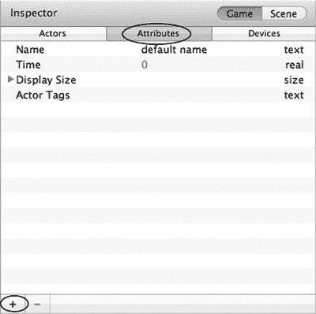

**图 2-22。** *属性检查器窗口*

将这个属性命名为`P1Serving`并检查它。

回到球演员的演员编辑器，创建一个新规则。该规则将检查哪个球员正在发球，并根据结果改变方向。为此，请使用规则的 Otherwise 部分。

创建一个新规则，称之为球的方向。条件是如果游戏的属性。P1Serving 是真的。在“改变速度”行为中拖移。

使用表达式编辑器更改方向。点击方向栏右边的小“e”，如图图 2-23 所示。

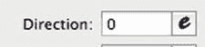

**图 2-23**??。表情编辑器图标

这将打开如图 2-24 所示的表达式编辑器。

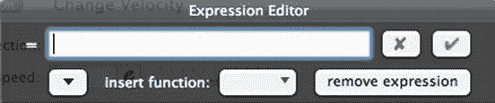

**图 2-24。** *表情编辑*

单击插入函数下拉菜单，选择随机(最小值，最大值)函数，并将最小值替换为-45，将最大值替换为 45。通过这样做，球将在-45 度和+45 度之间的方向上运动。然后，单击绿色复选标记实际插入该函数。图 2-27 提供了角度的直观表示。

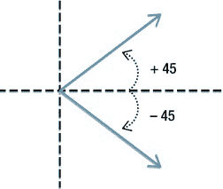

**图 2-25。** *球的方向(-45，+45)*

在“其他”部分中拖移另一个“更改速度”行为，可通过点按规则底部“其他”文本前面的箭头来访问该行为，并将“方向”值更改为“随机(135，225)”，然后点按绿色复选标记。图 2-26 提供了角度的直观表示。

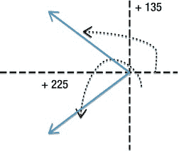

**图 2-26。** *【球方向(135，225)】*

你应该会得到一个类似于图 2-27 的规则。

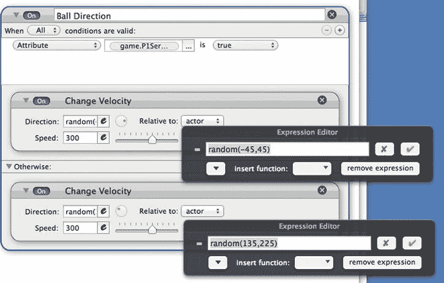

**图 2-27。** *球的方向规则*

关于表达式编辑器:

表达式编辑器是高级编辑器，您可以在其中使用高级数学公式来定义复杂的动作和移动。我将在后面介绍更多数学方面的内容。

关于表达式编辑器，你需要知道一些提示:

1...用于显示多个属性。

示例:(actor.position.X)..(actor.position.Y)

2.“文本”用于显示文本。

示例:“X 位置:”..(actor.position.X)

3.\ "用于在双引号文本内的文本中插入双引号。

示例:“这是文本中的引用”

4.\32 用于在双引号文本中插入一个空格。

示例:“这是一个空间”

5.\n 用于在双引号文本中开始新的一行。

示例:“这添加了\n 一个新行”

让我们回到球拍，使他们能够产卵球。当空格键被按下时，球将被产生。你猜怎么着？你将使用一个规则。

在演员编辑器中打开 Rack Player 1。创建一个新规则，并将其命名为 Serving。条件是当 Actor 接收到事件并且按下空格键时。

你还需要检查是否轮到玩家 1 发球。为此，请使用您之前创建的属性 P1Serving。如果 P1Serving 为真并且空格键被按下，那么 Rack Player 1 将产生球。

通过单击+号在服务规则中添加新条件。条件将是如果属性游戏。P1Serving 是真的。

现在，在服务规则的行为区域添加一个 Spawn Actor 行为。将演员改为球，水平位置改为 16。这将会在球拍的正前方产生球。

发球规则应该类似于图 2-28 。

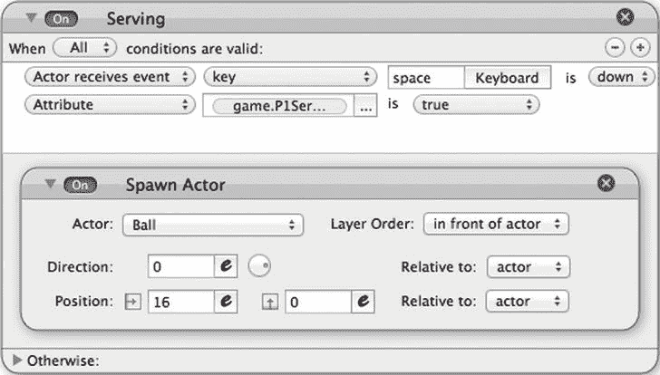

**图 2-28。** *发球规则*

现在，您可以对 Rack Player 2 进行同样的操作，只需进行以下修改:

> *   In the attribute game state. P1 serving is fake.
> *   The ovipositor is the ball, and the position is -16 (the ovipositor ball is on the left side of the racket).

图 2-29 显示了货架玩家 2 的发球规则。

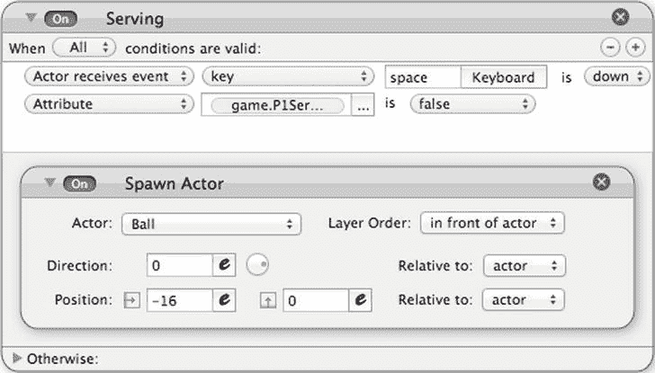

**图 2-29。** *架球员 2 的发球规则*

您可以打开`MyFirstPong_step5.gameproj`文件来查看这一阶段的结果。通过在属性编辑器中将 P1 发球的值从 true 更改为 false，可以在预览模式下从球拍 1 或球拍 2 发球。

现在让我们在这个游戏周围放些墙吧！

#### 墙壁

下一步是在游戏区域周围创建一些墙，并实现一些弹性。

像往常一样，创建一个新的演员。双击这个新演员，在演员编辑器中对其进行编辑。按照以下方式更改属性:

> *   Name: bouncing wall
> *   Size/width: 480
> *   Size/Height: 10
> *   Physical/density: 500
> *   Physical/Recovery: 0
> *   Physical/Fixed Rotation: checked
> *   Physical/Removable: unchecked

回到场景编辑器。将反弹墙拖动到场景中，并将其放置在可见场景的正上方。将另一面反弹墙拖动到场景中，并将其放置在可见场景的正下方。参见图 2-30 查看结果。

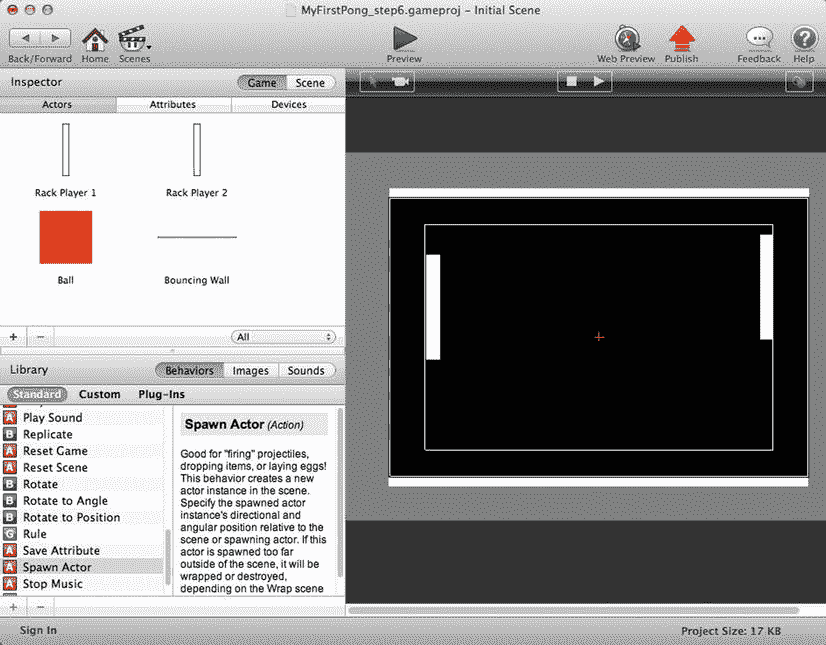

**图 2-30。** *场景与墙壁*

通过将反弹墙拖动到场景中两次，您就创建了同一个演员的两个实例。如果在 actor 编辑器中双击 Actor，就可以修改原型，所有实例都会反映出修改。但是，如果您双击其中一个实例，您将只编辑该实例，而不编辑其他实例。

这有印象吗？这就是之前介绍的 VIC(非常重要的概念)。

#### 标签

标签是非常有用的工具。它们是一种将演员分组在一起，然后将行为应用于标签(即演员组)的方法。您现在将创建的演员组是可聚合的演员组。

要创建一个新的标签，请按照图 2-31 点击主页图标。

**图 2-31。** *首页图标*

根据图 2-32 ，点击主屏幕左侧按钮的+按钮。

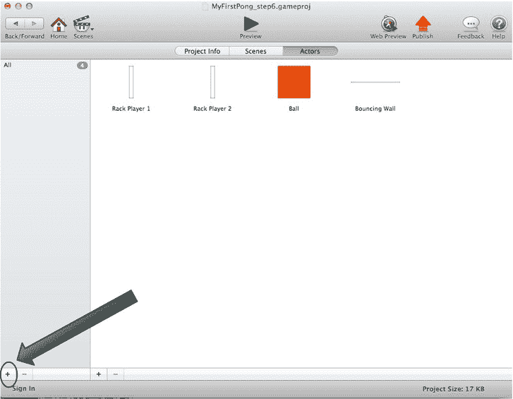

**图 2-32。** *主屏幕*

将标签命名为 Collidable。

拖动刚刚创建的标签右侧的四个对象。

双击 Rack Player 1 进行编辑。添加碰撞行为。根据图 2-33 ，配置与带有标签的“可碰撞”演员碰撞时的反弹行为。

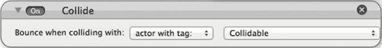

**图 2-33。** *碰撞行为*

对 Rack Player 2、球和反弹墙重复相同的操作。

### 让我们玩吧

您可以打开文件`MyFirstPong_step6.gameproj`进入当前阶段。

你准备好参加你的第一场乒乓球比赛了吗？点击预览按钮。你现在可以打乒乓球了。使用向上和向下键控制玩家 1，使用 Q 和 A 键控制玩家 2。按空格键发球。

### 总结

恭喜你！您已经创建了第一个可玩的游戏。但这不是你唯一的成就。在本章中:

> *   You learned the basic concepts of GameSalad.
> *   You created your first project.
> *   You created your first actors. You have achieved some player control.
> *   You used the collision concept.

你喜欢这个过程吗？很好！但是你仍然有很多事情要做。在下一章中，您将执行以下操作:

> *   Design a scoring system.
> *   Manage which player serves.
> *   Realize the touch detection of player 1' s racket.
> *   Implementation of CPU control player 2.
> *   Display.