# 三、完成乒乓：得分和游戏互动

在前一章中，你在几分钟内创建了一个非常酷的游戏。您现在已经掌握了 GameSalad 的功能，但是您的项目还远远不够完美。在本章中，您将通过实现一些附加组件和微调 Pong 游戏来继续学习 GameSalad。

### 让我们记分吧

这场比赛谁赢了？打乒乓球的时候，获胜或者取得高分难道不是首要目标之一吗？但是要做到这一点，一个游戏需要一个评分系统。那你还在等什么？

对于 Pong 游戏，您将根据以下规则创建一个计分系统:如果您错过了球，您的对手将获得一分。第一个达到 11 分的玩家赢得游戏。

您可以打开文件`MyFirstPong_step6.gameproj`进行后续步骤。

知道一名球员是否错过了球的诀窍是创造一个无形的演员，当球接触到球时，他会探测到——但这个演员是不可碰撞的，所以球会穿过它。这个演员将覆盖游戏领域的整个高度。您还将借此机会销毁当前的球实例。这将释放一些内存资源。

关于记忆:

内存是 iOS 设备中的宝贵资源。尽管 iPhone 4S 可以拥有高达 64GB 的内存，但是为运行时分配的动态内存却非常有限(只有几 MB)。一旦一个演员对游戏的其余部分变得没有用了，就摧毁它是一个极好的做法。如果稍后需要您的演员，一种先进的性能优化技术是回收。第七章中的介绍了回收利用。

为了保持分数，创建两个属性来存储每个玩家的分数。

在场景编辑器中，选择“属性检查器”窗口，并通过单击+号创建新的整数属性。命名为 P1 分数。重复操作，但将属性命名为 P2 分数。

在场景视图中，创建一个新演员并更改以下属性:

> *   Name: Left winning area
> *   Size/width: 10
> *   Size/Height: 320
> *   Color /Alpha: 0
> *   Physical/density: 0
> *   Physical/Removable: unchecked

您可能已经注意到，这里没有选中固定旋转。固定旋转是为了防止一个演员在与另一个演员碰撞时旋转。由于该演员不会与任何其他演员发生碰撞，因此没有必要检查固定旋转。

你最终应该得到与图 3-1 相同的属性。

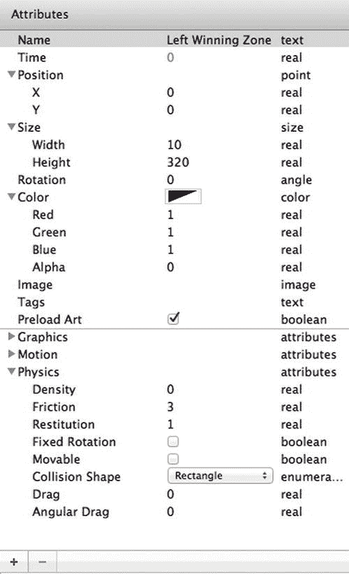

**图 3-1。** *左侧胜利区属性*

现在给那个演员添加一些规则和行为。

第一个规则将检测这个区域和球之间的重叠。创建一个规则，并将其命名为球检测规则。规则是“actor 接收事件”并与“ball”类型的 Actor“重叠或冲突”

将“更改属性”行为拖到规则中。改变设置来改变属性:游戏。P2 分数。然后，使用表达式编辑器(位于“到:”右侧的小图标)将 P2 分数属性自我递增 1。你的表情必须看起来像图 3-2 。

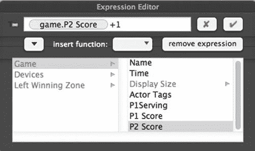

**图 3-2。***P2 分数的自增*

现在你可以记录玩家 2 的分数了。重复相同的步骤来记录玩家 1 的分数。

创建一个新的执行元，并更改以下属性:

> *   Name: Right Winning Zone
> *   Size/width: 10
> *   Size/Height: 320
> *   Color /Alpha: 0
> *   Physical/density: 0
> *   Physical/Removable: unchecked

接下来，添加一条规则来检测该区域和球之间的重叠。创建一个规则，并将其命名为球检测规则。规则是“actor 接收事件”并且与“ball”类型的 Actor“重叠或冲突”

将“更改属性”行为拖到规则中。行为改变属性:游戏。P1 分数。使用表达式编辑器将玩家 1 的分数自我递增 1。

返回到场景视图编辑器。拖动左侧获胜区域，将其放置在可视区域的完整左侧，如图图 3-3 所示。

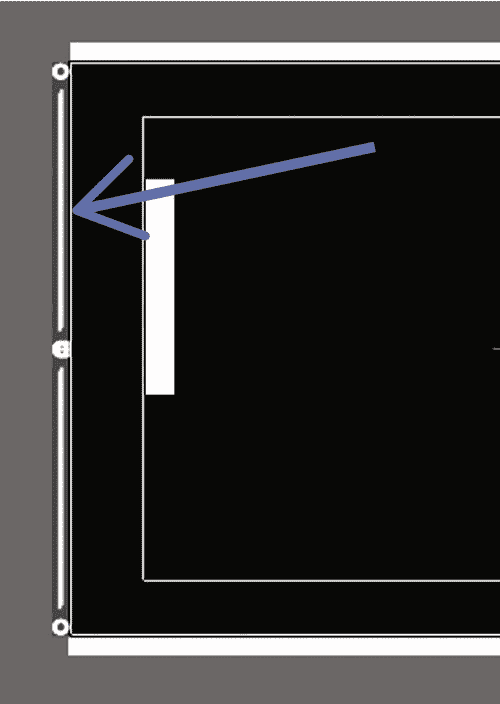

**图 3-3。** *现场定位左侧胜利区*

按照图 3-4 ，在可视区域的完全右侧重复类似的动作。

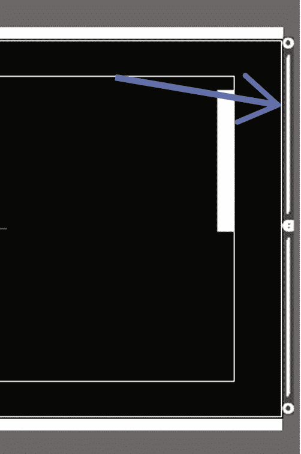

**图 3-4。** *现场定位右胜区*

记录每个玩家的分数是很棒的，但是如果能看到分数就更棒了！为了在场景中显示文本，您将使用一个 actor 作为接收者容器。您将引入一种称为显示文本的新行为。此行为用于将文本显示到执行元中。

在场景编辑器中，创建一个新的演员并更改以下属性:

> *   Name: P1 score
> *   Size/width: 50
> *   Size/Height: 50
> *   Color /Alpha: 0
> *   Physical/Removable: unchecked

将 Alpha 设置为 0 将使演员透明，但显示文本将保持可见。这是你获得最佳结果的方法。

为了在场景中完美地定位乐谱显示，请使用“更改属性”行为来约束其位置。将“更改属性”行为拖放到 P1 配乐演员的行为区域。然后选择 P1 分数。定位. X 属性并将其更改为 215。一旦选定，它将显示为 self.Position.X。使用 P1 分数重复该操作。将位置. Y 更改为 295。

最后但同样重要的是，拖动显示文本行为。显示文本行为如图 3-5 所示。

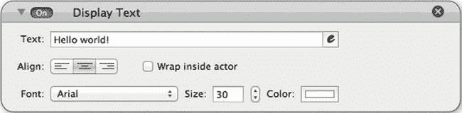

**图 3-5。** *显示文本行为*

在“显示文本行为”框中，您可以输入自己的文本或访问表达式编辑器。您有几个选项来设置文本格式，如选择对齐方式、字体、大小和颜色。“在执行元内换行”选项创建换行符，以便文本适合执行元。

在刚刚放下的“显示文本行为”框中，打开表达式编辑器并选择以下属性:game。P1 分数。将大小设置为 20，并选择橙色，以便在场景中清晰可见。

图 3-6 显示了最终结果。

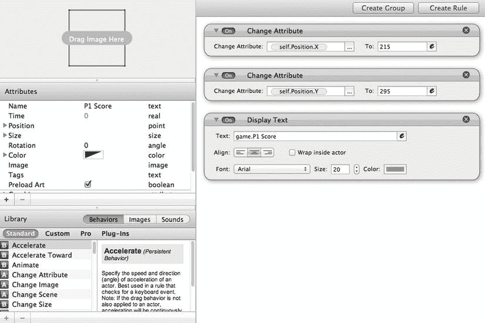

**图 3-6。** *P1 配乐演员*

重复相同的动作序列，创建 P2 分数演员，显示游戏。P2 得分，并将演员约束到位置(265，295)。图 3-7 显示了最终结果。

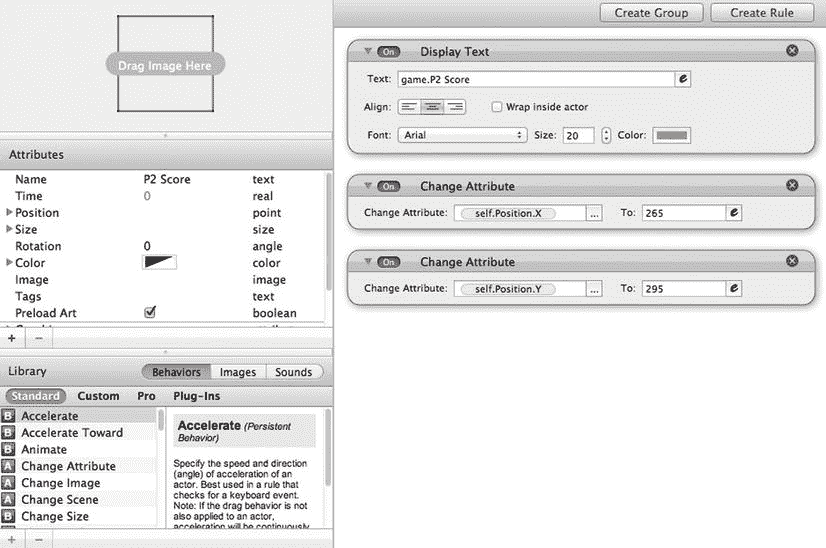

**图 3-7。**P2 得分

回到场景编辑器，将 P1 分数和 P2 分数放到场景中。

在跳到下一段之前，你需要在重点阐述后释放内存。为此，请对球本身使用“破坏”行为。

在演员编辑器中打开球并创建一个新规则。将新规则命名为 Destroy。该规则将有两个条件，但要满足其中的“任何”条件。要使用“任何”选项，请在“当‘所有’条件有效时”中单击“所有”，然后选择“任何”

第一个条件是“参与者接收事件”并且与“左获胜区域”类型的参与者“重叠或冲突”

第二个条件非常相似:“actor 接收事件”并且与“右获胜区域”类型的 Actor“重叠或冲突”

然后，拖放一个销毁行为。此行为没有选项设置。当您之前设置的任何条件有效时，它将销毁 actor 的实例。你的规则应该看起来像图 3-8 。

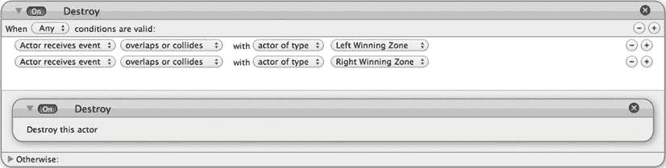

**图 3-8。** *破坏球*

您可以打开文件`MyFirstPong_step7.gameproj`进入当前设计阶段。

### 一切都是为了王牌！

你准备好赢得比赛了吗？在开始比赛之前，你需要创建两个额外的游戏功能:赢得分数和提供下一个球。

在这一点上，玩家 1 不仅可以发球，还可以同时将无限数量的球送入游戏。如果你不相信我，请多次按空格键。

#### 发球特点:得分的胜者发球

实现“得分的人将为下一个球发球”这个功能相当容易，尤其是因为您已经设置好了几乎所有的东西。由于你在比赛中只有两名球员，所以只能由一号球员或二号球员发球。另一种说法是，参与人 1 发球与否(如果不发球，那么参与人 2 发球)。

在上一章中，您创建了一个服务属性，现在您将重用该属性。属性 P1Serving 将根据哪个玩家得分而被修改。

双击演员编辑器中左侧的获奖区域演员，将其打开。你已经有了一个得分的规则。向此现有规则添加一个更改属性，以修改除分数之外的 P1Serving 属性。规则检测 2 号玩家何时得分。在这种情况下，轮到 2 号选手发球了。因此，P1Serving 应设置为 false。

将更改属性行为拖到球检测规则中。设置游戏。P1 为 0，如图 3-9 中的。

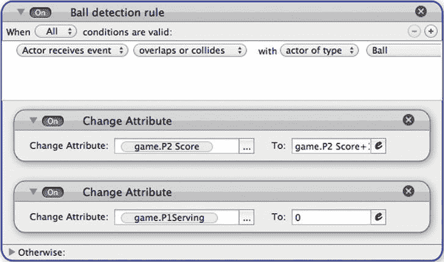

**图 3-9。** *将 P1Serving 改为 false*

关于布尔:

布尔属性是真/假属性。为了节省一点时间，你可以用 0 和 1 分别代替 true 和 false。GameSalad 会自动将 0 关联到 false，将 1 关联到 true

用右胜区重复操作；这个时间游戏。P1Serving 必须设置为 1，如图 3-10 中的所示。

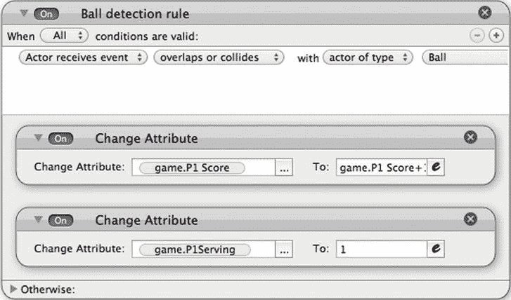

**图 3-10。** *变 P1 为真*

#### 在比赛中一次只保留一个球

现在，让我们把游戏中的球数限制在一个。(你可以稍后再做决定，并根据你自己的游戏规则进行调整。)

您将使用一个布尔属性，一旦产生了一个球角色，该属性将被更改为 true，当球被销毁时，该属性将被更改为 false。然后，您将修改 spawn 行为，以在生成球之前检查这个新属性是否为 false。

在场景编辑器中，选择属性检查器窗格。根据图 3-11 创建一个新的布尔属性。

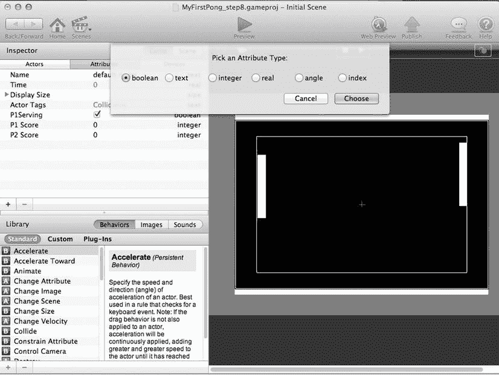

**图 3-11。** *一个新的布尔属性*

将该属性命名为 ActiveBall，不要选中它，因为最初游戏中没有球。

让我们回到产卵行为。请记住，球是产卵，但球拍是产卵。所以你需要修改球拍演员的行为。

打开 Rack Player 1，在发球规则中添加一个新条件。条件是如果游戏。ActiveBall 是假的。然后，您需要添加一个更改属性行为，该行为将在球产卵的同时发生。将一个更改属性拖到 Spawn actor 和 implement game 下面。主动球到 1。这会将属性更改为 true，防止当空格键按下时产生新的球。图 3-12 显示了修改后的发球规则。

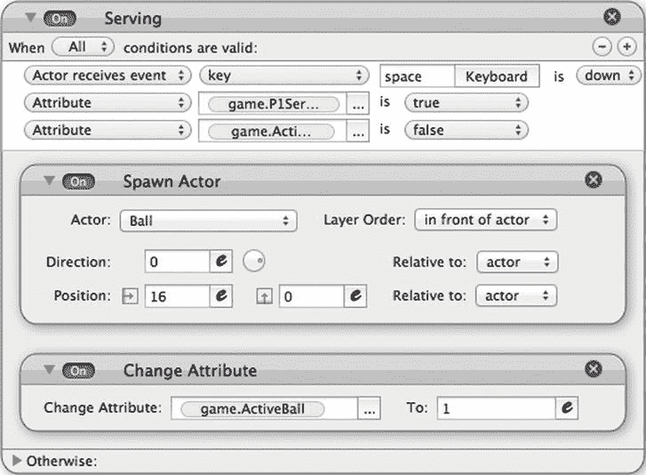

**图 3-12。** *修改架上球员 1 号发球规则*

对 Rack Player 2 重复该操作。

最后但同样重要的是，您需要修改球角色的销毁行为，以表明游戏中不再有活动的球。双击球演员。将“更改属性”行为拖到“销毁”行为上方，并将“活动球”属性更改为“假”。你的规则应该看起来类似于图 3-13 。

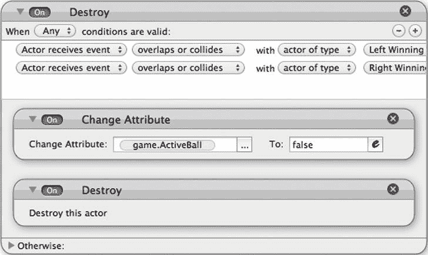

**图 3-13。** *修改破坏行为*

在预览中启动游戏并检查适当的行为。

您可以打开文件`MyFirstPong_step8.gameproj`到达这一步。

### 你有触觉吗？

真正的乐趣现在开始了！您将开始使用 iOS 设备的一些硬件功能。第一个是你设备的触摸界面。您将实现两个函数。当你点击屏幕时，第一个会产生一个球。第二个会用手指移动 Rack Player 1。

#### 轻轻一碰就端上来的

你将只为玩家 1 实现接触式发球。这个想法是，到本章结束时，你将能够在电脑上玩玩家 1！

这样做大约需要 5 秒钟。是的，你没看错！只有 5 秒钟。

双击 Rack Player 1 以编辑器模式打开演员。修改发球规则的第一个条件:用“touch”替换“key”然后选择“外部”因此，不是让玩家按下空格键来产生一个球，而是玩家触摸屏幕，球拍将产生一个球。你的发球规则应该看起来像图 3-14 。

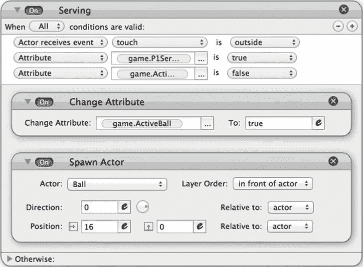

**图 3-14。** *触球发球*

现在你想用一根手指移动 1 号选手的球拍。记住球拍被限制在一个特定的水平值上。它只能上下移动。所以你只需要在 y 轴上工作。

诀窍是检测触摸，收集触摸的 y 轴值，并将球拍动作者约束到该值。为了收集触摸位置的值，您将使用鼠标设备。

该鼠标设备

鼠标特殊对象是设备类别中 GameSalad 内部的一个对象。“设备”类别帮助您利用 iOS 设备的硬件功能。在这里，您可以使用加速度计、屏幕、音频、时钟、触摸和鼠标功能。鼠标功能代表您触摸屏幕的位置，您通过位置属性收集这些信息。

尽管如此，还是有一些非常重要的事情要做，才能让它发挥作用。球拍不得移出可视区域。你通过只考虑 60°和 260°范围内的触感来管理这一点。

1.  创建一个新规则，并将其命名为触摸检测。
2.  添加以下条件:Actor 接收内部触摸事件(您可以将“内部”替换为“按下”)。
3.  添加两个附加条件:
    *   属性，游戏。鼠标。位置. y，>，60
    *   属性，游戏。鼠标位置 y，
4.  添加 Rack Player 1 的约束属性。到 game.Mouse.Position.Y

完成的规则应该看起来像图 3-15 。

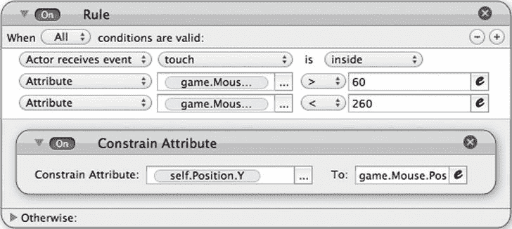

**图 3-15。** *触摸法则*

你可以通过打开文件`MyFirstPong_step10.gameproj`进入这个阶段。

### 给你的游戏一个大脑

iOS 设备功能强大，但用 GameSalad 实现人工智能是不可能的。然而，只要有一点点想象力，你就可以实现一些规则和行为。

您将分两个阶段实现。你会察觉到球何时来到球员 2 的球拍上；当球穿过半个屏幕时，您将收集球的 y 值，并将该值存储到一个属性中。您将使用第二个属性来限制球拍的移动。第二步将是移动球拍到这个值。

#### 检测方向，得到 Y 值

1.  创建一个真实属性，并将其命名为“predict”
2.  创建一个布尔属性，并将其命名为“positionyourself”，默认值为 false(不选中)。
3.  在演员编辑器中打开球演员。
4.  创建新规则并添加以下条件:
    *   属性，球。Motion.Linear.Velocity.X，≥，0:这样会检测球的运动方向。如果该值为正值，x 值将增加。所以运动将从左到右，进入玩家 2 的球拍。
    *   属性，球。Position.X，≥，240:这是球越过屏幕一半的时候。
    *   属性，球。Position.X，≤，300:这是球反弹到球拍上之前。
5.  添加约束属性行为并将 game.predict 配置为 ball。位置 Y
6.  添加更改属性行为并将 game.positionyourself 配置为 1。
7.  在 Otherwise 部分添加一个最后更改属性行为，并将 game.positionyourselfto 配置为 0。

完成的规则按照图 3-16 所示。

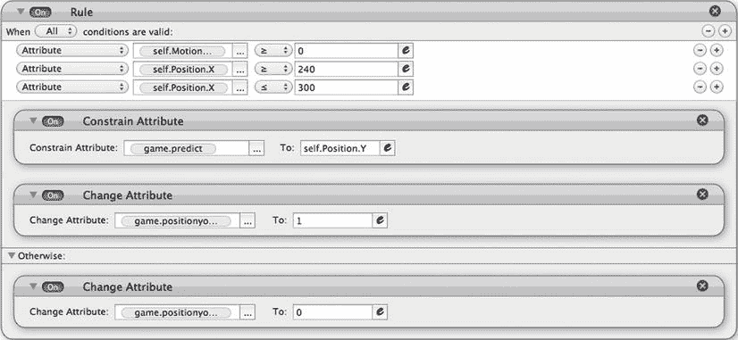

**图 3-16。** *移动检测和定位*

#### 移动球员 2 号球拍到存储值

1.  在 actor 编辑器中打开 Rack Player 2 actor。
2.  创建新规则并添加以下条件:
    *   属性 game.positionyourself 为真。

这将检测自身移动到存储位置的允许时间。

3.将移动拖到行为。

4.按照图 3-17 配置约束属性。

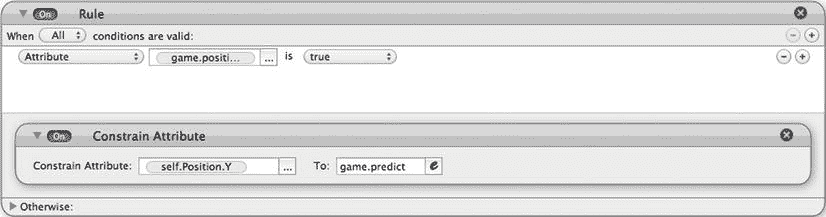

**图 3-17。** *约束属性*

你还需要在发球功能上做一个修改，让 2 号选手在赢得一分后可以自动发球。为此，只需通过滚动鼠标并单击条件旁边的-号来删除按下空格键的条件。

修改后的规则如图 3-18 所示。

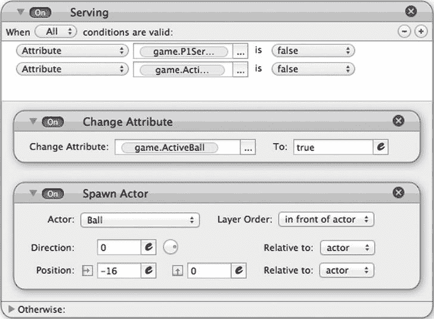

**图 3-18。** *修改发球规则*

打开`MyFirstPong_step11.gameproj`可以直接到达这一步。

### 乓，跟我说话

Pong 项目的最后一个润色是添加一些与玩家交互的关键消息。GameSalad 没有语音功能，但可以在 iOS 设备屏幕上显示文本信息。就像之前处理乐谱一样，您将使用一个 actor 向用户显示一些关键的交互消息。

在场景视图中，创建一个新演员并更改以下属性:

> *   Name: display
> *   Size/width: 360
> *   Size/Height: 100
> *   Color /Alpha: 0
> *   Physical/Removable: unchecked

为了在场景上完美地定位乐谱显示，您将使用“约束属性”行为来约束该位置。

将约束属性拖放到显示角色的行为区域。然后选择显示。定位. X 并将其约束为 240。用显示器重复操作。Position.Y 和 160°的约束。

创建具有以下条件的新规则:

> *   Attribute game. active ball
> 
> *   Attribute game. P1Serving is true.

拖动一个显示文本行为，并按照图 3-19 进行配置。

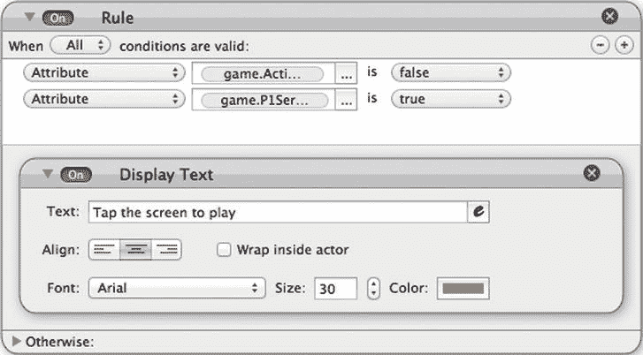

**图 3-19。** *显示按键信息*

最后但同样重要的是，将演员拖放到场景中。

打开`MyFirstPong_step12.gameproj`可以直接到达这一步。

### 让我们在你的设备上玩吧

是时候使用 GameSaladiOS 查看器了。

在 iOS 设备上启动 GameSaladiOS 浏览器，点击 iPhone 上的预览按钮或 iPad 上的预览按钮。你的 GameSalad 将看起来像图 3-20 。

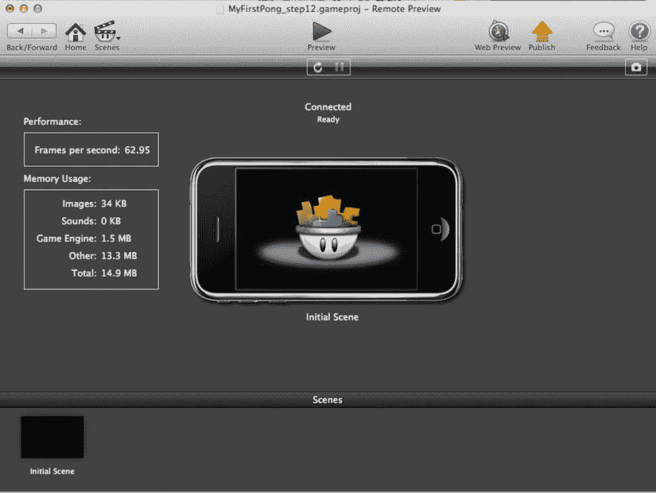

**图 3-20。iOS 浏览器中的***Pong*

### 总结

从第二章开始，你已经走了很长一段路。你现在有了一个分两章构建的全功能游戏。

在本章中，您了解了:

> *   Score management
> *   serve
> *   Implement artificial intelligence, so player 2 is controlled by CPU
> *   Join the game/player interaction

我希望你喜欢开发和玩乒乓游戏！