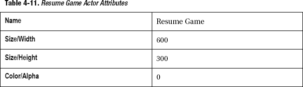

# 四、越狱：实现评论、加速度运动、生活管理和暂停

这一章将讲述翻拍著名电影《越狱》的第一部分。在你开始设计这个游戏之前，我想先介绍一下这个游戏的历史。

雅达利在 1976 年开发了 Breakout ( 图 4-1 )。Pong 发布四年后，Breakout 立即成为一款街机游戏。后来雅达利发布了视频游戏机版《突围》。

**图 4-1。** *突围楼主*

诺兰·布什内尔和史蒂夫·布里斯托从单人乒乓游戏的想法发展出了这种游戏。球员用球拍击球来摧毁墙上的砖块。如果球员错过了球的回归，他就输了。

最初的《越狱》讲述了一名囚犯试图用球和链条打碎砖块逃跑的故事。有两个层次。第一层由八排四种不同颜色的砖块组成(每种颜色两排，如图图 4-2 )。用球和球拍，玩家必须摧毁所有的砖块。玩家每升一级可以获得 448 分。

**图 4-2。** *雅达利 2600 家庭版突围*

一点小注意:

最初的街机版 Breakout 是用黑白屏幕制造的。Atari 在屏幕上使用了一些彩色的透明胶带来呈现颜色。

一点小注意:

史蒂夫·乔布斯和史蒂夫·沃兹尼亚克参与了《越狱》的开发。他们致力于优化游戏中的电路板，以减少晶体管的数量。

本章将涵盖以下主题:

> *   Strengthen your basic game skills.
> *   Add comments to your work.
> *   Use accelerometer to control your game
> *   Manage life and game ending process
> *   Add a pause function to your game

### 打下基础

在本节中，您将快速创建游戏的基本元素。您将从创建参与者开始，然后为每个参与者定义规则和行为。最后，您将在场景中定位演员。

您可以通过直接打开文件`BreakaWall-step1.gameproj`来快速启动本节。

#### 定义新项目

首先打开 GameSalad creator。在“新建项目”下，选择“我的伟大项目模板”,然后单击“在 GameSalad Creator 中编辑”。

按照表 4-1 配置项目信息。

单击文件另存为保存您的项目。命名为`BreakaWall.gameproj`。

#### 定义演员

在这个游戏中，您将创建以下角色:

> *   racket
> *   fragment of a brick
> *   ball
> *   Vertical wall
> *   Hengqiang
> *   Transport area
> *   show

##### 球拍

球拍由球员控制，将球反弹回砖块。

创建一个新的 actor，双击它打开 Actor 编辑器。

用表 4-2 中的参数编辑演员属性。

##### 砖

砖块构成了要摧毁的墙的单一元素。创建一个新的 actor，双击它打开 Actor 编辑器。用表 4-3 中的参数编辑演员属性。

##### 球

球是在运动区域内弹跳的运动元素。创建一个新的 actor，双击它打开 Actor 编辑器。用表 4-4 中的参数编辑演员属性。

##### 垂直墙

墙是用来界定游戏区域的。创建一个新的 actor，双击它打开 Actor 编辑器。用表 4-5 中的参数编辑演员属性。

##### 水平墙

创建一个新的 actor，双击它打开 Actor 编辑器。用表 4-6 中的参数编辑演员属性。

##### 失败地带

与 Pong 游戏中的获胜区域类似，您将在球拍下方创建一个失败区域，以检测玩家何时错过了球。创建一个新的 actor，双击它打开 Actor 编辑器。用表 4-7 中的参数编辑演员属性。

##### 显示

display actor 用于在屏幕上显示信息。创建一个新的 actor，双击它打开 Actor 编辑器。用表 4-8 中的参数编辑演员属性。

#### 创建可绑定标签

您将重复对 Pong 采用的方法，为所有将发生碰撞的角色创建一个可碰撞的标签。

创建一个新的 actor 标签，并将其命名为“Collidable”

将以下角色拖放到可绑定的标签上:

> *   brick
> *   racket
> *   ball
> *   Hengqiang
> *   Vertical wall

#### 定义属性

和前面的章节一样，属性将在你的游戏工程中扮演重要角色。

ActiveBall 属性将用于了解一个球是否已经在屏幕上活动，如果是，防止用户在游戏中产生另一个球。为此，您将使用一个布尔值。

BrickCount 将用于知道球何时破坏最后一块砖。您将使用屏幕上砖块的初始数量来设置这个整数属性。那么每一块砖被破坏一次，你将减少这个整数。

TextToDisplay 将用于与玩家交流游戏信息。

根据表 4-9 创建属性。

#### 实现规则和行为

参与者、属性和标签现在都设置好了。但是还没有实现任何逻辑和交互。接下来的步骤将添加规则和行为，这些规则和行为将为每个参与者定义游戏逻辑。

##### 球类规则和行为

为了在球产生时给它一个初始运动，你将使用一个改变速度的行为。

根据图 4-3 ，将一个变化速度行为拖放到演员中，并以 300 的速度将设置更改为相对于场景的随机方向(70，110)。

**图 4-3。** *球的初速度*

接下来，您需要确保球将与所有可碰撞的角色碰撞，因此使用碰撞行为。

根据图 4-4 ，将碰撞行为拖放到演员中，并将设置更改为“带标签的演员:”和“可碰撞”。

**图 4-4。** *球的碰撞行为*

让我们来制定球员丢球时的规则。您将使用与 Pong 游戏相同的逻辑。一个演员将被定位在球拍下面，当球与它重叠时，它将破坏球，并将属性 ActiveBall 更改为 false。

单击“创建规则”并添加条件“执行元接收事件”“重叠或冲突”与“执行元类型”“松散区域”拖放一个改变属性行为和改变游戏。主动球到 0。然后，将销毁行为拖放到更改属性行为的正下方。你的规则应该类似于图 4-5 。

**图 4-5。** *松绑*

接下来，创建一个规则，当最后一个砖块被摧毁时，这个规则将摧毁这个球，并且还将显示文本“你赢了！”点击创建规则并添加条件“属性”“游戏。BrickCount""=""0。"拖放一个改变属性行为和改变游戏。TextToDisplayto“你赢了！”然后，将销毁行为拖放到更改属性行为的正下方。你的规则应该类似于图 4-6 。

**图 4-6。** *结束游戏*

如果你玩过很多乒乓游戏，你可能会注意到球有时会卡在水平方向；这很无聊。为了避免这种情况，我们引入一个扰动。你会监控球，只要它被水平或垂直卡住，你就会添加一个随机效果来改变下一次反弹。为了达到这个目的，你必须监控球的线速度。线速度是在二维平面的轴之间的运动。如果 Y 的线速度为 0，这意味着球保持恒定的 Y 位置。换句话说，你的球在以完美的水平运动(球卡在左右墙之间)。如果 X 的线速度为 0，这意味着球保持恒定的 X 位置。换句话说，你的球正以完美的垂直运动方式运动。

单击创建规则并添加条件“属性”“球”。运动。线速度。Y""=""0 "。拖放一个规则行为，并添加条件“执行元接收事件”“重叠或冲突”和“带有标签的执行元”“可碰撞”然后拖拽一个改变属性行为和改变球。运动。线速度。y 到 random (70，120)。你的规则应该类似于图 4-7 。

**图 4-7。** *防止横向堵塞*

单击创建规则并添加条件“属性”“球”。运动。线速度。X""=""0 "。拖放一个规则行为，并添加条件“执行元接收事件”“重叠或冲突”和“带有标签的执行元”“可碰撞”然后拖放一个改变属性行为和改变球。运动。线速度。x 到 random (70，120)。你的规则应该类似于图 4-8 。

**图 4-8。** *防止垂直堵塞*

##### 球拍规则和行为

根据图 4-9 ，将碰撞行为拖放到演员中，并将设置更改为“带标签的演员:”可碰撞“。

**图 4-9。** *球的碰撞行为*

将约束属性行为拖放到演员中，并更改球拍的设置。根据图 4-10 将 Y 轴定位到 40°。这将把球拍垂直地限制在它的位置上。

**图 4-10。** *约束球拍属性*

现在创建两条规则来实现球拍的移动。就像你之前做的那样，你将使用按键来左右移动球拍。

单击“创建规则”并添加条件“参与者接收事件”“按键”“左”键盘“按下”拖放移动行为并将设置更改为:

> *   Direction: 180
> *   Relative: actor
> *   Type of movement: addition
> *   Speed: 300

你的规则应该类似于图 4-11 。

**图 4-11。** *左运动规律*

单击“创建规则”并添加条件“参与者接收事件”“按键”“右”键盘“按下”拖放移动行为并将设置更改为:

> *   Direction: 0
> *   Relative: actor
> *   Type of movement: addition
> *   Speed: 300

你的规则应该类似于图 4-12 。

**图 4-12。** *右运动规律*

最后，创建一个规则，当屏幕被触摸到演员之外并且没有活动的球时，生成一个球演员。

单击“创建规则”并添加条件“执行元接收事件”“接触”为“外部”添加第二个条件来检查游戏。ActiveBall 属性。条件将是“游戏属性”。ActiveBall”是“假的”拖放“繁殖演员”行为，并将设置更改为:

> *   Actor: Ball
> *   Layer order: in actors
> *   Front: Random (75,135)
> *   Relative to: actor
> *   Location: 0, 10
> *   Relative to: actor

拖放一个改变属性行为和改变游戏。主动球到 1。你的规则应该类似于图 4-13 。

**图 4-13。** *产卵球演员法则*

##### 砖块规则和行为

砖头演员只有一条规则。该规则将检测与球的碰撞，然后销毁演员并减少 brickCount 属性。

单击“创建规则”并添加条件“执行元接收事件”“重叠或冲突”与“执行元类型”“球”拖放破坏行为。拖放一个改变属性行为和改变游戏。砖块计数到游戏。BrickCount-1。你的规则应该类似于图 4-14 。

**图 4-14。** *砖头统治*

##### 显示文本规则和行为

在这个阶段，最后一个需要行为的参与者是显示文本。它将在场景中永久显示文本属性的内容。诀窍在于，在赢得游戏之前，属性将是空的。

拖放一个显示文本属性，并将文本设置更改为“game.TextToDisplay”。您可以保留所有其他默认设置。你的行为应该类似于图 4-15 。

**图 4-15。** *显示获奖文本*

#### 场景布局

下一步是确定演员在现场的位置。将您的演员拖到场景中，并尝试匹配图 4-16 。为了创建该演员的六个实例，您需要将砖块拖动到场景中六次。

**图 1-16。** *第一步场景*

虽然不可见，但将显示演员拖到场景的中心。

### 评论你的作品

如果你跳过了前一部分，你可以直接打开文件`BreakaWall-step1.gameproj`从这一点继续。

该不该写评论？什么是好的评论？我必须承认，我以前很讨厌写评论。我认为这是无用的，并转移了我的目标:编码！但这是不对的！首先也是最重要的，评论让你的游戏设计更加清晰。通过注释，你可以描述参与者的责任或者规则的意图。接下来，它让你的游戏项目更容易被其他人理解。当你在一个团队中工作时，如果你包括正确的评论，你将会为你的同事节省大量的时间。一个好的注释提供了关于你的设计策略和规则中任何微妙安排的有用信息。

要添加注释，请使用 GameSalad 的注释行为。它可以作为任何行为放在“执行元行为”面板或规则中。让我们稍微练习一下。

在演员编辑器中打开球拍演员。将音符行为拖放到行为堆的顶部。键入以下注释:

`The Racket is the paddle to be controlled by the player.

       The racket will collide and bounce with collidable objects.

       The racket will be constrained on the Y=40 axis.`

你的评论应该类似于图 1-17 。

**图 1-17。** *球拍总评*

现在，将音符行为拖放到左移动规则上方。键入以下注释:

`When the left key is pressed, the actor will move to the left direction.

When the right key is pressed, the actor will move to the right
direction.`

你的评论应该类似于图 1-18 。

**图 4-18。** *点评球拍移动规则*

从这一步开始，我不会告诉你写哪个注释，但是项目文件将包含我的一些注释。请随意阅读。

### 用加速度计移动桨

从这一点出发，您可以简单地打开文件`BreakaWall-step2.gameproj`。

让我们找点乐子！为了移动球拍，你将使用 iOS 设备的内置加速度计。为了创建这样的功能，您将再次使用设备属性，尤其是加速度计。事实上，您需要在加速度计的 X 轴上进行检测。

在演员编辑器中打开球拍演员。在左移规则中，添加一个新条件。条件是“属性”“game . accelerator . x”图 4-19 。

这种基于加速度计的运动实现在这个阶段是粗略的，并且没有考虑运动中的任何倾斜量。这只是第一步。你将在第八章中学习更高级的方法。

**图 4-19。** *用加速度计向左移动的规律*

加速度计

加速度计测量设备自身在三维空间中的加速度。iOS 设备中的传感器会捕捉每一次移动和倾斜，因此它可以计算设备的方向和许多其他用途(例如设备正在向哪个方向移动)。

当你将 iPad 置于纵向模式时，按照图 4-20 ，X 轴将指向你。

**图 4-20** *。纵向模式下的 iPad*

负加速度是绕 x 轴逆时针旋转，如图 4-21 中的所示。

**图 4-21。** *逆时针旋转*

正加速度是围绕 x 轴的顺时针旋转，根据图 4-22 。

**图 4-22。** *顺时针旋转*

因为您想要捕捉预期的运动而不是振动，所以您选择触发值 0.05。你可以在这个值上打转，找到一个你觉得最舒服的值。

让我们修改右移动规则，以包括加速度计条件。在右移规则中，增加一个新条件:“属性”“game . accelerator . x”“0.05”。您还需要将“All”改为“Any”，例如“When 'Any '条件有效。”就这样！您的新规则将类似于图 4-23 。

**图 4-23。** *带加速度计的右运动规律*

如果您从纵向更改为横向或支持两种方向，您将需要更改您的加速度计规则。

通过在球拍的演员编辑器中单击“创建组”,为球拍创建一组行为。将两条规则拖放到组中。

您刚刚创建的规则适用于纵向方向。你需要把它们颠倒过来，变成纵向颠倒的方向。用 GameSalad 做到这一点非常容易。创建一个检测屏幕方向的规则，并相应地启用正确的规则。

创建一个带有“属性”条件的新规则“游戏”。屏幕。设备方向为“纵向”然后拖放新创建的组。新规则应如图 4-24 中的所示。

**图 4-24。** *人像定向规则*

选择您刚刚创建的规则，然后按 Command + C 来拷贝该规则。按 Command + V 粘贴该规则，并更改以下设置:“纵向”为“纵向颠倒”，然后第一个向左移动的子规则会将其条件更改为“>”“0.05”，第二个向右移动的子规则会将其条件更改为“图 4-25 。

**图 4-25。**??【肖像颠倒定向法则】??

您现在可以管理设备的方向了！

**演习**

在 iOS 查看器中测试此项目。遵循上一章的说明。您还将更改“自动旋转”属性，以启用纵向颠倒。为此，在场景编辑器中，按照图 4-26 中的单击场景按钮，并展开自动旋转属性。将肖像旁边的方框打勾。

**图 4-26。** *场景属性检查器*

### 管理生活和游戏结束过程

从这一点出发，您可以简单地打开文件`BreakaWall-step3.gameproj`。

为了让游戏更真实，你可以给玩家三条命。这意味着第三次错过球，你将显示一个游戏结束的消息，玩家将无法产生一个新的演员。您还将显示一个重试按钮，该按钮将重置场景，并让玩家尝试再次获胜。

您可能已经猜到了，您将使用一个属性来管理生命。每错过一次球，你将减少 1 的属性。您将添加一个条件，在生成新球之前检查生命数是否严格优于 0。在显示文本中，当生命属性等于 0 时，您将有一个显示游戏结束消息的规则。

游戏设计时间到了！创建一个新的整数属性，将其重命名为“lives”，并将默认值设置为 3。你的属性将看起来像图 4-27 。

**图 4-27。** *生命属性*

双击角色编辑器中的球角色，将其打开。在输区规则中，拖放一个更改属性行为，并将其放置在游戏之间。主动球改变属性行为和破坏行为。将 game . lifes 修改为 game . lifes-1。

输区规则将如图 4-28 所示。

**图 4-28。** *修改了输区规则*

接下来，创建一个新规则，并将条件更改为" Attribute""game.lives""=" "0 "。这将检测何时不再有生命可用。拖放一个改变属性行为和改变游戏。短信显示“游戏结束！–按图 4-29 中的点击此处重试】。

**图 4-29。** *游戏结束显示规则*

您需要修改附加到球拍 actor 的球生成规则，以便添加关于生命数的条件(> 0)。

在演员编辑器中打开球拍演员。根据图 4-30 ，选择生球规则并添加以下条件:“Attribute”“game . lives”>“0”。

**图 4-30。**修改了*球的产卵规则*

您就快成功了，但是您需要在游戏结束时实现重试功能。这相当容易。您将使用重置游戏行为。

关于重置游戏和重置场景:

虽然听起来很明显，重置场景只会重置场景而不会重置游戏。当你有一个多级游戏并且你想给玩家更多的尝试机会时，这是非常有用的，但是记住重置场景只会<ins>重置场景，同样地，游戏属性不会被重置。所以在你设计游戏的时候，花点时间想想哪些属性应该是游戏或者场景属性。</ins>

在 actor 编辑器中打开显示 Actor，根据图 4-31 创建一个新规则。

**图 4-31。** *重试功能*

### 添加暂停功能

从这一点出发，您可以简单地打开文件`BreakaWall-step4.gameproj`。

在 GameSalad 中暂停是非常容易的，但是你需要理解这个概念以便有效地使用它。

暂停行为将在当前场景的顶部覆盖一个新场景，并暂停当前场景的所有物理效果。它不会暂停音乐、声音或计时器。为了有效地构建暂停函数，您需要:

> *   An actor who can trigger a pause.
> *   A scene used as a pause picture.
> *   Pause a button on the screen to resume the game.

让我们把这一切付诸实践。

创建一个新场景。单击“主页”按钮并选择“场景”选项卡。然后点击左下角的+号。通过单击名称来重命名场景。键入“Pause”作为场景名称。

根据图 3-32，你的项目中现在有两个场景。

**图 3-32。** *场景视图*

创建新演员。用表 4-10 中的参数编辑演员属性。

拖拽一个显示文本属性，根据图 4-33 改变设置。

**图 4-33。** *暂停显示*

创建新规则并添加以下条件:

> *   "Actor receives event" and "Touch" is "Press"
> *   "attribute" "dance academy" > [0]

然后拖放暂停游戏属性，并选择您先前创建的暂停场景。完整的规则如图 4-34 所示。

**图 4-34。** *暂停规则*

现在如图 3-35 所示，将暂停演员放置在屏幕的左上角。

**图 3-35。** *定位暂停演员*

通过单击“场景”按钮，选择新创建的名为“暂停”的场景。

创建一个名为 ResumeGame 的新演员。用表 4-11 中的参数编辑演员属性。

拖拽一个显示文本属性，根据图 4-36 改变设置。

**图 4-36。** *恢复游戏显示*

创建新规则并添加以下条件:

> *   "Actor receives event" and "Touch" is "pressed"

然后拖放一个未暂停的游戏属性。完整的规则如图 4-37 所示。

**图 4-37。** *取消暂停游戏规则*

最后，你需要将简历演员放在屏幕中央。就这样！你的游戏有暂停功能！

您可以打开文件`Breakawall-step5.gameproj`来达到这一点。

在第九章中，你将继续为这个游戏工作。同时，你将发展物理、重力、音频和图形效果方面的技能。

### 总结

你即将创造一个新的阿卡迪亚人！你的文件夹里还有第二个游戏。

在本章中，您将:

> *   Strengthen your basic game skills.
> *   Add comments to your work.
> *   Use accelerometer to control your game.
> *   Manage the process of life and game ending.
> *   Added pause function to your game.