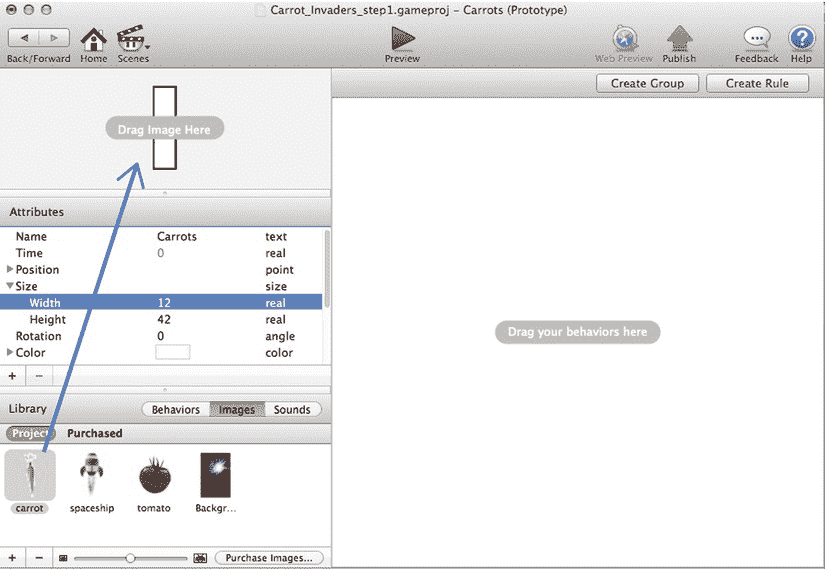
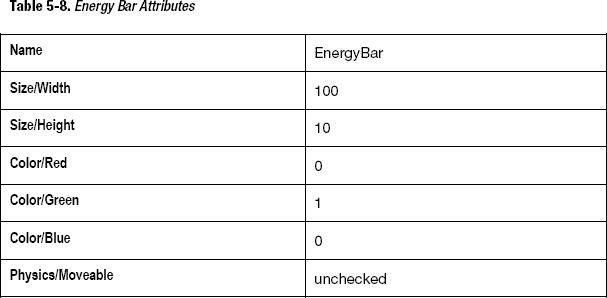

# 五、制作射击游戏：胡萝卜入侵者

当我还是个孩子的时候，我记得我的父母试图让我吃完我的胡萝卜泥。“吃了这个，你会有好看的皮肤！”啊啊。！！我还是会做关于胡萝卜的噩梦！这就是为什么，为了向最著名的电子游戏之一致敬，你会用胡萝卜而不是外星人来翻拍《太空入侵者》。

《太空入侵者》是一款日本游戏，由台东公司于 1978 年发行。Taito 最初是一家在日本从事自动售货机贸易的进出口公司。他们在 60 年代进入了游戏行业。最近，Square Enix 在 2005 年收购了 Taito。Square Enix 在游戏界因《最终幻想》游戏而闻名。

《太空入侵者》的灵感来源于 Taito 之前的一款名为《太空怪兽》的电子机械游戏。《太空入侵者》对 Taito 来说是一个巨大的成功。游戏的街机版如图图 5-1 所示。

**图 5-1。** *一个太空入侵者的街机柜。*

《太空入侵者》是一款射击游戏。你控制一艘飞船，用大炮向敌人射击。敌人是成列从左向右移动的外星人(有时会向下移动几个像素)。目的是在所有的敌人降落在地球上并开始入侵之前向他们射击。

在本章中，您将通过创建另一个包含演员、规则和行为的新项目来练习 GameSalad 的基础知识。您还将了解图像的管理以及如何将图像用于演员。本章还将涵盖以下内容:

> *   Introduction to Mathematics Creating Complex Actions
> *   The visual effect of the spacecraft moving motionless.
> *   Manage interpolation behavior of energy bars.
> *   Change scene behavior to transition scene

### 准备场景的基本元素

根据上一章，您可以通过直接打开文件`CarrotInvaders-step1.gameproj`来跳转到本节。

在本节中，您将为胡萝卜入侵者项目创建一个新项目。然后你会把重点放在项目的演员身上。您将强化您在演员创建、规则和属性设计方面的技能。您还将学习一些新的东西:图像特性，比如导入图像、检查器以及向演员添加图片。

#### 创建胡萝卜入侵者游戏项目

打开游戏沙拉创建器，创建一个新项目。根据表 5-1 配置项目信息。

将文件命名并保存为`Carrot_Invaders.gameproj`。

#### 艺术家入口:创造演员

《胡萝卜入侵者》需要以下演员:

> *   Carrots; Use as an enemy
> *   Spacecraft; Act as a hero
> *   Background; Used to create situations.
> *   Bullets; Used to destroy the enemy
> *   Walls; Used to define scenes.

在创建演员之前，您将做一些新的事情。你将为你的演员准备一些服装。是的，你会在上面放一些衣服(衣服，我的意思是你会用图片)。稍后我将为您提供更多关于 GameSalad 中图形和图形优化的信息；本章重点介绍如何在 GameSalad 中导入和使用图像。

要在屏幕上显示图像，你需要一个演员。但是为了让 actor 访问图像，必须首先将图像导入 GameSalad。

在 GameSalad 中导入图像很容易。在场景编辑器中，根据图 5-2 选择行为选项卡旁边的图像选项卡。

**图 5-2。** *场景编辑器用图像选项卡选中*

单击右下角的+号打开系统选择窗口，选择要导入的文件。

**注意:**图像可以通过其他几种方式导入。它们可以直接从桌面或文件夹拖到图像部分。它们可以从桌面或文件夹中拖到一个 actor 上。也可以通过右键单击来添加它们。gameproj 文件，选择“显示包内容和图像”并把它拖到那里，但这不是推荐的。

将以下文件导入到第五章文件夹下的图像资源中:`carrot.png`、`background.png`、`spaceship.png`、`tomato.png`、`explosion.png`(根据图 5-3 )。

**图 5-3。** *导入图片*

当您创建参与者时，请注意，如果没有特别提到这些属性，默认情况下会保留该值。

##### 创造敌人:胡萝卜

创建一个新的 actor，双击它打开 Actor 编辑器。

用表 5-2 中的参数编辑演员属性。

单击图像选项卡以显示您刚刚导入的图像。按照图 5-4 将`carrot.png`拖拽到演员视图。

**图 5-4。** *给演员移动画面*

##### 太空旅行:宇宙飞船

创建一个新的 actor，双击它打开 Actor 编辑器。

用表 5-3 中的参数编辑演员属性。

单击 Images 选项卡显示您刚刚导入的图像，并将`spaceship.png`拖放到 actor 中。

##### 在一个很远很远的星系里:创造背景

创建一个新的 actor，双击它打开 Actor 编辑器。

用表 5-4 中的参数编辑演员属性。

单击 Images 选项卡显示您刚刚导入的图像，并将`background.png`拖放到 actor 中。

##### 给你的枪上膛:定义子弹

创建一个新的 actor，双击它打开 Actor 编辑器。

用表 5-5 中的参数编辑演员属性。

##### 深空中的边界:墙

创建一个新的 actor，双击它打开 Actor 编辑器。

用表 5-6 中的参数编辑演员属性。

你的演员库存应该匹配图 5-5 。

**图 5-5。** *演员创造的*

#### 用游戏属性控制敌人的数量

首先，您将只创建一个属性，用于包含屏幕上剩余的胡萝卜数量。因此，它将是一个整数属性，我们称之为 number 胡萝卜。

在游戏开始时，这个属性将包含屏幕上胡萝卜的数量，并且每当一个胡萝卜被子弹光束打碎时，它将减少 1。

在场景编辑器模式下点击检查器中的属性标签。然后单击+号创建一个新属性，并选择 integer。根据图 5-6 ，初始值应为 0，类型应为整数。

**图 5-6。***number 胡萝卜属性*

#### 设定剧本:实现规则和行为

你需要定义游戏的逻辑，你将使用规则和行为来完成这项任务。您将使用计时器和加速器行为来创建控件和自动触发。

##### 胡萝卜:终极敌人角色

拖放一个改变属性行为到胡萝卜演员和改变游戏。将胡萝卜加入游戏。根据图 5-7 给胡萝卜+1 编号。每在场景中放置一个胡萝卜演员，属性 number 胡萝卜就会增加 1。所以当你开始场景的时候，你会在游戏属性 number rubbers 中包含屏幕上胡萝卜的数量。

**图 5-7。** *改变属性号*

现在创建一个规则，当子弹和胡萝卜发生碰撞时，触发敌人数量的减少，然后消灭敌人。

点击创建规则，并将规则命名为“摧毁胡萝卜”添加以下条件:“执行元接收事件”“与“执行元类型”“项目符号”重叠或冲突。”拖放计时器行为，并将设置更改为“0.4 秒后”。选中“运行至完成”复选框然后拖拽一个改变属性行为，改变游戏。将胡萝卜加入游戏。数字胡萝卜-1。最后，根据图 5-8 拖放一个破坏行为。

你为什么用计时器？在本章的后面，你将实现一个持续时间为 0.4 秒的爆炸效果。因此计时器会在消灭演员之前给你时间来展示这个效果。

**图 5-8。** *破坏胡萝卜法则*

##### 驾驶宇宙飞船

首先，您将通过使用约束属性行为来确保飞船停留在 Y=25 的水平轴上。

将约束属性行为拖放到飞船角色中，并根据图 5-9 将 spaceship.position.Y 配置为 25。

**图 5-9。** *将飞船约束在 Y=25*

接下来，使用与墙壁的碰撞为飞船创建一些边界。

根据图 5-10 ，拖放碰撞行为，并将设置更改为与“类型的演员”“墙”碰撞时反弹。

**图 5-10** *。撞墙*

将移动规则组合在一起以增加可读性。您将使用规则来检测加速度计的运动，并使飞船相应地移动。

单击“创建组”并将其命名为“运动”单击创建规则在组内创建规则。将规则命名为“右移”,并将以下条件配置为“任意”:

> *   The "actor receiving event", "key" and "right key" keyboard is "down"
> *   "attribute" and "game". Accelerometer ""> ""0.2 "

然后拖放一个移动行为并配置以下设置:

> *   Direction: 0
> *   Relative: Scene
> *   Type of movement: addition
> *   Speed: 300

你的规则应该类似于图 5-11 。

**图 5-11。** *右运动规律*

在移动组中创建新规则。将其命名为“向左移动”,并将以下条件配置为“任意”:

> *   The "actor receiving event", "key" and "left key" keyboard is "down"
> *   "attribute" and "game". Accelerometer "

然后拖放移动行为并配置以下设置:

> *   Direction: 180
> *   Relative: Scene
> *   Type of movement: addition
> *   Speed: 300

你的规则应该类似于图 5-12 。

**图 5-12。** *左运动规律*

现在实现飞船自动发射子弹。为此，创建一个规则，规定只要屏幕上胡萝卜的数量严格大于 0，每 0.5 秒发射一颗子弹。

创建一个新规则，命名为“自动开火”，条件为“属性”“游戏”。number 胡萝卜" " > " " 0 "。然后拖放计时器行为，将设置更改为“每”“0.5”秒，取消选中“运行到完成”。最后，拖放一个 Spawn Actor 行为并将设置更改为:

> *   Actor: Bullets.
> *   Layer order: in actors
> *   Back: 0
> *   Relative to: actor
> *   Location: X: 0 Y: 0
> *   Relative to: actor

自动射击规则将与图 5-13 中的相同。

**图 5-13。** *汽车消防规则*

##### 全力开火:子弹

首先，您将更改子弹的速度，以便子弹一产生就移动。

在子弹演员上拖放一个改变速度行为，并配置这些设置(也显示在图 5-14 ):

> *   Direction: 90
> *   Relative: Scene
> *   Speed: 300

**图 5-14。** *子弹变化速度*

下一步是当演员与敌人发生冲突时或者当它在屏幕上不再可见时摧毁它。通过检测它的 Y 轴值就知道子弹是不可见的。

创建一个新规则，并将其命名为“Destroy”将条件配置为以下任何条件:

> *   Actor receiving event and actor type carrot
> *   Attributes and Bullets overlap or conflict. Location. Y"" > ""560 "

然后根据图 5-15 拖放一个破坏行为。

**图 5-15**??。子弹销毁规则

#### 入侵开始:创建场景布局

下一步是确定演员在现场的位置。试配图 5-16 。

**图 5-16。** *胡萝卜入侵者第一步*

### 添加高级功能

现在是时候给你的游戏增加一些高级功能了。您将学习一些数学知识来创建复杂的运动和运动视觉效果，使用“插值”行为管理能量棒，以及使用“更改场景”行为过渡场景。

#### 复杂的动作

您可以打开文件`Carrot_Invaders_step1.gameproj`从这一点开始执行步骤。

数学很好玩！我很确定你们中的大多数人不会相信我，但是我可以向你们保证，游戏开发所需的数学知识是非常基础的，它可以让你们做出有趣的游戏！

到现在为止，你一定已经点击了预览按钮，并销毁了胡萝卜。你可以很容易地消灭他们:仍然是毫无防备的目标！但是如果胡萝卜可以移动呢？他们不太容易被杀死。正如你现在已经猜到的，你将使用数学来定义它们的运动。

在你进入 GameSalad 的运动定义之前，我想澄清一下我所说的“复杂运动”是什么意思复杂的运动不是随机的运动。随机运动本质上是混乱的。复杂的运动有一个非常预先确定的模式，但不同于简单的线性运动。

##### 参数方程很有趣

所以，系好安全带，跳进参数方程的世界吧。基本上，参数方程是一种用方程绘制图形的方法，其中 X 和 Y 位置都取决于特定的参数。这意味着图形中的每个点都是一对坐标(X，Y)。此时，你应该说“啊哈！”是的，GameSalad 用 X 和 Y 坐标表示演员的位置。例如，Actor1 在屏幕上的位置是 X=0，Y=0。这是屏幕的左下角。

让我们更进一步。想象一下，你有一个随时间变化的参数，而不是一个固定值(0，0)。我们把这个参数叫做“t”吧，现在你可以用 X=t，Y=t 来定义位置，结果就是你的演员会在右上方向做直线运动。例如，测试参数可以是每秒递增 1 数字，或者可以是时钟。

基本上就是这样。参数方程基于 t 参数定义 X 和 Y。在 GameSalad 中，您将通过约束位置来定义复杂的运动。x 和位置。y 属性归属于基于 t 参数的公式，其中 t 是参与者的时间属性。

下一步是发展你的谷歌搜索技能，找到一个描述你想要实现的复杂运动的参数方程。

**注意:**时间属性是场景中一个演员的每一个实现的内部时钟。计时器将从演员出现在场景中的时刻开始计时，或者如果演员最初出现在屏幕上，则从场景显示的同时开始计时。它对第二位之后的五位数字敏感。它会随着时间不断增加。

让我们把你刚刚学到的东西付诸实践。

##### 使用参数方程创建运动

在谷歌上快速搜索，我得到了以下心形的参数方程:

> *   x = sin3t】
> 
> 4

该方程的图形如图 5-17 所示。

**图 5-17。** *心绘图师*

为了画出这个等式，我使用 Grapher 和默认提供的 Mac OS 实用程序。MacRumors.com 主持了一个非常简单但有效的 Mac Grapher 工具指南。在 Chapter5_Files 文件夹中，您将找到该方程的 Grapher 文件。

返回 GameSalad:在演员编辑器中打开胡萝卜演员。点击 Actor 属性窗口左下方的+号，创建两个类型为“real”的 actors 属性，如图图 5-18 所示。将它们命名为“InitX”和“InitY”您将使用这两个属性来存储胡萝卜角色的每个实现的初始位置。

**图 5-18。** *演员属性创建*

**注意:**创建 actor 属性时，actor 的每个实现都会在 actor 属性中有自己的值。因此，如果你打算吃胡萝卜，你不必创建 10 个游戏属性。或者，如果您有动态数量的演员(例如，如果他们是衍生的)，您可以存储特定于场景中每个演员实现的值。

创建一个新组，命名为“运动”您将使用该组作为定义运动的所有行为的容器。

将一个更改属性行为拖放到组中，然后更改胡萝卜。initxtocarots . position . x。将第二个更改属性行为拖放到组中，然后更改胡萝卜。初始位置现在存储在两个属性中。

**注意:**改变属性行为只发生一次。相反，约束属性实时更新属性值。

将约束属性行为拖放到组中。选择胡萝卜。将. X 定位为属性以约束并打开公式编辑器。设置以下公式(也显示在图 5-19 ):

`Carrots.InitX+20*sin(Carrots.Time*100)³`

我来解释一下这个公式。你想从初始位置开始移动，所以你把起始点定义为 InitX。然后你在 InitX 周围移动 20*sin(胡萝卜。Time*100)³.Sin 和 Cos 将只返回-1 和 1 之间的值。你乘以 20 来给出运动的幅度。此外，Sin 和 Cos 将从-1 到 1 变化，t 从 0 到 360、从 361 到 720 以及从-1 到 1 变化。所以要有一个完整的心脏运动，你需要从 0 到 360，这基本上是 6 分钟(每秒 1 度，所以每分钟 60 度，然后 6 分钟 360 度)。因此乘以 100 会加速运动。如果你想改变振幅和速度，你可以使用这些值。

**图 5-19。** *公式编辑器中的 X 公式*

将第二个“约束属性”行为拖放到组中。选择胡萝卜。Position.Y 作为属性来约束并打开公式编辑器。设置以下公式(也显示在图 5-20 ):

`Carrots.InitY+20*(sin(Carrots.Time*100)⁴-cos(Carrots.Time))` 

**图 5-20。** *公式编辑器中的 Y 公式*

点击预览按钮尝试一下。是不是很好玩！

你的动作组应该与图 5-21 中的相匹配。

**图 5-21。** *动作组*

因为这都是关于入侵，你需要胡萝卜下去。配置它，使胡萝卜每 10 秒下降 15 个像素。

将计时器拖放到组中。按照图 5-22 每 10 秒改变 InitY 属性。

**图 5-22。** *入侵*

#### 给人以宇宙飞船运动的印象

运动是相对的。我这么说是什么意思？嗯，你不需要让宇宙飞船演员移动来给人一种运动的印象。你只需要让其他演员动起来！

为了在游戏中提供更多的动态性，你会在飞船轨迹中添加一些小行星，但是小行星不是移动飞船，而是移动。

按照“艺术家入口:创建演员”一节中描述的步骤，将名为`asteroid.jpg`的图像文件导入 Chapter5_Files 文件夹。

创建一个新的 actor，双击它打开 Actor 编辑器。

用表 5-7 中的参数编辑演员属性。

单击 Images 选项卡显示您刚刚导入的图像，并将`asteroid.png`拖放到 actor 中。

##### 让小行星移动

拖放“改变力度”行为，并将设置更改为:

> *   Direction: 270
> *   Relative: Scene
> *   Speed: Random (100,300)

创建一个新规则，条件为“属性”“小行星”。 位置. Y】"行为名称。通过按下 Command + C 或在按住 Alt 键的同时拖移行为来拷贝行为。您的尺子应该与图 5-23 中的相匹配。

**图 5-23。** *小行星运动规律*

回到场景编辑器，按照图 5-24 将两个小行星定位在场景可见区域的正上方。

**图 5-24。** *定位小行星*

**练习 5.1**

实行一个规则，当屏幕上没有更多的胡萝卜时，演员就被消灭了。

**练习 5.2**

实行一个规则，当小行星与飞船相撞时，游戏重置。

**练习 5.3**

实现一个规则，当小行星与子弹碰撞时，它从屏幕上消失，并以随机的 X 轴位置从顶部再次回来。

要查看这三个练习的答案，请打开名为`Carrot_Invaders_step3.gameproj`的文件。

#### 管理能量棒

每个英雄都需要一个能量棒！不，我不是在说巧克力焦糖点心。我指的是你的主要角色的生活吧。在 GameSalad 中有很多方法可以处理这个问题。您可以在规则中使用属性、参与者或它们的任意组合。我不会涵盖所有的可能性；相反，我想向你们展示一种叫做“插值”的新行为，我将通过能量棒来展示它。

##### 插值行为

插值行为是一种非常强大的行为。简单来说，它会用特定的方法计算出给定时间段内从一个起点到一个终点之间的所有数值。想象一下你的演员在 A 点(起点)，演员需要去 b 点，如果你对位置应用一个 Change 属性，你的演员会从 A 到 b 做一个量子跳跃，那不是你想要的效果。

如果你已经阅读了前面的章节或者你精通 GameSalad，你会对自己说，“不需要使用插值，只需要使用移动到。”你几乎是正确的！“移动到”是“插值”的线性实现，但是“插值”提供了多一个选项:不是线性的。这适用于任何属性。我再说一遍:任何属性。这给了你很多的可能性在你的游戏中引入一些非常酷的特性。

在本节中，您将对演员的颜色使用“插值”行为。当能量为 100%时，你的能量条是绿色的，但是当能量为 50%时，它会从绿色变成橙色(以及绿色和橙色之间的所有颜色)，当能量为 25%时，它会从橙色变成红色。小行星的每一次撞击都会移除 25%的能量条。您还将通过在每次与小行星碰撞后减小能量条的大小来第二次使用“插值”行为。

说够了。让我们现在练习。

##### 在行动中插入

您可以从现有的`Carrot_Invaders`文件继续，或者打开`Carrot_Invaders_step3.gameproj`。

创建两个 integer 类型的游戏属性，分别命名为“EnergyBar”和“EnergyBarInit”将两者都设置为默认值 100。这些名称隐含了这些属性的用途，但是为什么需要两个呢？您将使用递减，因此您需要一个 buffer 属性来避免递归的无限循环(我将在后面的实现中展示这一点)。

创建一个新的演员，双击它打开演员编辑器。

用表 5-8 中的参数编辑演员属性。

为了在屏幕上有完美的定位，使用一些更改属性行为来更改演员的位置属性。

**注:**关于演员定位

你会注意到我经常使用改变属性行为来定位角色。它给出了一个完美的结果。它消耗很少的内存，但影响可以忽略不计。您可能希望使用另一种方法，即通过双击场景中的演员实例来更改演员实例的位置属性。

将更改属性行为拖放到执行元和更改能量栏中。位置。X 到 0。拖放第二个更改属性行为，并将 energy bar.position.Y 更改为 20。

将演员定位到 X=0 只会在屏幕上显示演员的一半。这是故意的。当您修改演员的大小时，它将保持其中心位置，但从左侧和右侧减少。通过创建一个两倍于所需大小的演员，并使其只有一半可见，您将创建一个只有一边缩小的视觉效果。或者，您可以在尺寸减小的同时约束位置，但这会消耗更多的资源。

下一步是将能量条的宽度约束到 Energy Bar 属性。这样，能量条 actor 宽度将是 Energy Bar 属性的实时值。如果 EnergyBar 属性通过插值从 100 变为 75，那么您将会看到能量条执行元收缩的视觉效果。

将约束属性拖放到能量条 actor 中，并将能量条. size.width 的设置更改为 game.EnergyBar。

你刚刚实现的行为应该按照图 5-25 进行。

**图 5-25。** *能量条行为*

现在让我们创建颜色变化。

##### 从绿色到橙色到红色:管理能量棒的颜色

用以下条件创建一个名为“Orange”的新规则:“attribute”“game”。能量棒" " < " " 75。"然后拖放插值行为，并将设置更改为:

> *   Interpolation attribute: energy bar. Color. Red

拖放第二个插值行为，并将设置更改为:

> *   Interpolation attribute: energy bar. Color. Green

该规则如图 5-26 所示。

**图 5-26。** *橙色法则*

让我们现在做红色预警。在名为“Red”的演员中创建一个新规则，条件如下:“attribute”“game。能量棒" " < " " 50。"然后拖放插值行为，并将设置更改为:

> *   Interpolation attribute: energy bar. Color. Green

该规则如图 5-27 所示。

**图 5-27。** *红色法则*

##### 更新小行星

双击演员编辑器中的小行星演员，将其打开。在检测与飞船演员碰撞的规则中，通过单击圈起的十字或通过选择并按 Delete 来移除重置游戏行为。拖放插值行为并将设置更改为:

> *   Interpolation: Game. Energy bar
> 
> *   Duration: 1
> *   Function: linearity

这就是使用名为 EnergyBarInit 的缓冲区属性的地方。如果你要写 EnergyBar-25，那么你将进入一个无止境的递归循环。不确定？然后让我们把它放到迭代中，就像这样:

> *   插值 0:能量条= 100，到能量条-25 = 100-25 = 75
> *   插值 1:能量条= 99，到能量条-25=99-25=74
> *   And so on, because every time GameSalad interpolates, the target is also moving.

要完成缓冲特技，将一个时间拖放到飞船碰撞规则中，并将设置更改为“1.1”秒后，选中“运行至完成”。然后拖拽一个改变属性到计时器里改变游戏。EnergyBarInit to game.EnergyBar .规则如图图 5-28 所示。最后一个行为将确保插值完成后的新值存储到缓冲区中，以用于下一次碰撞。

**图 5-28。** *碰撞检测*

**练习 5.4**

使用插值、计时器和 Alpha，使能量条在红色区域闪烁。

#### 现场管理

最后但同样重要的是，让我们来看看改变场景行为。这个行为使用起来非常简单，它把你的动作换到另一个场景。该场景可以是顺序中的下一个场景，也可以是您选择的特定场景，例如返回菜单。

基本上，当屏幕上没有胡萝卜时，你想改变场景。这意味着属性号胡萝卜等于 0。游戏中已经有了一个规则，可以检测条件数胡萝卜何时等于 0。

第一步是创建一个新场景。单击主页按钮，然后单击屏幕左下角的+号创建一个新场景。只需在名称区域单击并键入新名称，即可将场景名称更改为“新”。

在演员编辑器中打开小行星演员。将“更改场景”行为拖放到检测属性 number 胡萝卜等于 0 的规则中。根据图 5-29 将“更改场景”设置更改为“转到场景:”新建。

**图 5-29。** *改变场景*

### 总结

你创造了一个经典的射击游戏！你可以自己设计射击游戏，各种关卡，几种敌人类型，大损失。

在本章中，您将:

> *   Strengthen your basic skills in project creation, actors, rules and behavior design.
> *   Understand the parametric equation.
> *   Create a visual effect of movement.
> *   Found the interpolation behavior and realized its application to manage the energy bar.
> *   Learn how to transition from one scene to another by changing the scene behavior.