# 六、学习重力、基础物理和相机控制：类似愤怒的小鸟的游戏，第一部分

除非你在荒岛上呆了两年，否则你一定听说过《愤怒的小鸟》。《愤怒的小鸟》是游戏开发者中最成功的故事之一。这种小而简单，但非常容易上瘾的游戏是一种世界性的现象。《愤怒的小鸟》于 2009 年首次在 iOS 上发布，在多个平台上的下载量已超过 3 亿次，每天的游戏时间超过 100 万小时。

在接下来的两章中，我将介绍 GameSalad 中类似游戏的开发。接下来就要靠你用 GameSalad 设计的游戏来寻找下一个愤怒的小鸟的成功了。

如果不熟悉游戏玩法，可以从 App Store 下载免费版的《愤怒的小鸟》。或者，你可以在火狐浏览器或脸书上玩。

如上所述，游戏很简单，但却很有效率。使用弹弓，你把鸟扔向场景另一边的猪。目标是消灭所有的猪。

由于接下来两章的目的是介绍游戏的基本机制，我将不使用任何图像元素。我会坚持游戏中的基本形状。

在本章中，您将学习:

> *   Build a complete slingshot system.
> *   Simulate an elastic slingshot element in GameSalad.
> *   Control the camera.
> *   Realize gravity for your game.
> *   Use advanced camera settings.
> *   Manage a certain number of attempts to destroy the target.

### 打造弹弓:弹性和回弹力

建造弹弓是你游戏的关键之一。在这样做的时候，你会学到一些新的函数，比如 magnitude 和 vectorToAngle。

#### 解剖弹弓

弹弓是一个 T 形的弹弓，上面有两条松紧带。它是用来用手投掷小弹丸的。图 6-1 是弹弓的图纸。

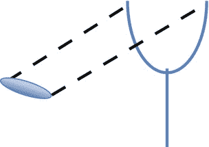

**图 6-1。** *画弹弓*

你要把弹弓放在地上。射弹将具有有限的运动区域。你越往后拉橡皮筋，你就会把抛射体送得越远，如图图 6-2 所示。

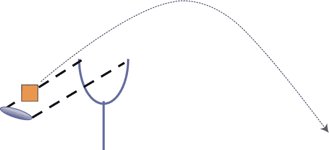

**图 6-2** *。用弹弓扔弹丸*

你无法想象我小时候射过多少个金属罐。我住在一个美丽的农村地区，弹弓比赛在年轻男孩中很常见。我们没有用鸟做投射物，我们也没有向动物射击…但是我们可能有过几次打斗。我还更换了我家附近的几扇玻璃窗。

回忆够多了！现在就来玩一把数码弹弓吧。我将向你展示 GameSalad 中弹弓的基本组件。

##### 创建项目文件

在 GameSalad 中创建新项目，并将文件另存为“`CanonShowPartI.gameproj`”你称之为“CanonShow”是因为在游戏领域，本章中使用的所有概念都被称为经典物理学。

在项目信息选项卡中，使用表 6-1 中的信息。

##### 建造弹弓框架

弹弓框架将由三部分组成:一只脚和两只手臂。为了简单起见，您将只使用一个简单的白色角色，并更改该角色实例的形状和旋转。您将直接在场景中修改实例。

在场景编辑器中打开新项目的初始场景。在演员编辑器中创建一个新演员，并将其命名为“弹弓组件”不应更改执行元属性。

把演员拖到现场。通过单击场景中的演员来选择实例。演员内部会出现一个带圆圈的框架。单击该帧以更改演员的形状。或者，双击该实例并更改 actor 实例的大小。将形状修改为垂直矩形(宽度:24，高度:100)。根据图 6-3 将演员放置在地面上。

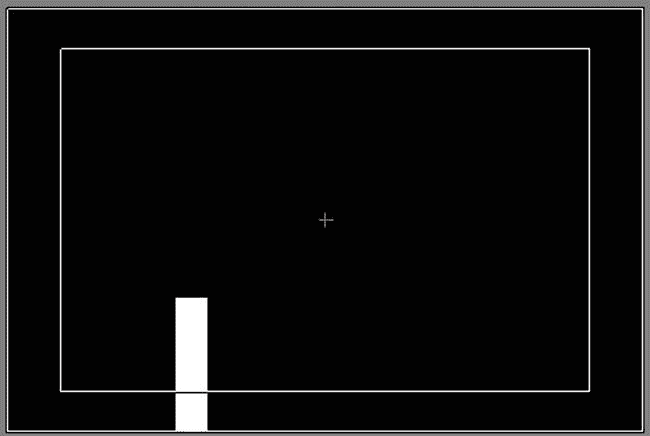

**图 6-3。**地面上的*定位脚*

在场景中拖动演员的另一个实例。通过按住 Option 键并点按和拖移实例来复制上一个形状。双击演员的实例，并将旋转属性更改为 330。根据图 6-4 中的将实例放置在脚的顶部。

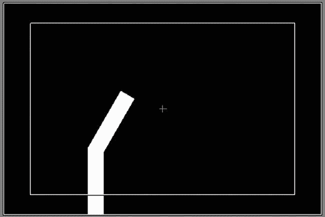

**图 6-4。** *定位弹弓的右框架*

在场景中拖动演员的第三个实例。通过按住 Option 键并点按和拖移实例来复制上一个形状。双击该演员的实例，并将“旋转”属性更改为 30。根据图 6-5 中的将实例放置在脚的顶部。

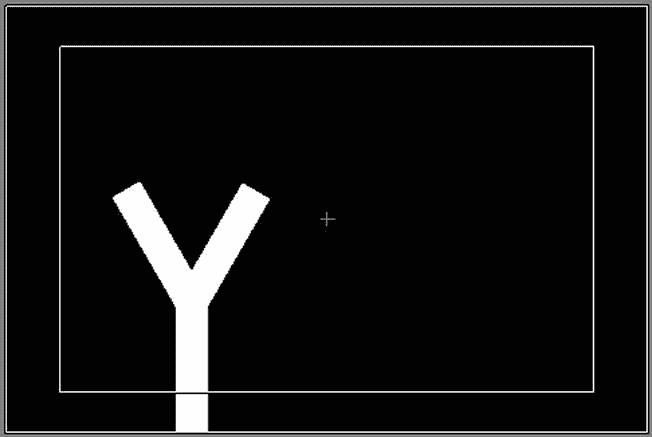

**图 6-5。** *定位弹弓的左框架*

你有弹弓的底座。你现在将专注于建立撤回力量。

#### 建立撤回力量

拉回力与你移动石块扔向左侧的距离成正比。你会通过按下触摸来移动方块；当你释放触摸时，它会把方块扔到场景的右边。您将限制您可以拉回挡块的区域，如图图 6-6 所示。

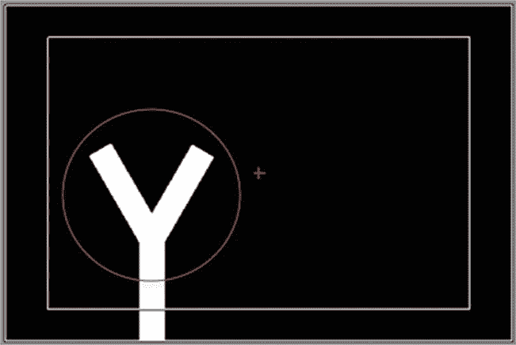

**图 6-6。**?? 区块的回撤区域

一个圆将定义这个区域。圆的半径将是拉回力的最大值。您将使用一个游戏属性来存储这个最大值；命名为“MaxPower”

在构建这个回调之前，我们先来看看 GameSalad 的两个新功能:magnitude 和 vectorToAngle。

##### 量值函数

magnitude 是一个计算两个演员之间距离的函数，如图图 6-7 所示。函数的语法是 magnitude (Actor1X-Actor2X，Actor1Y-Actor2Y)

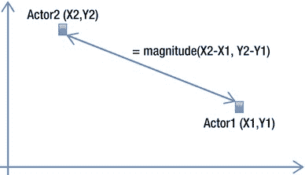

**图 6-7。** *两个演员之间的距离*

你将使用 magnitude 来计算从块的原点到块的当前位置的距离，同时拉回。

##### 向量角函数

vectorToAngle 是一个计算与水平线和两个演员之间形成的线的角度的函数，如图图 6-8 所示。
功能的语法是:

vectorToAngle(Actor1X-Actor2X，Actor1Y-Actor2Y)

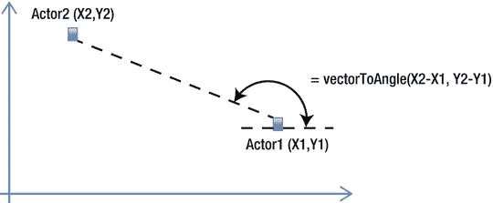

**图 6-8。** *vectorToAngle 函数*

##### 使用弹弓的大小和矢量角度

图 6-9 显示了如何使用 magnitude 和 vectorToAngle 函数。

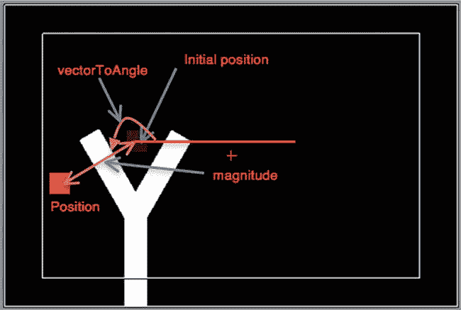

**图 6-9。** *使用幅度和矢量角度功能*

用你的手指，你会碰到抛射体，把它拉回来。当触摸被释放时，您将使用方向的变化速度(取决于 vectorToAngle 值)和速度(取决于幅度)。

当触摸被按下时使用鼠标位置，你将约束投射物的位置。但是你不希望抛射体在图 6-6 中的圆圈之外。

##### 制造抛射体

在场景编辑器中，创建一个新的演员，并将其命名为“弹丸”根据表 6-2 更改演员的属性。

这个小红演员会被弹弓扔出去。

##### 存储初始位置

为了存储抛射体的初始位置，您将使用两个游戏属性。使用游戏属性而不是演员属性的原因是因为你将需要从其他演员(随后的投射物)访问这个初始位置。

返回场景编辑器，创建两个名为“InitialProjectileX”和“InitialProjectileY”的真实游戏属性

使用“更改属性”行为将抛射体的初始位置存储在刚刚创建的两个属性中。在演员编辑器中打开弹丸演员；拖放一个改变属性行为和改变游戏。InitialProjectileX 到弹丸。位置 X 如图图 6-10 所示。

**图 6-10。** *改变 InitialProjectX 的属性*

将第二个更改属性行为(或复制前一个行为)拖放到抛射体角色并更改游戏。InitialProjectileY 到 propellet . position . y

##### 余弦和正弦

接下来，创建一个规则来检测投射体上的触摸。您将使用鼠标设备位置来约束投射体的位置。但是你想把这个位置限制在一个圆内。使用余弦和正弦函数，如图图 6-11 所示。

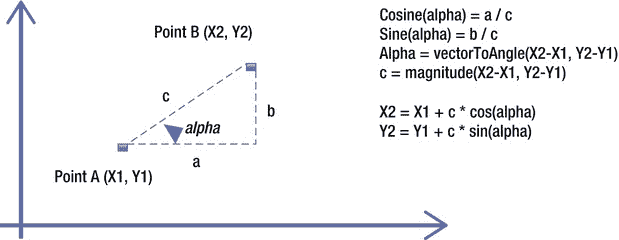

**图 6-11。** *余弦和正弦*

余弦和正弦是三角函数，这意味着它们是一个角度的函数，连接直角三角形的角和这个三角形的边。在直角三角形中，角度(α)的余弦由下式定义

余弦(α)=(α角的邻边)/(直角的对边-斜边)

角度的正弦(α)由下式定义

正弦(α)=(角的对边α)/(直角的对边——斜边)

由于您想要将投射体约束在由属性 MaxPower 定义的圆内，因此您为 c 使用的值将是 MaxPower 和 A 与 b 之间的距离的最小值。这样，c 能够采用的最大值是 MaxPower。

让我们实现这一切。

##### 轻轻一碰就移动射弹

打开场景编辑器，创建一个名为“MaxPower”的整数游戏属性将默认值设置为 75。

创建一个名为“触摸”的新规则条件将是“演员接收事件”“触摸”被“按下”这将检测到演员被触摸。

将约束属性拖放到规则和 changeProjectile 中。位置。X 到游戏。InitialProjectX + min(游戏。MaxPower，量级(游戏。鼠标.位置. X - game。InitialProjectX，游戏。游戏。initial projecty)* cos(vectorToAngle(游戏。鼠标.位置. X - game。InitialProjectX，游戏。游戏。InitialProjectY))。

回到图 6-11 ，

> *   X2 is a projectile.
> 
> *   X1 是游戏初始项目 x
> 
> *   阿尔法！阿尔法切矢量路径(阿叔。□维琪。云娥。x 游戏。InitialProjectX，阿叔。阿叔。

将约束属性拖放到规则中，然后更改投射体。位置。Y 到游戏。initial project+min(游戏。MaxPower，量级(游戏。鼠标.位置. X - game。InitialProjectX，游戏。游戏。initial project)* sin(vectorToAngle(游戏。鼠标.位置. X - game。InitialProjectX，游戏。游戏。InitialProjectY))。

回到图 6-11 ，

> *   Y2 is a projectile.
> 
> *   Y1 是游戏 100 .初始项目
> *   c 是 min(吴亚玲)。MaxPower，majdú(唐氏)。□维琪。x 游戏。初稿，曰。阿叔！(初始项目)
> *   It's alpha vectorToAngle (game. Mouse. location. X-game. InitialProjectX, game. Game. Initial project

该规则如图 6-12 所示。

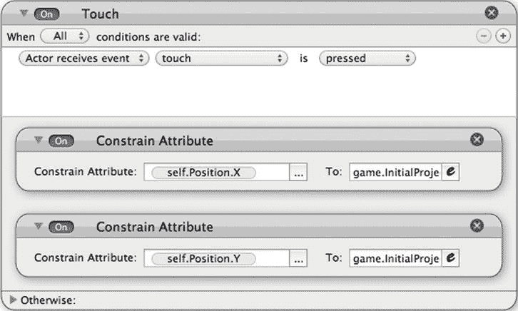

**图 6-12。** *触摸法则*

返回场景编辑器。在场景中拖放抛射体，并将其放置在弹弓的两个臂之间。

点击预览按钮，玩弹丸。

##### 投掷投射物

下一步是当你将手指从屏幕上移开时，能够投掷抛射体。功率将根据原点和拉回点之间的距离来定义，方向将从 vectorToAngle 开始。

一旦释放触摸，您将使用“改变速度”行为来设定抛射体的方向和速度。

凭直觉，您可能会想到使用一个新规则，条件是“Actor receive event”“touch”是“released”当你保持在圆圈限制内时，这种方法是可以的，但如果你走出圆圈并释放触摸，它就不起作用了。相反，您将使用一个带有属性和现有接触规则的小技巧。创建一个默认为假的布尔执行元属性。然后，一旦触摸被按下，将属性更改为 True。在接触规则中，在其他部分添加一个子规则。子规则条件是属性为真。这将避免在按下 Touch 之前抛射体被抛出的可能性。

在演员编辑器中打开弹丸演员。创建一个布尔执行元属性，并将其命名为“HasBeenTouched”

在接触规则中，在“约束属性”行为上方添加“更改属性”行为。如图 6-13 所示，Change 已经触摸到 true。

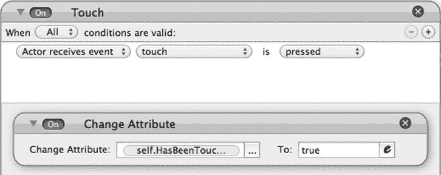

**图 6-13。** *改变已触摸属性*

然后在“行为”窗口的顶部添加一个“更改属性”行为，以便在启动场景时将 HasBeenTouched 属性重置为 false。准备发射。已被修改为 false。

然后展开规则的 Otherwise 部分，并在该部分添加一个新规则。将此子规则命名为“投掷”条件是“属性”抛射体。“HasBeenTouched”是“真的”然后将“改变速度”行为拖放到投掷规则中。将此行为的设置更改为

> *   -你好:180 +矢量路径(阿苏阿苏阿苏阿苏阿苏阿苏阿苏阿苏阿苏阿苏阿苏阿苏阿苏阿苏阿苏阿苏阿苏阿苏阿苏阿苏阿苏阿苏阿苏阿苏阿苏阿苏阿苏阿苏。云娥 x-游戏初始 x 阿金。位置。y-gaminiitialiy)
> *   Relative to: Scene
> *   九月:10 *我的天（阿苏阿苏阿苏阿苏阿苏阿苏阿苏阿苏阿苏阿苏阿苏阿苏阿苏阿苏阿苏阿苏阿苏阿苏阿苏阿苏阿苏阿苏阿苏阿苏阿苏阿苏阿苏阿苏。云娥 x-游戏初始 x 阿金。位置。y-gaminiitialiy)

该规则如图 6-14 所示。

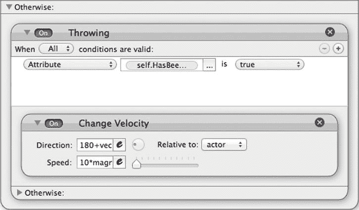

**图 6-14。** *投掷法则*

方向已设置为 180 + vectorToAngle()，因为 vectorToAngle 提供了从原点到拉回位置的方向。你想把抛射体往反方向扔，所以这就是你用“180 +”的原因。

对于速度，使用倍增器来增加效果。我建议使用 10 个，但是你可以使用不同的值。

点击预览按钮来测试您的规则。

#### 如何在 GameSalad 中模拟橡皮筋

在 GameSalad 中模拟橡皮筋是基于修改作为橡皮筋图形表示的 actor 的大小。

您将在场景中看到同一个弹性演员的两个实例。它们中的每一个都会连接到弹弓的不同臂上。每个实例的行为会有所不同；因此，您将编辑场景中的实例。此外，您将需要访问场景实例的一些属性。

##### 更改实例执行元名称

为了创建弹弓，您使用了一个名为“弹弓组件”的演员为了易于识别实例，您将更改场景中实例的名称。

打开场景编辑器，双击弹弓的脚。这将在 Actor 编辑器中打开实例，如图图 6-15 所示。

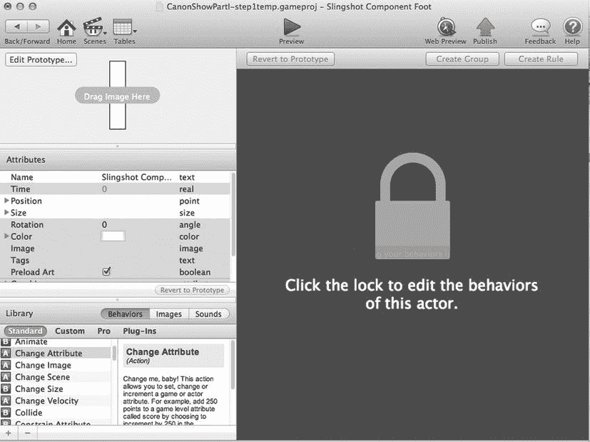

**图 6-15。** *演员编辑*弹弓之脚

在实例的属性中，将名称修改为“弹弓组件脚”

对弹弓的右臂重复相同的操作，并将其命名为“弹弓组件右”为弹弓的左臂再做一次，并将其命名为“左弹弓组件”

您执行此重命名操作是因为您需要从场景中的 elastic 实例访问这些实例的一些属性。

##### 获取弹丸的实时位置

为了正确定位弹力带，你将需要访问抛射体的实时位置。使用游戏属性和约束属性行为很容易做到这一点。但是你只有在项目被抢的时候才需要这些信息。一旦抛射体被抛出，你不希望你的松紧带跟着它。验证规则时，您将使用抛射体的触摸规则来约束位置；否则你会把松紧带带回原来的位置。

创建两个名为“ProjectileX”和“ProjectileY”的真实游戏属性

在演员编辑器中打开投射演员。将约束属性拖放到触摸规则和 changegame 中。ProjectileX 到 propeline . position . x .将另一个约束属性行为拖放到触摸规则中，改变游戏。ProjectileY to Projectile.Position.Y. These .这两种行为如图图 6-16 所示。

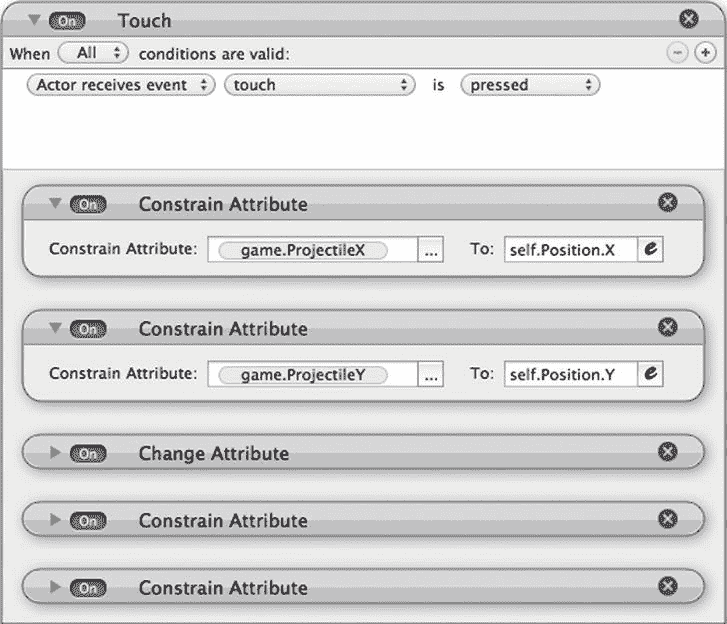

**图 6-16。** *约束抛射体的位置*

这将确保在抓取投射物时，鸟的位置包含在两个游戏属性 ProjectileX 和 ProjectileY 中。

接下来，当鸟没有被抓住时(触摸规则的 Otherwise 部分)，将 ProjectileX 和 ProjectileY 属性的值更改为投射体的初始位置，该位置包含在 InitialProjectileX 和 InitialProjectileY 中。

展开触摸规则的“否则”部分，并将“更改属性”行为拖放到该部分中。改变游戏。ProjectileX 到 game.InitialProjectileX .拖拽另一个改变属性行为，改变游戏。这两个额外的行为显示在图 6-17 中。

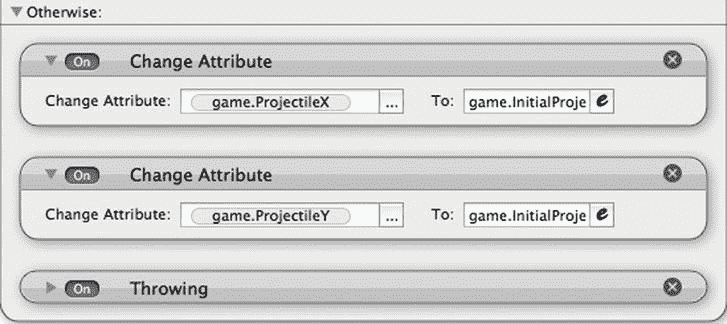

**图 6-17。** *回到初始位置*

现在您已经设置了属性 ProjectileX 和 ProjectileY。让我们花点时间在松紧带上。

##### 弹性理论

弹性元件将是一个非常小尺寸(5×5)的基本元件，它将根据抛射体的位置改变其形状(宽度)、位置和旋转。图 6-18 说明了弹性物体如何与抛射体相互作用。

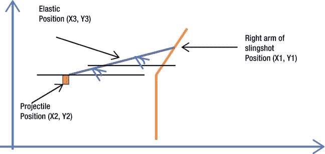

**图 6-18。** *弹丸、弹弓和弹弓臂*

对于松紧带，您将把它的宽度约束到投射体和弹弓右臂之间的距离，给人一种长度在移动投射体时发生变化(弹性)的印象。位置 X3 是通过将 X2(抛射体)和 X1(臂)之间的距离的一半加到 X2 而得到的。Y3 也一样，是把 Y2 和 Y1 的距离的一半加到 Y2 上得到的。

为了最终确定效果，您将约束弹弓的旋转，使弹弓和弹弓臂之间的角度相同。在图 6-18 中可以看到，这两个角度是相等的。

以上我们都来做。

##### 创造弹性演员

在场景编辑器中，创建一个名为“弹性”的新演员根据表 6-3 更改该演员的属性。

拖动弹性演员，将其放在场景中大约右臂的中心位置。重复相同的动作，但是将第二个实例放在左臂的中心附近，如图图 6-19 所示。

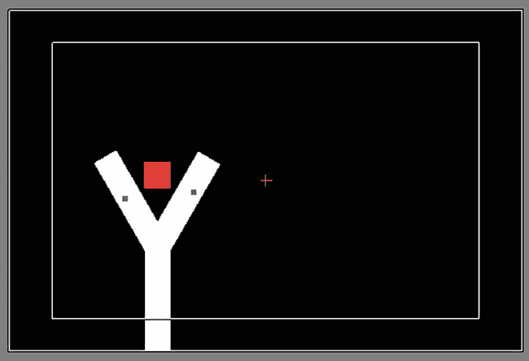

**图 6-19。** *现场弹性定位*

现在让我们配置每个实例。

##### 实现正确的弹性

双击场景中的右弹性实例，在演员编辑器中打开它。将实例角色重命名为“弹性右”点击图 6-20 中的锁图标。这将解锁实例行为。

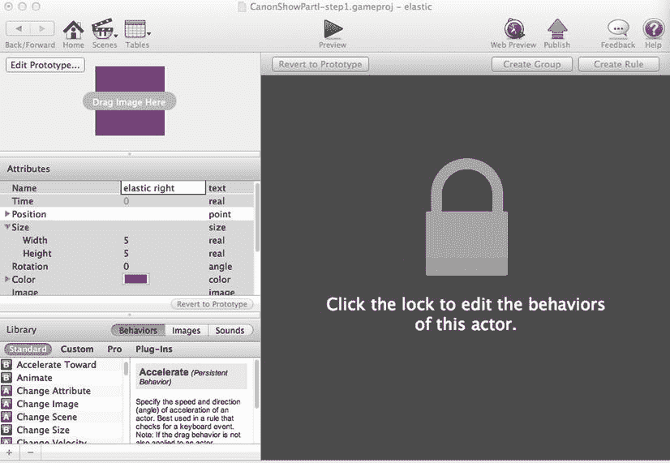

**图 6-20。** *解锁演员的实例*

拖放约束属性行为并更改弹性右移。位置。X 到游戏。ProjectileX +(当前场景。图层。背景。弹弓组件右。位置 X-游戏。ProjectileX)/2。

拖放约束属性行为并更改弹性右移。位置。Y 到游戏。ProjectileY +(当前场景。图层。背景。弹弓组件右。位置。Y-游戏。ProjectileY)/2。

拖放约束属性行为并更改弹性右移。大小。宽度到数量级(当前场景。图层。背景。弹弓组件右。位置 X-游戏。ProjectileX，当前场景。图层。背景。弹弓组件右。位置。Y-游戏。ProjectileY)。

拖放一个约束属性行为并改变弹性权。旋转到 vectorToAngle(游戏。当前场景。图层。背景。弹弓组件右。位置。X，游戏。投影-当前场景。图层。背景。弹弓组件右。Position.Y)。

这些行为如图 6-21 所示。

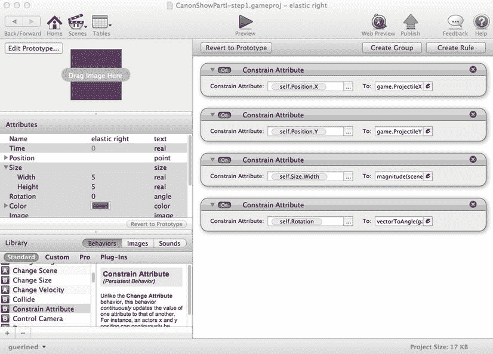

**图 6-21。** *弹性正确行为*

让我们对左边的松紧带做同样的处理。

##### 实现左弹性

双击场景中左侧的弹性实例，在演员编辑器中将其打开。将实例角色重命名为“弹性左”点按锁图标。

拖放一个约束属性行为，并更改弹性左。位置。Xto 游戏。ProjectileX +(当前场景。图层。背景。弹弓组件左。位置 X-游戏。ProjectileX)/2。

拖放一个约束属性行为并向左更改弹性。位置。Y 到游戏。ProjectileY +(当前场景。图层。背景。弹弓组件左。位置。Y-游戏。ProjectileY)/2。

拖放一个约束属性行为，并更改弹性左。大小。宽度到数量级(当前场景。图层。背景。弹弓组件左。位置 X-游戏。ProjectileX，当前场景。图层。背景。弹弓组件左。位置。Y-游戏。ProjectileY)。

拖放一个约束属性行为，并更改弹性左。旋转到 vectorToAngle(游戏。当前场景。图层。背景。弹弓组件左。位置。X，游戏。投影-当前场景。图层。背景。弹弓组件左。Position.Y)。

这些行为如图 6-22 所示。

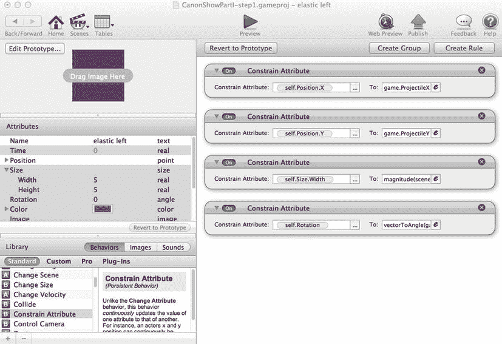

**图 6-22。** *弹性左行为*

点击预览按钮来玩抛射体。

您可以打开位于 Chapter6_Files 文件夹中的文件`CanonShowPartI-step1.gameproj`。

### 控制摄像机:在场景中滚动

接下来，你将了解 GameSalad 中的相机。GameSalad 中的摄像头不是控制 iPhone 摄像头的一种方式(GameSalad 还无法实现这一点，但这将是一个非常酷的功能)。理解摄像机最简单的方法就是认为你是通过摄像机在看比赛。然后，您可以使用滚动功能来增强佳能秀中的玩家体验！

#### 屏幕与场景

在 GameSalad，只有一个摄像头。摄像机是视点，你看比赛的方式。游戏的可视区域在你的屏幕上，你将实现对相机的控制:向左、向右、向上和向下移动相机。

到目前为止，您已经制作了场景大小等于屏幕大小的项目。当您正在构建一个不需要滚动的项目时，这很好。然而，在这个游戏中，你希望有一个更大的场景，其中可见的部分等于屏幕的大小。

GameSalad 中相机的一个关键概念是一个演员在控制相机。您将使用名为“控制摄影机”的行为，并将其影响到一个演员。因此，当演员移动时，摄像机也跟着移动。

相机视图是屏幕，但是相机还有另外一个工具:相机区域。这个区域是控制摄像机的关键。只要演员在这个区域内移动，摄像机就不会移动；演员一走出这个区域，摄像机就会跟着走。

点击图 6-23 中所示的摄像头图标，进入摄像头区域。

**图 6-23。** *相机图标*

这将激活相机模式并显示相机区域(参见图 6-24 )。

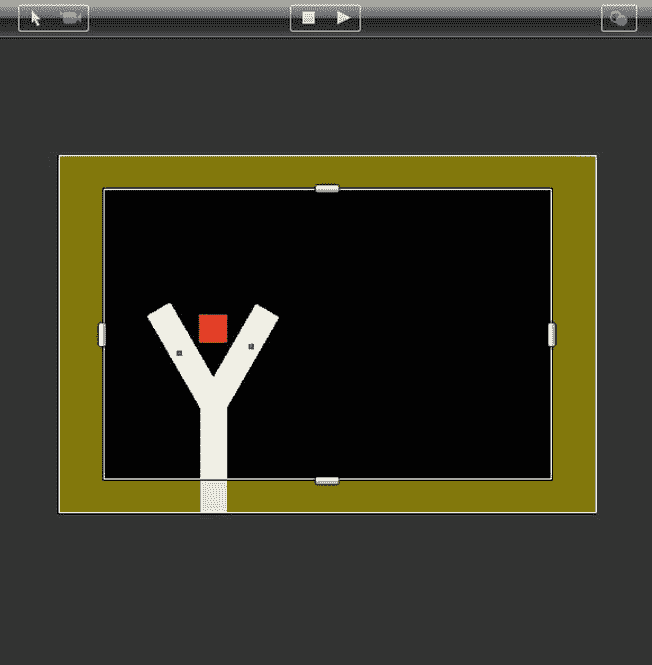

**图 6-24。** *摄像机区域视野*

控制摄像机的演员在撞上摄像机区域并随着演员移动摄像机之前，可以在中央黑色区域自由移动。

您可以使用手柄来减小或增大该区域。您也可以使用场景摄像机跟踪区域来编辑带有精确数字的值。

但是如果你的场景和你的屏幕一样大，那么移动相机又有什么意义呢？没有！为了使用相机，你需要有一个更大的场景。

#### 实现滚动

让我们实现佳能秀的滚动。第一步是让场景的尺寸变大。

在场景编辑器中，点击场景选项卡，打开场景属性，如图图 6-25 所示。

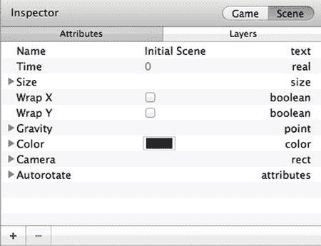

**图 6-25。** *场景属性*

展开尺寸属性，将场景尺寸改为宽度:1920，高度:1280，如图图 6-26 所示。

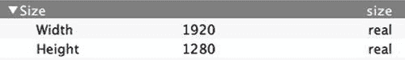

**图 6-26。** *场景大小*

现在让我们给抛射体添加相机控制。

在演员编辑器中打开投射演员。将一个控制摄像机行为拖放到抛射体演员中，如图图 6-27 所示。

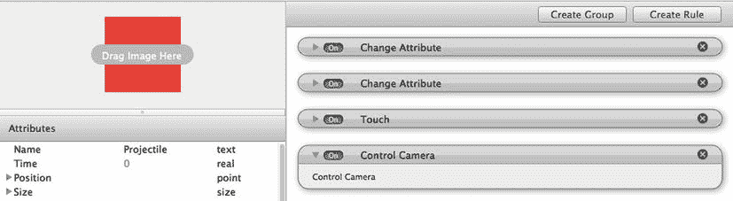

**图 6-27。** *控制摄像机*

点击预览按钮来玩抛射体。

您可以打开位于 Chapter6_Files 文件夹中的文件`CanonShowPartI-step2.gameproj`。

### 飞行和坠落:重力概念

你现在有一个投射物被抛出，但它只是上升，并且很快离开场景。你需要实现一种脚踏实地的方法，这样你就可以努力达到你以后要创造的目标。同样，当一个物体在空中飞行时，空气会引起一些摩擦力，从而降低速度，所以你需要定义这一点。

#### 从前，有一个苹果

重力是一种自然现象，物理物体通过重力吸引与其质量成比例的力。17 世纪，艾萨克·牛顿爵士提出了万有引力的概念。它用 g 表示，是地球给予其表面或表面附近物体的加速度。这就是为什么你坚持在地面上。在图 6-28 中可以看到，以米/秒计约为 9.8m/s 2 。

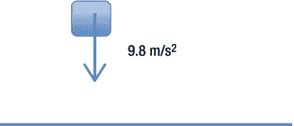

**图 6-28。** *引力的例证*

关于苹果:

第一个苹果标志实际上是艾萨克·牛顿爵士坐在苹果树下，一个苹果落在他头上的形象。据说苹果这个名字是为了向牛顿爵士致敬。

#### 飞行和拖曳

我个人不使用 GameSalad 重力功能。它位于场景属性中。您可以在 X 和 Y 上输入一个实数来模拟 X 和 Y 方向上的力。

因为重力是加速度，所以我更喜欢使用加速行为。它提供了更多的灵活性，因为您可以通过规则触发它。想象一下有几个行星的太空场景，每个行星都有自己的引力…

实现 gravity 并将其拖动到您的项目中。阻力用于模拟空气对物体的摩擦。拖是演员的属性。

在演员编辑器中打开投射演员。展开接触规则的“否则”部分。然后，将加速行为拖放到投掷规则中。将设置更改为:

> *   Direction: 270
> *   Relative: Scene
> *   Acceleration: 200

这将模拟重力。

然后，将“更改属性”行为拖放到“加速”行为旁边。换弹丸。物理。拖到 100。图 6-29 显示了这两种行为。这种阻力将模拟空气摩擦。

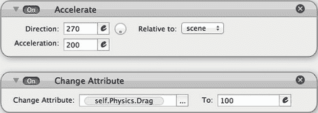

**图 6-29。** *加速和拖拽*

最后一步是放置一个背景，使投射物的运动更容易可视化。导入图像`Background.png`并创建一个名为“Background”的新演员拖动场景中的演员，右键单击演员将其发送到后面，然后调整背景大小以覆盖整个场景。

点击预览按钮来玩抛射体。

您可以打开位于 Chapter6_Files 文件夹中的文件`CanonShowPartI-step3.gameproj`。

### 更多相机控制:飞行时放大/缩小

当你看动作片的时候，电影制作人常用的一个技巧就是放大或缩小来强调一个场景。当你的弹丸飞行时，能在 GameSalad 中做同样的事情不是很好吗？想象一下，你可以在飞行开始时缩小，然后在接近着陆时缩小。这肯定会产生非常好的视觉效果。

开始吧！

#### 缩小

对于相机，有一组属性我还没有提到:相机尺寸。如前所述，摄像机的显示器是屏幕。所以你改变了摄像机的尺寸。很明显，你的物理屏幕是不会扩大的(苹果很神奇，但没那么神奇)。那么如果你增加屏幕的尺寸会发生什么呢？在相同的显示屏尺寸下，您可以覆盖更多内容。这将产生一种视觉效果，好像摄像机正在进一步(缩小)以在显示器上显示更多内容。这正是你想要的效果。

相机属性是场景属性。如果您希望行为修改它们，您需要能够访问场景属性。什么类型的演员可以访问场景属性？解锁的 actor 实例！

打开场景编辑器。双击场景中投射演员的实例。根据图 6-30 点击锁图标解锁实例。

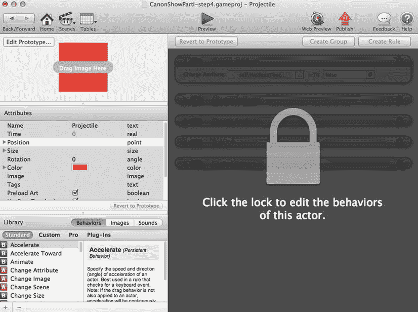

**图 6-30。** *解锁弹丸实例*

展开 Touchrule 的“否则”部分。然后扩展投掷规则。将插值行为拖放到投掷规则中，如图 6-31 所示，将设置更改为:

> *   Interpolation attribute: current scene. camera . size . width

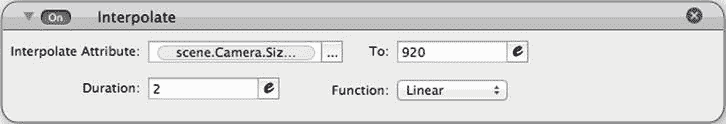

**图 6-31。** *插补摄像机的宽度尺寸*

你可以调整宽度和持续时间的值。我用 920 是因为我喜欢 2 秒钟内数值翻倍的效果。我建议你四处寻找你喜欢的价值观。

将插值行为拖放到投掷规则中，并将设置更改为:

> *   Interpolation attribute: current scene. camera . size . height

点击预览按钮，尝试这个新的效果。

#### 放大

直观地说，你可以说，如果你缩小相机的尺寸，你会创造一个放大的效果。你完全正确！

为了在缩小后触发效果，添加一个 2 秒的计时器。在下一章中，您将更改时间以添加一个规则，该规则将在与目标接触时触发放大。

将一个计时器行为拖放到抛射体 actor 实例的投掷规则中，并将设置更改为“2”秒后。

将这两个插值行为(拖移+Option 键)复制到计时器中。将刚刚复制的插值行为设置为宽度:460 和高度:320，如图图 6-32 所示。

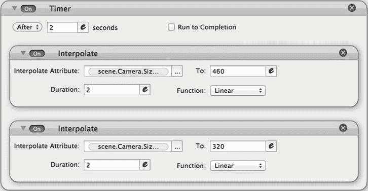

**图 6-32。** *放大效果*

你现在有很好的缩小和放大效果，但是用一个很小的技巧，你可以让它变得更好。

##### 微调

要微调效果，有个小技巧。缩小跟踪区域会产生更好的效果。

打开场景编辑器并单击“场景”选项卡以显示场景属性。展开相机属性，然后展开跟踪区域属性。将宽度属性改为 200，高度属性改为 150，如图图 6-33 所示。

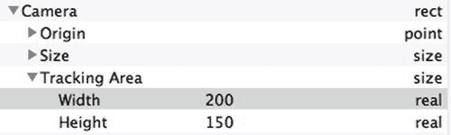

**图 6-33。** *缩小跟踪区域*

点击预览按钮来玩抛射体。

您可以打开位于 Chapter6_Files 文件夹中的文件`CanonShowPartI-step4.gameproj`。

### 射弹管理:管理尝试

本章的最后一步是实现每个场景的最大尝试次数。你会在屏幕的左下方出现一些弹丸，每扔出一个弹丸，数量就会减少一个。

#### 添加边界

在进入投射物管理之前，你需要在游戏区域周围定义一些墙。正如你可能已经注意到的，当你投掷抛射体时，它们会落下并进入场景之下，因为没有底层。您将在场景周围创建一些墙。抛射体将与墙壁碰撞。

打开场景编辑器，创建一个名为“墙”的新演员双击演员，在演员编辑器中打开它。在演员的属性中，将恢复值更改为 0，并取消选中可移动框。

回到场景编辑器。将墙壁角色的四个实例拖放到场景中。改变它们各自的形状，将它们放置在场景的四个边界上，如图图 6-34 所示。

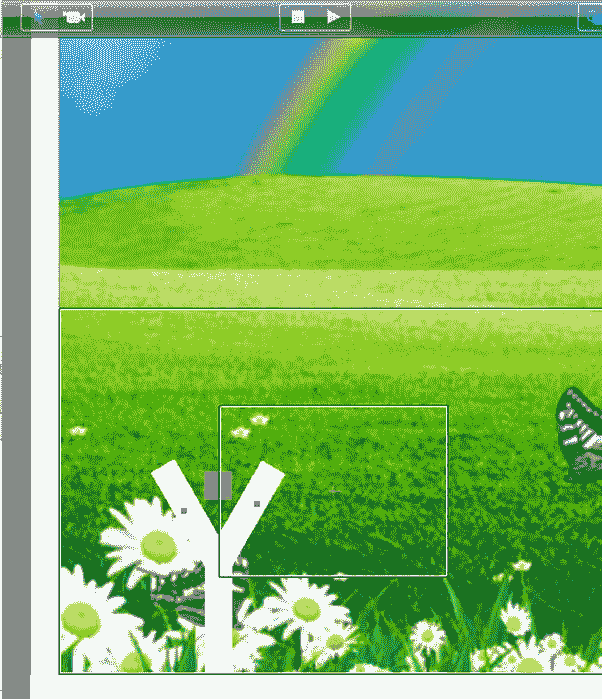

**图 6-34。** *给场景添加墙壁*

接下来，双击场景中的投射角色实例。请记住，因为您已经编辑了此实例(解锁)，所以它不会合并对原型所做的更改。将一个碰撞行为拖放到行为的顶部，并将设置更改为与“类型的演员”“墙”碰撞时反弹，如图图 6-35 所示。

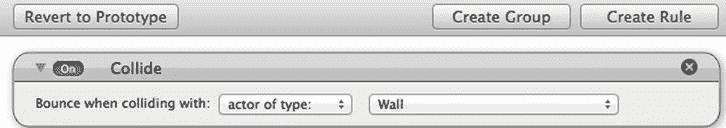

**图 6-35。** *在墙壁上跳跃*

点击预览来测试你的工作。

#### 制造假射弹

管理各种射弹的一个非常酷的技巧是，实际上你只会使用一个射弹。您将创建假射弹，每次尝试后，当主射弹被带回弹弓时，假射弹将一个接一个地消失。

假射弹将具有与射弹相同的外观。但是它们将只包含一个规则和这个规则中的一个改变属性行为。

创建一个游戏属性来定义完成场景的剩余尝试次数。我将这个尝试次数设置为 4(你可以选择任何其他适合你的次数)，所以你将需要三个假射弹。因为你在弹弓上有一个，它最初会在场景中显示四个投射物。每次尝试后，游戏属性将减少一。虚拟抛射体中的规则将检查游戏属性与位置号的比较。如果游戏属性较低，你将使虚拟射弹不可见(颜色从 alpha 到 0)。魔法结束了！

在场景编辑器中，创建一个新的整数类型的游戏属性，命名为“尝试离开”，并设置其默认值为 4，如图图 6-36 所示。

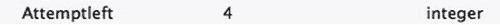

**图 6-36。** *游戏属性尝试离开*

接下来，创建一个新的演员，并将其重命名为“虚拟弹丸”，并在演员编辑器中更改以下属性:

> *   Size/width: 25
> *   Size/Height: 25
> *   Color/red: 1
> *   Color/green: 0
> *   Color/blue: 0

接下来，用条件“属性”“游戏”创建一个新规则。图 6-37 。

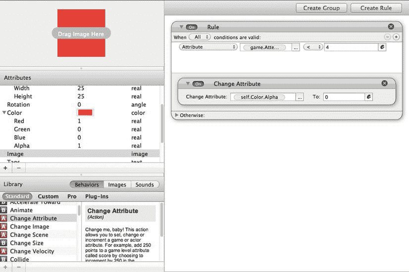

**图 6-37。** *假射弹*

拖放虚拟抛射体演员的三个实例，并将它们放置在场景的左下方，如图图 6-38 所示。

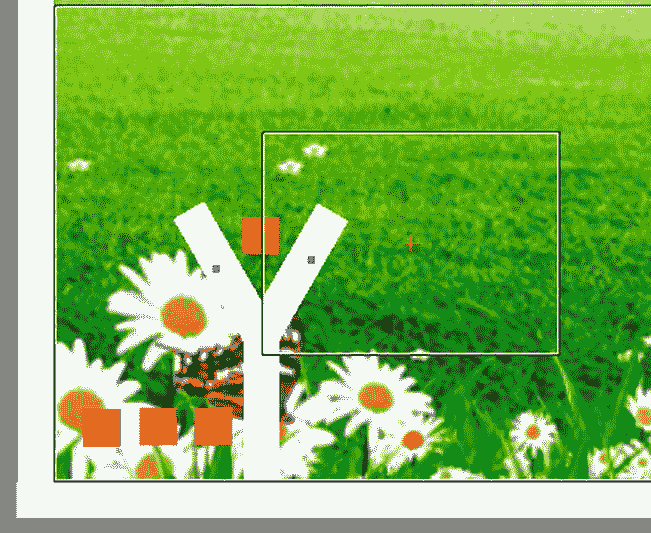

**图 6-38。** *定位假射弹*

从左侧开始，打开假射弹的第一个实例并解锁。将规则的条件改为“属性”“游戏”。图 6-39 。

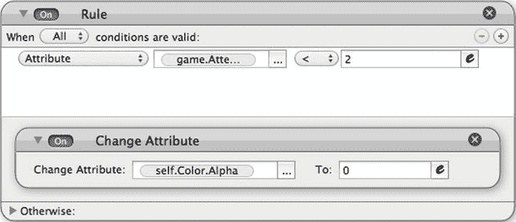

**图 6-39。** *修改假射弹一枚*

从左侧开始，打开伪射弹的第二个实例并解锁。将规则的条件改为“属性”“游戏”。如图 6-40 中所示<【3】【调遣】。

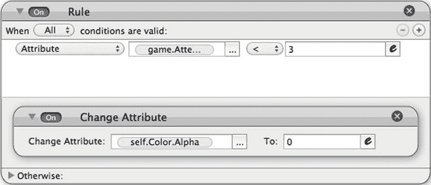

**图 6-40。** *改装假射弹两枚*

#### 修改抛射体实例

下一部分工作是修改弹丸实例。你需要在投射体停止移动时实现一个检测，这将触发投射体返回到它的初始位置。您还将重置关键属性，减少尝试次数，并在四次尝试完成后实现游戏重置。当你改变抛射体时，你也将使用一个布尔属性来设置一个状态。该布尔值将被用作规则中触发某些重置的条件。

##### 检测射弹何时停止移动

在场景编辑器中，创建一个名为“改变抛射体”的新布尔游戏属性要检测抛射体何时停止移动，您将使用线速度运动属性。

通过双击场景中的演员来打开投射演员实例。在投掷规则中创建一个新规则，并将其命名为“更改抛射体”将以下条件添加到标准为“全部”的规则中

> *   [Attribute] "Projectile. Exercise. Linear speed.
> 
> *   "Attribute" "projectile. Exercise. Linear speed.

然后，将一个更改属性行为拖放到规则和更改抛射体中。颜色α为 0。接下来，将一个更改属性行为拖放到相同的规则中，并更改游戏。将弹丸改为真。最后，将最后一个更改属性行为拖放到规则和更改游戏中。尝试离开游戏。尝试离开-1。该规则如图 6-41 中的所示。

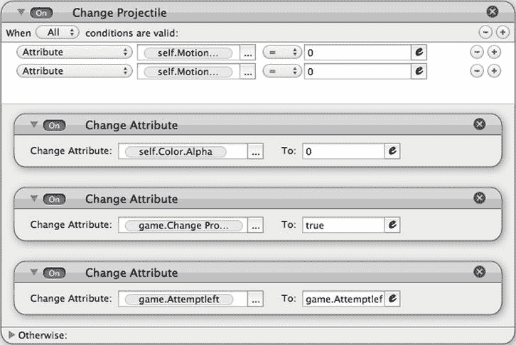

**图 6-41。** *改变抛射体规则*

##### 移回原始位置

当属性改变投射物为真时，你将通过一个规则把投射物移回到它的原始位置。使用“插值”行为将其移回其原始位置，该位置存储在属性 InitialProjectileX 和 InitialProjectileY 中。

在 actor 实例中创建一个新规则，并将其命名为“Back to Position”规则的条件是“游戏属性”。改变弹丸" "为" "真。"将插值行为拖放到规则中，并将设置更改为:

> *   Attribute: projectile. Location. x
> 
> *   Duration: 1
> *   Function: linearity

使用以下设置重复相同的操作:

> *   Attribute: projectile. position . Y
> 
> *   Duration: 1
> *   Function: linearity

回位规则如图图 6-42 所示。

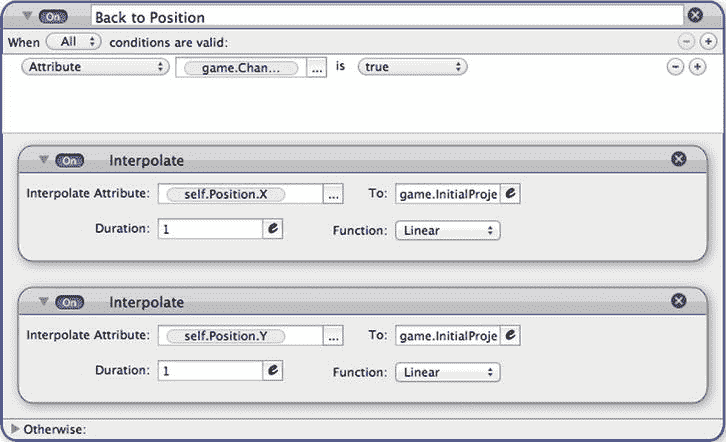

**图 6-42。** *回位规则*

##### 重置关键属性

接下来，您需要重置 HasBeenTouched 属性，使弹丸可见，并将 change 弹丸的状态更改为 false。

将“更改属性”行为拖放到“回到位置”规则和“更改抛射体”中。已被修改为 false。

将新规则拖放到“回到位置”规则中，将其命名为“属性重置”，并将以下条件添加到“全部”

> *   【属性】"弹丸位置。X" "= " "游戏 InitialProjectileX "
> *   [Attributes] [Projectile]. Position.Y" "= ""game.

这将检测射弹是否回到其原始位置。

将更改属性行为拖放到属性重置规则和更改投射体中。颜色从α到 1。拖放第二个改变属性和改变游戏。将弹丸改为假的。属性重置规则如图 6-43 所示。

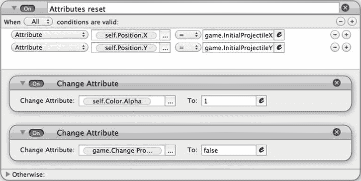

**图 6-43。** *属性重置规则*

##### 尝试四次后重置游戏

这最后一步非常简单。只需在抛射体 actor 实例中创建一个新规则，并将其命名为“重置游戏”规则的条件是“游戏属性”。尝试离开" " =" "0。"然后将重置游戏行为拖放到规则中。游戏规则的重新设置如图 6-44 所示。

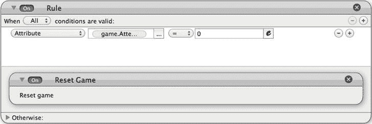

**图 6-44。** *重置游戏规则*

点击预览按钮来玩投射弹。

您可以打开位于 Chapter6_Files 文件夹中的文件`CanonShowPartI-step5.gameproj`。

### 总结

准备好向目标扔东西了吗？有了你全新的弹弓，你将能够提高你的瞄准技巧。

在本章中，您学习了如何:

> *   Build a slingshot system.
> *   Simulate an elastic element.
> *   Control the camera.
> *   Realize gravity.
> *   Use advanced camera settings.
> *   Manage a limited number of attempts.