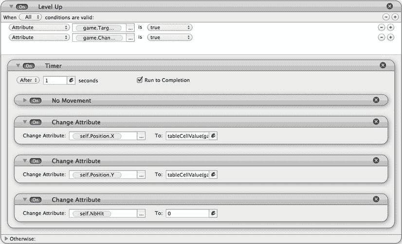
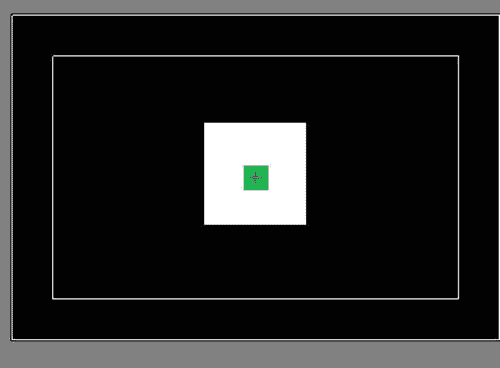

# 七、创建游戏菜单和粒子效果：类似愤怒的小鸟的游戏，第二部分

在前一章中，你学习了如何为一个类似愤怒的小鸟的游戏建立基础。但是你还有很多要学的。你需要一个目标来瞄准，需要格挡来保护目标。这也是一个引入表的机会，表执行一些非常高级的优化。最后但同样重要的是，您将构建一个非常酷的菜单系统。

在本章中，您将:

> *   Build goals and blocks.
> *   Use particle effect properties.
> *   云娥加米沙拉-什么。
> *   Optimize your game with tables.
> *   Create a cool menu system.

### 瞄准目标:摧毁街区

如果没有目标和保护目标的方块，佳能游戏会是什么样子？在本节中，您将通过创建三类要销毁的方块来增加游戏体验，并且您将创建玩游戏所需的交互。

#### 创建积木:硬积木、软积木和目标积木

您将创建三种类型的块:硬块、软块和目标块。目标就是目的。弹丸一击，关卡完成。软块将模拟易于破坏的块；需要双击来摧毁这些方块。最后，坚硬的石块将模拟岩石般坚硬的石块；需要三次打击才能摧毁这些街区。

##### 目标

在场景编辑器中打开场景，并创建一个新演员。将演员命名为“目标”根据表 7-1 更改属性。

##### 软块

创建一个新的演员，并命名为“软块。”根据表 7-2 更改属性。

##### 硬块

创建一个新的演员，并命名为“硬块。”根据表 7-3 更改属性。

#### 使它们碰撞

您将使用一个标签来更容易地定义可碰撞的对象。

单击主页按钮，然后单击演员选项卡。为所有可碰撞的物体创建一个新的标签。单击标签窗格上的+号，并将新标签重命名为“Collidable”然后将以下参与者拖放到可绑定的标签中:

> *   shot
> *   target
> *   Soft block
> *   Hard block
> *   wall

结果如图图 7-1 所示。

**图 7-1。** *可绑定标签的演员*

在执行元编辑器中打开目标执行元。拖放一个碰撞行为，并将设置更改为与“带标签的演员”“可碰撞”碰撞时反弹，如图图 7-2 所示。

**图 7-2。** *碰撞行为*

对演员软块和硬块重复同样的操作。

#### 把它们放在地球上:重力

当你通过加速实现重力时，你需要定义一个加速行为。

在执行元编辑器中打开目标执行元。拖放加速行为并将设置更改为:

> *   Direction: 270
> *   Relative: Scene
> *   Acceleration: 200

参见图 7-3 。“相对于”适用于方向。如果您选择场景，它将与场景的参考进行比较。相对于场景的 90°方向将向上。如果选择了 actor，它将是相对于 actor 的。因此，如果您选择 90，并且演员的旋转等于 90，效果将是在场景中向左移动(90 + 90)。

**图 7-3。** *重力为目标*

对演员软块和硬块重复同样的操作。

#### 让演员进入场景

将一个目标实例、一个软块实例和两个硬块实例拖放到场景中。确定演员的位置和形状，使其大致符合图 7-4 。试着把它们放在场景的右边。

**图 7-4。** *在场景上定位目标*

点击预览按钮来玩投射弹。

您可以打开位于 Chapter7_Files 文件夹中的文件`CanonShowPartII-step1.gameproj`。

在这个阶段，你仍然有更多的工作要做，以使它更具可玩性。接下来，您将重点确保在一定数量的点击后，一些块被破坏。

### 带点风格:粒子效果

粒子效果是 GameSalad 的一大特色。基本上，它将在指定的时间内以定义的速率产生多个元素(粒子)。它可以有许多不同的用途。它可以根据设置提供多种结果:灰尘、推力、爆炸。本节解释了粒子效果的每个设置参数，然后你将实现它对目标的破坏。

#### 粒子效果的参数

粒子效果是一种叫做粒子的行为。可以在标准行为库中找到，需要拖放到一个 actor 中。虽然效果很棒，但是有一个缺点就是你不是在催生演员。这意味着粒子不具有相同的属性。比如不能碰撞，不能有行为。

粒子行为由六个参数标签组成:

> *   Reproduction speed: Define the number, life span and reproduction speed of particles.
> *   Velocity/Position: Define the velocity of particles and the position where they should be generated.
> *   Size: Defines the size of the particle.
> *   Color: Allow some color effects on particles.
> *   Rotation: Add some setting options for the rotation of particles.
> *   Image: This section allows you to select an image from your particle library instead of a basic shape.

##### 产卵率

图 7-5 显示了粒子行为的“繁殖速率”选项卡。

**图 7-5** *。粒子行为的“繁殖速率”选项卡*

在该选项卡中，有三个设置参数:

> *   Number of particles: the number of particles generated when this input behavior occurs. Be careful; Setting a high number of particles here may slow down the game.
> *   Particle startup time: enter the time required to generate all the particles you just defined. Unit 2.
> *   Particle life: Here you can define the life of a particle before it is destroyed. Unit 2.

##### 速度/位置

速度/位置选项卡如图 7-6 所示。

**图 7-6。** *粒子行为的速度/位置选项卡*

在这里你可以定义你产生的粒子的速度和方向以及它们的来源。该选项卡包含六个设置参数:

> *   Emitter Offset X: This parameter offsets the position of the particle origin on the X axis relative to the center of the actor with particle behavior.
> *   Y emitter offset: This parameter offsets the position of the particle origin on the Y axis relative to the center of the actor with particle behavior.
> *   Direction: Defines the direction of the derived particles.
> *   Relative: You can choose whether you want the direction to be relative to the actor or the scene. For example, if you choose a direction of 270 degrees relative to the scene, it will always go down regardless of the position of the actor. If you choose 270 degrees as the direction relative to the actor, it will go to the bottom of the actor, which will depend on the rotation of the actor.
> *   Affected by gravity: If you have defined the scene gravity, check this box if you want your particles to be affected by gravity.
> *   Velocity: Enter a value to define the velocity of particles.

##### 大小

粒子行为的尺寸选项卡如图 7-7 所示。

**图 7-7。** *粒子行为的尺寸选项卡*

“大小”选项卡定义粒子的大小、起始大小以及在指定时间内达到的目标大小。这些参数是:

> *   Size: Enter a value here. Units are pixels.

如果您选择了“尺寸更改为”，尺寸转换设置将出现在屏幕上。设置参数为:

> *   Target size: enter the size to be reached within the specified time set in the following parameters.
> *   Duration: Enter the time to change the size. Unit 2.

##### 颜色

图 7-8 显示了粒子行为的颜色选项卡。

**图 7-8。** *粒子行为的颜色标签*

“颜色”选项卡不仅定义粒子的颜色，还使您能够在指定的时间内获得起始颜色和目标颜色。

这些参数是:

> *   Color: Choose a color here.
> *   Constant color: Choose whether you want the color of particles to remain constant throughout the life cycle, or whether you want the color to change.

如果您选择了“颜色更改为”，颜色过渡设置将出现在屏幕上。设置参数为:

> *   Mixed mode: You can choose from a variety of mixed modes. Try to find the setting that suits you best.
> *   Target color: select the color to be set within the specified time (set in the following parameters).
> *   Duration: Enter the time to change the color. Unit 2.

##### 循环

旋转选项卡如图 7-9 所示。

**图 7-9。** *旋转选项卡*

您可以定义初始旋转角度以及角速度(粒子的旋转速度)。

##### 图像

图 7-10 显示了图像选项卡。

**图 7-10。** *粒子行为的图像选项卡*

您可以通过从下拉按钮中选择图像来使用图像库中的图像，而不是基本的正方形。以前的设置继续适用。

#### 色彩的爆炸

在玩一点粒子行为之前，你需要在游戏中遵循一些额外的步骤。

在 actor 编辑器中打开软块，创建一个名为“NbHit”的新整数 Actor 属性，默认值为 0。每次与抛射体碰撞，该属性都会增加 1。

创建名为“碰撞增量”的新规则规则的条件是“执行元接收事件”与“执行元类型”的“投射体”发生“重叠或冲突”然后将更改属性行为拖放到规则和更改软块中。NbHit 到软块。NbHit+1。

接下来，创建第二个名为“块销毁”的规则这个规则会在投射物击中两次后摧毁行动者。规则的条件是“属性”“软块”。NbHit""≥""2。"然后将销毁行为拖放到规则中。

软块的 Actor 编辑器视图如图图 7-11 所示。

**图 7-11。** *演员编辑查看软屏蔽*

对硬块角色重复同样的操作，但不是需要两次命中来摧毁角色，而是在三次命中后将其设置为摧毁。演员如图图 7-12 所示。

**图 7-12。** *演员编辑视角的硬屏蔽*

现在，让我们玩一下粒子行为。

将名为`star.png`的 Chapter7_Files 文件夹中的图像导入到项目的图像库中。

在执行元编辑器中打开目标执行元。创建一个新规则，并将其命名为“目标破坏”规则的条件是“执行元接收事件”与“执行元类型”的“投射体”重叠或冲突拖放粒子行为并将设置更改为:

> *   Number of particles: 200
> *   Particle starting time: 1
> *   Particle life: 1
> *   Transmitter offset: 0&0
> *   Direction: Random (0,359)
> *   Relative to: actor
> *   Speed: 100
> *   Size: 20
> *   Change the size to:
>     *   Target size: 0
> *   Duration: 1
> *   Color: Select a blue color and set the opacity to 50%.
> *   Change the color to:
>     *   Mixed: ordinary

拖放另一个粒子行为，并将设置更改为(或通过按住 Option 键拖移它来复制之前的行为)

> *   Number of particles: 200
> *   Particle starting time: 1
> *   Particle life: 1
> *   Transmitter offset: 0&0
> *   Direction: Random (0,359)
> *   Relative to: actor
> *   Speed: 100
> *   Size: 20
> *   Change the size to:
>     *   Target size: 0
> *   Duration: 1
> *   Color: Choose a green color and set the opacity to 50%.
> *   Change the color to:
>     *   Mixed: normal
> *   Target color

拖放另一个粒子行为并将设置更改为:

> *   Number of particles: 200
> *   Particle starting time: 1
> *   Particle life: 1
> *   Transmitter offset: 0&0
> *   Direction: Random (0,359)
> *   Relative to: actor
> *   Speed: 100
> *   Size: 20
> *   Change the size to:
>     *   Target size: 0
> *   Duration: 1
> *   Color: Choose a red color and set the opacity to 50%.
> *   Change the color to:
>     *   Mixed: normal
> *   Target color

拖放另一个粒子行为，并将设置更改为:

> *   Number of particles: 200
> *   Particle starting time: 1
> *   Particle life: 1
> *   Transmitter offset: 0&0
> *   Direction: Random (0,359)
> *   Relative to: actor
> *   Speed: 100
> *   Size: 20
> *   Change the size to:
>     *   Target size: 0
> *   Duration: 1
> *   Color: Choose a green color and set the opacity to 50%.
> *   Change the color to:
>     *   Mixed: normal

点击预览按钮来玩抛射体。

您可以打开位于 Chapter7_Files 文件夹中的文件`CanonShowPartII-step2.gameproj`。

### 使用表格进行性能优化

GameSalad 的 0.9.90 版本引入了表格。表是二维数组，允许您存储不同类型的数据。在写这本书的时候，表只是处于只读模式，但在 GameSalad 路线图中，从游戏逻辑上使它们可写。

#### GameSalad 中的表格介绍

可以在 Actors 选项卡旁边的 tables 选项卡上看到这些表，如图图 7-13 所示。

**图 7-13。** *表格选项卡视图*

要创建一个新表，只需点击屏幕左下方的+号。您可以通过单击表名来重命名表名。表格将显示为游戏属性，您将使用特定的功能来访问表格的内容。也可以从 Excel 或任何其他导出 CSV 格式的软件中导入表格。

您可以通过双击表格在表格编辑器中打开表格。表格编辑器如图 7-14 所示。

**图 7-14。** *表格编辑*

您也可以在表格编辑器中修改表格的名称。您可以通过修改表名旁边的参数来添加行和列。

您将按列选择表中包含的数据类型。这意味着每一列都是特定类型的数据。通常，您可以选择文本、整数、布尔、实数和角度。您也可以命名您的列和行，如图 7-15 所示。

**图 7-15。** *一张简单的桌子*

表格编辑器的另一个非常有用的特性是能够导入和导出 CSV 文件。如果您有大文件的数据，您可以立即从 CSV 文件导入它们。

最后但同样重要的是，让我们快速回顾一下用于表格的函数。图 7-16 显示了访问表格信息的三个函数。

**图 7-16。** *表功能*

让我们检查每个函数的语法和结果。

tableCellValue()返回指定表格中指定单元格的值。语法是:

tableCellValue(表格，行，列)

> *   Table: The name of the table. You need to use the property browser to select the table.
> *   Line: line number
> *   Column: column number

tableColCount()返回指定表格中的列数。语法是:

tablecolcount 表

> *   Table: The name of the table. You need to use the property browser to select the table.

tableRowCount()返回指定表格中的行数。语法是:

tableRowCount 表

> *   Table: The name of the table. You need to use the property browser to select the table.

让我们练习一下桌子的用法。

#### 在一个场景中管理多个场景

让我们来了解一下表格的高级用途。您将对演员进行一些回收，并使用表格来存储游戏的不同级别。

##### 创建表格

您将为要回收的每个参与者创建一个表。基本上，您将拥有硬块 1、硬块 2、软块和目标的表格。表格将包含每个级别的块的位置。您将拥有两列(X 和 Y)和三行(三个级别)。如果要创建更多的级别，就需要创建更多的行。

转到“表”选项卡并创建一个新表。将该表重命名为“Hard Block1”双击表格编辑器中的表格将其打开。根据图 7-17 在该表中键入数值。

**图 7-17。** *硬块 1 表*

通过创建另一个名为“Hard Block2”的表重复操作，并添加图 7-18 所示的值。

**图 7-18。** *硬块 2 表*

通过创建另一个名为“软块”的表格重复操作，并插入图 7-19 中显示的值。

**图 7-19。**??【软挡台】??

再次重复操作，添加另一个名为“Target”的表，并添加图 7-20 中的值。

**图 7-20。** *目标表*

现在，您已经设置好了所有的桌子。您将相应地修改您的演员。

##### 实现回收

回收的目的很简单。您放置一个块，当需要销毁该块时，不使用销毁行为，而是将演员移出可见场景。当你进入下一关时，你将再次把方块的位置改回到下一关应该在的地方。这样你就可以用一个场景拥有数百个关卡，这在内存上是非常高效的。

你将使用一个游戏属性来存储当前级别。在场景编辑器中打开场景，并创建一个名为“WhatLevel”的新整数游戏属性默认值为 1。

在 actor 编辑器中打开场景最右侧的 Hard Block actor 实例，如图图 7-21 所示。

**图 7-21。** *最右边硬挡选中*

解锁执行元的实例。将实例重命名为“Hard Block1”

将“更改属性”行为拖放到实例中，并更改 Hard Block1。Position.X 到 tableCellValue(游戏。硬块 1，游戏。WhatLevel，1)。将另一个更改属性行为拖放到实例中，并更改 Hard Block1。Position.Y 到 tableCellValue(游戏。硬块 1，游戏。WhatLevel，2)。这两种行为如图图 7-22 所示。

**图 7-22。** *硬块 1 的初始定位*

打开 Hard Block actor 的第二个实例，并将其重命名为“Hard Block2”

将更改属性行为拖放到实例中，并更改硬块 2。Position.X 到 tableCellValue(游戏。硬块 2，游戏。WhatLevel，1)。将另一个“更改属性”行为拖放到实例中，并更改 Hard Block2。Position.Y 到 tableCellValue(游戏。硬块 2，游戏。WhatLevel，2)。这两种行为如图图 7-23 所示。

**图 7-23。** *硬块的初始定位 2*

打开软块执行元的实例。

将更改属性行为拖放到实例和更改软块中。Position.X 到 tableCellValue(游戏。软挡，游戏。WhatLevel，1)。将另一个“更改属性”行为拖放到实例和“更改软块”中。Position.Y 到 tableCellValue(游戏。软挡，游戏。WhatLevel，2)。这两种行为如图图 7-24 所示。

**图 7-24。** *软垫块的初始定位*

打开目标角色的实例。

将更改属性行为拖放到实例和更改目标中。Position.X 到 tableCellValue(游戏。目标，游戏。WhatLevel，1)。将另一个更改属性行为拖放到实例和更改目标中。Position.Y 到 tableCellValue(游戏。目标，游戏。WhatLevel，2)。这两种行为如图图 7-25 所示。

**图 7-25。** *目标的初始定位*

重新打开 Hard Block1 实例。在块销毁规则中，通过点按行为右侧的圆形十字来移除销毁行为。

将更改属性行为拖放到规则中，并更改硬块 1。位置 X 到 640。将更改属性行为拖放到规则中，并更改硬块 1。位置 Y 到 1500。更新后的块破坏规则如图 7-26 所示。

**图 7-26。** *更新了区块破坏规则*

对硬块 2(如图图 7-27 所示)和软块(如图图 7-28 所示)进行类似的修改。

**图 7-27。** *更新了硬块 2 的块销毁规则*

**图 7-28。** *更新了软格挡的格挡破坏规则*

接下来，打开目标参与者的实例。将计时器行为拖放到最后一个粒子行为下方的目标破坏规则中。选中“运行至完成”后，将计时器行为的设置更改为“0.5 秒后”。

将更改属性行为拖放到计时器和更改目标中。位置 X 到 1400。将更改属性行为拖放到计时器和更改目标中。位置 Y 到 1300。更新后的目标摧毁规则如图 7-29 所示。

**图 7-29。** *更新了目标摧毁规则*

你在这里使用一个计时器，因为你想看到粒子效果。

##### 知道目标何时被摧毁

为了知道目标何时被摧毁，你需要另一个游戏属性。创建一个名为“TargetDestroyed”的新布尔游戏属性

在刚刚创建的计时器中添加一个新的改变属性行为，然后改变游戏。目标销毁为真，如图图 7-30 所示。

**图 7-30。** *TargetDestroyed 设置为真*

你现在会知道目标何时被摧毁；这表明是时候移动到下一个级别，并根据下一个级别坐标重新定位场景中的演员了。就这么办吧。

仍然在目标执行元的实例中，创建一个名为“Level Up”的新规则，它将满足以下两个条件:

> *   [All]
> *   [Attributes] [Games]. Target Destruction is [real]
> *   [Attributes] [Games].
> 
> 变弹丸”为“真”

添加改变抛射体的条件为真，以便当抛射体回到弹弓时重置场景。

拖放一个改变属性行为和改变游戏。什么水平地游戏。什么水平+1。这将提升级别。

接下来，您将重新定位目标。但在此之前，你需要确保目标没有动量运动。这将是来自前一个场景的运动。因为您将在其他块中重复使用它，所以我将向您展示如何创建自定义行为。

##### 创建自定行为

基本上，为了确保目标不移动，您将所有速度(线性和角度)以及旋转角度重置为 0。

在升级规则中，创建一个名为“无移动”的新组使用更改属性行为来设置以下内容(如图 7-31 所示):

> *   Self. Exercise. Linear speed.
> 
> *   Self. Exercise. Linear speed.
> 
> *   Self. Motion. Angular velocity is 0
> *   Self.

**图 7-31。** *没动静*

现在，点按“行为”资源库中的“自定”标签。将不动组拖到行为库中，如图图 7-32 所示。

**图 7-32。** *没有运动习惯的行为*

就这样！您已经创建了第一个自定义行为。稍后您将使用此行为。

##### 在新的层面上定位目标

在向上级别规则中，拖放更改属性行为和更改目标。Position.X 到 tableCellValue(游戏。目标，游戏。WhatLevel，1)。

拖放另一个更改属性行为和更改目标。Position.Y 到 tableCellValue(游戏。目标，游戏。WhatLevel，2)。

更新后的等级提升规则如图图 7-33 所示。

**图 7-33。** *更新了升一级规则*

对目标实例的最后一个修改:你需要在每个游戏开始时重置 TargetDestroyed 属性。

将更改属性行为拖放到目标实例中，然后更改游戏。目标销毁为假，如图图 7-34 所示。

**图 7-34。** *重置目标摧毁属性*

##### 更换积木

让我们修改硬块和软块，使它们在目标被摧毁后重新定位。

在 Actor 编辑器中打开实例 Hard Block1。创建一个新规则，并将其重命名为“Level Up”该规则的触发器是两个属性 TargetDestroyed 和 Change 设置为 true。因此，将条件修改为:

> *   [All]
> *   [Attributes] [Games]. Target Destruction is [real]
> *   [Attributes] [Games].
> 
> 变弹丸”为“真”

然后，拖放一个计时器，将设置更改为“1”秒后，并选中“运行至完成”。在重新定位块之前使用计时器，以确保抛射体有足够的时间飞出场景。如果你不等待，碰撞可能会发生，可能会弄糟你的游戏。

现在将无移动自定义行为拖放到计时器中。

将两个更改属性拖放到计时器中，然后更改:

> *   硬块 1。位置。X 到表格单元格值(游戏。硬块 1,游戏.【WhatLevel，1)
> *   Hard block 1\. Position.Y to tableCellValue (game. Hard block 1, game. 2)

您还需要重置该块的命中次数。拖放更改属性行为并更改硬块 1。NbHit 到 0。

硬块 1 的调平规则如图图 7-35 所示。

**图 7-35。** *硬块升级规则 1*

在 Actor 编辑器中打开 Hard Block2。创建一个名为“升级”的新规则将条件区域修改为:

> *   [All]
> *   [Attributes] [Games]. Target Destruction is [real]
> *   [Attributes] [Games].
> 
> 变弹丸”为“真”

然后，拖放一个计时器，将设置更改为“1”秒后，并选中“运行至完成”。现在将无移动自定义行为拖放到计时器中。将两个更改属性拖放到计时器中，然后更改:

> *   硬块 2。位置。X 到表格单元格值(游戏。硬块 2,游戏.【WhatLevel，1)
> *   Hard block 2\. Position.Y to tableCellValue (game. Hard block 2, game. 2)

拖放更改属性行为并更改硬块 2。NbHit 到 0。

对软块实例重复相同的步骤。创建一个名为“升级”的新规则将条件区域修改为:

> *   [All]
> *   [attribute] [game]. TargetDestroyed is [true]
> *   [Attributes] [Games]. Change the projectile "is" true "

然后，拖放一个计时器，将设置更改为“1”秒后，并选中“运行至完成”。现在，将“无移动”自定义行为拖放到计时器中。将两个更改属性拖放到计时器中，然后更改

> *   软挡位置。X 到表格单元格值(游戏。软挡,游戏.【WhatLevel，1)
> *   Soft block. Position.Y to tableCellValue (game. Soft block, game. 2)

拖放更改属性行为并更改硬块 2。NbHit 到 0。

最后的步骤是处理射弹。

##### 修改射弹开始一个新的水平

你将使用重新定位射弹的末端来完成重置你的参数。

在演员编辑器中打开弹丸实例。展开位于“回到位置”规则中的属性重置规则。

将更改属性行为拖放到属性重置规则和更改游戏中。TargetDestroyed 为 false。

在“回到位置”规则中，创建一个您将放置在顶部位置的新规则。条件是“属性”“目标已销毁”为“真”然后在这个规则中拖拽一个“改变属性”的行为，改变游戏。尝试离开到 4。这将在您更改等级时将尝试次数重置回 4 次。

你需要做的最后一个修改是延迟重新定位，因为把投射物放回它的原始位置会重置属性。你需要有必要的时间来重新放置所有的积木。

将计时器行为拖放到“回到位置”规则中，并将设置更改为“0.2 秒后”，同时选中“运行至完成”。接下来，将规则和两个行为拖放到计时器中，如图图 7-36 所示。

**图 7-36。** *重置一级后剩余的尝试次数*

此外，您需要替换“回到位置”规则中的插值行为，因为它们可能会在回到弹弓位置时触发与块的不必要碰撞。您将改为使用更改属性行为。

从“回到位置”规则中移除两种插值行为。拖放两个更改属性行为，并将设置更改如下(如图图 7-37 ):

> *   Bullet. Location. X to the game.
> 
> *   Bullet. Location. Y to the game. InitialProjectileY

最后，你需要修改假射弹。当尝试次数重置后，它会重新出现。

打开每个虚拟射弹实例，并展开现有规则的 Otherwise 部分。在“其他”部分拖放一个“更改属性”行为，然后更改虚拟射弹。颜色从α到 1。这将使诡计奏效。

点击预览按钮来玩抛射体。

您可以打开文件夹 Chapter7_Files 中的文件`CanonShowPartII-step3.gameproj`。

### 添加酷菜单

在本章的最后一节，你将创建一个非常酷的滑动菜单。您将把它限制为三个级别，每个级别显示在一个页面上。但是您可以在一个页面上有更多的级别，并且可以有任意多的页面。此外，只有第一个级别将被解锁，您需要赢得该级别才能解锁以下级别。

#### 创建菜单场景

创建一个名为“菜单”的新场景，并将其放置在初始场景之前，如图图 7-37 所示。

**图 7-37。** *菜单场景*

双击菜单场景打开场景编辑器。

由于您正在进行一个 iPhone 风景项目，屏幕尺寸为 480 × 320。因为你想要三页菜单，你需要把宽度改为 1440。

显示场景属性并将宽度更改为 1440，如图图 7-38 所示。

**图 7-38。** *菜单场景属性*

#### 管理解锁级别

为了管理级别，您将使用一个整数游戏属性，该属性将包含解锁的最高级别。默认情况下，它将从一点开始。然后在游戏过程中，每升一级都会检查新的 WhatLevel 属性是否高于 MaxLevel。如果是这种情况，您将使用 WhatLevel 的值替换 MaxLevel 的值。

在菜单场景中，您将使用一个 actor 来显示盒子的级别编号，或者如果级别尚未解锁，则显示一个红色叉号。长方体的级别编号将是一个演员属性，对于场景中的每个实例都有不同的值。

让我们做这一切！

创建一个名为“MaxLevel”的新整数游戏属性默认值为 1。在场景编辑器中打开初始场景。打开目标实例，并在向上级别规则中找到 WhatLevel 的增量。就在这个增量下面，用条件“属性”“游戏”创建一个新规则。WhatLevel" ">" "game.LevelMax . "然后将一个更改属性行为拖放到规则中，并更改游戏。MaxLevel 到游戏。WhatLevel，如图图 7-39 所示。

**图 7-39。** *MaxLevel 更新*

接下来，创建一个名为“BoxLevel”的新演员双击该角色，在角色编辑器中打开它。创建名为“Level”的整数类型的 actor 属性

创建一个条件为“属性”的新规则。Level" "≤" "game.MaxLevel . "拖放一个显示文本行为，选择 BoxLevel。级别作为要显示的属性。将大小更改为 60。

展开规则的“否则”部分，然后拖放“显示文本”行为。键入要显示的大写字母 X。将尺寸改为 60，颜色改为红色。

该规则如图 7-40 所示。

**图 7-40。** *为关卡框显示什么内容*

根据图 7-41 ，在菜单场景上放置三个 BoxLevel actor 实例。

**图 7-41。** *定位盒子*

打开场景中演员的每个实例，从左到右将级别属性从 1 更改为 3。

接下来，您将实现滑动效果。

#### 实现滑动效果

要实现滑动效果，你需要两个演员。基本上，第一个将记录手指移动，第二个将根据从第一个演员收集的数据控制摄像机。

##### 感动演员

Touch actor 将用于记录手指运动。它将在场景中不可见。

创建一个名为“触摸”的演员。将 Touch actor 的一个实例拖放到场景中，双击该实例在 actor 编辑器中打开它。单击锁图标以解锁实例。

创建一个新规则，条件为“执行元接收事件”“鼠标按钮”为“按下”这将检测到手指已经位于屏幕上。与上一章相反，你不用触摸来检测手指触摸。你确实使用了鼠标按键检测，因为这给了你检测屏幕上任何地方的触摸的可能性，而与演员的位置无关。

然后将更改属性行为拖放到规则中，并更改触摸。Position.X 到 Device.Mouse.Position.X，然后将约束属性行为拖放到规则中，并更改 Touch。运动。线速度。x 对 10*(游戏。鼠标。position . x–触摸。位置. X)。这两个行为将确保只要手指在屏幕上就没有惯性。它随着手指移动。

最后，将约束属性行为拖放到规则中，并更改触摸。运动。线速度。要触摸的 x。运动。线速度。X*0.95。这最后一个行为会产生一个惯性，它会随着 95%的减少而自行减速(*0.95)。

该规则如图 7-42 所示。

**图 7-42。** *触摸法则*

最后一个重要的修改是，这个 actor 应该位于不可滚动的层上。在场景编辑器中，单击“场景”选项卡以显示场景属性检查器。点击图层选项卡，如图图 7-43 所示。

**图 7-43。** *层层督察*

通过点按图层检查器中的+号创建一个新图层。默认情况下，它将创建一个名为“层 1”的新层取消选中“可滚动”下面的框

展开背景图层，在图层检查器中向下移动到触摸演员到图层 1，如图图 7-44 所示。

**图 7-44。**第一层中的

 *最后，在 actor 编辑器中打开 Touch actor 实例，取消选中 Visible 框。

##### 摄像机控制演员

我们来研究一下 CameraControl 演员。

创建一个名为“CameraControl”的新演员将其颜色变为鲜绿色。该演员将是不可见的，但在定位该演员时会很有帮助。

将 CameraControl 的一个实例拖放到场景中。尽量把演员定位在场景的中心，把演员重塑的尽量小，如图图 7-45 所示。

**图 7-45** *。将摄像机控制器定位在场景上*

点击相机图标，设置相机区域。在 CameraControl actor 上将摄像机区域缩小到一个很小的区域，如图图 7-46 所示。

**图 7-46。** *修改过的摄像区*

回到场景编辑器。双击 CameraControl actor 的实例。单击锁图标以解锁实例。

将控制摄像机行为拖放到执行元中。

接下来，拖放约束属性行为并更改 CameraControl。运动。线速度。x 到当前场景。层次。第一层。触摸。运动。线速度。x，如图图 7-47 所示。

**图 7-47。** *移动摄像机*

您在来自 Touch 的速度值前面放了一个负号，因为您希望相机向手指的相反方向移动。如果你从右向左移动手指，你想看到屏幕右边(相反方向)是什么。

现在你将为左右两边添加边界。x 轴值的最小值为 240，最大值为(1440-240)。拖放两个约束属性行为并更改:

> *   Camera control. Position x to maximum (240, camera control.
> 
> *   Camera control. Position x to minimum (1200, camera control.

如图 7-48 中的所示。

**图 7-48。** *摄像头控制行为*

最后但同样重要的是，取消选中 visible 属性，它位于这个 actor 的 actor 属性中。

#### 启用级别选择

你现在需要一种方法来点击一个盒子来玩一个解锁的关卡。你将使用一个非常简单的技巧。当您触摸滑动时，触摸和释放的位置将不会相同。但是，如果您打算单击一个框，触摸和释放位置将是相同的。

创建两个名为“TouchedX”和“ReleasedX”的 real 类型的游戏属性您将使用这些属性来存储触摸和释放的值。

接下来，在 actor 编辑器中打开 BoxLevel actor 原型。

创建一个新规则，条件为“执行元接收事件”“触摸”为“按下”然后在规则和改变游戏中拖放一个改变属性行为。TouchX 至设备。Mouse.Position.X，如图图 7-49 所示。

**图 7-49。** *记录触摸 X 值*

创建一个新规则，条件为“执行元接收事件”“接触”为“已释放”然后在规则和改变游戏中拖放一个改变属性行为。释放到设备。Mouse.Position.X，如图图 7-50 所示。

**图 7-50。** *登记释放 X 值*

接下来，创建一个规则，检查何时释放触摸，x 位置是否相同，以及关卡是否解锁。

创建一个符合以下条件的新规则:

> *   [All]
> *   [actor receiving event] [touch] is [release]
> *   [Attributes] [Games]. Release ""= ""game. TouchX "

然后将一个改变属性行为拖放到规则和改变游戏中。最后，根据图 7-51 ，拖拽一个改变场景行为，将设置改为“转到场景:”初始场景。

**图 7-51。** *启动关卡*

让我们通过在初始场景中添加一个菜单按钮来结束这个项目。

#### 在初始场景上添加一个菜单按钮

在场景编辑器中打开初始场景。

创建一个名为“Menu”的新演员将颜色\Alpha 更改为 0。

在执行元编辑器中，将显示文本行为添加到菜单执行元中，并键入“Menu”作为要显示的文本。

接下来，创建一个新规则，条件是“执行元接收事件”“触摸”是“按下的”最后，将更改场景行为拖放到规则中，并选择菜单场景。

演员行为如图图 7-52 所示。

**图 7-52。** *菜单演员行为*

最后但同样重要的是，将演员拖放到场景右上角的初始场景中。

点击预览按钮来玩你的菜单。

您可以打开位于 Chapter7_Files 文件夹中的文件`CanonShowPartII-step4.gameproj`。

### 总结

哇哦！你刚刚走了多长的路啊！你建立游戏的整个游戏机制，比如愤怒的小鸟。在本章中，您将:

> *   Blocks and targets were created.
> *   Found the particle behavior.
> *   A table used in games.
> *   The recovery of actors is realized.
> *   Optimize your performance with tables.
> *   Created a very powerful and advanced menu.*