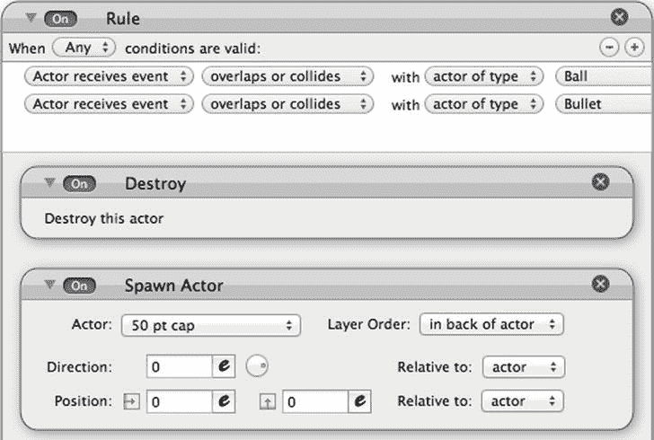
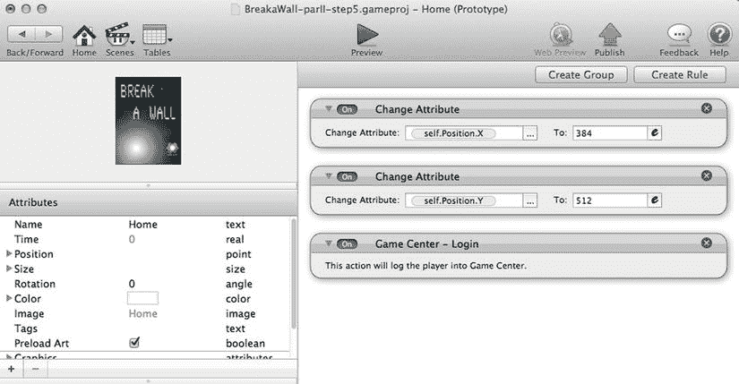
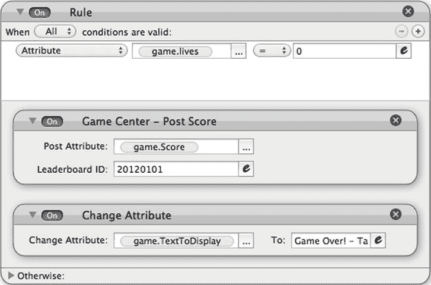

# 九、奖金，游戏中心，和 iAd：越狱

在这一章中，你将完成你在第四章中开始的游戏。我准备了一个名为`BreakaWallPartII.gameproj`的文件，其中包括背景图片和演员图片。这些改进将不在本章讨论。关于如何实现图形和声音，请参考前面的章节。

在这一章中，我想在你把你的游戏提交到 App Store 之前，集中讨论几个元素的最终确定。您将学习如何:

> *   Create the start screen.
> *   Implement a scoring system.
> *   Increase the interactivity of the game with in-game rewards.
> *   Publish the score on the game Centerleaderboard.
> *   Make money with iAd.

你可以免费下载我版本的《越狱》,在本章和第四章中用来说明游戏构建的概念

`[`itunes.apple.com/us/app/break-a-wall/id496154190?ls=1&mt=8`](http://itunes.apple.com/us/app/break-a-wall/id496154190?ls=1&mt=8)`

玩得开心，争取排行榜第一！

### 设计开始屏幕

每个游戏都有一个开始屏幕，也称为菜单页面。我说的不是启动游戏时第一屏可能出现也可能不出现的闪屏。闪屏不会提供与玩家的交互性；这只是推广你品牌的一种方式。

开始屏幕是玩家体验中非常重要的一步，因为它将引导他/她做出不同的选择。当然，最明显的选择是玩这个游戏，但是你也可以提供一些说明。

关于说明的说明:

苹果喜欢直观的应用。然而，有些游戏需要一定程度的指导才能玩游戏或理解规则。

以下是我在游戏中系统应用的指导原则:

1)如果你的游戏非常简单，使用起来非常直观，就不要添加说明。保持简单明了。

2)如果你的游戏简单直观，但你想给出非直观的附加说明，创建一个场景来包含说明，并使其可从菜单访问。

3)如果你的游戏需要一些学习，使用第一级或创建一个互动的场景让玩家学习游戏。当新的情况出现时，你也可以在游戏中加入指令。

要在 GameSalad 中设计一个开始屏幕，您将创建一个特定的场景。该场景将是顺序中的第一个场景(从左到右)。

在 GameSalad 中打开文件`BreakaWall-partII-step1.gameproj`。

创建一个新场景，并将其命名为“家”将场景拖放到第一个位置(最左侧)，如图图 9-1 所示。

**图 9-1。** *首页场景*

将 Homescene 放在这个位置可以确保它是你开始游戏时的第一个场景。

关于闪屏的注意事项:

正如您将在第十一章中看到的，您可以在发布过程中创建一个定制的闪屏，但这仅限于静态图像。默认情况下，这将是一个 GameSalad 闪屏。一个技巧是用黑色图像替换启动画面，并在第一个场景中设置一个动画，作为动画启动画面。

#### 创造演员

在本节中，您将创建几个额外的演员在您的主屏幕上使用。背景演员将用于包含背景图像。您还将创建几个按钮来为播放器添加控件。

##### 主页

创建一个新的 actor 并双击它以打开 Actor 编辑器。用表 9-1 中的参数编辑演员属性。

单击 Images 选项卡显示图像资源，并将`Home.png`拖放到 actor 中。

##### 开始游戏

创建一个新的 actor，双击它打开 Actor 编辑器。用表 9-2 中的参数编辑演员属性。

单击 Images 选项卡显示图像资源，并将`play1.png`拖放到 actor 中。

##### 扬声器

创建一个新的 actor，双击它打开 Actor 编辑器。用表 9-3 中的参数编辑演员属性。

单击 Images 选项卡显示图像资源，并将`Speaker.png`拖放到 actor 中。

#### 实现规则和行为

现在是时候定义演员背后的逻辑了。最重要的逻辑将存在于您刚刚创建的控制角色中。开始游戏演员将让你开始玩，扬声器演员将控制音量(开或关)。

##### 首页

为了完美地定位背景对象，您将使用更改位置属性的技巧。

在演员编辑器中打开家庭演员。拖放更改属性行为和更改主页。位置 X 到 384。

拖放更改属性行为和更改主页。位置 Y 到 512。

这两种行为如图 9-2 所示。

**图 9-2。** *用改变属性定位背景*

现在，将演员拖放到场景中，并将其放置在大约中心的位置。

##### 开始游戏

开始游戏演员将被用作一个按钮。您将实现一个翻转效果，以便当按钮被按下时字体的颜色发生变化。但是，因为它是一个图像，您将使用“更改图像”行为，并使用不同的图像来替换活跃的图像。

您将分两步进行。首先，当 actor 被按下时，您将把图像更改为具有不同字体颜色的图像。然后，当释放 actor touch 时，您将把图像改回原始图像。这只是创造按钮效果的众多方法之一。另一种方法是将 alpha 更改为 0.5，或者将 RGB 颜色更改为 0.5。

在演员编辑器中打开开始游戏演员。创建一个新规则，并将其命名为“触摸被按下”条件是“演员接收事件”“触摸”是“按下的”

然后将“更改图像”行为拖放到规则中，并从“将图像设置为”旁边的下拉列表中选择“播放 2”

让我们进入翻车的第二阶段。

创建一个新规则，并将其命名为“触摸已释放”条件是“演员接收事件”“触摸”是“释放”这也可以在“触摸被按下”规则的“否则”部分中完成。

然后将更改图像行为拖放到规则中，并从“将图像设置为”旁边的下拉列表中选择“播放 1”

这两条新规则如图 9-3 所示。

**图 9-3。** *按下触摸并释放触摸*

你已经有了视觉效果，但是开始游戏角色的目的是让你开始游戏。

为了达到这个目标，您将在规则“触摸被释放”中添加一些行为为了有一个平稳的过渡，我经常在实现变化场景之前使用一个短定时器。这将通过给玩家时间来查看按钮状态的变化来改善用户体验。

将计时器行为拖放到“释放触摸”规则中的“更改图像”行为下方。将计时器设置为“0.5”秒后。然后根据图 9-4 在定时器中拖放一个变化场景行为并将其设置为 1 级。

**图 9-4。** *更新触摸被释放规则*

将开始游戏角色定位在场景中。

##### 演讲者

您将使用扬声器演员来控制声音和音乐。在本例中，您将只关注声音，但您可以对音乐使用相同的方法。

触摸扬声器会将游戏属性的状态更改为 0 或 1。您可以使用规则和布尔运算，但是我将向您展示一个很酷的模运算符技巧。

维基百科将模运算定义为返回“一个数除以另一个数的余数”的函数。

换句话说，如果你用 9 除以 4，你会得到 9 = 2 × 4 + 1。9 除以 4 的余数是 1。我们再举一个例子。如果你把 50 除以 14，你得到 50 = 3 × 14 + 8。50 除以 14 的余数是 8。

用模记法(%)，你有 9 mod 4 = 1 或 9%4=1。

现在，如果你取任意一个数(整数)并对这个数取模 2，你只有两个可能的结果:0 和 1。如果该数是偶数，则该数除以 2 的余数为 null (0)。如果这个数是奇数，这个数除以 2 的余数是 1。

所以用一个简单的幺正增量和模 2 的等式，你会得到一个从 0 到 1 和从 1 到 0 的结果。等式是 soundOn = (soundOn+1)%2。

默认情况下，您希望打开声音。所以初始值是 soundOn=1。当您按下扬声器 actor 时，您会得到 SoundOn = (1+1)%2 = (2)%2 = 0。下一次按扬声器 actor 时，您会得到 SoundOn = (0+1)%2 = (1)%2 = 1。诸如此类…

当你想有声音时，SoundOn 等于 1，当你不想有声音时，SoundOn 等于 0。所有关于声音的规则都基于 SoundOn 属性的状态。

为了便于管理，您将控制音量，而不是为每个 PlaySound 行为创建一个规则。当 SoundOn 等于 1 时，音量等于 1。分别地，当 SoundOn 等于 0 时，volume 等于 0。

您还将在声音关闭时实现带有交叉扬声器图标的翻转。

让我们现在就开始吧！

创建一个整数类型的新游戏属性，并将其命名为“SoundOn”根据图 9-5 ，赋予该属性默认值 1。

**图 9-5。** *声音属性*

在执行元编辑器中打开扬声器执行元。创建一个新规则，并将其命名为“触摸被按下”条件是“动作接收事件”“触摸”被“按下”接下来，拖拽一个改变属性行为，改变游戏。游戏开始。根据图 9-6 ，SoundOn+1)%2。

**图 9-6。** *触摸被按下规则*

现在，创建一个新规则，并将其命名为“SoundOn 等于 1”条件将是“游戏属性”。SoundOn""=""1 "。接下来，拖放一个更改图像行为，并将图像设置为扬声器。最后，拖放更改属性行为和更改设备。根据图 9-7 ，音频音量为 1。

**图 9-7。** *SoundOn 等于 1 的规则。*

最后，创建一个新规则，并将其命名为“SoundOn 等于 0”条件是“属性”“游戏。SoundOn""=""0 "。接下来，拖放一个更改图像行为，并将图像设置为扬声器关闭。最后，拖放一个改变属性行为和改变设备。根据图 9-8 将音频音量调至 0。

**图 9-8。** *SoundOn 等于 0 规则*

将演讲者演员放置在左下角的场景中。

你现在可以在 GameSalad 的预览窗口中测试你的作品。

### 添加记分

在这一章的后面，我会谈到游戏中心。但是首先你需要有一个评分系统。你会让它变得非常简单。每破坏一个青砖，分数就会加一分。而且每摧毁一个红砖，你就会在分数上加两分。要从这一点跟踪项目，请打开名为`BreakaWall-partII-step2.gameproj`的文件。

Integer 类型的游戏属性将被用于保持分数。您将确保每次开始游戏时手动重置。每击中一块砖，分数就会增加。最后但同样重要的是，您将在屏幕的右上角区域显示分数，这样玩家可以跟上他/她的进度。

首先，让我们创建分数属性。创建一个 Integer 类型的新游戏属性，并将其命名为“Score”保持默认值为零。

打开开始游戏演员进入演员编辑器。将更改属性行为拖放到规则“触摸被释放”和更改游戏中。根据图 9-9 得分为 0。

**图 9-9。** *更新触摸被释放规则*

在 actor 编辑器中打开 Brick1 actor。将更改属性拖放到现有规则中，然后更改游戏。游戏得分。根据图 9-10 ，得分+1。

**图 9-10。**更新了 Brick1 规则

对砖块 2 重复相同的操作，但为每个砖块 2 添加两个点。在 actor 编辑器中打开 Brick2 actor。将更改属性拖放到现有规则中，然后更改游戏。游戏得分。根据图 9-11 ，得分+2。

**图 9-11。**更新了 Brick2 规则

你可以跟上比分，但是把比分显示给玩家不是很好吗？！

#### ScoreDisplay 演员

创建一个新的 actor，双击它打开 Actor 编辑器。用表 9-4 中的参数编辑演员属性。

#### 分数显示规则和行为

将显示文本行为拖放到 ScoreDisplay 执行元中。按如下方式更改设置(如图 9-12 所示):

> *   Text: "Score:" .. Game. mark
> *   Font: cross toe
> *   Color: purple

**图 9-12。** *显示 ScoreDisplay 演员的文本*

在场景编辑器中打开 1 级场景，按照图 9-13 将场景中的 ScoreDisplay 演员放置在中间顶部。

**图 9-13。** *一级场景*

### 创建额外奖励演员

为了让游戏更有趣，你将在一些砖块中加入以下奖励:

> *   50 points bonus
> *   100 bonus points
> *   Automatic bullet bonus

点数奖励将由隐藏它们的砖块产生，如果球拍碰到它们，点数奖励将计入得分。同样的原理也适用于自动子弹，但它不是增加点数，而是让球拍自动触发子弹。这些子弹会摧毁砖块。只要布尔游戏属性 AutoBullet 设置为 true，子弹就会自动射出。默认情况下，它被设置为 false。捕捉胶囊将把它设置为真。丢球会把它设置回 false。

要从这一点跟踪项目，请打开名为`BreakaWall-partII-step3.gameproj`的文件。

#### 50 点封顶的演员

创建一个新的 actor，双击它打开 Actor 编辑器。用表 9-5 中的参数编辑演员属性。

单击 Images 选项卡显示图像资源，并将`50 pt.png`拖放到 actor 中。

##### 100 磅帽演员

创建一个新的 actor，双击它打开 Actor 编辑器。用表 9-6 中的参数编辑演员属性。

单击 Images 选项卡显示图像资源，并将`100 pt.png`拖放到 actor 中。

##### 自动子弹演员

创建一个新的 actor，双击它打开 Actor 编辑器。用表 9-7 中的参数编辑演员属性。

单击 Images 选项卡显示图像资源，并将`Bullet.png`拖放到 actor 中。

##### 子弹演员

创建一个新的 actor，双击它打开 Actor 编辑器。用表 9-8 中的参数编辑演员属性。

单击 Images 选项卡显示图像资源，并将`Bullet-img.png`拖放到 actor 中。

你新创建的演员应该类似于图 9-14 。

**图 9-14。** *演员督察*

### 实现额外奖励规则和行为

基本上，你希望包含额外奖励的砖块产生一个额外奖励的演员。额外奖励演员将向下移动，当它与球拍重叠时，它将启用奖励。

##### 50 磅扬程

在 actor 编辑器中打开 50 pt cap actor。将“更改速度”行为拖放到演员中，并将设置更改为:

> *   Direction: 270
> *   Relative: Scene
> *   Speed: 150

创建一个新规则，并将条件设置为“参与者接收事件”“与“参与者类型”“球拍”重叠或冲突”拖放一个改变属性行为和改变游戏。游戏得分。得分+50。拖放一个销毁行为。根据要执行的操作数量，如果将销毁行为放在它们之前，可能会出现问题。根据经验，我建议您将销毁行为放在最后。演员动作窗格应按照图 9-15 所示。

**图 9-15。** *50 pt cap action pane*

##### 100 pt 头

在 actor 编辑器中打开 100 pt cap actor。将“更改速度”行为拖放到演员中，并将设置更改为:

> *   Direction: 270
> *   Relative: Scene
> *   Speed: 150

创建一个新规则，并将条件设置为“参与者接收事件”“与“参与者类型”“球拍”重叠或冲突”拖拽一个改变属性的行为，改变游戏。得分。分数+100。拖放破坏行为。演员动作窗格应按照图 9-16 所示。

**图 9-16。** *100 pt cap action pane*

##### 自动子弹

创建一个 Boolean 类型的游戏属性，将其命名为“AutoBullet”，并将默认值设置为 false。

在演员编辑器中打开自动项目符号演员。

将“更改速度”行为拖放到演员中，并将设置更改为:

> *   Direction: 270
> *   Relative: Scene
> *   Speed: 150

创建新规则，并将条件设置为“参与者接收事件”“与“参与者类型”“球拍”重叠或冲突”拖放一个改变属性行为和改变游戏。AutoBullet 到 1。拖放破坏行为。演员动作窗格应该与图 9-17 中的相匹配。

**图 9-17。** *【自控动作面包】*

##### 子弹

在执行元编辑器中打开项目符号执行元。将“更改速度”行为拖放到演员中，并将设置更改为:

> *   Direction: 90
> *   Relative: Scene
> *   Speed: 300

创建一个新规则，并将“执行元接收事件”“与类型为“Brick1”的执行元“重叠或冲突”以及“执行元接收事件”“与类型为“Brick2”的执行元“重叠或冲突”的条件设置为“任何”拖放破坏行为。演员动作窗格应该与图 9-18 中的匹配。

**图 9-18。** *项目符号操作窗格*

您现在需要编辑以下参与者:

> *   砖块 1
> *   砖块 2
> *   racket

##### 砖块 1

在 actor 编辑器中打开 Brick1 actor，并添加一个设置为“Any”的条件根据图 9-19 ，新规则是“执行元接收事件”与“项目符号类型的执行元”发生“重叠或冲突”。

**图 9-19。** *修改 Brick1 规则*

##### 砖块 2

重复修改。在 actor 编辑器中打开 Brick2 actor，并添加一个设置为“Any”的条件根据图 9-20 ，新规则是“执行元接收事件”与“项目符号类型的执行元”发生“重叠或冲突”。

**图 9-20。** *修改 Brick2 规则*

##### 球拍

在 actor 编辑器中打开球拍 Actor，创建一个新规则。条件是“属性”“游戏。AutoBullet”是“真的”拖放设置为“每”“1”秒的计时器行为。然后，拖放“繁殖演员”行为，并将设置修改为:

> *   Actor: Bullets.
> *   Layer order: in actors
> 
> *   Direction: 0
> *   Location: 0&0
> *   Relative to: actor

拖放播放声音行为，并将设置更改为:

> *   Voice: Bullets fire.
> *   Run: checked.
> *   Volume: 1
> *   Pitch: 1

新规则如图 9-21 所示。

**图 9-21。** *球拍新规*

现在，您将在现场随机放置奖金。在场景编辑器中打开级别 1 场景。双击场景中的任意砖块。这将打开 actor 原型的实例。单击锁状图标编辑执行元的实例。修改实例只会修改场景中的这个实例，而不会修改所有演员。将 Spawn Actor 行为添加到实例的规则中，并将设置更改为:

> *   演员：50 pt 头
> *   Layer order: in actors
> *   Back: 0
> *   Location: 0&0
> *   Relative to: actor

更新后的规则如图 9-22 所示。

**图 9-22。** *更新了砖块规则*

用不同的砖块重复几次，演员如下:

> *   50pt 头*   100pt 头*   自动子弹

随机砖块上的 100 点上限和自动子弹实现如图图 9-23 和图 9-24 所示。

**图 9-23。** *100 点封顶实现*

**图 9-24。** *自动子弹实现*

### 在游戏中心排行榜上公布分数

从这一点开始，打开名为`BreakaWall-partII-step4.gameproj`的文件。

游戏中心是苹果的社交游戏平台。它让玩家通过展示最佳结果、成就和游戏推荐来分享他们的游戏体验。游戏中心的功能只有专业会员才能使用。苹果在`[www.apple.com/game-center/](http://www.apple.com/game-center/)`提供更多信息。

基本上，一旦你验证了你自己，你就可以在叫做排行榜的区域发布你的分数，并在叫做成就的区域追踪特定的游戏成就。游戏中心还有更多的功能，但这两个是最重要的。

在我写这一章的时候，GameSalad 只实现了认证和排行榜功能。成就部分位于 2012 年上半年的路线图中。

让我们更深入地了解身份认证和排行榜。身份验证功能将使您的用户能够使用他们的别名登录 Game Center。玩家使用他们的别名来验证他们的身份，管理朋友列表，并发布状态消息。玩家通过认证后，可以向游戏中心发布分数。排行榜上公布的分数会对所有选手进行排名，目的是培养竞争意识。

在设置您的 GameSalad 项目之前，您需要在 Apple provisioning portal 中创建一个排行榜。你将决定成就的单位:时间、金钱或分数。每场比赛可以有几个排行榜。你可以为每种类型的游戏设置排行榜(与手表对战的时间，玩街机模式的点数，等等。).

让我们在《越狱》中实现游戏中心的功能。

GameSalad 提供了三种与 Game Center 相关的行为:

> *   log in
> *   Publish score
> *   Show leaderboard

为了正确配置 Game Center 行为，您需要一个排行榜 ID。这将是张贴和显示分数所必需的。排行榜 ID 的创建将在第十一章的中介绍。您将获得一个唯一的字母数字 ID，将在以下步骤中使用。

#### 登录游戏中心

打开`BreakaWall-partII-step4.gameproj`。打开家庭场景。在演员编辑器中选择家庭演员。

按照图 9-25 从专业选项卡中拖放一个“游戏中心-登录”行为。

**图 9-25。** *游戏中心行为*

家庭演员如图图 9-26 所示。

**图 9-26。** *首页演员动作窗格*

#### 发布分数

在一场比赛中，会有两个关键时刻公布您的分数:

> *   When you are loose
> 
> *   When you win

##### 输了之后公布比分

在演员编辑器中打开球演员。转到条件为“Attribute game.lives = 0”的规则。将“游戏中心–公布分数”行为拖放到规则中。要发布的属性是“game.Score”。输入您的排行榜 ID。你的屏幕应该看起来类似于图 9-27 (当然，有不同的排行榜 ID)。

**图 9-27。** *游戏输了公布比分*

##### 当你赢的时候公布分数

公布比分的最佳时刻是比赛获胜的时候。最终演员会准确地告诉你这是什么时候发生的。这个演员是重置游戏的控制。你需要在重置游戏前公布分数。

在演员编辑器中打开结束演员。将“游戏中心–公布分数”行为拖放到规则中。要发布的属性是“game.Score”。输入排行榜 ID。屏幕应类似于图 9-28 中的。

**图 9-28。** *赢得游戏后公布分数*

#### 显示分数

在主页上，添加一个按钮来显示全球所有玩家的最高分数排行榜。

创建一个新的 actor，双击它打开 Actor 编辑器。用表 9-9 中的参数编辑演员属性。

单击 Images 选项卡显示图像资源，并将`Leaderboard.png`拖放到 actor 中。

在演员编辑器中打开演员。创建一个新规则，条件为“执行元接收事件”“触摸”为“按下”然后拖放“Game Center–Show leader board”行为，并输入排行榜 ID 和分数的时间段(今天、本周或所有时间)。屏幕应类似于图 9-29 中的。

**图 9-29。** *显示排行榜*

将排行榜演员放在家庭场景中戏剧演员的正下方。

### iAd

iAd 是苹果广告平台。它带有开发免费增值模式的意图。什么是免费增值模式？基本上，你可以开发一个对用户免费的应用/游戏，但在游戏空间内显示广告，以从广告或 iAP(应用内购买)中获得收入。

iAd 为您提供了一个完整的框架，可以在您的应用中显示横幅广告或全屏广告；这些直接来自苹果。因此你不需要为销售广告空间而烦恼。你只需要为广告空间设计一个区域，然后 iAd 框架将从那里管理它。

要在 GameSalad 项目中使用 iAd，您必须加入 iAd 网络。在 iTunesConnect 中，第一步是设置您与 Apple 的合同。

iAd 是 iOS 4 推出的。这意味着所有 iOS 4 之前的版本都将无法兼容 iAd。iAd 功能仅对专业会员开放。

从这一点开始，打开名为`BreakaWall-partII-step5.gameproj`的文件。

配置 iAd 极其简单。您需要为您的应用激活 iAd，如第十一章中的所述。一旦 iAd 被激活，您需要实现 iAd 行为。

你需要考虑广告的显示区域，这样它才不会干扰你的游戏用户界面。在 iPhone 上，纵向广告是 320 × 50 像素，横向广告是 480 × 32 像素。在 iPad 上，人像广告是 768 × 66 像素，风景广告是 1024 × 66 像素。

在演员编辑器中打开家庭演员。将一个 Show iAd 行为拖放到参与者中。根据图 9-30 选择“底部”作为横幅位置。

**图 9-30。** *展示 iAd 行为*

就这样！iAd 的一切都准备好了。真正的广告只有在应用发布后才会显示。

您可以通过打开名为`BreakaWall-partII-step6.gameproj`的文件来检查项目。

关于 iAd 的注意事项:

iAd 不是摇钱树。收入水平很低。在撰写本文时,《越狱》已被下载了约 1，400 次。到目前为止，iAd 收入低于 2 美元(见图 9-31 )。

**图 9-31。** *iAd 收入破墙*

### 总结

在这一章中，你已经学习了许多新元素。你的游戏现在有一个开始屏幕，可以张贴分数到游戏中心。此外，你已经开始用 iAd 赚钱了。这将大大增加游戏体验，并使您能够从游戏中获得收入。

在本章中，您学习了如何:

> *   Design a start screen.
> *   Increase the depth of the game with extra bonus.
> *   Achieve score distribution in the game center.
> *   Enable iAd for your game.