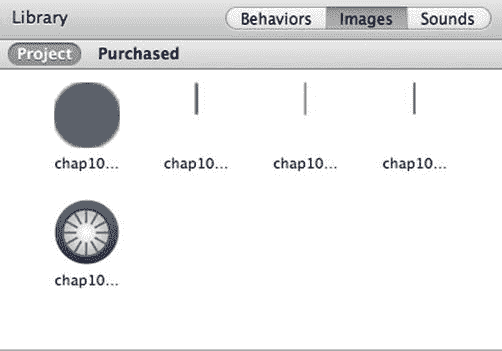
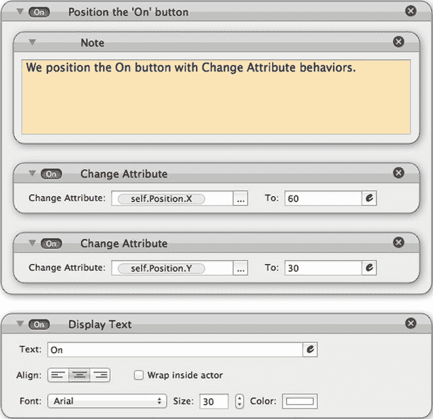
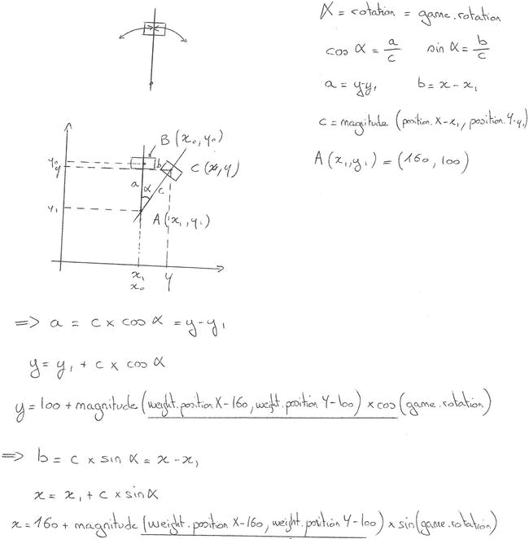

# 十、设备内部时钟和循环运动：非游戏应用

虽然 GameSalad 的主要目的是创建游戏，但是你可以用它来创建其他应用，只要你的应用只需要 GameSalad 中可用的框架。

为了说明这一点，您将参与两个项目。首先，你将创建一个显示 iOS 设备时间的模拟时钟，然后你将创建一个节拍器，如图 10-1 所示。

通过使用你所有的游戏知识，你可以创建一些非常有趣的应用。你将主要使用你以前见过的行为和概念，但是我将介绍一些也可以在游戏中使用的新概念。

**图 10-1。** *模拟时钟和节拍器*

这一章的目的是说明通过跳出框框思考，你可以扩展 GameSalad 的可能性。

在本章中，您将学习如何:

> *   Making an app with standard GameSalad features is not a game.
> *   And access that internal clock of the device.
> *   Use basic mathematics to create circular motion.

### 用设备时钟和旋转创建模拟时钟

在本项目中，您将构建一个模拟时钟，以小时、分钟和秒显示时间。这将是一个相对较短和容易的项目。你不应该花超过 30 分钟来实现。

你将学习基于设备内部时钟实现行为。您还将学习如何通过旋转和角度计算来模拟时钟指针的运动。

#### 访问设备时钟

为了显示当前时间，您将使用设备属性中的时钟，这是一组很好的属性。根据图 10-2 ，时钟可让您访问设备时间，从年到毫秒。

**图 10-2。** *时钟设置属性*

虽然这个例子只创建了一个时钟，但是您将涉及到一些时钟属性的操作，您可以使用这些属性来扩展您的想法，并将这些属性集成到游戏的新功能中。例如，你可以在菜单页面上创建一个特殊的图标，只在 7 月 4 日庆祝独立日时显示。

#### 创建时钟项目

打开 GameSalad Creator 并创建一个新项目。根据表 10-1 配置项目信息。

将文件命名并保存为`YAC.gameproj`。

#### 制作背景和时钟指针

要设计时钟，您需要创建以下角色:

> *   Clock: This is the frame of the clock.
> *   Hour: This is the hour arrow.
> *   Minute: This is the minute arrow.
> *   Seconds: This is the second arrow.
> *   Button: This is a graphic technique to hide the source of the arrow.

在创建演员之前，导入将用于这些演员的图像。打开场景编辑器并选择图像选项卡。点击+号，导入以下文件:`chap10-button.png`、`chap10-clock.png`、`chap10-hours.png`、`chap10-minutes.png`、`chap10-seconds.png`。这些图片文件位于第十章文件夹中。您的图像选项卡应该与图 10-3 匹配。

**图 10-3。** *图片*

作为奖励，如果你想定制你的时钟，我还为每张图片提供了 Illustrator 文件。

仔细看看箭头。你注意到什么奇怪的事情了吗？图像大小是可见箭头的两倍。这不是一个错误。这是个骗局！稍后我会解释。

##### 时钟

创建一个新的 actor，双击它打开 Actor 编辑器。用表 10-2 中的参数编辑演员属性。

单击 Images 选项卡显示您刚刚导入的图像，并将`Chap10-clock.png`拖放到 actor 中。

##### 秒

创建一个新的 actor，双击它打开 Actor 编辑器。用表 10-3 中的参数编辑演员属性。

单击 Images 选项卡显示您刚刚导入的图像，并将`Chap10-seconds.png`拖放到 actor 中。

##### 分钟

创建一个新的 actor，双击它打开 Actor 编辑器。用表 10-4 中的参数编辑演员属性。

单击 Images 选项卡显示您刚刚导入的图像，并将`Chap10-minutes.png`拖放到 actor 中。

##### 小时

创建一个新的 actor 并双击它以打开 Actor 编辑器。用表 10-5 中的参数编辑演员属性。

单击 Images 选项卡显示您刚刚导入的图像，并将`Chap10-hours.png`拖放到 actor 中。

##### 纽扣

创建一个新的 actor，双击它打开 Actor 编辑器。用表 10-6 中的参数编辑演员属性。

单击 Images 选项卡显示您刚刚导入的图像，并将`Chap10-button.png`拖放到 actor 中。

#### 创建时钟机制:规则和行为

创造一个真实世界的机械钟可能是一件艺术品。它很小，机芯需要完美，所以可能需要几个月的时间。幸运的是，虚拟模拟时钟要简单得多。时间信息直接从器件内部时钟获取。你的演员的行为将最大限度地确保手正确移动。

##### 时钟

为了在屏幕上完美地定位时钟，您将通过更改属性行为来定位它。

在演员编辑器中打开时钟演员。将一个更改属性行为拖放到 actor 中，并将 clock.position.X 更改为 160。将第二个更改属性行为拖放到 actor 中，并将 Clock.position.Y 更改为 240。时钟动作视图应与图 10-4 中的相匹配。

**图 10-4。** *时钟动作视图*

为了提高效率并节省一些宝贵的时间，您将创建一个自定义行为，将演员放置在屏幕的中心。

创建一个新组，命名为“定位在中心。”将您刚刚创建的两个变更属性移动到新组中。

在“行为清单”窗格中，通过单击选择“自定义”(位于“标准”旁边)。按照图 10-5 将您的组拖放到窗格中。就这样！您刚刚创建了您的第一个自定义行为。您将对这个项目中的每个演员使用这些行为，以将他们完美地定位在屏幕的中心。

**图 10-5。** *自定义行为盘点*

##### 按钮

双击按钮 actor，在 Actor 编辑器中打开它。从自定义行为清单中拖放“居中定位”行为。

##### 秒

双击 Seconds actor 在 actor 编辑器中打开它。从自定义行为清单中拖放“居中定位”行为。

回到与可见箭头相比图像的奇怪尺寸，技巧是实现演员每秒的旋转。但是旋转属性从其中心旋转演员。因此，让一个演员将箭头的尺寸放大一倍提供了一种错觉，即只有箭头在移动，而实际上这是一个完整的演员。

拖放约束属性行为，并将秒.旋转更改为设备。时钟。秒*6。

为什么会有负号？第二章讨论了 GameSalad 测量角度的方式:逆时针。所以为了有一个顺时针的运动，你需要让秒为负。

同样，第二个箭头将覆盖 60 秒内的完整旋转。完整的旋转是 360 度。所以箭头应该覆盖每秒 6 度(360/6)。

秒动作视图应与图 10-6 中的相匹配。

**图 10-6。** *秒动作查看*

##### 分钟

双击分钟执行元，在执行元编辑器中打开它。从自定义行为清单中拖放“居中定位”行为。拖放约束属性行为并更改设备的分钟数。时钟。分钟*6。

##### 小时

双击小时执行元，在执行元编辑器中打开它。从自定义行为清单中拖放“居中定位”行为。

拖放约束属性行为并更改设备的小时数。时钟。小时* 6–30 *设备。Clock.Minutes/60.

为了显示两个小时之间的运动，您在小时的情况下增加了一些额外的度数。如果箭头一下子移动 30 度，视觉效果就不好看了。你知道时针会在 60 分钟内转 30 度。因此，它将每分钟移动 0.5 度。

小时演员的动作视图应与图 10-7 中的相匹配。

**图 10-7。**小时约束属性

#### 组装时钟:布置场景

场景的布局非常简单，因为你已经使用行为定位了你的演员。但是你放置演员的顺序对视觉效果很重要。

根据图 10-8 按以下顺序将演员安置在场景中央:

> *   clock
> *   hour
> *   minute
> *   second
> *   button

**图 10-8。** *时钟场景*

在 iPhone 上或预览窗口中预览项目。

### 循环运动:节拍器

节拍器是一种发出有规律的节拍的装置(图 10-9 )。您可以按秒设置节拍数。它用于帮助音乐家跟随一致的节奏。

**图 10-9。** *一个机械节拍器*

在本节中，您将学习如何实现循环运动。这个概念很容易在游戏项目中重复使用。

为了让您更好地了解结果，请打开文件`metronome_final.gameproj`并单击预览。

#### 创建节拍器项目

打开 GameSalad Creator 并创建一个新项目。根据表 10-7 配置项目信息。

将文件命名并保存为`Metronome.gameproj`。

#### 节拍器机械组件:创建演员

为了设计你的节拍器，你需要创建以下角色:

> *   metronome
> *   weight
> *   sway
> *   open
> *   close

在创建演员之前，导入这些演员的图像。打开场景编辑器并选择图像选项卡。点击+号，导入以下文件:`chap10-metronome.png`、`chap10-pendulum.png`、`chap10-weight.png`。这些图片文件位于第十章文件夹中。你的图像标签应该匹配图 10-10 。

**图 10-10。** *图片*

作为奖励，如果你想定制你的节拍器，我还为每张图片提供了 Illustrator 文件。

##### 节拍器

创建一个新的 actor 并双击它以打开 Actor 编辑器。用表 10-8 中的参数编辑演员属性。

你可能已经注意到演员的尺寸很奇怪。这肯定不是针对内存优化的；如果你在寻找性能，你应该总是优化演员大小为 4 的倍数。

单击 Images 选项卡显示您刚刚导入的图像，并将`Chap10-metronome.png`拖放到 actor 中。

##### 体重

创建一个新的 actor，双击它打开 Actor 编辑器。用表 10-9 中的参数编辑演员属性。

单击 Images 选项卡显示您刚刚导入的图像，并将`Chap10-weight.png`拖放到 actor 中。

根据表 10-10 为权重创建两个演员属性。

##### 钟摆

创建一个新的 actor，双击它打开 Actor 编辑器。用表 10-11 中的参数编辑演员属性。

单击 Images 选项卡显示您刚刚导入的图像，并将`Chap10-pendulum.png`拖放到 actor 中。

##### 开

创建一个新的 actor，双击它打开 Actor 编辑器。用表 10-12 中的参数编辑演员属性。

##### 离开

创建一个新的 actor，双击它打开 Actor 编辑器。用表 10-13 中的参数编辑演员属性。

#### 存储信息:定义属性

根据表 10-14 创建游戏属性。

#### 创造机械运动:规则和行为

节拍器的基本运动是来回移动，因此具有循环运动。循环的速度取决于重物的位置。您将使用规则和行为来实现这个逻辑。

##### 节拍器规则和行为

创建一个群组，将其命名为“定位节拍器”拖放一个改变属性行为和改变节拍器。位置 X 到 160 度。拖放第二个更改属性行为和更改节拍器。位置 Y 到 240。

##### 论规则与行为

创建一个组，命名为“定位按钮”拖放更改属性行为并打开。位置 X 到 60。拖放第二个更改属性行为并打开。位置 Y 到 30。

拖放“显示文本”行为，并在里面键入文本“开”。您可以将所有其他设置保留为默认值。动作视图应与图 10-11 中的相匹配。

**图 10-11。**上的*行动查看*

最后，创建一个新规则，并将其命名为“On is pressed”条件是“演员接收事件”“触摸”是“按下的”然后拖拽一个改变属性行为，改变游戏。按照图 10-12 移动到 1。

**图 10-12。**上的*是被压制的统治*

此规则用于检测 On 区域中的触摸，然后将 InMovement 属性更改为 true。您将使用该属性来授权钟摆的运动。

##### 违反规则和行为

创建一个群组，并将其命名为“定位关闭按钮”拖放更改属性行为并打开。位置 X 到 260。拖放第二个更改属性行为和 changeon。位置 Y 到 30。

拖放“显示文本”行为，并在里面键入文本“关”。您可以将所有其他设置保留为默认值。动作视图应与图 10-13 相匹配。

**图 10-13。** *起飞行动查看*

最后，通过在按住 Option 键的同时向下拖动规则来复制 On 规则。将其命名为“关闭已按下”条件是“演员接收事件”“触摸”是“按下的”然后拖拽一个改变属性行为，改变游戏。按照图 10-14 移动到 0。

**图 10-14。** *关了就按下了规则*

该规则用于检测关闭区域中的触摸，然后将 InMovement 属性更改为 false。您将使用该属性来停止钟摆的运动。

##### 钟摆规则和行为

创建一个组，命名为“摆好钟摆”拖放更改属性行为并打开。位置 X 到 160 度。拖放第二个更改属性行为并打开。根据图 10-15 将 Y 定位到 100。

**图 10-15。** *定位摆*

打开声音清单视图(单击“图像”选项卡旁边的“声音”选项卡)。单击+号导入新声音。从 Chap4_files 文件夹中选择名为`sound4.mp3`的文件。将文件作为声音导入。

现在，您将创建运动。为此，你需要知道钟摆在两个方向上的最大旋转。设置总共 20 度的旋转角度:-10 到+10。但是起始角度是 90 度，所以钟摆会从 80 度旋转到 100 度，来回旋转。您将使用“插值”行为使移动独立于速度属性。

创建具有以下条件的新规则:

> *   [Attributes] [Pendulum].
> 
> *   "Attributes" [Game Rotation]. [InMovement] is "true"

然后拖放插值行为并更改设置。

> *   Interpolation property: pendulum. rotate
> *   To: 100
> *   Duration: Game speed
> *   Function: straight line

接下来，拖放播放声音行为，并选择声音 4 作为要播放的声音。将所有其他设置保留为默认值。

规则如图图 10-16 所示。

**图 10-16。** *插值到 100 规则*

创建具有以下条件的新规则:

> *   [Attributes] [Pendulum].
> *   [Attribute] [Game Rotation] = [100]. [InMovement] is "true"

然后拖放插值行为并更改设置。

> *   Interpolation property: pendulum. rotate
> *   To: 80
> *   Duration: Game speed
> *   Function: straight line

接下来，拖放播放声音行为，并选择声音 4 作为要播放的声音。将所有其他设置保留为默认值。

该规则如图 10-17 所示。

**图 10-17。** *插值到 80 法则*

创建一个名为“钟摆运动”的新组，并将刚刚创建的两条规则放入该组。

用条件“属性”创建一个新规则。InMovement”是“假的”将约束属性行为拖放到规则中，然后改变钟摆。旋转到 90 度。该规则将检测到关闭按钮已被按下，并将摆锤设置到初始位置。

用条件“属性”创建一个新规则。“InMovement”是“true”将更改属性行为拖放到规则中，然后更改钟摆。旋转到 100 度。这条规则将使钟摆旋转 100 度。然后插值规则开始。

创建一个新组，并将其命名为“开/关规则”按照图 10-18 将您刚刚创建的两条规则拖放到该组中。

**图 10-18。** *开/关规则*

最后但同样重要的是，在 actor action 视图中拖放一个约束属性行为并更改游戏。旋转到钟摆。按照图 10-19 旋转。

**图 10-19。** *约束旋转属性*

最后一个行为旨在将钟摆在任何时候的旋转值存储到名为 Rotation 的游戏属性中。稍后您将使用该值来同步权重的移动。

##### 体重规则和行为

创建一个新组，并将其命名为“定位重量”将两个更改属性行为拖放到组中，然后更改:

> *   Weight. Position. x to 160
> 
> *   . Position. Y direction 240

创建第二个组，并将其命名为“Init”将两个更改属性行为拖放到组中，然后更改:

> *   Weight. InitX to weight.
> 
> *   Weight. Start with the weight.

在这个阶段，你的动作视图应该与图 10-20 相匹配。

**图 10-20。** *位置和初始组*

创建一个新规则，命名为“设置权重”该规则的条件是:

> *   "属性"【gameInMovement】为"假"
> *   "Actor receives event" and "Touch" means "Press"

这些条件将确保您只能在节拍器关闭时移动重量。

将两个约束属性行为拖放到规则中，然后进行更改:

> *   Weight. Position. x to 160
> 
> *   。位置。y 到 max(120，min(340，game.mouse.position.Y))

最后一个约束将确保在 120 到 340 的范围内，权重位于手指接触屏幕的位置。

将约束属性行为拖放到规则中并进行更改:

> *   Weight. Start with the weight.

这将确保在按下 on 按钮之前，InitX 和 InitY 始终包含重量的最后位置。当您按下“关闭”按钮时，您将使用此信息来计算移动并将重量返回到其位置。

最后但同样重要的是，使用重量的位置来确定节拍器的速度。重量越大，钟摆走得越快。使用公式精度(120/重量。Position.Y)，2)。精确功能将帮助您保持两位数字低于第二位。

将另一个约束属性拖放到规则中，然后更改:

> *   游戏。速度与精度之比(120/重量 2)  位置。Y)】

你的体重设置规则如图图 10-21 所示。

**图 10-21。** *权重设置规则*

接下来，您将创建一个规则，该规则将检测 InMovement 属性何时更改为 false，以便将权重重置到其起始位置。

创建名为“转到起始位置”的新规则这个规则的条件是“属性”“游戏”。InMovement”是“假的”将三种更改属性行为拖放到规则中，然后进行更改:

> *   Weight. Location. X to weight. InitX
> 
> *   Weight. Location. Y to weight. InitY
> 
> *   Weight.

该规则如图 10-22 所示。

**图 10-22。**转到起始位置规则

最后，您需要设置最复杂的规则。你需要让重物和钟摆同时移动，但要跨过一个弧线，同时旋转。这里涉及到一点三角学。我总是建议你用一张纸，画出你的方程式。我的草图在图 10-23 中。

**图 10-23。**??【三角概念】为重量随时的位置

通过使用角度的余弦和正弦值(图 10-23 中的α),可以导出 c 点处 x 和 y 的值。使用幅度函数计算两点之间的距离。

创建一个新规则，并将其命名为“同步运动”条件是“属性”“游戏。“InMovement”是“true”然后将三个约束属性行为拖放到规则中并进行更改:

> *   Weight. Rotate to the game.
> 
> *   Weight. Position. x to 160+ order of magnitude (weight. X-160 position, weight. position . Y-100)* sin(-【game . rotation-90】)
> *   Weight. Location. Yto 100+ order of magnitude (weight. X-160 position, weight. position . Y-100)* cos(game . rotation-90)

你的尺子应该符合图 10-24 。

**图 10-24。** *同步动作规则*

#### 制作节拍器:布置场景

场景的布局非常简单，因为您已经使用行为定位了您的演员。但是你放置演员的顺序对视觉效果很重要。

根据图 10-25 ，按以下顺序将演员置于场景中央:

> *   sway
> *   heavy
> *   metronome
> *   open
> *   close

**图 10-25。**节拍器场景

在 iPhone 上或预览窗口中预览项目。

### 总结

这一章总结了这本书的游戏开发。你已经看到，只需要一点点创意，GameSalad 就可以用来创建游戏以外的应用。

在本章中，您学习了如何:

> *   Create applications other than games in GameSalad.
> *   Use the device internal clock function.
> *   Create circular motion in the game.