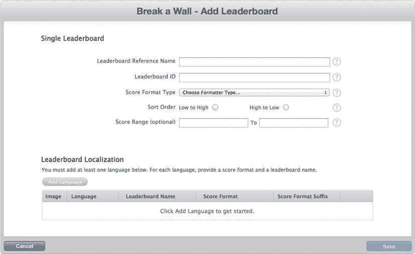
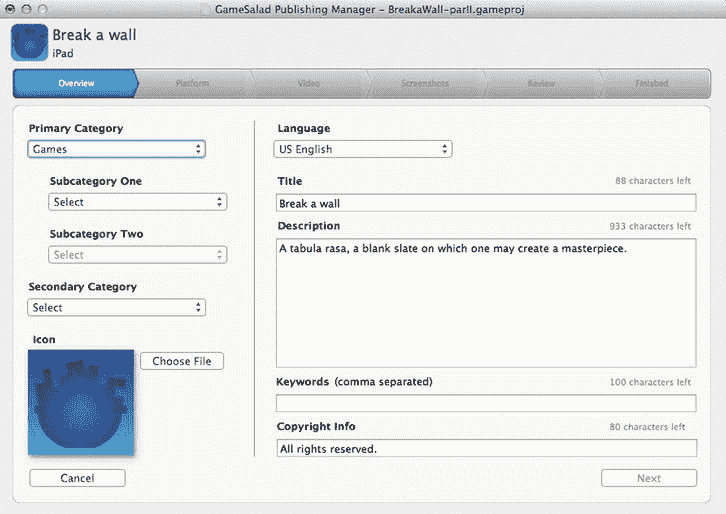

# 十一、将您的游戏提交到 App Store

就是这一刻。是的，重要的时刻。你花了无数的时间在你的游戏上，现在是时候让每个人都看到它了。但是还有更关键的一步。您需要将您的游戏发布到 App Store。

**提醒:**你需要是注册的 iOS 开发者。更多信息请参见第一章。

在本章中，您将经历在 App Store 中发布游戏的所有步骤:

> *   You will create your own application ID.
> *   You will get a distribution certificate and create a distribution preset profile.
> *   You will create the iTunes Connect application profile. You will enable the game center and iAd for your game.
> *   You will generate a binary file and upload it to Apple.
> *   You will make the game available in the App Store.

### 在预配门户上获取 AppID、证书和分发预配描述文件

本节涵盖了配置门户上的所有必要操作。您将创建一个应用 ID，作为您游戏的唯一 ID。您还将使用您的分发证书(在第一章中创建)来签署您的应用。最后，您将创建用于在 GameSalad 中发布游戏的发行版配置文件。

#### 创建您的应用 ID

首先，你需要为你的游戏创建一个 ID。这是 AppID。

转到供应门户(`developer.apple.com`，然后是会员中心 iOS 供应门户)。

点击位于屏幕左侧的应用 ID 选项，然后点击新建应用 ID 按钮，进入创建应用 ID 页面，如图图 11-1 所示。

您需要提供:

> *   Description: This should be a quick way to find your App ID. I suggest using the name of your game.
> *   Bundle Seed ID: Unless you want to select a bundle seed ID, you can leave it as "Use Team ID". When you have several games that will share the same keychain access (to share data such as user name and password), the bundled seed ID will be used.
> *   Bundle ID: Enter the unique global ID of the application. Apple suggests using a reverse domain name, but you may not have a domain name. In this case, use something unique to you that others will not choose.

然后点击提交按钮。

**图 11-1。** *创建应用 ID*

#### 您的经销证书

在第一章的中，“在您的钥匙串中安装开发者证书”一节介绍了创建您的分发证书的步骤。这个文件被命名为`iOS_distribution.cer`。

您可以在“证书”下的“钥匙串实用工具”中验证它是否存在。如果证书不存在，请参考前面提到的第一章的部分。

#### 创建分发预置描述文件

下一步是为你的游戏创建一个 App Store 分发预置描述文件。

单击位于左侧的应用 id 下方的配置链接。选择 Distribution 选项卡并单击 New Profile 按钮，以进入图 11-2 所示的 Create iOS Distribution Provisioning Profile 页面。

提供以下信息:

> *   Distribution method: select App Store.
> *   File Name: Enter your file name. I suggest using the name of the application followed by "AppStore" so that you can know that this is the profile of the store.
> *   App ID: Select the game App ID you created in the previous step.

**图 11-2。** *创建分发配置文件*

单击提交按钮以生成分布配置文件。如果状态仍然是待定，您可能需要在 web 浏览器上点击刷新。应该需要几秒到两分钟。

点击图 11-3 中所示的下载按钮，将发行版概要文件下载到您的计算机上。

**图 11-3。** *您新创建的分布配置文件*

接下来，需要通过双击或打开 Xcode 并将其拖到管理器中来安装配置文件。它会自动从 Xcode 打开管理器工具，如图图 11-4 。

**图 11-4。** *管理器中的配置文件视图*

### 在 iTunes Connect 上创建游戏

在使用新创建的分发描述文件开始发布过程之前，您需要在 iTunes Connect 上创建游戏。这将使你能够激活游戏中心，iAD，或 iApp，如果你在游戏中使用这些功能。

#### 第一步:登录 iTunes Connect

在`itunesconnect.apple.com`连接到 iTunes Connect。点击图 11-5 中所示的管理您的应用链接。

**图 11-5。** *在 iTunes Connect 中管理您的应用*

#### 第二步:创建新应用

点击图 11-6 所示的添加新应用按钮。

**图 11-6。** *添加新 app*

#### 第三步:提供基本信息

接下来，您需要根据图 11-7 提供以下信息:

> *   Default language of your application: This is the default language of your game.
> *   App name: the name of your game.
> *   SKU number: This is a tracking number. It is used to track the unique version of their software internally. I suggest the date in YYYYMMDD format, but you can use any random number.
> *   Bundle ID: Select the application ID you created earlier.

**图 11-7。** *游戏名称*

#### 第四步:发布日期和定价信息

接下来，您需要根据图 11-8 提供目标发布日期和定价信息。

> *   Release date: Remember, if you choose a date before you get approval from the store, your game will be released on the day you get approval.
> *   Level: There are many different pricing strategies. Remember, Apple keeps 30% of every sales.
> *   Educational institution discount: indicates whether you are willing to offer discounts to educational institutions if they buy a lot of your games.
> *   Customize B2B App: See if you have developed a game for a company for your own use.

**图 11-8。** *发布日期和定价信息*

#### 步骤 5:提供版本和类别信息

接下来你需要按照图 11-9 提供游戏的信息。

> 版本号:我推荐使用像 major.minor.maintenance 这样的约定，维护只是为了修正 bug，minor 是为了次要的特性，major 是为了游戏中的重大变化。*   Copyright: Put your copyright information here.*   Primary category: Choose the game or any other suitable category according to your development purpose. Select two subcategories (only if you select the game as the category).*   Category II: This is optional. However, it is recommended to reach more audiences.*   Note for review: If you want to give specific guidance to the reviewer.

**图 11-9。** *版本信息*

#### 第 6 步:定义您的申请评级

下一个屏幕是您的应用的评级。根据图 11-10 ，这些问题是不言自明的。

**图 11-10。** *游戏评分*

#### 步骤 7:提供元数据信息

然后你按照图 11-11 提供游戏的元数据。

> *   Description: Put on the salesman's uniform and play at the pitch you are best at. I suggest you prepare in advance.
> *   Keywords: keywords are very important because they will be searched in the app store. You can use Google keywords to optimize your keyword selection.
> *   E-mail: used to contact you.
> *   Support URL: You need to provide a website for game support (your own website or your blog page). Marketing URL: This is optional, but having one is a good idea.
> *   Privacy policy URL: also optional.

**图 11-11。** *元数据*

#### 第八步:阅读并接受 EULA 协议

现在你需要阅读并接受默认的最终用户许可协议(EULA)或者提供你自己的，如图图 11-12 所示。

**图 11-12。** *最终用户许可协议*

#### 第九步:提供游戏作品

最后，你需要上传你的作品(图 11-13 )。您必须提供:

> *   ITunes 512 × 512 icon art: 72 dpi and I recommend png format.
> *   Up to five screenshots of iPhone or iPad.

**图 11-13。** *上传你的作品*

一旦您提供了上述所有信息，您将被引导至一个摘要页面(图 11-14 )。

**图 11-14。** *新申请汇总*

在这一阶段，您的新应用处于准备上传状态。

您现在可以为您的游戏启用游戏中心和 iAd。

#### 为你的应用启用游戏中心

如果您在游戏中使用 Game Center，您需要启用 Game Center 以获取完成游戏配置所需的信息。在“新建应用摘要”页面中，单击“管理 Game Center”按钮。您将被引导至一个页面，按照图 11-15 中的启用 Game Centre。单击启用按钮。

**图 11-15。** *启用游戏中心*

一旦您点击了“启用”按钮，页面将会根据图 11-16 更新，显示设置排行榜和成就的选项。

**图 11-16。** *排行榜和成绩设置页面*

游戏沙拉只支持排行榜。成就已在路线图上，但在撰写本文时尚未交付。

点按排行榜部分的“设置”按钮。您将按照图 11-17 进入排行榜管理页面。

**图 11-17。** *排行榜管理页面*

点按“添加排行榜”按钮来创建新的排行榜。首先，根据图 11-18 中的，你需要在单排行榜或组合排行榜之间做出选择。

**图 11-18。** *单项或综合排行榜*

选择单排行榜。组合排行榜就是几个单一排行榜的简单组合。

接下来，您需要为您的排行榜提供以下信息(图 11-19 ):

> *   Reference name of leaderboard: This is your leaderboard name (highest score, fastest race, etc. ). Although this is an internal name, it should be clear. This will make your future life easier.
> *   ID: This is a key point, because you need to apply this number to the GameSalad Creator of the game. The ID consists of alphanumeric characters.
> *   Fraction format type: integer, time, etc.
> *   Order: from low to high or from high to low.
> *   Range: Only the scores within the range are displayed. This is optional.
> *   Localization: You need to add at least one language to your leaderboard. According to Figure 11-20 , click the Add Language button to provide the name to be displayed on the leaderboard, the format of the score, the words (singular and plural) after the score and the image (optional).

**图 11-19。** *新排行榜*

**图 11-20。** *排行榜本地化*

#### 启用 iAd

如果您正在使用 iAd，您还需要在 iTunes Connect 中为您的游戏启用它。在你的游戏总览页面(图 11-14 ，你需要点击启用 iAd 网络选项。

根据图 11-21 显示启用 iAd 页面。

**图 11-21。** *启用 iAd*

只需点击启用 iAd 和保存按钮。

您现在已经在 iTunes Connect 中设置好了。下一步是准备要上传的二进制文件。

### 更新 GameSalad 中的游戏中心

在 GameSalad Creator 中打开您的游戏。

根据图 11-22 和 11-23 ，对于您在游戏中使用 GameCenter 的每个动作，您都需要更新帖子得分，并使用您刚刚创建的适当排行榜 ID 显示排行榜行为。

**图 11-22。** *显示排行榜行为*

**图 11-23。** *帖子评分行为*

### 在 GameSalad 内部发布游戏

现在您需要创建二进制文件来上传到 iTunes store。这一步在 GameSalad Creator 中被称为*发布*。在此步骤中，您的游戏将使用适当的证书和预置描述文件进行签名，您可以将它发送到 Apple。

#### 第一步:选择目标平台

打开您要发布的游戏，在 GameSalad Creator 中单击发布按钮。

下面的屏幕会询问你想在哪个平台上发布你的游戏(图 11-24 )。选择合适的平台。

**图 11-24。**选择目标平台

#### 第 2 步:提供概述信息

下一步是根据图 11-25 提供关于你的游戏的概述信息。

**图 11-25。** *信息概述*

您需要提供:

> *   Category: Most of the time, you should choose games, but you have already seen that you may do things other than games in GameSalad.
> *   Sub-category: Select two sub-categories in your main category according to your game type (game category only).
> *   Category 2: Select the second category in which your game will appear.
> *   Icon: Upload game icon (512 × 512)
> *   Language: Choose the language of your game.
> *   Title: This is the name of your game.
> *   Description: Provide a description of your game.
> *   Keywords: Provide a set of keywords for your game, separated by commas.
> *   Copyright information: provide your copyright information here.

当您在 iTunes Connect 中创建游戏时，已经提供了许多此类信息。让它匹配！

#### 步骤 3:选择您的预配配置文件

下一个屏幕要求您选择您的配置文件。您必须选择您为在 App Store 上分发而创建的描述文件。你还会被要求输入游戏的显示名称和版本。

**注意:**GameSalad 中的版本必须与您在 iTunes Connect 中输入的版本相匹配。

注意这个屏幕上的高级选项。它们允许您根据图 11-26 自定义方向以及闪屏(针对专业会员)。

**图 11-26。**高级平台设置

闪屏必须与目标设备的分辨率一样大。您还将有机会选择 armv7 或启用光泽应用图标。

关于 armv7:

Armv7 是处理器指令集标准。它从 iPhone 3GS，iPad 1 st Gen，iPod Touch 3 rd Gen，以及所有后续世代都在使用。如果您选中 armv7，您的游戏将只能在支持 armv7 的设备上运行。

#### 第四步:提供一个宣传 YouTube 视频的链接

这一步是可选的，您可以在 YouTube 上提供一个推广视频的链接。

#### 第五步:上传你的截图

这一步要求你按照图 11-27 上传最多五张游戏截图。

**图 11-27。** *截图*

#### 第 6 步:阅读并接受协议

接下来，您可以查看刚刚提供的所有信息。当您对数据感到满意时，单击发布。

按照图 11-28 阅读并接受 GameSalad 提交条款和协议。

**图 11-28。** *GameSalad 提交条款和协议*

一旦您同意，您的游戏将开始上传到 GameSalad 服务器。过了一会儿(取决于你的游戏大小)，你会被要求在你的电脑上保存你的签名二进制文件。最后一个屏幕将确认你已经成功地在 GameSalad 中发布了你的游戏，这意味着你已经收到了你的二进制文件(图 11-29 )。

**图 11-29。**可喜可贺

#### 第七步:压缩你的文件

最后一步是通过右键单击并选择 compress 来压缩您刚刚收到的文件。你现在可以上传游戏了。

### 将游戏上传到 iTunes

返回 iTunes Connect 并在“管理您的应用”部分选择您的游戏。摘要页面应类似于图 11-30 中的页面，状态为准备上传。

**图 11-30。**准备上传状态

单击准备上传按钮。您将被引导至图 11-31 中的出口合规页面。

**图 11-31。** *出口合规*

下一个屏幕指示在哪里可以找到将用于上传游戏的应用加载器。您将在以下路径找到应用加载器:`/Developer/Application/Utilities/Application Loader.app`。

打开应用加载器。如果这是您第一次使用它，您将被要求按照图 11-32 接受软件许可协议。

**图 11-32。** *应用加载器软件许可协议*

接下来，你需要提供你的开发者苹果 ID 和密码，因为应用加载器将使用它们来连接到你的帐户并上传你的游戏。

在应用加载器主屏幕中，根据图 11-33 选择交付您的应用。

**图 11-33。** *应用加载器主屏幕*

接下来，通过单击“选择您的应用”来选择您的应用单击下一步。然后，按照图 11-34 点击选择按钮，选择要上传的二进制文件。

**图 11-34。** *上传前的 App 信息*

将会打开一个文件浏览窗口。选择要上传的二进制文件，并单击发送进行确认。您可以按照图 11-35 在屏幕上跟踪上传的进度。

**图 11-35。** *上传你的文件*

上传完成后，将出现一个感谢屏幕。您可以关闭窗口和应用加载器。

根据图 11-36 中的，你的游戏状态将变为上传已收到。

**图 11-36。** *上传收到状态*

过不了多久，你的游戏状态会自动更新为等待审核(图 11-37 )。

**图 11-37。** *等待审查状态*

### 等待，等待，等待

现在你要等…等…等苹果审核你的申请。在这个阶段，你在游戏提交上已经无能为力了。我建议你计划在其他项目或游戏推广上工作，如果还没有做的话。

一旦苹果团队开始审查你的游戏，你会收到一封电子邮件通知(图 11-38 )，你的压力水平会增加，因为你知道你会在几个小时内得到你的批准/拒绝。

**图 11-38。** *处于审核状态的电子邮件通知*

在撰写本文时，审查大约需要三到四天，但它会根据添加的新应用的数量而变化。

万一被拒绝了怎么办？不要气馁。这种情况经常发生，尤其是你的第一场比赛。苹果公司将向您提供拒绝的原因。让他们的反馈引导你改进你的游戏，然后重新提交。如果您不理解反馈，可以联系他们，他们会为您提供更多见解。

我的第一个应用被拒绝了三次，我才把它做对！

### 你的游戏已准备出售

恭喜你！！！！您收到了一封电子邮件，表明您的应用现在可以出售了(图 11-39 )。

**图 11-39。** *待售状态通知*

祝你销售好运！

### 总结

我希望你的游戏现在卖得很快！在本章中，您学习了如何:

> *   Create your AppID and your distribution preset profile.
> *   Create your game description on iTunes Connect.
> *   Publish your game in GameSalad.
> *   Upload your game to Apple.

仍然认为你的销售数字太低？然后跳到下一章，在那里你将快速了解促销策略。