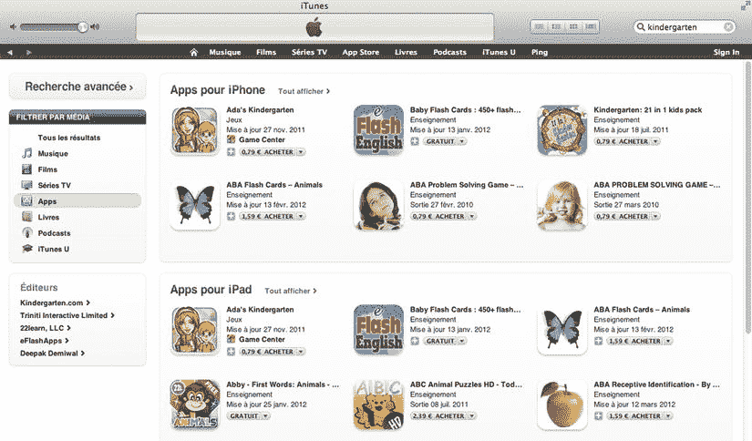
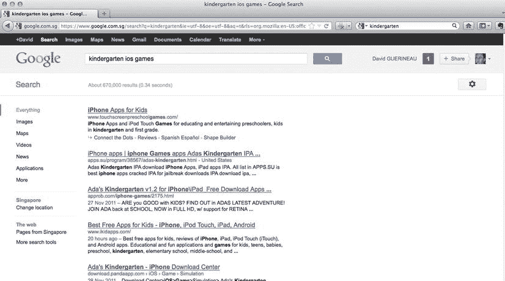
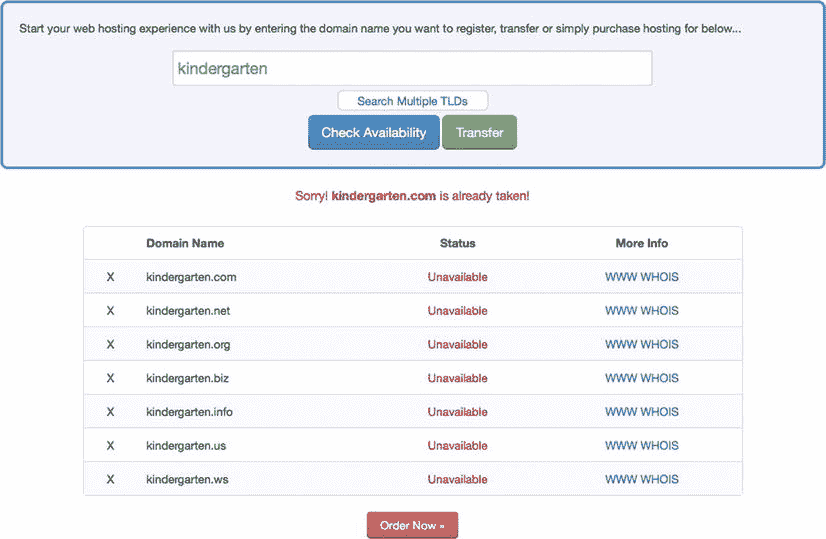
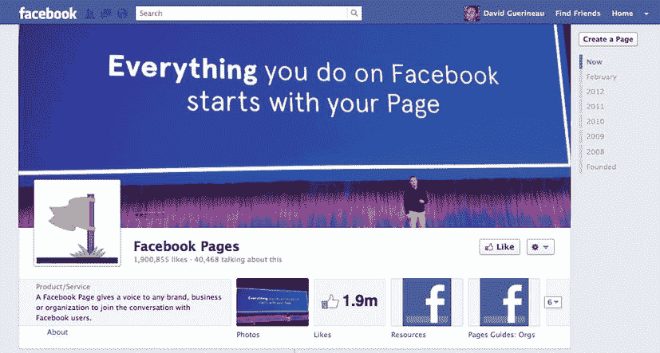
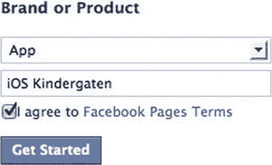
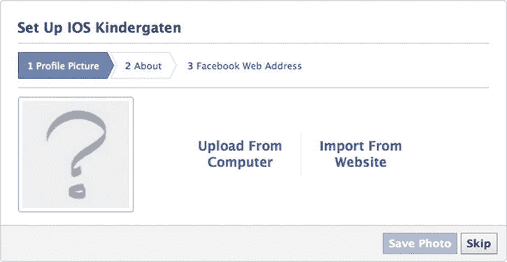
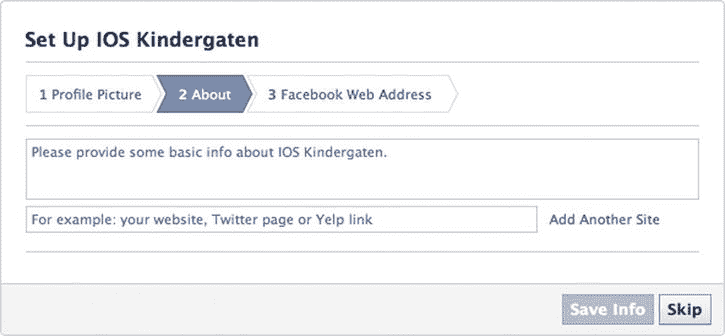
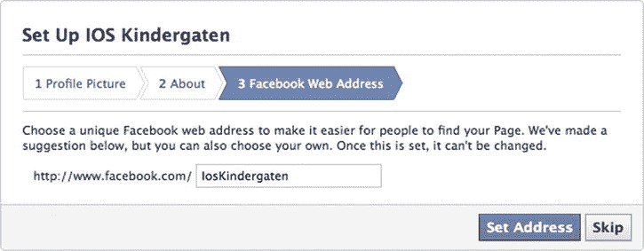
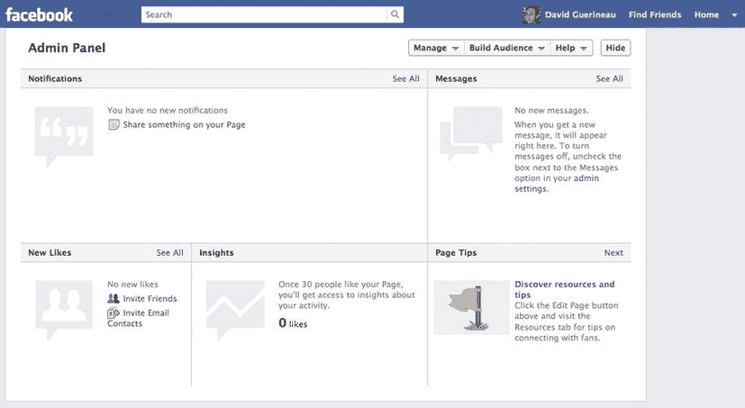

# 十二、游戏推广入门

本章的目的不是为你提供一个完整详尽的游戏营销课程，而是对一些重要概念的快速介绍，这些概念可能会帮助你提高销售额。

你开发了一个很棒的游戏，你想让人们知道它。更重要的是，你希望人们购买它！所以你必须告诉全世界，但是到处喊“我有最好的游戏”是不够的！

在进入运营策略之前，你需要做一点内省的准备:谁是你的潜在客户？你的竞争对手是谁？你的游戏有什么独特之处？

在本章中，我将介绍:

> *   Define your target customers.
> *   Investigate your competitors.
> *   A draft definition of your unique value.
> *   Basic operational strategies such as press releases and their release.
> *   Get comments from influencers.
> *   Promote your game with Facebook.

### 前期开发阶段

事实上，准备阶段是高效促销最重要的任务。通过精心制作合适的信息，你可以大大提高你的下载率。准备阶段主要由三个调查领域组成:你的目标客户、你的竞争对手和你独特的价值主张。

#### 定义你的目标客户

为了向你的潜在客户传达相关信息，你需要研究他们。你可以花费数年时间研究社会心理学，深入了解顾客购买行为，但这不是本书的目的。相反，我将为您提供几个问题，帮助您确定潜在目标。

第一步是确定你的目标客户是否在 App Store 购买游戏。如果他们没有，你需要问自己为什么。你最终可能会得出这样的结论:他们不在 App Store 买游戏，是因为他们不用 iOS 设备。或者他们无权进行购买(未成年人、小孩、由另一个成年人管理的人)。在这种情况下，您需要对玩家和购买者这两个群体进行资格审查。

##### 人口分布图

要确定人员资格，您需要提供以下人员信息:

> *   age
> *   gender
> *   income
> *   academic degree
> *   marital status
> *   geographical position
> *   occupation

让我们用插图练习一下。让我们假设你打算创建一个面向美国的幼儿园游戏。让我们在表 12-1 中填入适当的信息。

请记住，剖析的目的不是详尽无遗，而是以最少的努力锁定 80%的潜在客户。

##### 信息来源

下一步是确定你的目标受众从哪里收集信息来做出购买决定。一旦确定了这些信息来源，你就可以通过它们来交流你的游戏。例如，关于父母身份的网上论坛是父母的重要信息来源。在谷歌上搜索“蹒跚学步的父母美国论坛”会给你提供一个论坛列表，你可以在那里谈论你的游戏。此外，还有一些网站涵盖了幼儿应用。识别他们并让他们评论你的游戏会给你带来很大的曝光率。

##### 了解购买决策

确定目标客户的最后一步是确定潜在客户对你的游戏类型做出购买决定的方式。购买决策会是冲动的、经过分析的、参考的还是受影响的？同样，获取这些信息对于您定义信息内容的方式至关重要。

在这个例子中，父母让其他父母推荐应用至关重要。所以你的操作策略是从其他家长那里获得积极的推荐，然后把这些推荐传达出去。如何获得积极的推荐？一种方法是分发免费下载代码，作为回答调查的交换，然后创建一个可靠的审查者数据库。

#### 识别并确定您的竞争对手

对于 iOS 游戏来说，定位你的竞争对手既容易又棘手。找到你要竞争的游戏就像找到应用商店一样简单。但由于商店中有超过 50 万个应用，找到你将与之争夺市场份额的游戏可能会很棘手。

可以使用 iTunes 的搜索功能(如图图 12-1 所示)。

**图 12-1。** *在 iTunes 中搜索“幼儿园”的结果*

另一种方法是使用谷歌搜索 iPhone、iOS 或 iPad 等关键词。然后你就可以利用谷歌的所有力量来得到结果。搜索“幼儿园 ios 游戏”的结果如图图 12-2 所示。

**图 12-2。** *谷歌“幼儿园 ios 游戏”结果*

一旦您确定了潜在竞争对手的列表，创建一个表格，每行一个竞争对手，并将表 12-2 中显示的信息作为列。

您可以使用位于 Chapter12_Files 文件夹中名为`Competitive Review template.xls`的 Excel 模板。

#### 创造您独特的价值主张

最后一步是创造你独特的价值主张。这是你的客户会购买你的游戏的主要原因。顾客购买你的游戏的主要原因是你的游戏以特定的价格提供的娱乐价值、教育价值和上瘾价值。通过列出这些功能的特点和优势，您将在这三个类别中创造价值，这将产生您独特的价值主张。

##### 寻找完美的名字

由于名称是商店中最重要的搜索标准之一，您应该花相对较长的时间来查找正确的名称。它需要足够的描述性，以便当潜在买家寻找游戏时，你的游戏有一个很好的匹配。

在选择名字时要进行的检查中，你需要确保在你所针对的另一个国家或文化中没有冒犯的意思。此外，你必须尊重版权和商标规则。一个好的建议是用你可能想用的名字进行谷歌搜索。

最后但并非最不重要的是，你可能想检查哪些域名与游戏名称有关。图 12-3 显示了对“幼儿园”进行域检查的结果

**图 12-3。** *【幼儿园】上的域名勾选*

##### 制作你的图标

你的偶像是你的朋友！你的偶像是你最好的盟友。执行搜索的潜在目标客户会在 App Store 搜索结果页面上看到两样东西:你的标题和你的图标。

因此，你的图标是非常重要的。你必须花必要的时间来正确设计你的图标。它必须具有吸引人的视觉描述。

表 12-3 显示了图标尺寸的各种要求。

以下是 Apple 开发者文档中关于游戏图标的链接:

`[`developer.apple.com/library/ios/#documentation/userexperience/conceptual/mobilehig/Iconsimg/IconsImages.html`](http://developer.apple.com/library/ios/#documentation/userexperience/conceptual/mobilehig/Iconsimg/IconsImages.html)`

此外，以下是 Apple 开发人员关于图标指南的文档链接:

`http://developer.apple.com/library/ios/#documentation/userexperience/conceptual/mobilehig/Iconsimg/IconsImages.html#//apple_ref/doc/uid/TP40006556-CH14-SW2`

##### 编写应用商店描述

App Store 中对你游戏的描述需要遵循一些黄金法则。让我们面对现实:大多数潜在买家只会阅读第一行，然后跳转到屏幕截图。在这一点上，有三种可能:他们买了它，他们走了，或者他们进一步阅读以下定决心。我不确定第三种选择会是最常见的。这是什么意思？这意味着你需要把你的关键信息放在你描述的顶部。

此外，你的内容不应该是一成不变的。例如，如果你决定进行新学年的销售，那么在销售的有限时间内在顶部做广告。

以下是我对游戏描述的黄金法则:

> *   State positive feedback from customers or recognized reviewers.
> *   Be direct and brief in your game description.
> *   Explain why players will have fun playing your game.
> *   Be simple, direct and honest.
> *   When a new version is released, it contains a new content section.
> *   List your main features and advantages, and highlight the unique features and advantages of your game.

不废话，只说要点！

### 作战战术

本节重点介绍一些你可能想要使用的工具，以使你的游戏在外界有一定的知名度，如新闻发布、产品网页、游戏评论和脸书网页。

#### 撰写新闻稿

新闻稿是向媒体发布的官方声明。这是一种正式的沟通和通知新闻机构(新闻、电视、互联网新闻网站)的方式。

您有几次机会发布关于游戏推广的新闻稿:

> *   Your new game announcement.
> *   Make major updates to your game to provide more value to customers.
> *   Your game has reached a considerable download volume. Your game has won all kinds of recognition: awards, monthly games, best game reviews, and special recommendations from the app store.

写一篇好的新闻稿很难，因为它需要很好的书面沟通技巧。对于有能力的人，我强烈建议聘请专业文案。自由撰稿人可能要花你几百美元。谷歌搜索会返回大量可供选择的联系人。基于你已经做的市场调查，他/她将能够写一份非常有力的新闻稿，然后你将广播。

如果您选择(或者别无选择)自己编写，您需要遵循公认的格式化结构:

> *   Title
> *   Abstract (the title is explicit and optional)
> *   main body
> *   Contact information

在今天的数字通信时代，你将通过电子方式发布你的新闻稿。利用这种分发模式来包含游戏视频的链接。一个好的 30 秒视频会说服人们尝试这个游戏。

要分发您的新闻稿，您可以将它直接发送到您根据市场调查创建的关键联系人数据库。或者，你可能想使用一些互联网服务，将你的新闻稿分发给媒体。有些人可能免费做这件事；其他一些可能需要付费。以下是此类服务的几个名称:

> *   pr MAC(??)
> *   )pr web( `[www.prweb.com](http://www.prweb.com)`
> *   获取 2 按(`[www.get2press.sg](http://www.get2press.sg)`)

#### 创建网页

创建一个简单的产品网页也是一个既好又便宜的促销工具。您可以很容易地找到一些服务来托管您的页面，以及从图形界面设计您的页面的工具。

就我个人而言，我使用 WordPress 网站，它的托管费是每年几美元。然后我为每场比赛贡献一个网页。为了传达有效的信息，以下是一些简单的指导原则:

> *   Keep it clean and concise.
> 
> *   Describe your game quickly. Use an icon on the homepage and write down your game name in capital letters to make the graphical interface look better. Make use of all possible media: videos, picture libraries, etc.
> *   Forward the content of your App Store page and add additional parts, such as Q&As, tips and user guides.
> *   Because the purpose is to sell your game, make sure there is a buy button that can be easily seen and linked to the app store page of your game.

#### 让你的游戏在应用点评网站上获得点评

强有力的购买促成因素是推荐。这就是为什么你的游戏获得知名应用评论网站的评论是至关重要的。

一个好的方法是给他们发送一个个性化的信息，并附上游戏的免费下载代码和新闻稿。

以下是我使用的几个网站:

> *   `[www.148apps.com](http://www.148apps.com)`
> *   `[www.slidetoplay.com](http://www.slidetoplay.com)`
> *   `[www.appspy.com](http://www.appspy.com)`
> *   `[`toucharcade.com`](http://toucharcade.com)`
> *   `[www.metacritic.com/games/ios](http://www.metacritic.com/games/ios)`

此外，这个页面(`[`maniacdev.com/2011/08/ios-app-review-sites/`](http://maniacdev.com/2011/08/ios-app-review-sites/)`)列出了 116 个审查应用的网站。

#### 创建脸书页面

尽管社交网络不仅限于脸书，但让我们面对现实吧:脸书是一个强大的工具。

有了脸书帐户，你可以创建脸书网页。脸书页面是一个很好的社区交流工具。您可以使用为 App Store 准备的描述来描述您的游戏。要创建一个脸书页面，进入`[www.facebook.com/FacebookPages](http://www.facebook.com/FacebookPages)` ( 图 12-4 )。

**图 12-4。** *Facebook 页面*

单击页面右上角的“创建页面”按钮(您必须登录才能创建页面)。选择以下选项之一:

> *   Local enterprises or places
> *   Company, organization or institution
> *   Brand or product
> *   Artists, bands or public figures
> *   amusement
> *   Career or community

iOS 设备的游戏归入“品牌或产品”。然后，选择名为“应用”的类别键入游戏的名称。阅读脸书网页条款(`[www.facebook.com/page_guidelines.php](http://www.facebook.com/page_guidelines.php)`)，并勾选复选框表示您接受这些条款。最后，点击图 12-5 中所示的“开始”按钮。

**图 12-5。** *为 iOS 幼儿园创建脸书页面*

您可以提供一张个人资料图片，如图图 12-6 所示。使用您为 App Store 页面准备的图标。

**图 12-6。** *上传个人资料图片*

接下来是对你游戏的描述(图 12-7 )。同样，使用你为应用商店描述所做的工作。

**图 12-7。** *提供关于你游戏的信息*

页面创建的最后一步是选择页面的网址。如果会是类似`[`www.facebook.com/yourpage`](http://www.facebook.com/yourpage)`的东西，如图图 12-8 所示。

**图 12-8。** *设置你的网址*

您的页面已创建！你将被自动引导到页面的管理区，如图 12-9 所示。

**图 12-9。** *你的脸书页面管理面板*

使用此页面创建游戏社区，并使用它与社区进行交流。一旦人们“喜欢”这个页面，他们就会在他们的新闻订阅中收到你页面上的任何帖子。

### 总结

游戏推广介绍到此结束。这是营销概念的一个非常基本的方法。如果你想探索更多关于游戏营销和推广的知识，我推荐戴夫·伍尔德里奇和迈克尔·施耐德的《iPhone 和 iPad 应用开发业务》。

在本章中，您学习了如何:

> *   Define your target customers.
> *   Study your competitors.
> *   Draw up your unique value definition.
> *   Write a press release and distribute it.
> *   Approaching the app review website.
> *   Create a Facebook page.