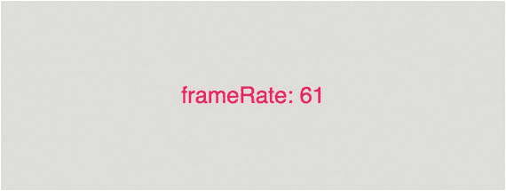

# 五、条件语句和比较运算符

在前一章中，我们看到了 p5.js 为我们提供的一些变量。需要注意的一点是，这些变量只能在 p5.js 函数`setup`和`draw`内部使用。如果我们试图在这些函数之外使用它们，我们会得到一个错误，说它们没有被声明。

在这一章中，我们将看看 p5.js 为我们提供的另一个有用的变量:`frameCount`。我们还将学习`frames`和`frameRate`功能。

## 帧数、帧速率和帧

还记得我们在上一章是如何定义一个`count`函数来计算`draw`函数被调用的次数的吗？我们实际上可以使用 p5.js 为此提供的名为`frameCount`的变量。`frameCount`是一个变量，记录`draw`函数在程序生命周期中被调用的次数。默认情况下，`draw`功能每秒最多被调用 60 次。p5.js 内部一个名为`frameRate`的设置决定了这个值。

这个变量的引入保证了关于 p5.js 中的`frames`是什么的讨论。我们可以认为`frame`是`draw`函数调用的结果。`draw`函数在一秒钟内被调用无数次，而`frameRate`函数决定了调用的次数。如果我们调用不带参数的`frameRate`函数，它将返回 p5.js 的当前`frame rate`——我们可以将它保存到一个变量和`console.log`中，以查看它在每一帧中的值(清单 [5-1](#Par5) )。

```js
function setup() {
        createCanvas(400, 400);
}

function draw() {
        background(220);
        console.log(frameRate());
}

Listing 5-1Console.log the frame rate

```

违约率在 60 左右。这意味着`draw`功能每秒最多执行 60 次。这个数字取决于我们的系统资源。由于与性能相关的原因，例如有限的系统资源，可以达到的实际帧速率可能低于此目标值。我们可以认为 60 是 p5.js 努力达到的理想帧速率，但实际帧速率和性能可能低于这个值。

将框架想象成翻页书动画中的纸张。每秒查看的页面越多，动画就越流畅。这就是为什么高帧速率是可取的。如果帧速率较低，动画可能看起来参差不齐。我们可以通过向`frameRate`函数传递一个整数值，在 p5.js 中显式地设置帧速率。值为 1 的`frameRate`将每秒调用一次我们的`draw`函数。

如果我们不想要任何动画，那么我们可以在`setup`函数中调用一个名为`noLoop`的函数。这个函数调用将导致 draw 函数只被调用一次。

总而言之，`frameCount`是在程序的整个生命周期中执行`draw`函数的次数。`frameRate`是一秒钟内执行 draw 函数的次数。如果一个程序的`frameRate`为 60，3 秒后的`frameCount`将在`60*3=180`左右。

如前所述，我们可以通过调用不带参数的`frameRate`函数来查看当前的帧速率。但是我们实际上可以做得更好，并把结果显示在屏幕上，而不是把结果显示出来。

在 p5.js 中，我们可以使用`text`函数向屏幕显示一个值。`text`函数在 x 和 y 位置显示作为第一个参数给出的值，作为第二个和第三个参数提供(列表 [5-2](#Par12) 和图 [5-1](#Fig1) )。这样，我们可以更容易地在程序中可视化帧速率。请注意，在高帧速率下，实际结果将很难读取，因为它从一帧到另一帧波动很大。



图 5-1

Visualize the frame rate

```js
function setup() {
        createCanvas(800, 300);
        textAlign(CENTER, CENTER);
}

function draw() {
        background(220);
        fill(237, 34, 93);
        textSize(36);

        // get the current frame rate as an integer.
        var fps = parseInt(frameRate(), 10);
        text("frameRate: " + fps, width/2, height/2);
}

Listing 5-2Visualize the frame rate

```

`parseInt`是一个 JavaScript 函数，允许我们将十进制数转换成整数。它需要第二个参数来表示我们使用的基数(通常是 10)。

还要注意，在清单 [5-2](#Par12) 中，我们使用了一个名为`textAlign`的 p5.js 函数，带有参数`CENTER`、`CENTER`，能够在屏幕上水平和垂直对齐文本。否则，文本将从左上角开始绘制，而不是居中。

我们也可以尝试在屏幕上显示`frameCount`变量(列表 [5-3](#Par16) )。如前所述，这是保存调用`draw`函数的次数的变量。

```js
function setup() {
        createCanvas(800, 300);
        textAlign(CENTER, CENTER);
}

function draw() {
        background(220);
        fill(237, 34, 93);
        textSize(36);

        text("frameCount: " + frameCount, width/2, height/2);
}

Listing 5-3Displaying the 
frameCount

```

使用`frameCount`变量，我们可以很快得到一个值，这个值随着`draw`函数的每次执行而增加。请注意清单 [5-4](#Par18) 中的内容，如果`frameRate`较低，则`frameCount`变量会变化得更慢。

```js
function setup() {
        createCanvas(800, 300);
        textAlign(CENTER, CENTER);
        frameRate(6); // make animation slower
}

function draw() {
        background(220);
        fill(237, 34, 93);
        textSize(36);

        text("frameCount: " + frameCount, width/2, height/2);
}

Listing 5-4Using the 
frameRate

variable

```

我们可以重写上一章的例子，使用内置的`frameCount`变量，而不是使用我们的`count`变量(清单 [5-5](#Par20) )。

```js
function setup() {
        createCanvas(800, 300);
        rectMode(CENTER);
}

function draw() {
        background(1, 186, 240);

        // declaration of variables
        var x = width / 2;
        var y = height / 2;
        // increment the size with the current frameCount value
        var size = 200 + frameCount;

        // circle
        fill(237, 34, 93);
        noStroke();
        ellipse(x, y, size, size
);

        // rectangle
        fill(255);
        rect(x, y, size*0.75, size*0.15);
}

Listing 5-5Using the 
frameCount

variable

```

## 条件式

到目前为止，我们编写的所有程序都是以自顶向下的线性方式执行的。但是在编程中，只有在满足特定条件时才执行程序的某些部分是很常见的。例如，使用变量`frameCount`，我们现在能够在屏幕上制作一个形状的动画，但是如果我想让这个动画只在某一帧之后开始，比如在第 100 帧之后，该怎么办呢？

这可以使用一个叫做`if`语句的编程结构来完成。`if`语句允许我们仅在满足特定条件时才执行一段代码。一个`if`语句是这样写的，我们从声明`if`开始，在它旁边的括号内，我们写一个表达式，其值应该为`true`或`false`。接下来，在紧接在`if`语句之后的花括号内，我们编写了一段代码，如果我们编写的表达式计算结果为`true`，我们希望执行这段代码:

```js
if (<conditional statement>) {
        // do something
}

```

`true`或`false`是 JavaScript 中的实际值，就像数字是值一样。它们只是与`Number`或`String`不同类型的值。它们被称为`Boolean`值或`Boolean`数据类型。由于`true`和`false`是本地 JavaScript 数据类型，我们可以不加任何引号地输入它们，也不会出现错误:

```js
console.log(true);

```

如果我们键入`True`或`False`(第一个字母大写)，我们不能得到相同的结果。编程语言在你如何写东西方面是特别的。`True`不等同于`true`。此外,`True`不是 JavaScript 识别的值，所以不加引号将导致错误:

```js
console.log(True);
//Uncaught ReferenceError: True is not defined(...)

```

我们也可以使用`comparison`操作符来生成`true`或`false`值。`Comparison`运算符允许我们将两个值相互比较，结果，它们根据比较结果生成一个`true`或`false`值。以下是比较运算符的示例。我们用符号`bigger-than`来比较两个数字，如果左边的数字比右边的大，就会返回`true`；否则返回`false`。

```js
console.log(10 > 2); // would evaluate to true
console.log(1 > 100); // false
console.log(100 > 1); //true

```

如果左侧的值大于或等于右侧的值，则`Bigger or equals >=`返回`true`。

```js
console.log(100 >= 100); //true

```

还有`smaller <`和`smaller or equals <=`比较运算符。

```js
console.log(1 < 10); //true
console.log(10 <= 10); //true

```

为了比较两个值来检查它们是否相等，我们将使用三重等号`===`。这不同于我们可能习惯的数学课，在数学课中，等号运算符是一个等号运算符`=`。但是在 JavaScript 中，我们已经使用了单个等号运算符作为赋值操作。

```js
console.log(1 === 1); //true

```

我们还可以进行比较，检查两个值是否不相等。为此，我们在等号前面用一个感叹号。

```js
console.log(1 !== 1);

```

确保尝试使用我们所学的比较操作来查看它们在控制台中生成的结果。

让我们看看清单 [5-6](#Par40) 和图 [5-2](#Fig2) 中利用`if`结构的例子。


图 5-2

Output from Listing [5-6](#Par40)

```js
var num;

function setup() {
        num = 1;
        createCanvas(800, 300);
        textAlign(CENTER, CENTER);
}

function draw() {
        background(220);
        fill(237, 34, 93);
        textSize(48);

        if (num === 1) {
                // this code gets executed only if num is equivalent to 1.
                text('TRUE', width / 2, height / 2);
        }
}

Listing 5-6Using the if structures

```

将执行`if block`，因为括号内的表达式将计算为`true`。毕竟第一就相当于第一。我们将在屏幕上看到单词 TRUE，因为这就是`if block`中的代码所做的。

如果我们将`num`变量的值改为 2，那么我们将看不到屏幕上显示的任何内容，因为这一次，`if`块的比较结果将为`false`，并且条件将不会被执行。

有一个额外的结构只能用于一个叫做`else`模块的`if`模块。一个`else`块跟在一个`if`块之后，并且对于没有被`if`块覆盖的每一个其他比较都被执行。让我们使用一个`else`模块来扩展前面的例子(列表 [5-7](#Par44) 和图 [5-3](#Fig3) )。


图 5-3

Output from Listing [5-7](#Par44)

```js
var num;

function setup() {
        num = 2;
        createCanvas(800, 300);
        textAlign(CENTER, CENTER);
}

function draw() {
        background(220);
        fill(237, 34, 93);
        textSize(48);

        if (num === 1) {
                // this code gets executed only if num is equivalent to 1.
                text('TRUE', width / 2, height / 2);
        } else {
                // this code gets executed if num is NOT equivalent to 1.
                text('FALSE', width / 2, height / 2);
        }
}

Listing 5-7Using an 
else

block

```

现在在清单 [5-7](#Par44) 的例子中，`else`语句只有在`if`语句没有被执行的时候才会被执行。这是针对每一个不为 1 的`num`变量的值。

顺便说一下，注意我们是如何通过编写两次`text`函数来重复自己的。我们可以`refactor`我们的代码更简洁一点(列出 [5-8](#Par47) )。根据维基百科，重构是重新构造现有计算机代码的过程——改变分解——而不改变其外部行为。

```js
var num;

function setup() {
        num = 2;
        createCanvas(800, 300);
        textAlign(CENTER, CENTER);
}

function draw() {
        var value;
        background(220);
        fill(237, 34, 93);
        textSize(48);

        if (num === 1) {
                value = 'TRUE';
        } else {
                value = 'FALSE'
        }
        text(value, width/2, height/2);
}

Listing 5-8Refactoring our code

```

重构之前这段代码的问题是，如果我们想改变文本的位置，我们需要记住在两次`text`函数调用中改变它。记住这样做似乎很容易，但是即使像这样的小事实际上也会使代码维护变得更加困难。

还有一个条件块可以添加到一个`if`条件块中，那就是一个`else if`块。一个`else if`块将允许我们处理额外的条件。例如，在清单 [5-9](#Par50) 中，我们可以给前面的例子添加几个`else if`块:

```js
var num;

function setup() {
        num = 2;
        createCanvas(800, 300);
        textAlign(CENTER, CENTER);
        fill(237, 34, 93);
}

function draw() {
        var value;
        background(220);
        textSize(48);

        if (num === 1) {
                value = 'TRUE';
        } else if (num === 2) {
                value = 'STILL TRUE';
        } else if (num === 3) {
                value = 'YEP, TRUE';
        } else {
                value = 'FALSE'
        }
        text(value, width/2, height/2);
}

Listing 5-9Using the 
else if

block

```

尝试更改`num`变量的值，看看代码是如何运行的。使用`else if`块，我们可以为`num`的值处理两个更具体的条件。

利用我们所学的知识，让我们修改我们在上一章中编写的代码(清单 [4-10](#Par53) ，使动画的行为取决于`frameCount`变量，如清单 [5-10](#Par53) 所示。

```js
var size;

function setup() {
        createCanvas(800, 300);
        rectMode(CENTER);
        size = 200;
}

function draw() {
        background(1, 186, 240);

        // declaration of variables
        var x = width / 2;
        var y = height / 2;
        var size = 200;
        if (frameCount < 30) {
                size = size + frameCount;
        } else {
                size = size + 30;
        }

        // ellipse
        fill(237, 34, 93);
        noStroke();
        ellipse(x, y, size, size);

        // rectangle
        fill(255);
        rect(x, y, size*0.75, size*0.15);
}

Listing 5-10Making the animation conditional

```

我们改变了前面的例子，如果`frameCount`值小于 30，那么形状将使用`frameCount`来制作动画；否则，它将保持静态。

我们还可以通过使用`&&`或`||`操作符将两个逻辑表达式组合在一起创建复合语句。`&&`代表`AND`。这允许我们编写这样的表达式，只有当条件语句的所有部分都是`true`时，表达式的计算结果才是`true`。假设我们想仅在`frameCount`大于 20 `AND`小于 30 的情况下制作形状动画。我们可以使用一个复合的`and`语句来组合这两个条件(清单 [5-11](#Par56) )。

```js
if (20 < frameCount && frameCount < 30) {
        size = size + frameCount;
}
Listing 5-11Using a compound 
and statement

```

`||`代表`OR`。`OR`复合语句只要条件语句的一部分是`true`就返回`true`。如果`frameCount`小于 30 `OR`并且`frameCount`值大于 120，假设我们想要制作这个形状的动画。为了表达这一点，我们可以编写清单 [5-12](#Par58) 中所示的脚本。

```js
if (frameCount < 30 || frameCount > 120) {
        size = size + frameCount;
}
Listing 5-12Using a compound 
or statement

```

## 摘要

在本章中，我们学习了框架的概念，以及它如何帮助我们在 p5.js 中创建动画图像。

我们还学习了 p5.js `frameCount`变量，它记录了到目前为止显示了多少帧，以及`frameRate`函数，它允许我们为 p5.js 设置帧速率。

我们学习了几个其他的 p5.js 函数，比如允许我们在屏幕上绘制文本的`text`函数和允许我们对齐我们在屏幕上绘制的文本的`textAlign`函数。

从 JavaScript 世界中，我们了解了比较运算符；`Boolean`数据类型；`true`和`false`；最重要的是`if`、`else if`和`else`条件句。这些结构通常在编程中使用，在许多其他编程语言中也可以找到。它们允许我们编写行为更加智能的代码，而不是自上而下盲目执行。

## 实践

创建一个动画，将最初在屏幕外的五个矩形动画化，使其从左侧进入屏幕。它们应该以不同的速度移动，并且应该在离开屏幕之前停下来。