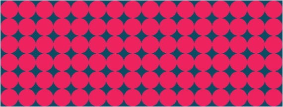
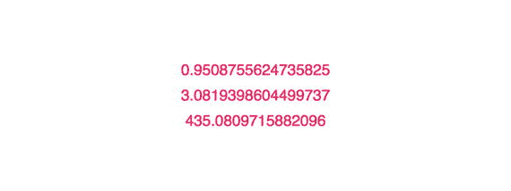
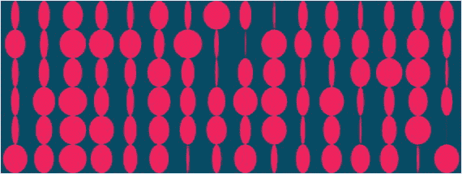
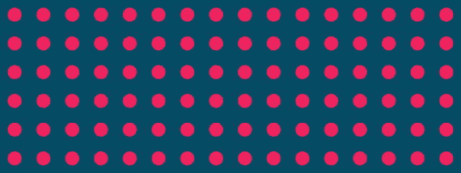
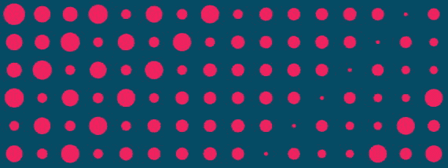
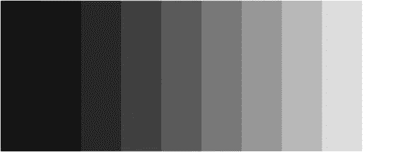

# 七、循环

计算机最擅长的事情之一就是重复。想象一下，必须用不同的参数在屏幕上创建一千个形状。以我们目前的编程知识，这样做将花费我们不合理的时间。在这种情况下，我们希望按原样或有变化地重复我们的代码，我们可以利用一种叫做循环的编程结构。循环允许我们一遍又一遍地执行一段代码。

我们已经熟悉了 p5.js 中的循环概念。如果你仔细想想，`draw`函数是一个不断重复执行的循环，直到我们退出 p5.js 程序。在本章中，我们将学习如何自己构建这种循环。

## For 循环

JavaScript 中有几种不同类型的循环结构，但目前最流行的是`for loop`。它允许我们重复一定次数的操作。一个`for loop`有四个部分。清单 [7-1](#Par4) 提供了一个如何构建`for loop`的例子。

```js
for (var i = 0; i < 10; i = i + 1) {
        //do something
}
Listing 7-1Example of a for loop

```

在第一部分中，我们初始化一个变量，该变量将记录循环执行的次数——我们称之为计数器变量。

```js
var i = 0;

```

按照惯例，在`for loop`内部，我们通常倾向于使用像`i`或`j`这样的短变量名，尤其是如果这个变量只用于控制`for loop`的流量。但是，如果对您的用例有意义，也可以随意使用其他名称。

在第二部分中，我们为我们的循环定义了一个测试条件，每次循环将要开始时都会对其进行评估。在这个例子中，我们检查计数器变量是否小于数字 10。

```js
i < 10;

```

在第三部分中，我们定义了一种方法来更新在循环结束时计算的计数器变量。在这个例子中，我们得到变量`i`的当前值，并给它加 1。

```js
i = i + 1;

```

最后，在花括号内，我们写了我们想要重复的代码。一旦计数器变量不满足测试条件，循环就终止，程序返回到正常求值。

如果测试条件从未失败，那么我们将有一个循环，它将最终创建一个`infinite loop`，一个没有退出条件的循环，这样它将一直继续下去，直到程序被外部手段终止。p5.js 中的`draw`函数处于无限循环中；它会一直绘制到屏幕上，直到我们关闭浏览器窗口。

尽管无限循环是一种有效的用例，但循环最常用于执行已知次数的操作。让我们创建一个循环，它将使用`for loop`在屏幕上绘制给定数量的椭圆(列表 [7-2](#Par15) 和图 [7-1](#Fig1) )。


图 7-1

Output for Listing [7-2](#Par15)

```js
function setup() {
        createCanvas(800, 300);
}

function draw() {
        background(1, 75, 100);

        // circle properties
        fill(237, 34, 93);
        noStroke();

        for (var i=0; i<10; i=i+1) {
                ellipse(0, 0, 50, 50);
        }
}

Listing 7-2Create ellipses

using a for loop

```

在我们的例子中，我们在屏幕上画了 10 个圆，但是没有办法在视觉上进行区分，因为所有的圆都是一个接一个地画出来的。这就是利用循环计数器变量的意义所在。我基本上可以在每次调用循环时使用这个变量来偏移圆圈的位置(列表 [7-3](#Par17) 和图 [7-2](#Fig2) )。


图 7-2

Output for Listing [7-3](#Par17)

```js
function setup() {
        createCanvas(800, 300);
}

function draw() {
        background(1, 75, 100);

        // circle properties
        fill(237, 34, 93);
        noStroke();

        for (var i=0; i<10; i=i+1) {
                ellipse(i * 50, 0, 50, 50);
        }
}

Listing 7-3Using a loop counter in a 
for loop

```

在输入椭圆函数之前，我们将循环变量乘以 50(圆的直径)。这使得我们的形状不会互相重叠。

现在，如果我们要执行这个，我们将会看到`for loop`为我们创建的所有这些圆圈。最棒的是，因为我们构建了重复操作的结构，所以扩展它就像将循环中使用的数字改为更大的值一样简单。渲染 100 或 1000 个圆而不是 10 个，只是改变这一个值的问题。然而，如果我们开始使用巨大的数字，我们可能会开始注意到性能下降。

让我们构建我们的代码，以便我们可以用圆形填充屏幕的整个宽度(列表 [7-4](#Par23) 和图 [7-3](#Fig3) )。

如果屏幕的宽度是 800，一个圆的直径是 50 个单位，那么这将意味着我们可以将`800 / 50`个圆填充到页面的宽度中。我们会注意到在页面的末尾有一点空隙，因为第一个圆圈在画布外面一点。我们可以通过在 x 位置上加 25 来抵消所有的东西来消除这个间隙，这是直径值的一半。正如您已经知道的，我们实际上不需要自己做这些计算，因为我们可以让 JavaScript 为我们计算这个值。

此时您可能会注意到，我们将大量值硬编码到代码中，为了灵活性，最好使用变量。为此，我们将重构我们的代码。


图 7-3

Output for Listing [7-4](#Par23)

```js
function setup() {
        createCanvas(800, 300);
}

function draw() {
        background(1, 75, 100);

        // circle properties
        fill(237, 34, 93);
        noStroke();
        var diameter = 50;

        for (var i=0; i< width/diameter; i=i+1) {
                ellipse(diameter/2 + i * diameter, 0, diameter, diameter);
        }
}

Listing 7-4Filling the screen width

with circles

```

现在，如果我们要改变一个值，即圆的直径，整个代码仍然会画出刚好足够填满屏幕的圆。这是一件令人印象深刻的事情。

如果我们也想用圆形填充屏幕的高度呢？为了做到这一点，我们需要编写另一个 for 循环，为画布的整个长度放置圆，为宽度放置每个圆。这要求我们在第一个循环中放置第二个循环，有效地将一个循环嵌套在另一个循环中。见清单 [7-5](#Par26) 和图 [7-4](#Fig4) 。



图 7-4

Output for Listing [7-5](#Par26)

```js
function setup() {
        createCanvas(800, 300);
}

function draw() {
        background(1, 75, 100);

        // circle properties
        fill(237, 34, 93);
        noStroke();
        var diameter = 50;

        for (var i=0; i<width/diameter; i=i+1) {
                for (var j=0; j<height/diameter; j=j+1) {
                        ellipse(
                                diameter/2 + i * diameter,
                                diameter/2 + j * diameter

,
                                diameter,
                                diameter
                        );
                }
        }
}

Listing 7-5Filling the screen with circles 

```

注意我们在这个例子中声明`ellipse`函数的方式。我们将它写在多行上，以增加可读性。JavaScript 不关心空格，所以使用多行代码不会导致任何错误。

这段代码现在非常有用。首先，它很健壮；我们可以更改绘图区域的大小或正在绘制的圆的数量，但事情仍然会继续正常运行。

需要记住的是:由于需要执行的操作数量，将循环放在另一个循环中会使我们的程序非常慢。此外，有时嵌套结构也会使我们的程序难以阅读。

## 随机和噪声函数

由于我们现在可以创建每次执行时都使用不同值的循环，这可能是学习 p5.js `random`函数的好时机。p5.js `random`函数每次被调用时都会生成一个随机数。当我们想要为正在绘制的形状的参数使用随机值时，这很有用。

如果我们在没有任何参数的情况下调用`random`函数，那么对于每个`draw`函数调用或每个帧，都会产生一个介于 0 和 1 之间的随机数。如果我们给`random`函数提供一个值，那么它将返回一个大于 0 小于给定值的随机值。如果我们给`random`函数提供两个值，那么我们将得到一个介于给定的两个数之间的随机值。这些情况的例子见清单 [7-6](#Par32) 。

```js
console.log(random()); // a random number in between 0 and 1
console.log(random(10)); // a random number in between 0 and 10
console.log(random(100, 1000)); // a random number in between 100 and 1000
Listing 7-6Examples of using the 
random function

```

清单 [7-7](#Par34) 是一个以不同方式使用`random`函数的小脚本。图 [7-5](#Fig5) 显示了该脚本的结果。显示的数字是随机生成的，每次执行代码时都会有所不同。



图 7-5

Output from Listing [7-7](#Par34)

```js
function setup() {
        createCanvas(800, 300);
        textAlign(CENTER, CENTER);
        fill(237, 34, 93);
        frameRate(1);
}

function draw() {
        var random_0 = random();
        var random_1 = random(10);
        var random_2 = random(100, 1000);
        var offset = 40;

        textSize(24);
        background(255);
        text(random_0, width/2, height/2-offset);
        text(random_1, width/2, height/2-0);
        text(random_2, width/2, height/2+offset);
}

Listing 7-7Using the 
random function

```

有了清单 [7-8](#Par36) 和图 [7-6](#Fig6) ，让我们更新我们之前的代码(清单 [7-5](#Par26) )来使用`random`函数。



图 7-6

Output from Listing [7-8](#Par36)

```js
function setup() {
        createCanvas(800, 300);
}

function draw() {
        background(1, 75, 100);

        // circle properties
        fill(237, 34, 93);
        noStroke();
        var diameter = 50;

        for (var i=0; i<width/diameter; i=i+1) {
                for (var j=0; j<height/diameter; j=j+1) {
                        ellipse(
                                diameter/2 + i * diameter,
                                diameter/2 + j * diameter,
                                diameter * random(), // using the random function
                                diameter
                        );
                }
        }
}

Listing 7-8Using the 
random function

```

我们使用`random`函数的结果，将椭圆的宽度乘以一个随机数，每次调用`random`函数时，这个随机数都是 0 到 1 之间的一个值。由于`random`函数可以在任何帧中取其范围内的任何值，所以动画看起来相当激进。如果我们想要随机性逐渐变化，因此看起来更有机一点，那么我们应该研究一下`noise`函数。

我们可以向`noise`函数输入任何数值，它将返回一个介于 0 和 1 之间的半随机值。对于给定值，它总是返回相同的输出。关于`noise`函数的好处是，如果我们提供给`noise`函数的值只是递增地变化，那么输出值也只会递增地变化。这将导致我们得到的随机值之间的平滑过渡。

为了能够概念化`noise`函数是如何工作的，我们可以认为无限数量的随机值像波浪一样逐渐变化，我们提供给`noise`函数的值就像这些随机值的坐标。本质上，我们只是对一个已经存在的噪声进行采样。每当我们为噪声函数提供相同的值时，我们将收到相同的半随机值作为回报。

我们将重写上面的程序(列表 [7-8](#Par36) )来使用`noise`函数。我们将为`noise`函数提供`frameCount`变量，因为这是在 p5.js 中获取序列号的好方法。但是我们将`frameCount`除以 100，以便能够减缓值的变化，从而稍微减缓最终的动画。见清单 [7-9](#Par41) 和图 [7-7](#Fig7) 。



图 7-7

Output from Listing [7-9](#Par41)

```js
function setup() {
        createCanvas(800, 300);
}

function draw() {
        background(1, 75, 100);

        // circle properties
        fill(237, 34, 93);
        noStroke();
        var diameter = 50;

        for (var i=0; i<width/diameter; i=i+1) {
                for (var j=0; j<height/diameter; j=j+1) {
                        ellipse(
                                diameter/2 + i * diameter,
                                diameter/2 + j * diameter,
                                diameter * noise(frameCount/100), // using then noise function
                                diameter * noise(frameCount/100) // using then noise function
                        );
                }
        }
}

Listing 7-9Using the 
noise function

```

注意现在所有的形状是如何使用相同的动画的。如果我们想为这些形状中的每一个获得不同的噪波值呢？目前我们有重复的值，因为当提供相同的值时，`noise`函数返回相同的输出。为了能够为每个形状获得不同的输出值，我们可能想要重写上面的函数，以利用`for loop`的`i`和`j`值来调整噪声的采样位置。见清单 [7-10](#Par43) 和图 [7-8](#Fig8) 。



图 7-8

Output from Listing [7-10](#Par43)

```js
function setup() {
        createCanvas(800, 300);
}

function draw() {
        background(1, 75, 100);

        // circle properties
        fill(237, 34, 93);
        noStroke();
        var diameter = 50;

        for (var i=0; i<width/diameter; i=i+1) {
                for (var j=0; j<height/diameter; j=j+1) {
                        ellipse(
                                diameter/2 + i * diameter,
                                diameter/2 + j * diameter,
                                // applying a different animation to each circle
                                diameter * noise(frameCount/100 + j*10000 + i*10000),
                                // applying a different animation to each circle
                                diameter * noise(frameCount/100 + j*10000 + i*10000)
                        );
                }
        }
}

Listing 7-10Applying a different animation to each circle

```

我们上面用作乘数的值`10000`完全是任意的。我们只是试图确保我们提供给`noise`函数的坐标彼此相距较远。

## 摘要

循环是编程中最强大的结构之一。它们让我们能够利用计算机的真正计算能力，在更大范围内重复人类在合理时间内不可能完成的操作。

在这一章中，我们学习了如何构建`for loops`以及如何将循环嵌套在一起，以获得重复形状的网格，而不仅仅是一行。

我们还学习了 p5.js `random`和`noise`函数以及它们之间的区别。

## 实践

创建一个循环，该循环将创建一个颜色从黑色逐渐变为白色的矩形数组(图 [7-9](#Fig9) )。你应该以这样一种方式构建循环，即单个变量将控制绘制的矩形的数量。



图 7-9

Practice image