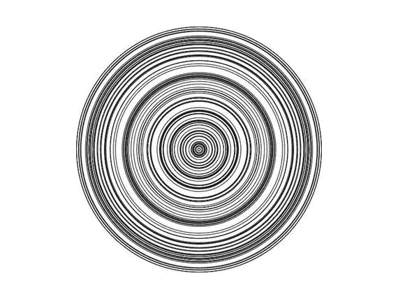

# 10.数组

`Arrays`是 JavaScript 中另一个有用的数据结构。它们是用编号索引存储的数据的顺序集合，并且基于`Objects`，这使得某些操作更容易执行。

在本章中，我们将使用`push`方法填充一个数组。我们还将学习`remainder`操作符，我们可以用它来导出在零和期望值之间循环的连续值。

## 使用`push`方法

请记住，我们使用花括号来创建一个空对象。我们可以使用方括号以类似的方式创建一个空数组(清单 [10-1](#Par4) )。

```js
var arr = [];
Listing 10-1Create an empty array

```

在本例中，我们创建了一个空数组，并使用一个名为`arr`的变量来存储该数组。现在，如果我们想向这个数组添加元素，我们可以使用数组对象拥有的`push`方法(清单 [10-2](#Par6) )。

```js
var arr = [];
arr.push(1);
arr.push("hello world");
arr.push({"name":"value"});
console.log(arr);
Listing 10-2Adding elements

to the array

```

在本例中，我们将三个新值推送到先前的空数组中。在第一行中，我们将一个`number`类型的值推入数组，在第二行中，我们将一个`string`类型推入数组，在第三行中，我们将一个`object`类型推入数组。

现在，如果我们使用`console.log`来查看数组的内容，我们将在屏幕上看到类似这样的内容:

```js
[1,"hello world",{"name":"value"}]

```

注意我们是如何使用不同的数据类型和对象来填充数组的。数组可以包含任何对象，甚至其他数组。就像 JavaScript 对象一样，我们可以在创建时填充数组，方法是在方括号内提供所需的值，并用逗号分隔它们。让我们创建一个包含四个数字的数组(清单 [10-3](#Par11) )。

```js
var arr = [15, 40, 243, 53];
console.log(arr);
Listing 10-3Creating an array with different data types

```

我们可以使用自动生成的索引号属性来访问数组中的各个项。不过，有一点要知道，引用数组中存储项的索引是从 0 开始计数的。要访问数组中的单个项，我们可以键入存储数组的变量名，然后使用方括号中的索引号来引用该索引处的项(参见清单 [10-4](#Par13) )。数字 0 表示数组中的第一项——15，索引号 1 表示第二项，依此类推

```js
var arr = [15, 40, 243, 53];
var firstItem = arr[0];
console.log(firstItem);
Listing 10-4Accessing the items of an array

```

如果我们试图访问一个不存在的项目，我们将得到一个`undefined`值。这是有意义的，因为该项没有定义。记住，当我们试图访问一个不存在的属性时，对象也会返回一个`undefined`值。

让我们看看数组数据结构如何在构建程序时简化事情。我们将从一个简单的例子开始(列出 [10-5](#Par16) )。假设我们想要创建五个不同大小的不同圆。要用我们目前的知识做到这一点，我们需要创建五个不同的变量，并为这些变量赋予所需的值。然后我们调用`ellipse`函数五次，每次使用不同的变量。

```js
var size1 = 200;
var size2 = 150;
var size3 = 100;
var size4 = 50;
var size5 = 25;

function setup() {
        createCanvas(800, 300);
}

function draw() {
        // circle properties
        fill(237, 34, 93);
        strokeWeight(2);

        ellipse(width/2, height/2, size1, size1);
        ellipse(width/2, height/2, size2, size2);
        ellipse(width/2, height/2, size3, size3);
        ellipse(width/2, height/2, size4, size4);
        ellipse(width/2, height/2, size5, size5);
}

Listing 10-5Drawing circles of different sizes

```

我们只在屏幕上画了五个圆圈，但这已经看起来像是一个麻烦的解决方案。如果我们需要画 100 个甚至 1000 个圆呢？这就是数组发挥作用的地方，它使我们的工作变得更加容易。

首先，让我们创建一个所需的圆形大小的数组。如前所述，我们可以使用索引号来访问数组中的各个项目。我们将使用这些知识从数组中获取所需的值。参见清单 [10-6](#Par19) 。

```js
var sizes = [200, 150, 100, 50, 25];

function setup() {
        createCanvas(800, 300);
}

function draw() {
        // circle properties
        fill(237, 34, 93);
        strokeWeight(2);

        ellipse(width/2, height/2, sizes[0], sizes[0]);
        ellipse(width/2, height/2, sizes[1], sizes[1]);
        ellipse(width/2, height/2, sizes[2], sizes[2]);
        ellipse(width/2, height/2, sizes[3], sizes[3]);
        ellipse(width/2, height/2, sizes[4], sizes[4]);
}

Listing 10-6Using an array to store the size values

```

这已经看起来好多了。但是请注意重复发生的次数。当调用`ellipse`函数时，我们实际上是在一遍又一遍地输入同样的东西；唯一改变的是指数。这里出现了一个非常清晰的模式:如果我们有一个结构，它会创建一个循环，让我们用递增的值调用`ellipse`函数五次，那么我们就不必重复。

幸运的是，我们知道如何创建一个 for 循环来帮助我们做到这一点。清单 [10-7](#Par22) 提供了上面重写的使用 for 循环的代码。

```js
var sizes = [200, 150, 100, 50, 25];
for (var i = 0; i < 5; i++) {
        ellipse(width / 2, height / 2, sizes[i], sizes[i]);
}
Listing 10-7A for-loop snippet

```

清单 [10-8](#Par24) 和图 [10-1](#Fig1) 显示了 p5.js 示例中代码的用法:


图 10-1

Circles drawn using a for loop

```js
var sizes = [200, 150, 100, 50, 25];

function setup() {
        createCanvas(800, 300);
}

function draw() {
        // circle properties
        fill(237, 34, 93);
        strokeWeight(2);

        for (var i = 0; i < 5; i++) {
                ellipse(width / 2, height / 2, sizes[i], sizes[i]);
        }
}

Listing 10-8Entire code using for loop

```

注意到`for loop`标题中数字 5 的用法了吗？它在那里是因为我们使用的数组中有五个元素。因此，如果有 6 个项目，那么我们应该将这个值更新为 6。但这有点问题；如果我们把数组做得更大，但是忘记更新这个值，会怎么样？幸运的是，我们可以使用一个名为`length`的数组属性，它将给出数组中的项数。我们可以重写上面的代码来利用`length`属性(清单 [10-9](#Par26) )。

```js
var sizes = [200, 150, 100, 50, 25];

function setup() {
        createCanvas(800, 300);
}

function draw() {
        // circle properties
        fill(237, 34, 93);
        strokeWeight(2);

        for (var i = 0; i < sizes.length; i++) {
                ellipse(width / 2, height / 2, sizes[i], sizes[i]);
        }
}

Listing 10-9Using the array height property

```

我们的代码现在简洁多了，而且可伸缩性也非常好。我们只需不断向`sizes`数组添加新值，就会为我们画出等量的圆。只是为了好玩，让我们进一步自动化这个设置。目前，我们正在手动创建具有大小值的数组。但是我们可以创建另一个`for loop`，通过使用`random`函数用我们选择的任意数量的随机数填充这个数组(参见清单 [10-10](#Par28) 和图 [10-2](#Fig2) )。



图 10-2

Output from Listing [10-10](#Par28)

```js
var sizes = [];

function setup() {
        createCanvas(800, 600);
        noFill();

        // populating the sizes array with random values
        for (var i=0; i<100; i++) {
                var randomValue = random(5, 500);
                sizes.push(randomValue);
        }
}

function draw() {
        background(255);
        for (var i = 0; i < sizes.length; i++) {
                ellipse(width / 2, height / 2, sizes[i], sizes[i]);
        }
}

Listing 10-10Using the 
random function

```

让我们看看这个例子中发生了什么。首先，我们在`draw`函数中设置背景颜色为白色。此外，我们正在调用`noFill`函数，它将绘制没有填充颜色的形状。这些只是风格上的选择。我们正在创建一个空的`sizes`数组，我们将用随机数填充它。然后，我们创建一个循环，将迭代 100 次。在这个循环中，对于每次迭代，我们使用`random`函数创建一个介于 5 和 500 之间的随机值，并使用`push`方法将生成的随机值放入`sizes`数组中。

下一步不变。我们正在为存在于`sizes`数组中的所有值创建椭圆。注意改变这个程序中的一个值，产生的随机数的数量，现在是 100，控制了整个结果。这是一个很好的例子，展示了简单的编程结构如何创建非常健壮和可伸缩的解决方案。

## 使用数组

让我们使用数组来实现另一个可视化！计划是创建一个动画，连续不断地以一种风格的方式显示给定的单词。

首先，让我们复习一下如何在 p5.js 中创建文本。我们将使用带三个参数的`text`函数:要显示的文本，以及该文本的 x 和 y 位置。利用这些知识，让我们在屏幕上以浅色背景显示单词“JavaScript”(参见清单 [10-11](#Par33) 和图 [10-3](#Fig3) )。


图 10-3

Output from Listing [10-11](#Par33)

```js
function setup() {
        createCanvas(800, 300);
}

function draw() {
        background(200);
        text('JavaScript', width/2, height/2);
}

Listing 10-11Using the 
text fucntion

```

请注意，我们创建的文本没有垂直对齐。看起来不居中。使用 p5.js 中一个名为`textAlign`的函数很容易解决这个问题(清单 [10-12](#Par35) )。只需在`setup`函数中调用这个函数，向它传递值`CENTER`。这将负责垂直对齐。我们可以再一次将`CENTER`传递给这个函数来水平对齐文本。

```js
textAlign(CENTER, CENTER);
Listing 10-12Using the textAlign function

```

接下来，让我们格式化文本，使它看起来更好一点。在清单 [10-13](#Par37) 中，我们使用`textSize`函数将文本大小设置为 45 像素，并使用`fill`函数将文本颜色设置为白色(结果见图 [10-4](#Fig4) )。


图 10-4

Output for Listing [10-13](#Par37)

```js
function setup() {
        createCanvas(800, 300);
        textAlign(CENTER, CENTER); // centering the text
}

function draw() {
        background(200);
        fill(255); // text color
        textSize(45); // text size
        text('JavaScript', width/2, height/2);
}

Listing 10-13Using textAlign and styling the text

```

完美！在这个例子中，我们想要创建一个单词数组，并不断地循环遍历它们。让我们首先创建我们将使用的阵列。我们将在`draw`函数之外创建它，因为我们只需要创建这个数组一次。如果我们在`draw`函数中声明它，那么它会随着对`draw`函数的每次调用而不断地被创建和销毁(默认情况下，每秒钟大约发生 60 次！).

让我们在`draw`和`setup`函数之外创建一个名为`words`的变量(清单 [10-14](#Par40) )。因为变量是在`setup`和`draw`函数之外初始化的，所以它可以在这两个函数中使用。

```js
var words = ['I', 'love', 'programming', 'with', 'JavaScript'];
Listing 10-14Creating a words variable

```

接下来，我们需要设计一种方法来连续生成一个介于 0 和数组长度之间的值，以便能够引用数组中的各个项。为此，我们可以使用`remainder` ( `%`)操作符。

## 使用`remainder`操作符

`remainder`操作符与我们之前见过的所有操作符都有点不同，比如加号或减号，所以看看它是如何工作的可能会有所帮助。给定两个值，`remainder`运算符返回第一个值除以第二个值后的余数。`%`操作符象征着它。

正如我们在清单 [10-15](#Par44) 中看到的，给定一个递增的第一个值，`remainder`操作符允许我们循环遍历第二个值减一。

```js
console.log(1 % 6) // returns 1.
console.log(2 % 6) // returns 2.
console.log(3 % 6) // returns 3.
console.log(4 % 6) // returns 4.
console.log(5 % 6) // returns 5.
console.log(6 % 6) // returns 0.
console.log(7 % 6) // returns 1.
// etc..
Listing 10-15Remainder operator

```

你可能会发现自己在想:“你怎么会知道这些？”因为，如果我们只知道`remainder`操作符做了什么，但没有任何使用它的实践，这可能是很难想到的事情。这是完全正常的。通过看到其他人使用操作符或结构，您可以了解为了某种目的可以使用哪种操作符或结构。有时这是经验和实践的问题，而不是知识的问题。

如果我要向一个`remainder`操作符提供一个恒定的增量值以及数组的长度，我将能够生成在 0 和那个长度之间循环的值。

在 p5.js 上下文中，不断提供的值可以是`frameCount`变量。记住`frameCount`告诉我们到目前为止`draw`函数被调用了多少次。如清单 [10-16](#Par48) 所示，让我们在`draw`函数中创建一个名为`currentIndex`的变量，它使用`remainder`操作符、`frameCount` p5.js 变量和单词数组的长度来创建介于 0 和数组长度减 1 之间的值。

```js
var currentIndex = frameCount % words.length;
Listing 10-16Using the remainder operator

```

我们可以`console.log`这种说法来验证我们确实在期望的范围内创造价值。但是更好的方法可能是使用`text`函数，我们已经用 p5.js 显示了这个值。

在这一点上要注意的一件事是，数字的显示实在是太快了；真的很难理解发生了什么。我们应该放慢 p5.js 的速度，否则我们的文本将很难阅读。一种方法是使用`frameRate`功能降低帧速率。如清单 [10-17](#Par51) 所示，让我们将设置函数中的`frameRate`值改为 3。结果如图 [10-5](#Fig5) 所示。


图 10-5

Output from Listing [10-17](#Par51)

```js
var words = ['I', 'love', 'programming', 'with', 'JavaScript'];

function setup() {
        createCanvas(800, 300);
        textAlign(CENTER, CENTER);
        frameRate(3); // using a lower frame rate to slowdown the text
}

function draw() {
        var currentIndex = frameCount % words.length;
        background(200);
        fill(255);
        textSize(45);
        text(currentIndex, width/2, height/2);
}

Listing 10-17Slowing down the frameRate

```

太棒了。使用这个代码，我们应该能够看到一系列的数字显示在屏幕上。但是我们对在屏幕上显示数字不感兴趣——而是对数组中的单词感兴趣。利用我们的知识，这很容易做到。我们将使用方括号符号来访问数组中的各个项。

如清单 [10-18](#Par54) 所示，让我们创建另一个变量`currentWord`。该变量将存储由`currentIndex`变量确定的当前单词。现在我们可以用这个变量代替`text`函数中的`currentIndex`。

```js
var currentWord = words[currentIndex];
Listing 10-18Creating variable 
currentWord

```

我们差不多完成了。但是我想做的另一件事是改变每个单词的背景颜色，因为现在这一点也不美观。

我们将创建另一个名为`colors`的数组，它将包含颜色信息。原来我们可以把一个数组传入 p5.js 颜色函数，和把值一个一个传进去是一样的。

因此，如清单 [10-19](#Par58) 所示，这两个表达式将创建彼此相同的颜色。

```js
fill(255, 0, 0);
fill([255, 0, 0]);
Listing 10-19Using an array as a value for the fill function

```

我们将创建包含我们将使用的颜色数组的`colors`数组。我们可以尝试自己想出颜色值，但是那样很难找到好看的颜色。

Adobe 有一个名为 Adobe Color CC ( [`https://color.adobe.com`](https://color.adobe.com) )的网页，在那里我们可以找到在设计中使用的颜色主题。我会用它来找到一个与我的想象相匹配的主题。

在 Adobe Color CC 的“浏览”选项卡下，您可以选择所需的主题。将鼠标悬停在您想要的主题上，然后单击“编辑副本”这将引导您进入一个页面，在这里您可以看到这些颜色的 RGB 值。清单 [10-20](#Par62) 是从该网站挑选的颜色样本。

```js
var colors = [
        [63, 184, 175],
        [127, 199, 175],
        [218, 216, 167],
        [255, 158, 157],
        [255, 61, 127],
];
Listing 10-20Color samples from Adobe Color CC

```

请注意，我的数据格式有点不同，因为我不想让行太长，因为这会影响代码的可读性。这只是一种风格上的选择。

现在我们可以在`fill`函数中使用这些颜色值来改变每一帧背景的颜色。清单 [10-21](#Par65) 展示了最终代码的样子。

```js
var words = ['I', 'love', 'programming', 'with', 'JavaScript'];
var colors = [
        [63, 184, 175],
        [127, 199, 175],
        [218, 216, 167],
        [255, 158, 157],
        [255, 61, 127],
];

function setup() {
        createCanvas(800, 300);
        textAlign(CENTER, CENTER);
        frameRate(3); // using a lower frame rate to slowdown the text
}

function draw() {
        var currentIndex = frameCount % words.length;
        var currentColor = colors[currentIndex];
        var currentWord = words[currentIndex];
        background(currentColor);
        fill(255);
        textSize(45);
        text(currentWord, width / 2, height / 2);
}

Listing 10-21Final Code

```

## 摘要

在本章中，我们学习了一种叫做数组的 JavaScript 数据结构。数组允许我们以连续的方式存储任意类型的多个值。存储在数组中的值可以使用方括号符号来访问。

我们可以使用`push`方法，在数组第一次创建时或创建后用所需的值填充数组。数组在与循环一起使用时特别有用。循环让我们以一种非常简单的方式访问数组中的条目。

我们还学习了`remainder`操作符。余数运算符返回两个数之间除法运算的余数。使用这个运算符，我们可以导出在零和期望值之间循环的连续值。

## 实践

构建一个名为`countdown`的函数，它将获得两个参数——一个数字和一个消息—(清单 [10-22](#Par71) ),并将创建一个类似于上面的可视化效果，它将显示从给定数字到数字 0 的倒计时。在倒计时结束时，它应该在屏幕上显示给定的消息，即第二个参数。

您可以随意为该函数添加另一个参数，该参数将控制每个数字在屏幕上停留的时间。

```js
countdown(10, "Launch!");
Listing 10-22
.

```