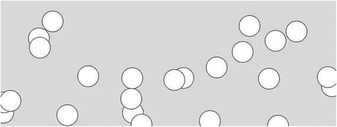
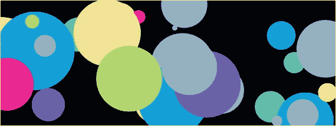

# 11.事件

在第 [6](06.html) 章中，我们学习了一个叫做`mouseIsPressed`的 p5.js 变量，当鼠标被按下时，它假定值为`true`，而对于所有其他情况，它假定值为`false`。

我们还了解到，这并不是一种捕捉用户输入的好方法，因为`draw`函数的执行速度会使这个变量很难以可靠的方式更新。在这一章中，我们将回顾在 p5.js 中处理用户输入的其他方法，也就是解决这个问题的事件。使用事件，我们可以在`draw`函数循环之外捕获用户输入。

在 p5.js 中有许多事件函数，我们可以声明它们来利用事件系统。这里我们将关注两个事件函数:`mousePressed`和`keyPressed`事件函数。

## 使用鼠标按下

这个想法类似于`draw`和`setup`函数，我们用这个特殊的名字声明这个函数，p5.js 以一种特殊的方式处理它(就像`setup`和`draw`函数一样)。

在 p5.js 代码中，我们在名称`mousePressed`下声明的函数在每次按下鼠标按钮时被触发。让我们重写之前的例子，使用变量`mouseIsPressed`来使用`mousePressed`事件函数(清单 [11-1](#Par6) )。

```js
var toggle = true;

function setup() {
       createCanvas(800, 300);
       rectMode(CENTER);
}

function draw() {
       // display a different bg color based on the toggle value
       if (toggle === true) {
             background(1, 186, 240);
       } else {
             background(250, 150, 50);
       }

       // declaration of variables
       var x = width / 2;
       var y = height / 2;
       var size = 200;

       if (frameCount < 60) {
             size = size + frameCount;
       } else {
             size = size + 60;
       }

       // circle
       fill(237, 34, 93);
       noStroke();
       ellipse(x, y, size, size);

       // rectangle
       fill(255);
       rect(x, y, size*0.75, size*0.15);
}

function mousePressed() {
       toggle = !toggle; // change the toggle value to be opposite.
}

Listing 11-1Using mousePressed event function

```

嗯，这是一个简单的重构！我们只是声明了一个我们自己不执行的函数。每当相应的动作发生时，执行由 p5.js 处理。

还有很多其他的事件函数。完整列表可在 [`https://p5js.org/reference/#group-Events`](https://p5js.org/reference/%23group-Events) 找到。

## 使用按键

另一个值得学习的事件函数是`keyPressed`函数。顾名思义，每当按下一个键时，`keyPressed`功能就会被触发。在清单 [11-2](#Par10) 中，让我们在一个全新的草图中快速测试一下它是如何工作的。

```js
function setup() {
       createCanvas(800, 300);
}

function draw() {
        background(220);
}

function keyPressed() {
       console.log('pressed');
}

Listing 11-2Using the keyPressed function

```

在这个例子中，每次我们按下一个键，我们都会在控制台上看到一条消息“pressed”。在清单 [11-3](#Par12) 中，让我们看一个更复杂的例子，每次按一个键都会在画布中创建一个形状。

```js
var pressed;

function setup() {
       createCanvas(800, 300);
       background(220);
}

function draw() {
       if (pressed === true) {
             ellipse(
                   random(width),
                   random(height),
                   50,
                   50
             );
       }
       pressed = false;
}

function keyPressed() {
       pressed = true;
}

Listing 11-3Drawing a shape

with every keypress

```

这些形状是在我们按下一个键后创建的(图 [11-1](#Fig1) )。



图 11-1

Output from Listing [11-3](#Par12)

注意一些事情。首先，我们把`background`函数移到了`setup`函数下面。这是为了确保我们绘制的形状保留在屏幕上。如果我们有一个在`draw`函数中调用的`background`函数，那么它会覆盖所有东西，覆盖每一帧，这对于这个用例来说是不理想的。此外，我们将`ellipse`函数调用分布在几行代码中，同样是为了增加可读性。

我们有一个全局变量叫做`pressed`。每按一次键，我们就将这个全局变量的值设置为`true`。当这种情况发生时，`draw`函数会在屏幕上显示一个`ellipse`，因为条件语句已经执行。然后`draw`函数立即将`pressed`值再次设置为`false`，这样我们只得到一个椭圆。

在清单 [11-4](#Par17) 中，我们将对这个例子做一点改进，使它看起来更顺眼。目前，圆圈看起来有点太均匀，颜色有点太暗。我们将这样做，每次我们创建一个圆，它使用一个 0 到 200 之间的随机大小和一个预定义随机颜色列表中的随机颜色(图 [11-2](#Fig2) )。



图 11-2

Output from Listing [11-4](#Par17)

```js
var pressed;

var colors = [];

function setup() {
       createCanvas(800, 300);
       background(0);
       colors = [
             [245, 3, 155],
             [13, 159, 215],
             [148, 177, 191],
             [100, 189, 167],
             [242, 226, 133],
             [176, 230, 110],
             [123, 90, 240]
       ];
}

function draw() {
       noStroke();
       if (pressed === true) {
             var randomIndex = parseInt(random(colors.length), 10); // convert the given number to an integer
             var randomSize = random(200);

             fill(colors[randomIndex]);
             ellipse(
                   random(width),
                   random(height),
                   randomSize,
                   randomSize
             );
       }
       pressed = false;
}

function keyPressed() {
       pressed = true;
}

Listing 11-4Changing size and color

```

为了能够在每次按键时选择一种随机颜色，我们需要生成一个介于 0 和 colors 数组长度减 1 之间的随机`integer`。我们使用负 1，因为数组索引从 0 开始计数。

要生成 0 和数组长度减 1 之间的任意随机数，我们可以简单地将`random`函数写成`random(` `colors.length)`。这将最终生成一个介于 0 和之间的数，直到达到`colors`数组中的项目数(不包括该数)。然而，问题是生成的数字是浮点数，这意味着它有小数位。然而，我们需要一个整数来访问数组中的条目。所以我们需要把十进制数转换成整数。有几种方法可以解决这个问题。一种方法是使用 p5.js `floor`函数，它将给定的浮点数下舍入到最接近的整数。另一个解决方案是使用名为`parseInt`的原生 JavaScript 函数，它将给定的值转换成整数——如果该值可以转换的话。我们不能指望向它抛出一个字符串名称值，然后接收一个整数。

如清单 [11-5](#Par21) 所示，我们需要向`parseInt`函数传递第二个参数来设置计算将要发生的基数。这个基数几乎总是 10。在浮点数上使用`parseInt`函数看起来像这样。

```js
var num = parseInt(0.5, 10);
console.log(num); // will be 0.
Listing 11-5Using parseInt on a float number

```

然而，识别被按下的键只是问题的一部分。我们应该能够做的另一件事是识别用户按下了哪个按钮。在`keyPressed`函数中，理论上我们可以通过使用`keyCode`变量来识别任何被按下的键。一个`keyCode`变量以编码的方式保存用户按下的最后一个键，这样如果用户按下键‘a’，它将返回值‘65’，代表‘b’；66 '等…

由于 p5.js 是一个有用的库，这使得通过为它们提供预定义的变量来识别一些键变得更加容易，例如:`BACKSPACE`、`DELETE`、`ENTER`、`RETURN`、`TAB`、`ESCAPE`、`SHIFT`、`CONTROL`、`OPTION`、`ALT`、`UP_ARROW`、`DOWN_ARROW`、`LEFT_ARROW`、`RIGHT_ARROW`。

例如，清单 [11-6](#Par25) 提供了一小段代码，每当‘Enter’键被按下时，它就执行一个`console.log`语句。

```js
function setup() {
       createCanvas(800, 300);
}

function draw() {
       background(220);
}

function keyPressed() {
       if (keyCode === ENTER) {
             console.log('Enter Pressed');
       }
}

Listing 11-6Using keyCode values

```

使用`keyCode`变量，我们可以通过一点解码来识别哪个字母数字键被按下。但是还有另一个特别适合字母数字字符的变量，叫做`key`。`key`变量按原样存储被按下的字母数字键的值，这样更容易识别哪个键被按下了。

## 摘要

在这一章中，我们学习了一种更好的处理事件的方法，那就是事件函数。我们特别关注两个事件函数:`mousePressed`和`keyPressed`事件函数。

我们还学习了一些可以在`keyPressed`函数中使用的变量:`key`和`keyCode`。使用`key`使得识别字母数字按键更容易，而`keyCode`对于检测其他按键是理想的，因为它可以与 p5.js 变量进行比较，如`ENTER`、`SPACE`等。这使得识别这些按钮更加容易。

从 JavaScript 部分，我们了解了可以用来将类似数字的值(也包括表示数字的字符串)转换成整数的`parseInt`函数。

## 实践

在屏幕上画一个矩形，键盘箭头键可以控制矩形的位置。