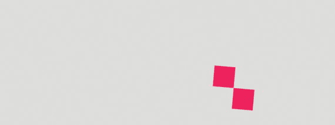
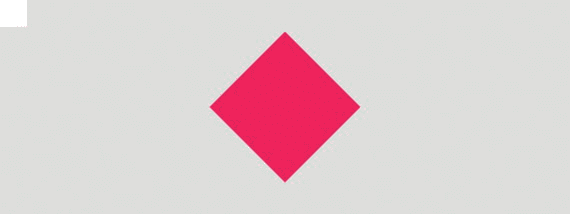

# 12.关于 p5.js 的更多信息

此时，我们几乎已经准备好进行我们的最终项目了:一个使用 JavaScript 和 p5.js 构建的交互式游戏！那是在下一章。在此之前，我想演示几个更有用的 p5.js 函数来扩展我们可以构建的东西的领域。

你有没有注意到我们如何利用现有的知识在屏幕上画出形状，但是我们不能真正地变换它们，比如围绕它们的中心旋转它们？这是我们可以构建的视觉效果的一大障碍，所以在这一章中，让我们学习如何在 p5.js 中进行转换来增强我们的能力。

## 旋转和平移

在使用过其他类型的绘图库之后，我应该说在 p5.js 中进行缩放、旋转和平移形状之类的转换可能有点不直观。清单 [12-1](#Par4) 和 [12-2](#Par6) 是演示如何使用 p5.js `rotate`函数的示例，该函数允许我们旋转形状。


图 12-1

Output for Listing [12-1](#Par4)

```js
function setup() {
       createCanvas(800, 300);
       rectMode(CENTER);
       noStroke();
}

function draw() {
       background(220);
       fill(237, 34, 93);
       rect(width/2, height/2, 50, 50);
       rect(width/2+50, height/2+50, 50, 50);
}

Listing 12-1Drawing rectangles

without rotation

```

目前，我们正在绘制两个彼此对角的矩形(图 [12-1](#Fig1) )。让我们利用`rotate`函数来看看会发生什么。

```js
function setup() {
       createCanvas(800, 300);
       rectMode(CENTER);
       noStroke();
}

function draw() {
       background(220);
       fill(237, 34, 93);
       rotate(5);
       rect(width/2, height/2, 50, 50);
       rect(width/2+50, height/2+50, 50, 50);
}

Listing 12-2Using the 
rotate function

```

你会注意到两个形状都从屏幕上消失了。如果您预期形状仅移动 5 度，这一定是一个令人困惑的结果。这是因为`rotate`函数在 p5.js 中的默认单位是弧度。我们可以通过使用带有`DEGREES` p5.js 变量的`angleMode`函数来使这个函数使用度数。如清单 [12-3](#Par8) 所示，在`setup`函数中做这个声明。

```js
angleMode(DEGREES);
Listing 12-3Using 
angleMode

```

现在事情以或多或少符合预期的方式运行。我们现在可以观察到，当我们调用`rotate`函数时，我们最终会旋转函数调用后出现的每个形状(清单 [12-4](#Par10) 和图 [12-2](#Fig2) )。


图 12-2

Output from Listing [12-4](#Par10)

```js
function setup() {
       createCanvas(800, 300);
       rectMode(CENTER);
       noStroke();
       angleMode(DEGREES);
}

function draw() {
       background(220);
       fill(237, 34, 93);
       rotate(5);
       rect(width/2, height/2, 50, 50);
       rect(width/2+50, height/2+50, 50, 50);
}

Listing 12-4Using rotate with angleMode

```

另一件要注意的事情是，旋转发生在原点周围，即画布的左上角。然而，当我们控制形状时，我们通常喜欢让它们绕着原点旋转。所以这个功能，照现在的样子，好像不是特别有用。

为了更好地控制`rotate`函数，我们应该研究一下`translate`函数。`translate`功能将对象从原点移动给定的 x 和 y 平移量。在清单 [12-5](#Par13) 中，让我们在当前的设置中使用它。结果如图 [12-3](#Fig3) 所示。



图 12-3

Output from Listing [12-5](#Par13)

```js
function setup() {
       createCanvas(800, 300);
       rectMode(CENTER);
       noStroke();
       angleMode(DEGREES);
}

function draw() {
       background(220);
       fill(237, 34, 93);
       translate(150, 0); // using translate function
       rotate(5);
       rect(width/2, height/2, 50, 50);
       rect(width/2+50, height/2+50, 50, 50);
}

Listing 12-5Using the 
translate function

```

现在发生的是`translate`函数将画布内的所有内容向右移动 150 像素。它移动整个坐标系，因为旋转也围绕原点右侧的 150px 发生，而不是从原点开始。

事不宜迟，列表 [12-6](#Par16) 和图 [12-4](#Fig4) 是关于如何围绕原点旋转事物。我认为展示它是如何做的比解释它更容易。我们现在将使用单一的形状。


图 12-4

Output from Listing [12-6](#Par16)

```js
function setup() {
       createCanvas(800, 300);
       rectMode(CENTER);
       noStroke();
       angleMode(DEGREES);
}

function draw() {
       background(220);
       fill(237, 34, 93);

       // rotating the shape around it's origin
       translate(width/2, height/2);
       rotate(45);
       rect(0, 0, 100, 100);
}

Listing 12-6Rotating around the origin

```

在这个例子中，我们像往常一样绘制一个形状，但是使用`translation`函数来设置它的 x 和 y 坐标，而不是将这些值直接输入到形状绘制函数中。这样做，当结合使用`rectMode`功能时，允许我们绘制中心位于原点的形状。基本上，我们从在原点绘制形状开始，因为所有的变换函数都相对于该点起作用。然后我们使用`translate`和`rotate`功能将形状移动到想要的位置和角度。使用这种方法，我们需要记住在`translate`函数后调用`rotate`，否则旋转仍然会相对于原始原点发生，这可能不是我们想要的。

一般来说，这种方法和使用转换函数的缺点是，从这一点开始，我们绘制的所有东西都将使用这个新的原点。解决这个问题的方法是使用`push`和`pop`函数。

## 推动和弹出

p5.js `push`函数允许我们创建一个新的状态，而`pop`函数将状态恢复到以前的状态。这允许我们对单个对象应用完全不同的设置，而不用担心这些设置是否会影响后面的形状，只要我们在`push`和`pop`调用之间做所有的事情。同样，在示例中更容易看出这一点(列表 [12-7](#Par21) 和图 [12-5](#Fig5) )。

根据我们当前的设置，我们在`translate`和`rotate`函数后绘制的所有东西都将应用 45 度旋转。


fgura 12-5

Output from Listing [12-7](#Par21)

```js
function setup() {
       createCanvas(800, 300);
       rectMode(CENTER);
       noStroke();
       angleMode(DEGREES);
}

function draw() {
       background(220);

       translate(width/2, height/2);
       rotate(45);

       // pink rectangle
       fill(237, 34, 93);
       rect(0, 0, 150, 150);

       // white rectangle
       fill(255, 255, 255);
       rect(0, 0, 75, 75);
}

Listing 12-7Translate function with multiple shapes

```

在清单 [12-8](#Par23) 中，让我们在这里实现`push`和`pop`函数，这样我们就可以隔离我们正在应用于更大矩形的变换。结果见图 [12-6](#Fig6) 。



图 12-6

Output for Listing [12-8](#Par23)

```js
function setup() {
       createCanvas(800, 300);
       rectMode(CENTER);
       noStroke();
       angleMode(DEGREES);
}

function draw() {
       background(220);

       // translation and rotation will be contained in between
       // push and pop function calls.
       push();
       translate(width/2, height/2);
       rotate(45);
       // pink rectangle
       fill(237, 34, 93);
       rect(0, 0, 150, 150);
       pop();

       // white rectangle
       fill(255, 255, 255);
       rect(0, 0, 75, 75);
}

Listing 12-8Using the push and pop functions

```

太棒了！无论我们在`push`和`pop`函数之间做什么，都不会影响这些函数调用之外的任何东西。需要注意的是，我们总是一起调用`push`和`pop`函数。使用一个而不使用另一个没有任何意义。

在清单 [12-9](#Par26) 中，让我们更新我们的例子，这样我们仍然可以将粉色矩形平移到中间，但是对它应用不同的旋转值。

```js
function setup() {
       createCanvas(800, 300);
       rectMode(CENTER);
       noStroke();
       angleMode(DEGREES);
}

function draw() {
       background(220);

       push();
       translate(width/2, height/2);
       rotate(45);
       // pink rectangle
       fill(237, 34, 93);
       rect(0, 0, 150, 150);
       pop();

       push();
       translate(width/2, height/2);
       rotate(30);
       // white rectangle
       fill(255, 255, 255);
       rect(0, 0, 75, 75);
       pop();
}

Listing 12-9Applying different translations to different shapes

```

如果您发现自己希望 p5.js 转换没有这么复杂，您可以尝试构建自己的函数来处理和抽象掉复杂性。清单 [12-10](#Par28) 提供了一个示例矩形函数，它接受第五个参数，即旋转参数。

```js
function rectC(x, y, width, height, rotation) {
       if (rotation === undefined) {
             rotation = 0;
       }
       push();
       translate(x, y);
       rotate(rotation);
       rect(0, 0, width, height);
       pop();
}
Listing 12-10Declaring a custom function to handle transformations

```

这里，我们正在创建名为`rectC`的矩形绘制函数，它包装了原始的`rect`函数，但是在内部使用`push`和`pop`来保存状态和设置转换，并且它接受一个可选的旋转参数。如果没有提供旋转参数，那么它将假设值为`undefined`。如果是这样的话，我可以将旋转值设置为 0。清单 [12-11](#Par30) 是前一个例子的重构，以利用这个函数。请注意，这次它更简洁了。

```js
function setup() {
       createCanvas(800, 300);
       rectMode(CENTER);
       noStroke();
       angleMode(DEGREES);
}

function draw() {
       background(220);

       // pink rectangle
       fill(237, 34, 93);
       rectC(width/2, height/2, 150, 150, 45);

       // white rectangle
       fill(255, 255, 255);
       rectC(width/2, height/2, 75, 75, 30);
}

function rectC(x, y, width, height, rotation) {
       // if rotation value is not provided assume it is 0
       if (rotation === undefined) {
             rotation = 0;
       }
       push();
       translate(x, y);
       rotate(rotation);
       rect(0, 0, width, height);
       pop();
}

Listing 12-11Using a custom function to handle transformations

```

## 摘要

使用绘图库时，能够变换形状变得非常重要。在本章中，我们看到了 p5.js `transform`函数是如何工作的。我们学习了`translate`和`rotate`函数。我们还学习了`angleMode`函数，它让我们设置`rotate`函数使用的单位。

然后，我们学习了`push`和`pop`函数，并了解了如何将它们与转换函数结合使用，以隔离状态并将转换应用于各个形状。虽然这些函数对学习 JavaScript 并不重要，但我发现在使用 p5.js 时了解它们是非常必要的。

## 实践

在进入下一章之前，尝试自己制作一些很酷的东西，我们将一起制作一个互动游戏！