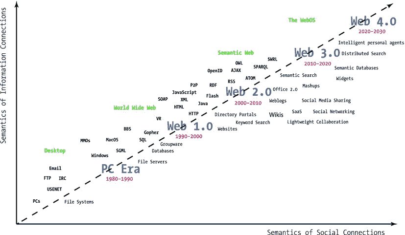
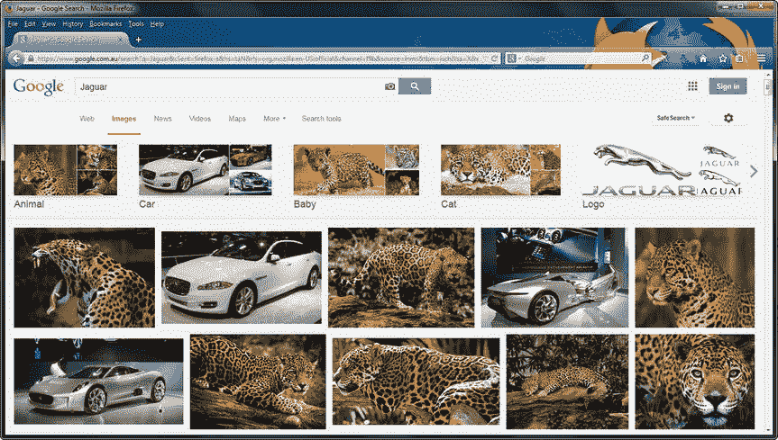
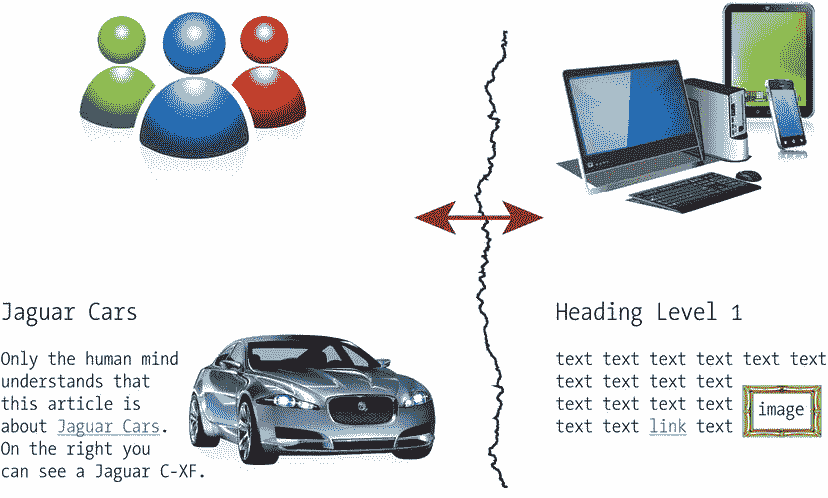
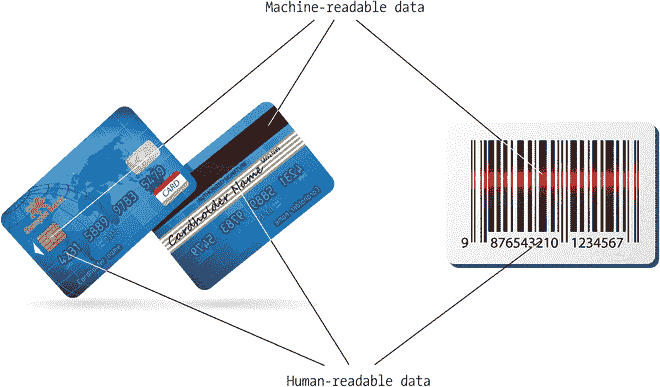
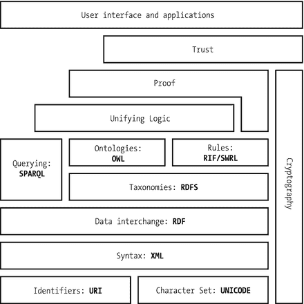
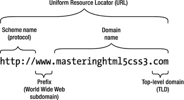

# 一、语义网简介

传统网站的内容仅是人类可读的，这不适于自动处理，并且在搜索相关信息时效率低下。Web 数据集可以被视为彼此不相关联的孤立的数据孤岛。这种限制可以通过使用强大的格式来组织和发布数据来解决，这些格式可以为网页内容添加结构和意义，并将相关数据相互链接。计算机可以更好地“理解”这些数据，这对任务自动化很有用。

## 语义网

虽然二进制文件通常包含机器可读的元数据，如 JPEG 图像中的快门速度 1 或 MP3 音乐文件中的专辑名称，但传统网站的文本内容不能被自动化软件代理解释(即不理解)。为软件代理提供语义(含义)的网站形成了语义网，这是 21 世纪初引入的传统网络的扩展。语义网是 Web 2.0 [3]和 Web 3.0 [4]的一个主要方面。Web 2.0 是一个总括术语，用于描述即时消息、IP 语音、维基、博客、论坛、社交媒体门户和网络联合背后的一系列技术。下一代网络被称为 Web 3.0，这是一个涵盖定制、语义内容和更复杂的人工智能网络应用的总称，包括计算机生成的内容(见图 1-1 ) 。

图 1-1。

The evolution of the Web [5] Caution

语义这个词在网络上的其他上下文中也有使用。例如，在 HTML5 中有语义的(换句话说，有意义的)结构化元素，但是这个表达式指的是元素的“意义”。在这种情况下，语义一词将元素的“含义”与旧 HTML 版本的通用元素(如“无意义的”`div`)进行了对比，如`section`(主题分组)。标记元素的语义不应该与语义 web 上使用的元数据注释和 Web 本体的语义(换句话说，机器可处理性)相混淆。后者可以提供比标记元素更复杂的数据。

与传统的 Web(“文档 Web”)相比，语义 Web 包括“数据 Web”[6]，它连接“事物” 2 (代表真实世界的人和物体)，而不是对计算机毫无意义的文档。语义网的机器可读数据集用于各种网络服务[7]，如搜索引擎、数据集成、资源发现和分类、编目、智能软件代理、内容评级和知识产权描述[8]、博物馆门户网站[9]、社区网站[10]、播客[11]、大数据处理[12]、业务流程建模[13]和医学研究。在语义网上，可以从看似不相关的领域自动检索数据，以便组合它们，找到关系，并做出发现[14]。

### 结构数据

传统的网站依赖于标记语言作为文档结构，依赖于样式表作为外观，依赖于脚本作为行为，但是内容只能由人类阅读。例如，当在网络上搜索“捷豹”时，传统的搜索引擎算法并不总是能够区分英国豪华车和南美掠夺者(图 1-2 )。

图 1-2。

Traditional web search algorithms rely heavily on context and file names

一个典型的网页包含结构化元素、格式化文本，甚至一些多媒体对象。默认情况下，网站设计者创建的标题、文本、链接和其他网站组件对计算机来说是没有意义的。虽然浏览器可以显示基于标记的 web 文档，但只有人类的大脑才能解释信息的含义，因此计算机和人类之间的理解存在巨大差距(见图 1-3 )。即使为图像指定了替换文本(`img`或`figure` 3 元素上具有描述性值的`alt`属性)，数据也不是结构化的或链接到相关数据，并且传统网页段落的人类可读的单词不与任何特定的软件语法或结构相关联。如果没有上下文，网站提供的信息对搜索引擎来说可能是模糊的。

图 1-3。

Traditional web site contents are meaningless to computers

机器可读数据的概念并不新鲜，也不仅限于网络。想想信用卡或条形码，它们都包含人类可读和机器可读的数据(图 1-4 )。然而，一个人或一个产品有不止一个标识符，这可能会引起歧义。

图 1-4。

Human-readable and machine-readable data

即使是遵循严格语法规则的格式良好的 XML 文档，在机器可处理性方面也有严重的局限性。例如，如果在`<SLR>`和`</SLR>`之间定义了一个 XML 实体，那么 SLR 代表什么？它可以指单镜头反光相机、自动装弹步枪、服务级报告、系统级需求、斯里兰卡卢比等等。

通过将有组织的(结构化的)数据添加到网站，作为标记注释或专用的外部元数据文件，并将它们链接到其他相关的结构化数据集，可以使内容成为机器可处理的和明确的。除了其他好处之外，结构化数据文件比传统的网站支持更广泛的任务，处理起来也更有效率。结构化数据格式已经在计算中使用了几十年，尤其是在 Access 和 SQL 关系数据库中，在这些数据库中可以执行查询来有效地检索信息。因为有直接将关系数据库映射到核心语义网技术的标准，公开不可用的数据库现在可以在语义网上共享[15]。市场上也有基于语义网标准的商业数据库软件包(5Store、AllegroGraph、BigData、Oracle、OWLIM、Talis Platform、Virtuoso 等)[16]。

与关系数据库相比，web 上的大多数数据存储在(X)HTML 文档中，这些文档包含要在 Web 浏览器中呈现为格式化文本、图像和多媒体对象的非结构化数据。发布非结构化数据对于一般目的来说是令人满意的；然而，存储在传统 web 文档中或与之相关联的大量数据不能以这种方式处理。用来描述人与人之间的社会联系的数据就是一个很好的例子，它应该包括用传统 Web 的超链接无法表达的关系类型和多个关系方向[17]。

语义标注的真正好处是人类可以浏览传统的 web 文档，而语义 Web 爬虫可以处理机器可读的标注来分类数据实体，发现实体之间的逻辑链接，建立索引，以及创建导航和搜索页面。

## 语义 Web 组件

结构化数据处理依赖于提供知识领域(感兴趣的领域、学科)内的概念、术语和关系的正式描述的技术。知识表示和推理是人工智能(AI)领域，用于以计算机系统可以用来解决复杂任务的机器可读形式表示信息。分类法或受控词汇表是可以用作元数据元素值的术语的结构化集合。例如，事件词汇表可用于以机器可读的格式描述音乐会、讲座和节日，而组织词汇表适用于发布关于学校、公司或俱乐部的机器可读元数据。受控词汇表是映射概念及其关系的概念数据模式(数据模型)的一部分。

最广泛采用的知识管理标准是资源描述框架(RDF)、网络本体语言(OWL)和简单知识组织系统(SKOS)。知识组织系统(KOS)用于处理权威列表、分类、主题词表、主题地图、本体等等。Web 本体是形式化的概念结构，换句话说，是领域中的概念集合以及它们之间的关系的复杂知识表示。命名空间机制用于通过指向一个外部词汇表来揭示标签和属性的含义，该外部词汇表以机器可处理的格式描述规程的概念，扩展了标记语言的词汇表(元素和属性的集合)。例如，智能手机本体以机器可处理的格式定义了智能手机的所有功能以及这些功能之间的关系，以便软件代理可以通过指向本体文件来“理解”用于在网页上注释单词的任何这些功能的含义。Web 本体使得以机器可读的格式描述任何主题的复杂语句成为可能。语义网的架构由“语义网栈”来说明，它显示了标准的层次结构，其中每一层都依赖于下面的层(见图 1-5 )。

图 1-5。

The Semantic Web Stack

虽然前面的数据格式主要是机器可读的，但它们可以从人类可读的网页链接，或者作为语义注释集成到人类可读的网页中，例如微格式、RDFa 或 HTML5 微数据。

### 本体论

本体论(ontology)一词最初在哲学中被引入，是为了研究存在的本质。在计算机科学中，本体是指通过数据模型来描述我们世界的一部分，如一个组织、一个研究项目、一个历史事件、我们的同事、朋友等。，以机器可读的方式，通过正式定义一组类(概念)、属性(属性)、关系类型和实体(个体、实例)。最先进的本体语言(如 OWL)支持以下组件:

*   类:抽象的组，对象的集合或集合，对象类型。类通常表示其成员共享公共属性的组或类。类的层次结构表现为较高级别的(超类或父类)和较低级别的(子类或子类)。例如，一个公司可以表示为一个类，其中包含部门和员工等子类。
*   属性:以对象和类为特征的方面、属性、特征或参数
*   个体:实例或对象。例如，如果我们的域覆盖公司，每个员工都是一个个体。
*   关系:类之间、个体之间、个体和类之间、单个对象和集合之间或者集合之间的逻辑联系
*   功能术语:由某些关系形成的复杂结构，可以用来代替语句中的单个术语
*   限制:正式定义的有效值的限制或范围
*   规则:If-then 语句(先行-结果句)定义逻辑推理
*   公理:逻辑形式的断言，与规则一起，形成了本体描述的整体理论。不同于生成语法或形式逻辑中公理的定义，其中公理仅包括被定义为先验知识的陈述，语义 Web 本体的公理还包括从公理陈述导出的理论。公理用于对类或实例的值施加约束，因此公理一般用基于逻辑的语言来表达。公理适用于验证本体的一致性。
*   事件:属性或关系更改

#### 本体工程

本体工程是计算机科学的一个领域，它涵盖了构建本体的方法和方法论。语义 Web 本体的目的是实现一个公共的和共享的知识，准备在应用之间传输，提供跨不同领域的组织或同一领域的不同视图的互操作性。本体转换是开发新的本体来处理现有本体的新需求，以达到新的目的。从同一个知识领域的两个或多个本体创建一个新的单个连贯本体被称为本体合并。本体集成是从来自不同知识领域的两个或多个源本体创建一个新的本体。本体映射是定义不同本体中实体之间语义关系的一种形式表达。本体对齐是在两个或更多本体之间创建一致且连贯的链接的过程，其中第一本体的陈述确认第二本体的陈述。

### 推理

自动发现看似不相关的结构化数据之间的关系被称为推理。自动生成的新关系基于词汇表中定义的结构化数据和附加信息，例如一组规则。新的关系要么显式声明，要么通过查询返回。作为一个例子，如果我们声明“不可饶恕是一部西部片”，而一个本体声明“每部西部片都是一部电影”，语义 Web 代理可以自动推断出声明“不可饶恕是一部电影”，这原本是没有声明的。

## 语义网特征

语义网有许多与众不同的特点，这些特点在传统网站上很少见到或根本没有使用。例如，大部分数据是以明确声明的开放许可发布的，允许真正免费的数据共享和分发。正式定义的数据连接使自动知识发现成为可能，同时还能进行准确的语句验证。每一个对象和功能都与一个网址相关联，因此您可以引用几乎所有内容，从表格单元格到图像或两个人的友谊。

### 免费、开放的数据仓库

> Open data and content can be freely used, modified and shared by anyone for any purpose.

—OpenDefinition.org

> 

自动化和数据处理依赖于数据访问，因此“开放数据”是语义网的一个基本特征。已经有数百个政府组织、企业和个人将机器可读的结构化数据作为开放数据( [`https://data.cityofchicago.org`](https://data.cityofchicago.org/) 、 [`http://data.alberta.ca`](http://data.alberta.ca/) 、 [`http://data.gov.uk`](http://data.gov.uk/) 等)发布。)，尽管并不是所有的都明确地提供了一个开放许可，使数据真正“开放”。语义 Web 应用也受益于开放 API、开放协议、开放数据格式和开源软件工具来重用、混合和重新发布数据。在语义 Web 上，世界上的人、产品、服务和对象的机器可读数据是开放的和可访问的，无需注册和支付会员费或订阅费，软件代理可以代表您自动访问这些数据。

### 适应性信息

在传统的 web 上，每个 Web 文档都是由一个人或一个团队编辑的，而语义 Web 文档是由一群人通过作为“全球数据库”的相关文档来编辑的因此，数据集更准确、更具关联性、更具描述性。信息不仅仅是关于页面，而是关于连接的和可重用的数据。数据的分类、重组和重用是语义网的一个基本概念。

### 唯一 Web 资源标识符

Web 资源可以通过唯一的 IP 地址来定位。然而，它们很难被记住，而且数量有限。这就是大多数情况下使用域名的原因。图 1-6 显示了一个域名和一个 URL 的关系: [`www.masteringhtml5css3.com`](http://www.masteringhtml5css3.com/) 是节点`masteringhtml5css3.com`的子域，是`com`(代表商业)域的子域。RFC 1035 [18]、RFC 1123 [19]和 RFC 2181 [20]定义了域名语法规则。

图 1-6。

The domain within the URL

子域树最多可以包含 127 级。每个标签最多可包含 63 个字符。根据 RFC 2181，域名的全长是 253 个字符。传统域名不能包含基于拉丁字母的带有音调符号的字符、非拉丁字符或文字。随着国际化域名(IDN)的引入，可以用本地字母和文字表示多种语言的名称和单词。

统一资源标识符(URI)是在互联网上标识名称或资源的字符串(RFC 2396 [21])。URIs 可以被分类为统一资源定位符(URLsRFC 1738 [22])、统一资源名称(urn)或两者。URN 定义了资源的身份，而 URL 提供了查找资源的方法(包括协议和路径)。URIs 经常被错误地用作 URL 的同义词，尽管 URI 是一个更广泛的术语(RFC 3305 [23])。URN 和 URL 都是 URI 的子集，但它们通常是不相交的集合。URL 最著名的例子是万维网上的网站地址。清单 1-1 显示了通用的 URL 语法。

Listing 1-1\. URL Syntax

`protocol://domain:port/path?query_string#fragment_identifier`

该协议后跟一个冒号。URL 的其他部分取决于所使用的方案。通常，有一个域名或 IP 地址、一个可选的端口号和一个可选的资源或脚本路径。PHP 或 CGI 脚本之类的程序可能有一个查询字符串。URL 的结尾可以是一个可选的片段标识符，它以数字符号(`#`)开头，在标记语言中，它指向通过提供的路径可用的文档的一部分。片段标识符在语义网上被广泛用于区分文件和它所代表的实体(例如，一个人和描述他/她的文件或者一本书和描述它的文件)。片段标识符的这种使用提供了无限数量的唯一标识符，而不考虑域名的有限选择。清单 1-2 展示了一个例子，其中`http`是协议， [`www.masteringhtml5css3.com`](http://www.masteringhtml5css3.com/) 是域，URL 标识一本书而不是存储在`metadata`目录中的文件`webstandardsbook.rdf`。

Listing 1-2\. A Typical URL with Fragment Identifier

[`http://www.masteringhtml5css3.com/metadata/webstandardsbook.rdf#book`](http://www.masteringhtml5css3.com/metadata/webstandardsbook.rdf#book)

因为许多 URL 组件是可选的，所以它们中的一个或多个通常会被省略。

为了避免注册和更新域名的不便并解决不是每个用户都有他/她自己的域名的问题，可以将网址重定向(通常使用 302 HTTP 重定向)到 web 上的中间和更持久的位置，而不是文件或目录的实际物理位置。这样的 URL 被称为持久统一资源定位器(PURLs)。官方采购在 [`https://purl.org`](https://purl.org/) 登记。许多语义词汇和本体使用 PURLs。本体列在`ontology`目录下，例如 [`http://purl.org/ontology/vidont/`](http://purl.org/ontology/vidont/) 。

## 摘要

在这一章中，你了解到传统网站的一个主要限制是它们无组织的和孤立的内容，这些内容主要是为了人类的理解而创建的。您已经熟悉了语义 Web 的基本概念、主要应用领域以及结构化数据处理的效率。您知道核心语义 Web 组件，并且理解许多标准依赖于其他技术。您熟悉独特的语义 Web 特性，例如开放许可、带有自动推断语句和知识发现的分散数据存储，以及与所表示的每一点知识相关联的唯一 URI 标识符。

下一章将向你介绍用机器可处理的标准来表示信息的知识表示和推理。

## 参考

Hausenblas, M., Adida, B., Herman, I. (2008) RDFa—Bridging the Web of Documents and the Web of Data. Joanneum Research, Creative Commons, World Wide Web Consortium. [`www.w3.org/2008/Talks/1026-ISCW-RDFa/`](http://www.w3.org/2008/Talks/1026-ISCW-RDFa/) . Accessed 18 January 2015.   Berners-Lee, T. (2001) Business Model for the Semantic Web. World Wide Web Consortium. [`www.w3.org/DesignIssues/Business`](http://www.w3.org/DesignIssues/Business) . Accessed 18 January 2015.   Ankolekar, A., Krötzsch, M., Tran, T., Vrandečić, D. The Two Cultures: Mashing Up Web 2.0 and the Semantic Web. Web Semantics: Science, Services and Agents on the World Wide Web 2008, 6(1):70–75.   Shannon, V. (2006) A “more revolutionary” Web. International Herald Tribune. The New York Times Company. `www.nytimes.com/2006/05/23/technology/23iht-web.html?scp=1&sq=A+%27more+revolutionary%27+Web&st=nyt`. Accessed 18 January 2015.   Spivack, N. (2015) Web 3.0: The Third Generation Web Is Coming. [`http://lifeboat.com/ex/web.3.0`](http://lifeboat.com/ex/web.3.0) . Accessed 16 March 2015.   Herman, I. (ed.) (2009) How would you define the main goals of the Semantic Web? In: W3C Semantic Web FAQ. World Wide Web Consortium. [www.​w3.​org/​2001/​sw/​SW-FAQ#swgoals](http://www.w3.org/2001/sw/SW-FAQ#swgoals). Accessed 18 January 2015.   Sbodio, L. M., Martin, D., Moulin, C. Discovering Semantic Web services using SPARQL and intelligent agents. Web Semantics: Science, Services and Agents on the World Wide Web 2010, 8(4): 310–328.   Herman, I. (2009) W3C Semantic Web Frequently Asked Questions. World Wide Web Consortium. [`www.w3.org/RDF/FAQ`](http://www.w3.org/RDF/FAQ) . Accessed 18 January 2015.   Hyvönen, E., Mäkelä, E., Salminen, M., Valo, A., Viljanen, K., Saarela, S., Junnila, M., Kettula, S. MuseumFinland—Finnish museums on the Semantic Web. Web Semantics: Science, Services and Agents on the World Wide Web 2005, 3(2–3): 224–241.   Bojārs, U., Breslin, J. G., Finn, A., Decker, S. Using the Semantic Web for linking and reusing data across Web 2.0 communities. Web Semantics: Science, Services and Agents on the World Wide Web 2008, 6(1): 21–28.   Celma, Ò., Raimond, Y. ZemPod: A Semantic Web approach to podcasting. Web Semantics: Science, Services and Agents on the World Wide Web 2008, 6(2): 162–169.   Saleem, M., Kamdar, M. R., Iqbal, A., Sampath, S., Deus, H. F., Ngomo, A.-C. Big linked cancer data: Integrating linked TCGA and PubMed. Web Semantics: Science, Services and Agents on the World Wide Web 2014, `http://dx.doi.org/10.1016/j.websem.2014.07.004`.   Oinonen, K. (2005) On the road to business application of Semantic Web technology. Semantic Web in Business—How to proceed. In: Industrial Applications of Semantic Web: Proceedings of the 1st IFIP WG12.5 Working Conference on Industrial Applications of Semantic Web. International Federation for Information Processing. Springer Science+Business Media, Inc., New York.   Murphy, T. (2010) Lin Clark On Why Drupal Matters. Socialmedia. [`http://socialmedia.net/2010/09/07/lin-clark-on-why-drupal-matters`](http://socialmedia.net/2010/09/07/lin-clark-on-why-drupal-matters) . Accessed 9 September 2010.   Arenas, M., Bertails, A., Prud’hommeaux, E., Sequeda, J. (eds.) (2012) A Direct Mapping of Relational Data to RDF. [`www.w3.org/TR/rdb-direct-mapping/`](http://www.w3.org/TR/rdb-direct-mapping/) . Accessed 18 January 2015.   Clark, K. (2010) The RDF Database Market. Clark & Parsia, LLC. [`http://weblog.clarkparsia.com/2010/09/23/the-rdf-database-market/`](http://weblog.clarkparsia.com/2010/09/23/the-rdf-database-market/) . Accessed 18 January 2015.   Dertouzos, L. M., Berners-Lee, T., Fischetti, M. (1999) Weaving the Web: The Original Design and Ultimate Destiny of the World Wide Web by Its Inventor. Harper San Francisco, San Francisco.   Mockapetris, P. (1987) Domain names—Implementation and specification. RFC 1035\. The Internet Engineering Task Force. [`http://tools.ietf.org/html/rfc1035`](http://tools.ietf.org/html/rfc1035) . Accessed 18 January 2015.   Braden, R. (ed.) (1989) Requirements for Internet Hosts—Application and Support. RFC 1123\. The Internet Engineering Task Force. [`http://tools.ietf.org/html/rfc1123`](http://tools.ietf.org/html/rfc1123) . Accessed 18 January 2015.   Elz, R., Bush, R. (1997) Clarifications to the DNS Specification. RFC 2181\. The Internet Engineering Task Force. [`http://tools.ietf.org/html/rfc2181`](http://tools.ietf.org/html/rfc2181) . Accessed 18 January 2015.   Berners-Lee, T., Fielding, R., Masinter, L. (1998) Uniform Resource Identifiers (URI): Generic Syntax. RFC 2396\. The Internet Society. [`http://tools.ietf.org/html/rfc2396`](http://tools.ietf.org/html/rfc2396) . Accessed 18 January 2015.   Berners-Lee, T., Masinter, L., McCahill, M. (eds.) (1994) Uniform Resource Locators (URL). RFC 1738\. The Internet Engineering Task Force. [`http://tools.ietf.org/html/rfc1738`](http://tools.ietf.org/html/rfc1738) . Accessed 18 January 2015.   Mealling, M., Denenberg, R. (eds.) (2002) Uniform Resource Identifiers (URIs), URLs, and Uniform Resource Names (URNs): Clarifications and Recommendations. RFC 3305\. The Internet Society. [`http://tools.ietf.org/html/rfc3305`](http://tools.ietf.org/html/rfc3305) . Accessed 18 January 2015.   Footnotes 1

流亡者或 XMP。有关更多信息，请参见 Leslie Sikos: Web 标准:掌握 HTML5、CSS3 和 XML(纽约，Apress，2014)。

  2

“物”的概念也用在其他上下文中，例如“物联网”(IoT)，它是嵌入了电子设备、软件和传感器的物理对象的网络，包括智能对象，例如可穿戴计算机，所有这些都连接到制造商和/或运营商和/或其他设备。

  3

这仅在(X)HTML5 中受支持。