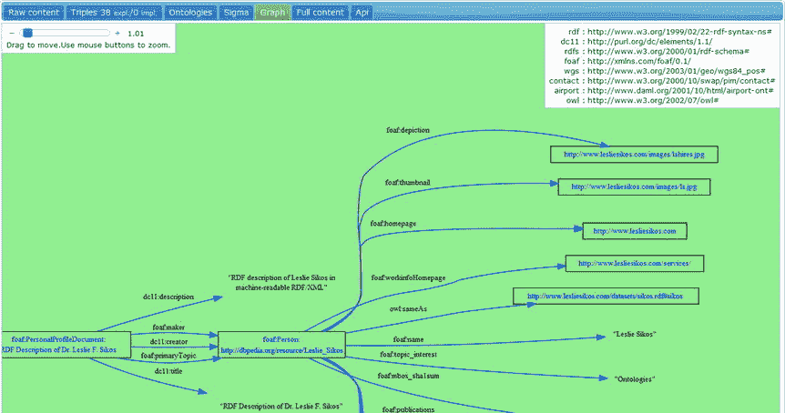
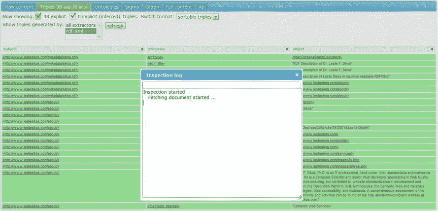

# 二、知识表达

为了提高网站的自动化处理能力，需要正式的知识表示标准，它不仅可以用来注释简单的机器可读数据的标记元素，而且可以用机器可处理的方式表达复杂的语句和关系。在理解了这些语句的结构以及它们在资源描述框架(RDF)中的序列化之后，可以有效地对结构化数据进行建模以及在标记中进行注释，或者将其写入单独的机器可读元数据文件中。用于建模和表示数据的正式定义使得高效的数据分析和重用成为可能。搜索引擎识别和处理的三种最常见的机器可读注释是 RDFa(属性中的 RDF)、HTML5 微数据和 JSON-LD，其中 HTML5 微数据是推荐的格式。机器可读注释通过外部词汇表用附加元素和属性扩展了 core (X)HTML 标记，外部词汇表包含知识表示领域的术语和属性，以及机器可读形式的属性之间的关系。本体可用于搜索、查询、索引和管理代理或服务元数据，并提高应用和数据库的互操作性。本体对于知识密集型应用尤其有用，在这些应用中，文本提取、决策支持或资源规划是常见的任务，在用于知识获取的知识库中也是如此。语义知识库收集定义感兴趣领域的最常见概念、它们之间的关系以及相关个体的模式。这些模式是在 RDFa、HTML5 微数据或 JSON-LD 以及链接的开放数据数据集的 RDF 文件中序列化的机器可读注释所使用的事实上的标准。

## 词汇和本体

语义网的受控词汇表收集了用于描述感兴趣的领域或关注的领域的概念和术语。本体是更复杂的、非常正式的术语定义、个体及其属性、对象组(类)以及个体之间的关系，适于以机器可读的形式描述与感兴趣的领域相关的几乎任何陈述。

例如，要以机器可读的格式声明一个人，我们需要一个具有“人”的正式定义的词汇表一个直接的选择是朋友的朋友(FOAF)词汇表，它有一个定义一个人的典型属性的`Person`类，包括但不限于`name`和`homepage`。如果我们用 XML 序列化编写这段代码，我们将得到清单 2-1 中的代码。

Listing 2-1\. Pseudocode for Defining the Class and a Property of a Resource

`<Person>`

`<name>Leslie Sikos</name>`

`</Person>`

这段代码提供了层次结构，推断出`Person`是类，`name`是属性；但是，这是断章取义。我们必须使用名称空间机制来声明哪个外部词汇表定义了这个类和属性。在 RDF/XML 序列化中，这可以使用形式为`xmlns:vocabulary_prefix="vocabulary_namespace:web_address"`的`xmlns`属性来完成，在我们的例子中是`xmlns:foaf="` [`http://xmlns.com/foaf/0.1/`](http://xmlns.com/foaf/0.1/) `"`，它指向位于 [`http://xmlns.com/foaf/0.1/`](http://xmlns.com/foaf/0.1/) 的 FOAF 名称空间。名称空间机制使得将 [`http://xmlns.com/foaf/0.1/`](http://xmlns.com/foaf/0.1/) 缩写为`foaf`(也称为前缀)，因此`foaf:Person`指的是 [`http://xmlns.com/foaf/0.1/Person`](http://xmlns.com/foaf/0.1/Person) `, foaf:homepage`到 [`http://xmlns.com/foaf/0.1/homepage`](http://xmlns.com/foaf/0.1/homepage) 等等(参见清单 2-2 )。

Note

这些链接通常是符号链接，并不总是指向每个单独属性的专用网页，有时会转发到名称空间的域。有些词汇表有名称空间地址机制，所有链接都直接指向机器可读词汇表文件的相应部分。并不总是提供外部词汇表属性的可读解释。在 FOAF 的情况下，单个属性地址的网址指向规范的网址( [`http://xmlns.com/foaf/spec/`](http://xmlns.com/foaf/spec/) )，而单个属性有自己的片段标识符，如`Person`属性的地址、 [`http://xmlns.com/foaf/spec/#term_Person`](http://xmlns.com/foaf/spec/#term_Person) 。

Listing 2-2\. Describing the Name of a Person Using a Class and a Property from a Vocabulary

[`http://xmlns.com/foaf/0.1/`](http://xmlns.com/foaf/0.1/)

`…`

`<foaf:Person>`

`<foaf:name>Leslie Sikos</foaf:name>`

`</foaf:Person>`

结构化数据的格式和序列化独立于词汇表定义，因此，例如，相同的 schema.org 参考可以用于 RDF、RDFa、HTML5 微数据和 JSON-LD。所需的词汇或本体取决于您想要表示的感兴趣的领域；然而，一些知识领域，比如人和书，可以用不止一个词汇表中的类和属性来描述。

### schema.org 词汇集

[`https://schema.org`](https://schema.org/) 涵盖了大约 300 个概念定义，是最常用的结构化数据标记模式集合之一。Schema.org 是由谷歌、雅虎推出的，以及 2011 年的必应。Schema.org 包含最常用概念的机器可读定义，使得注释动作、创造性作品、事件、服务、医学概念、组织、人、地点和产品成为可能。

类似于前面的例子，如果我们想要描述一本书，我们需要一个具有“书”的定义和典型的书属性的词汇表。如果我们想给书名添加一个比 schema.org 的`name`属性更具描述性的属性，我们可以使用 Dublin Core (DC)词汇表中的`title`属性，产生两个名称空间声明(参见清单 2-3 )。

Listing 2-3\. Describing a Book

`…`

`xmlns:schema="`[`http://schema.org/`](http://schema.org/)

`xmlns:dc="`[`http://purl.org/dc/terms/`](http://purl.org/dc/terms/)

`…`

`<schema:Book>`

`<dc:title>Web Standards: Mastering HTML5, CSS3, and XML</dc:title>`

`</schema:Book>`

这里，`schema:Book`缩写为 [`http://schema.org/Book`](http://schema.org/Book) ，是`Book`类的机读定义，而`dc:title`缩写为 [`http://purl.org/dc/terms/title`](http://purl.org/dc/terms/title) ，是`title`属性的机读定义。

最常见的 schema.org 类型(类)和属性在 [`http://schema.org/docs/gs.html#schemaorg_types`](http://schema.org/docs/gs.html#schemaorg_types) 收集，而属性的完整列表可在 [`http://schema.org/docs/full.html`](http://schema.org/docs/full.html) 获得。

### 常规、访问和结构化元数据

通用元数据，如摘要、创建者、日期、出版商、标题、网络资源(网站、图像、视频)的语言、物理资源(书籍、光盘)以及艺术品等对象，都可以使用 Dublin Core 进行描述。Dublin Core 元素被广泛部署在机器可读的注释中，用于 DMOZ  [1 ]，最大的多语言开放内容网页链接目录之一，以及 XMP 的 JPEG 图片元数据中。都柏林核心元素(`dc`)的命名空间为 [`http://purl.org/dc/elements/1.1/`](http://purl.org/dc/elements/1.1/) ，都柏林核心术语(`dcterms`)的命名空间为 [`http://purl.org/dc/terms/`](http://purl.org/dc/terms/) 。

可以使用互连数据集词汇表(VoID)中的术语来描述结构化数据集。VoID 涵盖了常规、访问和结构化元数据定义，以及结构化数据集之间的链接描述。VoID 的前缀是`void`，命名空间是`http://rdfs.org/ns/void#`。

### 人物词汇

一个人的特征和人与人之间的关系可以用各种受控词汇来描述，如表 2-1 中所总结的。

表 2-1。

Person Vocabularies

<colgroup><col> <col> <col> <col></colgroup> 
| 词汇 | 缩写 | 命名空间 | 典型用途 |
| --- | --- | --- | --- |
| `Person`来自 schema.org 的班级 | `schema:Person` | [`http://schema.org/Person`](http://schema.org/Person) | 名、姓、性别、隶属关系、奖项、国籍、尊称前缀或后缀、职称等。 |
| 朋友的朋友 | `foaf` | [`http://xmlns.com/foaf/0.1/`](http://xmlns.com/foaf/0.1/) | 人员、姓名、性别、主页 |
| 联系:日常生活的实用概念 | `contact` | [`http://www.w3.org/2000/10/swap/pim/contact`](http://www.w3.org/2000/10/swap/pim/contact) | 联系地点、个人头衔、母语、离你住所最近的机场 |
| 联系人 | `vcard` | `http://www.w3.org/2001/vcard-rdf/3.0#` | 电子名片 |
| 个人简历 | `bio` | [`http://vocab.org/bio/0.1/`](http://vocab.org/bio/0.1/) | 履历信息 |
| 关系词汇 | `relationship` | [`http://vocab.org/relationship/`](http://vocab.org/relationship/) | 人与人之间的关系(`friendOf`、`parentOf`、`spouseOf`等)。) |

### 书籍词汇

可以使用 [`http://schema.org/Book`](http://schema.org/Book) 中的属性精确描述图书，定义图书格式、页数、版权所有者、流派以及图书的其他特性。都柏林核心通常用于声明图书的通用元数据。图书的国际标准书号(ISBN)不仅可以用 schema.org 的`Book`类的`isbn`属性(定义在 [`http://schema.org/isbn`](http://schema.org/isbn) )来声明，还可以使用 URN 词汇表中的`isbn`属性来声明。你想读的书，你已经读过的书，或者你最喜欢的书都可以通过 [`http://www.ldodds.com/schemas/book/`](http://www.ldodds.com/schemas/book/) 名称空间使用阅读列表模式来描述。

### 棱镜:出版词汇

行业标准元数据发布要求(PRISM)描述了印刷、在线、移动和多媒体内容的许多组成部分，包括以下内容:

*   创作者、贡献者、版权所有者
*   地点、组织、主题、人物、事件、复制条件
*   出版日期，包括封面日期、张贴日期、卷数、数量
*   重新发布和重新使用的限制

PRISM 通常用于描述合作伙伴联合、内容聚合、内容再利用、资源发现、多渠道分发、内容归档、捕获权限使用信息、RSS、XMP 和网站的机器可读注释。PRISM 名称空间对于 PRISM 2.1 Basic 为 [`http://prismstandard.org/namespaces/basic/2.1/`](http://prismstandard.org/namespaces/basic/2.1/) (典型前缀:`prism`)，对于 PRISM 3.0 为 [`http://prismstandard.org/namespaces/prism-ad/3.0/`](http://prismstandard.org/namespaces/prism-ad/3.0/) (常用前缀:`prism-ad`)。

### GoodRelations:一个电子商务本体

电子商务事实上的本体是 GoodRelations ( `gr`)，适用于描述企业、产品、价格、功能、支付选项、营业时间等等。GoodRelations 的命名空间是`http://purl.org/goodrelations/v1#`。GoodRelations 被广泛部署，也被 Yahoo！还有百思买。

### 出版本体论

虽然出版物的通用元数据可以在 Dublin Core 中表达，但也有专门为描述出版物和引文而编写的本体。表 2-2 总结了四种部署最广泛的出版本体(法比奥、普罗、PSO 和 PWO)和四种引用本体(CiTO、BiRO、C4O 和 DoCO)，它们被称为语义出版和引用本体(SPAR)，以及书目本体(bibo)。

表 2-2。

Publication and Referencing Ontologies

<colgroup><col> <col> <col> <col></colgroup> 
| 本体论 | 缩写 | 命名空间 | 典型用途 |
| --- | --- | --- | --- |
| 书目本体论 | `bibo` | [`http://purl.org/ontology/bibo/`](http://purl.org/ontology/bibo/) | 引用，文献分类，描述文献，发行人，编辑，采访者，执行者，ISBN 等。 |
| 书目参考本体 | `biro` | [`http://purl.org/spar/biro/`](http://purl.org/spar/biro/) | 书目记录、参考文献、收藏和列表 |
| 引用计数和上下文表征本体 | `c40` | [`http://purl.org/spar/c4o/`](http://purl.org/spar/c4o/) | 引用数量、引用上下文 |
| 引文类型本体论 | `cito` | [`http://purl.org/spar/cito/`](http://purl.org/spar/cito/) | 引用的事实和修辞类型和性质(例如，共同的作者，一个出版物证实了另一个的结论) |
| 文档组件本体 | `doco` | [`http://purl.org/spar/doco/`](http://purl.org/spar/doco/) | 章、节、段、表、前言、词汇表等。 |
| FRBR 对齐的书目本体 | `fabio` | [`http://purl.org/spar/fabio/`](http://purl.org/spar/fabio/) | 摘要、文章、艺术作品、论文、博客帖子、会议记录 |
| 发布角色本体 | `pro` | [`http://purl.org/spar/pro`](http://purl.org/spar/pro) | 代理的角色(例如，作者、编辑、审阅者、出版商) |
| 发布状态本体 | `pso` | [`http://purl.org/spar/pso`](http://purl.org/spar/pso) | 出版状态(例如，提交的手稿，接受的手稿，证明) |
| 发布工作流本体 | `pwo` | [`http://purl.org/spar/pwo`](http://purl.org/spar/pwo) | 发布工作流程的阶段(例如，审核中) |

### DOAP:项目管理词汇

项目描述(DOAP)是描述软件项目的词汇，尤其是开源项目及其相关资源，包括参与者和 web 资源。DOAP 的命名空间是 [`http://usefulinc.com/doap/`](http://usefulinc.com/doap/) 。

### 许可词汇表

使用知识共享(`cc`)许可证可以很好地描述许可，例如版权信息、关于创造性作品的复制、分发和共享的许可和禁止，以及创作衍生作品。知识共享的命名空间是`http://creativecommons.org/ns#`。

### 媒体本体论

有专门用于媒体资源的本体，如音乐和视频文件，如表 2-3 所示。

表 2-3。

Media Ontologies

<colgroup><col> <col> <col> <col></colgroup> 
| 本体论 | 缩写 | 命名空间 | 典型用途 |
| --- | --- | --- | --- |
| 音乐本体论 | `mo` | [`http://purl.org/ontology/mo/`](http://purl.org/ontology/mo/) | 艺术家、作曲家、指挥、唱片、imdb、唱片、混音师、歌手、节奏等。 |
| 视频本体 | `vidont` | [`http://vidont.org/`](http://vidont.org/) | 电影属性(翻拍、续集、旁白等。)、视频文件属性(纵横比、音频编解码器、信箱模式、视频比特率、MAR 等。) |

### 在线社区词汇

在线社区的帖子、用户角色、线程、用户账户和用户组可以使用语义互连的在线社区(SIOC)来描述。SIOC 核心的命名空间是`http://rdfs.org/sioc/ns#`。

脸书使用脸书 OpenGraph ( `og`)的词汇让网页拥有和脸书上任何其他对象一样的功能。OpenGraph 的命名空间是`http://ogp.me/ns#`。

## 知识管理标准

最常用的知识管理标准是资源描述框架(RDF)、网络本体语言(OWL)和简单知识组织系统(SKOS)。

### 资源描述框架(RDF)

在语义网上，结构化数据集通常在资源描述框架(RDF)中表达，或者基于 RDF[2]。RDF 可以用来创建任何类型的 web 资源的机器可解释的描述，因为 RDF 文件可以用任意数量的外部词汇来扩展。事实上，RDF 和其他核心语义网标准，如 RDFS 和 OWL，都有它们自己的词汇表，这些词汇表通常相互结合，并使用其他词汇表进行扩展，以描述对象及其属性。然而，请记住，RDF 不仅仅是一个词汇表，因为它是一种功能齐全的语义数据建模语言。RDF 的名称空间是`http://www.w3.org/1999/02/22-rdf-syntax-ns#`

。

RDF 词汇表定义了 XML 文字值(`rdf:XMLLiteral`)、属性(`rdf:Property`)、RDF 语句(`rdf:Statement`)、RDF 列表(`rdf:List`)，以及替代容器(`rdf:Alt`)、无序容器(`rdf:Bag`)和有序容器(`rdf:Seq`)的类。`rdf:List`的一个实例是`rdf:nil`，代表空列表。RDF 词汇表还定义了一些属性，如`rdf:type`(`rdf:Property`的一个实例，用于表示资源是一个类的实例)、`rdf:first`(主题 RDF 列表中的第一项)、`rdf:rest`(主题 RDF 列表中在`rdf:first`之后的其余部分)、`rdf:value`(结构化值)、`rdf:subject`(RDF 语句的主题)、`rdf:predicate`(RDF 语句的谓词)和`rdf:object`(RDF 语句的对象)。

RDF 数据模型基于描述和表征资源(尤其是 web 资源)的语句，以称为 RDF 三元组或 RDF 语句的主-谓-对象(资源-属性-值)表达式的形式。谓语(性质)描述主语和宾语之间的关系。比如自然语言句子“Leslie 的主页是 [`http://www.lesliesikos.com`](http://www.lesliesikos.com/) ”可以表达为表 2-4 所示。三元组的所有元素都是由唯一的 URI 定义的资源(参见清单 2-4 )。

表 2-4。

An RDF Triple

<colgroup><col> <col> <col></colgroup> 
|   | RDF 数据模型 | RDF 三元组 |
| --- | --- | --- |
| 科目 | 莱斯利 | [`http://www.lesliesikos.com/metadata/sikos.rdf#lesliesikos`](http://www.lesliesikos.com/metadata/sikos.rdf#lesliesikos) |
| 述语 | “主页”的机器可读定义来自朋友的朋友(FOAF)外部词汇表 | [`http://xmlns.com/foaf/0.1/homepage`](http://xmlns.com/foaf/0.1/homepage) |
| 目标 | [`http://www.lesliesikos.com`](http://www.lesliesikos.com/) | [`http://www.lesliesikos.com`](http://www.lesliesikos.com/) |

Listing 2-4\. Describing a Person in RDF/XML

`<?xml version="1.0" encoding="UTF-8"?>`

`<rdf:RDF xmlns:rdf="``http://www.w3.org/1999/02/22-rdf-syntax-ns#``"`

`xmlns:foaf="`[`http://xmlns.com/foaf/0.1/`](http://xmlns.com/foaf/0.1/)

`<foaf:Person rdf:about="`[`http://www.lesliesikos.com/metadata/sikos.rdf#lesliesikos`](http://www.lesliesikos.com/metadata/sikos.rdf#lesliesikos)

`<foaf:homepage rdf:resource="`[`http://www.lesliesikos.com`](http://www.lesliesikos.com/)

`<foaf:family_name>Sikos</foaf:family_name>`

`<foaf:givenname>Leslie</foaf:givenname>`

`</foaf:Person>`

`</rdf:RDF>`

RDF 的`about`属性声明 RDF 语句的主题，在本例中是 [`http://www.lesliesikos.com/metadata/sikos.rdf#lesliesikos`](http://www.lesliesikos.com/metadata/sikos.rdf#lesliesikos) 。片段标识符`#lesliesikos`用于识别真实的人而不是文档(`sikos.rdf`)。那些值是网址的对象，比如一个人的主页，是使用 RDF 的`resource`属性声明的，与那些字符串文字(字符序列)相反，比如`Sikos`(FOAF 词汇表中`family_name`属性的值)。这个例子的语法被称为 RDF/XML 序列化(RDF/XML)，它是 RDF  [3 ]的标准语法，使用`application/rdf+xml`互联网媒体类型和`.rdf`或`.xml`文件扩展名。结构化数据集可以使用各种其他语法符号和数据序列化格式以 RDF 编写，例如，RDFa、JSON-LD、Notation3 (N3)、Turtle、N-Triples  [4 ]、TRiG  [5 ]和 TRiX  [6 ]，因此 RDF 三元组的语法因格式而异。例如，N3 语法没有 RDF/XML 序列化那么冗长，其中名称空间前缀由`@prefix`指令声明，URIs 由小于(`<`)和大于(`>`)符号分隔，三元组由分号(`;`)分隔(参见清单 2-5 )。

Listing 2-5\. Describing a Person in N3

`@prefix :     <``http://www.lesliesikos.com/metadata/sikos.rdf#`

`@prefix foaf: <`[`http://xmlns.com/foaf/0.1/`](http://xmlns.com/foaf/0.1/)

`@prefix rdf:  <``http://www.w3.org/1999/02/22-rdf-syntax-ns#`

`:lesliesikos a foaf:Person ;`

`foaf:givenname "Leslie" ;`

`foaf:family_name "Sikos" ;`

`foaf:homepage <`[`http://www.lesliesikos.com`](http://www.lesliesikos.com/)

速记符号可以用于最常见的谓词(见表 2-5 )。

表 2-5。

Shorthand Notation for Common Predicates

<colgroup><col> <col></colgroup> 
| 述语 | 简化符号 |
| --- | --- |
| <[`http://www.w3.org/1999/02/22-rdf-syntax-ns#type`](http://www.w3.org/1999/02/22-rdf-syntax-ns#type) | `a` |
| <[`http://www.w3.org/2002/07/owl#sameAs`](http://www.w3.org/2002/07/owl#sameAs) | `=` |
| <[`http://www.w3.org/2000/10/swap/log#implies`](http://www.w3.org/2000/10/swap/log#implies) | `=>`或`<=` |

这就是使用`a`声明人的 RDF 类型的原因。如果符号 3 代码在外部文件中，典型的文件扩展名是`.n3`。N3 的 MIME 类型和字符编码应该声明为`text/n3; charset=utf-8`。N3 语法中没有规定标记化和空白处理。用于解析相对 URIs 的基本 URIs 可以用`@base`指令设置，格式为`@base <` [`http://example.com/overview/`](http://example.com/overview/) `>`。字符串转义的几个 N3 规则来源于 Python，分别是`stringliteral`、`stringprefix`、`shortstring`、`shortstringitem`、`longstring`、`longstringitem`、`shortstringchar`、`longstringchar`。此外，还可以应用在另一个 RDF 序列化(N-Triples)中使用的`\U`扩展。合法的转义序列有`\newline`、`\\`(反斜杠、`\`)、`\’`(单引号、`’`)、`\"`(双引号、`"`)、`\n` (ASCII 换行，LF)、`\r` (ASCII 回车，CR)、`\t` (ASCII 水平制表符，Tab)、`\uhhhh`(BMP 中的 Unicode 字符)和`\U00hhhhhh`(平面 1-16 符号中的 Unicode 字符)。不能使用转义符`\a`、`\b`、`\f`和`\v`，因为 RDF 中不允许使用相应的字符。

N3 的一个子集是简洁的 RDF Triple 语言，通常被称为 Turtle。Turtle 提供了一种语法，以紧凑的文本形式描述 RDF 图，这种形式很容易开发。它是符号 3 (N3)的子集和 N-三元组的超集。Turtle 在语义 Web 开发人员中很流行，被认为是 RDF/XML 的易于阅读的替代品。海龟文件的典型文件扩展名是`.ttl`。海龟文件的字符编码应该是 UTF-8。乌龟的 MIME 类型是`text/turtle`。Turtle 得到了许多软件框架的支持，这些框架可以用来查询和分析 RDF 数据，比如 Jena、Redland 和 Sesame。Turtle 文件由一系列指令、代表三元组的语句和空行组成。在 Turtle 中，三元组可以写成一系列主-谓-宾术语，由空格分隔，以句号(。).URIs 用尖括号(`<>`)写，字符串文字用双引号(`""`)分隔，如`<``http://www.lesliesikos.com/metadata/sikos.rdf#``> <`[`http://xmlns.com/foaf/0.1/homepage`](http://xmlns.com/foaf/0.1/homepage)`> <`[`http://www.lesliesikos.com`](http://www.lesliesikos.com/)`>`。使用 URI 前缀声明`@PREFIX foaf: <` [`http://xmlns.com/foaf/0.1/`](http://xmlns.com/foaf/0.1/) `> .`，这可以缩写为`<``http://www.lesliesikos.com/metadata/sikos.rdf#``> foaf:homepage <`[`http://www.lesliesikos.com`](http://www.lesliesikos.com/)`> .`，其中`foaf:homepage`声明了 [`http://xmlns.com/foaf/0.1/`](http://xmlns.com/foaf/0.1/) 与`homepage`的串联，露出了原来的 URI [`http://xmlns.com/foaf/0.1/homepage`](http://xmlns.com/foaf/0.1/homepage) 。

图 2-1 将清单 2-5 的三元组表示为 RDF 图，这是一个有向的、带标签的图，其中的节点是资源和值 [7 ]。RDF 图的节点和谓词弧对应于节点元素和属性元素。默认的节点元素是`rdf:Description`，它经常被用作 RDF/XML 中 RDF 语句的通用容器。为了给 RDF 语句添加上下文并使它们具有全局可解释性，RDF 三元组有时与图的名称存储在一起，称为 quads(主谓宾图名)，这将在后面的章节中演示。


图 2-1。

A simple RDF graph

该示例可以用其他外部词汇表的属性进行扩展，但概念保持不变。一旦创建了 RDF 文件，就有了一个可以上传到网站的机器可读的元数据文件。语义软件代理可以找到并检索这些文件中的信息(见图 2-2 )，以视觉上吸引人的方式显示人类可读的部分(见图 2-3 )，并基于 RDF 三元组生成可扩展的图(见图 2-4 )，并推断新的信息。



图 2-4。

A graph generated from an RDF file


图 2-3。

A personal description extracted from RDF and displayed on a web page



图 2-2。

RDF triples extracted by Sindice Web Data Inspector [8]

虽然这种机器可读的 RDF 文件很有用，但它们的主要应用是数据建模，所以 RDF 文件与 web 站点的标记是分开的。通过使用机器可读的注释，您可以将结构化数据直接添加到标记中，例如(X)HTML5，这些注释可以由语义数据提取器处理，如果需要，还可以转换为 RDF。

### 机器可读注释

网站有四种机器可读的注释格式(按介绍顺序排列):

*   微格式，它通过核心(X)HTML 属性发布关于基本概念的结构化数据，<sup>1</sup>，例如人物、地点、事件、食谱和音频
*   RDFa，用不属于核心(X)HTML 词汇表的标记属性来表达 RDF
*   HTML5 微数据，用结构化元数据扩展 HTML5 标记(一个 HTML5 应用编程接口)
*   JSON-LD，它将结构化数据作为 JavaScript 代码添加到标记中

RDFa 和 JSON-LD 可以在大多数标记语言版本和变体中使用，而 HTML5 微数据只能在(X)HTML5 中使用。所有这些注释格式都有自己的语法。例如，词汇表在 RDFa 中用`vocab`属性声明，在 Microdata 中用`itemtype`属性声明，在 JSON-LD 中用`context`声明(见表 2-6 )。

表 2-6。

Data Represented as Structured Data in a Microformat, Microdata, RDFa, and JSON-LD

<colgroup><col> <col></colgroup> 
| 没有语义注释的标记 | `Leslie Sikos````Leslie’s web site:``<a href="`[`http://www.lesliesikos.com`](http://www.lesliesikos.com)>【lesliesikos.com】</a> |
| 使用 hCard 微格式的标记 | `<link rel="profile" href="`[`http://microformats.org/profile/hcard`](http://microformats.org/profile/hcard)`" />``…``<div``class="vcard"``>``<span``class="fn"``>Leslie Sikos</span>````Leslie’s web site: <a``class="url"``href="http://www.lesliesikos.com">lesliesikos.com</a>``</div>` |
| 用 HTML5 微数据标记 | `<div``itemscope="itemscope" itemtype="`[`http://schema.org/Person`](http://schema.org/Person)`"``>``<span``itemprop="name"``>Leslie Sikos</span>````Leslie’s web site:``<a href="``http://www.lesliesikos.com``"``itemprop="url"``>lesliesikos.com</a>``</div>` |
| 用 RDFa 标记 | `<div``vocab="`[`http://schema.org/`](http://schema.org/)`" typeof="Person"``>``<span``property="name"``>Leslie Sikos</span>````Leslie’s web site:``<a href="``http://www.lesliesikos.com``"``property="url"``>lesliesikos.com</a>``</div>` |
| 用 JSON-LD 标记 | `<script type="application/ld+json">``{``"@context": "`[`http://schema.org`](http://schema.org/)`",``"@type": "Person",``"image": "``lesliesikos.jpg``",``"name": "``Leslie Sikos``",``"url": "`[`http://www.lesliesikos.com`](http://www.lesliesikos.com/)`"``}``</script>` |

这些语法将在下一节中描述。

#### 微格式

第一种向(X)HTML 标记添加机器可读注释的方法被称为微格式(μF)。一些微格式应用并重用现有技术的特性，比如(X)HTML 的`rel`属性，而其他微格式，比如 hCard，以最简单的方式扩展了核心标记词汇表:基于普通的旧语义 HTML (POSH)。微格式不仅可以在(X)HTML 标记中实现，还可以在 XML、RSS、Atom 等中实现。微格式可以用`class`、`rel`和`rev`属性值表达站点结构、链接权重、内容类型和人际关系。它们非常容易编写，并且有大量的软件支持它们(Operator 和 Tails 为 Firefox 导出插件，Michromeformats Google Chrome 扩展，microformats transformer Optimus，或者为 Safari、Firefox 和 IE 导出 Microformats Bookmarklet)。

然而，由于局限性和开放性问题，其他机器可读的注释格式逐渐取代了微格式。不能将各种微格式作为多个值应用于同一个`a`元素，比如`rel="nofollow"`和`rel="friend"`。HTML5 不支持投票链接微格式使用的`rev`属性。由`profile`属性提供的配置文件 URIs 不能在 HTML5 中的`head`元素上使用，其中`profile`属性值可以为锚(`a`)或链接元素(`link`)上的`rel`属性声明。例如，为 hCalender 微格式提供了一个包含所有三个选项的配置文件 URI。hCalendar 微格式基于 iCalendar 标准(RFC 2445)。所有使用 hCalendar 符号的内容都应该引用 hCalendar XMDP 配置文件，换句话说， [`http://microformats.org/profile/hcalendar`](http://microformats.org/profile/hcalendar) ，如清单 2-6 或清单 2-7 所示，作为文档头或清单 2-8 的一部分。这些方法也可以结合使用。

Listing 2-6\. Providing the hCalendar Head Profile in the Document Head (Cannot Be Used in HTML5)

`<head profile="`[`http://microformats.org/profile/hcalendar`](http://microformats.org/profile/hcalendar)

Listing 2-7\. Linking to the hCalendar Profile in the Document Head

`<link rel="profile" href="`[`http://microformats.org/profile/hcalendar`](http://microformats.org/profile/hcalendar)

Listing 2-8\. Using the hCalendar Profile in the Document Body

`<a rel="profile" href="`[`http://microformats.org/profile/hcalendar`](http://microformats.org/profile/hcalendar%22%3EhCalendar%3C/a)

Note

HTML5 引入的新结构元素，比如`article`或`section`，并不能被所有的微格式解析器识别，所以这些元素的前面的属性可能不会被处理。

在接下来的部分中，我将向您概述一些最流行的微格式，即 hCalendar、hCard、`rel="license"`、`rel="nofollow"`、`rel="tag"`、投票链接和 XFN。

##### hCalendar 和 h 事件

您可以使用 hCalendar 微格式为体育赛事、周年纪念、提醒、会议、研讨会、会议和其他事件创建日历条目。

hCalendar 的根类名是`vcalendar`。事件的根类名是`vevent`，这是所有事件列表所必需的。这些属性由 hCalendar 的元素表示。要求的类是`dtstart`，应该以 ISO 日期格式提供，?? 2和`summary`。清单 2-9 显示了一个 hCalendar 示例。

Listing 2-9\. A Three-Day Conference Represented in hCalendar

`<link rel="profile" href="`[`http://microformats.org/profile/hcalendar`](http://microformats.org/profile/hcalendar)

`…`

`<div class="vevent">`

`<h1 class="summary">Semantic Web Conference 2015</h1>`

`<div class="description">Semantic Web Conference 2015 was announced yesterday.</div>`

`<div>Posted on: <abbr class="dtstamp" title="20150825T080000Z">Aug 25, 2015</abbr></div>`

`<div class="uid">uid1@host.com</div>`

`<div>Organized by: <a class="organizer" href="mailto:js@expl.com">js@expl.com</a></div>`

`<div>Dates: <abbr class="dtstart" title="20151012T093000Z">October 12 2015, 9.30am` 

`UTC</abbr> – <abbr class="dtend" title="20151014T200000Z">October 14 2015, 8.00pm` 

`UTC</abbr></div>`

`<div>Status: <span class="status">Confirmed</span></div>`

`<div>Filed under:</div>`

`<ul>`

`<li class="category">Conference</li>`

`</ul>`

`</div>`

可选属性包括但不限于:`location`、`url`、`dtend`(ISO 日期格式)、`duration`(ISO 日期持续时间格式)、`rdate`、`rrule`、`category`、`description`、`uid`、`geo`、`attendee`、`contact`、`organizer`、`attach`和`status`。`geo`属性有子属性`latitude`和`longitude`，而`attendee`有子属性`partstat`和`role`。那些必须定期发布新事件的人可能会发现 hCalendar 生成器 hCalendar-o-matic 很有用 [9 ]。

该规范已被 h-event 规范所取代，它支持带有类`h-event`的标记元素中的以下属性:`p-name`(事件名称或标题)、`p-summary`(简短摘要)、`dt-start`(事件开始的日期和时间)、`dt-end`(事件结束的日期和时间)、`dt-duration`(事件持续时间)、`p-description`(详细描述)、`u-url`(网站)、`p-category`(事件类别)和`p-location`(事件位置，可以包括 h-card、h-adr 或 h-geo)。所有属性都是可选的。清单 2-10 中显示了一个示例。

Listing 2-10\. A Three-Day Conference Annotated Using h-event

`<div class="h-event">`

`<h1 class="p-name"> Semantic Web Conference ’15</h1>`

`<p>From`

`<time class="dt-start" datetime="2015-10-12 09:30">12<sup>th</sup> October 2015, 9:30am</time>`

`to <time class="dt-end" datetime="2015-10-14 20:00">14<sup>th</sup> October 2015, 8:00pm</time>`

`at <span class="p-location">Nice Conference Hall</span></p>`

`<p class="p-summary">Semantic Web Conference 2015 was announced yesterday.</p>`

`</div>`

##### 骏网一卡通

hCard 微格式标准可用于通过语义标记来表示个人、公司和组织的联系数据。hCard 元数据应该在网站的联系页面上提供。据现已停产的雅虎称，2010 年夏天，hCard 突破了 20 亿大关。SearchMonkey 使 hCard 成为 2010 年前个人和组织最流行的元数据格式。由于 hCard 基于 vCard 标准(RFC 2426)，因此现有的 vCard 可以轻松转换为 hCard。 <sup>3</sup>

Tip

vCard 标准广泛用于存储电子名片。例如，Microsoft Outlook 将这种格式用于“联系人”下的名片。此外，许多智能手机使用 vCard 格式将联系人存储在手机存储器中(当您设置联系人不存储在 SIM 卡上时)。

hCard 类名应该是小写的。

Caution

hCard 的根类名是`vcard`。具有类名`vcard`的元素本身被称为 hCard。

hCard 中的两个必需属性是`fn`和`n`。然而，如果任何隐含的“N”优化规则有效，则第二个是可选的。 <sup>4</sup> 属性`n`可能有子属性`family-name`、`given-name`、`additional-name`、`honorific-prefix`、`honorific-suffix`。所有其他属性都是可选的，包括`adr`、`agent`、`bday`、`category`、`class`、`email`、`geo`、`key`、`label`、`logo`、`mailer`、`nickname`、`note`、`org`、`photo`、`rev`、`role`、`sort-string`、`sound`、`tel`、`title`、`tz`、`uid`和`url`对于`adr`，允许的子属性有`post-office-box`、`extended-address`、`street-address`、`locality`、`region`、`postal-code`、`country-name`、`type`和`value`；`type`和`value`为`email`；`latitude`和`longitude`为`geo`；`organization-name`和`organization-unit`为`org`；以及`tel`的`type`和`value`。典型的 hCard 代码如清单 2-11 所示。

Listing 2-11\. A Typical hCard

`<link rel="profile" href="`[`http://microformats.org/profile/hcard`](http://microformats.org/profile/hcard)

`…`

`<div id="hcard-John-Smith" class="vcard">`

`Smith and Sons</div>`

`<a class="email" href="mailto:smith@example.com">smith@example.com</a>`

`<div class="adr">`

`<div class="street-address">123 Nice Street</div>`

`<span class="locality">Adelaide</span>,`

`<span class="region">SA</span>,`

`<span class="postal-code">5000</span>`

`<span class="country-name">Australia</span>`

`</div>`

`<div class="tel">+61812345678</div>`

`</div>`

以下 hCard 元素是单数，只能提供一次:`fn`、`n`、`bday`、`tz`、`sort-string`、`uid`、`class`和`rev`。所有其他属性都允许有多个实例。通常，标记元素的 visible 属性值表示 hCard 属性的值。然而，也有一些例外。对于由一个或多个 hCard 属性的`a`元素表示的超链接，`href`属性为所有具有 URL 值的属性提供属性值(例如，`photo`)。如果使用了`img`元素，`src`属性保存所有带有 URL 值的属性的属性值。对于`object`元素，数据属性提供属性值。元素的内容是所有其他属性的属性值。如果为带有 hCard 符号的`abbr`元素提供了`title`属性，则其值将被视为 hCard 属性，而不是其他情况下使用的元素内容。

虽然手动创建 hCard 元数据很容易，但是 hCard 元数据可以由 hCard 创建者 hCard-o-matic 在规范作者的网站上生成 [10 ]。你只需简单地填写一张关于姓名、组织、国家、电子邮件和其他联系信息的表格，软件就会生成 hCard。

为了提供额外的信息，微格式也可以嵌套。例如，一个体育赛事评论可能不仅包含评论(在 hReview 中标注)，同时还包含个人信息(在 hCard 中)(参见清单 2-12 )。

Listing 2-12\. A Combination of hReview and hCard

`<link rel="profile" href="`[`http://microformats.org/profile/hreview`](http://microformats.org/profile/hreview)

`<link rel="profile" href="`[`http://microformats.org/profile/hcard`](http://microformats.org/profile/hcard)

`…`

`<div class="hreview">`

`<h1 class="summary">The Winner Takes It All Review</h1>`

`<span class="reviewer vcard">`

`by <span class="fn">John Smith</span>, <span class="title">Editor</span>` 

`at <span class="org">Sport Reviews</span>`

`</span>`

`Rating: <span class="rating">4.5</span> out of 5.`

`<span class="description">A fascinating performance.</span>`

`</div>`

审查由 hReview 微格式(`class="hreview"`)描述。审核人姓名由`span class="reviewer"`透露。hCard 微格式嵌套在 hReview 微格式中，以便提供关于他/她的附加信息(在`<span class="reviewer vcard">`中是一个以空格分隔的属性值列表)。hCard 属性描述了审阅者的姓名(`fn`)、职位(`title`)和组织(`org`)。

##### rel= "许可证"

有数以百万计的网络资源保留部分或全部权利。许多与文档和对象相关联的许可证是复杂的，用户不可能知道它们。可以将`rel="license"`微格式添加到指向许可证描述的超链接中。这对于图像尤其有用，但也可以用于任何资源。基本的图像嵌入只应用于`img`元素的`src`和`alt`属性，如清单 2-13 所示。

Listing 2-13\. A Basic Image Embedding

``

要声明图像许可，还应该使用`rel`和`href`属性。例如，在知识共享署名-类似共享许可的情况下，它应该是清单 2-14 所示的形式。

Listing 2-14\. Declaring an Image License

`<link rel="profile" href="`[`http://microformats.org/profile/rel-license`](http://microformats.org/profile/rel-license)

`…`

`HTML5</a>`

`<a rev="vote-against" href="`[`http://example.com/thumbsdown/`](http://example.com/thumbsdown/)`"`

`title="XHTML should be the primary markup language">XHTML5</a>`

##### 襄樊

第一个 HTML 微格式 XHTML 朋友网络(XFN)于 2003 年 12 月推出。XFN 是由全球多媒体协议组设计的，用简单的超链接来表达人际关系。XFN 对于小册子风格的主页和博客条目特别有用。应该提供人名作为超链接的文本(在`<a>`和`</a>`之间)。个人网站是超链接的目标，换句话说，是`href`属性的值。所有关系数据都可以由`a`元素上的`rel`属性提供。允许多个值，并用空格分隔。友谊类型可以是`contact`、`acquaintance`或`friend`。如果是个人认识的人，可以用`rel`属性的`met`属性值来表示。例如，莱斯利·西科斯的一个朋友，他个人认识他，可以在他的网站上发布 XFN 的关系，如清单 2-18 所示。

Listing 2-18\. Link to the Web Site of a Friend

`<link rel="profile" href="`[`http://gmpg.org/xfn/11`](http://gmpg.org/xfn/11)

`…`

`I am an old friend of <a href="`[`http://lesliesikos.com`](http://lesliesikos.com/)`"``>Leslie Sikos</a>.`

该人的住所与其朋友的住所之间的距离可以用`co-resident`和`neighbor`值来表示。亲属可以设置为`child`、`parent`、`sibling`、`spouse`或`kin`。也支持职业关系`co-worker`和`colleague`。感情也可以表达(`muse`、`crush`、`date`、`sweetheart`)。

CSS 样式也可以添加到 XFN 元数据中。例如，可以用粗体提供朋友，用斜体提供同事，CSS 规则如清单 2-19 所示。

Listing 2-19\. Styling XFN

`a[rel∼="friend"] {`

`font-weight: bold;`

`}`

`a[rel∼="colleague "] {`

`font-style: italic;`

`}`

虽然从零开始创造 XFN 很容易，但 XFN 的创造者，如 XFN 创造者[12 或艾克西芬[13 可能会加快发展。

##### XMDP

XHTML 元数据配置文件(XMDP)元数据是一种基于 XHTML 的格式，用于定义机器可读和人类可读的元数据配置文件。XMDP 由属性定义列表、可选描述以及一个或多个定义列表项(如果适用)组成。配置文件定义列表由`class`标识(参见列表 2-20 )。

Listing 2-20\. XMDP Profile Definition

`<dl class="profile">`

定义术语由`id`标识(见清单 2-21 )。

Listing 2-21\. Definition Term and Data for XMDP

`<dt id="property1">property1</dt>`

`<dd>propertydesc</dd>`

例如，信息性使用的`meta`属性`author`和`keywords`可以由 XMDP 定义，如清单 2-22 所示。

Listing 2-22\. A Complete XMDP Example

`<dl class="profile">`

`<dt id="author">author</dt>`

`<dd>A person who wrote (at least part of) the document.</dd>`

`<dt id="keywords">keywords</dt>`

`<dd>A comma and/or space separated list of the keywords or keyphrases of the document.</dd>`

`</dl>`

##### 草稿和未来的微格式

您可以应用微格式在各种资源上提供特定的元数据。地址信息可以用`adr`来描述。地理坐标(经纬度对)可以根据世界大地测量系统(WGS)以`geo`微格式提供。hAtom 可以用于网络联合。关于音频记录的信息可以通过使用 hAudio 微格式来嵌入。hListing 微格式可以应用于开放的分布式列表。图像、视频和音频媒体组件可以由 hMedia 描述。hNews 是在网站上提供新闻内容的微格式。产品描述可以用 hProduct 来表达。烹饪和烘焙食谱可以在网上用 hRecipe 描述。简历和履历可以和 hResume 一起发布。文档评论可以在 hReview 中编写。`rel="directory"`微数据可以指示链接目的地是指向当前页面的目录列表。提供下载的文件附件可以用`rel="enclosure"`微格式表示。`rel="home"`提供一个到网站主页的超链接。`rel="payment"`微格式是一种在线支付机制。`robots meta`标签的返工是机器人排除配置文件。微格式(代表 xFolksomony)是为出版书签集而设计的。不胜枚举，微格式社区欢迎元数据爱好者创建新的微格式；然而，其他格式，如 RDFa 和 HTML5 微数据，似乎取代了微格式。

#### 网页摘要和结构化标记

RDFa(属性中的 RDF)使得在(X)HTML 标记、XML 或 SVG 中编写 RDF 三元组作为属性值成为可能。完整的 RDFa 语法(RDFa Core)  [14 ]为专家提供了基本的和高级的特性，以便在标记中表达复杂的结构化数据，比如人际关系、地点和事件。那些想要在 web 文档中表达相当简单的结构化数据的人可以使用表达性较差的 RDFa Lite  [15 ]，这是 RDFa 的一个最小子集，更容易学习，适合大多数一般场景。RDFa Lite 支持以下属性:`vocab`、`typeof`、`property`、`resource`和`prefix`。在授权使用`href`和`src`属性的主机语言中，RDFa Lite 也支持它们。

一串数字在数学课上的含义与在电话簿上的含义不同，而一个词在诗歌中的含义通常与在现实生活中的含义不同。单词的含义取决于上下文，所以为了让计算机理解领域或领域(知识领域)，我们必须识别定义该领域术语的机器可读词汇。在 RDFa 中，词汇表可以由`vocab`属性标识，要描述的实体的类型由`typeof`属性标注，属性由`property`属性标注(参见清单 2-23 )。

Listing 2-23\. Basic Machine-Readable Annotation of a Person in RDFa

`<p``vocab="`[`http://schema.org/`](http://schema.org/)`" typeof="Person"`

`My name is <span``property="name"``>Leslie Sikos</span> and you can find out more about me`

`by visiting <a` `property="url"` `href="` [`http://www.lesliesikos.com`](http://www.lesliesikos.com) `">my web site</a>.`

`</p>`

一旦前面的代码被发布并编入索引，搜索引擎将更有效地找到“Leslie Sikos 的网站”。为了在 Web 上唯一地标识这个实体，使用了`resource`属性(参见清单 2-24 )。`resource`属性是设置语句对象的选项之一，这在引用非导航链接的资源时特别有用，比如一本书的 ISBN 号。

Listing 2-24\. A Unique Identifier of the Entity in RDFa

`<p vocab="`[`http://schema.org/`](http://schema.org/)`" typeof="Person"``>`

`My name is <span property="name">Leslie Sikos</span> and you can find out more about me` 

`by visiting <a property="url" href="`[`http://www.lesliesikos.com`](http://www.lesliesikos.com)

`</p>`

词汇声明可以从每个属性中省略完整的 URI(`name`指 [`http://schema.org/name`](http://schema.org/name) ，`url`缩写为 [`http://schema.org/url`](http://schema.org/url) )。但是，如果您为多个真实世界的对象或人添加 RDFa 注释，您可以在您的(X)HTML 文档的`html`元素上声明词汇表的名称空间(例如`<html xmlns:foaf="` [`http://xmlns.com/foaf/0.1/`](http://xmlns.com/foaf/0.1/) `" …>`)，并将其与一个可以在整个文档中重用的前缀相关联。每次使用文档顶部声明的词汇表中的术语时，都要添加前缀，后跟一个冒号，如`foaf:name`、`schema:url`等。使用前缀不仅方便，有时还是注释标记的唯一方法。例如，如果您需要来自不止一个词汇表的术语，额外的词汇表可以由`prefix`属性指定(参见清单 2-25 )。您可以引用最常用词汇表(在`vocab`属性值中定义)中不带前缀的任何术语，以及第二个词汇表中带有您定义为`prefix`属性的属性值的前缀的术语，或者在`html`元素上定义带有前缀名称和名称空间 URI 的`xmlns`属性的术语。

Listing 2-25\. Using the Term “Textbook” from the FaBiO Ontology

`<p vocab="`[`http://schema.org/`](http://schema.org/)`" typeof="Person"``prefix="fabio:`[`http://purl.org/spar/fabio/`](http://purl.org/spar/fabio/)`"`

`resource="#sikos">`

`My name is <span property="name">Leslie Sikos</span> and you can find out more about me` 

`by visiting <a property="url" href="`[`http://www.lesliesikos.com`](http://www.lesliesikos.com)

`I am the author of <a``property="fabio:Textbook"`

`href="`[`http://lesliesikos.com/mastering-structured-data-on-the-semantic-web/`](http://lesliesikos.com/mastering-structured-data-on-the-semantic-web/)>掌握

`Structured Data on the Semantic Web</a>.`

为了让搜索引擎“理解”所提供的链接指的是 Leslie Sikos 的一本教科书，我们使用了 FaBiO 本体论中“教科书”的机器可读定义。如果您的 RDFa 注释需要一个以上的附加词汇表，您可以将它们作为空格分隔的列表添加到`prefix`属性的属性值中。

最常用的词汇名称空间在 RDFa 解析器中预定义，因此您可以在标记中省略它们，并且仍然能够在 RDFa 注释中使用它们的术语(表 2-7 )。

表 2-7。

Widely Used Vocabulary Prefixes Predefined in RDFa [16]

<colgroup><col> <col> <col></colgroup> 
| 前缀 | 上呼吸道感染 | 词汇 |
| --- | --- | --- |
| `cc` | `http://creativecommons.org/ns#` | 知识共享权利表达语言 |
| `ctag` | `http://commontag.org/ns#` | 普通标签 |
| `dcterms` | [`http://purl.org/dc/terms/`](http://purl.org/dc/terms/) | 都柏林核心元数据术语 |
| `dc` | [`http://purl.org/dc/elements/1.1/`](http://purl.org/dc/elements/1.1/) | 都柏林核心元数据元素集，版本 1.1 |
| `foaf` | [`http://xmlns.com/foaf/0.1/`](http://xmlns.com/foaf/0.1/) | 朋友的朋友(FOAF) |
| `gr` | `http://purl.org/goodrelations/v1#` | 良好关系 |
| `ical` | `http://www.w3.org/2002/12/cal/icaltzd#` | RDF 中的 iCalendar 术语 |
| `og` | `http://ogp.me/ns#` | 脸书 OpenGraph |
| `rev` | `http://purl.org/stuff/rev#` | RDF 评论 |
| `sioc` | `http://rdfs.org/sioc/ns#` | 核心冲击 |
| `v` | `http://rdf.data-vocabulary.org/#` | 谷歌富片段 |
| `vcard` | `http://www.w3.org/2006/vcard/ns#` | RDF 中的 vCard |
| `schema` | [`http://schema.org/`](http://schema.org/) | schema.org |

更复杂的注释需要仅受 RDFa 核心支持的附加属性。除了 RDFa Lite 属性，RDFa Core 还支持`about`、`content`、`datatype`、`inlist`、`rel`和`rev`属性。

当前主题是文档的网址 <sup>5</sup> 或宿主语言设置的值，如(X)HTML 中的`base`元素。因此，在默认情况下，文档中写入的任何元数据都将涉及文档本身。`about`属性可以用来改变当前的主题并声明数据是关于什么的，使文档体中的属性成为新对象的一部分，而不是引用整个文档(就像它们在文档头中那样)。

如果一些显示的文本与表示的值不同，可以使用`content`属性添加一个更精确的值，该属性是一个字符数据(CDATA)字符串，为文本提供机器可读的内容。也可以选择使用`datatype`属性输入一个值(参见清单 2-26 )。声明类型可以确保机器能够解释字符串、日期、数字等。，而不是将它们视为字符序列。

Listing 2-26\. Using the `content` and `datatype` Attributes

`<html xmlns="`[`http://www.w3.org/1999/xhtml`](http://www.w3.org/1999/xhtml)`"`

`prefix="xsd:` `http://www.w3.org/2001/XMLSchema#` `dc:` [`http://purl.org/dc/terms/`](http://purl.org/dc/terms/) `">`

`<head>`

`<title>Leslie’s Blog</title>`

`</head>`

`<body>`

`<h1 property="dc:title">Leslie’s Blog</h1>`

`<p>`

`Last modified: <span property="dc:modified"`

`content="201``4-11-2``8T12:43:0``0-0`

`datatype="xsd:dateTime"` `>28 November 2014</span>.`

`</p>`

`</body>`

`</html>`

在 RDFa 中，两个资源(谓词)之间的关系可以使用`rel`属性来表达(参见清单 2-27 )。

Listing 2-27\. Describing the Relationship Between Two Resources in RDFa

`This document is licensed under the`

`<a prefix="cc:``http://creativecommons.org/ns#``"`

`rel="cc:license"` 

`href="`[`http://creativecommons.org/licenses/by-nc-nd/3.0/`](http://creativecommons.org/licenses/by-nc-nd/3.0/%22%3ECreative)`">Creative Commons By-NC-ND`

`License</a>.`

当使用`rel`表示谓词时，在 RDFa 语句的元素上使用`href`或`src`属性来标识对象(参见清单 2-28 )。

Listing 2-28\. Using `href` to Identify the Object

`<link about="mailto:leslie@example.com"` 

`rel="foaf:knows" href="mailto:christina@example.com" />`

两个资源(谓词)之间的反向关系可以用`rev`属性来表达。`rel`和`rev`属性可以单独或一起用在任何元素上。当有两种不同的关系要表达时，组合`rel`和`rev`特别有用，比如一张照片是由照片中描绘的人拍摄的(参见清单 2-29 )。

Listing 2-29\. Combining the `rel` and `rev` Attributes

``

Caution

如果只使用`rel`或`rev`对三元谓词进行注释，而没有在同一个元素上定义`href`、`src`或`resource`，那么所表示的三元谓词将是不完整的 [17 ]。

`inlist`属性表明元素上生成的对象是一个列表的一部分，该列表共享相同的谓词和主语(参见清单 2-30 )。只有`inlist`属性的存在是相关的；它的属性值总是被忽略。

Listing 2-30\. Using the `inlist` Attribute

`<p prefix="bibo:`[`http://purl.org/ontology/bibo/`](http://purl.org/ontology/bibo/)`dc:`[`http://purl.org/dc/terms/`](http://purl.org/dc/terms/)`"`

`typeof="bibo:Website">`

`The web site <span property="dc:title">Andrew Peno Graphic and Fine Artist</span> by` 

`<a``inlist=""``property="dc:creator" href="`[`http://www.andrewpeno.com`](http://www.andrewpeno.com)`">Andrew Peno</a> and`

`<a` `inlist=""` `property="dc:creator" href="` [`http://www.lesliesikos.com`](http://www.lesliesikos.com) `">Leslie Sikos</a>.`

`</p>`

##### RDFa DOM API

RDFa 提供了一个文档对象模型(DOM)应用编程接口(API)来从网页中提取和利用结构化数据，用于高级用户界面和交互式应用 [18 ]。

#### HTML5 微数据

HTML5 微数据是在一个单独的规范中定义的 HTML5 模块，用表示结构化数据的属性扩展了 HTML5 核心词汇表 [19 ]。

##### 全局微数据属性

HTML5 微数据将结构化数据表示为一组名称-值对。这些组称为项目，每个名称-值对都是一个属性。项目和属性由常规元素表示。为了创建一个项目，使用了`itemscope`属性。 <sup>6</sup> 为了给一个项目添加属性，在该项目的后代(容器元素的子元素)上使用`itemprop`属性，如清单 2-31 所示。

Listing 2-31\. A Person’s Description in HTML5 Microdata

`<div``itemscope="itemscope" itemtype="`[`http://schema.org/Person`](http://schema.org/Person)`"`

`<span``itemprop="name"``>``Leslie Sikos`

``??`</a>`

`</div>`

属性值通常是字符串(字符序列)，但也可以是网址，如`a`元素上的`href`属性的值、`img`元素上的`src`属性的值，或者链接或嵌入外部资源的其他元素。例如在清单 2-31 中，image item 属性的值就是`img`元素上`src`属性的属性值，也就是`lesliesikos.jpg`。同样，`url` item 属性的值也不是`a`元素`lesliesikos.com`的内容，而是`a`元素上`href`属性的属性值，也就是 [`http://www.lesliesikos.com`](http://www.lesliesikos.com/) 。但是，默认情况下，该项的值是元素的内容，例如本例中 name item 属性的值:`Leslie Sikos`(由`<span>`和`</span>`标记对分隔)。

通过声明定义相应项目和属性的外部词汇表的网址，使用`itemtype`属性来表达项目的类型和项目属性。在我们的例子中，我们使用了来自 [`http://schema.org`](http://schema.org/) 的`Person`词汇来定义一个人的属性，比如`familyName`、`givenName`、`birthDate`、`birthPlace`、`gender`、`nationality`等等。属性的完整列表在 [`http://schema.org/Person`](http://schema.org/Person) 中定义，这是`itemtype`的值。在这个例子中，我们用属性`name`声明了名字，用属性`image`声明了对人的描述，用属性`url`声明了他的网站地址。这些属性的允许值和预期格式分别在 [`http://schema.org/name`](http://schema.org/name) 、 [`http://schema.org/image`](http://schema.org/image) 和 [`http://schema.org/url`](http://schema.org/url) 中提供。

每个知识领域的条目类型是不同的，如果你想标注的是一本书而不是一个人的描述，`itemtype`属性的值将是 [`http://schema.org/Book`](http://schema.org/Book) ，这里收集并定义了书的属性，如`bookFormat`、`bookEdition`、`numberOfPages`、`author`、`publisher`等。如果条目有一个全局标识符(比如一本书的唯一 ISBN 号)，可以使用`idemid`属性对其进行注释，如清单 2-32 所示。

Listing 2-32\. The Description of a Book in HTML5 Microdata

`<div itemscope="itemscope" itemtype="`[`http://schema.org/Book`](http://schema.org/Book)`"`

`itemid="urn:isbn:97` `8-1` `-48420` `8-84-7` `"`

``

`<span itemprop="name">Web Standards: Mastering HTML5, CSS3, and XML</span>` 

`by <a itemprop="author" href="`[`http://www.lesliesikos.com`](http://www.lesliesikos.com)

`</div>`

虽然 HTML5 微数据主要用于对人、组织、事件、产品、评论和链接的语义描述，但是您可以用各种各样的外部词汇来注释任何其他知识领域。

通过在声明属性的元素上声明`itemscope`属性，名值对组可以嵌套在微数据属性中(参见清单 2-33 )。

Listing 2-33\. Nesting a Group of Name-Value Pairs

`<div itemscope="itemscope">`

`<p>Name: <span itemprop="name">Herbie Hancock</span></p>`

`<p>Band: <span``itemprop="band" itemscope="itemscope"`

`<span itemprop="name">The Headhunters</span>`

`(<span itemprop="size">7</span> members)`

`</span>`

`</p>`

`</div>`

在前面的示例中，外部项(顶级微数据项)注释一个人，内部项表示一个爵士乐队。

具有`itemscope`属性的元素的一个可选属性是`itemref`， <sup>7</sup> ，它给出了一个附加元素的列表，可以爬行这些元素来找到该项目的名称-值对。换句话说，不是具有`itemscope`属性的元素的后代的属性可以使用`itemref`属性与项目相关联，在文档的其他地方提供具有附加属性的元素标识符的列表(参见清单 2-34 )。`itemref`属性不是 HTML5 微数据数据模型的一部分。

Listing 2-34\. Using the `itemref` Attribute

`<div itemscope="itemscope"``id="herbie" itemref="a b"`

`<p``id="a"`

`<div``id="b"``itemprop="band" itemscope="itemscope"``itemref="c"`

`<div``id="c"`

`<p>Band: <span itemprop="name">The Headhunters</span></p>`

`<p>Size: <span itemprop="size">7</span> members</p>`

`</div>`

第一项有两个属性，声明 jazz keyboardist 的名字`Herbie Hancock`，并在另一项上单独注释他的 jazz 乐队，另一项还有两个属性，将乐队的名字表示为`The Headhunters`，并使用`size`属性将成员数设置为`7`。

##### HTML5 微数据 DOM API

HTML5 微数据有一个 DOM API，供 web 开发者直接访问结构化数据 [20 ]。

#### JSON-LD

与 RDFa 和 HTML5 微数据这两种向网站标记添加结构化数据的主流格式相反，链接数据的 JavaScript 对象符号(JSON-LD)被描述为 JavaScript 代码，而不是标记元素和属性。因此，JSON-LD 完全独立于(X)HTML 代码。这种轻量级链接数据格式的一个优点是便于人类读写。JSON-LD 使用 JavaScript 对象符号(JSON)传输链接数据，这是一种开放的标准格式，使用人类可读的文本来传输属性-值对 [21 ]。如果 JSON-LD 代码是在一个单独的文件而不是标记中编写的，那么实际的文件扩展名是`.jsonld`。JSON-LD 的互联网媒体类型是`application/ld+json`，如果写在标记中，JSON-LD 代码由`<script>`和`</script>`标记之间的花括号分隔，如清单 2-35 所示。

Listing 2-35\. Compact JSON-LD Code in the Markup

`<script type="application/ld+json">`

`{`

`"@context": "`[`http://schema.org`](http://schema.org/)

`"@type": "Person",`

`"image": "lesliesikos.jpg",`

`"name": "Leslie Sikos",`

`"url": "`[`http://www.lesliesikos.com`](http://www.lesliesikos.com/)

`}`

`</script>`

这个例子使用 JSON-LD 的紧凑语法，它可以扩展为清单 2-36 中演示的完整语法符号。

Listing 2-36\. Expanded JSON-LD Code

`[`

`{`

`"@type": [`

`"`[`http://schema.org/Person`](http://schema.org/Person)

`],`

`"`[`http://schema.org/image`](http://schema.org/image)

`{`

`"@id": "`[`http://www.lesliesikos.cimg/lesliesikos.jpg`](http://www.lesliesikos.cimg/lesliesikos.jpg)

`}`

`],`

`"`[`http://schema.org/name`](http://schema.org/name)

`{`

`"@value": "Leslie Sikos"`

`}`

`],`

`"`[`http://schema.org/url`](http://schema.org/url)

`{`

`"@id": "`[`http://www.lesliesikos.com`](http://www.lesliesikos.com/)

`}`

`]`

`}`

`]`

##### JSON LD DOM API

JSON-LD 的 API 提供了一种将 JSON-LD 文档转换成更容易被特定应用使用的方法 [22 ]。

### GRDDL: XML 文档到 RDF

因为有效的 XML 文档遵循非常严格的语法，所以通常可以从 XML 中提取 RDF 三元组。从各种语言的方言中收集资源描述(GRDDL，读作“griddle”)是一种将 XML 文档(包括 XHTML 文档(有或没有 hCard 或 hCalendar 等微格式)转换为 RDF 的标记格式。这些转换通常用 XSLT 表示，分以下三步进行:

Source document declaration   Link to one or more extractors   GRDDL agent extracts RDF from the document  

XHTML 1.x 文档使用 head 元素上的 profile 属性来声明文档支持 GRDDL 转换，而可用的转换作为一个`.xsl`文件提供(清单 2-37 )。

Listing 2-37\. An XHTML 1.x Document That Supports GRDDL Transformations

`<head profile="`[`http://www.w3.org/2003/g/data-view`](http://www.w3.org/2003/g/data-view)

`<link rel="transformation" href="grddlxfn.xsl" />`

Caution

XHTML5 不支持`profile`属性。

在诸如 Atom syndication format(用于新闻提要)或 KML(用于在 Google Earth 和 Google Maps 中显示地理数据)之类的 XML 文档中，只需指向名称空间，就可以将转换与 XML 名称空间相关联(清单 2-38 )。

Listing 2-38\. An XML Namespace Declaration Pointing to NamespaceTransformation

`<foo xmlns="`[`http://example.com/1.0/`](http://example.com/1.0/)

当访问 [`http://example.com/1.0/`](http://example.com/1.0/) 名称空间时，它显示出`namespaceTransformation`，允许从 XML 文档轻松部署 RDF/XML。

对于包含微格式的 XHTML 文档，使用特定于所应用注释的配置文件。例如，一个支持 GRDDL 并包含 hCard 信息的 XHTML 文档的概要文件如清单 2-39 所示。

Listing 2-39\. An XHTML 1.x Document That Supports GRDDL and Contains hCard Information

`<head profile="` [`http://www.w3.org/2003/g/data-view`](http://www.w3.org/2003/g/data-view) [`http://www.w3.org/2006/03/hcard`](http://www.w3.org/2006/03/hcard)

GRDDL 代理可以从引用 profile 转换链接的页面中提取所有 hCard 数据(清单 2-40 )。

Listing 2-40\. Profile Transformation Link

`The RDF data is extracted by <a rel="profileTransformation"` 

`href="hcard2rdf.xsl">this XSL</a> from <a href="http://example.com/hcard/">thishCard</a>.`

### R2RML:RDF 的关系数据库

大多数动态网站内容由关系数据库(RDB)支持，如 Microsoft SQL、MySQL、Oracle、IBM DB2 或 PostgreSQL。RDB2RML (R2RML)是一个将关系数据库直接映射到 RDF  [23 ]的标准，使得数据在语义网上更易访问(见图 2-5 )。


图 2-5。

RDB2RML enables RDF benefits for data from relational databases

直接映射将 RDB 数据和模式表示为 RDF 图，称为直接图，用 Turtle 语法描述。假设我们在一个关系数据库中有两个表，一个收集人，另一个收集地址(清单 2-41 )。

Listing 2-41\. RDB Input

`CREATE TABLE "Addresses" (`

`"ID" INT, PRIMARY KEY("ID"),`

`"city" CHAR(10),`

`"state" CHAR(3)`

`)`

`CREATE TABLE "People" (`

`"ID" INT, PRIMARY KEY("ID"),`

`"fname" CHAR(10),`

`"addr" INT,`

`FOREIGN KEY("addr") REFERENCES "Addresses"("ID")`

`)`

`INSERT INTO "Addresses" ("ID", "city", "state") VALUES (52, ’Adelaide’, ’SA’)`

`INSERT INTO "People" ("ID", "fname", "addr") VALUES (5, ’Leslie’, 52)`

两个表都有一个唯一的标识符作为主键。地址标识符提供了两个表之间的关系(图 2-6 )。


图 2-6。

RDB input tables

这个例子的 R2RML 直接映射将创建一个带有 ID 为`5`的`Leslie`实体的`People`类，一个带有`Leslie`实体的城市和州细节的`Addresses`类，以及一个`Leslie`实体和相关地址之间的链接(清单 2-42 )。

Listing 2-42\. RDF/Turtle Output

`@base <http://example.com/DB/> .`

`@prefix xsd: <``http://www.w3.org/2001/XMLSchema#`

`<People/ID=5> rdf:type <People> .`

`<People/ID=5> <People#ID> 5 .`

`<People/ID=5> <People#fname> "Leslie" .`

`<People/ID=5> <People#addr> 52 .`

`<People/ID=5> <People#addr> <Addresses/ID=52>`

`<Addresses/ID=52> rdf:type <Addresses> .`

`<Addresses/ID=52> <Addresses#ID> 52 .`

`<Addresses/ID=52> <Addresses#city> "Adelaide" .`

`<Addresses/ID=52> <Addresses#state> "SA" .`

### 资源描述框架模式

虽然 RDF 是语义网的基石，但是它本身并不适合描述本体。RDFS (RDF 词汇描述语言，最初是 RDF 模式语言)是一种简单的基于 RDF 的语言，用于通过定义知识领域的术语和它们之间的关系来创建 RDF 本体。RDFS 是 RDF 词汇表的扩展，具有基本的本体元素，并且重用 RDF 属性。RDFS 本体可以表示为 RDF 图。RDFS 适用于使用特定属性描述各种资源类型。RDFS 类和属性形成了 RDFS 词汇表，包括一组专门的预定义 RDF 资源及其含义，并使用带有前缀`http://www.w3.org/2000/01/rdfschema#`和相关联的 QName 前缀`rdfs:`的 URI 引用。RDFS 词汇表的类用于定义类资源(`rdfs:Resource`)、字符串和整数等文字值的类(`rdfs:Literal`)、类的类(`rdfs:Class`)、RDF 数据类型的类(`rdfs:Datatype`)、RDF 容器的类(`rdfs:Container`)以及容器成员属性的类(`rdfs:ContainerMembershipProperty`)。RDFS 的属性可以表示主题是类的子类(`rdfs:subClassOf`)，主题是属性的子属性(`rdfs:subPropertyOf`)，定义主题属性的域(`rdfs:domain`)或范围(`rdfs:range`)，为主题添加人类可读的名称(`rdfs:label`)，声明主题资源的描述(`rdfs:comment`)，标识主题资源的成员(`rdfs:member`，添加与主题资源相关的信息(`rdfs:seeAlso`，提供主题资源的定义(`rdfs:isDefinedBy`)。

#### 定义 RDFS 类

RDFS 类对应于用于分类和层次结构的类型或类别。在 RDFS，类 C 由清单 2-43 中所示的三元组定义，其中`rdfs:Class`是预定义的类，`rdf:type`是预定义的属性。

Listing 2-43\. Class Definition in RDFS

`C rdf:type rdfs:Class .`

例如，`example.com`视频租赁公司想利用 RDFS 提供电影信息，包括西部片和喜剧。代表这些类别的类可以写成清单 2-44 所示的语句(三元组)。

Listing 2-44\. Statements in RDFS

`ex:Movie rdf:type rdfs:Class .`

`ex:Western rdf:type rdfs:Class .`

`ex:Comedy rdf:type rdfs:Class .`

#### 定义 RDFS 子类

假设`example.com`想定义西部片和喜剧是电影。这可以通过清单 2-45 中所示的 RDFS 子类来实现。

Listing 2-45\. Subclass Definition in RDFS

`ex:Western rdfs:subClassOf ex:Movie .`

`ex:Comedy rdfs:subClassOf ex:Movie .`

`rdfs:subClassOf`属性是自反的，换句话说，一旦一个 RDFS 类被创建，它就是自身的子类，比如`ex:Movie`的定义推断`ex:Movie rdfs:subClassOf ex:Movie .``rdfs:subClassOf`属性也是传递的。预定义的`rdfs:subclassOf`属性在语句中用作谓词，声明一个类是另一个更一般的类的专门化。形式为`C1 rdfs:subClassOf C2`的语句中的`rdfs:subClassOf`预定义属性的含义是，类`C1`的任何实例也是类`C2`的实例。比如我们有语句`ex:Comedy rdfs:subClassOf ex:Movie .`(喜剧是电影)`ex:ActionComedy rdf:type ex:Comedy .`(动作喜剧是喜剧)，就可以推导出语句`ex:ActionComedy rdf:type ex:Movie .`(动作喜剧是电影)(明确没有陈述的知识可以推导出来)。

#### 定义 RDFS 实例

为了给`example.org`定义一个实例，比如一部单独的电影，我们可以做一个 RDF 声明，电影《坏男孩》是一部动作喜剧，如清单 2-46 所示。

Listing 2-46\. Instance Definition in RDFS

`@prefix films:   <http://example.com/films> .`

`@prefix moviedb: <http://examplefilmdb.com> .`

`moviedb:BadBoys rdf:type films:ActionComedy .`

`rdf:type`预定义属性在语句`I rdf:type C .`中用作谓词，以声明个体 I 是类 C 的实例。在形式为`C rdf:type rdfs:Class .`的语句中，`rdf:type`用于声明类 C(被视为个体对象)是`rdfs:Class`预定义类的实例。显式定义类是可选的。如果我们写一个三元组比如`I rdf:type C .`，那么 C 就被推断为一个类(即`rdfs:Class`的一个实例)。一个类不限于一个层次级别，可以是其他类的子类或超类，通常用有向图表示(见图 2-7 )。


图 2-7。

Hierarchy of RDFS classes on a graph

在我们的例子中，该图表示可以由本体表达的机器可读语句(清单 2-47 )。

Listing 2-47\. RDFS Classes Correspond to Relationships Represented on the Graph

`@prefix films:   <``http://example.com/films`

`@prefix rdf:     <``http://www.w3.org/1999/02/22-rdf-syntax-ns#`

`@prefix rdfs:    <``http://www.w3.org/2000/01/rdf-schema#`

`films:Movie rdf:type rdfs:Class .`

`films:Action rdf:type rdfs:Class .`

`films:Comedy rdf:type rdfs:Class .`

`films:Western rdf:type rdfs:Class .`

`films:ActionComedy rdf:type rdfs:Class .`

`films:Action rdfs:subClassOf films:Movie .`

`films:Comedy rdfs:subClassOf films:Movie .`

`films:Western rdfs:subClassOf films:Movie .`

`films:ActionComedy rdfs:subClassOf films:Comedy .`

`films:ActionComedy rdfs:subClassOf films:Action .`

#### 定义 RDFS 属性

可以在不引用类或不表征类的情况下定义特定属性。要为一个类创建一个属性，需要声明要定义的属性是预定义的`rdf:Property`类的一个实例。例如，我们编写`ex:author rdf:type rdf:Property .`，这样`ex:author`属性可以在 RDF 三元组中用作谓词，比如`ex:LeslieSikos ex:author ex:WebStandards .`因为 RDFS 属性也是资源，属性可以是三元组的主题或对象。比如`ex:author prov:definedBy ke:LeslieSikos`和`ke:LeslieSikos prov:defined ex:author`。

`rdfs:label`属性是`rdf:Property`的一个实例，可以用来提供人类可读版本的资源名称。`rdfs:comment`属性是`rdf:Property`的一个实例，适合于提供人类可读的资源描述。语义网上一个非常频繁使用的 RDFS 属性是`rdfs:seeAlso`，它是`rdf:Property`的一个实例，用于指示提供关于主题资源的附加信息的资源。假设我们有教科书 Web 标准的 RDF 描述:掌握 HTML5、CSS3 和 XML。我们用 Dublin Core 词汇表中的 title 属性声明书名，因此它在 [`http://purl.org/dc/terms/`](http://purl.org/dc/terms/) 的名称空间必须包含在名称空间声明中。要将该书的网站链接到描述作者其他书籍的网页，可以使用`rdfs:seeAlso property`(参见清单 2-48 )。因为我们也使用 RDF 和 RDFS 属性，所以它们的名称空间必须添加到名称空间声明中。

Listing 2-48\. Tagging, Describing, and Linking Resources with RDFS Properties

`@prefix dcterms: <`[`http://purl.org/dc/terms/`](http://purl.org/dc/terms/)

`@prefix rdf: <``http://www.w3.org/1999/02/22-rdf-syntax-ns#`

`@prefix rdfs: <``http://www.w3.org/2000/01/rdf-schema#`

`<`[`http://www.masteringhtml5css3.com`](http://www.masteringhtml5css3.com/)

`rdfs:label "RDF Description of the web design book Web Standards"` `;`

`dcterms:title "Web Standards: Mastering HTML5, CSS3, and XML" ;`

`rdfs:comment "Web Standards: Mastering HTML5, CSS3, and XML presents step-by-step` 

`guides based on solid design principles and best practices, and shows the most common` 

`web development tools and web design frameworks. You will master HTML5 and its XML` 

`serialization, XHTML5, the new structuring and multimedia elements, the most important`


`HTML5 APIs, and understand the standardization process of HTML 5.1, HTML 5.2, and` 

`future HTML5 versions."` `;`

`rdfs:seeAlso <`[`http://www.lesliesikos.com/web-design-books/`](http://www.lesliesikos.com/web-design-books/)

`rdfs:isDefinedBy`属性是`rdf:Property`的实例，用于指示定义主题资源的资源，例如描述资源的受控词汇表。

#### 定义 RDFS 域和范围

通过定义属性的域和范围，可以声明属性只应用于类的某些实例，这表明了 RDFS 类和属性与 RDF 数据之间的关系。`rdfs:domain`谓词表明一个特定的属性应用于一个指定类的实例(属性的域)，换句话说，用谓词声明那些资源的类，这些资源可能作为主题出现在三元组中。`rdfs:range`谓词表示一个特定属性的值是一个指定类的实例(那些资源的类可能作为带有谓词的三元组中的对象出现，也称为属性的范围)，如清单 2-49 所示。

Listing 2-49\. Using RDFS Domain and Range

`ex:Book rdf:type rdfs:Class .`

`ex:Person rdf:type rdfs:Class .`

`ex:author rdf:type rdf:Property .`

`ex:author rdfs:domain ex:Book .`

`ex:author rdfs:range ex:Person .`

`Book1 ex:hasAuthor Author .`

Note

并非所有属性都有域或范围。

`rdfs:range`属性也可以表示属性值是用类型化的文字 <sup>8</sup> 声明的(清单 2-50 )。

Listing 2-50\. Using a Typed Literal

`ex:age rdf:type rdf:Property .`

`ex:age rdfs:range xsd:integer .`

### 网络本体语言(OWL)

虽然使用 RDFS 可以创建简单的机器可读本体，但是复杂的知识领域需要更多的能力，例如

*   类之间的关系(并集、交集、不相交、等价)
*   属性基数约束(最小值、最大值、精确数，例如，一个人只有一个父亲)
*   丰富的属性类型(对象与数据类型、特定数据类型)
*   性质和特殊性质的特征(传递的、对称的、泛函的、逆泛函的，例如，`A ex:hasAncestor B`和`B ex:hasAncestor C`暗示着`A ex:hasAncestor C`)
*   指定给定属性是特定类实例的唯一键
*   当属性用于某个类时，属性的域和范围限制
*   类的相等性，指定具有不同 URI 引用的两个类实际上表示同一个类
*   个体相等，指定具有不同 URI 引用的两个实例实际上代表同一个体
*   枚举类

Web Ontology Language (OWL)是一种知识表示语言，专为创建 Web 本体而设计，具有丰富的建模构造器集，解决了 RDFS 的局限性。OWL 的第一个版本开始于 2002 年，第二个版本 OWL2 开始于 2008 年。OWL 在 2004 年成为 W3C 推荐标准 [25 ]，OWL2 在 2009 年被标准化 [26 ， 27 ]。OWL 基于 RDF，语义上扩展了 RDF 和 RDFS，以及它的前身语言 DAML+石油。

Note

Web 本体语言的缩写故意不是 WOL 而是 OWL  [28 ]。

#### 描述逻辑

语义网上的本体通常实现数学逻辑，这是数学的一个分支，处理形式表达式、演绎推理和形式证明。描述逻辑(DL)是人工智能中的一族形式知识表示语言，用于本体的逻辑形式，包括知识领域概念的形式推理。描述逻辑语言比命题逻辑(处理陈述性命题，不使用量词)更具表达性，在决策问题上比一阶谓词逻辑(在非逻辑对象上使用谓词和量化变量)更高效。描述逻辑可以对概念、角色和个人以及它们之间的关系进行建模。描述逻辑的核心建模概念是公理，公理是关于角色和/或概念之间关系的逻辑陈述。大多数用 OWL 编写的 web 本体都是描述逻辑的实现。

每个描述逻辑知识库(KB)由术语部分(TBox)和断言部分(ABox)组成，这两部分都包含一组公理。一个基本的描述逻辑是 AL，定语语言，支持原子否定， <sup>9</sup> 概念交集，普遍限制，有限存在量化。

Note

描述逻辑的命名惯例是通过附加一个相应的字母来表示额外的构造器(见表 2-8 )。

表 2-8。

Common Letters Used in Description Logic Names

<colgroup><col> <col> <col></colgroup> 
| 标志 | 包含 | 例子 |
| --- | --- | --- |
| C | 复杂概念构造函数否定 | 任意概念的否定 |
| S | 具有及物角色的 ALC 的缩写 | 苹果的手机操作系统是 iOS，iOS 是为 iPhone 智能手机开发的，所以 iPhone 智能手机是苹果做的。 |
| 稀有 | 有限复杂角色包含公理，自反性和非自反性，角色分离 | “一部分”和“有一部分” |
| O | 对象值限制的枚举类(名词) | 非洲、南极洲、亚洲、澳大利亚、欧洲、北美洲、南美洲 |
| 我 | 反向属性 | 雇佣和被雇佣者 |
| 普通 | 基数限制 | 每个人都有父母。 |
| F | 函数性质，唯一性量化的特例 | “有且只有一个” |
| Q | 合格基数限制 | 具有⊤以外的填充符的基数限制 |
| <sup>(D)</sup> | 数据类型属性、数据值或数据类型 | 在语句“克里斯蒂娜 30 岁”中注释为整数的数字 |

AL 的一个扩展是带补语的定语概念语言，描述逻辑缩写为 ALC。ALC 支持 ABox 表达式，例如个人赋值(例如，福特是一辆汽车)、属性赋值(例如，莱斯利有一个妻子，克里斯蒂娜)、TBox 表达式，例如子类关系(⊑)和等价(≡)，以及合取(⊓)、析取(⊔)、否定( )、属性限制(∀,∃)、重言式(⊤，一个始终为真的逻辑公式)和矛盾(⊥).)通过组合这样的数学运算符，您可以构造复杂的类表达式，在这个描述逻辑的名称中用 C 表示。ALC 可以描述个体集合、原子类集合和角色集合。

SR 通过属性链、属性特征和角色层次扩展了 ALC 的功能。属性特征包括传递性(例如，本具有祖先紫罗兰)、对称性(例如，克里斯蒂娜是莱斯利的配偶，莱斯利是克里斯蒂娜的配偶)、不对称性(例如，莱斯利具有儿子本)、自反性(例如，克里斯蒂娜具有亲戚琳达)、非自反性(例如，克里斯蒂娜是本的父母)、功能性(例如，克里斯蒂娜有丈夫)和反功能性(例如，莱斯利是克里斯蒂娜的丈夫)。SRO 用名词，即对象值限制的枚举类来扩展 SR。SROI 给 SRO 增加了相反的性质。SROIQ 用限定的基数约束扩展了 SRO。SROIQ <sup>(D)</sup> 用数据类型扩展 SROIQ，包括方面。此外，SROIQ <sup>(D)</sup> 支持不相交属性，并为对象和数据类型增加了重言式(⊤)和矛盾式(⊥)支持(见图 2-8 )。


图 2-8。

Relationship between the description logic constructors of ALC and SROIQ<sup>(D)</sup>

除了 Abox 和 TBox 之外，SROIQ <sup>(D)</sup> 还支持所谓的角色盒(RBox)来收集与角色和角色之间的相互依赖关系相关的所有语句。每个 RBox 由一个角色层次结构(包括通用的角色包含公理)和一组角色断言组成。

#### OWL 变体

OWL 有三种风格，每一种都在表达能力和计算复杂性(推理实用性)之间构成了不同的妥协:

*   OWL-Full:对语言结构的使用没有限制:对 RDF 的使用没有全局限制或约束。最大的表达能力，语法自由，没有计算保证。OWL-Full 的语义是 RDFS 和 OWL-DL(基于 RDF 的语义)的混合。
*   OWL-DL:对应于描述逻辑的 OWL-Full 的受限版本。OWL-DL 提供了最大的表达性、计算完整性(所有结论都保证是可计算的)和可判定性(所有计算都可以在有限时间内完成)。它从 SROIQ <sup>(D)</sup> 继承了全局限制。在 OWL-DL 中，RDF 只能用于表达 OWL 公理。OWL-DL 实现了 SROIQ <sup>(D)</sup> 的模型理论语义，称为 OWL2 直接语义。
*   OWL-Lite:OWL-DL 的一个子集，为易于实现而设计。OWL-Lite 的适用性有限，因为它只适用于分类层次和简单约束。

OWL2 提供 SROIQ <sup>(D)</sup> 描述逻辑的表达能力；OWL-DL 基于 SHOIN <sup>(D)</sup> 描述逻辑；而 OWL-Lite 则基于 SHIF <sup>(D)</sup> 描述逻辑。

OWL 本体是 RDF 图，换句话说，是 RDF 三元组的集合。类似于 RDF 图，OWL 本体图可以用各种语法符号表示。OWL 是比 RDF 更高级的语言；实际上，它是 RDF 的一个词汇扩展。因此，RDF 图是全 OWL 本体。默认的 OWL 名称空间是`http://www.w3.org/2002/07/owl#`，它定义了 OWL 词汇表。没有专门为 OWL 定义的 MIME 类型，但是对于扩展名为`.rdf`或`.owl`的 OWL 文档，推荐使用`application/rdf+xml`或`application/xml` MIME 类型。

OWL 有三个组成部分:类、属性和个体。在 OWL 中使用`Class`和`Thing`来区分类和个体。在 RDFS 中，只能创建现有类的子类，而在 OWL 中，可以通过以下任何方式基于现有类构造类:

*   枚举内容
*   通过交叉、联合或互补
*   通过财产限制

#### 句法

在高层，可以使用 OWL 抽象语法 [29 和 OWL2 函数语法 [30 ]。OWL 还支持几种交换语法，包括 RDF 语法，如 RDF/XML 和 RDF/Turtle、OWL2 XML 语法 [31 ]和 Manchester 语法 [32 ]，但 RDF/XML 是标准语法。

Note

在示例中，我对一个假想的智能手机本体使用声明。

OWL2 函数语法与统一建模语言(UML)兼容，UML 是部署最广泛的通用标准化建模语言之一(参见清单 2-51 )。它是干净的、可调整的、可修改的，并且易于解析。函数语法主要用于在 W3C 规范中定义正式的 OWL2 语法。

Listing 2-51\. OWL2 Functional Syntax Example

`Prefix(owl:=<``http://www.w3.org/2002/07/owl#`

`Ontology(<http://example.com/smartphone.owl>`

`Declaration( Class( :Smartphone ) )`

`)`

OWL2 函数语法的符号变体是 OWL/XML 语法，它使用 XML 树结构而不是 RDF 三元组，如清单 2-52 所示。

Listing 2-52\. OWL2 XML Syntax Example

`<Ontology ontologyIRI="http://example.com/smartphone.owl">`

`<Prefix name="owl" IRI="``http://www.w3.org/2002/07/owl#`

`<Declaration>`

`<Class IRI="Smartphone"/>`

`</Declaration>`

`</Ontology>`

OWL 2 的唯一标准语法是 RDF/XML 语法(参见清单 2-53 )。每个符合 OWL2 的工具都支持这种语法。

Listing 2-53\. RDF/XML Syntax Example

`<rdf:RDF` 

`xmlns:owl="``http://www.w3.org/2002/07/owl#``"`

`xmlns:rdf="``http://www.w3.org/1999/02/22-rdf-syntax-ns#`

`<owl:Ontology rdf:about="Phone Ontology"/>`

`<owl:Class rdf:about="#Smartphone"/>`

`</rdf:RDF>`

清单 2-54 中显示的 RDF/Turtle 语法是表示 OWL 本体的 RDF 三元组的简单语法。

Listing 2-54\. RDF/Turtle Example

`@prefix rdf: <``http://www.w3.org/1999/02/22-rdf-syntax-ns#`

`@prefix owl: <``http://www.w3.org/2002/07/owl#`

`<http://example.com/smartphone.owl>`

`rdf:type owl:Ontology .`

`:Smartphone rdf:type owl:Class .`

不常用的曼彻斯特语法是 OWL-DL 的一种简洁、用户友好的语法，它将关于特定类、属性或个人的信息收集到一个称为帧的结构中。曼彻斯特语法易于阅读和书写，特别是对于那些不是数学逻辑专家的人来说。复杂的描述由简短、有意义的英文单词组成，同时消除了其他语法中表示的逻辑符号和优先规则，如清单 2-55 所示。

Listing 2-55\. Manchester Syntax Example

`Prefix: owl: <`[`http://www.w3.org/2002/07/owl`](http://www.w3.org/2002/07/owl)

`Ontology: <http://example.com/smartphone.owl>`

`Class: Smartphone`

#### 性能

在 OWL 中，存在以下类型的属性:

*   将个人链接到其他个人的对象属性
*   将个体链接到数据值的数据类型属性(对象属性的子类)
*   注释属性(`owl:AnnotationProperty`)
*   本体属性(`owl:OntologyProperty`)

属性特征由属性公理定义。基本形式只表达存在。例如，在智能手机本体中，可以声明属性`hasTouchscreen`来表达手机的一个主要特性(参见清单 2-56 )。

Listing 2-56\. A Property Declaration in OWL

`<owl:ObjectProperty rdf:ID="hasTouchscreen" />`

OWL 属性公理也可以定义额外的特征。OWL 重用 RDF 模式结构，如`rdfs:subPropertyOf`、`rdfs:domain`和`rdfs:range`。与其他属性的关系可以用`owl:equivalentProperty`和`owl:inverseOf`来表示(列表 2-57 )。

Listing 2-57\. Two Equivalent Smartphone Properties (Accelerometer and G-sensor)

`<owl:ObjectProperty rdf:ID="hasAccelerometer">`

`<owl:equivalentProperty>`

`<owl:ObjectProperty rdf:ID="hasGsensor" />`

`</owl:equivalentProperty>`

`</owl:ObjectProperty>`

全局基数约束由`owl:FunctionalProperty`和`owl:InverseFunctionalProperty`定义(参见清单 2-58 )。对称性和传递性特征由`owl:SymmetricProperty`和`owl:TransitiveProperty`  [33 定义。

Listing 2-58\. A `FunctionalProperty` in OWL

`<owl:ObjectProperty rdf:about="&myMobile;manufactured_by">`

`<rdf:type rdf:resource="&owl;FunctionalProperty" />`

`<rdfs:domain rdf:resource="&myMobile;Mobile" />`

`</owl:ObjectProperty>`

OWL 为表达关系提供了精确的声明，即使它们是显而易见的。例如，两个智能手机特性的属性层次可以用`rdfs:subPropertyOf`来表示，如清单 2-59 所示。

Listing 2-59\. Property Hierarchy in OWL

`<owl:ObjectProperty rdf:ID="hasGeotagging" />`

`<owl:ObjectProperty rdf:ID="hasCamera">`

`<rdfs:subPropertyOf rdf:resource="hasGeotagging" />`

`</owl:ObjectProperty>`

#### 班级

与 RDF 类似，OWL 提供了对资源进行分组的类。OWL 中有六种不同的类描述:

Class identifier (URI reference). A named instance of `owl:Class`, a subclass of `rdfs:Class`.<sup>10</sup> Listing 2-60 shows an example.   Listing 2-60\. A Class Identifier in OWL

`<owl:Class rdf:ID="Handheld"/>`

Set of individuals (instances of a class) defined by the `owl:oneOf` property. For example, the class of smartphones can be declared in the RDF/XML syntax, with the RDF construct `rdf:parseType="Collection"`, as shown in Listing 2-61.   Listing 2-61\. Declaring Class Instances in OWL

`<owl:Class>`

`<owl:oneOf rdf:parseType="Collection">`

`<owl:Thing rdf:about="#Touch" />`

`<owl:Thing rdf:about="#Type" />`

`<owl:Thing rdf:about="#TouchType" />`

`</owl:oneOf>`

`</owl:Class>`

Property restriction: a value constraint or a cardinality constraint (for example, see Listing 2-62).   Listing 2-62\. Property Restrictions in OWL

`<owl:Restriction>`

`<owl:onProperty rdf:resource="hasGPS" />`

`<owl:allValuesFrom rdf:resource="#Smartphone" />`

`</owl:Restriction>`

Intersection of two or more class descriptions. For example, the intersection of the `Smartphone` and the `MadeByApple` classes can be described by `owl:intersectionOf`, stating that iPhones are smartphones made by Apple (see Listing 2-63).   Listing 2-63\. Intersection in OWL

`<owl:Class rdf:ID="IPhone">`

`<owl:intersectionOf rdf:parseType="Collection">`

`<owl:Class rdf:about="#Smartphone" />`

`<owl:Class rdf:about="#MadeByApple" />`

`</owl:intersectionOf>`

`</owl:Class>`

Union of two or more class descriptions.   Complement of a class description. The class extension contains exactly those individuals that do not belong to the class extension of the class description that forms the object of the statement. The complement can be described by the `owl:complementOf` property.  

类描述可以组合成类公理。类的层次结构可以用一个子类公理来表示(列表 2-64 )。

Listing 2-64\. Class Hierarchy in OWL

`<owl:Class rdf:ID="Slide">`

`<rdfs:subClassOf rdf:resource="#smartphone" />`

`</owl:Class>`

两个类的等价性表示它们所包含的个体是相同的。清单 2-65 显示了一个例子。

Listing 2-65\. Equivalent Classes in OWL

`<owl:Class rdf:about="VirtualKeyboard">`

`<owl:equivalentClass rdf:resource="#Softquerty">`

`</owl>`

虽然一般来说，个人可以是几个类别的成员，但在许多情况下，成员资格是排他性的。例如，智能手机要么有物理键盘，要么有虚拟键盘(在触摸屏上)。这种类的不连续性可以用清单 2-66 来表示。

Listing 2-66\. Class Disjointness in OWL

`<owl:Class rdf:about="VirtualKeyboard">`

`<owl:equivalentClass rdf:resource="#Softquerty" />`

`<owl:disjointWith rdf:resource="Keyboard" />`

`</owl>`

### 简单知识组织系统

简单知识组织系统(SKOS)是 W3C 推荐的表示分类法、叙词表、分类方案、主题-标题系统和结构化受控词汇表的标准。作为工业应用中最常实现的语义 Web 标准之一，SKOS 建立在 RDF 和 RDFS 的基础上，支持将受控词汇表作为链接数据轻松发布。RDF 提供了互操作性、一致性和完整性，并允许知识组织系统用于分布式的、分散的元数据应用，其中元数据是从多个资源中检索的。

SKOS 标准将 SKOS 数据模型定义为完整的 OWL 本体 [34 ]。SKOS 数据模型的元素是 OWL 类和带有单个 URIs 的属性，它们构成了 SKOS 词汇表。sko 的类和属性适合于表示叙词表的共同特征(在同义词和相关概念组中列出单词)。sko 的抽象概念由术语表示，可以使用关系(如`broader`和`narrower`)组织成层次结构，或者通过非层次(关联)关系(如`related`)链接起来。进一步的 SKOS 类和谓词可用于基本描述(`Concept`、`ConceptScheme`)、标记(`prefLabel`、`altLabel`、`prefSymbol`、`altSymbol`)、文档(`definition`、`scopeNote`、`changeNote`)、主题索引(`subject`、`isSubjectOf`)、分组(`Collection`、`OrderedCollection`)和主题指示(`subjectIndicator`)。SKOS 还提供了一些类似于 RDFS 推理规则的推理规则。

### 规则交换格式

用于在语义网上自动做出新发现的附加信息是基于本体论或规则集的。本体通过定义类、子类和关系来关注分类方法，而规则集关注基于现有关系发现和生成新关系的一般机制。规则集是称为规则的`IF-THEN`结构的集合。如果代码的`IF`部分的条件成立，则处理代码的`THEN`部分的结论。规则是一阶谓词逻辑的简化，相对容易实现，并且超越语法和语义，它们可以表达存在量化、析取、逻辑合取、否定、函数、非单调性和其他特征。

有许多不同的规则语言，例如，规则标记语言(RuleML)，一种表示向前(自下而上)和向后(自上而下)规则的 XML 方法，或者语义 Web 规则语言(SWRL)，它是作为 OWL 的扩展引入的。由于规则语言的不同范例、语义、特性、语法和商业利益，有必要进行规则交换。

规则交换格式(RIF)是为现有规则系统之间的规则共享和交换而设计的，换句话说，允许为一个应用编写的规则在其他应用和规则引擎中共享和重用，同时保留语义。RIF 是一组严格定义的规则语言，称为方言。RIF 的核心方言是大多数规则引擎的公共子集。基本逻辑方言(BLD)增加了逻辑函数、等式和命名参数，并支持 Horn 逻辑(文字的析取，最多有一个正文字)。产生式规则方言(PRD)在规则结论中提供具有副作用的动作。RIF 有一个到 RDF 的映射。

## 论证

基于描述逻辑的本体在描述 web 资源的含义方面是至关重要的，并且可以利用强大的描述逻辑推理工具来促进语义 web 站点的机器可处理性。推理推导出机器可读本体或知识库中没有明确表达的事实。描述逻辑推理机实现语义推理的分析表方法(真值树),这是一阶谓词逻辑公式最流行的证明过程。除了其他好处之外，这使得确定公式集的可满足性成为可能。推理机可以确定概念的描述是否不矛盾，或者一个描述是否比另一个描述更一般。他们可以检查一致性，以及个人是否是一个概念的实例。推理机可以检索特定概念的所有实例，并找到个人所属的最具体的概念。由于可判定性、计算复杂性和正式程度，自动处理并不总是可行的。

## 分析器

语义分析是将自然语言句子映射成其意义的正式表示的过程。语义解析的一种基本形式是案例角色分析(语义角色标记)，它识别诸如源或目的地的角色。高级语义解析用谓词逻辑或其他形式语言表示一个句子，用于自动推理。

## 摘要

在这一章中，您已经熟悉了最常见的受控词汇和本体，因此除了正确的类和属性之外，您还可以为您的项目确定合适的词汇和本体。您知道如何用 RDF 建模语句，用有向图表示它们，用 RDF/XML 或 Turtle 编写它们，以及用 RDFa、Microdata 或 JSON-LD 注释它们。

下一章将向您展示如何从结构化数据创建数据集，并将它们链接到其他数据集，使您的数据集成为链接开放数据云的一部分。

## 参考

DMOZ—the Open Directory Project. [`www.dmoz.org`](http://www.dmoz.org/) . Accessed 20 March 2015.   Cyganiak, R., Wood, D., Lanthaler, M. (eds.) (2014) RDF 1.1 Concepts and Abstract Syntax. World Wide Web Consortium. [`www.w3.org/TR/rdf11-concepts/`](http://www.w3.org/TR/rdf11-concepts/) . Accessed 18 January 2015.   Gandon, F., Schreiber, G. (eds.) (2014) RDF 1.1 XML Syntax. World Wide Web Consortium. [`www.w3.org/TR/rdf-syntax-grammar/`](http://www.w3.org/TR/rdf-syntax-grammar/) . Accessed 18 January 2015.   Carothers, G., Seaborne, A. (2014) RDF 1.1 N-Triples. A line-based syntax for an RDF graph. World Wide Web Consortium. [`www.w3.org/TR/n-triples/`](http://www.w3.org/TR/n-triples/) . Accessed 18 January 2015.   Bizer, C., Cyganiak, R. (2014) RDF 1.1 TriG. RDF Dataset Language. World Wide Web Consortium. [`www.w3.org/TR/trig/`](http://www.w3.org/TR/trig/) . Accessed 18 January 2015.   Carroll, J. J., Stickler, P. (2004) RDF Triples in XML. HP Laboratories. [`www.hpl.hp.com/techreports/2003/HPL-2003-268.pdf`](http://www.hpl.hp.com/techreports/2003/HPL-2003-268.pdf) . Accessed 18 January 2015.   Klyne, G., Carroll, J. J., McBride, B. (eds.) (2014) RDF 1.1 Concepts and Abstract Syntax. World Wide Web Consortium. [`www.w3.org/TR/rdf11-concepts/`](http://www.w3.org/TR/rdf11-concepts/) . Accessed 18 January 2015.   Sindice (2014) Sindice Web Data Inspector. Sindice Ltd. [`http://inspector.sindice.com`](http://inspector.sindice.com/) . Accessed 18 January 2015.   King, R., Çelik, T. (2012) hCalendar Creator. [`http://microformats.org/code/hcalendar/creator.html`](http://microformats.org/code/hcalendar/creator.html) . Accessed 20 March 2015.   Çelik, T. (2005) hCard Creator. The Microformats Community. [`http://microformats.org/code/hcard/creator`](http://microformats.org/code/hcard/creator) . Accessed 18 January 2015.   Casserly, C. et al (eds.) (2015) Licenses. Creative Commons. [`http://creativecommons.org/about/licenses/`](http://creativecommons.org/about/licenses/) . Accessed 14 April 2015   Mullenweg, M., Çelik, T. (2004) XFN 1.1 Creator. Global Multimedia Protocols Group. [`http://gmpg.org/xfn/creator`](http://gmpg.org/xfn/creator) . Accessed 18 January 2015.   Mullenweg, M. (2014) Exefen. [`http://ma.tt/tools/exefen.php/`](http://ma.tt/tools/exefen.php/) . Accessed 18 January 2015.   Adida, B., Birbeck, M., McCarron, S., Herman, I. (eds.) (2013) RDFa Core 1.1—Second Edition. Syntax and processing rules for embedding RDF through attributes. World Wide Web Consortium. [`www.w3.org/TR/rdfa-core/`](http://www.w3.org/TR/rdfa-core/) . Accessed 18 January 2015.   Sporny, M. (ed.) (2012) RDFa Lite 1.1\. World Wide Web Consortium. [`www.w3.org/TR/rdfa-lite/`](http://www.w3.org/TR/rdfa-lite/) . Accessed 18 January 2015.   Herman, I. (2014) RDFa Core Initial Context. World Wide Web Consortium. [`www.w3.org/2011/rdfa-context/rdfa-1.1`](http://www.w3.org/2011/rdfa-context/rdfa-1.1) . Accessed 18 January 2015.   Adida, B., Birbeck, M., McCarron, S., Herman, I. (eds.) (2012) Completing incomplete triples. In RDFa Core 1.1\. [`www.w3.org/TR/2012/REC-rdfa-core-20120607/#s_Completing_Incomplete_Triples`](http://www.w3.org/TR/2012/REC-rdfa-core-20120607/#s_Completing_Incomplete_Triples) . Accessed 18 January 2015.   Rixham, N., Birbeck, M., Herman, I. (2012) RDFa API. World Wide Web Consortium. [`www.w3.org/TR/rdfa-api/`](http://www.w3.org/TR/rdfa-api/) . Accessed 18 January 2015.   Hickson, I. (2013) HTML Microdata. World Wide Web Consortium. [`www.w3.org/TR/microdata/`](http://www.w3.org/TR/microdata/) . Accessed 18 January 2015.   Hickson, I. (ed.) (2013) HTML Microdata. World Wide Web Consortium. [`www.w3.org/TR/microdata/#using-the-microdata-dom-api`](http://www.w3.org/TR/microdata/#using-the-microdata-dom-api) . Accessed 18 January 2015.   Sporny, M., Longley, D., Kellogg, G., Lanthaler, M., Lindström, N. (2014) JSON-LD 1.0\. World Wide Web Consortium. [`www.w3.org/TR/json-ld/`](http://www.w3.org/TR/json-ld/) . Accessed 18 January 2015.   Longley, D., Kellogg, G., Lanthaler, M., Sporny, M. (2014) JSON-LD 1.0 Processing Algorithms and API. World Wide Web Consortium. [`www.w3.org/TR/json-ld-api/`](http://www.w3.org/TR/json-ld-api/) . Accessed 18 January 2015.   Das, S., Sundara, S., Cyganiak, R. (eds.) (2012) R2RML: RDB to RDF Mapping Language. World Wide Web Consortium. [`www.w3.org/TR/r2rml/`](http://www.w3.org/TR/r2rml/) . Accessed 18 January 2015.   Brickley, D., Guha, R. V. RDF Schema 1.1\. World Wide Web Consortium. [`www.w3.org/TR/rdf-schema/`](http://www.w3.org/TR/rdf-schema/) . Accessed 18 December 2014.   Dean, M., Schreiber, G. (eds.), Bechhofer S, van Harmelen F, Hendler J, Horrocks I, McGuinness DL, Patel-Schneider PF, Stein LA (2004) OWL Web Ontology Language Reference. World Wide Web Consortium. [`www.w3.org/TR/owl-ref/`](http://www.w3.org/TR/owl-ref/) . Accessed 18 January 2015.   Hitzler, P., Krötzsch, M., Parsia, B., Patel-Schneider, P. F., Rudolph, S. (eds.) (2012) OWL 2 Web Ontology Language—Primer 2nd ed. World Wide Web Consortium. [`www.w3.org/TR/owl-primer/`](http://www.w3.org/TR/owl-primer/) . Accessed 18 January 2015.   Motik, B., Grau, B. C., Horrocks, I., Wu, Z., Fokoue, A., Lutz, C. (eds.), Calvanese, D., Carroll, J., De Giacomo, G., Hendler, J., Herman I., Parsia, B., Patel-Schneider, P. F., Ruttenberg, A., Sattler, U., Schneider, M. (2012) OWL 2 Web Ontology Language—Profiles. World Wide Web Consortium. [`www.w3.org/TR/owl2-profiles/`](http://www.w3.org/TR/owl2-profiles/) . Accessed 18 January 2015.   Herman, I. (2010) “Why OWL and not WOL?” Tutorial on Semantic Web Technologies. World Wide Web Consortium. [`www.w3.org/People/Ivan/CorePresentations/RDFTutorial/Slides.html#%28114%29`](http://www.w3.org/People/Ivan/CorePresentations/RDFTutorial/Slides.html#%28114%29) . Accessed 18 January 2015.   Patel-Schneider, P. F., Horrocks, I. (eds.) (2004) Abstract Syntax. In: OWL Web Ontology Language. Semantics and Abstract Syntax. World Wide Web Consortium. [`www.w3.org/TR/2004/REC-owl-semantics-20040210/syntax.html`](http://www.w3.org/TR/2004/REC-owl-semantics-20040210/syntax.html) . Accessed 18 January 2015.   Motik, B., Patel-Schneider, P. F., Parsia, B. (eds.), Bock, C., Fokoue, A., Haase, P., Hoekstra, R., Horrocks, I., Ruttenberg, A., Sattler, U., Smith, M. (2012) OWL 2 Web Ontology Language. Structural Specification and Functional-Style Syntax 2<sup>nd</sup> Ed. World Wide Web Consortium. [`www.w3.org/TR/owl-syntax/`](http://www.w3.org/TR/owl-syntax/) . Accessed 18 January 2015.   Motik, B., Parsia, B., Patel-Schneider, P. F. (eds.), Bechhofer, S., Grau, B. C., Fokoue, A., Hoekstra, R. (2012) OWL 2 Web Ontology Language. XML Serialization 2<sup>nd</sup> Ed. World Wide Web Consortium. [`www.w3.org/TR/owl-xml-serialization/`](http://www.w3.org/TR/owl-xml-serialization/) . Accessed 18 January 2015.   Horridge, M., Patel-Schneider, P. F. (2012) OWL 2 Web Ontology Language. Manchester Syntax. World Wide Web Consortium. [`www.w3.org/TR/owl2-manchester-syntax/`](http://www.w3.org/TR/owl2-manchester-syntax/) . Accessed 18 January 2015.   Dean, M., Schreiber, G. (eds.), Bechhofer S, van Harmelen F, Hendler J, Horrocks I, McGuinness DL, Patel-Schneider PF, Stein LA (2004) Properties. In: OWL Web Ontology Language Reference. World Wide Web Consortium. [`www.w3.org/TR/owl-ref/#Property`](http://www.w3.org/TR/owl-ref/#Property) . Accessed 18 January 2015.   Miles, A., Bechhofer, S. (2009) SKOS Simple Knowledge Organization System Reference. World Wide Web Recommendation. [`www.w3.org/TR/skos-reference/`](http://www.w3.org/TR/skos-reference/) . Accessed 18 January 2015.   Footnotes 1

其他三种格式更高级，因为它们可以使用任何外部词汇表中的概念。

  2

除了微格式(如 hAtom、hCalendar、hCard 和 hReview)之外，还有几种 web 技术将 ISO 8601 日期格式应用于日期时间表示，如 XML、XML schema 数据类型、RDF 和 Atom。

  3

vCard 的符号`BEGIN:VCARD`是 hCard 中的`class="vcard"`，`N:`是`class="n"`，`FN:`是`class="fn"`，以此类推。

  4

如果省略`n`但存在`fn`，`n`的值将等于`fn`的值。

  5

网址(统一资源标识符，URI)，国际化网址(国际化资源标识符，IRI)，或压缩网址(压缩 URI，居里)

  6

在 HTML5 中，大多数网页设计者使用属性最小化，省略属性值(即使无关)，这在 XHTML5 中是不允许的。换句话说，在 HTML5 中，你可以在 container 元素上写`itemscope`而不用值，而在 XHTML5 中你写`itemscope="itemscope"`，它更冗长更精确，并且验证为 HTML5 和 XHTML5。XHTML5 语法贯穿全书。

  7

`itemref`属性不是微数据数据模型的一部分，纯粹是注释网页组件的语法结构，对于这些组件来说，创建树结构并不简单，例如，一个表，其中的列表示项目，而单元格表示属性。

  8

数据类型也可以用`rdfs:Datatype`来表示，比如`xsd:integer rdf:type rdfs:Datatype .`或者用`rdf:datatype`来表示，比如`rdf:datatype="` [`http://www.w3.org/2001/XMLSchema#string`](http://www.w3.org/2001/XMLSchema#string) `"`。

  9

对不出现在公理左侧的概念名称的否定。

  10

在 OWL Lite 和 OWL DL 中。在 OWL-Full 中，它们是等价的。