# 三、链接开放数据

在与传统 Web 的孤立数据仓库的合同中，语义 Web 将开放数据互连，以便所有数据集都有助于全球数据集成，连接来自不同领域的数据，如人、公司、书籍、科学出版物、电影、音乐、评论、电视和广播节目、医学、统计、在线社区和科学数据。结构化数据集的联合形成了链接开放数据云，这是语义网的分散核心，软件代理可以在其中自动找到实体之间的关系，并做出新的发现。链接数据浏览器允许用户浏览数据源，并通过使用特殊(类型化)链接，沿着链接导航到其他相关数据源。链接数据搜索引擎通过跟踪数据源之间的链接来爬行数据网络，并提供对聚集数据的表达性查询能力。为了支持新型应用的数据处理，链接开放数据(LOD)被搜索引擎、政府、社交媒体、出版机构、媒体门户、研究人员和个人所使用。

## 关联数据原则

传统的网页是用超链接(或简单的链接)连接的超文本文档。这些超链接指向其他文档或其他文档的一部分；但是，它们不保存有关源资源和目标资源之间的关系类型的信息。虽然可以使用`link`、`a`和区域标记元素上的`rel`属性来注释链接关系，但是它们适用于注释外部 CSS 文件、脚本文件或 favicon。如前所述，一些微格式如`rel="tag"`和 XFN 也声明链接关系。其他特定的关系类型可以在 Atom syndication 格式和 XLink 中定义。在语义 Web 上，可以使用`rdf:type`或其他序列化中的等效物(如 RDFa 中的`datatype`属性)来键入链接，从而为源和目的地资源之间的任意关系提供机器可解释的定义。那些从不同的资源中导出的结构化数据集被发布，它们之间具有这种类型化的链接，这些数据集被称为链接数据(也称为链接数据)。

Berners-Lee 概述了使用语义网技术，以人类和机器可读的方式在网上发布和链接数据的四个链接数据原则，以便所有发布的数据都成为单一全球数据空间的一部分。

Use URIs as names for the “things” of the Web of Data (real-world objects and people). In other words, a dereferenceable Uniform Resource Identifier (URI), such as a web address, is assigned to each resource rather than an application-specific identifier, such as a database key or incremental numbers, making every data entity individually identifiable.   Note

可取消引用的 URIs 必须符合 HTTPRange-14。多年来，HTTPRange-14 一直是语义 Web 的一个设计问题，因为当 HTTP 从仅引用文档扩展到引用“事物”(真实世界的对象和人)时，HTTP GET 的域变得不确定，导致语义 Web 资源的模糊解释。解决方法是检查 web 服务器对`GET`请求的响应，如果一个 HTTP 资源用 2xx 响应，那么那个 URI 标识的资源就是信息资源；如果是 303(参见其他)响应，则由该 URI 标识的资源可以是任何资源。4xx(错误)响应意味着资源的性质未知 [3 ]。

Use HTTP URIs, so that people can look up the resource names. In other words, provide the URIs over the HTTP protocol into RDF representations for dereferencing.   When someone looks up a URI, provide useful information using Semantic Web standards, such as RDF. By providing metadata about the published data, clients can assess the quality of published data and choose between different means of access.   Include links to other URIs, so that users can discover related information. When RDF links are set to other data resources, users can navigate the Web of Data as a whole by following RDF links.  

越来越多的组织、企业和个人认识到关联数据的好处。一些已经实现了 LOD 的工业巨头有 Amazon.com、BBC、脸书、Flickr、Google、Thomson Reuters、纽约时报公司和 Yahoo！，仅举几例。

## 关联数据的五星部署方案

发布关联数据(遵循关联数据原则)并不能保证数据质量。例如，LOD 数据集中 URIs 指向的文档可能是难以重用的文档。指向一个完全机器可解释的 RDF 文件不同于指向一个包含表格作为扫描图像的 PDF 文件。五星评级系统用于表示未开放的链接数据和开放的链接数据(同时开放数据和链接数据)的质量 [4 ]。五星评级系统是累积性的，这意味着在每个级别上，数据都必须满足基础级别标准之外的附加标准 [5 ]:

<colgroup><col> <col></colgroup> 
| ★ | 由于特定于供应商的文件格式或缺乏结构，数据在网上可以以任何格式获得，这些格式是人类可读的，但不是机器可解释的。以下所有星号旨在使数据更容易发现、使用和理解。例如，PDF 文件中表格数据的扫描图像是一星数据。数据的可重用性是有限的。 |
| ★★ | 数据以机器可读的结构化数据的形式提供。例如，保存在 Excel 文件中的表格数据是两星数据。 |
| ★★★ | 数据以非专有(独立于供应商)的格式提供。例如，保存为 CSV 文件的表格数据是三星数据。 |
| ★★★★ | 使用 W3C 的开放标准(RDF 和 SPARQL)发布。例如，带有使用 URIs 的 RDFa 注释的 HTML 中的表格数据是四星数据。 |
| ★★★★★★□ | 以上所有内容加上与其他相关数据的链接提供了上下文。例如，带有使用 URIs 和语义属性的 RDFa 注释的 HTML 中的表格数据是五星数据。最大的可重用性和机器可解释性。 |

许可提供的权利表达使得免费数据重用成为可能。没有明确的开放许可 1 (如公共领域许可)的链接数据不能自由重用，但链接数据的质量与许可无关。当满足指定的标准时，所有五个分级都可以用于链接数据(用于没有显式开放许可的链接数据)和链接开放数据(具有显式开放许可的链接数据)。因此，五星评级系统可以用这样一种方式来描述，即标准可以在有或没有开放许可证的情况下阅读。例如，链接开放数据杯既可以读取五星链接开放数据的绿色标签，也可以读取五星链接数据的绿色标签，如图 3-1 所示。例如，作为机器可读结构化数据提供的链接数据是两星链接数据，而具有开放许可证的链接数据是两星链接开放数据。

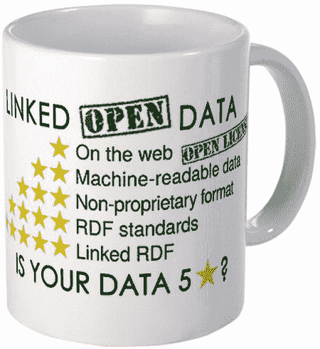

图 3-1。

The requirements of 5 ★ Linked Data and 5 ★ Linked Open Data

因为将一个 CSV 文件转换为一组 RDF 三元组并将它们链接到另一组三元组并不一定会使数据对人类或机器更可用，即使是四星和五星链接的开放数据也有许多挑战。挑战之一是缺乏出处信息，现在可以使用 PROV-O ontology  [6 ]等标准提供关于链接(开放)数据的信息。另一个挑战是查询不使用词汇表中的机器可读定义的链接数据，这很难并且几乎不可能用软件代理来解释。此外，从词汇和本体中检索的定义的质量变化很大，并且所使用的词汇可能不会限制所使用的类和角色对其预期含义的潜在解释。

## LOD 数据集

根据链接开放数据原则，覆盖感兴趣领域的 RDF 三元组的有意义集合称为 LOD 数据集。LOD 数据集收集感兴趣领域内实体的描述，这些描述通常共享一个共同的 URI 前缀(例如， [`http://dbpedia.org/resource/`](http://dbpedia.org/resource/) )。最大数据集的作者提供了高级功能，可以轻松访问他们的结构化数据，例如数据集的可下载压缩文件或用于高效查询的基础架构。

### RDF 爬行

类似于系统地浏览传统网站以进行索引的网络爬虫，语义网络爬虫浏览语义内容以提取结构化数据并自动发现看似不相关的实体之间的关系。LOD 数据集应该以一种可以通过 RDF 爬行获得的方式发布。

### RDF 转储

最流行的 LOD 数据集定期发布为可下载的压缩文件(通常是 Gzip 或 bzip2)，称为 RDF dump，这是数据集的最新版本。RDF 转储应该是有效的 RDF 文件。RDF 转储文件被压缩的原因是包含数百万个 RDF 三元组的数据集非常大。Gzip 压缩的 RDF 转储的大小大约是每 1000 万个三元组 100MB，但它也取决于数据集的 RDF 序列化。表 3-1 总结了最流行的 RDF 转储。

表 3-1。

Popular RDF Dumps

<colgroup><col> <col></colgroup> 
| 资料组 | RDF 转储 |
| --- | --- |
| DBpedia(数据库管理员) | [`http://wiki.dbpedia.org/Downloads2014`](http://wiki.dbpedia.org/Downloads2014) |
| 维基数据 | [`http://dumps.wikimedia.org/wikidatawiki/`](http://dumps.wikimedia.org/wikidatawiki/) |
| 地名 | [`http://download.geonames.org/all-geonames-rdf.zip`](http://download.geonames.org/all-geonames-rdf.zip) |
| LinkedGeoData | [`http://downloads.linkedgeodata.org/releases/`](http://downloads.linkedgeodata.org/releases/) |
| 打开目录 | [`http://rdf.dmoz.org/`](http://rdf.dmoz.org/) |
| 开放音乐百科全书 | ??`ftp://ftp.musicbrainz.org/pub/musicbrainz/data/` |

### SPARQL 端点

类似于 MySQL 中的关系数据库查询，语义数据集的数据也可以通过强大的查询进行检索。专门为 RDF 数据集设计的查询语言被称为 SPARQL(读作“sparkle”，它代表 SPARQL 协议和 RDF 查询语言)，这将在第七章中详细讨论。一些数据集提供了 SPARQL 端点，这是一个可以直接运行 SPARQL 查询的地址(由后端数据库引擎和 HTTP/SPARQL 服务器提供支持)。

### 常用的关联数据集

LOD 数据集发布于各种领域。跨学科数据集，如 DBpedia ( [`http://dbpedia.org`](http://dbpedia.org/) )和 WikiData ( [`http://www.wikidata.org`](http://www.wikidata.org/) )是通用数据集，因此是最常用的数据集。地理应用可以受益于诸如 GeoNames ( [`http://www.geonames.org`](http://www.geonames.org/) )和 LinkedGeoData ( [`http://linkedgeodata.org`](http://linkedgeodata.org/) )的数据集。越来越多的大学以链接数据和 RDF 转储的形式提供有关员工、院系、设施、课程、资助和出版物的信息，如佛罗里达大学( [`http://vivo.ufl.edu`](http://vivo.ufl.edu/) )和根特大学( [`http://data.mmlab.be/mmlab`](http://data.mmlab.be/mmlab) )。诸如普林斯顿大学图书馆( [`http://findingaids.princeton.edu`](http://findingaids.princeton.edu/) )之类的图书馆将书目信息发布为链接数据。匈牙利国家数字数据档案的一部分可在 [`http://lod.sztaki.hu`](http://lod.sztaki.hu/) 作为链接数据获得。甚至古腾堡计划也可以作为关联数据使用( [`http://wifo5-03.informatik.uni-mannheim.de/gutendata/`](http://wifo5-03.informatik.uni-mannheim.de/gutendata/) )。大英博物馆等博物馆将其部分记录发布为关联数据( [`http://collection.britishmuseum.org`](http://collection.britishmuseum.org/) )。新闻和媒体巨头将主题词作为链接数据发布，例如纽约时报 [`http://data.nytimes.com`](http://data.nytimes.com/) 。MusicBrainz ( [`http://dbtune.org/musicbrainz/`](http://dbtune.org/musicbrainz/) )提供关于音乐艺术家及其专辑的数据，作为链接数据并通过 SPARQL 端点提供。关于音乐人、音乐专辑发行和评论的数据由 BBC Music 在 [`www.bbc.co.uk/music`](http://www.bbc.co.uk/music) 发布为链接数据，这在很大程度上基于 MusicBrainz 和音乐本体。位于 [`http://www.linkedmdb.org`](http://www.linkedmdb.org/) 的链接电影数据库(LinkedMDB)是一个专用于电影的 LOD 数据集，具有与其他 LOD 数据源和电影相关网站的高质量和高数量的链接。越来越多的政府门户网站将公开可用的政府数据作为链接数据发布，例如，美国政府的 [`http://data.gov`](http://data.gov/) 或英国政府的 [`http://data.gov.uk`](http://data.gov.uk/) 。以下部分将讨论一些最流行的 LOD 数据集。

#### DBpedia(数据库管理员)

schema.org 上的数百个概念定义适用于注释常见的知识领域，如人、事件、书籍和电影，但复杂的机器可读语句需要更多。

位于 [`http://dbpedia.org`](http://dbpedia.org/) 的 DBpedia 从维基百科文章中提取结构化的事实数据，如标题、信息框、类别和链接。因为维基百科包含近 500 万篇英文文章，所以 DBpedia 适合以机器可读的方式描述几乎任何东西。DBpedia 包含大约 340 万个由 10 亿个三元组描述的概念。

Note

Wikipedia 信息框对于 DBpedia 提取来说是最直接的，因为它们包含相应 Wikipedia 页面的属性-值对，以表格形式显示在文章的右侧，作为最重要事实的总结。然而，结构化数据提取具有挑战性，因为维基百科上的模板系统随着时间的推移而变化，导致缺乏统一性，从而相同的属性具有不同的名称，如`placeofbirth`和`birthplace`。

DBpedia 的唯一资源标识符被写成形式为 [`http://dbpedia.org/resource/Name`](http://dbpedia.org/resource/Name) 的 URI 引用，其中`Name`源自形式为 [`http://en.wikipedia.org/wiki/Name`](http://en.wikipedia.org/wiki/Name) 的维基百科文章的 URL。因此，每个资源都是维基百科文章的直接映射。建立 [`http://dbpedia.org/resource/Resource:Name`](http://dbpedia.org/resource/Resource:Name) 形式的 DBpedia URI 引用(通过内容协商，其中相同的内容以不同的格式提供，这取决于客户端的查询)以在语义 web 代理访问时返回 RDF 格式的机器可读描述，以及在传统 Web 浏览器访问时返回 XHTML 格式的相同信息(参见图 3-2 )。

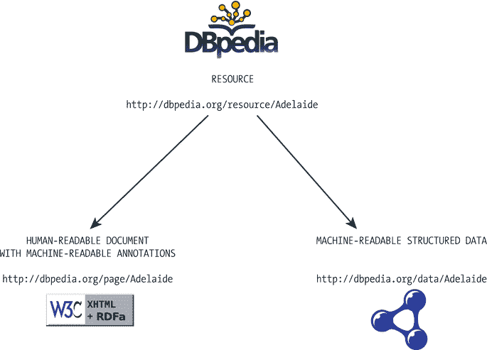

图 3-2。

DBpedia resources return XHTML or RDF through content negotiation

假设我们想用 RDF 描述一个住在阿德莱德的语义 Web 研究者，他对 Web 标准感兴趣，并且是 W3C 的成员。为此，我们需要相应的 DBpedia URIs 来标识声明为`rdf:resource`属性值的非信息资源(形式为 [`http://dbpedia.org/resource/Resource:name`](http://dbpedia.org/resource/Resource:name) )(见清单 3-1 )。

Listing 3-1\. Linking to DBpedia Resources

`<?xml version="1.0" encoding="UTF-8"?>`

`<rdf:RDF` 

`xmlns:foaf="`[`http://xmlns.com/foaf/0.1/`](http://xmlns.com/foaf/0.1/)`"`

`xmlns:contact="``http://www.w3.org/2000/10/swap/pim/contact#``"`

`xmlns:rdf="``http://www.w3.org/1999/02/22-rdf-syntax-ns#`

`<foaf:person rdf:about="`[`http://www.lesliesikos.com/datasets/sikos.rdf#sikos`](http://www.lesliesikos.com/datasets/sikos.rdf#sikos)

`<foaf:name>Leslie Sikos</foaf:name>`

`<foaf:based_near``rdf:resource="`[`http://dbpedia.org/resource/Adelaide`](http://dbpedia.org/resource/Adelaide)`"`

`<foaf:topic_interest``rdf:resource="`[`http://dbpedia.org/resource/Web_standards`](http://dbpedia.org/resource/Web_standards)`"`

`<contact:nearestAirport``rdf:resource="`[`http://dbpedia.org/resource/Adelaide_Airport`](http://dbpedia.org/resource/Adelaide_Airport)`"`

`</foaf:person>`

`<rdf:Description``rdf:about="`[`http://dbpedia.org/resource/W3C`](http://dbpedia.org/resource/W3C)`"`

`<foaf:member rdf:resource="`[`http://www.lesliesikos.com/datasets/sikos.rdf#sikos`](http://www.lesliesikos.com/datasets/sikos.rdf#sikos)

`</rdf:Description>`

`</rdf:RDF>`

DBpedia 的 SPARQL 端点是 [`http://dbpedia.org/sparql`](http://dbpedia.org/sparql) ，在这里可以对 DBpedia 资源进行查询，比如说 20 世纪以前在布达佩斯出生的人的名单(参见清单 3-2 )。使用 SPARQL 查询将在后面的第七章中描述。

Listing 3-2\. A SPARQL Query on DBpedia

`PREFIX dbo: <`[`http://dbpedia.org/ontology/`](http://dbpedia.org/ontology/)

`SELECT ?name ?birth ?death ?person WHERE {`

`?person dbo:birthPlace :Budapest .`

`?person dbo:birthDate ?birth .`

`?person foaf:name ?name .`

`?person dbo:deathDate ?death .`

`FILTER (?birth < "1901-01-01"^^xsd:date) .`

`}`

`ORDER BY ?name`

#### 维基数据

Wikidata 是最大的 LOD 数据库之一，它以人类可读和机器可读的内容为特色，位于 [`http://www.wikidata.org`](http://www.wikidata.org/) 。Wikidata 包含来自 Wikimedia 项目(如 Wikimedia Commons、Wikipedia、Wikivoyage 和 Wikisource)的结构化数据，以及来自曾经流行的可直接编辑的 Freebase 数据集的结构化数据，产生了大约 1300 万个数据项。

与许多其他 LOD 数据集相比，Wikidata 是协作性的——任何人都可以创建新项目和修改现有项目。像维基百科一样，维基数据是多语言的。Wikidata repository 是结构化数据的中央存储，通过它，不仅可以直接访问数据，还可以通过客户端 Wikis 访问数据。数据被添加到以标签为特征的项目中，标签是通过站点链接连接的描述性别名。每个项目的特征在于由属性和属性值组成的语句。Wikidata 支持 Lua Scribunto 解析器扩展，允许在 MediaWiki 中嵌入脚本语言，并通过客户端 Wiki 访问 Wikidata 中存储的结构化数据。还可以使用 Wikidata API 检索数据。

#### 地名

GeoNames 是一个位于 [`http://www.geonames.org`](http://www.geonames.org/) 的地理数据库，提供全球超过 750 万个地理特征的 RDF 描述，对应超过 1000 万个地理名称。所有要素都被归类为九个要素类之一，并被细分为 645 个要素代码之一。地名以多种语言储存在数据库中。GeoNames 还包含纬度和经度、海拔、人口、行政区划和城市邮政编码等数据。坐标以制图、大地测量和导航中使用的世界大地测量系统 1984 (WGS84)标准表示。

GeoNames 资源使用 303(参见其他)重定向将概念(事物现状)与描述资源的文档区分开来。例如，阿德莱德市在地名上有两个地址: [`http://sws.geonames.org/2078025/`](http://sws.geonames.org/2078025/) 和 [`http://sws.geonames.org/2078025/about.rdf`](http://sws.geonames.org/2078025/about.rdf) 。第一个代表城市(在链接数据引用中使用的表单中)；第二份是一份关于阿德莱德的文件。

#### LinkedGeoData

[`http://linkedgeodata.org`](http://linkedgeodata.org/) 处的 LinkedGeoData 数据集使用 OpenStreetMap 数据(一种免费的可编辑世界地图)收集的信息，使其作为 LOD 数据集可用，并将该数据与其他 LOD 数据集链接。数据集的作者在 [`http://browser.linkedgeodata.org`](http://browser.linkedgeodata.org/) 提供了自己的语义浏览器，称为 LGD 浏览器和编辑器(见图 3-3 )。

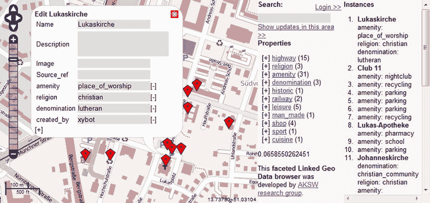

图 3-3。

LinkedGeoData in the LGD Browser and Editor

语义网上不含糊的一个很好的例子是在 LGD 浏览器中搜索“Adelaide”。因为南澳大利亚有一个这个名字的城市，南非还有一个，美国有三个(科罗拉多州一个，爱达荷州一个，华盛顿一个)，软件会要求澄清，并根据你的选择提供城市地图和细节(见图 3-4 )。

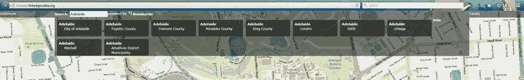

图 3-4。

Linked Data is unambiguous

#### 八歧龙

YAGO(又一个伟大的本体论)是一个数据集，包含超过 1000 万个实体和 1.2 亿个关于它们的事实，这些是从维基百科类别、重定向和信息盒中自动提取的；词汇数据库 WordNet 中的同义词和上下义关系；和地名。

与从 LOD 数据集中自动提取数据的其他数据集相比，YAGO 更加准确，因为大部分事实是手动评估的。YAGO 实体和事实通常与 DBpedia 本体相关联。YAGO 的 SPARQL 端点是 [`http://lod2.openlinksw.com/sparql`](http://lod2.openlinksw.com/sparql) ，但是在 [`https://gate.d5.mpi-inf.mpg.de/webyagospotlx/WebInterface`](https://gate.d5.mpi-inf.mpg.de/webyagospotlx/WebInterface) 也可以通过 web 界面执行查询。

### LOD 数据集集合

LOD 数据集可以使用位于 [`http://datahub.io`](http://datahub.io/) 的 Datahub 进行注册和管理，这是一个开放的数据注册中心。政府、研究机构和其他组织使用数据中心。datahub.io 以结构化数据为动力，提供高效的搜索和分面，浏览用户数据，使用地图、图形和表格预览数据。正如您将看到的，datahub.io 注册表是将 LOD 云图的新数据集与现有数据集合并的先决条件。

Ontobee，可在 [`http://www.ontobee.org`](http://www.ontobee.org/) 获得，是一个基于 SPARQL 的链接本体数据服务器和浏览器，已经被 100 多个本体使用，包含超过 200 万个本体术语。

### LOD 云图

LOD 云图表示至少有 1000 个 RDF 三元组的数据集以及它们之间的链接(图 3-5 )  [7 )。气泡的大小对应于每个数据集中存储的数据量。在云的中间，你可以看到最大的数据集，DBpedia 和 GeoNames，其次是 FOAF 档案，Freebase 和 W3C。

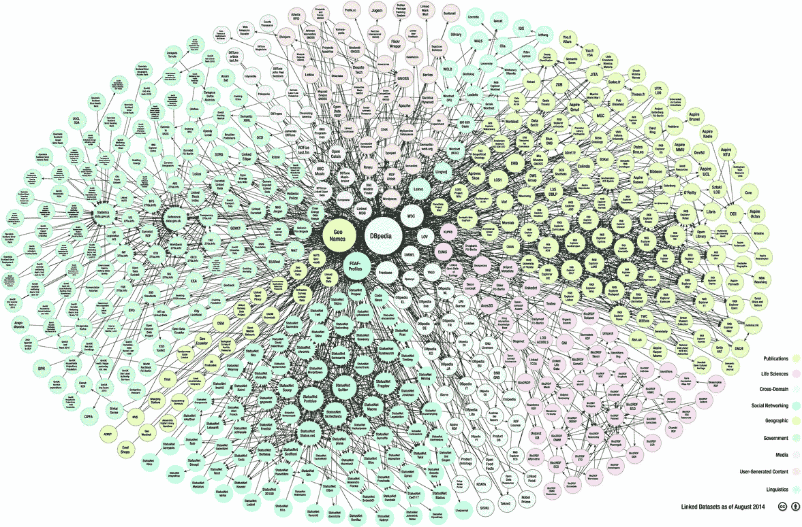

图 3-5。

The LOD Cloud Diagram (courtesy of Max Schmachtenberg, Christian Bizer, Anja Jentzsch and Richard Cyganiak)

如果您有一个足够大的数据集，至少包含 1，000 个三元组，并且满足链接开放数据的要求，您可以请求将其添加到 LOD 云图表中。数据集的资源必须具有可解析的`http://`或`https://` URIs，无论有无内容协商，都可以将 RDF 数据解析为 RDFa、RDF/XML、Turtle 或 N-Triples。数据集必须通过至少 50 个 RDF 链接连接到图中的任意数据集。数据集必须可以通过 RDF 爬行、RDF 转储或 SPARQL 端点来访问。数据集必须在 Datahub 上注册，并且你必须给 LOD 云图的作者发电子邮件(`richard@cyganiak.de`和`mail@anjajentzsch.de`)。

斯坦福大学的 Protovis 使用 CKAN API 创建了 LOD 云图的另一种可视化，并在 [`http://inkdroid.org/lod-graph/`](http://inkdroid.org/lod-graph/) 发布(见图 3-6 )。

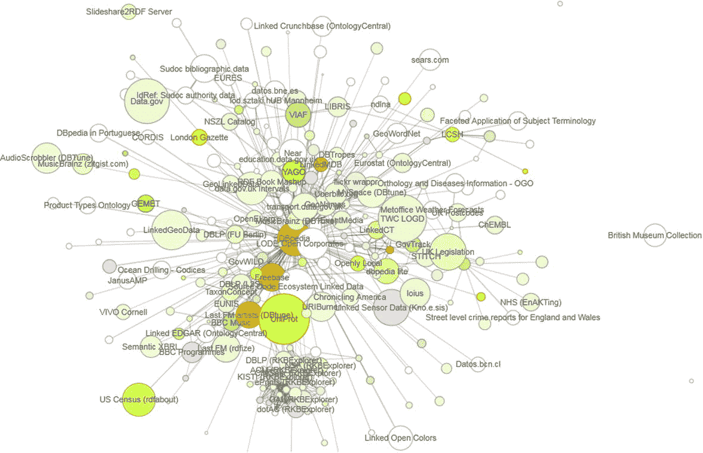

图 3-6。

The LOD Graph generated by Protovis

CKAN 评级由颜色表示，平均评级高的数据集显示为绿色，平均评级低的数据集显示为红色。颜色的强度表示收到评级的数量，白色表示没有评级，颜色越深，评级越高。

## 创建 LOD 数据集

虽然大型数据集是通过软件工具生成的，但在以下部分中，您将看到如何手动创建 LOD 数据集。

### RDF 结构

让我们用 RDF/XML 创建一个数据集文件！第一步是创建一个扩展名为`.rdf`的 UTF-8 编码的文本文件，并添加 XML prolog(参见清单 3-3 )。

Listing 3-3\. XML Prolog

`<?xml version="1.0" encoding="UTF-8"?>`

文档内容将在`<rdf:RDF>`和`</rdf:RDF>`之间。名称空间列表被声明为`rdf:RDF`上的`xmlns`属性。例如，如果您想使用 FOAF 词汇表中的任何定义，您必须声明它的名称空间，以便在整个文档中缩写它(参见清单 3-4 )。

Listing 3-4\. The Main Container with One Namespace Declaration

`<rdf:RDF xmlns:foaf="`[`http://xmlns.com/foaf/0.1/`](http://xmlns.com/foaf/0.1/)

`</rdf:RDF>`

从现在开始，您可以使用`foaf`前缀来缩写朋友的朋友(FOAF)名称空间，如清单 3-5 所示。

Listing 3-5\. Using the `foaf` Prefix to Abbreviate the FOAF Namespace

`<foaf:Person rdf:about="`[`http://www.lesliesikos.com/metadata/sikos.rdf#sikos`](http://www.lesliesikos.com/metadata/sikos.rdf#sikos)

`<foaf:firstname rdf:datatype="http://www.w3.org/2001/XMLSchema#string">Leslie` 

`</foaf:firstname>`

`<foaf:surname rdf:datatype="http://www.w3.org/2001/XMLSchema#string">Sikos</foaf:surname>`

`</foaf:Person>`

名称空间列表通常由 RDF、RDFS、OWL 等等以及都柏林核心、schema.org 等等的名称空间声明来扩展。，这取决于您在数据集中使用的词汇术语(参见清单 3-6 )。在开发过程中，该列表会不断扩展。

Listing 3-6\. Multiple Namespace Declarations

`<rdf:RDF` 

`xmlns:dc="`[`http://purl.org/dc/elements/1.1/`](http://purl.org/dc/elements/1.1/)`"`

`xmlns:dcterms="`[`http://purl.org/dc/terms/`](http://purl.org/dc/terms/)`"`

`xmlns:foaf="`[`http://xmlns.com/foaf/0.1/`](http://xmlns.com/foaf/0.1/)`"`

`xmlns:owl="``http://www.w3.org/2002/07/owl#``"`

`xmlns:rdf="``http://www.w3.org/1999/02/22-rdf-syntax-ns#``"`

`xmlns:rdfs="``http://www.w3.org/2000/01/rdf-schema#``"`

`xmlns:schema="`[`http://schema.org/`](http://schema.org/)

在命名空间列表之后，可以提供数据集信息，包括许可，然后是数据集的实际数据(RDF 语句),这些数据将通过类型化链接链接到其他 LOD 数据集的类和实体。

### 批准

没有明确许可的链接开放数据只是链接数据。为了使我们的 LOD 数据集真正“开放”，我们必须显式声明许可证，这可以防止潜在的法律责任问题，并让用户清楚地知道什么使用条件适用。

数据集的许可信息可以在数据集文件或外部元数据文件中提供，例如 VoID(互连数据集的词汇表)文件。发布数据集所依据的许可证可以使用`dcterms:license`属性来声明。链接开放数据最常用的许可 URIs 如下:

*   [`http://opendatacommons.org/licenses/pddl/`](http://opendatacommons.org/licenses/pddl/) 公共领域专用和许可(PDDL)——“数据/数据库的公共领域”
*   [`http://opendatacommons.org/licenses/by/`](http://opendatacommons.org/licenses/by/) 开放数据共享空间归属(ODC-By)——“数据/数据库归属”
*   [`http://opendatacommons.org/licenses/odbl/`](http://opendatacommons.org/licenses/odbl/) 开放数据库许可证(ODC-ODbL)——数据/数据库归属共享
*   [`https://creativecommons.org/publicdomain/zero/1.0/`](https://creativecommons.org/publicdomain/zero/1.0/) CC0 1.0 通用—《知识共享公共领域弃权声明》
*   [`https://creativecommons.org/licenses/by-sa/4.0/`](https://creativecommons.org/licenses/by-sa/4.0/) 知识共享署名共享(CC-BY-SA)
*   [`http://gnu.org/copyleft/fdl.html`](http://gnu.org/copyleft/fdl.html) GNU 自由文档许可证(GFDL)

前四个许可是专门为数据设计的，因此强烈建议将它们用于 LOD 数据集许可。数据集的许可是一个复杂的问题，因为数据集是事实的集合，而不是创造性的作品，所以适用不同的法律。知识共享和 GPL 在网络上相当普遍；然而，它们是基于版权的，并且是为创造性作品而设计的，而不是数据集，因此当应用于数据集时，它们可能不会产生预期的法律结果。

社区规范(非约束性的使用条件)可以使用`waiver:norms`属性( [`http://vocab.org/waiver/terms/norms`](http://vocab.org/waiver/terms/norms) )来表示。一个常见的社区规范是 ODC 属性共享( [`www.opendatacommons.org/norms/odc-by-sa/`](http://www.opendatacommons.org/norms/odc-by-sa/) )，它允许使用数据集中的数据，但更改和更新也应该是公开的，包括给出的信用、链接的数据源、使用的开放格式以及没有应用 DRM。例如，如果我们有一个根据开放数据共享公共领域专用和许可条款发布的`ExampleLOD`数据集，并且鼓励用户遵守上述社区规范，但没有法律约束，数据集的许可如清单 3-7 所示。

Listing 3-7\. LOD Dataset Licensing Example

`<?xml version="1.0" encoding="UTF-8"?>`

`<rdf:RDF` 

`xmlns:dcterms="`[`http://purl.org/dc/terms/`](http://purl.org/dc/terms/)`"`

`xmlns:rdf="``http://www.w3.org/1999/02/22-rdf-syntax-ns#``"`

`xmlns:wv="`[`http://vocab.org/waive/terms/`](http://vocab.org/waive/terms/)

`<rdf:Description rdf:about="`[`http://www.examplelod.com/loddataset.rdf#examplelod`](http://www.examplelod.com/loddataset.rdf#examplelod)

`<dcterms:license rdf:resource="`??`http://www.opendatacommons.org/odc-public-domain-`

[??](http://www.opendatacommons.org/odc-public-domain-dedication-and-licence)

`<wv:norms rdf:resource="`[`http://www.opendatacommons.org/norms/odc-by-sa/`](http://www.opendatacommons.org/norms/odc-by-sa/)

`<wv:waiver rdf:datatype="`[`http://www.w3.org/2001/XMLSchema#string`](http://www.w3.org/2001/XMLSchema#string%22%3ETo)`">To the extent`

`possible under law, Example Ltd. has waived all copyright and related or neighboring` 

`rights to this dataset.</wv:waiver>`

`</rdf:Description>`

Note

Datahub 注册要求从下拉列表中选择开放许可证作为字段值，并将许可证 URI 作为单独的字段设置为数据集属性，而不仅仅是数据集或 VoID 文件中提供的许可信息。

### RDF 语句

数据集最通用的对象被收集在`rdf:description`容器中。那些已经在机器可读词汇表中定义的真实世界对象的表示通常被收集在相应的对象类下(在`schema:person`中的人，在`schema:book`中的书，等等)。因为链接开放数据的一个基本要求是用一个不可引用的 web 地址来标识所有东西，所以要确保地址和片段标识符是正确的。尽可能使用键入来区分字符串、数字、日期等。

对另一个陈述进行陈述称为具体化。它允许在多个上下文中使用三元组，但会影响数据集的形式语义。

### 连结

政府机构、大型企业、 2 媒体机构、社交媒体门户和研究人员处理大量数据，这些数据可以表示为结构化数据并作为链接数据发布。在 RDF 中描述政府数据、大学研究部门、同事、书籍或任何其他知识领域都会产生一个孤立的数据集文件，在链接到其他数据集之前，它不是语义网的一部分。

在语义网的结构化数据集之间创建链接被称为互连，这使得孤立的数据集成为 LOD 云的一部分，在 LOD 云中，所有资源都相互链接。这些链接使语义代理能够在数据源之间导航并发现额外的资源。链接通常发生在`owl:sameAs`、`rdfs:seeAlso`、`foaf:holdsOnlineAccount`、`sioc:user`以及类似的谓词上。与(X)HTML 文档的传统超链接不同，LOD 链接是两个资源之间的类型化链接。链接的主体和客体的 URIs 标识了被链接的资源。谓词的 URI 定义了链接的类型。例如，一个 RDF 链接可以说明一个人受雇于一家公司，而另一个 RDF 链接可以说明这个人认识其他人。解引用链接目的地的 URI 会产生链接资源的描述，通常包含指向其他相关 URIs 的额外 RDF 链接，这些链接也可以被解引用，依此类推。

考虑一下《Web Standards: Mastering HTML5、CSS3 和 XML，at [`http://www.masteringhtml5css3.com/metadata/webstandardsbook.rdf#book`](http://www.masteringhtml5css3.com/metadata/webstandardsbook.rdf#book) 这本书的机器可读描述，它使用来自 Dublin Core 词汇表的`title`属性声明了书名，并且在许多其他属性中，使用`schema:author`声明了描述作者的机器可读资源(图 3-7 )。可以使用`rdfs:seeAlso`来声明与该书相关的更多资源。

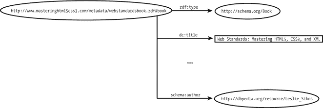

图 3-7。

Linking a dataset to a related entity of another dataset

作者的 DBpedia 资源揭示了作者的属性，例如使用`foaf:homepage`定义的他的主页地址，以及在许多其他分类中，将作者链接到澳大利亚作家，以及 YAGO(图 3-8 )。

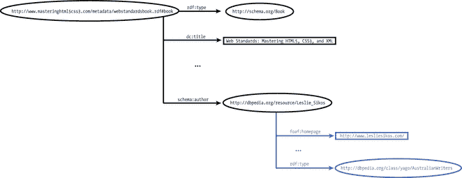

图 3-8。

The DBpedia resource links the dataset to another dataset

基于`yago:AustralianWriters`，语义代理将找到同一类别的其他作者(图 3-9 )。通过链接到 LOD 云图上已经存在的数据集(例如指向 DBpedia 上的定义)，您的数据集将成为 LOD 云的一部分。

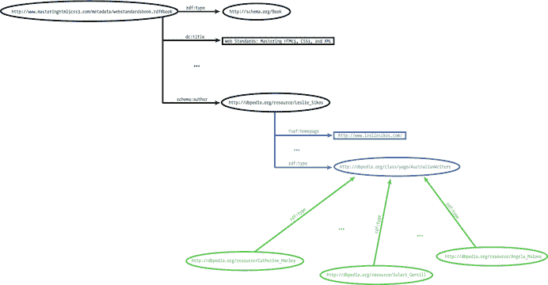

图 3-9。

Two RDF graphs sharing the same URI merge

巨型全局图，蒂姆·伯纳斯·李创造的数据网络的另一个名字，是所有自动合并的 LOD 图的超级图。

### 注册数据集

要考虑包含在 LOD 云图中，您的数据集必须在 [`http://datahub.io`](http://datahub.io/) 上注册。为了能够注册，您需要与 Datahub 上已有的公司或研究机构有关联，或者如果它尚未注册，您必须请求新的公司注册。LOD 云图的候选数据集通过四个符合性级别进行验证。

级别 1(基本合规性)需要关于数据集的基本元数据，包括名称、标题、URL、作者和联系电子邮件，以及添加到 Datahub 上数据集的`lod`标记。第 2 级(最小符合性)需要数据集的主题标签，它可以是下列标签之一:`media`、`geographic`、`lifesciences`、`publications`、`government`、`ecommerce`、`socialweb`、`usergeneratedcontent`、`schemata`或`crossdomain`。您必须在`Data and Resources`部分提供一个链接 URI 与`example/serialization_format` ( `example/rdf+xml`、`example/turtle`、`example/ntriples`、`example/x-quads`、`example/rdfa`或`example/x-trig`)的示例，以帮助人们在决定使用您的数据之前对其有所了解。您还必须提供到数据集的转储文件或 SPARQL 端点的链接。级别 3(完全符合)需要附加信息，例如数据集的最后修改日期或版本(作为字段`version`的值)、数据集描述(`notes`)、数据集的开放许可(从下拉菜单中选择)、LOD 气泡的简称(`shortname`)、数据集许可的链接(`license_link`)以及实例名称空间(`namespace`)。除了这些自定义字段之外，第 3 级遵从性还需要元数据，例如 VoID 文件(`meta/void`格式)、XML 站点地图(`meta/sitemap`格式)、RDF 模式(`meta/rdf-schema`格式)和词汇映射(`mapping/format`)。根据您是否使用顶级域中定义的专有词汇，您必须添加`no-proprietary-vocab`标记(您不使用专有词汇)，或者添加`deref-vocab`标记(使用可解除引用的专有词汇)或`no-deref-vocab`标记(使用不可解除引用的专有词汇)。一旦您准备好数据集注册，您可以使用 [`http://validator.lod-cloud.net/`](http://validator.lod-cloud.net/) 来验证它。

Note

自从引入 LOD 云图以来，Datahub LOD 验证器使用的一些 CKAN/Datahub 字段已经被更改或停止使用。因此，验证器可能会给出错误，即使是在正确注册的数据集上。如果数据集出现这种情况，您必须通过电子邮件联系 LOD 云图表的作者，以获得人工批准。

最后一步是给作者发电子邮件(`richard@cyganiak.de`和`mail@anjajentzsch.de`)。LOD 云图表的作者使用更多的标签来注释您的数据集是否有任何问题，或者何时可以添加到 LOD 云图表的下一次更新中。4 级符合性意味着您的数据集已经由使用该组生成 LOD 云图的作者审查并添加到`lodcloud`组。

## 链接数据可视化

关联数据可视化工具使关联数据的分析和操作变得更加容易。链接数据可视化技术的列表包括但不限于值的比较、关系和层次的分析、时间或地理事件的分析、作为标签云或短语网络的基于文本的可视化，以及表示多维数据。

LOD 可视化( [`http://lodvisualization.appspot.com`](http://lodvisualization.appspot.com/) )可以使用从实时访问到 SPARQL 端点的树状图和树来生成可视化的层次结构。LodLive ( [`http://en.lodlive.it`](http://en.lodlive.it/) )提供了链接数据资源的图形可视化。单击节点可以展开图形结构。LodLive 可用于实时访问 SPARQL 端点(参见图 3-10 )。

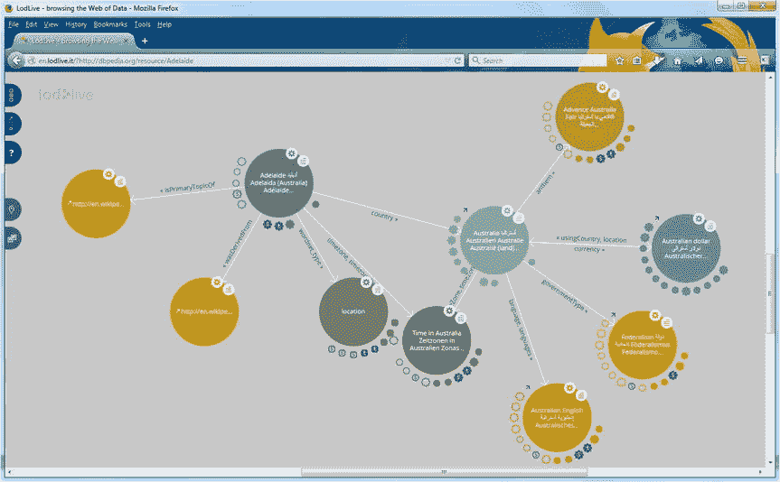

图 3-10。

Browsing the Web of Data with LodLive

可从 [`https://gephi.github.io/`](https://gephi.github.io/) 下载的开源图形可视化和操作软件包 Gephi 是关联数据可视化的理想选择。该程序帮助探索和理解图形，修改表示，并操纵结构、形状和颜色来揭示隐藏的属性(见图 3-11 )。

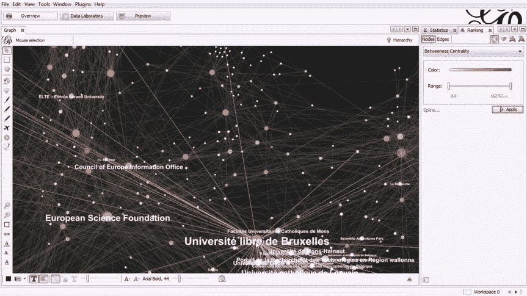

图 3-11。

Advanced graph visualization with Gephi

Gephi 由复杂的布局算法驱动，专注于质量(基于力的算法)或速度(通过图形粗化进行多级细化)。异步 OpenGL exploration 引擎支持平面渲染和 3D 渲染，具有可定制的细节级别和多线程。软件工具的另一个引擎称为映射引擎，支持细化、矢量渲染和 SVG 输出，非常适合发布和绘制信息图。突出显示选项使处理大型图表变得容易。可以通过选择、移动、注释、调整大小、连接和分组节点来修改图形。通过使用动态过滤的可视化，非常强大的实时图形可视化支持最多具有 50，000 个节点和 100 万条边的网络以及迭代。

## 摘要

在本章中，您学习了关联开放数据的概念和要求，以及将数千个 LOD 数据集相互关联的行业。你现在明白语义代理如何基于机器可读的对象和主题的定义，以及它们之间的类型化链接，做出新的发现。您学习了 LOD 数据集的结构、许可和互连。

下一章将向您介绍语义开发工具，包括本体编辑器、推理机、语义标注器、提取器、软件库、框架和 API。

## 参考

Bizer, C., Heath, T., Berners-Lee, T. Linked data—The story so far. Semantic Web and Information Systems 2009, 5(3):1–22.   Berners-Lee, T. (2006) Linked Data—Design Issues. [`www.w3.org/DesignIssues/LinkedData.html`](http://www.w3.org/DesignIssues/LinkedData.html) . Accessed 25 March 2014.   Fielding, R. T. (2005) httpRange-14 Resolved. [`http://lists.w3.org/Archives/Public/www-tag/2005Jun/0039.html`](http://lists.w3.org/Archives/Public/www-tag/2005Jun/0039.html) . Accessed 28 March 2015.   The Open Definition—Defining Open in Open Data, Open Content and Open Knowledge. [`http://opendefinition.org`](http://opendefinition.org/) . Accessed 18 January 2015.   Hausenblas, M. (2012) 5 ★ Open Data. [`http://5stardata.info`](http://5stardata.info/) . Accessed 18 January 2015.   Lebo, T., Sahoo, S., McGuinness, D. (eds.) (2013) PROV-O: The PROV Ontology. [`www.w3.org/TR/prov-o/`](http://www.w3.org/TR/prov-o/) . Accessed 27 March 2015.   Schmachtenberg, M., Bizer, C., Jentzsch, A., Cyganiak, R. (2014) The LOD cloud diagram. [`http://lod-cloud.net`](http://lod-cloud.net/) . Accessed 18 January 2015.   Berners-Lee, T. (2007) Giant Global Graph | Decentralized Information Group (DIG) Breadcrumbs. [`http://dig.csail.mit.edu/breadcrumbs/node/215`](http://dig.csail.mit.edu/breadcrumbs/node/215) . Accessed 28 March 2015.   Footnotes 1

这种许可概念也在传统网络上使用，其中术语开放数据指的是免费许可。

  2

如果链接的数据位于公司防火墙之后，则称为链接企业数据。