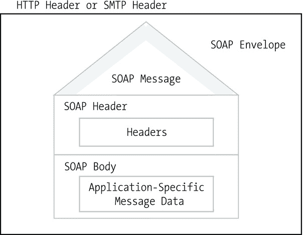
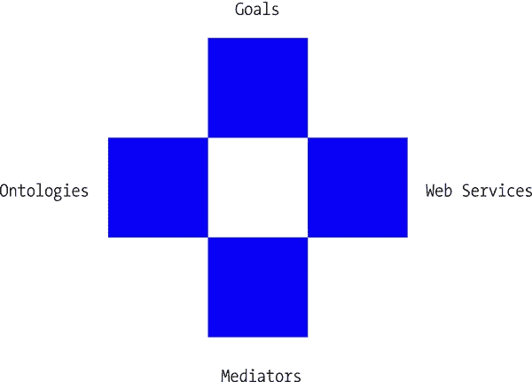

# 五、语义化 Web 服务

在这个面向服务的世界里，在线服务是 web 产品的重要组成部分。网上购物、机票预订、酒店预订、导航、公共交通服务、政府服务、社区服务和媒体服务是我们日常生活的一部分。然而，服务产品的范围正在扩大。例如，在信息技术(IT)行业，也有各种各样的服务。在越来越流行的云计算环境中，基本的服务模式是基础设施即服务(IaaS)，如亚马逊 EC2 和谷歌云存储；平台即服务(PaaS)，如 WHM、微软 Azure 和谷歌应用引擎；以及软件即服务(SaaS)，如 Hosted Exchange、GoogleApps 和 NetSuite。IT 行业的其他服务包括但不限于数据库即服务(DBaaS)、图形即服务(GaaS)、存储即服务(STaaS)、测试环境即服务(TEaaS)、API 即服务(APIaaS)、网络即服务(NaaS)和统一通信即服务(UCaaS)。Web 服务通常拥有提供电子商务、动态地图导航、物理设备远程控制等功能的网站。主流的基于 XML 的 web 服务互操作性标准只指定了语法，而没有指定消息的语义。语义 Web 技术可以用定义良好、丰富的语义增强面向服务的环境。语义 Web 服务利用语义 Web 技术来自动化服务，并支持跨异构用户和域的自动服务发现、组合和执行。

## 语义 Web 服务建模

Web 服务是使用可重用组件通过标准互联网协议可编程访问的程序[1]。Web 服务是分布式的，封装了离散的功能。语义 web 服务(SWS)通过语义使 Web 服务特征可被机器解释。语义 web 服务旨在将 Web 服务和语义 Web 技术结合起来，以实现服务相关任务的自动化，如发现、组合等。[2].语义 web 服务可以解决传统 web 服务的一些限制，例如语法描述和手工检查 Web 服务可用性、使用和集成的需要。语义 Web 服务的生命周期包括服务描述或注释、广告、发现、选择、组合和服务的执行，使用四种类型的语义:数据语义、功能语义、服务质量(QoS)语义和执行语义。语义 Web 服务的使用过程包括以下内容[3]:

*   发布:使服务能力的描述可用
*   发现:定位适合给定任务的不同服务
*   选择:在可用的服务中选择最合适的服务
*   组合:组合服务以实现目标
*   中介:解决数据、协议和流程不匹配的问题
*   执行:按照编程约定调用服务

语义 Web 服务有三种不同类型的属性:功能、行为和非功能属性。功能属性定义了 web 服务的能力。行为属性提供了一种通过与其他服务交互来实现所需功能的方法。非功能属性设置了对功能和行为属性的约束，或者添加了关于服务的元数据。例如，假设我们有一个航班预订服务，其中的功能是实际的预订，当安全性是非功能性属性时，这可能会受到使用安全连接的约束。基于服务的语义 web 应用的通信和集成由 WSDL(一种用于 web 服务的 XML 描述语言)、SOAP(一种用于在服务和客户端之间交换任意 XML 数据的基于 XML 的消息格式)和 UDDI(一种用于 Web 服务注册的数据模型和 API)提供。换句话说，服务消费者通过 UDDI 注册中心找到服务，该注册中心指向 web 服务的 WSDL 描述，以及使用 SOAP 与消费者通信的实际服务。

典型的语义 Web 服务有三个阶段(发布、搜索和绑定)，以及三个实体(服务请求者、服务提供者和服务注册中心)。例如，服务提供商可以以广告的形式向 UDDI 服务注册中心发布服务的描述，该描述包括服务提供商的简介(公司名称和地址)、服务简介(如服务名称和类别)以及服务接口定义 URL (WSDL 描述)。

### 使用 XML 消息的通信:SOAP

简单对象访问协议(SOAP)是一种通过 web 服务发送和接收 XML 消息的语法。每个 SOAP 消息都包含一个包装消息的 SOAP 信封、一个数据编码描述以及包含后端应用的特定于应用的消息的 SOAP 主体(参见图 5-1 )。

图 5-1。

Structure of a web-based SOAP message

SOAP 消息的根元素是`Envelope`元素，它是`Header`和`Body`元素的容器(参见清单 5-1 )。`Body`元素可以有选择地包含一个`Fault`元素，只有当 web 服务出现故障时才使用这个元素。

Listing 5-1\. Structure of a SOAP Message

`<?xml version="1.0"?>`

`<soap:Envelope xmlns:soap="`[`http://www.w3.org/2001/12/soap-envelope`](http://www.w3.org/2001/12/soap-envelope)

`<soap:Header>`

`</soap:Header>`

`<soap:Body>`

`<soap:Fault>`

`</soap:Fault>`

`</soap:Body>`

`</soap:Envelope>`

SOAP 信封总是包含指向 [`http://www.w3.org/2001/12/soap-envelope`](http://www.w3.org/2001/12/soap-envelope) 的名称空间声明。`Header`元素是`Envelope`元素的可选子元素，它可以提供与消息本身不直接相关的信息，比如 SOAP 请求的最大时间要求。`Header`元素使用与`Envelope`元素相同的 XML 名称空间。`Header`元素的`mustUnderstand`布尔属性可以显式声明(`mustUnderstand="true"`)处理消息的 SOAP 代理必须“理解”报头块。如果不理解报头，则返回 SOAP 错误。`role`属性可以指定 SOAP 消息转发器或处理器。

Note

SOAP 支持可以在`Header`元素和`Fault`元素中使用的预定义和自定义角色。SOAP 消息由三种类型的节点处理:发送方、转发方(并不总是使用，对应于`next`角色)，以及实际处理 SOAP 消息的最后一个节点(对应于`ultimateReceiver`角色)。下一个角色的 URI 是 [`http://www.w3.org/2003/05/soap-envelope/role/next`](http://www.w3.org/2003/05/soap-envelope/role/next) ，而`ultimateReceiver`角色的 URI 是 [`http://www.w3.org/2003/05/soap-envelope/role/ultimateReceiver`](http://www.w3.org/2003/05/soap-envelope/role/ultimateReceiver) 。

`relay`属性决定一个标题块如果不被处理是否可以被中继。

作为强制元素的`Body`元素包含了将由客户端或 web 服务处理的 SOAP 消息的主要部分，比如一个`service`元素及其嵌套在其中的参数。如果您在`Body`元素中声明了一个`Fault`元素，那么在处理 SOAP 消息时如果出现错误，它就可以执行动作。`Fault`元素有两个必需的子元素(`Code`和`Reason`)和三个可选的子元素(`Node`、`Role`和`Detail`)(参见清单 5-2 )。

Listing 5-2\. SOAP Fault Structure

`<env:Fault>`

`<env:Code>`

`<env:Value>env:Sender</env:Value>`

`<env:Subcode>`

`<env:Value>env:Sender</env:Value>`

`<env:Subcode>`

`</env:Subcode>`

`</env:Subcode>`

`</env:Code>`

`<env:Reason>`

`<env:Text>Incorrect Input Data</env:Text>`

`</env:Reason>`

`<env:Node>http://example.com/theNodeWhichFailed</env:Node>`

`<env:Role>`

[`http://www.w3.org/2003/05/soap-envelope/role/ultimateReceiver`](http://www.w3.org/2003/05/soap-envelope/role/ultimateReceiver)

`</env:Role>`

`</env:Fault>`

`Value`元素是`Code`元素的子元素。`Value`元素可以有五个值之一。`VersionMismatch`属性表明在 SOAP 消息中发现的根元素不是有效的`Envelope`元素。如果没有处理任何标题子元素，则返回`MustUnderstand`属性值。如果 header 元素的编码(`encodingStyle`属性值)不能被处理，那么返回的错误就是`DataEncodingUnknown`属性的值。如果发送方发送了一个包含丢失或无效数据的错误编写的 SOAP 消息，则使用`Sender`属性值。如果 SOAP 消息的接收者未能处理消息，例如 web 服务所依赖的数据库不可用，则返回`Receiver`属性值。如果需要单独的代码块进行错误处理，可以选择将`Subcode`元素添加到`Code`元素中。

`Reason`元素包含一个或多个提供故障原因的`Text`元素。描述的自然语言可以由`Text`元素上的`lang`属性指定为 ISO 语言代码。可选的`Node`元素包含一个 URI，用于标识发生故障的节点。`Role`元素包含发生故障的节点的角色。`Detail`元素有子元素，提供关于发生的错误的附加信息。这些子元素使用您的自定义名称空间。

### Web 服务描述语言(WSDL)

web 服务描述语言(WSDL，读作“Wiz'-dul”)是一种基于 XML 的接口定义语言，将 Web 服务的功能描述为网络端点或端口的集合，适合于消息交换[4]。端口是通过将网络地址与可重用绑定相关联来定义的，端口集合定义了 WSDL 服务。交换数据的抽象、类型化定义形成了 WSDL 消息。一个或多个端点支持的操作集合是端口类型。协议和数据格式规范提供了一个可重用的绑定，这是一个特定端口类型的具体协议和数据格式规范，使 WSDL 能够描述 web 服务的公共接口。WSDL 文件的文件扩展名为`.wsdl`，而互联网媒体类型为`application/wsdl+xml`。WSDL 2.0 文件包含以下元素:

*   `description`元素是根元素，它包含所有其他 WSDL 元素。
*   `types`元素是缺省情况下使用 XML Schema 描述的客户机和 web 服务之间交换的数据类型的规范。
*   元素列举了 web 服务的操作，为每个输入和输出操作交换的消息，以及错误消息。
*   `binding`元素描述了如何通过网络访问 web 服务，通常将 web 服务绑定到 HTTP 协议。
*   `service`元素声明了在网络上何处可以访问 web 服务，即服务的 URL。
*   可选的`documentation`元素可以包含人类可读的 web 服务描述。
*   可选的`import`元素可以导入 XML 模式或其他 WSDL 文件。

结果，WSDL 文档的框架如清单 5-3 所示。

Listing 5-3\. Skeleton WSDL Document

`<description>`

`<types>`

`</types>`

`<interface>`

`</interface>`

`<binding>`

`</binding>`

`<service>`

`</service>`

`</description>`

所有 WSDL 文件的第一部分是在`description`根元素中的一个或多个服务的定义，它也包括标准的名称空间声明，以及`targetNamespace`，关于服务信息的逻辑名称空间(参见清单 5-4 )。

Listing 5-4\. XML Prolog and Namespace Declarations in WSDL

`<?xml version="1.0" encoding="UTF-8"?>`

`<description` 

`xmlns="`[`http://www.w3.org/ns/wsdl`](http://www.w3.org/ns/wsdl)`"`

`xmlns:tns="http://www.example.com/wsdl"` 

`xmlns:whttp="`[`http://www.w3.org/ns/wsdl/http`](http://www.w3.org/ns/wsdl/http)`"`

`xmlns:wsoap="`[`http://www.w3.org/ns/wsdl/soap`](http://www.w3.org/ns/wsdl/soap)`"`

`targetNamespace="http://www.example.com/wsdl">`

属性将元素的默认名称空间设置为标准的 WSDL 名称空间， [`http://www.w3.org/ns/wsdl`](http://www.w3.org/ns/wsdl) 。默认命名空间应用于整个 WSDL 文档中没有显式声明另一个命名空间的所有元素。`xmlns:tns`属性声明了一个与`targetNamespace`的值相同的名称空间 URI(这个模式要指向的 web 服务的名称空间)，提供了一种通过这个名称空间前缀(`tns`)来引用目标名称空间的机制。属性可以用来声明模式目标名称空间 URI，它是 XML 模式名称空间的 URI，用于元素上的 web 服务类型。`xmlns:wsoap`声明了用于`bindings`元素的 WSDL SOAP URI。`xmlns:soap`可以用来指向由 WSDL 文档描述的 web 服务所使用的 SOAP 版本的 SOAP URI。`xmlns:wsdlx`声明了 WSDL 扩展 URI。

在 WSDL 文档中需要复杂的数据类型来定义 web 服务请求和响应(参见清单 5-5 )。web 服务通常有一个输入类型、一个输出类型，有时还有一个错误类型。如果 web 服务有多个操作，每个操作可能有自己的输入类型、输出类型和错误类型。只要 web 服务的 API 支持，就可以用任何语言来声明数据类型，但最常见的是，使用 XML 模式来指定数据类型。如果只使用简单数据类型，可以省略本文档部分。

Listing 5-5\. Abstract Types in WSDL

`<types>`

`<xs:schema` 

`xmlns:xs="`[`http://www.w3.org/2001/XMLSchema`](http://www.w3.org/2001/XMLSchema)`"`

`targetNamespace="http://www.example.com/wsdl">`

`<xs:element name="request"> … </xs:element>`

`<xs:element name="response"> … </xs:element>`

`</xs:schema>`

`</types>`

web 服务支持的操作可以用`interface`元素来描述(参见清单 5-6 )。每个操作代表客户端和服务之间的一个交互。对于每个请求，客户端只能调用一个操作。`fault`元素定义了一个可以发送回客户端的错误，这个错误可以被多个操作使用。`operation`元素描述了一个方法或过程。

Listing 5-6\. Abstract Interfaces in WSDL

`<interface name="Interface1">`

`<fault name="Fault1" element="tns:response" />`

`<operation name="Operation1" pattern="http://www.w3.org/ns/wsdl/in−out">`

`<input messageLabel="Message1" element="tns:request" />`

`<output messageLabel="Message2" element="tns:response" />`

`</operation>`

`</interface>`

下一部分通过声明操作和消息的协议和数据格式规范，定义了应该如何执行操作。这是通过使用`binding`元素将 web 服务“绑定”到可以访问它的协议来实现的。绑定元素上的`name`属性的值被`service`元素引用(参见清单 5-7 )。`interface`属性指的是在同一个 WSDL 文件中定义的`interface`元素的名称(使用同一个文档的目标名称空间的前缀)。`type`属性定义了接口绑定的消息格式。

Listing 5-7\. Binding over HTTP in WSDL

`<binding name="HttpBinding" interface="tns:Interface1"` 

`type="`[`http://www.w3.org/ns/wsdl/http`](http://www.w3.org/ns/wsdl/http)

`<operation ref="tns:Operation1" whttp:method="GET" />`

`</binding>`

SOAP 绑定可以由`wsoap:protocol`属性指定(参见清单 5-8 )。当元素存在时，它声明一个错误，这个错误可以由 web 服务通过绑定发送回来。该错误在绑定引用的`interface`元素中定义。`operation`元素上的`ref`属性声明了绑定引用的`interface`元素中定义的操作。属性指定了 SOAP 的默认消息交换模式(MEP)。

Listing 5-8\. Binding with SOAP in WSDL

`<binding name="SoapBinding" interface="tns:Interface1"` 

`type="`[`http://www.w3.org/ns/wsdl/soap`](http://www.w3.org/ns/wsdl/soap)`"`

`wsoap:protocol="`[`http://www.w3.org/2003/05/soap/bindings/HTTP/`](http://www.w3.org/2003/05/soap/bindings/HTTP/)`"`

`wsoap:mepDefault="http://www.w3.org/2003/05/soap/mep/request−response">`

`<operation ref="tns:Operation1" />`

`</binding>`

最后一部分指定绑定的一个或多个端口地址。`service`元素是网络端点或端口的容器，通过它们可以访问 web 服务(参见清单 5-9 )。

Listing 5-9\. Offering Endpoints for Both Bindings

`<service name="Service1" interface="tns:Interface1">`

`<endpoint name="HttpEndpoint" binding="tns:HttpBinding"` 

`address="http://www.example.com/rest/"/>`

`<endpoint name="SoapEndpoint" binding="tns:SoapBinding"` 

`address="http://www.example.com/soap/"/>`

`</service>`

`</description>`

元素的属性描述了 web 服务的名称。`interface`属性指定了与服务相关的界面元素。元素的属性声明了服务的网址。

#### WSDL 语义注释

web 服务描述语言的语义注释(SAWSDL)是一个标准，用于指定 Web 服务数据绑定如何映射到正式模型[5]。SAWSDL 提供了一种可重复的方式，通过固定的数据绑定将 RDF 或 OWL 连接到语义 Web 服务，从而更容易以编程方式找到满足应用需求的服务数据。SAWSDL 通过一组 Web 服务描述语言和 XML 模式定义语言的扩展属性提供了对 WSDL 组件的附加语义的描述。SAWSDL 的名称空间前缀是`sawsdl`，指向 [`www.w3.org/ns/sawsdl`](http://www.w3.org/ns/sawsdl) ，以及`sawsdlrdf`，指向`www.w3.org/ns/sawsdl#`。

WSDL 文档中的接口可以使用`modelReference`进行注释，这提供了对描述 WSDL 接口的语义模型中的一个或多个概念的引用(参见清单 5-10 )。

Listing 5-10\. SAWSDL Model Reference for a WSDL Interface

`<wsdl:interface name="Order" sawsdl:modelReference="`[`http://yourbookshop.com/textbooks`](http://yourbookshop.com/textbooks)

`…`

`</wsdl:interface>`

WSDL 操作也可以使用`modelReference`进行注释，通过为操作指定行为方面或进一步的语义定义，引用语义模型中的概念来提供操作的高级描述(参见清单 5-11 )。

Listing 5-11\. SAWSDL Model Reference for a WSDL Operation

`<wsdl:operation name="order" pattern="`[`http://www.w3.org/ns/wsdl/in-out`](http://www.w3.org/ns/wsdl/in-out)`"`

`sawsdl:modelReference="http://www.example.com/purchaseorder#RequestPurchaseOrder">`

`<wsdl:input element="OrderRequest" />`

`<wsdl:output element="OrderResponse" />`

`</wsdl:operation>`

SAWSDL 模型参考实现的另一个例子是指向故障的高级描述的故障注释，它可能还包括进一步的语义注释(参见清单 5-12 )。

Listing 5-12\. SAWSDL Model Reference for a WSDL Fault

`<wsdl:interface name="Order">`

`<wsdl:fault name="ItemUnavailableFault" element="AvailabilityInformation"` 

`sawsdl:modelReference="http://www.example.com/purchaseorder#ItemUnavailable" />`

`…`

`</wsdl:interface>`

假设我们有一个带有语义 Web 服务接口的在线商店。服务的 WSDL 描述可以用 SAWSDL 进行注释，如清单 5-13 所示。

Listing 5-13\. SAWSDL Annotations in the WSDL File of a Semantic Web Service

`<wsdl:description` 

`targetNamespace="http://www.example.com/wsdl/order#"` 

`EmphasisFontCategoryNonProportional">http://www.w3.org/2002/ws/sawsdl/spec/wsdl/order#``"`

`xmlns:wsdl="`[`http://www.w3.org/ns/wsdl`](http://www.w3.org/ns/wsdl)`"`

`xmlns:xs="`[`http://www.w3.org/2001/XMLSchema`](http://www.w3.org/2001/XMLSchema)`"`

`xmlns:sawsdl="` [`http://www.w3.org/ns/sawsdl`](http://www.w3.org/ns/sawsdl) `"`

`<wsdl:types>`

`<xs:schema targetNamespace="http://www.example.com/wsdl/order#"` 

`elementFormDefault="qualified">`

`<xs:element name="OrderRequest"` 

`sawsdl:modelReference="http://example.com/purchaseorder#OrderRequest"` 

`sawsdl:loweringSchemaMapping="``http://www.example.com/mapping/lower.xml`

`<xs:complexType>`

`<xs:sequence>`

`<xs:element name="customerNo" type="xs:integer" />`

`<xs:element name="orderItem" type="item" minOccurs="1" maxOccurs="unbounded" />`

`</xs:sequence>`

`</xs:complexType>`

`</xs:element>`

`<xs:complexType name="item">`

`<xs:all>`

`<xs:element name="UPC" type="xs:string" />`

`</xs:all>`

`<xs:attribute name="quantity" type="xs:integer" />`

`</xs:complexType>`

`<xs:element name="OrderResponse" type="confirmation" />`

`<xs:simpleType name="confirmation"` 

`sawsdl:modelReference="` [`http://www.example.com/purchaseorder#OrderConfirmation`](http://www.example.com/purchaseorder#OrderConfirmation) `"`

`<xs:restriction base="xs:string">`

`<xs:enumeration value="Confirmed" />`

`<xs:enumeration value="Pending" />`

`<xs:enumeration value="Rejected" />`

`</xs:restriction>`

`</xs:simpleType>`

`</xs:schema>`

`</wsdl:types>`

`<wsdl:interface name="Order"``sawsdl:modelReference="`[`http://example.com/textbooks`](http://example.com/textbooks)`"`

`<wsdl:operation name="order" pattern="`[`http://www.w3.org/ns/wsdl/in-out`](http://www.w3.org/ns/wsdl/in-out)`"`

`sawsdl:modelReference="` [`http://www.example.com/purchaseorder#RequestPurchaseOrder`](http://www.example.com/purchaseorder#RequestPurchaseOrder) `"`

`<wsdl:input element="OrderRequest" />`

`<wsdl:output element="OrderResponse" />`

`</wsdl:operation>`

`</wsdl:interface>`

`</wsdl:description>`

`OrderRequest`元素上的`loweringSchemaMapping`指向一个映射，它显示了订单请求中的元素如何从模型中的语义数据映射到 ws 的实际执行格式，例如 string 或 integer。换句话说，`loweringSchemaMapping`将数据从语义模型降低到 XML。相比之下，`LiftingSchemaMapping`将数据从 XML 提升到语义模型。

XML 模式文档可以用 SAWSDL 进行类似的注释。

### 面向服务的 Web 本体语言(OWL-S)

作为 web 本体语言(OWL)的扩展，服务的 Web 本体语言(OWL-S)促进了 Web 服务任务的自动化，例如发现、组合、互操作、执行和执行监控[6]。OWL-S 关注 web 服务能力以及功能和非功能属性。OWL-S 基于情境演算表示 web 服务行为，情境演算是一种用于表示和推理以二阶逻辑表示的动态域的形式逻辑。OWL-S 作为一种上层本体语言，适合通过一个`Service`类来描述 web 服务。`Service`类的每个实体都是一个`ServiceProfile`。

OWL-S 将服务描述组织成四个概念区域:服务模型、概要文件、基础和服务。流程模型描述了客户端如何与服务交互，包括输入、输出、前提条件和服务执行结果的集合。服务配置文件将服务执行的任务描述为人类可读的数据，包括服务名称、服务描述、实现限制、服务质量、发布者和联系信息。基础提供了客户端与服务交互所需的所有细节，包括通信协议、消息格式和端口号。对于接地，最常用的语言是 WSDL 语。因为 OWL-S 原子进程对应的是 WSDL 运算，OWL-S 原子进程的输入输出对应的是 WSDL 消息，而 OWL-S 原子进程的输入输出类型对应的是 WSDL 抽象类型。该服务将其他部分绑定到一个可以搜索、发布和调用的单元中。

Note

服务的不同部分可以以不同的方式重用和连接。例如，服务提供者可能将流程模型与几个概要文件连接起来，以便为不同的市场提供定制的广告。

使用 OWL-S，软件代理可以自动发现 web 服务，以满足特定质量约束下的特定需求。OWL-S 还允许软件代理自动读取 web 服务输入和输出的描述，并调用服务。此外，OWL 支持自动执行复杂的任务，这些任务涉及到各种 web 服务的协调调用，完全基于目标的高级描述。

OWL-S 的超类适用于不同的高级服务描述。由`ServiceProfile`提供的基本信息将一个概要文件实例链接到一个服务实例。`presents`属性可以用来表达服务实例和配置文件实例之间的关系。`presentedBy`属性表示一个配置文件与一个服务相关。

`serviceName`、`textDescription`和`contactInformation` OWL-S 属性提供了主要用于人类消费的描述。前两个属性只允许一个值，但可以提供任意数量的联系人。`serviceName`的值是可以用作服务标识符的服务的名称。`textDescription`提供了一个简短的服务描述，包括服务提供、服务先决条件以及要与接收者共享的附加信息。`contactInformation`使用广泛部署的词汇表声明联系人，如 FOAF、vCard 或 Schema。

服务功能、所需条件以及预期和意外结果可以用 OWL-S 属性来定义，例如`hasInput`和`hasOutput`数据类型属性以及`hasPrecondition`和`hasResult`对象属性，所有这些都是`hasParameter`对象属性的子属性。附加的配置文件属性，例如保证的服务质量，可以通过`serviceParameter`来表达，这是一个可选的配置文件描述属性列表。属性的值是类的一个实例。

服务类别可以使用`ServiceCategory`来表达，通常是通过引用外部词汇表中的定义。`categoryName`属性将服务类别的名称声明为字符串或用作流程参数的属性的 URI。`taxonomy`的值将分类方案定义为分类的 URI。`value`属性明确引用了一个分类值。`code`的属性值是与分类相关的代码。`serviceParameterName`是作为文字或 URI 的参数名。`sParameter`指向外部本体中的参数值。

`serviceClassification`和`serviceProduct`属性指定了所提供的服务类型和该服务所处理的产品。换句话说，`serviceClassification`是服务配置文件和服务本体之间的映射，而`serviceProduct`是服务配置文件和产品本体之间的映射。

为了将服务表示为流程，OWL-S 1.1 定义了`Process`(`ServiceModel`的子类)。`Parameter`类有`Input`和`Output`子类来描述过程参数(参见清单 5-14 )。

Listing 5-14\. `Input` and `Output` Are Subclasses of `Parameter`

`<owl:Class rdf:ID="Input">`

`<rdfs:subClassOf rdf:resource="#Parameter" />`

`</owl:Class>`

`<owl:Class rdf:ID="Output">`

`<rdfs:subClassOf rdf:resource="#Parameter" />`

`</owl:Class>`

过程参数通常表示为 SWRL 变量(见清单 5-15 )，因为 SWRL 是一种专门为表达 OWL 规则而设计的语言[7]。

Listing 5-15\. A Process Parameter as a SWRL Variable

`<owl:Class rdf:about="#Parameter" rdf:ID="/parameterType/">`

`<rdfs:subClassOf rdf:resource="&swrl;#Variable" />`

`</owl:Class>`

每个参数都有一个类型，其 URI 值指定了一个类或数据类型的类型(参见清单 5-16 )。例如，该类型可用于评估电子商务服务的信用卡号。

Listing 5-16\. Parameter Type Specified by a URI

`<owl:Class rdf:ID="Parameter">`

`<rdfs:subClassOf>`

`<owl:Restriction>`

`<owl:onProperty rdf:resource="#parameterType" />`

`<owl:minCardinality rdf:datatype="&xsd;#nonNegativeInteger">1</owl:minCardinality>`

`</owl:Restriction>`

`</rdfs:subClassOf>`

`</owl:Class>`

一个流程至少有两个代理，即`TheClient`和`TheServer`。使用`hasParticipant`属性可以列出更多的代理(参见清单 5-17 )。

Listing 5-17\. Process Agents in OWL-S

`<owl:ObjectProperty rdf:ID="hasParticipant">`

`<rdfs:domain rdf:resource="#Order" />`

`</owl:ObjectProperty>`

`<owl:ObjectProperty rdf:ID="hasClient">`

`<rdfs:subPropertyOf rdf:resource="#hasContract" />`

`</owl:ObjectProperty>`

`<process:Parameter rdf:ID="TheClient">`

`<process:Parameter rdf:ID="TheServer">`

如果流程有前提条件，除非前提条件为真，否则流程无法执行。先决条件可以用 OWL-S 表示，如清单 5-18 所示。

Listing 5-18\. Precondition Definition

`<owl:ObjectProperty rdf:ID="hasPrecondition">`

`<rdfs:domain rdf:resource="#Order" />`

`<rdfs:range rdf:resource="#Payment" />`

`</owl:ObjectProperty>`

输入和输出指定了服务流程的数据转换。输入指定流程执行所需的信息，而输出提供转换后的数据(参见清单 5-19 )。

Listing 5-19\. The `hasInput`, `hasOutput`, and `hasLocal` Subproperties of `hasParameter`

`<owl:ObjectProperty rdf:ID="hasParameter">`

`<rdfs:domain rdf:resource="#Order" />`

`<rdfs:range rdf:resource="#Status" />`

`</owl:ObjectProperty>`

`<owl:ObjectProperty rdf:ID="hasInput">`

`<rdfs:subPropertyOf rdf:resource="#validCard" />`

`<rdfs:range rdf:resource="#Input" />`

`</owl:ObjectProperty>`

`<owl:ObjectProperty rdf:ID="hasOutput">`

`<rdfs:subPropertyOf rdf:resource="#orderPlaced" />`

`<rdfs:range rdf:resource="#Ordering" />`

`</owl:ObjectProperty>`

`<owl:ObjectProperty rdf:ID="hasLocal">`

`<rdfs:subPropertyOf rdf:resource="#ordered" />`

`<rdfs:range rdf:resource="#Local" />`

`</owl:ObjectProperty>`

输出和状态变化(效果)一起被称为结果(见清单 5-20 )。

Listing 5-20\. A Result

`<owl:Class rdf:ID="Result">`

`<rdfs:label>Result</rdfs:label>`

`</owl:Class>`

`<owl:ObjectProperty rdf:ID="hasResult">`

`<rdfs:label>hasResult</rdfs:label>`

`<rdfs:domain rdf:resource="#Order" />`

`<rdfs:range rdf:resource="#Ordering" />`

`</owl:ObjectProperty>`

如果一个结果被声明，那么输出和效果条件可以用四个`ResultVar`(作用于一个特定的结果)或`Local`变量(绑定在前提条件中并在结果条件中使用):`inCondition`、`withOutput`、`hasEffect`和`hasResultVar`(参见清单 5-21 )。属性指定了产生结果的条件。`withOutput`和`hasEffect`属性决定了当声明的条件为真时会发生什么。`hasResultVar`属性声明了绑定在`inCondition`属性中的变量。

Listing 5-21\. Output and Effect Conditions

`<owl:ObjectProperty rdf:ID="inCondition">`

`<rdfs:label>inCondition</rdfs:label>`

`<rdfs:domain rdf:resource="#Order" />`

`<rdfs:range rdf:resource="#Payment" />`

`</owl:ObjectProperty>`

`<owl:ObjectProperty rdf:ID="hasResultVar">`

`<rdfs:label>hasResultVar</rdfs:label>`

`<rdfs:domain rdf:resource="#Order" />`

`<rdfs:range rdf:resource="#Ordering" />`

`</owl:ObjectProperty>`

`<owl:ObjectProperty rdf:ID="withOutput">`

`<rdfs:label>withOutput</rdfs:label>`

`<rdfs:domain rdf:resource="#Order" />`

`<rdfs:range rdf:resource="#Output" />`

`</owl:ObjectProperty>`

`<owl:ObjectProperty rdf:ID="hasEffect">`

`<rdfs:label>hasEffect</rdfs:label>`

`<rdfs:domain rdf:resource="#Order" />`

`<rdfs:range rdf:resource="#Ordering" />`

`</owl:ObjectProperty>`

虽然 OWL-S 通过描述服务提供和需求适合其主要目的，但由于其有限的表达能力，不相关的操作不受支持。

### Web 服务建模本体(WSMO)

Web 服务建模本体(WSMO，发音为“Wizmo”)是一个语义 Web 服务的概念模型，使用 WSML 形式描述语言和 WSMX 执行环境[8]作为本体覆盖了核心语义 Web 服务元素。WSMO 源自并基于 Web 服务建模框架(WSMF) [9]。WSMO 支持 web 服务中涉及的发现、选择、组合、中介、执行和监控任务的部分或全部自动化。WSMO 的四个主要组成部分是目标、中介、web 服务描述和表示为顶级元素的本体(见图 5-2 )。

图 5-2。

Top-level WSMO elements

与 OWL-S 相似，WSMO 也定义了到 WSDL 的映射，但是是基于本体的，这防止了在整个服务使用过程中本体描述的丢失。尽管 OWL-S 没有中介的概念，中介是编排的副产品或来自翻译公理，但在 WSMO，中介是核心概念元素。

WSMO 有一个基于目标的服务描述方法，可以在基于目标搜索服务时使用。目标是服务要满足的客户的愿望。中介是组件之间的连接器，提供不同本体之间的互操作性，并解决结构、语义和概念上的不匹配。

有四种类型的 WSMO 中介器:链接两个目标的中介器，导入本体并解决本体之间可能的表示不匹配的中介器，链接 web 服务和目标的中介器，以及链接两个 web 服务的中介器。语义 Web 服务描述可以涵盖功能和用法描述。功能描述描述了服务的能力，而使用描述描述了接口。本体提供了所有其他组件使用的信息的正式描述。

WSMO 元素由非功能属性描述，使用 Dublin Core 元数据集(`Contributor`、`Coverage`、`Creator`、`Description`、`Format`、`Identifier`、`Language`、`Publisher`、`Relation`、`Rights`、`Source`、`Subject`、`Title`、`Type`)来完成项目描述和资源管理(参见清单 5-22 )。

Listing 5-22\. Core WSMO Nonfunctional Properties Expressed Using Dublin Core in an Example Ontology

`ontology <"http://www.example.com/holidayplanner">`

`nonFunctionalProperties`

`dc:title hasValue "Holiday Planner Example Ontology"`

`dc:creator hasValue "Leslie Sikos"`

`dc:subject hasValues {"Trip", "Itinerary", "Stop", "Ticket"}`

`dc:description hasValue "Our Holiday Packages"`

`dc:publisher hasValue "Leslie Sikos"`

`dc:date hasValue "2015-02-21"`

`dc:format hasValue "text/html"`

`endNonFunctionalProperties`

`service`类可用于从客户和服务提供者的角度描述服务，以具有非功能属性、导入的本体(如果有的话)、中介、服务能力、服务接口、功能、公理和本体实例的通用元数据为特征(参见清单 5-23 )。

Listing 5-23\. The Definition of the `service` Class

`Class service`

`hasNonFunctionalProperties type nonFunctionalProperties`

`importsOntology type ontology`

`usesMediator type {ooMediator, wwMediator}`

`hasCapability type capability multiplicity = single-valued`

`hasInterface type interface`

`hasFunction type function`

`hasInstance type instance`

`hasAxiom type axiom`

非功能属性可以表达比一般服务元数据更多的内容，因为它们涵盖了可用性和稳定性的服务质量(QoS)信息，例如`Accuracy`、`NetworkRelatedQoS`、`Performance`、`Reliability`、`Robustness`、`Scalability`、`Security`、`Transactional`和`Trust`，以及其他财务、所有权和版本信息(`Financial`、`Owner`、`Version`)。例如，服务提供商可以使用非功能性的 WSMO 房产来描述学生折扣或养老金领取者优惠标准。

除了非功能属性，本体定义可以包含导入的本体(`importsOntology`)。为了处理异构性，您可以使用`usesMediators`来定义中介(参见清单 5-24 )。

Listing 5-24\. Defining a Mediator

`usesMediators {<<``http://www.example.com/externalMediator.wsml`

本体的知识领域的实体集可以使用`concept`来定义。例如，对于度假预订服务，您必须定义`country`的概念及其属性，比如 ISO 国家代码(参见清单 5-25 )。

Listing 5-25\. Defining Entity Sets for the Domain

`concept country subConceptOf {cnt:country, geo:country}`

`nonFunctionalProperties`

`dc:description hasValue "Country Codes"`

`endNonFunctionalProperties`

`isoCode ofType xsd:string`

`nonFunctionalProperties`

`dc:description hasValue "ISO 3166 Country Code"`

`endNonFunctionalProperties`

概念之间的关系可以用`relation`来定义(见清单 5-26 )。

Listing 5-26\. Defining Relations between Concepts[10]

`relation equalDistance`

`nonFunctionalProperties`

`dc:description hasValue "Computes equality of a distance"`

`endNonFunctionalProperties`

`d1 ofType distance`

`d2 ofType distance`

`definedBy`

`forAll ?x,?y ( equalDistance[d1 hasValue ?x, d2 hasValue ?y] equivalent` 

`kilometers(?x,?k1) and kilometers(?y,?k2) and ?k1=?k2).`

`relation lessThanDistance`

`nonFunctionalProperties`

`dc:description hasValue "Computes -less than- for a distance"`

`endNonFunctionalProperties`

`d1 ofType distance`

`d2 ofType distance`

`definedBy`

`forAll ?x,?y ( equalDistance[d1 hasValue ?x, d2 hasValue ?y] equivalent` 

`kilometers(?x,?k1) and kilometers(?y,?k2) and ?k1<?k2).`

`relation moreThanDistance`

`nonFunctionalProperties`

`dc:description hasValue "Computes -more than- for a distance"`

`endNonFunctionalProperties`

`d1 ofType distance`

`d2 ofType distance`

`definedBy`

`forAll ?x,?y ( equalDistance[d1 hasValue ?x, d2 hasValue ?y] equivalent` 

`kilometers(?x,?k1) and kilometers(?y,?k2) and ?k1>?k2).`

通过定义函数，可以将算法添加到你的 WSMO 本体中。例如，如果您的假期预订服务支持以公里和英里表示的距离，您可以编写函数将距离从一种单位转换为另一种单位(参见清单 5-27 )。

Listing 5-27\. Defining Functions in WSMO[10]

`function kilometers`

`nonFunctionalProperties`

`dc:description hasValue "Expressing a distance in kilometers"`

`endNonFunctionalProperties`

`d ofType distance`

`range ofType xsd:float`

`definedBy`

`forAll ?x,?y (kilometers[d hasValue ?d, result hasValue ?y] equivalent` 

`?d[amount hasValue ?a, units hasValue ?u] and ((?u="Kilometers" and ?y=?a) or` 

`(?a="Miles" and ?y=?a*1.609344))).`

`function miles`

`nonFunctionalProperties`

`dc:description hasValue "Expressing a distance in miles"`

`endNonFunctionalProperties`

`d ofType distance`

`range ofType xsd:float`

`definedBy`

`forAll ?x,?y (miles[d hasValue ?d, result hasValue ?y] equivalent` 

`?d[amount hasValue ?a, units hasValue ?u] and ((?u="Miles" and ?y=?a) or` 

`(?a="Kilometers" and ?y=?a/1.609344))).`

本体实例可以使用`instance`来定义。例如，在航班预订服务中，您可以定义您的服务所提供的目的地国家，如清单 5-28 所示。

Listing 5-28\. An Instance in a WSMO Ontology

`instance Australia memberOf country`

`isoCode hasValue "AU"^^xsd:string`

一个本体的逻辑陈述(公理表达式)可以由`axiom`定义(见清单 5-29 )。

Listing 5-29\. An Instance in a WSMO Ontology

`axiom validDistance`

`nonFunctionalProperties`

`dc:description hasValue "The distance must be larger than 0km or 0m."`

`endNonFunctionalProperties`

`definedBy`

`constraint`

`?D[amount hasValue ?A, units hasValue ?U] memberOf distance and ?A < 0 and not` 

`(U="Kilometers" or U="Miles").`

服务的功能能力可以使用`capability`类来表达，它涵盖了前提条件、假设、后置条件和效果(状态变化)公理，以及在前提条件、后置条件、假设和效果之间共享的变量(参见清单 5-30 )。

Listing 5-30\. The Definition of the `capability` Class in WSMO

`Class capability`

`hasNonFunctionalProperties type nonFunctionalProperties`

`importsOntology type ontology`

`usesMediator type {ooMediator, wgMediator}`

`hasSharedVariables type sharedVariables`

`hasPrecondition type axiom`

`hasAssumption type axiom`

`hasPostcondition type axiom`

`hasEffect type axiom`

例如，如果您使用政府服务来注册养老金领取者，服务执行的效果是用户成为养老金领取者。

web 服务接口以两种方式描述了使用`interface`类的 web 服务的操作能力:通过编排和编排(参见清单 5-31 )。编排从交互的角度来表达 web 服务能力，换句话说，它对所有服务交互进行建模，包括状态描述的不变元素(状态签名)、由实例集描述的状态以及状态变化(受保护的转换)。编排从功能的角度表达了 web 服务的能力。

Listing 5-31\. Choreography and Orchestration Defined for the `interface` Class

`Class interface`

`hasNonFunctionalProperties type nonFunctionalProperties`

`importsOntology type ontology`

`usesMediator type ooMediator`

`hasChoreography type choreography`

`hasOrchestration type orchestration`

web 服务的目的可以通过`goal`类来表达(参见清单 5-32 )。例如，服务的目标可以是用户注册、购票或预订房间。

Listing 5-32\. The Definition of the `goal` Class in WSMO

`Class goal sub-Class wsmoTopLevelElement`

`importsOntology type ontology`

`usesMediator type {ooMediator, ggMediator}`

`requestsCapability type capability multiplicity = single-valued`

`requestsInterface type interface`

#### MicroWSMO 和 WSMO-Lite

MicroWSMO 是 hRESTS [11]的一个扩展，通过 SAWSDL 扩展为语义注释而设计，如 model(表示链接是模型引用)和 lifting(降低链接到各自的数据转换)[12]。hRESTS 为 RESTful 服务提供了一个 WSDL 等价物，使得注释服务描述的 HTML 标记成为可能。清单 5-33 中显示了一个例子。

Listing 5-33\. Annotated Service Description

`<div``class="service"`

`
<span``class="label"``>Dream Holidays is a`

`<a``rel="model"`

`
`

`<p``class="operation"`

`
`

`
`

microWSMO 可以使用这些注释来引用与 WSMO-Lite 相同的轻量级服务建模本体的元素，后者用具体的服务语义填充注释。WSMO-Lite 不局限于特定的服务描述格式，允许为 SOAP 和 REST 创建匹配的堆栈。

### Web 服务建模语言(WSML)

Web 服务建模语言(WSML)是一种公理化表达的正式语言，它为 Web 服务建模本体 WSMO 的元素提供了概念语法和语义[13]。WSML 可用于正式描述 WSMO 元素为本体、语义 Web 服务、目标和中介。WSML 基于数理逻辑，如描述逻辑和一阶逻辑，以及逻辑编程。

WSML 有两种语法:概念语法和逻辑表达式语法。概念语法用于本体、目标、web 服务和中介建模。逻辑表达式使用逻辑语言细化了本体、目标、web 服务和中介定义。概念语法有一种类似框架的风格，通过这种风格，类、关系和实例以及它们的属性被指定在一个单一的语法结构中。但是，属性名在 WSML 是全局的。参数列表用逗号分隔，并用花括号括起来。语句以关键字开始，可以分布在多行中。WSML 实现了 RDF 命名空间机制。WSML 关键字在名称空间`www.wsmo.org/wsml/wsml-syntax#`中定义，通常用前缀`wsml`缩写。WSML 标识符可以是数据值、国际化资源标识符(IRIs，是可以包含 Unicode 字符的 URIs，例如中文表意字符、日文汉字、西里尔字符等。)，或者匿名标识符。基本数据类型是字符串、整数和小数。数据值基于 XML 模式数据类型，但是用不同的语法表示(参见清单 5-34 )。

Listing 5-34\. The Date “22 February 2015” in WSML

`_date(2015,2,22)`

字符串、整数和十进制数据类型有三种语法快捷方式。字符串数据值可以写在双引号之间(参见清单 5-35 )。字符串中的双引号应该使用`\`进行转义。

Listing 5-35\. A String in Double Quotation Marks

`dc#title hasValue "Your Amigo"`

可以在不声明数字类型的情况下写入整数值。比如`5`就是`_integer("5")`的快捷方式。如果有十进制符号，则该数字被假定为十进制数。例如，`22.5`是`_decimal("22.5")`的快捷方式。

IRI 以下划线开始，用双引号括起来(见清单 5-36 )。

Listing 5-36\. A Full IRI in WSML

`_"http://example.org/YourOntology#YourTerm"`

IRIs 可以缩写为序列化限定名(sQName)，它结合了名称空间前缀和本地实体名，用`#`分隔。以清单 5-35 为例，`dc#title`对应 [`http://purl.org/dc/elements/1.1#title`](http://purl.org/dc/elements/1.1#title) ，`foaf#name`缩写 [`http://xmlns.com/foaf/0.1/name`](http://xmlns.com/foaf/0.1/name) ，`xsd#string`指 [`http://www.w3.org/2001/XMLSchema#string`](http://www.w3.org/2001/XMLSchema#string) ，`schema#Person`对应 [`http://schema.org/Person`](http://schema.org/Person) 。WSML 定义了两个虹膜，一个代表普遍真理( [`http://www.wsmo.org/wsml/wsml-syntax#true`](http://www.wsmo.org/wsml/wsml-syntax#true) )，另一个代表普遍谬误( [`http://www.wsmo.org/wsml/wsml-syntax#false`](http://www.wsmo.org/wsml/wsml-syntax#false) )。

第三种 WSML 标识符类型，即匿名标识符，代表全球唯一的 IRI。

可选的名称空间引用可以定义在 WSML 文档的顶部，WSML 变体标识的下面。名称空间引用块前面是`namespace`关键字。除了默认名称空间之外，所有名称空间引用都由前缀和标识名称空间的 IRI 组成(参见清单 5-37 )。

Listing 5-37\. Namespace Declarations in WSML

`namespace {_"``http://www.yourdefaultns.com/yourOntology/term#``",`

`dc _"``http://purl.org/dc/elements/1.1#``",`

`foaf _"`[`http://xmlns.com/foaf/0.1/`](http://xmlns.com/foaf/0.1/)`",`

`xsd _"``http://www.w3.org/2001/XMLSchema#``",`

`wsml _"``http://www.wsmo.org/wsml-syntax#`

WSML 头可能包含非功能属性，可能导入本体，可能使用中介。非功能属性块由关键字`nonFunctionalProperties`和`endNonFunctionalProperties`限定，可以缩写为`nfp`和`endnfp`。块中的属性值列表包含属性标识符、`hasValue`关键字和属性值，属性值可以是任何类型的标识符(数据值、IRI、匿名标识符或逗号分隔的列表)。都柏林核心属性被推荐用于非功能属性定义；然而，其他外部词汇表的术语也是允许的(参见清单 5-38 )。

Listing 5-38\. A Nonfunctional Property Block in WSML

`nonFunctionalProperties`

`dc#title hasValue "WSML Example"`

`dc#subject hasValue "training"`

`dc#description hasValue "WSML non-functional property examples"`

`dc#contributor hasValue {_"`[`http://lesliesikos.com/datasets/sikos.rdf#sikos`](http://lesliesikos.com/datasets/sikos.rdf#sikos)

`dc#date hasValue _date("2015-02-22")`

`dc#format hasValue "text/html"`

`dc#language hasValue "en-AU"`

`endNonFunctionalProperties`

在标题中，可以选择使用`importsOntology`关键字，通过声明名称空间 IRI 来导入本体(参见清单 5-39 )。

Listing 5-39\. Importing Ontologies

`importsOntology {_"` `http://purl.org/dc/elements/1.1#` `", _"` [`http://schema.org/Person`](http://schema.org/Person) `"}`

可以选择在标题中用关键字`usesMediator`定义中介，以链接不同的 WSML 元素(本体、目标和 web 服务)并解决元素之间的异构性(参见清单 5-40 )。

Listing 5-40\. Using a Mediator

`usesMediator _"``http://example.com/importMediator`

### Web 服务业务流程执行语言(WS-BPEL)

业务流程需要复杂的异常管理、企业协作、任务共享和端到端控制。web 服务业务流程执行语言(WS-BPEL)，通常缩写为 BPEL(业务流程执行语言)，是一种基于 XML 的标准语言，用于指定业务流程的 Web 服务操作。BPEL 适用于面向服务的架构(SOA)，由 Oracle 等行业巨头实现，基于更早的执行语言，如 IBM 的 Web Service Flow Language (WSFL)和微软的 XLang。BPEL 最初的十个设计目标如下:

Define business processes that interact with external entities through web service operations and that manifest themselves as web services. Both the operations and the web services are defined using WSDL 1.1.   Define business processes based on an XML serialization. Do not define a graphical representation of processes or provide any particular design methodology for processes.   Define a set of web service orchestration concepts to be used by external (abstract) and internal (executable) views of a business process.   Provide hierarchical as well as graph-like controls.   Provide data manipulation functions for process data and control flow.   Support an identification mechanism for process instances that allows the definition of instance identifiers at the application message level.   Support the implicit creation and termination of process instances as the basic life cycle mechanism.   Define a long-running transaction model based on compensation actions and scoping to support failure recovery for parts of long-running business processes.   Use web services as the model for process decomposition and assembly.   Build on web services standards.  

为了定义服务交互的逻辑，BPEL 通过 web 服务编排定义了业务流程行为。BPEL 进程使用 web 服务接口传输信息。BPEL 可以将 web 服务交互建模为可执行的业务流程、抽象的业务流程，或者通过流程的行为。BPEL 编程语言支持

*   消息发送和接收
*   XML 和 WSDL 类型变量
*   一种基于属性的消息关联机制
*   一个可扩展语言插件模型，允许用多种语言编写表达式和查询 1
*   结构化编程构造，例如`if-then-elseif-else`、`while`、`sequence`和流
*   局部变量、故障处理程序、补偿处理程序和事件处理程序中的逻辑
*   控制变量访问的范围

一些流行的 BPEL 引擎是 Apache ODE、BizTalk Server、Oracle BPEL 流程管理器、SAP Exchange 基础设施、Virtuoso Universal Server 和 WebSphere Process Server。

## 语义 Web 服务软件

开发人员可以使用语义执行环境，如 WSMX 和 IRS，来提供语义 Web 服务的自动发现、组合、选择、中介和调用。使用专门构建的框架和插件，如 Web 服务建模工具包(WSMT)和 Protégé的语义自动发现和集成插件，可以加速语义 Web 服务的开发。

### Web 服务建模执行环境(WSMX)

Web 服务建模执行环境(WSMX)是 Web 服务建模本体的参考实现，使用 WSML 作为内部语言，WSMT 用于建模[14]。这是一个面向业务应用的开源执行环境，在 [`http://sourceforge.net/projects/wsmx/`](http://sourceforge.net/projects/wsmx/) 提供集成的 web 服务，提供增强的业务流程自动化和可伸缩性。WSMX 消费语义消息，发现语义标注的 web 服务，并处理它们。在请求的服务和提供的服务的后端应用之间，WSMX 有一个系统接口、一个管理接口、用于映射和数据存储访问的资源管理器接口，以及一个推理器框架。

### 互联网推理服务(IRS-III)

互联网推理服务(IRS)是开放大学的语义 Web 服务框架，它允许应用语义描述和执行 Web 服务[15]。它支持在语义网的上下文中提供语义推理服务。互联网推理服务最著名的实现是 IRS-III。

### Web 服务建模工具包(WSMT)

Web 服务建模工具包(WSMT)是一个用于快速语义 Web 服务开发和部署的轻量级框架，可在 [`http://sourceforge.net/projects/wsmt/`](http://sourceforge.net/projects/wsmt/) 获得。它还在一个应用中收集了现有的 SWS 工具。Web 服务建模工具包可以集成到 WSMX 和 IRS-III 执行环境中。

Web 服务建模工具包主要是为在集成开发环境(如 Eclipse 或 NetBeans)中开发软件的 Java 程序员设计的。该工具包旨在帮助使用 WSMO 范式的语义 Web 服务的开发者。Java 开发人员可以将 Web 服务建模工具包与其他插件结合起来，例如 Eclipse Web Tools Platform (WTP ),它为创建语义 Web 服务提供了支持 XML 和 WSDL 的工具，并使用 WSMO 对它们进行语义描述。Web 服务建模工具包支持通过编辑、验证、测试和部署来创建语义 Web 服务中使用的常见文档类型。该工具包提供了一个文本编辑器、一个基于表单的编辑器和一个 WSML 验证器，并为推理和发现提供了不同的视图。

因为两个本体之间的映射是在设计时创建的，并在运行时自动应用，以便执行实例转换，所以 Web 服务建模工具包为本体-本体映射提供了指导。WSMT 映射用抽象映射语言(AML)表示，然后转换成 WSML。该工具包具有 AML 文本编辑器和可视化编辑器、AML 验证器，并提供 AML 的映射和测试视图。

### 语义自动发现和集成(SADI)

语义自动发现和集成(SADI)是一组轻量级的语义 Web 服务设计模式( [`https://code.google.com/p/sadi/`](https://code.google.com/p/sadi/) )。它主要是为科学服务出版物设计的，在生物信息学中特别有用。在 web 标准的支持下，SADI 实现了语义 Web 技术来消费和生产 OWL-DL 类的 RDF 实例，其中输入和输出类 URIs 通过 HTTP GET 解析为 OWL 文档。SADI 支持 RDF/XML 和 Notation3 序列化。SADI 设计模式提供了基于用户需求的适当服务的自动发现，并且可以自动将这些服务链接到复杂的分析工作流中。SADI 是 Protégé ontology editor、IO Informatics Knowledge Explorer to graph visualization 以及 Taverna(一个开源工作流设计和执行工作台)的插件。

## UDDI 语义网服务列表

通用描述、发现和集成(UDDI)是一个独立于平台的基于 XML 的目录服务，面向提供 web 服务的企业。它在一个单一、开放和安全的环境中以编程方式描述 web 服务和业务流程。WSDL 描述了 UDDI，并通过 SOAP 进行通信。UDDI 可用于提高电子商务之间的互操作性，简化在线交易。类似于电话簿的白页或黄页，UDDI 允许带有企业名称、位置以及所提供的产品和/或网络服务的企业列表。任何公司都可以添加到 UDDI 注册，无论企业规模大小。已经上市的企业包括微软、IBM、Ariba、惠普、康柏、美国运通、SAP 和福特，这里仅举几个最著名的例子。UDDI 可以帮助企业主发现相关业务和决策者，以增加对现有客户和潜在客户的访问，扩大产品和市场覆盖范围。

## 摘要

在这一章中，你学习了什么是语义 Web 服务，以及如何用 WSDL 描述它们，用 SAWSDL 注释它们，用 OWL-S、WSMO、MicroWSMO、WSMO-Lite 和 WSML 建模它们。您已经熟悉了语义 Web 服务软件，例如 WSMX 和 IIR-III 执行环境，以及 WSMT 工具包和 SADI Protégé插件。您了解了用于动态查找和发现外部业务合作伙伴和服务提供商提供的服务的 UDDI 服务列表。

下一章将向您展示如何在专门构建的图数据库中有效地存储三元组和四元组:三元组存储和四元组存储。

## 参考

Domingue, J., Martin, D. (2008) Introduction to the Semantic Web Tutorial. The 7th International Semantic Web Conference, 26–30 October, 2008, Karlsruhe, Germany.   Facca, F. M., Krummenacher, R. (2008) Semantic Web Services in a Nutshell. Silicon Valley Semantic Web Meet Up, USA.   Stollberg, M., Haller, A. (2005) Semantic Web Services Tutorial. 3rd International Conference on Web Services, Orlando, FL, USA, 11 July 2005.   Chinnici, R., Moreau, J.-J., Ryman, A., Weerawarana, S. (eds.) (2007) Web Services Description Language (WSDL) Version 2.0 Part 1: Core Language. [`www.w3.org/TR/wsdl20/`](http://www.w3.org/TR/wsdl20/) . Accessed 2 April 2015.   Farrell, J., Lausen, H. (eds.) (2007) Semantic Annotations for WSDL and XML Schema. [`www.w3.org/TR/sawsdl/`](http://www.w3.org/TR/sawsdl/) . Accessed 2 April 2015.   Martin, D. et al. (2004) OWL-S: Semantic Markup for Web Services. [`www.w3.org/Submission/OWL-S/`](http://www.w3.org/Submission/OWL-S/) . Accessed 2 April 2015.   Horrocks, I. et al. (2004) SWRL: A Semantic Web Rule Language. Combining OWL and RuleML. [`www.w3.org/Submission/SWRL/`](http://www.w3.org/Submission/SWRL/) . Accessed 2 April 2015.   Lausen, H., Polleres, A., Roman, D. (eds.) (2005) Web Service Modeling Ontology (WSMO). [`www.w3.org/Submission/WSMO/`](http://www.w3.org/Submission/WSMO/) . Accessed 2 April 2015.   Fensel, D., Bussler, C. (2002) The Web Service Modeling Framework WSMF. [`www.swsi.org/resources/wsmf-paper.pdf`](http://www.swsi.org/resources/wsmf-paper.pdf) . Accessed 2 April 2015.   Stollberg, M., Lausen, H., Polleres, A., Lara, R. (eds.) (2004) Locations Ontology. [`www.wsmo.org/2004/d3/d3.2/b2c/20041004/resources/loc.wsml.html`](http://www.wsmo.org/2004/d3/d3.2/b2c/20041004/resources/loc.wsml.html) . Accessed 4 April 2015.   Roman, D., Kopecký, J., Vitvar, T., Domingue, J., Fensel, D. (2014) WSMO-Lite and hRESTS: Lightweight semantic annotations for Web services and RESTful APIs. Web Semantics: Science, Services and Agents on the World Wide Web, `http://dx.doi.org/` [`10.1016/j.websem.2014.11.006`](http://dx.doi.org/10.1016/j.websem.2014.11.006) .   Kopecký, J., Vitvar, T. (2008) MicroWSMO: Semantic Description of RESTful Services. [`http://wsmo.org/TR/d38/v0.1/20080219/d38v01_20080219.pdf`](http://wsmo.org/TR/d38/v0.1/20080219/d38v01_20080219.pdf) . Accessed 4 April 2015.   de Bruijn, J. et al. (2005) Web Service Modeling Language (WSML). [`www.w3.org/Submission/WSML/`](http://www.w3.org/Submission/WSML/) . Accessed 2 April 2015.   DERI and STI2 (2008) Web Service Modelling eXecution environment. [`www.wsmx.org`](http://www.wsmx.org/) . Accessed 4 April 2015.   Domingue, J. et al. (2011) Internet Reasoning Service. [`http://technologies.kmi.open.ac.uk/irs/`](http://technologies.kmi.open.ac.uk/irs/) . Accessed 2 April 2015.   Footnotes 1

BPEL 有本地 XPath 1.0 支持。