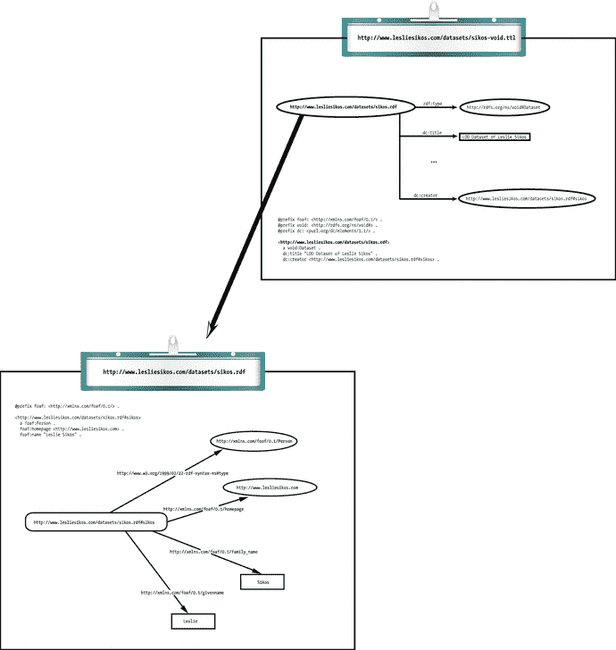
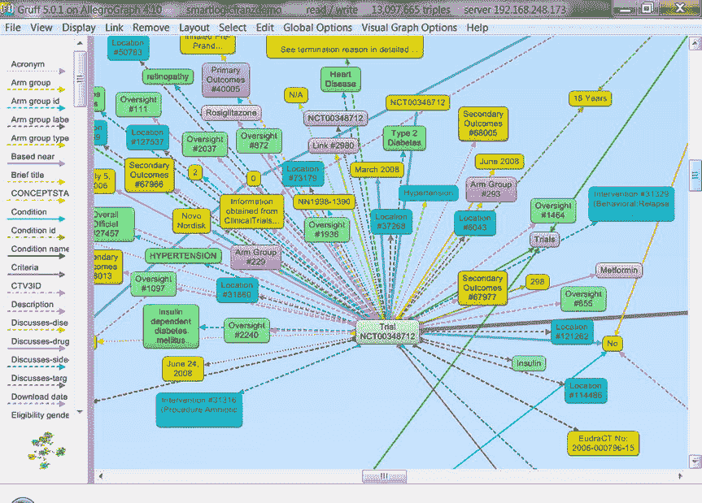
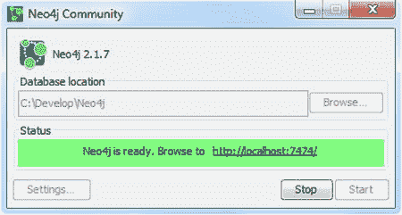
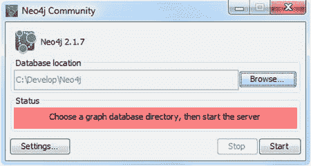
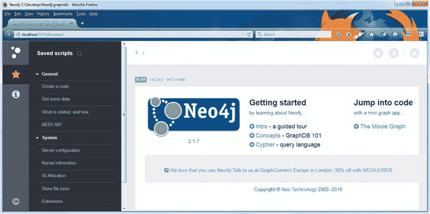
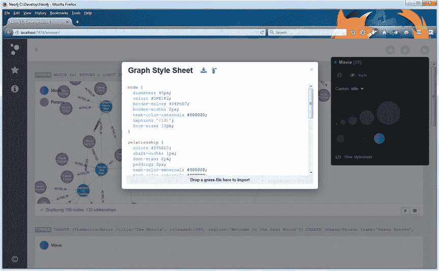
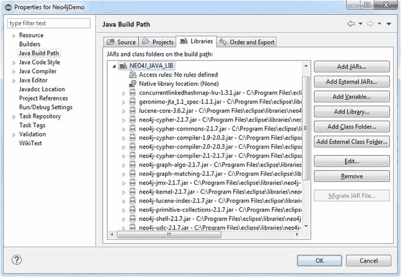
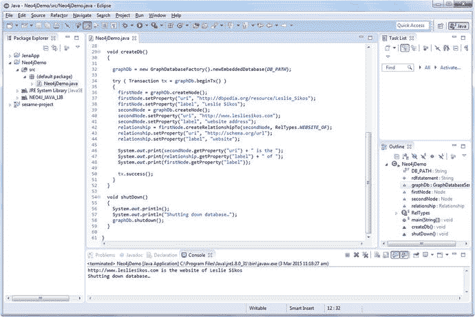

# 六、图数据库

图模型和算法无处不在，因为它们适用于电子商务、社交媒体网络、研究、计算机网络、电子学中的知识表示，以及最大流问题、路线问题和网络搜索。图数据库是具有创建、读取、更新和删除(CRUD)方法的数据库，这些方法展示了图形数据模型，例如属性图(包含节点和关系)、超图(关系可以连接任意数量的节点)、RDF 三元组(主题-谓词-对象)或四元组(命名为图形-主题-谓词-对象)。图数据库通常是为在线事务处理(OLTP)系统设计的，并针对事务性能、完整性和可用性进行了优化。与关系数据库和 NoSQL 数据库不同，包括三元存储和四元存储在内的专用图数据库不依赖于索引，因为图自然地提供了邻接索引，并且附加到节点的关系提供了到其他相关节点的直接连接。使用这种局部性遍历图来执行图查询，这可以以比通过全局索引连接数据的关系数据库高几个数量级的效率来执行。事实上，大多数图数据库都非常强大，甚至适用于大数据应用。

## 图数据库

为了利用资源描述框架(RDF)的能力，语义网上的数据可以存储在图数据库中，而不是关系数据库中。图数据库是存储 RDF 语句并实现语义查询的图结构的数据库，使用节点、边和属性来表示和检索数据。少数图数据库是基于关系数据库的，而大多数都是为存储和检索 RDF 语句而专门构建的。

图数据库有两个重要的属性，它们决定了效率和实现潜力。第一个是存储，它可以是本地图存储，也可以是将 RDF 图转换为关系、面向对象或通用数据库结构的数据库引擎。另一个主要属性是处理引擎。真正的图数据库实现了所谓的无索引邻接，由此连接的节点在数据库中彼此物理链接。因为每个元素都包含指向其相邻元素的直接指针，所以不需要索引查找。图数据库通过对图形节点和关系的简单抽象来存储任意复杂的 RDF 图。与其他数据库管理系统不同，图数据库不像关系数据库那样使用外键来推断实体之间的连接，也不像 MapReduce 那样使用其他数据。计算算法被实现为图形计算引擎，它识别聚类并回答查询。

图数据库相对于关系数据库和 NoSQL 商店的主要优势之一是性能。在索引、计算能力、存储和查询方面，图数据库通常比传统数据库强大数千倍。在关系数据库中，数据关系的查询性能会随着数据集的增长而下降，与之相反，图数据库的性能保持相对稳定。

虽然关系数据库预先需要一个关于知识领域的全面的数据模型，但是图数据库天生是灵活的，因为图可以毫不费力地用新节点和新关系类型来扩展，而子图可以自然地合并到它们的超图中。

因为图数据库实现了免费的标准，如用于数据建模的 RDF 和用于查询的 SPARQL，所以存储通常没有专有格式和第三方依赖性。图数据库的另一大优势是可以选择使用任意的外部词汇表和模式，而数据可以通过应用编程接口(API)和强大的查询以编程方式获得。

Note

一些图数据库在存储和检索 RDF 三元组或四元组时有局限性，因为底层模型并不总是很好地涵盖 RDF 的特性，例如，使用 URIs 作为标识符并不是默认场景，而且命名约定通常与 RDF 不同。大多数图数据库不支持现成的 SPARQL，尽管许多图数据库提供了 SPARQL 插件。图数据库供应商推出的专有查询语言没有像 SPARQL 那样标准化。

被广泛采用的关系数据库最初被设计成以一种有组织的方式存储诸如表格结构之类的数据。具有讽刺意味的是，关系数据库在处理特殊关系时性能很差。例如，关系数据库的外键意味着开发和维护开销，而它们对于数据库的工作至关重要。在关系数据库中联接两个表可能会增加复杂性，因为外键元数据与业务数据混合在一起。即使简单的查询在计算上也可能很复杂。关系数据库中稀疏表的处理很差。关于 NoSQL 数据库，包括面向键值、文档和列的数据库，关系处理也不完美。因为 NoSQL 数据库通常存储多组不相连的文档、值或列(取决于类型)，所以它们对于存储数据互连和图形并不理想。

图数据库的主要参数是每秒三倍或每秒四倍的负载率(有时与索引时间相结合)和查询执行时间。可用于比较图数据库的其他特征是许可、源可用性(开放源、二进制分发或两者)、可伸缩性、图形模型、模式模型、API、专有查询语言和查询方法、支持的平台、一致性、对分布式处理的支持、分区、可扩展性、可视化工具、存储后端(持久性)、语言和备份/恢复选项。表 6-1 总结了最常用的图数据库的比较。

表 6-1。

Comparison of Common Graph Databases [2]

<colgroup><col> <col> <col> <col> <col> <col> <col> <col> <col> <col> <col> <col> <col> <col> <col> <col> <col></colgroup> 
|   | 许可证 | 平台 | 语言 | 分配 | 费用 | 事务性的 | 基于记忆的 | 基于磁盘的 | 单节点 | 分布式的 | 图形算法 | 基于文本的查询语言 | 可嵌入 | 软件 | 数据存储 | 类型 |
| --- | --- | --- | --- | --- | --- | --- | --- | --- | --- | --- | --- | --- | --- | --- | --- | --- |
| 关系型数据库 | GPL/专有 | x86 | C/C++ | 容器 | 自由的 | X | – | X | X | – | – | 结构化查询语言 | X | X | X | sqldb(SQL db) |
| 神谕 | 所有人 | x86 | C/C++ | 容器 | $180–$950 | X | – | X | X | X | – | 结构化查询语言 | X | X | X | sqldb(SQL db) |
| 数据库 | 所有人 | x86-Win | C++ | 容器 | $898–$8592 | X | – | X | X | – | – | 结构化查询语言 | – | X | X | sqldb(SQL db) |
| 数据库 | 公有土地 | x86 | C | Src/Bin | 自由的 | X | X | X | X | – | – | 结构化查询语言 | X | X | X | sqldb(SQL db) |
| 速写 | 所有人 | x86 | 可能是 Java | 容器 | Free-ish/$$$ | X | – | X | X | – | X | SPARQL/RDFS++/Prolog | – | X | X | 基因组数据库 |
| 阿朗戈布 | 街头流氓 | x86 | C/C++/JS | Src/Bin | 自由的 | – | – | X | X | – | – | 可接受的质量标准 | – | X | X | GDB/KV/DOC(多氯联苯/多氯联苯/多氯联苯) |
| DEXEDRINE 的简称 | 所有人 | x86 | C++ | 容器 | 免费个人/商业$$ | X | – | X | X | – | X | 横越 | X | – | X | 基因组数据库 |
| FlockDB | 街头流氓 | 爪哇 | Java/Scala/Ruby | 科学研究委员会 | 自由的 | – | – | X | X | X | – | – | – | X | X | 基因组数据库 |
| 图表库 | 所有人 | 爪哇 | 爪哇 | 容器 | 免费，每月 15 美元，20，000 美元 | ？ | – | X | X | – | – | 界限 | X | X | X | 基因组数据库 |
| HyperGraphDB | lgpl(lgpl) | 爪哇 | 爪哇 | 科学研究委员会 | 自由的 | mvcc(mvcc) | X | X | X | X | – | Hg 查询/遍历 | X | – | – | hyperdub |
| 无限图 | 所有人 | x86/Java | Java/C++ | 容器 | 免费试用/5000 美元 | 两者 | – | X | X | X | – | 格林林 | X | X | X | 基因组数据库 |
| 信息网格 | AGPL/专有 | 爪哇 | 爪哇 | Src/Bin | 免费+支持 | – | X | X | X | X | – | – | X | X | – | 基因组数据库 |
| Neo4j | GPL/专有 | 爪哇 | 爪哇 | Src/Bin | 免费，6000-24000 美元 | X | – | X | X | – | X | Cypher | X | X | X | GDB/NoSQL |
| OrientDB | 街头流氓 | 爪哇 | 爪哇 | Src/Bin | 免费+支持 | 两者 | X | X | X | X | – | 扩展 SQL/Gremlin | X | X | X | GDB/NoSQL |
| 土卫六 | 街头流氓 | 爪哇 | 爪哇 | Src/Bin | 免费+支持 | 两者 | – | X | X | X | – | 小妖精 | X | X | – | 基因组数据库 |
| 百吉饼 | 加州大学伯克利分校软件(Berkeley Software Distribution) | 爪哇 | Java/Scala/Spark | 科学研究委员会 | 自由的 | – | X | – | X | X | X | – | X | – | – | 英国标准管螺纹(British Standard Pipe) |
| 巴黎银行卢森堡 | 促进 | x86/C++ | C++ | Src/Bin | 自由的 | – | X | – | X | – | X | – | X | – | – | 图书馆 |
| 福纳斯 | 街头流氓 | 爪哇 | 爪哇 | 科学研究委员会 | 免费+支持 | 两者 | – | X | X | X | – | 格林林 | X | X | – | 大数据 |
| 杰吉 | GPL/CDDL | 爪哇 | Java/OpenGL | Src/Bin | 自由的 | – | X | – | X | – | X | – | X | X | – | 工具包 |
| 长颈鹿吗 | 街头流氓 | 爪哇 | 爪哇 | 科学研究委员会 | 自由的 | – | X | ； | X | X | X | – | X | – | – | 英国标准管螺纹(British Standard Pipe) |
| GraphLab | 街头流氓 | x86 | C++ | 科学研究委员会 | 自由的 | – | X | X | X | X | X | – | X | – | – | 英国标准管螺纹(British Standard Pipe) |
| 图表流 | lgpl/Cecil-c 足球俱乐部 | 爪哇 | 爪哇 | Src/Bin | 自由的 | – | X | – | X | – | X | – | X | – | – | 图书馆 |
| 哈马 | 街头流氓 | 爪哇 | 爪哇 | 科学研究委员会 | 自由的 | – | X | – | X | X | X | – | X | – | – | 英国标准管螺纹(British Standard Pipe) |
| mtgl(mtgl) | 加州大学伯克利分校软件(Berkeley Software Distribution) | x86/XMT | C++ | 科学研究委员会 | 自由的 | – | X | – | X | – | X | – | X | – | – | 图书馆 |
| 网络 x | 加州大学伯克利分校软件(Berkeley Software Distribution) | x86 | 计算机编程语言 | Src/Bin | 自由的 | – | X | – | X | – | X | – | X | – | – | 图书馆 |
| 飞马座 | 街头流氓 | 爪哇 | 爪哇 | Src/Bin | 自由的 | – | – | X | X | X | X | – | – | X | – | 大数据 |
| 毒刺 | 加州大学伯克利分校软件(Berkeley Software Distribution) | x86/XMT | C | 科学研究委员会 | 自由的 | – | X | – | X | – | X | – | X | X | X | 图书馆 |
| uRiKA | 所有人 | X 波段微波发射机(X-band Microwave Transmitter) | 可能是 C++ | 容器 | $$$$ | ？ | X | – | X | – | – | SPARQL | – | X | X | 装置 |

虽然图数据库供应商经常将他们的产品与其他图数据库进行比较，但事实上，基准测试 RDF 数据库的行业标准是 Lehigh University Benchmark (LUBM)，它适用于性能比较 [3 ]。

### 三联商店

所有为存储 RDF 三元组而设计的图数据库都被称为三元组存储或主-谓-对象数据库，然而，构建在现有商业关系数据库引擎(如基于 SQL 的数据库)之上的三元组存储通常不如具有从头构建的用于存储和检索 RDF 三元组的数据库引擎的本地三元组存储有效。由于将基于图形的 RDF 模型映射到 SQL 或 NoSQL 查询的困难，本地三元组存储的性能通常更好。

图数据库的优势源自 RDF、OWL 和 SPARQL 的优势特性。RDF 数据元素是全球唯一的和链接的，利用了图形结构的优势。添加一个新的模式元素就像插入一个带有新谓词的三元组一样简单。图数据库也支持专门的 SPARQL 查询。与关系数据库的列标题、外键或约束不同，图数据库的实体是用类来分类的；谓词是属性或关系；它们都是数据的一部分。由于 RDF 的实现，图数据库支持知识发现的自动推理。存储在这些数据库中的数据可以通过机器可读的本体统一词汇、词典和分类法。图数据库通常用于语义数据集成、社会网络分析和链接开放数据应用。

### Quadstores

在没有图标识符的情况下，并不总是能够解释 RDF 语句。例如，如果一个给定的名字被用作主语，如果我们不陈述我们想要描述的人，这就是断章取义。然而，如果我们将同一个人的网站地址添加到描述同一个人的每个三元组中，所有的组成部分都变得全球唯一和不可引用。四元组是一个带有图形标识符的主谓宾三元组。被识别的图称为命名图。

比如考虑一个注册在 datahub.io 上的 Turtle 文件中的 LOD 数据集描述，比如 [`http://www.lesliesikos.com/datasets/sikos-void.ttl`](http://www.lesliesikos.com/datasets/sikos-void.ttl) 。为了制作关于数据集图的 RDF 语句，subject 被设置为表示图的 RDF 文件的文件名和扩展名( [`http://www.lesliesikos.com/datasets/sikos.rdf`](http://www.lesliesikos.com/datasets/sikos.rdf) )。这使得编写关于文件的 RDF 语句成为可能，将它描述为一个 LOD 数据集(`void:Dataset`)，使用 Dublin Core 为它添加一个人类可读的标题(`dc:title`，声明它的创建者(`dc:creator`，等等，如图 6-1 所示。

图 6-1。

Referencing from a named graph to another named graph Caution

注意 [`http://www.lesliesikos.com/datasets/sikos.rdf`](http://www.lesliesikos.com/datasets/sikos.rdf) 和 [`http://www.lesliesikos.com/datasets/sikos.rdf#sikos`](http://www.lesliesikos.com/datasets/sikos.rdf#sikos) 的区别。第一个例子引用了一个文件；第二个是指档案中描述的人。

如果一个图数据库存储了每个三元组的图名(代表图的上下文或出处信息),这个数据库就称为四元存储。

## 最流行的图数据库

一些部署最广泛的高性能图数据库是 AllegroGraph、Neo4j、Blazegraph(以前的大数据)、OpenLink Virtuoso、Clark & Parsia 的 Stardog、BigOWLIM、4Store、YARS2、Jena TDB、RDFox、Jena SDB、Mulgara、RDF Gateway、Kowari 和 Sesame。然而，并不是每个人都使用本地图数据库引擎来存储三元组或四元组。例如 Oracle Spatial 和 Graph 与 Oracle 数据库，Jena 与 PostgreSQL，以及 3Store 与 MySQL 3。

### 速写

AllegroGraph 是业界领先的图数据库平台 [4 ]。它可以将地理空间、时间和社交网络查询组合成单个查询。它支持在线备份、时间点恢复、复制和热备用。AllegroGraph 支持自动三重索引、用户定义的索引以及谓词级别的文本索引。与其他数据库类似，AllegroGraph 实现了事务处理的 ACID(原子性、一致性、隔离性和持久性)属性。原子性意味着事务要么完全失败，要么完全成功。一致性意味着每个事务都将数据库作为一个整体从一种一致状态带到另一种一致状态，因此数据库永远不会不一致。隔离是指所有事务都可以处理其他已完成事务的数据，而不能依赖并发运行的事务的部分结果。持久性意味着，一旦数据库系统向应用发出事务成功完成的信号，即使存在硬件和软件故障，事务所做的更改也将持续，除非硬盘故障破坏了数据。

所有的 AllegroGraph 客户端(Java、Python、JavaScript、Lisp)都是基于 REST 协议的。AllegroGraph 支持多种编程语言和环境，例如 Sesame 或 Jena 中的 Java(通过命令行或 Eclipse 等 IDE)、Python、Ruby、C#、Clojure、JRuby、Scala、Perl、Lisp 和 PHP。graph 数据库支持在 Amazon EC2 上为分布式计算提供云托管。一般的图遍历可以通过 JIG 来执行，这是一个基于 JavaScript 的接口。AllegroGraph 还支持专用和公共会话。AllegroGraph 作为一个高级图数据库来存储 RDF 三元组，并通过各种查询 API(如 SPARQL 和 Prolog)来查询存储的三元组。它通过内置的推理机支持 RDFS++推理。AllegroGraph 包括对联邦、社会网络分析、地理空间能力和时间推理的支持。AllegroGraph 有三个版本:免费版(三元组数量限制在 500 万)、开发者版(三元组数量限制在 5000 万)、企业版(不限三元组)。

AllegroGraph 不仅可以存储三元组或四元组，还可以存储附加信息，包括命名图(上下文)和模型(包括唯一的三元组标识符和事务编号)，这使它成为一个五元组存储。AllegroGraph 在表示和索引地理空间和时间数据方面特别有效。它有 7 个标准指数和 24 个用户控制指数。标准索引是一组排序索引，用于快速识别可能匹配特定查询模式的连续三元组块。这些索引通过引用其排列的名称来识别。默认的一组指数称为`spogi`、`posgi`、`ospgi`、`gspoi`、`gposi`、`gospi`和`i`，其中

*   `s`代表主语 URI
*   `p`代表谓语 URI
*   `o`代表物体 URI 或文字
*   `g`代表图 URI
*   `i`代表三元组标识符(在三元组存储中是唯一的)

自定义索引排列用于消除应用不需要的索引，或者实现自定义索引以匹配不常见的三元模式。

AllegroGraph 支持全文索引、自由文本索引和范围索引。全文索引使得搜索布尔表达式、带有通配符的表达式和短语成为可能。自由文本索引支持自由文本搜索，通过它可以将关键字搜索与查询结合起来。

AllegroGraph 完全支持 RDF、SPARQL 1.0 和部分 SPARQL 1.1，并包括一个 RDFS++推理机。查询不仅可以通过 SPARQL 执行，还可以使用 Lisp、Prolog 或 JavaScript 以编程方式执行。Prolog 是通过一个叫做 CLIF+的可用性层为规则实现的，这使得将规则和查询结合起来变得很容易。AllegroGraph 在存储属性图方面也非常有效。AllegroGraph 支持节点类型、边类型、节点和边属性，以及有向、无向、受限和循环边、属性索引和本体。它支持通过邻接表和特殊索引的遍历。

AllegroGraph 实现了多种图形算法。例如，对于社交网络分析，它使用具有一流功能的生成器来处理单节点输入并返回所有子节点，而速度由邻域矩阵或邻接哈希表来保证。AllegroGraph 考虑了各种图特征，比如分离度(两个节点之间的距离)和连接强度(两个节点之间通过谓词和规则的最短路径的数量)。

AllegroGraph 的所有功能都可以通过 Lisp shell 获得，许多功能来自 cshell、wget 和 curl。Franz Inc .为开发人员提供 JavaScript、Prolog 和 Lisp 算法、Lisp 和 JavaScript 脚本、REST/JSON 协议支持、IDE 集成和管理工具。您可以从各种格式导入数据，并通过从 AllegroGraph 客户端创建三重转储来导出数据。

#### 网络视图

WebView 是 alle program 基于 HTTP 的图形用户界面(GUI ),用于用户和存储库管理，包含在 alle program 服务器分发包中。要连接到 WebView，请在 web 浏览器中浏览到服务器的 AllegroGraph 端口。如果您本地安装了 AllegroGraph，请使用带有端口号的 localhost。默认端口号为`10035`。使用 WebView，您可以浏览目录、存储库和联盟，管理存储库，将 Prolog 规则和函数应用于存储库，对存储库执行 RDFS++推理，以及将 RDF 数据导入存储库或存储库中的特定图形。WebView 可以显示已使用的命名空间，并提供添加新命名空间的选项。Telnet 连接可以对 AllegroGraph 进程开放，用于调试。本地和远程存储库可以联合成一个访问点。

WebView 支持存储库的三重索引配置和自由文本索引设置。SPARQL 和 Prolog 查询可以被执行、保存和重用，并且查询可以被捕获为 URL 以嵌入到应用中。WebView 可以将`construct`和`describe` SPARQL 查询结果可视化为图形。查询结果被连接到三元组和资源，从而很容易发现连接。WebView 还可用于管理 AllegroGraph 用户、用户角色和存储库访问，以及用于提交和回滚的开放会话。

#### 安装 AllegroGraph 服务器

本机安装 AllegroGraph 服务器有两种选择。第一个选项是以管理员身份在 Red Hat、Fedora 或 CentOS 上安装 RPM (Red Hat Package Manager)包中的 AllegroGraph。第二种选择是通过从一个`.tar.gz`档案中提取文件来安装服务器，这不需要管理权限。第三个选项是部署 VMware 应用装置，出于性能原因，不建议这样做。

##### 安装 RPM 包

要从 RPM 包安装 AllegroGraph 服务器，需要执行以下步骤:

Download the `.rpm` file from the Franz web site at [`http://franz.com/agraph/downloads/server`](http://franz.com/agraph/downloads/server) .   Install the RPM (see Listing 6-1)   Listing 6-1\. Installing the AllegroGraph Server from the RPM Package

`# rpm -i agraph-``version_number`

其中`version_number`是您将要安装的最新版本。

Run the configuration script as shown in Listing 6-2.   Listing 6-2\. Run the Configuration

`# /usr/bin/configure-agraph`

该脚本将询问用于存储配置文件、日志文件、数据、设置和服务器进程标识符的目录，以及端口号(参见清单 6-3 )。

Listing 6-3\. Directory and Port Settings

`Welcome to the AllegroGraph configuration program. This script will` 

`help you establish a baseline AllegroGraph configuration.`

`You will be prompted for a few settings.  In most cases, you can hit` 

`return to accept the default value.`

`Location of configuration file to create:`

`[/home/leslie/tmp/ag5.0/lib/agraph.cfg]:`

`Directory to store data and settings:`

`[/home/leslie/tmp/ag5.0/data]:`

`Directory to store log files:`

`[/home/leslie/tmp/ag5.0/log]:`

`Location of file to write server process id:`

`[/home/leslie/tmp/ag5.0/data/agraph.pid]:`

`Port:`

`[10035]:`

Tip

默认答案通常是足够的，如果需要，可以在以后重新配置。

If you are logged on as the root operator when running the script, you will be asked to create a non-root user account (see Listing 6-4).   Listing 6-4\. Creating a Restricted User Account

`User to run as:`

`[agraph]:`

`User ’agraph’ doesn’t exist on this system.`

`Create agraph user:`

`[y]:`

Add a user name and password for the AllegroGraph super-user (see Listing 6-5). This user is internal and not identical to the server logon account.   Listing 6-5\. Creating the SuperUser Account

`SuperUser account name:`

`[super]:`

`SuperUser account password:`

你必须通过重复来确认密码。

Set the instance timeout in seconds, i.e., the length of time a database will stay open without being accessed (see Listing 6-6). The default value is `604800` (one week in seconds).   Listing 6-6\. Set Instance Timeout

`Instance timeout seconds:`

`[604800]:`

The configuration file is saved to the folder you specified in step 3 (see Listing 6-7).   Listing 6-7\. The Configuration File Is Saved

`/home/leslie/tmp/ag5.0/lib/agraph.cfg has been created.`

`If desired, you may modify the configuration.`

The start and stop commands specific to your installation are displayed (see Listing 6-8).   Listing 6-8\. Commands to Start and Stop the Server with Your Installation

`You can start AllegroGraph by running:`

`/home/leslie/tmp/ag5.0/bin/agraph-control --config /home/leslie/tmp/ag5.0/lib/agraph.cfg start`

`You can stop AllegroGraph by running:`

`/home/leslie/tmp/ag5.0/bin/agraph-control --config /home/leslie/tmp/ag5.0/lib/agraph.cfg stop`

If you use a commercial version, you have to install the license key purchased from Franz Inc. The license key includes the client name, defines the maximum number of triples that can be used, the expiration date, and a license code. To install your license key, copy the whole key content you received via e-mail, and paste it into the `agraph.cfg` configuration file.   Note

还可以通过在`configure-agraph`命令上指定`--non-interactive`来非交互地运行配置脚本，以及提供脚本可能会提出的问题的答案的附加参数。需要路径作为其值的参数有`--config-file`、`--data-dir`、`--log-dir`和`--pid-file. --runas-user`期望一个用户，而`--create-runas-user`告诉脚本创建在`--runas-user`中命名的用户，如果它还不存在的话。可以使用`--super-user`声明获得超级用户权限的内部用户，这需要用户名作为其值。该用户的密码可以设置为`--super-password`，后跟密码。如果不希望密码显示在命令行中，可以用`--super-password-file`指定一个包含超级用户密码的文件，后跟路径。

要验证安装，请打开浏览器并加载 AllegroGraph WebView URL，它是服务器的 IP 地址，后跟分号(:)和端口号。对于本地安装，IP 地址被替换为`localhost`。

如果您想在以后的任何时候卸载服务器，您可以在`rpm`命令中使用`erase`参数，如清单 6-9 所示，这不会删除 AllegroGraph 创建的其他目录。

Listing 6-9\. Uninstalling AllegroGraph

`# rpm --erase agraph`

##### 安装 TAR 归档文件

安装 AllegroGraph 服务器的另一个选项是解压缩 gzipped TAR(磁带归档)。对于 Ubuntu 和其他 Linux 用户来说，这是一个很好的选择，并且不需要管理权限。

Download the `.tar.gz` file from [`http://franz.com/agraph/downloads/server`](http://franz.com/agraph/downloads/server) .   Extract the archive using the `tar` command, as shown in Listing 6-10.   Listing 6-10\. Extracting the TAR Archive

`$ tar zxf agraph-``version_number`

The command creates the `agraph-version_number` subdirectory, which includes `install-agraph`, the installation script. You must provide the path to a writable directory on which you want to install AllegroGraph, as shown in Listing 6-11.   Listing 6-11\. Run the Installation Script

`$ agraph-5.0/install-agraph /home/leslie/tmp/ag5.0`

`Installation complete.`

`Now running configure-agraph.`

Answer the questions to configure your installation (similar to steps 3–6 for configuring the RPM installation). The last step reveals how you can start and stop your server.   Verify your installation by opening a browser and directing it to your server IP or localhost with the port number you specified during installation.  

要卸载一个旧的`.tar.gz`安装，删除 AllegroGraph 安装目录，如清单 6-12 所示。

Listing 6-12\. Removing the AllegroGraph Directory

`% rm -rf obsolete-allegrograph-directory/`

##### 部署虚拟机

如果您使用虚拟的 64 位 Linux 来评估或使用 AllegroGraph，您需要一个虚拟环境，并且您必须部署虚拟机映像文件。

Note

Franz Inc .鼓励本地安装，而不是虚拟环境，即使是为了评估。

Download the virtual environment you want to use, such as VMware Player for Windows or VMware Fusion for Mac OS, from [`https://my.vmware.com/web/vmware/downloads`](https://my.vmware.com/web/vmware/downloads) .   Download the virtual machine image file from [`http://franz.com/agraph/downloads/`](http://franz.com/agraph/downloads/) .   Unzip the image.   Run the VMware Player.   Click Open a Virtual Machine.   Browse to the directory where you unzipped the image file and open `AllegroGraph vx Virtual Machine.vmx` file, where `x` is the version of AllegroGraph.   Take ownership, if prompted.   Play Virtual Machine.   When prompted for Moved or Copied, select Copied.   Log in to the Linux Virtual Machine as the user `franz`, with the password `allegrograph`.   To start AllegroGraph, double-click the `agstart` shortcut on the Desktop and select Run in Terminal Window when prompted, or open a Terminal window and run the `agstart` command.   Launch FireFox and click AGWebView in the taskbar, or visit `http://localhost:10035`.   Log in to AllegroGraph as the `test` user, with the password `xyzzy`.  

要停止 AllegroGraph，双击桌面上的 agstop 快捷方式，并在出现提示时选择在终端窗口中运行，或打开终端窗口并运行`agstop`命令。

#### 安装 AllegroGraph 客户端

AllegroGraph 拥有 Java、Python、Clojure、Ruby、Perl、C#和 Scala  [5 ]的客户端。例如，Java 客户机的一个选项是将其作为 Eclipse 项目运行。Jena 客户机是 Java 客户机的变体。Python 客户端在核心 Python 安装之上需要 Python 的`cjson`和`pycurl`库。您可以使用`rpm`命令中的`q`参数检查这些包是否安装在您的系统上，如清单 6-13 所示。

Listing 6-13\. Checking Python Dependencies for AllegroGraph

`rpm -q python python-cjson python-pycurl`

如果没有安装，在大多数 Linux 系统上你必须使用`yum`(见清单 6-14 )。

Listing 6-14\. Installing Dependencies

`sudo yum install python python-cjson python-pycurl`

对于 Ubuntu 系统，你需要`apt-get`来安装所需的库(参见清单 6-15 )。

Listing 6-15\. Installing Dependencies on Ubuntu

`sudo apt-get install python python-cjson python-pycurl`

#### Java API

启动服务器后，可以从 Java 中使用`new AllegroGraphConnection();`连接到默认运行的服务器(参见清单 6-16 )。如果您使用的端口号不是默认的`10035`端口，您必须使用`setPort(port_number)`设置端口号。

Listing 6-16\. Connecting to the AllegroGraph Server Through the Java API

`import com.franz.agbase.*;`

`public class AGConnecting {`

`public static void main(String[] args) throws AllegroGraphException {`

`AllegroGraphConnection ags = new AllegroGraphConnection();`

`try {`

`System.out.println("Attempting to connect to the server on port" + ags.getPort());`

`ags.enable();`

`} catch (Exception e) {`

`throw new AllegroGraphException("Server connection problem.", e);`

`}`

`System.out.println("Connected.");`

`}`

`}`

可以使用`create`方法创建一个三元组存储，并用`closeTripleStore`方法关闭，如清单 6-17 所示。您可以使用`ags.disable()`断开与 AllegroGraph 服务器的连接。

Listing 6-17\. Creating an AllegroGraph Triplestore with the Java API

`import com.franz.agbase.*;`

`public class AGCreateTripleStore {`

`public static void main(String[] args) throws AllegroGraphException {`

`AllegroGraphConnection ags = new AllegroGraphConnection();`

`try {`

`ags.enable();`

`} catch (Exception e) {`

`throw new AllegroGraphException("Server connection problem.", e);`

`}`

`try {`

`AllegroGraph ts = ags.create("newstore", AGPaths.TRIPLE_STORES);`

`System.out.println("Triplestore created.");`

`System.out.println("Closing triplestore…");`

`ts.closeTripleStore();`

`} catch (Exception e) {`

`System.out.println(e.getMessage());`

`}`

`System.out.println("Disconnecting from the server…");`

`ags.disable();`

`}`

`}`

从 Java 打开 AllegroGraph triplestore 有两种方法:使用`access`方法打开存储，如果存储不存在，它将被创建；或者使用`open`方法打开现有的存储，但是如果 triplestore 不存在，它将给出一个错误。让我们打开一个三元组存储并索引所有的三元组，如清单 6-18 所示。

Listing 6-18\. Indexing all Triples of an AllegroGraph Triplestore

`import com.franz.agbase.*;`

`import com.franz.agbase.AllegroGraph.StoreAttribute;`

`public class AGOpenTripleStore {`

`public static void main(String[] args) throws AllegroGraphException {`

`AllegroGraphConnection ags = new AllegroGraphConnection();`

`try {`

`ags.enable();`

`} catch (Exception e) {`

`throw new AllegroGraphException("Server connection problem.", e);`

`}`

`System.out.println("Opening triplestore…");`

`ts = ags.open("existingstore", AGPaths.TRIPLE_STORES);`

`System.out.println("Triple store opened with " + ts.numberOfTriples() + " triples.");`

`try {`

`System.out.println("Indexing triplestore…");`

`ts.indexAllTriples();`

`} catch (Exception e) {`

`System.out.println(e.getLocalizedMessage());`

`}`

`ts.closeTripleStore(true);`

`System.out.println("Disconnecting from the server.");`

`ags.disable();`

`}`

默认访问模式是读+写。要以只读模式打开一个 triplestore，将`StoreAttribute`设置为`READ_ONLY`(参见清单 6-19 )。

Listing 6-19\. Open a Triplestore in Read-Only Mode

`ts = new AllegroGraph(AGPaths.TRIPLE_STORES + "yourstore");`

`ts.setAttribute(StoreAttribute.READ_ONLY, true);`

`ags.open(ts);`

让我们在 N-triples 中的 triplestore 中添加一个 triple。一旦`com.franz.agbase.*`被导入并且与服务器的连接建立，您就可以使用`addStatement`向 triplestore 添加一条语句(参见清单 6-20 )。

Listing 6-20\. Adding an RDF Statement to the Triplestore

`ts.addStatement("<`[`http://www.lesliesikos.com/datasets/sikos.rdf#sikos`](http://www.lesliesikos.com/datasets/sikos.rdf#sikos)`>",`

`"<`[`http://xmlns.com/foaf/0.1/homepage`](http://xmlns.com/foaf/0.1/homepage)`>",`

`"<`[`http://www.lesliesikos.com`](http://www.lesliesikos.com/)

使用`showTriples`方法可以检索和显示默认图的所有三元组(参见清单 6-21 )。

Listing 6-21\. Listing All Triples

`TriplesIterator cc = ts.getStatements(null, null, null);`

`AGUtils.showTriples(cc);`

使用`showTripleStoreInfo`可以检索三元组存储信息，如三元组的数量或三元组存储中使用的名称空间列表(参见清单 6-22 )。

Listing 6-22\. Displaying Triplestore Information

`import com.franz.agbase.*;`

`public class AGTripleStoreInfo {`

`public static void showTripleStoreInfo(AllegroGraph mystore) throws AllegroGraphException {`

`System.out.println("NumberOfTriples: " + ts.numberOfTriples());`

`AGUtils.printStringArray("Namespace Registry: ", ts.getNamespaces());`

`}`

`}`

为了运行一个简单的 SPARQL `SELECT`查询来检索所有的主-谓-宾三元组(`SELECT * {?s ?p ?o}`)，我们创建一个`SPARQLQuery`对象(`sq`)并使用`doSparqlSelect`显示查询结果(参见清单 6-23 )。

Listing 6-23\. Querying the Triplestore Through the Java API

`import com.franz.agbase.*;`

`public class AGSparqlSelect {`

`public static void main(String[] args) throws AllegroGraphException {`

`AllegroGraphConnection ags = new AllegroGraphConnection();`

`try {`

`ags.enable();`

`} catch (Exception e) {`

`throw new AllegroGraphException("Server connection problem", e);`

`}`

`AllegroGraph ts = ags.renew("sparqlselect", AGPaths.TRIPLE_STORES);`

`ts.addStatement("<`[`http://www.lesliesikos.com/datasets/sikos.rdf#sikos`](http://www.lesliesikos.com/datasets/sikos.rdf#sikos)`>",`

`"<`[`http://xmlns.com/foaf/0.1/homepage`](http://xmlns.com/foaf/0.1/homepage)`>",`

`"<`[`http://www.lesliesikos.com`](http://www.lesliesikos.com/)

`ts.addStatement("<`[`http://www.lesliesikos.com/datasets/sikos.rdf#sikos`](http://www.lesliesikos.com/datasets/sikos.rdf#sikos)`>",`

`"<`[`http://xmlns.com/foaf/0.1/interest`](http://xmlns.com/foaf/0.1/interest)`>",`

`"<`[`http://dbpedia.org/resource/Electronic_organ`](http://dbpedia.org/resource/Electronic_organ)

`String query = "SELECT * {?s ?p ?o}";`

`SPARQLQuery sq = new SPARQLQuery();`

`sq.setTripleStore(ts);`

`sq.setQuery(query);`

`doSparqlSelect(sq);`

`}`

`public static void doSparqlSelect(SPARQLQuery sq) throws AllegroGraphException {`

`if (sq.isIncludeInferred()) {`

`System.out.println("\nQuery (with RDFS++ inference):");`

`} else {`

`System.out.println("\nQuery:");`

`}`

`System.out.println("  " + sq.getQuery());`

`ValueSetIterator it = sq.select();`

`AGUtils.showResults(it);`

`}`

`}`

#### 粗哑的

Gruff 是一个基于 grapher 的 triplestore 浏览器、查询管理器和 AllegroGraph  [6 ]的编辑器。Gruff 提供了各种工具，用于显示循环图、创建属性表以及以 SPARQL 或 Prolog 代码的形式管理查询。在 graph view 中，可以使用 Gruff 可视化和操作 AllegroGraph 图中存储的节点和关系，如图 6-2 所示。

图 6-2。

Visualizing a graph stored in AllegroGraph using Gruff [7]

查询视图显示一个视图，您可以在该视图上运行 SPARQL 或 Prolog 查询，并在表中查看结果。图形查询视图通过排列表示查询中三元组模式的节点框和链接线，使得将查询可视化地规划为图表成为可能。三元组模式可以包含变量以及图形对象。图形查询视图支持层次结构和过滤器，以及 SPARQL 或 Prolog 查询的自动生成。表视图显示单个节点的属性表。可以使用超链接浏览相关节点，并且可以直接编辑属性值。每个表行代表存储中的一个 RDF 三元组。

### Neo4j

Neo4j 是世界领先的图数据库之一，它查询连接数据的速度比关系数据库快一千倍 [8 ]。Neo4j 有一个免费的“社区版”和一个商业的“企业版”，都支持属性图；本地图形存储和处理；高性能原生 API ACID；自己的图查询语言，Cypher 和 HTTPS(通过插件)。仅在企业版中提供的高级性能和可伸缩性特性是企业锁管理器，一种高性能缓存；聚类；热备份；和高级监控。通过安装一个名为 neo-rdf 的插件，Neo4j 可以用作三重存储或四重存储。

#### 装置

Neo4j 服务器在 Windows 下有两种格式:`.exe`和`.zip`。Neo4j 可以使用`.exe`安装程序进行安装，如下所示:

Download the latest Neo4j Server executable installation file from [`www.neo4j.org/download`](http://www.neo4j.org/download) .   Double-click the `.exe` file.   Click Next and accept the agreement.   Start the Neo4j Server by clicking Neo4j Community under Start button ➤ All Programs ➤ Neo4j Community ➤ Neo4j Community  

默认情况下会选择`C:\Users\username\Documents\Neo4j\default.graphdb`数据库，可以更改(见图 6-3 )。

Click the Start button, which creates the necessary files in the background in the specified directory.   Access Neo4j by visiting `http://localhost:7474` in your browser (see Figure 6-4).

图 6-4。

Neo4j started  

图 6-3。

Neo4j ready to be started

左侧 Neo4j web 界面的侧边栏提供了对有关当前 Neo4j 数据库(节点标签、关系类型以及数据库位置和大小)、保存的脚本(参见图 6-5 )的信息以及诸如文档、指南、示例图应用、参考以及 Neo4j 社区资源等信息的方便的可点击访问。

图 6-5。

The web interface of Neo4j

Neo4j web 界面在顶层提供命令编辑和执行(从`$ :`开始)，包括使用 Neo4j 的查询语言 Cypher 进行查询。如果您编写复杂的查询或命令，或者您希望经常使用的命令，您可以保存它们以供将来使用。默认情况下，命令编辑器是一个单行编辑器，仅适用于短查询或命令。如果需要更多的空间，可以用 Shift+Enter 切换到多行编辑，这样就可以编写跨越多行的命令，或者编写多个命令，而不用逐个执行(见图 6-6 )。

图 6-6。

Writing Cypher commands

在多行编辑中，可以使用 Ctrl+Enter 运行查询。使用命令历史可以很容易地检索以前使用的命令。在命令行编辑器中，您也可以使用客户端命令，比如打开 Neo4j 帮助的`:help`。浏览器窗口的主要部分显示内容、查询答案等。，具体取决于您使用的命令。每个命令的执行都会产生一个结果框架(子窗口)，它被添加到流的顶部，以创建一个按时间倒序排列的可滚动集合。每个子窗口都可以最大化为全屏，或者通过鼠标悬停在子窗口右上角的两个图标来关闭。类似的子窗口也用于数据可视化。可以使用`:clear`命令清除该流。

Neo4j 的 web 界面提供了高级可视化选项。节点和关系可以用您选择的颜色显示标识符或标签。通过 CSS 样式表可以任意改变图形可视化的颜色、线宽、字体大小和气泡大小，如图 6-7 所示。

图 6-7。

Graph visualization options in Neo4j

#### Java API

Neo4j 有一个原生 Java API 和一个 Cypher Java API。为了演示 Neo4j 的原生 Java API，让我们在 Eclipse 中开发一个 Java 应用。

Click OK.   Click Finish.   Once you click OK, the Neo4j software library will be added to your Eclipse project.   If you don’t have Eclipse installed, follow the instructions discussed in Chapter 4.   Visit [`http://www.neo4j.org/download`](http://www.neo4j.org/download) and under the Download Community Edition button, select Other Releases.   Under the latest release, select the binary of your choice for Linux or Windows.   Extract the archive.   In Eclipse, create a Java project by selecting File ➤ New ➤ Java Project.   Right-click the name of the newly created project and select Properties (or select File ➤ Properties).   Select Java Build Path and click the Libraries tab.   Click Add Library… on the right.   Select User Library as the library type.   Click the Next ➤ button on the bottom.   Click User Libraries… on the right.   Click the New… button.   Add a name to your library, such as `NEO4J_JAVA_LIB`.   Click the Add external JARs… button on the right.   Browse to your Neo4j directory (`neo4j-community-version_number`) and go to the `lib` subdirectory.   Select all the `.jar` files (for example, with Ctrl+A) and click Open, which will add the files to your project library (see Figure 6-8).

图 6-8。

The Neo4j software library  

让我们用节点、节点之间的关系、节点属性和关系属性创建一个简单的图。

Initialize the database as shown in Listing 6-24.   Listing 6-24\. Initializing the Database

`import org.neo4j.graphdb.GraphDatabaseService;`

`import org.neo4j.graphdb.Node;`

`import org.neo4j.graphdb.Relationship;`

`import org.neo4j.graphdb.RelationshipType;`

`import org.neo4j.graphdb.Transaction;`

`import org.neo4j.graphdb.factory.GraphDatabaseFactory;`

`public class Neo4jDemo`

`{`

`private static final String DB_PATH = "target/neo4jdemodb";`

`GraphDatabaseService graphDb;`

`Node firstNode;`

`Node secondNode;`

`Relationship relationship;`

`}`

Define a new relationshSeip type as `WEBSITE_OF` (see Listing 6-25).   Listing 6-25\. Defining a New Relationship Type

`private static enum RelTypes implements RelationshipType`

`{`

`WEBSITE_OF`

`}`

Create the `main` method, as shown in Listing 6-26.   Listing 6-26\. Creating the `main` Method

`public static void main(final String[] args)`

`{`

`Neo4jDemo dbsample = new Neo4jDemo();`

`dbsample.createDb();`

`dbsample.shutDown();`

`}`

Create the graph nodes `graphDb.createNode()`; set node and relationship properties with `setProperty`; and display the RDF statement, using the label of the subject and the predicate, and the URI of the object (see Listing 6-27). The simple RDF statement will describe the relationship between the machine-readable description of a person and the URL of his/her web site.   Listing 6-27\. Creating Nodes and Setting Properties

`void createDb()`

`{`

`graphDb = new GraphDatabaseFactory().newEmbeddedDatabase(DB_PATH);`

`try ( Transaction tx = graphDb.beginTx() )`

`{`

`firstNode = graphDb.createNode();`

`firstNode.setProperty("uri", "`[`http://dbpedia.org/resource/Leslie_Sikos`](http://dbpedia.org/resource/Leslie_Sikos)

`firstNode.setProperty("label", "Leslie Sikos");`

`secondNode = graphDb.createNode();`

`secondNode.setProperty("uri", "`[`http://www.lesliesikos.com`](http://www.lesliesikos.com/)

`secondNode.setProperty("label", "website address");`

`relationship = firstNode.createRelationshipTo(secondNode, RelTypes.WEBSITE_OF);`

`relationship.setProperty("uri", "`[`http://schema.org/url`](http://schema.org/url)

`relationship.setProperty("label", "website");`

`System.out.print(secondNode.getProperty("uri") + " is the ");`

`System.out.print(relationship.getProperty("label") + " of ");`

`System.out.print(firstNode.getProperty("label"));`

`tx.success();`

`}`

`}`

Shut down the Neo4j database once you have finished (see Listing 6-28).   Listing 6-28\. Shutting Down Neo4j

`void shutDown()`

`{`

`System.out.println();`

`System.out.println("Shutting down database…");`

`graphDb.shutdown();`

`}`

Run the application (see Listing 6-29) to display the RDF statement we created in the database (see Figure 6-9).

图 6-9。

A Neo4j application in Eclipse   Listing 6-29\. Final Code for Creating a Database with Nodes and Properties, and Displaying Stored Data

`import org.neo4j.graphdb.GraphDatabaseService;`

`import org.neo4j.graphdb.Node;`

`import org.neo4j.graphdb.Relationship;`

`import org.neo4j.graphdb.RelationshipType;`

`import org.neo4j.graphdb.Transaction;`

`import org.neo4j.graphdb.factory.GraphDatabaseFactory;`

`public class Neo4jDemo`

`{`

`private static final String DB_PATH = "target/neo4jdemodb";`

`GraphDatabaseService graphDb;`

`Node firstNode;`

`Node secondNode;`

`Relationship relationship;`

`private static enum RelTypes implements RelationshipType`

`{`

`WEBSITE_OF`

`}`

`public static void main(final String[] args)`

`{`

`Neo4jDemo dbsample = new Neo4jDemo();`

`dbsample.createDb();`

`dbsample.shutDown();`

`}`

`void createDb()`

`{`

`graphDb = new GraphDatabaseFactory().newEmbeddedDatabase(DB_PATH);`

`try ( Transaction tx = graphDb.beginTx() )`

`{`

`firstNode = graphDb.createNode();`

`firstNode.setProperty("uri", "`[`http://dbpedia.org/resource/Leslie_Sikos`](http://dbpedia.org/resource/Leslie_Sikos)

`firstNode.setProperty("label", "Leslie Sikos");`

`secondNode = graphDb.createNode();`

`secondNode.setProperty("uri", "`[`http://www.lesliesikos.com`](http://www.lesliesikos.com/)

`secondNode.setProperty("label", "website address");`

`relationship = firstNode.createRelationshipTo(secondNode, RelTypes.WEBSITE_OF);`

`relationship.setProperty("uri", "`[`http://schema.org/url`](http://schema.org/url)

`relationship.setProperty("label", "website");`

`System.out.print(secondNode.getProperty("uri") + " is the ");`

`System.out.print(relationship.getProperty("label") + " of ");`

`System.out.print(firstNode.getProperty("label"));`

`tx.success();`

`}`

`}`

`void shutDown()`

`{`

`System.out.println();`

`System.out.println("Shutting down database…");`

`graphDb.shutdown();`

`}`

`}`

### 4 商店

4Store 是一个高效、可扩展且稳定的 RDF 数据库，可用于 Arch Linux、Debian、Ubuntu、Fedora 和 CentOS 等 Linux 系统，以及 Mac OS 和 FreeBSD  [9 ]。要在 Linux 上安装 4Store，请按照下列步骤操作:

Download the installer from [`http://www.4store.org`](http://www.4store.org/) .   Prepare your system to be used with 4Store by configuring it to look for libraries in `/usr/local/lib` and/or `/usr/local/lib64`. On most systems, you have to create a file called `/etc/ld.so.conf.d/local.conf` to achieve this, which contains these two paths, each on a separate line. You have to run `/sbin/ldconfig` as root. Once completed, the `$PKG_CONFIG_PATH` environmental variable should include the correct paths for locally installed packages.1 Check whether your Linux distribution includes all the dependencies, namely `raptor`, `rasqal`, `glib2`, `libxml2`, `pcre`, `avahi`, `readline`, `ncurses`, `termcap`, `expat`, and `zlib`.   Build your 4Store from Tarballs or Git. For the first option, extract the files from the `.tar.gz` archive with `tar xvfz 4store-version.tar.gz`. Change the working directory to the `4store-version` directory with `cd`. Run `./configure`, and then run `make`. For the second option, change directory using `cd` to the directory that Git cloned, and run `sh autogen.sh`. The rest of the installation is the same as in the steps for the first option.   Note

从 Git 创建您的构建可能需要额外的依赖项。

Install 4Store by running `make install` as root.  

如果你想在 Mac 上安装 4Store，下载最新版本，打开`.dmg`，通过拖拽到`Applications`文件夹来安装 4Store 应用。

安装完成后，您可以运行 4Store 应用，它会为您提供一个命令行。您可以使用命令`4s-backend-setup triplestorename`创建一个 triplestore，使用`4s-backend triplestorename`启动该 triplestore，并使用`4s-httpd -p portnumber triplestorename`运行一个 SPARQL 端点。web 界面将在`http://localhost:portnumber`出现在您的浏览器中。

从 RDF 文件导入数据的最简单命令是使用`4s-import`，指定导入数据的数据库名称和源 RDF，如清单 6-30 所示。

Listing 6-30\. Importing Data from an RDF File to 4Store

`4s-import your4store external.rdf`

若要以编程方式导入数据，可以根据您喜欢的语言从各种选项中进行选择。例如，在 Ruby 中，您可以使用`4store-ruby` ( [`https://github.com/moustaki/4store-ruby`](https://github.com/moustaki/4store-ruby) )，这是一个通过 HTTP 工作的 Ruby 接口。要访问 SPARQL 服务器，只需要 HTTP PUT 调用，大多数现代编程语言都支持这种调用，不需要安装特定于存储的包。然而，专门构建的软件库使 HTTP 请求变得更加容易。例如，在 Ruby 中，可以使用`rest-client` ( [`https://github.com/rest-client/rest-client`](https://github.com/rest-client/rest-client) )，如清单 6-31 所示。如果没有安装`rest-client`，可以正常安装，比如`sudo gem install rest-client`。

Listing 6-31\. Using `rest-client`

`#!/usr/bin/env ruby`

`require ’rubygems’`

`require ’rest_client’`

`filename = ’/social.rdf’`

`graph    = ’`[`http://yourgraph.com`](http://yourgraph.com/)

`endpoint = ’http://localhost:8000’`

`response = RestClient.put endpoint + graph, File.read(filename), :content_type =>` 

`’application/rdf+xml’`

`puts "Response #{response.code}:`

`#{response.to_str}"`

要从命令行运行脚本，请使用 ruby 命令，并将文件名作为参数，比如`ruby loadrdf24store.rb`。现在，如果您在浏览器中访问`http://localhost:portnumber/status/size/`，从 RDF 文件添加的新三元组应该会列出来。

让我们以编程方式运行一个 SPARQL 查询，并将结果处理为 XML，以列出数据集的 RDF 类型。

Install the XML parser Nokogiri for Ruby as `gem install nokogiri`.   Load all the required libraries (see Listing 6-32).   Listing 6-32\. Loading Required Libraries

`#!/usr/bin/env ruby`

`require ’rubygems’`

`require ’rest_client’`

`require ’nokogiri’`

Create a string for storing the SPARQL query and another one to store the endpoint (see Listing 6-33).   Listing 6-33\. Creating the Query and Endpoint Strings

`query = ’SELECT DISTINCT ?type WHERE { ?thing a ?type . } ORDER BY ?type’`

`endpoint = ’http://localhost:8000/sparql/’`

Using Nokogiri, process the XML output of the SPARQL query (see Listing 6-34).   Listing 6-34\. Processing the SPARQL Query Output

`response = RestClient.post endpoint, :query => query`

`xml = Nokogiri::XML(response.to_str)`

Find all the RDF types in the XML output and display them with `puts`, as shown in Listing 6-35.   Listing 6-35\. Finding the RDF Types of the Output

`xml.xpath(’//sparql:binding[@name = "type"]/sparql:uri’, ’sparql’ => ’``http://www.w3.org/2005/sparql-results#`

`puts type.content`

`end`

Save the script as a Ruby file and run it using the `ruby` command with the file name as the parameter, such as `ruby rdf-types.rb`.  

### 神谕

Oracle 是业界领先的数据库。Oracle Spatial and Graph 是 Oracle 的 RDF triplestore/quadstore 和本体管理平台，提供自动分区和数据压缩，以及与 Oracle 数据库的高性能并行和直接路径加载以及通过 Jena 的加载[10]。

Oracle Spatial and Graph 通过 SPARQL 1.1、SPARQL endpoint web services、SPARQL/update、具有开源 Apache Jena 和 Sesame 的 Java APIs、具有嵌入式 SPARQL 图形模式的 SQL 查询以及 SQL insert 和 Update 支持并行 SPARQL 和 SQL 查询以及 RDF 图形更新。它还支持使用 SQL 操作符进行本体辅助的表数据查询。Oracle Spatial and Graph 采用并行、增量和安全操作进行本地推理，通过 RDFS、OWL 2、SKOS、用户定义的规则和用户定义的推理扩展进行可扩展推理。它为 PelletDB 和 TrOWL 提供了推理插件。Oracle Spatial 和 Graph 的语义索引适用于集成自然语言处理器的文本挖掘和实体分析。该数据库还支持 R2RML 关系数据到 RDF 三元组的直接映射。对于空间 RDF 数据存储和查询，Oracle 也支持 GeoSPARQL。

Oracle Spatial 和 Graph 可以与 Apache Jena 和 Sesame 应用开发环境以及用于查询、可视化和本体管理的领先语义 Web 工具集成。

#### 火焰图

Blazegraph 是 SYSTAP 的旗舰图数据库产品，SYSTAP 是图数据库(以前称为 Bigdata)的供应商。它是一个高度可扩展的开源存储和计算平台[11]。Blazegraph 适用于大数据应用，并被选为维基数据查询服务，专门设计用于支持大图，提供语义 Web (RDF/SPARQL)和图数据库(tinkerpop，blueprints，以顶点为中心)API。强健、可扩展、容错的企业级存储和查询功能与高可用性、在线备份、故障转移和自我修复相结合。

Blazegraph 具有超高性能的 RDF 图数据库，支持 RDFS 和 OWL Lite 推理，以及 SPARQL 1.1 查询。Blazegraph RDF 图数据库专为海量信息而设计，在一个 15 节点集群上，不到一小时就可以加载 10 亿条图形边。Blazegraph 可以在单机模式(Journal)、高可用性复制集群模式(HAJournalServer)或水平分片集群模式(BlazegraphFederation)下实现。Blazegraph 不仅可以从本地文件系统读取数据，还可以从 Web 或 Hadoop 分布式文件系统(HDFS)读取数据，从而执行分布式作业。存储索引是为单台机器上多达 500 亿条边的超大型数据集设计的，但 Blazegraph 在水平扩展架构中实现时可以扩展甚至更大的图形。除了高可用性，HAJournalServer 还提供复制、在线备份和水平查询伸缩。BlazegraphFederation 具有快速、可扩展的并行索引存储和递增的集群大小增长。这两个平台都支持带有快照隔离的完全并发读取器。

Blazegraph 为 Sesame 和 Blueprint 提供了 API。Blazegraph 可以作为服务器部署，并通过轻量级 REST API 访问。Blazegraph 与 Java 包装一起发布，包括一个芝麻包装和一个蓝图包装。Blazegraph 还有几个企业部署选项，包括一个高可用性架构和一个用于超大型图形的动态分片横向扩展架构。

## 摘要

在本章中，您了解了图数据库的强大功能以及它们相对于主流关系数据库和 NoSQL 数据库的优势。现在您已经理解了三元组和四元组的概念，以及用于语义 Web 应用的两种主要图数据库类型:三元组存储和四元组存储。现在，您已经熟悉了最流行的图数据库，并且知道如何安装和配置 AllegroGraph、Neo4j 和 4Store，以及如何使用它们的 API 进行编程数据库访问。您知道 AllegroGraph 和 Neo4j 用于显示、分析和操作图形节点和链接的可视化选项。

下一章将向您展示如何使用 SPARQL(RDF 的主要查询语言)查询结构化数据集，以及使用专有查询语言查询图形数据存储。您将学习如何基于链接开放数据(LOD)数据集中的知识编写查询来回答复杂的问题。

## 参考

Cudré-Mauroux, P., Enchev, I., Fundatureanu, S., Groth, P., Haque, A., Harth, A., Keppmann, F. L., Miranker, D., Sequeda, J., Wylot, M. (2013) NoSQL Databases for RDF: An Empirical Evaluation. Lecture Notes in Computer Science 2013, 8219:310–325, `http://dx.doi.org/10.1007/978-3-642-41338-4_20`.   McColl, R., Ediger, D., Poovey, J., Campbell, D., Bader, D. A. (2014) A performance evaluation of open source graph databases. In: Proceedings of the first workshop on Parallel programming for analytics applications, pp 11–18, New York, NY, `http://dx.doi.org/10.1145/2567634.2567638`.   Heflin, J. (2015) SWAT Projects—the Lehigh University Benchmark (LUBM). [`http://swat.cse.lehigh.edu/projects/lubm/`](http://swat.cse.lehigh.edu/projects/lubm/) . Accessed 8 April 2015.   Franz, Inc. (2015) AllegroGraph RDFStore Web 3.0’s Database. [`http://franz.com/agraph/allegrograph/`](http://franz.com/agraph/allegrograph/) . Accessed 10 April 2015.   Franz, Inc. (2015) AllegroGraph Client Downloads. [`http://franz.com/agraph/downloads/clients`](http://franz.com/agraph/downloads/clients) . Accessed 10 April 2015.   Franz, Inc. (2015) Gruff: A Grapher-Based Triple-Store Browser for AllegroGraph. [`http://franz.com/agraph/gruff/`](http://franz.com/agraph/gruff/) . Accessed 10 April 2015.   Franz, Inc. (2015) [`http://franz.com/agraph/gruff/springview3.png`](http://franz.com/agraph/gruff/springview3.png) . Accessed 10 April 2015.   Neo Technology Inc. (2015) Neo4j, the World’s Leading Graph Database. [`http://neo4j.com`](http://neo4j.com/) . Accessed 10 April 2015.   Garlik (2009) 4store—Scalable RDF storage. [`www.4store.org`](http://www.4store.org/) . Accessed 10 April 2015.   Oracle (2015) Oracle Spatial and Graph. [`www.oracle.com/technetwork/database/options/spatialandgraph/overview/index.html`](http://www.oracle.com/technetwork/database/options/spatialandgraph/overview/index.html) . Accessed 10 April 2015.   SYSTAP LLC (2015) Blazegraph. [`www.blazegraph.com/bigdata`](http://www.blazegraph.com/bigdata) . Accessed 10 April 2015.   Footnotes 1

假设您的 Linux 发行版没有打包最近版本的 Raptor 和 Rasqal。