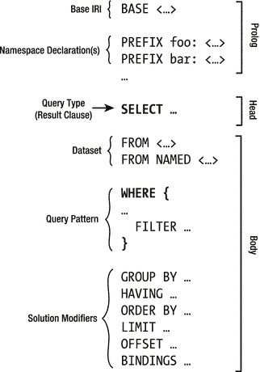
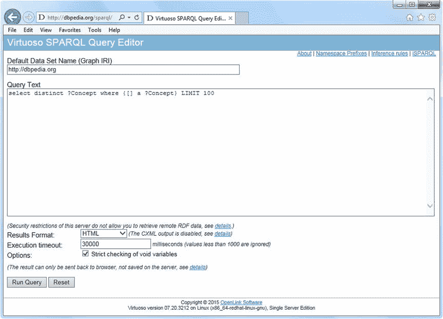

# 七、查询

虽然机器可读数据集主要是为软件代理发布的，但自动数据提取并不总是一个选项。语义信息检索通常涉及用户基于数据集或数据库中正式表示的知识来搜索复杂问题的答案。虽然结构化查询语言(SQL)用于查询关系数据库，但查询图数据库和平面资源描述框架(RDF)文件可以使用 SPARQL 协议和 RDF 查询语言(SPARQL)来完成，SPARQL 是 RDF 的主要查询语言，比 SQL 强大得多。SPARQL 是一种标准化语言，能够查询本地和在线 RDF 文件、链接开放数据(LOD)数据集和图数据库；基于查询的图中的信息构建新的 RDF 图；向图中添加新的 RDF 语句或从图中删除三元组；推断逻辑结果；和跨不同储存库的联合查询。SPARQL 可以一次查询多个数据源，将较小的图动态合并成一个大的超级图。虽然图数据库通常有专有的查询语言(通常基于或扩展 SPARQL)，但大多数公开可用的数据集都有一个 SPARQL 端点，您可以从该端点运行 SPARQL 查询。对于开发人员来说，许多语义 Web 软件工具都提供了 SPARQL 应用编程接口(API)用于编程访问。

## SPARQL:RDF 的查询语言

如前所述，RDF 的主要查询语言是 SPARQL(读作“sparkle”，SPARQL 协议和 RDF 查询语言的递归首字母缩写)，它可用于检索和操作存储在 RDF 中的信息，或以 RDF  [1 ]格式检索的信息。输出可以是结果集或 RDF 图。

### 结构和语法

SPARQL 使用类似 Notation3 的语法。URIs 可以完整地写在小于(`<`)和大于(`>`)字符之间(参见清单 7-1 )，或者使用带有`PREFIX`关键字的名称空间机制进行缩写(参见清单 7-2 )。

Listing 7-1\. Full URI Syntax in SPARQL

`<http://example.com>`

Listing 7-2\. Using the Namespace Mechanism in SPARQL

`PREFIX schema: <`[`http://schema.org/`](http://schema.org/)

在声明了 Schema.org 命名空间( [`http://schema.org/`](http://schema.org/) )后，例如 [`http://schema.org/Person`](http://schema.org/Person) 可以缩写为`schema:Person`。SPARQL 查询的默认名称空间可以通过使用不带前缀的`PREFIX`指令来设置(例如`PREFIX : <` [`http://yourdefaultnamespace.com/`](http://yourdefaultnamespace.com/) `>`)，这样就可以在查询中使用空前缀，比如`as ?a :knows ?b`。与 N3 类似，URI [`http://www.w3.org/1999/02/22-rdf-syntax-ns#type`](http://www.w3.org/1999/02/22-rdf-syntax-ns#type) 或`rdf:type`可缩写为`a`。文字可以用或不用语言标记和类型来编写。普通字符串由引号分隔，如`"a plain literal"`，而包括语言标签的普通字符串以`@`符号和标准语言代码结尾，如`"Wagen"@de`(德语中的单词 car)。类型化文字的编写类似于 RDF 中的类型化文字，例如，`"55"^^xsd:integer` (55 是一个整数，而不是字符串中两个无意义的字符)。常用的类型文字可以缩写成`"true"^^xsd:boolean`对应于`true`，而整数和小数分别被自动假定为`xsd:integer`或`xsd:decimal`类型。因此，`"5"^^xsd:integer`可以缩写为`5`，而`"13.1"^^xsd:decimal`可以写成`13.1`。

每个 SPARQL 查询都有一个头和一个体。SPARQL 查询的头是一个表达式，用于构造查询的答案。针对 RDF 图的查询评估是通过检查主体是否与图匹配来执行的，这导致主体中变量的一组绑定。使用关系操作符(如 projection 和 distinction)处理这些绑定，以生成查询的输出。主体可以是简单的三元模式表达式，也可以是包含三元模式的复杂 RDF 图模式表达式，比如主谓宾 RDF 三元组，其中每个主、谓或宾都可以是一个变量。主体还可以包含合取、析取、可选部分和变量值约束(见图 7-1 )。

图 7-1。

The structure of SPARQL queries

`BASE`指令、名称空间声明(`PREFIX`)、数据集声明(`FROM`、`FROM NAMED`)和查询修饰符(`GROUP BY`、`HAVING`、`ORDER BY`、`LIMIT`、`OFFSET`、`BINDINGS`)是可选的。指令和前缀列表用于缩写 URIs。`BASE`关键字定义了基本 URI，查询中的所有相对 URIs 都是根据它进行解析的。前缀列表可以包含任意数量的`PREFIX`语句。分号前面的前缀缩写`pref`代表前缀 URI，可以在整个 SPARQL 查询中使用，这样就不必重复长 URIs(标准名称空间机制)。`FROM`子句指定要搜索的默认图形。`FROM NAMED`子句可用于指定要查询的命名图。在某些情况下，例如，当用于查询的 SPARQL 端点专用于要从中检索数据的 LOD 数据集时，`FROM`子句是可选的，可以安全地省略。`WHERE`子句指定了用于提取期望结果的模式。查询修饰符，如`ORDER BY`或`LIMIT`，如果存在，位于查询的最后部分。

### SPARQL 1.0 和 SPARQL 1.1

SPARQL 的第一个版本 SPARQL 1.0 发布于 2008 年 [2 ]。SPARQL 1.0 引入了 SPARQL 语法、SPARQL 查询语法、RDF 术语约束、图模式、解决方案序列和解决方案修饰符，以及四种核心查询类型(`SELECT`、`CONSTRUCT`、`ASK`和`DESCRIBE`)。SPARQL 1.0 已经通过 SPARQL 1.1  [3 ]中的新特性进行了显著扩展。

例如，SPARQL 1.1 支持聚合。要执行聚合，首先必须根据`GROUP BY`子句中的表达式将结果分成不同的组。然后，评估`SELECT`子句中的投影和聚合函数，以获得每组一个结果。最后，必须在一个`HAVING`子句中过滤汇总的结果。

SPARQL 1.1 更新语言支持图形更新操作(`INSERT DATA`、`DELETE DATA`、`DELETE/INSERT`、`LOAD`、`CLEAR`)和图形管理操作(`CREATE`、`DROP`、`COPY`、`MOVE`、`ADD` )  [4 )。`INSERT DATA`操作将请求中内联写入的一些三元组添加到 graphstore 中。如果 graphstore 中的各个图包含 RDF 三元组，则使用`DELETE DATA`操作来移除 RDF 三元组。根据在`WHERE`子句中指定的查询模式的绑定，`DELETE/INSERT`操作可用于从 graphstore 中删除三元组或向其添加三元组。`LOAD`操作从国际化资源标识符(IRI)中读取一个 RDF 文档，并将其三元组插入 graphstore 中的指定图中。`CLEAR`操作删除 graphstore 中指定图形中的所有三元组。`CREATE`操作在 graphstore 中创建新图。`DROP`操作删除图形及其所有内容。`COPY`操作修改一个图形以包含另一个图形的副本。换句话说，它将输入图中的所有数据插入到目标图中。`MOVE`操作将所有数据从一个图形移动到另一个图形。`ADD`操作将一个图形的所有数据复制到另一个图形中。还可以通过一种称为 SPARQL 1.1 统一 HTTP 协议 [5 ]的协议来更新 RDF 图。

SPARQL 1.1 服务描述规范 [6 ]提供了一种发现 SPARQL 服务信息的方法，比如支持的扩展功能和默认数据集的细节。它还有一个描述 SPARQL 服务的词汇表，这个词汇表有名称空间 IRI `http://www.w3.org/ns/sparql-service-description#`和前缀`sd`。在语义 Web 应用中，并不总是能够显式地编写用于图模式匹配的图结构，这就是为什么 SPARQL 1.1 定义了语义蕴涵关系，称为蕴涵机制 [7 ]。这些标准的语义蕴涵关系可以用在依赖于从显式给出的断言中推断出的 RDF 语句的应用中，以便使用语义蕴涵关系而不是显式给出的图结构来执行图模式匹配。SPARQL 1.1 支持查询输出的其他序列化格式，包括 JSON  [8 ]、CSV 和 TSV  [9 ]，超出了 SPARQL 1.0 支持的格式，如 XML  [10 。除了 SPARQL 1.0 中引入的四种核心 SPARQL 查询类型之外，SPARQL 1.1 还支持推理查询和联邦查询，您将在下一节中看到。

### 查询类型

可选的名称空间声明后跟查询。SPARQL 中的四种核心查询类型是`SELECT`、`ASK`、`CONSTRUCT`和`DESCRIBE`查询。`SELECT`查询为匹配查询模式的变量提供了一个值选择。是/否查询(`ASK`查询)提供一个布尔值。查询从上述值以及资源描述中创建新的 RDF 数据。`DESCRIBE`查询返回包含匹配资源的新 RDF 图。最常用的 SPARQL 查询是`SELECT`查询。

除了基本的查询类型，SPARQL 1.1 还支持通过`REASON`查询进行推理，并使用`SERVICE`关键字 [11 ]执行分布在不同 SPARQL 端点上的查询(联邦查询)。

### 模式匹配

查询输出结果子句后面是模式匹配。SPARQL 查询中可以使用两种不同的模式类型:三元模式和图形模式。SPARQL 三元组模式类似于 RDF 的主谓宾三元组，但是它们也可以包含变量。这使得从 RDF 图中选择符合模式中描述的标准的 RDF 三元组成为可能。任何或所有的主语、谓语或宾语值都可以是变量，它们都由字符串前面的问号 1 标识，如`?name`。为了精确匹配 RDF 三元组，您必须编写主谓宾名称，后跟一个.，如清单 7-3 所示。

Listing 7-3\. Exact RDF Triple Matching in SPARQL

`ex:Person schema:familyName "Sikos" .`

为了匹配一个变量，你必须用一个变量替换适当的三元组(主语、谓语或宾语)(见清单 7-4 )。

Listing 7-4\. Matching One Variable in SPARQL

`?person schema:familyName "Sikos" .`

变量不限于三元组模式的任何部分。您可以用变量替换任何三元组(主语、谓语或宾语)(参见清单 7-5 )。

Listing 7-5\. Matching Multiple Variables in SPARQL

`?person schema:familyName ?name .`

甚至所有组件都可以是变量。例如，三元组模式`?subject ?object ?name`将匹配 RDF 图中的所有三元组。有时候，需要的选择规则比你用一个三元组模式所能表达的要复杂得多。三重模式的集合被称为图形模式，由花括号界定(参见清单 7-6 )。

Listing 7-6\. A Graph Pattern in SPARQL

`{`

`?who schema:name ?name.`

`?who iswc:research_topic ?research_topic.`

`?who foaf:knows ?others.`

`}`

图形模式可用于匹配可选部分、创建模式的联合、嵌套、过滤可能匹配的值，以及选择模式匹配的数据源。因此，一个图形模式将会找到所有的资源，所有的期望属性都写在模式中。图形模式使得编写复杂的查询成为可能，因为在多个三元模式中使用同一个变量的情况下，每个返回的资源都可以替换到变量的所有出现处。这导致了传统 Web 所不知道的真正复杂的选择，因此除了一些基本的操作符，如 AND、OR 或 XOR，您不能在搜索中使用多重过滤。但是 SPARQL 也支持过滤函数，包括逻辑运算(`!`、`&&`、`||`、`=`、`!=`、`<`、`<=`、`>`、`>=`)和数学运算(`+`、`-`、`*`、`/`，以及比较运算(`=`、`!=`、`>`、`<`)。SPARQL 具有用于检查 web 地址、空白图节点、文字和边界(`isURI`、`isBlank`、`isLiteral`、`bound`)、诸如`str`、`datatype`和`lang`之类的访问器(参见清单 7-7 )以及诸如`sameTerm`、`langMatches`和`regex`之类的其他函数的内置测试，用于检查相同的术语、语言匹配和编写正则表达式。

Listing 7-7\. Language Checking in SPARQL

`lang(?title)="en"`

除了 SPARQL 1.0 的操作符和函数之外，SPARQL 1.1 还支持存在检查函数(`EXISTS`、`NOT EXISTS`)，这两个函数都可以用作图形模式的一部分(比如在清单 7-8 中，查找没有电子邮件地址的人)以及用于`FILTER`表达式中。

Listing 7-8\. Existence Checking in a Graph Pattern

`SELECT ?person`

`WHERE`

`{`

`?person rdf:type foaf:Person .`

`NOT EXISTS { ?person foaf:mbox ?email }`

`}`

SPARQL 1.1 还具有额外的功能，如`COUNT`、`SUM`、`AVG`、`MIN`、`MAX`、`SAMPLE`、`GROUP_CONCAT`。此外，SPARQL 1.1 支持属性路径，允许三元模式匹配图中任意长度的路径。谓词与类似于正则表达式的操作符组合在一起(见表 7-1 )。

表 7-1。

Property Path Constructs in SPARQL 1.1

<colgroup><col> <col></colgroup> 
| 建造 | 意义 |
| --- | --- |
| `path1/path2` | 正向路径(`path1`后跟`path2`) |
| `^path1` | 反向路径(对象到主题) |
| `path1&#124;path2` | `path1`或`path2` |
| `path1*` | `path1`，重复零次或多次 |
| `path1+` | `path1`，重复一次或多次 |
| `path1?` | `path1`，可选 |
| `path1{m,n}` | 至少`m`次，不超过`n`次`path1` |
| `path1{n}` | `path1`的确切发生次数`n` |
| `path1{m,}` | 至少出现`path1`次`m` |
| `path1{,n}` | 最多出现`path1`次`n` |

### 溶液改性剂

SPARQL 查询的最后一个可选部分是解决方案修饰符。一旦计算出模式的输出(以变量值表的形式)，解决方案修饰符允许您修改这些值，应用标准的经典操作符，如 projection、【2】`DISTINCT`(删除重复项)、`ORDER`(排序机制)和`LIMIT`(设置返回结果的最大数量)。

### 选择查询

最常见的 SPARQL 查询是`SELECT`查询。`SELECT`子句指定 SPARQL 查询返回的数据项(变量绑定)。即使 LOD 数据集可能包含数千甚至数百万个 RDF 三元组，您也可以选择那些符合您的标准的项目。例如，从一个作家的数据集中，你可以列出那些生活在 20 世纪的作家或者是美国人。SPARQL 支持小丑字符，因此您可以使用`SELECT *`选择查询中提到的所有变量。如果你想消除潜在的重复，在`SELECT`后面使用`DISTINCT`关键字，比如`SELECT DISTINCT ?var. SELECT`查询经常被用来通过特定的变量和表达式提取三元组。例如，假设我们需要一个查询来提取使用`foaf:name`声明的某人的 FOAF 文件中提到的所有名字。名称空间的缩写需要一个`PREFIX`声明。该查询是一个`SELECT`查询，它使用一个变量作为名称(`?name`)，并使用一个具有三元模式的`WHERE`子句来查找与`foaf:name`谓词链接的所有主语(`?person`)和宾语(`?name`)(参见清单 7-9 )。

Listing 7-9\. A `SELECT` Query to Find Subjects and Objects Linked with a Declared Predicate

`PREFIX foaf:  <`[`http://xmlns.com/foaf/0.1/`](http://xmlns.com/foaf/0.1/)

`SELECT ?name`

`WHERE {`

`?person foaf:name ?name .`

`}`

如果我们需要 FOAF 文件中指定了电子邮件地址的所有人，我们必须声明两个谓词，一个用于名称(`foaf:name`)，另一个用于电子邮件地址(`foaf:mbox`)，而所有的主语(`?person`)和宾语(`?name`、`?email`)都是变量(参见清单 7-10 )。

Listing 7-10\. A `SELECT` Query to Find Subjects and Objects Linked with Two Different Predicates

`PREFIX foaf:  <`[`http://xmlns.com/foaf/0.1/`](http://xmlns.com/foaf/0.1/)

`SELECT ?name ?email`

`WHERE {`

`?person foaf:name ?name .`

`?person foaf:mbox ?email .`

`}`

输出将包含所有的姓名和电子邮件地址。

Note

如果用`Schema.org/Person`描述人物，可以用`givenName`和`familyName`属性表示姓名，用`email`属性表示电子邮件地址，而名称空间必须修改为 [`http://schema.org/`](http://schema.org/) 。

`SELECT`查询的结果通常显示为一个值表(HTML、XML 或 JSON 格式)。

#### 过滤

如果我们必须从 DBpedia 中提取所有人口超过 500 万的内陆国家，我们需要在`WHERE`子句中使用`FILTER`关键字(参见清单 7-11 )。

Listing 7-11\. A `SELECT` Query with a Filter to Extract All Landlocked Countries from DBpedia with More Than 5 Million Inhabitants

`PREFIX rdfs: <``http://www.w3.org/2000/01/rdf-schema#`

`PREFIX type: <`[`http://dbpedia.org/class/yago/`](http://dbpedia.org/class/yago/)

`PREFIX prop: <`[`http://dbpedia.org/property/`](http://dbpedia.org/property/)

`SELECT ?country_name ?population`

`WHERE {`

`?country a type:LandlockedCountries ;`

`rdfs:label ?country_name ;`

`prop:populationEstimate ?population .`

`FILTER (?population > 5000000) .`

`}`

所提供的布尔条件将过滤掉不需要的查询结果，在本例中，过滤掉所有人口少于 500 万的内陆国家。

Note

前面的例子使用了快捷方式`;`来分隔共享相同主题`?country`的三元组模式。

### 询问问题

如果您需要一个是/否问题的答案，可以使用 SPARQL 中的 ASK 查询。例如，您可以查询 DBpedia 来找出亚马逊河是否比尼罗河长(参见清单 7-12 )。

Listing 7-12\. An `ASK` Query in SPARQL

`PREFIX prop: <`[`http://dbpedia.org/property/`](http://dbpedia.org/property/)

`ASK`

`{`

`<`[`http://dbpedia.org/resource/Amazon_River`](http://dbpedia.org/resource/Amazon_River)

`<`[`http://dbpedia.org/resource/Nile`](http://dbpedia.org/resource/Nile)

`FILTER(?amazon > ?nile) .`

`}`

`ASK`查询的结果不是`true`就是`false`。在我们的例子中，输出是`true`。

### 构造查询

SPARQL 不仅可以用于从数据集中检索信息，还可以创建新的图，或者通过添加新的三元组来重塑现有的 RDF 图。这种查询称为`CONSTRUCT`查询。假设您想通过添加祖母来扩展您的家谱描述。为此，你必须确定其他家庭成员的性别和亲子关系(见清单 7-13 )。

Listing 7-13\. Preparing a `CONSTRUCT` Query

`:Ben   :hasParent  :Christina ;`

`:gender     :male .`

`:Luke  :hasParent  :Linda ;`

`:gender     :male .`

`:Christina :hasParent :Anna ;`

`:gender    :female .`

`:Linda :hasParent :Anna ;`

`:gender    :female .`

`:Anna  :gender    :female .`

下一步是运行一个`CONSTRUCT`查询来基于前面的创建新的三元组，以指定谁是谁的祖母(参见清单 7-14 )。

Listing 7-14\. A `CONSTRUCT` Query

`PREFIX : <`[`http://samplefamilytreeonto.com/`](http://samplefamilytreeonto.com/)

`CONSTRUCT { ?p :hasGrandmother ?g . }`

`WHERE {?p      :hasParent ?parent .`

`?parent :hasParent ?g .`

`?g      :gender    :female .}`

新构造的三元组描述了两个孙子和他们的祖母之间的关系(参见清单 7-15 )。

Listing 7-15\. A `CONSTRUCT` Query Generates New Triples

`:Ben`

`:hasGrandmother  :Anna .`

`:Luke`

`:hasGrandmother  :Anna .`

### 描述查询

`DESCRIBE`查询描述了给定变量匹配的资源。例如，如果您在国家数据集上运行一个`DESCRIBE`查询(参见清单 7-16 ，输出将是与被查询国家相关的所有三元组(参见清单 7-17 )。

Listing 7-16\. A `DESCRIBE` Query

`DESCRIBE ?country`

Listing 7-17\. The Output of a `DESCRIBE` Query

`ex:Hungary a geo:Country;`

`ex:continent geo:Europe;`

`ex:flag <`[`http://yourwebsite.com/img/flag-hun.png`](http://yourwebsite.com/img/flag-hun.png)

`…`

### 联邦查询

在 SPARQL 1.1 中，查询可以在查询执行期间在另一个 SPARQL 端点上发出查询。这些查询称为联邦查询，其中远程 SPARQL 端点由关键字`SERVICE`声明，该关键字将查询的相应部分发送到远程 SPARQL 端点。例如，如果远程 SPARQL 端点是 DBpedia 的端点，那么可以编写一个联邦查询，如清单 7-18 所示。

Listing 7-18\. A Federated Query in SPARQL 1.1

`SELECT DISTINCT ?person`

`WHERE {`

`SERVICE <`[`http://dbpedia.org/sparql`](http://dbpedia.org/sparql)`> { ?person a <`[`http://schema.org/Person`](http://schema.org/Person)

`} LIMIT 10`

清单 7-19 显示了该查询的一个示例输出，从 DBpedia 中识别了十个人。

Listing 7-19\. Federated Query Result Example

`---------------------------------------------------------`

`| person                                                |`

`=========================================================`

`| <`[`http://dbpedia.org/resource/%C3%81ngel_Gim%C3%A9nez`](http://dbpedia.org/resource/%C3%81ngel_Gim%C3%A9nez)

`| <`[`http://dbpedia.org/resource/Aaron_Lines`](http://dbpedia.org/resource/Aaron_Lines)

`| <`[`http://dbpedia.org/resource/Abel_Lafleur`](http://dbpedia.org/resource/Abel_Lafleur)

`| <`[`http://dbpedia.org/resource/Ada_Maimon`](http://dbpedia.org/resource/Ada_Maimon)

`| <`[`http://dbpedia.org/resource/Adam_Krikorian`](http://dbpedia.org/resource/Adam_Krikorian)

`| <`[`http://dbpedia.org/resource/Albert_Constable`](http://dbpedia.org/resource/Albert_Constable)

`| <`[`http://dbpedia.org/resource/Alex_Reid_(actress`](http://dbpedia.org/resource/Alex_Reid_(actress)

`| <`[`http://dbpedia.org/resource/Alex_Reid_(art_dealer`](http://dbpedia.org/resource/Alex_Reid_(art_dealer)

`| <`[`http://dbpedia.org/resource/Alex_Reid_(fighter`](http://dbpedia.org/resource/Alex_Reid_(fighter)

`| <`[`http://dbpedia.org/resource/Alex_Reid_(footballer`](http://dbpedia.org/resource/Alex_Reid_(footballer)

`---------------------------------------------------------`

### 原因查询

在 SPARQL 1.1 中，推理可以通过执行一个带有`REASON`关键字的 SPARQL 查询来执行，后面是一个本体或声明性语言中的规则集(声明为一个 URL，指向一个由`<>`或花括号之间的内联 N3 规则限定的规则)，以及一个`OVER`和一个`WHERE`子句的组合来定义用于推理的三元组。

例如，要列出来自两个不同数据集的 Leslie Sikos 的所有熟人，您可以编写一个带推理的联邦查询，如清单 7-20 所示，而不管 Leslie Sikos 是否将他们列为熟人，或者其他人是否声明他们认识他。

Listing 7-20\. Find Acquaintances Regardless of the Relationship Direction

`REASON {`

`{ ?x foaf:knows ?y } => { ?y foaf:knows ?x }`

`}`

`OVER {`

`:LeslieSikos foaf:knows ?person .`

`}`

`WHERE {`

`{`

`SERVICE <`[`http://examplegraph1.com/sparql`](http://examplegraph1.com/sparql)

`} UNION {`

`SERVICE <`[`http://examplegraph2.com/sparql`](http://examplegraph2.com/sparql)

`}`

`}`

### SPARQL 查询的 URL 编码

为了给自动化流程提供进行 SPARQL 查询的选项，SPARQL 可以通过 HTTP 使用，使用 SPARQL 协议(在 SPARQL 中缩写为 P)。SPARQL 端点可以处理带有 HTTP `GET`或`POST`请求参数的 SPARQL 查询。该查询是 URL 编码的，以转义特殊字符并创建查询字符串作为`query`变量的值。这些参数在标准化的 SPARQL 协议 [12 中定义。例如，看一下清单 7-21 中所示的默认 DBpedia SPARQL 端点( [`http://dbpedia.org/sparql/`](http://dbpedia.org/sparql/) )查询。

Listing 7-21\. A URL-Encoded SPARQL Query

`http://dbpedia.org/sparql?default-graph-uri=http%3A%2F%2Fdbpedia.org&query=select+distinct+%3FConcept+where+{[]+a+%3FConcept}+LIMIT+100&format=text%2Fhtml&timeout=30000&debug=on`

Note

第二个参数(`default-graph-uri`)是 DBpedia 的专有实现，它扩展了标准的 URL 编码的 SPARQL 查询。

### 图表更新操作

在 SPARQL 1.1 中，可以使用`INSERT DATA`操作将新的 RDF 三元组添加到图中。如果目标图不存在，则创建目标图。举个例子，假设有两个关于一本书的 RDF 陈述，分别是图表、标题和格式(参见清单 7-22 )。

Listing 7-22\. Data Before the INSERT DATA Operation

`@prefix dc: <`[`http://purl.org/dc/elements/1.1/`](http://purl.org/dc/elements/1.1/)

`@prefix schema: <`[`http://schema.org/`](http://schema.org/)

`<`[`http://www.lesliesikos.com/mastering-structured-data-on-the-semantic-web/`](http://www.lesliesikos.com/mastering-structured-data-on-the-semantic-web/)`> dc:title`

`"Mastering Structured Data on the Semantic Web" .`

`<`[`http://www.lesliesikos.com/mastering-structured-data-on-the-semantic-web/`](http://www.lesliesikos.com/mastering-structured-data-on-the-semantic-web/)`>`

`schema:bookFormat schema:Paperback .`

要向这个关于作者和书写该书的语言的图中添加两个新的三元组，可以使用`INSERT DATA`操作，如清单 7-23 所示。因为两个三元组的主题是相同的，所以在分号分隔的列表中只需声明一次。

Listing 7-23\. Adding New Triples to a Graph, Using the INSERT DATA Operation

`PREFIX dc: <`[`http://purl.org/dc/elements/1.1/`](http://purl.org/dc/elements/1.1/)

`PREFIX schema: <`[`http://schema.org/`](http://schema.org/)

`INSERT DATA`

`{`

`<`[`http://www.lesliesikos.com/mastering-structured-data-on-the-semantic-web/`](http://www.lesliesikos.com/mastering-structured-data-on-the-semantic-web/)`> dc:creator`

`"Leslie Sikos" ;`

`schema:inLanguage "English" .`

`}`

结果，这个图将包含关于这本书的四个三元组，如清单 7-24 所示。

Listing 7-24\. Data After the INSERT DATA Operation

`@prefix dc: <`[`http://purl.org/dc/elements/1.1/`](http://purl.org/dc/elements/1.1/)

`@prefix schema: <`[`http://schema.org/`](http://schema.org/)

`<`[`http://www.lesliesikos.com/mastering-structured-data-on-the-semantic-web/`](http://www.lesliesikos.com/mastering-structured-data-on-the-semantic-web/)`> dc:title`

`"Mastering Structured Data on the Semantic Web" .`

`<`[`http://www.lesliesikos.com/mastering-structured-data-on-the-semantic-web/`](http://www.lesliesikos.com/mastering-structured-data-on-the-semantic-web/)`>`

`schema:bookFormat schema:Paperback .`

`<`[`http://www.lesliesikos.com/mastering-structured-data-on-the-semantic-web/`](http://www.lesliesikos.com/mastering-structured-data-on-the-semantic-web/)`> dc:creator`

`"Leslie Sikos" .`

`<`[`http://www.lesliesikos.com/mastering-structured-data-on-the-semantic-web/`](http://www.lesliesikos.com/mastering-structured-data-on-the-semantic-web/)`> dc:inLanguage`

`"English" .`

SPARQL 1.1 还支持使用`DELETE DATA`操作移除 RDF 三元组。例如，要从清单 7-24 中删除书籍的格式和语言，您声明前缀，使用`DELETE DATA`操作，并列出要删除的语句(参见清单 7-25 )。

Listing 7-25\. Removing Triples from a Graph, Using the DELETE DATA Operation

`PREFIX schema: <`[`http://schema.org/`](http://schema.org/)

`PREFIX dc: <`[`http://purl.org/dc/elements/1.1/`](http://purl.org/dc/elements/1.1/)

`DELETE DATA`

`{`

`<`[`http://www.lesliesikos.com/mastering-structured-data-on-the-semantic-web/`](http://www.lesliesikos.com/mastering-structured-data-on-the-semantic-web/)`>`

`schema:bookFormat schema:Paperback ; dc:inLanguage "English" .`

`}`

### 图表管理操作

在 SPARQL 1.1 中，可以使用`COPY`操作将 RDF 语句从默认图复制到命名图。例如，假设我们有清单 7-26 中所示的三元组。

Listing 7-26\. Data Before Copying

`# Default Graph`

`@prefix foaf:  <`[`http://xmlns.com/foaf/0.1/`](http://xmlns.com/foaf/0.1/)

`<http://examplegraph.com/Leslie> a foaf:Person .`

`<http://examplegraph.com/Leslie> foaf:givenName "Leslie" .`

`<http://examplegraph.com/Leslie> foaf:mbox  <mailto:leslie@examplegraph.com> .`

`# Graph http://examplenamedgraph.com`

`<http://examplenamedgraph.com/Christina> a foaf:Person .`

`<http://examplenamedgraph.com/Christina> foaf:givenName "Christina" .`

默认图的所有三元组都可以通过`COPY`操作复制到命名图，如清单 7-27 所示。

Listing 7-27\. A COPY DEFAULT TO Operation SPARQL 1.1

`COPY DEFAULT TO <http:/examplenamedgraph.com>`

`COPY DEFAULT TO`操作的结果如清单 7-28 所示。

Listing 7-28\. Data After the `COPY DEFAULT TO` Operation

`# Default Graph`

`@prefix foaf:  <`[`http://xmlns.com/foaf/0.1/`](http://xmlns.com/foaf/0.1/)

`<http://examplegraph.com/Leslie> a foaf:Person .`

`<http://examplegraph.com/Leslie> foaf:givenName "Leslie" .`

`<http://examplegraph.com/Leslie> foaf:mbox  <mailto:leslie@examplegraph.com> .`

`# Graph` `http://examplenamedgraph.com`

`@prefix foaf:  <`[`http://xmlns.com/foaf/0.1/`](http://xmlns.com/foaf/0.1/)

`<http://examplegraph.com/Leslie> a foaf:Person .`

`<http://examplegraph.com/Leslie> foaf:givenName "Leslie" .`

`<`[`http://examplegraph.com/Leslie`](http://examplegraph.com/Leslie)

Note

命名图的原始内容因`COPY`操作而丢失。

类似地，可以使用`MOVE`操作将 RDF 语句从默认图移动到命名图。例如，假设您有清单 7-29 中所示的数据。

Listing 7-29\. Data Before the `MOVE DEFAULT TO` Operation

`# Default Graph`

`@prefix foaf:  <`[`http://xmlns.com/foaf/0.1/`](http://xmlns.com/foaf/0.1/)

`<http://examplegraph.com/Nathan> a foaf:Person .`

`<http://examplegraph.com/Nathan> foaf:givenName "Nathan" .`

`<http://examplegraph.com/Nathan> foaf:mbox  <mailto:nathan@examplegraph.com> .`

`# Graph` `http://examplenamedgraph.com`

`@prefix foaf:  <`[`http://xmlns.com/foaf/0.1/`](http://xmlns.com/foaf/0.1/)

`<http://examplenamedgraph.com/Peter> a foaf:Person .`

`<http://examplenamedgraph.com/Peter> foaf:givenName "Peter" .`

要将所有 RDF 语句从默认图移动到命名图中，可以使用`MOVE`操作，如清单 7-30 所示。

Listing 7-30\. A `MOVE DEFAULT TO` Operation

`MOVE DEFAULT TO http://examplenamedgraph.com`

Note

命名图的原始内容因`MOVE`操作而丢失(见清单 7-31 )。

Listing 7-31\. Data After the `MOVE DEFAULT TO` Operation

`# Default Graph`

`# Graph`[`http://examplenamedgraph.com`](http://examplenamedgraph.com/)

`@prefix foaf:  <`[`http://xmlns.com/foaf/0.1/`](http://xmlns.com/foaf/0.1/)

`<http://examplegraph.com/Nathan> a foaf:Person .`

`<http://examplegraph.com/Nathan> foaf:givenName "Nathan" .`

`<http://examplegraph.com/Nathan> foaf:mbox  <mailto:nathan@examplegraph.com> .`

使用`ADD`操作，RDF 语句可以从输入图插入到目标图。清单 7-32 显示了从默认图添加到命名图的 RDF 三元组示例。

Listing 7-32\. Data Before the ADD Operation

`# Default graph`

`@prefix foaf:  <`[`http://xmlns.com/foaf/0.1/`](http://xmlns.com/foaf/0.1/)

`<http://examplegraph.com/Michael> a foaf:Person .`

`<http://examplegraph.com/Michael> foaf:givenName "Michael" .`

`<http://examplegraph.com/Michael> foaf:mbox  <mailto:mike@examplegraph.com> .`

`# Graph` `http://examplenamedgraph.com`

`@prefix foaf:  <`[`http://xmlns.com/foaf/0.1/`](http://xmlns.com/foaf/0.1/)

`<http://examplenamedgraph.com/Jemma> a foaf:Person .`

清单 7-33 中的`ADD`操作执行该任务。

Listing 7-33\. An ADD Operation in SPARQL 1.1

`ADD DEFAULT TO <http://examplenamedgraph.com>`

结果，默认图形被合并到命名图形中(参见清单 7-34 )。

Listing 7-34\. The Result of an ADD Operation

`# Default graph`

`@prefix foaf:  <`[`http://xmlns.com/foaf/0.1/`](http://xmlns.com/foaf/0.1/)

`<http://examplegraph.com/Michael> a foaf:Person .`

`<http://examplegraph.com/Michael> foaf:givenName "Michael" .`

`<http://examplegraph.com/Michael> foaf:mbox  <mailto:mike@examplegraph.com> .`

`# Graph` `http://examplenamedgraph.com`

`@prefix foaf:  <`[`http://xmlns.com/foaf/0.1/`](http://xmlns.com/foaf/0.1/)

`<`[`http://examplenamedgraph.com/Jemma`](http://examplenamedgraph.com/Jemma)

`<http://examplegraph.com/Michael> a foaf:Person .`

`<http://examplegraph.com/Michael> foaf:givenName "Michael" .`

`<http://examplegraph.com/Michael> foaf:mbox <mailto:mike@example> .`

## 专有查询引擎和查询语言

虽然大多数语义 Web 平台和图数据库通过 SPARQL 查询引擎(如 Apache Jena 的 ARQ 或 AllegroGraph 的 sparql-1.1)支持 SPARQL，但一些供应商提供了自己的查询语言。这些查询语言中有许多与 SPARQL 部分兼容或相似，但是除了与它们一起发布的产品之外，它们通常与其他语义 Web 软件产品不兼容。

### SeRQL:Sesame RDF 查询语言

Sesame 不仅支持 SPARQL，还支持 SeRQL(读作“circle”)，即 Sesame RDF 查询语言 [13 ]。不管您是连接到本地还是远程的 Sesame 存储库，您都可以对一个`SesameRepository`对象执行 SeRQL 查询，以表格的形式检索结果，并显示值(参见清单 7-35 )。

Listing 7-35\. A SeRQL Query, Using the Sesame Repository API

`String query = "SELECT * FROM {x} p {y}";`

`QueryResultsTable resultsTable = myRepository.performTableQuery(QueryLanguage.SERQL, query);`

`int rowCount = resultsTable.getRowCount();`

`int columnCount = resultsTable.getColumnCount();`

`for (int row = 0; row < rowCount; row++) {`

`for (int column = 0; column < columnCount; column++) {`

`Value value = resultsTable.getValue(row, column);`

`if (value != null) {`

`System.out.print(value.toString());`

`}`

`else {`

`System.out.print("null");`

`}`

`System.out.print("\t");`

`}`

`System.out.println();`

`}`

Note

一些存储库操作需要提升权限，因此您可能需要在获取存储库对象之前登录到`SesameService`。例如，如果您没有对存储库的读取权限，您将获得一个`AccessDeniedException`。

如果您必须更改存储库中的大量 RDF 三元组，您可以将 Sesame Graph API 与 SeRQL `CONSTRUCT`查询结合使用。例如，如果我们有一个存储库，它用许多三元组描述了一本书的手稿，并且这本书在存储库的最后一次更新之后已经出版了，那么对于来自出版状态本体(PSO)的`PublicationStatus`属性，有许多过时的属性值(`draft`)应该被更改为`published`。我们不是为每个受影响的三元组手动更改属性值，而是从现有的`PublicationStatus`语句中派生出新的三元组，将这些语句的对象从`draft`更改为`published`(参见清单 7-36 )。

Listing 7-36\. Changing Multiple Property Values, Using the Sesame Graph API

`myRepository.addGraph(QueryLanguage.SERQL,` 

`"CONSTRUCT {X} <`[`http://purl.org/spar/pso/PublicationStatus`](http://purl.org/spar/pso/PublicationStatus)`> {\"published\"} " +`

`"FROM {X} <`[`http://purl.org/spar/pso/PublicationStatus`](http://purl.org/spar/pso/PublicationStatus)

现在所有的三元组都用新的属性值更新了；然而，这些三元组是重复的。具有过时属性值的原始三元组必须从图中移除。为此，我们选择所有带有对象`draft`(旧值)的`PublicationStatus`三元组，并从存储库中移除这些三元组(参见清单 7-37 )。

Listing 7-37\. Removing All Triples with the Obsolete Property Value

`myRepository.removeGraph(QueryLanguage.SERQL,` 

`"CONSTRUCT * " + "FROM {X} <`[`http://purl.org/spar/pso/PublicationStatus`](http://purl.org/spar/pso/PublicationStatus)

Note

只有当 SeRQL 不支持更新操作时，才需要这种变通方法。更新 Sesame 存储库的另一个选择是使用 SAIL API。

### CQL: Neo4j 的查询语言

Neo4j 有一种专有的查询语言，称为 Cypher Query Language (CQL)，这是一种声明式模式匹配语言，具有类似 SQL 的、非常简单的、人类可读的语法 [14 ]。最常用的 Neo4j CQL 命令和子句是`CREATE`(创建节点、关系和属性)`MATCH`(检索关于节点、关系和属性的数据)`RETURN`(返回查询结果)`WHERE`(提供过滤检索数据的条件)`DELETE`(删除节点和关系)`REMOVE`(删除节点和关系的属性)`ORDER BY`(对检索数据进行排序)`SET`(添加或更新标签)。最常用的 Neo4j CQL 函数是`String`(处理字符串文字)、`Aggregation`(对 CQL 查询结果执行一些聚合操作)和`Relationship`(获取`startnode`和`endnode`等关系的细节)。Neo4j CQL 的数据类型类似于 Java 编程语言。数据类型用于定义节点和关系的属性，如`boolean`、`byte`、`short`、`int`、`long`、`float`、`double`、`char`、`string`。

`MATCH`命令通过节点名和节点标签识别节点。`MATCH`命令期望节点名和标签名作为用冒号分隔的花括号中的参数(参见清单 7-38 )。

Listing 7-38\. `MATCH` Command Syntax

`MATCH`

`(`

`node-name:label-name`

`)`

在 CQL 中，`RETURN`子句与`MATCH`命令一起使用，从 Neo4j 图数据库中检索关于节点、关系和属性的数据。`RETURN`子句可以检索节点的部分或全部属性，并检索节点的部分或全部属性以及关联关系。`RETURN`子句的参数是节点名和属性名(参见清单 7-39 )。

Listing 7-39\. `RETURN` Clause Syntax

`RETURN`

`node-name.property1-name, … node-name. propertyn-name`

例如，要检索代表大学院系的`Fac`节点的所有属性数据，可以将`MATCH`命令与`RETURN`子句结合起来，如清单 7-40 所示。

Listing 7-40\. Retrieving All Faculty Data

`MATCH (fac: Fac)`

`RETURN fac.facno,fac.fname,fac.location`

该命令返回的行数将与数据库中存储的大学院系数相同。

与 SPARQL 类似，Neo4j 的 CQL 使用`WHERE`子句来获取想要的数据(参见清单 7-41 )。然而，在 CQL，不是在`SELECT`命令中使用`WHERE`子句，而是在`SELECT`的 CQL 对等词`MATCH`中使用它。

Listing 7-41\. The Syntax of the `WHERE` Clause in CQL

`WHERE condition boolean_operator additional_condition`

第一个参数提供条件，由属性名、比较运算符和值组成。属性名是图形节点的名称或关系的名称。比较运算符为`=`(等于)、`<>`(不等于)、`<`(小于)、`>`(大于)、`<=`(小于等于)或`>=`(大于等于)中的一种。该值是文字值，如数字、字符串文字等。第二个和第三个参数(布尔运算符和多个条件)是可选的。布尔运算符可以是`AND`、`OR`、`NOT`或`XOR`。

要按升序或降序对行进行排序，请使用带有`MATCH`命令的`ORDER BY`子句(类似于 SPARQL 在`SELECT`查询上的`ORDER BY`)。`ORDER BY`子句包含用于排序的属性列表，可选地后跟`DESC`关键字(当以降序排序时)。

## 识别要查询的数据集

要从 LOD 数据集中访问数据，您可以执行语义搜索、浏览数据集目录或直接从专用查询界面运行查询。对于搜索机器可读数据，可以使用 Sindice ( [`http://sindice.com`](http://sindice.com/) )或 FactForge ( [`http://factforge.net`](http://factforge.net/) )等语义搜索引擎。第三方数据市场如 [`http://datamarket.com`](http://datamarket.com/) 可以从二级数据源中发现开放数据，为数据寻找者消费或获取数据。

为了从数据集中检索信息，可以在称为 SPARQL 端点(如前所述)的专门构建的访问点上运行 SPARQL 查询，这些访问点通常提供一个 web 接口和一个可选的 API。给定资源的 SPARQL 端点的自动发现并不简单；但是，对于给定 URI 的 SPARQL 端点，可以查询数据集目录，如 [`http://datahub.io`](http://datahub.io/) 和 [`http://dataportals.org`](http://dataportals.org/) 。因为将所有 LOD 数据集添加到 LOD 云图的先决条件是提供一个专用的 SPARQL 端点，所以 Datahub 注册中心通常包含一个 SPARQL 端点 URL。

另一种识别 SPARQL 端点的方法是使用 VoID 标准化词汇表，这是专门为描述数据集而设计的。在 VoID 文件中，描述是以 URL 的形式提供的，它可以从 URI 中规范化地派生出来。

## 公共 SPARQL 端点

许多 SPARQL 端点是公开可用的，通常有一个默认的 LOD 数据集集用于查询。您的 SPARQL 查询将在端点的默认图上运行，除非您在查询中引用了命名图。比如 DBpedia 的 SPARQL 端点是 [`http://dbpedia.org/sparql/`](http://dbpedia.org/sparql/) ，默认在 DBpedia 上运行查询。

Note

DBpedia 为其 SPARQL 端点提供了另外两个接口。第一个叫做 SPARQL Explorer，可以在 [`http://dbpedia.org/snorql/`](http://dbpedia.org/snorql/) 获得。第二个是在 [`http://querybuilder.dbpedia.org`](http://querybuilder.dbpedia.org/) 可用的 DBpedia 查询构建器，可以用来构建自己的查询。因为数据集在每种情况下都是相同的，所以 SPARQL 查询结果在所有三个接口上都是相同的。

专用于特定数据集的 SPARQL 端点可以是特定于域的。由于数据网是高度分布式的，所以没有 SPARQL 端点来查询整个语义网(就像传统 Web 上的 Google 搜索一样)。然而，最常用的公共 SPARQL 端点可以查询包含数百万甚至数十亿个三元组的极大数据集，适合回答复杂问题(见表 7-2 )。

表 7-2。

Popular Public SPARQL Endpoints

<colgroup><col> <col></colgroup> 
| 服务/数据集 | SPARQL 端点 |
| --- | --- |
| Datahub/CKAN | [`http://semantic.ckan.net/sparql`](http://semantic.ckan.net/sparql) |
| DBpedia(数据库管理员) | [`http://dbpedia.org/sparql/`](http://dbpedia.org/sparql/) |
| 地名 | [`http://geosparql.org/`](http://geosparql.org/) |
| 链接开放商业 | [`http://linkedopencommerce.com/sparql/`](http://linkedopencommerce.com/sparql/) |
| 链接开放数据云 | [`http://lod.openlinksw.com/sparql`](http://lod.openlinksw.com/sparql) |
| LinkedGeoData | [`http://linkedgeodata.org/sparql`](http://linkedgeodata.org/sparql) |
| 辛迪克 | [`http://sparql.sindice.com/`](http://sparql.sindice.com/) |
| 尿酸燃烧器 | [`http://uriburner.com/sparql`](http://uriburner.com/sparql) |

## 设置您自己的 SPARQL 端点

如果在服务器上发布 LOD 数据集，您可能希望设置一个专用的 SPARQL 端点来提供对它的轻松访问。有一些免费的、开源的和商业的产品，并不是所有的都完全支持 SPARQL 1.1，但是大多数都完全支持 SPARQL 1.0。有些产品是可以安装在 web 服务器上的独立 SPARQL 端点，而其他产品则是提供 SPARQL 端点功能的更全面的产品。部署最广泛的 SPARQL 端点是 OpenLink Virtuoso、Fuseki、D2R、4store SPARQL Server 和 PublishMyData。

### OpenLink 大师

OpenLink Virtuoso 是目前部署最广泛的 SPARQL 端点。其中，Virtuoso 被实现为 DBpedia 和 DBpedia Live、LinkedGeoData、Sindice、BBC、BioGateway、data.gov、CKAN 和 LOD 云缓存的 SPARQL 端点。

Virtuoso SPARQL 查询编辑器提供了与特定安装相关联的默认 LOD 数据集，在查询命名图形时可以覆盖该数据集。例如，DBpedia SPARQL 端点的默认数据集是 [`http://dbpedia.org`](http://dbpedia.org/) ，如图 7-2 所示。这在 Virtuoso 的每次安装中明显不同，但界面通常非常相似，如果不是完全相同的话。

图 7-2。

A Virtuoso SPARQL endpoint

`Query Text`是一个多行文本区域，您可以在其中编写 SPARQL 查询。这个 textarea 通常包含一个框架查询，您可以通过覆盖、删除或添加 SPARQL 代码来轻松修改它。在 textarea 下，您可以选择输出格式，也可以选择查询执行停止之前的最长时间，以及查询的严格检查。一些安装提供了一组样本查询作为下拉列表。您通常也有两个按钮:一个运行您编写的查询(`Run Query`)，另一个清除文本区域(`Reset`)。

输出格式下拉列表可能会因安装的不同而有所不同，但一般来说，您可以选择 HTML、电子表格、XML、JSON、JavaScript、Turtle、RDF/XML、N-Triples、CSV、TSV 和 CXML。由于配置或缺少组件，某些输出格式可能不可用。比如适合刻面视图的 CXML 数据交换格式，可以用 Microsoft Pivot 等程序显示，需要 Virtuoso Universal Server(Virtuoso 开源不包含一些需要的功能)，ImageMagick 插件，二维码插件(0.6 版本之前；在 0.6 版之后，它是可选的)，并且要安装 sparql_cxml VAD 包，以便获得该选项。

要安装 OpenLink Virtuoso SPARQL 端点，请按照下列步骤操作:

Download Virtuoso Open Source from [`http://virtuoso.openlinksw.com/dataspace/doc/dav/wiki/Main/VOSDownload`](http://virtuoso.openlinksw.com/dataspace/doc/dav/wiki/Main/VOSDownload) or the commercial edition of Virtuoso from [`http://virtuoso.openlinksw.com/download/`](http://virtuoso.openlinksw.com/download/) .   For the commercial Windows Open Source Edition, run the installer; otherwise, create a build.   Verify the installation and the configuration of the environmental variables by running the `virtuoso -?` Command.   Start the Virtuoso server with `virtuoso-start.sh`.   Verify the connection to the Virtuoso Server, using `isql localhost` (if using the default DB settings), `isql localhost:1112` (assuming demo database), or visit `http://<virtuoso-server-host-name>:[port]/conductor` in your browser   Open the SPARQL endpoint at `http://<virtuoso-server-host-name>:[port]/sparql`.   Run a test query such as `SELECT DISTINCT * WHERE {?s ?p ?o} LIMIT 50`.  

### 富士见

Fuseki 是 Apache Jena 的 SPARQL 服务器，使用 HTTP 上的 SPARQL 协议提供 REST 风格的 SPARQL HTTP 更新、SPARQL 查询和 SPARQL 更新。

Download the binary distribution from [`https://jena.apache.org/download/`](https://jena.apache.org/download/) .   Unzip the file.   Set file permission using the `chmod +x fuseki-server s-*` command.   Run the server by executing the command `fuseki-server --update --mem /ds`, which creates an in-memory, non-persistent dataset. If you want to create an empty, in-memory (non-persistent) dataset and load a file into it, use `--file=FILE` instead of `--mem`.  

Fuseki 的默认端口号是 3030，可以用形式为`--port=number`的 port 参数覆盖。Fuseki 不仅支持 SPARQL 1.1 查询、SPARQL 1.1 更新操作和将文件上传到选定的数据集，还为 SPARQL 查询和 SPARQL 更新以及 RDF 序列化提供了验证器。要打开 Fuseki 的控制面板，在浏览器中访问`http://localhost:3030`，点击`Control Panel`，并选择数据集。

Fuseki 服务器的 URI 模式由主机、随后的数据集和端点组成，所有这些都用斜杠分隔。

*   `http://host/dataset/query` (SPARQL 查询端点)
*   `http://host/dataset/update` (SPARQL 更新端点)
*   `http://host/dataset/data` (SPARQL 图存储协议端点)
*   `http://host/dataset/upload`(文件上传端点)

要将一些 RDF 数据加载到服务器的默认图中，使用`s-put`命令，如清单 7-42 所示。

Listing 7-42\. Load RDF Data into the Default Graph of Fuseki

`s-put http://localhost:3030/ds/datadefault books.ttl`

要从服务器的默认图中检索数据，使用`s-get`命令(参见清单 7-43 )。

Listing 7-43\. Retrieving Data, Using `s-get`

`s-get http://localhost:3030/ds/datadefault`

可以使用 SPARQL 查询服务器的默认图，使用`s-query`命令使用`…/query`端点，如清单 7-44 所示。

Listing 7-44\. SPARQL Querying with Fuseki

`s-query --service http://localhost:3030/ds/query ’SELECT * {?s ?p ?o}’`

可以使用带有`s-update`的`…/update`端点来执行 SPARQL `UPDATE`查询。作为一个例子，让我们清除默认图形，如清单 7-45 所示。

Listing 7-45\. A SPARQL `UPDATE` Query with Fuseki

`s-update --service http://localhost:3030/ds/update ’CLEAR DEFAULT’`

要在 Java 应用中使用 SPARQL 1.1 查询，可以使用 Apache Jena 的 SPARQL 查询引擎 ARQ 的`QueryExecutionFactory.sparqlService`。对于 SPARQL 更新的编程访问，使用`UpdateExecutionFactory.createRemote`。SPARQL HTTP 可以通过`DatasetAccessor`使用。

### D2R

D2R 服务器是一个工具，用于将关系数据库发布为链接数据，通过浏览器界面提供对数据库内容的访问，并使用 SPARQL 查询数据库。D2R 通过映射执行 SPARQL 查询到 SQL 查询的动态转换。其中，D2R 被用作 Dailymed 的 SPARQL 终点，daily med 是一个全面的、最新的美国上市药物数据集。D2R 服务器可以按如下方式安装:。

Download the server from [`http://d2rq.org`](http://d2rq.org/) .   Run the server in one of the following ways:

*   从命令行(用于开发或测试)，语法如清单 7-46 所示

  .Listing 7-46\. Running D2R From the Command Line

`d2r-server [--port port] [-b serverBaseURI][--fast] [--verbose] [--debug] mapping-file.ttl`

因为默认端口号是`2020`，所以默认服务器 URI 是`http://localhost:2020`。可以选择将`fast`参数用于性能优化，将`verbose`参数用于详细日志记录，将`debug`参数用于完整日志记录。或者，您可以声明要使用的 D2RQ 映射文件的名称。如果没有提供映射文件，则必须在命令行上指定数据库连接，以便使用默认映射。

Ensure that the mapping file includes a configuration block, setting the base URI in the form `http://servername/webappname/`. The `d2r:Server` instance in this file configures the D2R server (see Listing 7-47).  

*   将 D2R 服务器 web 应用部署到一个 servlet 容器中，比如 Apache Tomcat 或 Jetty(用于生产)。

Listing 7-47\. D2R Configuration File Example

`@prefix d2r: <http://example.com/d2r-server/config.rdf#> .`

`@prefix meta: <http://exampe.com/d2r-server/metadata#> .`

`<> a d2r:Server;`

`rdfs:label "My D2R Server";`

`d2r:baseURI <http://localhost:2020/>;`

`d2r:port 2020;`

`d2r:vocabularyIncludeInstances true;`

`d2r:sparqlTimeout 300;`

`d2r:pageTimeout 5;`

`meta:datasetTitle "My Dataset" ;`

`meta:datasetDescription "This dataset contains Semantic Web` 

`publication resources." ;`

`meta:datasetSource "The dataset covers publications from all related` 

`datasets such as XY." ;`

`meta:operatorName "John Smith" ;`

。

`d2r:Server`实例支持多种配置属性。可以使用`rdfs:label`提供人类可读的服务器名称。可以使用`d2r:baseURI`(相当于`–b`命令行参数)来声明服务器的基本 URI。服务器的端口号可以添加为`d2r:port`(与命令行中的`--port`相同)。默认情况下，词汇表类的 RDF 和 HTML 表示也是列表实例，属性表示也是使用属性的列表三元组。`d2r:vocabularyIncludeInstances`配置属性接受`false`布尔值来覆盖这种行为。要指定映射文件更改的自动检测，可以使用`d2r:autoReloadMapping`属性。默认值为`true`。可以使用`d2r:limitPerClassMap`设置每个类别映射的最大实体数量。默认值为`50`，可以通过将属性值设置为`false`来禁用该限制。可以使用`d2r:limitPerPropertyBridge`配置每个属性桥的最大值数量。默认值为`50`，可以通过将属性值设置为`false`来禁用该限制。D2R 服务器的 SPARQL 端点的超时可以以秒为单位设置为`d2r:sparqlTimeout`属性的属性值。如果想要禁用 SPARQL 端点的超时，请将值设置为`0`。生成资源描述页面的超时可以使用`d2r:pageTimeout`以秒为单位进行类似的设置，也可以通过将该值设置为`0`来禁用。可以使用`d2r:metadataTemplate`覆盖默认的资源元数据模板，它为路径名指定一个文字值，可以是绝对的，也可以是相对于服务器配置文件的位置。默认的数据集元数据模板可以被`d2r:datasetMetadataTemplate`的值覆盖。属性允许自动创建和发布所有数据集和资源元数据，它接受一个布尔值。如果省略了`d2r:disableMetadata`属性，则采用`true`值。

The name of the configuration file declared as the `configFile` param in `/webapp/WEB-INF/web.xml` has to be changed to the name of your configuration file. The recommended location of the mapping file is the `/webapp/WEB-INF/` directory.   In the main directory of the D2R server, run `ant war`, which creates the `d2rq.war` file (requires Apache Ant).   The name of your web application can optionally be changed by renaming the file to `webappname.war`.   Deploy the `.war` file into your servlet container, such as by copying it into the `webapps` directory of Tomcat.  

### 4store SPARQL 服务器

4store 提供了一个 SPARQL HTTP 协议服务器，它可以使用 SPARQL HTTP 查询协议来回答 SPARQL 查询。要运行 4store 的 SPARQL 服务器，请使用清单 7-48 中所示的带有端口号和 KB 名称的`4s-httpd`命令。

Listing 7-48\. Running 4store’s HTTP Server

`4s-httpd -p port_number 4store_KB_name`

Note

多个 4store KBs 必须在不同的端口上运行。

一旦服务器开始运行，就可以在 web 浏览器的`http://localhost:port_number/status/`访问概览页面，在`http://localhost:port_number/sparql/`访问 SPARQL 端点，在`http://localhost:port_number/test/`访问 HTML 界面。从命令行，您可以使用位于 [`https://github.com/tialaramex/sparql-query`](https://github.com/tialaramex/sparql-query) 的 sparql-query 工具查询 SPARQL 服务器。

### 发布我的数据

PublishMyData 是一个商业链接数据发布平台。因为它是云中的软件即服务(SaaS)，你不必安装任何东西来使用它。除了 SPARQL 端点，PublishMyData 还提供 RDF 数据托管、链接的数据 API 和可定制的可视化。它支持 SPARQL 1.1。要从代码中提交 SPARQL 查询，向 SPARQL 端点发出 HTTP GET 请求，如清单 7-49 所示。

Listing 7-49\. SPARQL Query on PublishMyData

`http://example.com/sparql?query=URL-encoded_query`

例如，要运行查询`SELECT * WHERE {?s ?p ?o} LIMIT 10`并在 JSON 中获得结果，要使用的 URL 将具有清单 7-50 中所示的结构。

Listing 7-50\. URL-Encoded SPARQL Query with PublishMyData

`http://example.com/sparql.json?query=SELECT+%2A+WHERE+%7B%3Fs+%3Fp+%3Fo%7D+LIMIT+10`

为了演示编程访问，让我们使用 JavaScript 从 SPARQL 端点请求数据(参见清单 7-51 )。

Listing 7-51\. Using jQuery to Request Data Through the SPARQL Endpoint

`<!DOCTYPE html>`

`<html>`

`<head>`

``

`</head>`

`<body>`

``

`</body>`

`</html>`

当请求作为 JSON 的 SPARQL 输出时，可以传递一个回调参数，这样结果将被包装在函数中，这可以防止在旧浏览器下运行 JavaScript 时出现跨域问题(参见清单 7-52 )。

Listing 7-52\. Using a Callback Function

`http://example.com/sparql.json?callback=myCallbackFunction&query=SELECT+%2A+WHERE+%7B%3Fs` 

`+%3Fp+%3Fo%7D+LIMIT+10`

或者，您可以使用 jQuery 发出 JSON-P 请求，并通过将`dataType`设置为`jsonp`来省略 URL 中的回调参数，如清单 7-53 所示。

Listing 7-53\. Using JSON-P for SPARQL Querying

`queryUrl = ’example.com/sparql.json?query=SELECT+%2A+WHERE+%7B%3Fs+%3Fp+%3Fo%7D+LIMIT+10’`

`$.ajax({`

`dataType: ’jsonp’,`

`url: queryUrl,`

`success: function(data) {`

`// callback code`

`alert(’success!’);`

`}`

`});`

还可以使用 Ruby 从 PublishMyData SPARQL 端点请求数据，如清单 7-54 所示。

Listing 7-54\. Make a Request to the PublishMyData SPARQL Endpoint in Ruby

`require ’rest-client’`

`require ’json’`

`query = ’SELECT * WHERE {?s ?p ?o} LIMIT 10’`

`site_domain = "example.com"`

`url = "http://\#example.com/sparql.json"`

`results_str = RestClient.get url, {:params => {:query => query}}`

`results_hash = JSON.parse results_str`

`results_array = results_hash["results"]["bindings"]`

`puts "Total number of results: \#{results_array.length}"`

本例中的请求被写成 JSON，结果将被放入一个哈希表中。

## 摘要

在本章中，您学习了 SPARQL 的基础，SPARQL 是 RDF 的标准化查询语言。现在，您已经熟悉了查询类型，并且知道如何编写 SPARQL 查询来回答复杂的问题、显示具有特定特性的 RDF 图的所有节点、过滤结果或者向数据集添加新的三元组。到目前为止，您已经认识了最流行的 SPARQL 端点接口，并且知道如何设置自己的端点。

下一章将向您展示如何处理大容量、高速度的数据集，如何在大数据应用中利用语义网技术，以及如何向您的网站添加结构化数据，以便考虑将其纳入 Google 知识图。

## 参考

The W3C SPARQL Working Group (2013) SPARQL 1.1 Overview. W3C Recommendation. World Wide Web Consortium. `www.w3.org/TR/sparql11-overview/`. Accessed 6 March 2015.   Prud’hommeaux, E., Seaborne, A. (2008) SPARQL Query Language for RDF. [`www.w3.org/TR/rdf-sparql-query/`](http://www.w3.org/TR/rdf-sparql-query/) . Accessed 18 April 2015.   Harris, S., Seaborne, A. (2013) [`www.w3.org/TR/sparql11-query/`](http://www.w3.org/TR/sparql11-query/) . Accessed 18 April 2015.   Gearon, P., Passant, A., Polleres, A. (eds.) (2013) SPARQL 1.1 Update. [`www.w3.org/TR/sparql11-update/`](http://www.w3.org/TR/sparql11-update/) . Accessed 18 April 2015.   Ogbuji, C. (ed.) (2013) SPARQL 1.1 Graph Store HTTP Protocol. W3C Recommendation. World Wide Web Consortium. [`www.w3.org/TR/sparql11-http-rdf-update/`](http://www.w3.org/TR/sparql11-http-rdf-update/) . Accessed 6 March 2015.   Williams, G. T. (ed.) SPARQL 1.1 Service Description. [`www.w3.org/TR/sparql11-service-description/`](http://www.w3.org/TR/sparql11-service-description/) . Accessed 18 April 2015.   Glimm, B., Ogbuji, C. (eds.) (2013) SPARQL 1.1 Entailment Regimes. [`www.w3.org/TR/sparql11-entailment/`](http://www.w3.org/TR/sparql11-entailment/) . Accessed 18 April 2015.   Seaborne, A. (ed.) (2013) SPARQL 1.1 Query Results JSON Format. [`www.w3.org/TR/sparql11-results-json/`](http://www.w3.org/TR/sparql11-results-json/) . Accessed 18 April 2015.   Seaborne, A. (ed.) (2013) SPARQL 1.1 Query Results CSV and TSV Formats. [`www.w3.org/TR/sparql11-results-csv-tsv/`](http://www.w3.org/TR/sparql11-results-csv-tsv/) . Accessed 18 April 2015.   Hawke, S. (ed.) (2013) SPARQL Query Results XML Format (Second Edition). [`www.w3.org/TR/rdf-sparql-XMLres/`](http://www.w3.org/TR/rdf-sparql-XMLres/) . Accessed 18 April 2015.   Prud’hommeaux, E., Buil-Aranda, C. (eds.) (2013) SPARQL 1.1 Federated Query. [`www.w3.org/TR/sparql11-federated-query/`](http://www.w3.org/TR/sparql11-federated-query/) . Accessed 18 April 2015.   Feigenbaum, L., Williams, G. T., Clark, K. G., Torres, E. (eds.) (2013) SPARQL 1.1 Protocol. W3C Recommendation. World Wide Web Consortium. [`www.w3.org/TR/sparql11-protocol/`](http://www.w3.org/TR/sparql11-protocol/) . Accessed 9 March 2015.   Broekstra, J., Ansell, P., Visser, D., Leigh, J., Kampman, A., Schwarte, A. et al. (2015) The SeRQL query language. [`http://rdf4j.org/sesame/2.7/docs/users.docbook?view#chapter-serql`](http://rdf4j.org/sesame/2.7/docs/users.docbook?view#chapter-serql) . Accessed 22 April 2015.   Neo Technology, Inc. (2015) Intro to Cypher. [`http://neo4j.com/developer/cypher-query-language/`](http://neo4j.com/developer/cypher-query-language/) . Accessed 22 April 2015.   Footnotes 1

或者，可以使用美元符号(`$`)。

  2

只有那些由聚合和常量组成的表达式才能使用聚合在 SPARQL 查询级别中进行投影。唯一的例外是将`GROUP BY`与一个或多个仅包含一个变量的简单表达式一起使用，该变量可以从该级别进行投影。