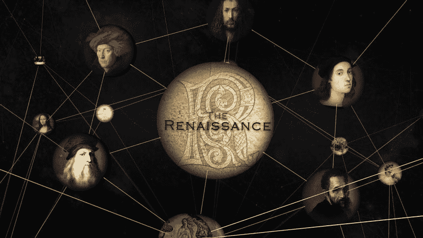
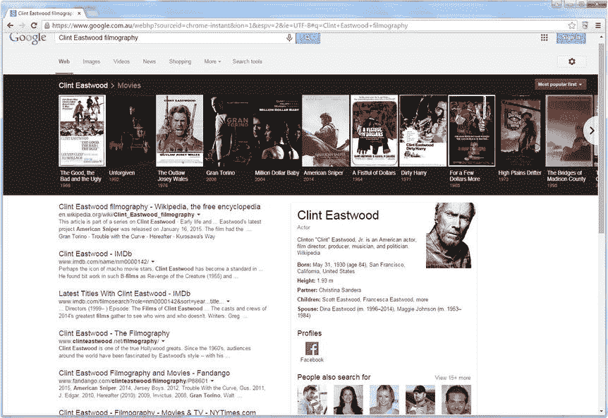
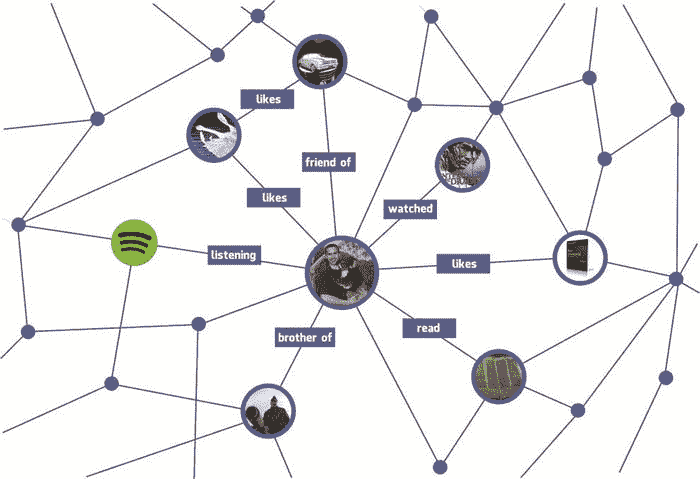
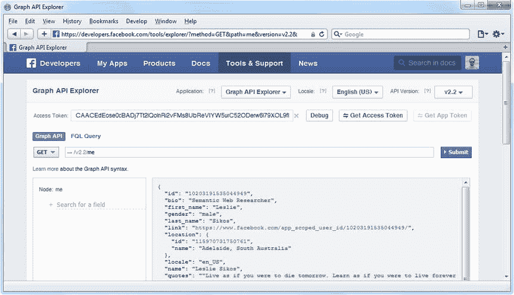

# 八、大数据应用

使用传统软件工具无法处理的不同格式的巨大且不断增长的数据池的可持续性是网页设计师、互联网营销人员和软件工程师的下一个重大挑战，需要新的技术和实践。处理大数据的方法之一是使用语义网技术，特别是机器可解释的元数据和链接数据。实现资源描述框架(RDF)和基于 RDF 的标准可以确保数据及其含义被封装，并且在连接来自不同数据源的不同数据时可以管理概念和关系。图形表示，如脸书的开放图，为数据分析添加了上下文并可视化了大数据。基于大数据的面向服务架构(SOA)基础设施使得实时更新大数据成为可能。可以自动对数据进行分类、关联关系和发现新的关系，这样就可以收集和集成数据，而不必担心模式和数据描述，还可以提供数据描述。语义网上的大数据应用包括但不限于下一代搜索引擎结果页面、社交媒体图表、自然语言内容分析、发布关于大规模世界事件的事实数据、链接 BBC 的在线内容以及高性能数据存储和处理。

## 大语义数据:语义网上的大数据

大数据是指任何大容量、高速度的数据集，这些数据集太大太复杂，无法使用传统的数据处理工具、应用和数据库系统进行处理。这种数据集代表数十亿字节的数据，存储了数十亿个隐藏值，无法进行高效的自动机器处理。大数据有四个特征:

*   卷:海量数据集中存储和检索的大量数据。挑战在于实现合理的处理速度，尤其是在实时应用中。
*   速度:高速数据流。挑战在于流数据处理。
*   多样性:不同形式的数据。挑战在于处理不同的数据结构、数据格式和序列化。
*   准确性:数据的不确定性。面临的挑战是处理信任问题、确定准确性和应对糟糕的数据质量。

解决大数据相关问题的一个有希望的方法是实施语义网技术，以构建能够高效处理大数据并随着不断增长的数据处理需求而发展的系统。

## 谷歌知识图和知识库

语义网上最著名的大数据应用之一是 2012 年推出的谷歌知识图。Google Knowledge Graph 是一个语义知识库，它使用从各种来源收集的语义搜索信息来增强传统的搜索引擎结果页面(SERPs)。知识图使用的数据源包括 Google 索引的页面、GoogleMaps 上的对象、公共数据源(如 Wikipedia)、LOD 数据集(如 DBpedia)、CIA World Factbook 和 FDA 数据集，以及特定主题的资源(如 Weather Underground 和 World Bank ),分别用于气象信息和经济统计。知识图搜索的结果不仅是比传统搜索更准确的相关信息，还有相关信息，例如人们搜索最多的类似资源。例如，如果你搜索达芬奇，你不仅会得到关于他和他的著名作品如《蒙娜丽莎》和《最后的晚餐》的事实，谷歌还会提示同一时代的其他著名画家，如扬·范·艾克、丢勒、拉斐尔和米开朗基罗(见图 8-1 )。

图 8-1。

The Google Knowledge Graph finds data resources related to your search phrase [1]

同样，如果搜索动作电影的标题，结果将包括类似的电影，而搜索特定的发明者将显示其他发明者，具有类似的研究领域和奖项。知识图包含超过 5 亿个对象和超过 180 亿个关于不同对象之间关系的事实，帮助软件代理“理解”搜索关键字的含义，并且这些数字还在不断增长。

根据使用的搜索短语，从 Google Knowledge Graph 检索到的搜索结果以两种方式表示。第一个称为谷歌知识面板，显示在搜索引擎结果页面的右侧，靠近有机搜索结果。搜索人员或品牌名称通常会出现一个知识面板，如图 8-2 所示。

图 8-2。

Facts about Tim Berners-Lee shown by the Google Knowledge Panel

如果对象在脸书、YouTube、Twitter、Instagram、Google+等社交媒体上存在。，还将显示指向这些页面的链接。最相关的链接显示在“人们也搜索”下面，可以通过单击“查看更多”链接来扩展。如果你搜索一个活着的音乐家，你可能还会在知识面板上看到“即将到来的事件”，包括即将到来的音乐会的地点和日期。

从 Google Knowledge Graph 检索的数据的第二种数据表示是 Google Knowledge Carousel，它显示与搜索短语相关的实体。例如，如果你搜索克林特·伊斯特伍德的电影记录，谷歌会提供有机结果，一个关于克林特·伊斯特伍德的知识面板，以及一个关于他最著名电影的知识转盘，如《好、坏、丑》、《不可饶恕》、《亡命之徒乔西·威尔士》、《老爷车》、《一把美元》、《肮脏的哈利》等(见图 8-3 )。当您单击“知识面板”上的某些链接类型时，也可以使用转盘。例如，如果您单击知识面板上显示的音乐家的即将举行的音乐会，该音乐家的所有即将举行的音乐会将显示在顶部的转盘上。

图 8-3。

Searching for an actor’s filmography gives both a Knowledge Carosel and a Knowledge Panel

Google 知识库结合了来自传统网站的数据，包括非结构化文本、DOM 树和表格，以及来自 Freebase 的结构化数据。这是一个自动提取结构化数据的大型数据库。用户可以检索的信息量取决于查询的结构和正确性。

知识库从知识图及其来源中获取大量数据，并收集自己的数据，对其可靠性进行排名，并将所有结果汇编到由机器学习算法收集的超过 16 亿个事实的数据库中。不再有关于美洲虎(汽车品牌或动物)或泰姬陵(纪念碑、音乐家或赌场)的模糊自然语言查询，因为谷歌完全知道这些“东西”之间的区别

### 将您的公司、产品和事件纳入知识图表

如果你在你的网站上使用受控词汇术语描述你的公司、产品、服务或事件，无论是 HTML5 微数据还是 JSON-LD，它们都将被视为包含在谷歌知识图中。Schema.org 术语可以用来定义特征和关系，例如一个人的姓氏( [`http://schema.org/familyName`](http://schema.org/familyName) )、音乐专辑的流派( [`http://schema.org/music/artist/album`](http://schema.org/music/artist/album) )、或者商店的营业时间( [`http://schema.org/openingHours`](http://schema.org/openingHours) )。你使用的类别越精确越好。例如，如果你有一场音乐会，用 [`http://schema.org/MusicEvent`](http://schema.org/MusicEvent) 而不是 [`http://schema.org/Event`](http://schema.org/Event) ，或者如果你有一场足球比赛，用 [`http://schema.org/SportsEvent`](http://schema.org/SportsEvent) 而不是 [`http://schema.org/Event`](http://schema.org/Event) 。例如，活动组织者可以通过在 JSON-LD 中将结构化数据作为单独的代码块添加到标记中来描述即将到来的活动，这样 Google 就可以将它们包含在知识图上(参见清单 8-1 )。如前所述，在第三章的中，使用`@context`和`@type`定义词汇表。

Listing 8-1\. JSON-LD Annotation of a Band in the Markup

``

同样，在线零售商和商店可以使用 Schema.org 术语描述产品。要确定您可以使用哪些属性，请转到 [`http://schema.org/Book`](http://schema.org/Book) 并查看属性列表。这里，我们添加了带有`url`的书的网站，通过引用相应的 DBpedia 页面定义了作者，使用 Schema.org 术语声明了可用的格式(平装本和电子书)，以及其他属性(见清单 8-2 )。

Listing 8-2\. JSON-LD Annotation of a Product Description

``

可以使用 GoodRelations 对产品进行注释，包括易贝或 Gumtree 上的广告网页、接受的支付方式、商品价格和货币、产品类别、描述产品的官方供应商网页以及产品描述等属性(参见清单 8-3 )。

Listing 8-3\. JSON-LD Annotation of a Product Offering in the Markup

`{`

`"@context": {`

`"gr": "``http://purl.org/goodrelations/v1#`

`"pto": "`[`http://www.productontology.org/id/`](http://www.productontology.org/id/)

`"schema": "`[`http://schema.org/`](http://schema.org/)

`"xsd": "``http://www.w3.org/2001/XMLSchema#`

`"schema:url": {`

`"@type": "@id"`

`},`

`"gr:acceptedPaymentMethods": {`

`"@type": "@id"`

`},`

`"gr:hasBusinessFunction": {`

`"@type": "@id"`

`},`

`"gr:hasCurrencyValue": {`

`"@type": "xsd:float"`

`}`

`},`

`"@id": "`[`http://www.ebay.com/itm/ExampleAd-Giant-TCR-Advanced-1-Road-Bike-/21621444051`](http://www.ebay.com/itm/ExampleAd-Giant-TCR-Advanced-1-Road-Bike-/21621444051)

`"@type": "gr:Offering",`

`"gr:acceptedPaymentMethods": "gr:Cash",`

`"gr:description": "Want to sell my Giant TCR Advanced 1 Road Bike as I’m moving` 

`interstate",`

`"gr:hasBusinessFunction": "gr:Sell",`

`"gr:hasPriceSpecification": {`

`"gr:hasCurrency": "USD",`

`"gr:hasCurrencyValue": "1350"`

`},`

`"gr:includes": {`

`"@type": [`

`"gr:Individual",`

`"pto:Racing_bicycle"`

`],`

`"gr:name": "Giant TCR Advanced 1",`

`"schema:url":`[`https://www.giant-bicycles.com/enus/bikes/model/tcr.advanced.1.force/`](https://www.giant-bicycles.com/enus/bikes/model/tcr.advanced.1.force/)

`14797/66271/"`

`},`

`"gr:name": "Used Giant Road Bike"`

`}`

要向有关本地企业的 HTML5 标记中添加结构化数据，可以使用 Schema.org 的 local business 词汇表。确保您使用最适合您业务的类型( [`http://schema.org/Library`](http://schema.org/Library) 用于图书馆， [`http://schema.org/ShoppingCenter`](http://schema.org/ShoppingCenter) 用于购物中心， [`http://schema.org/AutomotiveBusiness`](http://schema.org/AutomotiveBusiness) 用于车库， [`http://schema.org/FinancialService`](http://schema.org/FinancialService) 用于财务规划师和银行等)。).学校或者体育俱乐部应该用 [`http://schema.org/Organization`代替](http://schema.org/Organization)，而 [`http://schema.org/Corporation`](http://schema.org/Corporation) 更适合企业。最常用的 LocalBusiness 属性是名称、描述、地址和电话(参见清单 8-4 )。物理地址细节可以嵌入到 PostalAddress 中。

Listing 8-4\. LocalBusiness Annotated with Microdata

`
The Blue Cafe</h1>`

`A nice cafe on the beach with a friendly atmosphere.`

`
123 Esplanade`

`Nice Beach,`

`CA`

`
`

`
`

`Phone: 123-456-7890`

`
`

`
`

根据您希望在站点上显示为人类可读数据的内容和希望添加为机器可读数据的内容，您可以使用不同的标记元素和样式表。对于那些仅为软件代理添加的数据，使用`meta`元素上的属性值。

## 社交媒体应用

语义网上大数据实施的优秀例子是社交媒体图，如脸书社交图、Twitter 兴趣图、Twitter 关注图、LinkedIn 专业图或 LinkedIn 经济图。

### 脸书社交图

脸书社交图是世界上最大的社交图，包含大约 10 亿用户的数十 Pb 的结构化数据。因为每个对象都是一个图节点，每个关系都是脸书社交图上的一个图边(见图 8-4 )，任何对象都可以作为用户在浏览器中直接访问，也可以通过脸书应用以编程方式访问。

图 8-4。

On the Facebook Social Graph, every object is a node and every connection is an edge

事实上，这种大量用户数据的轻松访问远远超出了脸书，因为脸书社交图的社交关系和链接也被其他社交网络门户网站使用，如 Pinterest 和 Last.fm(社交自举)。

你有没有想过脸书是如何推荐朋友的？利用脸书社交图的边缘，可以很容易地识别出那些至少有一个共同朋友的人(见图 8-5 )。

图 8-5。

The edges of the Facebook Social Graph make it possible to suggest people you may know

#### 脸书图形 API

脸书图形应用编程接口是 Facebook 平台的核心，使开发者能够从脸书用户档案中读取数据和向其中写入数据。Graph API 通过人物、照片、事件、页面等图形对象，以及它们之间的联系，如朋友关系、共享内容、照片标签等，来表示脸书社交图的当前状态。换句话说，Graph API 使得从脸书社交图中以编程方式访问用户对象和连接成为可能，这可用于脸书应用。

Graph API 不仅可以查询数据，还可以发布新的故事，发布开放的 Graph 故事，阅读脸书用户的信息，上传照片，更新社交图中的信息，以及执行脸书应用使用的类似任务。脸书社交图的所有对象(用户、相册、照片、状态信息、页面等。)具有唯一的标识符，该标识符是正整数，并且使得引用任何节点或边成为可能。

最初，Graph API 专门在 JSON 中向应用提供数据。JSON 的两个不同的键/值对集是对象(其中键是字符串)和数组(将键集表示为非负整数的有限计数序列)。这些值可以是 JSON 对象、数组或原语(字符串、数字、布尔值和 null)。

因为 Graph API 是 RESTful JSON API，所以可以在浏览器中访问它。Graph API 的 web 接口称为 Graph API Explorer，可在 [`https://developers.facebook.com/tools/explorer/`](https://developers.facebook.com/tools/explorer/) 获得。有了这个工具，你可以使用和遍历脸书社交图。您必须拥有脸书帐户并登录才能使用图形 API 浏览器。一旦您登录并访问 Graph API Explorer，您可以在右侧看到一个 JSON 对象，它有两个属性，即当前用户的标识符和名称，因为这是默认选择的两个字段(显示在左侧的`me`节点下)。如果您取消选中这两个复选框，并点击提交，图形 API 浏览器将显示更多关于用户的信息(参见图 8-6 )。提供多少细节取决于您的隐私设置。当查询中没有指定字段时，这些字段值是要返回的默认数据。

图 8-6。

With the Graph API Explorer, you can access fields of a node in the Facebook Social Graph

如果您需要关于节点的更多数据，您可能需要生成一个访问令牌(Get Access Token)，选择您选择的附加字段，并授予 Graph API 访问这些数据的权限。Graph API Explorer 在后台执行简单的 HTTP `GET`请求，如清单 8-5 所示，并在左侧提供一个下拉菜单，包含`GET`、`POST`和`DELETE`选项。默认值为`GET`。要启动新的请求，您必须单击右侧的提交。

Listing 8-5\. HTTP `GET` Request Through the Graph API Explorer

`GET /v2.2/me HTTP/1.1`

`Host: graph.facebook.com`

虽然脸书社交图中的每个节点都有一个标识符，但是您可以通过数字 ID 或用户名(如果对象有用户名的话)来引用任何节点。例如，如果您在`GET`之后将请求从默认的`me`值更改为您的用户 ID 或用户名，并点击 Submit，您的查询会得到相同的结果。这甚至适用于脸书页面。

由于在幕后使用了 HTTP `GET`请求，每个查询也可以直接执行。例如，要获取这本书的脸书页面的信息( [`http://facebook.com/SemanticWebBook`](http://facebook.com/SemanticWebBook) )，可以直接在浏览器中打开 [`http://graph.facebook.com/SemanticWebBook`](http://graph.facebook.com/SemanticWebBook) 来检索 JSON 输出。这使得通过处理 HTTP 请求和 JSON 格式的软件库，以编程方式访问脸书社交图的任何节点或边成为可能。更简单的是，脸书为流行的语言和平台提供了 SDK，如 PHP(见清单 8-6 )、JavaScript(见清单 8-7 )、iOS(见清单 8-8 )和 Android(见清单 8-9 )。

Listing 8-6\. Make an API Call from PHP

`$request = new FacebookRequest(`

`$session,`

`’GET’,`

`’/me’`

`);`

`$response = $request->execute();`

`$graphObject = $response->getGraphObject();`

`/* result handler */`

Listing 8-7\. Make an API Call from JavaScript

`FB.api(`

`"/me",`

`function (response) {`

`if (response && !response.error) {`

`/* result handler */`

`}`

`}`

`);`

Listing 8-8\. Make an API Call from iOS

`[FBRequestConnection startWithGraphPath:@"/me"`

`completionHandler:^(`

`FBRequestConnection *connection,`

`id result,`

`NSError *error`

`) {`

`/* result handler */`

`}];`

Listing 8-9\. Make an API Call from Android

`new Request(`

`session,`

`"/me",`

`null,`

`HttpMethod.GET,`

`new Request.Callback() {`

`public void onCompleted(Response response) {`

`/* result handler */`

`}`

`}`

`).executeAsync();`

自 2011 年以来，脸书不仅以 JSON 格式，而且以语义丰富的 RDF 序列化格式提供从社交图检索的数据，以包括关联数据 URIs。实现应该是灵活和健壮的，所以选择了 Turtle 格式，尽管也考虑了 JSON-LD。Turtle 翻译的 JSON 输出可以通过 HTTP 内容协商访问。URI 或空白节点被分配给 JSON 对象或数组，作为 RDF 三元组的主题。RDF 三元组的谓词和对象源自 JSON 对象和数组的键值对。JSON 键被转换成 URI，而值被转换成 RDF 术语，比如有意义的文字、URI 或空白节点。

原始值对应于 RDF 文字，转换是通过应用试探法确定最适合文字的 RDF 数据类型 URI 来进行的。构成 URIs 的 JSON 字符串被翻译成 URIs。JSON-Turtle 转换中最常用的数据类型 URIs 是`xsd:Boolean`、`xsd:dateTime`、`xsd:decimal`、`xsd:double`和`xsd:integer`。对象标识符仍然是字符串，即使它们看起来是整数。脸书为字符串实现了 RDF 1.1 约定，即常规字符串被保留为普通文字(隐式地处理为`xsd:string`)，而不是显式地将其类型化为`xsd:string`。为了符合 httpRange-14(确保 HTTP `GET`请求不会导致未定义的域)，片段标识符比斜线 URIs 更受欢迎。因为输出代表一个没有连接到外部资源的孤立图形，所以产生的链接数据只是四星链接数据(参见第三章)。尽管如此，RDF/Turtle 的输出在语义上比 JSON 的输出更丰富，因为显式的语义可以作为利用 RDFS 和 OWL 词汇表的本体来访问。

可以像直接执行 HTTP `GET`请求一样访问链接的数据，即使用 [`http://graph.facebook.com`](http://graph.facebook.com/) 或 [`https://graph.facebook.com`](https://graph.facebook.com/) 基 URI，后跟一个斜杠和脸书用户名或脸书页面名。例如，关联数据 URIs 可以用来扩充一个人的 FOAF 档案，如清单 8-10 所示。

Listing 8-10\. FOAF Profile Augmentation

`@base <`[`http://graph.facebook.com/`](http://graph.facebook.com/)

`<`[`http://www.lesliesikos.com/datasets/sikos.rdf#sikos`](http://www.lesliesikos.com/datasets/sikos.rdf#sikos)

`owl:sameAs </1105249544#> ;`

`rdfs:seeAlso </1105249544?metadata=1> ;`

`foaf:depiction </1105249544/picture> ;`

`foaf:account <`[`http://www.facebook.com/sikos`](http://www.facebook.com/sikos)

##### Apache Marmotta 的 LDClient 库的脸书模块

Apache Marmotta 的 LDClient 库的脸书模块使用 Schema.org、都柏林核心、FOAF、SIOC 和 SKOS 术语将脸书图形 API 对象和连接表示为 RDF 三元组。只要可行，映射将使用 Schema.org 术语。Marmotta 的脸书模块(ldclient-provider-facebook)注册一个端点来处理从 [`http://graph.facebook.com`](http://graph.facebook.com/) 和`http://www.facebook.com`开始的所有 URIs。通过添加一个依赖项，可以在 Apache Maven 项目中使用脸书模块，如清单 8-11 所示。

Listing 8-11\. Dependency for the Facebook Module in Maven

`<dependency>`

`<groupId>org.apache.marmotta</groupId>`

`<artifactId>ldclient-provider-facebook</artifactId>`

`<version>3.3.0</version>`

`</dependency>`

每个脸书对象至少有一个类别(尽可能使用`rdf:type`映射到 Schema.org 术语)、一个标识符(映射到`dcterms:id`)、一个名称(映射到`schema:name`)、一个描述(映射到`schema:description`)和一个脸书网页(映射到`foaf:homepage`)。这允许从 Maven 项目中以编程方式访问脸书对象。

#### 脸书开放图协议

受微格式和 RDFa 的启发，Open Graph 协议使开发者能够将他们的页面集成到脸书社交图中。

开放图表词汇表可用于用与脸书属性相关联的元数据来注释您的网站标记。例如，一本书可以如清单 8-12 所示进行描述。打开图的命名空间是 [`http://opengraphprotocol.org/schema/`](http://opengraphprotocol.org/schema/) 。

Listing 8-12\. Open Graph Annotation in the Markup

`<meta property="og:title" content="Web Standards: Mastering HTML5, CSS3, and XML" />`

`<meta property="og:type" content="book" />`

`<meta property="og:url" content="`[`http://www.masteringhtml5css3.com`](http://www.masteringhtml5css3.com/)

`<meta property="og:image" content="`??`http://www.masteringhtml5css3.com/img/`

`webstandardsbook.jpg " />`

`<meta property="og:site_name" content="Web Site of the Book Web Standards:` 

`Mastering HTML5, CSS3, and XML" />`

`<meta property="og:description" content="A book describing web standardization to create` 

`optimized, device-independent web sites with cutting-edge technologies." />`

### 推特卡片

类似于脸书的开放图形注释，Twitter 提供了所谓的 Twitter Cards 注释，将结构化数据添加到您关于 Twitter 对象的标记中。因为 Twitter 卡基于与 Open Graph 协议相同的约定，所以标签是相似的，并且您可以生成混合了 Open Graph 和 Twitter 卡注释的 Twitter 卡，而没有标签或数据重复。虽然建议用户在`html`元素(`<html prefix="og:` `http://ogp.me/ns#` `">`)上为 Open Graph 指定`og` RDFa Core 1.1 CURIE 前缀映射，但是 Twitter 卡不需要类似的标记；但是，他们可以使用前缀`twitter:`作为`meta`元素的`name`属性值。另一个区别是，虽然开放图协议指定了标记的属性和内容属性的使用(例如`<meta property="og:image" content="http://example.com/ogimg.jpg"/>`)，但是 Twitter 卡使用`name`和`content`。Twitter 的解析器将理解现有开放图标记的`property`和`content`属性。要定义一个摘要卡(默认的 Twitter 卡类型)，您可以在`meta`元素上混合使用 Twitter 卡和 Open Graph 注释，如清单 8-13 所示。

Listing 8-13\. Twitter Card Annotation in the Markup

`<meta name="twitter:card" content="summary" />`

`<meta name="twitter:site" content="@lesliesikos" />`

`<meta name="twitter:creator" content="@lesliesikos" />`

`<meta property="og:url" content="`??`http://www.lesliesikos.com/linked-data-platform-1-0`

`standardized/" />`

`<meta property="og:title" content="Linked Data Platform 1.0 Standardized" />`

`<meta property="og:description" content="The Linked Data Platform 1.0 is now a W3C` 

`Recommendation, covering a set of rules for HTTP operations on Web resources, including` 

`RDF-based Linked Data, to provide an architecture for read-write Linked Data on the` 

`Semantic Web." />`

`<meta property="og:image" content="`[`http://www.lesliesikos.com/img/LOD.svg`](http://www.lesliesikos.com/img/LOD.svg)

## 沃森机器人

IBM Watson 的 DeepQA 系统是一个问答系统，最初是为了与 Jeopardy 的参赛者竞争而设计的！智力竞赛节目，三名参赛者在回答开放领域的问题时相互竞争。虽然该系统赢得了与人类大冠军的比赛，但它的应用远远超出了危险！，即一般情况下问题和知识源两方面的自然语言内容分析 [3 ]。沃森的认知计算算法用于医疗保健，以提供洞察力和决策支持，并对客户服务中的任何查询或服务问题做出个性化的即时响应。开发人员可以使用 IBM Watson 开发人员云，这是一个 REST APIs 和 SDK 的集合，用于认知计算任务，如自然语言分类、概念扩展、机器翻译、关系提取、语音到文本和视觉识别。

在其他技术中，Watson 使用了诸如 Sesame、本体和推理等三元组。DeepQA 的信息资源由非结构化、半结构化和结构化数据组成，其中结构化数据起着重要的作用，主要是通过在 IBM 的 DB2 数据库平台 [4 ]中实现 RDF。DeepQA 使用三种类型的结构化数据，包括在线结构化数据仓库，如 DBpedia、GeoNames、YAGO 和电影数据集；从非结构化数据中提取的结构化数据；以及提供要存储在 triplestore 中的附加信息(如问答类型)的管理数据。沃森使用语义网技术对数据进行推理 [5 ]。DeepQA 使用各种技术来产生每个问题的候选答案。随后的候选答案排名组件主要由语义网技术支持。特别地，链接的数据源被用来为潜在的答案提供分型证据 [6 ]。链接开放数据在 DeepQA 架构中起着至关重要的作用，不仅在生成候选答案方面，而且在考虑多个观点(如类型强制和地理邻近性)的同时对答案进行评分。从 DBpedia 提取的数据还支持实体消歧和关系检测。YAGO 用于实体类型识别，其中不连续属性被手动分配给 YAGO 分类法中的更高级别类型。为了能够回答来自各种领域的问题，Watson 在自然语言处理(NLP)算法的基础上实现了关系检测和实体识别，这些算法处理来自维基百科 [8 ]的事实数据。

## BBC 的动态语义出版

英国广播公司(BBC)从 2010 年开始在 2010 年世界杯网站 [9 ]和 2012 年伦敦奥运会网站 [11 ]等网站实施 RDF。如今，BBC 新闻 [12 ]、BBC 体育 [13 ]以及 BBC 的许多其他网站都是使用语义网技术创作和发布的。BBC 新闻文章使用自动元数据标记和链接，不同的 BBC 领域(品牌、地点、人物和一般主题)通过对简单知识组织系统(SKOS)  [14 ]中表达的术语进行分类的层次结构进行整合。BBC 节目网站 [15 ]的内容分类系统(CIS)的标识符被映射到 DBpedia 概念。BBC 音乐网站 [16 ]也是建立在链接数据上的，每个艺术家都用 RDF 表示。BBC 地球网站是由 RDF 和它自己的野生动物本体论支持的。

BBC 的发布平台基于嵌入式链接数据标识符、本体和推理来管理和发布 XHTML 和 RDF 聚合。BBC 的内部内容管理系统(称为内容管理/制作系统，简称 CPS)支持通过所见即所得(WYSIWYG)编辑器进行静态元数据输入。手动内容管理过程由动态语义注释完成，产生自动化的元数据、丰富的内容关系和语义导航。发布平台自动聚集和呈现到相关故事和资产的链接。

## 国会图书馆链接数据服务

美国国会图书馆是世界上最大的图书馆，拥有超过 1.6 亿项内容，它发布主题分类法作为编目的链接数据。它提供了 LC 链接数据服务，以 RDF  [20 ]和 SKOS(在适当的情况下)表示数据，并使用自己的本体来准确描述分类资源和关系。国会图书馆的所有记录都可以通过内容协商单独获得，如 XHTML+RDFa、RDF/XML、N-Triples 和 JSON  [21 ]。为了解决机器可读编目(MARC)这一由国会图书馆发起的标准的局限性，MARC 记录已经被映射到 BIBFRAME 词汇表术语 [22 ]以利用关联数据的优势。该库使用的其他受控词汇表是 Dublin Core 和 MARC Relator 术语(使用 marcrel 前缀)。例如，Dublin Core 词汇表的 contributor 术语已经使用 MARC Relator 术语词汇表的对应术语进行了改进，它允许编目员在 RDF  [23 ]中指定个人在资源创建中扮演的角色，如插图画家、书法家或编辑。

## 高性能存储:万亿三倍大关

AllegroGraph ( [`http://franz.com/agraph/allegrograph/`](http://franz.com/agraph/allegrograph/) )，在第六章中讨论的业界领先的图数据库，在加载和查询海量 RDF 三元组方面不断刷新记录。2004 年，AllegroGraph 的第一个版本是第一个使用标准 x86 64 位架构加载和索引 10 亿个三元组的图数据库。2008 年，亚马逊 EC2 服务上加载了 100 亿个 quads。2011 年 6 月，它使用基于八插槽英特尔至强 E7-8870 处理器的服务器系统，配置了 2TB 内存和 22TB 物理磁盘空间，在短短 78 小时内成功加载了 3100 亿个 RDF 三元组。两个月后，AllegroGraph 成为世界上第一个加载、推断和查询超过 1 万亿(！)三胞胎。这种令人惊叹的无与伦比的性能足以存储[25]

*   世界上最大的图书馆——美国国会图书馆的 1.58 亿件藏品中的每一件都有 6350 个事实
*   10 亿 Twitter 用户中的每一个都有 1000 条推文
*   13 亿脸书用户的 770 个事实
*   关于人类大脑中 860 亿个神经元的 12 个事实。
*   人类平均一生中 25 亿次心跳中的每一次都有 400 次代谢读数
*   银河系中 2000 亿颗恒星的五个事实

AllegroGraph 专为最大加载速度和查询速度而设计。通过其高度优化的 RDF/XML 和 N-Quads 解析器加载三元组和四元组是非常强大的，尤其是对于大文件。这 1，009，690，381，946 个三元组仅用了 338 个多小时就被加载，平均速率超过每秒 800，000 个三元组(见表 8-1 )。

表 8-1。

AllegroGraph’s Performance in Triple Loading and Indexing

<colgroup><col> <col> <col> <col></colgroup> 
| 配置 | 三重计数 | 时间 | 负载率(吨/秒) |
| --- | --- | --- | --- |
| 2 x4 Intel e 5520 @ 2.26 GHz、48GB RAM、CentOS 5.3 | 11.06 亿 | 48 米 30 秒 | Three hundred and seventy-nine thousand nine hundred and forty-seven |
| 32 核英特尔 E5520@2.0 GHz，1TB 内存，Red Hat Enterprise Linux 6.1 | 11.06 亿 | 36 支 m 49 步枪 | Five hundred thousand six hundred and seventy-nine |
| 32 核英特尔 E5520@2.0 GHz，1TB 内存，Red Hat Enterprise Linux 6.1 | 221.20 亿 | 12 小时 18 分 16 秒 | Four hundred and ninety-nine thousand one hundred and eighty-eight |
| 64 核英特尔 x7560@2.27 GHz，2TB 内存，22TB 磁盘，Red Hat Enterprise Linux 6.1 | 3102.69 亿 | 78 小时 9 分 23 秒 | One million one hundred and two thousand seven hundred and thirty-seven |
| 240 核英特尔 x5650，2.66GHz，1.28TB 内存，88TB 磁盘，Red Hat Enterprise Linux 6.1 | 1.009 万亿 | 338 小时 5 分钟 | Eight hundred and twenty-nine thousand five hundred and fifty-six |

采用 Oracle Database 12c 的 Oracle Spatial 和 Graph 在 2014 年 9 月在处理和索引 RDF 三元组方面达到了 1 万亿三元组。Oracle 的最大加载速率为每秒加载和索引 1420000 个四元组(参见表 8-2 )。

表 8-2。

Oracle Spatial and Graph’s Performance in Triple and Quad Loading and Indexing

<colgroup><col> <col> <col> <col></colgroup> 
| 配置 | 数数 | 时间 | 负载率* |
| --- | --- | --- | --- |
| 64 核 SPARC64 VII+@3GHz、512GB RAM、双 F5100 闪存阵列中的 160 个驱动器、Oracle 数据库 11.2.0.2.0 | 11 亿个三倍 | 28 米 11 秒 | 650，500 万亿次 |
| 64 核 SPARC64 VII+@3GHz、512GB RAM、双 F5100 闪存阵列中的 160 个驱动器、Oracle 数据库 11.2.0.2.0 | 34 亿个三倍 | 105 米 | 539，700 万亿次 |
| 40 核英特尔 E7-4870@ 2.4GHz，在一个 Sun 服务器 X2-4 节点上带有 1TB RAM，双节点 Sun ZFS 7420 存储 | 274 亿个四边形 | 13 小时 11 分 | 273,000 QLIPS |
| 192 核 Oracle 数据库云服务器 X4-2 高容量全机架、2TB RAM、44.8TB 闪存、八托盘双控制器 ZS3-2 存储、Oracle 数据库 12.1.0.1 | 6054 亿个四边形 | 115.2 小时 | 1，420，QLIPS |

*TLIPS:每秒加载和索引三次；QLIPS:每秒加载和索引的四边形数

## 摘要

在本章中，您看到了在搜索引擎、社交媒体和高性能存储中使用语义网技术的大数据应用。您学习了如何将结构化数据添加到您的网站，Google 会考虑将其包含在知识图中，其数据将用于在知识面板和知识转盘上显示其他数据。到目前为止，您已经知道如何在标记中为脸书和 Twitter 对象编写语义注释。

最后一章将一步一步地展示各种真实情况下的用例。

## 参考

Google (2015) Introducing the Knowledge Graph. [`www.google.co.uk/insidesearch/features/search/knowledge.html`](http://www.google.co.uk/insidesearch/features/search/knowledge.html) . Accessed 9 March 2015.   Twitter (2015) Getting Started with Cards. [`https://dev.twitter.com/cards/`](https://dev.twitter.com/cards/) . Accessed 12 March 2015.   Gliozzo, A., Patwardhan, S., Biran, O., McKeown, K. (2013) Semantic Technologies in IBM Watson. [`www.cs.columbia.edu/nlp/papers/2013/watson_class_acl_tnlp_2013.pdf`](http://www.cs.columbia.edu/nlp/papers/2013/watson_class_acl_tnlp_2013.pdf) . Accessed 23 April 2015.   Gucer, V. (2013) IBM is embracing Semantic technologies in its products. In: 5 Things To Know About Semantic Technologies. [`www.ibm.com/developerworks/community/blogs/5things/entry/5_things_to_know_about_the_semantic_technologies?lang=en`](http://www.ibm.com/developerworks/community/blogs/5things/entry/5_things_to_know_about_the_semantic_technologies?lang=en) . Accessed 23 April 2015.   Le Hors, A. (2012) Interview: IBM on the Linked Data Platform. [`www.w3.org/blog/2012/05/interview-ibm-on-a-linked-data/`](http://www.w3.org/blog/2012/05/interview-ibm-on-a-linked-data/) . Accessed 23 April 2015.   Welty, C. (2013) Semantic Web and Best Practice in Watson. In: Proceedings of the Workshop on Semantic Web Enterprise Adoption and Best Practice (WaSABi 2013), Sydney, Australia, 22 October, 2013\. [`http://ceur-ws.org/Vol-1106/keynote2.pdf`](http://ceur-ws.org/Vol-1106/keynote2.pdf) . Accessed 23 April 2015.   Unger, C., Freitas, A., Cimiano, P. (2014) An Introduction to Question Answering over Linked Data. In: Reasoning Web: Reasoning on the Web in the Big Data Era. Lecture Notes in Computer Science 2014, 8714:128–130, `http://dx.doi.org/10.1007/978-3-319-10587-1`. Accessed 23 April 2015.   Gliozzo, A. M., Kalyanpur, A., Welty, C. (2011) Semantic Web Technology in Watson. Tutorial at the 10th International Semantic Web Conference, Bonn, Germany, 23–27 October 2011\. [`http://iswc2011.semanticweb.org/tutorials/semantic-web-technology-in-watson/`](http://iswc2011.semanticweb.org/tutorials/semantic-web-technology-in-watson/) . Accessed 23 April 2015.   Shotton, D. (2012) A major user of RDF linked data—the BBC. [`http://jats.nlm.nih.gov/jats-con/2012/presentations/shotton_jatscon2012.pdf`](http://jats.nlm.nih.gov/jats-con/2012/presentations/shotton_jatscon2012.pdf) . Accessed 24 April 2015.   BBC (2010) World Cup 2010\. [`http://news.bbc.co.uk/sport2/hi/football/world_cup_2010/`](http://news.bbc.co.uk/sport2/hi/football/world_cup_2010/) . Accessed 24 April 2015.   BBC (2012) London 2012 Olympics. [`www.bbc.com/sport/0/olympics/2012/`](http://www.bbc.com/sport/0/olympics/2012/) . Accessed 24 April 2015.   BBC (2015) BBC News. [`www.bbc.co.uk/news/`](http://www.bbc.co.uk/news/) . Accessed 24 April 2015.   BBC (2015) BBC Sport. [`www.bbc.co.uk/sport`](http://www.bbc.co.uk/sport) . Accessed 24 April 2015.   Kobilarov, G., Scott, T., Raimond, Y., Oliver, S., Sizemore, C., Smethurst, M., Bizer, C., Lee, R. (2009) Media Meets Semantic Web—How the BBC Uses DBpedia and Linked Data to Make Connections. Lecture Notes in Computer Science 2009, 5554:723–737, `http://dx.doi.org/10.1007/978-3-642-02121-3_53`. Accessed 24 April 2015.   BBC (2015) BBC Programmes. [`www.bbc.co.uk/programmes`](http://www.bbc.co.uk/programmes) . Accessed 24 April 2015.   BBC (2015) BBC Music. [`www.bbc.co.uk/music`](http://www.bbc.co.uk/music) . Accessed 24 April 2015.   BBC (2015) BBC Earth. [`www.bbc.com/earth/uk`](http://www.bbc.com/earth/uk) . Accessed 24 April 2015.   BBC (2012) Sports Refresh: Dynamic Semantic Publishing. [`www.bbc.co.uk/blogs/legacy/bbcinternet/2012/04/sports_dynamic_semantic.html`](http://www.bbc.co.uk/blogs/legacy/bbcinternet/2012/04/sports_dynamic_semantic.html) . Accessed 24 April 2015.   Library of Congress (2015) Fascinating Facts. [`www.loc.gov/about/fascinating-facts/`](http://www.loc.gov/about/fascinating-facts/) . Accessed 24 April 2015.   Library of Congress (2015) LC Linked Data Service. [`http://id.loc.gov/`](http://id.loc.gov/) . Accessed 24 April 2015.   Ford, K. (2010) ID.LOC.GOV, 1½ Years: Review, Changes, Future Plans, MADS/RDF. [`http://id.loc.gov/static/presentations/kefo_dlf_id.pdf`](http://id.loc.gov/static/presentations/kefo_dlf_id.pdf) . Accessed 24 April 2015.   Library of Congress (2015) Vocabulary (Bibliographic Framework Initiative Technical Site). [`http://bibframe.org/vocab/`](http://bibframe.org/vocab/) . Accessed 24 April 2015.   Harper, C. A., Tillett, B. B. (2007) Library of Congress Controlled Vocabularies and Their Application to the Semantic Web. Cataloging & Classification Quarterly 2007, 43(3-4):47–68\. `http://dx.doi.org/10.1300/J104v43n03_03`. Accessed 24 April 2015.   Franz Inc. (2011) Franz’s AllegroGraph Sets New Record on Intel Xeon E7 Platform. [`http://franz.com/about/press_room/Franz-Intel_6-7-11.lhtml`](http://franz.com/about/press_room/Franz-Intel_6-7-11.lhtml) . Accessed 12 March 2015.   Oracle (2014) Oracle Spatial and Graph: Benchmarking a Trillion Edges RDF Graph. [`http://download.oracle.com/otndocs/tech/semantic_web/pdf/OracleSpatialGraph_RDFgraph_1_trillion_Benchmark.pdf`](http://download.oracle.com/otndocs/tech/semantic_web/pdf/OracleSpatialGraph_RDFgraph_1_trillion_Benchmark.pdf) . Accessed 3 February 2015.