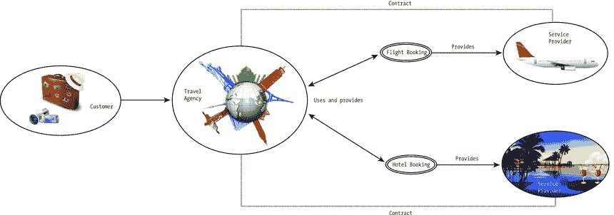

# 九、用例

通过阅读这本书，您学习了如何在标记中编写 HTML5 微数据和 JSON-LD 注释，开发语义 web 应用，用标准化语言描述 Web 服务，在链接开放数据(LOD)数据集上运行强大的查询，以及开发语义 Web 应用。现在您已经熟悉了语义 Web 技术，让我们分析四个复杂的例子，为现实生活中的实现做准备！

## RDB 到 RDF 直接映射

使用 R2RML 语言来表达从关系数据库(RDB)到资源描述框架(RDF)数据集的定制映射，您可以引用逻辑表来从输入数据库中检索数据。逻辑表可以是基表、视图或 SQL 查询[1]。假设您有一个关于企业员工的关系数据库，并希望将其映射到 RDF。每个工作人员由一个唯一的标识符(`ID`)识别，该标识符用作主键(见表 9-1 )。

表 9-1。

The Employee Database Table

<colgroup><col> <col> <col></colgroup> 
| ID `INTEGER` | 名字`VARCHAR(50)` | 姓氏`VARCHAR(50)` |
| --- | --- | --- |
| `10` | `John` | `Smith` |
| `11` | `Sarah` | `Williams` |
| `12` | `Peter` | `Jones` |

员工项目由员工标识符(`ID_Employee`)和项目标识符(`ID_Project`)描述，两者都是主外键(见表 9-2 )。

表 9-2。

The `Employee_Project` Database Table

<colgroup><col> <col></colgroup> 
| ID _ 员工`INTEGER` | ID _ 项目`INTEGER` |
| --- | --- |
| `10` | `110` |
| `11` | `111` |
| `11` | `112` |
| `12` | `111` |

项目使用一个整数标识符(`ID`)，这是一个主键，最多描述 50 个字符(表 9-3 )。

表 9-3。

The Project Database Table

<colgroup><col> <col></colgroup> 
| ID `INTEGER` | 描述`VARCHAR(50)` |
| --- | --- |
| `110` | `WebDesign` |
| `111` | `CloudComputing` |
| `112` | `DomainRegistration` |

直接映射定义了关系数据库中数据的 RDF 图表示[2]。直接映射将关系数据库(数据和模式)作为输入，并生成一个称为直接图的 RDF 图。在映射过程中，工作人员、项目以及它们之间的关系用 Turtle 语法用 RDF 表示(见清单 9-1 )。将逻辑表的每一行转换成零个或多个 RDF 三元组的规则被指定为三元组映射。从逻辑表中的一行生成的所有 RDF 三元组共享同一个主题。三元组映射由引用其他资源的资源表示。每个三元组映射只有一个`rr:logicalTable`属性，该属性的值代表指定要映射到 RDF 三元组的结构化查询语言(SQL)查询结果的逻辑表。三元组映射也正好有一个主题映射，它指定了为逻辑表的每一行生成主题所使用的技术，使用的是其值为主题映射的`rr:subjectMap`属性、 1 。三元组映射可能有可选的`rr:predicateObjectMap`属性，其值是为逻辑表的每个逻辑表行创建谓词-对象对的谓词-对象映射。谓词-对象映射指定的谓词映射-对象映射对可以与主题映射生成的主题一起使用，为每行创建 RDF 三元组。

Listing 9-1\. Direct Mapping from RDB to RDF

`@prefix foaf: <` [`http://xmlns.com/foaf/0.1/`](http://xmlns.com/foaf/0.1/) >。

`@prefix ex: <``http://example.com`

`@prefix xsd: <``http://www.w3.org/2001/XMLSchema#`

`@base <``http://example.com/base/`

`<TriplesMap1>`

`a rr:TriplesMap;`

`rr:logicalTable [ rr:tableName "\"Employee\""; ] ;`

`rr:subjectMap [ rr:template "http://example.com/employee/{\"\ID\"}"; ];`

`rr:predicateObjectMap`

`[`

`rr:preficate        ex:firstName ;`

`rr:objectMap    [ rr:column "\"FirstName\"" ]`

`];`

`rr:predicateObjectMap`

`[`

`rr:predicate        ex:lastName ;`

`rr:objectMap    [  rr:column "\"LastName\"" ]`

`]`

。

`<TripleMap2>`

`a rr:TriplesMap;`

`rr:logicalTable [ rr:tableName "\"Project\""; ] ;`

`rr:subjectMap [ rr:template "http://example.com/project/{\"\ID\"}"; ];`

`rr:predicateObjectMap`

`[`

`rr:preficate        ex:id ;`

`rr:objectMap    [ rr:column "\"ID\"" ]`

`];`

`rr:predicateObjectMap`

`[`

`rr:predicate        ex:description ;`

`rr:objectMap    [  rr:column "\"Description\"" ]`

`]`

。

`<linkMap_1_2>`

`a rr:TriplesMap;`

`rr:logicalTable [ rr:tableName "\"Employee_Project\""; ] ;`

`rr:subjectMap [ rr:template "http://example.com/employee/{\"\ID_Employee\"}"; ];`

`rr:predicateObjectMap`

`[`

`rr:preficate        ex:involvedIn ;`

`rr:objectMap    [ rr:template "http://example.com/project/{\"ID_Project\"}" ];`

`] .`

R2RML 映射受软件工具支持，如 db2triples 软件库[3]、OpenLink Virtuoso [4]、RDF-RDB2RDF [5]、morph [6]和 Ultrawrap [7]。在这个例子中，结果是一组 RDF 三元组，描述了员工和他们参与的项目(表 9-4 )。

表 9-4。

The RDF Triples of the Output

<colgroup><col> <col> <col></colgroup> 
| 科目 | 述语 | 目标 |
| --- | --- | --- |
| `<http://example.com/employee/10>` | `<http://example.com/lastName>` | `"Smith"` |
| `<http://example.com/employee/10>` | `<http://example.com/firstName>` | `"John"` |
| `<http://example.com/employee/12>` | `<http://example.com/lastName>` | `"Jones"` |
| `<http://example.com/employee/12>` | `<http://example.com/firstName>` | `"Peter"` |
| `<http://example.com/employee/11>` | `<http://example.com/lastName>` | `"Williams"` |
| `<http://example.com/employee/11>` | `<http://example.com/firstName>` | `"Sarah"` |
| `<http://example.com/project/110>` | `<http://example.com/description>` | `"WebDesign"` |
| `<http://example.com/project/110>` | `<http://example.com/id>` | `"110"^^<http://www/w3/org/2001/XMLSchema#integer>` |
| `<http://example.com/project/111>` | `<http://example.com/description>` | `"CloudComputing"` |
| `<http://example.com/project/111>` | `<http://example.com/id>` | `"111"^^<http://www/w3/org/2001/XMLSchema#integer>` |
| `<http://example.com/project/112>` | `<http://example.com/description>` | `"DomainRegistration"` |
| `<http://example.com/project/112>` | `<http://example.com/id>` | `"112"^^<http://www/w3/org/2001/XMLSchema#integer>` |
| `<http://example.com/employee/10>` | `<http://example.com/involvedIn>` | `<http://example.com/project/110>` |
| `<http://example.com/employee/12>` | `<http://example.com/involvedIn>` | `<http://example.com/project/111>` |
| `<http://example.com/employee/11>` | `<http://example.com/involvedIn>` | `<http://example.com/project/112>` |
| `<http://example.com/employee/11>` | `<http://example.com/involvedIn>` | `<http://example.com/project/111>` |

默认情况下，所有 RDF 三元组都在输出数据集的默认图中。然而，三元组映射可以包含将部分或全部三元组放入命名图中的图映射。

## OWL-S 中对信用卡收费的语义 Web 服务过程

假设一个 Web 服务向一个有效的信用卡收费。在 OWL-S 中，Web 服务可以被建模为指定客户端如何与服务交互的过程。可以有任意数量的前提条件，这些条件都必须满足，才能成功调用流程。一个流程有零个或多个输入，代表在某些情况下流程执行所需的信息。一个流程可能有任意数量的输出，这些输出表示流程向请求者提供的信息。效果描述了该过程所依赖的真实世界条件。为了在 OWL-S 中描述信用卡收费过程，我们必须检查卡是否透支，这可以定义为一个原子过程(对期望一个消息并返回一个消息作为响应的服务的描述)。如果卡透支，应该显示失败。否则，如果卡可以被收费，则必须执行该过程。因此，流程的描述包括两个`result`元素:一个用于对卡收费，另一个用于错误处理程序(参见清单 9-2 )。

Listing 9-2\. OWL-S Description of Charging a Credit Card [8]

`<process:AtomicProcess rdf:ID="Purchase">`

`<process:hasInput>`

`<process:Input rdf:ID="ObjectPurchased" />`

`</process:hasInput>`

`<process:hasInput>`

`<process:Input rdf:ID="PurchaseAmt" />`

`</process:hasInput>`

`<process:hasInput>`

`<process:Input rdf:ID="CreditCard" />`

`</process:hasInput>`

`<process:hasOutput>`

`<process:Output rdf:ID="ConfirmationNum" />`

`</process:hasOutput>`

`<process:hasResult>`

`<process:Result>`

`<process:hasResultVar>`

`<process:ResultVar rdf:ID="CreditLimH">`

`<process:parameterType rdf:resource="&ecom;#Dollars" />`

`</process:ResultVar>`

`</process:hasResultVar>`

`<process:inCondition>`

`<expr:KIF-Condition>`

`<expr:expressionBody>`

`(and (current-value (credit-limit ?CreditCard)`

`?CreditLimH)`

`(>= ?CreditLimH ?purchaseAmt))`

`</expr:expressionBody>`

`</expr:KIF-Condition>`

`</process:inCondition>`

`<process:withOutput>`

`<process:OutputBinding>`

`<process:toParam rdf:resource="#ConfirmationNum" />`

`<process:valueFunction rdf:parseType="Literal">`

`<cc:ConfirmationNum xsd:datatype="&xsd;#string" />`

`</process:valueFunction>`

`</process:OutputBinding>`

`</process:withOutput>`

`<process:hasEffect>`

`<expr:KIF-Condition>`

`<expr:expressionBody>`

`(and (confirmed (purchase ?purchaseAmt) ?ConfirmationNum)`

`(own ?objectPurchased)`

`(decrease (credit-limit ?CreditCard)`

`?purchaseAmt))`

`</expr:expressionBody>`

`</expr:KIF-Condition>`

`</process:hasEffect>`

`</process:Result>`

`<process:Result>`

`<process:hasResultVar>`

`<process:ResultVar rdf:ID="CreditLimL">`

`<process:parameterType rdf:resource="&ecom;#Dollars" />`

`</process:ResultVar>`

`</process:hasResultVar>`

`<process:inCondition>`

`<expr:KIF-Condition>`

`<expr:expressionBody>`

`(and (current-value (credit-limit ?CreditCard)`

`?CreditLimL)`

`(< ?CreditLimL ?purchaseAmt))`

`</expr:expressionBody>`

`</expr:KIF-Condition>`

`</process:inCondition>`

`<process:withOutput rdf:resource="&ecom;failureNotice" />`

`<process:OutputBinding>`

`<process:toParam rdf:resource="#ConfirmationNum" />`

`<process:valueData rdf:parseType="Literal">`

`<drs:Literal>`

`<drs:litdefn xsd:datatype="&xsd;#string">00000000</drs:litdefn>`

`</drs:Literal>`

`</process:valueData>`

`</process:OutputBinding>`

`</process:withOutput>`

`</process:Result>`

`</process:hasResult>`

`</process:AtomicProcess>`

过程产生的数据转换由输入和输出指定(`hasInput`、`hasOutput`)。原子流程总是从客户端接收指定流程执行所需信息的输入。流程执行的结果是信用卡被充值，钱从账户中取出。本例中的效果描述了客户现在拥有该对象(`own ?objectPurchased`)，并且信用卡账户中的金额已经减少(`decrease (credit-limit ?CreditCard) ?purchaseAmt`)。在实际应用中，此类服务通常会发送一张发票，其中包含或不包含交易成功的通知。信用卡交易有两种结果:一种是余额足够支付账单的情况，另一种是余额不足的情况。每个结果都可以通过进一步的绑定来扩充。

## 用 WSMO 建模旅行社 Web 服务

假设以下场景。Leslie 想预订一个热带假期的机票和酒店。虚构的 Dream Holidays 旅行社提供基于语义 Web 服务技术的娱乐和商务旅行服务。旅行社根据与服务提供商的合同安排机票预订和酒店预订(图 9-1 )。

图 9-1。

Travel agency modeling

该服务的目标可以描述为“为 Leslie 预订一个热带假期的航班和酒店房间。”后置条件是通过提供当前位置、目的地、支付方式和酒店名称来获得旅行预订(参见清单 9-3 )。

Listing 9-3\. Defining the Service Goal

`goal _"`??`http://www.example.com/successfulBooking`

`capability`

`postcondition`

`definedBy`

`?tripReservation memberOf tr#reservation[`

`customer hasValue fof#Leslie,`

`origin hasValue loc#adelaide,`

`destination hasValue loc#bali,`

`travel hasValue ?flight,`

`accommodation hasValue ?Hotel`

`payment hasValue tr#creditcard`

`] and`

`?flight[airline hasValue tr#staralliance] memberOf tr#flight and`

`?hotel[name hasValue "Tropical Paradise Hotel"] memberOf tr#hotel .`

服务描述应该包含门票、酒店、便利设施等等。预先状态能力描述包括预订请求和先决条件，比如有效的信用卡(参见清单 9-4 )。

Listing 9-4\. Pre-State Capability Description

`capability DREAMHOLIDAYScapability`

`sharedVariables {?creditCard, ?initialBalance, ?item, ?passenger}`

`precondition`

`definedBy`

`?reservationRequest[`

`reservationItem hasValue ?item,`

`passenger hasValue ?passenger,`

`payment hasValue ?creditcard,`

`] memberOf tr#reservationRequest and`

`((?item memberOf tr#trip) or (?item memberOf tr#ticket)) and`

`?creditCard[balance hasValue ?initialBalance] memberOf po#creditCard.`

`assumption`

`definedBy`

`po#validCreditCard(?creditCard) and`

`(?creditCard[type hasValue po#visa] or ?creditCard[type hasValue po#mastercard]).`

后状态能力描述包括后条件、保留价格和信用卡的最终价值(参见清单 9-5 )。

Listing 9-5\. Post-State Capability Description

`postcondition`

`definedBy`

`?reservation[`

`reservationItem hasValue ?item,`

`customer hasValue ?passenger,`

`payment hasValue ?creditcard`

`] memberOf tr#reservation .`

`assumption`

`definedBy`

`reservationPrice(?reservation, "AUD", ?tripPrice) and`

`?finalBalance= (?initialBalance - ?ticketPrice) and`

`?creditCard[po#balance  hasValue  ?finalBalance] .`

## 使用 Jena 的 RDF API 查询 DBpedia

如前所述，Apache Jena 使用 ARQ 引擎来处理 SPARQL 查询。ARQ API 类可以在`com.hp.hpl.jena.query`中找到。ARQ 的核心类是`Query`，它代表一个 SPARQL 查询；`Dataset`，在那里执行查询；`QueryFactory`，用于从 SPARQL 字符串生成`Query`对象；`QueryExecution`，提供查询执行的方法；`ResultSet`，包含从执行的查询中获得的结果；和`QuerySolution`，代表一行查询结果。如果该查询有多个答案，将返回一个包含`QuerySolutions`的`ResultSet`。

要从 Jena 查询 DBpedia，您可以使用`QueryFactory`和`QueryExecutionFactory. QueryFactory` has `create()`方法来读取文本查询并返回一个带有解析查询的`Query`对象。`QueryExecutionFactory`创建一个`QueryExecution`来以`QueryExecutionFactory.sparqlService(String service,Query query)`的形式通过 HTTP 访问 SPARQL 服务，其中`service`是一个表示 SPARQL 服务的字符串。您可以创建一个到 DBpedia 的 SPARQL 服务的测试连接，如清单 9-6 所示。

Listing 9-6\. Test Connection to DBpedia’s SPARQL Endpoint

`import com.hp.hpl.jena.query.QueryExecution;`

`import com.hp.hpl.jena.query.QueryExecutionFactory;`

`import com.hp.hpl.jena.sparql.engine.http.QueryExceptionHTTP;`

`public class QueryTest {`

`public static void main(String[] args) {`

`String service = "http://dbpedia.org/sparql";`

`String query = "ASK { }";`

`QueryExecution qe = QueryExecutionFactory.sparqlService(service, query);`

`try {`

`if (qe.execAsk()) {`

`System.out.println(service + " is UP");`

`}`

`} catch (QueryExceptionHTTP e) {`

`System.out.println(service + " is DOWN");`

`} finally {`

`qe.close();`

`}`

`}`

`}`

如您所见，`service`字符串包含 DBpedia 的 SPARQL 端点。现在，运行一个查询来检索出生在艾森纳赫的人。为了实现这一点，您需要一个`SELECT` SPARQL 查询来搜索 person 对象中的`dbo:birthPlace: Eisenach`，如清单 9-7 所示。

Listing 9-7\. A SPARQL Query to Run on DBpedia from Jena

`String service="http://dbpedia.org/sparql";`

`String query="PREFIX dbo:<http://dbpedia.org/ontology/>"`

`+ "PREFIX : <http://dbpedia.org/resource/>"`

`+ "PREFIX foaf:<http://xmlns.com/foaf/0.1/>"`

`+ "select ?person ?name where {?person dbo:birthPlace : Eisenach."`

`+ "?person foaf:name ?name}";`

`QueryExecution qe=QueryExecutionFactory.sparqlService(service, query);`

`ResultSet rs=qe.execSelect();`

`while (rs.hasNext()){`

`QuerySolution s=rs.nextSolution();`

`Resource r=s.getResource("?person");`

`Literal name=s.getLiteral("?name");`

`System.out.println(s.getResource("?person").toString());`

`System.out.println(s.getLiteral("?name").getString());`

`}`

结果应该包含出生在埃森纳赫的人，如约翰·塞巴斯蒂安·巴赫。

## 摘要

在这一章中，你分析了四个复杂的语义网例子。您了解了如何将关系数据库表映射到 RDF，如何用 OWL-S 描述流程，如何在 WSMO 建模语义 Web 服务，以及如何从 Apache Jena 以编程方式查询 LOD 数据集。

通过阅读这本书，你现在理解了基于图论和知识表示的核心语义网概念和数学背景。您了解了如何使用来自 Schema.org、DBpedia、GeoNames 和 Wikidata 的机器可读元数据来注释您的网站标记，以提高网站在搜索引擎结果页面上的性能。现在，你可以使用基于 vCard 的 hCard、Schema.org FOAF 和 DBpedia 编写高级的机器可读的个人描述。您已经了解了如何发布带有语义的组织数据，以覆盖更广泛的受众，包括针对您的公司、产品、服务和事件的 HTML5 微数据或 JSON-LD 注释，供 Google 考虑包含在知识图中。您知道如何将结构化数据序列化为 HTML5 微数据、RDF/XML、Turtle、Notation3 和 JSON-LD，以及如何用 RDFS 和 OWL 创建机器可读的词汇和本体。您已经学会了为开放数据和开放知识计划做出贡献，并且知道如何发布自己的 LOD 数据集。您知道如何为语义 Web 应用开发设置编程环境，并使用流行的 API 和软件库(如 Apache Jena 和 Sesame)用 Java、Ruby 和 JavaScript 编写程序。您还学习了如何在 triplestores 和 quadstores 中存储和操作数据，并熟悉了最流行的图数据库，如 AllegroGraph 和 Neo4j。你能够用 OWL-S、WSDL、WSML 和 WS-BPEL 来描述和建模语义 Web 服务。您可以在大型 LOD 数据集上运行复杂的 SPARQL 查询，如 DBpedia 和 Wikidata，甚至可以使用您自己的易于访问的 OpenLink Virtuoso、Fuseki 或 4store SPARQL 端点来鼓励数据重用。最后，您了解了利用语义网技术的大数据应用，如谷歌知识库、脸书社交图、IBM Watson 和世界上最大图书馆的链接数据服务。

## 参考

Das, S., Sundara, S., Cyganiak, R. (eds.) (2012) R2RML Processors and Mapping Documents. In: R2RML: RDB to RDF Mapping Language. `www.w3.org/TR/r2rml/#dfn-r2rml-mapping`. Accessed 1 May 2015.   Arenas, A., Bertails, A., Prud’hommeaux, E., Sequeda, J. (eds.) (2012) Direct Mapping of Relational Data to RDF. [`www.w3.org/TR/rdb-direct-mapping/`](http://www.w3.org/TR/rdb-direct-mapping/) . Accessed 1 May 2015.   Antidot (2015) db2triples. [`https://github.com/antidot/db2triples`](https://github.com/antidot/db2triples) . Accessed 1 May 2015.   OpenLink Software (2015) Virtuoso Universal Server. [`http://virtuoso.openlinksw.com`](http://virtuoso.openlinksw.com) . Accessed 1 May 2015.   Inkster, T. (2015) RDF-RDB2RDF—map relational database to RDF declaratively. [`https://metacpan.org/release/RDF-RDB2RDF`](https://metacpan.org/release/RDF-RDB2RDF) . Accessed 1 May 2015.   Calbimonte, J.-P. (2015) morph. [`https://github.com/jpcik/morph`](https://github.com/jpcik/morph) . Accessed 1 May 2015.   Capsenta (2015) Ultrawrap. [`http://capsenta.com`](http://capsenta.com) . Accessed 1 May 2015.   Martin, D. et al. (2004) Service Profiles. In: OWL-S: Semantic Markup for Web Services. [`www.w3.org/Submission/OWL-S/`](http://www.w3.org/Submission/OWL-S/) . Accessed 1 May 2015.   Footnotes 1

或者，也可以使用`rr:subject`常量快捷方式属性。