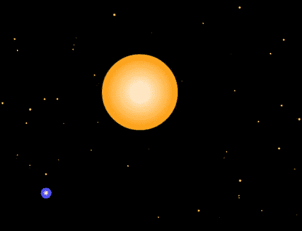
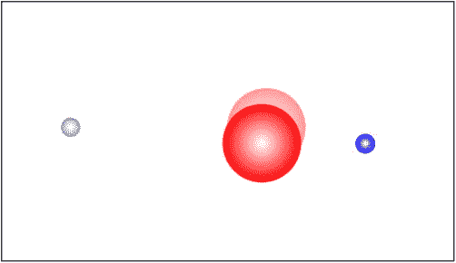
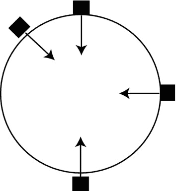
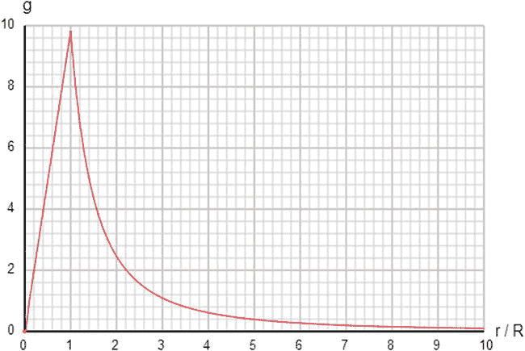
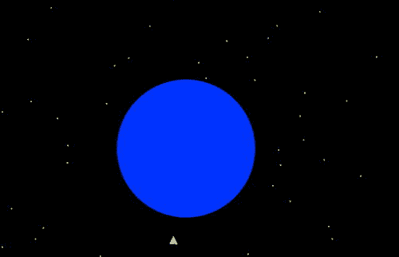

# 六、重力、轨道和火箭

从这一章开始，你将探索许多不同的力和它们产生的运动类型。这里我们只关注重力。你将学习重力如何使地球和太空中的物体运动。在你知道之前，你将能够编码轨道和火箭！

本章涵盖的主题包括以下内容:

*   重力:引力，或称万有引力，是地球对其附近所有物体施加的力。但是重力有比我们到目前为止讨论的更多的东西。
*   轨道:重力效应的一个例子是让行星保持在围绕太阳的轨道上。了解如何轻松构建简单的轨道模拟。
*   局部重力:在地球表面附近，重力在局部尺度上的表现。
*   火箭:制造一个简单的火箭，发射它，并让它围绕一个行星运行。

## 重力

作为一个星球上的居民，我们可能比任何其他力量都更了解重力。重力，也称为万有引力，将在你在本书中构建的大多数模拟中发挥作用。事实上，你已经遇到了几个例子。然而，到目前为止，在你遇到的所有情况下，我们都是把地球表面附近存在的重力作为一个恒力来处理的。现在是时候深入了解重力了。

### 重力、重量和质量

让我们首先简要回顾一下在前面的章节中你已经学到的关于重力的知识。如果一个物体的质量为 m，那么地球会对它施加一个垂直向下的力。这个重力的大小等于 mg，其中 g 是一个常数，在地球表面附近大约等于 9.81 m/s 2 。这个力也叫做物体的重量。

常数 g 等于任何物体在重力的单独作用下运动时所受到的加速度。我们可以用牛顿第二定律 F = ma 来看这个。如果合力 F 只是重力，那么 F = mg。因此，我们有了这个:

两边除以 m 得到这个:

这个结果告诉我们，所有在重力作用下运动的物体，不管它们的质量如何，或者说，不管它们有什么其他性质，都经历相同的加速度。所以，假设所有其他的力都可以忽略不计，如果你从相同的高度落下一把锤子和一栋房子，两者会以相同的速度加速，因此会同时落下！

当然，如果你掉了一根羽毛，要花很长时间才能掉下来。这是因为有一个向上的阻力，这是由于空气阻碍了它的下落。在石头或房子的情况下也有阻力，但在这些情况下，与它们的重量相比，这种力小得可以忽略不计，因此对它们的运动影响也可以忽略不计。如果你把一根羽毛和一把锤子扔到月球上，那里没有空气，因此没有阻力，它们会同时落下。事实上，宇航员大卫·斯科特在阿波罗 15 号任务中正是这样做的。你甚至可以在美国宇航局的网站或 YouTube 上看到这一壮举的视频(搜索“锤子和羽毛”)。

### 牛顿万有引力定律

地球不是唯一施加重力的物体。牛顿告诉我们，任何物体都会对其他物体产生引力。因此，不仅地球对我们施加引力，而且我们每个人也对地球施加引力，事实上对彼此也是如此！

牛顿给出了计算任意两个物体间引力的精确公式，这就是引力的力定律:

在这个公式中，m 1 和 m 2 是所涉及物体的质量，r 是它们中心之间的距离。符号 G 是一个通用常数，其值约为 6.67×10-11Nm2/kg2。它被称为引力常数。我们所说的普适性是指，不管相互作用的物体的属性如何，它都具有相同的值。牛顿假设，同样的公式，同样的 G 值，适用于任何两个物体——从微小的粒子到行星和恒星。因此，我们称之为牛顿万有引力定律。

让我们试着理解这个公式告诉我们什么。首先，引力 F 与两个物体的质量 m 1 和 m 2 成正比。因此，质量越大，力就越大。第二，这个力与它们之间距离的平方成反比；这意味着我们除以 r 2 。因此，两个物体之间的距离越大，力就越小(因为我们将一个数除以一个非常大的数的平方)。第三，因为我们是乘以一个很小的数 G (6.67 × 10 -11 等于 0.0000000000667)，所以力会很小，除非涉及非常大的质量。所以，重力是一种很弱的力，除非至少有一个物体质量很大。

为了让你了解我们的意思，让我们计算两个体重 80 公斤、相距 1 米的人(我们称他们为 Joe1 和 Joe2)之间的重力，并将其与地球施加在他们每个人身上的重力进行比较。

利用前面的公式，Joe1 和 Joe2 之间的作用力由 F = 6.67×10-11×80×80/12N = 4.3×10-7N 给出(近似)。那是 0.43 百万分之一牛顿。

地球对每一个施加的力，当然等于它们的重量:mg = 80 × 9.81 N = 785 N(近似值)。你也可以用前面的公式和地球的质量(5.97 × 10 24 kg)和半径(6.37 × 10 6 m)算出 F = 6.67×10-11×5.97×1024×80/(6.37×1062N = 785N .那

我们还没说力的方向。牛顿说力总是沿着连接两个物体中心的线作用(见图 6-1 )。

图 6-1。

Newton’s law of universal gravitation

还要注意，Joe1 和 Joe2 上的力形成一个作用力-反作用力对。因此，Joe1 对 Joe2 施加 4.3 × 10 -7 N 的力，反之亦然，两个力大小相等方向相反——两个 Joe 中的每一个与地球之间的力也是如此。

### 创建重力函数

我们现在将创建一个`Forces`对象的静态方法，它将以牛顿引力定律的形式实现重力。该方法将把进入引力定律的变量作为输入，即 G，m 1 ，m 2 和 r。它必须返回一个矢量力。因此，我们需要一个矢量形式的牛顿引力定律，它实现了力沿着连接两个物体的直线指向的事实。我们先给出公式，然后再解释:

与之前重力定律的公式相比，我们所做的是把力写成一个向量；然后我们把力的大小乘以–r/r，回想一下第三章 r/r 是 r 方向的单位向量，这里的 r 是其中一个物体相对于另一个物体位置的位置向量。

如图 6-2 所示，r 是两个物体的位置矢量之差，r 是其大小，简单来说就是两个物体之间的距离。回想一下，有两个力，而不是一个:物体 2 对物体 1 的力，反之亦然。这两个力大小相等，方向相反。我们总是把 r 定义为力所作用的物体相对于施加力的物体的位置矢量。我们需要负号，因为力的方向与 r 相反。

图 6-2。

Vector form of Newton’s law of universal gravitation

下面是实现重力的静态方法:

`Forces.gravity = function(G,m1,m2,r){`

`return r.multiply(-G*m1*m2/(r.lengthSquared()*r.length()));`

`}`

我们只是使用`Vector2D`对象的`multiply()`方法返回一个新的向量，该向量将 r 乘以(-G m1m2/r3)。现在让我们在接下来的几个例子中使用这个`gravity()`方法。

在应用`gravity`函数之前，我们必须为 G、m 1 、m 2 和 r 选择合适的值。因此，我们必须适当地缩放物理值，以便在合理的时间内在屏幕上获得正确的运动量。例如，如果我们正在模拟地球围绕太阳的运动，我们不会想要使用所有变量的真实值，例如太阳的质量，等等。那样做意味着我们要等一年才能看到地球绕太阳转一周！

在第四部分，我们将向你展示如何正确地创建一个按比例缩小的计算机模型。现在，我们将简化这种方法，并做出一些合适的选择，只是为了使运动在屏幕上看起来大致正确。为此，我们将为模型的所有变量选择自己的单位。

让我们从距离 r 开始。这很简单，这里使用的自然单位是像素。这就给我们留下了质量和 G，我们可以给 G 任何我们喜欢的值，所以我们选 G = 1。做了这两个选择后，我们现在需要为质量选择合适的值，以便在屏幕上产生明显的适量运动。我们来看一个例子:轨道！

## 轨道

使用我们的重力功能，很容易创建一个逼真的轨道模拟。图 6-3 显示了我们将要创建的截图:一颗行星围绕着一个太阳旋转，背景是固定的恒星。为简单起见，我们假设太阳保持不变。事实上，正如我们之前看到的，太阳和行星都将经历大小相同但方向相反的引力(每个行星上的力都指向另一个)。所以行星和太阳都会移动。但是，如果太阳的质量比行星的质量大得多，太阳的运动将是如此之小，无论如何，它几乎是可感知的。那是因为 F = maagain，所以加速度 a = F/m，这样，如果质量 m 很大，加速度 a 就会很小。所以为了节省编码和 CPU 时间，我们可以完全忽略太阳的运动。

图 6-3。

A planet orbiting a stationary sun

### 轨道代码

实现基本轨道模拟的代码比您想象的要简单。文件`orbits.js`包含完整的代码，如下所示:

`var canvas = document.getElementById('canvas');`

`var context = canvas.getContext('2d');`

`var canvas_bg = document.getElementById('canvas_bg');`

`var context_bg = canvas_bg.getContext('2d');`

`var planet;`

`var sun;`

`var m = 1; // planet's mass`

`var M = 1000000; // sun's mass`

`var G = 1;`

`var t0,dt;`

`window.onload = init;`

`function init() {`

`// create 100 stars randomly positioned`

`for (var i=0; i<100; i++){`

`var star = new Ball(Math.random()*2,'#ffff00');`

`star.pos2D= new Vector2D(Math.random()*canvas_bg.width,Math.random()*canvas_bg.height);`

`star.draw(context_bg);`

`}`

`// create a stationary sun`

`sun = new Ball(70,'#ff9900',M,0,true);`

`sun.pos2D = new Vector2D(275,200);`

`sun.draw(context_bg);`

`// create a moving planet`

`planet = new Ball(10,'#0000ff',m,0,true);`

`planet.pos2D = new Vector2D(200,50);`

`planet.velo2D = new Vector2D(70,-40);`

`planet.draw(context);`

`// make the planet orbit the sun`

`t0 = new Date().getTime();`

`animFrame();`

`};`

`function animFrame(){`

`animId = requestAnimationFrame(animFrame,canvas);`

`onTimer();`

`}`

`function onTimer(){`

`var t1 = new Date().getTime();`

`dt = 0.001*(t1-t0);`

`t0 = t1;`

`if (dt>0.1) {dt=0;};`

`move();`

`}`

`function move(){`

`moveObject(planet);`

`calcForce();`

`updateAccel();`

`updateVelo(planet);`

`}`

`function moveObject(obj){`

`obj.pos2D = obj.pos2D.addScaled(obj.velo2D,dt);`

`context.clearRect(0, 0, canvas.width, canvas.height);`

`obj.draw(context);`

`}`

`function calcForce(){`

`force = Forces.gravity(G,M,m,planet.pos2D.subtract(sun.pos2D));`

`}`

`function updateAccel(){`

`acc = force.multiply(1/m);`

`}`

`function updateVelo(obj){`

`obj.velo2D = obj.velo2D.addScaled(acc,dt);`

`}`

代码非常简单。首先，我们创建一组 100 颗星星作为`Ball`实例，并将它们随机放在舞台上。当然，这纯粹是出于审美原因。如果你不喜欢明星，那就去除掉他们吧。接下来，我们创建一个太阳作为另一个`Ball`实例，设置其半径为 70 像素，质量为 1，000，000。我们把太阳定位在(275，200)度。默认情况下，太阳的速度为零。然后我们创建一个行星作为`Ball`实例，设置它的半径为 10，质量为 1。然后设定行星的初始位置和速度。

动画循环类似于前面的例子；唯一的区别是我们选择在`moveObject()`和`updateVelo()`中将行星作为参数传递，只是为了一些变化。记住`updateAccel()`实现了牛顿第二定律，F = m a，让一个粒子在`calcForce()`方法指定的力的作用下运动。在`calcForce()`函数中，我们将太阳施加在行星上的重力指定为唯一的力。在`Forces.gravity()`方法中，我们传递 G 的值(设置为 1)、两个物体的质量以及行星相对于太阳的位置向量:`planet.pos2D.subtract(sun.pos2D)`。

继续运行代码——它真的工作了！

观察行星试图以其初始速度离开，但被太阳引力拉回。你可能想知道为什么行星不落入太阳。事实上，它一直朝着太阳“下落”,但是由于它的初始位置和速度，它每次都“错过”太阳。还要注意，当它靠近太阳时，行星运行得更快。这是因为越靠近太阳，重力越大，因此加速度越大。

这个代码产生了一个真实的轨道模拟，因为它基本上包含了所有在重力作用下控制轨道运动的物理过程。物理学可以归结为四个方程:

在这些方程中，M 是行星的质量，M 是太阳的质量。前两个方程是定律，后两个只是定义。概括一下，这就是我们的代码在每个时间步所做的:从第一定律开始，你计算重力。然后你用第二定律来计算加速度。知道了加速度，你可以积分第三个方程来计算速度。最后，知道了速度，你积分第四个方程，给出位移。这告诉你在每个时间步你必须移动你的粒子到哪里。

尝试更改代码中的参数以查看它们的效果。例如，你可以改变行星和太阳的质量，或者行星的初始位置和速度。我们选择太阳的质量是行星的 100 万倍。这是一个现实的比例；比如太阳的质量是地球的 33 万倍，水星的 610 万倍。

把太阳的质量改成 200 万。行星被拉得离太阳更近，因为引力与太阳的质量成正比。太阳质量增加一倍，引力也增加一倍，因此朝向太阳的加速度也增加一倍。相反，如果你将太阳的质量减少到 900，000，你会看到太阳对行星的吸引力变弱，因此行星漂移得更远。

现在改为改变行星的质量。先做 0.001 再做 1000。你会发现行星的质量对它的运动没有影响。这是怎么回事，你是通过增加行星的质量来增加行星上的力，但然后你必须用更大的力除以它更大的质量。看看上面的前两个方程。在第一个例子中，你乘以行星的质量来计算引力。在第二个例子中，你需要用这个力除以相同的质量来计算加速度。最终结果是加速度与行星的质量无关。这是理所应当的。这相当于我们在本章开始时提到的锤子和羽毛实验。

这是否意味着即使行星的质量与太阳相当，运动也不变？不，不是真的。还记得我们一开始做的近似吗？我们假设太阳的质量比行星的质量大得多，这样我们就可以忽略太阳在行星施加给它的引力作用下的运动。如果行星的质量是太阳质量的很大一部分，我们也需要模拟太阳的运动，即使我们只是对行星的运动感兴趣！这是因为随着太阳的运动，它与行星的距离将会改变，这将改变行星上的力。到目前为止，我们所做的是模拟单体运动。为了解决这个问题，我们需要模拟两体运动。这并没有多难，我们稍后会讲到。在下一章中，我们甚至会研究大量粒子在相互引力作用下的运动。

接下来，用不同的行星初速度做实验。例如，将速度向量更改为(70，–40)会产生一个更圆的轨道，类似于地球的轨道。(85，-40)的速度给出了一个像彗星一样的高度拉长的轨道。在这本书的后面，我们会告诉你如何计算出产生圆形轨道所需的精确速度。

如果行星的速度很小，它会被吸进太阳。例如，将速度更改为(0，0)。行星朝着太阳的中心加速，就像它应该做的那样，但是当它实际到达那里时，奇怪的事情发生了。例如，它可能会反弹回来或高速飞走。这是一种不符合物理的行为，它的发生是因为我们没有考虑代码中对象的有限大小。因为牛顿万有引力定律与 1/r 2 成正比，所以距离 r 越小，力越大。例如，当 r 为 10 个像素时，1/r 2 的值为 0.01；当 r 为 1 时，1/r 2 为 1；而当 r 为 0.1 时，1/r 2 为 100。所以当 r 接近零时(当两个粒子的中心几乎重合时)，引力变得无限大。与此同时，向量 r，即从太阳指向行星的位置向量，变得如此之小，以至于数值误差使其方向不可预测。因此，行星在太阳中心受到某个明显随机方向的大加速度。

这是一个普遍的问题，你会遇到像牛顿万有引力定律这样的力定律。您处理它的方式取决于您想要建模的确切内容。如果有东西落入太阳，你很可能想让它消失——这很容易编写代码，你不需要任何特殊的物理知识。如果有东西与像地球这样的固体行星相撞，它将在地球的大气层中燃烧起来，形成一个陨石坑，或者粉碎地球，这取决于它的大小。尽管你可以想象出一些电影风格的特效，但是要精确地建模这些都是相当困难的。如果有东西落入像木星或土星这样的气态巨行星，你可能想要模拟行星内部重力的变化。在本章的后面，我们将会看到一个例子来说明你如何做到这一点。

### 逃逸速度

事实证明，如果行星的速度大小小于某个临界值，它将总是被太阳的引力“捕获”，要么绕太阳运行，要么以与太阳碰撞而告终。超过这个临界值，行星就会脱离太阳的引力，这个临界值被称为逃逸速度。逃逸速度的公式由下式给出，其中 M 是太阳的质量，r 是距其中心的距离:

所以逃逸速度是离吸引体中心距离的函数。

请注意，我们所说的围绕太阳运行的行星更普遍地适用于任何在重力作用下围绕另一个物体运行的物体——例如，围绕行星运行的卫星(天然的或人造的)。因此，使用上述公式，地球表面任何物体的逃逸速度由下式给出，其中 M e 和 r e 分别是地球的质量和半径:

将 G、M e 和 r e 的值代入上述公式，得到 v = 11.2 km/s。这是地球表面的逃逸速度:如果你能以至少等于这个速度的速度扔出一个抛射体，它将摆脱地球的引力。相比之下，从太阳表面逃逸的速度为 618 公里/秒。相比之下，从 Eros(一颗尺寸约为 34 公里× 11 公里× 11 公里的近地小行星)表面逃逸的速度仅为 10 米/秒。你可以开车离开小行星！

回到`Orbits`模拟，G = 1，太阳的质量是 1，000，000，行星最初距离太阳的距离是个像素。所以行星初始位置的逃逸速度是每秒像素。你可以通过模拟来验证这一点。首先把行星的初速度改成(80，0)，这样它的星等就是 80。这颗行星将绕太阳运行。现在，通过将速度更改为(100，0)，将初始速度值增加到 100。这颗行星将离太阳更远，但仍将围绕太阳运行。即使你将速度改为(105，0)并等待足够长的时间(大约五分钟左右)，行星也会从画布的边缘消失，但最终会回来完成一个轨道。但是如果你把速度增加到 109.2 以上，它就再也不会回来了。我们不建议你等待！

### 两体运动

到目前为止，我们已经让一个物体在另一个物体的引力下运动。但是我们知道重力是一个作用力-反作用力对，所以另一个物体也一定会受到一个大小相等方向相反的力。结果是另一个物体也会移动。修改`orbits.js`代码来实现这一点相当简单。结果代码在文件`two-masses.js`中:

`var canvas = document.getElementById('canvas');`

`var context = canvas.getContext('2d');`

`var canvas_bg = document.getElementById('canvas_bg');`

`var context_bg = canvas_bg.getContext('2d');`

`var ball1;`

`var ball2;`

`var r1 = 10;`

`var r2 = 40;`

`var m1 = 1;`

`var m2 = 60;`

`var G = 100000;`

`var t0, dt;`

`window.onload = init;`

`function init() {`

`var ball1Init = new Ball(r1,'#9999ff',m1,0,true);`

`ball1Init.pos2D = new Vector2D(150,200);`

`ball1Init.draw(context_bg);`

`var ball2Init = new Ball(r2,'#ff9999',m2,0,true);`

`ball2Init.pos2D = new Vector2D(350,200);`

`ball2Init.draw(context_bg);`

`ball1 = new Ball(r1,'#0000ff',m1,0,true);`

`ball1.pos2D = ball1Init.pos2D;`

`ball1.velo2D = new Vector2D(0,150);`

`ball1.draw(context);`

`ball2 = new Ball(r2,'#ff0000',m2,0,true);`

`ball2.pos2D = ball2Init.pos2D;`

`ball2.velo2D = new Vector2D(0,0);`

`ball2.draw(context);`

`t0 = new Date().getTime();`

`animFrame();`

`};`

`function animFrame(){`

`animId = requestAnimationFrame(animFrame,canvas);`

`onTimer();`

`}`

`function onTimer(){`

`var t1 = new Date().getTime();`

`dt = 0.001*(t1-t0);`

`t0 = t1;`

`if (dt>0.1) {dt=0;};`

`move();`

`}`

`function move(){`

`context.clearRect(0, 0, canvas.width, canvas.height);`

`moveObject(ball1);`

`moveObject(ball2);`

`calcForce(ball1,ball2); // calc force on ball1 due to ball2`

`update(ball1);`

`calcForce(ball2,ball1); // calc force on ball2 due to ball1`

`update(ball2);`

`}`

`function update(obj){`

`updateAccel(obj.mass);`

`updateVelo(obj);`

`}`

`function moveObject(obj){`

`obj.pos2D = obj.pos2D.addScaled(obj.velo2D,dt);`

`obj.draw(context);`

`}`

`function calcForce(obj1,obj2){`

`force = Forces.gravity(G,obj1.mass,obj2.mass,obj1.pos2D.subtract(obj2.pos2D));`

`}`

`function updateAccel(m){`

`acc = force.multiply(1/m);`

`}`

`function updateVelo(obj){`

`obj.velo2D = obj.velo2D.addScaled(acc,dt);`

`}`

我们在这里所做的基本上很简单。我们创建了几个`Ball`实例，`ball1`和`ball2`，然后让每个球在另一个球施加的重力下移动。根据之前指定的数值，`ball2`的半径比`ball1`大 4 倍，质量大 60 倍。另外，`ball1`的初始速度为(0，150)，而`ball2`最初是静止的。我们还创建了另外两个`Ball`实例`ball1Init`和`ball2Init`，以较浅的颜色表示它们各自对应部分的初始位置。

比较`two-masses.js`和`orbits.js`，你会发现我们已经重组了一些动画循环和物理代码。首先，`calcForce()`方法现在有两个参数:第一个参数是受到力的球；第二个参数是施加力的球。`updateAccel()`方法现在还需要一个参数，即正在计算加速度的物体的质量。为了方便起见，我们还引入了一个新功能`update()`，它将对`updateAccel()`和`updateVelo()`的调用组合在一起。`move()`方法为每个球连续调用`moveObject()`、`calcForce()`和`update()`。仔细注意这些函数调用的顺序——顺序很重要！我们把它作为一个练习，让您找出原因，并试验如果您改变函数调用的顺序会发生什么。

我们在这里做的另一件事是将 G 的值改为 100，000。如果通过使用适当的质量值进行补偿来创建所需的效果，则可以给 G 任何想要的值。

如果你运行代码，你会看到`ball1`围绕`ball2`旋转，而后者似乎在摆动。这是有道理的。`ball1`和`ball2`在任何给定时间都经历相同的力，但是因为`ball2`比`ball1`大 60 倍，所以它的加速度小 60 倍(应用 a = F/m)。所以`ball2`比`ball1`移动的少很多，如图 6-4 截图所示。请注意，这两个球经历了垂直向下的净缓慢漂移。这是由于动量守恒(见第五章):总的初始动量不为零(`ball1`最初垂直向下移动，而`ball2`最初静止)，因此这种垂直向下的动量必须一直守恒，即使`ball2`移动。通过赋予`ball2`一个初速度，使系统的总初始动量为零，即 m1 × u1 + m2 × u2 = 0，可以很容易地消除这种漂移。因此，`ball2`的初始垂直速度为 U2 =–m1×u1/m2 =–1×150/60 =–2.5 px/s。在`ball2`创建后，通过添加以下代码行来实现:

`ball2.velo2D = new Vector2D(0,-2.5);`

图 6-4。

Two-body motion (lighter images show initial positions of respective balls)

如果您现在重新运行代码，您会发现残余漂移已经消失，并且由于`ball1`施加的重力，`ball2`只经历了轻微的抖动。

现在，通过修改相应的线，使`ball2`的质量和大小与`ball1`相同，如下所示:

`ball2 = new Ball(r1,'#ff0000',m1,0,true);`

然后，通过对代码进行以下更改来更改两个球的初始速度:

`ball1.velo2D = new Vector2D(0,10);`

`ball2.velo2D = new Vector2D(0,-10);`

如果你现在运行这段代码，你会发现这两个球以一种奇怪的方式绕着对方旋转，交替地靠近然后远离。实际情况是，它们围绕着一个共同的中心旋转，这个中心就是它们的质量中心。事实上，当球的质量不同时，这种情况也会发生。但是那时质量的中心在大球里面，所以它看起来在摇晃。

## 局部重力

我们最熟悉的是重力特写。本地的近地重力与你目前所学的有什么关系？在本节中，我们将建立牛顿万有引力定律和我们之前用于引力的公式 F = mg 之间的联系。这将引导我们阐明重力加速度 g 的意义。然后，我们将讨论 g 如何随着与地球中心的距离而变化，以及它在其他天体上如何不同。

### 地球表面附近的重力

是时候回到地球了！本章开始时(以及前面几章)我们说过，地球附近重力对质量为 m 的物体的作用力由 F = mg 给出，g 约为 9.81 m/s 2 。然后，到目前为止这一章的大部分时间，我们一直在用牛顿万有引力定律，它说引力由 F = Gm1m2/r2给出。我们如何调和这两个不同的公式？

答案是他们都是正确的。如果 M 是地球(或我们正在考虑的任何其他行星或天体)的质量，M 是地球上或附近物体的质量，则第二个公式给出:

这必须给出与 F = mg 相同的力。因此，这一定是真的:

现在我们可以用这个等式的两边除以 m 来去掉它。我们只剩下这个:

这个公式表明，g 与地球的质量 M 和距其中心的距离 r 有关。它告诉我们，g 其实是 GM/r 2 的“昵称”。

如果一个物体坐在地球表面，它离地心的距离等于地球的半径。地球的质量为 5.974 × 10 24 千克，其半径为 6.375 × 10 6 米

因此，使用最后一个公式，地球表面的 g 值由下式给出，这是之前引用的精确值:

g = 6.67×10-11×5.974×1024/(6.374×106)2= 9.81 米/秒 2

所以 F = mg 符合牛顿万有引力定律。

因为它总是指向地球的中心，所以无论我们在地球表面上还是附近，重力都垂直向下作用(见图 6-5 )。

图 6-5。

Near-Earth gravity

### 重力随高度的变化

公式 g = GM/r 2 告诉我们，我们可以用 F = mg 来计算离地球任意距离的重力，前提是我们要考虑 g 随离地心距离的变化。

如果一个物体在地球表面上方的高度 h 处，它到地球中心的距离由下式给出，其中 R 是地球的半径:

因此，地球表面上方高度 h 处的 g 值由下式给出:

因为 g 在地球表面的值是 9.81 m/s 2 ，稍微用点代数就给出了两个等价的公式:

利用这个公式，可以得出在地球表面 350 公里的国际空间站高度上，g 的值约为 8.8 米/秒 2 。在月球距离(384000 公里)的 g 值约为 0.0026 米/秒 2 。记住 g 给你一个物体在重力作用下的加速度，这个加速度和物体的质量无关。所以，如果把月亮换成一个足球，它会经历同样的加速度。

你可能很好奇 g 在地球内部是如何变化的。一个简单的模型表明，从地球表面到地心，g 近似线性地减小到零。公式如下，其中 R 是地球的半径:

图 6-6 显示了 g 随距离地心的归一化距离 r/R 的变化。可以看到，g 从地心到地表线性增加(其中 r/R = 1，g = 9.81)。然后，它会随着与地心距离的平方成反比而迅速减小。

图 6-6。

Variation of g with distance from the center of the Earth

### 其他天体上的引力

公式 g = GM/r 2 可以让你计算出行星、恒星等其他天体上的 g 值，前提是你知道它们的质量和半径。

表 6-1 给出了几个天体表面 g 的近似值。这些数值表明，太阳的引力大约是地球的 28 倍，而月球的引力大约是地球的六分之一。太阳系最大的行星木星表面的 g 值大约是地球的 2.5 倍。谷神星和爱神星都是小行星，引力极其微弱:地球引力大约是谷神星的 36 倍，是爱神星的 1660 多倍。

表 6-1。

Gravity on Selected Celestial Bodies

<colgroup><col> <col></colgroup> 
| 天体 | 以米/秒为单位的 g 值 2 |
| --- | --- |
| 地球 | Nine point eight one |
| 太阳 | Two hundred and seventy-four |
| 月球 | one point six |
| 木星 | Twenty-five |
| 谷神星 | Zero point two seven |
| 厄洛斯 | 0.0059 |

## 火箭

火箭被用于各种目的，包括发射宇宙飞船和导弹或作为烟火。在所有类型的火箭中，火箭是由火箭内燃烧的推进剂产生的废气推动的。在接下来的内容中，我们给出了一个非常简单的关于火箭运动的物理描述，并向你展示了如何将一个简单的火箭模拟整合到你的游戏中。

### 这是火箭科学！

不涉及各种类型火箭发动机运行的工程细节，我们只说高压热气产生并以高速通过喷嘴。根据牛顿第三定律，废气反推火箭，推动它前进。产生的向前的力叫做推力。

除了推力，火箭上可能还有其他力，这取决于它的位置和运动方式。重力就是其中之一。如果火箭穿过地球的大气层，它也会受到一个减速阻力和一个升力(见下一章)。这里我们将忽略阻力和升力的影响。

在地球上，由于压力随高度的变化也会产生影响，这将影响推力、阻力和升力。我们也会忽略这些影响。

当火箭上升时，它所受到的重力强度会像本章前面所描述的那样减小。我们将考虑这种影响。

火箭通常携带相当大一部分质量作为燃料。因此，随着燃料的消耗，火箭的质量会有很大的变化。这种质量的减少将影响火箭的加速度，因此必须包括在建模中。

### 模拟火箭的推力

为了模拟火箭的推力，我们利用了第五章中给出的牛顿第二定律的另一种形式。

记住，以速度 v 以 dm/dt 的速率移动物质所需的力由公式 F = v dm/dt 给出。火箭排出的废气以有效排气速度 v e 和可控制的质量速率 dm/dt 排出。因此，气体上的力由下式给出:

根据牛顿第三定律，火箭的推力由下式给出:

前面矢量方程中的负号表示产生的推力与排气速度方向相反。

火箭上也可能有侧向推进器，根据需要提供侧向推力。这些工作原理与主机相同。

### 构建火箭模拟

好吧，让我们建立一个火箭模拟！但是在你兴高采烈地跳上跳下之前，请注意我们这里只关注物理；我们把它作为一个练习，让你想出漂亮的图形和特殊效果。

我们将再次从`orbits.js`文件开始，进行一些修改，并将新文件保存为`rocket-test.js`。它应该是这样的:

`var canvas = document.getElementById('canvas');`

`var context = canvas.getContext('2d');`

`var canvas_bg = document.getElementById('canvas_bg');`

`var context_bg = canvas_bg.getContext('2d');`

`var rocket;`

`var massPlanet;`

`var centerPlanet;`

`var radiusPlanetSquared;`

`var G = 0.1;`

`var dmdt = 0.5;`

`var dmdtSide= 0.1;`

`var fuelMass = 3.5;`

`var fuelSideMass = 3.5;`

`var fuelUsed = 0;`

`var fuelSideUsed = 0;`

`var ve = new Vector2D(0,200);`

`var veSide = new Vector2D(-100,0);`

`var applySideThrust = false;`

`var showExhaust = true;`

`var orientation = 1;`

`var animId;`

`var t0, dt;`

`window.onload = init;`

`function init() {`

`// create 100 stars randomly positioned`

`for (var i=0; i<100; i++){`

`var star = new Ball(1,'#ffff00');`

`star.pos2D= new Vector2D(Math.random()*canvas_bg.width,Math.random()*canvas_bg.height);`

`star.draw(context_bg);`

`}`

`// create a stationary planet planet`

`planet = new Ball(100,'#0033ff',1000000);`

`planet.pos2D = new Vector2D(400,400);`

`planet.draw(context_bg);`

`massPlanet = planet.mass;`

`centerPlanet = planet.pos2D;`

`radiusPlanetSquared = planet.radius*planet.radius;`

`// create a rocket`

`rocket = new Rocket(12,12,'#cccccc',10);`

`rocket.pos2D = new Vector2D(400,300);`

`rocket.draw(context,showExhaust);`

`// set up event listeners`

`window.addEventListener('keydown',startSideThrust,false);`

`window.addEventListener('keyup',stopSideThrust,false);`

`// launch the rocket`

`t0 = new Date().getTime();`

`animFrame();`

`};`

`function animFrame(){`

`animId = requestAnimationFrame(animFrame,canvas);`

`onTimer();`

`}`

`function onTimer(){`

`var t1 = new Date().getTime();`

`dt = 0.001*(t1-t0);`

`t0 = t1;`

`if (dt>0.1) {dt=0;};`

`move();`

`}`

`function move(){`

`moveObject();`

`calcForce();`

`updateAccel();`

`updateVelo();`

`updateMass();`

`monitor();`

`}`

`function moveObject(){`

`rocket.pos2D = rocket.pos2D.addScaled(rocket.velo2D,dt);`

`context.clearRect(0, 0, canvas.width, canvas.height);`

`rocket.draw(context,showExhaust);`

`}`

`function calcForce(){`

`var gravity = Forces.gravity(G,massPlanet,rocket.mass,rocket.pos2D.subtract(centerPlanet));`

`var thrust = new Vector2D(0,0);`

`var thrustSide = new Vector2D(0,0);`

`if (fuelUsed < fuelMass){`

`thrust = ve.multiply(-dmdt);`

`}`

`if (fuelSideUsed < fuelSideMass && applySideThrust){`

`thrustSide = veSide.multiply(-dmdtSide*orientation);`

`}`

`force = Forces.add([gravity, thrust, thrustSide]);`

`}`

`function updateAccel(){`

`acc = force.multiply(1/rocket.mass);`

`}`

`function updateVelo(){`

`rocket.velo2D = rocket.velo2D.addScaled(acc,dt);`

`}`

`function updateMass(){`

`if (fuelUsed < fuelMass){`

`fuelUsed += dmdt*dt;`

`rocket.mass += -dmdt*dt;`

`}`

`if (fuelSideUsed < fuelSideMass && applySideThrust){`

`fuelSideUsed += dmdtSide*dt;`

`rocket.mass += -dmdtSide*dt;`

`}`

`}`

`function monitor(){`

`if (showExhaust && fuelUsed >= fuelMass){`

`showExhaust = false;`

`}`

`if (rocket.pos2D.subtract(centerPlanet).lengthSquared() < radiusPlanetSquared){`

`stop();`

`}`

`}`

`function startSideThrust(evt){`

`if (evt.keyCode==39){ // right arrow`

`applySideThrust = true;`

`orientation = 1;`

`}`

`if (evt.keyCode==37){ // left arrow`

`applySideThrust = true;`

`orientation = -1;`

`}`

`}`

`function stopSideThrust(evt){`

`applySideThrust = false;`

`}`

`function stop(){`

`cancelAnimationFrame(animId);`

`}`

`init()`中的初始设置与`orbits.js`中的非常相似，除了我们现在用一个静止的行星代替了太阳，用一个火箭代替了行星。请注意，火箭是`Rocket`对象的一个实例，稍后我们将会看到。我们在`init()`中引入了几个事件监听器。这些分别监听`keydown`和`keyup`事件。相应的事件处理器`startSideThrust()`和`stopSideThrust()`设置`Boolean`参数`applySideThrust`的值。每当按下右箭头键或左箭头键时，`applySideThrust Boolean`变量被设置为`true`；释放按键时，`applySideThrust`恢复为`false`。这个变量将控制侧向推进器施加的推力。变量`orientation`被赋予一个+1 或–1 的整数值，以区分左右按键。这个变量决定了施加推力的方向。

在`calcForce()`中，我们指定作用在火箭上的力，然后像往常一样把它们加起来。第一个力是行星对它施加的重力。然后是主推力和侧推力。只要有燃料，就施加主推力；燃料量在变量`fuelMass`中设定。如果有燃料并且`applySideThrust`为真，则施加侧向推力。在任一情况下，推力都是用公式 F =–veDM/dt 计算的。主推进器和侧推进器的燃料量、排气速度和质量率是独立设置的。(实际上，可以改变排气速度和质量率来控制推力，但为了简单起见，我们在这里把它们固定下来。)

在`move()`方法中有几个新的函数调用。首先，它调用一个新方法`updateMass()`。它需要这样做，因为火箭的质量在变化。`updateMass()`中的代码检查主推进器和侧推进器中是否还有燃料剩余；如果是这样的话，它会增加所用燃料的质量，并以相同的量减少火箭的质量。对于侧推进器，它还检查`applySideThrust`是否为真。

在`move()`中调用的第二个新函数是`monitor()`。该方法执行两项检查。首先，它检查主油箱中的所有燃油是否已经用完，如果是，它将把`showExhaust`布尔变量的值设置为`false`，这样在下一次绘图更新时，排气将不再显示。不管有没有排气，火箭的绘制都是通过`moveObject()`中的函数调用`rocket.draw(context,showExhaust)`来完成的。

第二件事`monitor()`做的是检查火箭是否与行星相撞；如果是这样，它简单地调用`stop()`方法，停止时间步进，冻结所有运动。

如果你运行模拟，你会看到火箭自动发射。一开始它移动得很慢；然后它的速度和加速度都增加，直到它的燃料耗尽。然后它在行星的引力作用下减速。如果你什么都不做，它就会落回星球。如果您按下右箭头键或左箭头键，将分别向右侧或左侧施加侧向推力。如果你施加过多或过少的侧向推力，火箭要么会脱离行星的引力，要么会被拉回与行星碰撞的轨道。看看能不能让火箭绕行星运行(图 6-7 )！这包括在正确的时间施加正确的侧向推力。

图 6-7。

A rocket orbiting a planet!

#### 火箭物体

最后，让我们快速看一下创建可见火箭的`Rocket`对象。令人尴尬的是，我们的“火箭”只是一个三角形，另一个(透明的)三角形附在末端，代表废气中的气体。但是，如果您此时迫切需要运用自己的艺术技巧，请继续创作一个更好看的版本。

以下是`rocket.js`中的完整源代码:

`function Rocket(width,height,color,mass){`

`if(typeof(width)==='undefined') width = 20;`

`if(typeof(height)==='undefined') height = 40;`

`if(typeof(color)==='undefined') color = '#0000ff';`

`if(typeof(mass)==='undefined') mass = 1;`

`this.width = width;`

`this.height = height;`

`this.color = color;`

`this.mass = mass;`

`this.x = 0;`

`this.y = 0;`

`this.vx = 0;`

`this.vy = 0;`

`}`

`Rocket.prototype = {`

`get pos2D (){`

`return new Vector2D(this.x,this.y);`

`},`

`set pos2D (pos){`

`this.x = pos.x;`

`this.y = pos.y;`

`},`

`get velo2D (){`

`return new Vector2D(this.vx,this.vy);`

`},`

`set velo2D (velo){`

`this.vx = velo.x;`

`this.vy = velo.y;`

`},`

`draw: function (context,firing) {  // firing is a Boolean`

`if (firing){`

`var exhaust=new Triangle(this.x,this.y+0.5*this.height,this.width,this.height,'#ffff00',0.8);`

`exhaust.draw(context);`

`}`

`var capsule = new Triangle(this.x,this.y,this.width,this.height,this.color);`

`capsule.draw(context);`

`}`

`};`

使用宽度、高度和颜色的参数值绘制火箭，这些参数值在构造函数中作为参数提供。代码看起来非常类似于`Ball`对象的代码，但是使用了不同的`draw()`方法，该方法有两个参数:`context`和`firing`。`Boolean`参数`firing`决定是否绘制“排气”。火箭体和排气都用一个方便的`Triangle`物体绘制成三角形，你可以在我们的生长物体库中找到。可以随意看一下`triangle.js`中的代码。

很容易看出如何将这个简单的模拟开发成一个有趣的游戏。除了改进的图形和特殊效果，你可以添加额外的功能和控制，以获得更大的真实感。考虑到这一点，我们需要指出，在我们实现火箭的一些操作功能的方式上有一些限制。对于一个简单的在线游戏来说，这些限制可能没什么大不了的，但是如果你试图构建一个真实的模拟器，这些限制就很重要了。无论如何，了解他们是值得的。

我们已经提到，在这次演示中，我们已经固定了火箭的推力，尽管实际上它可以通过改变排气速度和喷射气体的质量率来控制。更重要的是，主推力和侧推力的方向已经以一种严格来说不正确的方式实现了。无论火箭的角度是多少，火箭的主推力都是沿着它的轴线作用的，而它的侧推力会相对于火箭的角度处于某个特定的角度。我们在这个简化的模拟中所做的是固定主推力和侧推力，使其在垂直(y)和水平(x)方向上起作用，而不管火箭的倾斜度如何。我们还忽略了火箭在大气中运动时气压、阻力和升力的影响。

我们做的另一个明显的简化是将整个火箭送入轨道。实际上，太空火箭包括一个或多个一次性燃料箱，当燃料耗尽时，这些燃料箱就会被丢弃。我们把这个留给你做练习。类也可以在功能上得到增强。例如，将燃料量、使用的燃料、排气速度和质量率作为属性包含在`Rocket`中，而不是将它们硬编码到`rocket-test.js`中，这可能是有意义的。

最后，我们在本章中编写的例子是真实的，因为它们包含正确的物理方程，但是为各种参数选择的值不一定是成比例的。例如，在轨道模拟中，行星和太阳的大小与它们的距离相比被严重夸大了。为了在计算机屏幕上看到物体及其运动，这是必要的。缩放问题将在本书的第四部分详细讨论。

## 摘要

这一章向你展示了重力可以展现的丰富性和多样性，以及它可以产生的不同类型的运动。在相当短的一章中，你已经能够编写轨道，两个物体在相互引力下以有趣的方式运动，以及一个从发射到轨道的火箭模拟。

令人惊讶的是，仅仅几个物理公式和一点点代码就能带来如此多的乐趣。你现在尝到了什么是可以做到的，即使是一个单一的力量，如重力。我们将在后面的章节中更多地讨论重力。同时，我们将在下一章介绍许多其他的力。