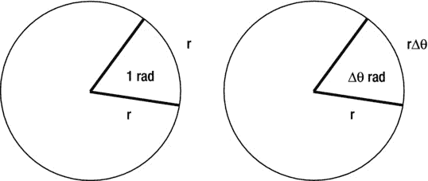
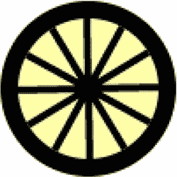
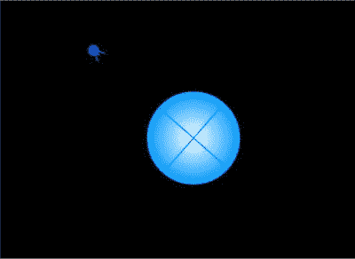
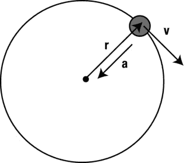
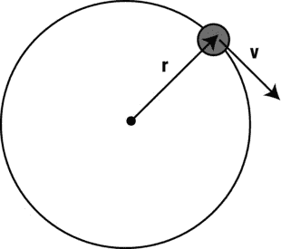
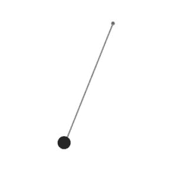

# 九、向心力：旋转运动

从旋转木马到行星的轨道和自转，圆周运动和自转运动在自然界和人造机器中都很普遍。为了分析和模拟这种类型的运动，我们需要一些特殊的工具:第五章中介绍的线性运动学和动力学需要扩展到旋转运动。简而言之，这就是本章将要开始探讨的内容。

本章涵盖的主题包括以下内容:

*   匀速圆周运动的运动学:旋转运动的运动学可以类比线性运动学来发展。
*   向心加速度和向心力:匀速圆周运动的物体仍然受到加速度，因此受到一个指向旋转中心的力。
*   非匀速圆周运动:如果除了向心分量之外还有一个切向分量的力，就会发生这种情况。

本章涵盖的材料也与第十三章中的刚体运动处理相关。

## 匀速圆周运动的运动学

在第四章中，我们用位移、速度和加速度等概念设计了描述运动的框架。正如我们在那里所说，这个框架在技术上被称为运动学。这些概念足以描述所谓的线性或平移运动。但是为了分析圆周或旋转运动，我们需要引入额外的概念。

事实上，旋转运动学的概念可以完全类比线性运动学的概念来发展。首先，我们有位移、速度和加速度的旋转模拟，分别称为角位移、角速度和角加速度。所以让我们从看它们开始。

### 角位移

回想一下，在第四章中，位移被定义为在指定方向上移动的距离。那么角位移的等价定义是什么呢？

首先，我们需要弄清楚什么概念等同于旋转运动中的距离和方向。看一下图 9-1 ，它比较了平移运动和旋转运动。在左边，一个物体沿给定方向移动距离 d。在右边，一个物体以给定的方向(在这种情况下是顺时针方向)绕某个中心旋转了θ角。所以很明显，在旋转运动学中，角度代替了距离，旋转感(顺时针或逆时针)代替了方向。

图 9-1。

Translation and rotation compared for particle motion

产生角位移的另一种情况是刚体绕固定轴旋转时，如图 9-2 所示。在这种情况下，刚体上的每个点都绕旋转轴移动相同的角度θ。

图 9-2。

Rotation of a rigid body about an axis

因此，在任何一种情况下(粒子绕中心旋转或刚体绕轴旋转)，想法都是一样的。因此，我们将角位移定义为一个物体围绕一个特定的中心以特定的方式运动的角度。

这个定义意味着角位移的大小是一个角度。通常的惯例是用弧度来表示角度，所以我们用它来表示角位移。

### 角速度

与线速度类似，角速度被定义为角位移随时间的变化率。角速度的常用符号是ω(希腊字母 omega)，因此它在微积分符号中的定义方程是这样的:

对于较小的时间间隔δt 和角度变化δθ，它可以用以下离散形式表示:

后一个等式也可以写成以下形式:

等式的最后一种形式是我们在代码中最常使用的，用来计算在时间间隔δt 内角速度ω引起的角位移。

角速度用弧度每秒(rad/s)来度量，因为我们用角度除以时间来计算它。

你会经常遇到角速度恒定的情况。比如做匀速圆周运动的质点，虽然它的线速度不恒定(因为它的运动方向改变了)，但是它的角速度是恒定的。另一个例子是一个匀速旋转的物体，比如地球。

### 角加速度

角加速度是角速度的变化率。它由希腊字母α (alpha)表示，其定义等式如下:

角加速度的定义意味着，如果角速度不变，角加速度为零。所以匀速圆周运动的物体，角加速度为零。这并不意味着它的线性加速度为零。实际上，线加速度不可能为零，因为运动的方向(因此线速度)是不断变化的。我们将在本章稍后回到这一点。

### 周期、频率和角速度

匀速圆周运动或旋转是周期运动的一种(见第三章中的“基础三角学”)，因为物体以固定的间隔回到同一位置。事实上，正如在第三章中所讨论的，圆周运动与振荡、正弦运动有关。当时，我们定义了振荡的角频率、频率和周期，并表明它们与以下等式相关:

同样的关系也适用于圆周运动，从图 3-16 中可以明显看出，图 3-16 说明了这两种运动。对于圆周运动，ω现在是角速度；它与相应正弦振荡的角频率相同。同样，f 是旋转的频率(每秒的转数)。最后，T 是旋转周期(完成一次完整旋转所需的时间)。

例如，让我们使用公式ω = 2π/T 来计算地球绕太阳运行的角速度。我们知道周期 T 约为 365 天。以秒为单位，它具有以下值:

t = 365×24×60×60s≈3.15×107s

因此，角速度具有以下值:

φ=2π/t =2π/(3.15×107)≈2.0×10–7rad/s

这是以弧度为单位的角度，地球每秒钟绕太阳旋转一周。

现在让我们用同样的公式计算地球绕轴旋转的角速度。在这种情况下，公转周期为 24 小时，因此 T 具有以下值:

T = 24 × 60 × 60 秒= 86400 秒

因此，角速度如下:

ω=2π/t =2π/86400 = 7.3×105rad/s

请注意，这是地球上每个点的角速度，包括地球表面和地球内部。这是因为地球是一个刚体，所以当它绕轴旋转时，每个点都在同一时间旋转相同的角度。但是，不同的点有不同的线速度。角速度和线速度有什么关系？是时候找出答案了！

### 角速度和线速度的关系

匀速圆周运动物体的线速度和角速度之间有一个简单的关系。为了得出这种关系，我们首先注意到，物体绕半径为 r 的圆移动一个角度δθ的位移δs 是旋转中心处对着该角度的弧的长度。因此，它由下式给出:

这是根据第三章给出的弧度定义得出的:一个弧度是一个长度等于圆半径的弧对着圆心的角度。所以，按比例，在中心成δθ弧度角的圆弧的长度一定是 rδθ(见图 9-3 )。

图 9-3。

Relationship between length of arc and angle at center

现在，我们可以将这个等式两边除以物体移动通过该角度的时间间隔δt:

但是根据定义，δs/δt = v 和δθ/δt =ω。因此，我们有以下内容:

这个公式给出了物体以角速度ω在半径为 r 的圆周上运动的线速度。

它也适用于绕轴旋转的刚体。在这种情况下，它给出了距离旋转轴 r 处的线速度。对于给定的角速度ω，那么公式告诉我们，速度与离轴的距离成正比(离得越远，线速度越快)。

让我们将这个公式应用到上一节讨论的例子中。首先，我们将计算地球绕太阳运行的线速度。为了解决这个问题，我们需要知道地球轨道的半径(地球到太阳的距离):1.5 × 10 11 米。我们已经计算出了地球在其轨道上的角速度。它是 2.0×10–7弧度/秒

因此，地球的轨道速度由下式给出:

v = rω= 1.5×1011×2.0×10–7= 3×104m/s

这是 30 千米/秒，或 100 000 千米/小时，大约是飞机典型速度的 100 倍！

作为第二个例子，因为地球的半径是 6.4 × 10 6 米，其绕自身轴的角速度是 7.3×10–5rad/s(正如我们在上一节中计算出的)，地球表面赤道上任意一点由于地球自转而产生的速度值如下:

v = rω= 6.4×106×7.3×10–5m/s≈470m/s

这大约是 1500 公里/小时，或者大约是飞机典型速度的一倍半。

### 示例:滚动的轮子

我们现在知道的足够多，可以把一些简单的例子放在一起。我们的第一个例子将是创造滚动的轮子。与前几章中的大多数例子不同，这一个将不涉及任何动力学，而仅涉及运动学。所以我们不会用力来计算运动，而只是通过直接指定速度来告诉物体如何运动。

首先，让我们创建一个轮子。我们希望轮子看起来如图 9-4 所示，有一个内轮缘和一个外轮缘，以及一些等间距的辐条(这样我们可以看到它旋转)。

图 9-4。

A rolling wheel

下面是一个完成这项工作的`Wheel`对象:

`function Wheel(innerRadius,outerRadius,numSpokes){`

`this.ir = innerRadius;`

`this.or = outerRadius;`

`this.nums = numSpokes;`

`this.x = 0;`

`this.y = 0;`

`this.vx = 0;`

`this.vy = 0;`

`}`

`Wheel.prototype = {`

`get pos2D (){`

`return new Vector2D(this.x,this.y);`

`},`

`set pos2D (pos){`

`this.x = pos.x;`

`this.y = pos.y;`

`},`

`get velo2D (){`

`return new Vector2D(this.vx,this.vy);`

`},`

`set velo2D (velo){`

`this.vx = velo.x;`

`this.vy = velo.y;`

`},`

`draw: function (context) {`

`var ir = this.ir;`

`var or = this.or;`

`var nums = this.nums;`

`context.save();`

`context.fillStyle = '#000000';`

`context.beginPath();`

`context.arc(this.x, this.y, or, 0, 2*Math.PI, true);`

`context.closePath();`

`context.fill();`

`context.fillStyle = '#ffffaa';`

`context.beginPath();`

`context.arc(this.x, this.y, ir, 0, 2*Math.PI, true);`

`context.closePath();`

`context.fill();`

`context.strokeStyle = '#000000';`

`context.lineWidth = 4;`

`context.beginPath();`

`for (var n=0; n<nums; n++){`

`context.moveTo(this.x,this.y);`

`context.lineTo(this.x+ir*Math.cos(2*Math.PI*n/nums),this.y+ir*Math.sin(2*Math.PI*n/nums));`

`}`

`context.closePath();`

`context.stroke();`

`context.restore();`

`}`

`}`

`Wheel`的构造函数有三个参数:内径、外径和辐条数。

现在我们将创建一个`Wheel`实例并让它滚动。从本书的可下载文件中，看看`wheel-demo.js`中的代码:

`var canvas = document.getElementById('canvas');`

`var context = canvas.getContext('2d');`

`var r = 50;       // outer radius`

`var w = 1;        // angular velocity in radians per second`

`var dt = 30/1000; // timestep = 1/FPS`

`var fac = 1;      // slipping/sliding factor`

`var wheel = new Wheel(r-10,r,12);`

`wheel.x = 100;`

`wheel.y = 200;`

`wheel.draw(context);`

`var v = fac*r*w;     // v = r w`

`var angle = 0;`

`setInterval(onTimer, 1/dt);`

`function onTimer(evt){`

`wheel.x += v*dt;`

`angle += w*dt;`

`context.clearRect(0, 0, canvas.width, canvas.height);`

`context.save();`

`context.translate(wheel.x,wheel.y);`

`context.rotate(angle);`

`context.translate(-wheel.x,-wheel.y);`

`wheel.draw(context);`

`context.restore();`

`}`

我们创建一个`Wheel`实例，然后设置一个调用`onTimer()`函数的`setInterval()`循环，该函数在每个时间步增加轮子的位置和角度方向。这是使用线速度`v`和角速度`w`通过以下公式完成的:

`wheel.x += v*dt;`

`angle += w*dt;`

第一个公式使用速度值`v`,该值是使用该公式预先计算的:

`v = fac*r*w*;`

这基本上是公式 v = rω，但包括了一个附加系数`fac`来模拟滑动或滑行(打滑)的影响，如果`fac = 1`为纯滚动。

第二个公式来自角速度的定义。变量`angle`表示车轮需要转动的角度。实际的转向由`onTimer()`中的其余代码处理。问题是没有办法旋转画布元素上的单个对象——您必须旋转整个画布！我们在下面的代码行中使用了`context.rotate()`方法:

`context.rotate(angle);`

然而，仅这样做将围绕画布原点(0，0)旋转画布，画布原点是画布元素的左上角。我们想围绕物体的中心旋转它。为了实现这一点，我们首先使用`context.translate()`方法移动画布，使其原点在旋转前位于对象的中心。旋转画布后，在绘制轮子之前，我们将画布平移回其原始位置:

`context.translate(wheel.x,wheel.y);`

`context.rotate(angle);`

`context.translate(-wheel.x,-wheel.y);`

`wheel.draw(context);`

请注意，整个代码块都包含在一对`context.save()`和`context.restore()`命令中，以防止画布转换影响随后可能在同一画布上绘制的其他对象。

最后，`dt`是时间步长，被赋予 0.03 的值。这是对连续调用`onTimer()`的时间间隔的估计。我们期望`dt`大约等于 1/FPS，其中 FPS 是由`setInterval()`函数产生的帧速率，我们将其设置为 30。我们重申这只是近似的(参考第二章对`setInterval()`的讨论)，但是对于这个简单的演示来说已经足够好了。

用`fac = 1`运行代码，你会看到轮子移动，这样它的平移速度就和它的旋转速率一致了。这给人一种纯粹滚动的感觉，不会打滑。如果您将`fac`的值更改为小于 1，比如 0.2，车轮相对于其旋转速度向前移动的速度不够快；它看起来像陷在泥里，正在往下滑。如果你给`fac`一个大于 1 的值，比如说 5，轮子向前移动的速度会比它单纯旋转的速度快:它看起来像是在冰上打滑。

### 示例:围绕旋转地球的卫星

我们在这个例子中想要实现的本质上很简单:一个卫星在围绕旋转的地球的圆形轨道上的动画。问题是，我们希望卫星在轨道上运行，以便它总是在地球上的同一个地方。这被称为地球静止轨道；正如你可能猜到的，它对电信和间谍活动非常有用。

同样，这个例子只涉及运动学，不涉及动力学(没有力)。在这一章的后面，我们将加入力。

完整代码在文件`satellite-demo.js`中，在此复制:

`var canvas = document.getElementById('canvas');`

`var context = canvas.getContext('2d');`

`var earth;`

`var satellite;`

`var r, x0, y0, omega;`

`var angle = 0;`

`window.onload = init;`

`function init() {`

`// create a stationary earth`

`earth = new Ball(70,'#0099ff',1000000,0,true,true);`

`earth.pos2D = new Vector2D(400,300);`

`earth.angVelo = 0.4;`

`earth.draw(context);`

`// create a moving satellite`

`satellite = new Satellite(8,'#0000ff',1);`

`satellite.pos2D = new Vector2D(600,300);`

`satellite.angVelo = earth.angVelo;`

`satellite.draw(context);`

`// set params`

`r = satellite.pos2D.subtract(earth.pos2D).length();`

`omega = earth.angVelo;`

`x0 = earth.x;`

`y0 = earth.y;`

`// make the satellite orbit the earth`

`t0 = new Date().getTime();`

`t = 0;`

`animFrame();`

`};`

`function animFrame(){`

`animId = requestAnimationFrame(animFrame,canvas);`

`onTimer();`

`}`

`function onTimer(){`

`var t1 = new Date().getTime();`

`dt = 0.001*(t1-t0);`

`t0 = t1;`

`if (dt>0.2) {dt=0;};`

`t += dt;`

`move();`

`}`

`function move(){`

`satellite.pos2D = new Vector2D(r*Math.cos(omega*t)+x0,r*Math.sin(omega*t)+y0);`

`angle += omega*dt;`

`context.clearRect(0, 0, canvas.width, canvas.height);`

`rotateObject(earth);`

`rotateObject(satellite);`

`}`

`function rotateObject(obj){`

`context.save();`

`context.translate(obj.x,obj.y);`

`context.rotate(angle);`

`context.translate(-obj.x,-obj.y);`

`obj.draw(context);`

`context.restore();`

`}`

大部分代码都很简单，但是有一些值得注意的新特性。我们创建一个 E `arth`和一个`satellite`对象。这些物体的质量在这里是不相关的，因为没有动力学。您可以使用任何您想要的值，动画将以完全相同的方式运行。注意 E `arth`是`Ball`的一个实例，而`satellite`是`Satellite`的一个实例。后一个对象基本上类似于`Ball`，增加了在卫星上绘制三条线的代码，使其具有老式的类似 Sputnik 的外观。`Ball`和`Satellite`对象都有一个名为`angVelo`的新属性，它存储它们实例的角速度值。我们还在`Ball`中引入了一个可选的布尔参数`line`，如果设置为`true`，将在`Ball`实例上绘制一对交叉线。这样可以观察到球的旋转。

我们给地球一个非零的角速度。然后我们赋予卫星相同的角速度。卫星到地球的距离被计算出来并存储在变量`r`中。这个距离不变，因为轨道是圆形的。然后地球的角速度和 x、y 位置分别存储在变量`omega`、`x0`和`y0`中。

动作发生在`move()`方法中。我们在这里所做的就是告诉卫星它在任何时候的位置，使用这些公式:

你可能会从第三章中回忆起，这样使用 cos 和 sin，会产生角频率为ω，半径为 r 的圆周运动，加上 x0 和 y0(地心坐标)就使卫星绕地球运行。另一个重要的是，ω选择为等于地球角速度。这使得卫星以与地球自转完全相同的速度绕地球旋转。运行模拟，你会发现事实确实如此。

此外，由于卫星绕其轴的角速度与地球相同，其天线始终指向地球(见图 9-5 )。

图 9-5。

A spy satellite orbiting the Earth

产生地球和卫星旋转的代码在`rotateObject()`方法中，从前面的例子看应该很熟悉。注意，这里使用一个变量`angle`来计算两个对象在每个时间步必须旋转的角度。这是因为它们具有相同的角速度。

机警的读者会注意到，我们把这个例子称为动画，而不是模拟。这是因为我们基本上告诉卫星如何移动，而不是规定作用在它身上的力，让它们决定卫星的运动。虽然动画确实有一些物理真实感，但并不完全真实。一个原因是，我们已经迫使卫星以与地球绕其轴自转相同的速率(相同的角速度)绕地球旋转。你可以改变卫星离地球中心的距离，但它仍会以同样的速度运行。在现实中，卫星只能在离地球中心特定距离的地方这样做；换句话说，所有的地球同步卫星都必须与地球保持相同的距离！为什么会这样还不清楚，但是下一节将会帮助你澄清这一点，并帮助你在动画中构建这个特性。

## 向心加速度和向心力

既然我们已经讨论了基础知识，是时候继续讨论一些稍微难一点的概念了:向心加速度和向心力。实际上，它们并不难，但是经常被误解。因此，在我们进行的过程中，我们将试图澄清一些可能的混淆。

### 向心加速度

正如我们在角速度一节中所指出的，一个做圆周运动(或一般做曲线运动)的物体，其线速度是随时间变化的，因为它的方向一直在变化。因此，从加速度作为速度变化率的定义来看，这意味着它具有非零加速度——我们从未说过加速度仅仅意味着速度(速度)大小的变化；这也可能意味着方向的改变。

可能一点都不明显，但是对于做圆周运动的物体来说，这个加速度其实是指向圆心的。因此，它被称为向心加速度(来自拉丁语:centr = "center，"和 petere = "to seek ")。理解这一点的一种方法是将中心想象成拉动物体，从而不断改变其方向(见图 9-6 )。我们一会儿会看到如何计算向心加速度。

图 9-6。

Centripetal acceleration

向心加速度不能和角加速度混淆。正如本章前面所解释的，角加速度指的是角速度的变化率。在匀速圆周运动的情况下，角加速度为零是因为角速度不变(这就是“匀速”的意思)，但向心加速度不为零。向心加速度是线速度变化率的一种度量，此时线速度仅改变方向，而其大小保持不变。

### 向心加速度、速度和角速度

我们如何计算向心加速度？有一个简单的公式。这不容易证明，所以最好的事情就是相信我们！下面是公式的一种形式:

参考图 9-6 ，这个公式告诉我们一个物体以速度 v 做半径为 r 的圆周或圆弧运动时的向心加速度，由此我们推导出如果速度大，加速度也大(对于同样的半径)；而如果半径小，加速度就大(对于同样的速度量级)。

记住 v = rω，您可以用 r 和ω替换前面公式中的 v，得出公式的另一种形式:

这个公式现在告诉我们，角速度越大，向心加速度越大(半径相同)。但它也告诉我们，对于相同的角速度，半径越大，向心加速度越大。这与我们之前所说的公式的另一种形式并不矛盾，但乍一看似乎令人困惑！关键的一点是，这里的线速度的大小并没有被假定为不同半径的常数。事实上，如果角速度不变，那么线速度的大小一定随半径增加，因为 v = rω。

前面公式的一个结果是，对于绕轴旋转的刚体，离轴越远的点加速度越大(因为刚体上所有点的角速度都一样)，速度也越大(因为 v = rω)。

### 向心力

我们已经看到，任何做匀速圆周运动的物体都必须经历一个朝向圆周轨迹中心的加速度。因此，根据牛顿第二定律，一定有一个合力也指向中心。这就是所谓的向心力。

向心力是使物体保持圆周运动所需的力。它需要由某个物理代理持续提供；否则，物体不能保持圆周运动。

举个例子，一个被绳子绕着旋转的物体从绳子的张力中获得向心力。围绕圆形轨道运动的汽车从地面对轮胎施加的摩擦力中获得向心力。由于太阳的引力，围绕太阳运行的行星受到向心力的作用。

解出向心力的公式非常容易。因为 F = ma，你只需要将向心加速度的公式乘以 m(运动物体的质量)就可以得到:

为了得到这个:

在向量形式中，第一个公式可以写成如下:

或者可以这样写，其中 r u 是运动物体相对于中心的位置矢量 r 方向的单位矢量:

负号的出现是因为力指向中心(与向量 r 相反)。类似的向量形式也适用于公式 F = mrω 2 。

### 向心力的常见误解

向心力可能是物理学中最容易被误解的概念之一。让我们澄清一些困惑。

*   向心力不是一种独特的“类型”的力，就像重力和摩擦力是力的类型一样。它只是使一个物体做圆周运动所必须存在的力。不同的力可以起到向心力的作用，包括重力和摩擦力。
*   有时人们会错误地谈论需要“平衡”向心力。例如，一个常见的误解是，围绕太阳运行的轨道上的行星的引力平衡了向心力。出于几个原因，这是没有意义的。第一，向心力一定是指向太阳的，引力也是，所以两者方向一致。第二，如果这两个力真的平衡了，行星上的合力将为零；因此，它的加速度为零，所以它必须以恒定速度沿直线运动(根据牛顿第一运动定律)。第三，向心力甚至不是一种“类型”的力。正确的思路是，引力提供了行星绕太阳运行所必需的向心力。
*   你可能还听说过一个叫离心力的东西，它与向心力大小相同，但作用方向相反(远离旋转中心)。离心力不是真正的力，而是所谓的伪力。它起源于试图在牛顿定律的框架内分析运动，但是是从旋转参照系的角度。一个例子是从地球上的参考系(当然是旋转的)来描述大气运动。虽然离心力在分析这类问题的物理学中肯定有它的位置，但它也能引起许多混乱。因此，我们的建议是避免考虑离心力。在本章后面的“例子:汽车绕弯道行驶”一节中，我们给出了一个离心力的例子的向心力解释。

### 示例:重温卫星动画

作为向心力概念应用的第一个例子，让我们回到卫星动画，并像承诺的那样给它注入更多的真实感。

这里向心力是由卫星上的重力提供的。因此，我们可以将向心力的表达式与引力的表达式等同起来，以获得以下等式，其中 M 是卫星质量，M 是地球质量，r 是卫星到地心的距离，ω是卫星的角速度:

很容易重新排列这个等式，得到如下结果:

这个公式告诉我们，为了以角速度ω绕轨道运行，卫星必须达到的半径。换句话说，卫星不可能在任何距离都有任何角速度；向心力决定了它必须以固定的角速度旋转，距离地球任意给定的距离！特别是，我们可以使用公式来计算它必须以与地球自转相同的角速度旋转的距离。如果你把 G、M(地球质量)和ω(我们之前算出的地球角速度)的值代入，你会发现地球静止轨道的半径是 42，400 公里，大约是地球半径的 6.6 倍。

回到我们的动画，我们需要让卫星意识到它与地球的距离和它绕地球的角速度之间的约束，如前面的等式所示。事实上，在动画中，我们将指定卫星的位置，从而指定到地球的距离 r，并希望计算出它的最终角速度ω，而不是将其设置为等于地球的角速度。

因此，我们需要一个用 r 表示的ω公式，利用上一个公式可以很容易地得出:

这就是我们所需要的。我们复制了`satellite-demo.js`来创造`satellite-demo2.js`。如果您查看后一个文件，您会发现我们所做的主要更改是替换了这一行:

`omega = earth.angVelo;`

用下面一行:

`omega = Math.sqrt(G*M/(r*r*r));`

其中`M`是地球的质量(这里设为 1000000)，引力常数`G`的值设为 1。我们现在也有单独的变量`omegaE`和`angleE`来存储地球的角速度和角位移。

如果你现在用先前卫星和地球的位置和质量以及地球的角速度运行代码，你会看到卫星不再在地球静止轨道上。事实上，当它完成一个轨道时，它的触角已经指向错误的方向。如果使用前面的公式计算地球静止轨道的 r 值，给定值为 G = 1，M = 1000000，ω = 0.4，则 r = 184.2。这是卫星应该离地球中心的距离。假设地球位于(400，300)，你只需要把卫星的位置换到 184.2 个单位以外的位置，比如`satellite-demo2.js`中的(584.2300):

`satellite.pos2D = new Vector2D(584.2,300);`

这样做，然后运行代码。你会看到卫星确实以和地球相同的角速度运行。

### 示例:重力作用下的圆形轨道

在本例中，我们回到完全动态模拟。事实上，我们已经在第六章的轨道模拟中做过了，我们模拟了一颗行星围绕太阳的运动。模拟已经“知道”万有引力是向心力，所以没有其他要补充的了。但是如果我们想要圆形轨道，我们可以用向心力公式，精确计算出我们需要给行星多大的速度。

同样，这只是一个向心力和引力表达式相等的问题。这次，我们用 F = mv 2 /r 的形式来表示向心力:

稍加代数运算，我们就可以得出以下公式，这是行星在距离其中心 r 处围绕太阳运行的圆形轨道所需的速度大小:

让我们把这个编码到轨道模拟的修改版本中。新的源文件名为`circular-orbits.js`，这里显示了完整的代码:

`var canvas = document.getElementById('canvas');`

`var context = canvas.getContext('2d');`

`var canvas_bg = document.getElementById('canvas_bg');`

`var context_bg = canvas_bg.getContext('2d');`

`var planet;`

`var sun;`

`var m = 1;       // planet's mass`

`var M = 1000000; // sun's mass`

`var G = 1;`

`var t0,dt;`

`var acc, force;`

`window.onload = init;`

`function init() {`

`// create a stationary sun`

`sun = new Ball(70,'#ff9900',M,0,true);`

`sun.pos2D = new Vector2D(400,300);`

`sun.draw(context_bg);`

`// create a moving planet`

`planet = new Ball(10,'#0000ff',m);`

`planet.pos2D = new Vector2D(400,50);`

`var r = planet.pos2D.subtract(sun.pos2D).length();`

`var v = Math.sqrt(G*M*m/r);`

`planet.velo2D = new Vector2D(v,0);`

`planet.draw(context);`

`// make the planet orbit the sun`

`t0 = new Date().getTime();`

`animFrame();`

`};`

`function animFrame(){`

`animId = requestAnimationFrame(animFrame,canvas);`

`onTimer();`

`}`

`function onTimer(){`

`var t1 = new Date().getTime();`

`dt = 0.001*(t1-t0);`

`t0 = t1;`

`if (dt>0.2) {dt=0;};`

`move();`

`}`

`function move(){`

`moveObject(planet);`

`calcForce();`

`updateAccel();`

`updateVelo(planet);`

`}`

`function moveObject(obj){`

`obj.pos2D = obj.pos2D.addScaled(obj.velo2D,dt);`

`context.clearRect(0, 0, canvas.width, canvas.height);`

`obj.draw(context);`

`}`

`function calcForce(){`

`force = Forces.gravity(G,M,m,planet.pos2D.subtract(sun.pos2D));`

`}`

`function updateAccel(){`

`acc = force.multiply(1/m);`

`}`

`function updateVelo(obj){`

`obj.velo2D = obj.velo2D.addScaled(acc,dt);`

`}`

大部分代码应该非常熟悉。这个模拟的新特点是，我们精确地给出了行星在圆形轨道上运动所需的初速度。这是在用粗体突出显示的两行中完成的，使用的是我们刚刚导出的公式。

使用前面代码清单中给出的初始值运行模拟，您会发现行星确实描述了围绕太阳的圆形轨道。为了让自己相信这在离太阳任意远的地方都有效，将行星的初始位置改为如下:

`planet.pos2D = new Vector2D(400,150);`

这使得行星更靠近太阳。如果您现在运行代码，您将看到行星以更快的速度绕太阳运行，但轨道仍然是圆形的。

注意速度必须是切向的，没有径向分量(见图 9-7 )。如果有任何径向速度分量，行星要么靠近太阳，要么远离太阳(它的轨道不会是圆形的)。例如，当行星的初始位置为(400，50)时，尝试以下操作:

`planet.velo2D = new Vector2D(v/Math.sqrt(2), v/Math.sqrt(2));`

这给了行星一个与之前相同大小的初始速度`v`，但是方向不同，因此它有一个朝向太阳的径向分量和一个切向分量。你会发现行星的轨道现在是高度椭圆形的，行星离太阳非常近，然后又远离太阳。

图 9-7。

Tangential velocity

鼓励你尝试不同的初始位置和速度，看看你得到的轨道类型。你应该会发现，如果不使用公式，通过简单的试错法，很难得到恰到好处的初始条件来产生甚至近似圆形的轨道！

### 示例:汽车在转弯处行驶

在下一个例子中，我们模拟了一辆汽车在环形轨道上的运动，并用它来演示汽车行驶过快时的打滑现象。

这里的基本物理原理是，当汽车绕着一个弯道或弯道行驶时，它需要这样做的向心力是由轮胎与路面接触时的摩擦力提供的(见图 9-8 )。

图 9-8。

Friction provides the centripetal force for a car to negotiate a bend

回到向心力的公式，汽车移动得越快，保持它绕过弯道所需的向心力就越大:

顺便说一句，该公式还表明，向心力更大的更尖锐的弯曲，弯曲半径较小。

摩擦力是静摩擦力，如第七章中所述，其最大值由 f = C s N 给出，其中 N 是法向力(这里等于汽车重量 mg)，C s 是轮胎和路面之间的静摩擦系数。因此，如果通过弯道所需的向心力超过最大静摩擦力，汽车将无法跟随弯道的曲率——它将打滑。

我们现在构建一个模拟，可以以自然的方式处理这个场景。设置如图 9-9 所示。

图 9-9。

The skidding car simulation

下面是实现它的代码(在文件`car-demo.js`中):

`var canvas = document.getElementById('canvas');`

`var context = canvas.getContext('2d');`

`var canvas_bg = document.getElementById('canvas_bg');`

`var context_bg = canvas_bg.getContext('2d');`

`var center = new Vector2D(canvas.width/2,canvas.height/2);`

`var car;`

`var mass = 90; // car mass`

`var g = 10;`

`var Cs = 1;`

`var angle = 0;`

`var omega;`

`var t0,dt;`

`var acc, force;`

`window.onload = init;`

`function init() {`

`// create a circular track, e.g. a roundabout`

`context_bg.fillStyle = '#cccccc';`

`context_bg.beginPath();`

`context_bg.arc(canvas.width/2, canvas.height/2, 100, 0, 2*Math.PI, true);`

`context_bg.closePath();`

`context_bg.fill();`

`context_bg.fillStyle = '#ffffff';`

`context_bg.beginPath();`

`context_bg.arc(canvas.width/2, canvas.height/2, 50, 0, 2*Math.PI, true);`

`context_bg.closePath();`

`context_bg.fill();`

`// create a car`

`car = new Box(10,20,'#0000ff',mass);`

`car.pos2D = new Vector2D(center.x+75,center.y);`

`car.velo2D = new Vector2D(0,-10);`

`car.angVelo = -car.velo2D.length()/(car.pos2D.subtract(center).length());`

`omega = car.angVelo;`

`car.draw(context);`

`// make the car move`

`t0 = new Date().getTime();`

`animFrame();`

`};`

`function animFrame(){`

`animId = requestAnimationFrame(animFrame,canvas);`

`onTimer();`

`}`

`function onTimer(){`

`var t1 = new Date().getTime();`

`dt = 0.001*(t1-t0);`

`t0 = t1;`

`if (dt>0.2) {dt=0;};`

`move();`

`}`

`function move(){`

`moveObject(car);`

`calcForce();`

`updateAccel();`

`updateVelo(car);`

`}`

`function moveObject(obj){`

`obj.pos2D = obj.pos2D.addScaled(obj.velo2D,dt);`

`angle += omega*dt;`

`context.clearRect(0, 0, canvas.width, canvas.height);`

`rotateObject(obj);`

`}`

`function rotateObject(obj){`

`context.save();`

`context.translate(obj.x,obj.y);`

`context.rotate(angle);`

`context.translate(-obj.x,-obj.y);`

`obj.draw(context);`

`context.restore();`

`}`

`function calcForce(){`

`var dist = car.pos2D.subtract(center);`

`var velo = car.velo2D.length();`

`var centripetalForce = dist.unit().multiply(-mass*velo*velo/dist.length());`

`var radialFriction = dist.unit().multiply(-Cs*mass*g);`

`if(radialFriction.length() > centripetalForce.length()) {`

`force = centripetalForce;`

`}`

`else{`

`force = radialFriction;`

`}`

`}`

`function updateAccel(){`

`acc = force.multiply(1/mass);`

`}`

`function updateVelo(obj){`

`obj.velo2D = obj.velo2D.addScaled(acc,dt);`

`}`

如图所示，我们从`init()`方法开始，画一个圆形轨迹。下一步引入了一点艺术上的新奇。因为我们正在处理一辆汽车，一个`Ball`实例根本不行。相反，我们的车是一个`Box`实例。`Box`是一个本质上类似于`Ball`的类，除了它绘制一个填充的矩形而不是一个填充的圆形。`Box`有四个参数(`width`、`height`、`color`和`mass`)，它们都有默认值，因此是可选的。将汽车创建为`Box`实例后，我们将它放置在轨道上，并给它一个初始切向速度。然后，下一条线通过使用公式ω = v/r，给出汽车的旋转角速度等于其“轨道”角速度，其中 v 是汽车的速度，r 是其距中心的距离。

代码的其余部分应该很容易理解。在`calcForce()`中，我们用向量形式的公式 F = mv 2 /r 计算向心力，用公式 F = C s mg 计算汽车上的最大摩擦力(见第七章)，其中 m 为汽车质量。为简单起见，我们假设静摩擦力和动摩擦力是相同的。还有，我们假设小车上的合力是径向的摩擦力。`if`模块检查最大摩擦力是否足以提供向心力。如果是这样，合力就取为向心力相等；如果不是，合力等于最大摩擦力。

如果你以 10 或 20 px/s 的初速度运行模拟，你会发现赛车在赛道上运动没有问题。然而，如果你把车速提高到 30 英里以上，汽车就会打滑！

## 非匀速圆周运动

到目前为止，本章我们只讨论了匀速圆周运动。当角速度不恒定时，我们如何处理旋转？在最后一节中，我们将开始研究这个问题，并用一个例子来说明它。对非匀速转动的更全面的论述将涉及到对角动量和力矩等概念的深入研究。为此，你必须等待第十三章。

### 切向力和加速度

匀速圆周运动和非匀速圆周运动的根本区别在于，在前者中，向心力是唯一的力；而后者既有向心力又有切向力(见图 9-10 )。切向的字面意思是“沿着圆的切线”。非匀速圆周运动的向心力由与匀速圆周运动相同的公式给出。与向心力一样，切向力可能是由许多因素引起的，如重力或摩擦力。

图 9-10。

Tangential (Ft ) and centripetal (Fc) forces

注意向心力改变的只是运动的方向，这就是匀速圆周运动为什么是匀速的原因。但是因为切向力作用在速度矢量的方向上，所以它们会引起旋转物体速度的变化。这也意味着当存在切向力时，存在非零的角加速度。

底线:为了模拟非匀速圆周运动，我们需要提供向心力和切向分力的力，正如我们下一个也是最后一个例子所展示的。

### 例子:单摆

所谓的单摆由一个重锤组成，重锤用绳子吊在一个固定的枢轴上。通过轻微移动摆锤并释放摆锤，摆锤开始摆动。模拟单摆并不完全简单，需要一点思考来获得正确的物理原理。

图 9-11 显示了单摆的力图。绳索通常相对于垂直线倾斜一定角度θ。我们假设绳子的质量可以忽略不计，并且没有摩擦力或阻力。设 m 表示摆锤的质量。于是有两个力作用在摆锤上:重力垂直向下作用，大小为毫克；并且绳索中朝向固定枢轴作用的张力的大小为 t

图 9-11。

Geometrical and force diagram for a pendulum

显然，摆锤以枢轴为中心做圆弧运动。但是摆锤的角速度是不均匀的。事实上，当摆锤处于最高位置时，它是零，当摆锤处于最低点时，它是最大值。因此，有一个角加速度，因为有一个切向分力。因为张力是径向的(垂直于切向)，所以没有切向分量。但是重力总的来说有一个切向分量，由 mg sin(θ)给出。这是引起角加速度的力。注意，因为角度θ随时间变化，所以切向力和角加速度不是恒定的。

提供向心力的径向分力是什么？从图 9-11 可以清楚地看出，重力有一个远离支点的分量 mg cos(θ)。因此，净径向力分量为 T–mg cos(θ)，它必须等于向心力:

因此，这意味着张力 T 的大小由下式给出:

从图 9-11 中可以清楚地看出，张力的方向与摆锤相对于枢轴的位置矢量 r 相反。

聪明的部分来了。我们所要做的就是指定重力 mg 和张力 T，就像上一个等式给出的那样。然后，一旦我们给它一个初始位置，摆锤应该知道如何在这两个力的作用下运动。让我们继续编码吧。

代码在文件`pendulum` `.js`中:

`var canvas = document.getElementById('canvas');`

`var context = canvas.getContext('2d');`

`var bob;`

`var pivot;`

`var displ = new Vector2D(0,0);`

`var center = new Vector2D(0.5*canvas.width,50);`

`var mass = 1;`

`var g = 100;`

`var lengthP = 200;`

`var initAngle = 30;`

`var t0, t, dt;`

`var acc, force;`

`var animId;`

`window.onload = init;`

`function init() {`

`// create a pivot`

`pivot = new Ball(2,'#000000');`

`pivot.pos2D = center;`

`pivot.draw(context);`

`// create a bob`

`bob = new Ball(10,'#333333',mass);`

`bob.mass = mass;`

`var relativePos = new Vector2D(lengthP*Math.sin(initAngle*Math.PI/180),lengthP*Math.cos(initAngle*Math.PI/180));`

`bob.pos2D = pivot.pos2D.add(relativePos);`

`bob.draw(context);`

`// make the bob move`

`t0 = new Date().getTime();`

`t = 0;`

`animFrame();`

`};`

`function animFrame(){`

`animId = requestAnimationFrame(animFrame,canvas);`

`onTimer();`

`}`

`function onTimer(){`

`var t1 = new Date().getTime();`

`dt = 0.001*(t1-t0);`

`t0 = t1;`

`if (dt>0.2) {dt=0;};`

`t += dt;`

`move();`

`}`

`function move(){`

`context.clearRect(0, 0, canvas.width, canvas.height);`

`drawSpring(bob);`

`moveObject(bob);`

`calcForce(bob);`

`updateAccel();`

`updateVelo(bob);`

`}`

`function drawSpring(obj){`

`pivot.draw(context);`

`context.save();`

`context.strokeStyle = '#999999';`

`context.lineWidth = 2;`

`context.moveTo(center.x,center.y);`

`context.lineTo(obj.x,obj.y);`

`context.stroke();`

`context.restore();`

`}`

`function moveObject(obj){`

`obj.pos2D = obj.pos2D.addScaled(obj.velo2D,dt);`

`obj.draw(context);`

`}`

`function calcForce(obj){`

`displ = obj.pos2D.subtract(center);`

`var gravity = Forces.constantGravity(mass,g);`

`var tension;`

`if (displ.length() >= lengthP) {`

`tension = displ.unit().multiply(-(gravity.projection(displ)+mass*bob.velo2D.lengthSquared()/lengthP));`

`}else{`

`tension = new Vector2D(0,0);`

`}`

`force = Forces.add([gravity, tension]);`

`}`

`function updateAccel(){`

`acc = force.multiply(1/mass);`

`}`

`function updateVelo(obj){`

`obj.velo2D = obj.velo2D.addScaled(acc,dt);`

`}`

我们首先创建一个枢轴和一个摆锤。摆锤的位置应确保绳索与垂直线成 30 度的初始角度。为此，参考图 9-11 ，该图显示摆锤相对于枢轴的 x 和 y 坐标由下式给出，其中 l 是摆锤的“长度”，定义为摆锤中心到固定枢轴的距离:

物理上，l 等于弦的长度和摆锤的半径之和。在代码中，我们用变量`lengthP`来表示。这个相对位置向量被计算并存储在变量`relativePos`中，然后被添加到枢轴的`pos2D`属性中以设置摆锤的位置。初始倾斜角度(以度为单位)由参数`initAngle`设定。

代码中动画部分的新颖之处基本上是在`calcForce()`方法中。我们用通常的方法计算重力。`if`代码块检查摆锤到枢轴的距离是否大于或等于绳索长度。如果是这样，那就意味着绳子是绷紧的，因此张力不为零；是用公式 T = mg cos(θ) + mv 2 /r 计算出来的，否则绳子没有拉紧，所以张力为零。在当前设置中，没有必要严格检查绳索是否拉紧，因为模拟从拉紧的绳索开始，并且一直保持拉紧状态。但是实现这种检查会使代码对未来可能的修改更加健壮。请注意，重力的径向分量 mg cos(θ)是使用漂亮的`projection()`方法计算的，我们将该方法引入到`Vector2D`对象中，以便`vec1.projection(vec2)`给出矢量`vec1`在矢量`vec2`方向上的投影。下面是`projection()`的定义:

`function projection(vec){`

`var length = this.length();`

`var lengthVec = vec.length();`

`var proj;`

`if( (length == 0) || ( lengthVec == 0) ){`

`proj = 0;`

`}else {`

`proj = (this.x*vec.x + this.y*vec.y)/lengthVec;`

`}`

`return proj;`

`}`

如果你运行代码并调整参数，你会发现如果绳子越短，g 值越大，钟摆摆动得越快。这在现实中是理所应当的。事实上，你可以通过比较振荡周期和理论值来测试你的模拟摆有多好。

物理学理论认为，对于小振幅的振荡，单摆的周期大致由下式给出，其中 l 是摆的长度:

我们在模拟中使用的值是 l = 200 和 g = 100。这样就得到 T = 2π，大约是 8.9 秒。检查模拟是否给出该值，例如，通过将时间输出到控制台并计时为 10 次振荡，然后将总时间除以 10。为了使这更容易，文件`pendulum2.js`包含了一些额外的代码，允许你通过点击鼠标来停止模拟。你应该得到一个非常接近 8.9 秒的值。正如你在图 9-12 中看到的，它几乎像真的一样工作！。

图 9-12。

The pendulum simulation

## 摘要

本章介绍了处理圆周和旋转运动所需的一些物理学知识，重点是粒子和简单刚体旋转。本章为更详细地研究刚体转动奠定了基础，我们将在第十三章中介绍。这里介绍的一些概念也将在下一章——远程部队——中进一步应用和发展。