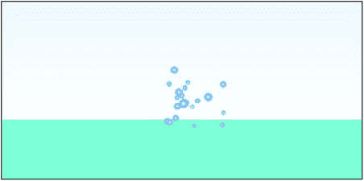
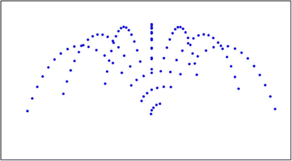
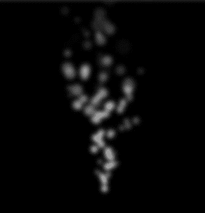
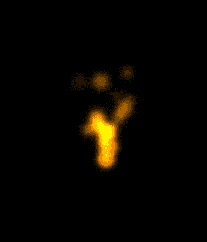
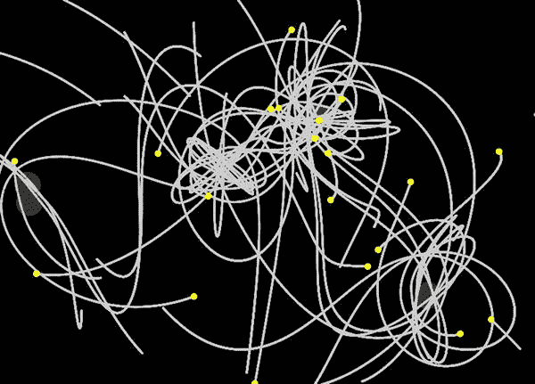
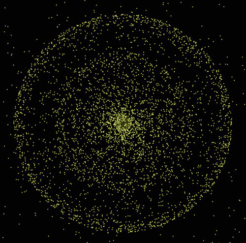

# 十二、粒子系统

简而言之，本章将向你展示如何使用多粒子系统创建动画效果和模拟。粒子系统非常受欢迎，多年来在动画社区中使用它们做了很多创造性的工作。在一章中，我们只能真正触及可能的表面。因此，我们将满足于为您提供一些想法和示例，供您参考和借鉴。

本章涵盖的主题包括以下内容:

*   粒子系统建模简介:这个简短的部分将解释什么是粒子系统，以及建立一个粒子系统需要什么。
*   使用粒子创建动画效果:使用粒子和一些简单的物理可以产生一些有趣的动画效果，如烟和火。在本节中，我们将带您浏览一些示例。
*   具有远程力的粒子动画:粒子动画不必看起来很逼真；他们可以只是为了好玩！我们看几个古怪的例子，用的是长程作用力，比如重力。
*   相互作用的粒子系统:更复杂的粒子系统包括粒子之间的相互作用。但是对于大量的粒子来说，这在计算上会变得非常昂贵。我们给出几个例子，讨论解决这个问题的技巧。

本章的方法是创建使用一些物理的动画，但不一定是精确的模拟。最重要的是，这是一个需要实验和创造力的主题。因此，不要害怕修补和发明，即使这意味着打破一些物理定律！

## 粒子系统建模简介

虽然一个粒子系统的精确定义可能并不存在，但是尝试定义它将有助于在我们做任何事情之前解释我们的想法。在我们使用这个术语的意义上，粒子系统由下列元素组成:

*   一组粒子
*   它们移动和改变的规则
*   他们互动的规则(如果有的话)

这个定义非常笼统:所说的“规则”可以基于物理学、人工智能、生物学或任何类似的系统。不足为奇的是，我们将把自己限制在物理定律下的粒子运动和相互作用(也许这里和那里有一些奇怪的调整)。因此，我们将考虑的粒子系统将在我们在本书第二部分中讨论的力的子集的作用下，根据牛顿运动定律激活粒子。粒子之间的不同种类的相互作用可以包括如下:

*   没有相互作用:在这种情况下，粒子是彼此不知道的，在全局规定的力(如外部引力)的作用下独立运动。即使这是最简单的情况，使用非相互作用粒子也能产生令人印象深刻的效果。在接下来的两节中，我们将看几个例子。
*   碰撞产生的相互作用:这里粒子除了碰撞时非常短暂的相互作用外，不发生相互作用。使用第十一章中给出的方法可以解决冲突。事实上，第十一章中的最后一个例子展示了这样一个通过碰撞相互作用的粒子系统。
*   短程相互作用:在这种情况下，粒子只有在靠近但不一定接触时才会相互作用。它们可以用存在于分子间的短程力来模拟。使用这种力可以模拟流体效应，例如液滴的形成和下落。但是这些模拟需要更高级的方法，不在本书讨论范围之内。
*   长程相互作用:这一类包括任何距离的粒子之间的相互作用，例如粒子之间的重力或电力。一般来说，每个粒子都会受到其他粒子的作用力。显然，随着系统中粒子数量的增加，需要执行的计算量会很快变得非常大。我们在本章的最后一节看一些例子。
*   局部相互作用:这些相互作用介于短程和长程之间；某个局部邻域内的粒子是相互联系和相互作用的。这种相互作用可以产生有组织的系统和连接的结构。例子包括质量弹簧系统，它可以用来模拟像绳子和衣服这样的可变形物体。这些粒子系统将在第十三章中探讨。

那么，就物理和编码而言，我们需要什么来创建一个粒子系统呢？答案可能会让你大吃一惊:并没有超出我们在前面章节中已经介绍过的内容太多。所以这一章不会有太多的理论，但更多的是关于已经讨论过的原理的应用，并增加了一些额外的技巧。这意味着您可以更快地看到代码！

## 使用粒子创建动画效果

粒子系统最常见的用途之一是创建动画视觉效果，如烟和火。在这一节中，我们将向您展示使用基于物理的动画制作这些效果的简单方法。我们从一个非常简单的例子开始，然后创建一个粒子发射器，这将允许我们创建一些更复杂的效果。这部分的方法是我们想要制作看起来真实的动画，但是不需要完全精确。

### 一个简单的例子:粒子飞溅效果

在这个例子中，我们将物体放入水中，然后使用粒子创建飞溅效果。这些物体将是不同大小的球，从同一高度一次扔出一个。水花将由一组尺寸更小的`Ball`物体组成。让我们直接进入创建这些对象的代码。这个文件可以从 [`www.apress.com`](http://www.apress.com/) 下载，叫做`splash.js`。以下是完整的代码清单:

`var canvas = document.getElementById('canvas');`

`var context = canvas.getContext('2d');`

`var canvas_bg = document.getElementById('canvas_bg');`

`var context_bg = canvas_bg.getContext('2d');`

`var drop;`

`var droplets;`

`var numDroplets = 20;`

`var m = 1;`

`var g = 20;`

`var vx = 20;`

`var vy = -15;`

`var wlevel = 510;`

`var fac = 1;`

`var t0,dt;`

`var acc, force;`

`window.onload = init;`

`function init() {`

`makeBackground();`

`makeDrop();`

`makeDroplets();`

`t0 = new Date().getTime();`

`animFrame();`

`}`

`function makeBackground(){`

`var horizon = 500;`

`// the sea`

`context_bg.fillStyle = '#7fffd4';`

`context_bg.fillRect(0,horizon,canvas_bg.width,canvas_bg.height-horizon);`

`// the sky`

`gradient = context_bg.createLinearGradient(0,0,0,horizon);`

`gradient.addColorStop(0,'#87ceeb');`

`gradient.addColorStop(1,'#ffffff');`

`context_bg.fillStyle = gradient;`

`context_bg.fillRect(0,0,canvas_bg.width,horizon);`

`}`

`function makeDrop(){`

`drop = new Ball(8,'#3399ff',1,0,true);`

`drop.pos2D = new Vector2D(400,100);`

`drop.velo2D = new Vector2D(0,100);`

`drop.draw(context);`

`}`

`function makeDroplets(){`

`droplets = new Array();`

`for (var i=0; i<numDroplets; i++){`

`var radius = Math.random()*2+1;`

`var droplet = new Ball(radius,'#3399ff',m,0,true);`

`droplets.push(droplet);`

`}`

`}`

`function animFrame(){`

`animId = requestAnimationFrame(animFrame,canvas);`

`onTimer();`

`}`

`function onTimer(){`

`var t1 = new Date().getTime();`

`dt = 0.001*(t1-t0);`

`t0 = t1;`

`if (dt>0.2) {dt=0;};`

`move();`

`}`

`function move(){`

`context.clearRect(0, 0, canvas.width, canvas.height);`

`moveObject(drop);`

`checkDrop();`

`for (var i=0; i<numDroplets; i++){`

`var droplet = droplets[i];`

`moveObject(droplet);`

`calcForce(droplet);`

`updateAccel();`

`updateVelo(droplet);`

`}`

`}`

`function moveObject(obj){`

`obj.pos2D = obj.pos2D.addScaled(obj.velo2D,dt);`

`if (obj.y < wlevel){// only show drops that are above water level`

`obj.draw(context);`

`}`

`}`

`function calcForce(obj){`

`force = Forces.constantGravity(m,g);`

`}`

`function updateAccel(){`

`acc = force.multiply(1/m);`

`}`

`function updateVelo(obj){`

`obj.velo2D = obj.velo2D.addScaled(acc,dt);`

`}`

`function checkDrop(){`

`if (drop.y > wlevel){`

`for (var i=0; i<droplets.length; i++){`

`var droplet = droplets[i];`

`var posx = drop.x+(Math.random()-0.5)*drop.radius;`

`var posy = wlevel-10+Math.random()*drop.radius;`

`var velx = (Math.random()-0.5)*vx*fac;`

`var vely = (Math.random()+0.5)*vy*fac;`

`droplet.pos2D = new Vector2D(posx,posy);`

`droplet.velo2D = new Vector2D(velx,vely);`

`}`

`drop.x = Math.random()*600+100;`

`drop.y = 100;`

`drop.radius = 4 + 8*Math.random();`

`fac = Math.pow(drop.radius/8,1.5);`

`}`

`}`

先来看`init()`方法，我们看到初始设置代码已经被组织成三个独立的方法`makeBackground()`、`makeDrop()`和`makeDroplets()`，它们分别创建可视背景，即将被放下的`Ball`对象(名为`drop`；想象雨滴)和一组 20 个随机半径在 1 到 3 个像素之间的更小的`Ball`物体。这些将是飞溅的水滴，它们最初是不可见的，因为它们还没有被画出来。它们被放入名为`droplets`的数组中。液滴最初位于水面上方，y = 100，垂直向下的速度为 100 px/s。

像往常一样，通过从`init()`调用`animFrame()`方法来调用动画代码。在`move()`方法中，首先通过调用`moveObject()`方法将`drop`作为参数来激活拖放。这使得它以代码前面指定的 100 px/s 的恒定向下速度移动。你可能会奇怪，为什么我们让物体匀速下落，而不是让它在重力作用下加速。答案是，如果它是一滴雨滴，它很可能已经达到了极限速度。

接下来在`move()`中，调用`checkDrop()`方法。该方法检查水滴是否低于水位(设置为比代表水体的蓝色矩形的上边缘低 10 px，以产生假 3D 效果)。如果发生这种情况，飞溅的液滴会在撞击区域周围重新定位，并被赋予具有向上垂直分量的随机速度。速度的大小取决于最初在代码中设置的参数`vx`和`vy`以及因子`fac`，该因子在每次飞溅发生时更新，这将在稍后描述。下落的水滴一旦到达水平面，就重新定位在初始高度和新的随机水平位置。然后，它的半径会变为 4 到 12 个像素之间的随机值。

速度因子`fac`根据以下公式更新，其中 r m 是液滴的平均半径(8 个像素):

这里发生了什么事？这个想法是，水滴越大，它的质量就越重(它的质量与它的体积成正比，或者是它的半径的立方，r 3 )。因为水滴总是具有相同的速度，所以它的动能(E k = mv 2 )将与其质量成正比，因此也与 r 3 成正比。该能量的一部分将被传递给飞溅的液滴，因此可以预期这些液滴的平均动能与 r 3 成比例。因为液滴的质量是恒定的，所以它们的动能与速度的平方成正比。因此，我们有以下内容:

因此，我们可以这样写:

这表明我们期望液滴的平均速度与下落液滴半径的 1.5 次方成正比。前面关于`fac`的公式实现了这个假设，当半径等于 8 px 的平均半径时，`fac`的值被设置为 1。

回到`move()`方法，每个水滴在`for`循环中被激活。通过使用`calcForce()`中的`Forces.constantGravity()`方法，它们在重力作用下下落。在`moveObject()`中，有一个`if`条件，只有当他们低于水面时，才把他们拉到画布上；否则，它们将保持不可见。

如果您运行模拟，您会发现液滴越大，液滴飞溅越高，因为它们的初始速度更大。图 12-1 为截图。像往常一样，随意试验不同的参数。当然，动画的视觉效果可以根据你的想象力和艺术技巧以多种方式增强。我们已经关注了物理和编码方面；请随意根据口味调整外观。

图 12-1。

Producing a splash!

### 创建粒子发射器

粒子系统的许多应用需要连续的粒子源。这可以通过使用粒子发射器来实现。创建一个粒子发射器并不难；本质上，你需要的是随着时间的推移创造新的粒子。但是限制粒子总数也很重要，这样可以避免你的电脑崩溃！这可能意味着固定颗粒总数或回收/去除它们。

有几种方法可以实现这些结果。这里我们只能举一个例子，并不试图涵盖所有不同的方法。

您将在`particle-emitter.js`文件中找到我们方法的示例，完整列表如下:

`var canvas = document.getElementById('canvas');`

`var context = canvas.getContext('2d');`

`var particles;`

`var maxParticles = 120;`

`var m = 1;`

`var g = 20;`

`var k = 0.003;`

`var vx = 60;`

`var vy = -80;`

`var i = 0;    // only needed for fountain effect`

`var fps = 30; // controls rate of creation of particles`

`var t0,dt;`

`var acc, force;`

`var posEmitter;`

`window.onload = init;`

`function init() {`

`particles = new Array();`

`posEmitter = new Vector2D(0.5*canvas.width,0.5*canvas.height);`

`addEventListener('mousemove',onMouseMove,false);`

`t0 = new Date().getTime();`

`animFrame();`

`}`

`function onMouseMove(evt){`

`posEmitter = new Vector2D(evt.clientX,evt.clientY);`

`}`

`function animFrame(){`

`setTimeout(function() {`

`animId = requestAnimationFrame(animFrame,canvas);`

`onTimer();`

`}, 1000/fps);`

`}`

`function onTimer(){`

`var t1 = new Date().getTime();`

`dt = 0.001*(t1-t0);`

`t0 = t1;`

`if (dt>0.2) {dt=0;};`

`move();`

`}`

`function move(){`

`context.clearRect(0, 0, canvas.width, canvas.height);`

`if (particles.length < maxParticles){`

`createNewParticles(posEmitter);`

`}else{`

`recycleParticles(posEmitter);`

`}`

`for (var i=0; i<particles.length; i++){`

`var particle = particles[i];`

`moveObject(particle);`

`calcForce(particle);`

`updateAccel();`

`updateVelo(particle);`

`}`

`}`

`function createNewParticles(ppos){`

`var newParticle = new Ball(2);`

`setPosVelo(newParticle,ppos);`

`particles.push(newParticle);`

`}`

`function recycleParticles(ppos){`

`var firstParticle = particles[0];`

`firstParticle.color = '#ff0000';`

`setPosVelo(firstParticle,ppos);`

`particles.shift();`

`particles.push(firstParticle);`

`}`

`function setPosVelo(obj,pos){`

`obj.pos2D = pos;`

`obj.velo2D = new Vector2D((Math.random()-0.5)*vx,(Math.random()+0.5)*vy);`

`}`

`function moveObject(obj){`

`obj.pos2D = obj.pos2D.addScaled(obj.velo2D,dt);`

`obj.draw(context);`

`}`

`function calcForce(obj){`

`var gravity = Forces.constantGravity(m,g);`

`var drag = Forces.drag(k,obj.velo2D);`

`force = Forces.add([gravity, drag]);`

`}`

`function updateAccel(){`

`acc = force.multiply(1/m);`

`}`

`function updateVelo(obj){`

`obj.velo2D = obj.velo2D.addScaled(acc,dt);`

`}`

粒子存储在一个名为`particles`的数组中。在这个例子中，`calcForce()`方法包括重力和阻力。真正的新特性出现在两个恰当命名的方法`createNewParticles()`和`recycleParticles()`中，这两个方法都是从`move()`方法中调用的，这取决于指定的最大数量的粒子`maxParticles`是否已经被创建。

`createNewParticles()`方法创建一个新的粒子作为`Ball`对象，然后通过调用`setPosVelo()`函数初始化其位置和速度，并将位置指定为`Vector2D`输入参数。指定的位置在这里被称为`posEmitter`，最初在`init()`中被设置在画布的中间，但是随后通过使用`mousemove`事件监听器/处理器被更新到鼠标光标的位置。粒子被赋予一个随机向上的初速度。在`createNewParticles()`中，粒子被推入`particles`阵列。

这在每个时间步长发生一次，因此在每个时间步长都会创建一个新粒子。注意，我们已经将`requestAnimationFrame()`调用嵌套到了`animFrame()`中的`setTimeout()`函数中。正如在第二章中所讨论的，这允许你控制动画的时间步长。在所列的例子中，参数`fps`被设置为 30。这意味着动画将以(大约)每秒 30 帧的速度运行，每帧产生一个粒子(时间步长)。因此，`fps`间接地指明了每秒钟产生新粒子的速率，在这个例子中是 30。当然，你可以在每个时间步产生多个粒子，比如说`N`。在这种情况下，新粒子产生的速率将是`N*fps`。

如果在每个时间步都无条件调用`createNewParticles()`方法，你的动画将很快充满粒子，直到你的计算机无法再处理。因此，如果粒子数超过最大允许数`maxParticles`，我们就称之为`recycleParticles()`。在`recycleParticles()`中，第一个(也是最老的)粒子被识别。它的位置被重置为`posEmitter`的值，其速度被重置为创建时的随机垂直速度。在这里，我们也改变它的颜色为红色，但这是可选的。最后，我们通过连续应用`particles.shift()`和`particles.push()`方法，从第一个到最后一个移除`particles`数组中第一个粒子的参考位置。

你不要把`maxParticles`设得太高。在示例文件中，选择了适中的值 120。虽然我们已经成功地用数千个粒子测试了动画，但是在你自己的机器上的性能将取决于你的硬件和浏览器的能力，以及在机器上运行的其他进程的数量。

运行模拟，你将有一个粒子发射器！小球向上投射，在重力和阻力的作用下落回，看起来有点像水花。发射器的位置随着鼠标光标的位置而变化，这样你就可以四处移动鼠标，看热闹了。

通过改变参数和初始条件，可以产生一些有趣的效果。例如，你可以在`setPosVelo()`中引入以下代码行，而不是给粒子一个随机的速度:

`var n = i%7;`

`var angle = -(60+10*n)*Math.PI/180;`

`var mag = 100;`

`newBall.velo2D = Vector2D.vector2D(mag,angle);`

`i++;`

这里，变量`i`最初被赋予值 0。这就产生了喷泉般的图案，如图 12-2 所示。您可能需要调整粒子数量或帧速率来重现截图中显示的图案。

图 12-2。

Creating a particle emitter

### 制造烟雾效果

现在让我们使用粒子发射器来创建一个烟雾效果。这比你想象的要容易；事实上，你已经完成了大部分工作。修改后的文件`smoke-effect.js`中的代码与`particle-emitter.js`中的代码基本相同，除了一些相对较小的改动。

`function Spark(radius,r,g,b,alpha,mass){`

`if(typeof(radius)==='undefined') radius = 2;`

`if(typeof(r)==='undefined') r = 255;`

`if(typeof(g)==='undefined') g = 255;`

`if(typeof(b)==='undefined') b = 255;`

`if(typeof(alpha)==='undefined') alpha = 1;`

`if(typeof(mass)==='undefined') mass = 1;`

`this.radius = radius;`

`this.r = r;`

`this.g = g;`

`this.b = b;`

`this.alpha = alpha;`

`this.mass = mass;`

`this.x = 0;`

`this.y = 0;`

`this.vx = 0;`

`this.vy = 0;`

`}`

`Spark.prototype = {`

`get pos2D (){`

`return new Vector2D(this.x,this.y);`

`},`

`set pos2D (pos){`

`this.x = pos.x;`

`this.y = pos.y;`

`},`

`get velo2D (){`

`return new Vector2D(this.vx,this.vy);`

`},`

`set velo2D (velo){`

`this.vx = velo.x;`

`this.vy = velo.y;`

`},`

`draw: function (context) {`

`context.fillStyle = "rgba("+ this.r +","+ this.g +","+ this.b +","+ this.alpha +")";`

`context.beginPath();`

`context.arc(this.x, this.y, this.radius, 0, 2*Math.PI, true);`

`context.closePath();`

`context.fill();`

`}`

`}`

第一个修改可能看起来有点奇怪:我们给重力常数`g`一个负值(–5)！这是怎么回事？事情是这样的，烟倾向于上升而不是下降，因为浮力(上升推力)将克服重力。但是，更简单的方法不是模拟浮力，而是修改重力，使其向上作用，因为我们只对近似再现烟雾的视觉效果感兴趣。

第二个修改是我们使用了一个新的对象`Spark`，它是专门为接下来的几个动画创建的。`Spark`对象在许多方面看起来与`Ball`相似，但是它去掉了额外的属性，如`charge`和`gradient`，这里不再需要。更重要的是，它引入了四个新属性`r`、`g`、`b`、`alpha`来代替`Ball. Spark`的单一属性`color`还有一个`radius`和一个`mass`属性。

`r`、`g`、`b`和`alpha`的值被输入到构造函数中(连同`radius`和`mass`)，分别有默认值 255、255、255 和 1。它们在`draw()`功能中用于在绘制指定半径的实心圆时设置`fillStyle`，其中 alpha 代表透明度，`r`、`g`、`b`代表 RGB 格式的颜色。我们分别指定单独的颜色和 alpha 通道，以便我们可以独立地操纵它们来产生视觉效果(正如您将在接下来的几个示例中看到的)。

有了新的对象`Spark`，然后我们通过创建新的粒子作为`Spark`而不是`Ball`的实例来修改`createNewParticles()`方法，给它们 1 到 4 个像素值之间的半径。在下面的代码片段中，修改过的行用粗体表示。

`function createNewParticles(ppos){`

`var newParticle = new Spark(1+3*Math.random(),255,255,255,1,m);`

`setPosVelo(newParticle,ppos);`

`particles.push(newParticle);`

`}`

下一个修改是引入一个新的方法`modifyObject()`，它是从`move()`中的`for`循环中调用的，因此在每个时间步对每个粒子执行。

`function move(){`

`context.clearRect(0, 0, canvas.width, canvas.height);`

`if (particles.length < maxParticles){`

`createNewParticles(posEmitter);`

`}else{`

`recycleParticles(posEmitter);`

`}`

`for (var i=0; i<particles.length; i++){`

`var particle = particles[i];`

`modifyObject(particle);`

`moveObject(particle);`

`calcForce(particle);`

`updateAccel();`

`updateVelo(particle);`

`}`

`}`

`modifyObject()`方法如下所示:

`function modifyObject(obj){`

`obj.radius *= 1.01;`

`obj.alpha += -0.01;`

`}`

我们在这里所做的就是在每个时间步长，以一个常数因子增加每个粒子的大小，并以一个固定的量减少其透明度。

前面的添加和修改的结果是粒子随着上升而增长和消失，然后完全消失并被回收。还必须进行一项更改，以确保回收工作正常进行。因为我们一直在修改粒子的半径和透明度，所以我们需要在回收它们时将这些属性重置为初始值。这是通过在`recycleParticles()`方法中引入一个新方法`resetObject()`来实现的:

`function recycleParticles(ppos){`

`var firstParticle = particles[0];`

`resetObject(firstParticle);`

`setPosVelo(firstParticle,ppos);`

`particles.shift();`

`particles.push(firstParticle);`

`}`

`function resetObject(obj){`

`obj.radius = 1+3*Math.random();`

`obj.alpha = 1;`

`}`

如果你像这里显示的那样运行代码，你会得到一个有趣的效果，但是你不能真的称它为烟雾——见图 12-3 。

图 12-3。

An interesting effect, but not quite smoke yet!

是时候介绍过滤器了！如果你不熟悉图像过滤器，我们鼓励你花一些时间阅读它们(你可以在网上找到许多教程)并试用它们。我们想要使用的特定滤镜是模糊滤镜，它给图像或 HTML 元素的边缘一个模糊的外观。有几种方法可以实现这一点。因为我们在这里的兴趣是物理学而不是过滤器本身，我们将使用可能是最简单的方法:使用 CSS 过滤器。不幸的是，这种技术的规范还没有稳定下来，所以在撰写本文时，浏览器的支持还不完整。添加到 CSS 文件中的以下代码行可以在 Chrome 中使用(据说在 Safari 中也可以使用):

`-webkit-filter: blur(3px);`

这也可以在 JavaScript 文件中设置:

`canvas.style.webkitFilter = "blur(3px)";`

显然，您可以通过改变括号中的像素数来改变模糊程度。随意尝试不同的价值观。

如果你现在运行代码，你会看到一些看起来更像烟雾的东西，如图 12-4 中的屏幕所示。

图 12-4。

The smoke effect at last

这是一个基本的烟雾效果，可以无限地调整和增强。把它当作进一步实验的起点，而不是最终结果。此外，还有很多其他的方法来制造这样的烟雾效果。前面的方法改编自 Seb Lee-Delisle 在《计算机艺术》杂志(2008 年 3 月)上发表的 ActionScript 教程。它很好，因为它很简单，而且只需要纯代码就可以完成。

### 创造火焰效果

修改烟雾动画以产生看起来像火的东西是非常容易的。主要的变化与粒子的外观有关；首先，我们通过将`createNewParticles()`中的第一行修改为以下内容，使它们变得稍微大一点，呈橙色:

`var newParticle = new Spark(3+3*Math.random(),255,100,0,1,m);`

这使得粒子的半径在 3 到 6 个像素之间。随后，粒子的修改与`modifyObject()`中的烟雾模拟略有不同:

`function modifyObject(obj){`

`obj.radius *= 1.01;`

`obj.alpha += -0.04;`

`obj.g = Math.floor(100+Math.random()*150);`

`}`

我们现在在每个时间步长改变绿色通道，范围在 100 到 250 之间。我们还增加了阿尔法通道的增量。自然，我们需要修改`resetObject()`方法来恢复初始颜色和半径:

`function resetObject(obj){`

`obj.radius = 3+3*Math.random();`

`obj.r = 255;`

`obj.g = 100;`

`obj.b = 0;`

`obj.alpha = 1;`

`}`

我们还调整了`g`和`k`的值，分别改为–2 和 0.003。您可以随意更改这些参数值。你也可以看看改变帧速率的效果——也许动态地改变`fps`,例如随机化它或使它响应用户事件。

我们所做的最后一项更改是通过在文件的第 3 行使用以下代码修改画布样式来增加亮度:

`canvas.style.webkitFilter = "blur(3px) brightness(2)";`

如果你现在运行代码，你会看到类似图 12-5 的东西。当然，你需要看到实际的动画来欣赏效果和颜色。

图 12-5。

Creating a fire effect

现在您已经有了基本的工具，您可以通过将这些方法应用到不同的设置和组合不同的技术来创建更精细的效果。例如，通过将发射器附加到对象，可以创建对象着火的幻觉。您还可以添加风，将烟与火结合，添加火花，等等。谈到火花，让我们现在创造一些。

### 创造焰火

我们在这一部分想要实现的最终结果是一个看起来像烟花的动画:一系列的小爆炸，每个爆炸都产生五颜六色的火花，这些火花在重力的牵引下落下。为了达到这个目的，我们将首先向我们的`Spark`实例添加几个属性，然后创建一个火花动画，最后添加额外的特性来制作焰火。

#### 向火花添加寿命和年龄属性

像火花一样的东西只会存在一段时间，之后就需要被清除或回收。因此，引入几个新属性来表示一个`Spark`实例的生命周期和年龄是有意义的。我们可以选择将属性添加到`Spark`对象本身，或者将它们添加到`Spark`的实例。在接下来的几个例子中，我们选择后者。

正如您在第二章中回忆的那样，向对象实例添加属性很容易，如下所示:

`var spark = new Spark();`

`spark.lifetime = 10;`

`spark.age = 0;`

这创建了两个属性，`lifetime`和`age,`，并分别给它们赋值 10 和 0。这些以秒为单位代表了`spark`的寿命和年龄。在随后的代码中，您可以随着时间的推移更新其年龄，并在年龄超过其生存期时进行检查并采取适当的措施。

#### 制造火花

现在让我们应用新创建的`lifetime`和`age`属性来创建在指定持续时间内存在的火花。代码在一个叫做`sparks.js`的文件里。我们现在有 200 个粒子，分别给它们的值`g`、`k`、`vx`和`vy`为 10、0.005、100 和–100(如果需要，可以更改)。我们还将`fps`的值更改为 60，并在相应的 CSS 文件中指定模糊值为 1px，亮度因子为 2。此处复制了包含前一示例(`fire-effect.js`)中的更改的方法，修改后的行以粗体突出显示:

`function move(){`

`context.clearRect(0, 0, canvas.width, canvas.height);`

`if (particles.length < maxParticles){`

`createNewParticles(posEmitter);`

`}else{`

`recycleParticles(posEmitter);`

`}`

`for (var i=0; i<particles.length; i++){`

`var particle = particles[i];`

`modifyObject(particle,i);`

`moveObject(particle);`

`calcForce(particle);`

`updateAccel();`

`updateVelo(particle);`

`}`

`}`

`function createNewParticles(ppos){`

`var newParticle = new Spark(2,255,255,0,1,m);`

`setProperties(newParticle,ppos);`

`particles.push(newParticle);`

`}`

`function recycleParticles(ppos){`

`var firstParticle = particles[0];`

`resetObject(firstParticle);`

`setProperties(firstParticle,ppos);`

`particles.shift();`

`particles.push(firstParticle);`

`}`

`function setProperties(obj,ppos){`

`obj.pos2D = ppos;`

`obj.velo2D = new Vector2D((Math.random()-0.5)*vx,(Math.random()-0.5)*vy);`

`obj.lifetime = 6 + 2*Math.random();`

`obj.age = 0;`

`}`

`function resetObject(obj){`

`obj.alpha = 1;`

`}`

`function modifyObject(obj,i){`

`obj.alpha += -0.01;`

`obj.age += dt;`

`if (obj.age > obj.lifetime){`

`removeObject(i);`

`}`

`}`

`function removeObject(num){`

`particles.splice(num,1);`

`}`

在`createNewParticles()`中，每个粒子都被赋予了相同的半径 2 个像素和一个微黄色。`setPosVelo()`方法已经被一种`setProperties()`方法所取代，这种方法现在做得更多一点——除了它的位置和速度之外，它还设置每个粒子的寿命和年龄。因为火花可以向任何方向飞去，所以每个粒子在任何方向上都有一个随机的速度。那么它的寿命被设置为 6 到 8 秒之间的随机值。然后将其年龄初始化为零。

`resetObject()`方法只需要将每个回收粒子的透明度重置为 1，因为其他属性(半径和颜色)在动画过程中不会改变。

`modifyObject()`方法像以前一样减少每个火花的 alpha 值，但是另外在每个时间步长更新它的年龄。然后根据粒子的寿命检查粒子的年龄:如果超过寿命，就调用`removeParticle()`方法，从`particles`数组中删除粒子。

运行模拟，你会看到一些跟随鼠标的漂亮火花(见图 12-6 )。

图 12-6。

Making sparks

#### 制作烟花动画

既然我们有了火花，我们可以用它们来制造焰火。我们想通过一系列的小爆炸来实现，而不是连续不断地产生火花。我们会有一个初始爆炸，它会产生一束随机速度的火花；这些火花随后会在重力的作用下被拖拽，随着时间的推移而消失。当每个火花达到其寿命的终点时，它将爆炸，产生进一步的火花。显然，我们希望在某个时候停止这个过程。最简单的方法是通过设置全局截止时间来限制动画的持续时间。

以下是文件`fireworks.js`中的完整源代码，修改过的部分用粗体突出显示。请注意，与前面的 sparks 示例相比，还删除了一些代码，包括事件监听器/处理程序代码。

`var canvas = document.getElementById('canvas');`

`var context = canvas.getContext('2d');`

`var particles;`

`var m = 1;`

`var g = 10;`

`var k = 0.005;`

`var vx =``150`

`var vy = -100;`

`var numSparks = 10;`

`var minLife = 2;`

`var maxLife = 4;`

`var duration = 6;`

`var fps = 30;`

`var t0, t, dt;`

`var acc, force;`

`var posEmitter;`

`window.onload = init;`

`function init() {`

`particles = new Array();`

`posEmitter = new Vector2D(0.5*canvas.width,200);`

`createNewParticles(posEmitter,255,255,0);`

`t0 = new Date().getTime();`

`t = 0;`

`animFrame();`

`}`

`function animFrame(){`

`setTimeout(function() {`

`animId = requestAnimationFrame(animFrame,canvas);`

`onTimer();`

`}, 1000/fps);`

`}`

`function onTimer(){`

`var t1 = new Date().getTime();`

`dt = 0.001*(t1-t0);`

`t0 = t1;`

`if (dt>0.2) {dt=0;};`

`t += dt;`

`move();`

`}`

`function move(){`

`context.clearRect(0, 0, canvas.width, canvas.height);`

`for (var i=0; i<particles.length; i++){`

`var particle = particles[i];`

`modifyObject(particle,i);`

`moveObject(particle);`

`calcForce(particle);`

`updateAccel();`

`updateVelo(particle);`

`}`

`}`

`function createNewParticles(ppos,``r,g,b`

`for (var i=0; i<numSparks; i++){`

`var newParticle = new Spark(2,r,g,b,1,m);`

`setProperties(newParticle,ppos);`

`particles.push(newParticle);`

`}`

`}`

`function setProperties(obj,ppos){`

`obj.pos2D = ppos;`

`obj.velo2D = new Vector2D((Math.random()-0.5)*vx,(Math.random()-0.5)*vy);`

`obj.lifetime = minLife + (maxLife-minLife)*Math.random();`

`obj.age = 0;`

`}`

`function modifyObject(obj,i){`

`obj.alpha += -0.01;`

`obj.age += dt;`

`if (obj.age > obj.lifetime){`

`if (t < duration){`

`explode(obj);`

`}`

`removeObject(i);`

`}`

`}`

`function explode(obj){`

`createNewParticles(obj.pos2D,0,255,0);`

`}`

`function removeObject(num){`

`particles.splice(num,1);`

`}`

`function moveObject(obj){`

`obj.pos2D = obj.pos2D.addScaled(obj.velo2D,dt);`

`obj.draw(context);`

`}`

`function calcForce(obj){`

`var gravity = Forces.constantGravity(m,g);`

`var drag = Forces.drag(k,obj.velo2D);`

`force = Forces.add([gravity, drag]);`

`}`

`function updateAccel(){`

`acc = force.multiply(1/m);`

`}`

`function updateVelo(obj){`

`obj.velo2D = obj.velo2D.addScaled(acc,dt);`

`}`

首先请注意，我们已经将`vx`的值从 100 更改为 150。这只是为了让火花水平传播多于垂直传播。我们还添加了四个新变量:`numSparks`、`minLife`、`maxLife`和`duration`，分别存储火花的数量、它们的最短和最长寿命以及动画的持续时间。下一个变化是现在从`init()`方法中调用`createNewParticles()`方法，而不是从`moveObject()`方法中调用。这意味着粒子是最初创建的，而不是在每个时间步创建的。对`createNewParticles()`方法进行了修改，以接受指定火花的 RGB 颜色的新参数，在每个时间步长创建多个`numSparks`粒子，而不仅仅是一个，并为这些粒子分配指定的 RGB 颜色。从`createNewParticles()`调用的`setProperties()`方法然后给每个粒子分配一个在`minLife`和`maxLife`之间的随机寿命。

对`modifyObject()`方法进行了修改，只要没有超过`duration`，任何超过其寿命的粒子都会在被移除之前爆炸。爆炸由`explode()`方法处理，该方法简单地调用`createNewParticles()`方法，并将垂死粒子的位置指定为爆炸的位置，并为下一代火花赋予新的颜色。

运行代码，您将看到一场焰火表演(见图 12-7 )。不用说，您可以不断调整动画来改善外观，并添加更多的效果，如尾随火花，烟雾，甚至声音效果。我们已经完成了向您展示如何实现基础物理的工作。现在去争取吧！

图 12-7。

Fireworks!

在源代码中，我们还在名为`fireworks2.js`的文件中包含了模拟的修改版本。这是一个交互式版本，您可以在画布上的任何地方单击并按住鼠标。火花数`numSparks`将被设置为你按住鼠标时间的两倍，所以你按下鼠标的时间越长，每次爆炸产生的火花数就越多。当你放开鼠标，最初的爆炸将发生在鼠标的位置。火花的颜色在这个版本中也是随机的。试试看！

## 具有远程力的粒子动画

现在是时候超越现实，开始摆弄粒子和物理了。在这一节中，我们将在远程力的作用下移动大量的粒子来创建一些有趣的图案和动画。

在这一节和下一节，我们通常会处理大量的粒子和大量的计算。为了减少任何不必要的开销，我们将使用一个稍微轻量级的`Ball`对象，我们称之为`Star`。`Star`对象类似于`Ball`对象，但是它不绘制渐变填充，因此不需要额外的代码。它还免除了`charge`、`gradient`和`angVelo`属性。本章剩余的例子将利用`Star`对象。

### 力场中的粒子路径

粒子轨迹通常用于创成式艺术项目。我们现在将建立一个使用多个粒子的简单例子，作为进一步探索的基础。

这个动画的思路很简单，原理上和第十章的重力场例子差不多。我们在一个中心吸引子周围随机设置一些恒星，并给它们小的随机速度。恒星受到朝向吸引子的重力作用，绕着吸引子运动，追踪轨迹。

源文件名为`long-range.js`，包含以下代码:

`var canvas = document.getElementById('canvas');`

`var context = canvas.getContext('2d');`

`var canvas_bg = document.getElementById('canvas_bg');`

`var context_bg = canvas_bg.getContext('2d');`

`var G = 10;`

`var attractors;`

`var orbiters;`

`var t0;`

`var dt;`

`var force;`

`var acc;`

`var numOrbiters = 20;`

`var numAttractors = 5;`

`var graph;`

`window.onload = init;`

`function init() {`

`// create attractors`

`attractors = new Array();`

`for (var i=0; i<numAttractors; i++){`

`var attractor = new Ball(20,'#333333',10000,0,false);`

`attractor.pos2D = new Vector2D(Math.random()*canvas.width,Math.random()*canvas.height);`

`attractor.draw(context_bg);`

`attractors.push(attractor);`

`}`

`// create orbiters`

`orbiters = new Array();`

`for (var i=0; i<numOrbiters; i++){`

`var orbiter = new Star(5,'ffff00',1);`

`orbiter.pos2D = new Vector2D(Math.random()*canvas.width,Math.random()*canvas.height);`

`orbiter.velo2D = new Vector2D((Math.random()-0.5)*50,(Math.random()-0.5)*50);`

`orbiter.draw(context);`

`orbiters.push(orbiter);`

`}`

`setupGraph();`

`t0 = new Date().getTime();`

`animFrame();`

`}`

`function animFrame(){`

`requestAnimationFrame(animFrame,canvas);`

`onTimer();`

`}`

`function onTimer(){`

`var t1 = new Date().getTime();`

`dt = 0.001*(t1-t0);`

`t0 = t1;`

`if (dt>0.2) {dt=0;};`

`move();`

`}`

`function move(){`

`context.clearRect(0, 0, canvas.width, canvas.height);`

`for (var i=0; i<numOrbiters; i++){`

`var orbiter = orbiters[i];`

`plotGraph(orbiter);`

`moveObject(orbiter);`

`calcForce(orbiter);`

`updateAccel(orbiter.mass);`

`updateVelo(orbiter);`

`}`

`}`

`function moveObject(obj){`

`obj.pos2D = obj.pos2D.addScaled(obj.velo2D,dt);`

`if (obj.x < 0 || obj.x > canvas.width || obj.y < 0 || obj.y > canvas.height){`

`recycleOrbiter(obj);`

`}`

`obj.draw(context);`

`}`

`function updateAccel(mass){`

`acc = force.multiply(1/mass);`

`}`

`function updateVelo(obj){`

`obj.velo2D = obj.velo2D.addScaled(acc,dt);`

`}`

`function calcForce(obj){`

`var gravity;`

`force = Forces.zeroForce();`

`for (var i=0; i<numAttractors; i++){`

`var attractor = attractors[i];`

`var dist = obj.pos2D.subtract(attractor.pos2D);`

`if (dist.length() > attractor.radius+obj.radius){`

`gravity = Forces.gravity(G,attractor.mass,obj.mass,dist);`

`force = Forces.add([force, gravity]);`

`}`

`}`

`}`

`function recycleOrbiter(obj){`

`obj.pos2D = new Vector2D(Math.random()*canvas.width,Math.random()*canvas.height);`

`obj.velo2D = new Vector2D((Math.random()-0.5)*100,(Math.random()-0.5)*100);`

`}`

`function setupGraph(){`

`graph = new Graph(context_bg,0,canvas.width,0,canvas.height,0,0,canvas.width,canvas.height);`

`}`

`function plotGraph(obj){`

`graph.plot([obj.x], [-obj.y], '#cccccc', false, true);`

`}`

这段代码中几乎没有您以前没有见过的内容，我们将把重点放在几个新元素上。在`init()`中，我们创建多个吸引子作为`Ball`实例，多个轨道器作为`Star`实例。在`calcForce()`中，我们使用`Forces.gravity()`函数使每颗恒星受到吸引子的引力，但是请注意，如果恒星碰巧在一个特定的吸引子内，我们不包括它施加的力，实际上将该力设置为零。正如第十章中的重力场例子，我们使用一个`graph`物体来绘制每个轨道飞行器的轨迹。

运行模拟，并通过改变参数和以任何你能想到的方式修改它。例如，您可以添加一个有限的粒子寿命。如果你有一个运行缓慢的机器，你可能想要减少粒子的数量。你可以想出一些有趣的模式(例如，见图 12-8 )。

图 12-8。

An example of particle trajectories under a central gravitational force

### 建造虫洞

在这个古怪的例子中，我们将创造一些不反映任何真实物理现象，但看起来却很有趣的东西！

虫洞是一个假设的物体，你进入一个黑洞，然后在空间的其他地方出现。在我们的动画中，我们将有一个由黑洞和白洞组成的虫洞，黑洞吸入恒星，白洞再次将它们喷出。为了使动画在视觉上更有趣，从黑洞出来的恒星将会增大尺寸，并以随机的速度返回黑洞，从而创建一个循环系统。你期望最终会发生什么？让我们找出答案。首先，我们将显示文件`wormhole.js`中的模拟变量和参数值以及`init()`函数:

`var stars;`

`var numStars = 1000;`

`var massStar = 1;`

`var massAttractor = 10000;`

`var radiusAttractor = 20;`

`var posAttractor = new Vector2D(400,400);`

`var posEmitter = new Vector2D(400,100);`

`var G = 10;`

`var t0, dt;`

`var acc, force;`

`window.onload = init;`

`function init() {`

`// create a stationary black hole`

`var blackHole = new Star(radiusAttractor,'#222222',massAttractor);`

`blackHole.pos2D = posAttractor;`

`blackHole.draw(context_bg);`

`// create a stationary white hole`

`var whiteHole = new Star(10,'#ffffff');`

`whiteHole.pos2D = posEmitter;`

`whiteHole.draw(context_bg);`

`// create stars`

`stars = new Array();`

`for (var i=0; i<numStars; i++){`

`var star = new Star(2,'#ffff00',massStar);`

`star.pos2D = new Vector2D(Math.random()*canvas.width,Math.random()*canvas.height);`

`star.velo2D = new Vector2D((Math.random()-0.5)*50,(Math.random()-0.5)*50);`

`star.draw(context);`

`stars.push(star);`

`}`

`t0 = new Date().getTime();`

`animFrame();`

`}`

我们创建了一个黑洞和一个白洞，并把它们放置在彼此相隔一定距离的位置，分别用`posAttractor`和`posEmitter`表示。接下来，我们创建 1000 颗星星，并将它们随机放置在画布上。星星像往常一样通过调用`animFrame()`被动画化。随后的代码是标准的，唯一的新特性出现在`calcForce()`和`recycleObject()`方法中:

`function calcForce(obj){`

`var dist = obj.pos2D.subtract(posAttractor);`

`if (dist.length() < radiusAttractor){`

`recycleObject(obj);`

`}else{`

`var gravity;`

`force = Forces.zeroForce();`

`if (dist.length() > radiusAttractor+obj.radius){`

`gravity = Forces.gravity(G,massAttractor,massStar,dist);`

`force = Forces.add([force, gravity]);`

`}`

`}`

`}`

`function recycleObject(obj){`

`obj.pos2D = posEmitter;`

`obj.velo2D = new Vector2D((Math.random()-0.5)*50,Math.random()*10);`

`obj.radius *= 1.5;`

`}`

`calcForce()`方法与前面的例子几乎相同。新奇的是我们有了一个新的`recycleObject()`方法，如果恒星进入黑洞就调用这个方法。`recycleObject()`方法立即将进入黑洞的粒子移动到白洞的位置，给它们一个随机的向下速度，并将其半径增加 50%。

如果你运行代码，你会发现恒星被吸进黑洞，从白洞出来变大。因为它们再次被喷向黑洞周围，一些恒星被吸引回黑洞，而另一些则停留在黑洞周围的轨道上。一些恒星可能会逃脱，这取决于你设置的最大速度。少数恒星穿过虫洞几次，变得越来越大。最终你会发现不同大小的恒星被困在黑洞周围的永久轨道上，如图 12-9 所示。因为那些恒星是在黑洞周围的封闭轨道上，并且起源于白洞，所以它们的轨道靠近白洞，给人的感觉是后者也在吸引它们！

图 12-9。

Stars circulating through a wormhole!

## 相互作用粒子系统

到目前为止，我们所研究的粒子系统还没有涉及到粒子之间的任何相互作用。例如，你可以让粒子互相施加引力。这会产生一些有趣的效果。问题是，随着粒子数量的增加，计算的次数会变得非常多。对于 N 个粒子，大约有 N 个 2 个相互作用，因为每个粒子都与其他粒子相互作用。即使只有 100 个粒子，那也是每时间步 10，000 次额外的重力计算！接下来的两个例子说明了我们处理这个问题的不同方法。

### 相互引力下的多个粒子

在这个例子中，我们将修改前两个例子中的重力动画，包括恒星之间的相互引力。用物理学术语来说，这将是一个直接的 N 体计算。

同样，让我们从查看相关文件`multigravity.js`中的变量声明/初始化和`init()`函数开始:

`var stars;`

`var numStars = 200;`

`var massStar = 100;`

`var vmag = 10;`

`var massNucleus = 1;`

`var radiusNucleus = 20;`

`var posNucleus = new Vector2D(0.5*canvas.width,0.5*canvas.height);`

`var G = 1;`

`var eps = 1;`

`var rmin = 100;`

`var t0, dt;`

`var acc, force;`

`window.onload = init;`

`function init() {`

`// create a stationary attracting nucleus`

`var nucleus = new Star(radiusNucleus,'#333333',massNucleus);`

`nucleus.pos2D = posNucleus;`

`nucleus.draw(context_bg);`

`// create stars`

`stars = new Array();`

`for (var i=0; i<numStars; i++){`

`var star = new Star(2,'#ffff00',massStar*(Math.random()+0.1));`

`star.pos2D = new Vector2D(Math.random()*canvas.width,Math.random()*canvas.height);`

`star.velo2D = new Vector2D((Math.random()-0.5)*vmag,(Math.random()-0.5)*vmag);`

`star.draw(context);`

`stars.push(star);`

`}`

`t0 = new Date().getTime();`

`animFrame();`

`}`

在这里，我们创造了一个中央吸引核以及 200 颗随机分布在它周围的恒星，它们的随机速度很小。原子核的质量是恒星质量的 100 倍，但是你可以改变这些参数来观察它们的效果。与之前示例的唯一实质性区别在于`calcForce()`方法:

`function calcForce(obj,num){`

`var dist = obj.pos2D.subtract(posNucleus);`

`var gravityCentral;`

`if (dist.length() < radiusNucleus) {`

`gravityCentral = new Vector2D(0,0);`

`}else{`

`gravityCentral = Forces.gravity(G,massNucleus,obj.mass,dist);`

`}`

`var gravityMutual = new Vector2D(0,0);`

`for (var i=0; i<stars.length; i++){`

`if (i != num){`

`var star = stars[i];`

`var distP = obj.pos2D.subtract(star.pos2D);`

`if (distP.length() < rmin){`

`var gravityP = Forces.gravityModified(G,star.mass,obj.mass,distP,eps);`

`gravityMutual.incrementBy(gravityP);`

`}`

`}`

`}`

`force = Forces.add([gravityCentral, gravityMutual]);`

`}`

你已经熟悉了`calcForce()`中代码的前半部分，它计算了恒星由于中央原子核而受到的力`gravityCentral`。代码的后半部分计算所有其他恒星(不包括它自己，因此有了`if (i != pnum){}`条件)对一颗恒星施加的合力`gravityMutual`，并将其与`gravityCentral`力相加，得到每颗恒星上的合力。

这段代码中有两个新特性，嵌套在第一个语句中的另一个`if`语句中:

`if (distP.length() < rmin){`

`var gravityP = Forces.gravityModified(G,star.mass,obj.mass,distP,eps);`

`gravityMutual.incrementBy(gravityP);`

`}`

第一个新特性是`if`条件，它检查当前恒星与任何其他恒星的距离是否小于某个最小距离`rmin`。只有当条件满足时，后一颗星产生的重力才包括在内。这叫做局域相互作用近似。这个想法是因为重力是平方反比定律，它的大小随着距离的增加而迅速下降。因此，如果另一颗恒星非常远，包括它施加的力对总力不会有太大影响，只是浪费资源。所以你只包括最近邻居的影响。在精确的模拟中，您必须小心地正确实现这种近似，因为有一些微妙之处。但是因为我们只是随便玩玩，可以这么说，没有必要去深究那些细枝末节。代码中选择的`rmin`的值是 100 像素，但是您可以尝试其他值。给`rmin`0 的值将有效地排除恒星之间的所有相互作用。给`rmin`一个大于 800 的值将包括所有 200 颗恒星之间的相互作用:这大约是每时间步 400，000 次额外的重力计算，并且肯定会减慢你的动画速度！

第二个新特征是，我们正在使用一个名为`Forces.gravityModified()`的引力函数的修改版本来计算恒星之间的相互作用。新功能定义如下:

`Forces.gravityModified = function(G,m1,m2,r,eps){`

`return r.multiply(-G*m1*m2/((r.lengthSquared()+eps*eps)*r.length()));`

`}`

将此与`Forces.gravity()`函数进行比较，你会发现我们引入了一个新的参数`eps`，它的平方被加到函数分母中的 r 2 项上。相应的数学公式是:

ε符号(希腊字母 epsilon)代表`eps`参数。为什么我们要这样修改引力函数？当两个相互施加引力的物体靠得很近时，力变得非常大，甚至无穷大(因为 r 趋于零，我们最后除以一个很小的数或零)。正如你在《??》第六章中回忆的那样，这导致两个物体极大地加速，并被送往任意方向。ε因子是控制问题的一个常见的“借口”。因为ε 2 永远是正的(是实数的平方)，分母永远不会为零。只要ε很小，除了非常小的值外，对于大多数 r 值，它不会改变力的计算。在本例中，`eps`的值为 1 个像素。您也可以尝试不同的值，看看它会产生什么效果。

运行仿真并用不同的参数值进行实验。例如，你可以改变中心原子核和恒星的质量，从而改变中心力相对于恒星间相互作用力的相对重要性。使用参数的默认值运行代码会使星星在不同的位置聚集在一起，有几颗在中心吸引子周围徘徊。截图如图 12-10 所示。同样，如果模拟在您的计算机上运行缓慢，您可能希望减少粒子的数量。

图 12-10。

Lots of stars exerting gravitational forces on one another

### 一个简单的星系模拟

你需要做什么来模拟星系中恒星的运动？嗯，这不是一件简单的工作，通常需要一些重要的硬件和大量的物理和代码。但是有可能作弊，想出一个非常简化的办法。虽然在更复杂的方法中结果肯定不会是这样，但它会给你一些有趣的东西来进一步发挥和试验。

当我们试图模拟这样一个系统时，最明显的问题是如何处理你需要的大量粒子。我们在这里谈论的至少有数千人，可能有数万人。对于如此大量的粒子，直接的 N-body 计算是不切实际的，尤其是对于一个将要在网络浏览器中运行的动画！

另一种方法是考虑每颗恒星在有效引力场中的运动，因为所有其他恒星合在一起。这就是所谓的平均场方法。恒星系统实际上被认为是一个非相互作用无碰撞系统，每个恒星在平均场中独立运动。随着恒星位置的改变，平均场当然会随着时间而演变，并且这种演变需要被包含在这样的模拟中。

有一些数值方法可以用来计算点质量的一般分布所产生的平均场，但是它们超出了本书的范围。然而，如果我们假设恒星以球对称的方式围绕银河系中心分布，由于一个简洁的数学原理，这个任务就变得简单多了。这个原理说，对于任何球对称的质量分布，在离中心任意距离 r 处的重力与半径为 r 的球内的总质量施加的力相同，该质量被认为是在中心。半径之外的任何质量都不会有任何影响。如果你开始一个恒星球对称分布的模拟，它应该一直保持球对称。所以你可以在每个时间点应用这个原则。

星系中的恒星并不是唯一的质量来源。许多星系都有一个可能是超大质量黑洞的中央核心。所以这个星系核的质量需要考虑进去。但那很容易；我们只是对原子核使用指定质量的`Forces.gravity()`函数。

还有一种更奇特的东西潜伏在星系中:暗物质。事实上，据估计，一个星系中的大部分质量存在于星系周围的一个暗物质晕中。同样，假设球对称，这种暗物质对引力的贡献可以用与恒星相同的方法计算出来。

有了这些基本的成分，让我们把一个快速和肮脏的星系模拟放在一起。相关文件`galaxy.js`中的大部分代码看起来与前面的例子相似，但是我们在这里列出了完整的源代码:

`var canvas = document.getElementById('canvas');`

`var context = canvas.getContext('2d');`

`var stars;`

`var numStars = 5000;`

`var massStar = 10;`

`var veloMag = 20;`

`var maxRadius = 300;`

`var nucleus;`

`var massNucleus = 100000;`

`var radiusNucleus = 20;`

`var posNucleus = new Vector2D(0.5*canvas.width,0.5*canvas.height);`

`var G = 1;`

`var rmax = 500;`

`var constDark = 1000;`

`var A = 1;`

`var alpha = 0.5;`

`var t0, dt;`

`var acc, force;`

`var massStars = new Array(); // total mass of stars within radius r`

`var massDark = new Array();  // total mass of dark matter within radius r`

`window.onload = init;`

`function init() {`

`// create a stationary attracting nucleus`

`nucleus = new Star(radiusNucleus,'#333333',massNucleus);`

`nucleus.pos2D = posNucleus;`

`nucleus.draw(context);`

`// initial distribution of stars`

`stars = new Array();`

`for (var i=0; i<numStars; i++){`

`var star = new Star(1,'#ffff00',massStar);`

`var radius = radiusNucleus + (maxRadius-radiusNucleus)*Math.random();`

`var angle = 2*Math.PI*Math.random();`

`star.pos2D = new Vector2D(radius*Math.cos(angle),radius*Math.sin(angle)).add(posNucleus);`

`var rvec = posNucleus.subtract(star.pos2D);`

`star.velo2D = rvec.perp(veloMag);`

`star.draw(context);`

`stars.push(star);`

`}`

`t0 = new Date().getTime();`

`animFrame();`

`}`

`function animFrame(){`

`requestAnimationFrame(animFrame,canvas);`

`onTimer();`

`}`

`function onTimer(){`

`var t1 = new Date().getTime();`

`dt = 0.001*(t1-t0);`

`t0 = t1;`

`if (dt>0.2) {dt=0;};`

`move();`

`}`

`function move(){`

`context.clearRect(0, 0, canvas.width, canvas.height);`

`nucleus.draw(context);`

`calcMass();`

`for (var i=0; i<numStars; i++){`

`var star = stars[i];`

`moveObject(star);`

`calcForce(star,i);`

`updateAccel(massStar);`

`updateVelo(star);`

`}`

`}`

`function moveObject(obj){`

`obj.pos2D = obj.pos2D.addScaled(obj.velo2D,dt);`

`obj.draw(context);`

`}`

`function updateAccel(mass){`

`acc = force.multiply(1/mass);`

`}`

`function updateVelo(obj){`

`obj.velo2D = obj.velo2D.addScaled(acc,dt);`

`}`

`function calcForce(obj){`

`var dist = obj.pos2D.subtract(posNucleus);`

`if (dist.length() < radiusNucleus) {`

`force = new Vector2D(0,0);`

`}else{`

`force = Forces.gravity(G, massNucleus + massStars[Math.ceil(dist.length())] + massDark[Math.ceil(dist.length())], massStar, dist);`

`}`

`}`

`function calcMass(){`

`var distanceToCenter;`

`var star;`

`var massStarRing = new Array();`

`var massDarkRing = new Array();`

`for (var l=0; l<rmax; l++){`

`massStarRing[l] = 0;`

`massDarkRing[l] = constDark*l*l*Math.exp(-A*Math.pow(l,alpha));`

`}`

`for (var k=0; k<stars.length-1; k++){`

`star = stars[k];`

`distanceToCenter = star.pos2D.subtract(posNucleus).length();`

`massStarRing[Math.ceil(distanceToCenter)] += star.mass;`

`}`

`massStars[0] = massStarRing[0];`

`massDark[0] = massDarkRing[0];`

`for(var j=1; j<stars.length-1; j++){`

`massStars[j] = massStars[j-1] + massStarRing[j];`

`massDark[j] = massDark[j-1] + massDarkRing[j];`

`}`

`//console.log(massNucleus,massStars[rmax-1],massDark[rmax-1]);`

`}`

我们首先创建一个质量为 100，000 单位、半径为 20 像素的星系核，并将其放在画布的中间。然后我们创建 5000 颗恒星(取决于你的计算机速度，你可能想减少这个数字)，每颗恒星的质量为 10 个单位，并将它们放置在银河系中心周围的随机圆形分布中(这就是`init()`中三角学代码的线条所实现的)。请注意，这里的每个“星星”实际上代表许多星星；一个星系中通常有数十亿颗恒星，而不是数千颗！然后给恒星一个绕银河系中心的初始切向速度。每颗恒星的速度大小相同`veloMag`；这是因为观察到的星系旋转曲线表明，星系中的速度几乎与距星系中心的距离无关。这里已经有很多参数可以玩了，比如银河系中心的质量，每颗恒星的质量，旋转速度等等。你也可以尝试不同的恒星初始位置和速度。在文件`galaxy.js`中，有一些注释行，对这些初始条件有不同的选项。尝试它们，看看它们如何导致星系的不同演化。

Note

如果您的机器运行缓慢，您可能需要删除包含以下代码的行:`if (dt>0.2) {dt=0;}`。该模拟中的大量粒子意味着必须在每个时间步长执行大量计算，这在慢速机器上可能需要 0.2 秒以上的时间。在这种情况下，任何运动都不会发生！

接下来我们来看看`calcForce()`方法。正如你从代码中看到的，我们正在通过使用`Forces.gravity()`函数计算每颗恒星在距中心(`dist`)的距离处的总引力，质量是星系核质量和该半径内恒星和暗物质质量的总和，存储在数组`massStars`和`massDark`中。通过在`calcMass()`方法中对距中心不同距离处的质量求和，在每个时间步更新这些阵列。在`calcMass()`末端的注释行将三个总质量输出到控制台。

恒星的质量可以简单地通过定位恒星来计算。对于暗物质来说，情况就不一样了，因为它不是作为一个物体包含在模拟中的。因此，我们基于所谓的爱因斯坦轮廓(Einasto profile)规定了一种质量分布，这种轮廓通常用于暗物质的计算机模拟。该分布的数学形式如下:

这里ρ 0 ，A 和α是必须指定的常数。这个公式给出了质量密度(每单位体积的质量)。为了获得距离 r 处的质量，必须将该质量密度乘以厚度为 dr 的薄球壳的体积。这引入了额外的因子 4πr 2 dr(球体的表面积乘以球壳的厚度)。这给出了编码在`calcMass()`中的公式。如果这种暗物质材料看起来有点难以理解，也不用担心。我们把它包括在内，是因为它能以一种显著的方式改变相互作用的恒星的动力学，产生一种“更丰富”的模拟。但是，即使您没有完全理解这里的所有内容，您仍然可以尝试使用相关的参数来探索使用这些附加的物理特性可以获得的可能效果。

如果您使用默认的参数值运行代码，您应该会发现在连续的初始收缩和膨胀之后，星形分布稳定在一个准稳定状态。图 12-11 显示了你可能会看到的截图。人们有时甚至可以分辨出一些环状结构，尽管这需要更仔细的模拟才能正确地再现真实的物理结构。同样，你可以改变`galaxy.js`中的参数，尤其是暗物质分布的参数。当你改变星系核质量、恒星总质量和暗物质总质量的相对量级时，看看模拟是如何变化的将是有益的。玩得开心！

图 12-11。

A simple galaxy simulation with 5000 particles

## 摘要

这一章已经提供了用粒子和一些简单的物理学可以达到的效果。在短短的一章中，不可能完全涵盖这个主题。因此，我们鼓励你搜索网络，探索动画社区内外已经取得的成就。才华横溢的个人创作的例子不胜枚举，但我们在网站上提供了相关链接: [`www.physicscodes.com`](http://www.physicscodes.com/) 。

在前几章中，你已经从粒子中获得了很多乐趣。在下一章，我们将看看如何模拟更复杂的扩展物体的运动。