# 一、入门指南

随着许多人开始使用手机和平板电脑，创建响应迅速的网站和应用程序正成为一项硬性要求。Twitter Bootstrap 为您提供了所有必要的工具，因此您创建的作品可以在各种尺寸的显示器上观看。

本章从 Twitter Bootstrap 的基础知识开始，主要是它的网格系统。

您将了解 12 列网格系统，这样您就可以将页面分成多行和多列。图 1-1 显示了 Twitter 引导网格系统的一个例子。

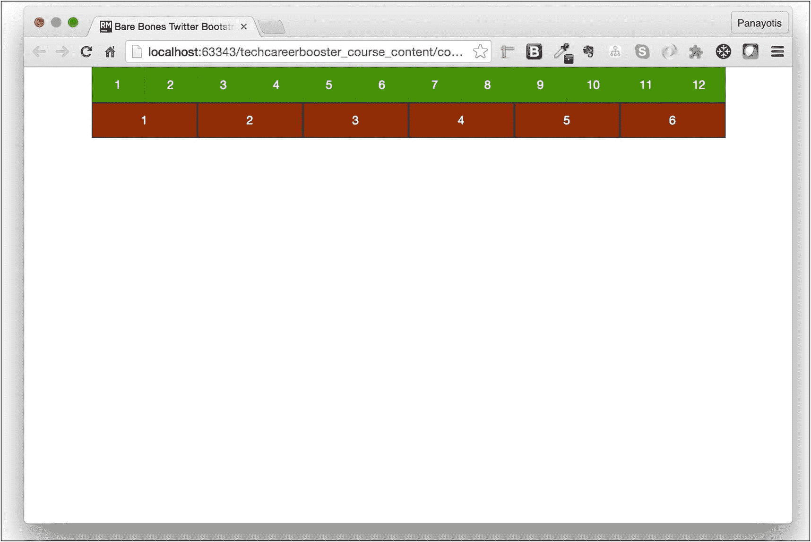

图 1-1

展示 Twitter 引导网格系统的演示页面

你将确保你有一个如图 1-2 所示的页面。

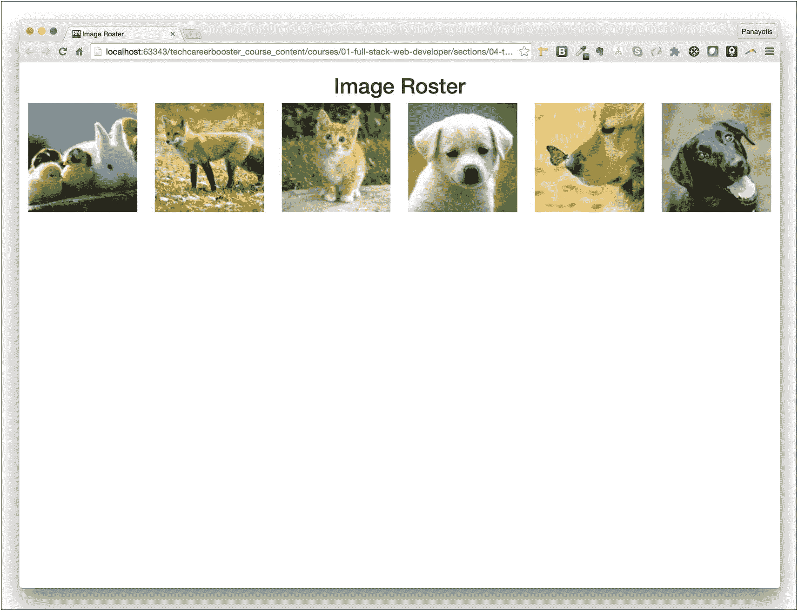

图 1-2

在大显示器上观看的页面

它可以在较小的设备上自动转换成图 1-3 的样子。

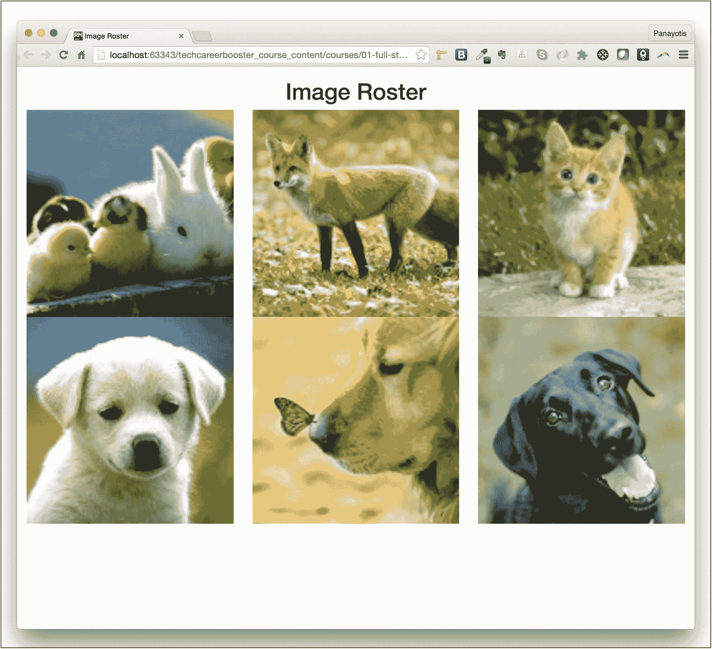

图 1-3

Page 在较小的设备上调整其布局

## 学习目标

1.  了解什么是 Twitter Bootstrap。

2.  了解如何在项目中包含 Twitter Bootstrap CSS 和 JavaScript 库。

3.  了解可用的两种主要容器及其区别。

4.  了解 Twitter Bootstrap 的网格系统如何帮助您组织页面内容并生成响应性布局。

## 自举定义

[**Twitter Bootstrap**](http://getbootstrap.com/) 是一组 CSS 和 JavaScript 代码，您可以基于它们编写自己的 HTML、CSS 和 JavaScript 代码，以便快速拥有一个响应迅速的网站或 web 应用程序，采用移动优先的设计方法。

换句话说，它为您提供了一些 CSS 类和 JavaScript 代码，您可以直接使用。您应用这些类，使用 JavaScript 模块，很快就可以让您的网站和 web 应用程序拥有一些原本需要您花费大量精力从头开发的功能。

## 最基本的 Twitter 引导页面

让我们从创建第一个 Twitter 引导页面开始。创建一个新文件`index.html`，并将以下内容放入其中(清单 1-1 )。

```html
<!DOCTYPE html>
<html lang="en">
<head>
    <!-- Required meta tags -->
    <meta charset="utf-8">
    <meta name="viewport" content="width=device-width, initial-scale=1, shrink-to-fit=no">

    <!-- Bootstrap CSS -->
    <link rel="stylesheet" href="https://stackpath.bootstrapcdn.com/bootstrap/4.4.1/css/bootstrap.min.css" integrity="sha384-Vkoo8x4CGsO3+Hhxv8T/Q5PaXtkKtu6ug5TOeNV6gBiFeWPGFN9MuhOf23Q9Ifjh" crossorigin="anonymous">

    <title>Bare Bones Twitter Bootstrap Page</title>
</head>
<body>
    <!-- Optional JavaScript -->
    <!-- jQuery first, then Popper.js, then Bootstrap JS -->
    <script src="https://code.jquery.com/jquery-3.4.1.slim.min.js" integrity="sha384-J6qa4849blE2+poT4WnyKhv5vZF5SrPo0iEjwBvKU7imGFAV0wwj1yYfoRSJoZ+n" crossorigin="anonymous"></script>
    <script src="https://cdn.jsdelivr.net/npm/popper.js@1.16.0/dist/umd/popper.min.js" integrity="sha384-Q6E9RHvbIyZFJoft+2mJbHaEWldlvI9IOYy5n3zV9zzTtmI3UksdQRVvoxMfooAo" crossorigin="anonymous"></script>
    <script src="https://stackpath.bootstrapcdn.com/bootstrap/4.4.1/js/bootstrap.min.js" integrity="sha384-wfSDF2E50Y2D1uUdj0O3uMBJnjuUD4Ih7YwaYd1iqfktj0Uod8GCExl3Og8ifwB6" crossorigin="anonymous"></script>
</body>
</html>

Listing 1-1Bare-Bones Twitter Bootstrap Page

```

这是一个没有任何有价值内容的页面。其`body`元素为空。然而

1.  它引用了引导 CSS 库。

2.  它引用了`jQuery`库，这是 Twitter Bootstrap JavaScript 模块所必需的 JavaScript 库。

3.  它引用了`popper`库。这是一个 JavaScript 库，Bootstrap 用它来定位工具提示和弹出窗口。

4.  最后，它还引用了引导 JavaScript 库。

如果您在浏览器上加载前面的页面，您将看不到任何内容。但是所有的 Twitter 引导特性都会被加载。

## 容器

当您开始页面布局时，您需要决定包含页面内容的容器样式。有三种类型的容器:

1.  `container`，在每个响应断点设置一个`max-width`。

2.  `container-fluid`，在所有断点处都是`width: 100%`。

3.  `container-{breakpoint}`，也就是`width: 100%`，直到指定的断点。在指定的断点(包括)之后，它像使用`container`一样使用`max-width`。

Note

`max-width`定义一个元素可以拥有的最大宽度。这意味着元素试图占据尽可能多的宽度，直到`max-width`，之后它扩展它的高度以适应内容。这当然意味着元素的实际宽度不能超过`max-width`，即使`width`属性可能有一个更大的值。

Tip

Twitter Bootstrap 定义了五个断点，即像素宽度，之后网格布局会发生变化。例如，一个小断点的值为 576px，表示显示宽度在 576px 和 767px 之间。我将在本章的后面谈到断点。

您可以通过设置相应的`div`元素(或等效的块元素)来应用其中一个元素，使其具有与容器名称相同的类。

增强页面的内容，使其如下所示(粗体显示的是添加的代码——列出了 1-2 )。

1.  我添加了一个对名为`stylesheets/index.css`的本地 CSS 文件的引用。我把它放在 Twitter Bootstrap CSS 参考之后。我将把特定于网页的 CSS 规则放在这个文件中。这个文件需要在 Twitter 引导 CSS 引用之后，因为它将依赖于它。

2.  我已经创建了两个`divs`作为页面容器。第一个`div`是一个`container,`，而第二个`div`是一个`container-fluid`。

```html
<!DOCTYPE html>
<html lang="en">
<head>
    <!-- Required meta tags -->
    <meta charset="utf-8">
    <meta name="viewport" content="width=device-width, initial-scale=1, shrink-to-fit=no">

    <!-- Bootstrap CSS -->
    <link rel="stylesheet" href="https://stackpath.bootstrapcdn.com/bootstrap/4.4.1/css/bootstrap.min.css" integrity="sha384-Vkoo8x4CGsO3+Hhxv8T/Q5PaXtkKtu6ug5TOeNV6gBiFeWPGFN9MuhOf23Q9Ifjh" crossorigin="anonymous">

    <!-- Custom CSS -->
    <link rel="stylesheet" href="stylesheets/index.css" type="text/css">

    <title>Bare Bones Twitter Bootstrap Page</title>
</head>
<body>
    <div class="container">
        This is a container
    </div>
    <div class="container-fluid">
        This is a container fluid
    </div>

    <!-- Optional JavaScript -->
    <!-- jQuery first, then Popper.js, then Bootstrap JS -->
    <script src="https://code.jquery.com/jquery-3.4.1.slim.min.js" integrity="sha384-J6qa4849blE2+poT4WnyKhv5vZF5SrPo0iEjwBvKU7imGFAV0wwj1yYfoRSJoZ+n" crossorigin="anonymous"></script>
    <script src="https://cdn.jsdelivr.net/npm/popper.js@1.16.0/dist/umd/popper.min.js" integrity="sha384-Q6E9RHvbIyZFJoft+2mJbHaEWldlvI9IOYy5n3zV9zzTtmI3UksdQRVvoxMfooAo" crossorigin="anonymous"></script>
    <script src="https://stackpath.bootstrapcdn.com/bootstrap/4.4.1/js/bootstrap.min.js" integrity="sha384-wfSDF2E50Y2D1uUdj0O3uMBJnjuUD4Ih7YwaYd1iqfktj0Uod8GCExl3Og8ifwB6" crossorigin="anonymous"></script>
</body>
</html>

Listing 1-2Add Two Containers

```

在文件夹`stylesheets`中创建文件`index.css`，并添加以下内容(列表 1-3 )。

```html
.container {
    background-color: #8DC5CC;
}

.container-fluid {
    background-color: #aaad21;
}

Listing 1-3CSS for the index.css File

```

Caution

现在你正在使用 Twitter Bootstrap，你将不再需要像`* {box-sizing: border-box}`那样编写 CSS 重置规则。这是因为 Twitter Bootstrap 本身有一系列非常有意义的缺省值，它们与 Twitter Bootstrap 类的其余部分是一致的。

可以想象，这是用来将特定的、不同的颜色应用到两个容器上的，这样我就可以看到它们是如何放在页面上的。

保存所有文件并在浏览器上加载`index.html`页面。你将看到的应该是类似图 1-4 的东西。

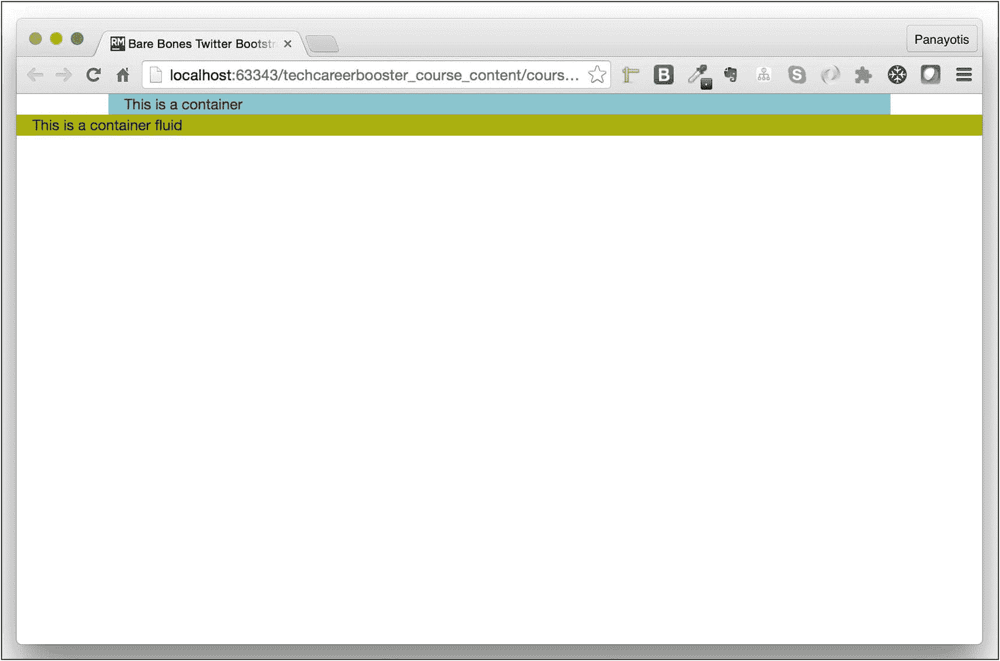

图 1-4

容器与容器流体

如图 1-4 所示，`container`有左右页边距，而`container-fluid`没有页边距，覆盖了页面的整个宽度。`container`页边距不是固定的宽度。它们的宽度根据视口宽度而变化。

另一方面，两个容器都有左右填充，等于`15px`。您可以看到文本“这是一个容器…”没有从左边界的边缘开始，但是它有一些空闲的空白空间。

请注意，即使您使用了`container`，当您缩小浏览器窗口的宽度，使其宽度小于`576px`时，`container`会失去其左右边距，本质上，其行为类似于`container-fluid`。换句话说，苹果 iPhone X 设备上的这个页面会像你在图 1-5 中看到的那样显示。

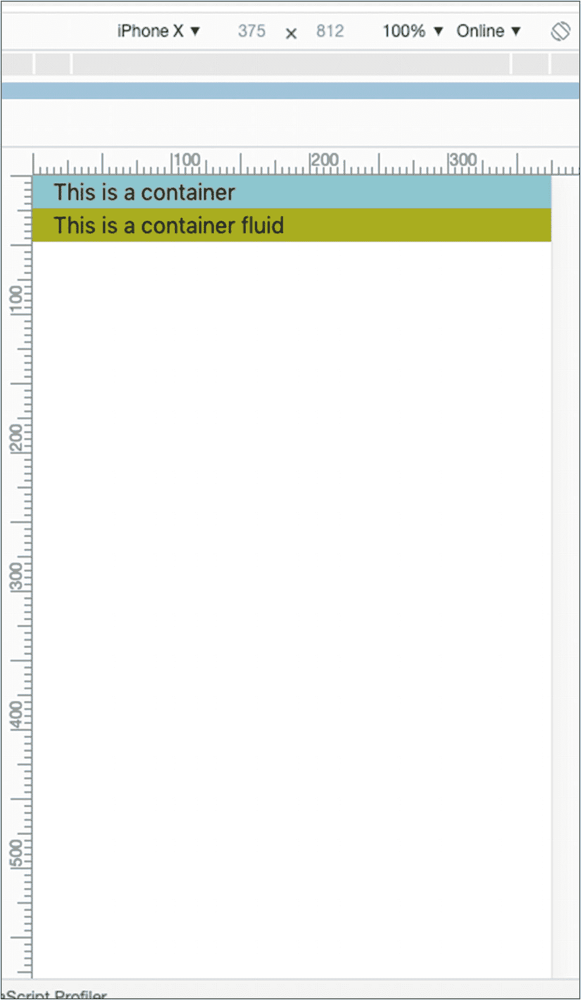

图 1-5

`container`的行为类似于 iPhone X 上的`container-fluid`

因此，在这种情况下，`container`和`container-fluid`将是相同的。

## 网格系统

网格系统，也就是把你的布局分成行和列，是设计你的页面布局的一个很好的实践。Twitter Bootstrap 附带了方便的类，允许您随着设备或视口大小的增加，将布局扩展到 12 列。

因此，每当你想把你的页面分成一系列的栏目，你必须

1.  决定容器类型。

2.  在容器内部，添加一个`row`类`div`。

3.  在`row`类`div`内，添加一个或多个`col-*`类`div`元素。

我将用一些例子来解释什么是`col-*`类。

### 示例:一行 12 列

让我们创建一个一行 12 列的页面，如图 1-6 所示。

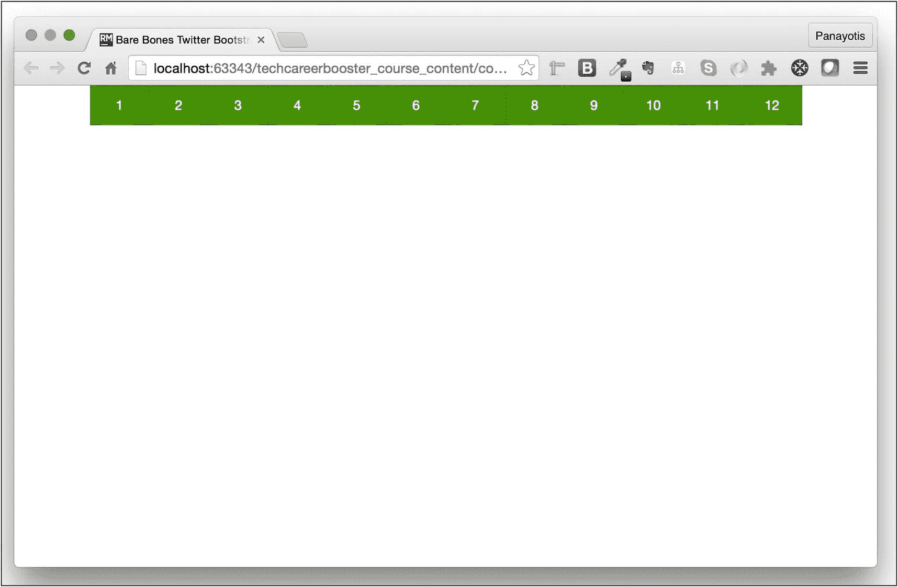

图 1-6

单行 12 列网格

创建这个页面的一种方法如下所示(清单 1-4 )。

```html
<!DOCTYPE html>
<html lang="en">
<head>
    <!-- Required meta tags -->
    <meta charset="utf-8">
    <meta name="viewport" content="width=device-width, initial-scale=1, shrink-to-fit=no">

    <!-- Bootstrap CSS -->
    <link rel="stylesheet" href="https://stackpath.bootstrapcdn.com/bootstrap/4.4.1/css/bootstrap.min.css" integrity="sha384-Vkoo8x4CGsO3+Hhxv8T/Q5PaXtkKtu6ug5TOeNV6gBiFeWPGFN9MuhOf23Q9Ifjh" crossorigin="anonymous">

    <!-- Custom CSS -->
    <link rel="stylesheet" href="stylesheets/index.css" type="text/css">

    <title>1 row 12 columns</title>

</head>
<body>
    <div class="container">
        <div class="row">
            <div class="col">
                1
            </div>
            <div class="col">
                2
            </div>
            <div class="col">
                3
            </div>
            <div class="col">
                4
            </div>
            <div class="col">
                5
            </div>
            <div class="col">
                6
            </div>
            <div class="col">
                7
            </div>
            <div class="col">
                8
            </div>
            <div class="col">
                9
            </div>
            <div class="col">
                10
            </div>
            <div class="col">
                11
            </div>
            <div class="col">
                12
            </div>
        </div>
    </div>

    <!-- Optional JavaScript -->

    <!-- jQuery first, then Popper.js, then Bootstrap JS -->
    <script src="https://code.jquery.com/jquery-3.4.1.slim.min.js" integrity="sha384-J6qa4849blE2+poT4WnyKhv5vZF5SrPo0iEjwBvKU7imGFAV0wwj1yYfoRSJoZ+n" crossorigin="anonymous"></script>
    <script src="https://cdn.jsdelivr.net/npm/popper.js@1.16.0/dist/umd/popper.min.js" integrity="sha384-Q6E9RHvbIyZFJoft+2mJbHaEWldlvI9IOYy5n3zV9zzTtmI3UksdQRVvoxMfooAo" crossorigin="anonymous"></script>
    <script src="https://stackpath.bootstrapcdn.com/bootstrap/4.4.1/js/bootstrap.min.js" integrity="sha384-wfSDF2E50Y2D1uUdj0O3uMBJnjuUD4Ih7YwaYd1iqfktj0Uod8GCExl3Og8ifwB6" crossorigin="anonymous"></script>
</body>
</html>

Listing 1-4One-Row 12-Column Page

```

CSS 文件(名为`index.css`)在清单 1-5 中给出。

```html
.container {
    background-color: #8DC5CC;
}

.container .row div {
    background-color: #4e9013;
    padding: 10px 0;
    border: 1px solid green;
    color: white;
    text-align: center;
}

Listing 1-5CSS for the One-Row 12-Column Layout

```

正如你在 HTML 文件`index.html`中看到的，我使用了一个`container`，并在其中引入了一个`row`类`div`。然后对于 12 列中的每一列，我都使用了一个`col`类`div.`

同样，我想要 12 列，我用类`col`添加了 12 个`divs`。所有 12 个`divs`都被添加到一个`row div`中。`row div`用于布局列，并且只有列可以是行的直接子级。

### 示例:两行网格，第二行有六列

让我们在网格页面中再添加一行。但是这一次，让我们假设我们希望第二行有六列，如图 1-7 所示。

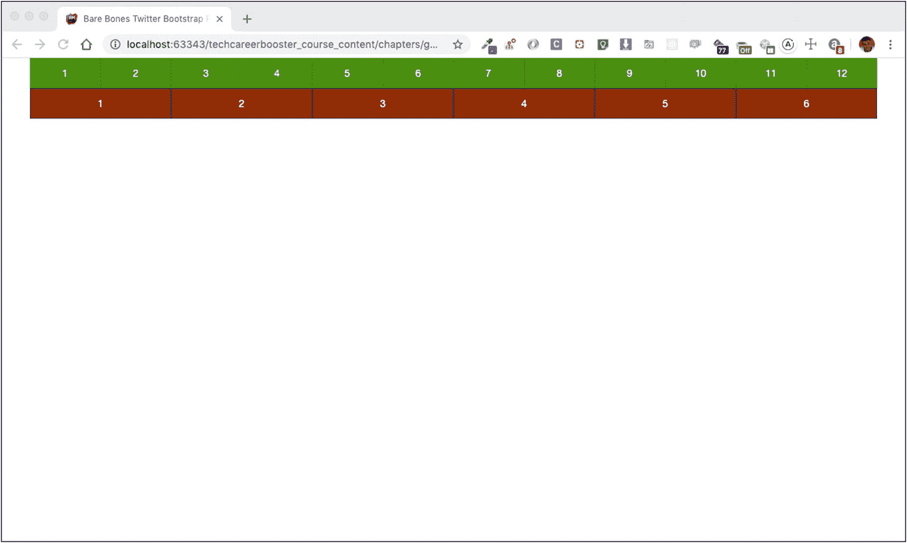

图 1-7

两行，第二行有六列

如图 1-7 所示，第二行的每一列都占据了第一行的两倍列宽。

完整的 HTML 代码在清单 1-6 中。

```html
<!DOCTYPE html>
<html lang="en">
<head>
    <!-- Required meta tags -->
    <meta charset="utf-8">
    <meta name="viewport" content="width=device-width, initial-scale=1, shrink-to-fit=no">

    <!-- Bootstrap CSS -->
    <link rel="stylesheet" href="https://stackpath.bootstrapcdn.com/bootstrap/4.4.1/css/bootstrap.min.css" integrity="sha384-Vkoo8x4CGsO3+Hhxv8T/Q5PaXtkKtu6ug5TOeNV6gBiFeWPGFN9MuhOf23Q9Ifjh" crossorigin="anonymous">

    <!-- Custom CSS -->
    <link rel="stylesheet" href="stylesheets/index.css" type="text/css">

    <title>2 rows 2nd 6 columns</title>
</head>
<body>
    <div class="container">
        <div class="row">
            <div class="col">
                1
            </div>
            <div class="col">
                2
            </div>
            <div class="col">
                3
            </div>
            <div class="col">
                4
            </div>
            <div class="col">
                5
            </div>
            <div class="col">
                6
            </div>
            <div class="col">
                7
            </div>
            <div class="col">
                8
            </div>
            <div class="col">
                9
            </div>
            <div class="col">
                10
            </div>
            <div class="col">
                11
            </div>
            <div class="col">
                12
            </div>
        </div>
        <div class="row">
            <div class="col">
                1
            </div>
            <div class="col">
                2
            </div>
            <div class="col">
                3
            </div>
            <div class="col">
                4
            </div>
            <div class="col">
                5
            </div>
            <div class="col">
                6
            </div>
        </div>
    </div>

    <!-- Optional JavaScript -->
    <!-- jQuery first, then Popper.js, then Bootstrap JS -->
    <script src="https://code.jquery.com/jquery-3.4.1.slim.min.js" integrity="sha384-J6qa4849blE2+poT4WnyKhv5vZF5SrPo0iEjwBvKU7imGFAV0wwj1yYfoRSJoZ+n" crossorigin="anonymous"></script>
    <script src="https://cdn.jsdelivr.net/npm/popper.js@1.16.0/dist/umd/popper.min.js" integrity="sha384-Q6E9RHvbIyZFJoft+2mJbHaEWldlvI9IOYy5n3zV9zzTtmI3UksdQRVvoxMfooAo" crossorigin="anonymous"></script>
    <script src="https://stackpath.bootstrapcdn.com/bootstrap/4.4.1/js/bootstrap.min.js" integrity="sha384-wfSDF2E50Y2D1uUdj0O3uMBJnjuUD4Ih7YwaYd1iqfktj0Uod8GCExl3Og8ifwB6" crossorigin="anonymous"></script>
</body>
</html>

Listing 1-6Two Rows, the Second Row Having Six Columns, HTML Code

```

清单 1-7 是完整的 CSS 代码(这对网格的创建并不重要，但它只是帮助我在页面上可视化网格行的列)。

```html
.container {
    background-color: #8DC5CC;
}

.container .row:nth-of-type(1) div {
    background-color: #4e9013;
    padding: 10px 0;
    border: 1px solid green;
    color: white;
    text-align: center;
}

.container .row:nth-of-type(2) div {
    background-color: #902e07;
    padding: 10px 0;
    border: 1px solid #441180;
    color: white;
    text-align: center;
}

Listing 1-7CSS for the Page Having Two Rows, the Second Row Having Six Columns

```

正如您所看到的，只要有六个类为`col`的`divs`作为类为`row`的`div`的子元素，就很容易拥有六列。

### 示例:两行网格，第二行有五列

假设您希望一行有五列，而不是六列，第一列的大小是其他列的两倍。例如，参见图 1-8 。

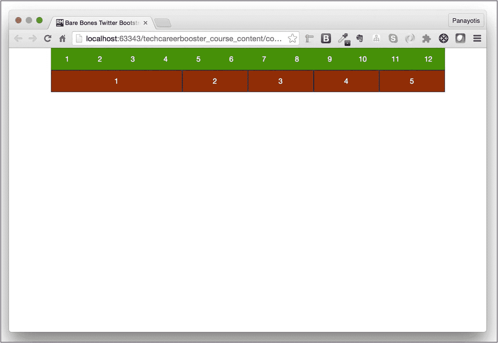

图 1-8

第二行有五列，第一列较宽

你会怎么做？如果你把你的代码改成有五个 div，在第二个`row div`里面，你会得到什么？您将看到图 1-9 的页面。

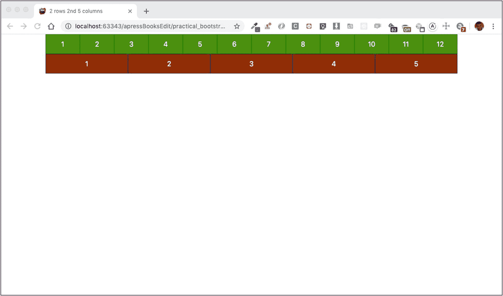

图 1-9

第二行有五列大小相同

这不完全是你想要的。如果只放五个`divs`，生成的列宽度相等。但是您想要的是第一列的宽度是其他列的两倍。另外，如果您更仔细地观察，您会发现第一列占据了 12 个可用标准列中的 4 个，而其他列占据了 2 个。同样，这也是你想要达到的目标(图 1-10 )。

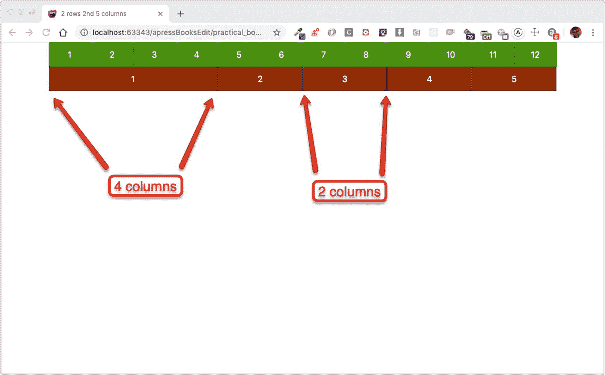

图 1-10

你想实现什么

为了做到这一点，你必须更加精确地确定每一列的类别。你必须准确地说出每一列应该占据多少标准列。

因此，对于第一列，您必须使用类`col-4`，而对于其他列，您必须使用类`col-2`。正确的 HTML 代码在清单 1-8 中。

```html
<!DOCTYPE html>
<html lang="en">
<head>
    <!-- Required meta tags -->
    <meta charset="utf-8">
    <meta name="viewport" content="width=device-width, initial-scale=1, shrink-to-fit=no">

    <!-- Bootstrap CSS -->
    <link rel="stylesheet" href="https://stackpath.bootstrapcdn.com/bootstrap/4.4.1/css/bootstrap.min.css" integrity="sha384-Vkoo8x4CGsO3+Hhxv8T/Q5PaXtkKtu6ug5TOeNV6gBiFeWPGFN9MuhOf23Q9Ifjh" crossorigin="anonymous">

    <!-- Custom CSS -->
    <link rel="stylesheet" href="stylesheets/index.css" type="text/css">

    <title>2 rows 2nd 5 columns</title>

</head>
<body>
    <div class="container">
        <div class="row">
            <div class="col">
                1
            </div>
            <div class="col">
                2
            </div>
            <div class="col">
                3
            </div>
            <div class="col">
                4
            </div>
            <div class="col">
                5
            </div>
            <div class="col">
                6
            </div>
            <div class="col">
                7
            </div>
            <div class="col">
                8
            </div>
            <div class="col">
                9
            </div>
            <div class="col">
                10
            </div>
            <div class="col">
                11
            </div>
            <div class="col">
                12
            </div>
        </div>
        <div class="row">
            <div class="col-4">
                1
            </div>
            <div class="col-2">
                2
            </div>
            <div class="col-2">
                3
            </div>
            <div class="col-2">
                4
            </div>
            <div class="col-2">
                5
            </div>
        </div>
    </div>

    <!-- Optional JavaScript -->
    <!-- jQuery first, then Popper.js, then Bootstrap JS -->
    <script src="https://code.jquery.com/jquery-3.4.1.slim.min.js" integrity="sha384-J6qa4849blE2+poT4WnyKhv5vZF5SrPo0iEjwBvKU7imGFAV0wwj1yYfoRSJoZ+n" crossorigin="anonymous"></script>
    <script src="https://cdn.jsdelivr.net/npm/popper.js@1.16.0/dist/umd/popper.min.js" integrity="sha384-Q6E9RHvbIyZFJoft+2mJbHaEWldlvI9IOYy5n3zV9zzTtmI3UksdQRVvoxMfooAo" crossorigin="anonymous"></script>
    <script src="https://stackpath.bootstrapcdn.com/bootstrap/4.4.1/js/bootstrap.min.js" integrity="sha384-wfSDF2E50Y2D1uUdj0O3uMBJnjuUD4Ih7YwaYd1iqfktj0Uod8GCExl3Og8ifwB6" crossorigin="anonymous"></script>
</body>
</html>

Listing 1-8Using col-4 for the First Column and col-2 for the Others

```

将第二行分成五列的另一种方法如清单 1-9 所示。

```html
<!DOCTYPE html>
<html lang="en">
<head>
    <!-- Required meta tags -->
    <meta charset="utf-8">
    <meta name="viewport" content="width=device-width, initial-scale=1, shrink-to-fit=no">

    <!-- Bootstrap CSS -->
    <link rel="stylesheet" href="https://stackpath.bootstrapcdn.com/bootstrap/4.4.1/css/bootstrap.min.css" integrity="sha384-Vkoo8x4CGsO3+Hhxv8T/Q5PaXtkKtu6ug5TOeNV6gBiFeWPGFN9MuhOf23Q9Ifjh" crossorigin="anonymous">

    <!-- Custom CSS -->
    <link rel="stylesheet" href="stylesheets/index.css" type="text/css">

    <title>2 rows 2nd 5 columns</title>
</head>
<body>
    <div class="container">
        <div class="row">
            <div class="col">
                1
            </div>
            <div class="col">
                2
            </div>
            <div class="col">
                3
            </div>
            <div class="col">
                4
            </div>
            <div class="col">
                5
            </div>
            <div class="col">
                6
            </div>
            <div class="col">
                7
            </div>
            <div class="col">
                8
            </div>
            <div class="col">
                9
            </div>
            <div class="col">
                10
            </div>
            <div class="col">
                11
            </div>
            <div class="col">

                12
            </div>
        </div>
        <div class="row">
            <div class="col-3">
                1
            </div>
            <div class="col-2">
                2
            </div>
            <div class="col-3">
                3
            </div>
            <div class="col-2">
                4
            </div>
            <div class="col-2">
                5
            </div>
        </div>
    </div>

    <!-- Optional JavaScript -->

    <!-- jQuery first, then Popper.js, then Bootstrap JS -->
    <script src="https://code.jquery.com/jquery-3.4.1.slim.min.js" integrity="sha384-J6qa4849blE2+poT4WnyKhv5vZF5SrPo0iEjwBvKU7imGFAV0wwj1yYfoRSJoZ+n" crossorigin="anonymous"></script>
    <script src="https://cdn.jsdelivr.net/npm/popper.js@1.16.0/dist/umd/popper.min.js" integrity="sha384-Q6E9RHvbIyZFJoft+2mJbHaEWldlvI9IOYy5n3zV9zzTtmI3UksdQRVvoxMfooAo" crossorigin="anonymous"></script>
    <script src="https://stackpath.bootstrapcdn.com/bootstrap/4.4.1/js/bootstrap.min.js" integrity="sha384-wfSDF2E50Y2D1uUdj0O3uMBJnjuUD4Ih7YwaYd1iqfktj0Uod8GCExl3Og8ifwB6" crossorigin="anonymous"></script>
</body>
</html>

Listing 1-9Another Way to Divide into Five Columns

```

如果您在浏览器上保存并加载该页面，您将看到图 1-11 中所示的内容。

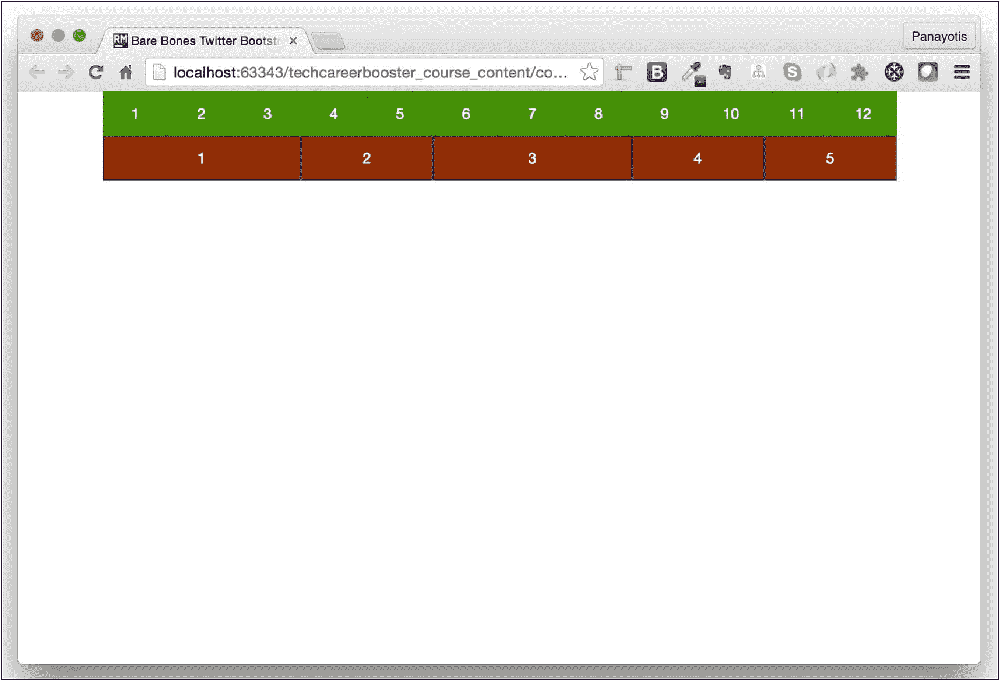

图 1-11

分成五列的另一种方法

如图 1-11 所示，第二行同样有五列，但第一列和第三列的大小不同。这两列的大小为`3`，而所有其他列的大小为`2`。然而，即使在这种情况下，总的列大小加起来也有 12: `3 + 2 + 3 + 2 + 2`。

### 示例:两行网格，第二行有三列，中间较宽

但是你不必总是精确所有列的宽度。有时，您希望只指定一列的宽度，并希望自动计算其他列的宽度。例如，参见图 1-12 。

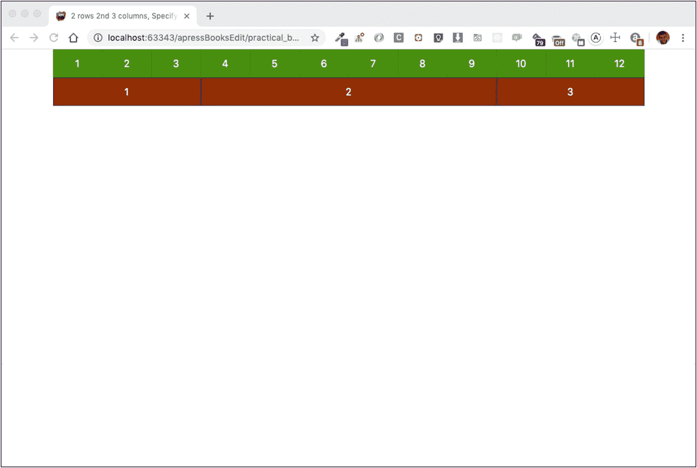

图 1-12

中间栏为可用宽度的一半

您希望中间的列占据一半的可用宽度，而剩下的空间由第一列和第三列共享。

您可以通过将`col-3`赋予第一个和第三个`divs`并将`col-6`赋予第二个`div`来做到这一点，但是似乎您可以通过将`col`赋予第一个和第三个`divs`并将`col-6`赋予第二个`div`来做到这一点，如清单 1-10 所示。

```html
<!DOCTYPE html>
<html lang="en">
<head>
    <!-- Required meta tags -->
    <meta charset="utf-8">
    <meta name="viewport" content="width=device-width, initial-scale=1, shrink-to-fit=no">

    <!-- Bootstrap CSS -->
    <link rel="stylesheet" href="https://stackpath.bootstrapcdn.com/bootstrap/4.4.1/css/bootstrap.min.css" integrity="sha384-Vkoo8x4CGsO3+Hhxv8T/Q5PaXtkKtu6ug5TOeNV6gBiFeWPGFN9MuhOf23Q9Ifjh" crossorigin="anonymous">

    <!-- Custom CSS -->
    <link rel="stylesheet" href="stylesheets/index.css" type="text/css">

    <title>Specifying the width of the middle column only</title>

</head>
<body>
    <div class="container">
        <div class="row">
            <div class="col">
                1
            </div>
            <div class="col">
                2
            </div>
            <div class="col">
                3
            </div>
            <div class="col">
                4
            </div>
            <div class="col">
                5
            </div>
            <div class="col">
                6
            </div>
            <div class="col">
                7
            </div>
            <div class="col">
                8
            </div>
            <div class="col">
                9
            </div>
            <div class="col">
                10
            </div>
            <div class="col">
                11
            </div>
            <div class="col">
                12
            </div>
        </div>
        <div class="row">
            <div class="col">
                1
            </div>
            <div class="col-6">
                2
            </div>
            <div class="col">
                3
            </div>
        </div>
    </div>

    <!-- Optional JavaScript -->
    <!-- jQuery first, then Popper.js, then Bootstrap JS -->
    <script src="https://code.jquery.com/jquery-3.4.1.slim.min.js" integrity="sha384-J6qa4849blE2+poT4WnyKhv5vZF5SrPo0iEjwBvKU7imGFAV0wwj1yYfoRSJoZ+n" crossorigin="anonymous"></script>
    <script src="https://cdn.jsdelivr.net/npm/popper.js@1.16.0/dist/umd/popper.min.js" integrity="sha384-Q6E9RHvbIyZFJoft+2mJbHaEWldlvI9IOYy5n3zV9zzTtmI3UksdQRVvoxMfooAo" crossorigin="anonymous"></script>
    <script src="https://stackpath.bootstrapcdn.com/bootstrap/4.4.1/js/bootstrap.min.js" integrity="sha384-wfSDF2E50Y2D1uUdj0O3uMBJnjuUD4Ih7YwaYd1iqfktj0Uod8GCExl3Og8ifwB6" crossorigin="anonymous"></script>
</body>
</html>

Listing 1-10Specifying the Width of the Middle Column Only

```

## 不同的显示宽度

Twitter Bootstrap 允许你根据网页的不同显示宽度，为你的网格布局(以及网页样式的其他属性)使用不同的类。具体来说，有五个键宽断点，如表 1-1 中所列。

表 1-1

Twitter 引导响应断点

<colgroup><col class="tcol1 align-left"> <col class="tcol2 align-left"> <col class="tcol3 align-left"></colgroup> 
| 

名字

 | 

标志

 | 

显示宽度

 |
| --- | --- | --- |
| 超小型 | `xs` | < 576 像素 |
| 小的 | `sm` | > = 576 像素 |
| 中等 | `md` | > = 768 像素 |
| 大型 | `lg` | > = 992 像素 |
| 超大尺寸 | `xl` | > = 1200 像素 |

您通过它们相应的符号来引用它们，作为您正在使用的类名的一部分。

因此，如果你正在使用，例如，类`col-lg-5`，这意味着这个类指的是宽度> =992px 的设备的断点`lg`。然而，对每个特定类的进一步解释取决于类案例本身。我们将在这一部分学习最重要的课程。

基于前面五个关键断点工作的 Twitter 引导网格类是

*   对于超小型设备，`col-1`、`col-2`等等，直到`col-12`

*   对于小型设备，`col-sm-1`、`col-sm-2`等等，直到`col-sm-12`

*   对于中型设备，`col-md-1`、`col-md-2`等等，直到`col-md-12`

*   对于大型设备，`col-lg-1`、`col-lg-2`等等，直到`col-lg-12`

*   `col-xl-1, col-xl-2,`以此类推，`up to col-xl-12`，用于超大型设备

但是举例来说，`col-sm-2`和`col-md-2`有什么区别呢？

它们都占据了两列。对于> =576px 的任何显示区域宽度，`col-sm-2`将占据两列，但是对于> = 768px 的显示宽度，`col-md-2`将占据两列。`col-md-2`，对于< 768px 的显示区域，将不会占据两列，而是将一列堆叠在另一列之上，就好像它们是两行一样，基本上每列占据整个 12 列的可用宽度。

我们来看一个例子。您将创建一个包含一行六列的页面，每一列占据两列宽。将下面的代码写入一个 HTML 文档(清单 1-11 )。

```html
<!DOCTYPE html>
<html lang="en">
<head>
    <!-- Required meta tags -->
    <meta charset="utf-8">
    <meta name="viewport" content="width=device-width, initial-scale=1, shrink-to-fit=no">

    <!-- Bootstrap CSS -->
    <link rel="stylesheet" href="https://stackpath.bootstrapcdn.com/bootstrap/4.4.1/css/bootstrap.min.css" integrity="sha384-Vkoo8x4CGsO3+Hhxv8T/Q5PaXtkKtu6ug5TOeNV6gBiFeWPGFN9MuhOf23Q9Ifjh" crossorigin="anonymous">

    <!-- Custom CSS -->
    <link rel="stylesheet" href="stylesheets/index.css" type="text/css">

    <title>Listing 1-11</title>
</head>
<body>
    <div class="container">
        <div class="row">
            <div class="col-sm-2">
                1
            </div>
            <div class="col-sm-2">
                2
            </div>
            <div class="col-sm-2">
                3
            </div>
            <div class="col-sm-2">
                4
            </div>
            <div class="col-sm-2">
                5
            </div>
            <div class="col-sm-2">
                6
            </div>
        </div>
    </div>

    <!-- Optional JavaScript -->
    <!-- jQuery first, then Popper.js, then Bootstrap JS -->
    <script src="https://code.jquery.com/jquery-3.4.1.slim.min.js" integrity="sha384-J6qa4849blE2+poT4WnyKhv5vZF5SrPo0iEjwBvKU7imGFAV0wwj1yYfoRSJoZ+n" crossorigin="anonymous"></script>
    <script src="https://cdn.jsdelivr.net/npm/popper.js@1.16.0/dist/umd/popper.min.js" integrity="sha384-Q6E9RHvbIyZFJoft+2mJbHaEWldlvI9IOYy5n3zV9zzTtmI3UksdQRVvoxMfooAo" crossorigin="anonymous"></script>
    <script src="https://stackpath.bootstrapcdn.com/bootstrap/4.4.1/js/bootstrap.min.js" integrity="sha384-wfSDF2E50Y2D1uUdj0O3uMBJnjuUD4Ih7YwaYd1iqfktj0Uod8GCExl3Og8ifwB6" crossorigin="anonymous"></script>
</body>
</html>

Listing 1-11Six Columns with the sm Breakpoint

```

在`stylesheets`文件夹内相应的`index.css`文件中写入以下(列表 1-12 ) CSS。

```html
.container {
    background-color: #8DC5CC;
}

.container .row:nth-of-type(1) div {
    background-color: #4e9013;
    padding: 10px 0;
    border: 1px solid green;
    color: white;
    text-align: center;
}

Listing 1-12CSS for Listing 1-11

```

如果您保存前面的代码，然后在浏览器上加载 HTML 页面，您将看到以下内容(图 1-13 )。

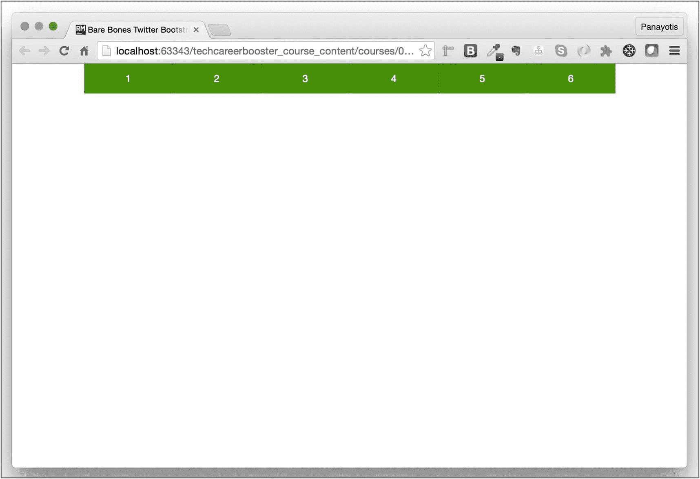

图 1-13

一行六列布局—每个占据两列

正如你在 HTML 代码中看到的，我使用了断点`sm,`，并指示每一列占用 12 列中的两列。这将导致该行被分成六列，但仅适用于宽度> =576px 的显示区域。

启用开发者工具，缩小浏览器窗口，使其宽度正好为 576 像素。您将不会看到页面显示方式的任何显著差异。所有六列都将在那里，水平排列(图 1-14 )。

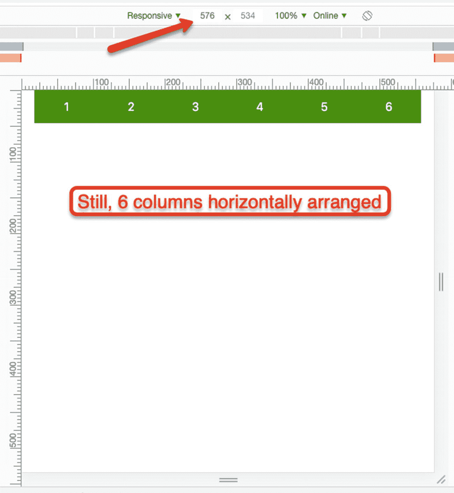

图 1-14

正好 576 像素宽—仍然是 6 列宽

当你再缩小 1 个像素到 575 像素时，情况就会发生变化。您将看到以下内容(图 1-15 )。

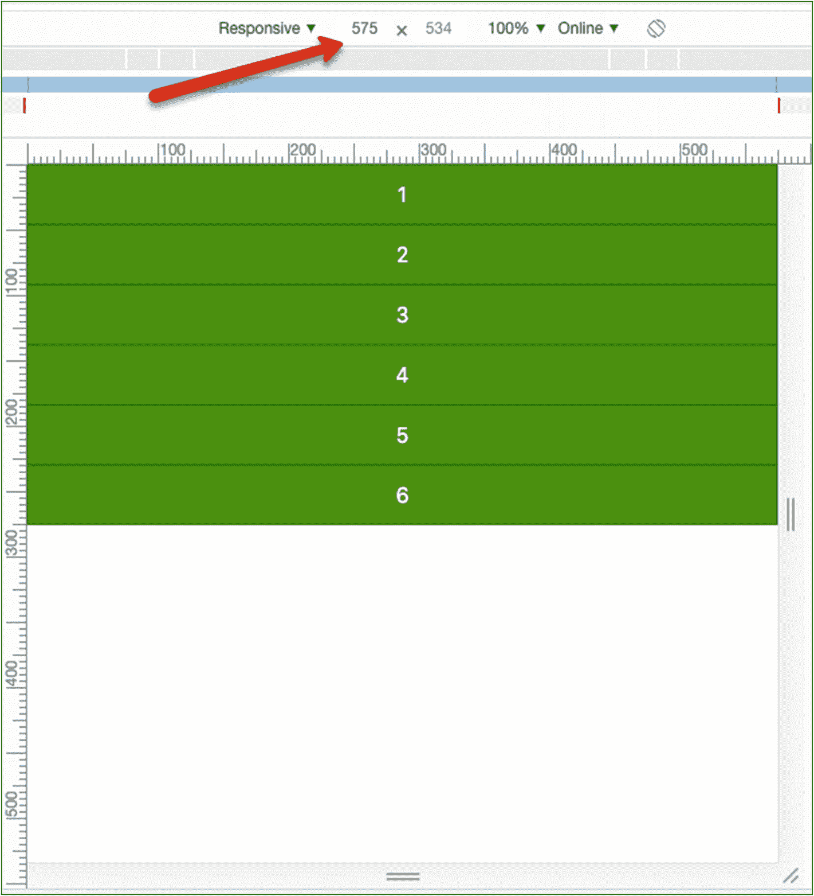

图 1-15

低于`sm`断点时堆叠六列

这是因为我使用了类`col-sm-2`。同样，对于每个小于 576px 的显示宽度，该类将列一个接一个地堆叠，对于任何大于或等于 576px 的宽度，该类将列保持水平。

从上图中可以看出，最初的两列宽现在变成了 12 列宽，占据了整个行。

Bootstrap 的好处在于，你可以在同一个`div`上应用多种不同的断点，以适应不同设备的网格布局。

为了理解我的意思，请看下面的例子。假设对于小型及以上设备，我希望有六列，但对于较小的设备(小于 576px)，我不希望每行一列，而是每行两列。

因此

1.  对于小型或大型设备，我需要六列。这意味着我需要将`col-sm-2`类用于`divs`(将`sm`用于小列，将`2`用于六列，因为`12/6`给出了`2`)。

2.  对于超小型设备，我希望每行有两列。因此，我需要对`divs`使用`col-6`类(对于 extrasmall，我没有将设备宽度的符号插入类名，因为默认值是两列的`xs`和`6`，因为`12/2`给出了`6`)。

让我们试试那个。更改前面的 HTML 页面的内容，使其类似于清单 1-13 中的内容。

```html
<!DOCTYPE html>
<html lang="en">
<head>
    <!-- Required meta tags -->
    <meta charset="utf-8">
    <meta name="viewport" content="width=device-width, initial-scale=1, shrink-to-fit=no">

    <!-- Bootstrap CSS -->
    <link rel="stylesheet" href="https://stackpath.bootstrapcdn.com/bootstrap/4.4.1/css/bootstrap.min.css" integrity="sha384-Vkoo8x4CGsO3+Hhxv8T/Q5PaXtkKtu6ug5TOeNV6gBiFeWPGFN9MuhOf23Q9Ifjh" crossorigin="anonymous">

    <!-- Custom CSS -->
    <link rel="stylesheet" href="stylesheets/index.css" type="text/css">

    <title>Listing 1-12</title>
</head>
<body>
    <div class="container">
        <div class="row">
            <div class="col-6 col-sm-2">
                1
            </div>
            <div class="col-6 col-sm-2">
                2
            </div>
            <div class="col-6 col-sm-2">
                3
            </div>
            <div class="col-6 col-sm-2">
                4
            </div>
            <div class="col-6 col-sm-2">
                5
            </div>
            <div class="col-6 col-sm-2">
                6
            </div>
        </div>
    </div>

    <!-- Optional JavaScript -->
    <!-- jQuery first, then Popper.js, then Bootstrap JS -->
    <script src="https://code.jquery.com/jquery-3.4.1.slim.min.js" integrity="sha384-J6qa4849blE2+poT4WnyKhv5vZF5SrPo0iEjwBvKU7imGFAV0wwj1yYfoRSJoZ+n" crossorigin="anonymous"></script>
    <script src="https://cdn.jsdelivr.net/npm/popper.js@1.16.0/dist/umd/popper.min.js" integrity="sha384-Q6E9RHvbIyZFJoft+2mJbHaEWldlvI9IOYy5n3zV9zzTtmI3UksdQRVvoxMfooAo" crossorigin="anonymous"></script>
    <script src="https://stackpath.bootstrapcdn.com/bootstrap/4.4.1/js/bootstrap.min.js" integrity="sha384-wfSDF2E50Y2D1uUdj0O3uMBJnjuUD4Ih7YwaYd1iqfktj0Uod8GCExl3Og8ifwB6" crossorigin="anonymous"></script>
</body>
</html>

Listing 1-13Two Columns on Extrasmall Displays, but Six on Small Displays and Wider

```

如果您保存前面的代码并重新加载您的页面，当它的宽度为 575 像素(或更小)时，您会看到，现在您的页面每行有两列(图 1-16 )。

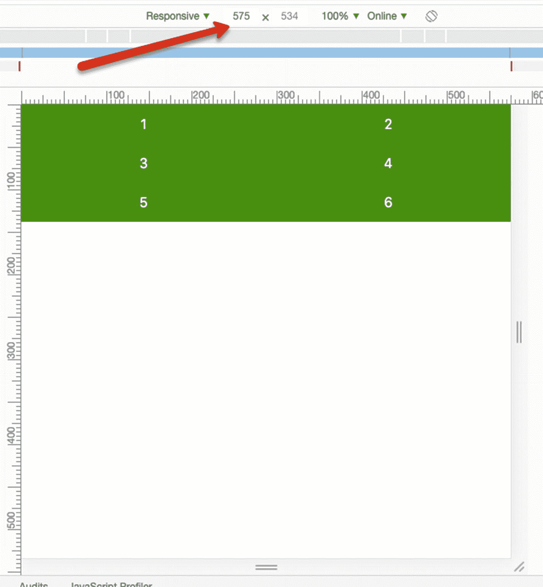

图 1-16

超小型设备上的两列

但是，如果您将显示区域的宽度放大到大于或等于 576px，您将看到您的页面每行有六列。

这就是实现网格响应的方式。

Note

有人可能会说，“等一下！在超小型设备上，`div have a number`后缀(`-6`)内的列加起来是 36，而不是 12。您需要知道，Twitter Bootstrap 会自动将第 12 列以上的列换行到新的一行。

前面的网页实际上有一个网格布局断点——576 像素，即低于 576 像素的显示宽度与等于或大于 576 像素的显示宽度。您可以将相同的概念应用于同一网格中的第二个断点。例如，对于大于 576px(小)的显示区域，您可能希望列数为 3，而对于大于或等于 768px(中等或更宽)的显示区域，您可能希望列数为 6。

所以我想要的是以下内容:

1.  对于超小型设备(< 576 像素)，每行两列(因此，`col-6`)

2.  对于小型设备(> = 576 像素，< 768 像素)，每行三列(因此，`col-sm-4`)

3.  对于中等或更宽的设备(> =768px)，每行六列(因此，`col-md-2`)

现在我知道我想要实现什么，这很简单。我将把前面的类应用到我的专栏`divs`，我就完成了(列表 1-14 )。

```html
<!DOCTYPE html>
<html lang="en">
<head>
    <!-- Required meta tags -->
    <meta charset="utf-8">
    <meta name="viewport" content="width=device-width, initial-scale=1, shrink-to-fit=no">

    <!-- Bootstrap CSS -->
    <link rel="stylesheet" href="https://stackpath.bootstrapcdn.com/bootstrap/4.4.1/css/bootstrap.min.css" integrity="sha384-Vkoo8x4CGsO3+Hhxv8T/Q5PaXtkKtu6ug5TOeNV6gBiFeWPGFN9MuhOf23Q9Ifjh" crossorigin="anonymous">

    <!-- Custom CSS -->
    <link rel="stylesheet" href="stylesheets/index.css" type="text/css">

    <title>Listing 1-14</title>
</head>
<body>
    <div class="container">
        <div class="row">
            <div class="col-6 col-sm-4 col-md-2">
                1
            </div>
            <div class="col-6 col-sm-4 col-md-2">
                2
            </div>
            <div class="col-6 col-sm-4 col-md-2">
                3
            </div>
            <div class="col-6 col-sm-4 col-md-2">
                4
            </div>
            <div class="col-6 col-sm-4 col-md-2">
                5
            </div>
            <div class="col-6 col-sm-4 col-md-2">
                6
            </div>
        </div>
    </div>

    <!-- Optional JavaScript -->
    <!-- jQuery first, then Popper.js, then Bootstrap JS -->
    <script src="https://code.jquery.com/jquery-3.4.1.slim.min.js" integrity="sha384-J6qa4849blE2+poT4WnyKhv5vZF5SrPo0iEjwBvKU7imGFAV0wwj1yYfoRSJoZ+n" crossorigin="anonymous"></script>
    <script src="https://cdn.jsdelivr.net/npm/popper.js@1.16.0/dist/umd/popper.min.js" integrity="sha384-Q6E9RHvbIyZFJoft+2mJbHaEWldlvI9IOYy5n3zV9zzTtmI3UksdQRVvoxMfooAo" crossorigin="anonymous"></script>
    <script src="https://stackpath.bootstrapcdn.com/bootstrap/4.4.1/js/bootstrap.min.js" integrity="sha384-wfSDF2E50Y2D1uUdj0O3uMBJnjuUD4Ih7YwaYd1iqfktj0Uod8GCExl3Og8ifwB6" crossorigin="anonymous"></script>
</body>
</html>

Listing 1-14Two for xs

, Three for sm

, and Six for Wider Displays

```

现在，如果你将浏览器的宽度调整为 760 像素，你会看到每行有三列。参见图 1-17 。

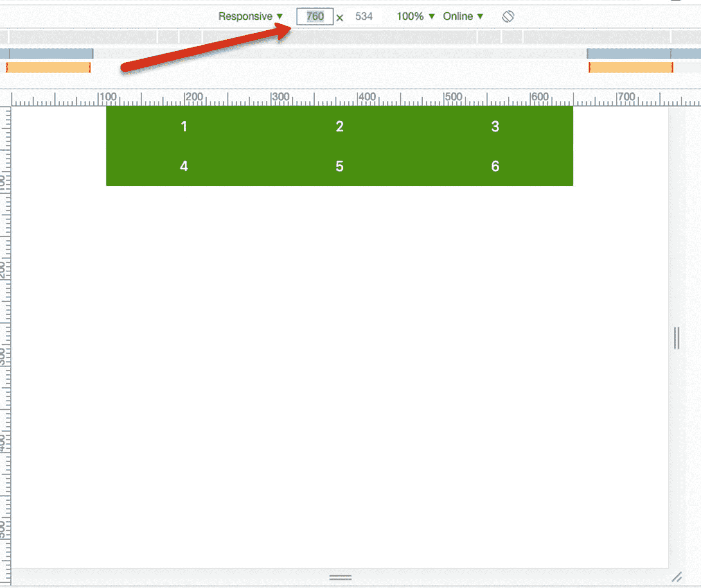

图 1-17

小尺寸显示器上的三列

但是如果你把它放大到比 768 像素更宽，它将每行显示 6 列(图 1-18 )。

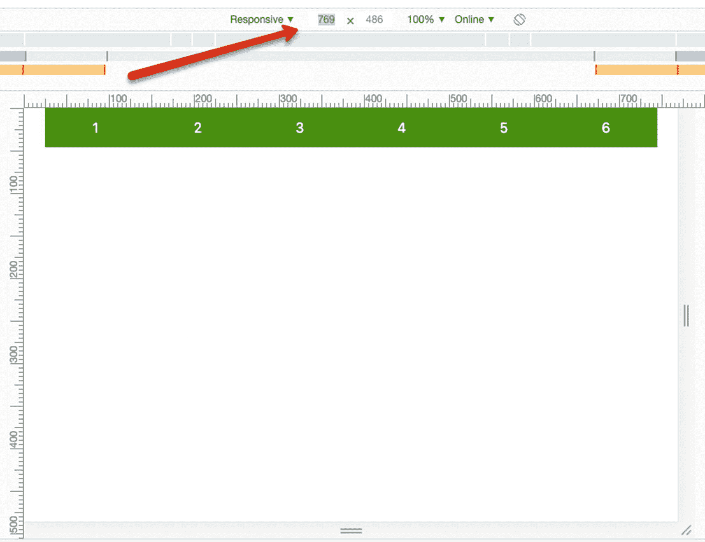

图 1-18

中型显示器上的六列

## 任务和测验

Task Details

1.  您需要实现一个多列布局，就像本章中介绍的那样。以下是根据显示宽度对网格的要求:

2.  对于超小型显示器，每行应该显示一列。

3.  对于小型显示器，每行应该显示两列。

4.  对于中型显示器，每行应该显示三列。

5.  对于大型显示器，每行应该显示四列。

6.  对于超大显示器，每行应该显示六列。

祝你好运！

## 关键要点

恭喜你！你刚刚读完了第一章，你已经知道了很多关于如何让你的网页响应的事情。以下是你学到的一些重要东西:

*   最简单的 Twitter 引导页面和它需要包含的内容

*   集装箱

*   这一排分开了

*   列分区是行分区的子分区

*   如何将行拆分成几个等宽或不等宽的列

*   不同的引导断点

*   如何使用不同的类来定义不同显示宽度的页面布局

在下一章中，您将围绕 Twitter Bootstrap 网格系统使用一些更高级的技术。