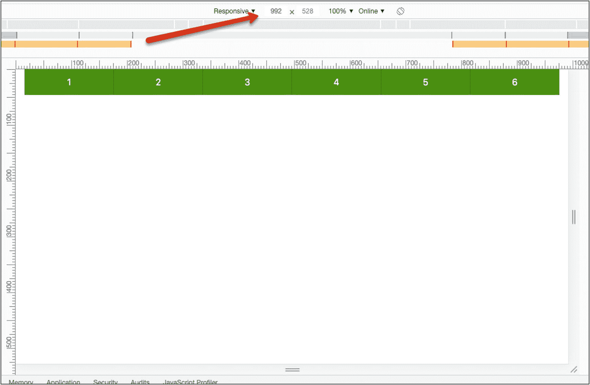
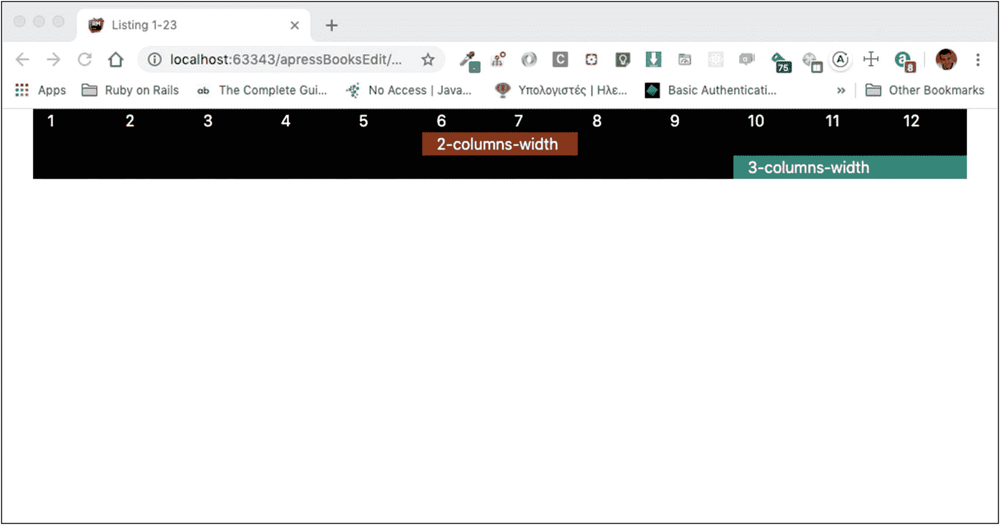

# 二、高级网格技术

在前一章中，您开始学习 Twitter Bootstrap 网格系统。在这一章中，你将继续你在网格系统上的工作，但是你将使用一些不同的，更高级的技术来做类似的和其他的事情。

## 学习目标

你会学到的

1.  如何使用行列

2.  如何垂直对齐内容

3.  如何水平对齐

4.  如何使用少于 12 个的可用列

5.  如何将内容和网格嵌套在另一个网格中

6.  Twitter 引导默认是什么

## 行上的快捷方式:行列

你现在要探索另一套备选方案，以便完成你在第 1 “开始”一章中所做的所有事情这被称为*行列*，它是一组帮助你定义一行的列的类，但是在`row div`使用它们，而不是在`col div`使用它们。

### 示例:所有设备的六列布局

假设我想要实现一个适用于所有设备宽度的六列布局。清单 2-1 是我的代码。

```html
<!DOCTYPE html>
<html lang="en">
<head>
    <!-- Required meta tags -->
    <meta charset="utf-8">
    <meta name="viewport" content="width=device-width, initial-scale=1, shrink-to-fit=no">

    <!-- Bootstrap CSS -->
    <link rel="stylesheet" href="https://stackpath.bootstrapcdn.com/bootstrap/4.4.1/css/bootstrap.min.css" integrity="sha384-Vkoo8x4CGsO3+Hhxv8T/Q5PaXtkKtu6ug5TOeNV6gBiFeWPGFN9MuhOf23Q9Ifjh" crossorigin="anonymous">

    <!-- Custom CSS -->
    <link rel="stylesheet" href="stylesheets/index.css" type="text/css">

    <title>Listing 2-1</title>
</head>
<body>
    <div class="container">
        <div class="row row-cols-6">
            <div class="col">
                1
            </div>
            <div class="col">
                2
            </div>
            <div class="col">
                3
            </div>
            <div class="col">
                4
            </div>
            <div class="col">
                5
            </div>
            <div class="col">
                6
            </div>
        </div>
    </div>

    <!-- Optional JavaScript -->

    <!-- jQuery first, then Popper.js, then Bootstrap JS -->
    <script src="https://code.jquery.com/jquery-3.4.1.slim.min.js" integrity="sha384-J6qa4849blE2+poT4WnyKhv5vZF5SrPo0iEjwBvKU7imGFAV0wwj1yYfoRSJoZ+n" crossorigin="anonymous"></script>
    <script src="https://cdn.jsdelivr.net/npm/popper.js@1.16.0/dist/umd/popper.min.js" integrity="sha384-Q6E9RHvbIyZFJoft+2mJbHaEWldlvI9IOYy5n3zV9zzTtmI3UksdQRVvoxMfooAo" crossorigin="anonymous"></script>
    <script src="https://stackpath.bootstrapcdn.com/bootstrap/4.4.1/js/bootstrap.min.js" integrity="sha384-wfSDF2E50Y2D1uUdj0O3uMBJnjuUD4Ih7YwaYd1iqfktj0Uod8GCExl3Og8ifwB6" crossorigin="anonymous"></script>
</body>
</html>

Listing 2-1Six-Column Layout Using Row Columns

```

如果你将前面的代码保存到你的`index.html`页面并加载到你的浏览器中，你将会看到类似图 2-1 中的内容。


图 2-1

使用 row-cols-*类的六列

这正是我想要的。是怎么创造出来的？

1.  行 div 被属性化为类`row-cols-6`。数字`6`正是我想要的列数。

2.  然后每个列`div`只有`col`类，因为我希望所有的列都有相同的宽度。

当然，我现在听到你说，“等等。如果我只使用了`row`类而没有使用`row-cols-6`类，同样的事情也会发生。”你可能是对的。在前一个例子中使用`row-cols-*`并没有增加太多的价值。但是让我们再举一个例子，在这个例子中行列类更有价值。

### 示例:三列表示中型，六列表示大型

现在我想创建一个响应网格

*   三列用于所有设备，包括中型设备

*   六列，适用于所有配备大显示屏或更宽显示屏的设备

您已经知道如何在列`div`级别使用`col-*`类来实现这一点。在这里，我们将使用行级别的`row-cols-*`类来实现。参见清单 2-2 。

```html
<!DOCTYPE html>
<html lang="en">
<head>
    <!-- Required meta tags -->
    <meta charset="utf-8">
    <meta name="viewport" content="width=device-width, initial-scale=1, shrink-to-fit=no">

    <!-- Bootstrap CSS -->
    <link rel="stylesheet" href="https://stackpath.bootstrapcdn.com/bootstrap/4.4.1/css/bootstrap.min.css" integrity="sha384-Vkoo8x4CGsO3+Hhxv8T/Q5PaXtkKtu6ug5TOeNV6gBiFeWPGFN9MuhOf23Q9Ifjh" crossorigin="anonymous">

    <!-- Custom CSS -->
    <link rel="stylesheet" href="stylesheets/index.css" type="text/css">

    <title>Listing 2-2</title>
</head>
<body>
    <div class="container">
        <div class="row row-cols-3 row-cols-lg-6">
            <div class="col">
                1
            </div>
            <div class="col">
                2
            </div>
            <div class="col">
                3
            </div>
            <div class="col">
                4
            </div>
            <div class="col">
                5
            </div>
            <div class="col">
                6
            </div>
        </div>
    </div>

    <!-- Optional JavaScript -->

    <!-- jQuery first, then Popper.js, then Bootstrap JS -->
    <script src="https://code.jquery.com/jquery-3.4.1.slim.min.js" integrity="sha384-J6qa4849blE2+poT4WnyKhv5vZF5SrPo0iEjwBvKU7imGFAV0wwj1yYfoRSJoZ+n" crossorigin="anonymous"></script>
    <script src="https://cdn.jsdelivr.net/npm/popper.js@1.16.0/dist/umd/popper.min.js" integrity="sha384-Q6E9RHvbIyZFJoft+2mJbHaEWldlvI9IOYy5n3zV9zzTtmI3UksdQRVvoxMfooAo" crossorigin="anonymous"></script>
    <script src="https://stackpath.bootstrapcdn.com/bootstrap/4.4.1/js/bootstrap.min.js" integrity="sha384-wfSDF2E50Y2D1uUdj0O3uMBJnjuUD4Ih7YwaYd1iqfktj0Uod8GCExl3Og8ifwB6" crossorigin="anonymous"></script>
</body>
</html>

Listing 2-2Responsive Breakpoints Using Row Columns

```

你看到这有多容易了吗？

*   我保持列`divs`只有`col`类。

*   我使用两个行列类`row-cols-3`和`row-cols-lg-6`来根据设备的宽度告诉我想要多少列，特别是
    *   `row-cols-3`适用于除以下类别定义的设备以外的所有设备。注意数字`3`是我们想要占据的列数。

    *   `row-cols-lg-6`对于所有大屏或更宽显示屏的设备，即> =992px。

例如，如果您保存您的页面并在浏览器上重新加载，您将看到以下宽度为 991 像素的页面(图 2-2 )。


图 2-2

低于 992 像素时为三列

当您将宽度再放大 1 个像素，达到 992px 时，您将立即获得 6 列(图 2-3 )。



图 2-3

992px 和更宽型号的六列

在表 2-1 中，我将第一个解决方案与列级别的`col-*`类进行了比较，并将您刚刚学到的最新解决方案与行级别的`row-cols-*`类进行了比较。

表 2-1

比较`col-*`和`row-cols-*`之间的代码

<colgroup><col class="tcol1 align-left"> <col class="tcol2 align-left"></colgroup> 
| 

`col-*`在列级

 | 

`row-cols-*`在行级别

 |
| --- | --- |
| `<div class="row">``<div class="col-4 col-lg-2">``1``</div>``<div class="col-4 col-lg-2">``2``</div>``<div class="col-4 col-lg-2">``3``</div>``<div class="col-4 col-lg-2">``4``</div>``<div class="col-4 col-lg-2">``5``</div>``<div class="col-4 col-lg-2">``6``</div>``</div>` | `<div class="row row-cols-3 row-cols-lg-6">``<div class="col">``1``</div>``<div class="col">``2``</div>``<div class="col">``3``</div>``<div class="col">``4``</div>``<div class="col">``5``</div>``<div class="col">``6``</div>``</div>` |

我重复一遍，这样就很清楚了:

1.  当我使用类在列`div`级别指定列宽时，我指定了我的列将占用的列数(12 列中的一列)。例如，如果我希望我的列有三列宽，我使用`col-3`。

2.  当我在行`div`级别使用类时，我只需指定行中需要的列数。然后 Bootstrap 会自动计算每一列的宽度。

3.  显然，当我使用行类时，我将该行的所有列的宽度设置为相同的大小。如果我想在同一行中有不同宽度的列，我必须在列级使用列类`div`。

## 竖向定线

您已经学习了如何使用 12 列宽的网格进行布局，但是 Bootstrap 允许您在纵轴上对齐行内的内容。

### 中间对齐

你如何将你的内容放在一个高行的中间，如图 2-4 所示？


图 2-4

高行中间的内容

在上图中，您可以看到该行的内容，实际上，该行由三列组成，放置在垂直轴的中心。在清单 2-3 中，您可以看到如何创建这个页面。

```html
<!DOCTYPE html>
<html lang="en">
<head>
    <!-- Required meta tags -->
    <meta charset="utf-8">
    <meta name="viewport" content="width=device-width, initial-scale=1, shrink-to-fit=no">

    <!-- Bootstrap CSS -->
    <link rel="stylesheet" href="https://stackpath.bootstrapcdn.com/bootstrap/4.4.1/css/bootstrap.min.css" integrity="sha384-Vkoo8x4CGsO3+Hhxv8T/Q5PaXtkKtu6ug5TOeNV6gBiFeWPGFN9MuhOf23Q9Ifjh" crossorigin="anonymous">

    <!-- Custom CSS -->
    <link rel="stylesheet" href="stylesheets/index.css" type="text/css">

    <title>Listing 2-3</title>
</head>
<body>
    <div class="container">
        <div class="row align-items-center">
            <div class="col">
                1
            </div>
            <div class="col">
                2
            </div>
            <div class="col">
                3
            </div>
        </div>
    </div>

    <!-- Optional JavaScript -->
    <!-- jQuery first, then Popper.js, then Bootstrap JS -->
    <script src="https://code.jquery.com/jquery-3.4.1.slim.min.js" integrity="sha384-J6qa4849blE2+poT4WnyKhv5vZF5SrPo0iEjwBvKU7imGFAV0wwj1yYfoRSJoZ+n" crossorigin="anonymous"></script>
    <script src="https://cdn.jsdelivr.net/npm/popper.js@1.16.0/dist/umd/popper.min.js" integrity="sha384-Q6E9RHvbIyZFJoft+2mJbHaEWldlvI9IOYy5n3zV9zzTtmI3UksdQRVvoxMfooAo" crossorigin="anonymous"></script>
    <script src="https://stackpath.bootstrapcdn.com/bootstrap/4.4.1/js/bootstrap.min.js" integrity="sha384-wfSDF2E50Y2D1uUdj0O3uMBJnjuUD4Ih7YwaYd1iqfktj0Uod8GCExl3Og8ifwB6" crossorigin="anonymous"></script>
</body>
</html>

Listing 2-3Content in the Middle of a Tall Row

```

差异由在`row div`的类`align-items-center`完成。它指示浏览器在纵轴中行的中心位置绘制这个`div`的子列。

**在**之前，你保存并加载这个页面到你的浏览器上，你必须给你的行一些最小高度；否则，你看不出任何区别。将清单 2-4 用于您的`index.css`文件。

```html
.row {
    background-color: #4e9013;
    color: white;
    min-height: 200px;
}

.col {
    background-color: #31907c;
}

Listing 2-4CSS File That Gives the Row a Minimum Height

```

前面的 CSS 具有将`min-height`应用于行`divs`的规则。这将允许您在纵轴方向的行中心看到子`divs`的内容。

### 顶部和底部对齐

还有另外两个类可以在行`div`级别应用，它们与垂直对齐有关:`align-items-start`和`align-items-end`。让我们用这些来创建如图 2-5 所示的页面。


图 2-5

使用各种垂直对齐方式

如你所见，中间和底部的行分别有对齐`center`和`end,`。我很确定你是在没有我的帮助下编写 HTML 的，但是为了完整起见，让我们在这里包含代码(清单 2-5 )。

```html
<!DOCTYPE html>
<html lang="en">
<head>
    <!-- Required meta tags -->
    <meta charset="utf-8">
    <meta name="viewport" content="width=device-width, initial-scale=1, shrink-to-fit=no">

    <!-- Bootstrap CSS -->
    <link rel="stylesheet" href="https://stackpath.bootstrapcdn.com/bootstrap/4.4.1/css/bootstrap.min.css" integrity="sha384-Vkoo8x4CGsO3+Hhxv8T/Q5PaXtkKtu6ug5TOeNV6gBiFeWPGFN9MuhOf23Q9Ifjh" crossorigin="anonymous">

    <!-- Custom CSS -->
    <link rel="stylesheet" href="stylesheets/index.css" type="text/css">

    <title>Listing 2-5</title>
</head>
<body>
    <div class="container">
        <div class="row align-items-start">
            <div class="col">
                1-start
            </div>
            <div class="col">
                2-start
            </div>
            <div class="col">
                3-start
            </div>
        </div>
        <div class="row align-items-center">
            <div class="col">
                1-center
            </div>
            <div class="col">
                2-center
            </div>
            <div class="col">
                3-center
            </div>
        </div>
        <div class="row align-items-end">
            <div class="col">
                1-end
            </div>
            <div class="col">
                2-end
            </div>
            <div class="col">
                3-end
            </div>
        </div>
    </div>

    <!-- Optional JavaScript -->
    <!-- jQuery first, then Popper.js, then Bootstrap JS -->
    <script src="https://code.jquery.com/jquery-3.4.1.slim.min.js" integrity="sha384-J6qa4849blE2+poT4WnyKhv5vZF5SrPo0iEjwBvKU7imGFAV0wwj1yYfoRSJoZ+n" crossorigin="anonymous"></script>
    <script src="https://cdn.jsdelivr.net/npm/popper.js@1.16.0/dist/umd/popper.min.js" integrity="sha384-Q6E9RHvbIyZFJoft+2mJbHaEWldlvI9IOYy5n3zV9zzTtmI3UksdQRVvoxMfooAo" crossorigin="anonymous"></script>
    <script src="https://stackpath.bootstrapcdn.com/bootstrap/4.4.1/js/bootstrap.min.js" integrity="sha384-wfSDF2E50Y2D1uUdj0O3uMBJnjuUD4Ih7YwaYd1iqfktj0Uod8GCExl3Og8ifwB6" crossorigin="anonymous"></script>
</body>
</html>

Listing 2-5Align Top, Middle, and Bottom

```

不要忘记让你的`index.css`有规则，使你的行有最小高度，这样你就可以看到垂直对齐。清单 2-6 包含了这样的规则。

```html
.row {
    min-height: 200px;
    margin-bottom: 30px;
    color: white;
}

.align-items-start {
    background-color: #4e9013;
}

.align-items-center {
    background-color: #902e07;
}

.align-items-end {
    background-color: #8DC5CC;
}

.col {
    background-color: #367390;
}

Listing 2-6index.css File That Gives Rows Minimum Height

```

### 同一行内不同的垂直对齐

最后，有时您希望同一行中的列具有不同的垂直对齐方式。图 2-6 就是这样一个页面的例子。


图 2-6

在同一行中使用不同的垂直对齐方式

为了实现这一点，我在`col`级别使用了一些特殊的类。下面是前一页的 HTML 代码(清单 2-7 )。

```html
<!DOCTYPE html>
<html lang="en">
<head>
    <!-- Required meta tags -->
    <meta charset="utf-8">
    <meta name="viewport" content="width=device-width, initial-scale=1, shrink-to-fit=no">

    <!-- Bootstrap CSS -->
    <link rel="stylesheet" href="https://stackpath.bootstrapcdn.com/bootstrap/4.4.1/css/bootstrap.min.css" integrity="sha384-Vkoo8x4CGsO3+Hhxv8T/Q5PaXtkKtu6ug5TOeNV6gBiFeWPGFN9MuhOf23Q9Ifjh" crossorigin="anonymous">

    <!-- Custom CSS -->
    <link rel="stylesheet" href="stylesheets/index.css" type="text/css">

    <title>Listing 2-7</title>
</head>
<body>
    <div class="container">
        <div class="row">
            <div class="col align-self-start">
                1-self-start
            </div>
            <div class="col align-self-center">
                2-self-center
            </div>
            <div class="col align-self-end">
                3-self-end
            </div>
        </div>
    </div>

    <!-- Optional JavaScript -->

    <!-- jQuery first, then Popper.js, then Bootstrap JS -->
    <script src="https://code.jquery.com/jquery-3.4.1.slim.min.js" integrity="sha384-J6qa4849blE2+poT4WnyKhv5vZF5SrPo0iEjwBvKU7imGFAV0wwj1yYfoRSJoZ+n" crossorigin="anonymous"></script>
    <script src="https://cdn.jsdelivr.net/npm/popper.js@1.16.0/dist/umd/popper.min.js" integrity="sha384-Q6E9RHvbIyZFJoft+2mJbHaEWldlvI9IOYy5n3zV9zzTtmI3UksdQRVvoxMfooAo" crossorigin="anonymous"></script>
    <script src="https://stackpath.bootstrapcdn.com/bootstrap/4.4.1/js/bootstrap.min.js" integrity="sha384-wfSDF2E50Y2D1uUdj0O3uMBJnjuUD4Ih7YwaYd1iqfktj0Uod8GCExl3Og8ifwB6" crossorigin="anonymous"></script>
</body>
</html>

Listing 2-7Different Vertical Alignments Within the Same Row

```

使用下面的`index.css`(清单 2-8 )来对前面的 HTML 内容进行样式化，这样您就可以得到如图 2-6 所示的结果。

```html
.row {
    background-color: #4e9013;
    min-height: 200px;
    margin-bottom: 30px;
    color: white;
}

.align-self-start {
    background-color: #441180;
}

.align-self-center {
    background-color: #8DC5CC;
}

.align-self-end {
    background-color: #902e07;
}

Listing 2-8CSS for Listing 2-7

```

## 小于 12 和水平对齐

我将继续向您解释如何在水平方向上对齐列，这在内容没有占据整个页面宽度时更有用。

### 左边对齐

到目前为止，您的行从左到右显示内容。它们占据了整个集装箱的宽度。有些情况下，您希望占据部分宽度。例如，您希望内容位于前两列，其余水平空间为空。看下面图 2-7 中的例子。


图 2-7

左对齐列

如图 2-7 所示，第二行和第三行的列占据了网格的左侧。第二行占据前两列，第三行占据前三列。你如何实现这一点？清单 2-9 中给出了 HTML 代码。

```html
<!DOCTYPE html>
<html lang="en">
<head>
    <!-- Required meta tags -->
    <meta charset="utf-8">
    <meta name="viewport" content="width=device-width, initial-scale=1, shrink-to-fit=no">

    <!-- Bootstrap CSS -->
    <link rel="stylesheet" href="https://stackpath.bootstrapcdn.com/bootstrap/4.4.1/css/bootstrap.min.css" integrity="sha384-Vkoo8x4CGsO3+Hhxv8T/Q5PaXtkKtu6ug5TOeNV6gBiFeWPGFN9MuhOf23Q9Ifjh" crossorigin="anonymous">

    <!-- Custom CSS -->
    <link rel="stylesheet" href="stylesheets/index.css" type="text/css">

    <title>Listing 2-9</title>
</head>
<body>
    <div class="container">
        <div class="row">
            <div class="col">1</div>
            <div class="col">2</div>
            <div class="col">3</div>
            <div class="col">4</div>
            <div class="col">5</div>
            <div class="col">6</div>
            <div class="col">7</div>
            <div class="col">8</div>
            <div class="col">9</div>
            <div class="col">10</div>
            <div class="col">11</div>
            <div class="col">12</div>
        </div>
        <div class="row justify-content-start row-1">
            <div class="col-2 col">
                2-columns-width
            </div>
        </div>
        <div class="row justify-content-start row-2">
            <div class="col-3 col">
                3-columns-width
            </div>
        </div>
    </div>

    <!-- Optional JavaScript -->
    <!-- jQuery first, then Popper.js, then Bootstrap JS -->
    <script src="https://code.jquery.com/jquery-3.4.1.slim.min.js" integrity="sha384-J6qa4849blE2+poT4WnyKhv5vZF5SrPo0iEjwBvKU7imGFAV0wwj1yYfoRSJoZ+n" crossorigin="anonymous"></script>
    <script src="https://cdn.jsdelivr.net/npm/popper.js@1.16.0/dist/umd/popper.min.js" integrity="sha384-Q6E9RHvbIyZFJoft+2mJbHaEWldlvI9IOYy5n3zV9zzTtmI3UksdQRVvoxMfooAo" crossorigin="anonymous"></script>
    <script src="https://stackpath.bootstrapcdn.com/bootstrap/4.4.1/js/bootstrap.min.js" integrity="sha384-wfSDF2E50Y2D1uUdj0O3uMBJnjuUD4Ih7YwaYd1iqfktj0Uod8GCExl3Og8ifwB6" crossorigin="anonymous"></script>
</body>
</html>

Listing 2-9Left-Aligned Columns

```

在将前面的 HTML 加载到你的浏览器中之前，确保你的`index.css`文件中有正确的 CSS 规则，类似于清单 2-10 中的内容。

```html
* {
    color: white;
}

.row {
    background-color: black;
}

.row-1 .col {
    background-color: #902e07;
}

.row-2 .col {
    background-color: #31907c;
}

Listing 2-10CSS for Listing 2-9

```

在清单 2-9 中，类`justify-content-start`被附加在第二和第三行`divs`上。

### 居中和右对齐

但事实上，这并不十分有用。即使没有将这个类附加到 row divs，也可以实现同样的效果。当您使用相应的`*-center`和`*-end`类时，事情变得更加有趣，如清单 2-11 所示。

```html
<!DOCTYPE html>
<html lang="en">
<head>
    <!-- Required meta tags -->
    <meta charset="utf-8">
    <meta name="viewport" content="width=device-width, initial-scale=1, shrink-to-fit=no">

    <!-- Bootstrap CSS -->
    <link rel="stylesheet" href="https://stackpath.bootstrapcdn.com/bootstrap/4.4.1/css/bootstrap.min.css" integrity="sha384-Vkoo8x4CGsO3+Hhxv8T/Q5PaXtkKtu6ug5TOeNV6gBiFeWPGFN9MuhOf23Q9Ifjh" crossorigin="anonymous">

    <!-- Custom CSS -->
    <link rel="stylesheet" href="stylesheets/index.css" type="text/css">

    <title>Listing 2-11</title>
</head>
<body>
    <div class="container">
        <div class="row">
            <div class="col">1</div>
            <div class="col">2</div>
            <div class="col">3</div>
            <div class="col">4</div>
            <div class="col">5</div>
            <div class="col">6</div>
            <div class="col">7</div>
            <div class="col">8</div>
            <div class="col">9</div>
            <div class="col">10</div>
            <div class="col">11</div>
            <div class="col">12</div>
        </div>
        <div class="row justify-content-center row-1">
            <div class="col-2 col">
                2-columns-width
            </div>
        </div>
        <div class="row justify-content-end row-2">
            <div class="col-3 col">
                3-columns-width
            </div>
        </div>
    </div>

    <!-- Optional JavaScript -->
    <!-- jQuery first, then Popper.js, then Bootstrap JS -->
    <script src="https://code.jquery.com/jquery-3.4.1.slim.min.js" integrity="sha384-J6qa4849blE2+poT4WnyKhv5vZF5SrPo0iEjwBvKU7imGFAV0wwj1yYfoRSJoZ+n" crossorigin="anonymous"></script>
    <script src="https://cdn.jsdelivr.net/npm/popper.js@1.16.0/dist/umd/popper.min.js" integrity="sha384-Q6E9RHvbIyZFJoft+2mJbHaEWldlvI9IOYy5n3zV9zzTtmI3UksdQRVvoxMfooAo" crossorigin="anonymous"></script>
    <script src="https://stackpath.bootstrapcdn.com/bootstrap/4.4.1/js/bootstrap.min.js" integrity="sha384-wfSDF2E50Y2D1uUdj0O3uMBJnjuUD4Ih7YwaYd1iqfktj0Uod8GCExl3Og8ifwB6" crossorigin="anonymous"></script>
</body>
</html>

Listing 2-11Use *-center and *-end Classes

```

保存前面的页面，并将其加载到您的浏览器中。您将会看到类似于图 2-8 中所示的内容。



图 2-8

居中和右对齐

因此，在第`divs`行的这些`justify-content-*`类是有用的，因为它们允许你对齐而不必使用空的 div。

### 间距

如果您有三个内容列，并且希望它们以等间距水平对齐，那会怎么样呢？图 2-9 有这种情况的例子。


图 2-9

间距为的列

你必须使用的类是`justify-content-between`。清单 2-12 中给出了 HTML 代码。

```html
<!DOCTYPE html>
<html lang="en">
<head>
    <!-- Required meta tags -->
    <meta charset="utf-8">
    <meta name="viewport" content="width=device-width, initial-scale=1, shrink-to-fit=no">

    <!-- Bootstrap CSS -->
    <link rel="stylesheet" href="https://stackpath.bootstrapcdn.com/bootstrap/4.4.1/css/bootstrap.min.css" integrity="sha384-Vkoo8x4CGsO3+Hhxv8T/Q5PaXtkKtu6ug5TOeNV6gBiFeWPGFN9MuhOf23Q9Ifjh" crossorigin="anonymous">

    <!-- Custom CSS -->
    <link rel="stylesheet" href="stylesheets/index.css" type="text/css">

    <title>Listing 2-12</title>
</head>
<body>
    <div class="container">

        <div class="row">
            <div class="col">1</div>
            <div class="col">2</div>
            <div class="col">3</div>
            <div class="col">4</div>
            <div class="col">5</div>
            <div class="col">6</div>
            <div class="col">7</div>
            <div class="col">8</div>
            <div class="col">9</div>
            <div class="col">10</div>
            <div class="col">11</div>
            <div class="col">12</div>
        </div>
        <div class="row justify-content-between">
            <div class="col-2">
                2-columns, left
            </div>
            <div class="col-2">
                2-columns, middle
            </div>
            <div class="col-2">
                2-columns, right
            </div>
        </div>
    </div>

    <!-- Optional JavaScript -->
    <!-- jQuery first, then Popper.js, then Bootstrap JS -->
    <script src="https://code.jquery.com/jquery-3.4.1.slim.min.js" integrity="sha384-J6qa4849blE2+poT4WnyKhv5vZF5SrPo0iEjwBvKU7imGFAV0wwj1yYfoRSJoZ+n" crossorigin="anonymous"></script>
    <script src="https://cdn.jsdelivr.net/npm/popper.js@1.16.0/dist/umd/popper.min.js" integrity="sha384-Q6E9RHvbIyZFJoft+2mJbHaEWldlvI9IOYy5n3zV9zzTtmI3UksdQRVvoxMfooAo" crossorigin="anonymous"></script>
    <script src="https://stackpath.bootstrapcdn.com/bootstrap/4.4.1/js/bootstrap.min.js" integrity="sha384-wfSDF2E50Y2D1uUdj0O3uMBJnjuUD4Ih7YwaYd1iqfktj0Uod8GCExl3Og8ifwB6" crossorigin="anonymous"></script>
</body>
</html>

Listing 2-12Using justify-content-between

```

### 周围的空间

最后，有时你希望空间围绕着你的内容。参见图 2-10 中的示例。


图 2-10

满足于周围的空间

为了实现这一点，您需要使用类`justify-content-around`。在`row div`级连接它，如清单 2-13 所示。

```html
<!DOCTYPE html>
<html lang="en">
<head>
    <!-- Required meta tags -->
    <meta charset="utf-8">
    <meta name="viewport" content="width=device-width, initial-scale=1, shrink-to-fit=no">

    <!-- Bootstrap CSS -->
    <link rel="stylesheet" href="https://stackpath.bootstrapcdn.com/bootstrap/4.4.1/css/bootstrap.min.css" integrity="sha384-Vkoo8x4CGsO3+Hhxv8T/Q5PaXtkKtu6ug5TOeNV6gBiFeWPGFN9MuhOf23Q9Ifjh" crossorigin="anonymous">

    <!-- Custom CSS -->
    <link rel="stylesheet" href="stylesheets/index.css" type="text/css">

    <title>Listing 2-13</title>
</head>
<body>
    <div class="container">
        <div class="row">
            <div class="col">1</div>
            <div class="col">2</div>
            <div class="col">3</div>
            <div class="col">4</div>
            <div class="col">5</div>
            <div class="col">6</div>
            <div class="col">7</div>
            <div class="col">8</div>
            <div class="col">9</div>
            <div class="col">10</div>
            <div class="col">11</div>
            <div class="col">12</div>
        </div>
        <div class="row justify-content-around">
            <div class="col-2">
                2-columns, left
            </div>
            <div class="col-2">
                2-columns, middle
            </div>
            <div class="col-2">
                2-columns, right
            </div>
        </div>
    </div>

    <!-- Optional JavaScript -->
    <!-- jQuery first, then Popper.js, then Bootstrap JS -->
    <script src="https://code.jquery.com/jquery-3.4.1.slim.min.js" integrity="sha384-J6qa4849blE2+poT4WnyKhv5vZF5SrPo0iEjwBvKU7imGFAV0wwj1yYfoRSJoZ+n" crossorigin="anonymous"></script>
    <script src="https://cdn.jsdelivr.net/npm/popper.js@1.16.0/dist/umd/popper.min.js" integrity="sha384-Q6E9RHvbIyZFJoft+2mJbHaEWldlvI9IOYy5n3zV9zzTtmI3UksdQRVvoxMfooAo" crossorigin="anonymous"></script>
    <script src="https://stackpath.bootstrapcdn.com/bootstrap/4.4.1/js/bootstrap.min.js" integrity="sha384-wfSDF2E50Y2D1uUdj0O3uMBJnjuUD4Ih7YwaYd1iqfktj0Uod8GCExl3Og8ifwB6" crossorigin="anonymous"></script>
</body>
</html>

Listing 2-13Content with Space Around

```

使用清单 2-14 中给出的`index.css`文件加载前面的代码。

```html
* {
    color: white;
}

.row {
    background-color: darkblue;
}

.col-2:nth-child(1) {
    background-color: #902e07;
}

.col-2:nth-child(2) {
    background-color: #31907c;
}

.col-2:nth-child(3) {
    background-color: #89906b;
}

Listing 2-14CSS Content for Listing 2-13

```

## 嵌套

我将通过给出一些关于如何在一个网格中嵌套另一个网格的建议来结束这次与 Twitter Bootstrap 的初次接触。

允许将一个网格嵌套在另一个网格中，并遵循适用于根网格的相同规则。你会怎么做？你必须在父`col div`中使用一个`row div`和子`col divs`。

图 2-11 显示了一个网格嵌入另一个网格的例子。


图 2-11

另一个内部的嵌套网格

让我们看看这个页面的 HTML 代码(清单 2-15 )。

```html
<!DOCTYPE html>
<html lang="en">
<head>
    <!-- Required meta tags -->
    <meta charset="utf-8">
    <meta name="viewport" content="width=device-width, initial-scale=1, shrink-to-fit=no">

    <!-- Bootstrap CSS -->
    <link rel="stylesheet" href="https://stackpath.bootstrapcdn.com/bootstrap/4.4.1/css/bootstrap.min.css" integrity="sha384-Vkoo8x4CGsO3+Hhxv8T/Q5PaXtkKtu6ug5TOeNV6gBiFeWPGFN9MuhOf23Q9Ifjh" crossorigin="anonymous">

    <!-- Custom CSS -->
    <link rel="stylesheet" href="stylesheets/index.css" type="text/css">

    <title>Listing 2-15</title>
</head>
<body>
    <div class="container">
        <div class="row">
            <div class="col">1</div>
            <div class="col">2</div>
            <div class="col">3</div>
            <div class="col">4</div>
            <div class="col">5</div>
            <div class="col">6</div>
            <div class="col">7</div>
            <div class="col">8</div>
            <div class="col">9</div>
            <div class="col">10</div>
            <div class="col">11</div>
            <div class="col">12</div>
        </div>
        <div class="row parent">
            <div class="col-6">
                <div class="row nested row-cols-md-3 row-cols-lg-6">
                    <div class="col">
                        1-nested
                    </div>
                    <div class="col">
                        2-nested
                    </div>
                    <div class="col">
                        3-nested
                    </div>
                    <div class="col">
                        4-nested
                    </div>
                    <div class="col">
                        5-nested
                    </div>
                    <div class="col">
                        6-nested
                    </div>
                </div>
            </div>
            <div class="col-4">
                4-columns
            </div>
            <div class="col-2">
                2-columns
            </div>
        </div>
    </div>

    <!-- Optional JavaScript -->
    <!-- jQuery first, then Popper.js, then Bootstrap JS -->
    <script src="https://code.jquery.com/jquery-3.4.1.slim.min.js" integrity="sha384-J6qa4849blE2+poT4WnyKhv5vZF5SrPo0iEjwBvKU7imGFAV0wwj1yYfoRSJoZ+n" crossorigin="anonymous"></script>
    <script src="https://cdn.jsdelivr.net/npm/popper.js@1.16.0/dist/umd/popper.min.js" integrity="sha384-Q6E9RHvbIyZFJoft+2mJbHaEWldlvI9IOYy5n3zV9zzTtmI3UksdQRVvoxMfooAo" crossorigin="anonymous"></script>
    <script src="https://stackpath.bootstrapcdn.com/bootstrap/4.4.1/js/bootstrap.min.js" integrity="sha384-wfSDF2E50Y2D1uUdj0O3uMBJnjuUD4Ih7YwaYd1iqfktj0Uod8GCExl3Og8ifwB6" crossorigin="anonymous"></script>
</body>
</html>

Listing 2-15Nested Grid Inside Another

```

从前面的代码中可以看出，在带有类`parent`的`row div`中，我有一个`col div`(带有类`col-6`)。后者`div`内部有另一个`row`(带有类`nested`)来启动嵌套网格。

类`parent`和`nested`不是 Twitter 引导类。它们是我的自定义 CSS 类，帮助用存在于`index.css`(清单 2-16 )中的规则设计页面。

```html
* {
    color: white;
}

.row {
    background-color: darkblue;
}

.row.parent {
    background-color: #367390;
}

.row.nested {
    background-color: #31907c;
}

Listing 2-16index.css for Listing 2-15

```

看看嵌套的`row div`如何使用`row-cols-*`类来指定不同断点上的列数。例如，如果您将浏览器窗口缩小到 780px，这是一个中等大小的设备，您将看到嵌套网格有三列布局，这是由于类`row-cols-3`。见图 2-12 。


图 2-12

嵌套网格在中型设备上有三列

## Twitter 引导默认设置

在我结束这一章之前，我想带你快速浏览一下最重要的默认设置(表 2-2 ),包括 Twitter Bootstrap，并与没有它的默认设置进行比较。

表 2-2

Twitter 引导默认与浏览器默认

<colgroup><col class="tcol1 align-left"> <col class="tcol2 align-left"> <col class="tcol3 align-left"></colgroup> 
|   | 

Twitter 引导

 | 

没有 Twitter 引导

 |
| --- | --- | --- |
| html 元素框大小 | 边框 | 内容盒 |
| html 元素字体系列 | 无衬线字体 | 英国泰晤士报(1785 年创刊) |
| html 元素字体大小 | 16px | 16px |
| 正文元素字体系列 | -苹果系统、闪烁 MAC 系统字体、Segoe UI、Roboto、helvetica neue、Arial、noto sans、sans-serif、Apple Color Emoji、segoe e moji、Segoe UI Symbol、Noto Color Emoji | 英国泰晤士报(1785 年创刊) |
| 正文元素字体大小 | 16px | 16px |
| 正文元素行高 | 24px | 标准 |
| 主体元素颜色 | #212529 | #000 |
| 正文元素背景色 | #fff | rgba(0，0，0，0)；因此是透明的 |
| 主体元素框尺寸 | 边框 | 内容盒 |
| 主体元素边距 | Zero | 8px |

如果你在本地电脑上下载了 Twitter Bootstrap，你可以阅读更多关于 Twitter Bootstrap 默认设置的内容。你可以访问 [`https://getbootstrap.com/docs/4.4/getting-started/download/`](https://getbootstrap.com/docs/4.4/getting-started/download/) ，然后点击按钮下载。这将下载准备好的 CSS 非精简代码(寻找文件`css/bootstrap.css`)。

## 任务和测验

Task Details


图 2-13

任务:响应图像登记表页面

1.  您需要实现一个包含图像名册的页面。

2.  你需要使用 Twitter Bootstrap 工具来使其响应迅速。

3.  这是页面在超大显示器(>= 1200 像素)上的外观(图 2-13 )。

如您所见，它在页面上均匀地放置了六个图像。


图 2-14

页面在中型和大型设备上的外观

1.  在中型(> =768px)和大型(< 1200px)设备上，该页面应如图 2-14 所示。

如图 2-14 所示，现在，图像被排列成每行有三幅图像。因此，所有图像都显示在两行中。


图 2-15

小型和超小型设备页面

1.  在小型和超小型设备(< 768px)上，该页面应如图 2-15 所示。

正如您在图 2-15 中看到的，现在每个图像都显示在它自己的行上。

1.  标题是一个`h1`元素。

2.  `img`标签应该使用`width`和`height 100%`来设计样式，这样它们就可以占据所有给定的空间。

祝你好运！

## 关键要点

以下是你学到的一些重要东西:

*   如何实现垂直对齐

*   如何实现水平对齐

*   如何将一个网格嵌套在另一个网格中

在下一章中，你将通过实现一个真实的项目来学习 Bootstrap。它将有一个响应的导航栏，它将根据显示器的宽度改变它的外观。