# 四、主题参考：第一部分

在前一章中，您已经创建了一个小型的 Twitter Bootstrap 项目。现在，您将创建一个引用一些最常用的 Twitter 引导组件的页面。

在这个主题参考项目的第一部分，你将学习如何在导航栏中创建下拉菜单(图 4-1 )。

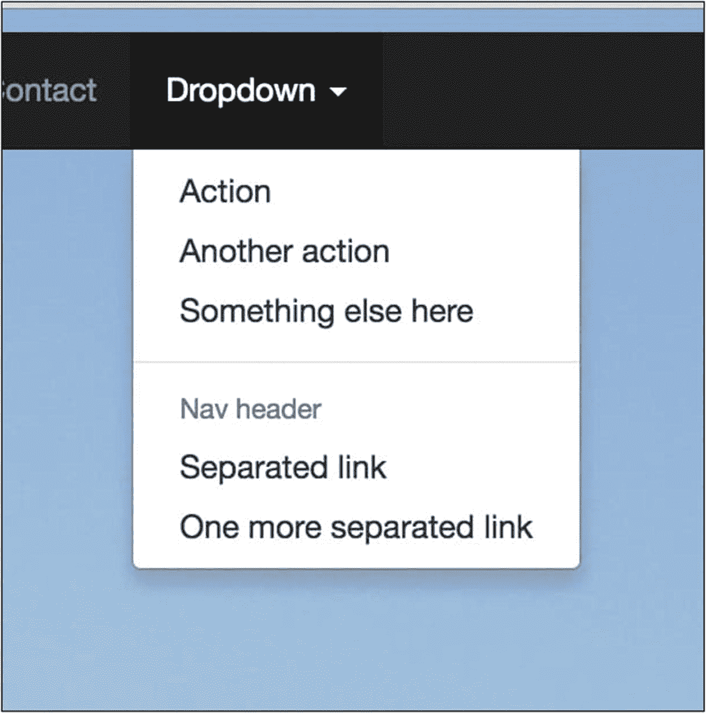

图 4-1

导航栏中的下拉菜单

您将学习如何创建突出的文本区域，称为大屏幕(图 4-2 )。

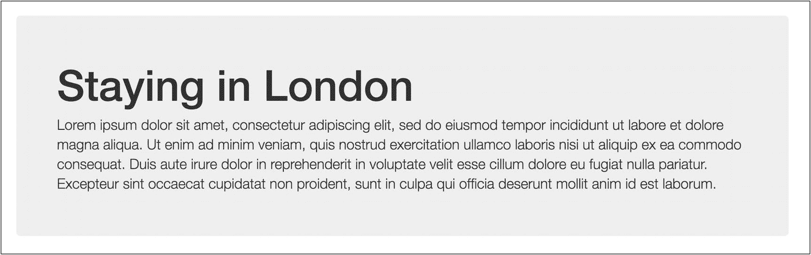

图 4-2

大屏幕示例

你将学习如何快速创建好看的按钮，如下所示(图 4-3

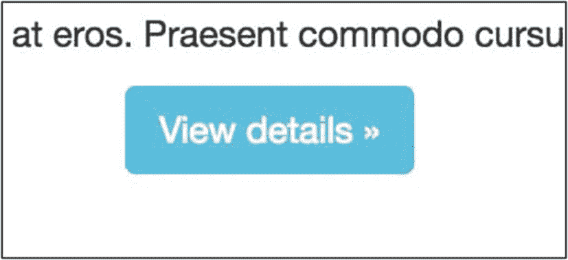

图 4-3

按钮示例

以及如图 4-4 所示的表格。

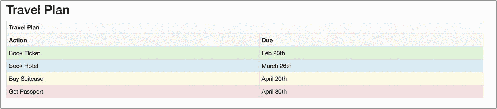

图 4-4

表格示例

您还将学习如何创建好看的标签和标记(图 4-5

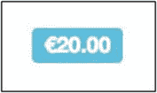

图 4-5

标签示例

以及徽章(图 4-6 )。

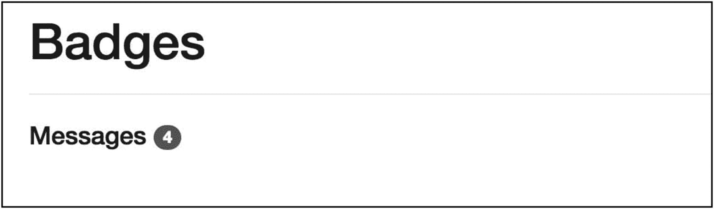

图 4-6

徽章示例

在主题参考项目的第二部分中，您将学习如何在选项卡下对信息进行分组(图 4-7 )。

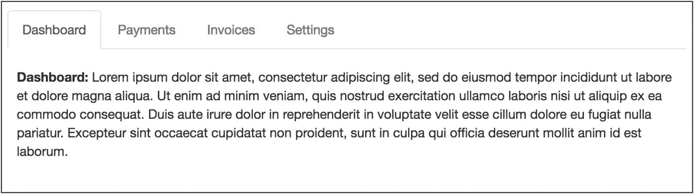

图 4-7

制表符示例

您将学习如何创建警报(图 4-8

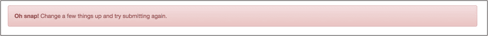

图 4-8

警报示例

还有好看的进度条(图 4-9 )。

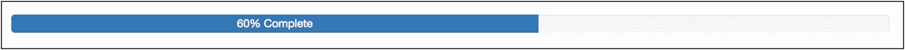

图 4-9

进度条示例

您将学习如何创建具有突出标题和独立正文的卡片(图 4-10 )。

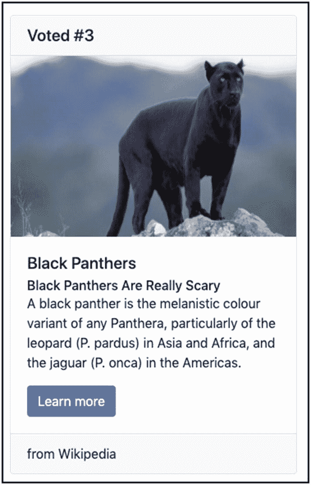

图 4-10

卡片示例

最后，您将学习如何创建令人印象深刻的图像旋转木马。

在第二部分结束时，您将被要求创建一个页面，该页面要求您使用前面的大部分组件(图 4-11 )。

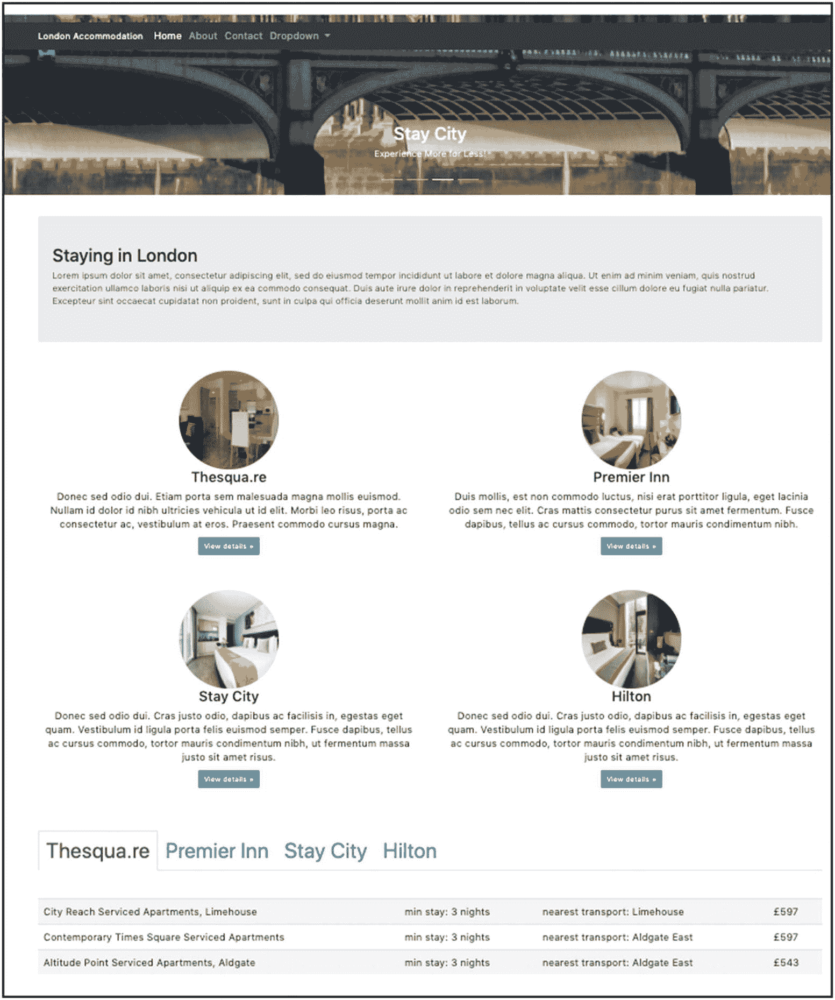

图 4-11

包含各种元素的 Twitter 引导示例页面

## 学习目标

这是您将在第一部分学习的内容列表:

1.  了解如何在导航栏中添加下拉菜单。

2.  了解各种下拉菜单组件和类。

3.  了解一下*大屏幕*。

4.  了解页眉。

5.  了解按钮样式。

6.  了解如何设置表格样式。

7.  了解如何创建标签和标记。

## 介绍

您将继续处理 Twitter Bootstrap 项目，现在您将构建一个项目，作为对各种 Twitter Bootstrap 组件的引用。

我们开始吧。

## 带有导航栏的基本引导页面

您从带有导航栏的基本引导页面开始，就像我们在上一章中构建的那样。参见清单 4-1 。

```html
<!DOCTYPE html>
<html lang="en">
<head>
    <!-- Required meta tags -->
    <meta charset="utf-8">
    <meta name="viewport" content="width=device-width, initial-scale=1, shrink-to-fit=no">

    <!-- Bootstrap CSS -->
    <link rel="stylesheet" href="https://stackpath.bootstrapcdn.com/bootstrap/4.4.1/css/bootstrap.min.css" integrity="sha384-Vkoo8x4CGsO3+Hhxv8T/Q5PaXtkKtu6ug5TOeNV6gBiFeWPGFN9MuhOf23Q9Ifjh" crossorigin="anonymous">

    <!-- Custom CSS -->
    <link rel="stylesheet" href="stylesheets/main.css" type="text/css">

    <title>Twitter Bootstrap Reference Page</title>
</head>
<body>
    <nav class="navbar navbar-expand-lg navbar-dark bg-dark fixed-top">
        <div class="container">
            <a class="navbar-brand" href="#">Bootstrap Ref. Page</a>

            <button type="button" class="navbar-toggler" data-toggle="collapse" data-target="#navbar"
                    aria-controls="navbar"
                    aria-expanded="false"
                    aria-label="Toggle navigation">
                <span class="navbar-toggler-icon"></span>
            </button>

            <div class="collapse navbar-collapse" id="navbar">
                <ul class="nav navbar-nav">
                    <li class="nav-item">
                        <a class="nav-link active" href="#">Home <span class="sr-only">(current)</span></a>
                    </li>
                    <li class="nav-item">
                        <a class="nav-link" href="#about">About</a>
                    </li>
                    <li class="nav-item">
                        <a class="nav-link" href="#contact">Contact</a>
                    </li>
                </ul>
            </div>
        </div>
    </nav>

    <!-- Optional JavaScript -->
    <!-- jQuery first, then Popper.js, then Bootstrap JS -->
    <script src="https://code.jquery.com/jquery-3.4.1.slim.min.js" integrity="sha384-J6qa4849blE2+poT4WnyKhv5vZF5SrPo0iEjwBvKU7imGFAV0wwj1yYfoRSJoZ+n" crossorigin="anonymous"></script>
    <script src="https://cdn.jsdelivr.net/npm/popper.js@1.16.0/dist/umd/popper.min.js" integrity="sha384-Q6E9RHvbIyZFJoft+2mJbHaEWldlvI9IOYy5n3zV9zzTtmI3UksdQRVvoxMfooAo" crossorigin="anonymous"></script>
    <script src="https://stackpath.bootstrapcdn.com/bootstrap/4.4.1/js/bootstrap.min.js" integrity="sha384-wfSDF2E50Y2D1uUdj0O3uMBJnjuUD4Ih7YwaYd1iqfktj0Uod8GCExl3Og8ifwB6" crossorigin="anonymous"></script>
</body>
</html>

Listing 4-1Start with a Navigation Bar

```

确保您的`stylesheets/main.css`文件包含必要的主体填充，这将允许页面的主要内容显示在导航栏下方(清单 4-2 )。

```html
body {
    padding-top: 56px;
}

Listing 4-2stylesheets/main.css for Listing 4-1

```

如果您保存前面的内容并在浏览器上加载页面，您将看到以下内容(图 4-12 )。

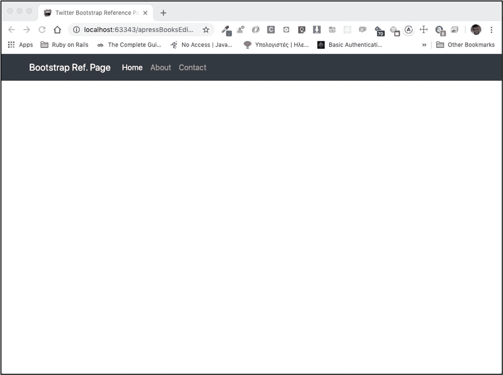

图 4-12

起始页

## 添加下拉菜单

现在你将学习如何添加一个下拉菜单，如下所示(图 4-13 )。

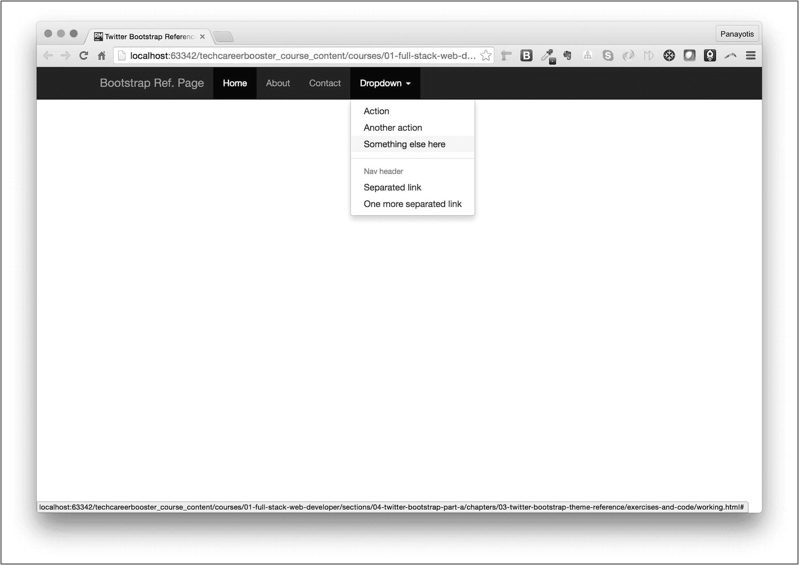

图 4-13

带有下拉菜单的页面

这很容易。必须在菜单项目列表中添加额外的`li`项目。这个新的`li`项目需要包含另一个列表，这将是下拉菜单中的选项列表，如下所示(列表 4-3 )。

```html
<!DOCTYPE html>
<html lang="en">
<head>
    <!-- Required meta tags -->
    <meta charset="utf-8">
    <meta name="viewport" content="width=device-width, initial-scale=1, shrink-to-fit=no">

    <!-- Bootstrap CSS -->
    <link rel="stylesheet" href="https://stackpath.bootstrapcdn.com/bootstrap/4.4.1/css/bootstrap.min.css" integrity="sha384-Vkoo8x4CGsO3+Hhxv8T/Q5PaXtkKtu6ug5TOeNV6gBiFeWPGFN9MuhOf23Q9Ifjh" crossorigin="anonymous">

    <!-- Custom CSS -->
    <link rel="stylesheet" href="stylesheets/main.css" type="text/css">

    <title>Twitter Bootstrap Reference Page</title>
</head>
<body>
    <nav class="navbar navbar-expand-lg navbar-dark bg-dark fixed-top">
        <div class="container">
            <a class="navbar-brand" href="#">Bootstrap Ref. Page</a>

            <button type="button" class="navbar-toggler" data-toggle="collapse" data-target="#navbar"
                    aria-controls="navbar"
                    aria-expanded="false"
                    aria-label="Toggle navigation">
                <span class="navbar-toggler-icon"></span>
            </button>

            <div class="collapse navbar-collapse" id="navbar">
                <ul class="nav navbar-nav">
                    <li class="nav-item">
                        <a class="nav-link active" href="#">Home <span class="sr-only">(current)</span></a>
                    </li>
                    <li class="nav-item">
                        <a class="nav-link" href="#about">About</a>
                    </li>
                    <li class="nav-item">
                        <a class="nav-link" href="#contact">Contact</a>
                    </li>

                    <!-- Drop down Menu -->
                    <li class="nav-item dropdown">
                        <a href="#"
                           class="nav-link dropdown-toggle"
                           data-toggle="dropdown">
                            Dropdown <span class="caret"></span>
                        </a>
                        <div class="dropdown-menu">
                            <a href="#" class="dropdown-item">Action</a>
                            <a href="#" class="dropdown-item">Another action</a>
                            <a href="#" class="dropdown-item">Something else here</a>
                            <div class="dropdown-divider"></div>
                            <div class="dropdown-header">Nav header</div>
                            <a href="#" class="dropdown-item">Separated link</a>
                            <a href="#" class="dropdown-item">One more separated link</a>

                        </div>
                    </li>
                </ul>
            </div>
        </div>
    </nav>

    <!-- Optional JavaScript -->
    <!-- jQuery first, then Popper.js, then Bootstrap JS -->
    <script src="https://code.jquery.com/jquery-3.4.1.slim.min.js" integrity="sha384-J6qa4849blE2+poT4WnyKhv5vZF5SrPo0iEjwBvKU7imGFAV0wwj1yYfoRSJoZ+n" crossorigin="anonymous"></script>
    <script src="https://cdn.jsdelivr.net/npm/popper.js@1.16.0/dist/umd/popper.min.js" integrity="sha384-Q6E9RHvbIyZFJoft+2mJbHaEWldlvI9IOYy5n3zV9zzTtmI3UksdQRVvoxMfooAo" crossorigin="anonymous"></script>
    <script src="https://stackpath.bootstrapcdn.com/bootstrap/4.4.1/js/bootstrap.min.js" integrity="sha384-wfSDF2E50Y2D1uUdj0O3uMBJnjuUD4Ih7YwaYd1iqfktj0Uod8GCExl3Og8ifwB6" crossorigin="anonymous"></script>
</body>
</html>

Listing 4-3Dropdown Menu in the Navigation Bar

```

如果您保存前面的代码并在浏览器上加载页面，您将在最右边看到新的下拉菜单。

让我们对用于构建下拉菜单的代码做一些说明(清单 4-4 )。

1.  将作为下拉菜单的列表项(`li`)需要有类`dropdown`。

2.  下拉列表项文本，在我们的例子中是`Dropdown`，需要被包装到一个锚< `a>` HTML 元素中。这将使指针改变，当用户悬停在它上面。请注意，锚点需要具有与`dropdown`相等的`dropdown-toggle`类和`data-toggle`属性。

3.  下拉菜单的选项列表可以在`div`中给出。

4.  `div`需要有类`dropdown-menu`。

5.  每个菜单选项都有一个锚`a`，锚的类别是`dropdown-item`。

6.  如果你想在菜单项之间创建一条线作为分隔线，你可以在类`divider`中使用一个特殊的空`div`。

7.  你也可以使用另一个特殊的`div`作为子菜单标题，它实际上并不是用户选项的一部分，也就是说，不能点击和选择。如果 div 有类`dropdown-header`，就可以做到这一点。

```html
  <!-- Drop down Menu -->
  <li class="nav-item dropdown">
    <a href="#"
      class="nav-link dropdown-toggle"
      data-toggle="dropdown">
      Dropdown
    </a>
    <div class="dropdown-menu">
      <a href="#" class="dropdown-item">Action</a>
      <a href="#" class="dropdown-item">Another action</a>
      <a href="#" class="dropdown-item">Something else here</a>
      <div class="dropdown-divider"></div>
      <div class="dropdown-header">Nav header</div>
      <a href="#" class="dropdown-item">Separated link</a>
      <a href="#" class="dropdown-item">One more separated link</a>
    </div>
  </li>

Listing 4-4Looking into the Details of the Dropdown Menu

```

## （电视机的）超大屏幕

Twitter Bootstrap 允许你创建超大屏幕，用很大的字体显示信息、标题或两者。让我们这样做:

1.  在`nav`之后，您将创建一个`.container div`来包含页面的内容。

2.  您创建的第一个东西是一个带有类`.jumbotron`的 div。

让我们来看看清单 4-5 中带有大屏幕的页面。

```html
<!DOCTYPE html>
<html lang="en">
<head>
    <!-- Required meta tags -->
    <meta charset="utf-8">
    <meta name="viewport" content="width=device-width, initial-scale=1, shrink-to-fit=no">

    <!-- Bootstrap CSS -->
    <link rel="stylesheet" href="https://stackpath.bootstrapcdn.com/bootstrap/4.4.1/css/bootstrap.min.css" integrity="sha384-Vkoo8x4CGsO3+Hhxv8T/Q5PaXtkKtu6ug5TOeNV6gBiFeWPGFN9MuhOf23Q9Ifjh" crossorigin="anonymous">

    <!-- Custom CSS -->
    <link rel="stylesheet" href="stylesheets/main.css" type="text/css">

    <title>Twitter Bootstrap Reference Page</title>
</head>
<body>
    <nav class="navbar navbar-expand-lg navbar-dark bg-dark fixed-top">
        <div class="container">
            <a class="navbar-brand" href="#">Bootstrap Ref. Page</a>

            <button type="button" class="navbar-toggler" data-toggle="collapse" data-target="#navbar"
                    aria-controls="navbar"
                    aria-expanded="false"
                    aria-label="Toggle navigation">
                <span class="navbar-toggler-icon"></span>
            </button>

            <div class="collapse navbar-collapse" id="navbar">
                <ul class="nav navbar-nav">
                    <li class="nav-item">
                        <a class="nav-link active" href="#">Home <span class="sr-only">(current)</span></a>
                    </li>
                    <li class="nav-item">
                        <a class="nav-link" href="#about">About</a>
                    </li>
                    <li class="nav-item">
                        <a class="nav-link" href="#contact">Contact</a>
                    </li>

                    <!-- Drop down Menu -->
                    <li class="nav-item dropdown">
                        <a href="#"
                           class="nav-link dropdown-toggle"
                           data-toggle="dropdown">
                            Dropdown
                        </a>
                        <div class="dropdown-menu">
                            <a href="#" class="dropdown-item">Action</a>
                            <a href="#" class="dropdown-item">Another action</a>
                            <a href="#" class="dropdown-item">Something else here</a>
                            <div class="dropdown-divider"></div>
                            <div class="dropdown-header">Nav header</div>
                            <a href="#" class="dropdown-item">Separated link</a>
                            <a href="#" class="dropdown-item">One more separated link</a>
                        </div>
                    </li>
                </ul>
            </div>
        </div>
    </nav>

    <!-- main content container -->
    <div class="container">
        <div class="jumbotron">
            <h1>Jumbotron</h1>
            <p class="lead">
                Lorem ipsum dolor sit amet, consectetur adipiscing elit, sed do eiusmod tempor incididunt ut labore et dolore magna aliqua. Ut enim ad minim veniam, quis nostrud
                exercitation ullamco laboris nisi ut aliquip ex ea commodo consequat. Duis aute irure dolor in reprehenderit in voluptate velit esse cillum dolore eu fugiat nulla
                pariatur. Excepteur sint occaecat cupidatat non proident, sunt in culpa qui officia deserunt mollit anim id est laborum.
            </p>
        </div>
    </div>
    <!-- end of main content container -->

    <!-- Optional JavaScript -->
    <!-- jQuery first, then Popper.js, then Bootstrap JS -->
    <script src="https://code.jquery.com/jquery-3.4.1.slim.min.js" integrity="sha384-J6qa4849blE2+poT4WnyKhv5vZF5SrPo0iEjwBvKU7imGFAV0wwj1yYfoRSJoZ+n" crossorigin="anonymous"></script>
    <script src="https://cdn.jsdelivr.net/npm/popper.js@1.16.0/dist/umd/popper.min.js" integrity="sha384-Q6E9RHvbIyZFJoft+2mJbHaEWldlvI9IOYy5n3zV9zzTtmI3UksdQRVvoxMfooAo" crossorigin="anonymous"></script>
    <script src="https://stackpath.bootstrapcdn.com/bootstrap/4.4.1/js/bootstrap.min.js" integrity="sha384-wfSDF2E50Y2D1uUdj0O3uMBJnjuUD4Ih7YwaYd1iqfktj0Uod8GCExl3Og8ifwB6" crossorigin="anonymous"></script>
</body>
</html>

Listing 4-5Page with Jumbotron

```

在您将该页面保存并加载到浏览器之前，请确保您的`stylesheets/main.css`文件包含以下内容(列表 4-6 )。

```html
body {
    padding-top: 70px;
          padding-bottom: 70px;
}

Listing 4-6CSS File for Listing 4-5

```

如果您这样做并保存您的页面，您将在浏览器上看到以下内容(图 4-14 )。

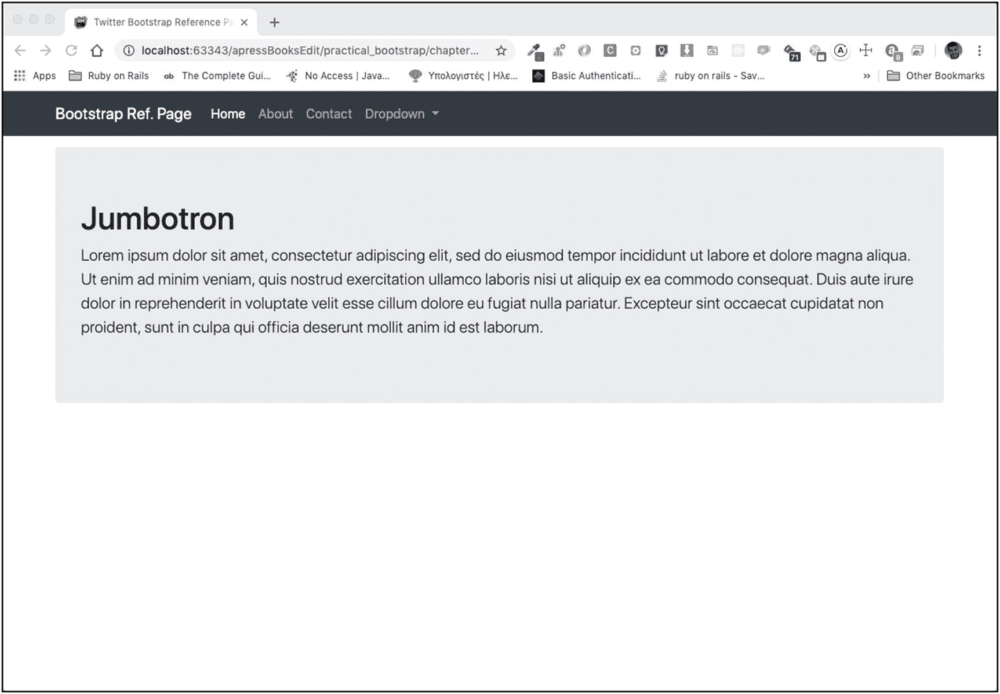

图 4-14

带有标题和引导段落的大屏幕

请注意，导航栏底部和大屏幕顶部之间的空间是由`main.css`文件中的`padding-top`规则创建的。

这里的方法非常简单。我们使用类`jumbotron`来表示`div`。我们也使用标题`h1`作为大屏幕内的标题文本。

最后，在前一章中，我们已经看到了应用在`p`元素上的类`lead`使文本突出。

## 带水平线的页眉:页眉

有时候你想创建一个标题，也就是一段像标题一样突出的文本，例如`h1`或`h2`，在它下面是一条水平线。

您可以在您的`h1`元素下面的`hr`元素的帮助下快速完成这项工作。添加以下内容作为主内容容器中的最后一个元素(清单 4-7 )。

```html
<h1>Page Header</h1>
<hr class="my-4">

Listing 4-7How to Have a Header with a Horizontal Line Below It

```

如果你保存并重新加载你的页面，你应该会得到如下的结果(图 4-15 )。

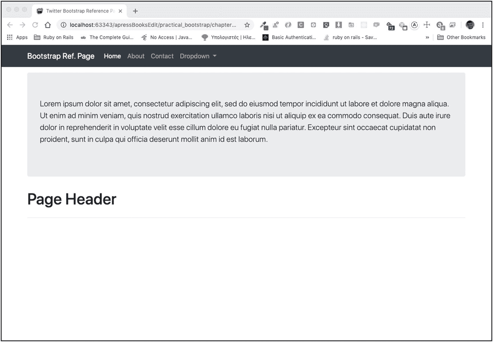

图 4-15

带水平线的页眉

您已经在类`my-4`中使用了`hr`元素。这门课是怎么回事？这是 Bootstrap 调用的实用程序类之一。这个特殊的元素属于*间距*类别，它与它所附着的元素的边距和填充有关。特别

*   前缀`m`代表边距。因此，在您的示例中，您对`hr`元素应用了一些边距。

*   `y`指的是垂直 y 轴。本质上，它是关于元素的顶部和底部。因此，在您的示例中，您对`hr`元素应用了一些顶部和底部边距。

*   数字`4`是尺寸。尺寸可以是一个
    *   0:将边距或填充的大小设置为 0

    *   1:将尺寸设置为`0.25`乘以`$spacer`尺寸(`$spacer * 0.25`)

    *   2:将尺寸设置为`0.5`乘以`$spacer`尺寸(`$spacer * 0.5`)

    *   3:将尺寸设置为等于`$spacer`尺寸

    *   4:将尺寸设置为`1.5`乘以`$spacer`尺寸(`$spacer * 1.5`)

    *   5:将尺寸设置为`3`乘以`$spacer`尺寸(`$spacer * 3`)

    *   `Auto`:自动设置尺寸(仅适用于页边距)

好的！坚持住。什么是`$spacer`？`$spacer`是一个 [Sass(语法超棒的样式表)](https://sass-lang.com/)变量。注意 Bootstrap 是用 Sass 编写的，然后被编译成实际的 CSS。`$spacer`变量的默认值是`1rem`。

如果这太复杂，除了玩和尝试之外，没有其他方法来澄清它。还有，你最好的朋友是你浏览器的开发者工具。

例如，在大屏幕页面上打开开发者工具，找到元素`hr`。看看上边距和下边距是如何设置的，这要感谢附加在它上面的`my-4`类(图 4-16 )。

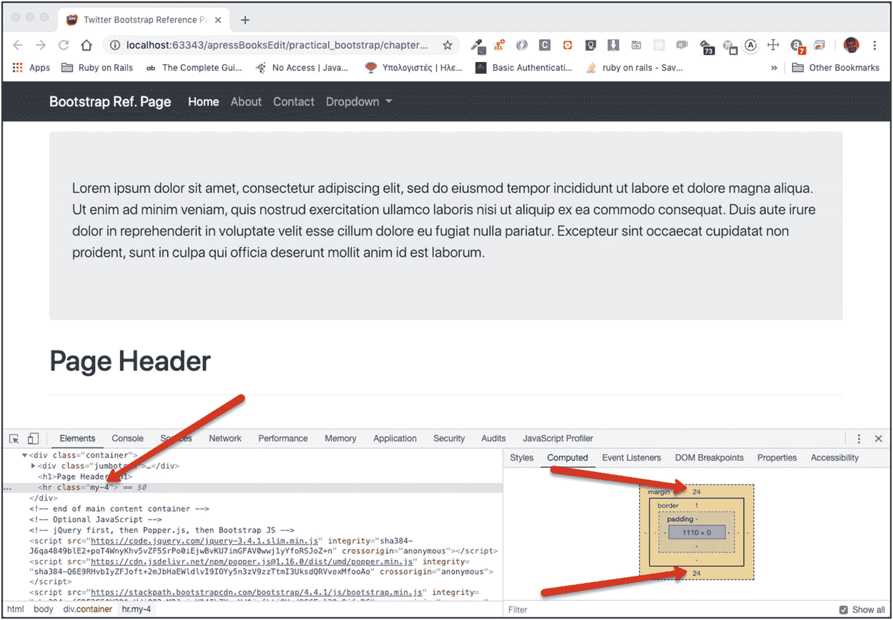

图 4-16

24px 的利润顶部和底部，感谢`my-4`

为什么是`24px`？这是因为`my-4`上的`4`被解释为`$spacer * 1.5`，又因为`$spacer`是`1rem`，我们最后得到`1.5rem`。您还可以看到，如果您将开发人员工具的选定选项卡切换到样式，而不是计算的(图 4-17 )。

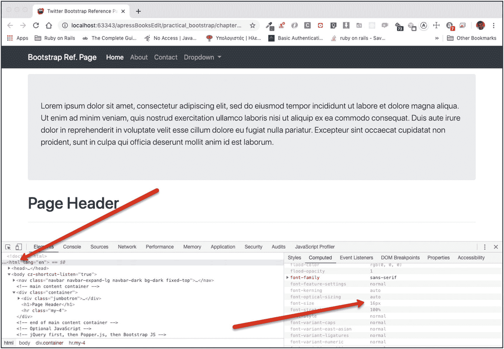

图 4-18

根元素的字体大小为 16px

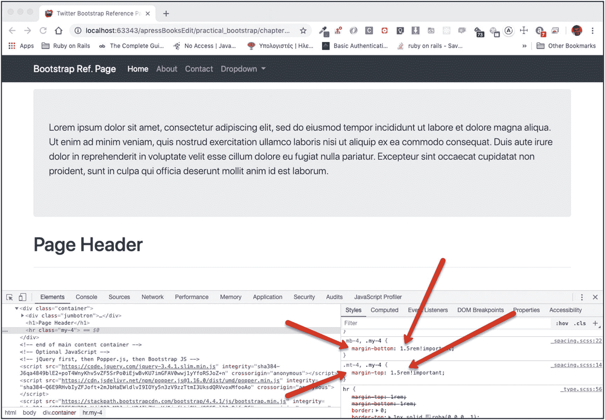

图 4-17

my-4 提供 1.5 雷姆的顶部和底部边距

还有为什么`1.5rem`计算出来是`24px`？`rem`是一个 CSS 单元，它计算一个元素相对于页面根元素的`font-size`的大小，即`html`元素的大小。如果您使用开发工具检查`html`元素的`font-size`属性，您将看到它的大小等于`16px`(图 4-18 )。

因此，`16px * 1.5`计算为`24px`。

Note

我做了一个小小的偏离来讨论 CSS 单元以及它们如何在 HTML 文档中使用。这不是 Twitter Bootstrap 的一部分。你可以在我的书[掌握 HTML & CSS](https://leanpub.com/master-html-and-css) 中了解更多关于 HTML 和 CSS 的知识。

## 小跟班

现在，您将学习如何创建按钮:

1.  所有按钮都应该有类`btn`。

2.  然后，您可以应用一个处理按钮颜色的类:
    1.  `btn-default`

    2.  `btn-primary`

    3.  `btn-secondary`

    4.  `btn-success`

    5.  `btn-danger`

    6.  `btn-warning`

    7.  `btn-info`

    8.  `btn-light`

    9.  `btn-dark`

3.  除了颜色，你还可以应用一个类来把一个按钮变成一个链接:`btn-link`。

4.  或者您可以在类名中插入`*-outline-*`这个词，以便为透明的背景色按钮设计一个边框，例如`btn-outline-primary`。

5.  然后，您可以使用相应的类来指定按钮的大小:

6.  `btn-lg`对于大按钮。

7.  不要为正常大小的按钮指定类。

8.  `btn-sm`用于小按钮。

9.  `btn-block`适用于跨越整个可用宽度的区块。

让我们看看实际情况。清单 4-8 是你的页面现在应该有的代码。

```html
<!DOCTYPE html>
<html lang="en">
<head>
    <!-- Required meta tags -->
    <meta charset="utf-8">
    <meta name="viewport" content="width=device-width, initial-scale=1, shrink-to-fit=no">

    <!-- Bootstrap CSS -->
    <link rel="stylesheet" href="https://stackpath.bootstrapcdn.com/bootstrap/4.4.1/css/bootstrap.min.css" integrity="sha384-Vkoo8x4CGsO3+Hhxv8T/Q5PaXtkKtu6ug5TOeNV6gBiFeWPGFN9MuhOf23Q9Ifjh" crossorigin="anonymous">

    <!-- Custom CSS -->
    <link rel="stylesheet" href="stylesheets/main.css" type="text/css">

    <title>Twitter Bootstrap Reference Page</title>
</head>
<body>
    <nav class="navbar navbar-expand-lg navbar-dark bg-dark fixed-top">
        <div class="container">
            <a class="navbar-brand" href="#">Bootstrap Ref. Page</a>

            <button type="button" class="navbar-toggler" data-toggle="collapse" data-target="#navbar"
                    aria-controls="navbar"
                    aria-expanded="false"
                    aria-label="Toggle navigation">
                <span class="navbar-toggler-icon"></span>
            </button>

            <div class="collapse navbar-collapse" id="navbar">
                <ul class="nav navbar-nav">
                    <li class="nav-item">
                        <a class="nav-link active" href="#">Home <span class="sr-only">(current)</span></a>
                    </li>
                    <li class="nav-item">
                        <a class="nav-link" href="#about">About</a>
                    </li>
                    <li class="nav-item">
                        <a class="nav-link" href="#contact">Contact</a>
                    </li>

                    <!-- Drop down Menu -->
                    <li class="nav-item dropdown">
                        <a href="#"
                           class="nav-link dropdown-toggle"
                           data-toggle="dropdown">
                            Dropdown
                        </a>
                        <div class="dropdown-menu">
                            <a href="#" class="dropdown-item">Action</a>
                            <a href="#" class="dropdown-item">Another action</a>
                            <a href="#" class="dropdown-item">Something else here</a>
                            <div class="dropdown-divider"></div>
                            <div class="dropdown-header">Nav header</div>
                            <a href="#" class="dropdown-item">Separated link</a>
                            <a href="#" class="dropdown-item">One more separated link</a>
                        </div>
                    </li>
                </ul>
            </div>
        </div>
    </nav>

    <!-- main content container -->
    <div class="container">
        <div class="jumbotron">
            <p class="lead">
                Lorem ipsum dolor sit amet, consectetur adipiscing elit, sed do eiusmod tempor incididunt ut labore et dolore magna aliqua. Ut enim ad minim veniam, quis nostrud
                exercitation ullamco laboris nisi ut aliquip ex ea commodo consequat. Duis aute irure dolor in reprehenderit in voluptate velit esse cillum dolore eu fugiat nulla
                pariatur. Excepteur sint occaecat cupidatat non proident, sunt in culpa qui officia deserunt mollit anim id est laborum.
            </p>
        </div>

        <h1>Buttons</h1>
        <hr class="my-4">

        <h2>Small Sizes</h2>
        <p>
            <button type="button" class="btn btn-sm btn-primary">btn btn-sm btn-primary</button>
            <button type="button" class="btn btn-sm btn-secondary">btn btn-sm btn-secondary</button>
            <button type="button" class="btn btn-sm btn-success">btn btn-sm btn-success</button>
            <button type="button" class="btn btn-sm btn-danger">btn btn-sm btn-danger</button>
            <button type="button" class="btn btn-sm btn-warning">btn btn-sm btn-warning</button>
            <button type="button" class="btn btn-sm btn-info">btn btn-sm btn-info</button>
            <button type="button" class="btn btn-sm btn-light">btn btn-sm btn-light</button>
            <button type="button" class="btn btn-sm btn-dark">btn btn-sm btn-dark</button>
            <button type="button" class="btn btn-sm btn-link">btn btn-sm btn-link</button>
        </p>

        <h2>Normal Sizes</h2>
        <p>
            <button type="button" class="btn btn-primary">btn btn-primary</button>
            <button type="button" class="btn btn-secondary">btn btn-secondary</button>
            <button type="button" class="btn btn-success">btn btn-success</button>
            <button type="button" class="btn btn-danger">btn btn-danger</button>
            <button type="button" class="btn btn-warning">btn btn-warning</button>
            <button type="button" class="btn btn-info">btn btn-info</button>
            <button type="button" class="btn btn-light">btn btn-light</button>
            <button type="button" class="btn btn-dark">btn btn-dark</button>
            <button type="button" class="btn btn-link">btn btn-link</button>
        </p>

        <h2>Large Sizes</h2>
        <p>
            <button type="button" class="btn btn-lg btn-primary">btn btn-lg btn-primary</button>
            <button type="button" class="btn btn-lg btn-secondary">btn btn-lg btn-secondary</button>
            <button type="button" class="btn btn-lg btn-success">btn btn-lg btn-success</button>
            <button type="button" class="btn btn-lg btn-danger">btn btn-lg btn-danger</button>
            <button type="button" class="btn btn-lg btn-warning">btn btn-lg btn-warning</button>
            <button type="button" class="btn btn-lg btn-info">btn btn-lg btn-info</button>
            <button type="button" class="btn btn-lg btn-light">btn btn-lg btn-light</button>
            <button type="button" class="btn btn-lg btn-dark">btn btn-lg btn-dark</button>
            <button type="button" class="btn btn-lg btn-link">btn btn-lg btn-link</button>
        </p>

        <h2>Block Sizes</h2>
        <p>
            <button type="button" class="btn btn-block btn-primary">btn btn-block btn-primary</button>
            <button type="button" class="btn btn-block btn-secondary">btn btn-block btn-secondary</button>
            <button type="button" class="btn btn-block btn-success">btn btn-block btn-success</button>
            <button type="button" class="btn btn-block btn-danger">btn btn-block btn-danger</button>
            <button type="button" class="btn btn-block btn-warning">btn btn-block btn-warning</button>
            <button type="button" class="btn btn-block btn-info">btn btn-block btn-info</button>
            <button type="button" class="btn btn-block btn-light">btn btn-block btn-light</button>
            <button type="button" class="btn btn-block btn-dark">btn btn-block btn-dark</button>
            <button type="button" class="btn btn-block btn-link">btn btn-block btn-link</button>
        </p>

        <h2>Outline buttons (Normal Sizes)</h2>
        <p>
            <button type="button" class="btn btn-outline-primary">btn btn-outline-primary</button>
            <button type="button" class="btn btn-outline-secondary">btn btn-outline-secondary</button>
            <button type="button" class="btn btn-outline-success">btn btn-outline-success</button>
            <button type="button" class="btn btn-outline-danger">btn btn-outline-danger</button>
            <button type="button" class="btn btn-outline-warning">btn btn-outline-warning</button>
            <button type="button" class="btn btn-outline-info">btn btn-outline-info</button>
            <button type="button" class="btn btn-outline-light">btn btn-outline-light</button>
            <button type="button" class="btn btn-outline-dark">btn btn-outline-dark</button>
            <button type="button" class="btn btn-outline-link">btn btn-outline-link</button>
        </p>
    </div>
    <!-- end of main content container -->

    <!-- Optional JavaScript -->
    <!-- jQuery first, then Popper.js, then Bootstrap JS -->
    <script src="https://code.jquery.com/jquery-3.4.1.slim.min.js" integrity="sha384-J6qa4849blE2+poT4WnyKhv5vZF5SrPo0iEjwBvKU7imGFAV0wwj1yYfoRSJoZ+n" crossorigin="anonymous"></script>
    <script src="https://cdn.jsdelivr.net/npm/popper.js@1.16.0/dist/umd/popper.min.js" integrity="sha384-Q6E9RHvbIyZFJoft+2mJbHaEWldlvI9IOYy5n3zV9zzTtmI3UksdQRVvoxMfooAo" crossorigin="anonymous"></script>
    <script src="https://stackpath.bootstrapcdn.com/bootstrap/4.4.1/js/bootstrap.min.js" integrity="sha384-wfSDF2E50Y2D1uUdj0O3uMBJnjuUD4Ih7YwaYd1iqfktj0Uod8GCExl3Og8ifwB6" crossorigin="anonymous"></script>
</body>
</html>

Listing 4-8Page Demonstrating Buttons

```

正如您在前面的代码中看到的，这是一系列 header `h2`和`p`元素，它们适用于我前面谈到的所有类的组合。

保存文件并在浏览器上重新加载页面。你会看到类似下面的东西(图 4-19 )。

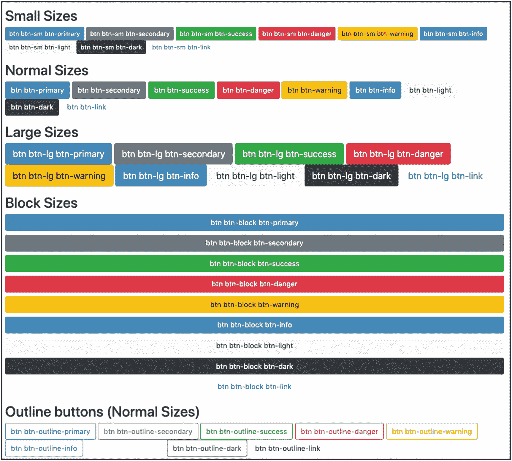

图 4-19

页面演示按钮

在这个页面上，您可以看到每个按钮是如何根据您应用的 Twitter Bootstrap 按钮类显示的。这真的令人印象深刻，因为没有一行 CSS 代码，你就可以免费获得如此多的功能。你只需要学习各种 Twitter 引导类。

## 桌子

你已经学习了表格以及如何用它们来显示表格数据(从我的【HTML 大师& CSS 的书中)。Twitter Bootstrap 附带了一些关于如何设计表格样式的有用类。让我们看看怎么做。

### 基本引导表

让我们从一个没有应用任何 Twitter 引导类的表开始。所以它只有默认的样式。

您继续在主容器的末尾追加内容。然而，清单 4-9 有完整的 HTML 代码。

```html
<!DOCTYPE html>
<html lang="en">
<head>
    <!-- Required meta tags -->
    <meta charset="utf-8">
    <meta name="viewport" content="width=device-width, initial-scale=1, shrink-to-fit=no">

    <!-- Bootstrap CSS -->
    <link rel="stylesheet" href="https://stackpath.bootstrapcdn.com/bootstrap/4.4.1/css/bootstrap.min.css" integrity="sha384-Vkoo8x4CGsO3+Hhxv8T/Q5PaXtkKtu6ug5TOeNV6gBiFeWPGFN9MuhOf23Q9Ifjh" crossorigin="anonymous">

    <!-- Custom CSS -->
    <link rel="stylesheet" href="stylesheets/main.css" type="text/css">

    <title>Twitter Bootstrap Reference Page</title>
</head>
<body>
    <nav class="navbar navbar-expand-lg navbar-dark bg-dark fixed-top">
        <div class="container">
            <a class="navbar-brand" href="#">Bootstrap Ref. Page</a>

            <button type="button" class="navbar-toggler" data-toggle="collapse" data-target="#navbar"
                    aria-controls="navbar"
                    aria-expanded="false"
                    aria-label="Toggle navigation">
                <span class="navbar-toggler-icon"></span>
            </button>

            <div class="collapse navbar-collapse" id="navbar">
                <ul class="nav navbar-nav">
                    <li class="nav-item">
                        <a class="nav-link active" href="#">Home <span class="sr-only">(current)</span></a>
                    </li>
                    <li class="nav-item">
                        <a class="nav-link" href="#about">About</a>
                    </li>
                    <li class="nav-item">
                        <a class="nav-link" href="#contact">Contact</a>
                    </li>

                    <!-- Drop down Menu -->
                    <li class="nav-item dropdown">
                        <a href="#"
                           class="nav-link dropdown-toggle"
                           data-toggle="dropdown">
                            Dropdown
                        </a>
                        <div class="dropdown-menu">
                            <a href="#" class="dropdown-item">Action</a>
                            <a href="#" class="dropdown-item">Another action</a>
                            <a href="#" class="dropdown-item">Something else here</a>
                            <div class="dropdown-divider"></div>
                            <div class="dropdown-header">Nav header</div>
                            <a href="#" class="dropdown-item">Separated link</a>
                            <a href="#" class="dropdown-item">One more separated link</a>
                        </div>
                    </li>
                </ul>
            </div>
        </div>
    </nav>

    <!-- main content container -->
    <div class="container">
        <div class="jumbotron">
            <p class="lead">
                Lorem ipsum dolor sit amet, consectetur adipiscing elit, sed do eiusmod tempor incididunt ut labore et dolore magna aliqua. Ut enim ad minim veniam, quis nostrud
                exercitation ullamco laboris nisi ut aliquip ex ea commodo consequat. Duis aute irure dolor in reprehenderit in voluptate velit esse cillum dolore eu fugiat nulla
                pariatur. Excepteur sint occaecat cupidatat non proident, sunt in culpa qui officia deserunt mollit anim id est laborum.
            </p>
        </div>

        <h1>Buttons</h1>
        <hr class="my-4">

        <h2>Small Sizes</h2>
        <p>
            <button type="button" class="btn btn-sm btn-primary">btn btn-sm btn-primary</button>
            <button type="button" class="btn btn-sm btn-secondary">btn btn-sm btn-secondary</button>
            <button type="button" class="btn btn-sm btn-success">btn btn-sm btn-success</button>
            <button type="button" class="btn btn-sm btn-danger">btn btn-sm btn-danger</button>
            <button type="button" class="btn btn-sm btn-warning">btn btn-sm btn-warning</button>
            <button type="button" class="btn btn-sm btn-info">btn btn-sm btn-info</button>
            <button type="button" class="btn btn-sm btn-light">btn btn-sm btn-light</button>
            <button type="button" class="btn btn-sm btn-dark">btn btn-sm btn-dark</button>
            <button type="button" class="btn btn-sm btn-link">btn btn-sm btn-link</button>
        </p>

        <h2>Normal Sizes</h2>
        <p>
            <button type="button" class="btn btn-primary">btn btn-primary</button>
            <button type="button" class="btn btn-secondary">btn btn-secondary</button>
            <button type="button" class="btn btn-success">btn btn-success</button>
            <button type="button" class="btn btn-danger">btn btn-danger</button>
            <button type="button" class="btn btn-warning">btn btn-warning</button>
            <button type="button" class="btn btn-info">btn btn-info</button>
            <button type="button" class="btn btn-light">btn btn-light</button>
            <button type="button" class="btn btn-dark">btn btn-dark</button>
            <button type="button" class="btn btn-link">btn btn-link</button>
        </p>

        <h2>Large Sizes</h2>
        <p>
            <button type="button" class="btn btn-lg btn-primary">btn btn-lg btn-primary</button>
            <button type="button" class="btn btn-lg btn-secondary">btn btn-lg btn-secondary</button>
            <button type="button" class="btn btn-lg btn-success">btn btn-lg btn-success</button>
            <button type="button" class="btn btn-lg btn-danger">btn btn-lg btn-danger</button>
            <button type="button" class="btn btn-lg btn-warning">btn btn-lg btn-warning</button>
            <button type="button" class="btn btn-lg btn-info">btn btn-lg btn-info</button>
            <button type="button" class="btn btn-lg btn-light">btn btn-lg btn-light</button>
            <button type="button" class="btn btn-lg btn-dark">btn btn-lg btn-dark</button>
            <button type="button" class="btn btn-lg btn-link">btn btn-lg btn-link</button>
        </p>

        <h2>Block Sizes</h2>
        <p>
            <button type="button" class="btn btn-block btn-primary">btn btn-block btn-primary</button>
            <button type="button" class="btn btn-block btn-secondary">btn btn-block btn-secondary</button>
            <button type="button" class="btn btn-block btn-success">btn btn-block btn-success</button>
            <button type="button" class="btn btn-block btn-danger">btn btn-block btn-danger</button>
            <button type="button" class="btn btn-block btn-warning">btn btn-block btn-warning</button>
            <button type="button" class="btn btn-block btn-info">btn btn-block btn-info</button>
            <button type="button" class="btn btn-block btn-light">btn btn-block btn-light</button>
            <button type="button" class="btn btn-block btn-dark">btn btn-block btn-dark</button>
            <button type="button" class="btn btn-block btn-link">btn btn-block btn-link</button>
        </p>

        <h2>Outline buttons (Normal Sizes)</h2>
        <p>
            <button type="button" class="btn btn-outline-primary">btn btn-outline-primary</button>
            <button type="button" class="btn btn-outline-secondary">btn btn-outline-secondary</button>
            <button type="button" class="btn btn-outline-success">btn btn-outline-success</button>
            <button type="button" class="btn btn-outline-danger">btn btn-outline-danger</button>
            <button type="button" class="btn btn-outline-warning">btn btn-outline-warning</button>
            <button type="button" class="btn btn-outline-info">btn btn-outline-info</button>
            <button type="button" class="btn btn-outline-light">btn btn-outline-light</button>
            <button type="button" class="btn btn-outline-dark">btn btn-outline-dark</button>
            <button type="button" class="btn btn-outline-link">btn btn-outline-link</button>
        </p>

        <h1>Tables</h1>
        <hr class="my-4">

        <h2>Shopping List</h2>
        <table>
            <tr><th colspan="2">Shopping List</th></tr>
            <tr><th>Item</th><th>Qt</th></tr>
            <tr><td>Cheese</td><td>1 kgr</td></tr>
            <tr><td>Rice</td><td>1.5 kgr</td></tr>
            <tr><td>Coffee</td><td>0.5 kgr</td></tr>
            <tr><td>Milk</td><td>1 ltr</td></tr>
            <tr><td>Wine</td><td>1 btl</td></tr>
        </table>

        <h2>Travel Plan</h2>
        <table>
            <tr><th colspan="2">Travel Plan</th></tr>
            <tr><th>Action</th><th>Due</th></tr>
            <tr><td>Book Ticket</td><td>Feb 20th</td></tr>
            <tr><td>Book Hotel</td><td>March 26th</td></tr>
            <tr><td>Buy Suitcase</td><td>April 20th</td></tr>
            <tr><td>Get Passport</td><td>April 30th</td></tr>
        </table>
    </div>
    <!-- end of main content container -->

    <!-- Optional JavaScript -->
    <!-- jQuery first, then Popper.js, then Bootstrap JS -->
    <script src="https://code.jquery.com/jquery-3.4.1.slim.min.js" integrity="sha384-J6qa4849blE2+poT4WnyKhv5vZF5SrPo0iEjwBvKU7imGFAV0wwj1yYfoRSJoZ+n" crossorigin="anonymous"></script>
    <script src="https://cdn.jsdelivr.net/npm/popper.js@1.16.0/dist/umd/popper.min.js" integrity="sha384-Q6E9RHvbIyZFJoft+2mJbHaEWldlvI9IOYy5n3zV9zzTtmI3UksdQRVvoxMfooAo" crossorigin="anonymous"></script>
    <script src="https://stackpath.bootstrapcdn.com/bootstrap/4.4.1/js/bootstrap.min.js" integrity="sha384-wfSDF2E50Y2D1uUdj0O3uMBJnjuUD4Ih7YwaYd1iqfktj0Uod8GCExl3Og8ifwB6" crossorigin="anonymous"></script>
</body>
</html>

Listing 4-9Full HTML Code, Includes a New Table Demo

```

正如您在前面的代码中看到的，您只添加了两个简单的`table`元素。如果您保存它并重新加载页面，您将会看到以下内容(图 4-20 )。

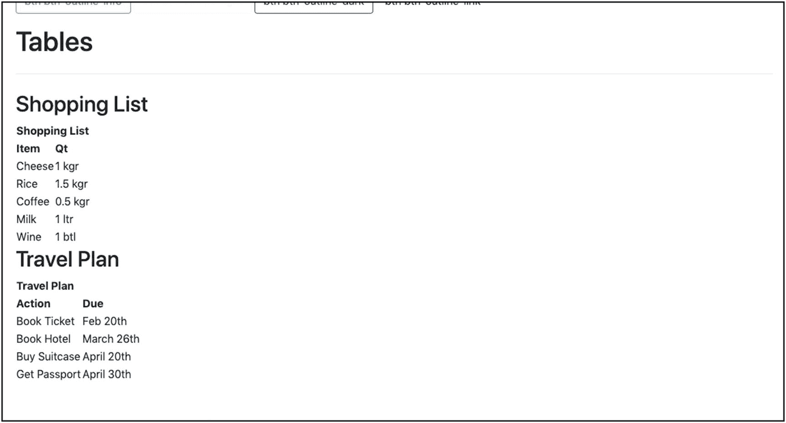

图 4-20

没有任何额外造型的桌子

### 样式引导表

让我们尝试应用一些 Twitter 引导类来设计它。如果您只将类`table`应用于`table`元素，那么您不用太费力就能得到一个不错的例子。就这么办吧。而不只是

```html
<table>

```

写

```html
<table class="table">

```

如果你在浏览器上重新加载页面，你会看到表格显示得非常好(图 4-21 )。

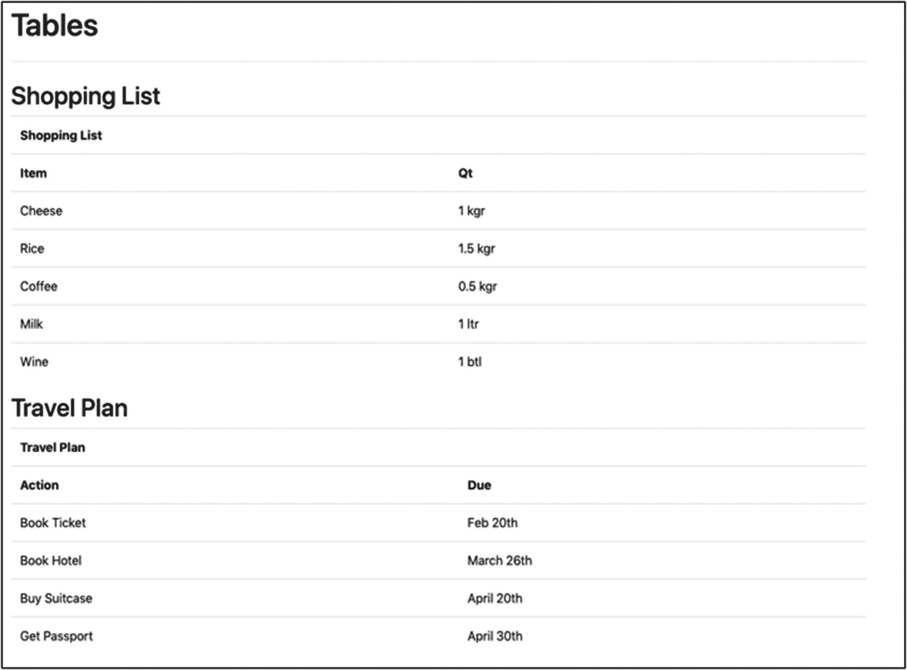

图 4-21

仅包含“table”类的表

```html
Pretty cool! Eh?

```

除了`table`类，您还可以在表上尝试更多的类。尝试将类`table-striped`附加到第一个表上，将类`table-bordered`附加到第二个表上。所以不要

```html
<table class="table">

```

转到

```html
<table class="table table-striped">

```

对于第一个表和

```html
<table class="table table-bordered">

```

第二桌。

如果您保存并重新加载您的页面，您将看到以下内容(图 4-22 )。

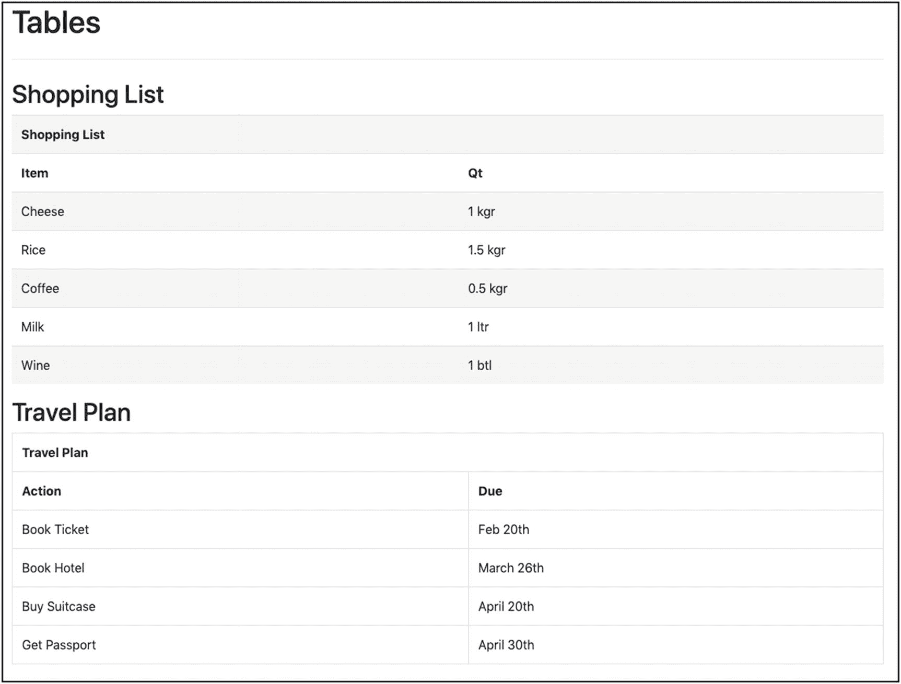

图 4-22

条纹和镶边的桌子

类使表格有条纹，一行是深色背景，下一行是亮色背景。`table-bordered`类给表格添加边框。

你绝对可以组合表类。例如，尝试第二个表的`table table-striped table-bordered`。您将得到以下结果(图 4-23 )。

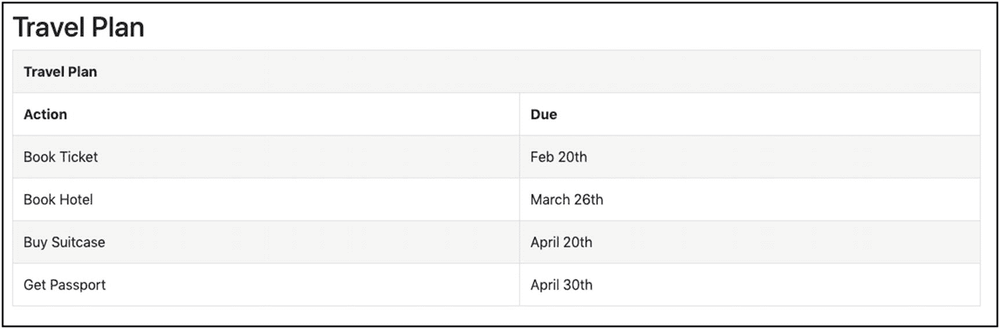

图 4-23

表格同时带有边框和条纹

另一个不错的表格类是类`table-hover`，它将突出显示鼠标悬停的行。让我们试试那个。将第一个表的类值设置为

```html
<table class="table table-hover">

```

如果您在浏览器上保存并加载页面，您将只看到带有`table`类的表格。但是，如果您尝试将鼠标指针移到这些行上，您会看到当鼠标移到这些行上时，这些行是如何突出显示的。

另一个有用的类是`table-sm`，它将确保行具有相当小的高度。在第二个表和它已经拥有的其他表类上尝试一下:

```html
<table class="table table-striped table-bordered table-sm">

```

如果您在浏览器上重新加载页面，您将看到以下内容(图 4-24 )。

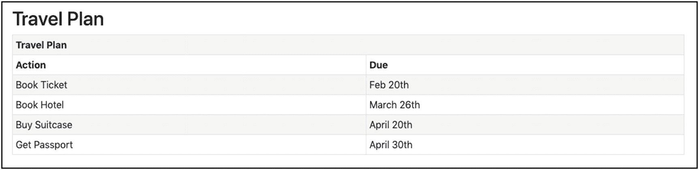

图 4-24

小个子跟`table-sm`一类

如图 4-24 所示，与第一个表格的行高相比，第二个表格的精简样式的行高要小得多。

### 给表格行着色

此外，Twitter Bootstrap 提供了一系列对应于特定颜色的语义类。当您应用这些类时，您可以快速设置相应行(`tr`)或相应单元格(`td`或`th`)的背景颜色。

这些类别是

1.  `table-active`

2.  `table-primary`

3.  `table-secondary`

4.  `table-success`

5.  `table-danger`

6.  `table-warning`

7.  `table-info`

8.  `table-light`

9.  `table-dark`

让我们将其中一些应用到页面上第二个表格的行中。所以第二个表格 HTML 片段变成如下(清单 4-10 )。

```html
<table class="table table-bordered table-striped table-sm">
    <tr><th colspan="2">Travel Plan</th></tr>
    <tr class="table-active"><th>(active) Action</th><th>Due</th></tr>
    <tr class="table-success"><td>(success) Book Ticket</td><td>Feb 20th</td></tr>
    <tr class="table-info"><td>(info) Book Hotel</td><td>March 26th</td></tr>
    <tr class="table-warning"><td>(warning) Buy Suitcase</td><td>April 20th</td></tr>
    <tr class="table-danger"><td>(danger) Get Passport</td><td>April 30th</td></tr>
</table>

Listing 4-10Second Table with Various Classes at Row Level

```

如果您保存前面的代码并在浏览器上重新加载页面，您将看到以下内容(图 4-25 )。

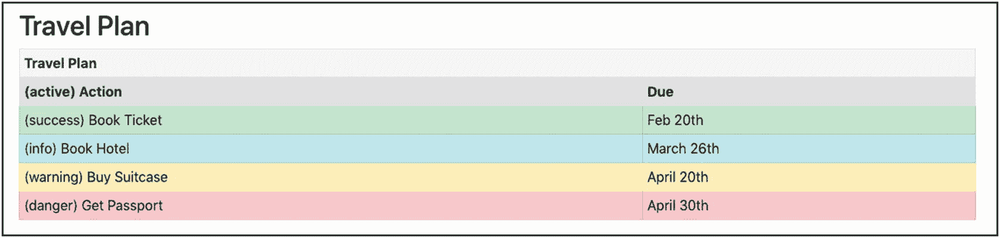

图 4-25

在行级别具有不同类的表

## 标签和徽章

Bootstrap 允许您非常容易地创建标签和徽章。

### 标签

有时候你想创建某种视觉标签，一个标记，如下所示(图 4-26 )。

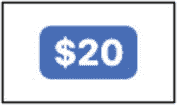

图 4-26

标签示例

这很容易通过 Twitter Bootstrap 实现。您只需将内容放在一个`span`元素中，并应用类`badge`加上一个用于标签颜色的类(以下任何一个`badge-*`类):

1.  `badge-primary`

2.  `badge-secondary`

3.  `badge-success`

4.  `badge-danger`

5.  `badge-warning`

6.  `badge-info`

7.  `badge-light`

8.  `badge-dark`

让我们在主内容容器的末尾添加以下内容(清单 4-11 )。

```html
<h1>Labels & Badges</h1>
<hr class="my-4">

<h4>
    <span class="badge badge-primary">€20.00 - Primary</span>
    <span class="badge badge-secondary">€20.00 - Secondary</span>
    <span class="badge badge-success">€20.00 - Success</span>
    <span class="badge badge-danger">€20.00 - Danger</span>
    <span class="badge badge-warning">€20.00 - Warning</span>
    <span class="badge badge-info">€20.00 - Info</span>
    <span class="badge badge-light">€20.00 - Light</span>
    <span class="badge badge-dark">€20.00 - Dark</span>
</h4>

Listing 4-11HTML Fragment That Creates Labels

```

保存全部内容，并在浏览器上重新加载页面。您将看到图 4-27 中描述的内容。

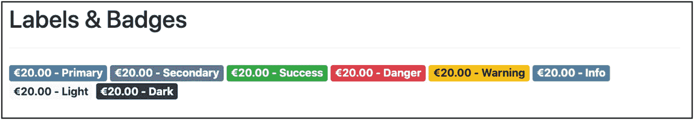

图 4-27

标签演示

很清楚。请注意，您将跨度包含在一个`h4`元素中只是为了让它们稍微大一点。

### 徽章

但是徽章呢？通常，你想显示一个小的或大的徽章，比如一个圆圈内的数字，来指示未读消息的数量，如图 4-28 所示。

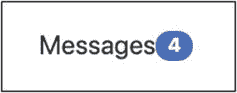

图 4-28

徽章示例

这些与我们之前创建的标签没有什么不同。唯一的区别是它们更圆润。您可以通过在其他`badge-*`类旁边添加类`badge-pill`来实现这一点。

清单 4-12 是一个创建带有徽章的按钮的 HTML 片段。想象一个按钮，允许用户点击并进入他们的收件箱。该按钮将显示未读邮件的数量。

```html
<button class="btn btn-light">Inbox&nbsp;<span class="badge badge-primary badge-pill">1</span></button>
<button class="btn btn-light">Inbox&nbsp;<span class="badge badge-secondary badge-pill">2</span></button>
<button class="btn btn-light">Inbox&nbsp;<span class="badge badge-success badge-pill">3</span></button>
<button class="btn btn-light">Inbox&nbsp;<span class="badge badge-danger badge-pill">4</span></button>
<button class="btn btn-light">Inbox&nbsp;<span class="badge badge-warning badge-pill">5</span></button>
<button class="btn btn-light">Inbox&nbsp;<span class="badge badge-info badge-pill">6</span></button>
<button class="btn btn-light">Inbox&nbsp;<span class="badge badge-light badge-pill">7</span></button>
<button class="btn btn-light">Inbox&nbsp;<span class="badge badge-dark badge-pill">8</span></button>

Listing 4-12Buttons with Badges

```

将这个 HTML 片段添加到主容器的底部，然后在浏览器上重新加载页面。您将看到带有徽章的按钮显示如下(图 4-29 )。

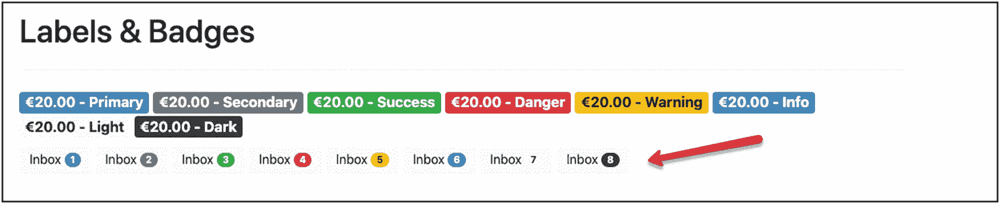

图 4-29

带徽章的纽扣

## 关键要点

*   带有下拉菜单列表的导航栏

*   各种尺寸和颜色的按钮

*   不同风格的桌子

*   标签和徽章

主题参考项目的第一部分到此结束。在下一章，项目的第二部分，您将继续学习更多关于 Twitter Bootstrap 组件的知识。