# 五、主题参考：第二部分

在第四章“主题参考:第一部分”中，你已经了解了一些最重要的 Twitter Bootstrap 组件，并且你已经开始为它们创建一个参考页面。在本章的第二部分中，您将在同一个参考项目中继续学习更多的组件。

特别是，我承诺向大家展示的其余组件是

*   选项卡，用于对信息进行分组

*   警报，用于显示突出的消息

*   进度条，用于直观地向用户显示一个正在进行的工作已经完成的百分比

*   卡片，美丽的矩形区域，内容丰富，能吸引观众的注意力

*   Carousel，一个像图像或其他丰富内容幻灯片一样工作的组件

最后，您将被要求创建一个页面，该页面要求您使用前面的大部分组件(图 5-1 )。


图 5-1

包含各种元素的 Twitter 引导示例页面

## 学习目标

1.  了解如何创建选项卡。

2.  了解如何创建通知。

3.  了解如何创建进度条。

4.  了解如何制作卡片。

5.  了解如何创建旋转木马。

## 介绍

您将继续您在前一章中开始的 Twitter Bootstrap 主题参考项目。让我们开始添加更多的组件。

## 制表符

有时，您希望使用选项卡来组织页面上的信息。选项卡很好，因为它们将部分信息组合在一个标题下，并且不会同时显示所有信息。用户通过点击相应的标签标题来选择要查看/阅读的信息组。

例如，参见图 5-2 中的一些选项卡。

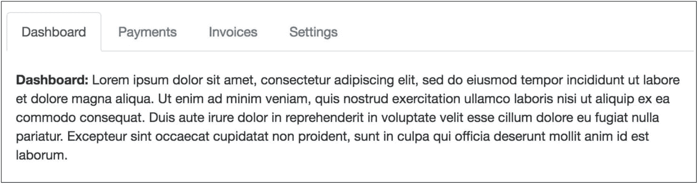

图 5-2

选项卡示例

显示的信息根据所单击的选项卡标题而变化。

让我们看看如何实现前面的选项卡示例。

首先，您需要理解标签功能的 HTML 实现有两个部分:

1.  标签标题

2.  与实际信息不同的内容

### 标签标题

选项卡标题是一个未排序的列表`ul`，带有类别`nav nav-tabs`。列表中的每个元素(`li`)对应于一个选项卡标题，并且它必须具有类`nav-item`。每个`li`的内容是具有类`nav-link`的锚和具有值`tab`的数据属性`data-toggle`。同样，每个锚都有一个指向相应信息容器的`href`值。当这个锚被点击时，那个信息容器将被显示给用户。注意，对应于应该显示给用户的信息容器的`li`也需要有类`active`。

下面是上一个例子中标签头的 HTML 片段(清单 5-1 )。

```html
<ul class="nav nav-tabs">
    <li class="nav-item">
      <a class="nav-link active" href="#dashboard" data-toggle="tab">Dashboard</a>
    </li>
    <li class="nav-item">
      <a class="nav-link" href="#payments" data-toggle="tab">Payments</a>
    </li>
    <li class="nav-item">
      <a class="nav-link" href="#invoices" data-toggle="tab">Invoices</a>
    </li>
    <li class="nav-item">
      <a class="nav-link" href="#settings" data-toggle="tab">Settings</a>
    </li>
</ul>

Listing 5-1The ul HTML Fragment for the Tabs Example

```

让我们使用前面的片段来更改您的主 HTML 页面。把它放在容器的底部。在这个`ul`列表之前，像添加其他标题一样添加标签的标题(列表 5-2 )。

```html
<h1>Tabs</h1>
<hr class="my-4">

Listing 5-2Tabs Header

```

如果保存页面并将其加载到浏览器中，选项卡部分将如图 5-3 所示。

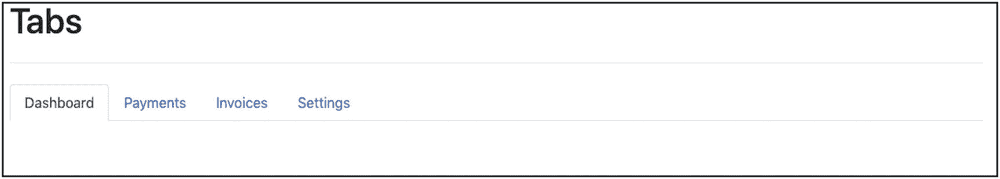

图 5-3

内容为空的选项卡

这是很好的一步。你可以看到标签是如何被很好地放置在页面上的。您甚至可以单击标题，以查看活动选项卡如何根据您单击的选项卡而变化。

现在缺少的是应该附在每个标签上的信息。

### 标签信息

您将选项卡信息放在带有类`tab-content`的`div`中。在其中，我们为每个信息组/选项卡标题创建一个`div`。这个`div`需要有一个`tab-pane`类。此外，它需要有正确的`id`，每个选项卡信息面板不同，并对应于相应选项卡的`href`值。

让我们将下面这段 HTML 代码(清单 5-3 )添加到主内容容器的末尾，在我们为选项卡标题创建的未排序列表之后。

```html
<div class="tab-content">
    <div id="dashboard" class="tab-pane active">
        <p>
            <strong>Dashboard:</strong> Lorem ipsum dolor sit amet, consectetur adipiscing elit, sed do eiusmod tempor incididunt ut labore et dolore magna aliqua. Ut enim ad minim veniam, quis nostrud exercitation ullamco laboris nisi ut aliquip ex ea commodo consequat. Duis aute irure dolor in reprehenderit in voluptate velit esse cillum dolore eu fugiat nulla pariatur. Excepteur sint occaecat cupidatat non proident, sunt in culpa qui officia deserunt mollit anim id est laborum.
        </p>
    </div>

    <div id="payments" class="tab-pane">
        <p>
            <strong>Payments:</strong> Lorem ipsum dolor sit amet, consectetur adipiscing elit, sed do eiusmod tempor incididunt ut labore et dolore magna aliqua. Ut enim ad minim veniam, quis nostrud exercitation ullamco laboris nisi ut aliquip ex ea commodo consequat. Duis aute irure dolor in reprehenderit in voluptate velit esse cillum dolore eu fugiat nulla pariatur. Excepteur sint occaecat cupidatat non proident, sunt in culpa qui officia deserunt mollit anim id est laborum.
        </p>
    </div>

    <div id="invoices" class="tab-pane">
        <p>
            <strong>Invoices:</strong> Lorem ipsum dolor sit amet, consectetur adipiscing elit, sed do eiusmod tempor incididunt ut labore et dolore magna aliqua. Ut enim ad minim veniam, quis nostrud exercitation ullamco laboris nisi ut aliquip ex ea commodo consequat. Duis aute irure dolor in reprehenderit in voluptate velit esse cillum dolore eu fugiat nulla pariatur. Excepteur sint occaecat cupidatat non proident, sunt in culpa qui officia deserunt mollit anim id est laborum.
        </p>
    </div>

    <div id="settings" class="tab-pane">
        <p>
            <strong>Settings:</strong> Lorem ipsum dolor sit amet, consectetur adipiscing elit, sed do eiusmod tempor incididunt ut labore et dolore magna aliqua. Ut enim ad minim veniam, quis nostrud exercitation ullamco laboris nisi ut aliquip ex ea commodo consequat. Duis aute irure dolor in reprehenderit in voluptate velit esse cillum dolore eu fugiat nulla pariatur. Excepteur sint occaecat cupidatat non proident, sunt in culpa qui officia deserunt mollit anim id est laborum.

        </p>
    </div>
</div>

Listing 5-3HTML Fragment for Tab Content

```

正如您在前面的代码中看到的

1.  您有一个包含所有其他 div 的`div`。

2.  这个父级`div`具有类`tab-content`。

3.  每个`div`的`id`值等于相应选项卡标题锚点的`href`。

4.  每个`div`都有一个类`tab-pane`。

5.  第一个`div`也有类`active`，因为这是为第一个选项卡标题显示的第一个信息框，最初也是`active`。

如果保存前面的信息并重新加载页面，您将看到以下内容(图 5-4 )。

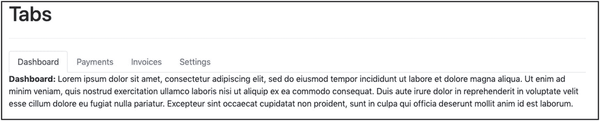

图 5-4

带内容的选项卡

如您所见，选项卡信息清楚地显示在选项卡标题下方。此外，如果您尝试单击不同的选项卡标题，您将看到以下信息如何相应地变化。

但是有一个问题是内容太靠近标签头了(图 5-5 )。

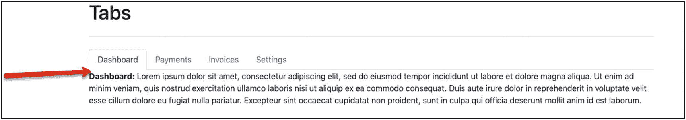

图 5-5

标签内容太靠近标签标题的问题

为了解决这个问题，在包含标题的`ul`上需要一些底部空白。您可以通过向`ul`元素添加实用程序类`mb-3`来实现这一点。

现在，如果您在浏览器上加载页面，您将看到以下内容(图 5-6 )。

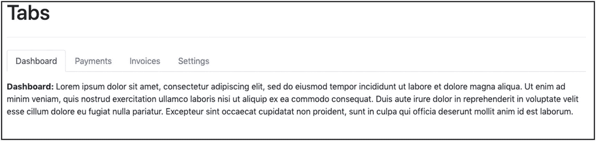

图 5-6

选项卡内容上方现在有一些空闲空间

Note

Twitter Bootstrap 鼓励作者让他们的内容与辅助技术兼容，比如屏幕阅读器。这意味着，除了使用样式类之外，您可能还必须添加一些专门为此目的设计的额外 HTML 属性。例如，带有选项卡列表的`ul`元素的 role HTML 属性需要有值`tablist`。如果你想了解如何创建可访问的富互联网应用程序，你必须阅读并应用这里给出的实践: [WAI-ARIA 创作实践](https://www.w3.org/TR/wai-aria-practices/)。

## 检查站

你在这一页做了很多工作。在继续之前，让我们确保它包含清单 5-4 中的内容。

```html
<!DOCTYPE html>
<html lang="en">
<head>
    <!-- Required meta tags -->
    <meta charset="utf-8">
    <meta name="viewport" content="width=device-width, initial-scale=1, shrink-to-fit=no">

    <!-- Bootstrap CSS -->
    <link rel="stylesheet" href="https://stackpath.bootstrapcdn.com/bootstrap/4.4.1/css/bootstrap.min.css" integrity="sha384-Vkoo8x4CGsO3+Hhxv8T/Q5PaXtkKtu6ug5TOeNV6gBiFeWPGFN9MuhOf23Q9Ifjh" crossorigin="anonymous">

    <!-- Custom CSS -->
    <link rel="stylesheet" href="stylesheets/main.css" type="text/css">

    <title>Twitter Bootstrap Reference Page</title>
</head>
<body>
    <nav class="navbar navbar-expand-lg navbar-dark bg-dark fixed-top">
        <div class="container">
            <a class="navbar-brand" href="#">Bootstrap Ref. Page</a>

            <button type="button" class="navbar-toggler" data-toggle="collapse" data-target="#navbar"
                    aria-controls="navbar"
                    aria-expanded="false"
                    aria-label="Toggle navigation">
                <span class="navbar-toggler-icon"></span>
            </button>

            <div class="collapse navbar-collapse" id="navbar">
                <ul class="nav navbar-nav">
                    <li class="nav-item">
                        <a class="nav-link active" href="#">Home <span class="sr-only">(current)</span></a>
                    </li>
                    <li class="nav-item">
                        <a class="nav-link" href="#about">About</a>
                    </li>
                    <li class="nav-item">
                        <a class="nav-link" href="#contact">Contact</a>
                    </li>

                    <!-- Drop down Menu -->
                    <li class="nav-item dropdown">
                        <a href="#"
                           class="nav-link dropdown-toggle"
                           data-toggle="dropdown">
                            Dropdown
                        </a>
                        <div class="dropdown-menu">
                            <a href="#" class="dropdown-item">Action</a>
                            <a href="#" class="dropdown-item">Another action</a>
                            <a href="#" class="dropdown-item">Something else here</a>
                            <div class="dropdown-divider"></div>
                            <div class="dropdown-header">Nav header</div>
                            <a href="#" class="dropdown-item">Separated link</a>
                            <a href="#" class="dropdown-item">One more separated link</a>
                        </div>
                    </li>
                </ul>
            </div>
        </div>
    </nav>

    <!-- main content container -->
    <div class="container">
        <div class="jumbotron">
            <p class="lead">
                Lorem ipsum dolor sit amet, consectetur adipiscing elit, sed do eiusmod tempor incididunt ut labore et dolore magna aliqua. Ut enim ad minim veniam, quis nostrud
                exercitation ullamco laboris nisi ut aliquip ex ea commodo consequat. Duis aute irure dolor in reprehenderit in voluptate velit esse cillum dolore eu fugiat nulla
                pariatur. Excepteur sint occaecat cupidatat non proident, sunt in culpa qui officia deserunt mollit anim id est laborum.
            </p>
        </div>

        <h1>Buttons</h1>
        <hr class="my-4">

        <h2>Small Sizes</h2>
        <p>
            <button type="button" class="btn btn-sm btn-primary">btn btn-sm btn-primary</button>
            <button type="button" class="btn btn-sm btn-secondary">btn btn-sm btn-secondary</button>
            <button type="button" class="btn btn-sm btn-success">btn btn-sm btn-success</button>
            <button type="button" class="btn btn-sm btn-danger">btn btn-sm btn-danger</button>
            <button type="button" class="btn btn-sm btn-warning">btn btn-sm btn-warning</button>
            <button type="button" class="btn btn-sm btn-info">btn btn-sm btn-info</button>
            <button type="button" class="btn btn-sm btn-light">btn btn-sm btn-light</button>
            <button type="button" class="btn btn-sm btn-dark">btn btn-sm btn-dark</button>
            <button type="button" class="btn btn-sm btn-link">btn btn-sm btn-link</button>
        </p>

        <h2>Normal Sizes</h2>
        <p>
            <button type="button" class="btn btn-primary">btn btn-primary</button>
            <button type="button" class="btn btn-secondary">btn btn-secondary</button>
            <button type="button" class="btn btn-success">btn btn-success</button>
            <button type="button" class="btn btn-danger">btn btn-danger</button>
            <button type="button" class="btn btn-warning">btn btn-warning</button>
            <button type="button" class="btn btn-info">btn btn-info</button>
            <button type="button" class="btn btn-light">btn btn-light</button>
            <button type="button" class="btn btn-dark">btn btn-dark</button>
            <button type="button" class="btn btn-link">btn btn-link</button>
        </p>

        <h2>Large Sizes</h2>
        <p>
            <button type="button" class="btn btn-lg btn-primary">btn btn-lg btn-primary</button>
            <button type="button" class="btn btn-lg btn-secondary">btn btn-lg btn-secondary</button>
            <button type="button" class="btn btn-lg btn-success">btn btn-lg btn-success</button>
            <button type="button" class="btn btn-lg btn-danger">btn btn-lg btn-danger</button>
            <button type="button" class="btn btn-lg btn-warning">btn btn-lg btn-warning</button>
            <button type="button" class="btn btn-lg btn-info">btn btn-lg btn-info</button>
            <button type="button" class="btn btn-lg btn-light">btn btn-lg btn-light</button>
            <button type="button" class="btn btn-lg btn-dark">btn btn-lg btn-dark</button>
            <button type="button" class="btn btn-lg btn-link">btn btn-lg btn-link</button>
        </p>

        <h2>Block Sizes</h2>
        <p>
            <button type="button" class="btn btn-block btn-primary">btn btn-block btn-primary</button>
            <button type="button" class="btn btn-block btn-secondary">btn btn-block btn-secondary</button>
            <button type="button" class="btn btn-block btn-success">btn btn-block btn-success</button>
            <button type="button" class="btn btn-block btn-danger">btn btn-block btn-danger</button>
            <button type="button" class="btn btn-block btn-warning">btn btn-block btn-warning</button>
            <button type="button" class="btn btn-block btn-info">btn btn-block btn-info</button>
            <button type="button" class="btn btn-block btn-light">btn btn-block btn-light</button>
            <button type="button" class="btn btn-block btn-dark">btn btn-block btn-dark</button>
            <button type="button" class="btn btn-block btn-link">btn btn-block btn-link</button>
        </p>

        <h2>Outline buttons (Normal Sizes)</h2>
        <p>
            <button type="button" class="btn btn-outline-primary">btn btn-outline-primary</button>
            <button type="button" class="btn btn-outline-secondary">btn btn-outline-secondary</button>
            <button type="button" class="btn btn-outline-success">btn btn-outline-success</button>
            <button type="button" class="btn btn-outline-danger">btn btn-outline-danger</button>
            <button type="button" class="btn btn-outline-warning">btn btn-outline-warning</button>
            <button type="button" class="btn btn-outline-info">btn btn-outline-info</button>
            <button type="button" class="btn btn-outline-light">btn btn-outline-light</button>
            <button type="button" class="btn btn-outline-dark">btn btn-outline-dark</button>
            <button type="button" class="btn btn-outline-link">btn btn-outline-link</button>
        </p>

        <h1>Tables</h1>
        <hr class="my-4">

        <h2>Shopping List</h2>
        <table class="table">
            <tr><th colspan="2">Shopping List</th></tr>
            <tr><th>Item</th><th>Qt</th></tr>
            <tr><td>Cheese</td><td>1 kgr</td></tr>
            <tr><td>Rice</td><td>1.5 kgr</td></tr>
            <tr><td>Coffee</td><td>0.5 kgr</td></tr>
            <tr><td>Milk</td><td>1 ltr</td></tr>
            <tr><td>Wine</td><td>1 btl</td></tr>
        </table>

        <h2>Travel Plan</h2>
        <table class="table table-bordered table-striped table-sm">
            <tr><th colspan="2">Travel Plan</th></tr>
            <tr class="table-active"><th>(active) Action</th><th>Due</th></tr>
            <tr class="table-success"><td>(success) Book Ticket</td><td>Feb 20th</td></tr>
            <tr class="table-info"><td>(info) Book Hotel</td><td>March 26th</td></tr>
            <tr class="table-warning"><td>(warning) Buy Suitcase</td><td>April 20th</td></tr>
            <tr class="table-danger"><td>(danger) Get Passport</td><td>April 30th</td></tr>
        </table>

        <h1>Labels & Badges</h1>
        <hr class="my-4">

        <h4>
            <span class="badge badge-primary">€20.00 - Primary</span>
            <span class="badge badge-secondary">€20.00 - Secondary</span>
            <span class="badge badge-success">€20.00 - Success</span>
            <span class="badge badge-danger">€20.00 - Danger</span>
            <span class="badge badge-warning">€20.00 - Warning</span>
            <span class="badge badge-info">€20.00 - Info</span>
            <span class="badge badge-light">€20.00 - Light</span>
            <span class="badge badge-dark">€20.00 - Dark</span>
        </h4>

        <button class="btn btn-light">Inbox&nbsp;<span class="badge badge-primary badge-pill">1</span></button>
        <button class="btn btn-light">Inbox&nbsp;<span class="badge badge-secondary badge-pill">2</span></button>
        <button class="btn btn-light">Inbox&nbsp;<span class="badge badge-success badge-pill">3</span></button>
        <button class="btn btn-light">Inbox&nbsp;<span class="badge badge-danger badge-pill">4</span></button>
        <button class="btn btn-light">Inbox&nbsp;<span class="badge badge-warning badge-pill">5</span></button>
        <button class="btn btn-light">Inbox&nbsp;<span class="badge badge-info badge-pill">6</span></button>
        <button class="btn btn-light">Inbox&nbsp;<span class="badge badge-light badge-pill">7</span></button>
        <button class="btn btn-light">Inbox&nbsp;<span class="badge badge-dark badge-pill">8</span></button>

        <h1>Tabs</h1>
        <hr class="my-4">

        <ul class="nav nav-tabs mb-4">
            <li class="nav-item"><a class="nav-link active" href="#dashboard" data-toggle="tab">Dashboard</a></li>
            <li class="nav-item"><a class="nav-link" href="#payments" data-toggle="tab">Payments</a></li>
            <li class="nav-item"><a class="nav-link" href="#invoices" data-toggle="tab">Invoices</a></li>
            <li class="nav-item"><a class="nav-link" href="#settings" data-toggle="tab">Settings</a></li>
        </ul>

        <div class="tab-content">
            <div id="dashboard" class="tab-pane active">
                <p>
                    <strong>Dashboard:</strong> Lorem ipsum dolor sit amet, consectetur adipiscing elit, sed do eiusmod tempor incididunt ut labore et dolore magna aliqua. Ut enim ad minim veniam, quis nostrud exercitation ullamco laboris nisi ut aliquip ex ea commodo consequat. Duis aute irure dolor in reprehenderit in voluptate velit esse cillum dolore eu fugiat nulla pariatur. Excepteur sint occaecat cupidatat non proident, sunt in culpa qui officia deserunt mollit anim id est laborum.
                </p>
            </div>

            <div id="payments" class="tab-pane">
                <p>
                    <strong>Payments:</strong> Lorem ipsum dolor sit amet, consectetur adipiscing elit, sed do eiusmod tempor incididunt ut labore et dolore magna aliqua. Ut enim ad minim veniam, quis nostrud exercitation ullamco laboris nisi ut aliquip ex ea commodo consequat. Duis aute irure dolor in reprehenderit in voluptate velit esse cillum dolore eu fugiat nulla pariatur. Excepteur sint occaecat cupidatat non proident, sunt in culpa qui officia deserunt mollit anim id est laborum.
                </p>
            </div>

            <div id="invoices" class="tab-pane">
                <p>
                    <strong>Invoices:</strong> Lorem ipsum dolor sit amet, consectetur adipiscing elit, sed do eiusmod tempor incididunt ut labore et dolore magna aliqua. Ut enim ad minim veniam, quis nostrud exercitation ullamco laboris nisi ut aliquip ex ea commodo consequat. Duis aute irure dolor in reprehenderit in voluptate velit esse cillum dolore eu fugiat nulla pariatur. Excepteur sint occaecat cupidatat non proident, sunt in culpa qui officia deserunt mollit anim id est laborum.
                </p>
            </div>

            <div id="settings" class="tab-pane">
                <p>
                    <strong>Settings:</strong> Lorem ipsum dolor sit amet, consectetur adipiscing elit, sed do eiusmod tempor incididunt ut labore et dolore magna aliqua. Ut enim ad minim veniam, quis nostrud exercitation ullamco laboris nisi ut aliquip ex ea commodo consequat. Duis aute irure dolor in reprehenderit in voluptate velit esse cillum dolore eu fugiat nulla pariatur. Excepteur sint occaecat cupidatat non proident, sunt in culpa qui officia deserunt mollit anim id est laborum.
                </p>
            </div>
        </div>
    </div>
    <!-- end of main content container -->

    <!-- Optional JavaScript -->
    <!-- jQuery first, then Popper.js, then Bootstrap JS -->
    <script src="https://code.jquery.com/jquery-3.4.1.slim.min.js" integrity="sha384-J6qa4849blE2+poT4WnyKhv5vZF5SrPo0iEjwBvKU7imGFAV0wwj1yYfoRSJoZ+n" crossorigin="anonymous"></script>
    <script src="https://cdn.jsdelivr.net/npm/popper.js@1.16.0/dist/umd/popper.min.js" integrity="sha384-Q6E9RHvbIyZFJoft+2mJbHaEWldlvI9IOYy5n3zV9zzTtmI3UksdQRVvoxMfooAo" crossorigin="anonymous"></script>
    <script src="https://stackpath.bootstrapcdn.com/bootstrap/4.4.1/js/bootstrap.min.js" integrity="sha384-wfSDF2E50Y2D1uUdj0O3uMBJnjuUD4Ih7YwaYd1iqfktj0Uod8GCExl3Og8ifwB6" crossorigin="anonymous"></script>
</body>
</html>

Listing 5-4Twitter Bootstrap Reference Page Checkpoint

```

## 警报

有时，您希望显示一条消息来吸引用户的注意。这些被称为警报。下面是一个例子(图 5-7 )。

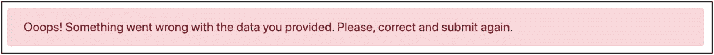

图 5-7

警报示例

这些消息通常显示在页面的顶部，但不一定只显示在那里。

Twitter Bootstrap 给出了应该在 block 元素(如`div`)上使用的类`alert`，以便将它变成一个警告块。除此之外，您还需要指定一个为警告着色的类，以便更好地向用户传达消息。因此，对于表示警告的消息，可以使用`alert-warning`类和`alert`类。

与警报相关的颜色类别有

1.  `alert-primary`

2.  `alert-secondary`

3.  `alert-success`

4.  `alert-danger`

5.  `alert-warning`

6.  `alert-info`

7.  `alert-light`

8.  `alert-dark`

让我们看看这些警报的实际效果。将下面的 HTML 片段添加到主内容容器的末尾之前(清单 5-5 )。

```html
<h1>Alerts</h1>
<hr class="my-4">

<div class="alert alert-primary">
    A simple primary alert.
</div>
<div class="alert alert-secondary">
    A simple secondary alert.
</div>
<div class="alert alert-success">
    A simple success alert.
</div>
<div class="alert alert-danger">
    A simple danger alert.
</div>
<div class="alert alert-warning">
    A simple warning alert.
</div>
<div class="alert alert-info">
    A simple info alert.
</div>
<div class="alert alert-light">
    A simple light alert.
</div>
<div class="alert alert-dark">
    A simple dark alert.
</div>

Listing 5-5HTML Fragment for Alerts Demo

```

如果您保存前面的代码并在浏览器上重新加载您的页面，您将在页面的 Alerts 部分看到以下内容(图 5-8 )。

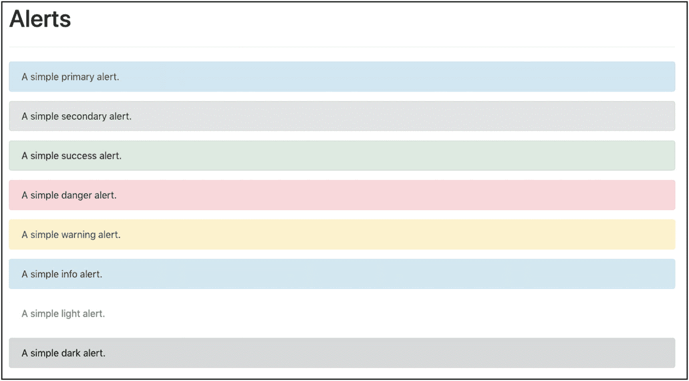

图 5-8

警报演示

在您的警报中，您可以有任何有效的 HTML 内容。例如，您可以有一个到另一个页面的链接。让我们添加下面的 HTML 片段(清单 5-6 )。

```html
<div class="alert alert-info">
    <strong>London</strong> Read more about London from <a href="https://en.wikipedia.org/wiki/London">Wikipedia London Link</a>.
</div>

Listing 5-6Add an Alert with HTML Inside

```

如果您重新加载您的 HTML 页面，新的警告将显示如下(图 5-9 )。

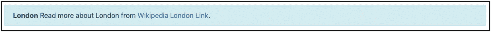

图 5-9

内部带有超链接的警报

这里有一个小的样式问题，与警报内部链接的颜色有关。就是不好看。Bootstrap 建议您在锚`a`上使用类`alert-link`。这将根据警报的背景提供匹配的颜色。让我们像清单 5-7 那样添加它。

```html
<div class="alert alert-info">
    <strong>London</strong> Read more about London from <a class="alert-link" href="https://en.wikipedia.org/wiki/London">Wikipedia London Link</a>.
</div>

Listing 5-7Use the alert-link Class

```

如果您保存 HTML 内容并在浏览器上重新加载页面，您将会看到显示超链接的警告，如图 5-10 所示。

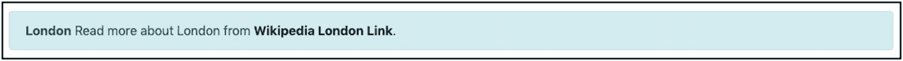

图 5-10

与`alert-link`的造型链接

## 进度条

进度条指示给定任务已经完成了多少，还有多少工作要做。例如，参见图 5-11 。

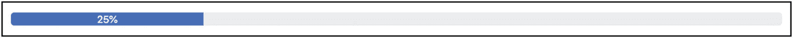

图 5-11

进度条示例

正如你在图 5-11 中看到的，进度条有一个颜色和一个文本指示，表明多少流程已经完成，还有多少流程有待完成。

Twitter Bootstrap 有两个与这个工具相关的类，`progress`和`progress-bar`。让我们通过将下面的 HTML 内容附加到主内容容器的末尾来看看应该如何使用它们(清单 5-8 )。

```html
<h1>Progress Bars</h1>
<hr class="my-4">

<div class="progress">
    <div class="progress-bar" style="width: 60%;">60% Complete</div>
</div>

Listing 5-8HTML Fragment to Add a Progress Bar

```

从前面的片段中可以看出，进度条非常容易构建。一个`div`有类`progress;`，另一个`div`，在第一个里面，有类`progress-bar`。孩子`div`显示的文本给出了当前进度的文本信息。这段文字是不必要的。它可能是空的。这里重要的部分是您正确地设置了子节点`div`的`width`属性的值，这样它就可以指示实际的进度。一个好的方法是在这里使用百分比，因为百分比会使子宽度成为父宽度的百分比。父类`div`上的`progress`类确保父类`div`占据页面的所有可用宽度，而子类`div`上的`style="width: 60%"`确保子类`div`恰好占据父类`div`的`60%`，因此这两个`div`元素合二为一，给出了进度条的视觉效果。

如果保存 HTML 页面并在浏览器上重新加载，您将看到以下内容(图 5-12 )。

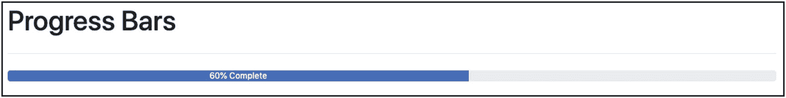

图 5-12

标准进度条

### 进度条高度

如果你觉得这个条太短，那么你可以调整父级`div`的高度，这个父级有一个类`progress`。让我们添加样式属性如下(清单 5-9 )。

```html
<div class="progress" style="height: 1.8rem;">
    <div class="progress-bar" style="width: 60%;">60% Complete</div>
</div>

Listing 5-9Adjust the Height of the Progress Bar

```

如果您保存前面的内容并在浏览器上重新加载页面，您将看到以下内容(图 5-13 )。

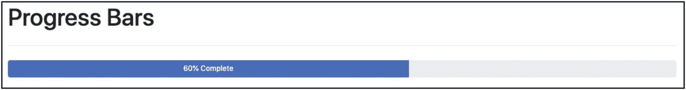

图 5-13

调整进度条的高度

### 进度条颜色

除了你在图 5-13 中看到的普通进度条之外，你可以使用引导背景颜色工具类来改变进度条的颜色。这些类别是

*   `bg-primary`

*   `bg-secondary`

*   `bg-success`

*   `bg-danger`

*   `bg-warning`

*   `bg-info`

*   `bg-light`

*   `bg-dark`

您需要在内部的`div`上设置这个类，与`progress-bar`类并排。让我们将 HTML 页面中的进度条演示代码修改如下(清单 5-10 )。

```html
<h1>Progress Bars</h1>
<hr class="my-4">

<div class="progress mb-1 h-4">
    <div class="progress-bar bg-primary" style="width: 60%;">60% Complete - primary</div>
</div>
<div class="progress mb-1 h-4">
    <div class="progress-bar bg-secondary" style="width: 60%;">60% Complete - secondary</div>
</div>
<div class="progress mb-1 h-4">
    <div class="progress-bar bg-success" style="width: 60%;">60% Complete - success</div>
</div>
<div class="progress mb-1 h-4">
    <div class="progress-bar bg-danger" style="width: 60%;">60% Complete - danger</div>
</div>
<div class="progress mb-1 h-4">
    <div class="progress-bar bg-warning" style="width: 60%;">60% Complete - warning</div>
</div>
<div class="progress mb-1 h-4">
    <div class="progress-bar bg-info" style="width: 60%;">60% Complete - info</div>
</div>
<div class="progress mb-1 h-4">
    <div class="progress-bar bg-light" style="width: 60%;">60% Complete - light</div>
</div>
<div class="progress mb-1 h-4">
    <div class="progress-bar bg-dark" style="width: 60%;">60% Complete - dark</div>
</div>

Listing 5-10Progress Bar Demo Code Fragment

```

同样，确保你的`stylesheets/main.css`文件有如下的类定义(清单 5-11 )。

```html
.h-4 {
    height: 1.5rem;
}

Listing 5-11Class h-4 Which Is Used in Listing 5-10

```

如果保存 HTML 页面并在浏览器上重新加载，您将看到以下内容(图 5-14 )。

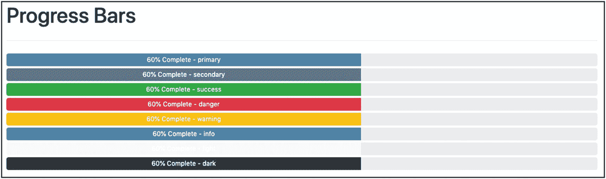

图 5-14

各种颜色的进度条

### 多色进度条

最后，你可以用进度条做另一个小把戏。你可以在同一个进度条上使用不同的颜色。可以创建如下效果(图 5-15 )。

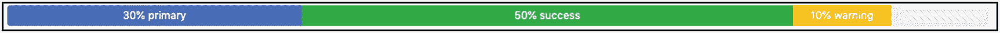

图 5-15

多色进度条

这很容易通过在`progress-bar`类中包含多个子`div`来实现。为了看到这一点，在主内容容器的末尾添加以下 HTML 片段(清单 5-12 )。

```html
<div class="progress mb-1 h-4">
    <div class="progress-bar bg-primary" style="width: 30%;">30% primary</div>
    <div class="progress-bar bg-success" style="width: 50%;">50% success</div>
    <div class="progress-bar bg-warning" style="width: 10%;">10% warning</div>
</div>

Listing 5-12Multicolored Progress Bar HTML Fragment

```

正如您在前面的代码中看到的，所有三种不同的颜色`divs`都在父`div`中。Twitter Bootstrap 足够聪明，可以在正确的位置画出每一个进度条，给定进度条的颜色，用正确的颜色画出它们。

## 信用卡

卡片是一个容器，它有一些特定的结构来创建非常吸引人的内容，有页眉和页脚。在图 5-16 中，你可以看到一张卡的例子。

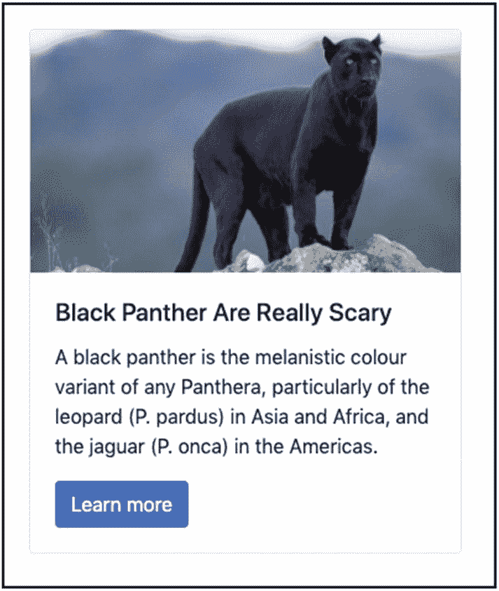

图 5-16

卡片示例

卡片通常有图像、标题和正文。但是它也可以包含页眉和页脚。

### 三卡布局

让我们尝试在您的 Twitter 引导参考页面中创建以下内容(图 5-17 )。

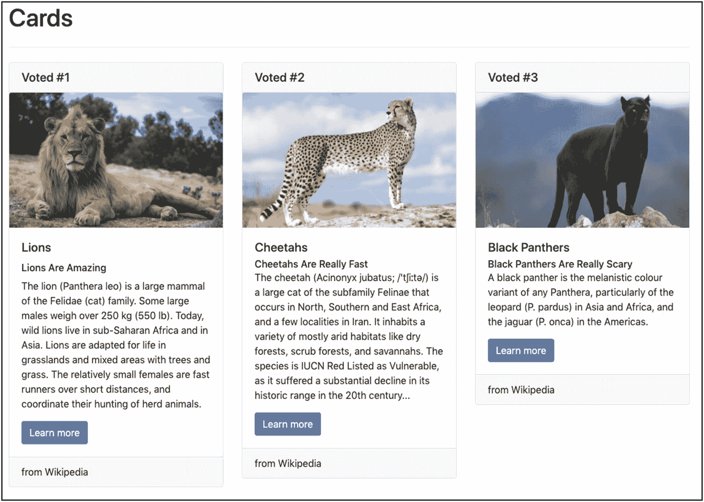

图 5-17

Twitter 引导参考页面中的卡片

*   你要加三张牌。

*   您将选择的布局是响应式的:
    *   对于高达 767px 的显示器，每行将显示一张卡片。

    *   对于高达 991 像素的显示器，每行将显示两张卡片。

    *   对于宽度> = 992 像素的显示器，它将在同一行显示三张卡片。

清单 5-13 包含了你必须添加到页面主容器底部的 HTML 代码。

```html
<h1>Cards</h1>
<hr class="my-4">

<div class="row row-cols-1 row-cols-md-2 row-cols-lg-3">
    <div class="col">
        <div class="card">
            <h5 class="card-header">Voted #1</h5>
            
            <div class="card-body">
                <h5 class="card-title">Lions</h5>
                <h6 class="card-subtitle">Lions Are Amazing</h6>
                <p class="card-text">
                    The lion (Panthera leo) is a large mammal of the Felidae (cat) family. Some large males weigh over 250 kg (550 lb).
 Today, wild lions live in sub-Saharan Africa and in Asia. Lions are adapted for life in grasslands and mixed areas
 with trees and grass. The relatively small females are fast runners over short distances, and coordinate their hunting of herd animals.
                </p>
                <a href="https://simple.wikipedia.org/wiki/Lion" class="btn btn-primary">Learn more</a>
            </div>
            <div class="card-footer">
                from Wikipedia
            </div>
        </div>
    </div>
    <div class="col">
        <div class="card">
            <h5 class="card-header">Voted #2</h5>
            
            <div class="card-body">
                <h5 class="card-title">Cheetahs</h5>
                <h6 class="card-subtitle">Cheetahs Are Really Fast</h6>
                <p class="card-text">
                    The cheetah (Acinonyx jubatus; /ˈtʃiːtə/) is a large cat of the subfamily Felinae that occurs in North, Southern and East Africa, and a few localities in Iran.
                    It inhabits a variety of mostly arid habitats like dry forests, scrub forests, and savannahs. The species is IUCN Red Listed as Vulnerable, as it suffered a
                    substantial decline in its historic range in the 20th century...
                </p>
                <a href="https://en.wikipedia.org/wiki/Cheetah" class="btn btn-primary">Learn more</a>

            </div>
            <div class="card-footer">
                from Wikipedia
            </div>
        </div>
    </div>
    <div class="col">
        <div class="card">
            <h5 class="card-header">Voted #3</h5>
            
            <div class="card-body">
                <h5 class="card-title">Black Panthers</h5>
                <h6 class="card-subtitle">Black Panthers Are Really Scary</h6>
                <p class="card-text">
                    A black panther is the melanistic colour variant of any Panthera, particularly of the leopard (P. pardus) in Asia and Africa, and the jaguar (P. onca) in the Americas.
                </p>
                <a href="https://en.wikipedia.org/wiki/Black_panther" class="btn btn-primary">Learn more</a>
            </div>
            <div class="card-footer">
                from Wikipedia
            </div>
        </div>
    </div>
</div>

Listing 5-13Three Cards

```

### 布局

布局很简单。这是通过这个`div`实现的:

```html
<div class="row row-cols-1 row-cols-md-2 row-cols-lg-3">

```

`row-cols-*`是为了在期望的断点上布置一列、两列或三列所需要的。

然后每张牌都被包含在一个`col` div 中:

```html
    <div class="col">

```

所有这些都是必需的，以便您可以实现所需的响应性布局。

### 每张卡片的 HTML

每张卡片都有类似如下的 HTML 代码:

*   整张卡被封装在一个带有类`card`的`div`中。

*   每张卡都有一个头，它是一个带有类`card-header`的`h*`元素。

*   这个图像是用一个标准的`img`元素构造的，这个元素有一个类`card-img-top`。您还指定了一个特定的高度，这样所有卡片的所有图像都显示在一个特定的高度上，但是占用了所有可用的宽度。

*   然后，卡片的主要内容，也就是图像后面的内容，被放在一个带有类`card-body`的 div 中。

*   在主体内部，您通常可以放入任何您想要的 HTML 代码。我们已经把
    *   使用一个`h*`和一个类别`card-title`的卡片标题。

    *   使用一个`h*`和一个`card-subtitle`类的卡片字幕。

    *   有正文的段落。这个有类`card-text`。

    *   一个包含类`card-link`和一些额外类的超链接，使它看起来像一个按钮。

*   在主体之后，我们用类`card-footer`附加一个`div`。这是用来创建卡的页脚。

就这样。如果您保存 HTML 页面并将其加载到您的浏览器上，您将会看到您已经在图 5-17 中看到的卡片。

## 旋转木马

你将用一个叫做旋转木马的非常酷的功能来关闭这个长长的 Twitter 引导参考页面。Twitter Bootstrap 允许你创建图像和视频传送带。旋转木马是页面中逐个显示一系列图像(和/或视频)的区域。每个图像在被下一个图像替换之前会保持可见一段时间(大约 5 秒钟)。

典型的转盘由以下部分组成:

1.  小指示器通常显示在底部(图 5-18

    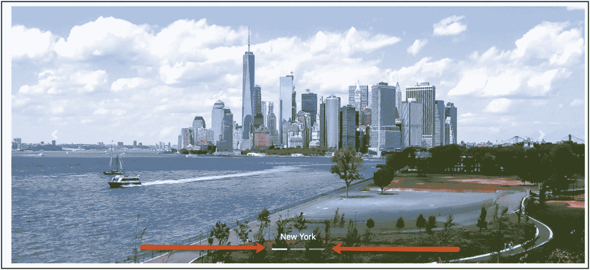

    图 5-18

    旋转指示器

    指示器的数量等于转盘中物品的数量。在前面的示例中，有一个包含三个项目的转盘。因此，您可以看到三个条形。用白色填充的表示当前显示的项目。您也可以点按栏以在相应位置快速显示项目。

2.  下一个和上一个控件(图 5-19

    

    图 5-19

    旋转下一个和上一个控件

    下一个和上一个按钮，像箭头一样，允许你从一个项目到另一个项目，向左或向右导航、滑动。

3.  物品(图 5-20

    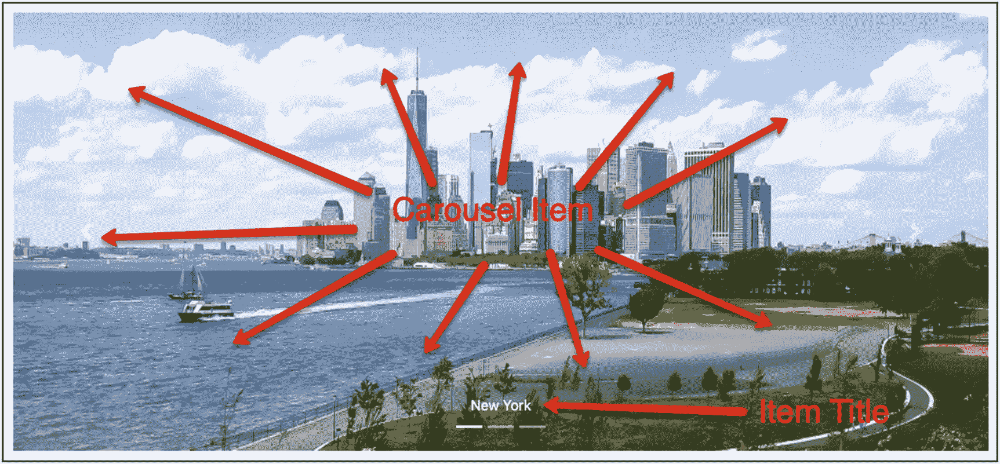

    图 5-20

    轮播项目和标题

    传送带有一个项目列表，每个项目都引用一个图像并有一个标题。

说了这么多，很容易识别和理解下面的 HTML 片段，它实现了前面的 carousel。将它修改为主内容容器中 HTML 代码的最后一部分(清单 5-14 )。

```html
<div class="page-header">
    <h1>Carousels</h1>
</div>

<div id="carousel-example-generic" class="carousel slide carousel-fade" data-ride="carousel">
    <!-- Indicators -->
    <ol class="carousel-indicators">
        <li data-target="#carousel-example-generic" data-slide-to="0" class="active"></li>
        <li data-target="#carousel-example-generic" data-slide-to="1"></li>
        <li data-target="#carousel-example-generic" data-slide-to="2"></li>
    </ol>

    <!-- Wrapper for slides -->
    <div class="carousel-inner" role="listbox">

        <div class="carousel-item active">
            
            <div class="carousel-caption d-none d-md-block">
                New York
            </div>
        </div>

        <div class="carousel-item">

            
            <div class="carousel-caption d-none d-md-block">
                Tokyo
            </div>
        </div>

        <div class="carousel-item">
            
            <div class="carousel-caption d-none d-md-block">
                Athens
            </div>
        </div>

    </div>

    <!-- Controls -->
    <a class="carousel-control-prev" href="#carousel-example-generic" role="button" data-slide="prev">
        <span class="carousel-control-prev-icon" aria-hidden="true"></span>
        <span class="sr-only">Previous</span>
    </a>
    <a class="carousel-control-next" href="#carousel-example-generic" role="button" data-slide="next">
        <span class="carousel-control-next-icon" aria-hidden="true"></span>
        <span class="sr-only">Next</span>
    </a>
</div>

Listing 5-14HTML Fragment for the Carousel

```

下面是在创建 Twitter 引导轮播时需要注意的一些事项:

1.  传送带需要用类别`carousel`和`slide`包含在`div`中。如果你也想用淡入淡出效果从一张幻灯片过渡到下一张幻灯片，那么你也必须添加类`carousel-fade`。

2.  main `div`需要有一个`id`，就像我们在前面的 HTML 片段(`carousel-example-generic`)中看到的那样。这是必要的，因为它会被指示器和控件引用。如果在同一个页面上有多个轮播，这个需求就变得更加重要。

3.  对于指标
    1.  它们需要是一个带有类`carousel-indicators`的有序列表(`ol`)。

    2.  每个项目(`li`)都是一个指标，你需要有和你的项目数量一样多的指标。如果你有三个图像，那么你就得有三个指标，也就是`li`项。

    3.  每个指示器需要有一个带有转盘 id 的`data-target`属性。此外，它需要有一个值等于它所对应的项目的索引/位置的`data-slide-to`属性。注意，分度/定位从`0`开始。也就是说，第一个传送带项目用索引`0`引用，然后第二个用索引`1,`引用，依此类推。

    4.  第一个指示器需要有类`active`。

4.  所有的传送带项目都需要用类`carousel-inner`包装在一个`div`中。

5.  对于传送带项目
    1.  每一个都是拥有类`carousel-item`的`div`。

    2.  第一个需要有类`active`；否则，将不会显示转盘。

    3.  注意，carousel 的图像需要有处理它们的高度和显示属性的类和样式。特别
        1.  类`d-block`和`w-100`:第一个(`d-block`)设置图像`display`属性`block`的值。第二个(`w-100`)设置图像宽度为`100%`。因此，图像将占据整个可用宽度。请注意，这些是显示和调整引导实用程序类。

        2.  将所有图像的高度设置为相同的样式。在示例中，它被设置为`500px`。

    4.  最后，轮播项目可以有一个带有类`carousel-caption`的`div`，作为项目的标题。请注意，您已经在标题上设置了两个额外的显示实用程序类:
        1.  `d-none`，隐藏字幕。

        2.  `d-md-block`，显示中等显示和更宽显示的标题。换句话说，您希望字幕显示在宽度> =768px 的设备上。否则，它们将不会显示。

6.  在 carousel 的内部内容(带有类`carousel-inner`的`div`)下面，您为控件设置 HTML 内容，这是两个锚`a`元素:
    1.  第一个有类`carousel-control-prev,`，它用于导航到前一张/左边的幻灯片。

    2.  第二个包含类`carousel-control-next,`，用于导航到下一张/右边的幻灯片。

    3.  两者都具有指向传送带 id ( `#carousel-example-generic`)的属性`href`。

    4.  两者都有一个子/内容是`span`。此`span`用于显示左(第一个控件)和右(第二个控件)箭头。对于第一个控件，span 需要有类`carousel-control-prev-icon`，以便它显示左箭头。对于第二个控件，span 需要有类`carousel-control-next-icon`，以便它显示右箭头。

## 最终检查站

为了您的方便和复查，这里是您创建的页面的完整内容(清单 5-15 )。

```html
<!DOCTYPE html>
<html lang="en">
<head>
    <!-- Required meta tags -->
    <meta charset="utf-8">
    <meta name="viewport" content="width=device-width, initial-scale=1, shrink-to-fit=no">

    <!-- Bootstrap CSS -->
    <link rel="stylesheet" href="https://stackpath.bootstrapcdn.com/bootstrap/4.4.1/css/bootstrap.min.css" integrity="sha384-Vkoo8x4CGsO3+Hhxv8T/Q5PaXtkKtu6ug5TOeNV6gBiFeWPGFN9MuhOf23Q9Ifjh" crossorigin="anonymous">

    <!-- Custom CSS -->
    <link rel="stylesheet" href="stylesheets/main.css" type="text/css">

    <title>Twitter Bootstrap Reference Page</title>
</head>
<body>
    <nav class="navbar navbar-expand-lg navbar-dark bg-dark fixed-top">
        <div class="container">
            <a class="navbar-brand" href="#">Bootstrap Ref. Page</a>

            <button type="button" class="navbar-toggler" data-toggle="collapse" data-target="#navbar"
                    aria-controls="navbar"
                    aria-expanded="false"
                    aria-label="Toggle navigation">
                <span class="navbar-toggler-icon"></span>
            </button>

            <div class="collapse navbar-collapse" id="navbar">
                <ul class="nav navbar-nav">
                    <li class="nav-item">
                        <a class="nav-link active" href="#">Home <span class="sr-only">(current)</span></a>
                    </li>
                    <li class="nav-item">
                        <a class="nav-link" href="#about">About</a>
                    </li>
                    <li class="nav-item">
                        <a class="nav-link" href="#contact">Contact</a>
                    </li>

                    <!-- Drop down Menu -->
                    <li class="nav-item dropdown">
                        <a href="#"
                           class="nav-link dropdown-toggle"
                           data-toggle="dropdown">
                            Dropdown
                        </a>
                        <div class="dropdown-menu">
                            <a href="#" class="dropdown-item">Action</a>
                            <a href="#" class="dropdown-item">Another action</a>
                            <a href="#" class="dropdown-item">Something else here</a>
                            <div class="dropdown-divider"></div>
                            <div class="dropdown-header">Nav header</div>
                            <a href="#" class="dropdown-item">Separated link</a>
                            <a href="#" class="dropdown-item">One more separated link</a>
                        </div>
                    </li>
                </ul>
            </div>
        </div>
    </nav>

    <!-- main content container -->
    <div class="container">
        <div class="jumbotron">
            <p class="lead">
                Lorem ipsum dolor sit amet, consectetur adipiscing elit, sed do eiusmod tempor incididunt ut labore et dolore magna aliqua. Ut enim ad minim veniam, quis nostrud
                exercitation ullamco laboris nisi ut aliquip ex ea commodo consequat. Duis aute irure dolor in reprehenderit in voluptate velit esse cillum dolore eu fugiat nulla
                pariatur. Excepteur sint occaecat cupidatat non proident, sunt in culpa qui officia deserunt mollit anim id est laborum.
            </p>
        </div>

        <h1>Buttons</h1>
        <hr class="my-4">

        <h2>Small Sizes</h2>
        <p>
            <button type="button" class="btn btn-sm btn-primary">btn btn-sm btn-primary</button>
            <button type="button" class="btn btn-sm btn-secondary">btn btn-sm btn-secondary</button>
            <button type="button" class="btn btn-sm btn-success">btn btn-sm btn-success</button>
            <button type="button" class="btn btn-sm btn-danger">btn btn-sm btn-danger</button>
            <button type="button" class="btn btn-sm btn-warning">btn btn-sm btn-warning</button>
            <button type="button" class="btn btn-sm btn-info">btn btn-sm btn-info</button>
            <button type="button" class="btn btn-sm btn-light">btn btn-sm btn-light</button>
            <button type="button" class="btn btn-sm btn-dark">btn btn-sm btn-dark</button>
            <button type="button" class="btn btn-sm btn-link">btn btn-sm btn-link</button>
        </p>

        <h2>Normal Sizes</h2>
        <p>
            <button type="button" class="btn btn-primary">btn btn-primary</button>
            <button type="button" class="btn btn-secondary">btn btn-secondary</button>
            <button type="button" class="btn btn-success">btn btn-success</button>
            <button type="button" class="btn btn-danger">btn btn-danger</button>
            <button type="button" class="btn btn-warning">btn btn-warning</button>
            <button type="button" class="btn btn-info">btn btn-info</button>
            <button type="button" class="btn btn-light">btn btn-light</button>
            <button type="button" class="btn btn-dark">btn btn-dark</button>
            <button type="button" class="btn btn-link">btn btn-link</button>
        </p>

        <h2>Large Sizes</h2>
        <p>
            <button type="button" class="btn btn-lg btn-primary">btn btn-lg btn-primary</button>
            <button type="button" class="btn btn-lg btn-secondary">btn btn-lg btn-secondary</button>
            <button type="button" class="btn btn-lg btn-success">btn btn-lg btn-success</button>
            <button type="button" class="btn btn-lg btn-danger">btn btn-lg btn-danger</button>
            <button type="button" class="btn btn-lg btn-warning">btn btn-lg btn-warning</button>
            <button type="button" class="btn btn-lg btn-info">btn btn-lg btn-info</button>
            <button type="button" class="btn btn-lg btn-light">btn btn-lg btn-light</button>
            <button type="button" class="btn btn-lg btn-dark">btn btn-lg btn-dark</button>
            <button type="button" class="btn btn-lg btn-link">btn btn-lg btn-link</button>
        </p>

        <h2>Block Sizes</h2>
        <p>
            <button type="button" class="btn btn-block btn-primary">btn btn-block btn-primary</button>
            <button type="button" class="btn btn-block btn-secondary">btn btn-block btn-secondary</button>
            <button type="button" class="btn btn-block btn-success">btn btn-block btn-success</button>
            <button type="button" class="btn btn-block btn-danger">btn btn-block btn-danger</button>
            <button type="button" class="btn btn-block btn-warning">btn btn-block btn-warning</button>
            <button type="button" class="btn btn-block btn-info">btn btn-block btn-info</button>
            <button type="button" class="btn btn-block btn-light">btn btn-block btn-light</button>
            <button type="button" class="btn btn-block btn-dark">btn btn-block btn-dark</button>
            <button type="button" class="btn btn-block btn-link">btn btn-block btn-link</button>
        </p>

        <h2>Outline buttons (Normal Sizes)</h2>
        <p>
            <button type="button" class="btn btn-outline-primary">btn btn-outline-primary</button>
            <button type="button" class="btn btn-outline-secondary">btn btn-outline-secondary</button>
            <button type="button" class="btn btn-outline-success">btn btn-outline-success</button>
            <button type="button" class="btn btn-outline-danger">btn btn-outline-danger</button>
            <button type="button" class="btn btn-outline-warning">btn btn-outline-warning</button>
            <button type="button" class="btn btn-outline-info">btn btn-outline-info</button>
            <button type="button" class="btn btn-outline-light">btn btn-outline-light</button>
            <button type="button" class="btn btn-outline-dark">btn btn-outline-dark</button>
            <button type="button" class="btn btn-outline-link">btn btn-outline-link</button>
        </p>

        <h1>Tables</h1>
        <hr class="my-4">

        <h2>Shopping List</h2>
        <table class="table">
            <tr><th colspan="2">Shopping List</th></tr>
            <tr><th>Item</th><th>Qt</th></tr>
            <tr><td>Cheese</td><td>1 kgr</td></tr>
            <tr><td>Rice</td><td>1.5 kgr</td></tr>
            <tr><td>Coffee</td><td>0.5 kgr</td></tr>
            <tr><td>Milk</td><td>1 ltr</td></tr>
            <tr><td>Wine</td><td>1 btl</td></tr>
        </table>

        <h2>Travel Plan</h2>
        <table class="table table-bordered table-striped table-sm">
            <tr><th colspan="2">Travel Plan</th></tr>
            <tr class="table-active"><th>(active) Action</th><th>Due</th></tr>
            <tr class="table-success"><td>(success) Book Ticket</td><td>Feb 20th</td></tr>
            <tr class="table-info"><td>(info) Book Hotel</td><td>March 26th</td></tr>
            <tr class="table-warning"><td>(warning) Buy Suitcase</td><td>April 20th</td></tr>
            <tr class="table-danger"><td>(danger) Get Passport</td><td>April 30th</td></tr>
        </table>

        <h1>Labels & Badges</h1>
        <hr class="my-4">

        <h4>
            <span class="badge badge-primary">€20.00 - Primary</span>
            <span class="badge badge-secondary">€20.00 - Secondary</span>
            <span class="badge badge-success">€20.00 - Success</span>
            <span class="badge badge-danger">€20.00 - Danger</span>
            <span class="badge badge-warning">€20.00 - Warning</span>
            <span class="badge badge-info">€20.00 - Info</span>
            <span class="badge badge-light">€20.00 - Light</span>
            <span class="badge badge-dark">€20.00 - Dark</span>
        </h4>

        <button class="btn btn-light">Inbox&nbsp;<span class="badge badge-primary badge-pill">1</span></button>
        <button class="btn btn-light">Inbox&nbsp;<span class="badge badge-secondary badge-pill">2</span></button>
        <button class="btn btn-light">Inbox&nbsp;<span class="badge badge-success badge-pill">3</span></button>
        <button class="btn btn-light">Inbox&nbsp;<span class="badge badge-danger badge-pill">4</span></button>
        <button class="btn btn-light">Inbox&nbsp;<span class="badge badge-warning badge-pill">5</span></button>
        <button class="btn btn-light">Inbox&nbsp;<span class="badge badge-info badge-pill">6</span></button>
        <button class="btn btn-light">Inbox&nbsp;<span class="badge badge-light badge-pill">7</span></button>
        <button class="btn btn-light">Inbox&nbsp;<span class="badge badge-dark badge-pill">8</span></button>

        <h1>Tabs</h1>
        <hr class="my-4">

        <ul class="nav nav-tabs mb-4">
            <li class="nav-item"><a class="nav-link active" href="#dashboard" data-toggle="tab">Dashboard</a></li>
            <li class="nav-item"><a class="nav-link" href="#payments" data-toggle="tab">Payments</a></li>
            <li class="nav-item"><a class="nav-link" href="#invoices" data-toggle="tab">Invoices</a></li>
            <li class="nav-item"><a class="nav-link" href="#settings" data-toggle="tab">Settings</a></li>
        </ul>

        <div class="tab-content">
            <div id="dashboard" class="tab-pane active">
                <p>
                    <strong>Dashboard:</strong> Lorem ipsum dolor sit amet, consectetur adipiscing elit, sed do eiusmod tempor incididunt ut labore et dolore magna aliqua. Ut enim ad minim veniam, quis nostrud exercitation ullamco laboris nisi ut aliquip ex ea commodo consequat. Duis aute irure dolor in reprehenderit in voluptate velit esse cillum dolore eu fugiat nulla pariatur. Excepteur sint occaecat cupidatat non proident, sunt in culpa qui officia deserunt mollit anim id est laborum.
                </p>
            </div>

            <div id="payments" class="tab-pane">
                <p>
                    <strong>Payments:</strong> Lorem ipsum dolor sit amet, consectetur adipiscing elit, sed do eiusmod tempor incididunt ut labore et dolore magna aliqua. Ut enim ad minim veniam, quis nostrud exercitation ullamco laboris nisi ut aliquip ex ea commodo consequat. Duis aute irure dolor in reprehenderit in voluptate velit esse cillum dolore eu fugiat nulla pariatur. Excepteur sint occaecat cupidatat non proident, sunt in culpa qui officia deserunt mollit anim id est laborum.
                </p>
            </div>

            <div id="invoices" class="tab-pane">
                <p>
                    <strong>Invoices:</strong> Lorem ipsum dolor sit amet, consectetur adipiscing elit, sed do eiusmod tempor incididunt ut labore et dolore magna aliqua. Ut enim ad minim veniam, quis nostrud exercitation ullamco laboris nisi ut aliquip ex ea commodo consequat. Duis aute irure dolor in reprehenderit in voluptate velit esse cillum dolore eu fugiat nulla pariatur. Excepteur sint occaecat cupidatat non proident, sunt in culpa qui officia deserunt mollit anim id est laborum.
                </p>
            </div>

            <div id="settings" class="tab-pane">
                <p>
                    <strong>Settings:</strong> Lorem ipsum dolor sit amet, consectetur adipiscing elit, sed do eiusmod tempor incididunt ut labore et dolore magna aliqua. Ut enim ad minim veniam, quis nostrud exercitation ullamco laboris nisi ut aliquip ex ea commodo consequat. Duis aute irure dolor in reprehenderit in voluptate velit esse cillum dolore eu fugiat nulla pariatur. Excepteur sint occaecat cupidatat non proident, sunt in culpa qui officia deserunt mollit anim id est laborum.
                </p>
            </div>
        </div>

        <h1>Alerts</h1>
        <hr class="my-4">

        <div class="alert alert-primary">
            A simple primary alert.
        </div>
        <div class="alert alert-secondary">
            A simple secondary alert.
        </div>
        <div class="alert alert-success">
            A simple success alert.
        </div>
        <div class="alert alert-danger">
            A simple danger alert.
        </div>
        <div class="alert alert-warning">
            A simple warning alert.
        </div>
        <div class="alert alert-info">
            A simple info alert.
        </div>
        <div class="alert alert-light">
            A simple light alert.
        </div>
        <div class="alert alert-dark">
            A simple dark alert.
        </div>
        <div class="alert alert-info">
            <strong>London</strong> Read more about London from <a class="alert-link" href="https://en.wikipedia.org/wiki/London">Wikipedia London Link</a>.
        </div>

        <h1>Progress Bars</h1>
        <hr class="my-4">

        <div class="progress mb-1 h-4">
            <div class="progress-bar bg-primary" style="width: 60%;">60% Complete - primary</div>
        </div>
        <div class="progress mb-1 h-4">
            <div class="progress-bar bg-secondary" style="width: 60%;">60% Complete - secondary</div>
        </div>
         <div class="progress mb-1 h-4">
            <div class="progress-bar bg-success" style="width: 60%;">60% Complete - success</div>
         </div>
         <div class="progress mb-1 h-4">
             <div class="progress-bar bg-danger" style="width: 60%;">60% Complete - danger</div>
         </div>
        <div class="progress mb-1 h-4">
            <div class="progress-bar bg-warning" style="width: 60%;">60% Complete - warning</div>
        </div>
        <div class="progress mb-1 h-4">
            <div class="progress-bar bg-info" style="width: 60%;">60% Complete - info</div>
        </div>
        <div class="progress mb-1 h-4">
            <div class="progress-bar bg-light" style="width: 60%;">60% Complete - light</div>
        </div>
        <div class="progress mb-1 h-4">
            <div class="progress-bar bg-dark" style="width: 60%;">60% Complete - dark</div>
        </div>
        <div class="progress mb-1 h-4">
            <div class="progress-bar bg-primary" style="width: 30%;">30% primary</div>
            <div class="progress-bar bg-success" style="width: 50%;">50% success</div>
            <div class="progress-bar bg-warning" style="width: 10%;">10% warning</div>
        </div>

        <h1>Cards</h1>
        <hr class="my-4">

        <div class="row row-cols-1 row-cols-md-2 row-cols-lg-3">
            <div class="col">
                <div class="card">
                    <h5 class="card-header">Voted #1</h5>
                    
                    <div class="card-body">
                        <h5 class="card-title">Lions</h5>
                        <h6 class="card-subtitle">Lions Are Amazing</h6>
                        <p class="card-text">
                            The lion (Panthera leo) is a large mammal of the Felidae (cat) family. Some large males weigh over 250 kg (550 lb).
                            Today, wild lions live in sub-Saharan Africa and in Asia. Lions are adapted for life in grasslands and mixed areas
                            with trees and grass. The relatively small females are fast runners over short distances, and coordinate their hunting of herd animals.
                        </p>
                        <a href="https://simple.wikipedia.org/wiki/Lion" class="btn btn-primary">Learn more</a>
                    </div>
                    <div class="card-footer">
                        from Wikipedia
                    </div>
                </div>
            </div>
            <div class="col">
                <div class="card">
                    <h5 class="card-header">Voted #2</h5>
                    
                    <div class="card-body">
                        <h5 class="card-title">Cheetahs</h5>
                        <h6 class="card-subtitle">Cheetahs Are Really Fast</h6>
                        <p class="card-text">
                            The cheetah (Acinonyx jubatus; /ˈtʃiːtə/) is a large cat of the subfamily Felinae that occurs in North, Southern and East Africa, and a few localities in Iran.
 It inhabits a variety of mostly arid habitats like dry forests, scrub forests, and savannahs. The species is IUCN Red Listed as Vulnerable, as it suffered a
 substantial decline in its historic range in the 20th century...
                        </p>
                        <a href="https://en.wikipedia.org/wiki/Cheetah" class="btn btn-primary">Learn more</a>
                    </div>
                    <div class="card-footer">
                        from Wikipedia
                    </div>
                </div>
            </div>
            <div class="col">
                <div class="card">
                    <h5 class="card-header">Voted #3</h5>
                    
                    <div class="card-body">
                        <h5 class="card-title">Black Panthers</h5>
                        <h6 class="card-subtitle">Black Panthers Are Really Scary</h6>
                        <p class="card-text">
                            A black panther is the melanistic colour variant of any Panthera, particularly of the leopard (P. pardus) in Asia and Africa, and the jaguar (P. onca) in the Americas.
                        </p>
                        <a href="https://en.wikipedia.org/wiki/Black_panther" class="btn btn-primary">Learn more</a>
                    </div>
                    <div class="card-footer">
                        from Wikipedia
                    </div>
                </div>
            </div>
        </div>

        <div class="page-header">
            <h1>Carousels</h1>
        </div>

        <div id="carousel-example-generic" class="carousel slide carousel-fade" data-ride="carousel">
            <!-- Indicators -->
            <ol class="carousel-indicators">
                <li data-target="#carousel-example-generic" data-slide-to="0" class="active"></li>
                <li data-target="#carousel-example-generic" data-slide-to="1"></li>
                <li data-target="#carousel-example-generic" data-slide-to="2"></li>
            </ol>

            <!-- Wrapper for slides -->
            <div class="carousel-inner" role="listbox">

                <div class="carousel-item active">
                    
                    <div class="carousel-caption d-none d-md-block">
                        New York
                    </div>
                </div>

                <div class="carousel-item">
                    
                    <div class="carousel-caption d-none d-md-block">
                        Tokyo
                    </div>
                </div>

                <div class="carousel-item">
                    
                    <div class="carousel-caption d-none d-md-block">
                        Athens
                    </div>
                </div>

            </div>

            <!-- Controls -->
            <a class="carousel-control-prev" href="#carousel-example-generic" role="button" data-slide="prev">
                <span class="carousel-control-prev-icon" aria-hidden="true"></span>
                <span class="sr-only">Previous</span>
            </a>
            <a class="carousel-control-next" href="#carousel-example-generic" role="button" data-slide="next">
                <span class="carousel-control-next-icon" aria-hidden="true"></span>
                <span class="sr-only">Next</span>
            </a>
        </div>
    </div>
    <!-- end of main content container -->

    <!-- Optional JavaScript -->
    <!-- jQuery first, then Popper.js, then Bootstrap JS -->
    <script src="https://code.jquery.com/jquery-3.4.1.slim.min.js" integrity="sha384-J6qa4849blE2+poT4WnyKhv5vZF5SrPo0iEjwBvKU7imGFAV0wwj1yYfoRSJoZ+n" crossorigin="anonymous"></script>
    <script src="https://cdn.jsdelivr.net/npm/popper.js@1.16.0/dist/umd/popper.min.js" integrity="sha384-Q6E9RHvbIyZFJoft+2mJbHaEWldlvI9IOYy5n3zV9zzTtmI3UksdQRVvoxMfooAo" crossorigin="anonymous"></script>
    <script src="https://stackpath.bootstrapcdn.com/bootstrap/4.4.1/js/bootstrap.min.js" integrity="sha384-wfSDF2E50Y2D1uUdj0O3uMBJnjuUD4Ih7YwaYd1iqfktj0Uod8GCExl3Og8ifwB6" crossorigin="anonymous"></script>
</body>
</html>

Listing 5-15Twitter Bootstrap Reference Page

```

## 结束语

这结束了与 Twitter Bootstrap 的长期接触。您已经创建了一个包含大量 Twitter 引导特性的页面，可以用作最常用特性的参考。

然而，Twitter Bootstrap 上还有更多的内容要介绍。这将在下一章中完成。

## 任务和测验

Task Details

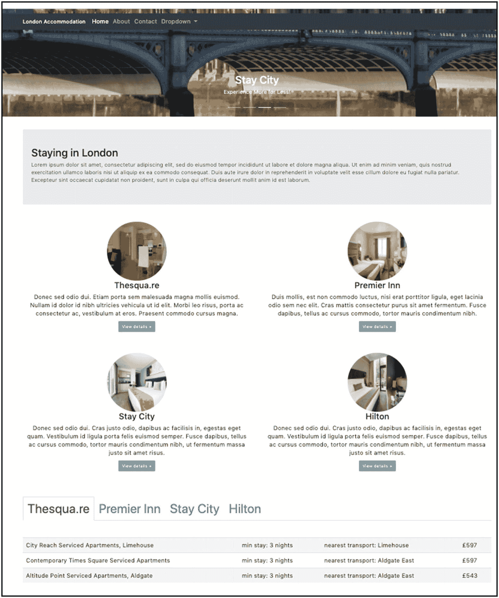

图 5-21

任务页面

1.  创建如下所示的网页(图 5-21 )。

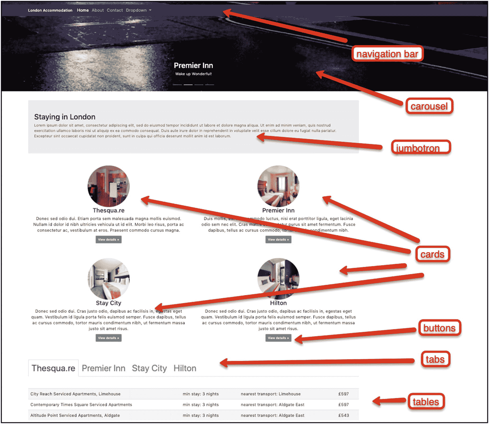

图 5-22

任务页面的元素

1.  这是一个包含以下元素的页面(图 5-22 )。

## 关键要点

*   制表符

*   警报

*   进度条

*   信用卡

*   旋转木马

在下一章中，你将学习 Twitter Bootstrap 如何帮助你创建一个背景被图片覆盖的页面。