# 六、封面项目

这一章教你如何设计导航条的样式，以及如何用一个背景图片来覆盖你网站的整个页面。此外，它还教你一种技术，无论内容的高度如何，都可以垂直对齐。

您将创建如下所示的页面(图 6-1 )。

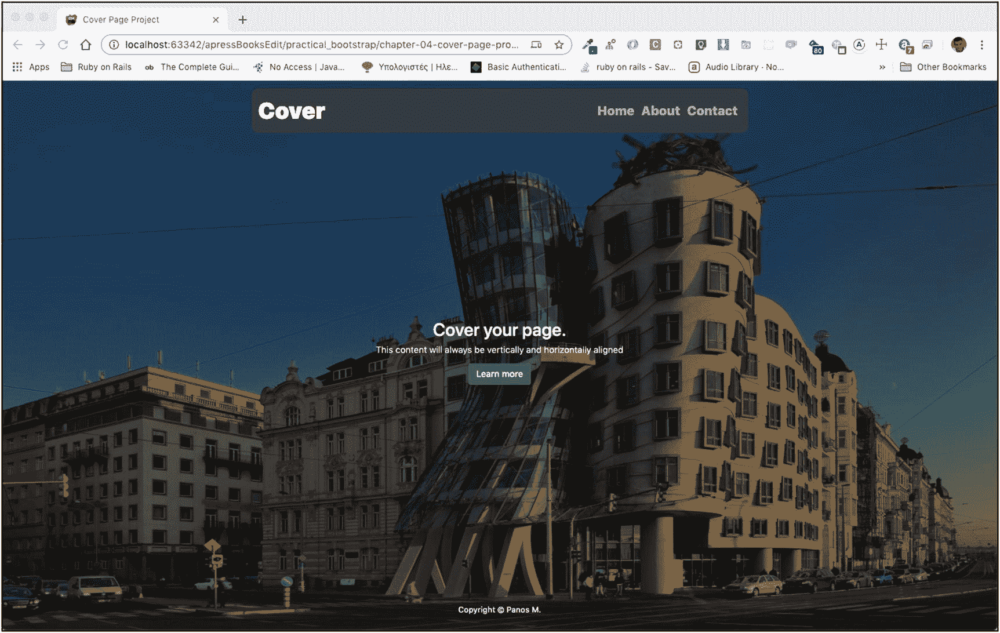

图 6-1

封面项目

## 学习目标

1.  了解如何将导航栏的非品牌选项拉到右边。

2.  了解如何使用`table/table-cell`技术使内容垂直和水平居中。

## 介绍

这一章将教你如何创建另一个好看的 Twitter 引导项目。我称之为封面项目，因为它包含了覆盖整个浏览器页面的大背景图像。所有内容都显示在这一页的顶部。

这个练习的目的是将一些 Twitter Bootstrap 知识与你在《掌握 HTML & CSS 这本书里学到的一些技巧结合起来，这些技巧并不是 Twitter Bootstrap 特有的。

这是您将要构建的页面(图 6-2 )。


图 6-2

您将构建的页面

## 本页值得注意的事情

1.  有一个背景图片覆盖了整个页面。

2.  无论页面大小如何，图像都会覆盖页面。

3.  虽然原始图像很亮，但页面上显示的图像亮度降低了。这有助于覆盖图像的文本具有更好的对比度，并且更容易阅读。

4.  顶部导航栏类似于我们之前构建的导航栏。但是，选项的非品牌部分向右对齐。

5.  此页面的主要内容垂直和水平居中。

6.  页面底部有一个固定的页脚，文本水平居中对齐。

## 空的 Twitter 引导页面

让我们从空的 Twitter 引导页面开始(清单 6-1 )。

```html
<!DOCTYPE html>
<html lang="en">
<head>
  <!-- Required meta tags -->
  <meta charset="utf-8">
  <meta name="viewport" content="width=device-width, initial-scale=1, shrink-to-fit=no">

  <!-- Bootstrap CSS -->
  <link rel="stylesheet" href="https://stackpath.bootstrapcdn.com/bootstrap/4.4.1/css/bootstrap.min.css" integrity="sha384-Vkoo8x4CGsO3+Hhxv8T/Q5PaXtkKtu6ug5TOeNV6gBiFeWPGFN9MuhOf23Q9Ifjh" crossorigin="anonymous">

  <!-- Custom CSS -->
  <link rel="stylesheet" href="stylesheets/main.css" type="text/css">

  <title>Cover Page Project</title>
</head>
<body>

  <!-- Optional JavaScript -->
  <!-- jQuery first, then Popper.js, then Bootstrap JS -->
  <script src="https://code.jquery.com/jquery-3.4.1.slim.min.js" integrity="sha384-J6qa4849blE2+poT4WnyKhv5vZF5SrPo0iEjwBvKU7imGFAV0wwj1yYfoRSJoZ+n" crossorigin="anonymous"></script>
  <script src="https://cdn.jsdelivr.net/npm/popper.js@1.16.0/dist/umd/popper.min.js" integrity="sha384-Q6E9RHvbIyZFJoft+2mJbHaEWldlvI9IOYy5n3zV9zzTtmI3UksdQRVvoxMfooAo" crossorigin="anonymous"></script>
  <script src="https://stackpath.bootstrapcdn.com/bootstrap/4.4.1/js/bootstrap.min.js" integrity="sha384-wfSDF2E50Y2D1uUdj0O3uMBJnjuUD4Ih7YwaYd1iqfktj0Uod8GCExl3Og8ifwB6" crossorigin="anonymous"></script>
</body>
</html>

Listing 6-1Empty Twitter Bootstrap Page

```

将前面的文件另存为`index.html`，并创建一个空文件`stylesheets/main.css`。如果你在浏览器上加载这个页面，你会看到一个空页面，但是加载了 Twitter 引导。

## 背景图像

你应该已经知道如何应用背景图片了(如果没有，请看我之前的书 *Master HTML & CSS* ，其中有第 [22](https://doi.org/10.1007/978-1-4842-6071-5_22) 章题为“图片背景”)。我们将在该页面的`body`元素上这样做。将以下规则添加到您的`stylesheets/main.css`文件中(清单 6-2 )。

```html
html {
    height: 100%;
    background-color: White;
}

body {
    min-height: 100%;
    background-color: #2b542c;
    background-image: url("img/prague-czech-republic.jpg");
    background-repeat: no-repeat;
    background-attachment: fixed;
    background-position: left top;
    background-size: 100% 100%;
}

Listing 6-2CSS File Contents

```

这很标准。

如果您保存并重新加载页面，您将看到以下内容(图 6-3 )。

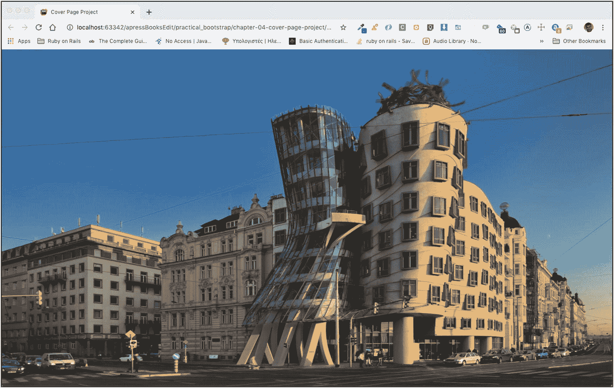

图 6-3

应用于 Body 元素的背景图像

如图 6-3 所示，图像显示清晰。它覆盖了整个浏览器窗口，如果您尝试调整窗口大小，您会看到它会自动调整以覆盖新的窗口大小。

## 图像亮度

让我们看看如何降低图像的亮度。我们绝对可以使用 GIMP 或 Adobe Photoshop 这样的图像编辑软件来改变图像的亮度。但是，如果你不知道如何做到这一点，或者如果你不想改变原来的形象，你可以随时做以下技巧。

您将一个`div`元素定义为`body`元素的子元素。这个`div`将被绝对定位在页面的左上角，并将覆盖其父`body`元素的整个宽度和高度。让我们称之为`div cover`分部。`cover div`需要有一个黑色的背景色，但是要有一些透明度，这样它后面的一些图像颜色就可以被看到。你可以试试`rgba(0, 0, 0, 0.5)`。

就这么办吧。

添加`cover` div:

```html
<body>

    <div id="cover"></div>

</body>

```

然后添加以下 CSS 规则:

```html
body {
    position: relative;
}
#cover {
    position: absolute;
    width: 100%;
    height: 100%;
    top: 0;
    left: 0;
    background-color: rgba(0, 0, 0, 0.5);
}

```

正如您在前面的代码中看到的那样，`#cover`上的`position: absolute;`正确工作的先决条件是其父元素`body`具有非静态定位。这就是为什么我们将`position: relative;`设置为`body`元素。

如果保存前面的代码并在浏览器上重新加载页面，您将看到图 6-4 。


图 6-4

应用了透明度的黑色封面

这正是你想要达到的结果。背景图像现在有点暗，所以你在背景图像上叠加的任何文字都很容易阅读。

## 导航栏

我们现在要附加一个导航栏，就像我们在前面的章节中所做的那样。

在`cover div`后增加以下内容(清单 6-3 )。

```html
<nav id="navigation-bar-container" class="navbar navbar-expand-lg navbar-dark bg-dark fixed-top">
    <a class="navbar-brand" href="#">Cover</a>
    <button type="button" class="navbar-toggler" data-toggle="collapse" data-target="#navbar" aria-expanded="false" aria-controls="navbar">
        <span class="navbar-toggler-icon"></span>
    </button>

    <div id="navbar" class="collapse navbar-collapse">
        <ul class="nav navbar-nav">
            <li class="nav-item"><a class="nav-link" href="#">Home</a></li>
            <li class="nav-item"><a class="nav-link" href="#about">About</a></li>
            <li class="nav-item"><a class="nav-link" href="#contact">Contact</a></li>
        </ul>
    </div>

</nav>

Listing 6-3HTML Fragment for the Navigation Bar

```

如果您保存页面的 HTML 内容并在浏览器上重新加载，您将看到以下内容(图 6-5 )。

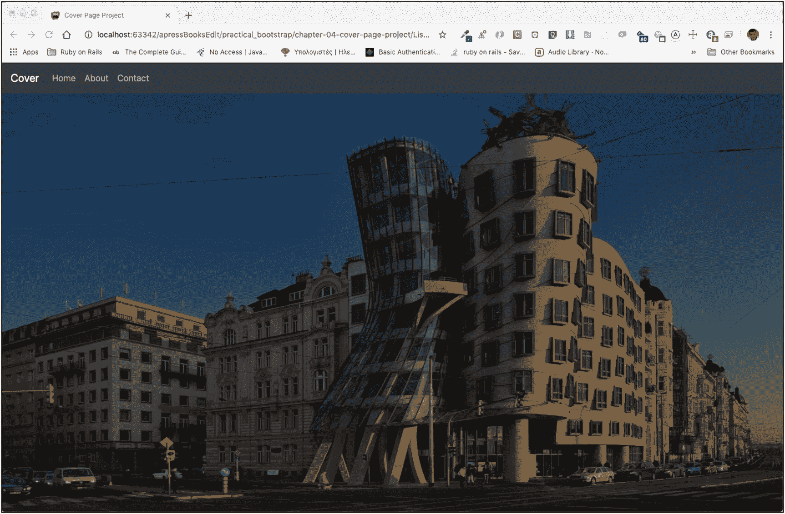

图 6-5

增加了标准引导导航栏

如果你注意清单 6-3 中的代码，你会看到在 toggler 按钮之前定义了品牌链接(见图 6-6 )。

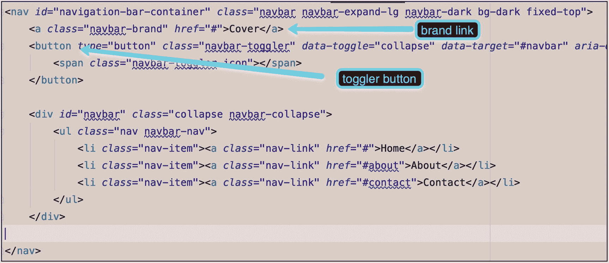

图 6-6

Toggler 按钮前的品牌链接

这将使 toggler 按钮出现在最右边。尝试缩短显示器的宽度，您将看到以下内容(图 6-7 )。

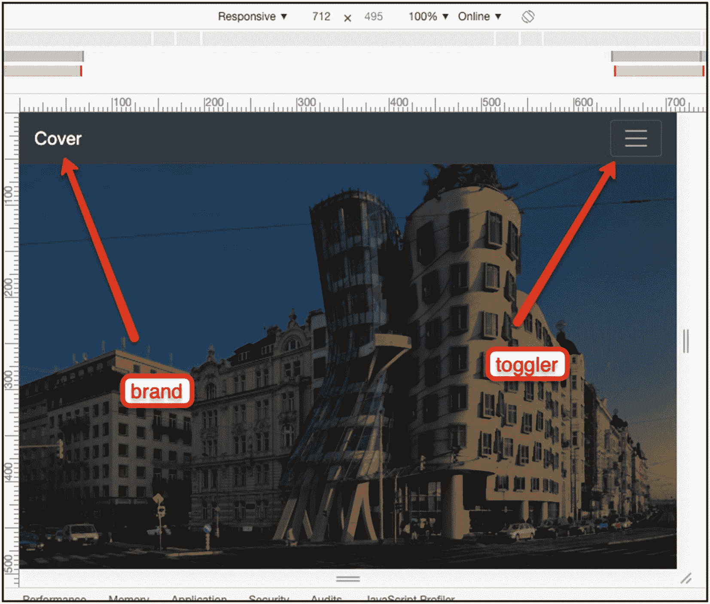

图 6-7

托格勒出现在最右边

尝试切换 HTML 片段的位置，首先是按钮，然后是品牌链接，如清单 6-4 所示。

```html
<button type="button" class="navbar-toggler" data-toggle="collapse" data-target="#navbar" aria-expanded="false" aria-controls="navbar">
    <span class="navbar-toggler-icon"></span>
</button>
<a class="navbar-brand" href="#">Cover</a>

Listing 6-4First, the Toggler Button and Then the Brand Link

```

这将使品牌链接出现在导航栏的最右边，toggler 出现在最左边。参见图 6-8 。

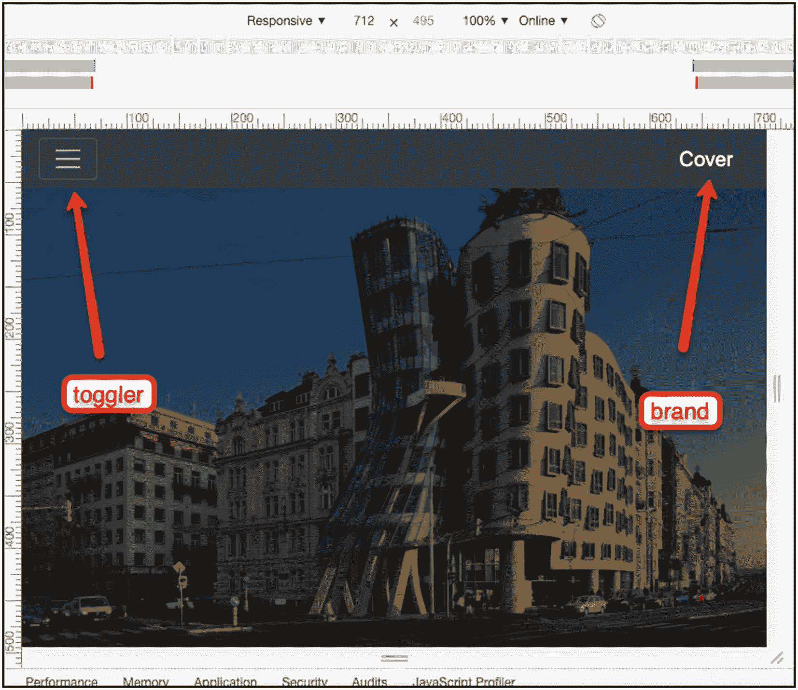

图 6-8

托格勒左，品牌链接右

到目前为止，一切都很好，但是如果你仔细看你想要实现的页面，你会注意到

*   导航栏的左右两边都有一些边距。它不会占据页面的整个宽度。

*   此外，它上面还有一些空白。

*   最后，它的边框有圆角。

在您实际实现前面的需求之前，您还将再设置一个。对于超小型和小型设备，您希望导航条是全宽的，但是对于所有其他情况，导航条只有页面宽度的 50%。

以下 CSS 规则将满足这些要求(清单 6-5 )。

```html
#navigation-bar-container {
    margin: 10px auto;
    border-radius: 10px;
}

@media (min-width: 768px) {
    #navigation-bar-container {
        width: 50%;
    }
}

Listing 6-5CSS Rules for Navigation Bar Requirements

```

从前面的代码中可以看出，导航栏的默认宽度是`100%,`，因为它是一个 div。您正在使用一个`@media`查询规则，以便为更大的设备将其转换为`50%`。

在样式表/main.css 中添加上述规则，并在浏览器中重新加载页面。您将看到图 6-9 中描述的内容(假设您有一个宽度为> =768px 的显示器)。

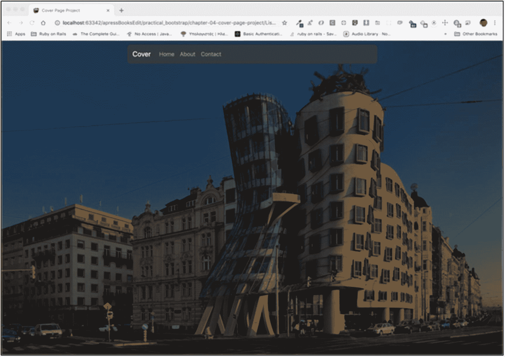

图 6-9

在大型设备上显示的导航栏

如果你将浏览器窗口缩小到 768px 以下，你会看到导航条占据了整个宽度(图 6-10 )。

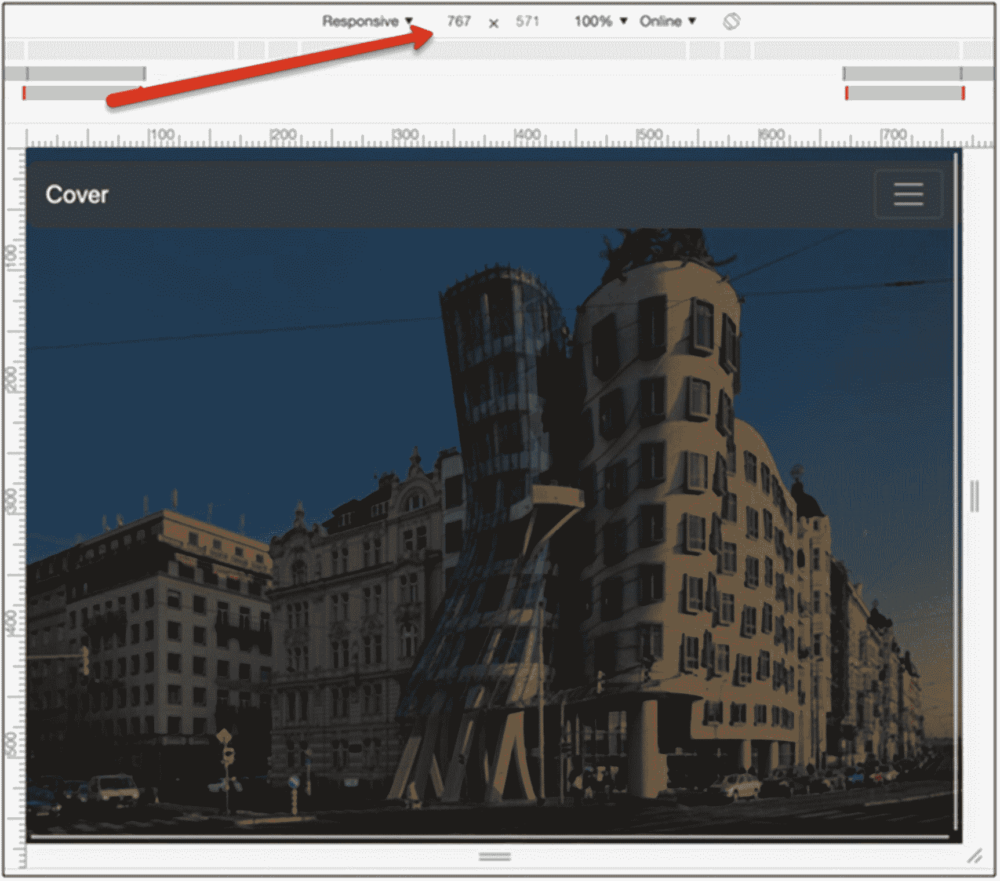

图 6-10

在< 768px 的设备上，导航栏占据了整个页面宽度

进一步在导航栏上工作，你现在要实现的是把菜单的非品牌选项拉到右边。这可以用需要应用到持有这些选项的`ul`的`ml-auto` Twitter Bootstrap 实用程序类轻松完成。

让我们加上`ml-auto`。而不只是

```html
<ul class="nav navbar-nav">

```

写

```html
<ul class="nav navbar-nav ml-auto">

```

`ml-auto`翻译成*页边距左自动*。换句话说，`ul`元素的左边距将自动设置为最大可用值。

如果您保存前面的代码并在浏览器上重新加载页面，您将看到以下内容(图 6-11 )。

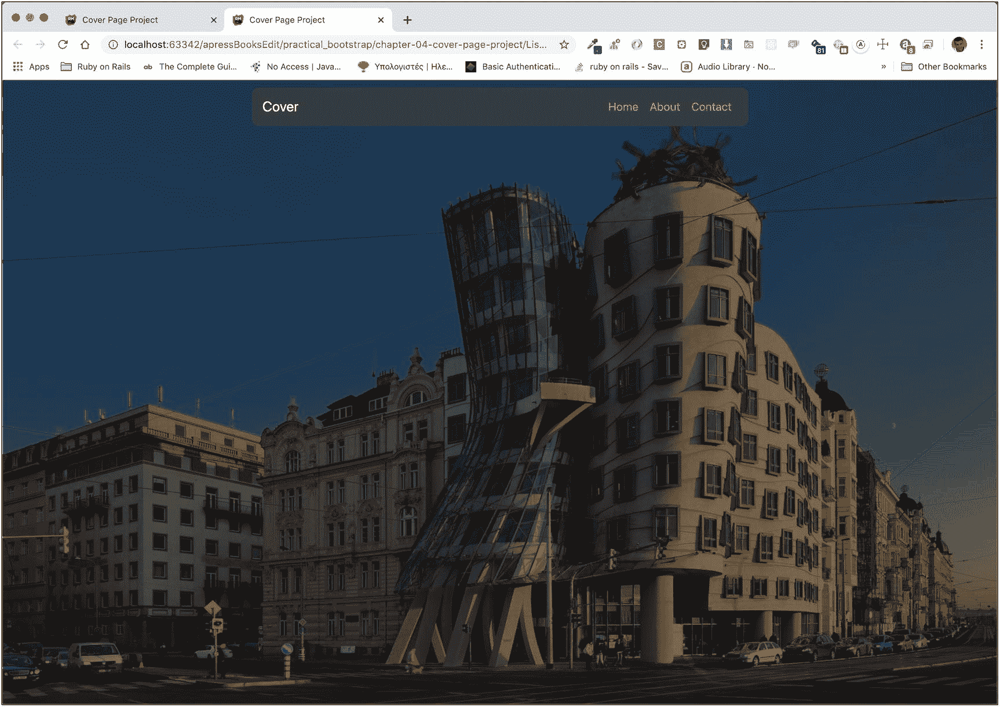

图 6-11

选项移至右侧

您尚未使用完导航栏。如果将当前版本与原始版本进行比较，您会发现字体大小和颜色有所不同。

让我们就此对 CSS 规则做如下修改(清单 6-6 )。

```html
#navigation-bar-container a.navbar-brand,
#navbar ul a {
    font-weight: 900;
}

#navigation-bar-container a.navbar-brand {
    font-size: 3.2rem;
}

#navbar ul a {
    font-size: 1.8rem;
}

Listing 6-6CSS Amendments for Font and Color of the Nav Bar

```

如果您保存前面的代码并在浏览器上重新加载页面，您将看到以下内容(图 6-12 )。

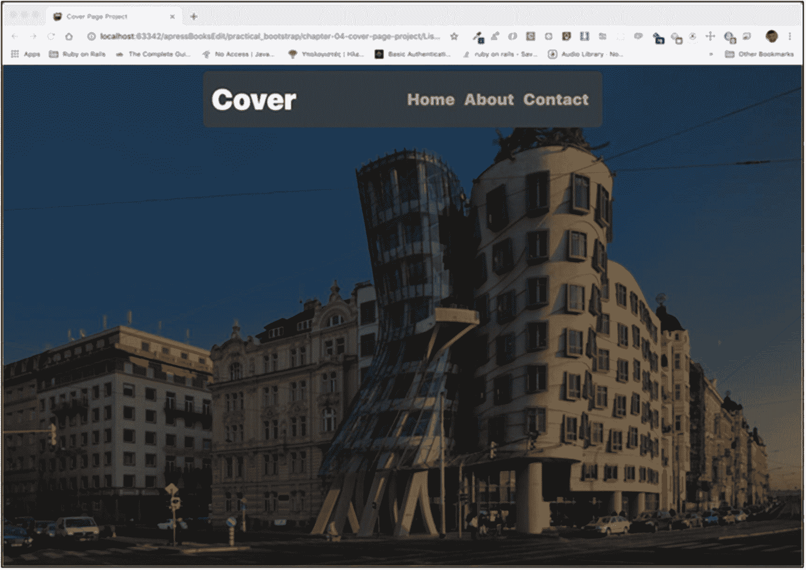

图 6-12

具有所需字体大小和颜色的导航栏

这些是必需的字体大小和颜色属性。这样，你就完成了导航条的工作。

## 页面中央的内容

您继续尝试实现以下内容(图 6-13 )。

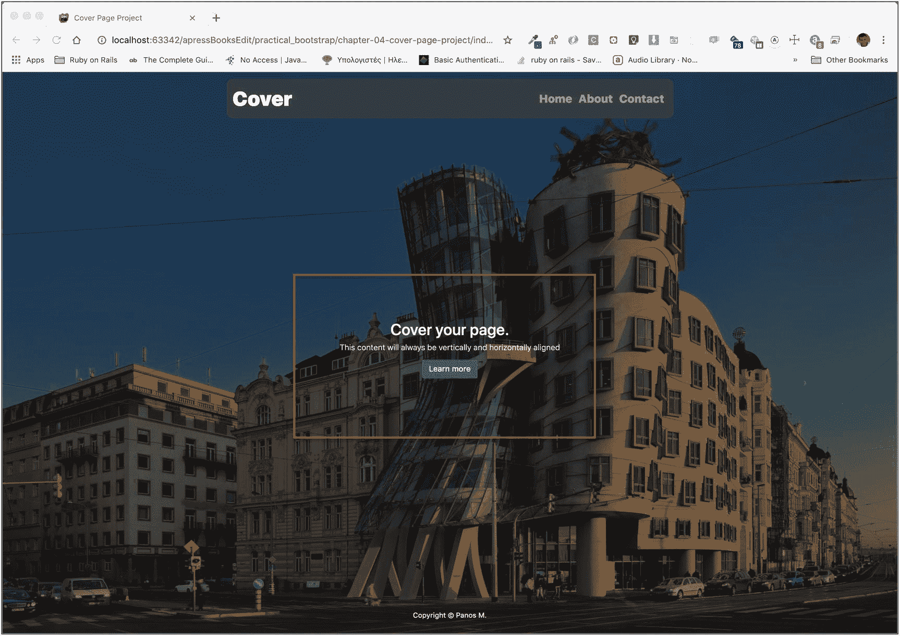

图 6-13

页面中央的内容

有一些 HTML 内容出现在页面的中央，水平和垂直都有。首先，让我们添加 HTML 内容(清单 6-7 )。

```html
<div id="center-content">
  <h1>Cover your page.</h1>
  <p class="lead">This content will always be vertically and horizontally aligned</p>
  <p class="lead">
    <a href="#" class="btn btn-lg btn-success">Learn more</a>
  </p>
</div>

Listing 6-7Content on the Center of the Page

```

将前面的代码添加到`nav`元素的下面，在`body`元素的结尾之前。这都是非常简单的 HTML 代码。在前面的章节中，你已经了解了这一点。

让我们保存并在您的浏览器上重新加载页面。您将看到以下内容(图 6-14 )。

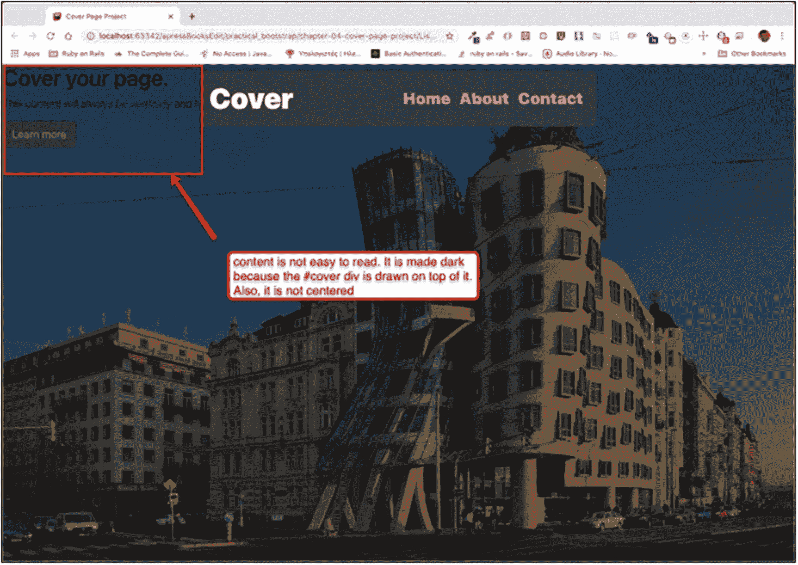

图 6-14

内容放在左上方—不容易阅读

如您所见，内容已经放在左上方。而且不容易读懂。这就是我们必须介绍我们的`z-index`技能的地方，因为看起来`#cover div`是在我们刚才放进去的内容之后画出来的。

但是等等！为什么我们在导航栏上没有同样的问题？这是因为导航栏已经有了带有正整数`z-index`的`position: fixed`(等于`1030`——你只需要用开发工具检查一下就可以确认)，而我们的`#center-content div`有了`position static`。因此`#center-content`是第一个未定位的元素:

1.  `body`被定位，因为它有`position relative`。

2.  `#cover`被定位，因为它有`position absolute`。

3.  `#navigation-bar-container`被定位，因为它有`position fixed`。

如果你读了我上一本书 *Master HTML & CSS* 的第 [23](https://doi.org/10.1007/978-1-4842-6071-5_23) 章“元素定位”，你就会知道，如果你控制了定位元素和非定位元素所属的堆栈上下文，它们会玩得很好。每当您使用值不同于`auto`的`z-index`属性时，就会启动一个新的堆栈上下文。

换句话说，您将通过将`z-index: 0`设置为`body`元素来开始一个新的堆栈上下文。然后，`#cover`将有一个等于`-1`的 z-index，因为您希望它位于 body 元素中每个非定位元素的后面。同样，确保你阅读了我上一本书*中第 [23 章](https://doi.org/10.1007/978-1-4842-6071-5_23)“定位”的最后一部分，其中我解释了浏览器绘制事物的顺序。*

说到这里，请继续对`body`和`#cover` CSS 规则进行以下修改:

```html
body {
  ...
  z-index: 0;
}

#cover {
  ...
  z-index: -1;
}

```

如果您在浏览器上保存并加载页面，您将看到以下内容(图 6-15 )。

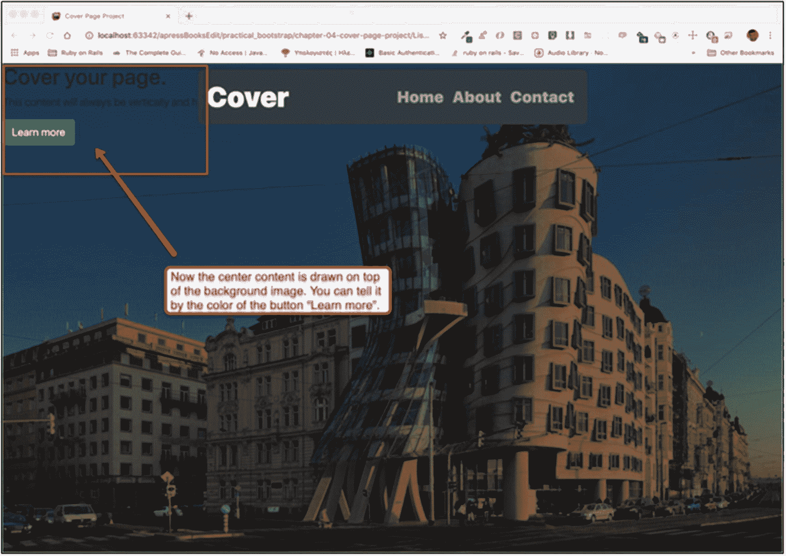

图 6-15

前景上的内容，但仍然难以阅读文本

从按钮的颜色可以看出，内容现在绘制在前景上。但是，你仍然不能轻松地阅读文本，尽管这只是文本颜色的问题。

先换个颜色吧。您将确保任何文本元素的颜色都是`white`。将`color: white;`添加到 CSS 文件中的`body`元素中。

如果您这样做并重新加载页面，您将看到以下内容(图 6-16 )。

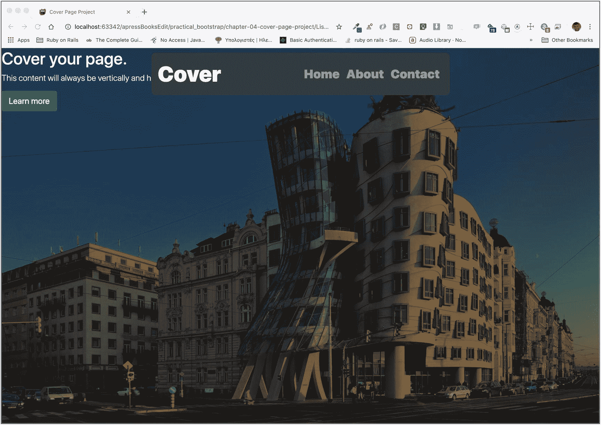

图 6-16

内容现在具有正确的颜色

那很好。内容颜色看起来不错。现在，你需要确定位置。

为了固定位置，您将使用`table/table-cell`技术:

1.  您将告诉浏览器假设包含主要内容的`div`是一个表格单元格。您可以通过为这个元素设置`display: table-cell;`来实现。

2.  您将告诉浏览器假设父元素，也称为`body`，是一个表。你可以通过为`body`元素设置`display: table;`来实现。

3.  您希望表格(`body`)占据由其父表格(`html`)定义的所有可用空间。出于这个原因，您将为`body`元素定义`width:100%; height: 100%;`。

4.  您希望文档根目录占据浏览器窗口给定的所有可用空间。因此，您也将为`html`元素设置`width: 100%; height: 100%;`。

5.  您将告诉表格单元格(`center-content div`)将其内容水平居中(`text-align: center;`)和垂直居中(`vertical-align: middle;`)。

以下是规则(列出 6-8 )。

```html
html {
    width: 100%;
    height: 100%;
}

body {
    display: table;
    width: 100%;
    height: 100%;
}

#center-content {
    display: table-cell;
    text-align: center;
    vertical-align: middle;
}

Listing 6-8CSS Rules to Make Content Vertically and Horizontally Centered

```

如果您将前面的规则保存在 CSS 文件中，并在浏览器上重新加载页面，您将看到以下内容(图 6-17 )。

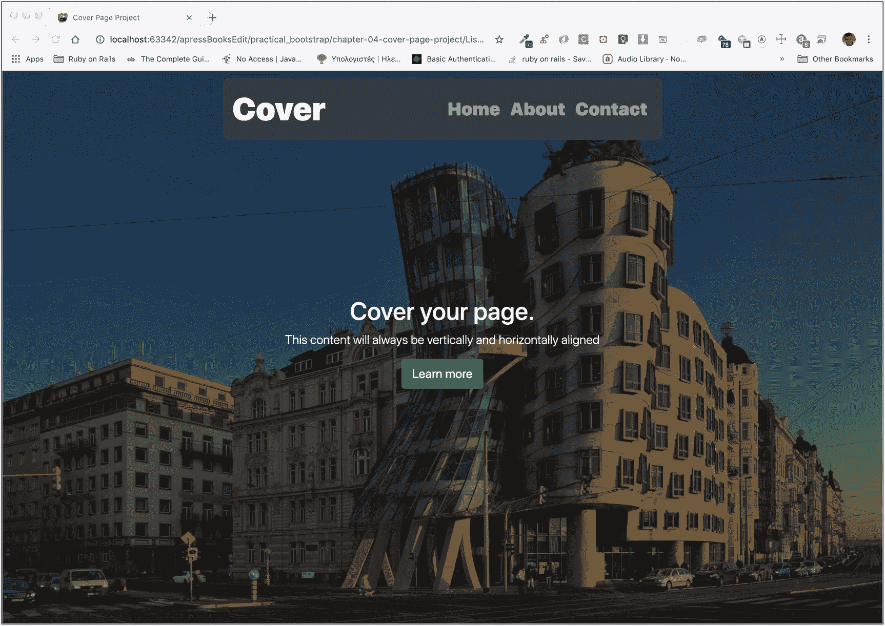

图 6-17

内容正确地放置在页面中央

Note

还有其他技术可以用来垂直居中内容。这种技术和`table/table-cell`一起确保了即使你改变了实际的内容，顶部和底部的边距也会自动调整。

## 页脚

现在剩下的就是创建页脚了。这非常简单。让我们先添加`footer`元素:

```html
<footer id="footer-content">
  <small>Copyright &copy; Panos M.</small>
</footer>

```

在关闭正文之前，添加前面的代码。保存内容并在浏览器上重新加载页面。您将看到以下内容(图 6-18 )。

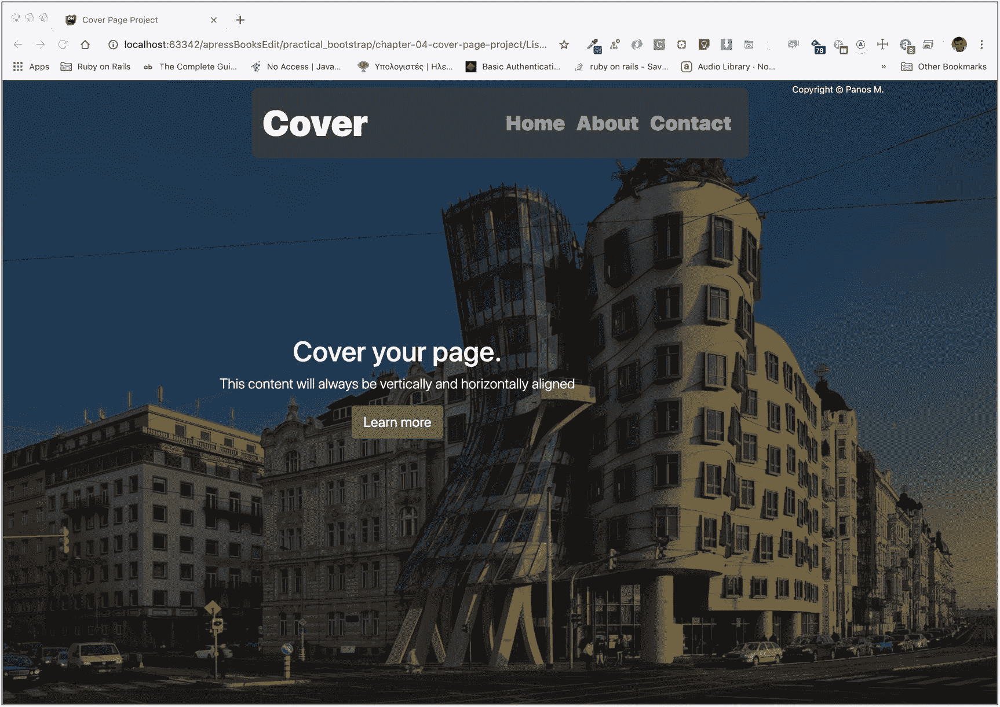

图 6-18

添加了页脚，但布局被破坏

布局已经被破坏了。但这很容易解决。您需要指定页脚的位置属性:

```html
#footer-content {
    position: absolute;
    bottom: 20px;
    left: 0;
    width: 100%;
    text-align: center;
}

```

您需要将上述代码添加到 CSS 规则中。页脚需要有`position absolute`。保存 CSS 文件并在浏览器上重新加载页面。您将看到以下内容(图 6-19 )。

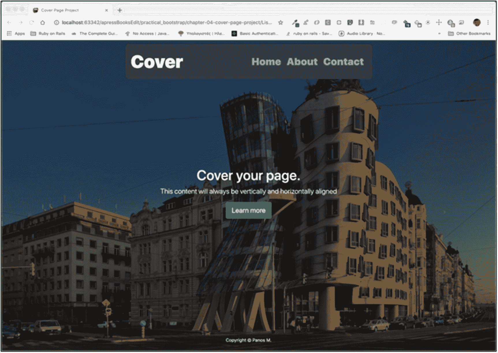

图 6-19

更正页脚位置后，页面就准备好了

更正页脚位置后，页面就准备好了。

## 结束语

您已经看到了如何将导航栏选项放在导航栏的右侧。您还了解了垂直和水平居中内容的技巧。

## 任务和测验

Task Details

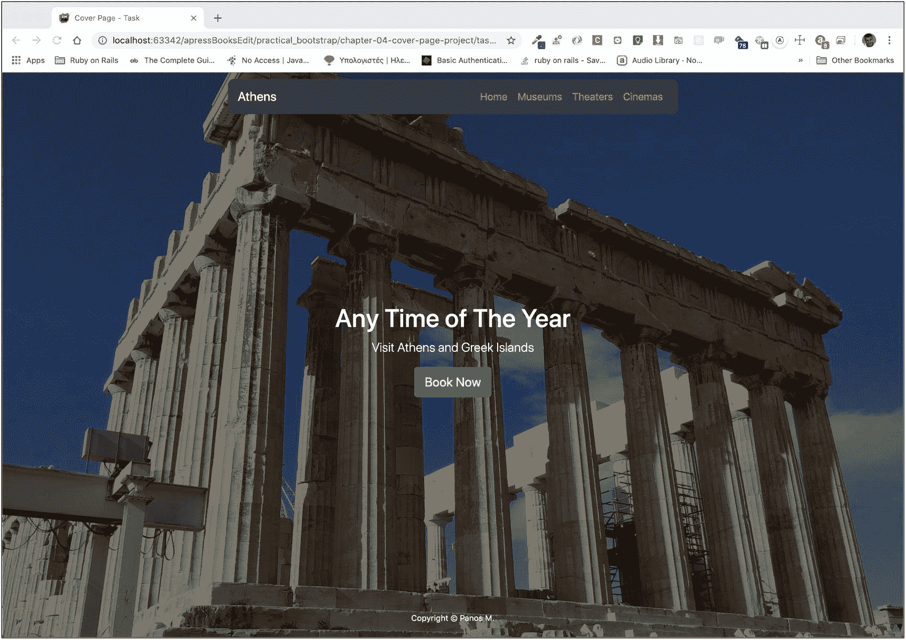

图 6-20

任务，封面-游览雅典

1.  创建如下所示的网页(图 6-20 )。

1.  它类似于您在章节中构建的页面。但是在导航栏上还是有区别的。你能看到吗？

## 关键要点

*   如何设计导航条的样式并将链接放在右边

*   如何显示背景图像

*   如何在页面中央显示内容

*   如何在页面底部放置页脚

在下一章中，您将学习如何创建一个管理仪表板页面。