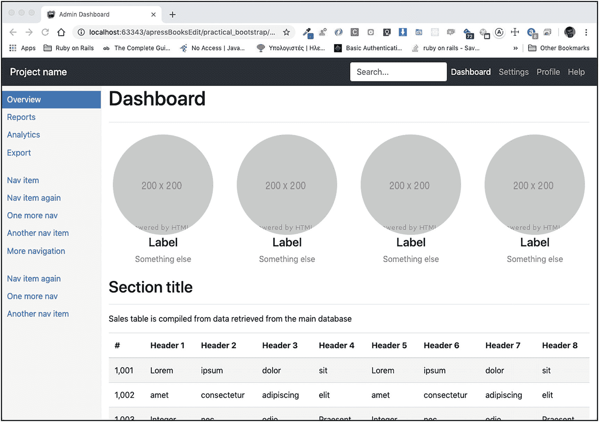

# 七、管理仪表板

在本章中，我们将努力构建一个 Twitter 引导管理仪表板，如下所示(图 7-1 )。


图 7-1

基本管理仪表板

类似图 7-1 中的站点有一个固定位置的侧边栏。侧边栏在超小型设备上消失，仪表板根据设备显示宽度改变其布局。

此外，该表反应灵敏，可以在大型和小型显示器上同样良好地显示。

您还将学习各种其他新概念，比如如何以圆形显示图像，或者如何使用特定于文本颜色的类来改变文本颜色。

## 学习目标

1.  了解如何在导航栏中使用`container`或`container-fluid`元素。

2.  了解如何在导航栏中附加搜索表单。

3.  了解如何将导航栏搜索表单向右移动。

4.  了解如何定义导航栏搜索表单的正确垂直位置。

5.  学习如何用`form-control`类快速设计输入控件的样式。

6.  了解如何在左侧创建边栏。

7.  了解如何使侧边栏扩展到全高。

8.  了解如何使侧边栏保持在同一位置，即使用户滚动页面的主要内容。

9.  了解如何使用可见性类根据显示宽度显示和隐藏页面的各个部分。

10.  了解如何在 div 的一侧添加边框。

11.  了解如何让一个 div 占据 100%的可用高度。

12.  了解如何让一个`ul`元素的内容占据整个可用宽度。

13.  了解如何创建底部有水平线的漂亮页眉。

14.  了解如何以圆形显示图像。

15.  了解文本对齐类。

16.  学习如何使用响应式图像。

17.  了解影响文本颜色的类。

18.  了解如何创建响应式表格。

19.  了解如何应用多种 Twitter 引导技术来创建一个类似管理员的布局。

## 介绍

在本章中，您将使用 Twitter Bootstrap 工具创建一个基本的管理仪表板页面。

Note

这是一个很长的章节，有很多新的东西需要你去学习。但是，在你做了一些额外的工作后，你会得到最终结果的回报。

图 7-2 可以看到最后一页。


图 7-2

基本管理仪表板

该页面的特征如下:


图 7-3

超小型设备上的管理仪表板

1.  它有一个导航栏，其内容扩展了整个页面的宽度。

2.  导航栏非品牌选项靠右对齐。

3.  导航栏内有一个搜索表单。

4.  有一个带有导航选项的左侧栏。我们称之为左侧导航栏。

5.  超小型设备上不显示左侧导航栏(图 7-3 )。

## 空的 Twitter 引导页面

让我们从空的 Twitter 引导页面开始(清单 7-1 )。

```html
<!DOCTYPE html>
<html lang="en">
<head>
  <!-- Required meta tags -->
  <meta charset="utf-8">
  <meta name="viewport" content="width=device-width, initial-scale=1, shrink-to-fit=no">

  <!-- Bootstrap CSS -->
  <link rel="stylesheet" href="https://stackpath.bootstrapcdn.com/bootstrap/4.4.1/css/bootstrap.min.css" integrity="sha384-Vkoo8x4CGsO3+Hhxv8T/Q5PaXtkKtu6ug5TOeNV6gBiFeWPGFN9MuhOf23Q9Ifjh" crossorigin="anonymous">

  <!-- Custom CSS -->
  <link rel="stylesheet" href="stylesheets/main.css" type="text/css">

  <title>Admin Dashboard</title>
</head>
<body>

  <!-- Optional JavaScript -->
  <!-- jQuery first, then Popper.js, then Bootstrap JS -->
  <script src="https://code.jquery.com/jquery-3.4.1.slim.min.js" integrity="sha384-J6qa4849blE2+poT4WnyKhv5vZF5SrPo0iEjwBvKU7imGFAV0wwj1yYfoRSJoZ+n" crossorigin="anonymous"></script>
  <script src="https://cdn.jsdelivr.net/npm/popper.js@1.16.0/dist/umd/popper.min.js" integrity="sha384-Q6E9RHvbIyZFJoft+2mJbHaEWldlvI9IOYy5n3zV9zzTtmI3UksdQRVvoxMfooAo" crossorigin="anonymous"></script>
  <script src="https://stackpath.bootstrapcdn.com/bootstrap/4.4.1/js/bootstrap.min.js" integrity="sha384-wfSDF2E50Y2D1uUdj0O3uMBJnjuUD4Ih7YwaYd1iqfktj0Uod8GCExl3Og8ifwB6" crossorigin="anonymous"></script>
</body>
</html>

Listing 7-1Empty Twitter Bootstrap Page

```

## 导航栏

您将添加和使用的第一个东西是导航栏。

### 标准导航栏内容

让我们添加标准的导航栏。清单 7-2 包含了导航栏的 HTML 片段，您必须将它添加为`body`元素的第一个子元素。

```html
<nav class="navbar navbar-expand-lg navbar-dark bg-dark fixed-top">
    <button type="button" class="navbar-toggler" data-toggle="collapse" data-target="#navbar"
            aria-controls="navbar"
            aria-expanded="false"
            aria-label="Toggle navigation">
        <span class="navbar-toggler-icon"></span>
    </button>

    <a class="navbar-brand" href="#">Project name</a>

    <div class="collapse navbar-collapse" id="navbar">
        <ul class="nav navbar-nav">
            <li class="nav-item">
                <a class="nav-link active" href="#">Dashboard <span class="sr-only">(current)</span></a>
            </li>
            <li class="nav-item">
                <a class="nav-link" href="#settings">Settings</a>
            </li>
            <li class="nav-item">
                <a class="nav-link" href="#profile">Profile</a>
            </li>
            <li class="nav-item">
                <a class="nav-link" href="#help">Help</a>
            </li>
        </ul>
    </div>
</nav>

Listing 7-2Navigation Bar

```

如果您保存并重新加载您的页面，您将看到以下内容(图 7-4 )。


图 7-4

添加导航栏

### 向右对齐

导航栏的主要选项靠左对齐。你需要把他们带到右边。您已经通过使用`ml-auto`类学会了如何做到这一点。让我们将`ml-auto`类添加到保存主要导航选项的`ul`中(列出 7-3 )。

```html
<nav class="navbar navbar-expand-lg navbar-dark bg-dark fixed-top">
    <button type="button" class="navbar-toggler" data-toggle="collapse" data-target="#navbar"
            aria-controls="navbar"
            aria-expanded="false"
            aria-label="Toggle navigation">
        <span class="navbar-toggler-icon"></span>
    </button>

    <a class="navbar-brand" href="#">Project name</a>

    <div class="collapse navbar-collapse" id="navbar">
        <ul class="nav navbar-nav ml-auto">
            <li class="nav-item">
                <a class="nav-link active" href="#">Dashboard <span class="sr-only">(current)</span></a>
            </li>
            <li class="nav-item">
                <a class="nav-link" href="#settings">Settings</a>
            </li>
            <li class="nav-item">
                <a class="nav-link" href="#profile">Profile</a>
            </li>
            <li class="nav-item">
                <a class="nav-link" href="#help">Help</a>
            </li>
        </ul>
    </div>
</nav>

Listing 7-3Adding the ml-auto Class to the ul Element

```

保存更改并在浏览器上重新加载页面。您将看到以下内容(图 7-5 )。


图 7-5

导航选项向右拉

### 添加搜索表单

您希望在顶部导航栏中添加一个搜索表单。这不会是选项列表的一部分，但它需要是切换到小设备时折叠的`div`的一部分，也就是说，是`#navbar` div 的一部分。

让我们将下面的代码放在`#navbar` div 中，但是在带有导航选项的`ul`之前:

```html
<form>
    <input type="text" placeholder="Search...">
</form>

```

因此，`nav`元素需要如下所示(清单 7-4 )。

```html
<nav class="navbar navbar-expand-lg navbar-dark bg-dark fixed-top">
    <button type="button" class="navbar-toggler" data-toggle="collapse" data-target="#navbar"
            aria-controls="navbar"
            aria-expanded="false"
            aria-label="Toggle navigation">
        <span class="navbar-toggler-icon"></span>
    </button>

    <a class="navbar-brand" href="#">Project name</a>

    <div class="collapse navbar-collapse" id="navbar">
        <form>
            <input type="text" placeholder="Search...">
        </form>

        <ul class="nav navbar-nav ml-auto">
            <li class="nav-item">
                <a class="nav-link active" href="#">Dashboard <span class="sr-only">(current)</span></a>
            </li>
            <li class="nav-item">
                <a class="nav-link" href="#settings">Settings</a>
            </li>
            <li class="nav-item">
                <a class="nav-link" href="#profile">Profile</a>
            </li>
            <li class="nav-item">
                <a class="nav-link" href="#help">Help</a>
            </li>
        </ul>

    </div>
</nav>

Listing 7-4Navigation Bar with Search Form

```

如果您保存前面的代码并重新加载页面，您将看到以下内容(图 7-6 )。


图 7-6

导航栏中的搜索表单

搜索表单已经放在了导航栏里面。但是我们想把它移到右边。如果你在表单上添加了`ml-auto`类，你会得到如下结果(图 7-7 )。


图 7-7

`ml-auto`搜索表单上的类别

搜索表单不在最右边，而是在选项的左边，因为您需要从`ul`中移除`ml-auto`类。你不能同时在搜索表单和`ul`元素上。

继续将`ml-auto`从`ul`元件上移除。如果您保存并重新加载页面，您将看到以下内容(图 7-8 )。


图 7-8

位于右侧的搜索表单

有两个类可以应用于搜索表单，这将使它看起来更好。我将在下一章讨论这些类，但是没有什么可以阻止你现在使用它们来设计搜索表单:

*   在表单 HTML 元素上使用类`form-inline`。

*   在输入 HTML 元素上使用类`form-control`。

因此，表单标记应该如下所示:

```html
<form class="form-inline ml-auto">
    <input type="text" placeholder="Search..." class="form-control">
</form>

```

如果您在浏览器上保存并重新加载页面，您将看到以下内容(图 7-9 )。


图 7-9

带有样式类的搜索表单

您已经完成了顶部导航栏。既然您已经在其中引入了搜索表单，那么最好检查一下当页面在小型设备上显示时，这个搜索表单是如何显示的(图 7-10 )。


图 7-10

小型设备上的搜索表单和菜单选项

前面布局中的搜索表单有问题。它上面没有任何边距。如果有一些像下面这样的上边距就更好了(图 7-11 )。


图 7-11

带有上边距的搜索表单

为了实现这一点，您可以使用一个 sizing Bootstrap 实用程序类，例如`mt-3`，它添加了一个大小为 3 的上边距。将表单标记更改如下:

```html
<form class="form-inline ml-auto mt-3">
    <input type="text" placeholder="Search..." class="form-control">
</form>

```

并在浏览器上重新加载页面。切换到小显示器(如 iPhone X)设备。当你打开菜单时，你会看到顶部空白的搜索表单看起来更好，如图 7-11 所示。

但是，如果您切换回大显示设备，您将看到以下内容(图 7-12 )。


图 7-12

在大显示器上搜索表单上边距

正如你所看到的，因为`mt-3`的存在，导航栏的布局已经被破坏了。换句话说

*   当菜单选项折叠时，您只希望在小设备上使用`mt-3`。

*   当菜单选项展开时，你不想要`mt-3`。

您知道您的菜单在`lg`断点上展开(感谢`navbar-expand-lg`类)。因此，当你在`lg`断点之上时，为了否定`mt-3`类的效果，你将添加`mt-lg-0`类。因此，表单标记应该是

```html
<form class="form-inline ml-auto mt-3 mt-lg-0">
    <input type="text" placeholder="Search..." class="form-control">
</form>

```

同样，前面的标记在显示小于`lg`断点的设备上保留了`mt-3`，并在显示大于`lg`断点的设备上使用了类`mt-lg-0`。

如果您保存前面的代码并在浏览器上重新加载页面，您将看到导航栏恢复了正确的样式。而缩小到一个小显示屏上，依然能按预期工作。

## 使用 Flex 实用程序类对齐

您已经使用 margin 实用程序类将导航栏的项目向右对齐。但是 Twitter Bootstrap 严重依赖于 [flexbox](https://css-tricks.com/snippets/css/a-guide-to-flexbox/) 。它提供了可以用来相应地对齐内容的类。

例如，您可以使用类`flex-row-reverse`并让您的 HTML 标记逆序排列。这样做，您不需要在表单元素上使用`ml-auto`。见下文我的意思(列表 7-5 )。

1.  您已经在`ul`标记之后编写了`form`标记。

2.  您已经在包含菜单选项和搜索表单的`div`上添加了类`flex-row-reverse`。

3.  您已经从`form`标记中移除了边距类。

```html
<div class="collapse navbar-collapse flex-row-reverse" id="navbar">
    <ul class="nav navbar-nav">
        <li class="nav-item">
            <a class="nav-link active" href="#">Dashboard <span class="sr-only">(current)</span></a>
        </li>
        <li class="nav-item">
            <a class="nav-link" href="#settings">Settings</a>
        </li>
        <li class="nav-item">
            <a class="nav-link" href="#profile">Profile</a>
        </li>
        <li class="nav-item">
            <a class="nav-link" href="#help">Help</a>
        </li>
    </ul>
    <form class="form-inline">
        <input type="text" placeholder="Search..." class="form-control">
    </form>
</div>

Listing 7-5Using flex-row-reverse

```

如果您保存前面的代码并在浏览器上加载页面，您将看到以下内容(图 7-13 )。


图 7-13

使用 flex-row-reverse 在右侧绘制项目

如您所见，`flex-row-reverse div`的直接子元素是以相反的顺序绘制的，也就是说，首先是搜索`form`，然后是`ul`元素。

请注意，我们将`form`移到了`div`的底部，这使得小设备看起来也更好。搜索表单显示在底部。`flex-row-reverse`对这些设备没有任何影响，因为菜单选项是从上到下显示的(图 7-14 )。


图 7-14

搜索表单出现在底部

一切都好！现在，让我们移到左侧导航栏。

## 左侧导航栏

我们现在开始构建左侧导航栏(图 7-15 )。


图 7-15

左侧导航栏属性

如图 7-15 所示，左侧导航栏应该有一些属性:

1.  它的背景色不是白色；它更像是灰色的。

2.  活动菜单项具有白色和蓝色背景色。

3.  有三组菜单项，也就是三个不同的列表。

4.  它占据了页面的特定宽度。让我们假设中型、大型和超大型设备的宽度为六分之一(即 12 列中的两列)，小型设备的宽度为四分之一(即 12 列中的三列)。在超小型设备上，侧边栏将不可见。

### 布局

先说第四个属性。因为我们希望侧边栏占据页面宽度的一部分，所以我们将使用正确的网格类。在`nav`元素下添加以下内容(清单 7-6 )。

```html
<div id="main-container" class="container-fluid">
    <div class="row">
        <div class="col-sm-3 col-md-2">
            <!-- Left Sidebar Content will go here -->

        </div>

        <div id="main-content-container" class="col-sm-9 col-md-10">
            <!-- Main Content will go here -->

        </div>
    </div>
</div>

Listing 7-6Layout Markup

```

正如你在前面的代码中看到的，我们有一个侧边栏的`div`,它使用网格类`col-sm-3`用于小型设备，因此占据了 12 列中的 3 列，使用类`col-md-2`用于中型、大型和超大型设备，因此占据了 12 列中的 2 列。

主要内容将放在第二个`div`中，它也使用网格类`col-sm-9`和`col-md-10`，因此它占据了剩余的可用宽度。对于小型设备，它将占据 12 列中的 9 列；对于中型、大型和超大型设备，它将占据 12 列中的 10 列。

保存前面的内容。如果您在浏览器上再次加载该页面，您将看不到任何区别，因为侧边栏和主内容中没有任何实际内容。

### 侧边栏中的列表

您已经在左侧导航栏中确定了三个列表。让我们像往常一样用`ul`元素创建它们(列出 7-7 )。

```html
<div id="main-container" class="container-fluid">
    <div class="row">
        <div class="col-sm-3 col-md-2">
            <!-- Left Sidebar Content will go here -->

            <ul>
                <li class="active"><a href="#">Overview</a></li>
                <li><a href="#">Reports</a></li>
                <li><a href="#">Analytics</a></li>
                <li><a href="#">Export</a></li>
            </ul>

            <ul>
                <li><a href="#">Nav item</a></li>
                <li><a href="#">Nav item again</a></li>
                <li><a href="#">One more nav</a></li>
                <li><a href="#">Another nav item</a></li>
                <li><a href="#">More navigation</a></li>
            </ul>

            <ul>
                <li><a href="#">Nav item again</a></li>
                <li><a href="#">One more nav</a></li>
                <li><a href="#">Another nav item</a></li>
            </ul>

        </div>

        <div id="main-content-container" class="col-sm-9 col-md-10">
            <!-- Main Content will go here -->

        </div>
    </div>
</div>

Listing 7-7HTML with ul Elements for the Lists

```

如果您保存前面的代码并在浏览器上重新加载页面，您将看到以下内容(图 7-16 )。


图 7-16

左侧栏—添加了列表

你现在看到的一个问题是顶部列表被导航栏隐藏了。这是你过去曾经面临过的问题。您需要给正文内容一些顶部填充，至少等于导航栏的高度。你就给`56px`。

在`stylesheets/main.css`文件中，添加以下规则:

```html
body {
    padding-top: 56px;
}

```

在浏览器上保存并重新加载页面。您将看到以下内容(图 7-17 )。


图 7-17

导航栏不会隐藏列表

这是一个进步。现在，您将在列表上应用类`nav`。正如您在前面章节中所记得的，`ul`元素上的`nav`类删除了列表项上显示的默认项目符号。

继续将类`nav`添加到左侧导航栏的所有`ul`元素中。然后在浏览器上加载页面。您将看到以下内容(图 7-18 )。


图 7-18

应用于 ul 元素的类别`nav`

类`nav`已经从列表的元素中移除了项目符号。但它也做了其他事情。它把`ul`元素变成了`display flex`，`flex-wrap`等于`wrap`。这就是为什么你会看到`li`元素一个挨着一个。

因为您希望列表从上到下排列，所以您可以添加类`flex-column`,它将使所有的直接子元素都绘制在一列中。

继续，在`nav`类的旁边，也添加`flex-column`类。在浏览器上保存并加载页面。您将看到以下内容(图 7-19 )。


图 7-19

`flex-column`应用的类别

左边栏开始看起来好多了。然而，它还没有完成。

## 隐藏超小型设备上的侧边栏

您想要隐藏超小型设备上的侧边栏，只为小型、中型、大型和超大型设备显示侧边栏。您可以使用显示实用程序类来实现这一点:

*   类`d-none`将隐藏元素。

*   类`d-sm-block`将在`sm`断点之上显示任何显示的元素。

让我们将它应用于保存左侧导航栏列表的容器`div`。清单 7-8 给出了 HTML 标记片段。

```html
<div class="col-sm-3 col-md-2 d-none d-sm-block">
    <!-- Left Sidebar Content will go here -->

    <ul class="nav flex-column">
        <li class="active"><a href="#">Overview</a></li>
        <li><a href="#">Reports</a></li>
        <li><a href="#">Analytics</a></li>
        <li><a href="#">Export</a></li>
    </ul>

    <ul class="nav flex-column">
        <li><a href="#">Nav item</a></li>
        <li><a href="#">Nav item again</a></li>
        <li><a href="#">One more nav</a></li>
        <li><a href="#">Another nav item</a></li>
        <li><a href="#">More navigation</a></li>
    </ul>

    <ul class="nav flex-column">
        <li><a href="#">Nav item again</a></li>
        <li><a href="#">One more nav</a></li>
        <li><a href="#">Another nav item</a></li>
    </ul>

</div>

Listing 7-8HTML Fragment for the Container of the Left-Side Navigation Bar

```

如果您在浏览器上保存并重新加载页面，您将会看到左侧导航栏隐藏在宽度为 575px 的显示屏上(图 7-20 )。


图 7-20

575px 显示屏上隐藏的左侧栏

但是，它在 576px 显示器上是可见的(图 7-21 )。


图 7-21

576px 显示器上可见的侧边栏

## 侧边栏的进一步样式

现在，您将进一步设计侧栏的样式。为了做到这一点，您将在保存三个列表的`div`容器上应用类`sidebar`，然后您将为这个特定的类编写一些 CSS 规则。以下是规则(列出 7-9 )。

```html
.sidebar {
    padding-top: 10px;
    padding-bottom: 10px;
    background-color: #f5f5f5;
    border-right: 1px solid #eee;
}

Listing 7-9First Styling Rules for the Left Sidebar

```

**不要忘记**将类`sidebar`添加到包含三个`ul`元素和左侧导航栏选项的`div`中。

然后，保存并在浏览器上重新加载页面。您将看到以下内容(图 7-22 )。


图 7-22

侧边栏上的一些样式

前面的样式设置了侧边栏右侧的背景颜色和边框，以及顶部和底部的一些填充。

现在，您需要确保侧边栏的高度占据了整个可用高度。为此，您需要在`row div`及其所有祖先元素上指定`height: 100%`。

确保`stylesheets/main.css`文件包含以下内容(列表 7-10 )。

```html
html {
    height: 100%;
}

body {
    padding-top: 56px;
    height: 100%;
}

#main-container,
#main-container .row{
    height: 100%;
}

.sidebar {
    padding-top: 10px;
    padding-bottom: 10px;
    background-color: #f5f5f5;
    border-right: 1px solid #eee;
}

Listing 7-10stylesheets/main.css File Content

```

注意，`#main-container`指的是保存页面主要内容的容器的 id，正好在`nav`元素之后。为了帮助您，`#main-container`的 HTML 片段应该如清单 7-11 所示。

```html
<div id="main-container" class="container-fluid">
  <div class="row">
    <div class="col-sm-3 col-md-2 d-none d-sm-block sidebar">
      <!-- Left Sidebar Content will go here -->

      <ul class="nav flex-column">
        <li class="active"><a href="#">Overview</a></li>
        <li><a href="#">Reports</a></li>
        <li><a href="#">Analytics</a></li>
        <li><a href="#">Export</a></li>
      </ul>

      <ul class="nav flex-column">
        <li><a href="#">Nav item</a></li>
        <li><a href="#">Nav item again</a></li>
        <li><a href="#">One more nav</a></li>
        <li><a href="#">Another nav item</a></li>
        <li><a href="#">More navigation</a></li>
      </ul>

      <ul class="nav flex-column">
        <li><a href="#">Nav item again</a></li>
        <li><a href="#">One more nav</a></li>
        <li><a href="#">Another nav item</a></li>
      </ul>

    </div>

    <div id="main-content-container" class="col-sm-9 col-md-10">
      <!-- Main Content will go here -->

    </div>
  </div>
</div>

Listing 7-11#main-container HTML Content

```

如果您保存前面的代码并在浏览器上重新加载页面，您将看到以下内容(图 7-23 )。


图 7-23

侧边栏占据了整个高度

您将继续侧边栏的样式:

1.  您将确保用户能够区分一组选项和下一组选项。您将在侧边栏的`ul`元素上应用底部边距。

2.  您将增加列表中元素的高度，以便选项非常明显，并且从一个到下一个有一些垂直空间。

3.  您希望列表占据所有可用的宽度。因此当鼠标指针移动到任何元素上时，突出显示从左到右进行。为了实现这一点，您将从侧边栏容器中移除左右填充。

4.  但是，您希望每个列表项都有一些填充，这样文本就不会从栏的左边缘开始。

这里是您必须应用的更改上带有蓝色的`stylesheets/main.css`的内容(列表 7-12 )。

```html
html {
    height: 100%;
}

body {
    padding-top: 56px;
    height: 100%;
}

#main-container,
#main-container .row{
    height: 100%;
}

.sidebar {
    padding: 10px 0;
    background-color: #f5f5f5;
    border-right: 1px solid #eee;
}

.sidebar ul {
    margin-bottom: 20px;
}

.sidebar ul li {
    padding-left: 10px;
    min-height: 2.2rem;
}

Listing 7-12Further Styling of the Sidebar

```

如果您在浏览器上保存并重新加载页面，您将看到以下内容(图 7-24 )。


图 7-24

左侧栏的进一步样式化

你继续在侧边栏菜单的选项上应用一些背景和前景色。以下是您需要应用的额外 CSS 规则(清单 7-13 )。

```html
.sidebar ul li a {
    text-decoration: none;
}

/* Active <li> and <a>, and for hover over NON-active <li> and <a> */
.sidebar ul li.active,
.sidebar ul li.active a,

.sidebar ul li:hover,
.sidebar ul li:hover a,
.sidebar ul li a:hover {
    background-color: #428BCA;
    color: White;
}

.sidebar ul li:hover {
    cursor: pointer;
}

Listing 7-13Extra CSS Rules for Left Sidebar Options

```

如果您在浏览器上保存并加载页面，您将看到以下内容(图 7-25 )。


图 7-25

颜色选项

如果您将鼠标移动到左侧导航栏的选项上，您会看到它们获得了不同的背景颜色和文本颜色。此外，光标正在变成鼠标指针(图 7-26 )。


图 7-26

悬停在非活动选项上

## 主要内容区域

您停止样式化侧边栏，并继续构建主要内容区域。您将从仪表板顶部区域开始，在该区域中，您应该呈现一系列图表(图 7-27 )。


图 7-27

仪表板—带图表的顶部区域

请注意以下关于目标的内容:


图 7-28

在超小型设备上—每行两个信息容器

1.  底部有一个带横线的`Dashboard`表头。你可以用你在前面章节看到的`hr`和`my-4`类来创建这个效果。

2.  您可以看到四个信息容器(图形图像+文本)。

3.  在超大显示屏上，一行显示四个信息容器。大中型设备也是如此。在小型和超小型设备上，我们每行显示两个信息容器(图 7-28 )。

1.  您将为图形图像使用一些占位符图像。

我们开始吧。

### 仪表板标题

首先，添加`Dashboard`标题:

```html
<h1>Dashboard</h1>
<hr class=my-4>

```

添加前面的代码作为`#main-content-container`的第一个子元素。在浏览器上保存并重新加载页面。您将看到以下内容(图 7-29 )。


图 7-29

添加了仪表板页面标题

这很简单，你过去也这么做过。现在，在元素`hr`和类`my-4`的帮助下，您可以看到样式为页眉的`Dashboard`。

### 信息容器

信息容器是 HTML 代码块，包含

1.  一个图像，一个`img`元素

2.  一个小标签，在一个`h4`元素里面

3.  标签下方显示一些文本的范围

```html

<h4>Label</h4>
<span>Something else</span>

```

每一个容器——我们有四个——我们需要用正确的 Twitter 引导网格类包含在一个`div`中:

```html
<div class="col-6 col-md-3">
    
    <h4>Label</h4>
    <span>Something else</span>
</div>

```

`div`有网格类`col-6`和`col-md-3`。在超小型和小型设备上，每个信息容器块将占用一半的可用宽度(12 列中的 6 列)。因此，每行将有两个这样的列。在较大的设备上，它将占据可用宽度的四分之一(12 列中的三列)。因此，每行将有四个这样的列。

您需要再重复三次，并用类`row`将整组`div`列封装到一个`div`(清单 7-14 )。

```html
<div class="row">
  <div class="col-6 col-md-3">
      
      <h4>Label</h4>
      <span>Something else</span>
  </div>

  <div class="col-6 col-md-3">
      
      <h4>Label</h4>
      <span>Something else</span>
  </div>

  <div class="col-6 col-md-3">
      
      <h4>Label</h4>
      <span>Something else</span>
  </div>

  <div class="col-6 col-md-3">
      
      <h4>Label</h4>
      <span>Something else</span>
  </div>
</div>

Listing 7-14HTML Fragment with Information Blocks

```

将前面的代码放在`Dashboard div`容器的正下方。保存文件并在浏览器上重新加载页面。您将看到以下内容(图 7-30 )。


图 7-30

仪表板—放在页面上的信息容器

现在，信息容器已经成功地放置在页面上，在页面标题的下面。但是您需要做一些风格调整，以达到预期的效果。

让我们首先确保图像显示为圆形。这很容易做到。您只需在`img`元素上添加类`rounded-circle`。

如果您这样做了，保存并在浏览器上重新加载页面，您将看到以下内容(图 7-31 )。


图 7-31

信息容器具有圆形的图像

接下来，您要做的是确保信息容器的图像和文本都居中对齐。您将使用类`text-center`来包装图像和文本的所有`div`元素。

`text-center`是 Twitter Bootstrap 提供的一个类。它实际上将 CSS 样式`text-align: center;`应用到它所附加的元素上。Twitter Bootstrap 提供了更多与对齐相关的类。完整列表如下:

1.  `text-left`:对应`text-align: left;`

2.  `text-right`:对应`text-align: right;`

3.  `text-center`:对应`text-align: center;`

4.  `text-justify`:对应`text-align: justify;`

此外，您可以使用这些类及其特定于断点的变体。例如，您可以使用 t `ext-md-center`类，它将使内容居中，但仅适用于中等或更宽的显示。

继续在所有信息容器上应用类`text-center`，然后在浏览器上重新加载页面。您将看到以下内容(图 7-32 )。


图 7-32

内容居中对齐

虽然图 7-32 看起来好像你已经完成了信息容器，但是如果你在一个宽度较短的设备上看到你的页面，有一个小问题变得很明显。例如，使用您的开发工具尝试 iPad 模拟。您将看到以下内容(图 7-33 )。


图 7-33

图像在 iPad 上显示不正常

如果您将类`img-fluid`应用于`img`元素，就可以解决这个问题。就这么办吧。然后在浏览器上重新加载页面。您将看到以下内容(图 7-34 )。


图 7-34

使用`img-fluid`类时，图像显示正常

`img-fluid`类做两件事:

1.  它将`max-width`设置为`100%`。这意味着图像宽度不能比图像所在的父块宽。

2.  它将`height`设置为`auto`。这意味着高度将根据宽度自动计算，以便图像具有正确的纵横比。

有了这些限制，图像最终可以在任何显示尺寸下正确绘制。

剩下要做的就是改变文本`Something else`的颜色。它需要是浅灰色的(见图 7-35 )。


图 7-35

“其他东西”短语的颜色

只需应用其中一个 Twitter Bootstrap 颜色实用程序类，就可以快速轻松地对文本元素的颜色进行更改。这些类别是

1.  `text-primary`

2.  `text-secondary`

3.  `text-success`

4.  `text-danger`

5.  `text-warning`

6.  `text-info`

7.  `text-light`

8.  `text-dark`

9.  `text-body`

10.  `text-muted`

11.  `text-white`

12.  `text-black-50`

13.  `text-white-50`

你可以在图 7-36 中看到它们的颜色等价物。


图 7-36

引导文本颜色实用程序类

让我们在保存`Something else`文本的 span 上应用类`text-black-50`。在浏览器上保存并加载页面。您将看到以下内容(图 7-37 )。


图 7-37

应用了 text-black-50 类的“其他内容”短语

在我们结束关于信息容器的这一部分之前，我将在这里给出应该存在于`#main-content-container div`中的 HTML 片段，因为它直到现在都是由仪表板标题和信息块组成的。参见清单 7-15 。

```html
<div id="main-content-container" class="col-sm-9 col-md-10">
    <!-- Main Content will go here -->
    <h1>Dashboard</h1>
    <hr class="my-4">

    <div class="row">
        <div class="col-6 col-md-3 text-center">
            
            <h4>Label</h4>
            <span class="text-black-50">Something else</span>
        </div>

        <div class="col-6 col-md-3 text-center">
            
            <h4>Label</h4>
            <span class="text-black-50">Something else</span>
        </div>

        <div class="col-6 col-md-3 text-center">
            
            <h4>Label</h4>
            <span class="text-black-50">Something else</span>
        </div>

        <div class="col-6 col-md-3 text-center">
            
            <h4>Label</h4>
            <span class="text-black-50">Something else</span>
        </div>
    </div>
</div>

Listing 7-15Main Container Content

```

## 仪表板表

管理页面的下一部分是仪表板表。您已经学习了如何使用 Twitter Bootstrap 设计表格。所以这不会是一个困难的练习。

### 节标题

您可以使用下面这段 HTML 代码添加节标题:

```html
<h2>Section title</h2>
<hr class="my-4">

```

将它放在包含您之前实现的信息容器的结束`row div`之后。如果您保存代码并在浏览器上重新加载页面，您将看到以下内容(图 7-38 )。


图 7-38

不显示部分标题

如您所见，没有显示部分标题。这是为什么呢？事实上，如果您向下滚动，您可以看到该部分的标题。它位于页面底部，如图 7-39 所示。


图 7-39

页面底部的部分标题

为什么会这样？这是因为你已经将`100% height`应用到了`#main-container .row` CSS 选择器中(参见你的`stylesheets/main.css`文件)。这条规则是为了让侧边栏占据整个高度。但是，从我们添加一个额外的`row div`元素(保存信息块的元素)开始，这条规则也适用于那个`div`。这最后一个应用程序在您看到的位置推送了部分标题(图 7-40 )。


图 7-40

嵌套 Div 100%高度如何影响布局

您真正想要的是这个 100% height CSS 语句只应用于`#main-container` div 中的第一级嵌套`div`。为了做到这一点，规则

```html
#main-container,
#main-container .row {
    height: 100%
}

```

需要更改为

```html
#main-container,
#main-container > .row {
    height: 100%
}

```

`>`是直接子选择器。前面的 CSS 规则选择了`#main-container`以及它的第一级直接子元素`.row`。

为了确保你的代码是对齐的，我在这里给你你的页面应该使用的整个`stylesheets/main.css`文件(清单 7-16 )。

```html
html {
    height: 100%;
}

body {
    padding-top: 56px;
    height: 100%;
}

#main-container,
#main-container > .row {
    height: 100%
}

.sidebar {
    padding: 10px 0;
    background-color: #f5f5f5;
    border-right: 1px solid #eee;
}

.sidebar ul {
    margin-bottom: 20px;
}

.sidebar ul li {
    padding-left: 10px;
    padding-top: 5px;
    min-height: 2.2rem;
}

.sidebar ul li a {
    text-decoration: none;
}

/* Active <li> and <a>, and for hover over NON-active <li> and <a> */
.sidebar ul li.active,
.sidebar ul li.active a,

.sidebar ul li:hover,
.sidebar ul li:hover a,
.sidebar ul li a:hover {
    background-color: #428BCA;
    color: White;
}

.sidebar ul li:hover {
    cursor: pointer;
}

Listing 7-16stylesheets/main.css Content

```

如果您保存前面的代码并在浏览器上重新加载页面，您将看到以下内容(图 7-41 )。


图 7-41

部分标题在正确的位置

我在这个布局上看到的一个问题是，部分标题在顶部需要一些空间。您可以通过将类`mt-4`添加到部分的 h2 来添加一些顶部边距:

```html
<h2 class="mt-4">Section title</h2>

```

如果你保存了这个更改，并在浏览器上重新加载页面，你会看到如下(图 7-42 )，这就好多了。


图 7-42

有一些上边距的部分

### 桌子

现在让我们在部分标题下添加表格(清单 7-17 )。

```html
<p>Sales table is compiled from data retrieved from the main database</p>

<table class="table table-striped">
    <thead>
    <tr>
        <th>#</th>
        <th>Header 1</th>
        <th>Header 2</th>
        <th>Header 3</th>
        <th>Header 4</th>
        <th>Header 5</th>
        <th>Header 6</th>
        <th>Header 7</th>
        <th>Header 8</th>
    </tr>
    </thead>
    <tbody>
    <tr>
        <td>1,001</td>
        <td>Lorem</td>
        <td>ipsum</td>
        <td>dolor</td>
        <td>sit</td>
        <td>Lorem</td>
        <td>ipsum</td>
        <td>dolor</td>
        <td>sit</td>
    </tr>
    <tr>
        <td>1,002</td>
        <td>amet</td>
        <td>consectetur</td>
        <td>adipiscing</td>
        <td>elit</td>
        <td>amet</td>
        <td>consectetur</td>
        <td>adipiscing</td>
        <td>elit</td>
    </tr>
    <tr>
        <td>1,003</td>
        <td>Integer</td>
        <td>nec</td>
        <td>odio</td>
        <td>Praesent</td>
        <td>Integer</td>
        <td>nec</td>
        <td>odio</td>
        <td>Praesent</td>
    </tr>
    <tr>
        <td>1,003</td>
        <td>libero</td>
        <td>Sed</td>
        <td>cursus</td>
        <td>ante</td>
        <td>libero</td>
        <td>Sed</td>
        <td>cursus</td>
        <td>ante</td>
    </tr>
    <tr>
        <td>1,004</td>
        <td>dapibus</td>
        <td>diam</td>
        <td>Sed</td>
        <td>nisi</td>
        <td>dapibus</td>
        <td>diam</td>
        <td>Sed</td>
        <td>nisi</td>
    </tr>
    <tr>
        <td>1,005</td>
        <td>Nulla</td>
        <td>quis</td>
        <td>sem</td>
        <td>at</td>
        <td>Nulla</td>
        <td>quis</td>
        <td>sem</td>
        <td>at</td>
    </tr>
    <tr>
        <td>1,006</td>
        <td>nibh</td>
        <td>elementum</td>
        <td>imperdiet</td>
        <td>Duis</td>
        <td>nibh</td>
        <td>elementum</td>
        <td>imperdiet</td>
        <td>Duis</td>
    </tr>
    <tr>
        <td>1,007</td>
        <td>sagittis</td>
        <td>ipsum</td>
        <td>Praesent</td>
        <td>mauris</td>
        <td>sagittis</td>
        <td>ipsum</td>
        <td>Praesent</td>
        <td>mauris</td>
    </tr>
    <tr>
        <td>1,008</td>
        <td>Fusce</td>
        <td>nec</td>
        <td>tellus</td>
        <td>sed</td>
        <td>Fusce</td>
        <td>nec</td>
        <td>tellus</td>
        <td>sed</td>
    </tr>
    <tr>
        <td>1,009</td>
        <td>augue</td>
        <td>semper</td>
        <td>porta</td>
        <td>Mauris</td>
        <td>augue</td>
        <td>semper</td>
        <td>porta</td>
        <td>Mauris</td>
    </tr>
    <tr>
        <td>1,010</td>
        <td>massa</td>
        <td>Vestibulum</td>
        <td>lacinia</td>
        <td>arcu</td>
        <td>massa</td>
        <td>Vestibulum</td>
        <td>lacinia</td>
        <td>arcu</td>
    </tr>
    <tr>
        <td>1,011</td>
        <td>eget</td>
        <td>nulla</td>
        <td>Class</td>
        <td>aptent</td>
        <td>eget</td>
        <td>nulla</td>
        <td>Class</td>
        <td>aptent</td>
    </tr>
    <tr>
        <td>1,012</td>
        <td>taciti</td>
        <td>sociosqu</td>
        <td>ad</td>
        <td>litora</td>
        <td>taciti</td>
        <td>sociosqu</td>
        <td>ad</td>
        <td>litora</td>
    </tr>
    <tr>
        <td>1,013</td>
        <td>torquent</td>
        <td>per</td>
        <td>conubia</td>
        <td>nostra</td>
        <td>torquent</td>
        <td>per</td>
        <td>conubia</td>
        <td>nostra</td>
    </tr>
    <tr>
        <td>1,014</td>
        <td>per</td>
        <td>inceptos</td>
        <td>himenaeos</td>
        <td>Curabitur</td>
        <td>per</td>
        <td>inceptos</td>
        <td>himenaeos</td>
        <td>Curabitur</td>
    </tr>
    <tr>
        <td>1,015</td>
        <td>sodales</td>
        <td>ligula</td>
        <td>in</td>
        <td>libero</td>
        <td>sodales</td>
        <td>ligula</td>
        <td>in</td>
        <td>libero</td>
    </tr>
    </tbody>
</table>

Listing 7-17

Table HTML Fragment

```

如果您保存前面的代码并在浏览器上重新加载页面，您将看到以下内容(图 7-43 )。


图 7-43

表格显示正确

但是，在小型设备上查看页面时有一个小问题。尝试 iPhone X 仿真。您将看到该表被截断。实际上，页面是水平扩展的，以便显示整个表数据。如果用户滚动是为了显示隐藏的其余表格数据，那么图像图形也会向左滚动，最终体验非常糟糕。见图 7-44 中的问题截图。


图 7-44

移动设备上的表格样式不佳

有一个非常简单的方法可以解决这个问题。你可以使用 Twitter 引导类`table-responsive`。您需要将这个类交给`table`元素。事实上，只为超小型、小型和中型设备设置它可能是一个更好的主意。对于大型和超大型设备，您可以让该表默认运行。

因此，继续将类`table-responsive-lg`附加到表中。该类执行以下操作:从`lg`断点开始，表将正常运行。但是在这个断点之下，也就是说，对于 displays < 992px，它将自动获得一个`overflow-x: auto;`，而不需要您将它添加到您的 CSS 规则中，这将允许用户水平滚动以查看表格的全部内容。

为 iPhone X 模拟器保存并重新加载浏览器上的页面。您将看到以下内容(图 7-45 )。


图 7-45

表格在 iPhone X 上显示正确

如果水平滚动，您会看到页面的其余部分仍然正确显示。

## 一些最后的调整

您已经设法使页面看起来与您最初作为目标的页面一模一样。有一个小的改进，我想和你一起努力。

当浏览器高度较低时，用户在主仪表板区域上滚动，以便访问/查看不可见的表格内容。例如，在下面的示例中，您可以看到当用户滚动到页面底部以显示表格底部时所看到的内容(图 7-46 )。


图 7-46

左侧导航栏有问题

如您所见，左侧导航栏有问题。随着侧边栏内容与主内容的其余部分一起滚动，选项消失了。您希望所有的侧边栏选项在任何时候都是可访问和可见的，这样无论主内容的实际滚动位置如何，用户都可以点击它们。

为了让一个`div always`可见，不管浏览器窗口的滚动位置如何，你需要固定它的位置。让我们在 CSS 文件中添加以下内容:

```html
/* fix the position of the sidebar */
position: fixed;
left: 0;
top: 56px;

```

在`sidebar` CSS 选择器块中添加前面的 CSS 属性。保存前面的代码，并在浏览器上加载页面。你会看到类似图 7-47 的东西。


图 7-47

位置固定的侧边栏—主要内容有问题

相对于固定位置的侧边栏，这是一个改进。尽量滚动主要内容；你会看到边栏上的所有选项都是可见的。

另一方面，它将主要内容部分带到了左侧，与侧边栏内容重叠。这是因为侧边栏`div`不是普通页面元素流的一部分。您已经用网格类`col-sm-3`和`col-md-2`指定了侧边栏`div`的宽度，但是实际位置是固定的，因此，当浏览器定位`#main-content-container div`时，不会考虑这个元素。

你如何解决这个问题？有一个非常简单的解决方案。你只需要对 Bootstrap 说，将容器行的内容向右对齐。在`justify-content-*`类的帮助下，尤其是在`justify-content-end`类的帮助下，您已经学会了如何做到这一点。

将类 justify-content-end 添加到所有内容的父行中:

```html
<div id="main-container" class="container-fluid">
    <div class="row justify-content-end">
        <div class="col-sm-3 col-md-2 d-none d-sm-block sidebar">
            <!-- Left Sidebar Content will go here -->
         ...

```

如果保存 HTML 内容并在浏览器上加载页面，您将看到以下内容(图 7-48 )。


图 7-48

主要内容两端对齐的仪表板

最后一个需要解决的问题是左侧导航栏没有延伸到窗口底部。这是意料之中的，因为您已经将`sidebar div`变成了一个位置固定的定位元素。定位的元素根据它们包含的内容扩展到必要的宽度和高度。

通过将`min-height`属性设置为 100%,可以很容易地改变`sidebar div`的高度。继续将这个 CSS 属性添加到你的`stylesheets/main.css`文件中。然后在浏览器上重新加载页面。你会看到图 7-49 。



图 7-49

全高左侧栏

完美！左侧边栏现在占据了整个高度。尝试滚动和更改显示宽度。你会看到一切都如预期的那样工作。

## 任务和测验

Task Details


图 7-51

任务—管理控制面板(页面底部)


图 7-50

任务—管理控制面板(页面顶部)

1.  您需要实现如下所示的页面(图 7-50 和图 7-51 )。

1.  When the page is displayed on medium devices, two information containers per row should be displayed (Figure 7-53).

    

    图 7-53

    中型设备上每行两个信息容器

1.  你需要注意的事情如下:
    *   你需要使用字体系列`Anonymous Pro`。看看谷歌字体。

    *   侧栏
        1.  不应将其高度扩展到等于可用的最大高度

        2.  应该有透明的背景色

        3.  应该有一个彩色的`#eee`边框，纯色，周围 1px

        4.  它的边界半径应该是 2px

        5.  即使我们滚动主要内容区域，它的位置也应该是固定的

        6.  位置应该是左 10px，上 70px

        7.  应该让仪表板区域由 300 × 300 的图像占位符组成

            注:如果您想生成此类占位符，请访问 [`https://placehold.it`](https://placehold.it) ，了解如何生成占位符。例如，您可以访问 [`https://placehold.it/450x450`](https://placehold.it/450x450) ，您将获得一个具有所请求的 450px × 450px 尺寸的图像占位符。您可以右键单击并选择`Save Image`,以便将其作为图像文件保存在您的计算机中，供以后在您的站点中使用。

        8.  When the page is displayed on extrasmall and small devices, only one information container per row should be displayed (Figure 7-52).

            

            图 7-52

            超小型设备上每行一个信息容器

1.  When the page is displayed on large and extralarge devices, three information containers per row should be displayed (Figure 7-54).

    

    图 7-54

    大型设备上每行三个信息容器

除此之外，该练习与本章中描述的工作类似。

## 关键要点

*   如何在顶部导航栏中放置一个搜索表单

*   你怎么能有一个粘性的侧边导航栏

*   如何在小型设备上隐藏部分页面

*   如何创建圆形图像

*   如何对齐内容并制作管理仪表板

*   如何创建响应表

*   许多其他的细节和技术来调整你的页面布局

在下一章中，你将使用 Twitter Bootstrap 构建令人惊叹的表单。