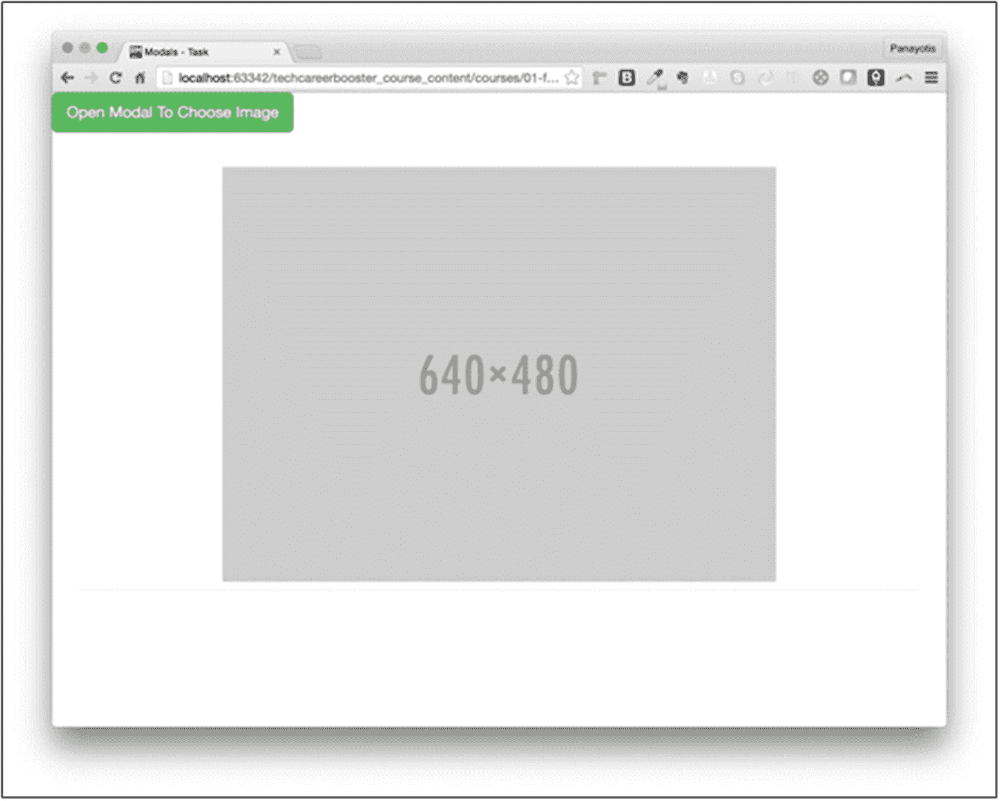

# 九、模态对话框

在这一章中，您开始将 JavaScript 应用于 Twitter Bootstrap。您将看到 Bootstrap 如何提供非常有用的 JavaScript 库来帮助您尽可能轻松地向 web 应用程序添加动态行为。

你从模态开始，模态是试图吸引用户注意力的对话窗口，如图 9-1 所示。


图 9-1

模态对话框示例

然后我将解释如何将 Twitter Bootstrap JavaScript 库与您自己的 HTML 页面集成在一起。

您将了解模态 HTML 标记及其主要部分，以及如何使用图片创建令人印象深刻的模态，如下所示(图 9-2 )。


图 9-2

带图片的示例模型

最后，您学习了与模态相关的所有事件，并被要求构建一个处理相关事件的模态。您将构建一个如下所示的模型(图 9-3 )。


图 9-3

有两个城市可供选择

## 学习目标

1.  学习情态动词。

2.  了解如何引用 Twitter Bootstrap JavaScript 文件。

3.  了解引入模态功能的最简单的 HTML 标记。

4.  了解哪些 Twitter 引导类与模态功能有关。

5.  了解 Twitter Bootstrap HTML 标记的主要部分。

6.  了解如何使用数据属性来触发模式。

7.  了解如何对按钮进行编程，使其在被单击时打开一个模态。

8.  了解如何在模式的右上角有一个关闭按钮。

9.  了解如何使用 FontAwesome 作为关闭按钮的图标。

10.  了解如何在模态上显示图像。

11.  了解如何在模型上显示 YouTube 视频。

12.  了解如何在模态上显示其他/外部页面。

13.  了解如何显示大模态和小模态。

14.  了解如何在模型体内使用 Twitter Bootstrap 网格系统。

15.  了解如何使用 JavaScript 激活模态。

16.  了解如何通过使用 JavaScript 设置各种选项来自定义模态行为。

17.  了解各种可用的模态方法。

18.  了解可以挂接事件处理程序的各种模式事件。

## 介绍

情态动词是一种非常用户友好的向用户展示信息或要求提供信息的方式。模态是覆盖页面的窗口，不允许用户与页面的其他部分进行交互。换句话说，用户必须在返回主页之前关闭模态:

1.  用户可以阅读信息，然后关闭模式。一个模态可以在右上角有一个`Close`按钮或者一个`[X]`按钮来关闭它。

2.  用户可以填写一些表单，然后单击表单的提交按钮。这通常会关闭模式并将用户返回到主页。

让我们来看一个实际的模态(图 9-4 )。


图 9-4

模态示例

Twitter Bootstrap 免费提供模态，作为 JavaScript 集成的一部分。让我们看看怎么做。

## 引导 JavaScript 文件

为了能够使用模态，您需要引用 Twitter 引导 JavaScript 文件。这些需要在 jQuery JavaScript 文件的后引用**。**

下面是一个引用 Twitter Bootstrap 和 jQuery 的最简单的 HTML 页面(清单 9-1 )。

```html
<!DOCTYPE html>
<html lang="en">
<head>
  <!-- Required meta tags -->
  <meta charset="utf-8">
  <meta name="viewport" content="width=device-width, initial-scale=1, shrink-to-fit=no">

  <!-- Bootstrap CSS -->
  <link rel="stylesheet" href="https://stackpath.bootstrapcdn.com/bootstrap/4.4.1/css/bootstrap.min.css" integrity="sha384-Vkoo8x4CGsO3+Hhxv8T/Q5PaXtkKtu6ug5TOeNV6gBiFeWPGFN9MuhOf23Q9Ifjh" crossorigin="anonymous">

  <title>Modal Dialogs</title>

</head>
<body>

  <!-- Optional JavaScript -->
  <!-- jQuery first, then Popper.js, then Bootstrap JS -->
  <script src="https://code.jquery.com/jquery-3.4.1.slim.min.js" integrity="sha384-J6qa4849blE2+poT4WnyKhv5vZF5SrPo0iEjwBvKU7imGFAV0wwj1yYfoRSJoZ+n" crossorigin="anonymous"></script>
  <script src="https://cdn.jsdelivr.net/npm/popper.js@1.16.0/dist/umd/popper.min.js" integrity="sha384-Q6E9RHvbIyZFJoft+2mJbHaEWldlvI9IOYy5n3zV9zzTtmI3UksdQRVvoxMfooAo" crossorigin="anonymous"></script>
  <script src="https://stackpath.bootstrapcdn.com/bootstrap/4.4.1/js/bootstrap.min.js" integrity="sha384-wfSDF2E50Y2D1uUdj0O3uMBJnjuUD4Ih7YwaYd1iqfktj0Uod8GCExl3Og8ifwB6" crossorigin="anonymous"></script>
</body>
</html>

Listing 9-1Empty Twitter Bootstrap Page with JavaScript

```

从前面的代码中可以看出，为了使用 Twitter Bootstrap JavaScript 库和组件，您必须加载三个外部文件。参见图 9-5 中装载它们的正确顺序。


图 9-5

加载外部 JavaScript 库的正确顺序

正如你在图 9-5 中看到的，我引用了 Twitter Bootstrap JavaScript 文件的 CDN 版本。我在 jQuery 和 Popper 文件之后加载它，因为 Twitter Bootstrap JavaScript 依赖于 jQuery 和 Popper。

请注意，如果您想要添加自定义的，也就是您自己的 JavaScript 文件，您必须将它们放在正确的位置。您自己的定制 JavaScript 文件需要放在第三方 JavaScript 文件之后，也就是 Twitter 引导 JavaScript 引用之后(图 9-6 )。


图 9-6

自定义 JavaScript 文件正确位置

## 模态标记

准备好最基本的 HTML 页面后，让我们在上面添加一些模态功能。将列表 9-2 的内容添加到页面的`body`中，作为`body`元素的第一个子元素。

```html
<div class="modal fade" tabindex="-1" role="dialog">
    <div class="modal-dialog">
        <div class="modal-content">
            <div class="modal-header">

                <h4 class="modal-title">This is an h4 inside Modal Header</h4>
                <button type="button" class="close" data-dismiss="modal" aria-label="Close"><span aria-hidden="true">&times;</span></button>
            </div>

            <div class="modal-body">

                <p>This is a paragraph inside Modal Body</p>

            </div>
            <div class="modal-footer">

                <button type="button" class="btn btn-default" data-dismiss="modal">Close</button>
                <button type="button" class="btn btn-primary">Save changes</button>

            </div>
        </div>
    </div>
</div>

Listing 9-2HTML Markup for a Modal

```

如果您在浏览器上保存并加载该页面，您将看到一个空白页。这是因为模态不应该被显示，除非用户选择这样做，或者他们执行了触发模态显示的动作。

使模态内容不可见的类是类`modal`和`fade`。`modal`加一个`display:none;`,`fade`加一个`opacity: 0`。

在下图中可以看到禁用这两个属性是如何让模态出现在页面上的(图 9-7 )。


图 9-7

禁用属性以显示模式

所有的模态都有相同的 HTML 标记。其主要零件如图 9-8 所示。


图 9-8

模态 HTML 标记的主要部分

*   在同一个嵌套级别中，有三个兄弟节点`div`，它们都是具有类`modal-content`的 div 的子节点:
    1.  类别为`modal-header`的模态头的`div`

    2.  A `div`用于具有类别`modal-body`的模态体

    3.  一个`div`用于带有类`modal-footer`的模态页脚

*   三个`div`相互串联，它们包含了情态的实际内容:
    1.  一个带有类`modal`和`fade`的`div`

    2.  一个`div`在前一个`modal fade`在后一个`modal-dialog`

    3.  一个`div`在前一个`modal-dialog`在后一个`modal-content`

请注意，最后三个部分是可选的。同样，在它们里面，你可以放置(几乎)任何你喜欢的 HTML 标记。

## 触发模式

模态是隐藏的，直到用户采取行动显示它们，或者直到 web 应用程序决定必须显示它们。这种触发是如何发生的？

您将通过引入一个允许用户打开模式对话框的按钮来继续这个示例。让我们将 HTML 主体内容修改如下:

```html
<button class="btn btn-lg btn-success" data-toggle="modal" data-target=".modal">Open Modal</button>

```

将前面的标记添加到模式开始标记`div`之前，开始标记`<body>`之下。

保存 HTML 页面并在浏览器上重新加载。您将看到以下内容(图 9-9 )。


图 9-9

带有打开模式按钮的页面

如果您点击按钮`Open Modal,`，您将看到以下内容(图 9-10 )。


图 9-10

单击按钮后显示的模式

完美！这就是模态。

让我们解释一下关于`button`标记的一些重要细节:

1.  它具有值为`modal`的属性`data-toggle`。这是必要的，以向 Bootstrap 表明这是一个按钮，单击它将打开一个模式对话框。

2.  它有一个属性`data-target`，该属性的值是一个 CSS 选择器，并且需要唯一地选择保存模式 HTML 标记的 HTML 元素。在您正在开发的模态中，您已经使用了值`modal`，因为这是唯一匹配保存您的模态标记的`div`的类。通常，在这里，您使用一个 CSS 选择器来表示一个 id，而不是一个类，以使标识唯一并避免歧义。

注意，通过这个小小的 HTML 标记和使用 Twitter Bootstrap 识别的数据属性，您已经成功地向页面添加了动态行为。您不必编写任何 JavaScript。所有这些模态 JavaScript 功能都由 Twitter Bootstrap JavaScript 库提供。

## 关于模态标记的更多信息

除了我之前谈到的标准 HTML 模态标记之外，上一个例子中还有一些其他元素值得你注意(图 9-11 )。

### 右上角的关闭[x]按钮


图 9-11

[x]按钮

用户可以单击右上角的[x]按钮来关闭模式对话框。它的标记被放在了`modal-header div`中，如下所示:

```html
<button type="button" class="close" data-dismiss="modal" aria-label="Close">
  <span aria-hidden="true">&times;</span>
</button>

```

它是类`close`的`button`，数据属性`data-dismiss`等于`modal`，指示 Twitter Bootstrap 在被点击时关闭模态。出现在那里的真正图标是`<span aria-hidden="true">&times;</span>`。`&times;`实体元素是一个特殊字符，显示为十字[x]。

在`button`中，您可以使用任何适合的 HTML，它可以向用户指示关闭模态的能力。例如，你可以使用一个[字体牛逼](https://fontawesome.com/)图标。让我们试着用其中的一个。将 HTML 标记`<span aria-hidden="true">&times;</span>`替换为

```html
<i aria-hidden="true" class="fas fa-window-close"></i>.

```

此外，在页面底部，在引用 Bootstrap JavaScript 文件之前，添加一个对为您的帐户设计的 FontAwesome 特殊工具包的引用。应该是这样一行:

```html
<script src="https://kit.fontawesome.com/<your-account-kid-id>.js" crossorigin="anonymous"></script>

```

保存，重新加载页面，并打开模式。您将看到以下内容(图 9-12 )。


图 9-12

FontAwesome 图标用作模式关闭按钮

Note

在 FontAwesome 上创建一个帐户非常简单。你访问页面 [`https://fontawesome.com`](https://fontawesome.com) ，然后注册。然后你需要创建一个工具包。该网站将指导您如何获取套件标识符，以便在您的 HTML 页面中引用/使用它。

### 底部的关闭`[Close]`按钮

`modal-footer` `div`里面有一个按钮，工作原理和右上角的那个一样。它关闭模式对话框。它的标记是

```html
<button type="button" class="btn btn-default" data-dismiss="modal">Close</button>

```

同样，重要的是它的数据属性`data-dismiss`等于`modal`，这使得它的功能相当于一个模态关闭按钮。

Note

`Save changes`是一个什么也不做的按钮。我没有给它附加任何功能。

## 添加图像

正如我前面说过的，您可以在模态中添加(几乎)任何 HTML 内容。让我们看看下面的 HTML 页面(清单 9-3 )。

```html
<!DOCTYPE html>
<html lang="en">
<head>
  <!-- Required meta tags -->
  <meta charset="utf-8">
  <meta name="viewport" content="width=device-width, initial-scale=1, shrink-to-fit=no">

  <!-- Bootstrap CSS -->
  <link rel="stylesheet" href="https://stackpath.bootstrapcdn.com/bootstrap/4.4.1/css/bootstrap.min.css" integrity="sha384-Vkoo8x4CGsO3+Hhxv8T/Q5PaXtkKtu6ug5TOeNV6gBiFeWPGFN9MuhOf23Q9Ifjh" crossorigin="anonymous">

  <!-- Custom CSS -->
  <link rel="stylesheet" href="stylesheets/main.css" type="text/css">

  <title>Modal Dialogs</title>
</head>
<body>

  <button class="btn btn-lg btn-success" data-toggle="modal" data-target=".modal">Open Modal</button>

  <div class="modal fade" tabindex="-1" role="dialog">
    <div class="modal-dialog">
      <div class="modal-content">
        <div class="modal-header">

          <h4 class="modal-title">Zakynthos - Shipwreck</h4>
          <button type="button" class="close" data-dismiss="modal" aria-label="Close">
            <span>&times;</span>
          </button>

        </div>

        <div class="modal-body">

          

        </div>
        <div class="modal-footer">

          <button type="button" class="btn btn-default" data-dismiss="modal">Close</button>
          <button type="button" class="btn btn-primary">Save changes</button>

        </div>
      </div>
    </div>
  </div>

  <!-- jQuery first, then Popper.js, then Bootstrap JS -->
  <script src="https://code.jquery.com/jquery-3.4.1.slim.min.js" integrity="sha384-J6qa4849blE2+poT4WnyKhv5vZF5SrPo0iEjwBvKU7imGFAV0wwj1yYfoRSJoZ+n" crossorigin="anonymous"></script>
  <script src="https://cdn.jsdelivr.net/npm/popper.js@1.16.0/dist/umd/popper.min.js" integrity="sha384-Q6E9RHvbIyZFJoft+2mJbHaEWldlvI9IOYy5n3zV9zzTtmI3UksdQRVvoxMfooAo" crossorigin="anonymous"></script>
  <script src="https://stackpath.bootstrapcdn.com/bootstrap/4.4.1/js/bootstrap.min.js" integrity="sha384-wfSDF2E50Y2D1uUdj0O3uMBJnjuUD4Ih7YwaYd1iqfktj0Uod8GCExl3Og8ifwB6" crossorigin="anonymous"></script>
</body>
</html>

Listing 9-3HTML for a Modal with Image

```

如果您阅读 HTML，您会看到`modal-body div`只包含一个`img`元素。

另外，请注意，有一个对名为`stylesheets/main.css`的外部定制样式表文件的引用。请在里面添加下面的 CSS 规则。它将在图像周围添加一个边框:

```html
img {
    border: 1px solid Darkblue;
}

```

如果您在浏览器上保存并加载该页面，您将看到以下内容(图 9-13 )。


图 9-13

具有 img 元素的模式—宽图像的问题

如你所见，图像有问题。它超越了模态的界限。为了解决这个问题，您必须将类`img-fluid`附加到`img`元素上。这样做并重新加载页面。您将看到以下内容(图 9-14 )。


图 9-14

图像在模态中正确显示

## 添加 YouTube 视频

就像您对图像所做的那样，您可以类似地添加一个 YouTube 嵌入式视频参考。尝试下面的 HTML(清单 9-4 )。

```html
<!DOCTYPE html>
<html lang="en">
<head>
  <!-- Required meta tags -->
  <meta charset="utf-8">
  <meta name="viewport" content="width=device-width, initial-scale=1, shrink-to-fit=no">

  <!-- Bootstrap CSS -->
  <link rel="stylesheet" href="https://stackpath.bootstrapcdn.com/bootstrap/4.4.1/css/bootstrap.min.css" integrity="sha384-Vkoo8x4CGsO3+Hhxv8T/Q5PaXtkKtu6ug5TOeNV6gBiFeWPGFN9MuhOf23Q9Ifjh" crossorigin="anonymous">

  <!-- Custom CSS -->
  <link rel="stylesheet" href="stylesheets/main.css" type="text/css">

  <title>Modal Dialogs</title>
</head>
<body>

  <button class="btn btn-lg btn-success" data-toggle="modal" data-target=".modal">Open Modal</button>

  <div class="modal fade" tabindex="-1" role="dialog">
    <div class="modal-dialog">
      <div class="modal-content">
        <div class="modal-header">

          <h4 class="modal-title">Zakynthos - Shipwreck</h4>
          <button type="button" class="close" data-dismiss="modal" aria-label="Close">
            <span>&times;</span>
          </button>

        </div>

        <div class="modal-body">

          <iframe width="100%" height="315" src="https://www.youtube.com/embed/tqy0Uvw_bFU" frameborder="0" allowfullscreen></iframe>

        </div>
        <div class="modal-footer">

          <button type="button" class="btn btn-default" data-dismiss="modal">Close</button>
          <button type="button" class="btn btn-primary">Save changes</button>

        </div>
      </div>
    </div>
  </div>

  <!-- jQuery first, then Popper.js, then Bootstrap JS -->
  <script src="https://code.jquery.com/jquery-3.4.1.slim.min.js" integrity="sha384-J6qa4849blE2+poT4WnyKhv5vZF5SrPo0iEjwBvKU7imGFAV0wwj1yYfoRSJoZ+n" crossorigin="anonymous"></script>
  <script src="https://cdn.jsdelivr.net/npm/popper.js@1.16.0/dist/umd/popper.min.js" integrity="sha384-Q6E9RHvbIyZFJoft+2mJbHaEWldlvI9IOYy5n3zV9zzTtmI3UksdQRVvoxMfooAo" crossorigin="anonymous"></script>
  <script src="https://stackpath.bootstrapcdn.com/bootstrap/4.4.1/js/bootstrap.min.js" integrity="sha384-wfSDF2E50Y2D1uUdj0O3uMBJnjuUD4Ih7YwaYd1iqfktj0Uod8GCExl3Og8ifwB6" crossorigin="anonymous"></script>
</body>
</html>

Listing 9-4Embedding a YouTube Video

```

正如您在前面的代码中看到的，您可以使用`iframe`元素嵌入 YouTube 视频。确保`width`设置为 100%，并且`height`设置为合理的高度，这将保持您的视频以正确的纵横比显示。请注意，当您选择通过嵌入分享视频时，YouTube 会为您提供`iframe`元素的代码。您只需要调整宽度和高度属性，这样视频就可以很好地显示在您的模态中。

如果您保存前面的 HTML 并在浏览器上加载页面，您将看到以下内容(图 9-15 )。


图 9-15

有 YouTube 视频的模特

## 可选尺寸

Twitter Bootstrap 为您的模特提供三种可选尺寸:

1.  超大模态:您需要在`modal-dialog`类后面追加`modal-xl`类。它基本上将模态`max-width`设置为`1140px`。

2.  大型模态:您需要在`modal-dialog`类后面追加`modal-lg`类。它将`max-width`设置为`800px`。

3.  小模态:您需要在`modal-dialog`类后面追加`modal-sm`类。它将`max-width`设置为`300px`。

如果您没有指定任何前面的大小等级，那么默认设置为`max-width`到`500px`。

下一个是大尺寸的模态演示(清单 9-5 )。

```html
<!DOCTYPE html>
<html lang="en">
<head>
  <!-- Required meta tags -->
  <meta charset="utf-8">
  <meta name="viewport" content="width=device-width, initial-scale=1, shrink-to-fit=no">

  <!-- Bootstrap CSS -->
  <link rel="stylesheet" href="https://stackpath.bootstrapcdn.com/bootstrap/4.4.1/css/bootstrap.min.css" integrity="sha384-Vkoo8x4CGsO3+Hhxv8T/Q5PaXtkKtu6ug5TOeNV6gBiFeWPGFN9MuhOf23Q9Ifjh" crossorigin="anonymous">

  <!-- Custom CSS -->
  <link rel="stylesheet" href="stylesheets/main.css" type="text/css">

  <title>Modal Dialogs</title>
</head>
<body>

  <button class="btn btn-lg btn-success" data-toggle="modal" data-target=".modal">Open Modal</button>

  <div class="modal fade" tabindex="-1" role="dialog">
    <div class="modal-dialog modal-lg">
      <div class="modal-content">
        <div class="modal-header">

          <h4 class="modal-title">Zakynthos from Wikipedia</h4>
          <button type="button" class="close" data-dismiss="modal" aria-label="Close">
            <span>&times;</span>
          </button>

        </div>

        <div class="modal-body">

          <iframe width="100%" height="400" src="https://en.wikipedia.org/wiki/Zakynthos" id="frame-in-modal"></iframe>

        </div>
        <div class="modal-footer">

          <button type="button" class="btn btn-default" data-dismiss="modal">Close</button>
          <button type="button" class="btn btn-primary">Save changes</button>

        </div>
      </div>
    </div>
  </div>

  <!-- jQuery first, then Popper.js, then Bootstrap JS -->
  <script src="https://code.jquery.com/jquery-3.4.1.slim.min.js" integrity="sha384-J6qa4849blE2+poT4WnyKhv5vZF5SrPo0iEjwBvKU7imGFAV0wwj1yYfoRSJoZ+n" crossorigin="anonymous"></script>
  <script src="https://cdn.jsdelivr.net/npm/popper.js@1.16.0/dist/umd/popper.min.js" integrity="sha384-Q6E9RHvbIyZFJoft+2mJbHaEWldlvI9IOYy5n3zV9zzTtmI3UksdQRVvoxMfooAo" crossorigin="anonymous"></script>
  <script src="https://stackpath.bootstrapcdn.com/bootstrap/4.4.1/js/bootstrap.min.js" integrity="sha384-wfSDF2E50Y2D1uUdj0O3uMBJnjuUD4Ih7YwaYd1iqfktj0Uod8GCExl3Og8ifwB6" crossorigin="anonymous"></script>
</body>
</html>

Listing 9-5Large Modal Demo

```

如果您保存该页面的文件并将其加载到您的浏览器上，您将看到以下内容(图 9-16 )。


图 9-16

大型模态演示

## 移除动画

如果你已经注意到，当你打开模态的时候，它从上到下的动画。您可以通过从顶层`div`容器中移除类`fade`来移除这个动画，并使模态立即出现。

试着从前面的例子中移除`fade`类。您将在动画中看到没有顶部淡入淡出的模态。

## 使用 Twitter 引导网格系统

您可以在 modal 的主体中使用 Twitter Bootstrap 网格系统。在`modal-body div`容器中适当地使用`container-fluid`，然后使用`row`和`column-xx-x`类。

我们来看一个例子(清单 9-6 )。

```html
<!DOCTYPE html>
<html lang="en">
<head>
  <!-- Required meta tags -->
  <meta charset="utf-8">
  <meta name="viewport" content="width=device-width, initial-scale=1, shrink-to-fit=no">

  <!-- Bootstrap CSS -->
  <link rel="stylesheet" href="https://stackpath.bootstrapcdn.com/bootstrap/4.4.1/css/bootstrap.min.css" integrity="sha384-Vkoo8x4CGsO3+Hhxv8T/Q5PaXtkKtu6ug5TOeNV6gBiFeWPGFN9MuhOf23Q9Ifjh" crossorigin="anonymous">

  <!-- Custom CSS -->
  <link rel="stylesheet" href="stylesheets/main.css" type="text/css">

  <title>Modal Dialogs</title>
</head>
<body>

  <button class="btn btn-lg btn-success" data-toggle="modal" data-target=".modal">Open Modal</button>

  <div class="modal fade" tabindex="-1" role="dialog">
    <div class="modal-dialog modal-lg">
      <div class="modal-content">
        <div class="modal-header">

          <h4 class="modal-title">Zakynthos from Wikipedia</h4>
          <button type="button" class="close" data-dismiss="modal" aria-label="Close">
            <span>&times;</span>
          </button>

        </div>

        <div class="modal-body">

          <div class="container-fluid">
            <div class="row">
              <div class="col-md-6">
                
              </div>
              <div class="col-md-6">
                
              </div>

            </div>

            <div class="row">
              <div class="col-md-6">
                
              </div>
              <div class="col-md-6">
                
              </div>
            </div>
          </div>

        </div> <!-- modal body -->

        <div class="modal-footer">

          <button type="button" class="btn btn-default" data-dismiss="modal">Close</button>
          <button type="button" class="btn btn-primary">Save changes</button>

        </div>
      </div>
    </div>
  </div>

  <!-- jQuery first, then Popper.js, then Bootstrap JS -->
  <script src="https://code.jquery.com/jquery-3.4.1.slim.min.js" integrity="sha384-J6qa4849blE2+poT4WnyKhv5vZF5SrPo0iEjwBvKU7imGFAV0wwj1yYfoRSJoZ+n" crossorigin="anonymous"></script>
  <script src="https://cdn.jsdelivr.net/npm/popper.js@1.16.0/dist/umd/popper.min.js" integrity="sha384-Q6E9RHvbIyZFJoft+2mJbHaEWldlvI9IOYy5n3zV9zzTtmI3UksdQRVvoxMfooAo" crossorigin="anonymous"></script>
  <script src="https://stackpath.bootstrapcdn.com/bootstrap/4.4.1/js/bootstrap.min.js" integrity="sha384-wfSDF2E50Y2D1uUdj0O3uMBJnjuUD4Ih7YwaYd1iqfktj0Uod8GCExl3Og8ifwB6" crossorigin="anonymous"></script>
</body>
</html>

Listing 9-6Grid System Inside the Modal Body

```

这是 CSS:

```html
img {
    padding: 10px 10px;
    width: 100%;
    height: 250px;
}

```

如果您保存前面的代码并在浏览器上加载页面，当您打开模式时，您将看到以下内容(图 9-17 )。


图 9-17

模体内部使用的网格系统

## 垂直居中

模式的默认行为是出现在页面的顶部。如果你想让模态出现在中间，也就是垂直对齐，那么你就得在`modal-dialog`类旁边附加`modal-dialog-centered`类。

清单 9-7 展示了这一点。

```html
<!DOCTYPE html>
<html lang="en">
<head>
  <!-- Required meta tags -->
  <meta charset="utf-8">
  <meta name="viewport" content="width=device-width, initial-scale=1, shrink-to-fit=no">

  <!-- Bootstrap CSS -->
  <link rel="stylesheet" href="https://stackpath.bootstrapcdn.com/bootstrap/4.4.1/css/bootstrap.min.css" integrity="sha384-Vkoo8x4CGsO3+Hhxv8T/Q5PaXtkKtu6ug5TOeNV6gBiFeWPGFN9MuhOf23Q9Ifjh" crossorigin="anonymous">

  <title>Modal Dialogs</title>
</head>
<body>
  <button class="btn btn-lg btn-success" data-toggle="modal" data-target=".modal">Open Modal</button>

  <div class="modal fade" tabindex="-1" role="dialog">
    <div class="modal-dialog modal-dialog-centered">
      <div class="modal-content">
        <div class="modal-header">

          <h4 class="modal-title">This is an h4 inside Modal Header</h4>
          <button type="button" class="close" data-dismiss="modal" aria-label="Close"><span aria-hidden="true">&times;</span></button>

        </div>

        <div class="modal-body">

          <p>This is a paragraph inside Modal Body</p>

        </div>
        <div class="modal-footer">

          <button type="button" class="btn btn-default" data-dismiss="modal">Close</button>
          <button type="button" class="btn btn-primary">Save changes</button>

        </div>
      </div>
    </div>
  </div>

  <!-- Optional JavaScript -->
  <!-- jQuery first, then Popper.js, then Bootstrap JS -->
  <script src="https://code.jquery.com/jquery-3.4.1.slim.min.js" integrity="sha384-J6qa4849blE2+poT4WnyKhv5vZF5SrPo0iEjwBvKU7imGFAV0wwj1yYfoRSJoZ+n" crossorigin="anonymous"></script>
  <script src="https://cdn.jsdelivr.net/npm/popper.js@1.16.0/dist/umd/popper.min.js" integrity="sha384-Q6E9RHvbIyZFJoft+2mJbHaEWldlvI9IOYy5n3zV9zzTtmI3UksdQRVvoxMfooAo" crossorigin="anonymous"></script>
  <script src="https://stackpath.bootstrapcdn.com/bootstrap/4.4.1/js/bootstrap.min.js" integrity="sha384-wfSDF2E50Y2D1uUdj0O3uMBJnjuUD4Ih7YwaYd1iqfktj0Uod8GCExl3Og8ifwB6" crossorigin="anonymous"></script>

</body>
</html>

Listing 9-7Modal Vertically Centered

```

如果您保存此页面，将其加载到您的浏览器上，并打开模式，您将看到以下内容(图 9-18 )。


图 9-18

模态垂直居中

如您所见，模态出现在垂直居中位置。

## 用 JavaScript 激活模态

您已经看到，您可以在不使用任何 JavaScript 代码的情况下激活一个模态。您使用的按钮示例如下所示:

```html
<button class="btn btn-lg btn-success" data-toggle="modal" data-target=".modal">Open Modal</button>

```

这里重要的位是`data-toggle="modal"`和`data-target=".modal"`。

你也可以用 JavaScript 打开一个模态对话框。让我们再次看看(清单 9-8 )希腊群岛的例子，但是这一次，您将不会像上一个例子那样使用按钮。

```html
<!DOCTYPE html>
<html lang="en">
<head>
  <!-- Required meta tags -->
  <meta charset="utf-8">
  <meta name="viewport" content="width=device-width, initial-scale=1, shrink-to-fit=no">

  <!-- Bootstrap CSS -->
  <link rel="stylesheet" href="https://stackpath.bootstrapcdn.com/bootstrap/4.4.1/css/bootstrap.min.css" integrity="sha384-Vkoo8x4CGsO3+Hhxv8T/Q5PaXtkKtu6ug5TOeNV6gBiFeWPGFN9MuhOf23Q9Ifjh" crossorigin="anonymous">

  <!-- Custom CSS -->
  <link rel="stylesheet" href="stylesheets/main.css" type="text/css">

  <title>Modal Dialogs</title>
</head>
<body>

  <button class="btn btn-lg btn-success" id="open-modal-button">Open Modal</button>

  <div class="modal fade" tabindex="-1" role="dialog">
    <div class="modal-dialog modal-lg">
      <div class="modal-content">
        <div class="modal-header">

          <h4 class="modal-title">Zakynthos from Wikipedia</h4>
          <button type="button" class="close" data-dismiss="modal" aria-label="Close">
            <span>&times;</span>
          </button>

        </div>

        <div class="modal-body">

          <div class="container-fluid">
            <div class="row">
              <div class="col-md-6">
                
              </div>
              <div class="col-md-6">
                
              </div>
            </div>

            <div class="row">
              <div class="col-md-6">
                
              </div>
              <div class="col-md-6">
                
              </div>
            </div>
          </div>

        </div> <!-- modal body -->

        <div class="modal-footer">

          <button type="button" class="btn btn-default" data-dismiss="modal">Close</button>
          <button type="button" class="btn btn-primary">Save changes</button>

        </div>
      </div>
    </div>
  </div>

  <!-- jQuery first, then Popper.js, then Bootstrap JS -->
  <script src="https://code.jquery.com/jquery-3.4.1.slim.min.js" integrity="sha384-J6qa4849blE2+poT4WnyKhv5vZF5SrPo0iEjwBvKU7imGFAV0wwj1yYfoRSJoZ+n" crossorigin="anonymous"></script>
  <script src="https://cdn.jsdelivr.net/npm/popper.js@1.16.0/dist/umd/popper.min.js" integrity="sha384-Q6E9RHvbIyZFJoft+2mJbHaEWldlvI9IOYy5n3zV9zzTtmI3UksdQRVvoxMfooAo" crossorigin="anonymous"></script>
  <script src="https://stackpath.bootstrapcdn.com/bootstrap/4.4.1/js/bootstrap.min.js" integrity="sha384-wfSDF2E50Y2D1uUdj0O3uMBJnjuUD4Ih7YwaYd1iqfktj0Uod8GCExl3Og8ifwB6" crossorigin="anonymous"></script>

  <!-- Custom JavaScript -->
  <script src="javascripts/open-dialog.js"></script>
</body>
</html>

Listing 9-8Greek Islands with JavaScript to Open the Modal

```

前面的文件与以前的版本有两个不同之处:

1.  它引用一个带有自定义 JavaScript 代码的 JavaScript 文件。文件是`javascripts/open-dialog.js`。参见文件底部的引用，在结束的`body`标签之前。

2.  另一个是打开模态的按钮不再具有模态相关的`data-`属性。

在没有给出`open-dialog.js`内容的情况下，如果您保存前面的代码，在浏览器上加载页面，并尝试通过单击按钮打开对话框，什么都不会发生。

为了打开对话框，您现在需要提供相应的 JavaScript 命令:

```html
$(document).ready(function() {
   $('#open-modal-button').on('click', function() {
      $('.modal').modal();
      return false;
   });
});

```

如果您将前面的代码保存在`javascripts/open-dialog.js`文件中并重新加载页面，那么当您单击`Open Modal`按钮时，模式对话框将会打开。

这里的新东西是:

```html
$('.modal').modal();

```

它在按钮`#open-modal-button`的 click 处理程序的实现中。所以，当你点击这个按钮时，你调用了 Twitter Bootstrap JavaScript 库的`modal()`方法。这在选择与`$('.modal');`匹配的元素时调用，因此在模态`div`容器上调用。

## 模式和选项

当调用`$(...).modal()`方法时，你可以给一个 JavaScript 对象提供模态函数的选项。您可以提供的选项如下:


图 9-19

无背景模式

1.  `backdrop`:布尔值，默认值为`true`。它也可以是值为`static`的字符串。如果您将该值设置为`false`，那么模态将在没有背景的情况下打开，并且您将无法在模态之外点击来关闭它(图 9-19 )。

打开无背景模式的代码如下:

```html
$(document).ready(function() {
   $('#open-modal-button').on('click', function() {
      $('.modal').modal({
          backdrop: false
      });
      return false;
   });
});

```

如果你将`backdrop`的值设置为`static,`，那么它将打开带有背景的模态，但是你不能通过点击模态区域之外来关闭模态。

如果您将`backdrop`设置为`true`，那么它将打开带有背景的模态，您可以通过在模态区域外单击来关闭模态。

1.  `keyboard`:布尔值，默认值为`true`。当`true,`时，点击`<ESC>`键关闭模态。

2.  `show`:布尔值，默认值为`true`。它显示了初始化时的模态。这是很有用的，因为你可能想要初始化一个模态，而不真正显示它，直到后来。将`javascripts/open-dialog.js`中的 JavaScript 代码修改如下(清单 9-9 )。

```html
$(document).ready(function() {
    $('.modal').modal({
        backdrop: 'static',
        keyboard: false,
        show: false
    });

    $('#open-modal-button').on('click', function() {
        $('.modal').modal('show');
        return false;
   });
});

Listing 9-9Initialize Modal Without Opening

```

这和原版差别不大。但是它更好，因为它将功能一分为二。首先，它初始化模态；然后，当按钮被点击时，它就显示出来。

用`modal({....});`初始化模态和用调用`modal('show');`显示已经初始化的模态都属于模态方法的范畴。让我们看看更多关于他们的细节。

## 模态方法

下面是模态方法的列表:

1.  `.modal('show');`

```html
$('modal-selector').modal('show');

```

它用于显示一个初始化的模态。

1.  `.modal('hide');`

```html
$('modal-selector').modal('hide');

```

它用于隐藏已初始化的模态。

1.  `.modal('toggle');`

```html
$('modal-selector').modal('toggle');

```

它用于隐藏打开的模态或显示隐藏的模态。

## 模态事件

你可能已经知道 JavaScript 编程涉及到很多事件编程。很多 JavaScript 插件都定义了它们的自定义事件。Twitter Bootstrap 模型也是如此。

以下是针对模型本身触发的事件:

1.  `show.bs.modal`:当调用`show`方法时，该事件立即触发。如果由点击引起，被点击的元素可作为事件的`relatedTarget`属性。

    我们来做一个例子(列表 9-10 )。

```html
<!DOCTYPE html>
<html lang="en">
<head>
  <!-- Required meta tags -->
  <meta charset="utf-8">
  <meta name="viewport" content="width=device-width, initial-scale=1, shrink-to-fit=no">

  <!-- Bootstrap CSS -->
  <link rel="stylesheet" href="https://stackpath.bootstrapcdn.com/bootstrap/4.4.1/css/bootstrap.min.css" integrity="sha384-Vkoo8x4CGsO3+Hhxv8T/Q5PaXtkKtu6ug5TOeNV6gBiFeWPGFN9MuhOf23Q9Ifjh" crossorigin="anonymous">

  <!-- Custom CSS -->
  <link rel="stylesheet" href="stylesheets/main.css" type="text/css">

  <title>Modal Dialogs</title>
</head>
<body>

  <button class="btn btn-lg btn-success" data-toggle="modal" data-target=".modal">Open Modal 1</button>
  <button class="btn btn-lg btn-success" data-toggle="modal" data-target=".modal">Open Modal 2</button>
  <button class="btn btn-lg btn-success" data-toggle="modal" data-target=".modal">Open Modal 3</button>

  <div class="modal fade" tabindex="-1" role="dialog">
    <div class="modal-dialog">
      <div class="modal-content">
        <div class="modal-header">

          <h4 class="modal-title">Modal Demo of relatedTarget</h4>
          <button type="button" class="close" data-dismiss="modal" aria-label="Close"><span aria-hidden="true" class="glyphicon glyphicon-remove"></span></button>

        </div>

        <div class="modal-body text-center">

        </div>
        <div class="modal-footer">

          <button type="button" class="btn btn-default" data-dismiss="modal">Close</button>

        </div>
      </div>
    </div>
  </div>

  <!-- jQuery first, then Popper.js, then Bootstrap JS -->
  <script src="https://code.jquery.com/jquery-3.4.1.slim.min.js" integrity="sha384-J6qa4849blE2+poT4WnyKhv5vZF5SrPo0iEjwBvKU7imGFAV0wwj1yYfoRSJoZ+n" crossorigin="anonymous"></script>
  <script src="https://cdn.jsdelivr.net/npm/popper.js@1.16.0/dist/umd/popper.min.js" integrity="sha384-Q6E9RHvbIyZFJoft+2mJbHaEWldlvI9IOYy5n3zV9zzTtmI3UksdQRVvoxMfooAo" crossorigin="anonymous"></script>
  <script src="https://stackpath.bootstrapcdn.com/bootstrap/4.4.1/js/bootstrap.min.js" integrity="sha384-wfSDF2E50Y2D1uUdj0O3uMBJnjuUD4Ih7YwaYd1iqfktj0Uod8GCExl3Og8ifwB6" crossorigin="anonymous"></script>

  <!-- Custom JavaScript -->
  <script src="javascripts/related-target.js"></script>
</body>
</html>

Listing 9-10Demo of the show.bs.modal Event

```

前面的 HTML 页面正在使用 JavaScript 文件`javascripts/related-target.js`。这在清单 9-11 中给出。

```html
$(document).ready(function(){
    $('.modal').on('show.bs.modal', function(event){
       var $buttonClicked = $(event.relatedTarget);

       $(this).find('.modal-body').html("<h1>" + $buttonClicked.html() + " Clicked!</h1>");
    });
});

Listing 9-11JavaScript File for Listing 9-10

```

从 HTML 标记中可以看出，模式对话框的`modal-body`是空的。您将使用 JavaScript 动态添加内容，对`show.bs.modal`事件做出反应。此外，您将添加的内容将与触发模式打开的按钮相关。如您所见，有三个按钮都可以打开模式对话框。

关于 JavaScript 文件内容，我在模态(`.modal`)目标的`show.bs.modal`事件上附加了一个处理程序。我还声明了参数`event`，当处理程序被调用时，它将持有`relatedTarget`。我将`relatedTarget`保存到`$buttonClicked,`，然后使用[。html()](https://api.jquery.com/html/) jQuery 函数设置`modal-body div`的 html 内容。使用 jQuery 方法[选择`modal-body div`。find()](https://api.jquery.com/find/) 。

这将是下面三幅图中描绘的最终结果，图 9-20 ，图 9-21 ，图 9-22 :


图 9-22

点击`Third`按钮时的页面模式


图 9-21

点击`Second`按钮时的页面模式


图 9-20

单击第一个按钮时的页面模式

1.  `shown.bs.modal`:当模态对用户可见，并且所有的`fade`转换完成后，这个事件被触发。如果由点击引起，被点击的元素可作为事件的`relatedTarget`属性。

2.  `hide.bs.modal`:当`hide`实例方法被调用时，该事件立即被触发。当您想要编写一些需要在模态被隐藏时执行的动作时，这可能是有用的。

3.  `hidden.bs.modal`:当模式对用户隐藏完成时，触发该事件(将等待 CSS 转换完成)。

4.  `hidden.Prevented.bs.modal`:此事件在以下情况下触发
    1.  显示了模态。

    2.  其背景是`static`。

    3.  在模态外点击或点击`<ESC>`键。

## 任务和测验

Task Details

您需要实现一个页面，让用户选择两个最喜欢的城市之一。实际上

1.  用户应该能够点击其中一个图像。单击时，模式应该关闭，所选图像应该显示在主页上占位符的位置。

2.  以下是一些帮助你完成任务的提示:
    1.  你可能想要一个自定义的 CSS 文件。这将需要样式内的模态图像，以及主页上的中心图像。

    2.  您将需要一个定制的 JavaScript 文件:
        1.  它的职责是响应在模态对话框中的两个图像中的任何一个上执行的点击。

        2.  图像上的点击处理器需要
            1.  关闭模态。

            2.  用点击图像的`src`属性替换中心图像的`src`。

1.  When the user clicks the button to open the modal, the modal should appear as follows (Figure 9-24):

    

    图 9-24

    任务-有城市可供选择的模式

1.  When the page loads, it has the button to open the modal and an image placeholder, like this (Figure 9-23):

    

    图 9-23

    任务—带有打开模式按钮和图像占位符的页面

## 关键要点

*   如何实现模式对话框

*   模式对话框部分，页眉、正文和页脚

*   模特的背景

*   如何垂直居中模式

*   如何在模体内部使用网格系统

*   如何去除打开时的渐变效果

*   如何显示模态体内部的图像

*   如何在 modal 的主体中显示 YouTube 视频

*   如何打开小模态和大模态

*   如何使用其选项自定义模式

*   如何使用模态的方法

*   如何附加到不同的模态事件

在下一章中，你将学习如何创建一个有很长内容的页面，旁边有一个导航栏，它的活动菜单根据内容在窗口中的位置而变化。