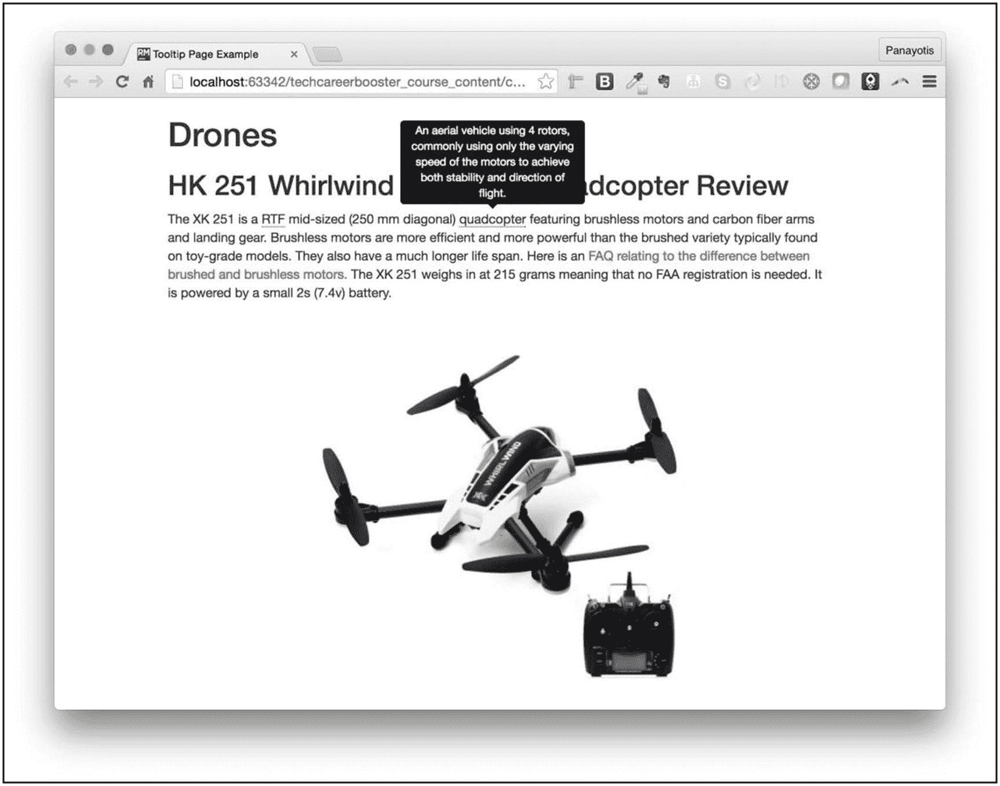
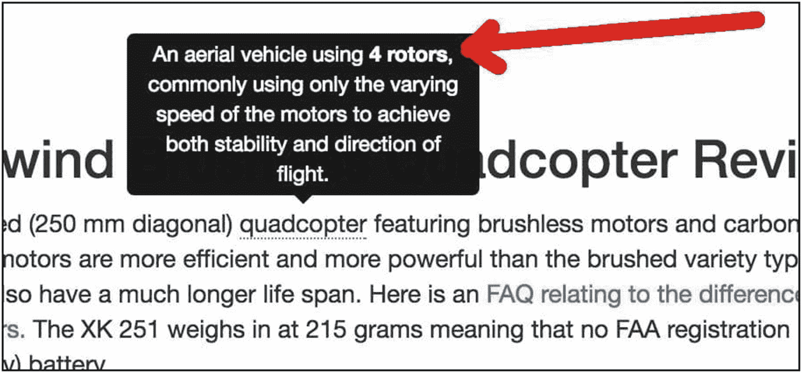
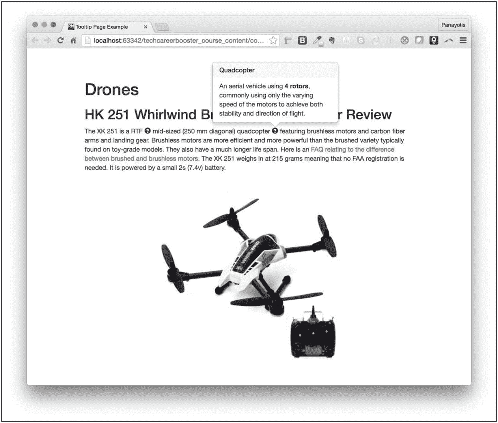
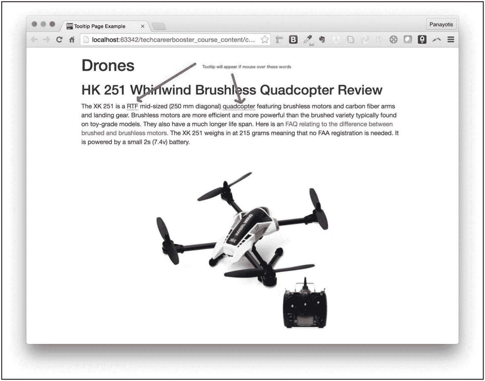
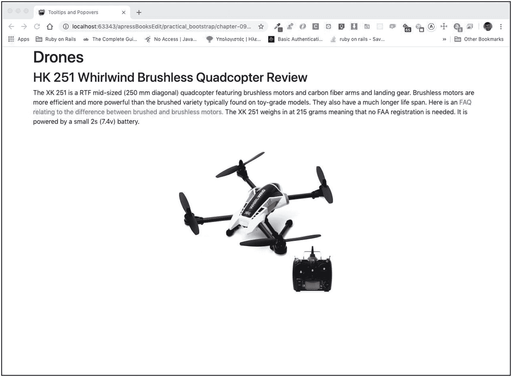
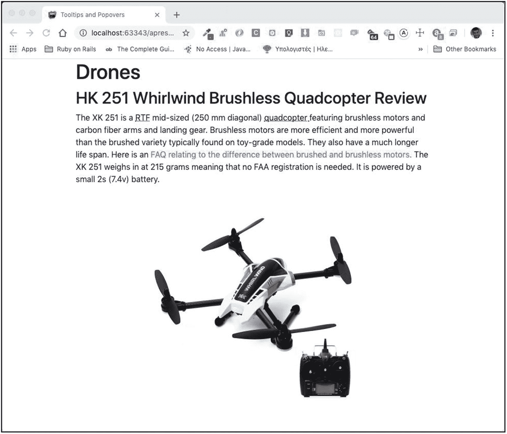
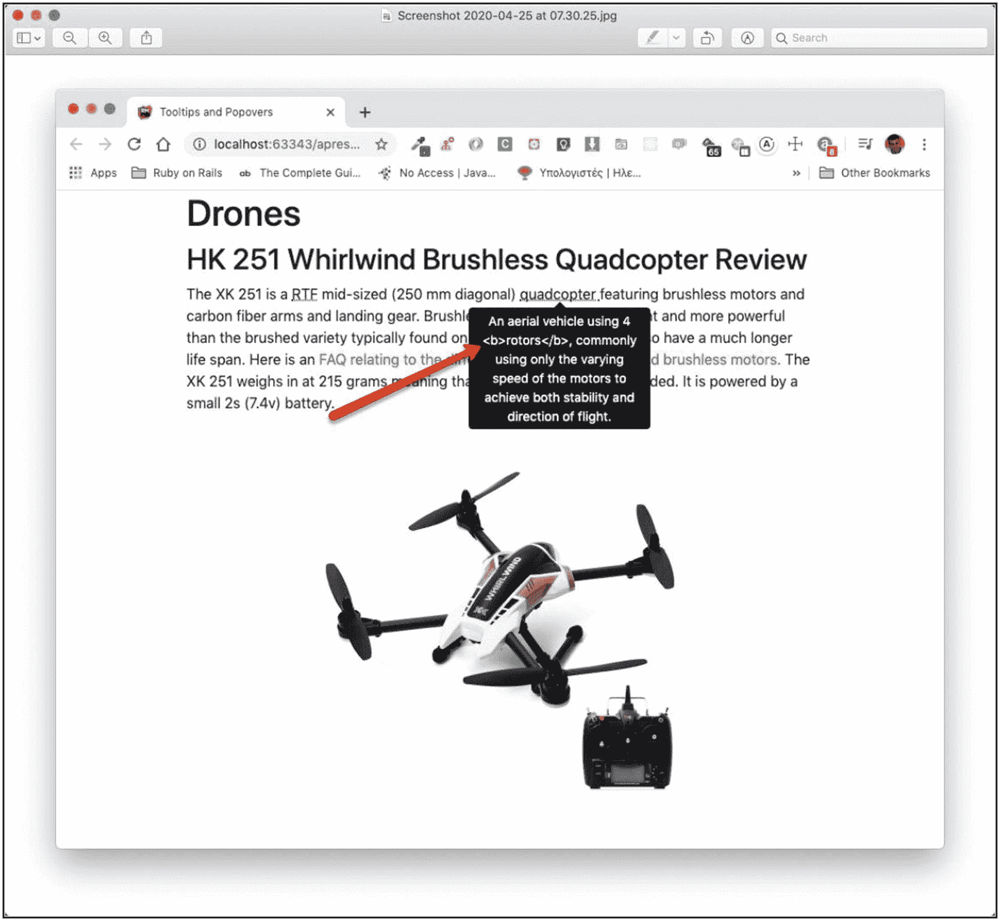
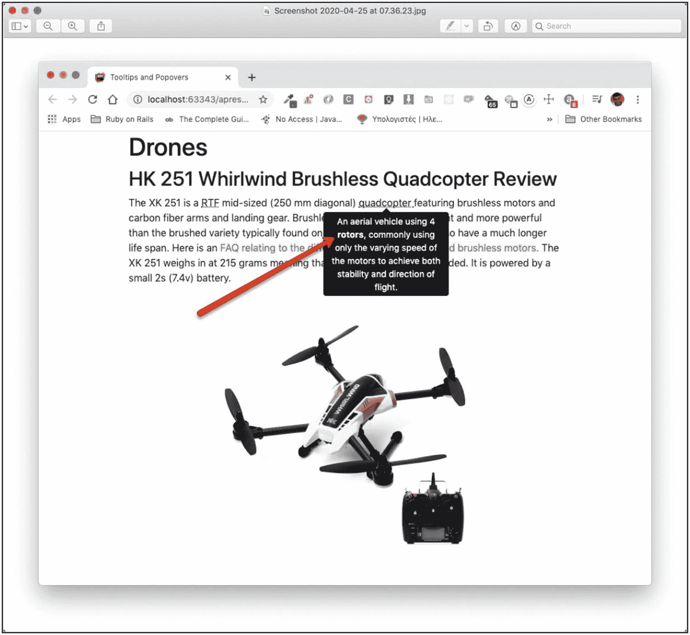
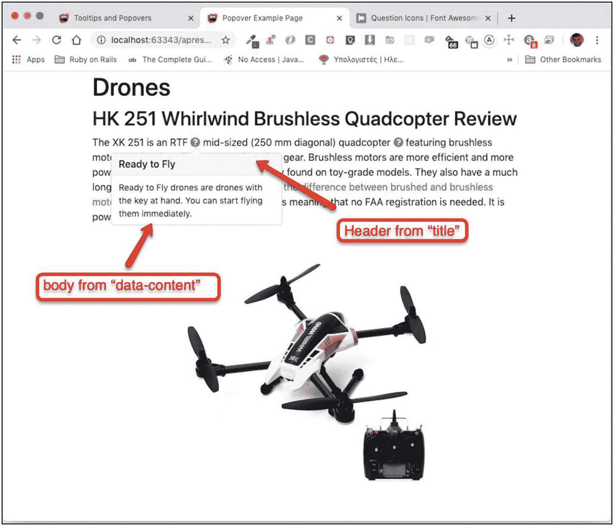
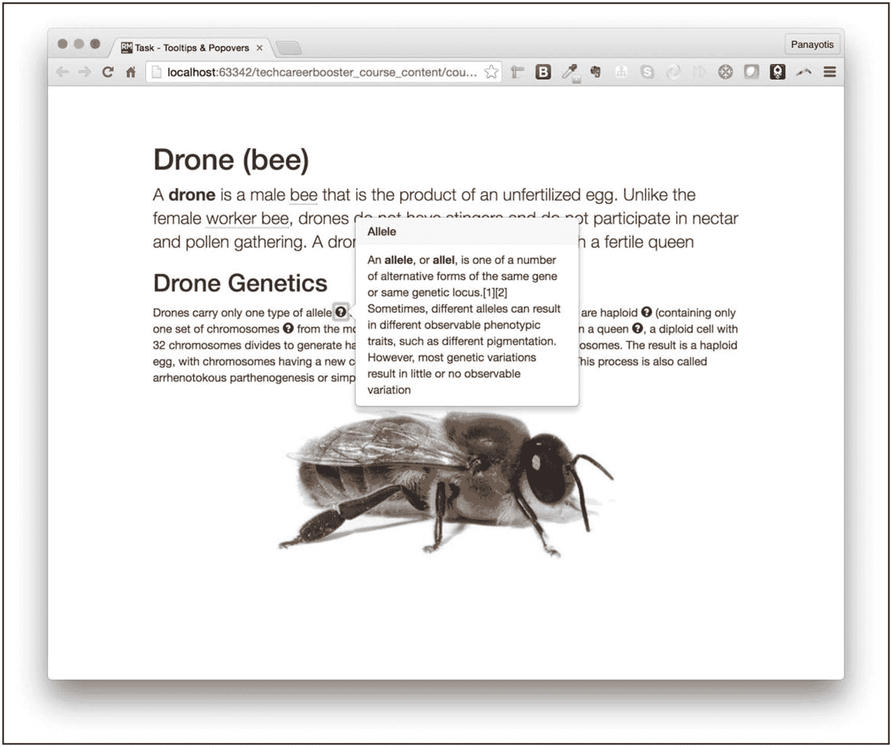

# 十一、工具提示和弹出窗口

工具提示和弹出窗口是在页面内容中嵌入额外的、次要的有用信息的好工具。这一章教你 Twitter 引导工具提示和弹出窗口。

您将创建如下所示的页面(图 11-1 )。



图 11-1

示例工具提示已激活

你将学习如何像下面这样嵌入 HTML 内容(图 11-2 )。



图 11-2

被视为 HTML 的工具提示 HTML 标记—请参见粗体文本

popovers 将增强次要的、有用的信息的样式，甚至更多(图 11-3 )。



图 11-3

Popover 示例

## 学习目标

1.  了解工具提示。

2.  了解如何激活工具提示及其选择性加入功能。

3.  了解如何将一个单词或短语包装成适当的 HTML，以便为其附加工具提示。

4.  学习如何将一个单词或短语包装成合适的 HTML，这样当用户移动到它上面时，它会突出显示并出现一个工具提示。

5.  了解可用于自定义其行为的工具提示选项。

6.  了解松饼。

7.  了解工具提示和弹出式菜单之间的区别和相似之处。

8.  了解松饼的选择。

## 工具提示

当用户将鼠标悬停在突出显示的文本上时，工具提示是显示有用文本的一种非常好的方式。所以它被用来提供一些额外的有用信息，比如提示或暗示。

这是一个使用工具提示的页面示例(图 11-4 )。



图 11-4

带有特定单词工具提示的示例页面

如果您将鼠标悬停在带虚线下划线的单词上，您将会看到工具提示。例如，参见图 11-5 。


图 11-5

工具提示已激活

## 用 Twitter 引导实现

让我们看看如何实现前面的例子。下面是 HTML 页面(清单 11-1 )。

```html
<!DOCTYPE html>
<html lang="en">
<head>
    <!-- Required meta tags -->
    <meta charset="utf-8">
    <meta name="viewport" content="width=device-width, initial-scale=1, shrink-to-fit=no">

    <!-- Bootstrap CSS -->
    <link rel="stylesheet" href="https://stackpath.bootstrapcdn.com/bootstrap/4.4.1/css/bootstrap.min.css" integrity="sha384-Vkoo8x4CGsO3+Hhxv8T/Q5PaXtkKtu6ug5TOeNV6gBiFeWPGFN9MuhOf23Q9Ifjh" crossorigin="anonymous">

    <!-- Custom CSS -->
    <link rel="stylesheet" href="stylesheets/main.css" type="text/css">

    <title>Tooltips and Popovers</title>
</head>
<body>
    <div class="container">
        <h1>Drones</h1>

        <h2>HK 251 Whirlwind Brushless Quadcopter Review</h2>

        <p>
            The XK 251 is a RTF mid-sized (250 mm diagonal) quadcopter
            featuring brushless motors and carbon fiber arms and landing gear.
            Brushless motors are more efficient and more powerful than the brushed variety typically found on toy-grade models.

            They also have a much longer life span.

            Here is an <a href="http://droneflyers.com/talk/threads/is-a-brushless-motor-better-than-a-brushed-motor.754/">
            FAQ relating to the difference between brushed and brushless motors.</a>

            The XK 251 weighs in at 215 grams meaning that no FAA registration is needed. It is powered by a small 2s (7.4v) battery.
        </p>

        <div class="text-center">
            
        </div>
    </div>

    <!-- Optional JavaScript -->
    <!-- jQuery first, then Popper.js, then Bootstrap JS -->
    <script src="https://code.jquery.com/jquery-3.4.1.slim.min.js" integrity="sha384-J6qa4849blE2+poT4WnyKhv5vZF5SrPo0iEjwBvKU7imGFAV0wwj1yYfoRSJoZ+n" crossorigin="anonymous"></script>
    <script src="https://cdn.jsdelivr.net/npm/popper.js@1.16.0/dist/umd/popper.min.js" integrity="sha384-Q6E9RHvbIyZFJoft+2mJbHaEWldlvI9IOYy5n3zV9zzTtmI3UksdQRVvoxMfooAo" crossorigin="anonymous"></script>
    <script src="https://stackpath.bootstrapcdn.com/bootstrap/4.4.1/js/bootstrap.min.js" integrity="sha384-wfSDF2E50Y2D1uUdj0O3uMBJnjuUD4Ih7YwaYd1iqfktj0Uod8GCExl3Og8ifwB6" crossorigin="anonymous"></script>

    <script src="./javascripts/main.js" type="text/javascript"></script>
</body>
</html>

Listing 11-1HTML Page with Tooltips

```

如果您保存前面的代码并在浏览器上加载页面，您将看到页面正确显示，但工具提示将不起作用。如果你将鼠标悬停在单词`RTF`和`quadcopter`上，你将不会看到工具提示冒泡(图 11-6 )。



图 11-6

RTF 和四轴飞行器还没有工具提示

为了让一个单词有一个工具提示，你需要做到以下几点:

1.  将单词包装到一个`span`元素中。因此，该词不会改变其相对于文本其余部分的位置。

2.  添加数据属性`data-toggle="tooltip"`。这将告诉 Bootstrap 在鼠标经过时会用工具提示来修饰`span`的内容。

3.  添加数据属性`data-placement="top"`。这将告诉 Bootstrap 工具提示需要出现在`span`内容的顶部。注意`data-placement`可以取值`left`、`top`、`right`或`bottom`。选择最适合您情况的值。

4.  添加属性`title`,该属性的值是鼠标经过时要显示的文本。

5.  使用 JavaScript 激活工具提示。这是必要的，因为 Bootstrap 有默认不启用的工具提示。这样做是出于性能原因。你必须选择每一个你想要工具提示的特殊情况。

让我们对 HTML 页面上的单词`RTF`和`quadcopter`采取前面的步骤。将`RTF`一词包装如下:

```html
<span data-toggle="tooltip" data-placement="top" title="Ready to Fly">RTF</span>

```

按照以下方式包装`quadcopter`:

```html
<span data-toggle="tooltip" data-placement="bottom"
              title="An aerial vehicle using 4 rotors, commonly using only the varying speed of the motors to achieve both stability and direction of flight.">quadcopter</span>

```

接下来，更新`javascripts/main.js`文件，如下所示:

```html
$(document).ready(function() {
    $('[data-toggle=tooltip]').tooltip();
});

```

上面的代码是实现的选择加入部分，它为所有具有数据属性`data-toggle="tooltip"`的元素启用工具提示。

如果您保存所有前面的代码并在浏览器上重新加载页面，一切都将就绪。当你将鼠标悬停在单词`RTF`和`quadcopter` `,`上时，你会看到工具提示。

如您所见，工具提示显示在鼠标悬停时。

我们必须介绍一个小小的改进。您需要找到一种方法来告诉用户，如果他们将鼠标放在某个特定的单词上，就会出现一个工具提示，提供进一步的解释信息。如果你不这样做，那么用户就不知道这个单词后面隐藏着一个工具提示。

为了达到这个目的，你通常希望工具提示后面的单词用虚线加下划线。Twitter Bootstrap 让你的造型工作变得简单。您可以将文本包装在`abbr`元素中，而不是将工具提示包装在`span`中。

继续将`span`元素更改为`abbr`元素。

对于 RTF:

```html
<abbr data-toggle="tooltip" data-placement="top" title="Ready to Fly">RTF</abbr>

```

对于`quadcopter`:

```html
<abbr data-toggle="tooltip" data-placement="top"
              title="An aerial vehicle using 4 rotors, commonly using only the varying speed of the motors to achieve both stability and direction of flight.">quadcopter</abbr>

```

当您保存这些更改并在浏览器上重新加载页面时，您会看到单词`RTF`和`quadcopter`用虚线加下划线(图 11-7 )。



图 11-7

工具提示的单词以下划线显示

## 工具提示选项

工具提示有许多不同的选项，可用于定制。让我们看看最重要的几个:

1.  `animation`:有默认值`true`。它在显示工具提示时应用 CSS 淡入淡出过渡。

2.  `delay`:可以是数字，也可以是 JavaScript 对象。如果它是一个数字，那么它定义了显示或隐藏工具提示的延迟，以毫秒为单位。如果它是一个对象，那么它可以有`show`和`hide`属性，它们的整数值分别代表显示或隐藏的延迟。

让我们试试那个。我们将设置 delay 属性，并查看工具提示的行为。在上一页，继续修改`javascripts/main.js`文件，使其类似于清单 11-2 。

```html
$(document).ready(function() {
    $('[data-toggle=tooltip]').tooltip({
        delay: {
            show: 3000, // 3 seconds
            hide: 1000  // 1 second
        }
    });
});

Listing 11-2Add Delay to Tooltips

```

如果您保存前面的代码并在浏览器上重新加载页面，当您将鼠标悬停在带有工具提示的单词上 3 秒钟后，您将看到工具提示出现。您还会看到，当您将鼠标移出带有工具提示的单词时，它会在 1 秒钟后消失。

1.  `html`:这是一个布尔选项，取值为`true`或`false`。其默认值为`false`。使用`false`，工具提示元素的`title`属性的值通过[插入。text()](http://api.jquery.com/text/) 方法。这意味着即使标题包含 HTML 标记，这实际上也不会被使用；它将被视为纯文本。另一方面，如果`html`选项设置为`true`，当`title`上有一个包含 HTML 标记的值时，将使用[将其插入工具提示区域。html()](http://api.jquery.com/html/) 方法，因此，html 标记将受到尊重。让我们看一个例子。

首先，给`quadcopter`单词的标题添加一些 HTML 标记:

```html
<abbr data-toggle="tooltip" data-placement="top"
      title="An aerial vehicle using <b>4 rotors</b>, commonly using only the varying speed of the motors to achieve both stability and direction of flight.">quadcopter</abbr>

```

您在标题中添加了`<b>4 rotors</b>` HTML 标记。

现在，确保`javascripts/main.js`文件如下:

```html
$(document).ready(function() {
    $('[data-toggle=tooltip]').tooltip({
        html: false // default value
    });
});

```

虽然当您将`html`的值设置为 false 时这是不必要的，但是稍后您将需要前面的代码片段。

在浏览器上保存并加载页面。当你将鼠标悬停在`quadcopter`单词上时，你会看到工具提示，但是`<b>4 rotors</b>`部分会被逐字打印，被视为纯文本(图 11-8 )。



图 11-8

逐字打印 HTML 标记

如果您希望将`title`属性的 HTML 标记视为 HTML 并以 HTML 的形式呈现，您需要将选项`html`的值设置为`true`:

```html
$(document).ready(function() {
    $('[data-toggle=tooltip]').tooltip({
        html: true
    });
});

```

将前面的代码保存在`javascripts/main.js`中，并在浏览器上重新加载页面。当您将鼠标悬停在单词`quadcopter`(图 11-9 )上时，您会看到这一点。



图 11-9

工具提示 HTML 标记被视为 HTML

如您所见，`title`属性的 HTML 内容被显示为一个 HTML 片段，没有任何问题。

## 波波夫斯

弹出式菜单类似于工具提示，但允许更丰富、更醒目的布局和样式。此外，需要单击目标元素，弹出窗口才会出现和消失。这是一个弹出器的例子(图 11-10 )。


图 11-10

Popover 示例

让我们改变上一页关于`RTF`和`quadcopter`单词的提示。你要放些松饼。

HTML 页面应该如下所示(清单 11-3 )。

```html
<!DOCTYPE html>
<html lang="en">
<head>
    <!-- Required meta tags -->
    <meta charset="utf-8">
    <meta name="viewport" content="width=device-width, initial-scale=1, shrink-to-fit=no">

    <!-- Bootstrap CSS -->
    <link rel="stylesheet" href="https://stackpath.bootstrapcdn.com/bootstrap/4.4.1/css/bootstrap.min.css" integrity="sha384-Vkoo8x4CGsO3+Hhxv8T/Q5PaXtkKtu6ug5TOeNV6gBiFeWPGFN9MuhOf23Q9Ifjh" crossorigin="anonymous">

    <!-- Custom CSS -->
    <link rel="stylesheet" href="stylesheets/main.css" type="text/css">

    <title>Popover Example Page</title>
</head>
<body>
    <div class="container">
        <h1>Drones</h1>

        <h2>HK 251 Whirlwind Brushless Quadcopter Review</h2>

        <p>
            The XK 251 is an RTF
            <a href="#"
               data-toggle="popover"
               data-placement="top"
               title="Ready to Fly"
               data-content="Ready to Fly drones are drones with the key at hand. You can start flying them immediately.">
                <i class="fa fa-question-circle"></i>
            </a>
            mid-sized (250 mm diagonal)
            quadcopter
            <a href="#"
               data-toggle="popover" data-placement="top"
               title="Quadcopter"
               data-content="An aerial vehicle using <b>4 rotors</b>, commonly using only the varying speed of the motors to achieve both stability and direction of flight.">
                <i class="fa fa-question-circle"></i>
            </a>
            featuring brushless motors and carbon fiber arms and landing gear.
            Brushless motors are more efficient and more powerful than the brushed variety typically found on toy-grade models.
            They also have a much longer life span.

            Here is an <a href="http://droneflyers.com/talk/threads/is-a-brushless-motor-better-than-a-brushed-motor.754/">
            FAQ relating to the difference between brushed and brushless motors.</a>

            The XK 251 weighs in at 215 grams meaning that no FAA registration is needed. It is powered by a small 2s (7.4v) battery.

        </p>

        <div class="text-center">
            
        </div>
    </div>

    <!-- Optional JavaScript -->

    <script src="https://kit.fontawesome.com/<your-font-awesome-account-public-key.js" crossorigin="anonymous"></script>

    <!-- jQuery first, then Popper.js, then Bootstrap JS -->
    <script src="https://code.jquery.com/jquery-3.4.1.slim.min.js" integrity="sha384-J6qa4849blE2+poT4WnyKhv5vZF5SrPo0iEjwBvKU7imGFAV0wwj1yYfoRSJoZ+n" crossorigin="anonymous"></script>
    <script src="https://cdn.jsdelivr.net/npm/popper.js@1.16.0/dist/umd/popper.min.js" integrity="sha384-Q6E9RHvbIyZFJoft+2mJbHaEWldlvI9IOYy5n3zV9zzTtmI3UksdQRVvoxMfooAo" crossorigin="anonymous"></script>
    <script src="https://stackpath.bootstrapcdn.com/bootstrap/4.4.1/js/bootstrap.min.js" integrity="sha384-wfSDF2E50Y2D1uUdj0O3uMBJnjuUD4Ih7YwaYd1iqfktj0Uod8GCExl3Og8ifwB6" crossorigin="anonymous"></script>

    <script src="./javascripts/main.js" type="text/javascript"></script>
</body>
</html>

Listing 11-4stylesheets/main.css

Listing 11-3HTML Page with Popovers

```

这个要配上下面的`stylesheets/main.css`(清单 11-4 )和`javascripts/main.js`文件(清单 11-5 )。

***清单 11-4。*** `stylesheets/main.css`

```html
a[data-toggle=popover] {
    text-decoration: none;
}

```

***清单 11-5。*** `javascripts/main.js`

```html
$(document).ready(function() {
    $('[data-toggle=popover]').popover({
      html: true
    });
});

```

Note

这个页面再次使用 [FontAwesome](http://FontAwesome.com) 在单词 RTF 和 quadcopter 旁边画问号图标。为了使用 FontAwesome，您必须用它们创建一个帐户，并生成对它们的 JavaScript 库的特定于帐户的引用。你必须在前面的代码有行`<script src="` [`https://kit.fontawesome.com/`](https://kit.fontawesome.com/) `<your-font-awesome-account-public-key.js"crossorigin="anonymous"></script>`的地方使用这个引用。

下面是带有弹出窗口的 HTML 页面和带有工具提示的 HTML 页面的区别和相似之处:

1.  对于 popovers，我们使用以下数据属性:
    1.  `data-toggle="popover"`。对于工具提示，我们使用`data-toggle="tooltip"`。

    2.  `data-placement`属性用于既指定元素的位置。

    3.  `title`属性用于指定工具提示的内容。对于弹出框，这用于指定弹出框的方向。

    4.  `data-content`仅用于 popover，指定 popover 主体的内容。

参见图 11-11 了解 popover 的头部和主体以及它们分别与`title`和`data-content,`的关系。



图 11-11

Popover 的标题和正文

如果您保存前面的文件并在浏览器上加载页面，您将能够单击问号图标来查看弹出窗口。

正如您所体验到的，您集成弹出窗口的方式存在一个问题，即只有当用户单击用于显示弹出窗口的同一个热点时，弹出窗口才会关闭。

你如何允许用户点击任何地方来关闭弹出窗口？为了实现这一点，您需要稍微改变一下 popovers 的集成方式:

1.  你需要使用数据属性`data-trigger="focus"`。

2.  您需要为第一个 popover 添加属性`tabindex="0"`，为第二个 popover 添加属性`tabindex="1"`，依此类推。

让我们在你的页面上做这些更新。

对于`RTF`字:

```html
RTF
<a href="#"
     data-toggle="popover"
     data-placement="top"
     title="Ready to Fly"
     tabindex="0"
     data-trigger="focus"
     data-content="Ready to Fly drones are drones with the key at hand. You can start flying them immediately.">
     <i class="fa fa-question-circle"></i>
 </a>

```

对于`quadcopter`字:

```html
quadcopter
<a href="#"
   data-toggle="popover" data-placement="top"
   title="Quadcopter"
   tabindex="1"
   data-trigger="focus"
   data-content="An aerial vehicle using <b>4 rotors</b>, commonly using only the varying speed of the motors to achieve both stability and direction of flight.">
    <i class="fa fa-question-circle"></i>
</a>

```

如果您做了这些更改并重新加载页面，那么您将能够通过单击页面上的任意位置来关闭弹出窗口。

Tip

当您单击打开弹出窗口时，您会看到问号图标周围有一个蓝色边框，同时弹出窗口具有焦点。您可以通过应用以下 CSS 规则来消除它:

`a[data-toggle=popover]:focus {outline: transparent;}`

### 选择

像工具提示一样，弹出窗口也有各种选项。以下是一些最有用的方法:

1.  `animation`:取一个布尔值`true`或`false`。默认值为`true`。它将 CSS 淡入淡出过渡应用到弹出窗口。

2.  这要么是一个数字，要么是一个对象。这与工具提示的`delay`选项完全一样。

3.  `html`:布尔值，默认值为`false`。如果`true,`允许内容被解析为 HTML 而不是纯文本。

## 任务和测验

Task Details



图 11-12

带有工具提示和弹出窗口的任务页面

1.  你需要开发一个网页来展示工具提示和弹出窗口。

2.  试着创建一个如下的页面(对于这个页面，全部内容都取自维基百科)(图 11-12 )。

## 关键要点

*   如何创建当用户的鼠标移动到一个特殊的单词或短语上时出现的工具提示

*   如何创建当用户点击图标时出现的弹出窗口

## 结局

恭喜你！

您已经完成了与 Twitter Bootstrap 的实际接触！我真的希望你喜欢这次旅行，你学到的东西可以应用到你的项目中。