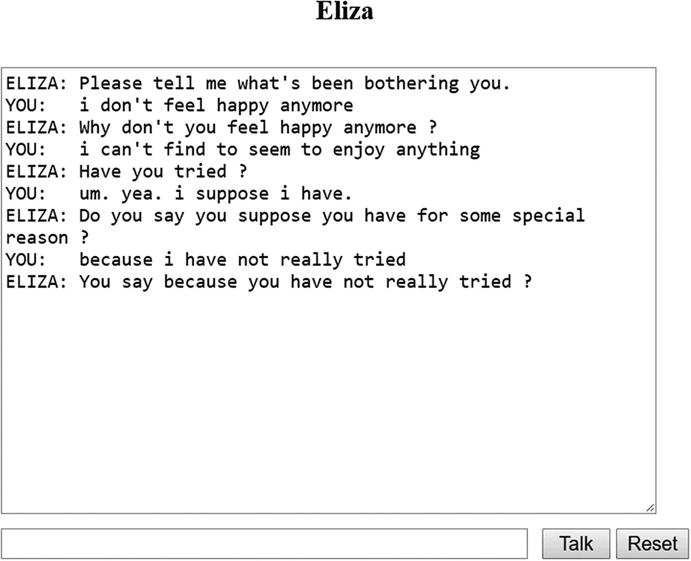
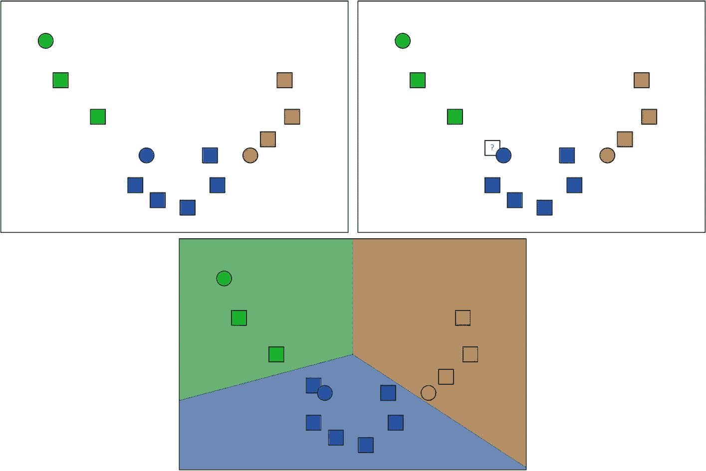
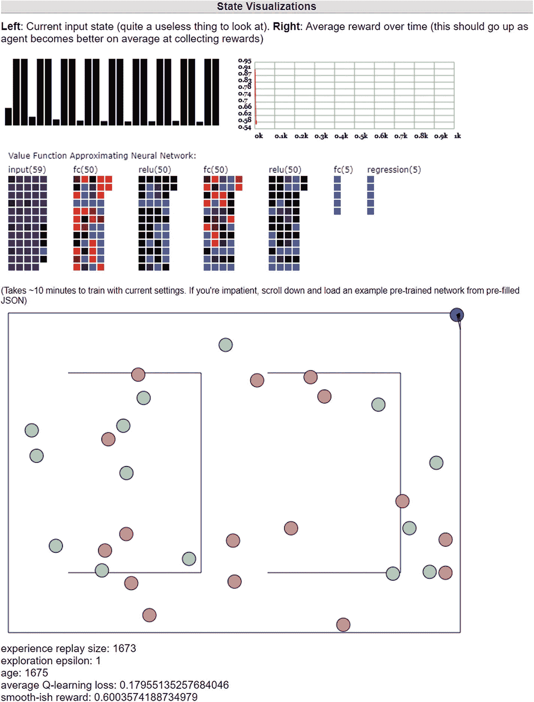
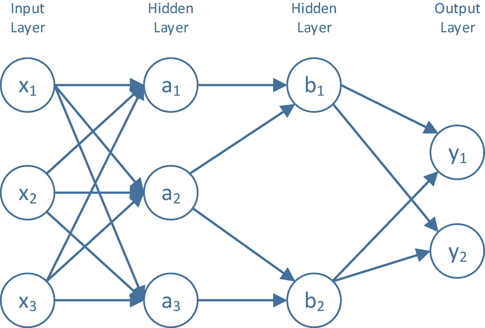

# 二、聊天机器人自然语言理解

在我们开始创建机器人和花哨的自然语言模型之前，我们将快速了解自然语言理解(NLU)及其一些机器学习(ML)基础。在下一章中，我们将使用微软的语言理解智能服务(LUIS)来实现这些 NLU 概念。您可以使用其他服务(例如，微软的认知服务)或 Python/R ML 工具来探索其他一些概念。这一章旨在为你提供一个关于 ML 领域的快速入门，因为它与自然语言任务有关。如果你熟悉这些概念，请务必跳到第三章。否则，我们希望传授对 NLU 的根源以及如何将其应用于机器人领域的基本理解。互联网上有大量深入讨论所有这些话题的内容；如果你喜欢冒险，我们会提供合适的参考资料！

如果我们选择开发一个 NLU 集成的聊天机器人，我们的日常工程将涉及与系统的持续互动，这些系统可以理解用户所说的话。这是一项艰巨的任务。考虑使用强力编码来理解与我们的自然语言控制器恒温器相关的自由文本用户输入。我们在第一章中介绍了这个用例。我们有四个目标:通电、断电、设置模式和设置温度。让我们考虑一下设定温度的目的。你如何编码一个系统，让它理解用户想要设置一个温度，以及用户输入的哪一部分代表温度？

我们可以使用一个正则表达式来尝试匹配像“将温度设置为{温度}”、“设置为{温度}”和“设置{温度}”这样的句子你测试一下。你感觉很好，然后一个测试者过来说，“我想要 80 度。”好吧，没什么大不了的。我们加上“我希望它是{温度}”第二天，有人过来说，“把温度降低 2 度。”我们可以加上“温度降低{diff}”和“温度升高{diff}”但是现在我们需要检测字*降低*和*增加*。我们如何解释这些词的变体呢？不要让我们开始使用多个命令，比如“白天设置为 68，晚上设置为 64。”仔细想想，我们在谈论什么温度单位？

当我们思考我们想要在聊天机器人上支持的交互时，我们很快注意到使用暴力方法会导致一个非常乏味的系统，最终，鉴于自然语言交流的迷人和令人讨厌的不一致性，它不会执行得很好。如果我们想利用蛮力方法，我们可以得到的最接近的方法，并且仍然可以获得相当好的性能，就是使用正则表达式。Bot 框架支持这一点，我们将在第五章中看到。如果我们使用这样的方法，假设你不是一个正则表达式迷，我们的交互模型出于维护的原因需要保持简单。

自然语言理解(NLU)是复杂的自然语言处理(NLP)领域的一个子集，涉及人类语言的机器理解。NLU 和 NLP 与我们对人工智能的理解有着千丝万缕的联系，可能是因为我们经常将智力与沟通技能联系起来。这可能也有潜在的心理本质；我们认为，如果机器人理解我们在说什么，它就更聪明，不管我们的智力水平和我们说话的复杂程度如何。事实上，我们可能会对那种能够理解我们在想什么而不是我们在说什么的人工智能感到最高兴。但是我跑题了。

在这种假设下，命令行并不智能，因为它要求命令采用特定的格式。如果我们可以通过请求命令行“启动 node……我不确定是哪个文件,”来启动 Node.js 脚本，我们会认为它是智能的吗？你能帮我吗？."使用现代 NLU 技术，我们可以建立似乎了解某些专业或任务的模型。随后，从表面上看，机器人似乎有点智能。是吗？

事实是，我们还没有开发出计算能力和技术来创建一个与人类智能相匹配的 NLU 系统。如果一个问题只有在我们能让计算机像人类一样聪明的情况下才能解决，那么这个问题就被称为“人工智能难题”。一个像人类一样行为和理解自然语言输入的合适的 NLU 系统还不在我们的掌握之中；但是，我们可以创建狭窄而聪明的系统，能够很好地理解一些事情，从而创建合理的对话体验。

考虑到最近围绕 ML 和 AI 的大肆宣传，我们从一开始就设定这些期望是很重要的。在我们与客户关于对话智能的最初对话中，我总是首先提到的一件事是，期望和现实之间存在差距。我喜欢说，房间里的任何人都可以很容易地用人类可以理解但机器人不能理解的方式来表达事物，从而击败机器人。这项技术是有局限性的，在可用的预算和时间范围内它能做的事情也是有限的。没关系。只要我们创建一个专注于特定任务的聊天机器人，让我们的用户生活得更好，我们就在正确的道路上。如果我们能通过在聊天机器人中加入一些 NLU 来取悦用户，那就太好了！

## 自然语言机器学习背景

NLP 领域的起源可以追溯到艾伦·图灵，特别是图灵测试， <sup>1</sup> 一种确定机器是否能够智能运行的测试。在测试中，评估者可以向两个参与者提问。以参与者之一是人类的身份回答；计算机是第二个参与者。基于评估者从两个参与者那里得到的答案，如果评估者不能确定哪个参与者是人类，哪个是计算机，那么就说计算机通过了图灵测试。一些系统声称能够通过图灵测试，但这些声明被认为是不成熟的。有一种批评认为，编写一个机器人来试图欺骗人类相信它是人类和理解人类的输入是两码事。我们距离通过图灵测试还有好几年的时间。

自然语言处理领域最著名的早期成功案例之一是伊莱扎，这是约瑟夫·韦森鲍姆写的一个心理学家的模拟。它写于 20 世纪 60 年代中期，是一个简单且看似智能的机器人的好例子。该机器人由一个脚本驱动，该脚本根据关键字为输入赋值，并将得分输入与输出进行匹配，这与机器人框架中的识别器没有什么不同。JavaScript 实现可以在网上找到；见图 2-1 。许多其他类似的系统被创造出来，并取得了不同程度的成功。



图 2-1

与 JavaScript 版本的 Eliza 交互的示例

NLU 引擎通常是基于规则的；它们用结构化的知识表示进行编码，供系统在处理用户输入时使用。大约在 20 世纪 80 年代，机器学习领域开始普及。机器学习是让计算机在没有为任务编码的情况下学习的过程——这似乎比基于规则的方法更接近智能。例如，我们简要地探讨了如何构建一个强力 NLU 引擎，以及使用各种规则进行编码的繁琐工作。使用机器学习，我们的系统不需要提前知道关于我们的领域和意图分类的任何事情，尽管我们当然可以从预先训练的模型开始。相反，我们将创建一个引擎，显示标有特定意图名称的样本输入。这被称为*训练数据集*。基于输入和标记的意图，我们训练一个模型来将输入识别为呈现的标签。一旦经过训练，模型就能够接收它尚未看到的输入，并为每个意图分配分数。我们训练模型的例子越多，它的性能就越好。这就是人工智能的用武之地:用高质量数据训练模型的净效果是，通过使用统计模型，系统可以开始对它尚未遇到的输入进行标签预测。

刚才描述的是监督学习的简化版本。该名称来源于输入数据被标记的事实。监督学习的性能可以很好地进行定量分析，因为我们知道真实的标签，并且能够将它们与预测的标签进行比较，以获得定量值，这种技术被称为*交叉验证*。最适合监督学习的任务类型是分类和回归问题。对于 C 类，分类是确定输入 I 是否属于 C 类的任务；例如，照片是熊猫的吗？或者，我们可以给定一组类 S，确定输入 I 的类。常见的分类算法包括支持向量机和决策树。图 2-2 、 2-3 和 2-4 展示了一个典型的监督学习场景。



图 2-2，2-3，2-4

一个监督学习的例子。图 2-2 是我们的训练数据，我们想请系统对图 2-3 中带问号的数据点进行分类。分类算法将利用数据点根据标记数据计算出边界，然后预测输入数据点的标记(图 2-4 )。

回归与此类似，但与预测连续值有关。例如，假设我们有一个跨机场的天气特征数据集。也许我们有温度、湿度、云量、风速、降雨量以及当天纽约 JFK、旧金山国际机场和芝加哥奥黑尔机场取消的航班数量的数据。我们可以将这些数据输入一个回归模型，并使用它来估计纽约、旧金山和芝加哥的一些假设天气的取消数量。

除了监督学习，还有其他形式的机器学习。无监督学习是理解未标记数据的任务，通常是如图 2-5 和 2-6 所示的数据聚类任务。


图 2-5 和 2-6

无监督学习，其中算法识别三组数据

半监督学习是用一些标记数据和一些未标记数据训练模型的想法。强化学习是一种系统学习的思想，通过进行观察，并基于所述观察，做出最大化某种回报函数的决策。如果决策产生了更好的回报，它就会被强化。否则，该决定将受到处罚。关于不同类型学习的更多信息可以在别处找到。 <sup>5</sup>

在斯坦福的 CS 页面上有一个关于深度强化学习的迷人插图。， <sup>6</sup> 如图 2-7 所示。在这个演示中，一个代理人导航一个空间，并学习导航到有积极奖励的红苹果，并避免有毒的绿苹果。



图 2-7

深度强化学习算法的可视化

需要强调的一个有趣的点是，NLU 和 NLP 的普遍流行的 bot 应用都相当肤浅。事实上，有人批评称沃森在 Jeopardy 上做的事情或者机器人在 NLU 做的事情。正如雷·库兹韦尔在《华尔街日报》的一篇文章中所说，沃森不知道它赢了《危险边缘》。理解和分类/提取信息是两个不同的任务。这是一个公平的批评，但当涉及到在特定的狭窄背景下理解人类语言时，一个构建良好的意图和实体模型可以证明是有用的，这正是聊天机器人所做的。

除了意图分类问题之外，NLP 还关注诸如语音标记、语义分析、翻译、命名实体识别、自动摘要、自然语言生成、情感分析等任务。我们将在第十章的多语言机器人环境中研究翻译。

在 20 世纪 80 年代，对人工神经网络(ANN)研究的兴趣日益增加。在接下来的几十年里，该领域的进一步研究取得了引人入胜的成果。对人工神经网络中神经元的一种简单看法是，将其视为一个具有 N 个权重/输入和一个输出的简单函数。人工神经网络是一组相互连接的神经元。作为一个单元，神经网络接受一组输入并产生一个输出。训练神经网络的过程就是设置神经元权重值的过程。研究人员专注于分析许多不同类型的神经网络。深度学习是训练深度神经网络的过程，深度神经网络是在输入和输出之间有许多隐藏层的 ann(图 2-8 )。

谷歌的 Translate、AlphaGo 和微软的语音识别都通过利用深度神经网络取得了积极的成果。深度学习的成功是对隐藏层内各种连接架构进行研究的结果。一些更流行的架构是卷积神经网络(CNN)和递归神经网络(RNNs)。 <sup>8</sup> 与机器人相关的应用可能包括翻译、文本摘要、语言生成等。如果你想深入研究人工神经网络如何应用于自然语言任务，还有许多其他资源可供你探索。 <sup>9</sup>

当数据在神经元之间来回传递时，许多人工神经网络层内发生了什么？似乎没有人十分确定。例如，人们观察到谷歌的翻译创造了一种语言的中间表现形式。脸书创造可以与其他机器人或人类谈判的人工智能的项目导致人工智能创造了自己的速记甚至撒谎。这被认为是人工智能正在接管世界的一些迹象，而在现实中，尽管这些是迷人的和值得讨论的行为，但它们是训练过程的副作用。在未来，随着网络的复杂性产生更多意想不到的突发行为，这些副作用中的一些可能会变得更加令人毛骨悚然和可怕。目前，我们是安全的，不会被人工智能接管。

通过使用微软的认知工具包 <sup>10</sup> 和谷歌的张量流 <sup>11</sup> 等工具包来开发深度学习模型的便利性也是最近人工神经网络模型受欢迎程度上升的一个重要推动因素。



图 2-8

安

深度学习技术在自然语言处理任务中得到了非常成功的应用。特别是，语音识别和翻译已经从深度学习的引入中受益匪浅。事实上，微软研究院已经创建了语音识别软件，“它可以识别对话以及专业的人类转录员”， <sup>12</sup> ，谷歌通过利用深度学习，将其翻译算法的错误率降低了 55%至 85%。 <sup>13</sup> 然而，在意图分类等 NLU 任务中的有效性并不像深度学习宣传的那样强。这里的关键见解是，深度学习是 ML 工具包中的另一个工具，而不是银弹。

## 常见 NLP 任务

一般来说，NLP 处理大量的问题，其中的一个子集就是我们认为的 NLU 任务。在高层次上，主题可以与语言句法、语义和话语分析相关。并非每个 NLP 任务都与聊天机器人开发直接相关；其中一些是更相关的高阶特征的基础，例如意图分类和实体提取。

### 句法

语法任务通常处理与获取文本输入并将其分解成组成部分相对应的问题。这些任务中有许多是基础性的，不会被机器人直接使用。将输入分割成更小的语音单元，称为*语素*，并在一些语法中建立代表语音的结构就是两个例子。部分*语音标记*，用其词性(例如，名词、动词、代词)标记用户输入中的每个单词的过程，可用于细化用户查询。

### 语义学

语义任务与在自然语言输入中寻找意义有关。这些任务对聊天机器人有实际应用，包括以下内容:

*   *命名实体提取*:给定一些文本，确定哪些单词映射到名称以及名称的类型(例如，位置、人)。这直接适用于我们希望聊天机器人做的事情。

*   *情感分析*:识别某个文本的内容总体上是正面的、负面的还是中性的。这可以用于确定用户对机器人响应的情绪，重定向到人类代理，或者在机器人分析中理解用户在哪里出错以及对机器人的反应不好。

*   *主题分割*:给定一段文字，将其分割成与主题相关的片段，提取出那些主题。

*   *关系提取*:提取文本中对象之间的关系。

### 话语分析

话语分析是着眼于更大的自然语言结构并把它们作为一个单元来理解的过程。在这个领域，我们感兴趣的是从一个文本体的上下文中推导出意义。自动摘要用于摘要大量的内容，如公司财务报表。与聊天机器人更相关的是共同引用解析的概念。共指解析是确定多个单词所指的实体的思想。在下面的输入中， *I* 指的是 Szymon:

```js
My name is Szymon. I am piling up cereal for my son.

```

## 常见的机器人 NLU 任务

如果我们计划在聊天机器人中使用 NLU，在评估解决方案时需要考虑几个特性。最基本的功能是识别定制意图和实体的能力。以下是一些需要考虑的功能:

*   多语言支持:在 NLU 实现中对多语言的支持充分说明了 NLU 平台的重要性。不同语言的优化经验可以很好地反映团队对 NLU 的整体体验。

*   *包含预建模型的能力*:领先总是值得的，许多系统将包含许多与特定领域相关的预建意图和实体，供您开始使用。

*   *预构建的实体*:我们希望现有系统能够轻松地为我们提供许多类型的实体，例如数字和日期/时间对象。

*   *实体类型*:应该能够指定不同类型的实体(比如列表和非列表)。

*   *同义词*:系统应该接受显示给实体分配同义词的能力。

*   *通过主动学习进行持续培训*:系统应支持利用真实用户输入作为 NLU 模型培训数据的能力。

*   虽然这些工具会为你实现某种用户界面来训练模型，但是应该有一个你可以利用的 API。

*   *导出/导入*:该工具应该允许您导入/导出模型，最好是像 JSON 这样的开放文本格式。

利用现有服务的另一种方法是编写自己的服务。这是一个高级话题。如果你正在读这本书，很可能你没有足够的经验和知识来完成它。有一些易于使用的 ML 包，如 scikit-learn，可能会给人这样的印象，即创建这样的东西很容易，但这需要大量的优化、调优、测试和操作。从这些通用 NLU 系统中获得正确的性能需要大量的时间、精力和专业知识。如果你对这些技术的工作原理感兴趣，网上有大量的资料供你自学。 <sup>14</sup>

## 基于云的 NLU 系统

来自云计算领域的好消息是，大型技术公司正在对 ML 即服务领域进行投资，我们的机器人需要的任务的基本功能可以作为服务获得。从实践的角度来看，这里有许多好处:开发人员不必关心为我们的分类问题选择最佳算法，没有必要扩展实现，有现有的高效用户界面和升级，优化是无缝的。如果你正在创建一个聊天机器人，并且需要基本的分类和实体提取功能，那么使用基于云的服务是最好的选择。

这个领域是非常动态的，这些系统的特征和焦点随着时间而变化。无论如何，在撰写本文时，以下是最佳选择，排名不分先后:

*   *微软的语言理解情报服务(LUIS)* :这是一个最纯粹的 LU 系统的例子，因为它完全独立于一个对话引擎。LUIS 允许开发人员添加意图和实体，对 LUIS 应用进行版本控制，在发布之前测试应用，并最终发布到测试或生产端点。此外，它还包括一些非常有趣的主动学习功能。

*   *Google 的 dialog flow(Api.ai)*:dialog flow，以前叫 API . ai，已经有一段时间了。它允许开发人员创建 NLU 模型，定义转换流，并在满足特定条件时调用 webhooks 或云函数。可以通过 API 或通过集成到许多消息传递通道来访问对话。

*   *亚马逊的 Lex* :亚马逊的 Alexa 早就允许用户创建意图分类和实体提取模型。随着 Lex 的引入，Amazon 通过 bot 开发为 NLU 带来了更好的用户界面。在撰写本文时，Lex 有一些通道集成，可以通过 API 访问。像 Dialogflow 一样，Lex 允许开发人员使用 API 与机器人对话。

*   IBM Watson Conversation :另一个类似的系统 Watson Conversation 允许用户定义意图、实体和基于云的对话。该对话可通过 API 访问。在撰写本文时，还没有预构建的通道连接器；尽管存在示例，但代理必须由 bot 开发人员编写。

*   脸书的 Wit.ai : Wit.ai 已经存在了一段时间，它包括一个定义意图和实体的接口。截至 2017 年 7 月，它正在重新关注 NLU，并移除 bot 引擎部分。Wit.ai 也正在与 Facebook Messenger 生态系统更紧密地结合在一起。

在下一章的 NLU 深海潜水中，我们将利用路易斯。作为一个纯粹的 NLU 系统，LUIS 具有显著的优势，尤其是在 Bot 框架集成方面。尽管目前在 NLU 领域没有太多的基准，LUIS 仍然是市场上表现最好的 NLU 系统之一。 <sup>十五</sup>

## 企业空间

在企业领域还有许多其他选择，实在是不胜枚举。你可能会遇到一些更大的公司和产品名称，如 IPsoft 的 Amelia 和 Nuance 的 Nina。这一领域的产品通常都很先进，包含多年的企业级投资。一些公司专注于 IT 或其他流程自动化。一些公司关注内部用例。一些公司专注于特定的垂直行业。然而，其他公司完全专注于围绕特定用例预先构建的 NLU 模型。在一些产品中，我们将通过专有语言而不是开放语言来编写 bot 实现。

最终，企业的决策是一个典型的购买还是构建的两难选择。利基解决方案可能会持续一段时间，但有理由认为，随着 IBM、亚马逊、微软、谷歌和脸书投入这一领域的投资金额，资金支持较少的公司可能会受到阻碍。不解决一般 bot 问题的利基参与者肯定会蓬勃发展，我认为我们会发现更多的公司在专业 NLU 和 bot 解决方案方面进行创造和创新，这些解决方案由大型科技公司提供支持。

## 结论

我们确实看到了人工智能在 NLU 领域的民主化。几年前，bot 开发人员必须使用现有的 NLU 和 ML 库来创建一个系统，该系统可以像我们现在可用的云选项一样容易地训练和使用。现在，创建一个集成了 NLU、情感分析和共同参照的机器人非常容易。这些公司在这些系统背后的努力也不值得嘲笑；最大的技术公司正在挖掘这个领域，为他们的用户提供工具，为他们自己的平台建立对话体验。对于身为机器人开发者的你来说，这太棒了。这意味着竞争将不断推动该领域的创新，随着该领域研究的进展，分类、实体提取和主动学习方面的改进将提高 NLU 系统的性能。Bot 开发者将从所有这些 NLP 服务的加速研究和改进性能中获益。

<aside class="FootnoteSection" epub:type="footnotes">Footnotes 1

图灵测试: [`https://en.wikipedia.org/wiki/Turing_test`](https://en.wikipedia.org/wiki/Turing_test)

  2

问雷|对聊天机器人尤金·古斯特曼通过图灵测试的声明的回应: [`http://www.kurzweilai.net/ask-ray-response-to-announcement-of-chatbot-eugene-goostman-passing-the-turing-test`](http://www.kurzweilai.net/ask-ray-response-to-announcement-of-chatbot-eugene-goostman-passing-the-turing-test)

  3

伊莱莎: [`https://en.wikipedia.org/wiki/ELIZA`](https://en.wikipedia.org/wiki/ELIZA)

  4

以利沙伯: [`http://www.masswerk.at/elizabot/`](http://www.masswerk.at/elizabot/)

  5

机器学习讲解:理解有监督、无监督、强化学习，罗纳德·房龙: [`https://www.datasciencecentral.com/profiles/blogs/machine-learning-explained-understanding-supervised-unsupervised`](https://www.datasciencecentral.com/profiles/blogs/machine-learning-explained-understanding-supervised-unsupervised)

  6

深度强化学习可视化: [`http://cs.stanford.edu/people/karpathy/convnetjs/demo/rldemo.html`](http://cs.stanford.edu/people/karpathy/convnetjs/demo/rldemo.html)

  7

卷积神经网络(CNN):[`http://ufldl.stanford.edu/tutorial/supervised/ConvolutionalNeuralNetwork/`](http://ufldl.stanford.edu/tutorial/supervised/ConvolutionalNeuralNetwork/)

  8

递归神经网络及其相关架构: [`https://en.wikipedia.org/wiki/Recurrent_neural_network`](https://en.wikipedia.org/wiki/Recurrent_neural_network)

  9

CNN 与 RNN 自然语言处理的比较研究: [`https://arxiv.org/pdf/1702.01923.pdf`](https://arxiv.org/pdf/1702.01923.pdf)

  10

微软认知工具包: [`https://www.microsoft.com/en-us/cognitive-toolkit/`](https://www.microsoft.com/en-us/cognitive-toolkit/)

  11

张量流： [`https://www.tensorflow.org/`](https://www.tensorflow.org/)

  12

微软研究人员实现新的对话式语音识别里程碑: [`https://www.microsoft.com/en-us/research/blog/microsoft-researchers-achieve-new-conversational-speech-recognition-milestone`](https://www.microsoft.com/en-us/research/blog/microsoft-researchers-achieve-new-conversational-speech-recognition-milestone)

  13

一个用于机器翻译的神经网络，在生产规模- [`https://research.googleblog.com/2016/09/a-neural-network-for-machine.html`](https://research.googleblog.com/2016/09/a-neural-network-for-machine.html)

  14

机器学习，NLP:使用 scikit-learn 的文本分类，python 和 NLTK: [`https://towardsdatascience.com/machine-learning-nlp-text-classification-using-scikit-learn-python-and-nltk-c52b92a7c73`](https://towardsdatascience.com/machine-learning-nlp-text-classification-using-scikit-learn-python-and-nltk-c52b92a7c73) `a`

  15

会话式问答系统的自然语言理解服务评估: [`http://www.sigdial.org/workshops/conference18/proceedings/pdf/SIGDIAL22.pdf`](http://www.sigdial.org/workshops/conference18/proceedings/pdf/SIGDIAL22.pdf)

 </aside>