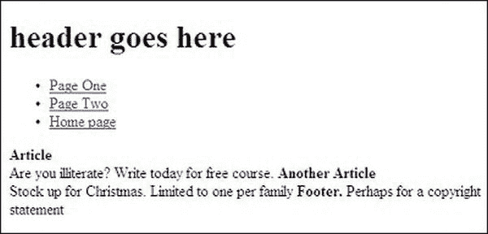

# 一、迁移到 HTML5

本书中的项目使用 HTML5。本章将向不熟悉 HTML5 的读者介绍它的基本特性，并了解它与 HTML4/XHTML 的不同之处。您还将了解如何:

> *   Convert HTML4/XHTML pages or entire websites to HTML5
> *   Create HTML5 pages that can be displayed correctly in Internet Explorer 7 and 8
> *   Take advantage of the enhancements of HTML5

自 2000 年推出 XHTML 1.0 以来，HTML5 是 web 开发中最激动人心的一步。HTML5 是网页设计的未来，但现在就可以实现；然而，这并不会使您当前的 HTML4 或 CSS2 知识变得多余。这是一个受欢迎的增强，增加了 HTML 的灵活性和有用性。也解决了一些问题；例如，它可以免除嵌入视频和音频剪辑的插件，视频文件格式的数量也大大减少。大量新的语义标签使得网站的编码和维护变得更加容易。文档类型的数量从六个减少到两个，HTML5 文档类型非常简单，您可以轻松地将它们记住。

HTML5 在浏览器供应商之间达成了一致，因为他们参与了它的制定。这意味着他们处理编码错误的方式现在已经标准化了；所有那些小分歧都解决了。HTML5 规定的浏览器解析规则确保所有现有网站继续像以前一样运行；HTML5 向后兼容。

因为这一章关注的是 HTML5 将增强最常见的网站类型的方面，所以你不会找到关于 API(应用编程接口)的全面讨论；也不会找到 HTML5 的发展史。有几本关于 API 和 HTML5 历史的书。它们很好地涵盖了这些主题；复制它们是没有意义的(参见本章末尾的提示以获得参考资料列表)。

这一章的结尾简要提到了一些 API，但是可以肯定的是，绝大多数的网站设计者和网站所有者还没有在传统的网站上实现它们。CSS Tricks ( `[`css-tricks.com`](http://css-tricks.com)`)最近进行的一项民意调查强化了这一观点。API 发布两年后，调查向网页设计师提出了以下问题:你在生产网站上实现了哪些 HTML5 特性？

结果如下:

语义标签 58%
表格 36%
音频/视频 30%
其他 16%

“其他”的 16%在九个 API 之间分配:Canvas、Web 工作器、Web Storage、Geolocation、拖放、ContentEditable、History 和 Microdata。总数加起来超过 100 %,因为大多数受访者实现了不止一个功能。

### 移动到 HTML5

现在是时候利用 HTML5 中的新特性了；通过尝试本章和后续章节中的项目，您将发现新版 HTML 可能带来的好处和增强。这本书的重点是标题中的*实用*二字；因此，我“开门见山”地提供了涵盖 HTML5 所有最有用的新特性的完整项目。我想你渴望开始，所以让我们继续吧！

#### html 5 和 XHTML5 文档类型

HTML 4/XHTML 有几种文档类型，但是 HTML5/XHTML5 只有一种文档类型，如下所示:

> <colgroup><col width="25%"><col width="75%"></colgroup>
> | **html 5:** | `<!doctype html>
> <html lang=en>
> <head>
> <title>HTML5 test document</title>
> <meta charset=utf-8>
>         *meta details go here*
> </head>` |
> | **XHTML 5:** | `<!DOCTYPE html>
> <html lang="en">
> <head>
> <title>XHTML5 test document</title>
> <meta charset="utf-8" />
>         *meta details go here*
> </head>` |

 **注意**更简单的 HTML5 DOCTYPE 可用于包含 XHTML 标记的页面，它将进行验证。事实上，可以完全忽略 XHTML5 DOCTYPE。HTML5 并不在乎你是否使用封闭标签(比如` `)。本书中的例子不使用结束标记；但是，如果您一直使用 XHTML，您可能更喜欢继续使用结束标记——html 5 将接受任何一种方式。

HTML5 文档类型用 lang=en 指定英语。对于其他语言，请参见

`[`wwww.iana.org/assignments/language-tags/language-tags.xml`](http://wwww.iana.org/assignments/language-tags/language-tags.xml)`。

**要将网页改为 HTML5 或 XHTML5，**只需更改 DOCTYPE 即可。标记不会被破坏，但您将能够使用更有用的元素，如`<audio>`和`<video>`(即使在 IE 7 或 IE 8 中使用了一点 JavaScript ),并且您的页面将会验证。

 **注意**目前的 HTML5 和 XHTML5 验证器是`[`validator.w3.org`](http://validator.w3.org)`和`[`html5.validator.nu`](http://html5.validator.nu)`。这些仍然是实验性的，你应该知道它们可能会随着时间的推移而改变。

要跟上 HTML5 项目的开发和发布，请访问

`[`html5doctor.com`](http://html5doctor.com)`

Remy Sharp 是 HTML5 Doctor 网站的专家之一。阅读他的有用文章

`[`html5doctor.com/html-5-boilerplates/`](http://html5doctor.com/html-5-boilerplates/)`

他写道，下面的标记是“完全有效的 HTML5”:

`<!doctype html>
<title>Small HTML 5</title>

Hello world
`

太神奇了！没有`<html>`，没有`<body>`，没有语言，没有字符集，没有引号，怎么会这么松懈？它将进行验证，但不支持当前的屏幕阅读器，因此 HTML5 标记保持以下结构:

`<!doctype html>
<html lang=en>
<head>
<title>HTML5 test document</title>
<meta charset=utf-8>
        *meta details go here*
</head>
<body>
        *content goes here*
</body>
</html>`

 **注意** HTML5 的属性不一定要用引号括起来，许多 MIME 类型现在可以在 HTML5 中省略——但是对于 XHTML5，可以保留引号和 MIME 类型。

一个网站可以包含多个页面，前提是正确指定了每个页面的 DOCTYPE。如果您希望在现有网站的一个或两个 HTML5 页面上使用新的`<audio>`和`<video>`标签，这将非常有用。

表 1-1 显示了一个 XHTML 页面的 DOCTYPE 被改成了 HTML5 DOCTYPE。该页面已提交给 W3C HTML5 验证程序。它在所有浏览器中的验证和显示与原始页面完全相同。在表 1-1 中比较了两种文件类型。

表 1-1 显示了我试验过的 HTML5 DOCTYPE。图 1-1 显示了我使用的网页。

***图 1-1。**我用来试验来自表 1-1T5 的 HTML5 文档类型的网页*

在这个实验中，原始的 XHTML 页面 *(* `starter-page.html` *)* 在通常的 W3C HTML4 验证器中进行验证。一个相同的页面，但是使用 HTML5 文档类型，在 W3C HTML5 验证器中进行验证。两个页面都是 XHTML 格式的，只有文档类型发生了变化。这些照片是由 Bonehayne 农场假日住宿网站`[`www.bonehayne.co.uk`](http://www.bonehayne.co.uk)`的所有者 Sandra 和 Ruth Gould 许可使用的

自己尝试这个相同的实验。

> *   Use your own verified XHTML or HTML4 webpage, or
> *   At `[www.apress.com](http://www.apress.com)`, download the page of Figure 1-1 from the page in the book. Change the DOCTYPE on the page to HTML5 DOCTYPE. Test it on two HTML5 validators.

用户惯性将确保旧的浏览器和操作系统在未来几年内仍会继续使用。HTLM5 中的页面在旧的浏览器中应该是可读的，因为新的 DOCTYPE 向后兼容。所有的浏览器都跟上所有新的增强功能可能还需要一段时间。在上传到主机之前，在各种浏览器中测试您的 HTML5 和 XHTML5 页面。

HTML5 非常宽容，和 HTML4 transitional 一样，它接受未关闭的标签。它也将接受自我关闭标签或混合，目前，网页将验证。虽然您可以在使用 XHTML 的页面上使用 HTML5 DOCTYPE 而不是 XHTML5 DOCTYPE，但是在将来的某个时候，HTML5/XHTML5 验证器可能会更加严格，所以请继续使用实验性的 W3C 验证器来检查更改。

我已经展示了您可以在不采用任何语义元素的情况下利用较短的 HTML5 DOCTYPE。将现有页面更改为新的 DOCTYPE 后，您可能渴望尝试新的语义元素，所以让我们开始吧。

### html 5 中的新元素

以下是我想注意的几件事:

> *   This chapter covers most semantic tags.
> *   Audio/video Chapter 6
> *   Form Chapter 10 covers.

关于 JavaScript 和 HTML5:一方面，新的建议消除了对一些 JavaScript 的需求(好)；另一方面，HTML5 有越来越多的 API 需要相当复杂的 JavaScript(不太好)。如果您打算利用新的 API，您应该——或者您应该努力——精通 JavaScript 的使用。

#### 新的语义标签

*语义*关注单词的意思。新的语义标签描述了标签的内容；它们包括以下内容:

`<article>`、`<aside>`、`<audio>`、`
`、`<figcaption>`、`<figure>`、`<footer>`、`<header>`、`<hgroup>`、`<mark>`、
、`<nav>`、`<section>`、`
`、`<svg>`、`<time>`、`<video>`。

提出了一些其他的语义标签。您可以通过以下方式对其进行调查:

`[`www.w3schools.com/html5/tag_progress.asp`](http://www.w3schools.com/html5/tag_progress.asp)`。

在那里你可以找到标签的定义:bdi、comment、keygen、meter、output、progress 和 track。W3CSchools 网站上也提供了当前浏览器对这些功能的支持。

 **注意** CSS 假设元素是`*display:inline;*`。这需要改变。要确保语义标签在所有浏览器中都像块一样，请通过在链接的 CSS 表单中插入以下行来调整 display 属性。

`article,aside,details,figcaption,figure,footer,header,hgroup,nav,section { display:block; }`
不这么做 IE 7 和 IE 8 就会行为不端。

语义标签对谁有利？每个人都有；语义标签让网站开发人员的生活变得更加轻松。标签名称的标准化只会是一件好事，如果设计团队使用无处不在的名称，如`nav`或`header`或`article`等等，他们定位标签就不会有问题。搜索引擎将能够通过`<nav>`标签找到链接到主页的页面。`
`和`id`的数量将减少，这简化了开发和编码。我建议您尽可能使用语义标签，即使需要一点 JavaScript 来使 IE 7 和 IE 8 能够识别它们。然后，当这两种浏览器灭绝时，你将会变得擅长使用和设计语义标签。

##### 语义标签旨在消除歧义

有些能消除歧义，有些则不能。一些标签具有表象的内涵，以及指示内容的意义。

> *   Explicit HTML5 tags include `<article>`, `<aside>`, `<audio>`, `<figure>`, `<figcaption>`, `<hgroup>`, `<mark>`, `<nav>` and `<video>`.
> *   Semi-ambiguous HTML5 tags include `<header>` and `<footer>`. If there is only one page, then these are very clear. They are not only semantic, but also expressive, because they state the position of elements on the page. However, an HTML5 page can have several headers and footers. Each article can have a header and footer; Therefore, these labels are ambiguous.
> *   Another semi-ambiguous HTML5 tag `<section>` is discussed in the section "Debate about `<section>` and `<article>`" in this chapter.

自 1997 年以来，建议标签应该与标签的内容相关，*而不是*与内容的位置或风格相关。只有新的明确标签严格遵守该规则，其他的不遵守。

###### 标题

在 HTML5 中，每页一个`<h1>`标签的限制已经被放弃了。每篇文章或每节可以有标题`<h1>`到`<h6>`。这如何影响可访问性是一个必须解决的问题，因为屏幕阅读器使用标题的层次结构来引导视力障碍者浏览网页。

###### 最佳实践

无论是网站所有者还是普通用户都不会在意你是否使用语义标签，但作为一个网页设计师，你应该在意并尽量在可以的地方使用 HTML5 和语义 HTML5 标签。至少在接下来的五年里，当使用语义标签时，你将需要一个针对 IE 7 和 IE 8 的 JavaScript 解决方案。设计师会变得过分执着于避免描述表示的 *id* 和*类*。试着不要被这种强迫症所困扰。例如，考虑一个带有两列内容面板的页面。对于一个设计团队来说，`
`和`
`肯定比`
`和`
`更有意义。希望在`"leftcol"`改变某些东西的客户会说，“请修改左边的栏。”她不知道这个专栏还有什么别的名字。做任何与客户、设计师和团队成员明确沟通的事情。

###### 搜索引擎和 HTML5

由于新的语义元素，搜索将得到改进；对于`<nav>`标签来说是这样，或许对于`<video>`标签也是这样。搜索引擎可以定位页脚并应用较低的权重，因为页脚不太可能包括用户正在寻找的信息。

###### 摘要

受到双重欢迎的语义标签是那些除了语义之外还体现了另一个优点的标签。如果一个新的标签不再需要黑客和 JavaScript 解决方法，那么它将是一个很大的改进。Internet Explorer 7 和 8 不理解语义标签；因此，网页设计者要么在几年内忽略 HTML5 语义标签，要么在 JavaScript 中使用语义标签。

我强烈建议你使用语义标签和 JavaScript hack，直到 IE 7 和 IE 8 不再被广泛使用。

### 带有语义标签的页面布局的简单例子

本节中的前三个项目展示了使用 HTML5 和语义标签的简单页面布局。这些例子使用了一个 JavaScript 片段来使 IE 7 和 IE 8 能够识别语义标签。

 **注意**接下来三个例子中的导航菜单都是原始的；更复杂的菜单将在本章后面介绍。HTML5 翻转菜单在第四章的中有完整的解释(有工作示例)。

图 1-2 和 1-3 展示了语义标签的效果。

***图 1-2。**在 IE 9、火狐、Safari、Opera、Chrome 中显示*

***图 1-3。**在 IE 7 和 IE 8 中显示*

这个简单的页面使用了语义元素`<header>`、`<footer>`和`<article>`。标记没有使用`
` s。内部样式仅用于指导目的。

**清单 1-2** 创建图 1-2 和图 1-3；外观上的差异是由不同的浏览器造成的。

***清单 1-2。【simplistic-html5.html】在各种浏览器中测试的简单语义页面(??)***

`<!doctype html>
<html lang=en>
<head>
<title>Simplistic HTML5</title>
<meta charset=utf-8>

</head>
<body>
<header>
<h1>header goes here</h1>
</header>
<nav>
<ul>
        <li><a href="page-one.html" >Page One</a></li>
        <li><a href="page-two.html" >Page Two</a></li>
        <li><a href="index.html" >Home page</a></li>
</ul>
</nav>
<article>
<h2>Article</h2>
Are you illiterate? Write today for free course.
</article>
<article>
<h2>Another Article</h2>
Stock up for Christmas. Limited to one per family.
</article>
<footer>
Footer. Perhaps for a copyright statement
</footer>
</body>
</html>`

### 针对 Internet Explorer 7 和 8 的解决方案

IE 9 将支持 HTML5 语义标签，但 IE 7 和 IE 8 需要一个“条件”，强制它们识别语义标签。在标记中使用 Remy Sharpe 的 JavaScript 片段，这样您就可以在 IETester 软件中测试页面是否支持 IE 7 或 IE 8。

 **提示**提示`[`www.my-debugbar.com/wiki/IETester/HomePage`](http://www.my-debugbar.com/wiki/IETester/HomePage)`。详见第十九章。除了 IETester，还有其他工具可以用来测试您的页面是否支持旧版本的浏览器。你可以试试 Adobe BrowserLab，微软 Expression 的 SuperPreview，IE NetRenderer ( `[`netrenderer.com`](http://netrenderer.com)`)。

Remy Sharp 设计了一个任何人都可以免费使用的解决方案。它把语义标签转换成 IE 7 和 IE 8 能理解的东西。它涵盖了大多数 HTML5 标签，包括:-

<article>、

<aside>、

<audio>、

<canvas>、

<figcaption>、

<figure>、

<footer>、

<header>、

<hgroup>、<mark>、

<nav>、

<section>、<time>、<video>。</video></time></section>

</nav></mark> </hgroup>

</header>

</footer>

</figure>

</figcaption>

</canvas>

</audio>

</aside>

</article>

 **提示**参见雷米夏普在`[`remysharp.com/2009/01/07//html5-enabling-script`](http://remysharp.com/2009/01/07//html5-enabling-script)`的 B:log。参见布鲁斯·劳森和雷米·夏普的《?? 介绍 HTML5》。

下载 JavaScript 文件`html5.js`并在主机文件夹中放一份副本。网站上的页面必须包含一个`<body>…</body>`标签，JavaScript 才能运行，即使 HTML5 不再需要`<body>`标签。在每一页的`<head>`部分，添加一个 IE 条件语句和一个到 JavaScript 的链接，如下面代码片段中粗体部分所示:

`<!doctype html>
<html lang=en>
<head>
<title>HTML 5 complete</title>
<meta charset=utf-8>
<link to a style sheet goes here…>
        **<!--[if lte IE 8]>**
                ****
        **<![endif]-->**
</head>
<body>

Oh no! not another Hello World
</body>
</html>`

 **注意** `html5.js`不是写成“htm 加 15”而是写成 htm 加小写 L 和数字五。

甚至 JavaScript 哑剧类型；`type="text/javascript"`可以从 HTML5 中省略。默认情况下，新浏览器识别 JavaScript 文件的结尾`*.js`,并应用适当的 MIME 类型。

 **注意**条件和脚本必须在`<head>`段中，放在任何一个样式表链接之后，如图图 1-4 所示。

***图 1-4。**右边的面板显示了使用 JavaScript 的 IE 7 和 IE 8 的显示*

清单 1-4 包含了一段 JavaScript 代码，允许 IE 7 和 IE 8 理解语义标签。结果见图 1-4 。

***清单 1-4** 一个简单的语义页面，带有面向 IE 7 和 IE 8 的 JavaScript 回退功能(simplistic-html5-java.html)*

`<!doctype html>
<html lang=en>
<head>
<title>Semantic tags with JavaScript support for IE 7 and 8</title>
<meta charset=utf-8>

        <!--[if lte IE 8]>
                
        <![endif]-->
</head>
<body>
<header>
<h1>header goes here</h1>
</header>
<nav>
<ul>
        <li><a href="page-one.html" >Page One</a></li>
        <li><a href="page-two.html" >Page Two</a></li>
        <li><a href="index.html" >Home page</a></li>
</ul>
</nav>
<article>
        <b>Article</b> Are you illiterate? Write today for free course.
</article>
<article>
        <b>Another Article</b> Stock up for Christmas. Limited to one per family
</article>
<footer>
<strong>Footer.</strong> Perhaps for a copyright statement
</footer>`

###### 列

在清单 1-4 中显示的简单例子很好，但是假设我们想要一个可读性更好的布局，其中*文章*块在垂直列中，如图图 1-5 所示。

***图 1-5** 。垂直并排文章块。语义标签没问题。*

清单 1-5 创建了两个垂直的“文章”列，如图图 1-5 所示。关键特征以粗体显示。内部样式表仅用于教学目的。

***清单 1-5** 。使用语义* `<article>` *标签创建列(simplistic-side-by-side.html)*

`<!doctype html>
<html lang=en>
<head>
<title>Semantic tags with two articles side by side</title>
<meta charset=utf-8>

        <!--[if lte IE 8]>
                
        <![endif]-->
</head>
<body>
<header>
<h1>header goes here</h1>
</header>
<nav>
<ul>
        <li><a href="page-one.html" >Page One</a></li>
        <li><a href="page-two.html" >Page Two</a></li<
        <li><a href="index.html" >Home page</a></li>
</ul>
</nav>
<article>
<h2>Article</h2>Are you illiterate? Write today for a free course. Easy payment terms.
</article>
<article>
<h2>Another Article</h2>Stock up for Christmas. Limited to one per family. 
Free Delivery &pound;2
</article>
<footer>
<strong>Footer.</strong> Perhaps for a copyright statement
</footer>` `</body>
</html>`

### <导航>标签

网站传统上使用带有许多不同的 *id* 属性的`
`作为导航菜单；例如，菜单、导航、链接、导航菜单、导航等等。HTML5 引入了语义标签`<nav>`，对导航菜单进行标准化。`<nav>`标签必须充当包围无序链接块的容器，也就是说，`<ul> </ul>`标签必须位于`<nav> </nav>`容器内。图 1-6 显示了用语义`<nav>`标签创建的菜单块。

***图 1-6。**使用 HTML5 < nav >标签*创建的一组导航菜单按钮

清单 1-6a 使用 HTML5 语义`<nav>`标签引入了 3D 按钮

***清单 1-6a。**使用【html5-nav.html】`<nav>`*标签插入 3D 导航菜单**

`<!doctype html>
<html lang=en>
<head>
<title>The nav tag</title>
<meta charset=utf-8>
<link rel="stylesheet" type="text/css" href="nav-style.css">
    <!--[if lte IE 8]>
    
    <![endif]-->
</head>
<body>

<header>
<h1>header goes here</h1>
</header>
<nav>
<ul>
            <li><a href="#" title="Page 2">Page Two</a></li>
            <li><a href="#" title="Page 3">Page Three</a></li>
            <li><a href="#" title="Page 4">Page Four</a></li>` `            <li><a href="#" title="Home page">Home Page</a></li>
</ul>
</nav>

<article>
<strong>Article </strong>From a local newspaper:
<strong>Are you 
illiterate?</strong> Write today for a <strong>Free</strong> course. 
  Easy payment terms. 

</article>
<article>
<strong>Another Article</strong> 
Poster in store window:
<strong>Stock up for Christmas</strong> 
Limited to one per family. Free Delivery &pound;2

</article>
<article>
<strong>Another Article</strong> Mark Twain said:&quot;Life is one 
darn thing after another&quot;
 So true, but we can still laugh about it

</article>

<footer>
<strong>Footer goes here</strong>
</footer>
</body>
</html>`

清单 1-6b 提供了导航菜单的 CSS 表示

***清单 1-6b。**使用 CSS 中的< nav >标签用于清单 1-6a (nav-style.css)*

`#container { width:780px; margin:auto;
}
#content { width:640px; margin-left:140px;
}
header, nav, footer, article, section { display:block;
}
header { width:780px; background-color:#FF9966; text-align:center; 
margin:5px auto 10px auto; padding:2px;
}
article { float:left; width:190px; margin:0 0 0 10px; padding:6px;
}
footer { clear:both; background-color:#FF9966; text-align:center; 
width:780px; margin:auto;
}
p { margin-top:5px; margin-bottom:5px;
}
/* set navigation menu position and style*/
nav { float:left; width:130px; background-color : white; margin: 0 7px 5px -30px;
}
nav ul {float:left; width:130px;}
/* set general side button styles */
nav li { margin-bottom: 3px; text-align: center; list-style-type:none; width:125px;}
/* set general anchor styles */
nav li a { display: block; color: white; font-weight: bold; 
text-decoration: none }` `/* specify state styles */
/* mouseout (default) */
nav li a { background:#946055; color: white; border: 5px outset #C96E6B;}
/* mouseover */
nav li a:hover { background: #9F7562;   border: 5px outset #C96E6B;}
/* onmousedown */
nav li a:active { background:maroon;  border: 5px inset maroon }
}`

### 使用语义标签的更复杂的例子

下一个例子使用之前在图 1-1 中说明的页面。图 1-7 提供了其外观的提示。

***图 1-7。**之前在图 1-1 中显示的同一个网页现在包含了语义标签*

这里，我们将把之前在图 1-1 中显示的页面转换成 HTML5 语义元素。

在现实生活中，你不需要转换一个已经存在的页面。至少十年内，你当前的 HTML4 或 XHTML 格式的网页可以在所有浏览器中正常显示，而不需要 HTML5 文档类型。但是，如果您希望利用语义标签，下一个项目将描述如何通过修改现有的 XHTML 或 HTML4 页面来合并它们。

 **注意**您当前所见即所得的网站编辑程序可能无法正确显示 HTML5 语义元素。因此，您需要在 web 浏览器中测试每一步。您可以将代码直接写入文本编辑器，比如 Notepad 或 Notepad++，然后在浏览器中进行测试。你也许可以升级你的所见即所得程序，使其与 HTML5 兼容。一些 WYSIWYG 编辑器声称兼容 HTML5，包括`[`github.com/bordeux/HTML-5-WYSIWYG-Editor`](https://github.com/bordeux/HTML-5-WYSIWYG-Editor)`的 Bordeux/HTML-5 WYSIWIYG 编辑器、`[`aloha-editor.org`](http://aloha-editor.org)`的 Aloha 编辑器和`[`jejacks0n.github.com/mercury/`](http://jejacks0n.github.com/mercury/)`的 Mercury 编辑器。无论如何，在`[`validator.w3.org`](http://validator.w3.org)`或`[`html5.validator.nu`](http://html5.validator.nu)`用验证器检查你的 HTML5 页面

##### 转换步骤

执行以下步骤将页面转换为 HTML5:

1.  复制一个现有的(X)HTML4 页面(没有语义标记的页面)，并将其命名为类似于 HTML5-test-page.html 的*。我已经将我的副本命名为`starter-page.html`，它可以在`[`www.apress.com`](http://www.apress.com)`从书的页面下载。*
**   复制页面的样式表，并将其命名为类似于 *html5-style.css* 的名称。我已经将我的副本命名为`starter.css`，可以在 [` `www.apress.com``](http://www.apress.com) 的页面下载。*   在您打算转换的页面中查找逻辑块。此外，查看新标签的清单，看看如何调整页面以适应它们。我正在处理的页面没有独立的条目，因此我们不能使用`<article>` s。逻辑块最终将成为语义块。在本练习中，合适的模块如下:
    *   带有白色边框的页眉(当前标记为`
`)。
    *   最右边的列及其菜单块可以替换为`<nav>`。
    *   语义上的`<footer>`可以代替现在的`
`。*   将文件类型更改为`        <!doctype html>
            <html lang=en>
            <head>
            <title>Your title</title>
            <meta charset=utf-8>`*   将 HTML 页面中的链接更改为指向您复制并重命名的 CSS 文件的名称。*   为了支持 IE 7 和 IE 8，在`<head>`部分添加 Remy Sharp 的 JavaScript 片段的链接。`        <!--[if lte IE 8]>
            
            <![endif]-->`*   Download and install `html5.js` in the main folder of the web site. It’s available from `[www.apress.com](http://www.apress.com)` or from

    *??`[`remysharp.com/2009/01/07//html5-enabling-script`](http://remysharp.com/2009/01/07//html5-enabling-script)`*

    *   Add this line into the CSS file:

    `header, nav, footer, article, { display:block; }`* 

 *在将我的起始文件转换成语义标签后，我将它们重命名为`HTML5-Ch1-7.html`和`HTML5-style-2.css`。下面列出了这些内容，可以从该书的网页上下载。

***清单 1-7a。【新 HTML5 上市(HTML5-Ch1-7.html ??)】***

`<!doctype html>
<html lang=en>
<head>
<title>Test page for semantic tags </title>
<meta charset=utf-8>
<link rel=”stylesheet” type=”text/css” href="HTML5-style-2.css">
        <!--conditional Javascript added-->
        <!--[if lte IE 8]>
        
        <![endif]-->
</head>
<body>
<header>*<!--
 changed to <header>-->*
  <h1>Devon's Rural Retreats</h1>
</header>
<!--close top section - *content area starts* -->

   <h2>Award winning accommodation, self catering or bed and breakfast</h2>

<h3>Cottages, converted barns, caravans</h3>
 The superb interior 
of one of our cottages
</div*>*
<nav>*<!--use the semantic tag <nav>-->*
<ul><!--start of menu list-->
<li class="btn"> <a href="accommodation.html" title="Accommodation">Accommodation</a></li>
<li class="btn"><a href="maps.html" title="Location Maps">Maps</a>
</li>
<li class="btn"><a href="faqs.html" title="Frequently Asked Questions">Information</a> 
</li>
<li class="btn"><a href="attractions.html" title="Local attractions">Attractions</a></li>
<li class="btn"><a href="contact.html" title="Contact us">Contact Us</a></li>
<li class="btn"><a href="index.html" title="Return to Home Page">Home Page</a></li>
</ul><!--end of menu list-->
</nav>*<!--
 removed and replaced with </nav>-->*

  <h3>Situated in the UK's beautiful Devon countryside</h3>

` ` 

<!--content section closed-->
<!--*
 changed to <footer*>*-->*
<footer>
Footer goes here

</footer>
</body>
</html>`

***清单 1-7b。**修改后的 CSS 工作表* **为图 1-7***(html 5-style-2 . CSS)*

(重点项目用黑体字标出。)

`/*equalise for various browsers and change #header to header*/
div body header #content { margin:0; padding:0; border:0;
}
body { background:#FFF url(img/green-grad.jpg) repeat-x; margin:auto;
}
/*add display attributes for the semantic tags*/
**header, footer, section, article, nav { display:block;**
}
/*remove the # from #header*/
**header** {width:920px; height:180px; padding:0; border:10px white solid; 
background: url(img/header3.jpg); margin:10px auto;
}
h1 { font-size:300%; color :white; position: relative; left:90px; top: 55px; width:480px;
}
#rosette { position:relative; left:750px; top:5px;
}
#content { background-color:transparent; border-left:10px white solid; 
border-right:10px white solid; border-bottom:10px white solid; width: 904px; 
margin-top:10px; margin-left:auto; margin-right:auto; padding:8px; 
font-size:medium; color:maroon;
}
h2 { font-size:x-large; color:white; margin:0 0 10px 0;
}
h3 { font-size:large; color:white; margin:0 0 6px 0;
}
#leftcol { float:left; width: 310px; vertical-align:top;
}
#rightcol { width: 135px; float:right; height: 252px; margin-right:10px;
}
#midcol { margin-left:315px; margin-right:145px; margin-top:10px; 
vertical-align:top;
}
/*set nav block position and width and remove the #menu item*/
**nav ul { margin:10px 0 10px 0; width:135px; float:right;**
}
/*Set un-ordered list style within the menu block only. This removes bullets*/ **nav li { list-style-type:none;**
}
/* set general side button styles */
li.btn { margin-bottom: 3px; text-align: center; width:130px;
}` `/* set general anchor styles and include the zoom fix for IE6*/
li.btn a { display: block; color: white; font-weight: bold; 
text-decoration: none; zoom:1;
}
/* specify mouse state styles */
/* mouseout (default) */
li.btn a { background:#559a55; color: white; border: 5px outset #559a55; 
padding-bottom:3px;
}
/* mouseover */
li.btn a:hover { background: red; color:white; border: 5px outset red;
}
/*mouse active*/
li.btn a:active { background:maroon; border: 5px inset maroon;
}
br.clear { clear:both;
}
#midcol img { margin-left:10px;
}
/*change #footer to footer */
footer { clear:both; color:maroon; text-align:center;
}`

 **注意**语义标签并没有完全免除 *id* 和*类*标识符。一个 HTML5 页面可以有几篇文章，分别用它们自己的 *id* s 和*类来标识。*

### 第<节> vs. <篇>论战

您可能想知道为什么到目前为止我还没有在任何例子中使用过`<section>`元素。当我写这一章的时候，对`<section>`和`<article>`的区别有相当大的困惑。这是因为一些手册和网站将`<section>`元素描述为一本书中的一章。这表明它就像一个包含大量内容的包装器。结果，一个 HTML5 手册和一些 HTML5 论坛使用`<section>`作为一个风格化的包装器或容器。这围绕着几个`<article>`元素。另一个 HTML5 手册为容器或包装器使用了一个`
`;这包含了`<article>`元素，而后者又包含了`<sections>`。

> 哪种做法是正确的？我尝试了所有的方法，它们都有效，因为 HTML5 目前相当松散。

甚至我在 HTML5 Doctor *( `[`html5doctor.com`](http://html5doctor.com)` )* 最喜欢的 HTML5 专家也发现他们一直在错误地使用`<section>`元素；他们改版后的网站声明:“……我们意识到我们一直以来都在错误地使用`<section>`元素。对不起，我们一直做错的是使用`<section>`包装内容，以便对其进行样式化，或者从`<nav>`、`<header>`、`<footer>`等中划分主要内容区域。这些是给`
`而不是`<section>`的工作。”

[` `www`。`whatwg.org``](http://www.whatwg.org) 规范修改如下:“`<section>`元素不是通用容器元素。当一个元素需要进行样式设计时，我们鼓励作者使用`*
*`元素来代替。

有关此主题的 W3C 声明的完整版本，请访问

`[`www.w3.org/TR/html5/sections.html#the-section-element`](http://www.w3.org/TR/html5/sections.html#the-section-element)`

`<section>`最适合用作`<article>`的子部分，应该始终包含并括起标题，如下所示:

`        <article>
        <h1>A heading, any level from h1 to h6</h1>
                <section>
                        <h1>A heading, any level from h1 to h6</h1>some content
                </section>
                <section>
                        <h1>A heading, any level from h1 to h6</h1>some content
                </section>
        <article>`

HTML5 Doctor 给出了以下使用`<section>`的有用规则:

> *   Don't use `<section>` as the goal of modeling or script; Use a `
` for this purpose.
> *   Don't use `<section>`. If you use `<article>`, `<aside>`, or `<nav>`, it is more appropriate.
> *   Don't use `<section>` unless there is *natural* A heading at the beginning of this section.

在`[`gsnedders.html5.org/outliner/`](http://gsnedders.html5.org/outliner/)`中查看您的页面。如果你看到一个“无标题部分”的通知提到了一个`<section>`，这意味着你省略了那个`<section>`的标题。

#### <篇>素

一个`<article>`是一个独立的项目，比如一条独立的信息，可以从页面中提取出来，发布在论坛、杂志、RSS 提要或报纸上。它应该包含一个标题(`h1`到`h6`)，并且可以包含两个或多个部分。关键词是独立。这是`<article>`元素的本质特征。`[www.whatwg.org](http://www.whatwg.org)`规范声明:“当联合元素的内容有意义时，鼓励作者使用`<article>`元素而不是`<section>`元素。”

包含关于该主题的持续有趣讨论的博客位于

`[`www.brucelawson.co.uk/2010/html5-articles-and-sections-whats-the-difference/`](http://www.brucelawson.co.uk/2010/html5-articles-and-sections-whats-the-difference/)`

争议仍在酝酿。Standardista 的博客作者/网络开发者 Estelle Weyl 也在 [` `www.standardista.com/html5-section-v-article``](http://www.standardista.com/html5-section-v-article) 谈论这个话题

Estelle 用一份包含体育、时尚、美食等栏目的报纸来做类比。每个部分包含包含部分的文章。报纸的版面是“主标题”，文章是副标题。每个子主题本身都是完整的，符合 W3C 对`<article>.`的定义。然而，如果一个网页只处理一个主题(这是最佳实践)，这种类比就不成立了。每个网页一个主题(文章)可以提供更好的用户体验，并且有助于搜索引擎对网页进行索引。更令人困惑的是，可以说报纸上的一个版面(如体育)本身是完整的，因此是一篇可以联合发表的大文章。

尽管无论你是在文章中有文章，在文章中有章节，还是在章节中有文章，一个页面似乎都可以工作，但是 Bruce Lawson 的模型提供了一个有用的指南。

我自己的解决办法是忘记`<section>`，使用`
`；毕竟，这两个新标签`<article>`和`<section>`是为了浏览器供应商、博客和提供 RSS 提要的网站的利益；它们对于传统网站来说不是特别有帮助。因为`<article>`定义明确，我有时在 HTML5 页面中与 IE 7 和 IE 8 的 JavaScript hack 一起使用。

 **注意**`<section>`元素被当作`display:inline;`。在当前的浏览器中，这可能最终会改变，但同时将`<section` >元素设置为`display:block;`。

### <抛开>的标签

标签将一段文本从主要内容中分离出来。它可以有边框和/或背景色，使其从周围的文本中突出出来。这意味着`<aside>`可以包含有趣的摘录来吸引用户阅读正文。一个带边框的`<aside>`如图图 1-8 所示。

***图 1-8。**aside 元素可以创建一个引用(显示为带边框的插图)。*

清单 1-8 提供了从正文中分离出来的引用。

***清单 1-8。**展示语义【aside.html】`<aside>`*【标签】**

(为了节省空间，本文采用了缩写形式和内部样式)

`<!doctype html>
<html lang=en>
<head>
<title>HTML5 exercise, an aside</title>
<meta charset=utf-8>

        <!--[if lte IE 8]><!--conditional Javascript added-->
        
        <![endif]-->
</head>
<body>
<section>
<h1>Which browser should you design for?</h1>
        <article>
        <b>The answer is all of them.</b> If you survey a group of computer 
         aficionados you will get very different answers…Internet Explorer.
                **<aside>**
                The great majority of ordinary folk are using IE because it came 
                pre-installed with their computers.
                **</aside>**
        None had ever heard of Mozilla Firefox…a strong swing towards IE 9 from 2011.
        </article>
</section>
</body>
</html>`

### <标记>标记

突出显示某些单词或短语可以通过设置它们的格式或给它们一个彩色背景来实现。在 HTML5 中你可以使用`<mark>`标签；效果类似于用荧光笔在打印文本上，如图图 1-9 所示。

***图 1-9。**标记标签可用于突出显示文本。*

 **提示**<标记>可以与搜索结合使用，也许可以使用斯图尔特·朗里奇的 *searchhi* 脚本，该脚本可以从`[`www.kryogenix.org/code/browser/searchhi/`](http://www.kryogenix.org/code/browser/searchhi/)`下载

在清单 1-9 的`<mark>`标签中，标记使用了完整的单词`<mark>`。一些手册提供了缩写`<m>`，但是因为缩写版本不能在所有浏览器中表现自己，所以最好使用完整的单词。

***清单 1-9。如图图 1-9【mark.html】***所示创建带有高亮显示的某些单词的文本

(为了节省空间，清单中的文本已被缩写，并使用了内部样式表。)

`<!doctype html>
<html lang=en>
<head>
<title>HTML5 exercise, mark</title>
<meta charset=utf-8>

        <!--[if lte IE 8]><!--conditional Javascript added-->
        
        <![endif]-->
</head>
<body>

<h1>A demonstration of &lt;mark&gt;</h1> 
<h2>Which browser should we design for?</h2>
<article>
<strong>The answer is all of them.</strong> If you survey a group of computer 
aficionados you will get very different answers compared with the general public’s 
answers.&nbsp; I worked as a freelance computer technician for over eleven years, 
During that period I never came across a single person who was using a browser other 
than <mark>Internet Explorer</mark>.
<aside>
The great majority of ordinary folk are using <mark>IE</mark> because it came pre-installed
with their computers.
</aside>
None had ever heard of Mozilla Firefox, although I did meet one person whose son had 
put Firefox on his computer,
he wanted me to remove it because he did not know what it was.
The great majority of ordinary folk are using <mark>IE</mark> because it came 
pre-installed with their computers. When reading magazine surveys, it would be 
safer to increase their survey figures for <mark>Internet Explorer.</mark> The 
results show that you should ensure that your web sites work in <mark>IE7</mark> 
and <mark>IE8</mark> because these are the most used (by default). It would be 
safe to predict that there will be a strong swing towards <mark>IE 9</mark> from 
2011.
</article>

</body>
</html>`

### <图>标记

标签可以用来将标题连接到插图、图表、照片和代码清单。无论元素在网页上的位置如何，标题都固定在元素上。有关使用此元素的完整解释和示例，请参见:-

`[`www.w3.org/TR/html5-author/the-figure-element.html`](http://www.w3.org/TR/html5-author/the-figure-element.html)`

图 1-10 展示了新的< `figure>`标签如何为照片提供标题。

***图 1-10** 。新的<图>元素的例子。标题包含在白色边框内，是<图形>块元素的一个组成部分。*

在图 1-10 的中，`<figure>`标签将一幅图像和它的描述性文本组合成一个单独的块元素。像任何其他块，它可以被赋予边界，它可以被定位。无论放置在哪里，描述性文本(标题)都会与图像在一起。如果标记中包含条件 JavaScript，则该元素在所有浏览器中都有效。在清单 1-10 中，你会看到实际的标题包含在一个`<figcaption>`标签中，这是`<figure>`标签的同伴标签。为了节省空间，在清单 1-10 中使用了一个内部样式表。

***清单 1-10。**使用`<figure>`标签将标题链接到元素的 HTML 标记(figure.html)*

`<!doctype html>
<html lang=en>
<head>
<title>Using the figure and caption tags</title>
<meta charset=utf-8>

<!--[if lte IE 8]>
<!--conditional Javascript added-->

<![endif]-->
</head>
<body>
**<figure>**

        **<figcaption><**br>
        Fig 10 Using the HTML5 figure tag` `        **</figcaption>**
**</figure>**
</body>
</html>`

### <h group>标签

标签`<hgroup> </hgroup>`是两个或更多标题(`h1`、`h2`、`h3`、`h4`、`h5`和`h6`)的容器。它表明标题是密切相关的，所以它将被用来把标题与副标题、标题和副标题组合在一起。在`<hgroup>`标签发布之前，对标题进行分组会导致文档轮廓出现问题；这个问题被称为*幻象节点*。使用`<hgroup>`可以避免这个问题，因为它将两个标题合并到一个节点中。`<hgroup>`标签只能包含标题。下面是一个例子:

`<article>
<hgroup>
<h1>I put our holiday dates and address on a social network</h1>
<h2>An idiot’s tale</h2>
        </hgroup>

We returned to a ransacked house, even the furniture was taken.  Your friend,
 Loopy Lou

</article`

这个标签最有可能用在页眉中，但也可以用在同一页面上的一个或多个`<article> </article>`标签中。

### 新的 HTML5 表单控件

HTML5 对表单的推荐已经接近完成。HTML5 表单并不简单，因为其他因素会影响它们。防黑客的表单需要 PHP、ASP.NET 或 Perl 语言的处理程序。处理程序必须匹配新的 HTML5 表单标签。除非非常小心地将新的 HTML5 表单元素与屏幕阅读器的需求相集成，否则可访问性将会受到影响。在一段时间内，IE 条件和替代样式表将不得不被使用，以便使用 IE 7 或 IE 8 的冲浪者可以看到和使用 HTML5 表单。在撰写本文时，IE 9 不支持 HTML5 表单。IE 10 将很可能支持当前的表单以及 HTML5 表单。

只有 Opera 9.5+支持*所有*编写时的新表单元素。

Mozilla Firefox 5+支持大多数 HTML5 表单元素。Safari 支持除自动完成之外的大多数表单元素。Chrome 支持除自动完成和列表之外的所有元素。

要查看当前哪些浏览器支持表单，请访问:-

`[`www.w3schools.com/html5/html5_form_input_types.asp`](http://www.w3schools.com/html5/html5_form_input_types.asp)`。

新的表单输入控件是向后兼容的，因此您可以在诸如电子邮件地址之类的字段中使用新的输入。还不支持`<input type=``email``>`的浏览器会把它当`<input type=``text``>`来读。

 **注意**即使 HTML5 内置了格式检查，机器人和罪犯仍然可以输入可疑的网址。因此，对于某些字段，您仍然需要防黑客表单处理程序的保护。

新的 HTML5 输入控件列表包括以下内容:

`date (such as date of birth)            datetime              search
email (e-mail address)               datetime-local        time
number (a number)                 color                  url
tel (a telephone number)             range                  week
                                                      month`

左栏中的前四个输入控件可能是最有用的。右边栏中的`url`输入控件非常危险，因为它允许用户插入一个链接到恶意网站的地址。我从来没有包括一个网址字段。如果用户希望我访问一个 URL，因为没有提供 URL 字段，他们会给我发电子邮件请求允许发送一个 URL；机器人做不到这一点。

HTML5 表单控件还具有以下新属性:

`autofocus                autofocus="autofocus"

required                 required="required"

maxlength                maxlength="25"`

Opera 有一个演示页面，给出了新输入最终可能如何工作的指示。在 Opera 9.5 或更高版本中打开演示，并在以下位置试用:-

`[`devfiles.myopera.com/articles/4582/html5-forms-example.html`](http://devfiles.myopera.com/articles/4582/html5-forms-example.html)`。

这些表单在不同的浏览器中有不同的外观，但是它们都以相同的方式运行。歌剧中的出场如图图 1-11 、图 1-12 、图 1-13 所示。

***图 1-11。**Opera html 5 表单演示展示了点击提交按钮后会发生什么。*

在这种情况下，我没有填写必要的字段。因此，该字段被红色双边框包围，并出现一个下拉警告。

在 Opera 中，*必填字段*有红色边框，如图图 1-12 所示。

如果字段填写正确，会出现绿色边框。

***图 1-12。**在这种情况下，电子邮件地址包含一个非法空格。*

虽然在这个 Opera 演示中没有显示，但其他 Opera 演示显示，在某些字段中，当单击字段时会出现一个下拉选项。其他字段有一个颜色选择器或一个值范围的滑块。点击日期字段，调出日历选择日期，如图图 1-13 所示。

***图 1-13。**当点击出生日期字段时，会弹出一个日历，允许用户选择出生日期。*

正如我在本节开始时所说的，Opera 已经制作了一个演示页面和一些指南，描述了 Opera 浏览器如何应用 HTML5 表单元素。清单 1-13 摘自歌剧指南。创建如图图 1-11 所示的界面，并产生如图图 1-11 至图 1-13 所示的错误信息和下拉列表。

***清单 1-13。**摘自 Opera 演示页面和指南。在这种情况下，只列出主要元素(new _ form _ features _ in-html 5 . html)。*

`<body>
<h1>HTML5 forms example</h1>

This is an example for the  article
` `<form id="form-order" onsubmit="this.checkValidity(); return false;">

**<label for="title">Title</label>**
<input type="text" list="mydata" name="title" id="title" placeholder="Select one or enter your own" required>
<datalist id="mydata">
        <option label="Mr" value="Mister">
        <option label="Mrs" value="Mistress">
        <option label="Ms" value="Miss">
</datalist>

**<label for="name">Name</label>**
<input type="text" name="name" id="name" placeholder="John Doe" required>

**<label for="phone">Phone number</label>**
<input type="tel" name="phone" id="phone" placeholder="+1 23456789" pattern="[0-9]{10}">
(optional)

**<label for="email">Email address</label>**
<input type="email" name="email" id="email" placeholder="foo@bar.com" required>

**<label for="web site">Your web site</label>**
<input type="url" name="web site" id="web site" placeholder="www.yoursite.com"> (optional)

**<label for="numberexample">Nr. of items to order</label>**
<input type="number" name="numberexample" id="numberexample" min="1" max="10" value="1" 
required>  (1-10)

**<label for="rangeexample">Length</label>**
<input type="range" name="rangeexample" id="rangeexample" min="1" max="10" value="1"
step="0.1">
<output onforminput="value=rangeexample.value" for="rangeexample">1</output>m 
(in 10cm increments)

**<label for="deliverydate">Delivery date</label>**
<input type="date" name="deliverydate" id="deliverydate" min="2010-12-16" required> 
(minimum 16 December 2010)
<!-- with some server-side scripting we'd prefill the min attribute with today's 
date ... in this static example it's simply hardcoded -->

**<label for="timeexample">Time of delivery</label>**
<input type="time" name="timeexample" id="timeexample" step="1800" required> 
(in 30 min increments)

` `**<label for="colorexample">Color of the item</label>**
<input type="color" name="colorexample" id="colorexample" value="#ed1c24"> 
(default red)

<input type="submit">
</form>
**<form id="form-progress-meter" onsubmit="return false;">**

<label for="progress">Progress</label>
<progress id="progress" value="25" max="100">25%</progress>

<label>Disk usage</label>
**<meter min="0" value="50.3" max="232.57">50.3 GB used out of 232.57 GB</meter>**
**<meter min="0" value="193.44" max="232.57">193.44 GB used out of 232.57 GB</meter>**
**<meter min="0" value="232.57" max="232.57">232.57 GB used out of 232.57 GB</meter>**
**(3 meter values)**

</form>
</body>`

###### 移动设备

HTML5 表单控件将改善没有合适键盘的触摸屏移动设备的输入。例如，日期输入控件会弹出一个日历，这样用户可以选择一个日期，以避免从触摸屏上键入日期的繁琐。当电子邮件字段成为焦点时，触摸屏键盘上会出现一个@符号。

### SVG 图像

如此多的 HTML5 手册提到 SVG(可缩放矢量图形)图像，以至于你认为这是一个新特性也情有可原。它们不是新的，SVG 图像从 1999 年就已经存在了，现在随着新浏览器的发布，它们正在复兴。此外，HTML5 新元素列表中还包含了一个`<svg>`标签。可以内联使用；以前，它总是一个棘手的插件——通常需要一个插件才能正常显示。现在它是 HTML5 的原生部分，因此，我在本章中包含了 SVG 以匹配其他 HTML5 资源。除了 IE 7 和 IE 8，所有最新的浏览器都支持 SVG。

SVG 图像可以压缩，顾名思义，它们可以缩放；无论是在手持设备上还是在桌面屏幕上放大到任何尺寸，它们看起来都一样清晰锐利。图像只是*图画*。它们是通过从点到点的绘制来构建的，不涉及任何像素。

SVG 文件完全是文本。下面是一个彩色方块的代码 *(* `mysvg.svg`)，如图图 1-14 。

`<?xml version="1.0" encoding="UTF-8"?>
    <svg version="1.1" baseProfile="full" 
    xmlns=http://www.w3.org/2000/svg  width="100px" height="100px">
    <rect x="10" y="10" fill="red" width="100px" height="100px" />
    </svg>` 

***图 1-14。**一个 SVG 形象*

文件必须保存为*。* `svg`文件。我已经把它作为`mysvg.svg`保存在了伙伴网站上。

只需右击`mysvg.svg`并在浏览器中打开(但不是 Safari、IE 7 或 IE 8)就可以看到红色方块。双击文件不会打开它。Adobe Photoshop 和 GIMP (GNU 图像处理程序)可以导入和显示 SVG 图像。该文件不能被视为正常图像；比如这个不行，``。

目前 IE 9、Mozilla Firefox 和 Chrome 都支持类似清单 1-14 的内联 SVG 代码(也就是不需要`<object>`)。

***清单 1-14a。【在现代浏览器中使用内嵌的 SVG 图像(svg-inline-square.html)***

`<!doctype html>
<html lang=en>
<head>
<title>Embed an SVG square inline</title>
<meta charset=utf-8>
</head>
<body>
**<svg>**
**<rect x="10" y="10" fill="red"**
**width="100px" height="100px" />**
**</svg>**
</body>
</html>`

像`<object>`这样的项目被称为嵌入元素，它们将文件拖入页面并显示它们。`<object>`标签可以用来将 SVG 文件嵌入到页面中，如清单 1-14b 所示:

***清单 1-14b。【svg-object-square.html】使用<对象>为现代浏览器嵌入 SVG 图像***

`<!doctype html>
<html lang=en>
<head>
<title>Embed an SVG square using object</title>
<meta charset=utf-8>
</head>
<body>
**<object** width="100px" height="100px" **type="image/svg+xml" data="mysvg.svg"**>**</object>**
</body>
</html>`

 **注意**SVG 的 MIME 类型是`**type="image/svg+xml"**`。

使用 SVG 可以创建各种形状，如三角形、椭圆形、圆角矩形和圆形。我们这里只有展示 SVG 循环的空间。

***图 1-15。** SVG 可以画圆*

圆的 SVG 文件可以保存如下:

`<?xml version="1.0" encoding="UTF-8"?>
<svg version="1.1" baseProfile="full" >
<circle cx="100" cy="50" r="40" stroke="black" stroke-width="2" fill="blue"></circle>
</svg>`

我将该文件保存在伙伴站点中，命名为 *svg-object-circle.svg*

清单 1-15a 使用内嵌技术在 HTML5 页面中嵌入一个 SVG 圆。

***清单 1-15a。【svg-inline-circle.html 创建一个带有 SVG 内嵌圆形图像的页面***

`<!doctype html>
<html lang=en>
<head>
<title>Embed an SVG circle inline SVG</title>
<meta charset=utf-8>
</head>
<body>
<h1> SVG </h1>
<svg version="1.1">
<circle cx="100" cy="50" r="40" stroke="black" stroke-width="2" fill="blue">
</svg>
</body>
</html>`

在清单 1-15a 中，项目 *version="1.1"* 在现代浏览器中似乎是可选的，只需使用< svg >就足够了。

清单 1-15b 展示了在 HTML5 页面中嵌入 SVG 圆的`<object>`方法。

***清单 1-15b。【svg-object-circle.html】使用`<object>`嵌入一个圆的 SVG 图像***

`<!doctype html>
<html lang=en>
<head>
<title>Embed an SVG circle using object</title>
<meta charset=utf-8>
</head>
<body>
**<object type="image/svg+xml" data="blue-circle-svg.svg"**>**</object>**
</body>
</html>`

图 1-14 中所示的彩色方块完全由文本构成；`.svg`文件只作为代码存在于页面上。如果 SVG 文件很大，最好保存为`.svg`文件，用`<object>`导入。否则页面将会充满难以理解的代码，使工作变得困难。

SVG 不适合复杂的图像，如照片，但它可以用于复杂的绘图。图 1-16 和 1-17 是众所周知的蝴蝶和老虎的 SVG 图像的拙劣替代品。一定要在 www.croczilla.com[看实物](http://www.croczilla.com)

***图 1-16。**蝴蝶*

***图 1-17。**老虎*

> 可从
> 
> `[`croczilla.com/bits_and_pieces/svg/samples/`](http://croczilla.com/bits_and_pieces/svg/samples/)`下载适用于图 1-16 和图 1-17 的 SVG 图像
> 
> 访问该网站，查看组成每张图片的大量代码。可以使用
> 
> `[`inkscape.en.softonic.com`](http://inkscape.en.softonic.com)`中的免费程序将位图图像转换为 SVG 文件

#### 可以为文本创建 SVG 图像

图 1-18 是创建为 SVG 图像的轮廓文本。

***图 1-18** 。创建为 SVG 图像的文本*

这种技术只适用于大字体，不适用于 IE 6、IE 7 或 IE 8。

下一段代码创建如图 1-18*(outine-text . SVG)*所示的文本

`<?xml version="1.0" encoding="UTF-8"?>
<svg version="1.1" baseProfile="full" 
width="500px" height="60px">
<text x="20" y="50" style="font-family:times new roman; font-size:36pt; 
font-weight:bold; stroke:black; fill:white; ">Tour Devon</text>
</svg>`

前面的代码片段生成了图像，但是如何将它合并到 HTML5 页面中呢？清单 1-18 显示了这是如何实现的

***清单 1-18。【svg-text-embed-html5.html】将一些文本的 SVG 图像嵌入到网页中***

`<!doctype html>
<html lang=en>
<head>
<title>Embed an SVG text into an HTML5 page</title>
<meta charset=utf-8>
</head>
<body>
<svg version="1.1" baseProfile="full" 
width="500px" height="60px"><text x="20" y="50" style="font-family:times new roman; 
font-size:36pt; font-weight:bold; letter-spacing:20px; stroke:black; 
fill:white; ">Tour Devon</text>
</svg>
</body>
</html>`

### <明细>和<汇总>标签

`
`和`
`标签提供了隐藏/显示技术，但是在编写本文时只有 Chrome 支持它们。当它最终被完全支持时，你将能够显示一个标题页，当点击时，可以展开显示详细信息。元素对于扩展版权或类似内容的细节也很有用。同时，本书第十三章的中提供了 JavaScript 版本。歌剧显示如图图 1-19 和图 1-20 所示。

***图 1-19。**这可能是填满页面的一系列标题。为了清楚起见，仅示出了一个。*

接下来的图 1-20 显示了点击标题后的扩展文本。

***图 1-20。**这显示了点击标题旁边的箭头的结果。*

< 】 tag must be the first child of the 】 tag, as shown in 清单 1-18 。

***清单 1-19。【summary-details-tags.html】创建一个标题，点击后显示扩展文本**(**)***

`<!doctype html>
<html lang=en>
<head>
<title>The summary and details tags</title>
<meta charset=utf-8>
</head>
<body>

<b>A COMPUTER FOR &pound;15?</b>

The UK not for profit organization Raspberry Pi is hoping to sell  a computer for 
&pound;15 (or less if the take up is good). It is no bigger than a USB connector, it 
has an ARM chipset,  a wi-fi chip, a version of the BASIC programming language  and 
it is preloaded with the Linux operating system. The primary purpose  for this ` `innovation is as a teaching tool for UK schools where children  are bored stiff with 
The current curriculum. You can read more about it at 
 http://www.wired.co.uk/news/archive//2011-01/20/raspberry-pi-computer

</body>
</html>`

### API(应用编程接口)

API 通常与 HTML5 分组；然而，它们实际上是单独的 W3C 推荐标准。绝大多数网站所有者出售或推广一些东西。他们当然不希望用户破坏他们精心制作的网站。因此，在这个时候，客户不太可能在他们的站点上要求 API。以下是一些 API 和简要定义的列表:

> *Canvas* :在网页上提供一个矩形的绘图面。使用 JavaScript，您可以绘制、涂色和填充该区域。目前，它主要用于游戏和图形。
> 
> *ContentEditable* :允许用户在网页的某一部分选择和编辑项目。
> 
> *拖放:*用户可以控制屏幕上任何元素的拖放。如需现场演示，请参见`[`html5demos.com/drag`](http://html5demos..com/drag)`。更多信息，请参见`[`html5doctor.com/native-drag-and-drop`](http://html5doctor.com/native-drag-and-drop)`。
> 
> *地理位置*:告诉你一个用户的地理位置(在用户允许的情况下)，并且可以跟踪用户是否已经移动。它可以与地图互动来显示位置。反过来，用户可以问你是否允许他知道你的位置。如果你同意，会出现一张地图，上面有一个指示器指向你的位置(或者它会显示纬度和经度)。
> 
> *微数据*:允许在 HTML 文档中嵌入机器可读的数据，以便浏览器和搜索引擎可以从页面中提取数据。
> 
> *离线和清单*:创建和管理本地缓存，以便您可以离线工作。文件、CSS 和图像存储在清单中，以便可以脱机查看网站。
> 
> 网络存储:这是一种更强大的 cookie。它可以在客户端存储大量数据。它可以存储高达 5MB 的数据，而一个 cookie 被限制在 4KB 左右。
> 
> *Web 工作器* :允许一个 JavaScript 操作(或多个操作)在后台工作，不干扰用户的浏览。

 **提示**如果您希望了解更多关于新 API 的信息，请尝试以下资源: *HTML5:启动并运行*，作者 Mark Pilgrim (O'Reilly Media，2010)；彼得·吕贝尔斯、布莱恩·艾伯斯和弗兰克·萨利姆的《专业 HTML5 编程》( Apress，2011)；
*Bruce Lawson 和 Remy Sharp 的 HTML5* 介绍(新骑手出版社，2010)；Matthew David 著《HTML5:设计富互联网应用》(焦点出版社，2010 年)。

### 迁移到 HTML5 的策略

网页设计者可以开始尝试新的标签，一次一页。开始使用 HTML5 和它的语义标签的最佳时间是当你在一个当前的网站上添加一个新的页面，或者当你开始一个新的网站的时候。添加新页面时，您只需将该特定页面标记为 html 5——您可以将其余页面标记为 HTML4 或 XHTML。但是，您还需要将该页面链接到修改过的 CSS 表单。如果你在团队中工作，这不是一个合适的策略(除非你喜欢制造混乱)。新的`<form>`标签不会完全防黑客攻击，一些表单标签仍然需要一个带有过滤器的表单处理程序。在第十一章和第十四章中再次提到了新的 HTML5 表单元素。

### 总结

本章向你介绍了 HTML4 和 HTML5 的区别。你会明白，IE 7 和 IE 8 不能理解语义标签，除非在标记中包含一些 JavaScript。我希望这篇 HTML5 的介绍已经激发了你开始探索 HTML5 提供的令人兴奋的可能性。在阅读本书的其余部分时，以下规则会很有帮助:

> *   If an HTML5 page contains one or more semantic tags, use Remy Sharp JavaScript fragments in the page. This will enable users of IE 7 and IE 8 to see the pages you want to see.
> *   If the page contains one or more semantic tags, use display block settings to support IE 7 and IE 8 in linked CSS forms, as follows:
>     `header`, `nav`, `article`, `section`, `footer { display:block; }`
> *   If the page does not contain semantic tags, Internet Explorer 7 and 8 do not need JavaScript code snippets.

 **注**html 5<视频>和<音频>标签在第六章中有所涉及。*