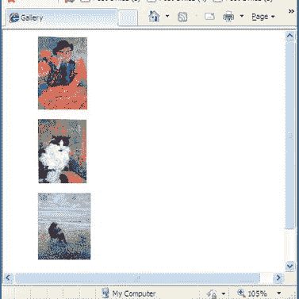
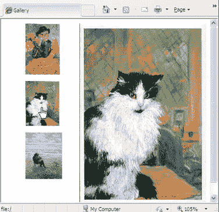
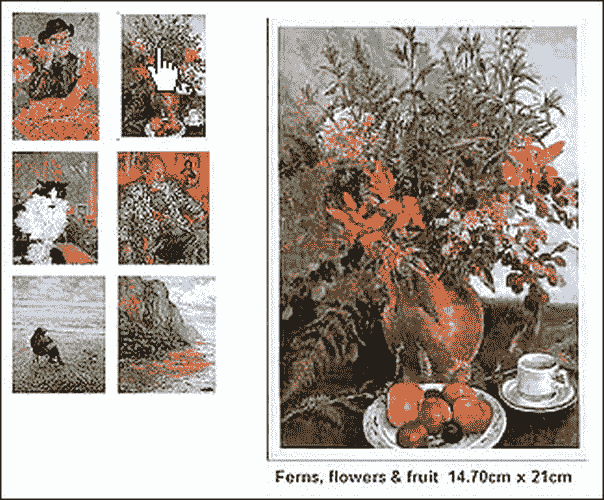
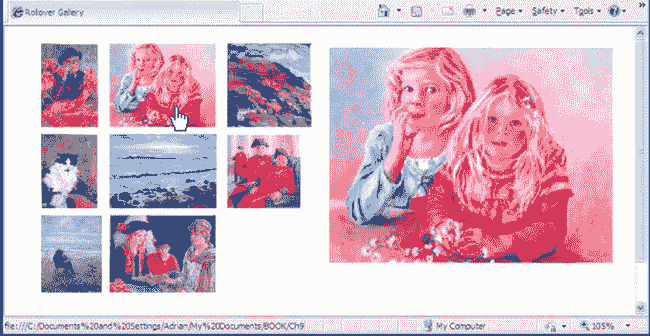
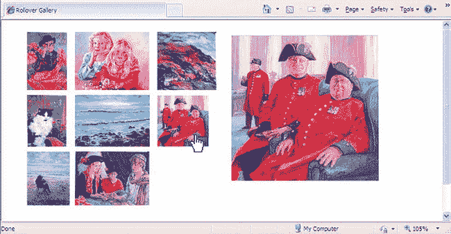
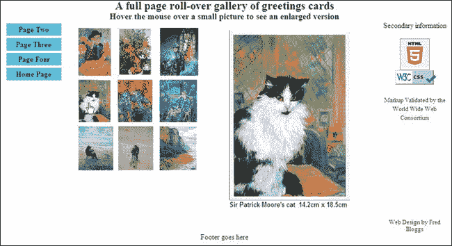

# 二、翻转图片画廊

贺卡艺术家或零售商可能会要求您创建翻转图片库。这些画廊也非常适合几乎任何项目，包括有多张产品图片的零售商、有菜单的餐馆、有活动图片的非营利组织等等。当光标悬停在缩略图上时，翻转效果起作用，这导致弹出图像的放大版本。本章演示了如何使用 CSS 实现这一点，而无需借助表格或复杂的脚本。

我非常感谢肖像艺术家安·罗·琼斯允许我使用我为她创建的网站上的图片。所描绘的卡片是基于她出色的绘画。本章中的所有示例都使用了这些图像。

在`[`www.annroejones-artist.co.uk`](http://www.annroejones-artist.co.uk)` *访问她的网站。*点击菜单中的“卡片”按钮，查看滚动图库。

### 对技术的介绍

列或行的数量可能会有所不同，照片大小也不可能总是一致的，有些可能会更宽或更短。因此，不可能有一个通用的模板。您可以采用下面给出的解决方案，或者调整缩略图的大小和/或将其裁剪为统一的大小。

为每个图像创建两个版本，一个缩略图和一个大图。我以这种方式标记了对`alithumb.jpg`和`alibig.jpg`。缩略图的每一列都是通过一个无序列表实现的。每个列表元素都有一个目标链接`<a>…</a>`，CSS 样式表指示该链接对悬停在其缩略图上的光标做出响应。

使用 CSS 创建从每个缩略图到其大图的链接，如下所示:

`<ul id = "col-1">
<li>

</li>
</ul>`

需要注意的一些事项包括:

> *   Two lines containing images are contained in the `<a>` tag. This is to enable them to hover over the thumbnail in response to the cursor.
> *   The row of the large graph contains `class="hid"` and an empty alt, namely `alt=" "`.
> *   CSS indicates that any `class=` `hid` element remains hidden until the cursor hovers over the thumbnail.
> *   The target columns in the tag will be col-1, col-2, col-3, etc., so that CSS can locate them on the page.

##### 图像尺寸和格式

如果所有的缩略图具有相同的格式和尺寸，并且所有的放大图像具有相同的格式和尺寸，则该技术是最容易的。

然而，生活从来没有那么简单。您可能有一些横向格式的图像，一些纵向格式的图像，一些方形格式的图像。如果您需要使用不同的格式和尺寸，请参见本章后面与图 2-4 和图 2-5 相关的说明。

### 一个单列的画廊

图 2-1 和 2-2 显示了一个单列廊道。

***图 2-1** 。一栏三个缩略图*

***图 2-2。**悬停在猫的上方*

本例中的清单 2-1a 创建了一列缩略图。每个缩略图都是一个到大图的实时链接。当光标滚动到缩略图上时，会出现较大的图像。它出现在同一页面上，并位于标记为其保留的位置。

***清单 2-1a。【gallery-one-col.html】创建一列缩略图***

`<!doctype html>
<html lang=en>
<head>
<title>Rollover Gallery, one column</title>` `<meta charset=utf-8>
        *meta details go here*
<link rel = "stylesheet" type = "text/css" href = "gallery-one-col.css">
</head>
<body>
<ul id = "col-1">
        <li><a href="#"> 
        </a></li>
        <li><a href="#"> 
        </a></li>
        <li><a href="#"> 
        </a></li>
</ul>
</body>
</html>`

 **注意**大图像不需要“`alt`”，因为当光标悬停在图像上时，图像会消失。

在 CSS 清单 2-1b 中，`MouseOut`状态代码的第一个块在页面上保留了一个空间，该空间将被展开的图像占据，但是展开的图像被`visibility:hidden;`属性对用户隐藏。当鼠标悬停在一个缩略图上时，第二个`MouseOver`状态块中的 CSS 标记会显示扩展的图像。

***清单 2-1b。**清单 2-1a 的 CSS 样式表(gallery-one-col.css*

`/*reset browsers to give cross browser uniformity*/
html, body, p, lu, li { margin:0; padding:0;
}
img { border:0;
}
/* Set general thumbnail styles */
/*place the column on the page*/
#col-1 { position: absolute; top: 0; left: 0;
}
/*remove bullets from the list elements*/
li { margin: 10px; list-style-type:none;
}
/* MouseOut state (default) - create a space for the larger images and hide them*/
#col-1 a img.hid { width: 260px; height:390px; position: 
absolute; top: 10px; left: 140px; visibility: hidden;
}
/* MouseOver state (hover)- reveal larger image */
#col-1 a:hover { background: white;
}
#col-1 a:hover img.hid { visibility:visible;
}`

### 一个两列画廊

通过添加第二列并为其插入适当的翻转代码，我们可以创建一个两列图库，如图 2-3 所示。

***图 2-3** 。两列画廊。光标悬停在右上角的缩略图上。*

图 2-3 还有一个特点，放大的图像有一些描述性文字。为此，请在您的图像处理软件(如 Adobe Photoshop、Corel PaintShop Pro 或 GIMP)中为放大的图像调整*画布*的大小。在图像底部添加大约 20 到 30 像素的白色画布区域。使用图像处理软件添加文本，并记下新的图像高度。

添加画布，为较大的图像提供一致的纵横比。在本例中，所有放大的图像都是 260 像素宽。给所有放大的图像添加画布，使它们具有相同的高度；这将确保外观的一致性，也就是说，没有一个放大的版本会看起来被压扁或拉伸。

在这里使用新的`<figure>` `<figcaption>`标记似乎是合适的，但遗憾的是，它们失败了，因为标题被附加到缩略图上，而不是大图像上。如果您尝试使用下面的标记片段，用`<figure>` `<figcaption>`包围大图像，您就会明白我的意思了:

`    <li><a href="#">
            <figure>
            
            <figcaption>Take a card</figcaption>
            </figure></a>
    </li>`

清单 2-3a 及其 CSS 样式表清单 2-3b 将创建一个包含两列的翻转图库。

***清单 2-3a。**创建双栏翻转画廊(gallery-2col.html)*

`<!doctype html>
<html lang=en>
<head>
<title>Two column rollover Gallery</title>
<meta charset=utf-8>
        *meta details go here*
<link rel = "stylesheet" type = "text/css" href = "gallery-2col.css">
</head>
<body>
        <ul id = "col-1">
        <li><a href="#">
        </a></li>
        <li><a href="#"> 
        </a></li>
        <li><a href="#">
        </a></li>
        </ul>
        <ul id = "col-2">
        <li><a href="#"> 
        </a></li>
        <li><a href="#">
        </a></li>
        <li><a href="#">
        </a></li>
        </ul>
</body>
</html>`

清单 2-3b 将缩略图呈现为两列，并为展开的图像创建一个空间。

***清单 2-3b。**清单 2-3a (gallery-2col.css)* 的 CSS 样式表

`/*reset browsers to give cross browser uniformity*/
html, body, p, lu, li {margin:0; padding:0;
}
/*set images to have no borders*/
img { border:0;
}
/*place the column on the page*/
#col-1 { position: absolute; top: 0; left: 0; width:85px;
}
/* Set general thumbnail styles and remove bullets from the list elements*/
li { margin: 5px; list-style-type:none;
}
/* MouseOut state (default) - create and position a space for the larger images 
and hide them*/
#col-1 a img.hid { width: 260px; height:390px; 
position: absolute; top: 10px; left: 250px; visibility: hidden;
}` `/* MouseOver state (hover)- reveal larger picture */
#col-1 a:hover { background: white;
}
#col-1 a:hover img.hid { visibility:visible;
}
/*--THE 2ND COLUMN STARTS 85 PIXELS FURTHER TO THE RIGHT ---*/
#col-2 { position: absolute; top: 0; left: 85px; width:85px;
}
li { margin: 5px; list-style-type:none;        
}
/* MouseOut state (default) - hide larger picture */
#col-2 a img.hid { width: 260px; height:390px; 
position: absolute; top: 10px; left: 155px; margin-left:10px; visibility: hidden;
}
/* MouseOver state (hover)- reveal larger picture */
#col-2 a:hover { background: white;
}
#col-2 a:hover img.hid { visibility:visible;
}`

### 混合了三列的大小和格式

如果图像都是纵向格式，或者都是横向格式，或者都是方形的，那么缩略图应该以每行相同的高度创建，以给出整齐的行。这样你会有整齐的缩略图行和列，最少的标记，很少的 CSS 麻烦。

然而，每个*行*的高度可以变化。缩略图的每一列可能会有不同的宽度，但如果宽度变化不是太大，您可能会有一个可接受的显示。列宽可以变化，以适应缩略图宽度几乎相同的缩略图图像组。

如果某些缩略图具有不同的高度，请对它们进行排列，以便每行包含高度相似的图像。例如，如果你有十二个缩略图，其中四个的高度为 80 像素，把这四个放在一行。如果四个缩略图的高度为 90 像素，将这四个放在下一行。如果最后四个缩略图的高度为 95 像素，将它们放在最后一行。这样，你将创建整洁的缩略图行。

#### 不同格式

然而，现实生活从来都不容易:图像有不同的格式，比如肖像、风景和正方形。如果你的缩略图有多种格式，把*人像*格式放在一栏，*风景*格式放在另一栏，s *方形*格式放在另一栏(如图图 2-4 )。尝试将缩略图高度与行高相匹配，如前一段所述。对于图像的扩展版本，格式(纵向、横向和方形)需要区别对待，以便扩展的图像不会由于将各种格式压缩成一个不合适的尺寸而失真。

***图 2-4。**三个纵向缩略图、三个横向缩略图和两个方形缩略图。光标悬停在顶部横向缩略图上，显示横向格式的大版本。*

图 2-4 展示了形状和尺寸可以混合。每行的缩略图高度略有不同:最上面一行的所有缩略图高度为 103 像素，第二行的缩略图高度为 91 像素，最下面一行的缩略图高度均为 95 像素。

我把第一列底部的缩略图做得比上面的两个略宽一些，以证明你不需要对宽度过分挑剔。

创建了三种格式的扩展图像，以匹配缩略图的三种格式变化(纵向、横向和方形)。提供了三种不同的列宽来采用三种格式。

在第三列中，顶部缩略图是 103 × 103 像素的正方形，第二个缩略图是 91 × 91 像素的正方形。缩略图的最后一行是展示奇数大小的最佳位置，因为读者已经习惯了不规则的右边。将奇数大小放在最后一列可以确保所有其他缩略图之间的间距保持合理的一致。

图 2-5 显示与图 2-4 相同的页面，但是光标悬停在正方形图像上。为扩展图像保留的空间必须能够容纳各种图像格式。

***图 2-5。**光标现在停留在第三列第二行上，显示一个更大的正方形图像。第一列的大图将出现在图 2-1 和图 2-2 中。*

在清单 2-5a 中，对应于图 2-4 和图 2-5 ，第三列底部故意省略了一个缩略图。这表明您不需要用缩略图填充每一列；例如，你的客户可能为她的画廊提供了数量惊人的图片。

***清单 2-5a。【gallery-3col-mix.html】用翻转创建三列混合格式图像(??)***

`<!doctype html>
<html lang=en>
<head>
<title>Three column mixed image shapes</title>
<meta charset=utf-8>
<link rel = "stylesheet" type = "text/css" href = "gallery-3col-mix.css">
</head>
<body>
<ul id = "col-1">
<li><a href="#">
        </a>
</li>
<li><a href="#">
        </a>
</li>
<li><a href="#">
        </a>
</li>
</ul>
<ul id = "col-2">` `<li><a href="#">
        </a>
</li>
<li><a href="#">
        </a>
</li>
<li><a href="#">
        </a>
</li>
</ul>
<ul id = "col-3">
<li><a href="#">
        </a>
</li>
<li><a href="#">
        </a>
</li>
</ul>
</body>
</html>`

清单 2-5b 提供了一个三栏图库的 CSS 表示信息

***清单 2-5b。**清单 2-5a(gallery-3 col-mix . CSS)*的 CSS 样式表

`/*set images to have no borders*/
img { border:none;
}
/*place the first column on the page*/
#col-1 { position: absolute; top: 0; left: 0; width:85px;
}
/*remove bullets from the list elements*/
li { margin: 5px; list-style-type:none;
}
/* MouseOut state (default) - create and position a space for the larger images and
hide them*/
#col-1 a img.hid { width: 250px; height:340px; position: absolute; top: 10px; left:
400px; visibility: hidden;
}
/* MouseOver state (hover)- reveal larger picture */
#col-1 a:hover { background: white;
}
#col-1 a:hover img.hid { visibility:visible;
}
/*----------------------------------------------------*/
/* Set 2nd column of thumbnails 85px further over to right*/
#col-2 { position: absolute; top: 0; left: 85px; width:135px;
}
li { margin: 5px; list-style-type:none;
}` `/* MouseOut state (default) - hide larger picture */
#col-2 a img.hid { width: 350px; height:265px;  position: absolute; top: 10px; left:
315px; margin-left:0;   visibility: hidden;
}
/* MouseOver state (hover)- reveal larger picture */
#col-2 a:hover { background: white;
}
#col-2 a:hover img.hid { visibility:visible;
}
/*----------------------------------------------------*/
/* Set 3rd column of thumbnails 170px further over to right*/
#col-3 { position: absolute; top: 0; left: 230px; width:108px;
}
li { margin: 5px; list-style-type:none;
}
/* MouseOut state (default) - hide larger picture */
#col-3 a img.hid { width: 260px; height:260px; position: absolute; top: 10px; left:
175px; margin-left:0; visibility: hidden;
}
/* MouseOver state (hover)- reveal larger picture */
#col-3 a:hover { background: white;
}
#col-3 a:hover img.hid { visibility:visible;
}`

### 更多列和更多行

增加列和行的数量只是添加相似的 HTML 代码块和匹配的 CSS 代码块的问题。定位列和隐藏放大的数学变得更加复杂，但是如果你的数学技能很低，如果你有一个好的 WYSIWYG 编辑器，通过试错定位并不太困难。

### 将图片库放在真实的网页中

图 2-6 显示了一个实际的 HTML5 网页中的三栏图库。

***图 2-6。**具有三列和三行缩略图的图库的网页。光标悬停在第二行的第一个图像上。*

在这个 HTML5 标记中使用了三个语义标签:`<header>`、`<nav>`和`<footer>`。Remy Sharp JavaScript 片段用于确保页面在 IE 7 和 IE 8 中正确显示。此外，在 IE 7 中使用条件来定位画廊块。你会在图 2-6 中注意到，我已经展示了新的 HTML5 验证标识。我已经将我的代码片段合并到清单中，以使用户能够检查页面验证是否真实。关于 HTML5 验证的进一步讨论，参见第十八章。

清单 2-6a 是在图 2-6 中显示的翻转三栏图库的 HTLM 标记。

***清单 2-6a。【gallery-page-validated.html 创建带有 HTML5 验证标志的三列翻转图库***

`<!doctype html>
<html lang=en>
<head>
<title>Complete Gallery page</title>
<meta charset=utf-8>
<link rel = "stylesheet" type = "text/css" href = "gallery-page-HTML5.css">
        <!--[if lte IE 7]>
        <link rel = "stylesheet" type = "text/css" href = "gallery-ie7.css">
        <![endif]-->
        <!-- conditional Javascript added -->
        <!--[if lte IE 8]>
        
        <![endif]-->
</head>` `<body>
<header>
<h1>A full page roll-over gallery of greetings cards</h1>
<h2>Hover the mouse over a small picture to see an enlarged version</h2>
</header>
<nav>
<ul>
<li class="btn"><a href="#">Page Two</a></li>
<li class="btn"><a href="#">Page Three</a></li>
<li class="btn"><a href="#">Page Four</a></li>
<li class="btn"><a href="#">Home Page</a></li>
</ul>
</nav>

        Secondary information  
        

a href="http://jigsaw.w3.org/css-validator/"></a>
  Markup Validated by the World Wide Web Consortium

 

Web Design by Fred Bloggs

<ul id = "col-1">
<li></li>
<li><a href="#">
        </a></li>
<li><a href="#">
        </a></li>
</ul>
<ul id = "col-2">
<li></li>
<li><a href="#">
        </a></li>
<li></li>
</ul>
<ul id = "col-3">
<li></li>
<li><a href="#">
         </a></li>
<li></li>` `</ul> 

<!--gallery block closed-->

<!--midcol closed-->
<footer>
        Footer goes here
</footer>
</body>
</html>`

清单 2-6b 提供了一个真实页面中 3 列图库集的 CSS 表示说明。

***清单 2-6b。清单的** CSS **样式表 2-6a**(gallery-page . CSS)*

`/*set attributes for consistent appearance in all browsers*/
html, body, p, ul, li, h1, h2 { margin:0; padding:0;
}
/*set images to have no borders*/
img {   border:0;
}
/*add display attributes for the semantic tags*/
header, footer, section, article, nav { display:block;
}
/*SET FONTS*/
span.small { font-size:small;
}
h1 { font-size:x-large; font-family:"times new roman"; text-align:center;
}
h2 {font-size:large; font-family:"times new roman"; text-align:center;
}
/*PAGE LAYOUT*/
body {margin:auto; width:970px;
}
header { width:970px;
}
nav { float:left; margin-left:10px; width:115px;
}
nav ul { margin-left:0; border:0; width:115px;
}
/*set far right column for ads*/
#rightcol { width:150px; float:right; text-align:center;
}
#rightcol p.advert {font-size:small; margin-top:190px;
}
/*set middle column for main content*/
#midcol { margin-left:135px; margin-right:155px;
}
/*set gallery block position*/
#gallery-block { position:relative; left: 30px; top:10px;
}
/*set footer*/
footer { clear:both; color:black; text-align:center; width:970px;
}
.clear { clear:both;
}` `/*set menu buttons*/
li.btn a { display:block; background-color :#66CCFF; color:black; font-weight:bold; 
padding:4px; margin-left:0; text-align:center; list-style-type:none; 
text-decoration:none; width:110px;
}
li.btn a:hover { background-color:blue; color:white;
}
li.btn { width:110px;
}
/*SET THUMBNAIL GALLERY BLOCK*/
/* Set general thumbnail styles */
#col-1  { position: absolute; top: 0; left: 0; width:85px;
}
/*place the first column on the page*/
li { margin: 5px; list-style-type:none;
}
/*remove bullets from the un-ordered list elements and create the 
MouseOut state (default) - create and position a space for the larger images and 
hide them*/
#col-1 a img.hid { width: 260px; height:390px; position: 
absolute; top: 10px; left: 330px; visibility: hidden;
}
/* MouseOver state (hover)- this reveals larger picture */
#col-1 a:hover { background: white; }
#col-1 a:hover img.hid { visibility:visible;
}
/*----------------------------------------------------*/
/* set 2nd column of thumbnails 85px further over to right*/
#col-2 { position: absolute; top: 0; left: 85px; width:85px;
}
li { margin: 5px; list-style-type:none;
}
/* MouseOut state (default) - hide larger picture */
#col-2 a img.hid { width: 260px; height:390px; 
position: absolute; top: 10px; left: 245px; margin-left:0;visibility: hidden;
}
/* MouseOver state (hover)- reveal larger picture */
#col-2 a:hover { background: white; }
#col-2 a:hover img.hid { visibility:visible; }
/*----------------------------------------------------*/
/* set 3rd column of thumbnails 170px further over to right*/
#col-3        { position: absolute; top: 0; left: 175px; width:95px; }
li { margin: 5px; list-style-type:none;
}
/* MouseOut state (default) - hide larger picture */
#col-3 a img.hid { width: 260px; height:390px; 
position: absolute; top: 10px; left: 155px; margin-left:0; visibility: hidden;
}
/* MouseOver state (hover)- reveal larger picture */
#col-3a:hover { background: white;
}
#col-3 a:hover img.hid { visibility:visible;
}`

 **注** `position:absolute;`用于画廊内。但是要在页面上定位图库块，就必须对图库块本身使用`position:relative;`，否则图库块会在大屏幕和大分辨率上与菜单重叠。

***清单 2-6c。**用于清单 2-6a 的条件 CSS 支持浏览器 IE 7 (gallery-ie7.css)*

`/*set the gallery block 10px further to the right*/
#gallery-block { position:absolute; left: 165px; top:50px;
}`

 **提示** Lightbox 是创建画廊的另一种方法。如果你相当熟练地使用 JavaScript，访问`[`www.lokeshdhakar.com/projects/lightbox2/`](http://www.lokeshdhakar.com/projects/lightbox2/)`你会发现一个演示，完整的代码和详细的说明。您还可以下载各种脚本。不幸的是，弹出图片覆盖了缩略图，但是提供了一些控件，使用户能够移动到下一个缩略图，就像幻灯片放映一样。按下 Escape 键，可以返回缩略图。

### 总结

本章描述的翻转效果优于从缩略图库中放大图片的旧方法。旧的方法是点击一张图片，让你进入一个新的页面——如果你有 12 个缩略图，你就必须创建 12 个页面。在本章中，您探索了一个只需要一个页面就可以显示缩略图和放大图像的翻转图库。这种方法还具有保持缩略图可见的优点，不需要额外的控件或按键。

讨论了缩略图在列中的位置，以及如何适应不同的图像形状和大小。还演示了创建翻转效果的过程。其他展示照片的方式，包括拼贴画和带说明的画廊，在第九章中有描述。

在下一章，你将会发现使用 CSS 渐变来设计背景的视觉可能性。您还将学习如何创建多个背景图像、透明背景、叠加图像和叠加文本。