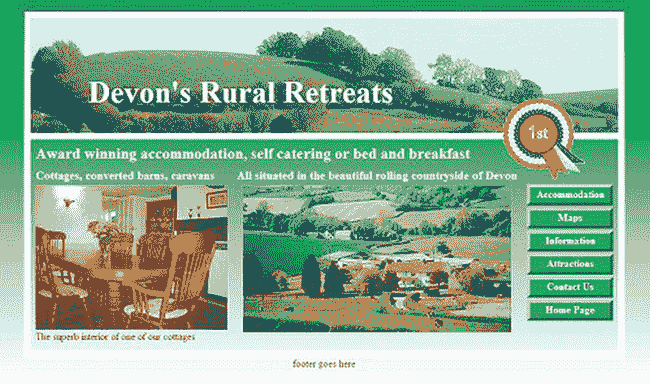

# 三、背景

本章给出了使用各种 CSS 背景技术的流行网页增强的工作示例。涵盖了许多类型的背景，包括图像、渐变、多重背景、翻转菜单按钮和水印。我们还将看看如何使用新的 CSS3 背景属性创建多个背景。

### 概述

CSS 提供了一系列的背景来增强网页。自`<body bgcolor=`、`#00ffff`、`>`时代以来，网络已经走过了漫长的道路。例如，背景可以是:

> *   Gradient, solid color or image
> *   Accurate positioning on the page
> *   Or repeat (tile) vertically to fill a column, a row or a page.
> *   Covered with text and multiple images
> *   Set to allow the button background appearance to change in the flip menu (see Chapter 4 for more information)
> *   Watermarks (these should be used with care; They can make the superimposed text difficult to read)

 **注意**如果一个元素没有背景属性，它将默认为

`        background-color: transparent; position: top left; background-repeat: repeat;`

### 创建渐变背景

当渐变背景从页面顶部的颜色渐变为底部的白色时，效果最佳。然而，如果网站有一个纯色的背景(比如说，奶油色)，可以在上面叠加一个背景渐变，渐变应该是奶油色。使用 CSS，渐变可以扩展到任何屏幕宽度。

 **注**本章后面会描述几种背景，但是关于 CSS3 背景渐变的信息请参见第五章。

大多数绘画程序(如 GIMP、Adobe Photoshop 和 Corel PaintShop Pro)都可以为彩色渐变创建图像。免费的在线 ColorZilla 渐变生成器生成 CSS 代码供您复制和粘贴。如果你勾选了标有 IE 9 支持的框，它提供了 IE9 条件语句的代码。您需要使用 Mozilla Firefox、Safari 或 Chrome 来访问这个在线生成器，可以在

`[`www.colorzilla.com/gradient-editor/`](http://www.colorzilla.com/gradient-editor/)`

ColorZilla 生成器不提供渐变图像；它提供了在选定的 HTML 元素中生成渐变的 CSS 代码。

透明梯度也是可能的；这些可以使用 ColorZilla 在线渐变生成器创建。将光标停留在小尖滑块上，以确定每个滑块的作用。要在 ColorZilla 中创建透明渐变，请点按并调整“预置”部分正下方水平栏上的“不透明度停止”滑块。ColorZilla 界面如图 3-1 所示。

您可以通过在 ColorZilla 中创建一些渐变并保存代码以生成打印输出来创建一个有用的资源。通过检查打印的代码，您可以学习如何生成自己生成的渐变。

***图 3-1。**ColorZilla 接口。在移动滑块之前,“停止”面板的内容是灰色的。*

#### 使用渐变图像

渐变图像适用于所有浏览器，并且可以在大多数画图程序中创建图像。图 3-1 中使用的渐变图像`green-grad.jpg`宽度为 3 像素，高度为 600 像素。颜色从上到下很快变成白色，因此即使在很短的网页(如主页)上，褪色也很明显。渐变图像可以保存为`.gif`，。`png`还是一个`.jpg`档。CSS 标记`repeat-x`从左到右展开渐变图像；x 轴指的是水平轴，就像在笛卡尔坐标图上一样。

`body { background-color: #FFF; background-image: url(img/green-grad.jpg); 
background-repeat: repeat-x; margin:auto;
}`

这可以用 CSS 简写如下:

`body { background: #FFF url(img/green-grad.jpg) repeat-x; margin:auto;
}`

背景颜色设置为白色`(#FFF;`，绿色渐变为白色，如图 3-2 中所示。

***图 3-2。**带有渐变背景的页面*

图 3-2 的列表展示了水平重复的 3 像素宽渐变图像的使用。这里使用的白色边框表示我们最终将插入背景图像和一些文本的位置。

#### 下载示例

如果您从本书的网页上下载背景示例，请注意许多示例都有外部样式表。一定要下载样式表。所有的例子都适用于所有流行的浏览器。

 **注意**将 JavaScript 文件`html5.js`添加到包含以下任一项目的文件夹中。

清单 3-2 产生了图 3-2 中描述的渐变和白框标题。

***清单 3-2。【background-ex1.html】创建渐变背景和框架标题***

`<!doctype html>
<html lang=en>
<head>
<title>Gradient background and white border</title>
<meta charset=utf-8>
        *meta details go here*
<link rel="stylesheet" type="text/css" href="gradient-style.css">
        <!--Add conditional Javascript-->
        <!--[if lte IE 8]>
        
        <![endif]-->
</head>
<body>
<header>
</header>
</body>
</html>`

***清单 3-2b。【HTML 的 CSS 标记清单 3-2a(gradient-style . CSS)***

`body { background:#FFF url(img/green-grad.jpg) repeat-x; margin:auto;
}
header, nav, footer, article, section { display:block;
}
header {width:920px; height:160px; border:10px solid white ; margin:20px auto;
}`

### 背景标题图像

图 3-3 显示了作为背景图像的标题横幅。

***图 3-3。**背景图像已添加至页眉。*

图 3-3 ( `background-ex2.html`)的 HTML 与图 3-2 的 HTML 相同，除了它链接到一个新的样式表。新的样式表插入一个背景图像，如清单 3-3 中的所示。

***清单 3-3。**新样式表的 CSS(gradient-pic . CSS)*

`body, header { margin:0; padding:0; border:0;
}
/*add display attributes for the semantic tags*/
header, footer, section, article, nav { display:block;
}
body { margin:auto; background:url(img/green-grad.jpg) repeat-x;
}
header {width:920px; height:180px; padding:0; border:10px white solid; 
**background: url(img/header3.jpg);** margin:10px auto;
}`

粗体代码将图像添加到标题中。图像`header3.jpg`被创建得比标题更宽，因为我们可能希望以后使用百分比更改为液体布局。固定、流动和半流动布局的完整讨论可在第十二章中找到。

图像的高度与标题的高度相同，在本例中，图像为 1024 × 180 像素。这一次我们不希望标题图像在整个标题容器中重复平铺，所以 CSS 标记使用了`background-repeat:no-repeat;`或简写；`background: url(img/header3.jpg) no-repeat;`。

你可能不希望页眉周围有边框，如图图 3-4 所示。

***图 3-4。**白色边框移除*

要删除边框，只需删除 CSS 标记 *`border:10px solid white;`* 。

### 用文本覆盖背景图像

白色边框用于下一个示例，如图 3-5 中的所示。

***图 3-5** 。文本已经添加到背景图像中，并通过 CSS 定位。*

在清单 3.5a 中，文本被添加到标题中，并通过 CSS 精确定位在标题图像上。CSS 样式表还设置文本的大小、格式和颜色。

***清单 3-5a。【background-ex4.html】在页眉背景上添加和定位文本***

添加的文本在清单中以粗体显示。

`<!doctype html>
<html lang=en>
<head>
<title>Web page with gradient, picture and text.</title>
        <meta charset=utf-8>
<link rel="stylesheet" type="text/css" href="grad-pic-text.css">
<!--Add conditional Javascript-->
        <!--[if lte IE 8]>
        <![endif]-->
</head>
<body>
<header>
**        <h1>Devon&#39;s Rural Retreats</h1>**
</header>
</body>
</html`

清单 3-5b 使用 CSS 相对定位来放置标题文本，如图图 3-5 所示。

***清单 3-5b。**清单 3-5a 的 CSS 样式表 (grad-pic-text.css)*

`body, header, #content, { margin:0; padding:0; border:0;
}
header, footer, section, article, nav { display:block;
}
body { margin:auto; background:url(img/green-grad.jpg) repeat-x;
}
header {width:920px; height:180px; padding:0; border:10px white solid; 
background: url(img/header3.jpg); margin:10px auto;
}
h1 { font-size:300%; color :white; **position: relative;** left:90px; top:55px; width:480px;
}`

 **注意**文本是相对于页眉定位的，以防止文本在宽屏上从页眉的左边界突出来。

### 在页眉上叠加图像

我们现在在页眉背景上叠加一个玫瑰花形图像，如图图 3-6a 和 3-6b 所示。玫瑰花形图像被添加到 HTML 列表中，并占据了它在页眉中的自然位置(图 3-6a )。这个位置不太合适，因为楔在白框和文字之间看起来不舒服。因此，通过增加 CSS 样式表，玫瑰花结将被重新定位，如图图 3-6b 所示。

***图 3-6a。**这显示了应用相对定位之前玫瑰花结的位置。玫瑰花结添加在<头>标签*之间

通过将图像包含在标题标记之间，可以将图像放置在标题上，如下面的代码片段所示。

`<header>
<h1>Devon’s Rural Retreats</h1>
        
</header>`

下一个任务是向右移动玫瑰花结，如图图 3-6b 所示。

***图 3-6b。**玫瑰花结现在相对定位了。修改了 HTML 列表，使其链接到修改后的样式表。*

通过使用 CSS 中的 *`position`* 属性，图像可以精确地放置在我们想要的位置。清单 3-6a 的 HTML 类似于前面的例子，但是它链接到一个 CSS 样式表，该样式表包含重新定位玫瑰花结的指令。修改后的样式表的链接以粗体显示

***清单 3-6a。**链接到修改后的 CSS 样式表**(【background-ex5b.html】??)***

`<!doctype html>
<html lang=en>
<head>
<title>Header with re-positioned rosette</title>
<meta charset=utf-8>
<link rel="stylesheet" type="text/css" href="**rosette.css**">
<!--Add conditional Javascript-->
<!--[if lte IE 8]>

<![endif]-->
</head>
<body>
<header>` `<h1>Devon&#39;s Rural Retreats</h1>

</header>
</body>
</html>`

清单 3-6b 包括重新定位玫瑰花结的说明，以粗体显示。

***清单 3-6b。**修改后的重新定位玫瑰花结的 CSS(Rosette . CSS)*

`body { background: #FFF url(img/green-grad.jpg) repeat-x; margin:auto;
}
header, nav, footer, article section { display:block;
}
header {width:920px; height:180px; padding:0; border:10px white solid; 
background:url(img/header3.jpg); margin: 20px auto;
}
h1 { font-size:300%; color :white; position: relative; left:90px; top: 55px;  width:480px;
}
**#rosette { position:relative; left:750px; top:5px;**
**}**`

*相对定位*将项目*相对*重新定位到原来的位置。有关相对和绝对定位的详细说明，请参见附录。

### 半液态布局的背景怎么样？

没问题。取同一个 HTML，将其重命名为`background-ex6-liquid.html`，链接到一个新的样式表`liquid.css`。CSS 清单 3-6c 将最大宽度限制为 1024 像素，最小宽度限制为 900 像素。

***清单 CSS 3-6c。**same page 的半流动版本的 CSS 样式表(liquid.css)*

`body { background: #FFF url(img/green-grad.jpg) repeat-x; margin:auto;
}
header, nav, footer, article section { display:block;
}
header { **width:95%; max-width:1024px; min-width:900px;** height:180px; 
padding:0; border:10px white solid; background:url(img/header3.jpg); 
margin:20px auto;
}
h1 { font-size:300%; color :white; 
position: absolute; **left:15%;** top: 55px; width: 480px;
}
#rosette { position:relative; **left:85%;** top:120px;
}`

标题图像的宽度是 1024 像素；因此，本例中的标题不得超过 1024 像素。对于较宽的图像，标题的最大宽度可以放大以匹配。液态版本可以在这本书的第`[`www.apress.com`](http://www.apress.com)`页看到。

### 透明背景

在下一个例子中，白色边框内的背景是透明的，因此绿色渐变是可见的，如图图 3-7 所示。

***图 3-7。**在这个布局中使用了几种背景。*

图 3-8 展示了一组背景效果。这张截图的问题在于，在渐变的褪色部分的映衬下，底部边框几乎不可见。这个故事的寓意是，如果你想有一个白色边框的布局，就要避免渐变背景；请改用纯色背景。使用纯色背景，页面可以是任意长度，白色下边框清晰可见。

图 3-2 到图 3-7 中使用的照片得到了 Bonehayne 农场度假住宿网站所有者 Sandra 和 Ruth Gould 的许可

 **注意**任何 IE 条件句都必须放在主 CSS 链接之后。JavaScript 跟在条件语句之后。将它们以不同的顺序放置可能会导致 IE 7 和 IE 8 中出现奇怪的行为。

在清单 3-7a 中，透明的 CSS 背景被用在了下方白色边框区域的*中。这允许渐变背景显示出来。玫瑰花结(不是背景项目)与标题和下面的内容重叠，就好像它被粘贴在它们上面一样。翻转菜单按钮实际上并不作为图像存在，它们是由一个叫做*动态伪样式*的 CSS 后台方法产生的(这在第四章的中有完整的描述)。*

***清单 3-7a。**创建一个透明背景的元素(background-ex7-transp.html)*

`<!doctype html>
<html lang=en>
<head>
<title>Page with transparency and gradient background.</title>
<meta charset=utf-8>
<link rel="stylesheet" type="text/css" href="transparent.css">
        <!--Add conditional Javascript-->
        <!--[if lte IE 8]>
        <![endif]-->
</head>
<body>
<header>
        <h1>Devon&#39;s Rural Retreats</h1>
        
        </header>

        <h2>Award winning accommodation, self catering or bed and breakfast</h2>

        <h3>Cottages, converted barns, caravans</h3>
         The superb interior of one of our cottages

<nav>
        <ul>
                <li><a href="accommodation.html" title="Accommodation"> 
                Accommodation</a></li>
                <li><a href="maps.html" title="Location Maps">Maps</a></li>
                <li><a href="faqs.html" title="Frequently Asked Questions"> 
                Information</a></li>
                <li> <a href="attractions.html" title="Local attractions">
                Attractions</a></li>
                <li><a href="contact.html" title="Contact us">Contact Us</a></li>
                <li><a href="index.html" title="Return to Home Page">Home Page</a></li>
        </ul>
</nav>

<!--end of side menu column-->

        <h3>All situated in the beautiful rolling countryside of Devon</h3>
        

         

<!--content closed-->
<footer>footer goes here
</footer>
</body>
</html>`

CSS 清单 3-7b 包含了创建透明内容框的代码，这些代码以粗体显示。

***清单 3-7b。**清单 3 的 CSS 样式表**-7a****(**transparent . CSS)*

`/*equalise all the margins, paddings and borders built into various browsers*/
div body #header #content { margin:0; padding:0; border:0;
}
body { background:#FFF url(img/green-grad.jpg) repeat-x; margin:auto;
}
/*add display attributes for the semantic tags*/
header, footer, section, article, nav { display:block;
}
header {width:920px; height:180px; padding:0; border:10px white solid; 
background: url(img/header3.jpg); margin:10px auto;
}
h1 { font-size:300%; color :white; position: relative; left:90px; top: 55px; width:480px;
}
#rosette { position:relative; left:750px; top:5px; }
#content { **background-color:transparent;** border-left:10px white solid; 
border-right:10px white solid;
border-bottom:10px white solid; width: 904px; margin-top:-10px; margin-left:auto; 
margin-right:auto; padding:8px; font-size:medium; color:maroon;
}
h2 { font-size:x-large; color:white; margin:0 0 10px 0;
}
h3 { font-size:large; color:white; margin:0 0 6px 0;
}
#leftcol { float:left; width: 310px; vertical-align:top;
}
#rightcol { width: 135px; float:right; height: 252px; margin-right:10px;
}
#midcol { margin-left:315px; margin-right:145px; margin-top:10px; vertical-align:top;
}
/* set side menu block position and width*/
nav { margin:10px 30px 0 10px; width:135px; float:right;
}
/*Set list style within the menu block only. This removes bullets*/
nav li { list-style-type:none;
}
/* set general side button styles */
nav li { margin-bottom: 3px; text-align: center; width:130px;
}
/* set general anchor styles and include the zoom fix for IE6*/
nav li a { display: block; color: white; font-weight: bold; text-decoration: none; zoom:1;
}
/* specify mouse state styles */
/* mouseout (default) */
nav li a { background:#559a55; color: white; border: 5px outset #559a55; padding-bottom:3px;
}
/* mouseover */
nav li a:hover { background: red; color:white; border: 5px outset red;
}
/*mouse active*/
nav li a:active { background:maroon; border: 5px inset maroon;
}
br.clear { clear:both;` `}
#midcol img { margin-left:10px;
}
footer { clear:both; color:maroon; text-align:center;
}`

### 背景项目符号

图 3-9 和 3-10 显示了如何使用背景图像增强菜单列表。

***图 3-8。***

***图 3-9。***

一个简单无序的菜单列表看起来像图 3-8 。图形背景项目符号可以增强菜单列表，如图图 3-9 所示。使用`text-decoration:none;`删除链接下方的下划线。使用 CSS 代码`background-image:url(img/*image*.gif)`可以用背景图片替换标准项目符号。

在 CSS 清单 3-9b 中，我使用了一个背景图片(`menu-bullet.gif` ) 18 ×18 像素。整个区域——即项目符号及其文本——对鼠标做出响应。每个菜单项之间的合理间隔有助于残疾人避免意外点击错误的链接。

***清单 3-9a。【bullet-images.html】使用无序列表提供基本导航菜单***

`<!doctype html>
<html lang=en>
<head>
<title>Using images for bullets</title>
<meta charset=utf-8>
<meta details go here>
<link rel="stylesheet" type="text/css" href="bullets.css">
        <!--Add conditional Javascript-->
        <!--[if lte IE 8]>
        <![endif]-->
</head>
<body>
<nav>
        <ul>` `                <li><a href="#">Link 1</a></li>
                <li><a href="#">Link 2</a></li>
                <li><a href="#">Link 3</a></li>
                <li><a href="#">Link 4</a></li>
                <li><a href="#">Home</a></li>
        </ul>
</nav>
</body>
</html>`

每一个`href="#"`都是一个虚拟链接，当然应该被替换为正确的网页路径。

***清单 3-9b。**清单 3-9a 用无序列表中的图片替换项目符号的 CSS(Bullets . CSS)*

`/*add display attributes for the semantic tags*/
header, footer, section, article, nav { display:block;
}
/*remove bullets*/
nav ul { list-style:none; width:120px;
}
/*place background image in each menu item. The top margin spaces links 10 pixels apart*/
nav li { height:20px; margin-top:10px; background-image:url(img/menu-bullet.gif); 
background-repeat:no-repeat;
}
/*remove underline. Push text 30px to the right to clear the image*/
nav li a { color:black; text-decoration:none; padding:0 5px 0 30px;
}`

### 使用 HTML5 和 CSS2 的多种背景

可以组合几个背景图像。图 3-10 显示了三幅组合图像。

***图 3-10。**多重背景*

使用`
` s，CSS2 中的多个背景不仅是可能的，而且过程也很简单。这种方法适用于所有流行的浏览器。使用 CSS2 的解决方案需要四个`
`,这里使用了三个图像:渐变、剪贴板和甲虫。清单 3.10a 为三幅背景图片创建了`
`。

***清单 3-10a。【multiple-css2.html】创建三个 div 来包含三个背景图像***

`<!doctype html>
<html lang=en>
<head>
<title>multiple background with css2</title>
<meta charset=utf-8>
        *meta details go here*
<link rel="stylesheet" type="text/css" href="multiple-css2.css">
</head>
<body>
        

        

        

        

        

        

        

        

</body>
</html>`

***清单 3-10b。**将背景图片放入 Divs 的 CSS2(multiple-CSS2 . CSS)*

`#wrapper { width:320px; height:420px; margin:auto;
}
#background-container { width:300px; height:400px; margin:auto; 
background:url(img/blugrad500.jpg) repeat-x;
}
#clipboard { width:300px; height:400px; 
background: url(img/clipbrd.gif) no-repeat 50% 50%;
}
#beetle {width:300px; height:400px; 
background:url(img/Beetle.gif) no-repeat 50% 55%;
}`

### 使用 CSS3 的多种背景

CSS3 仅使用一个 div 就可以提供多个背景图像。在撰写本文时，Mozilla Firefox、Safari、Chrome 和 Opera 都支持这一功能。Internet Explorer 7 和 8 不能理解这种最受欢迎的标记简化。图 3-11 和图 3-10 外观相同，但图 3-11 是使用 CSS3 多图像模块的结果，这不需要三个`
`

***图 3-11。**使用 CSS3 的多个背景图像*

清单 3-11a 只有一个`
`用于三幅背景图像，以粗体显示。

***清单 3-11a。【multiple-css3.html】为三个 CSS3 背景图像提供一个 Div***

`<!doctype html>
<html lang=en>
<head>

<title>Multiple background with css3</title>

<meta charset=utf-8>

        *meta details go here*

<link rel="stylesheet" type="text/css" href="multiple-css3.css">

</head>

<body>

**
**
**
**

</body>

</html>`

***清单 3-11b。这个** CSS3 样式表为清单 3-11a(multiple-CSS3 . CSS)*提供了三个背景图片

`#example {width:300px; height:400px; margin:auto;background: 
url(img/Beetle.gif) no-repeat 50% 55%, url(img/clipbrd.gif) no-repeat 50% 50%, 
url(img/blugrad500.jpg) repeat-x;
}`

 **注意**每个背景图片的 URL 必须用逗号隔开。

背景图像必须以相反的顺序列出，即底层(渐变)在最后，甲壳虫在标记中首先列出。使用了背景属性的简写版本。

### 真实页面中的多个 CSS2 和图像

下一个工作示例结合了前面描述的技术。我选择使用带有三个`
`的 CSS2 解决方案，因为它比使用 CSS3 方法更容易准确地定位方块。为了帮助使用 CSS3 定位，请确保将所有边距、填充和边框归零，如下所示:

`            body { margin:0; padding:0; border:0 }`

三个`
` s 技术的结果如图图 3-12 所示。

***图 3-12** 。不太可能的产品页面*

 **注意**图 3-12 中没有使用 CSS3 方法，因为 IE 7 或 IE 8 不支持 CSS3。

由清单 3-12a 及其样式表清单 3-12b 生成的多重背景图像由天空和三个大小和颜色不同的正方形组成。三个`
`包含三个彩色方块。半液态布局的最大宽度限制为 1200 像素，最小宽度限制为 960 像素。

***清单 3-12a。【squares-html5.html 创建带有多个背景图片的页面***

`<!doctype html>
<html lang=en>
<head>
<title>Squares for sale</title>
<meta charset=utf-8>
        *meta details go here*
<link rel="stylesheet" type="text/css" href="squares-html5.css">
        <!--Add conditional Javascript-->
        <!--[if lte IE 8]>
        <![endif]-->
</head>
<body>

<header>
<h1>Square Deals</h1>
        

        

        

</header> 

 
<nav>
   <ul>
        <li><a href="square-deals-about.html" title="Square Deals, About Us">About 
        Us</a></li>
        <li><a href="square-deals-colours.html" title="Squares, range of colours"> 
        Colours</a></li>
        <li><a href="square-deals-contact.html" title="Square Deals, brochure">
        Brochure</a></li>
        <li><a href="square-deals-contact.html" title="Square Deals, Contact Us">
        Contact us</a></li>
        <li><a href="index.html" title="Return to Home Page">Home Page</a></li>
   </ul> 
</nav>
        <h2>Leaders in the creation of squares</h2>

 
   <ul>
        <li>A wide range of squares in many colours always in stock</li>
        <li>Our computerised machines produce squares fast, this ensures prompt delivery 
        at reasonable prices</li>
        <li>Try our square design service</li>
   </ul>

 ` `

Copyright © Square Deals

 

<footer>
        *Footer goes here*
</footer>

</body>
</html`

在 CSS 清单 3-12b 中，三个方块用粗体表示。

***清单 3-12b。**在标题中放置三个方块的 CSS 样式表(squares-html5.css)*

`body, header, div, #content, { margin:0; padding:0; border:0;
}
body{background: #39F; color: navy; font: medium Arial;
}
/*add display attributes for the semantic tags*/
header, footer, section, article, nav { display:block;
}
h1,h2,p{margin: 0; padding: 0;
}
h1 { font-size: 380%; color: #FFF; font-family:Arial; font-weight:bold; color:white; 
letter-spacing: 1px; width:560px; position:absolute; top:55px; left:20px;
}
h2 { font-size: 150%; color:navy; margin-top:-10px;
}
.small { font-size:small;
}
.tiny { font-size:x-small; text-align:center;
}
#container { position:relative; width:95%; max-width:1024px; min-width:920px; 
margin: 0 auto 10px auto; padding:10px; text-align:left; background:#FFF;
}
#mainpanel { width:100%; margin:auto; margin-bottom:0; margin-top:-10px; 
background:#bad0ff; text-align:center;
}
header { padding-top:0; width:100%; height:156px; margin:0 auto 0 auto; 
background-image:url('img/bluepan.jpg'); background-repeat:no-repeat; 
background-position:-20px left;
}
**#red { position:absolute; right: 15px; top:14px;** 
**background-image:url('img/red-square.png'); width:160px; height:160px; z-index:3;**
**}**
**#yellow { position:absolute; right: 120px; top:44px;** 
**background-image:url('img/yellow-square.png'); width:123px; height:125px; z-index:2;**` `**}**
**#white {position:absolute; right: 200px; top:61px;** 
**background-image:url('img/white-square.png'); width:105px; height:109px; z-index:1**
**}**
#midpanel{margin-left:160px; margin-right:5px; margin-top:0; padding:0 10px 10px 0; 
background:#bad0ff; color:navy;}
#midleft { width:45%; float:left; background:#bad0ff;
}
#midleft li { text-align:left; margin:0 0 10px 10px; width:330px; list-style-type:disc;
}
#midright { float:right; width:350px; text-align:left; background:#bad0ff;
}
footer { clear:both; width:99%; background:#bad0ff; padding:5px; margin-top:10px; 
text-align:center; font-size:small}
nav { float:left; width:140px; margin-left:0; margin-top:20px; background:#bad0ff;
}
/* set vertical button menu position */
nav ul { float:left; width:130px; margin-left:10px; padding-left:0; 
list-style-type :none;
}
/* set general side button styles */
nav li { width:115px; line-height:20px; margin-bottom: 3px; text-align: center;
}
/* set general anchor styles */
nav li a { display: block; width:115px; color: white; font-family:arial; 
font-size: small; font-weight:bold; text-decoration: none
}
/* specify mouse state styles */
/* mouseout (default) */
nav li a { background: #1A9CE0; border: 4px outset #AABAFF;}
/* mouseover */
nav li a:hover { display:block; background: #0A4ADF; border: 4px outset #8ABAFF; 
width:115px;}
/* onmousedown */
nav li a:active { background:#AECBFF; border: 4px inset #AECBFF;
}
br.clear { clear:both
}
.lft { text-align:left;
}
.cntr { text-align:center;
}`

### CSS 背景图片的规则

这些规则涵盖了正常的、不重复的背景图像，例如横幅标题中使用的图像，以及用于填充页面上某个区域的平铺图像。您可以在`
` s、表格单元格和段落中使用任何背景图像属性。

#### 定位单个不重复的背景图像

背景图像可以放置在容器内，如图图 3-13 所示。

***图 3-13。**位于容器内不同位置的图像*

可以使用关键字、像素、em 或百分比来相对于容器的边缘定位背景图像。清单 3-13 ，使用内部样式和关键字定位图像，如图图 3-13 所示。这里使用内部样式表是为了简化说明，在真实的页面中，您可能会使用外部样式表。

***清单 3-13。【image-position.html】相对于其容器定位图像(??)***

`<!doctype html>
<html lang=en>
<head>
<title>Positioning images in containers</title>
<meta charset=utf-8>
        *meta details go here*

</head>
<body>
        

` `        

        

        

</body>
</html>`

使用像素或 ems 提供了比关键字更多样的定位。第一个像素或 em 维度将从左侧水平放置图像。第二维将相对于容器的顶部边缘放置图像。

下面的代码将显示距离左边缘 150 像素、距离上边缘 100 像素的图像:

`     #container1 { background-image: url("tile.jpg"); background-repeat: no-repeat; 
     background-position: 150px 100px;
     }`

 **注意**如果只指定了一个值，则设置水平位置。如果指定了两个值，则第二个值设置垂直位置。

#### 指定重复平铺的背景

平铺意味着水平或垂直重复图像。典型的瓷砖如图 3-14 所示。

> 可以使用任何`.jpg`、`.png`或`.gif`图像进行平铺。平铺整个页面或容器通常是通过一个大约 100 × 100 像素的重复平铺图像来实现的，如图图 3-14 所示。

***图 3-14。【典型的瓦(tile.jpg)***??

要填充页面或容器的整个背景，平铺在水平和垂直方向重复，如下所示:

`body { background-image: url("tile.jpg"); background-repeat: repeat;
}`

以下代码将背景图像水平平铺在页面上(一个平铺高度):

`     body { background-image: url("tile.jpg"); background-repeat: repeat-x;
     }`

下面将背景图像垂直向下平铺在页面上(只有一个平铺宽度):

`     body { background-image: url("tile.jpg"); background-repeat: repeat-y;
     }`

水平或垂直瓷砖条的宽度和深度不必是瓷砖尺寸的倍数。同样，一个只有一个磁贴深的横幅或者一个只有一个磁贴宽的侧边栏也是不现实的。接下来的例子将演示平铺填充任何宽度或深度的`
`或其语义等效物。图 3-15 、 3-16 和 3-17 中显示了三个平铺示例。

***图 3-15。**一整页*

***图 3-16。**一条横条*

***图 3-17。**一条竖条*

图 3-15 有一个装满瓷砖的容器。图 3-16 中的水平横幅填充了 100 像素的方块，但只有 180 像素深；这表明容器不必是图块大小的倍数。类似的，在图 3-17 中，侧边栏的宽度不是磁贴宽度的倍数，而是 150 像素宽。示例中使用了内部样式，但是在网站中，样式表应该是外部的。

清单 3-15 用瓷砖填满一个容器。如果`<body>`是容器，整个屏幕将被平铺。

***清单 3-15。【tile-whole-page.html 往集装箱里装瓷砖***

`<!doctype html>
<html lang=en>
<head>
<title>Tile the whole container</title>
<meta charset=utf-8>

</head>
<body>

</body>
</html>`

清单 3-16 创建一个水平的平铺条，填充一个<分区>。图块将受到<分区>的边界约束。例如，在高度为 150 像素的水平< div >中使用 100 像素见方的图块，您将看到只有一个半图块高的水平条带。

***清单 3-16。**创建一个水平的平铺条**(【tile-horizontal-strip.html】)***

`<!doctype html>
<html lang=en>
<head>` `<title>Horizontal strip of tiles</title>
<meta charset=utf-8>

<!--Add conditional Javascript-->
<!--[if lte IE 8]>

<![endif]-->
</head>
<body>

<header>
</header>

</body>
</html>`

清单 3-17 创建了一个垂直的瓷砖条，它将填充一个<分区>，但不会溢出到<分区>的边界之外。在本例中，垂直栏是导航菜单的侧栏。

***清单 3-17。**创建一个真正的瓷砖条(瓷砖垂直条)*

`<!doctype html>
<html lang=en>
<head>
<title>Vertical strip of tiles</title>
<meta charset=utf-8>

<!--Add conditional Javascript-->
<!--[if lte IE 8]>
<![endif]-->
</head>
<body>

<nav>
</nav>

` `</body>
</html>`

##### 创建静态水印作为背景图像

水印必须非常微弱，否则会使覆盖的文本难以阅读。背景图像通常会随页面一起滚动。然而，通过使用属性`background-attachment: fixed;,`，当用户向上或向下滚动时，水印将保持在屏幕上的相同位置。这方面的 CSS 如下:

`   body { background-image: url("image.jpg"); background-attachment: fixed }`

图 3-18 和 3-19 显示了固定水印的作用。

***图 3-18** 。显示页面顶部*

***图 3-19。**用户已经向下滚动，但是水印没有向下移动。*

***清单 3-18。**创建一个背景水印，但固定它在屏幕上的位置。(watermark.html)*

`<!doctype html>
<html lang=en>
<head>
<title>A fixed watermark</title>
<meta charset=utf-8>

</head>
<body>

          
<h1>The top heading </h1>` `        
&nbsp;

        
&nbsp;

        
&nbsp;

<h2>The middle heading</h2>
        
&nbsp;

        
&nbsp;

        
&nbsp;

        
&nbsp;

        
&nbsp;

<h3>The bottom heading</h3>

</body>
</html>`

 **注意**背景色填充了框元素的填充和边框区域，而不仅仅是内容区域。如果您选择点或虚线边框，背景颜色将在点或虚线之间可见。

### 总结

您已经看到了背景是如何将一个普通的页面变成一个视觉上令人兴奋的页面的。使用本章介绍的技术，你现在可以完全控制 CSS 背景的样式和位置。您了解了如何在容器中放置背景图像，比如`
` s 或它们的语义对等物。向您展示了如何将背景与文本相结合，以及如何在背景上叠加图像。使用 CSS2 和 CSS3 演示了多个背景图像。还演示了使用背景图像作为水印。背景将在本书的许多其他章节中出现。

在下一章中，你将会发现如何创建多种类型的翻转菜单，包括水平菜单栏、垂直按钮块和标签菜单。