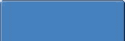

# 四、翻转菜单

翻转菜单由超链接组成，当光标悬停在它们上面时，超链接会以某种方式改变。超链接使用户能够访问网站上的其他页面。导航菜单块可以是水平的或垂直的，或者一个页面可以包含两种类型。这一章处理最流行的类型的基本原则。然后，它列出了一些资源，使您能够根据主题进行创作。它处理几个水平菜单，因为这种类型可能很棘手。垂直菜单表现良好；本章稍后将介绍垂直菜单块的工作示例。

所有的例子都使用 CSS *伪类*，比如`:link`、`:hover`和`:active`，结合一个`display:block`属性或`display:inline-block;`。示例按钮中的整个区域都是可点击的，而不仅仅是文本。脚本只在一个例子中使用，因为搜索引擎忽略了使用 JavaScript 定位链接的导航菜单。使用脚本的一个例子不会影响搜索引擎。CSS 方法比基于脚本的技术更容易掌握。

 **注意**为满足残疾人无障碍标准，选择对比度至少为 5:1 的文本和按钮颜色(有关颜色对比的详细信息，请参见第十四章)。

### 水平翻转导航菜单

水平菜单适用于每行包含 15 个或更少菜单按钮的页面。显然，这取决于标签的长度和按钮上使用的文本大小。对于非常短的标签，页面上可以容纳更多的按钮(例如，如果标签是页码 1、2、3、4 等。).网站上的水平标签菜单在一行有 14 个标签，另外两行各有 7 个链接。这表明，如果您可以接受几行，一个页面可以容纳更多的链接。需要用分隔线或使用不同颜色的导航栏来清楚地分隔各行。

水平菜单很有挑战性，因为通常提倡的内联或浮动方法都有它们的问题。浮动菜单很难在页面上居中，内联菜单传统上不能有同样大小的按钮。然而，现在所有的浏览器都支持被忽视的属性`{ display:inline-block; }`，水平菜单并不比垂直菜单更难，尺寸可以很容易地应用于相同大小的按钮，或者自动变化以适应内容的按钮。

横式菜单的菜谱经常使用`{ display:inline: }`，但是制作出来的按钮却不尽人意。现在所有浏览器都支持`{ display:inline-block; }`。

属性`{ display:inline: }`不允许设置宽度、高度、边距或填充。通过使用`{ display:inline-block; }`，可以内嵌显示按钮并设置其尺寸。这提供了两个世界的最佳选择，如图 4-1 中基本菜单的第二排按钮所示。

*图 4-1**。**该基本菜单的顶行显示了`display:inline`不令人满意的外观。在第二行中，可以给`display:inline-block`按钮指定高度、行高和填充。*

图 4-1 中所示的非常基本的菜单不是翻转菜单；也就是说，当光标悬停在按钮上时，它们不会改变颜色。此外，他们使用段落代替传统的无序列表。

清单 4-1a 包含两行菜单按钮。顶行不受 CSS 样式表的影响。CSS 样式表 4-1b 只链接到底部的一行按钮，这种样式给了文本足够的水平空间。这展示了与默认`display:inline;`相比的`display:inline-block`代码的值。

***清单 4-1a。【inline-block.html】创建两行菜单按钮的结构***

`<!doctype html>
<html lang=en>
<head>
<title>Inline-block content</title>

<meta charset=utf-8>
        *meta details go here*
<link rel = "stylesheet" type = "text/css" href = "inline-block.css">
</head>
<body>

    
&nbsp;

    
inline content (default)

    

        <a href = "#">Page 1</a>
        <a href = "#">Page 2</a>
        <a href = "#">Page 3</a>
        <a href = "#">Page 4</a>
        <a href = "#">Page 5</a>
        <a href = "#">Page 6</a>
        <a href = "#">Page 7</a>
    

&nbsp;

      
inline-block content 
        <a href = "#">Page 1</a>
        <a href = "#">Page 2</a>
        <a href = "#">Page 3</a>
        <a href = "#">Page 4</a>
        <a href = "#">Page 5</a>` `        <a href = "#">Page 6</a>
        <a href = "#">Page 7</a>
    

&nbsp;

</body>
</html>`

`href`项中的#符号必须替换为您自己的页面 URL。

清单 4-1b 是指向第二行菜单按钮的样式表，应用样式`display:inline-block;`来调整按钮的宽度。

***清单 4-1b。**将* `display:inline-block;` *样式应用到第二行按钮* ( *inline-block.css)*

`/* Set styles to equalise the browser rendition*/
html, body, h1, h2, h3, h4, h5, p, ol, ul, li { padding: 0; margin: 0;
}
body { font-size: 100%; font-weight: normal;
}
ul { padding-left: 0;}
/* end of style equalisation */
p { background:white  margin:auto; text-align:center;
}
#container { margin:auto; text-align:center; width:97%; min-width:800px; 
max-width:1200px;
}
a { background: orange; color:navy;
}
.inline-block a { display:inline-block; width:110px; height:30px; 
line-height:30px; text-align:center;
}`

### 横向菜单的类型

水平导航菜单和垂直侧边栏菜单一样常见。与侧边栏菜单相比，它们带来了更多的设计问题，但是通过明智地使用 CSS 可以很容易地解决这些问题。水平导航栏有以下三种形式:

> *   Simple 2D button
> *   3D button
> *   Label menu

#### 简单的 2D 按钮菜单

前面的例子图 4-1 不是翻转菜单。下一个项目演示了基本的翻转技术。此外，它使用一个无序列表来创建等宽按钮。

图 4-2 显示了一个简单的二维菜单，带有等宽的翻转按钮。

***图 4-2。**一个简单的水平滚动菜单。光标悬停在第六页按钮上。*

当光标悬停在按钮上时，颜色会发生变化，并出现工具提示。清单 4-2a 显示了图 4-2 所示的等宽按钮。它适用于包括 IE 7 和 IE 8 在内的所有浏览器——前提是包含 Remy Sharp JavaScript 代码片段。

***清单 4-2a。【horizontal-equal-2d.html】创建一行等宽菜单按钮***

`<!doctype html>
<html lang=en>
<head>
<title>Equal width buttons horizontal menu</title>
<meta charset=utf-8>
<meta details go here>
<link rel="stylesheet" type="text/css" href="equal-2d.css">

        <!--Add conditional Javascript-->
        <!--[if lte IE 8]>
        
        <![endif]-->
</head>
<body>

<header>
        <h1>This is the header</h1>
</header>
<nav>
  <ul>
        <li><a href="#" title="Page Two">Page Two</a></li>
        <li><a href="#" title="page Three">Page Three</a></li>
        <li><a href="#" title="Page Four">Page Four</a></li>
        <li><a href="#" title="Page Five">Page Five</a></li>
        <li><a href="#" title="Page Six">Page Six</a></li>
        <li><a href="#" title="Return to Home Page">Home Page</a></li>
  </ul>
 </nav>
**<!--[if lte IE 7]> **
**<![endif]-->**

 This content panel can contain several columns  

` `<footer>A footer goes here
</footer>

</body>
</html>`

href 项目中的#符号必须由您自己的页面 URL 替换。

 **注意**IE 6 和 IE 7 需要换行符(在清单 4-3 中用粗体显示)。水平菜单上固定宽度的按钮很难在页面上居中。然而，通过在固定宽度的页面上使用百分比或像素定位，或者在有限的流动页面上使用百分比定位，这个问题可以被克服(参见清单 4-2b 中粗体显示的百分比定位)。

清单 4-2b 引入了翻转样式，当光标悬停在按钮上时，按钮的颜色会改变。翻转效果是通过粗体显示的代码`nav a:hover`实现的。

***清单 4-2b** 。具有翻转颜色变化的等宽按钮样式(equal-2d.css)*

`/* Set styles to equalise browser renditions*/
html, body, h1, h2, h3, h4, h5, h6, p, ol, ul, li { padding: 0; margin: 0;
}
body { font-size: 100%; font-weight: normal; background-color:#99FF66; 
font: 100% arial;
}
header, footer, section, article, nav { display:block;
}
#wrapper {position:relative; top:0; left:0;width:950px; margin:auto; 
text-align:center;
}
header {width:100%; height:80px; color:black; background-color:#FFCC00; 
padding-top:10px;
}
h1 { font-size:200%; font-weight:bold; margin-top:20px;
}
#main-content {width:950px; margin:50px auto 0 auto; background-color:white; 
color:black; text-align:center; font-weight:bold;
}
footer {margin:10px auto 0 auto; width:950px; font-weight:bold; 
text-align:center; background-color:#FFCC00; color:black; clear:both;
}
nav ul {position:absolute; top:100px; **left:9%;** width: 780px; 
list-style: none; height: 36px;
}
nav li { float: left; width: 120px; margin:0 5px 0 5px;
}
nav a { color: #000; font-size: 100%; font-weight:bold; text-decoration: none; 
text-align:center; border: 1px solid #000; padding: 5px; display: block; 
background-color: white;` `}
**nav a:hover { font-weight: bold; background-color:green; color:white;**
}
.clear { clear:both;
}`

##### 宽度可变的水平 2D 按钮菜单

在等宽按钮上并不总是能够容纳一些标签。这要求按钮可以扩展以适应标签的大小。图 4-3 显示了一个带有可变宽度按钮的菜单。

***图 4-3。**主页按钮已经展开以容纳文本。*

清单 4-3a 和它的 CSS 清单 4-3b 向你展示了如何创建可变宽度的按钮。按钮将展开以容纳文本。这个项目适用于所有浏览器，包括 IE 6、IE 7 和 IE 8。您可能需要增加菜单块的宽度，以确保按钮中容纳所有文本。

***清单 4-3a。【horizontal-variable-2d.html】显示宽度可变的按钮和翻转效果**(**)***

`<!doctype html>
<html lang=en>
<head>
<title>Horizontal menu with variable width 2D buttons </title>
<meta charset=utf-8>
        *meta details go here*
<link rel="stylesheet" type="text/css" href="variable-2d.css">
<!--[if IE 6]>
<link rel="stylesheet" type="text.css" href="ie-6-style.css">
<![endif]-->
        <!--Add conditional Javascript-->
        <!--[if lte IE 8]>
        
        <![endif]-->
</head>
<body>

<header>
    <h1>This is the header</h1>
</header>` `<nav>
  <ul>
    <li><a href="#" title="Page Two">Page Two</a></li>
    <li><a href="#" title="page Three">Page Three</a></li>
    <li><a href="#" title="Page Four">Four</a></li>
    <li><a href="#" title="Page Five">Page Five</a></li>
    <li><a href="#" title="Page Six">Page Six</a></li>
    <li><a href="#" title="Return to Home Page">This leads to the Home 
    Page</a></li>
  </ul>
</nav>
<!--[if lte IE 7]>
 
<![endif]-->

     This content panel can contain several columns  

<footer>A footer goes here
</footer>

</body>
</html>`

***清单 4-3b。**清单 4-3a 给出翻转和可变宽度按钮的 CSS(Variable-2d . CSS)*

`/* Set styles to equalise browser renditions*/
html, body, h1, h2, h3, h4, h5, h6, p, ol, ul, li { padding: 0; margin: 0;
}
body { width:960px; margin:auto; background-color:#99FF66; font: 100% Arial; 
font-size: 100%; font-weight: normal;
}
header, footer, section, article, nav { display:block;
}
#wrapper {position:relative; top:0; left:0; width:950px; margin:auto; 
text-align:center;
}
header {width:100%; height:80px; color:black; background-color:#FFCC00; 
padding-top:10px;
}
h1 { font-size:200%; font-weight:bold; margin-top:20px;
}
#main-content {width:950px; margin:60px auto 0 auto; background-color:white; 
color:black; text-align:center; font-weight:bold;
}
footer {margin:10px auto 0 auto; width:950px; font-weight:bold; 
text-align:center; background-color:#FFCC00; color:black; clear:both;
}
nav {position:absolute; top:100px; left:78px; width: 785px; padding: 5px; 
list-style: none; height: 35px;
}
nav li { display:inline; padding: 5px; padding-top:15px; margin:5px 0 0 2px; 
height:25px;
}` `nav a {height:25px; color: #000; font-size:80%; font-size: 100%; 
font-weight:bold; text-decoration: none; border: 1px solid #000; 
padding:5px 5px 0 5px; **display: inline-block;** 
background-color: white; zoom: 1;
}
nav a:hover { font-weight: bold; background-color:green; color:white;
}
.clear { clear:both;
}`

 **注意**样式`display:inline-block;`允许上下填充。如果没有填充，按钮中的标签会碰到按钮的上边缘。如果使用了`display:block`,按钮将会一个接一个地隐藏起来，它们将会在容器的宽度上蔓延。

#### 3D 翻转按钮菜单

通过添加 3D 效果，可以使前面示例中的菜单栏变得更加有趣。这是通过 CSS border 属性中的一些额外代码实现的，如下所示。

 **注意**必须使用一些试错法来产生好的边框颜色。默认方法为背景和起始边框使用相同的颜色，就像图 4-4 中所示的蓝色按钮方案。

`/*mouseout state (default)*/
li.hbtn a { background: **#0080a0;**  border: 4px outset **#0080a0;** }`

然而，通过使用不同的起始颜色可以获得更好的结果，如下所示(另见图 4-4 ):

`/*mouseout state (see Figure 4-4)*/
li.hbtn a { background: **#0080a0;**  border: 4px outset **#aabaff;** }` 

***图 4-4。**使用 CSS 伪类生成的菜单按钮。按钮的任何部分都是可点击的。*

 **注意**当使用开始和插入属性时，浏览器呈现的边框颜色不同。例如，IE 中好的配色方案在 Mozilla Firefox 中会显示为非常苍白的边框。解决这个问题的一个方法是为 Mozilla 设计好的颜色，然后有一个 IE 条件链接到一个在 IE 中提供好颜色的样式表。然而，这需要大量的试验和错误。更好的解决方案是分别指定四个边框，如下面的代码片段所示。

单独指定边框颜色的代码片段。
(这个简短的 3D 按钮代码片段没有提供可下载的文件。)

`/*mouseout state*/
li.hbtn a { background: **#0080a0;**  border-top: 4px color-one solid; 
border-right: 4px color-two solid; border-bottom:4px color-two solid; 
border-left:4px color-one solid; }`

 **注意**当然，属性`color-one`和`color-two`会被十六进制或 RGB 颜色代码代替。

##### 可变宽度 3D 菜单按钮

图 4-5 显示了之前在图 4-3 中使用的 2D 按钮的 3D 版本。

***图 4-5。**通过附加样式属性创建的宽度可变的 3D 按钮*

清单 4-5a 与清单 4-3a 中的 2D 按钮代码相同，除了它有一个不同的标题，并链接到一个不同的样式表，称为`variable-3d.css`，如粗体所示。

***清单 4-5a。【horizontal-variable-3d.html】创建宽度可变的 3D 菜单按钮**(**)***

`<!doctype html>
<html lang=en>
<head>
**<title>Horizontal variable width 3D buttons</title>**
<meta charset=utf-8>
<meta details go here>
**<link rel="stylesheet" type="text/css" href="variable-3d.css">**
<!--Add conditional Javascript-->
<!--[if lte IE 8]>

<![endif]-->
</head>
<body>

` `

        <h1>This is the header</h1>

 <nav>
   <ul>
    <li><a href="two.html" title="Page Two">Page Two</a></li>
    <li><a href="three.html" title="page Three">Page Three</a></li>
    <li><a href="four.html" title="Page Four">Four</a></li>
    <li><a href="five.html" title="Page Five">Page Five</a></li>
    <li><a href="six.html" title="Page Six">Page Six</a></li>
    <li><a href="index.html" title="Return to Home Page">This leads to the 
     Home Page</a></li>
 </ul>
  </nav>
<!--Add a conditional for IE 7 and IE 8 to push the content below the menu-->
        **<!--[if lte IE 7]>**
        ** **
        **<![endif]-->**

         This content panel can contain several columns   

A footer goes here

</body>
</html>`

在 CSS 清单 4-5b 中，粗体显示的代码给出了 3D 效果。样式表还创建可变宽度按钮。

***清单 4-5b** 。清单 4-5a 的 CSS 给出了具有可变宽度的 3D 按钮(variable-3d.css)*

`/* Set styles to equalize browser rendition*/

html, body, h1, h2, h3, h4, h5, h6, p, ol, ul, li {  padding: 0; margin: 0; 
font-size: 100%; font-weight: normal;
}
img { border: 0; }
ul { padding-left: 0; }
/* end of style equalization */
/* Layout */
body { width:960px; margin:auto; background-color:#99FF66; font: 100% Arial;
}
#wrapper {position:relative; top:0; left:0; 
width:950px; margin:auto; text-align:center;
}
#header {width:100%; height:80px; color:black; background-color:#FFCC00; 
padding-top:10px;
}
h1 { font-size:200%; font-weight:bold; margin-top:20px;
}
#main-content {width:950px; margin:65px auto 0 auto; background-color:white; 
color:black; text-align:center; font-weight:bold;
}` `#footer {margin:10px auto 0 auto; width:950px; font-weight:bold; 
text-align:center; background-color:#FFCC00; color:black; clear:both;
}
nav ul {position:absolute; top:100px; left:3.6%; width: 866px; padding: 5px; 
list-style: none; overflow: hidden; height: 35px;
}
nav li { display:inline; padding: 5px; padding-top:15px; margin:5px 0 0 2px; 
height:25px;
}

**nav a {height:25px; color: #fff; font-size:80%; font-size: 100%;** 
**font-weight:bold; text-decoration: none; background-color: #72b720;** 
**border: 4px outset #5edd51; padding:5px 5px 0 5px; display: inline-block;**
**}**
.clear { clear:both;
}
#mainNav a:hover { font-weight: bold; background-color:green; color:white;
}`

 **注意**你可能不得不修改宽度、高度、边框宽度、填充、间距和边距，以解决浮动落差或缺少边框等问题。因为 3D 边框更厚，所以必须增加`<nav>`的宽度来容纳它们。这意味着必须修改`<nav>`的绝对位置，使菜单在页面上居中。

##### 具有等宽按钮的 3D 版本

图 4-6 显示了一个带有等宽 3D 按钮的菜单。

***图 4-6。**通过新的样式表* *(fixed-3d.css* )从清单 4-3 创建的固定宽度的 3D 按钮

具有等宽按钮的 3D 版本图 4-6 是通过将与清单 4-6 ( `horizontal-variable-2d.html`)相同的页面链接到样式表、清单 4-6b ( `horizontal-fixed-3d.css`)而创建的。请确保缩短主页按钮的文本以适合等宽按钮。在清单 4-6a 中，文本 *`This leads to the Home Page`* 被缩短为 *`Home Page`* 以适合其等宽按钮。

清单 4-6a 提供了具有 3D 等宽按钮的菜单结构，如图图 4-6 所示。

***清单 4-6a。**创建具有 3D 等宽按钮的菜单结构**(**horizontal-fixed-3d.html)*

`<!doctype html>
<html lang=en>
<head>
<title>Horizontal fixed width 3D buttons</title>
<meta charset=utf-8>
<meta details go here>
<link rel="stylesheet" type="text/css" href="fixed-3d.css">
<!--Add conditional Javascript-->
<!--[if lte IE 8]>

<![endif]-->
</head>
<body>

<header>
        <h1>This is the header</h1>
</header>
<nav>
  <ul>
        <li><a href="#" title="Page Two">Page Two</a></li>
        <li><a href="#" title="page Three">Page Three</a></li>
        <li><a href="#" title="Page Four">Four</a></li>
        <li><a href="#" title="Page Five">Page Five</a></li>
        <li><a href="#" title="Page Six">Page Six</a></li>
        <li><a href="#" title="Return to Home Page">Home Page</a></li>
  </ul>
  </nav>
  <!--[if lte IE 7]>
   
  <![endif]-->

         This content panel can contain several columns  

<footer>A footer goes here
</footer>

</body>
</html>`

清单 4-6b 显示了链接到清单 4-6a 的 CSS，用于显示等宽的 3D 按钮。

***清单 4-6b。**提供 3D 等宽按钮展示的 CSS**(**fixed-3D . CSS)*

`/* Set styles to equalise browser rendition*/
html, body, h1, h2, h3, h4, h5, h6, p, ol, ul, li {  padding: 0; margin: 0;
}
header, footer, section, article, nav { display:block;
}
body { width:960px; margin:auto; background-color:#99FF66; font: 100% Arial; 
font-size: 100%; font-weight: normal;
}` `#wrapper {position:relative; top:0; left:0; width:950px; margin:auto; text-align:center;
}
header {width:100%; height:80px; color:black; background-color:#FFCC00; padding-top:10px;
}
h1 { font-size:200%; font-weight:bold; margin-top:20px;
}
#main-content {width:950px; margin:65px auto 0 auto; background-color:white; 
color:black; text-align:center; font-weight:bold;
}
footer {margin:10px auto 0 auto; width:950px; font-weight:bold; text-align:center; 
background-color:#FFCC00; color:black; clear:both;
}
nav {position:absolute; top:100px; left:3.6%; width: 866px; padding: 5px; 
list-style: none; overflow: hidden; height: 35px;
}
nav li { display:inline; padding: 5px; padding-top:15px; margin:5px 0 0 2px; 
height:25px; **width:100px**;
}
nav a {height:25px; width:100px; color: #fff; font-size:80%; font-size: 100%; 
font-weight:bold; text-decoration: none; background-color: #72b720; 
border: 4px outset #5edd51; padding:5px 5px 0 5px; display: inline-block;
}
.clear { clear:both;
}
nav a:hover { font-weight: bold; background-color:green; color:white;
}`

##### 顺便说一下，翻转菜单可以通过使用定义列表来实现

这是创建 3D 按钮的一种有趣的替代方式，尽管不太正统，但仍然有效。下面的代码片段展示了这是如何完成的。

*使用定义列表代替无序列表*

`    <nav>
    <dl>
          <dt><a title="Page 1" href="page1.html">Page One</a></dt>
          <dt><a title="Page two" href="page2.html">Page Two</a></dt>
          <dt><a title="Page Three" href="page3.html">Page Three</a></dt>
          <dt><a title="Return to the opening page" href="index.php">Home Page</a></dt>
    </dl>
    </nav>`

*定义列表的 CSS 代码片段*

`/*MENU set horizontal menu and button general style*/
nav {margin-left:-5px; margin-rignt:0; height:35px; text-align:center; 
width:710px; margin:auto;
}
nav dl {display:block; margin:auto; float:left; text-align:center; padding:3px;
}
nav dt a {display:block; text-decoration:none; color:white; 
background-color:#0080a0; font-weight:bold; padding:4px;` `}
/*mouseout state (default)*/
nav dt a { background: #0080a0; border: 4px outset #aabaff;
}
/* mouseover state*/
nav dt a:hover { background: #0060a0; color:yellow;  border: 4px outset #8abaff;
}
/* mousedown state*/
nav dt a:active { background:#abcbff; border: 4px inset #abcbff;
}`

定义列表虽然不正统，但有自动删除项目符号和左边距的优点。实现移除不需要额外的 CSS 标记。根据你想要多少个按钮和每个按钮上的文字量，你需要通过在`width`和`margin-left`图形上反复试验来处理<`nav>`项。否则，水平菜单可能不会在页面上居中，按钮可能会跳出一行。

##### ul/Li 或 dl/dt 选哪个 3D 按键？

两种方法给出完全相同的外观。屏幕阅读器可以访问这两种方法，这两种方法都将被验证。尽管无序列表方法需要额外的 CSS 属性用于`<nav>`项，但是几乎所有的网站都使用无序列表方法。两个提议的 HTML5 建议，如果被采纳，将劫持`<dt>`标签，这可能在未来造成混乱。

#### 选项卡式水平菜单

图 4-7 显示了带有可变宽度标签的标签菜单。注意中间标签的宽度。

***图 4-7。**首页被选中。*

图 4-7 展示了主页标签如何成为主页的一部分。图 4-8 显示了当点击不同的标签时会发生什么。在下一节中，我们将使用图 4-7 和 4-8 作为说明的基础，快速浏览一遍教程。

***图 4-8。**现在，第四页被选中。*

##### 选项卡式菜单教程

标签菜单很受欢迎，因为成千上万的知名网站都在使用它们，访问者也很熟悉它们。在图 4-7 和 4-8 中，所选择的选项卡清楚地显示了当前正在查看的页面。选项卡似乎成为内容区域的一部分。

本教程中的菜单是我对 Joshua Kaufman 的 CSS 标签菜单的改编

`[`unraveled.com/publications/assets/css_tabs/`](http://unraveled.com/publications/assets/css_tabs/)`

它们获得了`[`creativecommons.org/licenses/by/3.0/`](http://creativecommons.org/licenses/by/3.0/)`的许可，可以自由使用和修改。

**以清单 4-7a 和清单 4-8a 为基础，创建五个简单的页面**，分别命名为`index.html`、`page2.html`、`page3.html`、`page4.html`和`page5.html`。

在每一页上，修改页面标题并将项目`class=”active”`向下移动一行，使其位于相关页面的旁边。在 index.html 标记上，我用粗体显示了`class=”active”`。

在下面的清单中，为了更改本例中每个页面上的图像，我使用了 Windows XP 中的示例图像。

***清单 4-7a。【index.html】为标签菜单创建主页***

`<!doctype html>
<html lang=en>
<head>` `<title>**The home page. Square tabs**</title>
<meta charset=utf-8>
<meta name="author" content="Ian Andolina">
        *meta details go here*
<link rel="stylesheet" type="text/css" href="squaretabs.css">
        <!--Add conditional JavaScript-->
        <!--[if lte IE 8]>
        
        <![endif]-->
</head>
<body>

<header>
        <h1>This is a tab menu</h1>
</header>
<nav>
  <ul>
        <li><a **class="active" href="index.html"**>Home Page</a></li>
        <li><a href="page2.html">Page Two</a></li>
        <li><a href="page3.html">Page Three with a long label</a></li>
        <li><a href="page4.html">Page Four</a></li>
        <li><a href="page5.html">Page Five</a></li>
  </ul>
</nav>

<b>This is the home page</b>

&nbsp;

&nbsp;

&nbsp;

</body>
</html>`

清单 4-8 中的中间代码块将会改变，如粗体所示。

***清单 4-8a。(【page4.html】??)***

`<!doctype html>
<html lang=en>
<head>
<title>**Page four.** Square tabs</title>
<meta charset=utf-8>
<meta name="author" content="Ian Andolina">
        *meta details go here*
<link rel="stylesheet" type="text/css" href="squaretabs-.css">
        <!--Add conditional JavaScript-->
        <!--[if lte IE 8]>
        
        <![endif]-->
</head>
<body>

<header>` `        <h1>This is a tab menu</h1>
</header>
   <nav>
        <ul>
                <li><a href="index.html">Home Page</a></li>                 <li><a href="page2.html">Page Two</a></li>                 <li><a href="page3.html">Page Three with a long label</a></li>                 <li><a **class="active" href="page4.html"**>Page Four</a></li>                 <li><a href="page5.html">Page Five</a></li>
        </ul>
   </nav>

<b>This is the home page</b>

 

&nbsp;

&nbsp;

&nbsp;

</body>
</html>`

对每一页重复该过程。完成的页面可以从配套网站上查看和下载。

 **提示**如果一个标签落在其他标签的下面或后面，增加菜单栏的宽度。

所有五个选项卡菜单页面都使用相同的样式表，如 4-7b 所示。这将创建更改选定选项卡的样式，以便它融入内容面板。

***清单 4-7b。用于改变五个选项卡菜单页面的选项卡的 CSS** 列表(squaretabs.css)*

`/* Set styles to equalise browser rendition*/
html, body, h1, h2, h3, h4, h5, h6, p, ol, ul, li {  padding: 0; margin: 0;
}
header, footer, section, article, nav { display:block;
}
body {text-align:center; margin: 20px; background: #bee8ff; font: medium arial;
}
#container {width:960px; margin:-10px auto 0 auto;
}
header {margin-top:0; height:156px; width:100%; 
background-image:url('img/bluepan.jpg'); background-repeat:no-repeat; 
background-position:center; border-bottom:0;
}
h1 {font-family:Arial; font-size:320%; color:white; font-weight:normal; 
text-align:center; padding-top:35px; margin-bottom:-10px; height: 94px; margin:auto;
}
/*set the generic tab style--and **move menu upwards so that it overlaps the header***/
nav {**position:relative; top:-13px;** color: navy; border-bottom: 1px solid black; 
margin: -25px 0 0 0; padding: 0px; padding-left: 10px z-index: 1; }` `/* use display:inline to remove IE6 double margin bug*/
nav li { display: inline; overflow: hidden; list-style-type: none;
}
/*set tab colour*/
nav a, a.active { color: navy; background: #81d9f6; font: bold 1em Arial; 
border: 1px solid black; padding: 2px 5px 0px 5px; margin: 0; text-decoration: none;
}
/*make a 3px wide bottom border on tab the same colour as the page*/
nav a.active { background: #cfecf5; color:navy; border-bottom: 3px solid #cfecf5;
}
/*hovering over a non-active tab shows an aqua tab*/
nav a:hover { background: aqua;
}
nav a:visited { color: navy;
}
/*hovering over the active tab shows navy text*/
nav a.active:hover { background: #cfecf5; color: navy;
}
/*set the position of the content to move it close up to the menu tabs*/
#content {margin-top:0; font : 0.9em/1.3em "bitstream vera sans", verdana; 
**position:relative; top:-13px;** text-align: left; background: #cfecf5; 
padding: 20px; border: 1px solid black; border-top: none; z-index: 2;
}`

##### 带圆形标签的水平菜单

图 4-9 和 4-10 中的标签菜单有圆角标签；所有浏览器都支持它们。

 **注** 第七章使用 CSS3 覆盖圆形标签。

***图 4-9。**首页被选中。*

***图 4-10。**现在选择了服务页面。*

Alessandro Fulciniti 开发的这个 JavaScript 解决方案可以在所有浏览器上运行，包括 IE 6。该技术可免费用于个人和商业用途，Fulciniti 要求您承认他是作者，并提供他的网址:

`[`www.html.it/articoli/niftycube/index.html`](http://www.html.it/articoli/niftycube/index.html)`。

该脚本对搜索引擎优化没有影响，因为 JavaScript 应用于标签角而不是导航本身。

 **注意**包含您的网页的文件夹中必须包含以下文件:`niftyCube.js`和`niftyCorners.css`。它们可以从 Alessandro Fulciniti 的网站或本书的配套网站下载。

选项卡和选项卡后面的暗条可以是您选择的任何颜色。选项卡**后面的栏不能有已命名的颜色**，如绿色或海军蓝；确保使用十六进制表示法。选定的选项卡将自动具有与加载的内容区域相匹配的颜色。在清单 4-9b 中，白色是为内容区域选择的颜色。选定的选项卡变为白色，以匹配内容区域。

这些页面的代码可以从伙伴网站下载。

 **注意**漂亮的角落 JavaScript 不会响应语义目标，因此元素< div >和标识`id="nav";`。

清单 4-9a 为主页设置结构，它也是所有其他页面的模板。当然，每一页的标题和内容都会改变。“活动”类将被放置在不同的链接上以匹配页面(这将在后面解释)。

***清单 4-9a。【home-nifty.html】使用漂亮的边角创建标签菜单的页面***

`<!doctype html>
<html lang=en>
<head>` `<title>Home page Nifty Corners tabs</title>
<meta charset=utf-8>
<meta details go here>
<link rel="stylesheet" type="text/css" href="nifty-tabs.css">
    
    
            <!--Add conditional Javascript-->
            <!--[if lte IE 8]>
            
            <![endif]-->
</head>
<body>
<header>
    <h1>This is a tab menu</h1>
    <h2>Based on the technique devised by Alessandro Fulciniti</h2>
    <h3>http://www.html.it/articoli/niftycube/index.html</h3>
</header>
<nav>
  <ul id="nav">
    <li id="home" **class="activelink"><a href="#"**>Home</a></li>
    <li id="about"><a href="about-nifty.html">About</a></li>
    <li id="prod"><a href="prod-nifty.html">Product</a></li>
    <li id="serv" ><a href="serve-nifty.html">Services</a></li>
    <li id="cont"><a href="cont-nifty.html">Contact us</a> </li>
  </ul>
</nav>
</body>
</html>`

 **注**`activelink`类与`<a href="#">`一起添加到每个页面对应的页面名称中；例如，它出现在下面的标记片段中的服务链接(粗体显示)旁边。

`<nav>
    <ul id="nav">
        <li id="home"><a href="home-nifty.html">Home</a></li>
        <li id="about"><a href="about-nifty.html">About</a></li>
        <li id="prod"><a href="prod-nifty.html">Product</a></li>
        <li id="serv" **class="activelink"><a href="#"**>Services</a></li>
        <li id="cont"><a href="cont-nifty.html">Contact us</a> </li>
    </ul>
</nav>`

清单 4-9b 提供了 CSS 样式表来创建圆角。它还会更改选定选项卡的颜色，并将该选项卡合并到内容面板中。

***清单 4-9b。**CSS 使用“Nifty Corners”(Nifty-tabs . CSS)设置页面和标签样式*

`body { background: #FFF; color:black; padding:0; margin:0; font: 100% Arial;
}
header, footer, section, article, nav { display:block;
}
header { padding-top:-10px; margin-top:-10px; height:156px; width:100%; 
max-width:1017px; min-width:960px; margin:auto; text-align:center; 
background-image:url('img/bluepan.jpg'); background-repeat:no-repeat; 
background-position:center; border-bottom:0; }
h1 { font-family:Arial; font-size:250%; color:white; font-weight:normal; 
margin-top:0; margin-bottom:5px; padding-top:10px;
}
h2 { font-family:Arial; font-size:180%; color:white; font-weight:normal; 
margin-top:0; margin-bottom:5px;
}
h3 { font-family:Arial; font-size:150%; color:white; font-weight:normal; margin-top:0;
}
nav { float:left; width: 100%; margin-top:0; padding-top:5px; background:#002455;
}
ul#nav { margin-left: 60px; width:750px;
}
ul#nav li { float:left; margin-right: 3px; text-align: center; 
list-style-type:none;margin:0;padding:0;
}
ul#nav a { float:left; width:7em; padding: 6px 0; text-decoration:none; 
color: #000; font-weight:bold;
}
ul#nav a:hover { color: #000;
}
ul#nav li.activelink a { background: #FFF;
}
ul#nav li.activelink a,ul#nav a:hover { color: #000; font-weight:bold;
}
li#home a { background: #FF749C;
}
li#about a { background: #DF3694;
}
li#prod a { background: #4D80FF;
}
li#serv a { background: #80FF4D;
}
li#cont a { background: #FFCB4D;
}`

 **注意**如果你希望使用清单 4-9a  HTML 和 CSS 标记，显然在每个页面和样式表中名字`home-nifty.html`都必须改为`index.html`。文件名`home-nifty.html`用于避免复制前面例子中使用的`index.html`文件。

##### 使用图像的水平标签菜单

图 4-11 展示了一个使用标签图像的简单解决方案。翻转效果仅改变文本的颜色。该方法很简单，因为单击选项卡不会导致选项卡与内容面板合并。

***图 4-11。**为标签页使用图像。活动页面有红色的选项卡文本。翻转也会导致红色文本。由免费 CSS 模板(www.freecsstemplates.org)设计。根据知识共享署名 2.5 许可证免费发布。*

此解决方案使用固定宽度的选项卡图像。在图 4-11 中使用的标签图像如右图所示。它是 130 像素宽× 39 像素高。页眉和内容面板背景的黑色背景是从一个 50 像素宽× 450 像素高的矩形创建的；它平铺在页面上。这些图片可以从 http://www.apress.com[网站的书中页面下载。选项卡和背景的颜色可以在画图程序中更改。](http://www.apress.com)

项目`class="current_page_item"><a href="#">`必须应用于每页上的相关页面名称。像`<li><a href="#">Home</a></li>`这样的语句中的项目`<a href="#">`当然必须更改为目标页面名称，就像下面的照片页面示例:

`  <nav>
        <ul>
                <li><a href="index.html">Home</a></li>
                <li><a href="blog.html">Blog</a></li>
                <li **class="current_page_item">**<a href="#">Photos</a></li>
                <li><a href="about.html">About</a></li>
                <li><a href="links.html">Links</a></li>
                <li><a href="contact.html">Contact</a></li>
        </ul>
   </nav>`

清单 4-11a 配置主页的标题。当前页面的类以粗体显示。

***清单 4-11a。【yosemite.html】为所有页面创建模板结构***(*)*

`<!doctype html>
<html lang=en>
<head>` `<title>Yosemite by Free CSS Templates</title>
<meta charset=utf-8>
        *meta details go here*
<!--Design by Free CSS Templates http://www.freecsstemplates.org 
Released for free under a Creative Commons Attribution 2.5 License 
Name : Yosemite-->
<link rel="stylesheet" type="text/css"  href="style-yosemite-2.css">
        <!--Add conditional Javascript-->
        <!--[if lte IE 8]>
        
        <![endif]-->
</head>
<body>

   <nav>
        <ul>
                <li **class="current_page_item">**<a href="#">Home</a></li>
                <li><a href="#">Blog</a></li>
                <li><a href="#">Photos</a></li>
                <li><a href="#">About</a></li>
                <li><a href="#">Links</a></li>
                <li><a href="#">Contact</a></li>
        </ul>
   </nav>
<header>
        

        <h1>Yosemite</h1>
        
 design by <a href="http://www.freecsstemplates.org/"> 
        Free CSS Templates</a>

        

</header>

<footer>

Copyright (c) 2008 Sitename.com. All rights reserved. Design by 
<a href="http://www.freecsstemplates.org/">Free CSS Templates</a>

</footer>

</body>
</html>`

清单 4-11b 是 HTML 标记清单 4-10a 的 CSS 样式表。它使用相同的选项卡图像作为所有选项卡的背景图像。它将它们放置在页面上的正确位置。它还设计了翻转效果的样式，并指示用户已经着陆的位置。

***清单 4-11b。**本 CSS 样式清单 4-11a 。它还创建了翻转效果(style-yosemite-2.css)*

`/* Set styles to equalise browser rendition*/
html, body, h1, h2, h3, h4, h5, h6, p, ol, ul, li {  padding: 0; margin: 0;
}` `header, footer, section, article, nav { display:block;
}
body { background: url(img/img01.gif) repeat-x left top; font-family: Arial; 
font-size: 100%; color: black;
}
h1, h2, h3 { font-weight: normal;
}
h1 { font-size: 2em; color:white;
}
h2 { font-size: 2.4em;
}
h3 { font-size: 1.6em;
}
p, ul, ol { margin-top: 0; line-height: 180%;
}
ul, ol {
}
a { text-decoration: none; color: white;
}
a:hover { color:red;
}
#wrapper { width: 980px; margin: 0 auto; padding: 0;
}
header { width: 980px; height: 280px; margin: 0 auto; padding: 0px; 
background: url(img/img06.gif) no-repeat left top;
}
#logo { float: right; margin: 0; padding: 0; color: #000000;
}
#logo h1, #logo p { margin: 0; padding: 0;
}
#logo h1 { float: left; padding-top: 210px; letter-spacing: -1px; 
text-align: right; text-transform: lowercase; font-size: 3.8em;
}
#logo p { float: left; margin: 0; padding: 250px 0 0 10px; 
font: normal 14px Georgia, serif; font-style: italic; color: #FFFFFF;
}
#logo a { border: none; background: none; text-decoration: none; color: #FFFFFF;
}
nav { width: 980px; height: 90px; margin: 0 auto; padding: 0;
}
nav ul { margin: 0; padding: 50px 0px 0px 0px; list-style: none; line-height: normal;
}
nav li { float: left;
}
nav a { display: block; width: 130px; height: 30px; margin-right: 1px; 
 padding: 9px 0px 0px 0px; background: url(img/img02.gif) no-repeat left top; 
 text-decoration: none; text-align: center; font-family: Arial; font-size: 100%; 
 font-weight: bold; color: #FFFFFF; border: none;
}
nav a:hover, nav **.current_page_item** a { text-decoration: none; color:red;
}
nav **.current_page_item** a { padding-left: 0;
}` `#page { width: 940px; margin: 0 auto; padding: 0px 0px 0px 40px; 
background: url(img/img03.gif) repeat-y left top;
}
#page-bgtop { padding: 20px 0px;
}
#content { float: left; width: 580px; padding: 30px 0px 0px 0px;
}
footer { height: 30px; margin: 0 auto; padding: 0px 0 15px 0; background: white; 
         border-top: 1px solid #DEDEDE; font-family: Arial;
}
footer p { margin: 0; padding-top: 20px; font-size: small; text-align: center; 
           color: black;
}
footer a { color: #8A8A8A;
}`

 **提示**标签可以通过 CSS3 设置圆角。参见第七章。

##### 使用标签的按钮图像

按钮可以从网上下载，用于构建类似图 4-12 的菜单。

***图 4-12。**使用按钮图像。改编自网站:[`cssportal.com/horizontal-menus/13styles2.htm`](http://cssportal.com/horizontal-menus/13styles2.htm)。*

CSS Portal ( `[`cssportal.com`](http://cssportal.com)`)是一个很好的菜单图片资源。图 4-12 没有公平对待标签的质量。它们是渐变图像，提供了 3D、闪亮的标签，当鼠标悬停在标签上时，标签会变成浅渐变，当被选中时，标签会变成蓝绿色。在大多数图像处理程序中，创建合适的图像没有太大困难。

以下是图 4-12 的按钮图像。

***图 4-12a** 和 **12b** 。苍白的按钮图像*

***图 4-12c** 。全彩色按钮图像。*

在互联网上可以找到大量的按钮，但是如果你想创建自己的背景渐变，试试`[`colorzilla.com/gradient-editor/`](http://colorzilla.com/gradient-editor/)` *。*

 **注意**活动页面的属性`class="current"`在清单 4-12a 中用粗体显示。

清单 4-12a 为图 4-12 中所示的*cssportal.com*菜单提供了 HTML。

***清单 4-12a。【index2.html】使用图像为带有选项卡的页面设置结构***

`<!doctype html>
<html lang=en>
<head>
<title>Turquoise home page</title>
<meta charset=utf-8>
        *meta details go here*
<link rel="stylesheet" type="text/css" href="turquoise.css">
        <!--Add conditional Javascript-->
        <!--[if lte IE 8]>
        
        <![endif]-->
</head>
<body>

<header>
<h1>Turquoise tabs</h1>
<nav>
<ul>
  <li><a href="about.html" title="">About Us</a></li>
  <li><a href="news.html" title="">News</a></li>
  <li><a href="events.html" title="">Events</a></li>
  <li><a href="volunteers.html" title="">Volunteers</a></li>
  <li><a href="services.html" title="">Services</a></li>
  <li><a href="membership.html" title="">Membership</a></li>
  <li><a href=**"index2.html"** title="" **class="current"**>Home</a></li>
</ul>
</nav>
 
</header>

<h2>This is the home page</h2>

This is the left panel  

` `
This is the right hand panel 

This is the middle panel   

 

</body>
</html>`

 **注**本例每页中对`index2.html`的所有引用必须改为`index.html`。名称`index2.html`用于防止与本章中的另一个`index.html`文件混淆。

图 4-13 显示了点击*事件*选项卡时会发生什么。

***图 4-13** 。事件页面被选中*

创建事件页面的标记与清单 4-12a 中的相同，除了标题变为 *`Events page`* 之外，该页面的菜单列表也修改了标记，如下所示:

这段代码片段显示了类 *current* 现在被放置在事件页面的链接旁边。

`    <nav>
    <ul>
      <li><a href="about.html" title="About Us">About Us</a></li>
      <li><a href="news.html" title="News">News</a></li>
      <li><a **href="events.html"** title="Events" **class="current"**>Events</a></li>
      <li><a href="volunteers.html" title="Volunteers">Volunteers</a></li>
      <li><a href="services.html" title="Services">Services</a></li>
      <li><a href="membership.html" title="Membership">Membership</a></li>
      <li><a href="index2.html" title="Home Page">Home</a></li>
    </ul>
    </nav>`

当然，中间内容面板的内容会有所不同，因为它与实际事件相关。清单 4-12b 提供了所有页面的 CSS 样式。

***清单 4-12b。**为所有使用 cssportal.com 菜单的页面提供 CSS 样式(turquoise.css)*

`html, body, h1, h2, h3, h4, h5, h6, p, ol, ul, li {  padding: 0; margin: 0;
}
header, footer, section, article, nav { display:block;
}
body { background-color:#bbFFaa; color:black; font-family:Arial;
}
#container { width:97%; margin:auto; min-width:800px; max-width:1100px;
}
header { background-image:url("img/panew.jpg"); background-repeat:no-repeat; 
height:190px; background-position:top left;
}
nav ul {padding-top:230px;padding:0;list-style-type:none; margin:auto; 
display:block;height:36px;text-transform:uppercase; font-size:12px; 
font-weight:bold; background:url('img/bgOFF.gif') repeat-x left top; 
font-family:Helvetica,Arial,Verdana,sans-serif; border-bottom:4px solid #336666; 
border-top:1px solid #C0E2D4; position:relative; top: 70px; left: 0;
}
nav ul li { display:block;float:left;margin:0;padding:0;
}
nav ul li a { display:block; float:left;color:#874B46; text-decoration:none; 
padding:12px 20px 0 20px;height:24px; 
background:transparent url("img/bgDIVIDER.gif") no-repeat top right;
}
nav ul li a:hover{ background:transparent url("img/bgHOVER.gif") no-repeat top right;
}
nav ul li a.current,ul#main-menu li a.current:hover { color:#fff; 
background:transparent url("img/bgON.gif") no-repeat top right;
}
#main-content { text-align:center; background-color:white; color:black; margin-top:35px; 
border-bottom:4px solid #336666; border-left:4px solid #336666; 
border-right:4px solid #336666; border-top:none;
}
#left-col { float:left; width: 180px;
}
#right-col { float:right; width:180px;
}
#mid-col { margin-left:185px; margin-right:185px;
}
h1 {font-family:Arial; font-size:300%; padding-top:60px; padding-left:60px; margin-top:0; 
margin-bottom:0; color:white;
}
h2 { font-size:150%; margin-top:0; margin-bottom:5px; color:black;
}
br .clear { clear:both;
}`

所有页面和 CSS 的代码都可以从配套网站下载。

##### 推拉门手法

滑动门技术给出了一个吸引人的水平标签菜单，但是实现起来很棘手。标签可以水平和垂直扩展以适应标签:这是滑动门的主要特征。该方法的另一个优点是，当弱视用户使用浏览器的缩放功能增加文本大小时，选项卡将水平和垂直扩展以容纳更大的文本。

标签可以是平面颜色，也可以是 3D 顶边和侧边(见图 4-14 )。该技术利用了背景图像的两个属性:

> 1.  The background cannot exceed the boundary of its containing elements, and the boundary of the label menu is provided by the `li` element of the unordered list.
> 2.  You can slide one background image on another. The mutually sliding images are the right and left slices of the tab image (see Figure 4-15 and 4-16 ).

这个方法是道格拉斯·鲍曼发明的。详细信息请访问

`[`www.alistapart.com/articles/slidingdoors`](http://www.alistapart.com/articles/slidingdoors)`

还有 [*http/:* `www.alistapart.com/articles/slidingdoors2`](http://www.alistapart.com/articles/slidingdoors2)

最新动态见`[`cssportal.com/horizontal-menus/alistapart.htm`](http://cssportal.com/horizontal-menus/alistapart.htm)`。

图 4-14 是滑动门菜单的一个例子。它显示了添加使活动标签看起来像是页面内容面板的一部分的能力之前的起点(如图图 4-15 所示)。

***图 4-14。**使用清单 4-14a 创建的起点。请注意选项卡是如何扩展以容纳不同数量的文本的。*

可扩展的选项卡是从由单个图像的两个部分组成的图像创建的，一个是左边的切片，比如 6 像素宽× 100 像素高，另一个是右边的切片，294 像素宽× 100 像素高。图 4-15 和 4-16 显示了在画图程序中分割前后的图像。

***图 4-15。**原始标签图像*

***图 4-16。**切片图像*

这些图片的精选可以从

`[`www.exploding-boy.com/img/menus.html`](http://www.exploding-boy.com/img/menus.html)`。

获取信息相当棘手。访问网站，选择一种菜单样式(比如选项卡菜单 6)，然后查看源代码。将该菜单的样式和 HTML 标记复制到记事本并保存。下一步转到

`[`www.exploding-boy.com/img/cssmenus2`](http://www.exploding-boy.com/img/cssmenus2)`

点击相关的`.gif`文件，如`tableft6.gif`、`tabright6.gif`，右键保存。

清单 4-14a 利用了标签菜单的另一个方面。通常，你不能给一个元素两种样式；例如，您不会期望能够给`li`元素两个背景图像(左边的切片和右边的切片)。但是`li`元素也包含一个`<a href…>`标签；因此，我们可以将左边的切片发送给`<a href…`标签，将右边的切片发送给`li`元素。翻转功能通过颜色变化来设置；文本从白色变为红色。

***清单 4-14a。【sliding-doors-start.html 提供滑动门标签菜单技术示例***

`<!doctype html>
<html lang=en>
<head>
<title>Sliding Doors Navigation, starting point</title>
<meta charset=utf-8>
<!--conditional Javascript added-->
<link rel="stylesheet" type="text/css" href="sliding.css">
<!--[if lte IE 8]>

<![endif]-->
</head>
<body>

 <header>
 <h1>Coly Computer Help</h1>
</header>
<nav>
  <ul>
<!-- REPLACE EACH href="#" SO THAT THEY POINT TO YOUR WEB PAGES.-->
        <li><a href="#">Home Page</a></li>
        <li><a href="#">Jargon</a></li>
        <li><a href="#">How To Do Things</a></li>
        <li><a href="#">Troubleshoot</a></li>
        <li><a href="#">Donate</a></li>
        <li><a href="#">Contact Us</a></li>` `  </ul>
</nav>

        <h2>&nbsp;</h2>
        <h2>Here is the page's content</h2>

</body>
</html>`

清单 14b 对由清单 4-14a 创建的页面进行样式化，并使滑动门标签扩展或收缩以适应标签上的文本。

***清单 4-14b。**提供控制滑动门标签行为的 CSS**(**Sliding . CSS)*

`/*add display attributes for the semantic tags*/
header, footer, section, article, nav { display:block;
}
body { background-color:#D7FFEB; font-family: 'Trebuchet MS'; 
font-size: 70%; margin: 20px;
}
#container { width:960px; margin:auto;
}
header { background-position:35% top; 
background-image:url('img/compbkgcrop.jpg'); background-repeat:no-repeat; 
height:160px; padding-bottom:0;
}
h1 { padding-top:110px; padding-left: 310px; font-family :"times new roman"; 
font-size: 450%; color: #0080a0;; font-weight:bold;
}
h2 { text-align:center;
}
/* Navigation */
nav { height:37px; border-bottom: 2px solid #506BB1; margin: auto; margin-top:10px; 
width: 900px;
}
nav ul { margin-left:70px;
}
/*THE RIGHT HAND SLICE IS NOW PINNED TO THE TOP RIGHT CORNER OF THE TAB*/
nav li {border-bottom: 2px solid #506BB1; list-style: none; float: left; 
background: #FFF url(img/right_side.png) no-repeat **right top**; 
margin-right: 5px; height: 37px;
}
/*THE LEFT HAND SLICE IS NOW PINNED TO THE TOP LEFT CORNER OF THE TAB*/
nav a { display: block; padding: 7px 15px 4px 15px; background-image: 
url(img/left_side.png); background-repeat: no-repeat;background-position: **left top**; 
text-align: center; text-decoration: none; color: #FFF; font-weight: bold; 
font-size: 1.2em; text-transform: uppercase;
}
nav a:hover { color:yellow;
}
/*THE NEXT TWO STATEMENTS ARE INCLUDED READY FOR THE NEXT STAGE` `#active { border-bottom: none; color:navy; list-style: none; float: left; 
        background: #FFF url(img/right_side-pale.png); background-repeat:no-repeat; 
        background-position: right top; margin-right:  5px; height:39px;
}
#active a { display: block; border-bottom:none; padding: 7px 15px 4px 15px; 
        background: url(img/left_side-pale.png); background-repeat: no-repeat; 
        background-position: left top; text-align: center; text-decoration: none; 
        color: navy; font-weight: bold; font-size: 1.2em; text-transform: uppercase; 
        height: 28px;
}
#content { width:900px; border: 2px navy solid; margin:-15px auto 5px auto; border-top:0;
}`

清单 4-14b 中的看看这段代码:
`nav li {border-bottom: 2px solid #506BB1; list-style: none; float: left; 
background: #FFF url(img/right_side.png) no-repeat right top; margin-right: 5px; 
height: 37px;` } *。*`float:left;`项可能被误认为是打印错误，因为它与右侧切片相关联。然而，`float:left`适用于`li`(标签)，不适用于右边的背景图像。

完成滑动门菜单剩下的两个步骤是:

> 1.  Prepare two more tab charts and modify them;
> 2.  Modify the HTML5 tag so that the tag of the selected page is highlighted when the page is active.

修改后的图像是棘手的部分。制作左切片和右切片的副本，并将副本命名为类似于`left_side-pale.png`和`right_side-pale.png`的名称。在你的图像处理程序中修改它们，只留下边缘显示，如图图 4-17 和图 4-18 所示。

***图 4-17。** left_side-pale.png*

***图 4-18。** right_side-pale.png*

在图 4-17 中，选项卡的背景色被页面的背景色所取代。另一种解决方案是将浅色区域设为透明，这样页面的颜色在标签中就可见了。新图像将用于高亮显示活动页面，如图图 4-19 所示。

***图 4-19。**术语页面已被选中(它现在处于活动状态),并且选项卡显示为页面的一部分。*

为了改变颜色并使选项卡看起来像是内容面板的一部分，必须修改标记，就像前面的选项卡式导航菜单的例子一样。每个页面都必须在该页面的链接旁边添加`id="active"`属性。

下面的代码片段修改了行话页面上页面链接的标记。行话页面已经通过标识`id=` " `active`成为活动页面

`<nav>
  <ul>
        <li><a href="">Home Page</a></li>
        <li **id="active"**><a href="**jargon.html**">**Jargon**</a></li>
        <li><a href="">How To Do Things</a></li>
        <li><a href="">Troubleshoot</a></li>
        <li><a href="">Donate</a></li>
        <li><a href="">Contact Us</a></li>
  </ul>
</nav>`

### 垂直翻转导航菜单

垂直的菜单按钮块可以出现在页面的左侧或右侧。

在图 4-20 中，菜单浮动在页面的左侧。

***图 4-20** 。一个垂直菜单*

没有使用图像，因为它是由 CSS 标记绘制的，所以通过 CSS 样式表中的一个简单的改变，可以改变整个网站中菜单按钮的颜色和字体。

垂直侧菜单通常包含在名为`<nav>`的列中。列宽将决定按钮宽度，但不要依赖于此。在 CSS 标记中，给按钮一个宽度，并使用`zoom:1;`来防止 IE 6 中出现难看的间隙。下面的垂直菜单按钮代码片段具有语义标签，并且假设 Remy Sharp JavaScript 片段包含在 HTML5 页面的 head 部分中。

`<nav><!--side menu column contains the vertical menu-->
<ul>
<li><a href="southbury-parish-aboutus.html" title="About us">About Us</a></li>
<li><a href="southbury-parish-who.html" title="Who's Who in Southbury 
Parish">Who&#39;s Who</a></li>
<li><a href="southbury-parish-location.html" title="Location of the parish"> 
Find us</a></li>
<li><a href="southbury-parish-churches.html" title="Description of each 
church">Churches</a></li>
<li><a href="southbury-parish-activities.html" title="Parish activities 
and organisations">Activities</a></li>
<li><a href="southbury-parish-faqs.html" title="Frequently Asked Questions 
(Baptisms, Funerals, Weddings)">FAQs</a></li>
<li><a href="index.html" title="Return to Home Page">Home Page</a></li>
</ul>
</nav><!--end of side menu column-->`

带有 3D 按钮的垂直菜单的 CSS 样式表的一部分(图 4-20 )

`nav {width:130px; float:left;
    }
    ul{  margin-left:0; padding-left:0;
    }
    /* set general side button styles */
    li { width:115px; list-style-type :none; margin-bottom: 3px; text-align: center;
    }
    /* set general anchor styles */
    li a { display: block; width:115px; color: white; font-weight: bold; 
    text-decoration: none
    }` `    /* specify state styles. */
    /* mouseout (default) */
    li a { background: #1A9CE0;  border: 4px outset #aabaff;
    }
    /* mouseover */
    li a:hover  { display:block; background: #0a4adf; border: 4px outset #8abaff; 
    width:115px;
    }
    /* onmousedown */
    li a:active { background:#aecbff; border: 4px inset #aecbff;
}`

#### 创建一个活动页面按钮

一个*活动页面按钮*给用户一个他们已经登陆的可视指示。有些客户要求在每个活动页面上有一个活动页面按钮，有些客户为了保持一致，不希望有这个特性。图 4-21 显示了一个看似被按下的按钮，表示当前页面。

图 4-21 中的联系我们按钮看起来是嵌入的。这向用户表明她正在查看“联系我们”页面。不要完全依赖这个。该网页还应该有一个突出的联系我们的标题。

***图 4-21。**显示按下的联系我们按钮*

在清单 4-21a 中，联系我们链接有了一个新类(用粗体表示)。这个类是一个 CSS 样式，使按钮看起来被按下。清单 4-21a 在 3D 菜单上创建一个按下按钮的外观。在此列表中，按下的按钮出现在“联系我们”页面上。通过将代码`class="insetbtn"`放在页面的菜单链接中，按下的按钮可以出现在任何页面上。参见清单 4-21a 中的粗体示例。

***清单 4-21a。【active-page.html】按下“联系我们”按钮(??)***

`<!doctype html>
<html lang=en>
<head>
<title>Active page for a depressed button</title>
<meta charset=utf-8>` `                        *meta details go here*
<link rel="stylesheet" type="text/css" href="inset-active.css">
<!--Add conditional Javascript-->
<!--[if lte IE 8]>

<![endif]-->
</head>
<body>

<nav>
  <ul>
   <li><a href="aboutus.html" title="About Us">About Us</a></li>
   <li><a href="membership.html" title="Membership form">Membership</a></li>
   <li><a href="volunteers.html" title="Volunteers needed">Volunteers</a></li>
   <li><a href="services.html" title="The Services">Services</a></li>
   <li><a href="news.html" title="News and events">News-Events</a></li>
   **<li class="insetbtn"><a href="#" title="Contact Us">Contact Us</a></li>**
   <li><a href="links.html" title="Links to related sites">Links</a></li>
   <li><a href="index.html" title="Return to Home Page">Home Page</a></li>
  </ul>
</nav>

</body>
 </html>`

清单 4-21b 是清单 4-21a 的 CSS 样式表。它在选定的页面上创建了一个被按下的按钮的外观，这样用户就知道他已经到达了哪里。

***清单 4-21b。**让按钮看起来被按下的 CSS 样式表 **(** inset-active.css)*

`html, body, h1, h2, h3, h4, h5, h6, p, ol, ul, li { padding: 0; margin: 0;
}
header, footer, section, article, nav { display:block;
}
#container { margin-left:20px; margin-top:20px;
}
nav { width:140px;
}
nav ul { width: 115px; float:left;margin-left:0;
}
nav li { margin-bottom: 1px; text-align: center; list-style:none; padding-bottom:3px;
}
nav li a { display: block; color: yellow; font-weight: bold; text-decoration: none; zoom:1;
}
/* mouseout (default) */
nav li a { background: #946055;  border: 4px outset #c96e6b;
}
nav li a:hover { background: #9f7562; color:white;  border: 4px outset #c96e6b;
}
nav li a:active { background:#aecbff;  border: 4px inset #aecbff;
}
/* set general inset button styles */
nav li.insetbtn { border:none;` `}
**nav li.insetbtn a** { display: block; color:orange; font-weight: bold; 
text-decoration: none; cursor:default; margin-bottom: 0; text-align: center; 
list-style:none; padding-bottom:3px; background:#744035; border-top: 4px #5e2100 solid; 
border-left: 4px #5e2100 solid; border-right:3px #bfa5a2 solid; 
border-bottom:3px #bfa5a2 solid;
}`

 **注意**inset 类中光标的属性被设置为 *default* 以表示 inset 链接不可点击。

在每一页上，适当的按钮被赋予类`insetbtn`；例如，在下一个名为`links.html`的页面上，inset 类的应用如下:

`    <li class="btn"><a href="contact.html" title="Contact Us">Contact Us</a></li>
    <li **class="insetbtn"><a href="#" title="Links to related sites">Links**</a></li>
    <li class="btn"><a href="index.html" title="Return to Home Page">Home Page</a></li>`

### 同一页面上的水平和垂直菜单

水平和垂直菜单的组合需要小心使用。如果水平菜单没有通过更大的按钮变得足够突出，它可能会被用户忽略。图 4-22 显示了两种类型菜单的典型页面。

***图 4-22。**同一页面上的横向和纵向菜单。主要项目使用水平按钮，并使这些按钮更大，以反映它们的重要性。*

 **提示**为了避免设计阶段的混乱，一个菜单使用`
`标签，另一个菜单使用`<nav>`标签。在图 4-22 的清单 4-22a 中，我选择使用语义`<nav>`标签用于垂直菜单，使用`
`标签用于水平菜单。

一些用户在一个页面上面对两个菜单时会有困难，水平菜单看起来是看不见的，因为用户习惯于只看垂直菜单。然而，这种技术是一种拥有更多按钮而又不会过度拥挤的好方法。这个缺点可以通过使水平按钮比垂直按钮大得多来克服，就像在清单 4-22a 和 4-22b 中一样。

***清单 4-22a。【horiz-vert-menu.html】显示带有水平和垂直 3D 按钮菜单的页面***

`<!doctype html>
<html lang=en>
<head>
<title>Contact page for the parish of Southbury, Devon</title>
<meta charset=utf-8>
        *meta details go here*
<link rel="stylesheet" type="text/css" href="horiz-vert-menu.css">
        <!--Add conditional Javascript-->
        <!--[if lte IE 8]>
        
        <![endif]-->
</head>
<body>

<header>
        <h1>THE PARISH OF SOUTHBURY</h1>
</header>

**<!--start of horizontal menu-->**
  <ul>
        <li><a title="Southbury Church Services" href="southbury-church-services.html"> 
        Services</a></li>
        <li><a title="What's On" href="southbury-parish-whatson.html">What&#39;s On</a></li>
        <li><a title="Contact Us" href="southbury-parish-contact.html">Contact Us</a></li>
  </ul>

**<!--end of horizontal menu-->**
  

 
   <nav>**<!--vertical menu starts-->**
    <ul>
        <li><a href="southbury-parish-aboutus.html" title="About us">About Us</a></li>
        <li><a href="southbury-parish-who.html" title="Who's Who in Southbury Parish">
        Who&#39;s Who</a></li>
        <li><a href="southbury-parish-location.html" title="Location of the parish">
        Find us</a></li>
        <li><a href="southbury-parish-churches.html" title="Description of each 
        church">Churches</a></li>` `        <li><a href="southbury-parish-activities.html" title="Parish activities and 
        organisations">Activities</a></li>
        <li><a href="southbury-parish-faqs.html" title="Frequently Asked Questions 
        (Baptisms, Funerals, Weddings)">FAQs</a></li>
        <li><a href="index.html" title="Return to Home Page">Home Page</a></li>
    </ul>
  </nav>**<!--end of vertical menu-->**
<!--start of far right column-->

 
        
        

        Validated by the World Wide Web Consortium

        
Website design and production by 
        A West Web Design

        <h2>CONTACT US</h2> 

        <h2>Contact James Miller</h2>Vice Chairman of the Parochial Church Council 
        Tel: 01234 333 555  
        <h2>Church Office Postal Address:</h2>Church Office, Southbury Parish 
        Sunday School Building, The Churchyard Church Lane, Southbury, SX24 6JM

 
<footer>
        Footer goes here
</footer>

</body>
</html>`

***清单 4-22b。**显示水平和垂直菜单的 CSS。(水平垂直菜单. css)*

`html, body, h1, h2, h3, h4, h5, h6, p, ol, ul, li { padding: 0; margin: 0;
}
header, footer, section, article, nav { display:block;
}
body {text-align:center; background: #bee8ff; font-family:"times new roman"; 
font-size:medium; color:navy;
}
#container {width:97%; max-width:960px; min-width:780px; margin:auto;
}
#main-content { width:100%; margin:0; padding:0;
}` `header {width:100%; height:156px; background-image:url('img/header2.jpg'); 
text-align:center; background-repeat:no-repeat; background-position:center top;
}
img { border:0;
}
#creditcol { float:right; width:125px; text-align:center;
}
#midcontent { margin:0 135px 0 145px; text-align:center;
}
footer {text-align:center; clear:both;
}
br.clear { clear:both;
}
#mid-left-col {width:47%; float:left; text-align:left;
}
#mid-right-col {width:47%; float:right; text-align:left;
}
h1 { padding-top:30px; margin:0; text-align:center;
}
h2 { margin:0 0 5px 0; font-size:large; font-weight:bold;
}
p.lft {text-align:left;
}
p.cntr {text-align:center;
}
/*set horizontal menu buttons general style*/
#hnav {display:inline-block;  margin:10px auto 10px auto; width:450px; height:42px;
}
#hnav li {margin:10px; float:left; text-align:center; padding:5px;  list-style-type:none;
}
/*set general anchor style to fill the container*/
#hnav li a {text-decoration:none; color:white; font-weight:bold; width:120px; 
padding:5px; text-align:center;
}
/*mouseOut state (default)*/
#hnav li a { background: #1A9CE0; border: 4px outset #AABAFF; text-align:center; É margin-right:5px;
}
/* mouseover */
#hnav li a:hover { background: #0A4ADF; border: 4px outset #8ABAFF; width:120px;
}
/* onmousedown */
#hnav li a:active { background:#ABCBFF;  border: 4px inset #ABCBFF;
}
/* set vertical button menu position */
nav {width:130px; float:left;
}
ul { margin-left:0; padding-left:0;
}
/* set general side button styles */
li { width:115px; list-style-type :none; margin-bottom: 3px; text-align: center;
}` `/* set general anchor styles */
li a { display: block; width:115px; color: white; font-weight: bold; text-decoration: none
}
/* specify state styles. */
/* mouseout (default) */
li a { background: #1A9CE0; border: 4px outset #AABAFF;
}
/* mouseover */
li a:hover { display:block; background: #0A4ADF; border: 4px outset #8ABAFF; width:115px;
}
/* omousedown */
li a:active { background:#AECBFF; border: 4px inset #AECBFF;
}
br.clear { clear:both; }
/*various font sizes and colours*/
.tiny { text-align: center; font-family: Arial; font-size: 8pt; color: #000000;
}
p.cntr { text-align:center;
}
p.lft { text-align:left; margin-top: 1px;
}
p.right {text-align:right;
}`

### 总结

本章为您提供了许多滚动菜单项目。在随后的章节中还会用到一些技巧。列出了滚动菜单的许多资源。它们将帮助您找到进一步的信息，并使您能够下载按钮图像。第七章将展示一个使用 CSS3 在标签菜单上制作圆角的项目。

在下一章，你将会发现 CSS3 提供的增强功能。其中包括 CSS3 渐变、修改颜色不透明度的能力、首字下沉和条纹数据表。下一章还将讨论 CSS3 字体选择器，它提供了服务器端字体，以便更严格地控制网站中使用的字体。