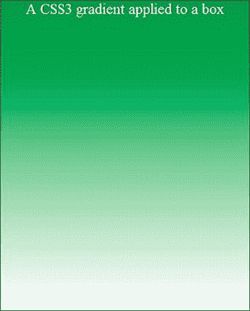
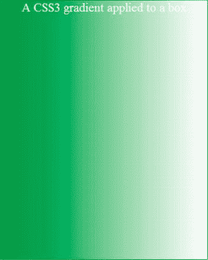
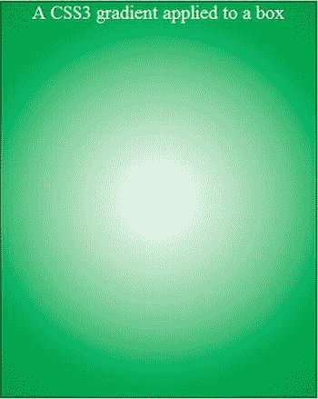
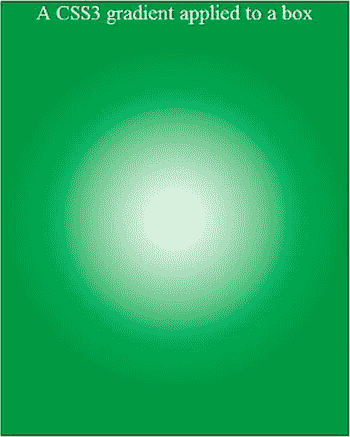
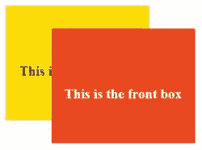
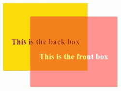
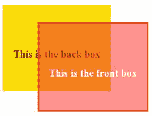
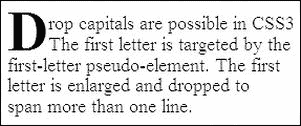
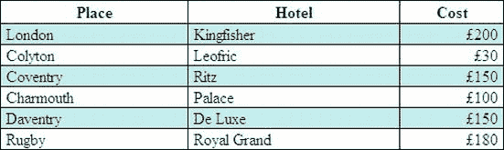
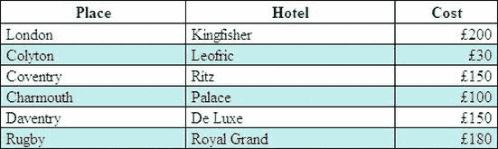

# 五、迁移到 CSS3

CSS3 是一个*独立的*推荐标准，而不是 HTML5 的组成部分。CSS3 不仅提供了一个非常令人兴奋的前景，而且浏览器(除了 IE 7 和 IE 8)已经获得了 CSS3 的大部分功能。IE 7 和 IE 8 只是忽略 CSS3 例如，带有 CSS3 圆角的页面显示方形角。

本章包含一系列 CSS3 模块。其他 CSS3 模块将在相应的章节中介绍，如下所示:

> *   CSS3 Multi-Background: Chapter III
> 
> 第七章
> 
> *   CSS3 fillet: Chapter 7
> *   CSS3 Shadow: Chapter 8
> *   CSS3 Multi-column: Chapter 15
> *   W3C's verification of CSS3: Chapter 19

 **提示**以下网站提供了关于 CSS3 的更多信息:`[`www.cssportal.com/css3-preview`](http://www.cssportal.com/css3-preview)`是一个必看的资源，它提供了 CSS3 模块的优秀示例、模板和解释。`[`www.css3generator.com`](http://www.css3generator.com)`允许你选择一个 CSS3 模块并查看每个例子的标记，你还可以发现哪些浏览器支持它们。

`[`www.css3.info/preview/`](http://www.css3.info/preview/)`提供最新消息和例子。

`[`www.css3.info/modules/`](http://www.css3.info/modules/)`经常更新，有一个模块及其进度的综合列表。

提供优秀的演示和优秀的代码片段。

`[http:/mashable.com/2010/06/04/awesome-css3-techniques/](http://mashable.com/2010/06/04/awesome-css3-techniques/)`提供新闻和例子。

### CSS3 梯度

在写的时候，CSS3 渐变支持不整洁。CSS3 渐变需要浏览器特有的技巧。本节中的示例展示了当浏览器供应商能够移除他们的黑客攻击时，CSS3 渐变会有多么有用。Mozilla 必须使用一个`-moz-` hack，Safari 和 Chrome 需要这个`-webkit-` hack。甚至它们的标记也不同。在撰写本文时，Opera 还没有支持，IE 7 和 IE 8 必须退回到 CSS2 渐变图像。目前，CSS2 渐变图像适用于所有浏览器，因此在未来一段时间内不再需要 CSS3 解决方案。用 CSS2 创建渐变，见第三章。在`[`gradients.glrzad.com/`](http://gradients.glrzad.com/)`和`[www.colorzilla.com/gradient-editor/](http://www.colorzilla.com/gradient-editor/)`有梯度发生器。

我建议你现在就使用这些例子，但是推迟使用 CSS3 渐变，直到不再需要特定于供应商的技巧。对于 IE 7 和 IE 8，使用 CSS2 和渐变图像。

在`[`dev.w3.org/TR/2011/WD-css3-images-20110908`](http://dev.w3.org/TR/2011/WD-css3-images-20110908)`和`[`css-tricks.com/examples/CSS3Gradient/`](http://css-tricks.com/examples/CSS3Gradient/)`可以看到 W3C 关于 CSS3 渐变的建议

CSS3 渐变可以合并到背景中，而不是使用图像。它们也可以用在新的 CSS3 边框图像中。

#### 线性渐变

图 5-1 和 5-2 显示了 CSS3 在不使用绘画程序的情况下实现的渐变。

***图 5-1。**CSS3 垂直线性渐变*

***图 5-2。**一个 CSS3 水平线性渐变*

清单 5-1 产生一个垂直梯度。内部风格用于教学目的。相关代码以粗体显示，您将看到目前需要`-moz-`和`-webkit-`hack。在不久的将来，我们可以期待 Mozilla Firefox、Google 和 Safari 支持渐变，而无需黑客攻击。

***清单 5-1。**用 CSS3【css3-gradient-vert.html】()*创建垂直线性渐变

`<!doctype html>
<html lang=en>
<head>
<title>A vertical CSS3 gradient applied to a box</title>
<meta charset=utf-8>
        *meta details go here*
</head>

</head>
<body>

A CSS3 gradient applied to a box

</body>
</html>`

 **注**`-moz-`和`-webkit-`的加价差别很大；同样，Firefox 是自下而上工作的，其他的是自上而下工作的。(另一个好混乱，斯坦利。)

清单 5-2 产生了一个水平梯度。注意，这在任何版本的 IE 中都不起作用，即使是 IE 9 或 IE 10 也不行。

内部风格用于教学目的。相关代码以粗体显示，您将看到目前需要的是`-moz-`和 *-* `webkit-`代码。

***清单 5-2。【css3-gradient-horiz.html】使用 CSS3 创建水平线性渐变***

`<!doctype html>
<html lang=en>
<head>
<title>A horizontal CSS3 gradient applied to a box</title>
<meta charset=utf-8>
        *meta details go here*
<head>

</head>
<body>` `
A CSS3 gradient applied to a box

</body>
</html>`

在此之前，使用在画图程序中创建的 CSS2 渐变图像。W3C 对未来浏览器的建议将会有类似下面的格式:`background:linear(green, white); or linear-gradient(green, white);`。有关渐变的最新进展，请访问:[`dev.w3.org/csswg/css3-img/#linear-gradients`](http://dev.w3.org/csswg/css3-img/#linear-gradients)同时搜索互联网以跟踪浏览器对渐变的支持，一个很好的起点是:[`www.css3gradients.com/`](http://www.css3gradients.com/)

#### 径向梯度

图 5-3 和 5-4 显示了 CSS3 在不使用绘画程序的情况下实现的径向渐变。

***图 5-3。**Mozilla Firefox 中的渐变*

***图 5-4。**Safari 和 Chrome 中的渐变*

Mozilla Firefox 提供了最好的渐变，其他浏览器目前将渐变描绘成一个球。

在清单 5-3 中用粗体显示的代码产生了一个径向渐变，同样`-moz-`和`-webkit-` hacks 必须在当前支持 CSS3 渐变的浏览器中使用。相关代码以粗体显示。这在任何版本的 IE 中都不起作用，甚至在 IE 9 中也不起作用。

***清单 5-3。**用 CSS3【css3-gradient-radial.html】()*创建径向渐变

`<!doctype html>
<html lang=en>
<head>
<title>A radial CSS3 gradient applied to a box</title>
<meta charset=utf-8>
        *meta details go here*

</head>
<body>

A CSS3 gradient applied to a box

</body>
</html>`

W3C 对未来浏览器的建议将类似于以下格式:

`    background:radial-gradient(green, white);`

圆形渐变大概是这样的:

`    Background:radial-gradient(circle, green, white)`

### CSS3 不透明度和 RGBA 颜色

这两个模块放在一起讨论，因为它们的区别需要解释。不透明度声明涉及整个元素，包括它的子元素。RGB(红、绿、蓝)声明描述了一个元素的颜色和不透明度；子元素不受影响。但是，使用 RGBA，设计者可以选择哪些子元素是透明的，哪些是不透明的。

 **提示**关于覆盖 RGBA 和不透明度的解释性幻灯片，请参见:
`[`leaverou.me/2009/03/css3-colors-today-mediacampathens-session/`](http://leaverou.me/2009/03/css3-colors-today-mediacampathens-session/)`。

在下面的三个示例中，内部样式表仅用于教学目的。

图 5-5 是图 5-5 、图 5-6 和图 5-7 中所示示例的起点。

***图 5-5。**两个普通的盒子元素使用 CSS3 和 RGB 来设置背景颜色*

出于稍后将在图 5-7 中变得清楚的原因，前框被赋予了与背景颜色相同的 4 像素宽的边框，因此在图 5-5 中该边框不可见。

清单 5-5 显示了图 5-5 的 HTML 和 CSS3。粗体代码创建了不透明框。这些框在任何浏览器中都具有相同的外观。因为 IE 7 和 IE 8 不支持 CSS3，所以你会想到会出现问题。然而，因为 IE 7 和 IE 8 的默认设置是*不透明，*并且因为列表没有指定任何透明度，所以所有的浏览器都会显示不透明框。

***清单 5-** 清单 5。使用 RGB(css3-opaque.html)创建两个重叠的不透明框*

`<!doctype html>
<html lang=en>
<head>
<title>Opaque boxes in CSS3</title>
<meta charset=utf-8>
        *meta details go here*

</head>
<body>

` `
This is the back box

This is the front box

</body>
</html>`

下一个项目显示 CSS3 不透明度/透明度。IE7 和 IE 8 不支持这个。

CSS3 透明度(又名不透明度)的效果如图图 5-6 所示。

***图 5-6。**使用 CSS3，整个前框元素被赋予 0.5 的不透明度，这个不透明度同样适用于前框的所有元素，包括子元素、不可见的 4 像素边框和白色文本。*

透过透明的前盒可以看到后盒。前框的白色文本中可以看到后框的背景色。

在清单 5-6 中，CSS3 属性`opacity:0.5;`与整个`#front-box`元素相关，包括任何子元素，如边框和段落。不透明度可以设置为 1(完全不透明)或 0(完全不透明；即完全透明)和介于两者之间的任何值，例如 0.5 表示半透明。

***清单 5-6。【css3-opacity.html】创建一个透明度为 0.5 的前框**(**)***

`<!doctype html>
<html lang=en>
<head>
<title>Opacity and CSS3</title>
<meta charset=utf-8>
        *meta details go here*
<head>

</head>
<body>

This is the back box

        
This is the front box

</body>
</html>`

下一个项目展示了 CSS3 RGBA 元素的灵活性。“A”代表 alpha，这个特性允许设计者选择哪些子元素具有不同程度的不透明度。

图 5-7 显示透明/不透明可以选择性地应用于子元素。

***图 5-7。** RGBA 已经被选择性地应用于前箱。这一次，只有前框的背景色是透明的。*

四像素边框和白色文本这两个子元素保持完全不透明。4 像素的边框在前面已经包含了，但是在前面的例子中是看不到的。

 **注意**通过将 RGBA 应用于单个子对象，可以使边框和文本的颜色变得不透明或透明，例如边框颜色和文本。这提供了很大的灵活性，因为设计者可以选择元素的哪些位应该被赋予不透明值。

在清单 5-7 中，选中的元素是透明的前框的背景色。子元素，如边框和段落，不受背景不透明度的影响。不透明度可以从 1(完全不透明)设置到 0(完全不透明；完全透明)。在图 5-7 中，前框背景颜色设置为`background-color: rgba(255,0,0,0.5);`。

***清单 5-7。【css3-rgba.html】对前框选择性应用 CSS3 不透明度***

`<!doctype html>
<html lang=en>
<head>
<title>CSS3 and RGBA</title>
<meta charset=utf-8>
        *meta details go here*
<head>

</head>
<body>

This is the back box

This is the front box

</body>
</html>`

 **注意**RGBA 和不透明模块令人兴奋和期待已久。遗憾的是，IE 6、IE 7 和 IE 8 都不支持它们。因此，必须使用 IE 条件来呈现这些 IE 版本的替代显示。条件 IE 样式链接必须放在 HTML 标记中主样式链接之后，它可以提供统一的颜色或通过平铺渐变图像产生的渐变。

### 新增 CSS3 选择器和元素

CSS3 中提供了许多新的选择器。这些可以在本章末尾提到的可下载的备忘单中找到。

下面的例子是一些最有用的伪类选择器和伪元素。在图 5-8 中显示了一个下降资本。

#### ::第一个字母

***图 5-8。**使用 CSS3 的降资本*

图 5-8 中所示的首字下沉是由清单 5-8 中粗体显示的伪类选择器产生的。在每种现代浏览器中，首字下沉的高度各不相同。Mozilla Firefox 提供了最好的显示效果。

***清单 5-8。【对段落的第一个字母应用首字下沉(CSS3-drop-cap.html)***

`<!doctype html>
<html lang=en>
<head>
<title>Drop cap initial letter</title>
<meta charset=utf-8>

</head>
<body>
surrounding paragraph

  
Drop capitals are possible in CSS3 
  The first letter is targeted by the  
  first-letter pseudo-element. The first 
  letter is enlarged and dropped to 
  span more than one line.  

  surrounding paragraph
 </body>
</html>`

 **注意**你可能需要稍微调整一下字体大小和行高来获得想要的效果。第一个字母可以被赋予不同的颜色。你不太可能希望整个网站都使用首字下沉，因此`
`只选择需要首字下沉的段落。

#### ::第一行

`::first line`影响整个段落的第一行；然而，这似乎比在第一行使用一个``更麻烦。

#### ::之前

`::before`伪元素可以在某些段落的开头生成一些内容；然而，这也可以在 CSS2 中实现(参见附录)。

#### :第 n 个孩子()

`:nth-child()`样式列表或表格中的选择性项目。如果交替行是彩色的，表格形式的信息更容易阅读和理解；在宽的多列表格中尤其如此。

属性简化了交替颜色行的创建。例如，`ul :nth-child(even)`将对项目的*列表*中的每第二个、第四个、第六个、第八个等项目进行样式化。注意`ul`和:`nth-child`之间的空格；这在列表中很重要。

括号中可以包含各种关键字，如*奇数、偶数、*或*号*来选择特定的项目。

在图 5-9 中，第二、第四和第六行已经用`nth-child(even)`着色。

***图 5-9。**使用 CSS3 n-child(偶数)添加条纹*

使用交替条纹可以使宽表格更容易阅读。在清单 5-9 中，粗体代码产生了如图图 5-9 所示的交替条纹。IE 7 和 IE 8 不支持 CSS3 分条表。

***清单 5-9。【table-1.html】在表格的偶数行中创建彩色条纹***

`<!doctype html>
<html lang=en>
<head>` `<title>Table 1</title>
<meta charset=utf-8>

</head>
<body>
<table summary="Table with stripes">
<caption>Table 1\. Using CSS3 nth-child(even) to add stripes</caption>
        <tr><th>Place</th><th>Hotel</th><th>Cost</th></tr>
        <tr><td>London</td><td>Kingfisher</td><td class="right">&pound;200</td></tr>
        <tr><td>Colyton</td><td>Leofric</td><td class="right">&pound;30</td></tr>
        <tr><td>Coventry</td><td>Ritz</td><td class="right">&pound;150</td></tr>
        <tr><td>Charmouth</td><td>Palace</td><td class="right">&pound;100</td></tr>
        <tr><td>Daventry</td><td>De Luxe</td><td class="right">&pound;150</td></tr>
        <tr><td>Rugby</td><td>Royal Grand</td><td class="right">&pound;180</td></tr>
</table>
</body>
</html>`

图 5-10 显示了使用 CSS3 从第三行开始的交替条带行的表格。

***图 5-10。**使用 CSS3 和 n-child(2n+3)添加条纹*

在清单 5-10 的中，条纹的公式更加复杂，但是非常合理。标记 **`table tr:nth-child(2n+3)`** 的意思是:从第 3 行开始，每隔一行应用一个样式。

***清单 5-10。【table-2.html】使用 CSS3 创建一个从第 3 行开始的条纹表***

`<!doctype html>
<html lang=en>
<head>` `<title>Table 2</title>
<meta charset=utf-8>

</head>
<body>
<table summary="Table with stripes">
<caption>Table 2\. Using CSS3 nth-child(2n+3) to add stripes</caption>
        <tr><th>Place</th><th>Hotel</th><th>Cost</th></tr>
        <tr><td>London</td><td>Kingfisher</td><td class="right">&pound;200</td></tr>
        <tr><td>Colyton</td><td>Leofric</td><td class="right">&pound;30</td></tr>
        <tr><td>Coventry</td><td>Ritz</td><td class="right">&pound;150</td></tr>
        <tr><td>Charmouth</td><td>Palace</td><td class="right">&pound;100</td></tr>
        <tr><td>Daventry</td><td>De Luxe</td><td class="right">&pound;150</td></tr>
        <tr><td>Rugby</td><td>Royal Grand</td><td class="right">&pound;180</td></tr>
</table>
</body>
</html>`

### 字体选择器

CSS3 `@font-face`模块可以指示浏览器使用特定的字体，即使它没有安装在用户的计算机上。然而，它在下载速度和可能的版权侵权方面存在困难。如果用户的计算机上没有安装该字体，就必须从网站的服务器上下载，并存储在那里。因为字体集可能非常大，所以下载速度会受到影响，并且在下载完成之前，文本在页面上是不可见的。除非你得到许可使用这种字体，否则未经许可下载拷贝会被指控为盗版。IE 6、IE 7 和 IE 8 不支持`@font-face`模块，除非您执行以下操作:

> *   使用 JavaScript，
> *   Use. Eot (embedded open) font, or
> *   试试
>     
>     
>     `[`jontangerine.com/log/2008/10/fontface-in-ie-making-web-fonts-work`](http://jontangerine.com/log/2008/10/fontface-in-ie-making-web-fonts-work)`
>     
>     
> 
> 的技巧

假设你希望你的站点使用一种叫做`mickealmouse.ttf`的字体，并且你也有一个`.eot`版本的字体。您的标记可能如下所示:

`@font-face { font-family: ‘mickealmouse’;
        src: url(‘mickealmouse.ttf’) format(truetype’);
        src: local(mickealmouse’), src: url(‘mickealmouse.eot’);` `        }
body { font-family: mickealmouse; Arial, Helvetica, sans-serif; font-size: medium;
color:black;
}
h1 { font-family: mickealmouse; Arial, Helvetica, sans-serif; font-size: x-large; 
color:black;
}
h2 { etc…`

如果用户的浏览器不支持`@font-face`，它可以回退到 Arial、Helvetica 或 sans-serif。如果用户已经安装了 mickealmouse 字体，`src: local(mickealmouse')`项将指示浏览器使用已安装的版本，这样就不必下载字体。`.eot`字体不需要格式。

WOFF 文件格式是另一种适合于`@font-face`的字体，W3C、微软、Opera 和 Mozilla 期望它成为所有浏览器支持的“单一的、可互操作的(字体)格式”。这种文件格式似乎比同等的 TTF 文件小 40%。

 **提示**关于这个主题的有用资源，请参见 Michael Bowers、Dionysios Synodinos 和 Victor Sumner 合著的《Pro HTML5 和 CSS3 设计模式*一书的第十章(a press，2011)。*

虽然不是 CSS3，但是 Google 提供的替代方案非常值得一试；

访问:`[`google.com/webfonts`](http://google.com/webfonts)`可以选择免费的开源字体，下载其代码。该代码将是一个在线样式表的链接，该链接必须是一个页面的第一个项目`<head>`部分。然后将该字体样式添加到 CSS 中的字体样式列表中；假设你下载了 Diplomata 字体，CSS 字体家族可以是这样的:h1 { font-family: 'Diplomata '，' times new roman '，serif}

### 使用当前、未来和其他模块

记住 CSS3 不是 HTML5 的一部分；因此，它可以与 HTML4 和 XHTML1.0 一起使用。但是，目前最新的浏览器仅部分支持它。IE 7 和 IE 8 不支持以下 CSS3 模块，并且 IE 9 当前不支持所有 CSS3 模块:

> *   *Outline* : Provide various border appearances, such as ridge, beginning, embedding and groove. (There is a good equivalent of CSS2\. )
> *   *Border picture* : A block element is surrounded by a border made of tiny pictures (not very useful. )
> *   *Grid layout* : A short CSS method for creating a page layout grid.
> *   *Template layout* : Copy grid layout appears.
> *   *Media inquiry* : The media types used by CSS 2 are screen, voice and print; CSS3 module will expand the use of media types.
> *   *Subtitle Style* : Handling overflow text presented in the form of moving subtitles.
> *   Speech (this module defines the improved way to convert documents into speech and the auditory recognition using voice commands)
> *   Transition and animation (improved animation control)

 **提示**参见`[`www.smashingmagazine.com/2009/07/13/css-3-cheat-sheet-pdf`](http://www.smashingmagazine.com/2009/07/13/css-3-cheat-sheet-pdf)`处的 CSS3 备忘单

### 总结

CSS3 有令人兴奋的可能性，但它们被 IE 7 和 IE 8 无法利用的事实所破坏。然而，你现在知道当 IE 7 和 IE 8 被 IE 9 取代时，CSS3 将提供的优势。请务必查看第三章、 7 、 8 和 15 中涵盖的其他 CSS3 建议。

在下一章，你将了解 HTML5 提供的新的音频和视频标签。这是 HTML5 最激动人心和最有用的增强之一，尤其是视频在现代网站中如此重要。您还将了解到新标签如何大幅减少视频格式的数量。后备提示使 IE 7 和 IE 8 能够利用新的标签。还描述了创建幻灯片放映的两种方法。