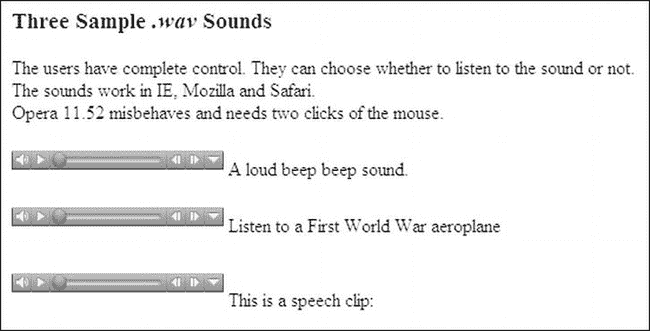
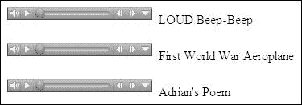
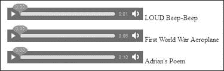
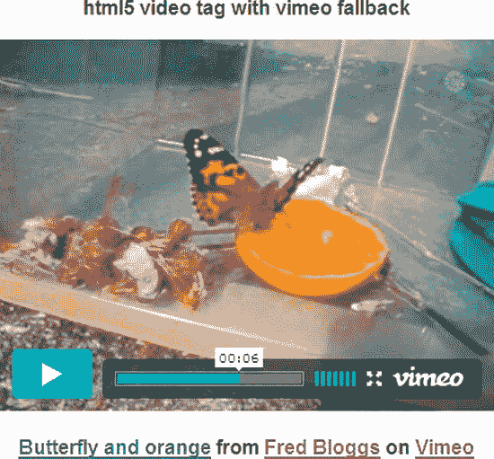
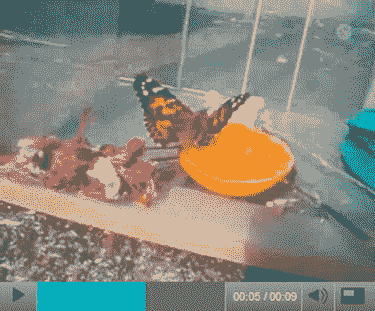
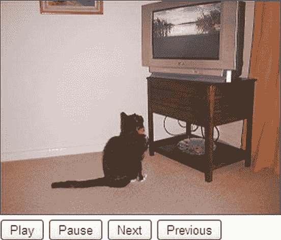
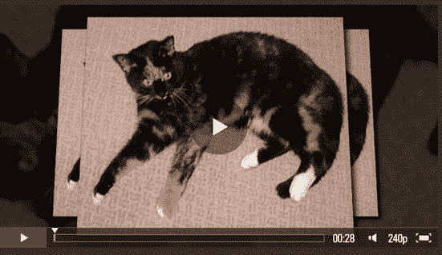
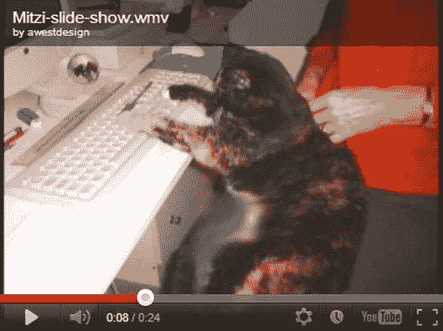

# 六、音频、视频和幻灯片放映

本章的第一部分讲述了音频和视频在网站中的使用和误用。本章还提供了在网页中嵌入音频剪辑和录制语音剪辑的说明。简要介绍了当前的视频文件格式，然后是关于 HTML5 `<video>`标签的信息，它使用的文件，以及将视频剪辑嵌入 HTML5 网页的说明。

IE 7 和 IE 8 中缺乏对`<video>`标签的支持所带来的问题通过各种回退方法得到了解决，提供了完整的回退示例。其中包括 YouTube 和 Vimeo，因为它们提供了一种相对简单的向网站添加视频的方式。你会发现这两个在线视频商店可以单独使用或作为备用。

然后这一章提供了另外两种使用免费下载的 JavaScript 文件来处理 IE 7 和 IE 8 的 HTML5 视频的方法，Flowplayer 和 OS FLV。

本章最后介绍了创建和嵌入幻灯片的各种方法。

### 何时使用音频和视频(AV)

应特别注意不要无偿使用音频和视频。一些网站设计者插入视频只是因为他们可以，因为它很有趣。创建和嵌入视频可以让无聊的一天变得活跃起来，但这可能不会让委托网站的客户满意。以下是在网站中包含反病毒软件的一些正当理由:

> 假如没有背景音乐淹没演讲者的评论，一个 AV 剪辑有时可以比文本或图像更好地解释一些东西。*   If the customer is a film/TV production unit, a video clip can explain the quality of the product.*   If your page gives instructions for programming, making, installing or repairing something, then an AV clip may be helpful. However, most users will not remember the instructions on the video when they put it into practice (unless they have two computers, one for displaying the video and the other for executing the instructions). In addition to the video, provide a set of printable instructions. If your website sells ringtones or doorbells of various sounds, audio can play a very good role. Potential customers can listen to these options and then choose one that satisfies them. A video can show a product or service, but be careful: poor video will have negative effects. Avoid inappropriate background music, because this is the biggest obstacle. It's a mystery why video and documentary producers want to drown out the host's comments.*   Slides or videos are ideal for showing hotel accommodation, real estate or tourist attractions.*   Pop bands, folk bands and choirs looking for fixtures can give short samples of their stage display and music style by using video clips; Or the website can only play audio clips of music. As an example of useful use of AV, a bird watching website can contain a video of birds and birdsong.

#### 使用他人的视频、音乐或声音

不要偷 AV 剪辑。您将需要一个真正的许可证(或来自非商业来源的许可)来将 AV 合并到您的网站上。音乐家和电影制作人肯定会起诉你，你可能不得不卖掉你的房子来支付罚款。拥有录像带、CD 或 DVD 并不意味着你有权使用其中的音乐或视频。下载的剪辑不能在没有正版许可的情况下使用，除非它们是免费提供使用的。所谓的“免版税剪辑”名不副实，通常需要付费。

如果使用来自另一个 URL 的视频(当然，经过许可)，视频源的所有者会向您提供指向其网站上的视频文件的 URL。

#### 测试你的 AV

一些 AVs 可以在互联网上工作，但是在你的本地计算机上测试时，它们会失败或者行为失常。总是在网上上传和测试。

#### 应该避免什么

如果在错误的时间或错误的地点使用视频，会非常烦人。

> *   **Strongly resist the temptation of putting videos on the front page. It will determine the focus and divert the viewer's attention from more important items on the page, such as your navigation menu. In addition, video or audio clips may cause MIME type problems or coding errors; These two problems will hinder the normal access to your most important homepage.**
> *   **Do not use automatic start.** Auto start makes the sound or video automatically start when the page is loaded. This is a particularly bad practice on the homepage and a bad idea on any page. Sudden sound will scare users, especially blind users. Users will either leave your website immediately or frantically look for ways to close AV clips. They may never come back to your website.
> *   **Video and audio clips must have user controls.** Ensure that AV can only start when the user clicks the start button on the video control. It may be acceptable if you start to load a short and quiet arpeggio automatically. Maybe a quiet and soothing background music is acceptable in the video, as long as it doesn't repeat endlessly, as long as it is appropriate. When there is a thumping or disco background for the first time, most users will click the mute button, or more likely, give up this website.
> *   **Do not use** `onmouseover` **sound or video. If the blind or the visually impaired accidentally put the mouse on a sound link, she will be frightened. Even people with normal eyesight will accidentally hover the mouse over the sound link, and they will not be satisfied with the sudden sound. For the benefit of users, please always use `onmousedown` or the console to start audio or video.**

#### 非语义 HTML5 页面的音频

音频剪辑可以嵌入到非语义 HTML5 页面中，以避免将音频文件转换为其他格式。然而，我鼓励你尽快开始使用语义标签，以跟上现代网页设计技术。

图 6-1 显示了 Internet Explorer 8 中三种声音的控件。

***图 6-1。**三、非语义 HTML5 页面截图*

清单 6-1 使用了曾经被否决的`<embed>`标签。这三种`.wav`声音在 Internet Explorer、Mozilla、Safari 和 Chrome 中都可以听到；因此，大约 95%的电脑用户将能够听到声音。不幸的是，要在 Opera 11.5 中启动声音，用户需要点击两次 starter 按钮。

***清单 6-1。【example-sound1.html】在一个非语义页面中创造三个声音**(**)***

`<!doctype html>
<html>
<head>
<title>Sounds example 1</title>
<meta charset=utf-8>
</head>
<body>
<h3>Three Sample <i>.wav</i> Sounds</h3>
The users have complete control. They can choose whether to listen to the sound or 
not. The sounds work in IE, Mozilla and Safari. Opera 11.52 misbehaves and needs two
clicks of the mouse.  
<embed src="sounds/beepbeep.wav" width="180" height="25" autostart="false" 
repeat="false" loop="false"> A loud beep beep sound.` `</embed>  
<embed src="sounds/planeflyby.wav" width="180" height="25" autostart="false" 
loop="false"> Listen to a First World War aeroplane
</embed>  
<embed src="sounds/adrianspoem.wav" width="180px" height="40" autostart="false" 
loop="false">This is a speech clip:
</embed>
</body>
</html>`

#### 语义 HTML5 页面的音频

下一个项目演示了如何使用带有语义标签的 HTML5 页面来播放这三种声音。图 6-2a 和 6-2b 显示了 IE 7 和 IE 8 以及 Mozilla Firefox 中显示的控件。

 **提示**该。在`[`media.io/`](http://media.io/)`使用在线转换器将 wav 文件转换为`.mp3`和`.ogg`文件。为了获得最佳效果，请先将文件转换为*。* `mp3`然后转换。`mp3`文件改为`.ogg` *。*这两种文件格式是使 HTML5 音频标签支持 IE 7 和 IE 8 以外的浏览器所必需的。

那个。文件到达时会附带大约半英里长的数字和字母，如下所示:
`beep-beep.ogg;jsessionid=0113CF8JM5SD16M37…`等等。重命名文件并删除`.ogg`之后的所有内容

***图 6-2a。**IE 7 和 IE 8 中显示的控件*

***图 6-2b。**火狐浏览器中的控件*

在清单 6-2a/2b 中，三种声音及其控制包含在三个`
`中，每个`
`包含一个语义音频段和一个 IE 7 和 IE 8 的后备。最新的 HTML5 规范似乎暗示 autobuffer 将被`preload="auto"`取代。有些设计师很谨慎，两者兼而有之，如下所示:

`                <audio controls autobuffer preload="auto">`

***清单 6-2a/2b。**用语义标签在页面上创造三个声音**(【example-sound2a-and-2b.html】)***

`<!doctype html>
<html>
<head>
<title>Example sound2a and 2b</title>
<meta charset=utf-8>
        
</head>
<body>
#container { margin-left: 20px; width:500px;
}

        

        <audio controls autobuffer>
        <source src=sounds/beepbeep.ogg type="audio/ogg">
        <source src=sounds/beepbeep.mp3 type="audio/mp3">
                <object>
                <embed src="sounds/beepbeep.wav" width="180" height="25" 
                autostart="false" repeat="false" loop="false">
                </embed>
                </object>
        </audio>&nbsp;LOUD Beep-Beep

        

        <audio controls autobuffer>
        <source src=sounds/planeflyby.ogg type="audio/ogg">
        <source src=sounds/planeflyby.mp3 type="audio/mp3">
                <object>
                <embed src="sounds/planeflyby.wav" width="180" height="25" 
                autostart="false" loop="false">
                </embed>
                </object>
        </audio>&nbsp;First World War Aeroplane

        

        <audio controls autobuffer>
        <source src=sounds/adrianspoem.ogg type="audio/ogg">
        <source src=sounds/adrianspoem.mp3 type="audio/mp3">
                <object>
                <embed src="sounds/adrianspoem.wav" width="180" height="25" 
                autostart="false" loop="false">
                </embed>
                </object>
        </audio>&nbsp;Adrian's Poem
        

</body>
</html>`

#### 制作语音剪辑

Windows 有内置的录音机软件。笔记本电脑有内置麦克风，但台式电脑通常需要一个便宜的麦克风。麦克风/耳机套件附有两个插头；仅使用粉色插头。将粉色插头插入电脑上的粉色插座。如果计算机的插座没有颜色标记，请查找插座旁边的麦克风符号。一些内部拨号调制解调器有彩色插座，但不要插入这些插座。

##### 开始录音

要在 XP 中开始录音，请执行以下操作:单击开始所有程序附件娱乐录音机。

要在 Windows 7 中开始录音，请执行以下操作:单击开始所有程序附件录音机。

对于任一操作系统，单击停止/开始按钮并说出您的信息。您的消息最长可达一分钟。自然清晰地说话，让麦克风离你的嘴大约六英寸。单击带有黑色矩形的按钮停止录制。

在 XP 中，单击带有向右三角形的按钮来收听您的消息。

然后，点击文件另存为...给文件命名并保存。

在 Windows 7 中，用适当的名称将文件保存在适当的文件夹中。找到文件并双击它来试听。

### 视频概述:昨天的视频格式

视频是网页设计师的噩梦。十四种视频文件格式，四种流行的媒体播放器，五种带有四个插件的主浏览器，最好的描述应该是“一只狗的早餐”。就个人而言，视频和音频比网页设计和制作的任何其他方面都更让我挠头和沮丧。以下是撰写本文时的几种常见视频格式:

> *   The `.flv` format is Adobe's Flash file. It must be in a `.swf` container.
> *   The `.mov` format was developed by Apple. These files are called QuickTime movies. To play these movies on Windows computers, you must install free QuickTime player.
> 
> `.rm`
> 
> `ram`
> 
> *   `.swf` format (Shockwave Flash) is a container for playing `.flv` flash video or animation files.
> *   This. Microsoft's format is very universal and can be highly compressed. It can adapt to any download speed. It can be of any size for streaming broadcast and video. Microsoft's `.wmv` format is very popular, but it can only be played on Windows computers using Windows Media Player.

#### 但是事情已经有所改善了！

现在有以下四种嵌入视频的方法:

> *   The new HTML5 `<video>` tag.
> *   Online video hosting (YouTube or Vimeo). HTML5 uses new video tags, only three file types, and supports IE 7 and IE 8.
> *   javacriptāākepneurs flv。

#### 文件类型为 HTML5 语义视频标签

HTML5 引入了一个`<video>`标签，它将不再需要插件和 JavaScript。它在所有最新的浏览器中都受支持，但在 IE 7 或 IE 8 中不受支持。HTML5 视频标签只使用三种视频格式；14 种文件类型的可喜减少。要播放视频，浏览器会解压缩视频文件。

 **提示**要获得有用的资源，请阅读 Silvia Pfeiffer 撰写的*html 5 视频权威指南*(Apress，2010)。

HTML5 视频使用新的视频容器(文件`).webm`、`.mp4`和`.ogv`)。视频容器有几个组件；视频成分、一个或多个音频轨道、指定各种维度的一些元数据、标题和文件语言。视频播放器使用编解码器，使视频播放器能够解码容器中的信息，以便可以看到和听到它。

支持 HTML5 视频的浏览器使用以下一种或多种文件类型:

> *   Safari、Chrome 你好九号何如`.mp4`(你好啊页:1。
> *   Mozilla(Mozilla)吴经玲铬(铬)何如`.webm`。
> *   IE 9 uses plug-ins (WebM Media Foundation components) to play `.webm`, which is equivalent to defeating the purpose of HTML5 video tags, because it aims to eliminate the need for plug-ins.
> *   浏览器名火狐、Chrome、戏曲`.ogv`。

HTML5 视频非常简单，但是你需要一些视频文件转换程序。

##### 转换文件格式

在`.flv`和*之间转换。* `swf`，从`[`www.foxtab.com`](http://www.foxtab.com)`下载免费的 FoxTab 视频转换器。这是我最喜欢的转换器，因为它可以转换几乎任何格式。

将文件转换为*。* `webm`，*。* `ogv`和`.mp4`，在`[`mirovideoconverter.com`](http://mirovideoconverter.com)`下载免费的米罗视频转换器显然，米罗最终将提供他们的转换器的 iPad 版本。

将文件转换为*。* `wmv`格式，从`[`freemake.com`](http://freemake.com)`下载免费程序 Freemake 该网站还提供了一个有用的声音文件转换器。

将文件转换为`.mp4`、*。* `webm`，`.ogv`格式，从`[`handbrake.fr`](http://handbrake.fr)`下载手刹，免费程序。

前面提到的三个视频转换器很容易使用。最后一个比较棘手，但是它提供了对转换过程的完全控制。到目前为止，我没有手刹。要获得一套关于手刹的出色、详细且有插图的说明，请访问 Mark Pilgrim 的网站`[`diveintohtml5.info/video.html`](http://diveintohtml5.info/video.html)`。你也应该看看马克·皮尔格林的书，《HTML5:启动并运行》(O ' Reilly Media，2010)。

#### 基本 HTML5 视频编码格式

新的`<video>`标签现在就可以使用，前提是你有一个后备方案来让 IE 7 和 IE 8 用户观看你的视频。当用户最终停止使用 IE 7 和 IE 8 时，HTML5 视频标签将使网页设计师的生活变得更加轻松。那么可以放弃 IE 的后备，只需要三种文件格式。在本章的后面，你将学习如何使用各种回退。下一段代码演示了在没有回退的情况下使用 HTML5 视频标签时标记的简单性。

`   <video width="320" height="240" controls>
        <source src=somevideo.mp4 type='video/mp4; codecs="avc1, 42Eo1E, mp4a.40.2" '>
        <source src=somevideo.webm type='video/webm; codecs="vp8, vorbis" '>
        <source src=somevideo.ogv type='video/ogg; codecs="theora, vorbis" '>
   </video>`

我发现编解码器可以省略，因为它们似乎嵌入在浏览器中，但为了完整起见，它们显示在前面的代码片段中。因此，源代码可以写成:

`   <video width="320" height="240" controls>
        <source src=somevideo.mp4 type='video/mp4;'>
        <source src=somevideo.webm type='video/webm;'>
        <source src=somevideo.ogv type='video/ogg;'>
   </video>`

最终，IE 7 和 IE 8 会逐渐减少并消亡；当这种情况发生时，您可以从前面的代码片段中看到，嵌入视频将像向 web 站点页面添加图像一样简单。让我们希望很快有一天，媒体播放器的创作者们会聚在一起，同意只使用一种音频格式和一种视频格式。

以下项目中使用的马车和蝴蝶视频剪辑由英国德文郡科利顿海豚馆的艺术家罗杰·劳顿和他的女儿海伦娜好心提供。他们的网站在`[`www.dolphinhousegallery.co.uk`](http://www.dolphinhousegallery.co.uk)`

您可以通过从本书的页面 [` `www`下载本章的文件来试用新的`<video>`标签。`apress.com``](http://www.apress.com) ，然后用 IE 7 或 IE 8 以外的任何浏览器加载`video-tag.html`。图 6-3 显示了使用新的`<video>`标签并由清单 6-3 创建的视频截图。

***图 6-3。**html 5<video>标签显示了 Mozilla Firefox 中的一段视频。请注意，没有显示任何徽标或其他不需要的标记。*

Mozilla Firefox、IE 9、Chrome、Opera 和 Safari 支持新的`<video>`标签，每个浏览器都有用户熟悉的控件。清单 6-3 是图 6-3 的标记，视频文件被假定在一个名为`video`的文件夹中。

 **注意**列表行中的尺寸`<video width="480" height="385" controls="controls">`很重要。生成三个视频文件时，视频必须具有相同的帧大小，并且帧尺寸必须包含在标记中，否则视频可能无法播放。

***清单 6-3。【为 IE 7 和 IE 8 使用 HTML5 视频标签而没有回退(video-tag.html)***

`<!doctype html>
<html lang=en>
<head>
<title>Using the new HTML5 video tag</title>
<meta charset=utf-8>

</head>
<body> 
HTML5 video tag with embedded YouTube fallback

<video width="480" height="385" controls="controls">
                <source src=" video/wagon3.mp4" type="video/mp4">                 <source src=" video/wagon3.webm" type="video/webm">                 <source src=" video/wagon3.ogv" type="video/ogg">
</video>
</body>
</html>`

##### 混合页面

仅仅因为发布了一个新的 W3C 标准，并不意味着您必须改变整个网站来满足该标准。如果正确指定了每个页面的 DOCTYPE，网站可以包含 HTML、HTML5、XHTML 和 XHTML5 的混合页面。如果您只想在现有网站的一个或两个页面上使用新的`<audio>`和`<video>`标记，这将非常有用。只是在视频页面上使用 HTML5，直到你准备好将其他页面改为 html 5。与此同时，在下一节我们将调查允许 IE 7 和 IE 8 用户观看你的视频的临时解决方案。

#### IE 7 和 IE 8 的问题呢？

Internet Explorer 7 和 IE 8 不理解 HTML5 `<video>`标签；因此，已经开发了各种解决方案，使用称为*回退*的变通方法。在接下来的几年里，因为 IE 7 和 IE 8 被 IE 9 取代还需要一段时间，所以你应该继续确保视频在 IE 7 和 IE 8 中播放。

同时，不要惊慌！您当前使用 HTML4 和 XHTML 1.0 页面中的`<object>`和`<embed>`标签的页面将在未来十年甚至更长时间内继续发挥作用。

接下来的两个项目提供了使用 YouTube 和 Vimeo 作为唯一的视频播放器以及使用 HTML5 `<video>`标签时作为后备解决方案的说明。

### 在线解决方案:使用 YouTube 或 Vimeo

在 YouTube 或 Vimeo 上在线存储短视频剪辑很有意义，因为当视频的代码被添加到 HTML5 页面时，视频可以在所有主要的浏览器上观看。我们可以肯定的是，出于商业原因，YouTube 和 Vimeo 将会跟上任何新的网络标准。YouTube 和 Vimeo 代码现在使用`<iframe>`标签，这适用于所有浏览器，包括 IE 7 和 IE 8。

 **注意**定期查看 YouTube 和 Vimeo 网站，了解注册和上传/下载程序的变更，尤其是使用这些产品的条款和条件的变更。在销售商品或服务的网站上使用这些视频可能会收费(或改变成本)。视频文件的允许大小也可能改变。

接下来的两个项目描述了如何创建 YouTube 或 Vimeo 帐户，如何将视频上传到 YouTube 或 Vimeo，以及如何将 YouTube 或 Vimeo 代码嵌入到网页中。

#### 使用 YouTube

上传你的视频文件时，YouTube 首选 MPEG-2 或 H.264(又名 MPEG-4，又名`.mp4`)。YouTube 也将接受*。* `wmv`文件。视频应该每秒 30 帧，大小为 640 × 360(纵横比为 16:9)或 480 × 360(纵横比为 4:3)。首选音频格式是 MP3 或 ACC。

##### 对视频大小的托管限制

网站宿主限制网站的大小。一个基本的低成本网站托管包可能允许总共 1GB 的上传(包括所有其他网站文件)。最昂贵的主机包将允许高达 20 GB。视频文件可能非常大；因此，将视频存储在其他地方，如 YouTube 上，可以将网站保持在主机指定的限制范围内。

警告潜在客户，YouTube 上的每个视频的最大容量为 1 GB，最长播放时间为 15 分钟(最好是 1 到 3 分钟)。为了了解这些限制的最新情况，请访问`[`www.youtube.com`](http://www.youtube.com)`并寻找*帮助*按钮，因为谷歌完全修改了 YouTube 网站，帮助链接似乎已经被降级到一个非常长的主页的底部。访问谷歌主页并点击顶部菜单上的 YouTube 项目可能会更容易。同样，你需要向下滚动到一个很长的页面的底部来找到帮助按钮。

##### 注册一个 YouTube 帐户

如果你有一个谷歌帐户，使用谷歌登录详细信息登录，因为谷歌拥有 YouTube。否则，在 YouTube 主页上，单击创建帐户并填写所需的详细信息。给出你的客户的电子邮件地址(或者你自己的电子邮件地址，如果这个视频是为你的网站准备的)，这样你的客户(或者你)就可以收到验证账户详细信息的电子邮件。您将被要求发明一个用户名和密码。当您收到电子邮件时，单击验证链接激活您的新帐户。

 **注意**你不能复制你已经上传的内容；即使您更改了文件名，这也适用。Google/YouTube 倾向于偶尔改变一些东西，所以下面的过程可能会过时。在写这篇文章的时候，谷歌已经把一个用户友好的网站变成了一个神奇的神秘之旅。所有的配置技巧都消失了。最令人恼火的遗漏是，当你自己的视频播放时，用户可以拒绝显示相关视频的图库。这让我的客户对 YouTube 望而却步。

要使用 YouTube 托管视频，请登录`at [`www.youtube.com`](http://www.youtube.com)`，点击顶部菜单上的上传项目。在这一点上，以前的，更加用户友好的版本允许你在上传之前配置视频，遗憾的是，这个功能现在已经被删除了。

点击顶部菜单栏上的上传后，点击标签为*的按钮从您的计算机中选择文件*。一个小窗口将允许您导航到视频在硬盘上的存储位置。单击视频，然后单击打开按钮。在下一个屏幕的右边选择*未列出，任何有链接的人都可以查看。*过一会儿，视频将完成上传，您会看到一条消息，提示您的视频上传完成。记下视频的 URL 以供将来参考。点击*嵌入*按钮。一个小窗口将以蓝色突出显示代码。将代码复制并粘贴到您的网页中。您可能需要等待几分钟才能观看视频。

**自 2012 年初以来，YouTube 代码片段已被简化，可以进行验证。以下是 YouTube 可下载代码的新`<iframe>`格式示例:**

`<iframe width="420" height="315" src="http://www.youtube.com/embed/xxxxxxxxxxx?rel=0" 
frameborder="0" allowfullscreen>
</iframe>
You will appreciate the simplicity of the <iframe> method which has replaced the former
<object> <embed> method.`

图 6-4 显示了一个典型的 YouTube 托管视频。

***图 6-4。**典型的 YouTube 托管视频。注意 YouTube 的标志。*

清单 6-4a 和 6-4b 包含在本章的可下载文件中，但出于安全原因，YouTube 视频不会播放。列表中的身份号码已被替换为`xxxxxxxxxxx`。但是，您仍然可以在 IE 7 和 IE 8 之外的任何浏览器中查看视频。此外，如果您将自己的 YouTube 托管视频插入文件，您将能够在包括 IE 7 和 IE 8 在内的任何浏览器中查看结果；只要确保代码片段是`<iframe>`格式的。

您可以单独使用 YouTube 剪辑，也可以在使用 HTML5 `<video>`标签的页面中使用 YouTube 剪辑作为后备。

要单独使用 YouTube 剪辑，只需删除清单 6-4a 中粗体显示的代码。无论哪种方式，当使用你自己的 YouTube 托管的视频时，它将在所有浏览器中显示，包括 IE 7 和 IE 8。

***清单 6-4a。【wagon-YT.html 创建包含 HTML5 视频和嵌入 YouTube 视频的页面***

`<!doctype html>
<html lang=en>
<head>
<title>An embedded video stored on YouTube plus video tag</title>
<meta charset=utf-8>
meta details go here
</head>
<body>
**<video width="400" height="300" controls="controls">**
**<source src=" video/wagon3.mp4" type="video/mp4">**
**<source src=" video/wagon3.webm" type="video/webm">**
**<source src=" video/wagon3.ogv" type="video/ogg">**
<iframe width="420" height="315" src=http://www.youtube.com/embed/xxxxxxxxxx?rel=0 
 frameborder="0" allowfullscreen></iframe>
**</video>**
</body>
</html>`

虽然这在所有的浏览器中都可以工作，但是当你试图验证它的时候会发生一些奇怪的事情；W3C HTML5 验证器发现的错误会让严格的 HTML4 和 XHTML 爱好者感到震惊。如果您想要验证代码，您必须移除一些项目，如下所示。当我注释掉这些项目使其生效时，它仍然可以在所有浏览器中工作。

修改后的清单 6-4b 有一些项目(粗体显示)被注释掉，以使文件有效。

***清单 6-4b。【wagon-YT-validated.html】一个嵌入的 YouTube 视频验证了(??)***

`<!doctype html>
<html lang=en>
<head>
<title>Wagon embedded YouTube video validated</title>
<meta charset=utf-8>
<!--<meta details go here>-->
**<!--</head>-->**
<body>
<video width="400" height="300" controls=”controls”>
<source src=" video/wagon3.mp4" type="video/mp4">
<source src=" video/wagon3.webm" type="video/webm">
<source src=" video/wagon3.ogv" type="video/ogg">
<iframe width="420" height="315" src="http://www.youtube.com/embed/xxxxxxxxxxx?rel=0"> 
**<!--frameborder="0" allowfullscreen-->**</iframe>
**<!--</body>-->**
</html>`

#### 使用 Vimeo

Vimeo 界面比新的 You Tube 界面更容易理解和使用。对于这两种在线服务，代码很容易下载并嵌入到页面中。他们的表现似乎没有什么不同。

Vimeo 视频的基础版是免费的，但不能用于商业广告，比如销售产品或服务。允许个人使用、非商业和小规模生产单位。对于商业用途，pro 版本的费用为每年 60 美元或每月 9.95 美元。

无论你注册哪个，Vimeo 都会提供一个简单的上传程序。首先阅读网站上的三条规则，然后点击顶部菜单上的上传项目。您将看到一个窗口，该窗口允许您浏览硬盘以找到该视频。嵌入代码很简单，只需将鼠标悬停在视频上或单击它，然后单击视频开始帧上的嵌入按钮(右边第二个)。代码将会出现。将代码复制并粘贴到您的网页中。你可以选择播放器的颜色和大小。Vimeo 可能是最容易使用和定制的服务。

清晰的建议见`[`vimeo.com/faq#what_is_embedding`](http://vimeo.com/faq#what_is_embedding)`。

就在我写完这本书的时候，Vimeo 发布了一个更新的网站。该网站的所有细节都不太完整，但注册和上传过程似乎与前面的说明类似。

图 6-5 显示了使用清单 6-5 嵌入的 Vimeo 托管的蝴蝶电影。

***图 6-5。**Vimeo 主持的视频。请注意 Vimeo 徽标。*

图 6-5 的嵌入式 Vimeo 代码可以在清单 6-5 中找到(为了安全起见，我修改了一些细节)。和 YouTube 一样，在没有语义视频标签或后备的情况下，单独使用 Vimeo 代码时，视频页面可以非常简单。这是一种将视频放到网站上的简单方法，因为它避免了将视频文件转换成三种文件格式`.mp4`、`.webm`和`.ogg`。

该文件不会在 HTML5 验证器中进行验证，因为有些不推荐使用的属性(如`webkitallowfullscreen`)不允许与`<iframe>`标签一起使用。然而，只要视频在播放，您的客户可能就不会关心它是否有效。

清单 6-5 包含在本章的可下载文件中，但是视频不能在 IE 7 或 IE 8 中播放。出于安全考虑，清单中的 Vimeo 身份号码已被替换为`xxxxxxxx`。然而，使用包含`<video>`标签的版本，你仍然可以在 IE 7 和 IE 8 之外的任何浏览器中观看视频。此外，如果您将自己的 Vimeo 托管视频插入到该文件中，您将能够在任何浏览器中试验和查看结果。

您可以单独使用 Vimeo 剪辑，也可以在使用 HTML5 `<video>`标签的页面中使用 Vimeo 剪辑作为后备。

要单独使用 Vimeo 剪辑，只需删除清单 6-5 中粗体显示的代码。无论哪种方式，使用您自己的 Vimeo 托管的视频，该视频将在所有浏览器中显示，包括 IE 7 和 IE 8。

***清单 6-5。**使用 HTML5 视频标签嵌入 Vimeo 视频**(【video-tag-and-vimeo.html】??)***

`<!doctype html>
<html lang=en>
<head>
<title>HTML5 video tag with Vimeo fallback code</title>
<meta charset=utf-8>

</head>
<body> 
html5 video tag with vimeo fallback

**<video width="400" height="300" controls="controls">**
**<source src=" video/butterfly-movie.mp4" type="video/mp4">**
**<source src=" video/butterfly-movie.webm" type="video/webm">**
**<source src=" video/butterfly-movie.ogv" type="video/ogg">**
<iframe src="http://player.vimeo.com/video/xxxxxxxx?title=0&amp;byline=0&amp;portrait=0"
width="400" height="300" frameborder="0" webkitAllowFullScreen mozallowfullscreen
allowFullScreen></iframe>
<a href="http://vimeo.com/33108823">Butterfly and orange</a> from
<a href="http://vimeo.com/userxxxxxxx">Fred Bloggs</a> on <a href="http://vimeo.com">
Vimeo</a>

**</video>**
</body>
</html>`

下一节描述了两个简单的 JavaScript 方法，允许视频在任何浏览器中观看，包括 IE 7 和 IE 8。他们都需要一两个小的 JavaScript 文件，这些文件可以从本书的页面`[www.apress.com](http://www.apress.com)`下载

#### Flowplayer 和操作系统 FLV 在 IE 7 和 IE 8 上有所退步

如果您的客户不希望使用 YouTube 或 Vimeo，接下来将介绍另外两种解决方案。这些使用 HTML5 视频标签和一小段 JavaScript:

> *   Adobe Shockwave Flash 在 Flowplayer 和每个人的视频技术的一点帮助下播放`.mp4`视频文件。
> *   Free JavaScript player OS FLV (with or without `<video>` tag).

Adobe 声称 98%的 Windows 电脑都安装了 Adobe Flash 视频播放器。因此，Shockwave Flash 文件可以用作 IE 7 和 IE 8 的后备文件。只有当浏览器无法播放任何 HTML5 源文件时，Flash 视频播放器才会被激活。IE 7 和 IE 8 不理解 HTML5 视频标签；因此，它们将忽略 HTML5 源元素并播放回退视频。

#### 使用人人视频(VfE)解决方案

IE 7 和 IE 8 的后备文件是一个*。借助 Flowplayer 中的 JavaScript 片段，在 Shockwave 播放器中启用的* `mp4`文件。这个解决方案是由 Kroc Camen 设计的，他将其命名为人人视频。他发明了 VfE 来鼓励开发者使用 HTML5 和 IE 7 和 IE 8 的后备，并阻止他们依赖 Flash 和在 Flash 容器中包装`.mp4`(又名 H.264)。引用卡门的话:“令人震惊的是，这么多网站已经有了他们想展示给你的 H.264 视频文件，却坚持将它们包装在一个不可靠、缓慢的 Flash 外壳中，没有任何退路。”

他发明 VfE 的第二个原因是 iPhones 和 iPads 的出现，它们不使用 Flash。他还敦促开发者提供链接，作为下载视频文件的最后手段。VfE 非常成功，但正如 Kroc Camen 所说，“视频对每个人来说都是一个正在消失的媒介。它的存在是为了弥合 Flash 和 HTML5 之间的差距。”

不幸的是，在写作时，他的网站只显示 HTML 代码，而不是网页。他的网址是`[`camendesign.co.uk/code/video_for_everybody.html`](http://camendesign.co.uk/code/video_for_everybody.html)`。

视频将出现如图图 6-6 所示。

***图 6-6。**视频出现在 IE 7 和 IE 8 中。请注意图片下方列出的可下载视频文件。*

Jonathan Neal 为每个人制作了一个有趣且内容丰富的在线视频代码生成器。它在`[`sandbox.thewikies.com/vfe-generator/`](http://sandbox.thewikies.com/vfe-generator/)`

以下是 Kroc Camen 解决方案的要求:

> *   *Poster* : Create a picture or title page as the opening picture of the video. To use the still image in the video, run the video and stop at the appropriate point. Right-click it to save the picture as a `.jpg` file.
> *   *Three video files* : Use your file converter to make three versions of videos and generate files in `.mp4`, `.ogv` and `.webm` formats. Listing 6-5 assumes that the poster and three video files are located in a folder named `video`.
> *   *Flowplayer 文件*:到 flow player 网站
>     
>     `[`flowplayer.org/download/index.html`](http://flowplayer.org/download/index.html)`
>     
>     
>     
>     或者在本书的页面`[`www.apress.com`](http://www.apress.com)`从配套网站下载免费版的 Flowplayer .免费版本可用于商业用途。还提供更全面的商业版本。将两个文件`flowplayer-3.2.7.swf`和`flowplayer.controls-3.2.5.swf`放在最终包含该网页的文件夹中。(当您阅读本文时，FlowPlayer 版本号可能已经更改)。

*网页* : 清单 6-6 是为大家改编的 Kroc Camen 的视频。它创建了一个典型的 web 页面，但是为了清楚起见，该页面只包含视频。该页面在 W3C HTML5 验证器中进行验证。

***清单 6-6。【camen-flowplayer-wagon.html 使用 VfE 创建嵌入视频的页面***

`<!doctype html>
<html>
<head>
<title>Camen-flowplayer-wagon</title>
<meta charset=utf-8>
</head>
<body>
<!-- "Video For Everybody" http://camendesign.com/code/video_for_everybody-->
<video controls="controls" poster="video/wagon-poster.jpg" width="640" height="480">
   <source src="video/wagon3.mp4" type="video/mp4">
   <source src="video/wagon3.webm" type="video/webm">
   <source src="video/wagon3.ogv" type="video/ogg">
        <object type="application/x-shockwave-flash" data="flowplayer-3.2.7.swf" 
        width="640" height="480">
        <param name="movie" value="flowplayer-3.2.7.swf">
        <param name="allowFullScreen" value="true">
        <param name="wmode" value="transparent">
        <param name="flashVars" value="config={'playlist': 
        ['video/wagon-poster.jpg',{'url':'video/wagon3.mp4','autoPlay':false}]}">
        
        </object>
</video>

<strong>Download video:</strong> <a href="video/wagon3.mp4">MP4 format</a> | <a
href="video/wagon3.ogv">Ogg format</a> | <a href="video/wagon3.webm">WebM format</a>` `

</body>
</html>`

 **注意**视频适用于 IE 7 和 IE 8，以及所有现代浏览器。然而，当 Adobe 更新 Flash 播放器的安全设置时，我有时会在 IE 7 和 IE 8 中遇到一个问题。这可能会导致一条错误消息，指出它找不到*。* `mp4`文件，它建议您应该尝试“放松安全设置”这意味着访问:
*[`www . macromedia . com/support/documentation/en/flash player/help/settings _ manager 04 . html # 117502`](http://www.macromedia.com/support/documentation/en/flashplayer/help/settings_manager04.html#117502)*在那里您会找到一个在线安全管理器面板。选择总是允许单选按钮，然后单击编辑位置。添加一个位置(即保存视频文件的文件夹)，然后等待，直到下方窗口中出现一个带有白色勾号的绿色圆圈。这意味着您的安全设置被重置。这也是我会很高兴和 Flash Player 说再见的原因之一。

我们现在来看看另一个 JavaScript 解决方案，让 IE 7 和 IE 8 用户欣赏你的视频。该方法可以在有或没有语义视频标签的情况下使用。

#### OS FLV 免费视频播放器

免费的开源播放器 OS FLV 由 Jambo Media 制作和赞助。这是一个完整的代码生成器。生成的代码可以很容易地嵌入到网页中。这工作没有任何麻烦，也没有显示出品牌标志。但我的兴奋是短暂的，因为我最终发现了一些错误。此外，网站管理员似乎不再回答问题。作为一个自由程序和开源软件，制作者没有义务维护他们的论坛，直到反馈解决了大部分的错误。

最烦人的 bug 导致重播按钮被点击后还留在视频上。另一个错误是音量控制需要双击才能关闭。此外，进度指示器在到达其槽的末端之前突然停止。

找到了。然后我偶然发现了一个来自意大利网页设计师 Gianluca Guarini 的 RSS feed。他已经修复了漏洞，并向任何人免费提供修改后的代码。这个解决方案开箱即用。它也可以在任何浏览器和 HTML 版本 4 和 5 中运行。

Gianluca Guarini 已经友好地允许我在本书的第`[`www.apress.com`](http://www.apress.com)`页将 OS FLV 文件包含在伙伴网站中。当您下载本章的 zip 文件时，这些文件将被包含在内。詹卢卡·瓜里尼的网站可以在`[`www.gianlucaguarini.com`](http://www.gianlucaguarini.com)`找到，原来的 OS FLV 项目可以在[找到，http:// `www.osflv.com`](http://www.osflv.com)

 **注** Gianluca Guarini 不为他的代码提供任何支持；这本书的配套网站也没有。不过，这应该不是问题，因为代码很容易应用，而且运行起来没有任何障碍。

图 6-7a 和 6-7b 展示了这位玩家的行动。它有一套类似 Chrome 的控件。

***图 6-7a。**OS FLV 播放器的开屏*

***图 6-7b。**显示进度条*

##### 程序

对于这个视频播放器，您需要将一些脚本文件插入到包含您的视频代码的 HTML 页面的文件夹中。它们是 FLV 操作系统的 JavaScript 文件，将为你的视频提供动力，让每个人都可以观看，包括 IE 7 和 IE 8 的用户。遵循这些步骤并不困难，但是你需要从本书的第`[`www.apress.com`](http://www.apress.com)`页的配套网站下载本章的文件

1.  在网站的根文件夹中创建一个名为`osflv-folder`的文件夹。
2.  在本章的下载中，您会发现一个名为`osflv-player`的文件夹。
3.  打开名为`osflv-player`的文件夹，将其文件复制到您的`osflv-folder`中。
4.  `osflv-folder`的内容现在应该如下所示:
    *   两个 JavaScript 文件:`AC_RunActiveContent.js`和`rac.js`
    *   三个显示文件:`Osplayer.as`、`Osplayer.fla`、`Osplayer.swf`
    *   代码生成器:firefox_codegen.html
5.  将您的视频文件转换为`.flv`格式，并将其放在`osflv-folder`中。
6.  在名为`images`的文件夹中创建并放置海报，并将该文件夹放置在`osflv-folder`中(可选)。我的列表中的海报是`butterfly.jpg`。
7.  使用 Mozilla Firefox 查看`firefox_codegen.html` *。*填写表单生成代码。
8.  或者，一个更快的方法是从配套网站下载我的代码，并插入你自己的文件名来替换清单 6-7a 中粗体显示的项目。只有两个文件名需要替换。
9.  将生成的(或下载的)代码嵌入到您的网页中。
10.  将您的网页及其 CSS 文件添加到`osflv-folder`。

清单 6-7a 显示了嵌入到 HTML5 页面中的生成代码。我已经将生成的脚本的第一部分移到了`<head>`部分(生成器将它放在了`<body>`部分)。清单 6-7a 在每个浏览器中都提供了相同的控件。

***清单 6-7a。**使用 OS FLV 脚本播放视频**(【osflv-butterfly-identical-controls.html】)***

`<!doctype html>
<html lang=en>
<head>
<title>osflv-butterfly-identical-controls</title>
<meta charset=utf-8>

</head>
<body>

<!--<noscript>
 <object width='320' height='265' id='flvPlayer'>
  <param name='allowFullScreen' value='true' />
  <param name='movie' value='OSplayer.swf?movie=video/**butterfly-movie.flv**&
btncolor=0x333333&accentcolor=0x20b3f7&txtcolor=0xffffff&volume=70&
previewimage=previewimageurl&autoload=on'>
  <embed src='OSplayer.swf?movie=video/**butterfly-movie.flv**&btncolor=0x333333&
accentcolor=0x20b3f7&txtcolor=0xffffff&volume=70&previewimage=previewimageurl&
autoload=on' width='320' height='265' allowFullScreen='true' 
type='application/x-shockwave-flash'>
 </embed>
 </object>
</noscript>-->
 </body>
 </html>`

注意为了方便起见，我把所有相关的文件都放在了一个文件夹里。设置连接到视频页面的菜单按钮，使其链接到正确的文件夹。

OS FLV 播放器会覆盖每个浏览器中包含的播放器。这导致每个浏览器中的控件完全相同。一些网站设计者更喜欢这样；*但有些用户可能不会*。一些用户在使用他们喜欢的浏览器时更喜欢看到他们习惯的控件。IE 7 和 IE 8 显示操作系统 FLV 播放器控件，但是为了确保用户的传统控件在其他浏览器中显示，请在 HTML5 页面中使用生成的代码，就像这样。

清单 6-7b 使用 IE 9、Mozilla Firefox、Chrome、Safari 和 Opera 保留浏览器的原生控件。在 IE 7 和 IE 8 中，外观将与图 6-7a 和 6-7b 相同。将视频的`.mp4`、`.webm`和`.ogg`版本放在一个名为`video`的文件夹中，并将该文件夹放入您的`osflv-folder` *中。*

***清单 6-7b。**使用操作系统 FLV 脚本作为带有视频标签的后备**(【osflv-butterfly-native.html】)***

`<!doctype html>
<html lang=en>
<head>
<title>osflv-butterfly-native-controls</title>
<meta charset=utf-8>

<link type="text/css" rel="stylesheet" href="position-video.css">
</head>
<body>

<video width="320" height="240" controls="controls">
                <source src=video/**butterfly-movie.mp4** type="video/mp4">
                <source src=video/**butterfly-movie.ogv**  type="video/ogg">
                <source src=video/**butterfly-movie.webm** type="video/webm">

<noscript>
 <object width='320' height='265' id='flvPlayer'>
  <param name='allowFullScreen' value='true'>
  <param name='movie' value='OSplayer.swf?movie=video/**butterfly-movie.flv**&btncolor=0x333333&
accentcolor=0x20b3f7&txtcolor=0xffffff&volume=70&previewimage=previewimageurl&autoload=on'>
  <embed src='OSplayer.swf?movie=video/**butterfly-movie.flv**&btncolor=0x333333&accent
  color=0x20b3f7&txtcolor=0xffffff&volume=70&previewimage=previewimageurl&autoload=on' 
  width='320' height='265' allowFullScreen='true' type='application/x-shockwave-flash'>
  </embed>
 </object>
</noscript>
</video>

</body>
</html>`

在 HTML5 页面中使用清单 6-7b ，视频将在所有主流浏览器中播放，包括 Internet Explorer 7 和 8。Opera 11 有一个阻止控件工作的 bug，但是这个已经在 11.5 版本中修复了。它也可以在 iPhones 和 iPads 上运行。Mozilla Firefox、Chrome 和 Safari 的用户不再需要安装 Flash。最终，当用户停止使用 IE 7 和 IE 8 时，我们可以省去后备元素(哦，快乐的一天！).

 **提示**还有其他几个免费玩家可用，包括 Kaltura(`[`www.kaltura.org)`](http://www.kaltura.org))`jwp player(`[`www.longtailvideo.com/players/jw-flv-player/`](http://www.longtailvideo.com/players/jw-flv-player/)`)和 SWFObject。JS ( `[`hubpages.com/hub/-MP4-Flash-Video`](http://hubpages.com/hub/Embed-SWF-FLV-MP4-Flash-Video)`)。

### 测试您的视频和 MIME 类型

测试视频时，请确保您的 Flash 播放器和 QuickTime 播放器运行正常，并且在您的服务器上设置了适当的 MIME 类型。

***哑剧类型*** ？这意味着多用途互联网邮件扩展。你不高兴你问了吗？

尽管 MIME 类型最初是作为邮寄项目出现的，但它已经发展成为一种在互联网上传输非 HTML 格式文件的方法。浏览器使用它们来确定媒体内容类型。除非在服务器中设置了正确的 MIME 类型，否则视频不会播放。

我读过的每一本计算机手册都强调了 MIME 类型的重要性，但是它们没有告诉读者如何应用 MIME 类型。MIME 类型进入页面标记了吗？或者它们以某种方式被添加到服务器中？还是两者都有？经过大量的搜索，我发现答案各不相同。这取决于 MIME 类型的类别。

 **注意**为网站提供 HTML5 视频时，请务必联系您的主机服务器，请求为`.ogv`、`.mp4`、`.flv`和`.webm`视频文件设置 MIME 类型。如果你忽略了这一点，你的视频将无法在某些浏览器上播放。一些开明的主机允许网站设计者给服务器添加 MIME 类型的权限。有关 MIME 类型的更多信息，请参见附录。

下面的笔记是从`.htaccess`和 MIME 数据的宝库中摘录的(见`[`tomraftery.com/2005/01/15/creating-an-htaccess-file/`](http://tomraftery.com/2005/01/15/creating-an-htaccess-file/)`)。

MIME 类型是大多数主机用来在其服务器上设置 MIME 类型的代码片段。它存在于一个名为`.htaccess`的文件中，该文件可以包含以下部分或全部`AddType`:

`AddType video/ogg .ogv
AddType video/mp4 .mp4
AddType video/webm .webm
AddType video/x-flv .flv
AddType application/x-shockwave-flash swf`

#### 编辑客户端的视频

如果客户的视频需要剪辑，你该怎么办？例如，它可能太长，需要缩短。它可能包含必须删除的剪辑，因为您不希望在您的网站上看到它们。有些剪辑可能需要删除，因为它们质量很差，例如模糊或抖动。客户可能希望添加或删除声音。客户端甚至可能会将摄像机交给您，并要求您下载和编辑内容。客户可能希望您添加一个带有叠加标题的静止图像，或者添加一个滚动的演职员表来结束视频。

如果您以前编辑过视频，您将能够接受客户端的视频剪辑并进行编辑。当然，你会提供一个成本的估计，并解释你需要做什么，使视频可以接受。

如果您以前从未编辑过视频，您有以下选择:

> *   Ask the customer to let others edit the video.
> *   It means that you have not edited the video before, but you are willing to give it a try.

后者要求你有一个视频编辑器，并能熟练使用它。你需要在硬盘上有足够的空间(或者你可以连接一个外置硬盘)。免费的 Windows Live 影音制作(WLMM)非常出色，帮助文件也不会太晦涩难懂。WLMM 随 Windows XP 和 Vista 一起安装在根启动菜单中。Windows 7 必须下载(`[`www.microsoft.com/downloads`](http://www.microsoft.com/downloads)`)。然而，要注意的是，任何视频编辑程序都不像任何其他软件，它需要一些学习——但它是有创造性的，非常有趣。WLMM 自然是基于现实生活中的电影剪辑过程，在这个过程中，您有一组必须被修剪、以正确的顺序组合然后组合的电影剪辑。需要使用淡入淡出和叠化将一些剪辑混合到下一个剪辑中。

添加声音和片头并不太难，一个视频的结尾可以添加滚动的片尾。小心不要使用大声的声音。特别是，如果有人在说话，不要使用背景声音。这个恼人的噱头深受广告商和纪录片的喜爱，会毁了你的视频。主持人经常被不恰当的背景“音乐”弄得听不见他们的评论。

在 Windows Live 影音制作中，加载到程序中的视频在主窗格中显示为一系列剪辑或短片。可以在预览窗格中预览(播放)每个剪辑，并暂停以允许您修剪剪辑。两个主要特点是时间线和故事板。您可以重新排列剪辑的顺序，但是可以使用时间线来修剪剪辑或添加/移除声音。“帮助”按钮是位于右上角的蓝色圆圈中的白色问号。您必须联机才能查看帮助文件。

因为这本书是关于网页设计的，所以我不会在视频编辑上花更多的时间。尝试阅读詹姆斯·弗罗伊德·凯利的《Windows Live 影音制作入门》。

### 制作幻灯片

幻灯片有时比视频信息量更大，因为用户可以完全控制他们所看到的内容。可以暂停幻灯片放映，以便用户可以根据需要随时查看特定的幻灯片。本节给出了创建可嵌入网页的幻灯片放映的四种方法。

本节介绍了以下四种创建 web 嵌入式幻灯片放映的常用方法:

> *   使用 BarelyFitz 设计的一段 Java Script 语言代码（见图 6-8 .
> *   Use Animoto online slide production tool (see Figure 6-9 ).
> *   Convert PowerPoint slides into videos.
> *   Use Windows Live movie maker.

#### 巴雷利菲兹设计的幻灯片

BarelyFitz Designs 的 Patrick Fitzgerald 为幻灯片制作了一个优秀的免费开源 JavaScript。他还在自己的网站上提供了一个非常有用的教程:

`[`www.barelyfitz.com/projects/slideshow/`](http://www.barelyfitz.com/projects/slideshow/)`

图 6-8 显示了使用 BarelyFitz 技术制作的幻灯片截图。

***图 6-8。**带控件的幻灯片*

在下一节中，您将学习如何创建如图 6-8 所示的幻灯片。

#### 制作 BarelyFitz 幻灯片

这种技术易于理解和实现。不需要 JavaScript 知识；只需修改列表，插入您自己的幻灯片。

1.  访问 BarelyFitz 网站([``www.barelyfitz.com`??)，点击下载&示例选项卡，下载 JavaScript 脚本`slideshow.js`。将脚本文件放在包含该网页的文件夹中，并将副本上传到将托管该网页的服务器文件夹中。`](http://www.barelyfitz.com)
2.  准备一个空白网页，并将其放在 JavaScript 代码所在的文件夹中。
3.  收集用于幻灯片放映的图片，并将它们放在包含网页的文件夹的子文件夹中。最简单的方法是，让你的幻灯片都一样大。如果你想使用不同的尺寸，从标记中删除任何关于宽度和高度的内容；但是请注意，您将会有一个可以跳跃的幻灯片来适应不同的尺寸。为了减少跳跃，让图片高度相同。
4.  图 6-8 的标记对于大多数目的来说是足够的。调整它以支持您自己的幻灯片。用您自己的图片替换粗体斜体的项目；添加任意数量的图片。然后将页面上传到您的服务器。本例假设幻灯片位于名为`slides`的文件夹中。

使用清单 6-8 中的 HTML5 代码，幻灯片可以在所有浏览器中运行，包括 IE 7 和 IE 8。

***清单 6-8** 。(slide-show.html)*

`<!doctype html>
<html lang=en>
<head>
<title>Slide show for Figure 6-8 based on BarelyFitz Designs</title>
<meta charset=utf-8>

</head>
<body onLoad="SLIDES.pause()">

<!--The control buttons can be arranged in a different order by changing the É order of the items in the form-->  
        <form>
        <input type=button value="Next" onClick="SLIDES.next()">
        <input type=button value="Previous" onClick="SLIDES.previous()">` `        <input type=button value="Play" onClick="SLIDES.play()">
        <input type=button value="Pause" onClick="SLIDES.pause()">
        </form>

</body>
</html>`

要改变连续播放幻灯片的时间间隔，用记事本打开 JavaScript 文件`slideshow.js`并找到“超时”部分。您将看到默认值是 3，000 毫秒(3 秒)。更改数字以加快或减慢幻灯片之间的间隔。

浏览 BarelyFitz 网站，然后选择 Tutorial 选项卡，了解在网页中嵌入和配置代码的更多详细信息。网站上有几个成功的例子；通过这些，您可以发现如何添加额外的功能，例如随着每次幻灯片更改而改变的描述性文本，或者幻灯片的下拉列表，或者不同的按钮控件。

#### Animoto 幻灯片制作人

Animoto Lite 版本只适合测试，因为它的设施有限，不能用于商业目的。如果试用后你想购买它，专业版有几个限制，并根据您的需要提供各种级别的许可。它还提供了一个 iPhone 应用。你会在`[`animoto.com`](http://animoto.com)`找到 Animoto。

该程序提供了广泛的开放屏幕和音乐，但它强迫你选择一些音乐。不幸的是，缺少的一个音乐选项是“无”你必须选择一个主题、一些音乐和一些文字，否则就不能进入下一步。大多数音乐一点也不好听，但是我在古典音乐区确实找到了一些好东西。上传幻灯片并选择主题和音乐后，单击创建视频按钮。最终，您会收到一封电子邮件，告诉您可以观看幻灯片的视频。您可以查看它并下载其代码以嵌入到网页中。

图 6-9 中显示了一个动画幻灯片。

***图 6-9。**一场充满敌意的幻灯片秀*

Animoto 下载的代码片段使用 Shockwave Flash，如下所示:

`<object id="vp13vUA9" width="432" height="240" classid=
"clsid:d27cdb6e-ae6d-11cf-96b8-444553540000">
<param name="movie" value="http://static.animoto.com/swf/w.swf?w=swf/vp1&e=1323028467
&f=3vUA9wXxd8zgGDF87fQJqw&d=28&m=b&r=240p&volume=100&start_res=240p&i=m&options=">
</param>
<param name="allowFullScreen" value="true">
</param>
<param name="allowscriptaccess" value="always">
</param>
<embed id="vp13vUA9" src="http://static.animoto.com/swf/w.swf?w=swf/vp1&
e=1323028467&f=3vUA9wXxd8zgGDF87fQJqw&d=28&m=b&r=240p&volume=100&
start_res=240p&i=m&options=" type="application/x-shockwave-flash" 
allowscriptaccess="always" allowfullscreen="true" width="432" height="240">
</embed>
</object>`

#### 将 PowerPoint 幻灯片转换成视频

这是一种创建幻灯片的有效方法，而且用途广泛。它将导入许多类型的输入，甚至是动画`.gifs`。免费版本将视频转换为 MP4，WMV 和 AVI 视频，没有水印。如果您转换为任何其他文件类型，幻灯片将在左上角有一个水印。

从`[`www.effectmatrix.com/PowerPoint-Video-Converter/Free-PowerPoint-Video-Converter.htm`](http://www.effectmatrix.com/PowerPoint-Video-Converter/Free-PowerPoint-Video-Converter.htm)`下载 E.M. PowerPoint 转换器的免费版本

网站横幅是 Etinysoft，所以不要认为你到达了错误的来源。

#### 使用 Windows Live 影音制作创建幻灯片

可以将图片导入 Windows Live 影音制作，然后按照所需的顺序排列。幻灯片将被保存为一个`.wmv`文件。使用 Windows Live 影音制作将幻灯片创建为视频的过程如下:

1.  将幻灯片放入文件夹中，以便您可以轻松找到它们。
2.  打开 Windows Live 影音制作，然后单击“添加视频和照片”。导航到包含幻灯片的文件夹。
3.  打开每张幻灯片，直到它们都显示在右侧窗格中。
4.  单击菜单上的编辑，将幻灯片之间的时间间隔调整为 3 秒。
5.  选项可用于各种过渡和渐变。
6.  单击菜单上的主页，然后单击工具栏上的保存电影按钮。
7.  为计算机选择，然后给文件命名。单击保存。

生成的`.wmv`文件可以在任何播放器中查看，例如 Windows Media Player 或 QuickTime。要将其添加到网页中，可以将创建的文件上传到 YouTube，这样您就可以嵌入可下载的代码。生成的视频可以在任何浏览器中观看。图 6-10 显示了 YouTube 版本的幻灯片。

***图 6-10。**在 Windows Live 影音制作中创建的幻灯片，然后存储在 YouTube 上。请注意，YouTube 框架的外观最近发生了一些变化。*

清单 6-10 展示了可下载的 YouTube 版本的`.wmv`文件是如何嵌入到 HTML5 网页中的。标记非常简单，但是如果你的客户不想使用 YouTube，,那么`.wmv`文件可以被转换成其他格式，用于前面描述的嵌入视频的方法之一。

***清单 6-10。【slides-video-YT.html 嵌入 Windows Live 影音制作文件的 YouTube 视频***

`<!doctype html>
<html lang=en>
<head>
<title>Embedded YouTube video of an .wmv slide show </title>
<meta charset=utf-8>
<meta details go here>
</head>
<body>
<iframe width="420" height="315" src="http://www.youtube.com/embed/xxxxxxxxxxx?rel=0" 
frameborder="0" allowfullscreen></iframe>
</body>
</html>`

### 总结

在本章中，您了解到新的 HTML5 `<audio>`和`<video>`标签允许 AV 在没有插件的情况下播放，但`<audio>`和`<video>`标签在 IE 7 和 IE 8 中不起作用。好消息是 IE 9 承诺支持`<audio>`和`<video>`标签。然而，IE 9 只能在使用 Vista 或 Windows 7 的电脑上运行。

你被提醒需要一些文件转换器，并且推荐了几个经过测试的转换器。向您展示了几种解决在 IE 7 和 IE 8 中显示视频问题的备用方法。提供了替代视频解决方案，如 YouTube 和 Vimeo。然后，您学习了如何使用两个简单的 JavaScript 解决方案来确保视频可以在任何浏览器中看到。本章最后描述了在网页中创建和嵌入幻灯片的四种方法。

在下一章，你会发现如何给框、网页和标签菜单加圆角。许多完整的项目都描述了新的 CSS3 圆角方法。