# 七、圆角

CSS3 将使网页设计者能够在不使用 JavaScript 的情况下制作圆角(用 CSS3 的话说就是圆角边框)。目前只有最新版本的 Mozilla Firefox、Chrome、IE 9 和 Safari 支持该功能；因此，对于包括 IE 7 和 IE 8 在内的较旧的浏览器，必须使用临时 JavaScript 方法。

本章包括:

> *   Simple JavaScript solution to create rounded corners for basic rectangles and complex pages
> *   Description of the new CSS3 fillet module
> *   Summary of abbreviation code of CSS3 fillet
> *   CSS3 fillet applied to tab menu

### 一个简单的 JavaScript 解决方案

Alessandro Fulciniti 开发了一个简单的 JavaScript 解决方案，在 GNU GPL 许可下是免费的(如果您使用该脚本，请注明作者)。它适用于包括 IE 6 在内的所有浏览器。完整的细节可以在他的网站上找到。

在图 7-1 中，两个面板使用 JavaScript 应用了圆角。

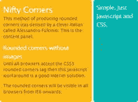

***图 7-1。**JavaScript 应用的圆角*

所见即所得设计程序可能无法正确显示边角。在浏览器中查看页面以查看圆角。

 **注**`files niftyCube.js`和`niftyCorners.css`必须从 Nifty Corners 网站或这本书的网页上下载。将文件包含在包含您的网页的文件夹中。HTML 没有链接到文件`niftyCorners.css`，但是 JavaScript 文件引用了它。本章的文件可以从该书的网页上下载。所有文件都有内部样式，仅供教学使用。

清单 7-1 包含一个内部样式表，仅用于说明目的。

***清单 7-1。【fig1-nifty.html】使用漂亮的边角在面板上创建圆角***

`<!doctype html>
<html lang=en>
<head>
<title>Nifty Corners: Javascript and CSS</title>
<meta charset=utf-8>
<head>

        ****
        **
</head>
<body>

<h1>Nifty Corners</h1>` `
This method of producing rounded corners was devised by a clever Italian 
called Alessandro Fulciniti. This is the content panel. 

<h2>Rounded corners without images</h2>

Until all browsers accept the CSS3 rounded corners tag then this javascript 
workaround is a good interim solution.

The rounded corners will be visible in all browsers from IE6 onwards.

<h2>Simple. Just Javascript and CSS.</h2>

This is another panel which could take a navigation menu

</body>
</html>`

 **注意**每个被赋予圆角的元素必须是带有`id`的`
`，例如`
`。您将无法对带有语义标签的项目进行圆角处理。因为 HTML5 不在乎你用语义标签还是`
` s，这不是问题，用`
` s 就行了，好消息是你也可以很容易的给你现有的 HTML4 和 XHTML 网页加圆角。

在进入使用漂亮边角的更复杂的例子之前，将提供如下一些基本规则:

#### 一般规则

> JavaScript 文件的链接(粗体显示)被插入到`<head></head>`标签中。
> 
> 给定圆角的元素如下所示:
> 
> `Nifty ("#leftcol, #rightcol");`
> 
> 要给两列相同的高度，使用属性`"same-height"`如下:
> 
> ` Nifty("#leftcol, #rightcol","same-height");`
> 
> 如果省略`"same height"`参数，列的高度将与它们各自的内容相匹配。
> 
> 圆角半径:圆角半径的大小由`small`、`normal`或`big`指定。当没有指定大小时，默认为`normal`。
> 
> 对于大半径和相同高度的列，属性如下:
> 
> ` Nifty("#leftcol, #rightcol","same-height big");`
> 
> 除右上角外，所有角的半径都很大
> 
> ` Nifty("#leftcol", "tl bottom big");`
> 
> 这意味着给左上角和两个底角一个大的半径。右上角没有提到，所以它没有得到半径。
> 
> 对于除左上角之外的所有角上的大半径
> 
> ` Nifty("#leftcol", "tr bottom big");`
> 
> 这意味着给右上角和两个底角一个大的半径。左上角没有提到，所以它没有得到半径。
> 
> 对于除右下角之外的所有角上的大半径
> 
> ` Nifty("#leftcol", "bl top big");`
> 
> 这意味着给左下角和两个顶角一个大的半径。右下角没有提到，所以它没有得到半径。

### 带有圆形边框的网页

客户越来越多地要求网页上的圆形边框具有现代感。Nifty Corners 提供了一个易于实现的简洁解决方案。图 7-2 中的显示了白色框架上的圆角和框架内的一些角。

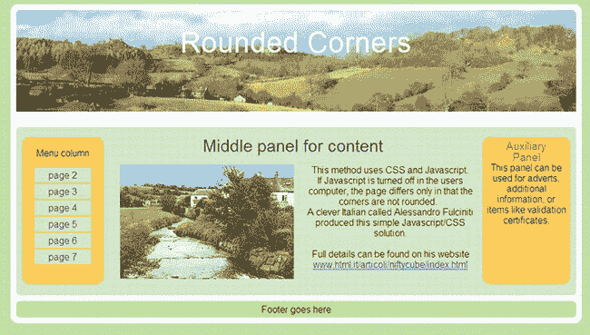

***图 7-2。**显示圆角元素边框的整页*

 **注意**`<h1>`框的高度必须等于页眉图像的高度，减去任何顶部和底部的填充。中间面板(`midcol`)必须略高于侧柱。不要在中间面板上添加圆角，因为这会导致中间面板在 Internet Explorer 8 中低于外部列。

清单 7-2 将漂亮的边角应用到有栏和边框的复杂页面上。

***清单 7-2。【fig2-nifty.html】在复杂页面中创建圆角***

`<!doctype html>
<html lang=en>
<head>
<title>A whole page with rounded corners</title>
<meta charset=utf-8>

**        **
**        **
</head>
<body>

 <h1>Rounded Corners</h1>

 

 

 Menu column 
        <ul class="nav">
                <li><a class="navbtn" href="#">page 2</a></li>
                <li><a class="navbtn" href="#">page 3</a></li>
                <li><a class="navbtn" href="#">page 4</a></li>
                <li><a class="navbtn" href="#">page 5</a></li>
                <li><a class="navbtn" href="#">page 6</a></li>
                <li><a class="navbtn" href="#">page 7</a></li>
</ul> 

<h2>Auxiliary Panel</h2>

This panel can be used for adverts, additional information, or items like 
validation certificates.

<h2>Middle panel for content</h2>

 

 ` `

This method uses CSS and Javascript. If Javascript is turned off in the 
users computer, the page differs only in that the corners are not rounded.&nbsp;&nbsp;

A clever Italian called Alessandro Fulciniti produced this simple 
Javascript/CSS solution.  Full details can be found on his website
<a href="http://www.html.it/articoli/niftycube/index.html">
        www.html.it/articoli/niftycube/index.html</a>

 

Footer goes here

</body>
</html>`

 **注**菜单链接显示为`href="#"`。当然，这些必须更改为链接到您的页面。

### 带有圆形边框和圆形面板的网页

圆形边框可以扩展到页面边框内的项目，以给页面设计带来一致的感觉。图 7-3 是一个带有圆形边框和圆形内部面板的页面截图。

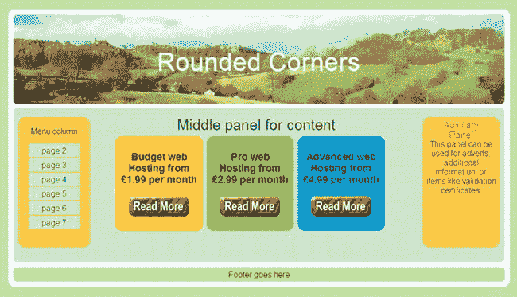

***图 7-3。**包含三个通过无序列表定位的报价的页面。“阅读更多”按钮是带有指向相应页面的超链接的图像。*

清单 7-3 将漂亮的边角应用到页面上，给出了圆形的边框和三个圆形的内部面板。

***清单 7-3。【fig3-nifty.html 在内部面板上创建圆角***

`<!doctype html>
<html lang=en>
<head>
<title>A whole page with rounded corners and rounded panels</title>
<meta charset=utf-8>

**        **
**        **
</head>
<body>

<h1> Rounded Corners</h1>

 

 

         Menu column 
        <ul id="nav">
                <li><a class="navbtn" href="page2.html">page 2</a></li>
                <li><a class="navbtn" href="page3.html">page 3</a></li>
                <li><a class="navbtn" href="page4.html">page 4</a></li>
                <li><a class="navbtn" href="page5.html">page 5</a></li>
                <li><a class="navbtn" href="page6.html">page 6</a></li>
                <li><a class="navbtn" href="page7.html">page 7</a></li>
        </ul> ` `

<h2>Auxiliary Panel</h2>

This panel can be used for adverts, additional information, or items like 
validation certificates.

<h2>Middle panel for content</h2>
<ul id="about">
    <li id="adv1"><h3>Budget web Hosting from &pound;1.99 per month</h3> 
     </li>
    <li id="adv2"><h3>Pro web Hosting from &pound;2.99 per month</h3> 
    </li>
    <li id="adv3"><h3>Advanced web Hosting from &pound;4.99 per month</h3> 
    </li>
</ul>
 

 

Footer goes here

</body>
</html>`

### 标签菜单上漂亮的角落

圆形菜单标签非常流行，以前实现起来很棘手，因为它们需要几个带有透明角的图像。Nifty Corners 提供的简单解决方案如图图 7-4 所示。我把列表和完整的解释放在了第四章(滚动菜单上)我觉得它应该在的地方。

***图 7-4。**使用漂亮边角的圆形标签*

接下来的部分着眼于新的 CSS3 圆角模块，这不需要 JavaScript，但在 IE 7 和 IE 8 中圆角元素将默认为方角。

### CSS3 圆角模块

CSS3 border-radius 模块在块元素(包括图像)上创建圆角，并且不需要 JavaScript。它还消除了对图像和多个

标签的需求。请在 http://www.css3.info/preview 查看 W3C 关于这个模块的最新细节。

截至 2011 年 11 月，以下浏览器支持 CSS3 圆角:- Opera、Safari 和 Chrome。新版 Mozilla Firefox 支持 CSS3 边框半径；旧版本需要前缀`-moz-`。Internet Explorer 9 支持 CSS3 边框半径标记。IE 9 仅适用于 Vista 和 Windows 7。在 Windows XP、IE 6、IE 7 和 IE 8 中，边角不会变圆。JavaScript 解决方案适用于 IE 6、IE 7 和 IE 8。

图 7-5 显示了在彩色面板的每个角上使用 CSS3 圆角的结果。

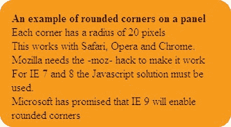

***图 7-5。**彩色面板上的圆角*

这是一个最简单的盒子模型，它适用于除 IE 6、IE 7 和 IE 8 之外的所有浏览器。只有支持版本 5 之前的 Mozilla Firefox 才需要项目`-moz-border-radius:20px;`。

在这个项目中，彩色面板的所有四个角都用相同的半径圆化(内部样式表仅用于演示；它通常是一个外部样式表)。在列表 7-5 中，圆角代码以粗体显示。一些填充是必要的，以防止内容从角落突出。

***清单 7-5。【fig5-four-identical-on-panel.html】在矩形上创建圆角***

`<!doctype html>
<html lang=en>
<head>
<title>Four identical corners on a coloured panel Fig. 5</title>
<meta charset=utf-8>
        *meta content goes here*

</head>
<body>

&nbsp;

<strong>An example of rounded corners on a panel</strong> 
Each corner has a radius of 20 pixels This works with Safari, Opera and Chrome. Mozilla
currently requires the -moz- hack to make it work For IE 7 and 8 the Nifty Corners
Javascript solution must be used.  Microsoft has promised that IE 9 will enable 
rounded corners

` `</body>
</html>`

图 7-6 显示了带圆角的彩色面板周围的黑色边框。

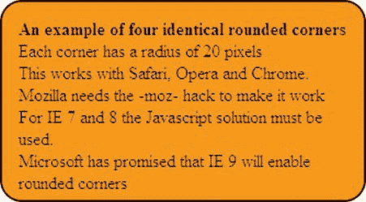

***图 7-6。**黑色边框的彩色面板*

在清单 7-6 中，黑色边框是用粗体显示的代码添加的..只有支持版本 5 之前的 Mozilla Firefox 才需要项目`-moz-border-radius:20px;`。

***清单 7-6。【fig6-panel-blackbdr.html】用黑色边框将矩形的角变圆***

`<!doctype html>
<html lang=en>
<head>
<title>Coloured panel with black border Fig. 7-6</title>
<meta charset=utf-8>
        *meta content goes here*

</head>
<body>

&nbsp;

<strong>An example of four identical rounded corners</strong> 
Each corner has a radius of 20 pixels This works with Safari, Opera and Chrome.
Mozilla needs the -moz- hack to make it work For IE 7 and 8 the Nifty Corners Javascript
solution must be used.
 Microsoft has promised that IE 9 will enable rounded corners

</body>
</html>`

图 7-7 显示了文本块周围的黑色边框。

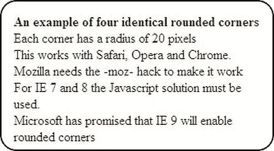

***图 7-7。**一块文字上的圆角*

清单 7-7 用相同的半径对文本块的四个角进行圆角处理(内部样式表仅用于演示，通常是外部的)。只有支持版本 5 之前的 Mozilla Firefox 才需要项目`-moz-border-radius:20px;`。

***清单 7-7。【fig7-four-rounded-text.html】对文本块应用 CSS3 圆角**(**)***

`<!doctype html>
<html lang=en>
<head>
<title>Text box with four rounded corners</title>
<meta charset=utf-8>
meta content goes here

</head>
<body>

&nbsp;

<strong>An example of four identical rounded corners</strong> 
Each corner has a radius of 20 pixels This works with Safari, Opera and Chrome. 
Mozilla needs the -moz- hack to make it work For IE 7 and 8 the Javascript solution 
must be used.  IE 9 has promised it will work with rounded corners

</body>
</html>`

 **注**下一个 CSS3 边框半径项目有`-moz` hacks。久而久之，Mozilla Firefox 将不需要`–moz`黑客。尝试注释掉黑客，偶尔用 Mozilla Firefox 测试代码。黑客将允许支持旧版本的 Firefox，现代版本应该会忽略这一点。

CSS3 标记可以为每个角指定不同的半径。CSS3 规范给出了在每个角上创建不同半径的两种方法。第一种方法如下:

**方法一。**

`                    #box-1 { border: *size color* solid;
                    border-top-left-radius: *size*;
                    border-top-right-radius: *size*;
                    border-bottom-right-radius: *size*;
                    border-bottom-left-radius: *size*;
                    }`

用像素或百分比替换单词 *`size`* 。百分比与盒子的相应尺寸有关；换句话说，在一个 200 像素见方的盒子上，10%的半径将给出 20 像素的角半径。

然而，Mozilla Firefox 目前并不理解这一点，即使有了`-moz-` hack。Mozilla 确实理解这种方法的一种变体，下面用粗体表示。

`#box-1 { border: *size color* solid;
        border-top-left-radius: size; **-moz-border-radius-topleft: size;**
        border-top-right-radius: size; **-moz-border-radius-topright: size;**
        border-bottom-right-radius: size; **-moz-border-radius-bottomleft: size;**
        border-bottom-left-radius: size; **-moz-border-radius-bottomright: size;**
        }`

但是，Mozilla、Safari 和 Chrome 确实理解速记方法(第二种方法)，如下所示:

**方法二。**

`                    #box-1 { border: *size color* solid;
                    border-radius: *size size size size*;
                    }`

标记从左上角开始按顺时针顺序指定框角半径，如下所示:

`                top left, top right, bottom right, bottom left`

每个角可以有不同的半径。 图 7-8 显示了一个有两个像素宽的黑色边框的面板。该面板的左上角半径为 30 像素，右上角半径为 20 像素，右下角半径为零，左下角半径为 10 像素。

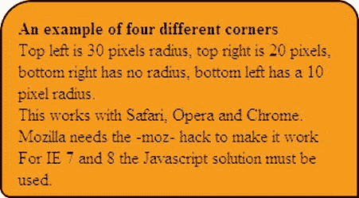

***图 7-8。**四个不同的角落使用速记代码*

清单 7-8 使用 CSS3 将选择的圆角应用到一个彩色面板上。在 IE 7 和 IE 8 中查看时，矩形会有尖角。

***清单 7-8。**用 CSS3 圆角应用各种转角**(【fig8-panel-4diff.html】??)***

`<!doctype html>
<html lang=en>
<head>
<title>Fig. 8 Panel with four different rounded corners</title>
<meta charset=utf-8>
        meta content goes here

</head>
<body>

&nbsp;

<strong>An example of four different corners</strong> 
Top left is 30 pixels radius, top right is 20 pixels, bottom right has no radius, 
bottom left has a 10 pixel radius. This works with Safari, Opera and Chrome. Mozilla 
needs the -moz- hack to make it work For IE 7 and 8 the Nifty Corners Javascript 
solution must be used.  

</body>
</html>`

### 带 CSS3 的椭圆角

使用两个尺寸值可以创建椭圆拐角。创建椭圆拐角需要两个半径。在下面的代码片段中，第一个大小固定垂直半径(30 像素)，第二个大小(15 像素)固定水平半径。为了记住顺序，我使用了助记符 **V** 值 **H** int(垂直然后水平)。

`     #box-1 { border-top-left-radius: 30px 15px; }
     #identifier { border-*top/bottom*-*left/right*-radius: *vertical size*  *horizontal size*; }`

图 7-9 显示了各种椭圆拐角。

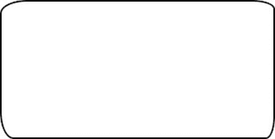

***图 7-9。**四个不同的椭圆角*

清单 7-9 向你介绍 CSS3 椭圆角应用于黑边面板。在 IE 7 和 IE 8 中查看时，面板会有尖角。

***清单 7-9。【fig9-elliptical-corners.html】应用 CSS3 椭圆角的选择***

`<!doctype html>
<html lang=en>
<head>
<title>Box with a different ellipse on each corner</title>
<meta charset=utf-8>
        *meta content goes here*

</head>
<body>

&nbsp;

</body>
</html>`

### 【CSS3 圆角速记规则汇总

CSS3 圆角为快速标记提供了一个简化版本，简化标记的规则如下:

> **规则 A:** 如果一个值为零，那么角将是方形的，而不是圆形的。
> 
> 规则 B: 速记属性可以用来同时定义所有四个角。属性接受由正斜杠分隔的一组或两组值，每组由一个、两个、三个或四个长度或百分比组成。如果提供了所有四个值，顺序将是左上、右上、右下和左下。
> 
> **规则 C:** 第一组值(在正斜杠之前)定义了四个角的垂直半径。
> 
> **规则 D:** 正斜杠后的第二组(可选)值定义了所有四个角的水平半径。
> 
> **规则 E:** 如果只有一组值，这些值同等地确定垂直和水平半径。
> 
> **规则 F:** 如果省略了值，则遵循此规则:如果省略了左下方的维度，则与右上方的维度相同；如果省略了右下的尺寸，它将与左上的尺寸相同。
> 
> **规则 G:** 如果只提供了一个值，则用于相等地设置所有四个半径。

以下是一些例子:

`#box-1 { border-radius: 10px 15px 10px 15px / 15px 10px 15px 10px;`(四个椭圆角)

`#box-1 { border-radius: 10px`；(四个相同的圆角)

现在是真正的大脑弯曲:

`#box-1 { margin:auto; text-align:center; border:30px #FFCC66 solid; width:250px; 
height:150px; border-radius: 10px 20px/**20px**;
}`

在“brain bender”代码中，角半径可以翻译如下:所有角的水平半径为 20 像素，由正斜杠(粗体显示)后的单个大小决定。左上角被修改了 10 个像素的垂直半径，因此它是椭圆形的。

第二维度(20 像素)使右上角的水平半径为 20 像素，因为它已经具有 20 像素的垂直半径。它不是椭圆，但该角具有 20 像素的简单半径。

规则 F 起作用是因为只有两个维度被给定在正斜杠的左边。这使得右下角与左上角相同。规则 F 也使左下角与右上角相同。结果看起来像图 7-10 。

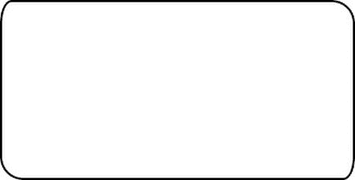

***图 7-10。**用尽可能简短的标记创建圆角和椭圆角*

清单 7-10 使用 CSS3 在面板上选择圆角和椭圆。在 IE 7 和 IE 8 中查看时，矩形会有尖角。

***清单 7-10。【fig10-brain-bender.html】使用速记应用 CSS3 圆角和椭圆***

`<!doctype html>
<html lang=en>
<head>
<title>Fig. 10 Brain bender shorthand</title>
<meta charset=utf-8>
        *meta content goes here*

</head>
<body>

&nbsp;

</body>
</html>`

我们现在将演示 CSS3 圆角在标签菜单中的应用

### 使用 CSS3 的圆角标签

带有圆形标签的菜单非常流行，以前很难实现。下面列出了 CSS3 圆角边框模块提供的简单解决方案，最终结果如图 7-11 所示。该模块在 IE 7 和 IE 8 中不工作，但它优雅地后退，如图图 7-12 所示。

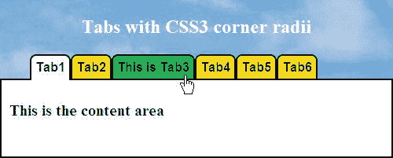

***图 7-11。** CSS3 选项卡菜单上的圆角*

图 7-11 中的 CSS3 圆形标签可以在 Mozilla Firefox、Safari、Opera 和 Chrome 中使用，但不能在 IE 6、IE 7 或 IE 8 中使用。稍后我们将使用一个有条件的 IE 样式表作为方形角的后备(见图 7-13 )。IE 9 应该显示圆角。在图 7-11 中，第一页的页签被选中，变成白色并与内容面板合并。当鼠标悬停在选项卡上时，选项卡会改变颜色。光标显示为悬停在标签 3 上。

 **注意**标签 3 比其他的都长。标签会自动放大或缩小以适应文本。

活动元素从一页到另一页改变以匹配活动页面，活动元素在清单 7-11a 中以粗体显示。HTML 清单 7-11a 是图 7-11 、 7-12 和 7-13 的标记。有条件的后退链接(粗体显示)将允许使用 IE 7 和 IE 8 进行可接受的显示，但标签角会很尖。

***清单 7-11a。【fig11-css3-tabs-rounded.html】用 CSS3 创建圆形标签***

`<!doctype html>
<html lang=en>
<head>
<title>CSS3 rounded tabs</title>
<meta charset=utf-8>
        *meta content goes here*
<link href="css3-tabs.css" rel="stylesheet" type="text/css">
        **<!--[if lte IE 8]>**
        **<link href="css3-tabs-ie.css" rel="stylesheet" type="text/css">**
        **<![endif]-->**
</head>
<body>

<h1>Tabs with CSS3 corner radii</h1>

        <ul>
        <li><a class="tab" **id="activelink"** href="#">Tab1</a></li>
        <li><a class="tab" href="#">Tab2</a></li>
        <li><a class="tab" href="#">This is Tab3</a></li>
        <li><a class="tab" href="#">Tab4</a></li>
        <li><a class="tab" href="#">Tab5</a></li>
        <li><a class="tab" href="#">Tab6</a></li>
        </ul>

<h2>This is the content area</h2>
 

</body>
</html>`

 **注意**每个`href="#"`当然必须被你的页面的 URL 所取代。必须在每个页面上更改活动链接的`id`以匹配页面。例如，在第 5 页上，活动链接的 id 将出现在第 5 页链接的旁边，即`<li><a class="tab" **id="activelink"** href="#">Tab5</a></li>`，在该页上，第一个选项卡将变成`<li><a class="tab" href="#">Tab1</a></li>`。图 7-13 显示了结果。

清单 7-11b 是图 7-11 中所示圆形标签菜单的 CSS3 样式表。

***清单 7-11b。**为清单 7-11a (css3-tabs.css)* 创建 CSS 标记

`#header { width:500px; height:100px; background-image:url('img/bluepan.jpg'); 
background-repeat:no-repeat; background-position:center; color:white; text-align:center;
margin-bottom:-27px;
}
h1 { font-size:150%; font-weight:bold; padding-top:20px;
}
h2 { font-size:125%;
}
#nav ul {width:400px; position:relative; top:-14px;
}
ul li { text-decoration:none; display:inline;
}
ul li a.tab { font-family:Arial; color:black; font-size :medium; font-weight:bold; 
background-color:#ffff00; 
**/*-moz-border-radius-topleft:8px;É-moz-border-radius-topright:8px;*/**
border-top-left-radius:8px; border-top-right-radius:8px; border:2px solid black; 
padding:5px; padding-bottom:5px;margin :-2px; text-decoration:none; border-bottom:none;
}
.tab:hover { background-color:lime; color:black;
}
#activelink {background-color:white; border-bottom:0; padding-bottom:7px;
}
#content {margin-top:-25px; padding:10px; width:476px; border:2px solid black;
}`

 **注意**CSS 样式表中粗体显示的注释掉的行清单 7-11b 对于 Mozilla Firefox 以后的版本是不需要的。粗体文本中的项目现在可以省略，但是如果你也想迎合 Firefox 的早期版本，请删除注释符号。

图 7-12 显示了选择 tab5 时的菜单。

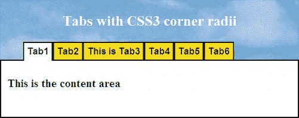

***图 7-12。**第五页的标签已经被选中*

图 7-13 显示了标签菜单在 IE 7 和 IE 8 中是如何出现的。

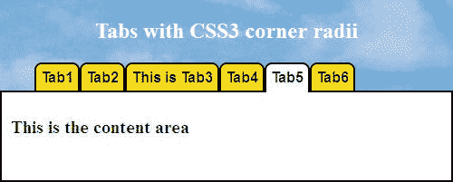

***图 7-13。**IE 7 和 IE 8 中的标签有方角*

由于在清单 7-11a 中包含了 IE 条件，条件 CSS 标记清单 7-13 在 IE 7 和 IE 8 中给出了可接受的显示，如图图 7-13 所示。然而，标签将有方角。

清单 7-13 中的条件 CSS 对一些元素的边距进行了调整。

清单 7-13 显示了 IE 条件 CSS。

***清单 7-13。**允许 IE 7 和 IE 8 可接受的标签菜单的条件 CSS(css3-tabs-IE . CSS)*

`#header { margin-bottom:-25px;
}
#content {margin-top:-25px;
}`

### 总结

在这一章中，你学习了如何使用 Alessandro Fulciniti 的简单 JavaScript 解决方案在盒子(面板)上创建圆角。然后，这种技术被应用到整个网页的边框和面板上。然后向您介绍了应用于盒子的 CSS3 圆角；介绍了这种技术的全部可能性。最后，您学习了如何将 CSS3 圆角应用于选项卡菜单。

在下一章中，你会发现如何将投影应用到图像和文本块上，使它们看起来漂浮在页面上。你也可以看到如何用阴影包围一个网页。然后将向您介绍将 CSS3 投影应用到图像、文本框和文本的项目。